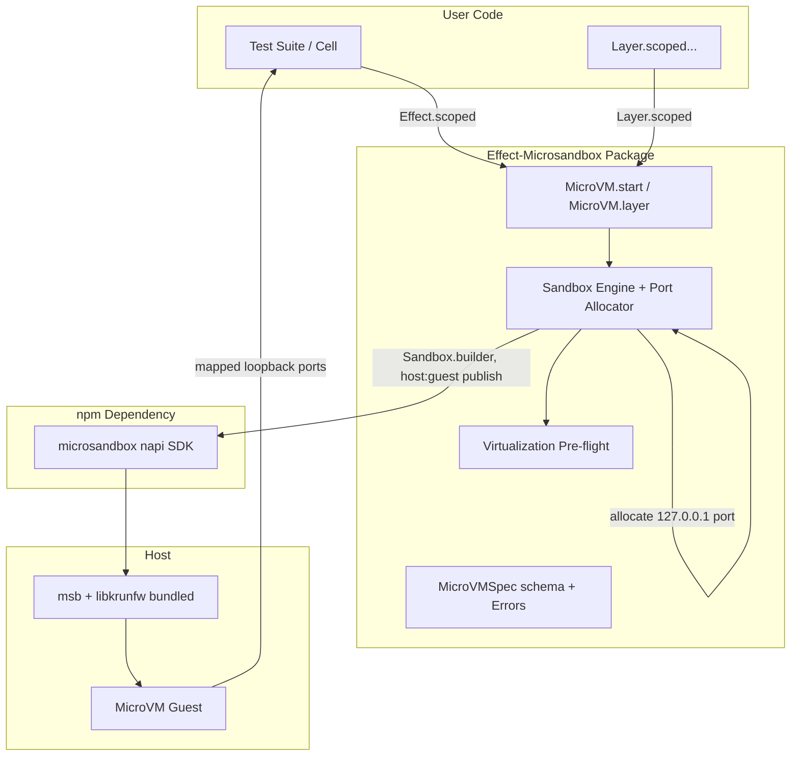

## Goal Capsule

- **Objective:** Developers running integration tests in Effect-TS can declare container dependencies as pure data and acquire hardware-isolated microVMs governed by native Scope and Layer lifecycles, requiring zero local or CI Docker daemons.
- **Means:** A pure-core Effect library over the `microsandbox` npm package (napi SDK, which bundles the msb runtime and libkrunfw per platform), targeting microVMs exclusively with no Docker path (KTD2).
- **Product Authority:** Covers the pure container specification, microVM lifecycle, wait strategies, and Effect Scope/Layer bindings. Docker backends and pre-packaged service modules (Postgres, Redis, Kafka) are explicitly excluded from this core package.
- **Open Blockers:** None.
- **Execution Profile:** Standard — 7 implementation units across one new workspace package.

---

## Product Contract

Product Contract preservation: restructured, no scope change — R7's mechanism reworded (npm-bundled runtime replaces hand-rolled GitHub download per review evidence), R10 strengthened with a fail-closed loopback qualifier, AE1 reworded to name the library-owned port allocator, AE1 coverage trimmed to R3/R10, Key Decisions re-prefixed KD1–KD5 to disambiguate from Planning Contract KTDs, and KD Governs links re-pointed (KD1→R6/R7/R8, KD2→R1/R2, KD3→none, KD4→R3/R4/R5, KD5→R9). No requirement was added, dropped, or weakened in intent.

### Summary

An Effect-native integration test container library built exclusively on hardware-isolated microVMs (`microsandbox`). It models container specifications as pure data structures and orchestrates microVM lifecycle natively through Effect `Scope` and `Layer`, with the msb runtime delivered through npm platform packages — no external system dependencies, no Docker daemons.

### Problem Frame

Integration testing traditionally incurs the heavy tax of Docker daemons, corporate Docker Desktop licensing, and shared-kernel container isolation. `rightsize-node` proved that integration-test containers can run as instant, hardware-isolated microVMs via `microsandbox` on Apple Silicon (Hypervisor.framework), Linux (`/dev/kvm`, present on GitHub Actions `ubuntu-latest` once a udev permission rule is applied), and Windows (WHP).

`rightsize-node` carries significant legacy weight: a parallel hand-rolled Docker unix-socket client, a self-rolled msb provisioning and CLI-wrapping layer, and TC39 `await using` imperative syntax. The `microsandbox` npm package (0.7.x, Apache-2.0) now ships typed napi bindings with per-platform bundled runtimes, so an Effect library can stand directly on the SDK and invest only in what is actually missing: pure-data specs, typed errors, Schedule-driven readiness, and Scope/Layer lifecycle integration.

### Key Decisions

- **KD1.** Microsandbox-only execution (session-settled: user-directed — chosen over Docker fallback: completely eliminates Docker daemon dependencies, socket clients, and protocol bifurcation; targets modern KVM / Hypervisor.framework hardware virtualization). Governs R6, R7, R8.
- **KD2.** Declarative data specifications over mutable builders (session-settled: user-directed — chosen over fluent builder: aligns with pure-core Effect architecture, making specs inspectable and serializable). Governs R1, R2.
- **KD3.** Engine & Lifecycle Core first (session-settled: user-directed — chosen over pre-packaged service modules: focuses on microVM execution, port binding, and Scope management before expanding to service wrappers). No governed R — bounds Scope Boundaries.
- **KD4.** Native Effect `Scope` and `Layer` integration. Governs R3, R4, R5.
- **KD5.** Wait strategies driven by Effect `Schedule` and typed retries. Governs R9.

### Requirements

#### Container Specification and Pure Core

- R1. Container specifications must be defined as immutable, schema-backed data structures (`MicroVMSpec`) representing the target image, environment variables, exposed ports, file mounts, resource limits (vCPU, memory), and wait strategies.
- R2. `MicroVMSpec` combinators must be pure data transformations with zero mutable builder state.

#### Lifecycle and Effect Resource Safety

- R3. Container lifecycle must integrate directly with Effect `Scope`: launching returns an `Effect<RunningMicroVM, MicroVMError, Scope>`, where exiting the scope guarantees stopping the microVM, tearing down network port forwardings, and cleaning guest scratch space.
- R4. Containers must be exportable as composable `Layer`s (`Layer.scoped`), allowing test suites and application cells to inject running services cleanly via Effect dependency injection.
- R5. Fiber interruption must trigger immediate, graceful microVM termination with zero orphaned processes or dangling port bindings.

#### Microsandbox Runtime and Environment

- R6. The engine must interface with the `microsandbox` runtime through its typed npm SDK (`microsandbox` package, napi bindings), never through a Docker client.
- R7. The msb binary and `libkrunfw` library must be available after a plain package install with no user provisioning step — delivered by the SDK's per-platform npm packages, with operator overrides (`MSB_PATH`, `MSB_LIBKRUNFW_PATH`, `MSB_HOME`) honored for externally managed runtimes.
- R8. The host environment must be validated for hardware virtualization (`/dev/kvm` permissions on Linux, `Hypervisor.framework` on macOS Apple Silicon, WHP on Windows) with actionable diagnostic errors.

#### Wait Strategies and I/O

- R9. Readiness checks (HTTP status/path, TCP port availability, log regex matching) must be executed using native Effect `Schedule` loops with configurable timeouts and typed error failures.
- R10. A `RunningMicroVM` handle must provide access to host ports mapped fail-closed to `127.0.0.1` (the library allocates the host port, passes the explicit host:guest mapping to the runtime, and refuses to hand back a port bound outside loopback), in-guest command execution (`exec`), and guest log streams modeled as Effect `Stream`.

### Key Flows

- F1. Scoped microVM lifecycle in a unit/integration test
  - **Trigger:** A test acquires a microVM dependency via `Effect.scoped(MicroVM.start(spec))`.
  - **Actors:** Test runner (Vitest), MicroVM engine, Microsandbox SDK.
  - **Steps:** Engine validates virtualization support; allocates one free loopback host port per exposed guest port; boots the sandbox through the SDK with explicit host:guest mappings under a unique per-process name; evaluates the wait strategy using `Schedule`; yields `RunningMicroVM` to the test scope.
  - **Outcome:** Test performs assertions against mapped ports; when the test fiber exits or fails, the scope finalizer stops and destroys the sandbox and frees the allocated ports.
  - **Covered by:** R1, R3, R5, R9, R10.

- F2. Suite-level Layer provision
  - **Trigger:** A test suite provides a shared database or service as a `Layer`.
  - **Actors:** Vitest / Test runner, Effect Runtime.
  - **Steps:** Effect runtime initializes the layer once for the test suite scope; microVM launches and remains healthy; tests execute concurrently or sequentially; layer scope finalizer tears down the microVM upon suite completion.
  - **Outcome:** Zero container leaks across test runs without manual `beforeAll`/`afterAll` wiring.
  - **Covered by:** R4, R5.

### Acceptance Examples

- AE1. Port acquisition and automatic cleanup in scoped test
  - **Covers:** R3, R10
  - **Given:** A `MicroVMSpec` requesting container port 6379.
  - **When:** Started inside `Effect.scoped`, querying `vm.getMappedPort(6379)`.
  - **Then:** The library binds a free ephemeral port on `127.0.0.1` before boot, publishes it as host:guest to the runtime, and TCP connection succeeds; when the scope closes, the port is unbound and the microVM exits cleanly.

- AE2. Fiber interruption halts microVM without orphan processes
  - **Covers:** R5
  - **Given:** A running microVM inside an active test fiber.
  - **When:** The fiber is interrupted (e.g. test timeout or failure).
  - **Then:** The finalizer runs immediately, escalating stop to forced destroy within a bounded deadline, leaving no guest process, agent peer, or stale sandbox record.

### Scope Boundaries

#### In Scope

- Pure `MicroVMSpec` schema and data-first combinators.
- Native `Scope` and `Layer` lifecycle management with leak-free finalizers.
- Virtualization environment pre-flight checks (`/dev/kvm`, Hypervisor.framework, WHP).
- Library-owned loopback host-port allocation and host:guest mapping.
- Schedule-driven HTTP, TCP, and log-tail wait strategies.
- Effect `Stream`-based guest logs and argv-only guest `exec`.

#### Out of Scope (Deferred for Later)

- Docker daemon support or unix-socket Docker fallbacks (explicit non-goal).
- Specific service module definitions (Postgres, Redis, Mongo, Kafka) — deferred to separate satellite packages.
- Multi-VM complex network alias routing (relying on 127.0.0.1 port mappings for test isolation).

---

## Planning Contract

### Key Technical Decisions

- KTD1. **Workspace package placement** — the library lives at `packages/effect-microsandbox` following the existing `packages/*` glob and naming convention (`@systemfsoftware/effect-*`), mirroring `packages/effect-memfs` (verified present in this workspace).
- KTD2. **Integration via the `microsandbox` npm napi SDK, pinned in the pnpm catalog** — the SDK bundles msb + libkrunfw per platform and exposes typed sandbox lifecycle, exec, filesystem, logs, and port publishing; npm lockfile integrity replaces any hand-rolled download/checksum machinery. Operator-managed runtimes are honored through the SDK's `MSB_PATH` / `MSB_LIBKRUNFW_PATH` / `MSB_HOME` resolution. See Alternatives Considered.
- KTD3. **Library-owned host-port allocation** — the engine binds a free `127.0.0.1` port (platform socket with port 0) per exposed guest port before boot and passes explicit host:guest mappings; `getMappedPort` reads the library's own allocation map, never runtime discovery. Enforced fail-closed per R10.
- KTD4. **Scope-based lifecycle with SDK-managed teardown** — acquisition is `Effect.acquireRelease`; the release finalizer is uninterruptible with a bounded deadline and escalates stop → forced stop → destroy through the SDK (which owns the guest agent peer), guaranteeing no orphaned `msb`/`agentd` processes per R5.
- KTD5. **Pure data `MicroVMSpec`** — no class instances or mutable builders; combinators are functions `MicroVMSpec -> MicroVMSpec` backed by Effect Schema validation, with the image field constrained by a Docker image-reference pattern.
- KTD6. **Wait strategies as `Schedule` loops over real probes** — readiness is `Effect.retry(Schedule)`; the plan notes that a host-side TCP accept is necessary-but-not-sufficient (the port-forward proxy accepts before the guest listens), so HTTP probes and guest log markers are the reliable strategies and TCP is documented as a weak check.
- KTD7. **Deterministic per-process sandbox naming** — every sandbox is named `effect-microsandbox-<pid>-<random>` so teardown is addressable, concurrent Vitest workers never collide, and stale records are removed by the finalizer.

### Alternatives Considered

- **Wrap `rightsize-node` as a dependency** — rejected: it carries the Docker fallback stack, TC39 `await using` imperative lifecycle, and node:test orientation this work explicitly eliminates; wrapping imports the baggage being cut and still leaves no Layer/Scope integration.
- **Wrap the `msb` CLI via process spawning (rightsize's approach)** — rejected: stringly output parsing, shell-out latency per operation, hand-rolled provisioning with circular manifest checksums, and platform asset-selection branching; the napi SDK covers run/exec/logs/ports with typed calls and npm-distributed binaries.
- **Hand-rolled provisioning over `@effect/platform` HttpClient + raw CLI** — rejected: review evidence showed the GitHub-release checksum path verifies integrity against an authenticity root it does not authenticate; npm distribution with lockfile integrity is strictly stronger and deletes ~a unit of code.
- **Chosen:** pure Effect core over the `microsandbox` napi SDK (KTD2), adding only the value the SDK lacks — pure specs, typed errors, Schedule waits, Scope/Layer lifecycle, loopback-fail-closed port mapping.

### High-Level Technical Design



### Output Structure

```text
packages/effect-microsandbox/
  package.json
  tsconfig.json
  tsconfig.build.json
  tsconfig.node.json
  tsdown.config.ts
  vitest.config.ts
  vitest.smoke.config.ts
  oxlint.config.ts
  turbo.json
  README.md
  src/
    MicroVM.ts
    MicroVMSpec.ts
    MicroVMError.ts
    WaitSchedule.ts
    mod.ts
    internal/
      Preflight.ts
      SandboxEngine.ts
      SandboxPlan.ts
  tests/
    smoke.test.ts
  examples/
    redis-scoped.ts
```

### Implementation Constraints

- Must use `@systemfsoftware/tsdown-config` for build and `@systemfsoftware/tsconfig` for compiler options.
- Must export under `exports."@systemfsoftware/source"` for workspace source resolution.
- Pure core (`MicroVMSpec`, wait-strategy descriptors, error schemas) must have no I/O dependencies.
- The `microsandbox` dependency is declared at the pinned version in the pnpm catalog; bumping msb is a one-line catalog change.
- `exec` is argv-only (`ReadonlyArray<string>`); no shell-interpolated command strings cross the guest boundary.
- Per-package `turbo.json` must use `extends: ["//"]` with overrides only, matching existing packages.

### Assumptions

- The `microsandbox` npm package (verified at 0.7.2, Apache-2.0, published 2026-09-17) continues to bundle msb + libkrunfw in its per-platform packages and exposes sandbox create/exec/logs/port-publish through the napi API.
- `packages/effect-memfs` remains in the workspace as the structural exemplar (verified present at plan time).
- The repo's existing `packages/*` structure and toolchain are stable for adding a new package.

### Risks & Dependencies

- **Supply-chain trust model:** binary distribution is delegated to npm (lockfile integrity hashes, optional provenance). The SDK's external-runtime path (`ensureRuntime` / `MSB_PATH`) inherits upstream GitHub-release trust; that path is opt-in and documented, not the default.
- **Port-proxy false-ready:** the msb port-forward proxy accepts host TCP connections before the guest service listens; TCP readiness is a weak check and HTTP/log strategies are preferred (KTD6).
- **Guest image trust:** the image field is opaque; consumers choose images. The library does not verify OCI image provenance.
- **CI KVM permissions:** `/dev/kvm` on hosted runners is `root:kvm` `crw-rw----`; the smoke workflow must install the udev rule (U6) before tests run.
- **Windows WHP** is preview-status upstream; Windows support is best-effort and not a release gate.
- **Concurrent Vitest workers** share the msb state directory; unique naming (KTD7) plus SDK-mediated lifecycle avoids cross-worker record races.

---

## Implementation Units

### U1. Package scaffolding and workspace registration

- **Goal:** Create the `@systemfsoftware/effect-microsandbox` workspace package with correct build, test, and lint wiring.
- **Requirements:** R1, R2 (foundational package must exist to hold pure core).
- **Dependencies:** None.
- **Files:**
  - `packages/effect-microsandbox/package.json`
  - `packages/effect-microsandbox/tsconfig.json`
  - `packages/effect-microsandbox/tsconfig.build.json`
  - `packages/effect-microsandbox/tsconfig.node.json`
  - `packages/effect-microsandbox/tsdown.config.ts`
  - `packages/effect-microsandbox/vitest.config.ts`
  - `packages/effect-microsandbox/vitest.smoke.config.ts`
  - `packages/effect-microsandbox/oxlint.config.ts`
  - `packages/effect-microsandbox/turbo.json`
- **Approach:**
  1. Mirror the structure of `packages/effect-memfs` (same tsdown config shape, exports map with `@systemfsoftware/source`, peer dep on `effect` catalog).
  2. Set `package.json` `name` to `@systemfsoftware/effect-microsandbox`; add `microsandbox` (pinned catalog version) as a runtime dependency and `@effect/vitest`, `@systemfsoftware/*` toolchain packages as dev dependencies.
  3. Add scripts from the exemplar plus `"test:smoke": "vitest run --config vitest.smoke.config.ts"`, keeping `test` hermetic (no virtualization needed).
  4. `turbo.json` uses `extends: ["//"]` with only package-local overrides.
  5. Do not create `src/mod.ts` here; U5 owns the public barrel.
- **Test scenarios:**
  - Test expectation: none — scaffolding; proven by build/typecheck gates below.
- **Verification:** `pnpm --filter @systemfsoftware/effect-microsandbox build` produces `dist/` and passes `api:check`; `pnpm map` lists the package.

### U2. Pure-core MicroVMSpec, wait descriptors, and error schemas

- **Goal:** Implement the pure data container specification, readiness descriptors, and the typed error union with zero I/O.
- **Requirements:** R1, R2, R9 (descriptor shapes only).
- **Dependencies:** U1.
- **Files:**
  - `packages/effect-microsandbox/src/MicroVMSpec.ts`
  - `packages/effect-microsandbox/src/MicroVMSpec.test.ts`
  - `packages/effect-microsandbox/src/MicroVMError.ts`
- **Approach:**
  1. Define `MicroVMSpec` as an Effect Schema struct: `image` (constrained by a Docker image-reference pattern), `env: Record<string,string>`, `ports: ReadonlyArray<number>`, `mounts: ReadonlyArray<{ host: string; guest: string }>`, `memoryMb?: number`, `vCPUs?: number`, `workdir?: string`, `cmd?: ReadonlyArray<string>` (omitted means the image default entrypoint), `waitStrategy?: WaitStrategy`.
  2. Define `WaitStrategy` as a tagged union of pure descriptors — `forHttp(path, port)`, `forPort(port)`, `forLog(pattern)` — with constructors exported as a `Wait` namespace from this module.
  3. Define combinators as pure functions: `withEnv`, `withExposedPorts`, `withMount`, `withMemoryLimit`, `withWaitStrategy`; each returns a new validated `MicroVMSpec`.
  4. Define the error union in `MicroVMError.ts` as Schema.TaggedError variants: `VirtualizationUnsupportedError`, `SandboxBootError`, `WaitTimeoutError`, `ExecError`, `PortAllocationError`, `LoopbackViolationError`.
- **Test scenarios (schema layer — property tests, colocated):**
  - Schema laws (property): every generated valid `MicroVMSpec` round-trips identity through encode/decode; encoding is stable for equal inputs.
  - Combinator purity (property): combinators never mutate their input; env/ports/mounts combinators commute where order is irrelevant.
  - Boundary (deterministic): malformed image string fails the pattern constraint; negative `memoryMb` rejected; omitted `cmd` means image default.
  - Error union (property): each tagged error variant round-trips losslessly.
- **Verification:** Property tests pass; no I/O imports in these modules.

### U3. Virtualization pre-flight and runtime resolution

- **Goal:** Fail fast with actionable diagnostics when hardware virtualization is unavailable, and resolve the msb runtime through the SDK (bundled by default, operator-overridable).
- **Requirements:** R7, R8.
- **Dependencies:** U1, U2.
- **Files:**
  - `packages/effect-microsandbox/src/internal/Preflight.ts`
  - `packages/effect-microsandbox/src/internal/Preflight.test.ts`
- **Approach:**
  1. Before any sandbox operation, check platform capability: readable/writable `/dev/kvm` on Linux (the error names the udev rule or `kvm` group remediation), Hypervisor.framework on macOS ARM64, WHP on Windows; failure is `VirtualizationUnsupportedError` with a concise message and remediation hint (host topology detail goes to `Effect.logDebug`, never the typed error).
  2. Runtime resolution is delegated to the `microsandbox` SDK: bundled platform binaries are the default; `MSB_PATH`/`MSB_LIBKRUNFW_PATH`/`MSB_HOME` operator overrides pass through untouched.
  3. Emit an `Effect.logInfo` on first successful pre-flight per process so CI logs show the resolved runtime path.
- **Test scenarios (decision layer — the capability record → verdict mapping is pure; the OS probe is a thin shell covered by U6):**
  - Decision table: KVM present+writable → ok; present+unreadable → `VirtualizationUnsupportedError` naming the udev/`kvm`-group remediation; absent → same error with the virtualization-disabled remediation.
  - Decision table: macOS ARM64 with Hypervisor.framework → ok; Intel Mac → typed error; Windows without WHP → typed error naming `msb doctor --fix`.
  - Runtime resolution: bundled default selected when no overrides; `MSB_PATH` override wins; partial `MSB_HOME` surfaces the SDK error verbatim.
- **Verification:** Decision-table tests run hermetically; the real probe is exercised by the U6 smoke layer.

### U4. Sandbox engine: port allocation, boot, and scoped teardown

- **Goal:** Boot sandboxes through the SDK with library-owned loopback port mappings and leak-proof teardown.
- **Requirements:** R3, R5, R6, R10.
- **Dependencies:** U2, U3.
- **Files:**
  - `packages/effect-microsandbox/src/internal/SandboxEngine.ts`
  - `packages/effect-microsandbox/src/internal/SandboxPlan.ts`
  - `packages/effect-microsandbox/src/internal/SandboxPlan.test.ts`
- **Approach:**
  1. Keep the engine a thin shell over a pure `SandboxPlan` module: `SandboxPlan` renders a `MicroVMSpec` plus an allocated host-port map into the exact SDK builder arguments (memory `MiB` rendering, cpus, mounts, loopback-pinned host:guest publishes, KTD7 name) and validates that every publish targets `127.0.0.1`.
  2. The shell allocates a free loopback host port per guest port (platform socket bound to port 0, released immediately before boot), records the host→guest map, then boots via the SDK builder.
  3. Acquisition is `Effect.acquireRelease`; the release finalizer is `Effect.uninterruptible` with a bounded deadline, escalating SDK stop → forced stop → destroy so the guest and its agent peer are both reclaimed.
  4. After boot, verify each published host port resolves to a loopback address; any non-loopback binding fails closed with `LoopbackViolationError` and immediate teardown.
  5. Evaluate the spec's wait strategy as an `Effect.retry(Schedule)` probe per KTD6 before yielding the handle.
- **Test scenarios (the shell is an executor — forbidden isolated unit tests; pure rendering is property-tested, the shell is verified by U6):**
  - Rendering (property): every generated spec plus port map renders builder arguments with loopback-only publishes, correct `MiB` rendering, and a name matching the KTD7 shape.
  - Fail-closed (property): any rendered publish outside 127.0.0.0/8 is rejected by `SandboxPlan` validation with `LoopbackViolationError`.
  - Allocation (integration, in-process): two concurrent allocations yield distinct host ports and distinct sandbox names.
  - Shell behavior — boot failure mapping, finalizer escalation, interrupt cleanup — is covered by the U6 e2e journeys, not stubbed here.
- **Verification:** `SandboxPlan` property tests pass hermetically; engine behavior proven end-to-end in U6.

### U5. Public API: MicroVM.start, MicroVM.layer, RunningMicroVM handle

- **Goal:** Expose the ergonomic Effect API consumers call.
- **Requirements:** R3, R4, R5, R9, R10.
- **Dependencies:** U2, U4.
- **Files:**
  - `packages/effect-microsandbox/src/MicroVM.ts`
  - `packages/effect-microsandbox/src/mod.ts`
  - `packages/effect-microsandbox/src/WaitSchedule.ts`
  - `packages/effect-microsandbox/src/WaitSchedule.test.ts`
- **Approach:**
  1. `MicroVM.start(spec): Effect<RunningMicroVM, MicroVMError, Scope>` delegates to the engine inside `Effect.acquireRelease`.
  2. `MicroVM.layer(spec): Layer.Layer<RunningMicroVM, MicroVMError>` wraps `Layer.scoped`.
  3. `RunningMicroVM` exposes `getMappedPort(guestPort)` from the allocation map, `exec(argv: ReadonlyArray<string>): Effect<string, ExecError>` (argv-only; no shell), and `logs: Stream<Uint8Array, MicroVMError>` (bytes; consumers decode; stream ends when the sandbox stops).
  4. `mod.ts` exports the public surface: `MicroVMSpec`, `Wait`, `MicroVM`, `RunningMicroVM`, `MicroVMError` union — no namespace re-exports (api-extractor limitation per the effect-memfs convention).
  5. `WaitSchedule.ts` is the pure decision core mapping a `WaitStrategy` descriptor to its `Schedule` policy (intervals, timeout budget, typed failure) independent of any running sandbox.
- **Test scenarios (handle and lifecycle are forwarding/engine shell — covered transitively by U6; only the pure wait policy earns colocated tests):**
  - Wait policy (property): every generated `WaitStrategy` renders a `Schedule` that terminates within its declared timeout budget and fails with `WaitTimeoutError` on exhaustion.
  - Wait policy (deterministic): `forHttp` retries until the probe succeeds; `forLog` compiles its pattern once at construction.
  - Public behavior journeys — scoped start/teardown, `MicroVM.layer` suite provision (F2), loopback port mapping, argv-literal exec — are asserted in the U6 e2e layer against a real sandbox.
- **Verification:** Public surface passes `api-extractor`; `WaitSchedule` tests pass hermetically.

### U6. End-to-end smoke layer and CI validation

- **Goal:** Prove the library end-to-end on a real microVM, in CI, without Docker.
- **Requirements:** R1–R10.
- **Dependencies:** U5.
- **Files:**
  - `packages/effect-microsandbox/tests/smoke.test.ts`
  - `.github/workflows/` smoke job wiring (reusing existing reusable-checks conventions)
- **Approach:**
  1. This is the sparse e2e layer (seam-only journeys against a real microVM; all matrices delegate downward to U2–U5 property/decision tests). Exactly four journeys:
     - J1: scoped boot — `Effect.scoped(MicroVM.start(alpineSpec))` boots, `exec ["echo","hello"]` returns output, mapped port verifies loopback, scope close leaves no sandbox record (AE1).
     - J2: interrupt — fiber interrupted mid-run; finalizer escalates stop→destroy within the deadline; no guest, agent peer, or stale record remains (AE2).
     - J3: layer provision — `MicroVM.layer(spec)` provides the service across two sequential tests in one suite scope and tears down once at suite close (F2).
     - J4: fail-closed — a spec whose rendered mapping violates loopback raises `LoopbackViolationError` and boots nothing.
  2. Smoke tests live behind `vitest.smoke.config.ts` and self-skip when the pre-flight capability probe fails, so hermetic `pnpm test` never requires virtualization.
  3. The CI job adds the mandatory KVM permission step before running smoke (verbatim): write `KERNEL=="kvm", MODE="0666"` to `/etc/udev/rules.d/99-kvm.rules`, then `udevadm control --reload-rules` and `udevadm trigger`.
- **Test scenarios:**
  - The four journeys above pass locally on a KVM/Hypervisor-capable machine.
  - CI job green on `ubuntu-latest` with the udev step; red without it proves the gate is real.
- **Verification:** `pnpm --filter @systemfsoftware/effect-microsandbox test:smoke` runs all four journeys green; CI green.

### U7. Package README, runnable example, and release intent

- **Goal:** Make the package adoptable: README with quickstart, a runnable scoped example, and a changeset.
- **Requirements:** Supports the Goal Capsule objective (external adopters).
- **Dependencies:** U5.
- **Files:**
  - `packages/effect-microsandbox/README.md`
  - `packages/effect-microsandbox/examples/redis-scoped.ts`
  - `.changeset/` entry per repo release rules
- **Approach:**
  1. README leads with the `Effect.scoped(MicroVM.start(...))` quickstart and the `MicroVM.layer` suite-provision pattern; documents pre-flight errors and the `MSB_PATH` override.
  2. Example boots Redis and asserts a ping through the mapped port.
  3. Changeset records the initial minor release with consumer-observable facts only.
- **Test scenarios:**
  - Test expectation: none — documentation; the example is exercised by the U6 smoke conventions if promoted to a test later.
- **Verification:** README quickstart matches the actual exported API surface (checked against `mod.ts`).

---

## Verification Contract

| Gate                  | Command                                                         | Applies to     | Done signal                                                                   |
| --------------------- | --------------------------------------------------------------- | -------------- | ----------------------------------------------------------------------------- |
| Build                 | `pnpm --filter @systemfsoftware/effect-microsandbox build`      | All units      | `dist/` emitted, `api:check` passes                                           |
| Typecheck             | `pnpm --filter @systemfsoftware/effect-microsandbox typecheck`  | All units      | `tsc --noEmit` exits 0                                                        |
| Unit tests (hermetic) | `pnpm --filter @systemfsoftware/effect-microsandbox test`       | U2, U3, U4, U5 | Vitest exits 0 with no virtualization required                                |
| Smoke integration     | `pnpm --filter @systemfsoftware/effect-microsandbox test:smoke` | U6             | Alpine microVM boots, exec returns, no sandbox record remains after interrupt |
| Lint                  | `pnpm --filter @systemfsoftware/effect-microsandbox lint`       | All units      | Oxlint exits 0                                                                |
| Workspace chain       | `pnpm check:local`                                              | All units      | Exits 0                                                                       |
| CI                    | `gh pr checks --watch --fail-fast`                              | U6             | GitHub Actions green with the udev KVM step                                   |

---

## Definition of Done

- **Global:** `pnpm check:local` exits 0; the new package builds, tests, and lints without errors; no Docker daemon or hand-run installer is required at any point; abandoned-attempt code from rejected approaches (CLI wrapping, self-provisioning) is absent from the diff.
- **U1:** Package exists in the workspace map, builds in isolation, and defines both hermetic `test` and gated `test:smoke` scripts.
- **U2:** `MicroVMSpec` round-trips, combinators are pure, image strings are pattern-validated, and the error union covers every failure mode named in the units.
- **U3:** Pre-flight fails fast with remediation-named errors; runtime resolution honors operator overrides without falling back silently.
- **U4:** Engine boots through the SDK with library-allocated loopback ports, unique names, and finalizer teardown that leaves no guest, agent, or stale record.
- **U5:** Public API exposes `start`, `layer`, `Wait`, handle methods, and the typed error union; exec is argv-only.
- **U6:** Smoke test proves boot, exec, port mapping, and interrupt cleanup on CI without Docker; hermetic tests never require virtualization.
- **U7:** README quickstart and example match the shipped API; changeset present.

---

## Open Questions

- Deferred to implementation: whether the SDK's port-publish call accepts an explicit loopback host bind directly or the fail-closed verification in U4 must read the bound address after boot — either satisfies R10, but U4's approach notes the verification point.
- Deferred to implementation: exact end-of-stream semantics for `logs` when the sandbox stops mid-stream — U5 documents the contract (stream ends on stop); the SDK event shape decides the mechanism.
