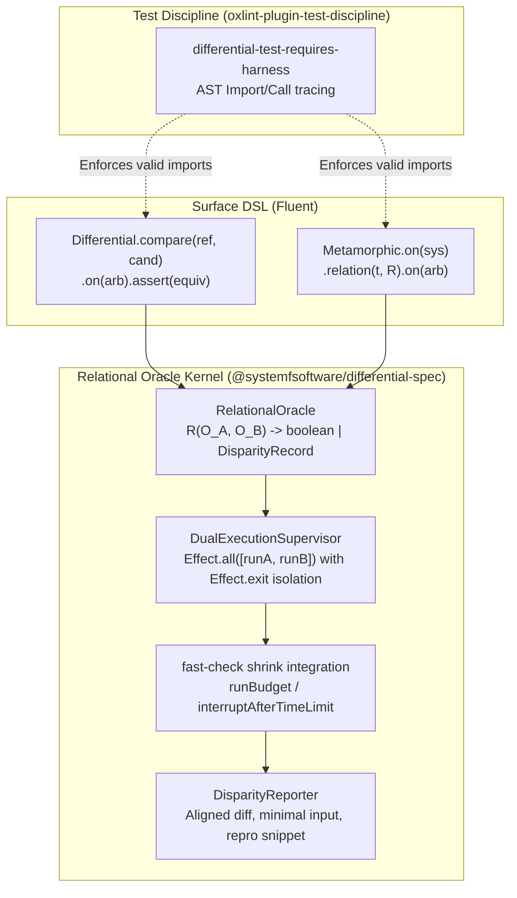

## Goal Capsule

- **Objective:** Provide a first-class differential and metamorphic testing capability in the workspace via a dedicated package `@systemfsoftware/differential-spec` and recognized outside-`src` test altitude `*.differential.test.ts` enforced by `oxlint-plugin-test-discipline`.
- **Means:** Author `@systemfsoftware/differential-spec` (pure relational core, dual-execution supervisor, disparity reporter, and fluent surface builders) and update `packages/oxlint-plugin/oxlint-plugin-test-discipline` to sanction `*.differential.test.ts` in package `tests/` directories with dedicated runner integrity checks.
- **Product Authority:** User confirmed; grounded in John Hughes' property taxonomy (_How to Specify It!_), T.Y. Chen's metamorphic testing foundation (IEEE/ACM), and repository testing invariants.
- **Open Blockers:** None.

---

## Product Contract

### Summary

This feature introduces `@systemfsoftware/differential-spec`, an Effect-native DSL harness for differential and metamorphic testing, and expands the repository's test discipline rules to sanction `*.differential.test.ts` files under `tests/`. It enables engineers and agents to prove implementation parity, cross-runtime equivalence, and metamorphic input-output relations without synthesizing artificial expected values or violating Gherkin integration AST gates.

### Problem Frame

Tests authored by LLMs or engineers frequently devolve into tautological change-detectors that hardcode synthetic expected values, testing nothing durable and failing silently across refactors.

Differential testing (comparing two implementations or runtimes $S_A(x)$ vs $S_B(x)$) and metamorphic testing (verifying relation $R(S(x), S(t(x)))$ under input mutation $t$) provide objective, unfalsifiable oracle gates. In John Hughes' taxonomy (_How to Specify It!_), model-based testing and metamorphic testing rank as the two most powerful bug-finding property styles overall. However, the repository's test discipline currently creates an impasse:

1. `test-suffix-outside-src` forbids all test files outside `src/` except `*.integration.test.ts`.
2. `behaviour-test-requires-gherkin` mandates that every `*.integration.test.ts` must use `makeFeature` and forbids test runner imports (`it`, `test`, `describe`).
3. `property-file-purity` bans `fast-check` outside `*.property.test.ts`, while `no-test-file-in-src` bans all test files under `src/` except `<stem>.workflow.property.test.ts`.
4. In-source testing (`if (import.meta.vitest)`) strictly requires testing private module helpers via `it.prop`, whereas differential testing is inherently an inter-entity concern comparing public surfaces or environments.

Without a sanctioned `*.differential.test.ts` altitude, differential and metamorphic testing cannot legally exist in the repository.

### Key Decisions

- **KD1. Sanction `*.differential.test.ts` as a recognized outside-`src` test altitude** (session-settled: user-directed — chosen over overloading `*.integration.test.ts`: differential suites require property-based generative runners and disparity reports that conflict with Gherkin AST invariants). Governs R1, R2, R3, R4.
- **KD2. Pure Relational Oracle Kernel with Surface Profiles** (session-settled: user-approved — chosen over monolithic single-function DSL or disconnected packages: unifies dual execution, error trapping, and shrinking while maintaining distinct ergonomic builders for Differential and Metamorphic workflows). Governs R5, R6, R7, R8.
- **KD3. In-source test rules remain untouched** (session-settled: user-directed — chosen over allowing differential runners in-source: differential testing is an inter-entity concern that belongs at the package/public surface altitude outside `src/`, while in-source tests remain strictly for private module invariants). Governs R9, R10.

### Destructive Review & Assumptions

#### Surfaced Assumptions

1. **Runner Independence Assumption:** Assumes `fast-check` and `@effect/vitest` can run generative properties inside an outside-`src` file without Vitest config project mismatches or global pollution.
2. **Oracle Completeness Assumption:** Assumes differential and metamorphic relations can express all desired parity criteria without falling back to arbitrary imperative assertions.
3. **AST Boundary Assumption:** Assumes the oxlint parser can reliably differentiate `@systemfsoftware/differential-spec` builder calls from raw test calls without false positives.

#### Mutation Lens: Edge-First

- **Failure 1 (Runner clash):** If `fast-check` executes in an environment that intercepts uncaught defects (like Vitest's unhandled rejection listener), an intentional failure in candidate $S_B$ could kill the runner process before the disparity reporter can run. _Resolution:_ The supervisor wraps both targets with `Effect.exit` and converts defects to typed `DisparityRecord` values.
- **Failure 2 (Shrinker timeout on dual execution):** Running two heavy targets during test-case reduction can trigger test runner timeouts. _Resolution:_ The core harness implements a dual-execution budget (`runBudget`, `interruptAfterTimeLimit`) per `fast-check` best practices.
- **Failure 3 (Accidental file nesting):** An author might attempt to colocate `*.differential.test.ts` inside `src/`. _Resolution:_ `no-test-file-in-src` and `test-suffix-outside-src` explicitly report and reject any differential test placed under `src/`.

### Requirements

#### Test Discipline & Lint Governance

- R1. `packages/oxlint-plugin/oxlint-plugin-test-discipline/src/rules/path.config.ts` exports `DIFFERENTIAL_SUFFIX = '.differential.test.ts'` and includes it in `SANCTIONED_OUTSIDE_SRC_SUFFIXES`.
- R2. `test-suffix-outside-src` permits both `*.integration.test.ts` and `*.differential.test.ts` inside package `tests/` directories.
- R3. A dedicated oxlint rule `differential-test-requires-harness` enforces that `*.differential.test.ts` files must import and invoke `@systemfsoftware/differential-spec` (e.g. `Differential.compare` or `Metamorphic.on`) and forbids raw runner assertions without a differential oracle.
- R4. `property-file-purity` permits `fast-check` imports and generative property assertions in `*.differential.test.ts` files.

#### Differential Spec Package (`@systemfsoftware/differential-spec`)

- R5. The core kernel provides `RelationalOracle<InputA, InputB, OutputA, OutputB>` representing relations $R(O_A, O_B) = \text{boolean | DisparityRecord}$.
- R6. The execution engine runs dual targets with defect isolation, safely capturing uncaught exceptions and Effect defects via `Effect.exit` so one target crashing produces a structured discrepancy rather than aborting test execution.
- R7. The harness integrates with `fast-check` to shrink counterexamples across dual executions down to the minimal reproducing input within a bounded run budget.
- R8. When an oracle relation fails, the harness emits a high-legibility disparity report containing: minimal failing input, aligned side-by-side output/state diff, execution trace, and a standalone reproducible test case snippet.
- R9. Surface DSL exposes `Differential.compare({ reference, candidate }).on(arbitrary).assert(equivalence)` for implementation parity.
- R10. Surface DSL exposes `Metamorphic.on(system).relation({ transformInput, assertOutput }).on(arbitrary)` for metamorphic invariant testing.

### Key Flows

- F1. Execution of an Implementation Parity Test
  - **Trigger:** Vitest runs `tests/parser.differential.test.ts`.
  - **Actors:** Differential Runner, Reference Implementation, Candidate Implementation.
  - **Steps:** Runner generates input $x$ from arbitrary; executes Reference($x$) and Candidate($x$) concurrently with defect isolation; evaluates equivalence relation; on failure, shrinks $x$ and prints side-by-side diff.
  - **Outcome:** Minimal counterexample and discrepancy report emitted on mismatch; test passes if relation holds for all runs.
  - **Covered by:** R5, R6, R7, R8, R9.

- F2. Execution of a Metamorphic Relation Test
  - **Trigger:** Vitest runs `tests/query-engine.differential.test.ts`.
  - **Actors:** Metamorphic Runner, Target System.
  - **Steps:** Runner generates seed input $x_1$; applies `transformInput` to produce $x_2$; runs Target($x_1$) and Target($x_2$); evaluates output relation $R(y_1, y_2)$.
  - **Outcome:** Catches semantic regressions (e.g. filtering returning more results than baseline) without needing ground-truth data.
  - **Covered by:** R5, R6, R7, R8, R10.

### Acceptance Examples

- AE1. Linting a valid differential test
  - **Covers:** R1, R2, R3, R4
  - **Given:** A file at `tests/compiler.differential.test.ts` importing `Differential` from `@systemfsoftware/differential-spec` and `fc` from `fast-check`.
  - **When:** `pnpm oxlint` runs across the workspace.
  - **Then:** `test-suffix-outside-src`, `property-file-purity`, and `differential-test-requires-harness` all pass with zero diagnostics.

- AE2. Rejecting unsanctioned suffix outside `src/`
  - **Covers:** R1, R2
  - **Given:** A file at `tests/compiler.fuzz.test.ts` or `tests/compiler.diff.test.ts`.
  - **When:** `pnpm oxlint` runs.
  - **Then:** `test-suffix-outside-src` reports `unsanctionedSuffix` naming `*.integration.test.ts` and `*.differential.test.ts` as the only permitted suffixes.

- AE3. Minimal counterexample shrinking on divergence
  - **Covers:** R6, R7, R8
  - **Given:** Reference parser parses arbitrary JSON; Candidate parser drops precision on large 64-bit integers.
  - **When:** `Differential.compare` runs against `fc.json()`.
  - **Then:** Counterexample shrinks from a 500-character JSON payload to `{"val": 9007199254740993}`, printing an aligned diff highlighting the exact field divergence.

### Scope Boundaries

- **In Scope:**
  - Creation of `@systemfsoftware/differential-spec` package under `packages/`.
  - Updates to `packages/oxlint-plugin/oxlint-plugin-test-discipline` to recognize `*.differential.test.ts`.
  - Pairwise implementation parity, metamorphic transformation relations, and shrinking integration.
- **Outside this product's identity:**
  - Allowing `*.differential.test.ts` under `src/` (all tests under `src/` remain restricted to `<stem>.workflow.property.test.ts` and in-source private blocks).
  - Permitting raw `it()` / `describe()` scenario testing inside `*.differential.test.ts` without the differential harness.
  - Complex state-machine command sequence fuzzing against mutable external state (deferred to a follow-up model-based testing unit).

---

## Planning Contract

### Key Technical Decisions

- **KTD1. Effect v4 + fast-check Kernel Architecture** (session-settled: user-approved — chosen over ad-hoc async runner loops: Effect v4 provides structured concurrency, transactional scope, defect isolation via `Effect.exit`, and seamless Layer composition for cross-environment testing). Governs R5, R6, R7, R8.
- **KTD2. oxlint-plugin-test-discipline AST Provenance Rules** (session-settled: user-approved — chosen over filename-pattern-only checks: relies on import provenance tracking via `@oxlint/plugins` `ImportDeclaration` and `CallExpression` visitor chains to prevent bypasses). Governs R3, R4.

### High-Level Technical Design



### Output Structure

```
packages/
├── oxlint-plugin/
│   └── oxlint-plugin-test-discipline/
│       └── src/rules/
│           ├── differential-test-requires-harness.ts       (create)
│           ├── differential-test-requires-harness.config.ts (create)
│           ├── path.config.ts                              (modify: add DIFFERENTIAL_SUFFIX)
│           ├── property-file-purity.ts                     (modify: permit in differential files)
│           └── __tests__/
│               └── differential-test-requires-harness.test.ts (create)
└── differential-spec/
    ├── package.json                                        (create)
    ├── tsconfig.json                                       (create)
    ├── tsdown.config.ts                                    (create)
    ├── vitest.config.ts                                    (create)
    ├── src/
    │   ├── mod.ts                                          (create)
    │   ├── core/
    │   │   ├── RelationalOracle.ts                         (create)
    │   │   ├── DualExecutionSupervisor.ts                  (create)
    │   │   ├── DisparityReporter.ts                        (create)
    │   │   └── __tests__/
    │   │       └── core.test.ts                            (create)
    │   └── dsl/
    │       ├── Differential.ts                             (create)
    │       ├── Metamorphic.ts                              (create)
    │       └── __tests__/
    │           └── dsl.test.ts                             (create)
    └── tests/
        ├── differential.test.ts                            (create)
        └── metamorphic.test.ts                             (create)
```

### Assumptions

- **A1. fast-check and @effect/vitest are stable peer dependencies** and already cataloged in the workspace (`pnpm-workspace.yaml`).
- **A2. oxlint parser resolves scoped package imports** (`@systemfsoftware/differential-spec`) reliably for AST import tracing.

---

## Implementation Units

### U1. Sanction `.differential.test.ts` in oxlint-plugin-test-discipline

- **Goal:** Expand the lint discipline to recognize `*.differential.test.ts` as a sanctioned outside-`src` altitude alongside `*.integration.test.ts`.
- **Requirements:** R1, R2, R4 (Governs KD1, KTD2).
- **Files:**
  - `packages/oxlint-plugin/oxlint-plugin-test-discipline/src/rules/path.config.ts`
  - `packages/oxlint-plugin/oxlint-plugin-test-discipline/src/rules/test-suffix-outside-src.ts`
  - `packages/oxlint-plugin/oxlint-plugin-test-discipline/src/rules/property-file-purity.ts`
  - `packages/oxlint-plugin/oxlint-plugin-test-discipline/src/rules/__tests__/test-suffix-outside-src.test.ts`
  - `packages/oxlint-plugin/oxlint-plugin-test-discipline/src/rules/__tests__/property-file-purity.test.ts`
- **Approach:**
  - In `path.config.ts`, add `DIFFERENTIAL_SUFFIX = '.differential.test.ts'` and register in `SANCTIONED_OUTSIDE_SRC_SUFFIXES`.
  - In `test-suffix-outside-src.ts`, allow files ending with either `INTEGRATION_SUFFIX` or `DIFFERENTIAL_SUFFIX` inside `tests/`.
  - In `property-file-purity.ts`, add `DIFFERENTIAL_SUFFIX` to the set of files allowed to import `fast-check` and run generative properties.
  - Update RuleTester fixtures to assert both suffixes pass and that arbitrary unsanctioned suffixes (e.g. `.diff.test.ts`) still fail.
- **Test scenarios:**
  - `Should_Allow_DifferentialTest_When_OutsideSrc` (filename `/repo/pkg/tests/a.differential.test.ts` passes).
  - `Should_Report_UnsanctionedTest_When_NotIntegrationOrDifferential` (filename `/repo/pkg/tests/a.custom.test.ts` reports error).
  - `Should_Allow_FastCheck_When_DifferentialTestFile` (`fast-check` import passes in `a.differential.test.ts`).
- **Verification:** `pnpm --filter @systemfsoftware/oxlint-plugin-test-discipline test` exits 0.

### U2. Create `@systemfsoftware/differential-spec` Package Skeleton and Scaffolding

- **Goal:** Bootstrap the new package `packages/differential-spec` with workspace configuration, tsdown build, and vitest configuration following first-party package conventions.
- **Requirements:** R5 (partial), KD2, KTD1.
- **Files:**
  - `packages/differential-spec/package.json`
  - `packages/differential-spec/tsconfig.json`
  - `packages/differential-spec/tsdown.config.ts`
  - `packages/differential-spec/vitest.config.ts`
  - `packages/differential-spec/src/mod.ts`
- **Approach:**
  - Declare package name `@systemfsoftware/differential-spec`.
  - Register `effect`, `fast-check`, and `@effect/vitest` as catalog dependencies.
  - Use `@systemfsoftware/tsdown-config` and `@systemfsoftware/vitest-config` for shared build/test configuration.
  - Write `src/mod.ts` as a barrel exporting placeholder public API surface.
- **Execution note:** This is a packaging/config scaffolding unit; prefer runtime smoke verification (`pnpm build && pnpm test`) over deep unit coverage.
- **Test scenarios:**
  - `Should_Pass_When_EmptyTestSuiteRuns` (vitest exits 0 with no tests).
  - `Should_Build_Successfully_When_TsdownConfigValid` (tsdown builds without errors).

### U3. Implement Core Relational Oracle Kernel and Dual Execution Supervisor

- **Goal:** Implement the pure relational algebra core and effectful dual-execution supervisor with defect isolation and `fast-check` shrinking.
- **Requirements:** R5, R6, R7, R8 (Governs KD2, KTD1).
- **Files:**
  - `packages/differential-spec/src/core/RelationalOracle.ts`
  - `packages/differential-spec/src/core/DualExecutionSupervisor.ts`
  - `packages/differential-spec/src/core/DisparityReporter.ts`
- **Approach:**
  - `RelationalOracle.ts`: Define types `RelationalOracle<InputA, InputB, OutputA, OutputB>` and `DisparityRecord`.
  - `DualExecutionSupervisor.ts`: Implement concurrent dual-target execution using `Effect.all` with `Effect.exit` wrapping to catch defects. Expose shrink integration wrapping `fc.assert` with `interruptAfterTimeLimit` and `runBudget` controls.
  - `DisparityReporter.ts`: Format structured disparity failures printing minimal input, side-by-side output/state diff, and reproduction snippet.
- **Test scenarios:**
  - `Happy path: Executing identical pure functions returns no disparity.`
  - `Edge case: Candidate throws defect; supervisor captures it into DisparityRecord instead of crashing runner.`
  - `Integration: fast-check shrinks a failing input to minimal counterexample.`
- **Verification:** Unit tests in `packages/differential-spec/src/core/__tests__/` prove supervisor execution and shrinking.

### U4. Implement Fluent Surface DSL Profiles (`Differential.compare`, `Metamorphic.on`)

- **Goal:** Expose ergonomic, type-safe builder APIs for differential and metamorphic testing over the core kernel.
- **Requirements:** R9, R10 (Governs KD3).
- **Files:**
  - `packages/differential-spec/src/dsl/Differential.ts`
  - `packages/differential-spec/src/dsl/Metamorphic.ts`
  - `packages/differential-spec/src/mod.ts`
- **Approach:**
  - `Differential.ts`: Expose `compare({ reference, candidate }).on(arbitrary).assert(equivalence)` builder.
  - `Metamorphic.ts`: Expose `on(system).relation({ transformInput, assertOutput }).on(arbitrary)` builder.
  - Update `src/mod.ts` to re-export both builders.
- **Test scenarios:**
  - `Happy path: Differential.compare(A, A) asserts equivalence across generated inputs.`
  - `Error path: Differential.compare(A, B) detects defect divergence when B mutates input.`
  - `Happy path: Metamorphic relation verifies subset containment for filter transformation.`
- **Verification:** Package-level `pnpm test` confirms builders compile and execute.

### U5. Add Dedicated Lint Rule `differential-test-requires-harness`

- **Goal:** Enforce that `*.differential.test.ts` files import and invoke `@systemfsoftware/differential-spec` and forbid raw runner assertions without a differential oracle.
- **Requirements:** R3 (Governs KD1, KTD2).
- **Files:**
  - `packages/oxlint-plugin/oxlint-plugin-test-discipline/src/rules/differential-test-requires-harness.ts`
  - `packages/oxlint-plugin/oxlint-plugin-test-discipline/src/rules/differential-test-requires-harness.config.ts`
  - `packages/oxlint-plugin/oxlint-plugin-test-discipline/src/rules/__tests__/differential-test-requires-harness.test.ts`
  - `packages/oxlint-plugin/oxlint-plugin-test-discipline/src/index.ts`
- **Approach:**
  - Create rule tracking `ImportDeclaration` for `@systemfsoftware/differential-spec`.
  - Track local bindings of imported builders (e.g. `Differential`, `Metamorphic`).
  - Verify `CallExpression` invokes these bindings.
  - Report `rawRunnerCall` when plain `describe`, `it`, or `test` from `vitest` or `@effect/vitest` are used instead of the harness builder.
  - Register rule in `index.ts` and add to `recommended` preset.
- **Test scenarios:**
  - `Should_Report_RawRunner_When_DifferentialTestUsesPlainIt` (flags `it('...')` in `a.differential.test.ts`).
  - `Should_Allow_HarnessBuilder_When_DifferentialTestImportsSpec` (passes when using `Differential.compare(...)`).
  - `Should_Allow_HarnessBuilder_When_DifferentialTestImportsMetamorphic` (passes when using `Metamorphic.on(...)`).
  - `Should_Allow_PlainTest_When_NotDifferentialFile` (ignores `it('...')` in `a.integration.test.ts`).
- **Verification:** `pnpm --filter @systemfsoftware/oxlint-plugin-test-discipline test` exits 0; mutation gate passes (via Stryker).

---

## Verification Contract

| Command                                                             | Expectation                       | Unit(s) Proven |
| ------------------------------------------------------------------- | --------------------------------- | -------------- |
| `pnpm check:local`                                                  | Exit 0                            | All            |
| `pnpm --filter @systemfsoftware/oxlint-plugin-test-discipline test` | Exit 0; differential rules tested | U1, U5         |
| `pnpm --filter @systemfsoftware/differential-spec build`            | Exit 0; package builds            | U2, U3, U4     |
| `pnpm --filter @systemfsoftware/differential-spec test`             | Exit 0; DSL works                 | U2, U3, U4     |

---

## Definition of Done

- `@systemfsoftware/differential-spec` package exists, builds cleanly, and exposes `Differential.compare` and `Metamorphic.on`.
- `oxlint-plugin-test-discipline` sanctions `*.differential.test.ts` outside `src/` and enforces harness usage.
- All local and CI verification gates pass with no regressions in existing test suites or lint rules.
