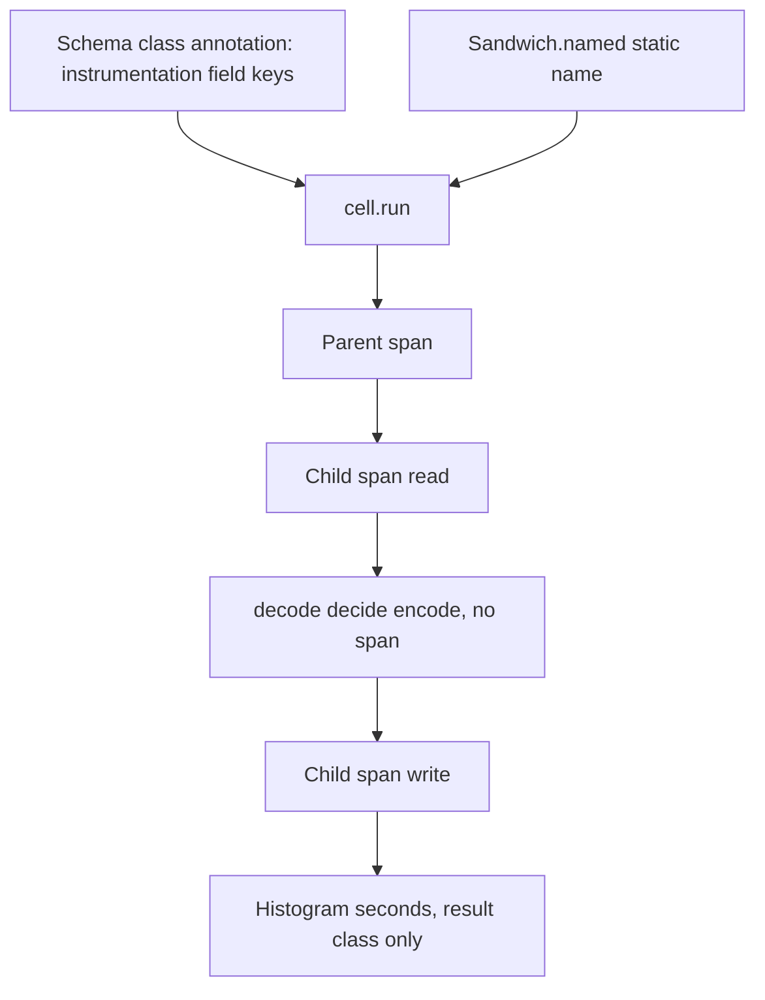

# Intrinsic Telemetry in Cell Architecture

## Goal Capsule

- **Objective**: An operational cell emits its trace and duration metric because it was constructed, not because an agent remembered a skill.
- **Means**: A sandwich starts only at a static name. The runner owns the spans and the histogram. Field inclusion is a class-level annotation the runner reads (KTD1, KTD2, KTD3).
- **Product Authority**: Cell construction and the schemas it already requires. Not SDK bootstrap, not header injection, not logs.
- **Open Blockers**: None.
- **Execution profile**: One package surface, plus the call sites that still start a sandwich at the uninstrumented constructor.
- **Who finishes**: An implementer lands the units below. A changeset ships with the published surface change.

---

## Product Contract

Product Contract changed: R9 — the uninstrumented constructor is removed. Added R10, R11, R12.

### Summary

A named cell emits a parent span, child spans around `read` and `write`, the decision and failure tags, and a derived duration histogram. Fields copied onto the span are the ones named by a class-level annotation on the schema. A sandwich cannot be started without a static name.

### Problem Frame

Agents omit spans, put them on pure decisions, or put identifiers in metric names. A skill that says not to do that is a reminder. The constructor and the schema annotation are the remaining check once that reminder is gone.

### Key Decisions

- **Intrinsic named sandwich**. Telemetry is part of construction, not a wrapper package. (session-settled: user-directed — chosen over an external wrapper: the uninstrumented path is how agents skip it; Governs R1, R9).
- **Parent span, shell child spans, histogram**. Not a single coarse span. (session-settled: user-directed — chosen over a single span: latency and a sampling-resistant duration both have to exist; Governs R2, R3, R4).
- **Literal operation name**. Not a lint rule. (session-settled: user-directed — chosen over an oxlint rule: the name is a type, not a review; Governs R5, R8).
- **Derived metric name**. Not a caller-supplied metric. (session-settled: user-directed — chosen over explicit metric config: callers do not author the instrument; Governs R4, R8, R12).
- **Class-level field list**. Not a per-field flag and not a side map. (session-settled: user-directed — chosen over per-field annotation: one list, omitted fields stay off the span; Governs R10).
- **Uninstrumented constructor removed**. (session-settled: user-directed — chosen over leaving `Sandwich.read` public: a second constructor is an escape hatch; Governs R9).

### Requirements

#### Construction

- R1. `Sandwich.named` accepts a static operation name and returns the chain a sandwich already has.
- R5. A widened string, including a template with a non-literal interpolation, is not assignable to that name.
- R8. A name containing a unit suffix (`_ms`, `_seconds`, `_bytes`) is not assignable.
- R9. `Sandwich.read` is not a public constructor. A sandwich starts at `Sandwich.named`. Non-sandwich constructors stay.

#### Spans and metrics

- R2. A named cell runs inside a parent span whose name is the operation name.
- R3. `read` and `write` run inside child spans named `<operation>.read` and `<operation>.write`.
- R6. `decode`, `decide`, and `encode` create no span.
- R7. The runner writes the decision variant tag, or the failure tag, onto the parent span. It does not write the command, the body, or an error message. If the value has no tag, it writes only the result class.
- R4. The runner records duration in seconds on a histogram whose name is derived from the operation name as `app.<operation>.duration`, with no unit suffix in the name.
- R11. Duration is recorded when the cell succeeds, when `read` or `decode` fails before `decide`, when `write` fails, and when the run is interrupted. A failure before `decide` does not invent a decision tag.
- R12. The histogram's only label is the result class the runner sets: success, failure, or infrastructure. Annotated fields are not metric labels.

#### Schema annotation

- R10. A schema class used as a cell command carries a class-level instrumentation annotation whose value is a list of that class's own field keys. The runner reads that list and copies those fields onto the parent span. A missing annotation is not a valid cell command. An empty list includes no fields. The same annotation is read from the decision schema and the error schema when those classes are held.

#### Compatibility

- R13. A named cell is a `Cell` and remains usable with the existing combinators.

### Key Flows

- F1. Named run
  - **Trigger:** `cell.run(input)`.
  - **Steps:** Parent span opens. `read` runs in its child span. Pure phases run with no span. The runner writes tags and annotated fields onto the parent. `write` runs in its child span. Duration is recorded. Parent span closes.
  - **Covered by:** R2, R3, R6, R7, R10, R11

### Acceptance Examples

- AE1. An `Order.submit` run produces parent span `Order.submit`, child spans `Order.submit.read` and `Order.submit.write`, and no decide span. The parent carries the decision variant. Covers R1, R2, R3, R6, R7.
- AE2. The same run records seconds on `app.order.submit.duration`. The name has no unit suffix. Covers R4, R8.
- AE3. A dynamic template name fails to type-check. Covers R5.
- AE4. `andThen` and `map` still accept a named cell and return a `Cell`. Covers R13.
- AE5. A command annotated with `channel` and not `email` puts `channel` on the parent span and does not put `email` there. Covers R10.
- AE6. A command schema with no instrumentation annotation is not a valid cell command. Covers R10.
- AE7. A `read` failure records duration and the result class `infrastructure`, and does not set a decision tag. Covers R7, R11, R12.

### Success Criteria

- A sandwich cannot be constructed on the public surface without a static name and a command schema that carries the instrumentation annotation.
- Pure decision functions stay free of the effect runtime.
- A run with no exporter does not throw because telemetry is present.

### Scope Boundaries

- **In scope:** Named construction, runner-owned spans and histogram, class-level instrumentation annotation, migration of current uninstrumented sandwich starts.
- **Out of scope:** Deleting the propagation, logging, baggage, and callback-annotation half of the observability skill. A lint that bans direct span calls. Trace header injection. An audit log channel. A baggage slot. A retry combinator. Runtime redaction. An OpenTelemetry SDK dependency.
- **Deferred to follow-up work:** An instrument, owned separately, for dynamic span names and metric unit suffixes written outside this package.

---

## Planning Contract

### Key Technical Decisions

- KTD1. **Effect tracer and metric, not an SDK.** `Effect.withSpan` returns the same error channel and removes `ParentSpan` from `R`. It does not add a tracer service. `Metric.update` is `Effect<void>`. No `@opentelemetry/*` dependency. Governs R2, R4, R13.
- KTD2. **Hold the schema value and read `resolveAnnotations`.** The command class is already passed to `Workflow.make` and discarded. Retain it. Read the class-level instrumentation list from that value. Do not walk `instance.constructor`; `annotate` returns a rebuild, and a subclass does not have to carry it. Decision and error field lists are read the same way from schema classes the workflow construction holds. Governs R10.
- KTD3. **Stamp the annotation into the type.** A throwaway type probe showed `annotate` and `annotateKey` return the schema rebuild, which does not contain the annotation. A marked field and a plain string schema are the same to the checker. The force is a stamp on the class so the cell slot can require the instrumentation list, typed as keys of that class. The runner still reads the annotation Effect stored. Governs R10. (session-settled: user-directed — chosen over a per-field stamp: the experiment showed per-field force repeats the wrapper that was rejected).
- KTD4. **Seconds in a unitless histogram.** Effect 4.0.0-rc.116 `Metric.histogram` requires `boundaries` and has no `unit` field. The runner picks fixed second boundaries and records seconds. The name carries no unit suffix. Conflict: R4's `unit: 's'` cannot be an instrument option. The value scale and the unsuffixed name are the commitment. Governs R4, R8.
- KTD5. **Result class is the only metric label.** Caller fields stay on the span. The histogram label is `success`, `failure`, or `infrastructure`, set by the runner. Governs R12.
- KTD6. **Do not special-case combinators for trace shape.** In-fiber context already propagates. `andThen` and `zip` do not gain a telemetry algebra. Governs R13.

### High-Level Technical Design

The runner copies annotation fields after `read`, onto the parent span, and only those keys. It copies a decision or error field only when that schema class is held and names the key. Tags are written even when the field list is empty.

### Assumptions

- Two cells with the same operation name share one histogram. Tests isolate that with a fresh metric registry, which is how this repo already reads metrics.
- A cast that puts a free string into a literal field can still be copied if the annotation names that field. The annotation is the declaration. There is no second redaction pass.
- Direct `Effect.annotateCurrentSpan` inside `read` or `write` still compiles. This plan does not close that hole.
- Lens: Edge-First, rotated from Inversion. The edges that hold are a missing annotation, a read failure before decide, and an empty field list.

### Sequencing

U1, then U2 and U3, then U4, then U5. U2 and U3 can land together. U4 waits until the old constructor is gone.

---

## Implementation Units

### U1. Named-only construction

- **Goal:** The public sandwich starts at a static name, and a bad name fails to type-check.
- **Requirements:** R1, R5, R8, R9, R13
- **Dependencies:** None
- **Files:** `packages/effect-cell-types/src/Sandwich.ts`, `packages/effect-cell-types/src/mod.ts`, `packages/effect-cell-types/test-types/cells-surface.tst.ts`
- **Approach:** Add `named`. Remove `read` from the public export. Constrain the name to a string literal with no unit suffix. The returned chain is the chain `read` returns today, so phase order does not change.
- **Patterns to follow:** The existing lawful-next-step chain in `Sandwich.ts`. Type assertions in `test-types/cells-surface.tst.ts`.
- **Test scenarios:**
  - A literal name type-checks and the chain still ends in a `Cell`.
  - A `string` variable and a template with a non-literal hole do not type-check.
  - A name ending in `_ms`, `_seconds`, or `_bytes` does not type-check.
  - `Sandwich.read` is not exported.
- **Verification:** The type tests accept the literal and reject the three bad names.

### U2. Runner spans and histogram

- **Goal:** A named run emits the span tree and the duration histogram without a new dependency.
- **Requirements:** R2, R3, R4, R6, R7, R11, R12
- **Dependencies:** U1
- **Files:** `packages/effect-cell-types/src/Sandwich.ts`, `packages/effect-cell-types/tests/cell-telemetry.integration.test.ts`
- **Approach:** Wrap the composed effect in the parent span. Wrap `read` and `write` in child spans. Do not wrap the pure phases. Write tags from the result, never the message or the command. Record seconds on the derived histogram on every exit, with the result class as the only label. Fixed boundaries live in the runner because the histogram constructor requires them.
- **Patterns to follow:** `Effect.withSpan` and `Metric.histogram` as used by the daemon worker loop. Span probes via `Effect.currentSpan`, not an exporter.
- **Test scenarios:**
  - A successful run shows the parent name and both child names, and the decide probe sees no child span of its own.
  - The parent attribute is the decision variant, not the command and not an error message.
  - A `read` failure records the histogram with result class infrastructure and sets no decision tag.
  - A `write` failure still records duration.
  - The metric name is the derived name and contains no unit suffix.
- **Verification:** The integration spec observes those spans and that histogram through the runtime.

### U3. Class annotation read

- **Goal:** The runner copies only the fields named by the class annotation, and a schema without that annotation is not a cell command.
- **Requirements:** R10, R7
- **Dependencies:** U1
- **Files:** `packages/effect-cell-types/src/Workflow.ts`, `packages/effect-cell-types/src/Sandwich.ts`, `packages/effect-cell-types/test-types/cells-surface.tst.ts`, `packages/effect-cell-types/tests/cell-telemetry.integration.test.ts`
- **Approach:** Keep the command schema `Workflow.make` already receives. Read its class-level instrumentation list with `resolveAnnotations`. Stamp the list into the type so a missing annotation and a key that is not a field fail to type-check. An empty list includes nothing. Decision and error schemas held the same way contribute their listed fields. Tags are still written when the list is empty.
- **Patterns to follow:** The annotation read that already works on `Schema.Class` and `Schema.TaggedClass` via `resolveAnnotations`.
- **Test scenarios:**
  - A command listing `channel` and not `email` puts `channel` on the parent span and does not put `email` there.
  - An empty list puts no command fields on the span, and the decision tag is still present.
  - A missing annotation does not type-check.
  - A listed key that is not a field of that class does not type-check.
  - A decision schema listing a closed field contributes that field, and an unlisted message field does not appear.
- **Verification:** Type tests reject the two bad schemas. The integration spec sees the included field and not the excluded one.

### U4. Migrate current sandwich starts

- **Goal:** Nothing in the workspace still calls the removed constructor.
- **Requirements:** R9
- **Dependencies:** U1
- **Files:** `packages/effect-cell-types/tests/`, `packages/effect-cell-types/README.md`, `packages/effect-cell-types/test-types/`, `packages/effect-daemon-spec/src/internal/SupervisorBodyExecutor.ts`, `packages/oxlint-plugin/oxlint-plugin-effect-platform/src/rules/__tests__/runtime-construction-placement.test.ts`
- **Approach:** Each former `read` start becomes `named` with a static name and an instrumentation annotation. Test fixtures may use an empty list. Do not rename behavior under test except where the constructor itself is the assertion.
- **Patterns to follow:** The chain shape those files already use, with the new start.
- **Test scenarios:**
  - The daemon executor still constructs its sandwich and type-checks.
  - The placement fixture still describes a sandwich construction.
  - Cell package tests and type tests no longer mention the removed constructor.
- **Verification:** Those packages type-check, and a search of the workspace finds no call to the removed constructor.

### U5. Published surface and agent contract

- **Goal:** The published types and the package agent rules name the new surface and not the old constructor.
- **Requirements:** R1, R9, R10
- **Dependencies:** U1, U2, U3, U4
- **Files:** `packages/effect-cell-types/etc/effect-cell-types.api.md`, `packages/effect-cell-types/AGENTS.md`, `.changeset/`
- **Approach:** Regenerate the API report from the new exports. CELL-T1 lists `named` and does not list `read`. The changeset states the consumer-visible constructor change and the annotation requirement, not internal paths.
- **Test expectation:** none — the API report and the changeset are the proof. Behavior is already covered by U1–U3.
- **Verification:** The API check matches the report. The changeset body is consumer-observable.

---

## Verification Contract

| Check            | Command                                                       | Applies             |
| ---------------- | ------------------------------------------------------------- | ------------------- |
| Types            | `pnpm --filter @systemfsoftware/effect-cell-types test:types` | U1, U3              |
| Behavior         | `pnpm --filter @systemfsoftware/effect-cell-types test`       | U2, U3, U4          |
| Typecheck        | `pnpm --filter @systemfsoftware/effect-cell-types typecheck`  | U1–U4               |
| API              | `pnpm --filter @systemfsoftware/effect-cell-types api:check`  | U5                  |
| Lint             | `pnpm --filter @systemfsoftware/effect-cell-types lint`       | U1–U5               |
| Daemon typecheck | `pnpm --filter @systemfsoftware/effect-daemon-spec typecheck` | U4                  |
| Local gate       | `pnpm check:local`                                            | After the last edit |

---

## Definition of Done

- R1–R13 hold, including the revised R9.
- U1–U5 are landed. No remaining call to the removed constructor.
- The API report and CELL-T1 match the public surface.
- A changeset exists for the published package.
- Abandoned experiment files are not in the diff.
- `pnpm check:local` exits 0 after the last edit.
