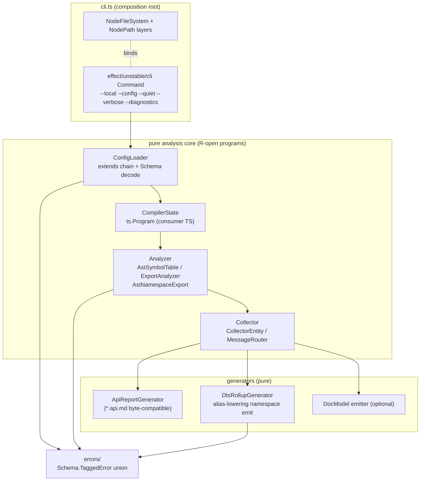
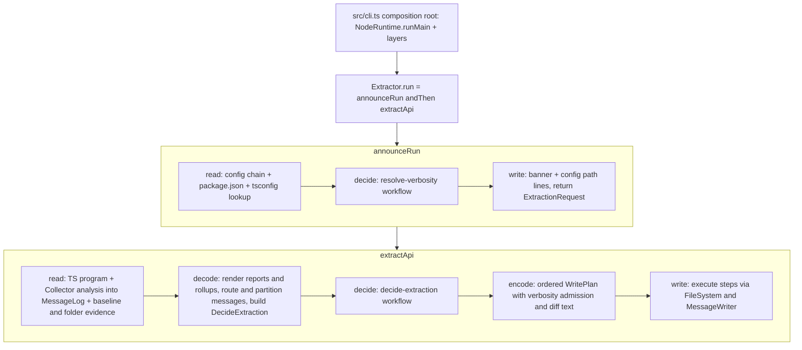

## Goal Capsule

- **Objective:** The monorepo's API surface gating (api reports and declaration rollups) runs on an owned, published `@systemfsoftware/api-extractor` package that reads existing `api-extractor.json` files unmodified, emits byte-compatible `*.api.md` reports and valid `.d.ts` rollups — including namespace barrels (`export * as X`) — and stays silent on success under `--quiet`.
- **Means:** Extract and re-architect upstream api-extractor (`/tmp/rushstack/apps/api-extractor`, v7.59.1) into `packages/api-extractor`, replacing all `@rushstack/*` runtime libraries with Effect 4 (`effect/unstable/cli`, `@effect/platform-node`) and Node built-ins, and fixing the namespace rollup emit strategy (KTD6).
- **Product Authority:** `@systemfsoftware/api-extractor` is the sole API extractor implementation for this repo's consumers; existing per-package `api-extractor.json` files are the compatibility contract and do not change.
- **Execution profile:** Deep plan, 8 units, dependency-ordered. `ce-work` implements; LFG pipeline ships.
- **Stop conditions:** any discovery that the TypeScript compiler API cannot express the alias-based namespace emit (KTD6) on the `packages/atom` topology without behavior regression to non-namespace packages; byte-diff of existing committed `etc/*.api.md` reports against the new engine that cannot be reconciled without changing a Product Contract requirement.
- **Open Blockers:** None.

**Product Contract preservation:** unchanged. All R/F/AE/KD IDs and meanings from the origin brainstorm are preserved verbatim below.

---

## Product Contract

### Summary

Publish an owned, standalone package at `packages/api-extractor` (`@systemfsoftware/api-extractor`) replacing `@microsoft/api-extractor`. It replaces the legacy Rushstack toolchain (`@rushstack/node-core-library`, `@rushstack/terminal`, `@rushstack/ts-command-line`) with native Effect 4 (`Effect.gen`, typed schemas and services), resolves long-standing `.d.ts` rollup defects for namespace re-exports (`export * as X`), and provides built-in `--quiet` execution to eliminate `api-extractor-quiet` shims.

### Problem Frame

The repository and modern TypeScript ecosystems face critical limitations with upstream `@microsoft/api-extractor`:

1. **Namespace Barrel Rollup Failure:** API Extractor's `.d.ts` rollup generator fails on modern TypeScript namespace exports (`export * as Atom from './Atom.js'`), emitting uncompilable or invalid declarations when modules import their own namespace back from entrypoints. Consequently, packages with namespace barrels (such as `@systemfsoftware/effect-atom`) are forced to disable `dtsRollup.enabled` and maintain fragile multi-gate workarounds (`AT1` in `packages/atom/AGENTS.md`).
2. **Heavy Legacy Toolchain & Incompatible Runtimes:** Upstream is tightly coupled to `@rushstack/node-core-library`, `@rushstack/terminal`, and `@rushstack/ts-command-line`, which rely on legacy Heft/Rush build conventions and conflicting runtime utilities rather than the workspace's first-party Effect ecosystem.
3. **Noisy Terminal Output:** Upstream has no native quiet mode and prints multi-line banners and status logs even on success, necessitating a custom `api-extractor-quiet` wrapper script in `packages/toolchain/tsdown-config/src/api-extractor-quiet.ts` to suppress log noise across dozens of workspace packages.

### Key Decisions

- KD1. **Independent Workspace Package at `packages/api-extractor`:** (session-settled: user-directed — chosen over vendored subtree or toolchain internal: owned outright per REPO-O1 as a first-class published package `@systemfsoftware/api-extractor`). Governs R1, R2.
- KD2. **Deep Effect Internal Overhaul:** (session-settled: user-directed — chosen over shallow TS wrapper: internal state machines, AST collectors, generators, and I/O run as typed Effect workflows and services using `@effect/platform-node`). Governs R3, R4, R5, R6.
- KD3. **Sever All `@rushstack/*` Dependencies:** (session-settled: user-directed — chosen over depending on published `@rushstack/*` npm packages: completely replace `node-core-library`, `terminal`, and `ts-command-line` with Effect Platform and standard Node utilities). Governs R7, R8.
- KD4. **Full 1:1 Backward Compatibility for `api-extractor.json`:** (session-settled: user-directed — chosen over breaking modern schema rewrite: accepts existing standard `api-extractor.json` configuration files without requiring config migrations across monorepo packages). Governs R9, R10.
- KD5. **Native `--quiet` Flag and Config Property:** Built-in support for suppressing success chatter via CLI flag (`--quiet`) and config (`"quiet": true`), deprecating and obsoleting `api-extractor-quiet`. Governs R11, R12.
- KD6. **Native Namespace Barrel Rollup Support:** Fix AST symbol analysis and `.d.ts` rollup generation for `export * as X from './Y'` statements to produce valid, standalone type declarations. Governs R13, R14, R15.

### Requirements

#### Packaging and Monorepo Integration

- R1. The package must reside at `packages/api-extractor`, publish as `@systemfsoftware/api-extractor`, and expose both an executable CLI binary (`api-extractor`) and programmatic Effect-based and Promise-based entrypoints.
- R2. The package must build via `tsdown`, pass `dts:check`, `api:check`, `lint` via oxlint, and pass all typecheck and test gates per repository doctrine.

#### Effect Architecture and Dependency Severance

- R3. File system access, path resolution, process execution, and environment handling must use `@effect/platform-node` (`FileSystem`, `Path`), eliminating `@rushstack/node-core-library`.
- R4. CLI argument parsing must be implemented using `@effect/cli` or standard Node primitives, eliminating `@rushstack/ts-command-line`.
- R5. Terminal output, diagnostic formatting, and colored logging must use Effect-native logging / `@effect/printer-ansi`, eliminating `@rushstack/terminal`.
- R6. Internal analysis errors, configuration failures, and TypeScript compiler diagnostic events must be modeled as typed tagged errors (`Data.TaggedError` or `Schema.TaggedError`), with fatal defects routed to Effect's error channel rather than untyped throws.
- R7. Zero dependencies on `@rushstack/*` or `@microsoft/api-extractor-model` must remain in `packages/api-extractor/package.json`; necessary model types and AST representations must be natively housed or inlined within the package.
- R8. Upstream rig configuration loading (`@rushstack/rig-package`) must be replaced with native config lookup or pure Node resolution.

#### Configuration and Backward Compatibility

- R9. The configuration loader must accept standard `api-extractor.json` files matching schema v7, including `<projectFolder>`, `<lookup>`, tokens, and `extends` inheritance.
- R10. Existing `api-extractor*.json` files across the monorepo must execute against `@systemfsoftware/api-extractor` without syntax modifications or schema errors.
- R11. The configuration schema must accept an optional boolean `"quiet"` property at the root level.
- R12. The CLI must accept `--quiet` (and `-q`) to suppress banner, configuration path, and success messages, emitting output only on warnings, diagnostics, or errors.

#### AST Analysis and .d.ts Rollup Generation

- R13. The analyzer must correctly parse and represent `export * as Name from './module'` syntax in symbol tables without dropping nested declarations or producing ambiguous namespaces.
- R14. The `.d.ts` rollup generator must emit valid declaration blocks for namespace exports that allow modules importing their own namespace back to compile cleanly under `tsc --noEmit`.
- R15. The rollup generator must continue to honor `publicTrimmedFilePath`, `betaTrimmedFilePath`, `untrimmedFilePath`, and `bundledPackages` options.
- R16. The API review report generator must continue to output exact `*.api.md` reports compatible with existing committed api reports across the repository.

### Key Flows

#### F1: Quiet Extraction Execution in Workspace Build

- **Trigger:** Package script invokes `api-extractor run --local --quiet` (or `api-extractor run` with `"quiet": true` in `api-extractor.json`).
- **Actors:** Developer, CI Runner, API Extractor CLI.
- **Steps:**
  1. CLI parses arguments and detects `--quiet`.
  2. Extractor loads and validates `api-extractor.json` via Effect FileSystem.
  3. Program runs TypeScript compilation, symbol collection, and analysis silently.
  4. Extractor writes `.d.ts` rollup and checks `etc/<package>.api.md`.
  5. Upon clean success, zero lines are printed to stdout, and process exits with status code 0.
- **Outcome:** Clean terminal output without needing `api-extractor-quiet.ts` shims.
- **Covered by:** R4, R11, R12, R16.

#### F2: Namespace Barrel Rollup Generation

- **Trigger:** Extractor processes an entrypoint containing `export * as Atom from './Atom.js'` where internal files import `type { Registry } from './Atom.js'`.
- **Actors:** API Extractor Rollup Engine.
- **Steps:**
  1. Analyzer identifies `export * as Atom` and builds an `AstNamespaceExport` symbol node.
  2. Symbol collector traverses export clauses and maps referenced symbols to their source declarations.
  3. DtsRollupGenerator writes out top-level declarations and wraps the exported namespace without circular self-referencing declaration errors.
  4. The generated `.d.ts` rollup is written to `dist/<package>.d.ts`.
- **Outcome:** Shipped `.d.ts` rollup compiles cleanly under `tsc --noEmit -p tsconfig.dts.json`.
- **Covered by:** R13, R14, R15.

### Acceptance Examples

#### AE1: Built-in Quiet Execution

- **Covers:** R11, R12
- **Given:** A valid package with `api-extractor.json` configured with `"quiet": true`.
- **When:** `api-extractor run` is executed on a clean, valid package.
- **Then:** The command exits with code 0 and stdout is completely empty.

#### AE2: Diagnostic Failure Output Under Quiet Mode

- **Covers:** R12, R16
- **Given:** A package where `etc/<package>.api.md` has uncommitted API changes and `--local` is not passed.
- **When:** `api-extractor run --quiet` is executed.
- **Then:** Extractor outputs the exact diff failure and warning/error diagnostics to stderr/stdout and exits with non-zero exit code.

#### AE3: Namespace Barrel Compilation

- **Covers:** R13, R14
- **Given:** A package with `export * as MyNamespace from './submodule.js'` and `dtsRollup.enabled: true`.
- **When:** `api-extractor run` generates `dist/package.d.ts`.
- **Then:** Running `tsc --noEmit dist/package.d.ts` passes with zero type or circular reference errors.

### Success Criteria

- The fork runs the repo's own compatibility corpus: every existing `api-extractor*.json` across the workspace executes, and regenerated reports byte-match the committed `etc/*.api.md` files (R10, R16 proven on real configs, not fixtures alone).
- `packages/atom` can flip `dtsRollup.enabled` back to `true` on at least one entrypoint with `dts:check` green — the AT1 blocker's proof condition (gated to a follow-up, see Deferred).

### Scope Boundaries

#### In Scope

- Creation of `packages/api-extractor` as an owned monorepo package published under `@systemfsoftware/api-extractor`.
- Porting core analyzer, collector, generators, and CLI from `/tmp/rushstack/apps/api-extractor`.
- Complete removal of `@rushstack/*` dependencies in favor of `@effect/platform-node` and Node built-ins.
- Fixing namespace re-export AST handling and `.d.ts` rollup generation.
- Native `--quiet` flag and `"quiet": true` config property.
- Deprecation of `packages/toolchain/tsdown-config/src/api-extractor-quiet.ts` once migrated (shim-only in this plan; deletion deferred).

#### Deferred to Follow-Up Work

- Flipping consumer packages' `api:check` scripts from `api-extractor-quiet run` to `api-extractor run --quiet`, one adoption PR per package cluster (25+ packages).
- Deleting `packages/toolchain/tsdown-config/src/api-extractor-quiet.ts` after full migration.
- Re-enabling `dtsRollup` on `packages/atom` entrypoints (AT1 rewrite) once AE3 holds on its topology.
- Migration of monorepo package dependencies from `@microsoft/api-extractor` to `@systemfsoftware/api-extractor` in manifests.
- Integration with Effect Schema v4 custom DSL schema authoring; `@systemfsoftware/api-extractor-model` as a separate package.

#### Outside This Product's Identity

- Replacing TypeScript's AST parser or type checker with oxc or alternative compilers (TypeScript compiler services remain required for semantic type resolution).
- Creating a general-purpose bundler or minifier (API Extractor remains focused on API report generation and declaration rollups).

---

## Planning Contract

### Key Technical Decisions

- KTD1. **Single workspace package, inlined model.** `packages/api-extractor` houses analyzer, collector, generators, CLI, and the inlined api-extractor-model types in one published package; no companion model package ships. (session-settled: user-directed — chosen over a separate `@systemfsoftware/api-extractor-model` package: monorepo needs one surface; Product Contract KD1 + R7. Governs U1, U5.)
- KTD2. **CLI on `effect/unstable/cli`, not `@effect/cli`.** The Product Contract's `@effect/cli` (R4) resolves to the Effect 4 CLI module `effect/unstable/cli` (`Command.make`, `Flag.Boolean/Flag.String`, `Flag.withAlias`, typed `CliError`) — no `@effect/cli` package exists in the effect 4.0.0-rc monorepo (verified: `repos/effect/packages/effect/package.json` exports `./unstable/cli`; `packages/` lists ai, atom, effect, opentelemetry, platform, sql, tools, vitest). Assumption A1 covers the residual naming drift. Governs U6.
- KTD3. **Config decode via Effect Schema on raw JSON.** Port `ExtractorConfig`'s load/extends/prepare pipeline; keep the v7 JSON schema as the validation source of truth (schema file vendored from upstream `schemas/api-extractor-defaults.json` + `api-extractor.schema.json`), validated with Effect Schema decode over the JSON object; add root-level optional `"quiet": boolean`. Merge semantics mirror upstream: `extends` chain is depth-first with array-valued properties replaced and object dictionaries deep-merged; circular `extends` is a typed `ConfigError` (no overrideTsconfig-style hacks); unknown tokens resolve to `UnresolvedTokenError`. Rig lookup (`ExtractorConfig.ts:506-563`) is dropped — zero monorepo packages use rigs; `extends` resolves through Node package resolution. (session-settled: user-directed — full 1:1 config compatibility, chosen over a modernized schema: KD4 + R9, R10, R11. Governs U3.)
- KTD4. **Namespace rollup emit via alias-lowering (NamespaceFixer strategy).** Replace upstream's inline `export declare namespace Ns { export { X } }` emission for `AstNamespaceExport`/`AstNamespaceImport` (upstream `DtsRollupGenerator.ts:156-223`, which hard-throws on star exports at `:167-172`) with the alias-lowering proven by rollup-plugin-dts: for each member, hoist a uniquely-named top-level alias (`type Ns_X = X` for type-only, `declare const Ns_X: typeof X` for value-only, both for classes/enums, `import Ns_X = X` for nested namespaces; star-exported members resolved through the star module's export table first, with a typed `UnsupportedStarExportError` when a member cannot be enumerated), then emit `export declare namespace Ns { export { Ns_X as X } }`. This decouples sibling back-imports (`Atom.ts` importing `Registry.js`) from the namespace container and removes the circularity AT1 records. Non-namespace packages keep upstream byte-identical emission order for non-namespace entities. (session-settled: user-directed — fix must make namespace barrels valid, chosen over leaving rollup disabled: KD6 + R13, R14, R15. Governs U7, U8.)
- KTD5. **Quiet is a message-router gate, not an output filter.** Precedence (highest wins): CLI `--diagnostics` > CLI `--verbose` > CLI `--quiet`/`-q` > config `"quiet"` > default (chatty). Suppression happens in the message router before ANSI rendering (silent messages are never formatted). Banners, config path line, TS version preamble (`Extractor.ts:512-515`), and the success line (`RunAction.ts:158`) route through the same gate; warnings/errors/diagnostics always print. (Governs U6, U7.)
- KTD6. **Ports in pure modules, adapters at the shell.** `FileSystem`/`Path` capabilities come from `effect`'s service interfaces; `NodeFileSystem.layer`/`NodePath.layer` bind them only in `src/cli.ts` (composition root) and test bootstrap; library entrypoints export programs with `R` open, never bound singletons (pack: cell-architecture, compound-packs/cell-architecture/ports-separate-from-layers.md; composition-root-binding.md). Governs U2, U6.
- KTD7. **Typed error taxonomy as one closed union.** `Schema.TaggedError` subclasses in `src/errors/`: `ConfigError` family (`ConfigFileNotFound`, `ConfigJsonSyntaxError`, `ConfigSchemaValidationError`, `UnresolvedTokenError`, `CircularConfigExtendsError`), `CompilerError` family (`TsConfigReadError`, `TypeScriptDiagnosticError`), `AnalysisError` family (`UnsupportedSyntaxError`, `CircularNamespaceReferenceError`, `UnsupportedStarExportError`, `ForgottenExportError`), `ReportError` family (`ApiReportMismatchError`, `ApiReportMissingError`). Infrastructure I/O failures keep `PlatformError` as-is. Non-fatal findings (missing TSDoc tags, forgotten-export warnings) stay messages, not errors. Replaces every upstream `InternalError`/`AlreadyReportedError` throw. (Governs U2, U4, U7, U8.)

### Assumptions

- A1. The Product Contract's `@effect/cli` naming is read as `effect/unstable/cli` (KTD2); no separate dependency is added under that name.
- A2. `api-extractor-quiet` (20+ package scripts) is retired by adoption PRs after this plan ships; this plan only makes the shim forward safely or leaves it untouched if nothing breaks. R1's Promise entrypoint resolves with an `ExtractorResult` (never throws) mirroring upstream `Extractor.invoke`, so a shim or external runner keeps its contract.
- A3. Per-entry configs (`packages/atom` runs eight) keep working concurrently because each config's `reportTempFolder` is distinct; this plan does not invent PID/UUID temp isolation.
- A4. The vendored `/tmp/rushstack` tree is the porting source; it is a scratch clone, so the plan records upstream version 7.59.1 in the package README provenance line rather than depending on the clone's persistence.
- A5. TypeScript stays a peer dependency (`>=5.4`) plus devDependency for the engine's own compile; the extractor loads the consumer-resolved TypeScript like upstream does.

### High-Level Technical Design



Pipeline order is upstream's (CLI → config → compile → analyze → collect → generate). The core runs as Effect programs over `FileSystem`/`Path` requirements; only `cli.ts` binds Node layers. `*.workflow.ts`/`Workflow.make` cells are **not** imposed on the ported engine — the upstream code is compiler-plumbing, not domain decisions; where a genuinely pure decision emerges (e.g. config token expansion, quiet-precedence resolution) it is extracted as a pure function with property coverage, and the rest stays typed imperative Effect. This is the deliberate boundary of KTD2's "deep overhaul": channels and effects, not a sandwich rewrite of the TS walker.

### Output Structure

```
packages/api-extractor/
├── package.json            # bin api-extractor → dist/cli.mjs; scripts per exemplar
├── tsdown.config.ts        # entry index.ts + cli.ts; devExports source condition
├── tsconfig.json / tsconfig.build.json / tsconfig.node.json / tsconfig.api.json
├── api-extractor.json      # self-hosting config (dogfood)
├── oxlint.config.ts / vitest.config.ts / .attw.json
├── AGENTS.md               # leaf rules AE-R1..R5 (port patterns dossier)
├── README.md / LICENSE
├── src/
│   ├── index.ts            # programmatic surface: runEffect + invoke (Promise)
│   ├── cli.ts              # composition root: layers + Command.runWith
│   ├── errors/             # KTD7 closed error union
│   ├── config/             # ExtractorConfig port, tokens, extends, schema
│   ├── compiler/           # CompilerState over consumer TypeScript
│   ├── analyzer/           # AstSymbolTable, ExportAnalyzer, AstNamespace*
│   ├── collector/          # Collector, CollectorEntity, MessageRouter, SourceMapper
│   ├── generators/         # ApiReportGenerator, DtsRollupGenerator, DocModel
│   └── model/              # inlined api-extractor-model types (ApiItem tree, ReleaseTag)
└── tests/
    ├── *.integration.test.ts   # in-process fixture packages
    └── e2e/                    # contract lane: packed tarball journeys (J1, J2)
```

---

## Implementation Units

### U1. Package scaffold and build gates

- **Goal:** `packages/api-extractor` exists, builds, and passes the repo's standard gates.
- **Requirements:** R1, R2; KD1.
- **Dependencies:** none.
- **Files:** `packages/api-extractor/package.json`, `tsdown.config.ts`, `tsconfig.json`, `tsconfig.build.json`, `tsconfig.node.json`, `tsconfig.api.json`, `api-extractor.json`, `oxlint.config.ts`, `vitest.config.ts`, `.attw.json`, `AGENTS.md`, `README.md`, `LICENSE`, `src/index.ts`, `src/cli.ts` (stubs), `pnpm-workspace.yaml` (no change needed — `packages/*` glob covers it).
- **Approach:**
  1. Mirror `packages/npm-package/` for the config set, with two entries in `tsdown.config.ts` (`index`, `cli`) and `bin: { "api-extractor": "./dist/cli.mjs" }`.
  2. `neverBundle`: `effect`, `@effect/platform`, `@effect/platform-node`, `typescript`, `@microsoft/tsdoc`, `@microsoft/tsdoc-config`, `diff`, `minimatch`, `semver`, `source-map`, `debug`.
  3. Dogfood: package's own `api-extractor.json` + `tsconfig.api.json` (`customConditions: []`) so `api:check` gates its own surface once the engine exists.
  4. AGENTS.md carries the leaf rules from the patterns dossier (zero rushstack deps; namespace rollup validity; quiet stdout-empty contract; no child-process spawning in integration tests; typed errors only).
- **Patterns to follow:** `packages/npm-package/` (whole config set); `packages/toolchain/tsdown-config/package.json` (bin field); root AGENTS.md REPO-S4 (tsdown owns exports).
- **Test scenarios:** `Test expectation: none — packaging scaffolding; the gates in Verification prove it.`
- **Verification:** `pnpm install` resolves; `pnpm --filter @systemfsoftware/api-extractor build typecheck lint` exit 0 (api:check skips until U5 wires reports); boundaries audit clean.

### U2. Error taxonomy and Effect-typed foundations

- **Goal:** Every failure mode the engine can produce has a typed home before porting begins.
- **Requirements:** R6; KD2 (KTD7).
- **Dependencies:** U1.
- **Files:** `src/errors/index.ts`, `src/errors/config.ts`, `src/errors/compiler.ts`, `src/errors/analysis.ts`, `src/errors/report.ts`.
- **Approach:** `Schema.TaggedError` classes per KTD7; `cause: Schema.optional(Schema.Unknown)` on wrapping variants; a `ExtractorError` union type + `Match`-friendly guards; unit coverage asserting each variant's tag/codec round-trip.
- **Test scenarios:**
  - Each error variant constructs with cause preserved and decodes from its encoded form.
  - The union's guards discriminate every family tag.
- **Verification:** `pnpm --filter @systemfsoftware/api-extractor test -- errors` green; typecheck green.

### U3. Config loader (ExtractorConfig port)

- **Goal:** `ExtractorConfig.prepare`/`loadFile` semantics with `extends`, token expansion, schema validation, and `"quiet"` — no rushstack code.
- **Requirements:** R8, R9, R10, R11; KD3, KD4 (KTD3).
- **Dependencies:** U2.
- **Files:** `src/config/extractor-config.ts`, `src/config/json-schema.ts`, `src/config/tokens.ts`, `src/config/__tests__/tokens.property.test.ts`, `src/config/__tests__/extends.integration.test.ts`.
- **Approach:**
  1. Port the extends-chain walk (`ExtractorConfig.ts:626-708`) onto `FileSystem`/`Path`; arrays replace, objects deep-merge, cycles → `CircularConfigExtendsError`.
  2. Token expansion (`<projectFolder>`, `<lookup>`, `<packageName>`, `<unscopedPackageName>`) as a pure function; unknown token → `UnresolvedTokenError`. `<lookup>` walks up for `api-extractor.json`/`tsconfig.json` exactly as upstream's heuristic, minus rig files.
  3. Vendor `api-extractor.schema.json` + defaults from upstream 7.59.1, decode with Effect Schema over parsed JSON → `ConfigSchemaValidationError` on unknown/invalid.
  4. Root `"quiet": Schema.optional(Schema.Boolean)`.
- **Patterns to follow:** upstream `ExtractorConfig` test fixtures (`config-lookup1..3`).
- **Test scenarios:**
  - Property: token expansion is total — every schema-legal config with resolvable tokens yields a config, or a typed `UnresolvedTokenError` names the offending token (pure core, generated configs).
  - Property: extends merge is associative for the schema's two shape classes (array-replace, object-merge).
  - Integration: fixture package using `<lookup>` + one-level `extends` resolves to the same merged config upstream would produce (golden JSON).
  - Integration: `packages/npm-package/api-extractor.json` (real repo config) loads and validates unchanged (R10 corpus starts here).
  - Error paths: missing file → `ConfigFileNotFound`; malformed JSON → `ConfigJsonSyntaxError`; circular extends → `Covers AE-adjacent` typed failure.
- **Verification:** config suite green; typecheck green.

### U4. Compiler state and message router

- **Goal:** `ts.Program` construction over the consumer's TypeScript and the gated message pipeline.
- **Requirements:** R5, R6, R12 (precedence half); KD2, KD5 (KTD5).
- **Dependencies:** U3.
- **Files:** `src/compiler/compiler-state.ts`, `src/collector/message-router.ts`, `src/collector/__tests__/quiet-precedence.property.test.ts`.
- **Approach:**
  1. Port `CompilerState` (`CompilerState.ts`) loading tsconfig via `tsconfigFilePath`, honoring `customConditions` semantics of the consumer's tsconfig (the engine itself must not inject any condition).
  2. `MessageRouter` port: log levels per `ConsoleMessageId`, handler → `Terminal`/console write; quiet gate evaluated once from resolved precedence (KTD5) and applied before formatting.
  3. Pure precedence resolver: `(cliFlags, configQuiet) → verbosity` decision function.
- **Patterns to follow:** upstream `MessageRouter.ts` level matrix; `api-extractor-quiet.ts` success-line regex list defines exactly which messages are chatter.
- **Test scenarios:**
  - Property: precedence resolver is monotone — `--diagnostics` beats everything, `--verbose` beats quiet, CLI beats config, config beats default (exhaustive pair table as deterministic universal; batch spans the boundary shapes).
  - Integration: quiet run of a clean fixture emits zero writes through a recording Terminal port; failing run emits diagnostics.
- **Verification:** router suite green.

### U5. Analyzer + collector port (the symbol graph)

- **Goal:** The upstream analyzer/collector pipeline over `.d.ts` entries, with `AstNamespaceExport` first-class, rushstack-free.
- **Requirements:** R13, R16 (report input side); KD2, KD3.
- **Dependencies:** U4.
- **Files:** `src/analyzer/` (port of AstSymbolTable, AstSymbol, AstDeclaration, AstImport, AstNamespaceImport, AstNamespaceExport, ExportAnalyzer, Span, SourceFileLocationFormatter, TypeScriptHelpers, TypeScriptInternals, PackageMetadataManager), `src/collector/` (Collector, CollectorEntity, SourceMapper, WorkingPackage), `src/model/` (inlined `api-extractor-model` subset: ApiItem hierarchy, ReleaseTag, Excerpt).
- **Approach:**
  1. Mechanical port first: keep module structure and names, swap `InternalError` → KTD7 variants, `Sort` → comparator helpers, `PackageJsonLookup`/`FileSystem`/`Path` → platform services, `JsonFile` → Schema decode. ExportAnalyzer's `export * as` branch (`ExportAnalyzer.ts:574-624`) ports as-is; `shouldInlineExport` (`CollectorEntity.ts:88-90`) ports as-is.
  2. `TypeScriptInternals` (global-name detection) ports against the consumer TS module — upstream already isolates the fragile internals there.
  3. No behavior change to entity ordering in this unit — byte-stable report output is U7's gate.
- **Patterns to follow:** upstream layout (`analyzer/`, `collector/`); sever-strykerjs plan's "imports AND non-import occurrences" sweep discipline for upstream-name references.
- **Test scenarios:**
  - Integration: fixture with namespace barrel (`export * as Registry from './Registry.js'` + sibling back-import) collects an entity graph whose entity names and release tags match a golden snapshot.
  - Integration: fixture with a forgotten export surfaces `ae-forgotten-export` as a message (not an error) per upstream level config.
- **Verification:** analyzer/collector suites green on fixtures.

### U6. CLI + programmatic surface

- **Goal:** `api-extractor run|init` binary and the dual programmatic entrypoints.
- **Requirements:** R1, R4, R5, R12; KD2, KD5 (KTD2, KTD5, KTD6).
- **Dependencies:** U5.
- **Files:** `src/cli.ts`, `src/cli/run-action.ts`, `src/cli/init-action.ts`, `src/index.ts`, `src/invoke.ts`.
- **Approach:**
  1. `Command.make` with subcommands `run` and `init`; flags: `--config/-c`, `--local/-l`, `--quiet/-q` (`Flag.withAlias`), `--verbose`, `--diagnostics`, `--types-compiler` (upstream parity where cheap).
  2. `runEffect(config, options): Effect<ExtractorResult, ExtractorError, FileSystem | Path | Terminal>` — R open; `invoke(config, options): Promise<ExtractorResult>` binds `NodeServices.layer` internally and resolves with the result (never rejects for message-level failures; rejects only on fatal `ExtractorError`).
  3. `cli.ts` is the only module importing `@effect/platform-node` layers (KTD6); exit codes: 0 success, 1 messages-or-error, mapped from the result.
- **Patterns to follow:** `effect/unstable/cli` vendored docs (`repos/effect/packages/effect/src/unstable/cli/Command.ts`, `Flag.ts`).
- **Test scenarios:**
  - Integration: `runEffect` over a fixture config in a `FileSystem.layerNoop` world produces an `ExtractorResult` with correct `succeeded`/`errorCount`; typed error surfaces on a corrupt config.
  - Covers AE1 (config half): `"quiet": true` + clean fixture → zero Terminal writes, exit 0.
  - Covers AE2: stale report + `--quiet` (no `--local`) → diff + diagnostics emitted, exit 1.
  - Covers F1 steps 1–5 end to end in-process.
- **Verification:** CLI/action suites green.

### U7. Generators: API report byte-compatibility

- **Goal:** `ApiReportGenerator` output byte-identical to upstream 7.59.1 for the repo's surfaces.
- **Requirements:** R16, R10; KD4 (KTD3 alignment).
- **Dependencies:** U5, U6.
- **Files:** `src/generators/api-report-generator.ts`, `src/generators/indented-writer.ts`, `src/generators/__tests__/report-parity.integration.test.ts`, `tests/api-report-parity.integration.test.ts`.
- **Approach:** Port `ApiReportGenerator` + `IndentedWriter` mechanically; newline policy from config (`NewlineKind`); the parity test regenerates reports for the compatibility corpus (repo packages with committed `etc/*.api.md`) and diffs byte-for-byte.
- **Test scenarios:**
  - Covers R16: every package in the corpus regenerates a byte-identical `etc/*.api.md` (golden diff; corpus enumerated in Verification).
  - Edge: `@internal` trimming honors `publicTrimmedFilePath` when configured (fixture with trimmed/untrimmed pair).
- **Verification:** parity suite green on the full corpus.

### U8. DtsRollupGenerator with alias-lowered namespaces

- **Goal:** Namespace barrels roll up validly; non-namespace output unchanged.
- **Requirements:** R14, R15; KD6 (KTD4).
- **Dependencies:** U7 (report parity locks the non-namespace baseline first).
- **Files:** `src/generators/dts-rollup-generator.ts`, `src/generators/namespace-aliaser.ts`, `src/generators/__tests__/namespace-rollup.integration.test.ts`, `tests/e2e/namespace-rollup.e2e.test.ts`.
- **Approach:**
  1. Port `DtsRollupGenerator` keeping release-tag trimming and file emission order for non-namespace entities.
  2. Replace the namespace emission block with KTD4's alias-lowering: hoisted `type Ns_X` / `declare const Ns_X` / `import Ns_X = X` aliases + `export { Ns_X as X }` inside the synthetic namespace; star-export members resolved via the star module's export table, else `UnsupportedStarExportError`.
  3. AE3 proof: generated rollup typechecks under `tsc --noEmit`.
- **Patterns to follow:** rollup-plugin-dts `NamespaceFixer` strategy (external research, Sources); upstream trimming logic preserved.
- **Test scenarios:**
  - Covers AE3: fixture barrel (`export * as Ns` + sibling back-import + type-only and value-only members) → rollup compiles clean under `tsc --noEmit`.
  - Edge: nested namespace export (`export * as Root` whose module itself does `export * as Inner`) → no root-flattening; hierarchy preserved (upstream issue #5336 case).
  - Edge: star export inside a namespace'd module → members enumerated from the star module, or typed `UnsupportedStarExportError` (never an untyped throw).
  - Covers R15: `bundledPackages` inlining and trimmed rollups behave as upstream on a fixture.
  - Regression: non-namespace package (corpus member) rollup output byte-stable vs upstream.
- **Verification:** rollup suites green; `dts:check` on fixtures.

---

## Verification Contract

| Gate              | Command                                                  | Proves                                                                                |
| ----------------- | -------------------------------------------------------- | ------------------------------------------------------------------------------------- |
| Build + self-host | `pnpm --filter @systemfsoftware/api-extractor build`     | tsdown emits dist; package's own api:check runs (dogfood, U1+)                        |
| Types shipped     | `pnpm --filter @systemfsoftware/api-extractor dts:check` | `dist/index.d.ts` compiles standalone                                                 |
| Lint              | `pnpm --filter @systemfsoftware/api-extractor lint`      | oxlint `all`-preset clean                                                             |
| Tests             | `pnpm --filter @systemfsoftware/api-extractor test`      | property + in-process integration suites                                              |
| Types-wrong       | `pnpm --filter @systemfsoftware/api-extractor attw`      | published map resolves types                                                          |
| E2E contract lane | `pnpm --filter @systemfsoftware/api-extractor test:e2e`  | J1 packed-install `--help` + clean run; J2 quiet stdout-empty + failure exit contract |
| Local chain       | `pnpm check:local`                                       | repo-wide pre-delivery chain                                                          |

**Compatibility corpus (R10/R16 gates):** `packages/npm-package`, `packages/effect-cell-types`, `packages/effect-schema-extensions` (two configs incl. `hex-schema`), `packages/effect-atom/effect-atom` (eight configs, concurrently) — regenerate reports with the new engine and require byte-identical output against committed `etc/*.api.md`. Report parity and rollup fixtures are the AE1–AE3 proofs.

**Mutation:** per REPO-D3, no local mutation runs; CI's advisory Mutation workflow reads the package's `stryker.config.json` if enrolled — enroll pure decision modules only (tokens, precedence, aliaser), matching the property-cell doctrine.

---

## Definition of Done

- All units U1–U8 implemented; Verification Contract gates green on the last edit (`pnpm check:local` exit 0), including the compatibility corpus byte-parity and AE1–AE3 scenarios.
- E2E contract lane proves the shipped tarball (J1, J2); no child-process spawning outside `tests/e2e/`.
- Zero `@rushstack/*` or `@microsoft/api-extractor*` specifiers in `packages/api-extractor` sources and manifest (grep gate in AGENTS.md leaf rules).
- Changeset per REPO-R2 (`minor`, new package) with consumer-observable body; repo tree left restartable.
- Dead-end experiments removed; abandoned approaches absent from the final diff.
- Deferred items (consumer script migration, quiet-shim deletion, atom dtsRollup flip) tracked as follow-ups, not half-done here.

---

## Appendix

### Sources / Research

- Upstream source of record: `/tmp/rushstack/apps/api-extractor` v7.59.1 (scratch clone; provenance line goes in README). Seam citations: `ExtractorConfig.ts:626-708` (extends), `:506-563` (rigs), `DtsRollupGenerator.ts:156-223` + `:167-172` (namespace emission + star-export throw), `CollectorEntity.ts:88-90` (`shouldInlineExport`), `ExportAnalyzer.ts:574-624` (`export * as`), `RunAction.ts:145,158` and `Extractor.ts:512-515` (chatter lines).
- Upstream namespace issues: rushstack#2780, #2412, #5336; PR #4698 (basic support since 7.47.0). Alias-lowering strategy: rollup-plugin-dts `src/transform/NamespaceFixer.ts`.
- Effect surface: vendored `repos/effect/packages/effect/src/unstable/cli/` (Command, Flag, CliError); `repos/effect/packages/platform/node/src/NodeServices.ts`; `effect/FileSystem`, `effect/Path`, `PlatformError`, `FileSystem.layerNoop`.
- Repo learnings: `docs/solutions/build-errors/exports-types-rollup-drift.md`, `docs/solutions/build-errors/stale-api-report-outlives-toolchain.md`, `docs/solutions/build-errors/tsdown-private-dependency-bare-import-dist.md`, `docs/solutions/build-errors/dts-emitter-drops-bundled-entry-reexports.md`, `docs/plans/2026-08-23-001-sever-strykerjs-org-dependencies-plan.md` (severance precedent).
- Pack citations: `(pack: cell-architecture, compound-packs/cell-architecture/ports-separate-from-layers.md)`, `(pack: cell-architecture, compound-packs/cell-architecture/composition-root-binding.md)`, `(pack: boundary-testing, compound-packs/boundary-testing/real-system-oracles.md)`, `(pack: boundary-testing, compound-packs/boundary-testing/no-mocks-on-internal-glue.md)`.
- Exemplar configs: `packages/npm-package/` (package.json, tsdown.config.ts, tsconfig*.json, api-extractor.json), `packages/toolchain/tsdown-config/src/api-extractor-quiet.ts` (chatter regex list), `packages/atom/AGENTS.md` AT1 (the blocker being fixed).

## api-extractor compound-pack conformance overhaul - Plan

_Part of this plan's lineage: refactor, 2026-09-22._

### Goal Capsule

- **Objective:** A repo engineer reading `packages/api-extractor` finds every outside interaction, decision, service, and test shaped exactly as `compound-packs/cell-architecture` and `compound-packs/boundary-testing` prescribe, while every workspace `api-extractor*.json` config still produces the same `.api.md` reports, rollups, console output, and exit codes as before.
- **Means:** two composed Sandwich cells over a pure analysis snapshot, with analysis messages recorded as data and written only in the write phase (KTD1, KTD2).
- **Authority:** `compound-packs/` rule files > this plan's Requirements > KTDs > unit Approach text. Upstream `/tmp/rushstack/apps/api-extractor` is the behavioral reference for message routing, counting, and drift semantics.
- **Stop conditions:** stop and report if any workspace config's report changes by one byte, if a pack rule cannot be satisfied without breaking R12, or if `Cell`/`Sandwich` from `@systemfsoftware/effect-cell-types` cannot express a required phase (edit that package instead of working around it).
- **Execution profile:** Deep; eight units, strictly dependency-ordered; one pull request (#462 branch `fork-api-extractor`).
- **Finish and ship:** `ce-work` implements, the lfg pipeline reviews, commits, pushes, and watches CI to green.

---

### Product Contract

#### Summary

Rebuild the api-extractor engine's shell around the packs. The run becomes two composed cells: one loads configuration and announces the run, one analyzes, renders, decides report drift, and writes. Analysis and generation stop emitting output directly and record messages as data. The public surface collapses to one `Extractor` namespace, the CLI becomes the only composition root, and the test suite proves behavior through that entry point against real temp directories.

#### Problem Frame

The package passed its gates but not its law. The run cell's `decide` only branches on `localBuild`, while analysis, generation, drift detection, and file I/O all happen inside `write`, and the command smuggles live runtime objects through `Schema.declare(Predicate.isObject)` (`src/plan-extractor-run.workflow.ts:29`). Ten `Effect.runSync` calls interpret effects from inside synchronous analysis code (`src/collector/Collector.ts:258-268`, `src/analyzer/AstSymbolTable.ts:402`, `src/analyzer/PackageMetadataManager.ts:306`, `src/analyzer/package-json-lookup.ts:85`, `src/collector/package-doc-comment.ts:37`), so the engine has interpretation edges the CLI cannot see. The public barrel is 30 fragmented `export *` lines exposing analyzer internals (`src/index.ts`), `invoke` puts a `Promise` on the surface (`src/invoke.ts:22`), and a static writer singleton ships from the library (`src/collector/console-message-writer.ts`). The user rejected the earlier incremental pass as not aligned with `compound-packs/`; conformance is now mandatory.

#### Key Decisions

- **Eliminate every in-engine interpretation edge.** (session-settled: user-directed — chosen over keeping sync `runSync` emission edges guarded by a pinned sync-writer invariant: the user judged the pinned exception to be slop.) Governs R1, R2, R3.
- **Full taxonomy overhaul, not hot-spot patching.** (session-settled: user-directed — chosen over conforming only the orchestration layer: "Both full overhaul", with pack conformance mandatory.) Governs R4-R11.
- **Artifact parity is non-negotiable.** Carried from the fork plan (the opening sections of this document): reports and config compatibility stay 1:1 with upstream. Governs R12, R13.
- **Breaking public API changes are allowed.** Packages are pre-1.0 (REPO-R1); `invoke`, the flat barrel, and the boolean result shape go. Governs R8, R9.

#### Requirements

**Interpretation and effects**

- R1. `src/` contains no `Effect.runSync`, `Effect.runPromise`, `Effect.runFork`, or `Effect.orDie`; the only interpretation edge is `NodeRuntime.runMain` in `src/cli.ts`. (pack: cell-architecture, sandwich-phase-order.md)
- R2. Analysis, enhancement, and rendering code records every message (console or report-bound) into a per-run message log as plain data and constructs no `Effect` values.
- R3. All console output and all file writes happen in a Sandwich `write` phase; all file and program reads happen in a `read` phase.

**Cells and decisions**

- R4. One outside interaction, "run the extractor", is a composition of Sandwich cells joined with `Cell.andThen`; no cell calls another cell's `run`. (pack: cell-architecture, pipeline-composition.md)
- R5. Report drift, report creation, missing-folder refusal, and run pass/fail are decided by a `Workflow` whose command is pure Schema data; the decision is a tagged union on channel A. (pack: cell-architecture, pure-decision-workflows.md; four-channel-contracts.md)
- R6. Every `*.workflow.ts` decision body and its helpers use no `if`/`else`/`switch`/`?:`/`for`/`while` and mutate nothing; iteration is `map`/`filter`/`reduce`. (pack: cell-architecture, pure-decision-workflows.md)
- R7. Channel E carries only infrastructure failures that are actually raised, each a `Schema.TaggedError` with `cause: Schema.optional(Schema.Unknown)` when it wraps a thrown value; domain refusals (report drift, missing report) never appear on E. (pack: cell-architecture, four-channel-contracts.md)

**Surface and taxonomy**

- R8. The package root exports exactly one namespace, `Extractor`; no `Promise`-returning export and no static writer singleton exist. (pack: cell-architecture, single-namespace-barrel.md; four-channel-contracts.md)
- R9. `MessageWriter` is declared in a `*.service.ts` file with no driver imports; the console implementation is a driver module exporting `layer`; layers are bound only in `src/cli.ts`. (pack: cell-architecture, service-and-layer-boundaries.md; ports-separate-from-layers.md)
- R10. No external data crosses into typed code through a cast: config, `package.json`, source-map JSON, and the dynamically loaded TypeScript module are decoded or guarded. (pack: cell-architecture, decode-never-cast.md)
- R11. No module-level mutable state and no untagged `throw` remain in `src/`; internal invariant failures throw one tagged defect class. (pack: cell-architecture, handle-state-privacy.md)

**Parity**

- R12. For every workspace `api-extractor*.json` config (excluding `node_modules/`, `repos/`, and test fixtures), the rebuilt CLI in verification mode exits 0 and leaves the committed `.api.md` baseline byte-identical.
- R13. Console output of a successful run keeps upstream order and text: banner, config path, compiler preamble, analysis-time diagnostics, report and rollup lines, remaining messages, success footer; error and warning counts equal upstream `MessageRouter` counting over the same message sequence.

**Tests**

- R14. Behavior is proven through the `Extractor` entry point against real temporary directories, covering acceptance and refusal for each outside interaction; no test imports analyzer or collector internals. (pack: boundary-testing, real-system-oracles.md; no-mocks-on-internal-glue.md)
- R15. Every refined schema a user can feed (config enums, message log levels) has an explicit refusal scenario beside the generated schema codec laws, which run for every exported non-error schema. (pack: boundary-testing, refusals-beside-generated-laws.md)
- R16. Third-party semantics the engine relies on stay pinned by differential tests; pins for assumptions this plan deletes are removed. (pack: boundary-testing, pin-dependency-semantics.md)

#### Scope Boundaries

- The TypeScript AST walker (`src/analyzer/**`, `Span.ts`, `ExportAnalyzer.ts`) keeps its upstream-mirrored algorithm and per-file lint relaxations for TS internals; only its message, throw, cast, and I/O seams change.
- Complexity-32 lint allowance for ported engine code stays; pack complexity-1 applies to workflow bodies only.
- On a run that fails with a typed error after analysis starts, the analysis-time console lines (diagnostic listings, the misplaced `@packageDocumentation` warning) are no longer printed before the error; every success-path line keeps R13 order. This is the only console-output delta.

##### Deferred to Follow-Up Work

- Writing `tsdoc-metadata.json` (`tsdocMetadata` config): never wired today (`writeTsdocMetadataFile` is dead code at `src/analyzer/PackageMetadataManager.ts:262-279`); this plan deletes the dead path and leaves the feature for a separate change.
- Flipping consumer packages' `api:check` scripts to this engine and retiring `api-extractor-quiet` (fork plan follow-ups).
- `compiler.overrideTsconfig` wiring and the `test:e2e` build dependency (PR #462 residual findings) unless a unit touches them directly.

#### Outstanding Questions

- Deferred to implementation: the exact rule for a report-bound message that more than one report variant (`complete`/`beta`/`public`) renders — mirror upstream's `fetchAssociatedMessagesForReviewFile` handled-flag behavior exactly; the parity corpus and a routing property test settle it.

---

### Planning Contract

#### Key Technical Decisions

- KTD1. **Two cells composed with `Cell.andThen`.** `announceRun` is a raw three-phase chain: read loads and Schema-decodes the config chain and emits an `AnnounceRun` command class carrying `cliFlags`, `configQuiet`, the resolved `ExtractorConfig` (a Schema class), and the run options; decide is `resolveVerbosity`, whose command becomes `AnnounceRun`; write emits the banner and config path and returns `ExtractionRequest` built from the raw command. The read output must be that command because a raw-chain `write` receives only `(outcome, raw)` (`packages/effect-cell-types/src/Sandwich.ts:172-176`). `extractApi` is the five-phase chain. Two cells, not one, because upstream prints the banner after config load and before compiler load (R13).
- KTD2. **Analysis runs once inside `extractApi`'s read phase as one synchronous boundary call.** The read phase wraps compiler-program creation and `Collector` analysis in `Effect.try`, mapping tagged analysis errors to E and rethrowing the internal-invariant class as a defect. Analysis may read files through the TypeScript host and `ts.sys` (source maps, `package.json` lookups) because that is read-phase I/O; it never writes and never builds an `Effect`. Chosen over pre-reading every file (impossible: the needed set is discovered during analysis).
- KTD3. **`MessageLog` replaces `MessageRouter` inside analysis.** A per-run class owned by the `Collector` appends immutable `ExtractorMessage` records in insertion order, including the diagnostic listings and the analysis-time console warnings that today go through `runSync`. Routing (config reporting rules plus defaults → report-bound, console level, or suppressed) is a pure `route-extractor-message.workflow.ts` applied in decode. Counting is derived from routed console residue, never incremented as a side effect.
- KTD4. **Decode renders; decide judges; encode orders.** Decode (`Sandwich.pure`) renders each report variant and rollup target from the analysis snapshot, partitions routed messages, and builds the `DecideExtraction` command; generator failures are decode failures on E. Decide is `decide-extraction.workflow.ts` (`Workflow.total`) returning `ExtractionPassed | ExtractionFailed`, each carrying per-report outcomes (`ReportUnchanged`, `ReportUpdated`, `ReportCreated`, `ReportDriftRefused`, `ReportMissingRefused`, `ReportFolderMissing`), the generated texts, and counts. Encode turns the decision into an ordered `WritePlan` of steps (emit line, ensure directory, write file), applying verbosity admission and rendering the report diff; every report variant always gets its temp-folder write (`<projectFolder>/temp/<file>`, `src/generators/index.ts:147-148`) regardless of outcome. Write executes the steps in order. The Phase Data Contracts table fixes what each phase hands the next.
- KTD5. **Evidence types instead of booleans for read facts.** The read phase records each report baseline as `BaselinePresent{content}` or `BaselineAbsent`, and the report folder as `FolderPresent` or `FolderAbsent`; the drift workflow matches on those tags. (pack: boundary-testing, staged-protocol-evidence.md)
- KTD6. **Channel A is a tagged outcome.** `ExtractionPassed | ExtractionFailed` replaces the `{ succeeded, errorCount, warningCount }` record; the CLI maps `ExtractionFailed` to exit 1 with the same message it prints today.
- KTD7. **Surface: one `Extractor` namespace.** `src/index.ts` is a single `export * as Extractor from './Extractor/mod.js'`. The namespace carries the composed cell and a `run(configPath, options)` convenience returning an `Effect`, the options and outcome schemas, `version`, `loadConfig` for config-only callers, the `ExtractorError` union and its variants, the `MessageWriter` service, and the console writer driver's `layer`. Analyzer, collector, generator, and enhancer modules are internal. `invoke.ts`, `extractor.ts`, `extractor.cell.ts`, and `plan-extractor-run.workflow.ts` are deleted. (pack: cell-architecture, single-namespace-barrel.md)
- KTD8. **Service and driver files.** `src/message-writer.service.ts` declares `MessageWriter`; `src/drivers/console-message-writer.ts` exports a parameterized `layer(options?)` whose optional `stdout`/`stderr` writable streams default to the process streams (stdout for info and verbose, stderr for error and warning, unchanged). `src/compiler/compiler-state.resource.ts` becomes `src/compiler/typescript-program.ts` (no lifecycle, so not a resource), and the dynamically loaded TypeScript module passes a structural guard that fails with a typed `TsCompilerLoadError` instead of a cast. (pack: cell-architecture, service-and-layer-boundaries.md; decode-never-cast.md)
- KTD9. **Throws become tagged.** User-input failures in the walker throw existing `ExtractorError` variants; internal invariants throw a single `InternalInvariantError` tagged class (a defect, caught nowhere but the read boundary's rethrow). `src/utils/invariant.ts` returns that class. Dead error variants (`ApiReportMismatchError`, `ApiReportMissingError`, `ForgottenExportError`, `CircularNamespaceReferenceError`, `TypeScriptDiagnosticError`) are deleted, and `ConfigFileNotFound` gains `cause`.
- KTD10. **`merge-config` folds.** The merge helper becomes an `Array.reduce` over entries producing fresh records, so the workflow file carries no loop or mutation (R6).
- KTD11. **Tests by layer.** Workflows get property tests in colocated `src/__tests__/<name>.workflow.property.test.ts` files; in-source blocks test private helpers only. Exported non-error schemas get generated codec laws via `inlineSchemaTests()` and `src/schema-laws.test.ts`, as in `packages/effect-microsandbox`. Cells get in-process integration scenarios only: `Extractor.run` against fixture projects copied into `FileSystem.makeTempDirectoryScoped` directories, bound to the real console driver on in-memory streams so console text and order are asserted without a double. The e2e suite stays at its three journeys (help, clean `--quiet` exit 0, drift exit 1). Tests importing internals are rewritten or deleted; constructor and round-trip plumbing tests in `src/errors/__tests__/errors.test.ts` are deleted. (pack: boundary-testing, real-system-oracles.md; no-mocks-on-internal-glue.md)

#### High-Level Technical Design



Report decision truth table (the workflow's contract, mirroring upstream `Extractor.ts:371-447`):

| Baseline | Equivalent | Folder  | localBuild | Outcome                | Console effect                         |
| -------- | ---------- | ------- | ---------- | ---------------------- | -------------------------------------- |
| Present  | yes        | any     | any        | `ReportUnchanged`      | verbose `ApiReportUnchanged`           |
| Present  | no         | any     | false      | `ReportDriftRefused`   | warning `ApiReportNotCopied`           |
| Present  | no         | any     | true       | `ReportUpdated`        | warning `ApiReportCopied`, write file  |
| Absent   | n/a        | any     | false      | `ReportMissingRefused` | warning `ApiReportNotCopied`           |
| Absent   | n/a        | Present | true       | `ReportCreated`        | warning `ApiReportCreated`, write file |
| Absent   | n/a        | Absent  | true       | `ReportFolderMissing`  | error `ApiReportFolderMissing`         |

Pass rule: `localBuild` passes iff errors = 0; otherwise iff errors + warnings = 0, counted over residue plus report-outcome lines (including an `ApiReportDiff` warning when `printApiReportDiff` is set).

Phase Data Contracts (what each phase receives; the Sandwich passes only these):

| Cell          | Read output (Raw)                                                                                         | Decide command                             | Decision                                                                       | Encoded                        | Write returns                                    |
| ------------- | --------------------------------------------------------------------------------------------------------- | ------------------------------------------ | ------------------------------------------------------------------------------ | ------------------------------ | ------------------------------------------------ |
| `announceRun` | `AnnounceRun` (cliFlags, configQuiet, `ExtractorConfig`, options)                                         | same `AnnounceRun`                         | verbosity variant                                                              | n/a (raw chain)                | `ExtractionRequest` (config, options, verbosity) |
| `extractApi`  | analysis snapshot: `Collector`, `MessageLog`, program file lists, baseline and folder evidence per report | `DecideExtraction` (pure data from decode) | `ExtractionPassed` or `ExtractionFailed` with outcomes, texts, residue, counts | `WritePlan` steps plus outcome | the tagged outcome                               |

#### Rule Conformance Matrix

| Pack rule                                          | Applies    | Satisfied by                                                                                                    |
| -------------------------------------------------- | ---------- | --------------------------------------------------------------------------------------------------------------- |
| cell-architecture/sandwich-phase-order.md          | yes        | R3, KTD1, KTD4, U5                                                                                              |
| cell-architecture/pure-decision-workflows.md       | yes        | R5, R6, KTD4, KTD10, U4                                                                                         |
| cell-architecture/four-channel-contracts.md        | yes        | R7, KTD6, KTD9, U1, U5                                                                                          |
| cell-architecture/pipeline-composition.md          | yes        | R4, KTD1, U5                                                                                                    |
| cell-architecture/service-and-layer-boundaries.md  | yes        | R9, KTD8, U1, U6                                                                                                |
| cell-architecture/ports-separate-from-layers.md    | yes        | R9, KTD8, U1                                                                                                    |
| cell-architecture/decode-never-cast.md             | yes        | R10, KTD8, U1, U2                                                                                               |
| cell-architecture/handle-state-privacy.md          | yes        | R11, U1 (`AedocDefinitions.ts` module `let`)                                                                    |
| cell-architecture/single-namespace-barrel.md       | yes        | R8, KTD7, U6                                                                                                    |
| cell-architecture/scoped-lifecycle-boundaries.md   | tests only | U7 temp directories via `makeTempDirectoryScoped`, no `beforeAll` lifecycles                                    |
| cell-architecture/callable-vs-resource-syntax.md   | trivially  | workflows stay callable; no resources or policies exist                                                         |
| cell-architecture/resource-vs-handle-duality.md    | no         | no lifecycle-bearing resource or handle; `typescript-program.ts` loses the misleading `.resource` suffix (KTD8) |
| cell-architecture/pipeable-dual-parity.md          | no         | no builders or combinators on the surface after KTD7                                                            |
| cell-architecture/staged-lawful-builders.md        | no         | no external-target resource definitions                                                                         |
| boundary-testing/real-system-oracles.md            | yes        | R14, KTD11, U7                                                                                                  |
| boundary-testing/no-mocks-on-internal-glue.md      | yes        | R14, KTD11, U7                                                                                                  |
| boundary-testing/refusals-beside-generated-laws.md | yes        | R15, U4, U7                                                                                                     |
| boundary-testing/arbitrary-filter-floors.md        | yes        | U4 workflow arbitraries built from bounded generators; existing pin arbitraries already enumerate               |
| boundary-testing/pin-dependency-semantics.md       | yes        | R16, U7                                                                                                         |
| boundary-testing/staged-protocol-evidence.md       | yes        | KTD5, U4, U5                                                                                                    |

#### Assumptions

- The parity corpus from the earlier conformance pass (29 configs, all identical) is re-derivable by enumerating `**/api-extractor*.json` outside `node_modules/`, `repos/`, and `tests/__fixtures__/`, after a workspace build produces their `.d.ts` inputs.
- Workspace configs pass upstream verification today without warnings, so exit 0 in verification mode is the right corpus oracle.
- Batching analysis-time console lines into the write phase keeps success-path output identical because nothing is printed between analysis and the first write today (verified ordering in `src/extractor.cell.ts` and `src/generators/index.ts`); the failure-path delta is declared in Scope Boundaries.

#### Challenged Assumptions

Destructive review, Edge-First lens, against the first draft of this plan; each resolution is folded into the KTD it names.

- A raw-chain cell can carry the loaded config to its write phase without the read output being the command: false, fixed in KTD1.
- The `WritePlan` covers every file written when it lists expected reports and rollups: false, the temp report write was missing, fixed in KTD4.
- Moving analysis-time lines into write only shifts timing: false on failure paths, declared in Scope Boundaries.

#### Risks

| Risk                                                                                                               | Mitigation                                                                                                                   |
| ------------------------------------------------------------------------------------------------------------------ | ---------------------------------------------------------------------------------------------------------------------------- |
| Message handled-flag semantics across multiple report variants drift from upstream, changing counts and exit codes | Routing workflow property test against a reference table; parity corpus (R12); e2e exit-code journeys                        |
| The `Collector` refactor (1142 lines) silently drops a message                                                     | Characterization first: record today's full console output and counts for the corpus and fixtures before U2, then diff after |
| Surface collapse breaks callers outside the package                                                                | Consumers still use upstream (flip is deferred); `pnpm check:local` builds the workspace and would surface imports           |
| `Cell.andThen` input typing rejects `ExtractionRequest` flow                                                       | If `effect-cell-types` cannot express it, fix that package (REPO-O1) rather than hand-sequencing `run` calls                 |

---

### Implementation Units

#### U1. Service, driver, error, and state foundations

**Goal:** Put the file roles, error channel, and module state in their pack shape before the flow changes.
**Requirements:** R7, R9, R10, R11; KTD8, KTD9.
**Dependencies:** none.
**Files:**

- `packages/api-extractor/src/message-writer.service.ts` (new), `src/drivers/console-message-writer.ts` (new), `src/collector/console-message-writer.ts` (delete)
- `src/compiler/compiler-state.resource.ts` → `src/compiler/typescript-program.ts`
- `src/errors/*.schema.ts`, `src/errors/extractor-error.schema.ts`, `src/errors/index.ts`, one-line shim files under `src/errors/`, `src/config/schema.ts`, `src/utils/*`
- `src/utils/invariant.ts`, every `throw` site listed in the Sources section
- `src/model/aedoc/AedocDefinitions.ts`
- `src/errors/__tests__/errors.test.ts` (delete)
  **Approach:**

1. Move the `MessageWriter` service out of `src/collector/message-router.ts` into the service file; the driver exports `layer`.
2. Rename the compiler module; replace the cast on the loaded TypeScript module with a guard that fails with a new `TsCompilerLoadError`, and drop that file's lint relaxations that only served the cast.
3. Delete the five never-raised error variants and the one-line re-export shims; add `cause` to `ConfigFileNotFound`; add `InternalInvariantError`.
4. Convert every `throw new Error` and `throw invariant(...)` to a tagged class per KTD9.
5. Make the TSDoc configuration per-run state held by the `Collector` instead of a module `let`.
   **Patterns to follow:** `packages/effect-microsandbox/src/MicroVMError.schema.ts` for tagged errors with `cause`.
   **Test scenarios:**

- A `typescriptCompilerFolder` pointing at a folder without a TypeScript package fails the run with `TsCompilerLoadError`, not a defect.
- A config path that does not exist fails with `ConfigFileNotFound` carrying the path.
  **Verification:** no `throw new Error`, `as unknown as`, or module-level `let` remains in `src/`; typecheck and lint pass.

#### U2. Message log as data; no interpretation inside analysis

**Goal:** Analysis, enhancement, and rendering record messages as data and build no effects.
**Requirements:** R1, R2, R10, R13; KTD2, KTD3.
**Dependencies:** U1.
**Files:**

- `src/collector/message-log.ts` (new, replaces `src/collector/message-router.ts`), `src/collector/message-router.schema.ts`
- `src/collector/route-extractor-message.workflow.ts` (new), `src/__tests__/route-extractor-message.workflow.property.test.ts` (new)
- `src/collector/Collector.ts`, `src/collector/package-doc-comment.ts`, `src/analyzer/AstSymbolTable.ts`, `src/analyzer/PackageMetadataManager.ts`, `src/analyzer/package-json-lookup.ts`, `src/collector/SourceMapper.ts`, `src/enhancers/*.ts`, `src/generators/api-report-generator.ts`
  **Approach:**

1. Record a characterization baseline first: full console output and counts for every corpus config and test fixture under the current engine.
2. Introduce `MessageLog` with the synchronous append API the walker already uses (`addAnalyzerIssue`, `addCompilerDiagnostic`, `addTsdocMessages`, plus console-message append for diagnostics listings and the misplaced `@packageDocumentation` warning).
3. Replace all ten `runSync` sites with appends; decode `package.json` and source-map JSON with synchronous Schema decode returning `Result` (no `Effect`), removing the three casts at `PackageMetadataManager.ts:85,91,136`.
4. Delete the dead `writeTsdocMetadataFile` path.
5. Author the routing workflow: command = message identity plus rule table and report-enabled flag; decision = `RoutedToReport | RoutedToConsole{level} | RoutedSuppressed`; associated-message selection for report rendering becomes a pure function over routed messages returning the consumed set.
   **Execution note:** Capture the characterization baseline before editing; diff against it after.
   **Patterns to follow:** `src/collector/resolve-verbosity.workflow.ts` for command, decision TypeId, and in-source property tests.
   **Test scenarios:**

- Property: for every message id and rule table, the routed destination equals upstream's rule lookup (explicit rule wins, category default otherwise, `none` suppresses).
- Property: a message routed to a report is never in the console residue, and every other message is in exactly one of residue or suppressed.
- Refusal (integration scenario authored in U7's `tests/config-fixtures.integration.test.ts`): a config `messages` entry with `logLevel: "loud"` fails the run with `ConfigSchemaValidationError`.
  **Verification:** no `Effect` import remains in `src/analyzer/**`, `src/enhancers/**`, or `src/collector/Collector.ts`; characterization output diff is empty.

#### U3. Pure renderers

**Goal:** Report, rollup, and diff generation are pure functions of the analysis snapshot.
**Requirements:** R2, R3, R12.
**Dependencies:** U2.
**Files:** `src/generators/index.ts`, `src/generators/api-report-generator.ts`, `src/generators/dts-rollup-generator.ts`, `src/generators/dts-emit-helpers.ts`, `src/generators/namespace-aliaser.ts`.
**Approach:**

1. Strip `FileSystem` and message emission from `src/generators/index.ts`; expose render functions returning texts per report variant and rollup target, failing with the existing tagged generator errors.
2. Keep `areEquivalentApiFileContents` semantics and newline conversion byte-for-byte.
   **Patterns to follow:** upstream `/tmp/rushstack/apps/api-extractor/src/api/Extractor.ts:371-447` for what is compared and when.
   **Test scenarios:** covered at the entry point by U7 parity scenarios; no direct renderer tests (internal glue).
   **Verification:** `src/generators/**` imports no `effect/FileSystem` and constructs no `Effect`.

#### U4. Decision workflows

**Goal:** Every decision in the run is a lawful, property-tested workflow.
**Requirements:** R5, R6, R15; KTD4, KTD5, KTD10.
**Dependencies:** U1.
**Files:** `src/decide-extraction.workflow.ts` (new), `src/config/merge-config.workflow.ts`, `src/collector/resolve-verbosity.workflow.ts`, `src/plan-extractor-run.workflow.ts` (delete), `src/__tests__/decide-extraction.workflow.property.test.ts` (new), `src/__tests__/merge-config.workflow.property.test.ts` (new), `src/__tests__/resolve-verbosity.workflow.property.test.ts` (new).
**Approach:**

1. Author `DecideExtraction` (per-report generated text, baseline evidence, folder evidence, `localBuild`, `printApiReportDiff`, verbosity, residue levels) and the decision union per the High-Level Technical Design table.
2. Replace the `merge-config` loop with a fold (KTD10).
3. Keep all command, decision, and helper declarations inside each workflow file; move the existing in-source laws that exercise exported workflows into the colocated property test files, leaving in-source blocks only for private helpers (KTD11).
   **Patterns to follow:** `packages/effect-microsandbox/src/render-sandbox-plan.workflow.ts`.
   **Test scenarios:**

- Property: each report outcome equals the truth-table row selected by its evidence and `localBuild`.
- Property: pass/fail equals the pass rule for every combination of residue counts, outcomes, and `printApiReportDiff`.
- Property: `merge-config` fold is associative and derived values replace base values key by key (existing laws kept).
- Arbitraries draw evidence tags and bounded counts directly; none filter after generation.
  **Verification:** workflow files contain no control-flow keywords; the colocated property tests pass.

#### U5. The two cells

**Goal:** The run is `announceRun` composed with the 5-phase `extractApi`.
**Requirements:** R1, R3, R4, R5, R7, R13; KTD1, KTD2, KTD4, KTD6.
**Dependencies:** U2, U3, U4.
**Files:** `src/announce-run.cell.ts` (new), `src/extract-api.cell.ts` (new), `src/config/extractor-config.ts`, `src/config/lookup.ts`, `src/extractor.cell.ts` (delete), `src/extractor.ts` (delete), `src/invoke.ts` (delete).
**Approach:**

1. `announceRun`: read loads and decodes the config chain and lookups into the `AnnounceRun` command (KTD1); decide is `resolveVerbosity`; write emits the banner and config path and returns `ExtractionRequest` from the raw command.
2. `extractApi`: read builds the program, runs analysis (KTD2), and reads baseline and folder evidence for each configured report; decode renders and routes (U2, U3); decide is U4; encode builds the `WritePlan` in upstream order (R13); write executes it and returns the tagged outcome.
3. Remove `Result.getOrThrow` and `Effect.orDie` from the flow.
   **Patterns to follow:** `packages/effect-microsandbox/src/boot-microvm.cell.ts` for `Cell.andThen` composition.
   **Test scenarios:** exercised end to end in U7.
   **Verification:** `extractApi.phases` is the five-phase tuple; the characterization diff from U2 stays empty.

#### U6. Namespace barrel and composition root

**Goal:** One `Extractor` namespace; layers bound once in the CLI.
**Requirements:** R8, R9; KTD7.
**Dependencies:** U5.
**Files:** `src/Extractor/mod.ts` (new), `src/index.ts`, `src/cli.ts`, `src/cli/run-action.ts`, `src/cli/init-action.ts`, `etc/api-extractor.api.md`, `api-extractor.json`, `tsdown.config.ts` if entry changes.
**Approach:**

1. Build the namespace per KTD7; reduce `src/index.ts` to the single namespace export.
2. The CLI merges `NodeServices.layer` with the console driver `layer` once and maps `ExtractionFailed` to exit 1.
3. Regenerate the self-hosted API report and review that it lists only the namespace surface.
   **Test scenarios:** e2e journeys in U7 cover the CLI mapping.
   **Verification:** `src/index.ts` has one export line; `Layer`/`Effect.provide` appear only in `src/cli.ts`; `attw` and `dts:check` pass.

#### U7. Test suite realignment

**Goal:** Tests prove behavior through the entry point against real systems, with refusals beside laws.
**Requirements:** R12, R14, R15, R16; KTD11.
**Dependencies:** U6.
**Files:** `tests/extractor-flow.integration.test.ts`, `tests/config-fixtures.integration.test.ts`, `tests/api-report-parity.integration.test.ts`, `tests/namespace-rollup.integration.test.ts`, `tests/analyzer-fixtures.integration.test.ts`, `tests/vendor-pins.differential.test.ts`, `tests/__fixtures__/vendor-pins-arbitraries.ts`, `tests/e2e/cli-contract.e2e.test.ts`, `vitest.config.ts`, `src/schema-laws.test.ts` (new).
**Approach:**

1. Rewrite each integration feature to copy its fixture project into a scoped temp directory and run `Extractor.run`.
2. Delete the sync-writer metamorphic pin (its assumption no longer exists); keep the TypeScript compile-behavior pin.
3. Add the refusal scenarios and a console-order integration scenario bound to the console driver on in-memory streams (KTD8, KTD11).
4. Add `inlineSchemaTests()` to `vitest.config.ts` and the generated `src/schema-laws.test.ts` harness, matching `packages/effect-microsandbox/vitest.config.ts`.
   **Test scenarios:**

- Covers R12. Report parity fixtures (complete, beta, public variants) write reports byte-equal to the committed expected files.
- Namespace rollup fixture writes a rollup that compiles with zero diagnostics (AE3 kept).
- Clean run in verification mode returns `ExtractionPassed` and writes nothing outside the temp report folder.
- Drifted baseline in verification mode returns `ExtractionFailed` and leaves the baseline untouched.
- Drifted baseline in local mode returns `ExtractionPassed` and rewrites the baseline.
- Missing baseline with missing report folder in local mode returns `ExtractionFailed` with one error.
- Refusal: missing config, invalid JSON, schema-invalid config, `newlineKind: "bogus"`, `apiReport.reportVariants: ["internal"]`, circular `extends`, and an unresolved `<token>` each fail with their tagged error.
- Covers R13. A verbose clean run writes banner, config path, preamble, report lines, and footer to the in-memory stdout in upstream order, and nothing to stderr.
- Generated codec laws pass for every exported non-error schema.
- e2e (unchanged count, three journeys): `--help` exits 0; a clean `--quiet` run prints nothing and exits 0; a drifted run prints the `ApiReportNotCopied` warning to stderr and exits 1.
  **Verification:** no test imports from `src/analyzer`, `src/collector`, `src/generators`, or `src/enhancers`; `pnpm --filter @systemfsoftware/api-extractor test` and `test:e2e` pass.

#### U8. Doctrine, gates, and release note

**Goal:** The package's leaf rules name the new invariants with runnable gates, and the change ships a changeset.
**Requirements:** R1, R8, R9.
**Dependencies:** U6.
**Files:** `packages/api-extractor/AGENTS.md`, `packages/api-extractor/README.md`, `.changeset/<slug>.md`.
**Approach:**

1. Add leaf rows: no interpretation edge in `src/` except `src/cli.ts`; root exports only `Extractor`; layers bound only in `src/cli.ts`. Each names its grep gate.
2. Update README usage to the `Extractor` namespace.
3. Author the changeset with the `author-changesets` skill; the body states the consumer-visible breaks (namespace import, `invoke` removed, tagged outcome).
   **Test expectation:** none -- documentation and release metadata.
   **Verification:** the changeset guard passes.

---

### Verification Contract

| Gate                           | Command                                                                                                                        | Proves                         |
| ------------------------------ | ------------------------------------------------------------------------------------------------------------------------------ | ------------------------------ |
| Package typecheck, lint, tests | `pnpm --filter @systemfsoftware/api-extractor typecheck`, `lint`, `test`, `test:e2e`                                           | R2, R6, R14, R15, R16          |
| Build and self-hosted report   | `pnpm --filter @systemfsoftware/api-extractor build`, `dts:check`, `attw`                                                      | R8, R12 for the package itself |
| Interpretation-edge gate       | grep `src/` for `Effect.runSync`, `runPromise`, `runFork`, `orDie`: zero hits                                                  | R1                             |
| Binding gate                   | grep `src/` for `Layer.` and `Effect.provide` outside `src/cli.ts`: zero hits                                                  | R9                             |
| Throw and cast gate            | grep `src/` for `throw new Error` and `as unknown as`: zero hits                                                               | R10, R11                       |
| Parity corpus                  | after workspace build, run the built CLI in verification mode for each enumerated config; all exit 0 and `git status` is clean | R12, R13                       |
| Repo gate                      | `pnpm check:local` exits 0                                                                                                     | REPO-D1                        |
| CI                             | `gh pr checks --watch --fail-fast`                                                                                             | REPO-D1                        |

---

### Definition of Done

- Every row of the Rule Conformance Matrix points at merged code that satisfies it.
- Every Verification Contract gate passes on the final tree.
- The characterization diff recorded in U2 is empty after U5.
- No abandoned-attempt code, compatibility shim, or re-export alias remains; deleted modules have no importers.
- The changeset is present and the PR body records any residual review findings.

---

### Sources

- Orchestration today: `packages/api-extractor/src/extractor.cell.ts`, `src/plan-extractor-run.workflow.ts`, `src/invoke.ts`, `src/index.ts`.
- `runSync` sites and message flow: `src/collector/Collector.ts:258-268`, `src/analyzer/AstSymbolTable.ts:402`, `src/analyzer/PackageMetadataManager.ts:306`, `src/analyzer/package-json-lookup.ts:85`, `src/collector/package-doc-comment.ts:37`.
- Untagged throws: `src/analyzer/AstSymbolTable.ts`, `src/analyzer/ExportAnalyzer.ts`, `src/collector/Collector.ts`, `src/analyzer/Span.ts`, `src/analyzer/TypeScriptHelpers.ts`, `src/analyzer/TypeScriptInternals.ts`, `src/collector/SourceMapper.ts`, `src/generators/dts-emit-helpers.ts`, `src/generators/dts-rollup-generator.ts`, `src/generators/api-report-generator.ts`, `src/analyzer/package-json-lookup.ts:82`, `src/analyzer/text.ts:7`.
- Workflow loop: `src/config/merge-config.workflow.ts:82-91`.
- Cell API: `packages/effect-cell-types/src/Sandwich.ts:157-274`, `packages/effect-cell-types/src/Cell.ts` (`andThen`, `provide`), `packages/effect-cell-types/src/Workflow.ts` (decision-shape constraints).
- Exemplar: `packages/effect-microsandbox/src/boot-microvm.cell.ts`, `boot-sandbox.cell.ts`, `micro-vm.resource.ts`, `mod.ts`.
- Upstream semantics: `/tmp/rushstack/apps/api-extractor/src/api/Extractor.ts:355-447`, `/tmp/rushstack/apps/api-extractor/src/collector/MessageRouter.ts`.
- Learnings: `docs/solutions/architecture-patterns/sandwich-cell-portable-declaration-emit.md` (re-export `Cell` type for declaration emit), `docs/solutions/architecture-patterns/one-cell-cannot-hold-a-port-and-its-implementation.md`.

## api-extractor: immutable core, cells, no class hierarchies

_Part of this plan's lineage: refactor, 2026-09-23._

### Goal

Every file in `packages/api-extractor/src` and its tests conforms to every rule in
`compound-packs/cell-architecture`, `compound-packs/boundary-testing`, and
`skill://architect-property-tests`. `packages/effect-microsandbox` is the bar. Output
stays byte-identical to `dec37275d0e`.

The previous overhaul kept upstream's object graph: 38 `Pipeable.Class` classes, 919
branch sites, 111 `let`s, mutable `Map`/`Set` caches, hand-rolled comparators, and
file I/O in the middle of analysis. None of that survives.

### Gates (all must be green at the end)

| Gate                            | Command                                                                                    |
| ------------------------------- | ------------------------------------------------------------------------------------------ |
| Lint (bar config, no overrides) | `pnpm --filter @systemfsoftware/api-extractor lint`                                        |
| Conformance (ephemeral)         | `node /tmp/api-extractor-conformance/check-conformance.mjs` prints `97/97`-style full pass |
| Types                           | `pnpm --filter @systemfsoftware/api-extractor typecheck`                                   |
| Tests                           | `pnpm --filter @systemfsoftware/api-extractor test` and `test:e2e`                         |
| Build and surface               | `build`, `dts:check`, `attw`                                                               |
| Parity (ephemeral)              | `node /tmp/api-extractor-characterization/check-parity.mjs` prints `parity: 0 differing`   |
| Repo                            | `pnpm check:local`                                                                         |

### Law, restated as code shapes

- **Classes:** only `Schema.Class`, `Schema.TaggedClass`, `Schema.TaggedError`,
  `Data.TaggedClass`, `Data.Class`, `Context.Service`. No `Pipeable.Class`, no
  inheritance between our own types, no static-method holder classes.
- **Modules own behaviour:** a data module exports the type, constructors, its
  `Order`/`Equivalence`, and `dual` combinators. No free-floating comparator
  functions, no `.sort(compareFn)`; use `Arr.sort(Order)`, `Order.mapInput`,
  `Order.combine`.
- **No mutation:** no `let`/`var`, loops, assignment, `++`, `delete`, mutating methods,
  `new Map`/`Set`. Pure code folds (`Arr.reduce`, `Arr.map`, `HashMap`, `HashSet`,
  `Chunk`). Effect code keeps per-run state in `Ref.Ref<ImmutableValue>`.
- **No branches outside cell shells:** `Match.value`/`Match.tag`/`Match.when` +
  `Match.exhaustive`/`Match.orElse`, `Option`/`Result` pipes, `Predicate`. TS node
  narrowing uses `ts.isX` guards inside `Match.when`/`Option.liftPredicate`, never `as`.
- **No casts, no throws:** no `as`, `!`, `<T>`, `JSON.parse`, `throw`, `try`. JSON is
  decoded with `Schema.fromJsonString(...)`. Failures are `Result.fail`/`Effect.fail`
  with a tagged error; broken invariants are `Effect.die(new InternalInvariantError)`
  inside Effect code only.
- **I/O only in cell read/write phases:** `FileSystem`, `Path` service values, `ts.sys`,
  `process`, `console`, `node:*` appear only in `*.cell.ts`, `src/drivers/`, `src/cli*`.
  Pure modules receive pre-read data.
- **Cells:** `Sandwich.named(...)` read → (decode) → decide(`Workflow.make`/`total`) →
  (encode) → write; composed with `Cell.andThen`/`Cell.zip`/`Cell.collect`. Only the
  CLI runs a cell.
- **Tests:** properties only in `*.property.test.ts` via `it.prop` with schemas passed
  directly (no `Arbitrary.schema` wrapping), boolean verdict on every path, no
  `expect` inside predicates, no `.filter` on arbitraries, no `numRuns` literals, no
  mocks. Refined schemas get refusal tests.

### Key decisions

- **D1 Identity.** Graph keys are the compiler's own stable ids:
  `ts.getSymbolId(symbol)` and `ts.getNodeId(node)`, exposed through a typed module
  augmentation (`src/analyzer/typescript-internal.d.ts`), branded `SymbolId`/`NodeId`.
  Never key a `HashMap` by a `ts.Symbol`/`ts.Node`: Effect v4 hashes plain objects
  structurally (`repos/effect/packages/effect/src/Hash.ts:103-155`), and
  `Equal.byReferenceUnsafe` mutates a module-global `WeakSet`.
- **D2 Records hold ids, lookups hold compiler objects.** Entity records
  (`AstSymbol`, `AstDeclaration`, `AstModule`, `AstImport`, `AstNamespaceImport`,
  `CollectorEntity`, metadata) are `Data.TaggedClass` values whose fields are ids and
  primitives. The graph snapshot carries `HashMap<SymbolId, ts.Symbol>` and
  `HashMap<NodeId, ts.Node>` lookups; compiler objects are values, never keys.
- **D3 Querying the compiler is the read phase.** `ts.TypeChecker` is a stateful external
  oracle (it caches as it is queried), so walking it to build the graph happens in the
  analysis cell's read phase as `Effect` code threading `Ref.Ref<AnalysisGraph>`. The
  walk keeps upstream's call order exactly (memoize-on-first-fetch, recursion order),
  because output order depends on it. Everything after the walk is pure.
- **D4 Pre-read files.** `package.json` lookups, `tsdoc-metadata.json` probes, source
  maps and their original sources are read by cell read phases and handed to pure code
  as `HashMap<string, …>` indexes. Messages carry raw `.d.ts` positions; a pure decode
  step maps them through the pre-read source maps before routing and sorting.
- **D5 Pure renderers.** `Span` becomes an immutable tree plus a
  `HashMap<spanKey, SpanModification>`; rendering is a pure fold. `IndentedWriter`
  becomes an immutable `TextWriter` value with `dual` operations and a scoped-indent
  combinator that takes `(writer) => writer`.
- **D6 Enhancers are folds.** Doc-comment and validation enhancement return new
  metadata maps and appended messages; they never mutate tsdoc objects. TSDoc mutation
  that feeds only the docModel (`inheritDoc` copying, param clearing) is deleted: this
  engine writes no docModel.
- **D7 Messages.** `ExtractorMessage` is an immutable data class with
  `ExtractorMessage.Order` (file path, line, message id). `MessageLog` is an immutable
  value (`Chunk` + association index + handled set) in the graph state.
- **D8 Cells.** `locateConfig` (CLI config search), `announceRun` (read raw config
  chain → decode config → decide verbosity → write banner), `extractApi` (read:
  compile, pre-read index, walk graph, baselines, source maps → decode: metadata,
  enhancers, renders, located messages → decide: `chooseExtraction` → encode: write
  plan → write), `initConfig` (decide create vs refuse → write template). Composition is
  `Cell.andThen`; `Extractor.run` is the composed cell's `run` property, not a call.
- **D9 Walker placement.** The graph walker lives in non-cell modules
  (`analyzer/*.ts`) as `Effect` programs over `Ref` with `Match`-only control flow and
  no I/O imports. It decides only what to fetch next; domain rulings (release tags,
  names for emit, report outcomes, message routing) happen in pure decode/decide code.
  The read phase that calls it sequences and decides nothing (two-regimes core/shell).
- **D10 Span keys.** A span is keyed by `ts.getNodeId` of its node. Generator visitors
  fold over the tree and return updates to any span's `SpanModification` in a
  `HashMap<NodeId, SpanModification>`; rendering reads that map.

### Test layers admitted

- Workflows: colocated `src/__tests__/*.workflow.property.test.ts` only.
- Schemas: generated codec laws (`schema-laws.test.ts`) plus refusal tests for every
  refined schema.
- Cells and composition: in-process integration features through the `Extractor`
  namespace against temp copies of fixtures (no process spawning).
- CLI: the existing three e2e journeys in `tests/e2e/`; no new journeys.
- Vendor pin: `tests/vendor-pins.differential.test.ts` stays.
- Refused: unit tests for pure helper modules, renderers, or the walker. They are
  covered through the integration features and the parity gate.

### Waves and ownership

Workers share one checkout. Each owns only its listed files; importers outside the list
may change only their import lines. No git writes by workers.

| Wave | Owner                | Files                                                                                                                                                                                                                                                                                                             |
| ---- | -------------------- | ----------------------------------------------------------------------------------------------------------------------------------------------------------------------------------------------------------------------------------------------------------------------------------------------------------------- |
| 1A   | helpers              | `src/analyzer/{TypeScriptHelpers,TypeScriptInternals,SyntaxHelpers,SourceFileLocationFormatter,path-helpers,text}.ts`, `src/collector/{package-name,extractor-message-id,VisitorState}.ts`, `src/model/**`, `src/utils/**`, new `src/analyzer/typescript-internal.d.ts`                                           |
| 1B   | config + CLI         | `src/config/**`, `src/compiler/**`, `src/cli/**`, `src/cli.ts`, `src/drivers/**`, `src/announce-run.cell.ts`, new `locate-config.cell.ts`, `init-config.cell.ts`                                                                                                                                                  |
| 1C   | message presentation | `src/collector/{message-router,message-router.schema,route-extractor-message.workflow,resolve-verbosity.workflow,verbosity.schema}.ts`                                                                                                                                                                            |
| 2    | core graph           | `src/analyzer/{Ast*,ExportAnalyzer,AstReferenceResolver,PackageMetadataManager,package-json-lookup}.ts`, `src/collector/{Collector,CollectorEntity,ApiItemMetadata,SymbolMetadata,DeclarationMetadata,WorkingPackage,package-doc-comment,message-log,sort,SourceMapper,source-map.schema}.ts`, `src/enhancers/**` |
| 3    | renderers            | `src/analyzer/{Span,indented-writer}.ts`, `src/generators/**`                                                                                                                                                                                                                                                     |
| 4    | cells                | `src/extract-api.cell.ts`, `src/run-extractor.ts`, `src/extraction-request*.ts`, `src/write-plan.schema.ts`, `src/choose-extraction.workflow.ts`, `src/Extractor/mod.ts`, `src/index.ts`, `src/errors/**`, `src/message-writer.service.ts`, `src/version.ts`                                                      |
| 5    | tests                | `src/__tests__/**`, `src/schema-laws.test.ts`, `tests/**`                                                                                                                                                                                                                                                         |

Each wave ends with: owned files at zero conformance hits, `typecheck` and `test`
green, and `check-parity.mjs` at `parity: 0 differing`. The orchestrator commits per
wave.

## api-extractor conformance verdicts

_Part of this plan's lineage: record, 2026-09-23._

Per-file, per-rule verdicts for every TypeScript file in `packages/api-extractor/src` and `packages/api-extractor/tests`, measured at `6968b12ac05` against `compound-packs/cell-architecture` and `compound-packs/boundary-testing`. Plan: the immutable-core part of this document.

Result: conformance: 116/116 files pass every rule

| File                                                              | ban-classes | no-let | no-loop | no-branch-outside-shell | no-mutation | decode-never-cast | no-throw | no-hand-comparator | no-async | run-edge | io-in-cell-phases | compose-not-run | layers-at-root | cells-are-sandwiches | workflow-shape | ports-separate | single-namespace-barrel |
| ----------------------------------------------------------------- | ----------- | ------ | ------- | ----------------------- | ----------- | ----------------- | -------- | ------------------ | -------- | -------- | ----------------- | --------------- | -------------- | -------------------- | -------------- | -------------- | ----------------------- |
| `src/Extractor/mod.ts`                                            | pass        | pass   | pass    | pass                    | pass        | pass              | pass     | pass               | pass     | pass     | pass              | pass            | pass           | pass                 | pass           | pass           | pass                    |
| `src/__tests__/choose-extraction.workflow.property.test.ts`       | pass        | pass   | pass    | pass                    | pass        | pass              |          |                    |          |          |                   |                 |                |                      |                |                |                         |
| `src/__tests__/merge-config.workflow.property.test.ts`            | pass        | pass   | pass    | pass                    | pass        | pass              |          |                    |          |          |                   |                 |                |                      |                |                |                         |
| `src/__tests__/resolve-config-location.workflow.property.test.ts` | pass        | pass   | pass    | pass                    | pass        | pass              |          |                    |          |          |                   |                 |                |                      |                |                |                         |
| `src/__tests__/resolve-config-template.workflow.property.test.ts` | pass        | pass   | pass    | pass                    | pass        | pass              |          |                    |          |          |                   |                 |                |                      |                |                |                         |
| `src/__tests__/resolve-verbosity.workflow.property.test.ts`       | pass        | pass   | pass    | pass                    | pass        | pass              |          |                    |          |          |                   |                 |                |                      |                |                |                         |
| `src/__tests__/route-extractor-message.workflow.property.test.ts` | pass        | pass   | pass    | pass                    | pass        | pass              |          |                    |          |          |                   |                 |                |                      |                |                |                         |
| `src/analyzer/SourceFileLocationFormatter.ts`                     | pass        | pass   | pass    | pass                    | pass        | pass              | pass     | pass               | pass     | pass     | pass              | pass            | pass           | pass                 | pass           | pass           | pass                    |
| `src/analyzer/SyntaxHelpers.ts`                                   | pass        | pass   | pass    | pass                    | pass        | pass              | pass     | pass               | pass     | pass     | pass              | pass            | pass           | pass                 | pass           | pass           | pass                    |
| `src/analyzer/TypeScriptHelpers.ts`                               | pass        | pass   | pass    | pass                    | pass        | pass              | pass     | pass               | pass     | pass     | pass              | pass            | pass           | pass                 | pass           | pass           | pass                    |
| `src/analyzer/TypeScriptInternals.ts`                             | pass        | pass   | pass    | pass                    | pass        | pass              | pass     | pass               | pass     | pass     | pass              | pass            | pass           | pass                 | pass           | pass           | pass                    |
| `src/analyzer/collect/api-item-metadata.ts`                       | pass        | pass   | pass    | pass                    | pass        | pass              | pass     | pass               | pass     | pass     | pass              | pass            | pass           | pass                 | pass           | pass           | pass                    |
| `src/analyzer/collect/collect-analysis.ts`                        | pass        | pass   | pass    | pass                    | pass        | pass              | pass     | pass               | pass     | pass     | pass              | pass            | pass           | pass                 | pass           | pass           | pass                    |
| `src/analyzer/collect/collector-entity.ts`                        | pass        | pass   | pass    | pass                    | pass        | pass              | pass     | pass               | pass     | pass     | pass              | pass            | pass           | pass                 | pass           | pass           | pass                    |
| `src/analyzer/collect/declaration-metadata.ts`                    | pass        | pass   | pass    | pass                    | pass        | pass              | pass     | pass               | pass     | pass     | pass              | pass            | pass           | pass                 | pass           | pass           | pass                    |
| `src/analyzer/collect/doc-comment-enhancement.ts`                 | pass        | pass   | pass    | pass                    | pass        | pass              | pass     | pass               | pass     | pass     | pass              | pass            | pass           | pass                 | pass           | pass           | pass                    |
| `src/analyzer/collect/effective-doc-comment.ts`                   | pass        | pass   | pass    | pass                    | pass        | pass              | pass     | pass               | pass     | pass     | pass              | pass            | pass           | pass                 | pass           | pass           | pass                    |
| `src/analyzer/collect/enhancement-view.ts`                        | pass        | pass   | pass    | pass                    | pass        | pass              | pass     | pass               | pass     | pass     | pass              | pass            | pass           | pass                 | pass           | pass           | pass                    |
| `src/analyzer/collect/metadata-ensure.ts`                         | pass        | pass   | pass    | pass                    | pass        | pass              | pass     | pass               | pass     | pass     | pass              | pass            | pass           | pass                 | pass           | pass           | pass                    |
| `src/analyzer/collect/package-doc-comment.ts`                     | pass        | pass   | pass    | pass                    | pass        | pass              | pass     | pass               | pass     | pass     | pass              | pass            | pass           | pass                 | pass           | pass           | pass                    |
| `src/analyzer/collect/symbol-metadata.ts`                         | pass        | pass   | pass    | pass                    | pass        | pass              | pass     | pass               | pass     | pass     | pass              | pass            | pass           | pass                 | pass           | pass           | pass                    |
| `src/analyzer/collect/validation.ts`                              | pass        | pass   | pass    | pass                    | pass        | pass              | pass     | pass               | pass     | pass     | pass              | pass            | pass           | pass                 | pass           | pass           | pass                    |
| `src/analyzer/graph/analysis-graph.ts`                            | pass        | pass   | pass    | pass                    | pass        | pass              | pass     | pass               | pass     | pass     | pass              | pass            | pass           | pass                 | pass           | pass           | pass                    |
| `src/analyzer/graph/analyze-graph.ts`                             | pass        | pass   | pass    | pass                    | pass        | pass              | pass     | pass               | pass     | pass     | pass              | pass            | pass           | pass                 | pass           | pass           | pass                    |
| `src/analyzer/graph/ast-declaration.ts`                           | pass        | pass   | pass    | pass                    | pass        | pass              | pass     | pass               | pass     | pass     | pass              | pass            | pass           | pass                 | pass           | pass           | pass                    |
| `src/analyzer/graph/ast-entity.ts`                                | pass        | pass   | pass    | pass                    | pass        | pass              | pass     | pass               | pass     | pass     | pass              | pass            | pass           | pass                 | pass           | pass           | pass                    |
| `src/analyzer/graph/ast-import.ts`                                | pass        | pass   | pass    | pass                    | pass        | pass              | pass     | pass               | pass     | pass     | pass              | pass            | pass           | pass                 | pass           | pass           | pass                    |
| `src/analyzer/graph/ast-module.ts`                                | pass        | pass   | pass    | pass                    | pass        | pass              | pass     | pass               | pass     | pass     | pass              | pass            | pass           | pass                 | pass           | pass           | pass                    |
| `src/analyzer/graph/ast-namespace-import.ts`                      | pass        | pass   | pass    | pass                    | pass        | pass              | pass     | pass               | pass     | pass     | pass              | pass            | pass           | pass                 | pass           | pass           | pass                    |
| `src/analyzer/graph/ast-reference-resolver.ts`                    | pass        | pass   | pass    | pass                    | pass        | pass              | pass     | pass               | pass     | pass     | pass              | pass            | pass           | pass                 | pass           | pass           | pass                    |
| `src/analyzer/graph/ast-symbol-table.ts`                          | pass        | pass   | pass    | pass                    | pass        | pass              | pass     | pass               | pass     | pass     | pass              | pass            | pass           | pass                 | pass           | pass           | pass                    |
| `src/analyzer/graph/ast-symbol.ts`                                | pass        | pass   | pass    | pass                    | pass        | pass              | pass     | pass               | pass     | pass     | pass              | pass            | pass           | pass                 | pass           | pass           | pass                    |
| `src/analyzer/graph/export-analyzer.ts`                           | pass        | pass   | pass    | pass                    | pass        | pass              | pass     | pass               | pass     | pass     | pass              | pass            | pass           | pass                 | pass           | pass           | pass                    |
| `src/analyzer/graph/package-index.ts`                             | pass        | pass   | pass    | pass                    | pass        | pass              | pass     | pass               | pass     | pass     | pass              | pass            | pass           | pass                 | pass           | pass           | pass                    |
| `src/analyzer/graph/package-metadata.ts`                          | pass        | pass   | pass    | pass                    | pass        | pass              | pass     | pass               | pass     | pass     | pass              | pass            | pass           | pass                 | pass           | pass           | pass                    |
| `src/analyzer/graph/working-package.ts`                           | pass        | pass   | pass    | pass                    | pass        | pass              | pass     | pass               | pass     | pass     | pass              | pass            | pass           | pass                 | pass           | pass           | pass                    |
| `src/analyzer/path-helpers.ts`                                    | pass        | pass   | pass    | pass                    | pass        | pass              | pass     | pass               | pass     | pass     | pass              | pass            | pass           | pass                 | pass           | pass           | pass                    |
| `src/analyzer/text.ts`                                            | pass        | pass   | pass    | pass                    | pass        | pass              | pass     | pass               | pass     | pass     | pass              | pass            | pass           | pass                 | pass           | pass           | pass                    |
| `src/announce-run.cell.ts`                                        | pass        | pass   | pass    | pass                    | pass        | pass              | pass     | pass               | pass     | pass     | pass              | pass            | pass           | pass                 | pass           | pass           | pass                    |
| `src/choose-extraction.workflow.ts`                               | pass        | pass   | pass    | pass                    | pass        | pass              | pass     | pass               | pass     | pass     | pass              | pass            | pass           | pass                 | pass           | pass           | pass                    |
| `src/cli.ts`                                                      | pass        | pass   | pass    | pass                    | pass        | pass              | pass     | pass               | pass     | pass     | pass              | pass            | pass           | pass                 | pass           | pass           | pass                    |
| `src/cli/command.ts`                                              | pass        | pass   | pass    | pass                    | pass        | pass              | pass     | pass               | pass     | pass     | pass              | pass            | pass           | pass                 | pass           | pass           | pass                    |
| `src/cli/init-action.ts`                                          | pass        | pass   | pass    | pass                    | pass        | pass              | pass     | pass               | pass     | pass     | pass              | pass            | pass           | pass                 | pass           | pass           | pass                    |
| `src/cli/run-action.ts`                                           | pass        | pass   | pass    | pass                    | pass        | pass              | pass     | pass               | pass     | pass     | pass              | pass            | pass           | pass                 | pass           | pass           | pass                    |
| `src/collector/SourceMapper.ts`                                   | pass        | pass   | pass    | pass                    | pass        | pass              | pass     | pass               | pass     | pass     | pass              | pass            | pass           | pass                 | pass           | pass           | pass                    |
| `src/collector/VisitorState.ts`                                   | pass        | pass   | pass    | pass                    | pass        | pass              | pass     | pass               | pass     | pass     | pass              | pass            | pass           | pass                 | pass           | pass           | pass                    |
| `src/collector/analysis-snapshot.ts`                              | pass        | pass   | pass    | pass                    | pass        | pass              | pass     | pass               | pass     | pass     | pass              | pass            | pass           | pass                 | pass           | pass           | pass                    |
| `src/collector/extractor-message-id.ts`                           | pass        | pass   | pass    | pass                    | pass        | pass              | pass     | pass               | pass     | pass     | pass              | pass            | pass           | pass                 | pass           | pass           | pass                    |
| `src/collector/message-log.ts`                                    | pass        | pass   | pass    | pass                    | pass        | pass              | pass     | pass               | pass     | pass     | pass              | pass            | pass           | pass                 | pass           | pass           | pass                    |
| `src/collector/message-router.schema.ts`                          | pass        | pass   | pass    | pass                    | pass        | pass              | pass     | pass               | pass     | pass     | pass              | pass            | pass           | pass                 | pass           | pass           | pass                    |
| `src/collector/message-router.ts`                                 | pass        | pass   | pass    | pass                    | pass        | pass              | pass     | pass               | pass     | pass     | pass              | pass            | pass           | pass                 | pass           | pass           | pass                    |
| `src/collector/package-name.ts`                                   | pass        | pass   | pass    | pass                    | pass        | pass              | pass     | pass               | pass     | pass     | pass              | pass            | pass           | pass                 | pass           | pass           | pass                    |
| `src/collector/resolve-verbosity.workflow.ts`                     | pass        | pass   | pass    | pass                    | pass        | pass              | pass     | pass               | pass     | pass     | pass              | pass            | pass           | pass                 | pass           | pass           | pass                    |
| `src/collector/route-extractor-message.workflow.ts`               | pass        | pass   | pass    | pass                    | pass        | pass              | pass     | pass               | pass     | pass     | pass              | pass            | pass           | pass                 | pass           | pass           | pass                    |
| `src/collector/source-map.schema.ts`                              | pass        | pass   | pass    | pass                    | pass        | pass              | pass     | pass               | pass     | pass     | pass              | pass            | pass           | pass                 | pass           | pass           | pass                    |
| `src/collector/verbosity.schema.ts`                               | pass        | pass   | pass    | pass                    | pass        | pass              | pass     | pass               | pass     | pass     | pass              | pass            | pass           | pass                 | pass           | pass           | pass                    |
| `src/compiler/typescript-compiler.service.ts`                     | pass        | pass   | pass    | pass                    | pass        | pass              | pass     | pass               | pass     | pass     | pass              | pass            | pass           | pass                 | pass           | pass           | pass                    |
| `src/compiler/typescript-program.ts`                              | pass        | pass   | pass    | pass                    | pass        | pass              | pass     | pass               | pass     | pass     | pass              | pass            | pass           | pass                 | pass           | pass           | pass                    |
| `src/config/config-file.schema.ts`                                | pass        | pass   | pass    | pass                    | pass        | pass              | pass     | pass               | pass     | pass     | pass              | pass            | pass           | pass                 | pass           | pass           | pass                    |
| `src/config/defaults.ts`                                          | pass        | pass   | pass    | pass                    | pass        | pass              | pass     | pass               | pass     | pass     | pass              | pass            | pass           | pass                 | pass           | pass           | pass                    |
| `src/config/extractor-config.schema.ts`                           | pass        | pass   | pass    | pass                    | pass        | pass              | pass     | pass               | pass     | pass     | pass              | pass            | pass           | pass                 | pass           | pass           | pass                    |
| `src/config/extractor-config.ts`                                  | pass        | pass   | pass    | pass                    | pass        | pass              | pass     | pass               | pass     | pass     | pass              | pass            | pass           | pass                 | pass           | pass           | pass                    |
| `src/config/folder-walk.ts`                                       | pass        | pass   | pass    | pass                    | pass        | pass              | pass     | pass               | pass     | pass     | pass              | pass            | pass           | pass                 | pass           | pass           | pass                    |
| `src/config/index.ts`                                             | pass        | pass   | pass    | pass                    | pass        | pass              | pass     | pass               | pass     | pass     | pass              | pass            | pass           | pass                 | pass           | pass           | pass                    |
| `src/config/init-config.schema.ts`                                | pass        | pass   | pass    | pass                    | pass        | pass              | pass     | pass               | pass     | pass     | pass              | pass            | pass           | pass                 | pass           | pass           | pass                    |
| `src/config/init-config.template.ts`                              | pass        | pass   | pass    | pass                    | pass        | pass              | pass     | pass               | pass     | pass     | pass              | pass            | pass           | pass                 | pass           | pass           | pass                    |
| `src/config/json-record.schema.ts`                                | pass        | pass   | pass    | pass                    | pass        | pass              | pass     | pass               | pass     | pass     | pass              | pass            | pass           | pass                 | pass           | pass           | pass                    |
| `src/config/json-scalar.schema.ts`                                | pass        | pass   | pass    | pass                    | pass        | pass              | pass     | pass               | pass     | pass     | pass              | pass            | pass           | pass                 | pass           | pass           | pass                    |
| `src/config/json-text.ts`                                         | pass        | pass   | pass    | pass                    | pass        | pass              | pass     | pass               | pass     | pass     | pass              | pass            | pass           | pass                 | pass           | pass           | pass                    |
| `src/config/merge-config.workflow.ts`                             | pass        | pass   | pass    | pass                    | pass        | pass              | pass     | pass               | pass     | pass     | pass              | pass            | pass           | pass                 | pass           | pass           | pass                    |
| `src/config/schema.ts`                                            | pass        | pass   | pass    | pass                    | pass        | pass              | pass     | pass               | pass     | pass     | pass              | pass            | pass           | pass                 | pass           | pass           | pass                    |
| `src/config/tokens.ts`                                            | pass        | pass   | pass    | pass                    | pass        | pass              | pass     | pass               | pass     | pass     | pass              | pass            | pass           | pass                 | pass           | pass           | pass                    |
| `src/drivers/console-message-writer.ts`                           | pass        | pass   | pass    | pass                    | pass        | pass              | pass     | pass               | pass     | pass     | pass              | pass            | pass           | pass                 | pass           | pass           | pass                    |
| `src/drivers/typescript-compiler.ts`                              | pass        | pass   | pass    | pass                    | pass        | pass              | pass     | pass               | pass     | pass     | pass              | pass            | pass           | pass                 | pass           | pass           | pass                    |
| `src/errors/analysis.schema.ts`                                   | pass        | pass   | pass    | pass                    | pass        | pass              | pass     | pass               | pass     | pass     | pass              | pass            | pass           | pass                 | pass           | pass           | pass                    |
| `src/errors/compiler.schema.ts`                                   | pass        | pass   | pass    | pass                    | pass        | pass              | pass     | pass               | pass     | pass     | pass              | pass            | pass           | pass                 | pass           | pass           | pass                    |
| `src/errors/config.schema.ts`                                     | pass        | pass   | pass    | pass                    | pass        | pass              | pass     | pass               | pass     | pass     | pass              | pass            | pass           | pass                 | pass           | pass           | pass                    |
| `src/errors/extractor-error.schema.ts`                            | pass        | pass   | pass    | pass                    | pass        | pass              | pass     | pass               | pass     | pass     | pass              | pass            | pass           | pass                 | pass           | pass           | pass                    |
| `src/errors/index.ts`                                             | pass        | pass   | pass    | pass                    | pass        | pass              | pass     | pass               | pass     | pass     | pass              | pass            | pass           | pass                 | pass           | pass           | pass                    |
| `src/errors/internal-invariant.schema.ts`                         | pass        | pass   | pass    | pass                    | pass        | pass              | pass     | pass               | pass     | pass     | pass              | pass            | pass           | pass                 | pass           | pass           | pass                    |
| `src/extract-api.cell.ts`                                         | pass        | pass   | pass    | pass                    | pass        | pass              | pass     | pass               | pass     | pass     | pass              | pass            | pass           | pass                 | pass           | pass           | pass                    |
| `src/extraction-request.schema.ts`                                | pass        | pass   | pass    | pass                    | pass        | pass              | pass     | pass               | pass     | pass     | pass              | pass            | pass           | pass                 | pass           | pass           | pass                    |
| `src/extraction-request.ts`                                       | pass        | pass   | pass    | pass                    | pass        | pass              | pass     | pass               | pass     | pass     | pass              | pass            | pass           | pass                 | pass           | pass           | pass                    |
| `src/generators/api-report-generator.ts`                          | pass        | pass   | pass    | pass                    | pass        | pass              | pass     | pass               | pass     | pass     | pass              | pass            | pass           | pass                 | pass           | pass           | pass                    |
| `src/generators/declaration-span-plan.ts`                         | pass        | pass   | pass    | pass                    | pass        | pass              | pass     | pass               | pass     | pass     | pass              | pass            | pass           | pass                 | pass           | pass           | pass                    |
| `src/generators/dts-emit-helpers.ts`                              | pass        | pass   | pass    | pass                    | pass        | pass              | pass     | pass               | pass     | pass     | pass              | pass            | pass           | pass                 | pass           | pass           | pass                    |
| `src/generators/dts-rollup-generator.ts`                          | pass        | pass   | pass    | pass                    | pass        | pass              | pass     | pass               | pass     | pass     | pass              | pass            | pass           | pass                 | pass           | pass           | pass                    |
| `src/generators/index.ts`                                         | pass        | pass   | pass    | pass                    | pass        | pass              | pass     | pass               | pass     | pass     | pass              | pass            | pass           | pass                 | pass           | pass           | pass                    |
| `src/generators/namespace-aliaser.ts`                             | pass        | pass   | pass    | pass                    | pass        | pass              | pass     | pass               | pass     | pass     | pass              | pass            | pass           | pass                 | pass           | pass           | pass                    |
| `src/generators/render-span.ts`                                   | pass        | pass   | pass    | pass                    | pass        | pass              | pass     | pass               | pass     | pass     | pass              | pass            | pass           | pass                 | pass           | pass           | pass                    |
| `src/generators/span-plan.ts`                                     | pass        | pass   | pass    | pass                    | pass        | pass              | pass     | pass               | pass     | pass     | pass              | pass            | pass           | pass                 | pass           | pass           | pass                    |
| `src/generators/span-tree.ts`                                     | pass        | pass   | pass    | pass                    | pass        | pass              | pass     | pass               | pass     | pass     | pass              | pass            | pass           | pass                 | pass           | pass           | pass                    |
| `src/generators/text-writer.ts`                                   | pass        | pass   | pass    | pass                    | pass        | pass              | pass     | pass               | pass     | pass     | pass              | pass            | pass           | pass                 | pass           | pass           | pass                    |
| `src/index.ts`                                                    | pass        | pass   | pass    | pass                    | pass        | pass              | pass     | pass               | pass     | pass     | pass              | pass            | pass           | pass                 | pass           | pass           | pass                    |
| `src/init-config.cell.ts`                                         | pass        | pass   | pass    | pass                    | pass        | pass              | pass     | pass               | pass     | pass     | pass              | pass            | pass           | pass                 | pass           | pass           | pass                    |
| `src/init-config.schema.ts`                                       | pass        | pass   | pass    | pass                    | pass        | pass              | pass     | pass               | pass     | pass     | pass              | pass            | pass           | pass                 | pass           | pass           | pass                    |
| `src/locate-config.cell.ts`                                       | pass        | pass   | pass    | pass                    | pass        | pass              | pass     | pass               | pass     | pass     | pass              | pass            | pass           | pass                 | pass           | pass           | pass                    |
| `src/locate-config.schema.ts`                                     | pass        | pass   | pass    | pass                    | pass        | pass              | pass     | pass               | pass     | pass     | pass              | pass            | pass           | pass                 | pass           | pass           | pass                    |
| `src/message-writer.service.ts`                                   | pass        | pass   | pass    | pass                    | pass        | pass              | pass     | pass               | pass     | pass     | pass              | pass            | pass           | pass                 | pass           | pass           | pass                    |
| `src/model/aedoc/AedocDefinitions.ts`                             | pass        | pass   | pass    | pass                    | pass        | pass              | pass     | pass               | pass     | pass     | pass              | pass            | pass           | pass                 | pass           | pass           | pass                    |
| `src/model/aedoc/ReleaseTag.ts`                                   | pass        | pass   | pass    | pass                    | pass        | pass              | pass     | pass               | pass     | pass     | pass              | pass            | pass           | pass                 | pass           | pass           | pass                    |
| `src/model/index.ts`                                              | pass        | pass   | pass    | pass                    | pass        | pass              | pass     | pass               | pass     | pass     | pass              | pass            | pass           | pass                 | pass           | pass           | pass                    |
| `src/resolve-config-location.workflow.ts`                         | pass        | pass   | pass    | pass                    | pass        | pass              | pass     | pass               | pass     | pass     | pass              | pass            | pass           | pass                 | pass           | pass           | pass                    |
| `src/resolve-config-template.workflow.ts`                         | pass        | pass   | pass    | pass                    | pass        | pass              | pass     | pass               | pass     | pass     | pass              | pass            | pass           | pass                 | pass           | pass           | pass                    |
| `src/run-extractor.ts`                                            | pass        | pass   | pass    | pass                    | pass        | pass              | pass     | pass               | pass     | pass     | pass              | pass            | pass           | pass                 | pass           | pass           | pass                    |
| `src/schema-laws.test.ts`                                         | pass        | pass   | pass    | pass                    | pass        | pass              |          |                    |          |          |                   |                 |                |                      |                |                |                         |
| `src/utils/invariant.ts`                                          | pass        | pass   | pass    | pass                    | pass        | pass              | pass     | pass               | pass     | pass     | pass              | pass            | pass           | pass                 | pass           | pass           | pass                    |
| `src/version.ts`                                                  | pass        | pass   | pass    | pass                    | pass        | pass              | pass     | pass               | pass     | pass     | pass              | pass            | pass           | pass                 | pass           | pass           | pass                    |
| `src/write-plan.schema.ts`                                        | pass        | pass   | pass    | pass                    | pass        | pass              | pass     | pass               | pass     | pass     | pass              | pass            | pass           | pass                 | pass           | pass           | pass                    |
| `tests/analyzer-fixtures.integration.test.ts`                     | pass        | pass   | pass    | pass                    | pass        | pass              |          |                    |          |          |                   |                 |                |                      |                |                |                         |
| `tests/api-report-parity.integration.test.ts`                     | pass        | pass   | pass    | pass                    | pass        | pass              |          |                    |          |          |                   |                 |                |                      |                |                |                         |
| `tests/cli.integration.test.ts`                                   | pass        | pass   | pass    | pass                    | pass        | pass              |          |                    |          |          |                   |                 |                |                      |                |                |                         |
| `tests/config-fixtures.integration.test.ts`                       | pass        | pass   | pass    | pass                    | pass        | pass              |          |                    |          |          |                   |                 |                |                      |                |                |                         |
| `tests/extractor-flow.integration.test.ts`                        | pass        | pass   | pass    | pass                    | pass        | pass              |          |                    |          |          |                   |                 |                |                      |                |                |                         |
| `tests/namespace-rollup.integration.test.ts`                      | pass        | pass   | pass    | pass                    | pass        | pass              |          |                    |          |          |                   |                 |                |                      |                |                |                         |
| `tests/vendor-pins.differential.test.ts`                          | pass        | pass   | pass    | pass                    | pass        | pass              |          |                    |          |          |                   |                 |                |                      |                |                |                         |
