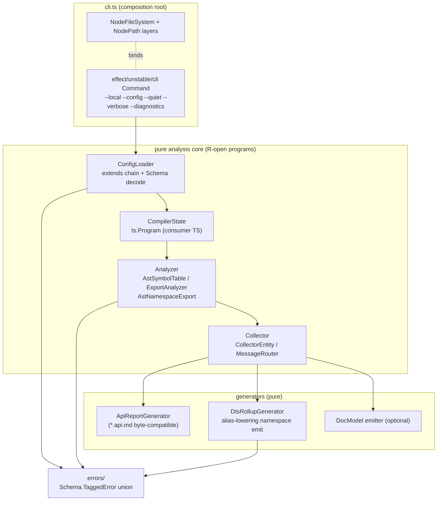

## Goal Capsule

- **Objective:** The monorepo's API surface gating (api reports and declaration rollups) runs on an owned, published `@systemfsoftware/api-extractor` package that reads existing `api-extractor.json` files unmodified, emits byte-compatible `*.api.md` reports and valid `.d.ts` rollups — including namespace barrels (`export * as X`) — and stays silent on success under `--quiet`.
- **Means:** Extract and re-architect upstream api-extractor (`/tmp/rushstack/apps/api-extractor`, v7.59.1) into `packages/api-extractor`, replacing all `@rushstack/*` runtime libraries with Effect 4 (`effect/unstable/cli`, `@effect/platform-node`) and Node built-ins, and fixing the namespace rollup emit strategy (KTD6).
- **Product Authority:** `@systemfsoftware/api-extractor` is the sole API extractor implementation for this repo's consumers; existing per-package `api-extractor.json` files are the compatibility contract and do not change.
- **Execution profile:** Deep plan, 8 units, dependency-ordered. `ce-work` implements; LFG pipeline ships.
- **Stop conditions:** any discovery that the TypeScript compiler API cannot express the alias-based namespace emit (KTD6) on the `packages/atom` topology without behavior regression to non-namespace packages; byte-diff of existing committed `etc/*.api.md` reports against the new engine that cannot be reconciled without changing a Product Contract requirement.
- **Open Blockers:** None.

**Product Contract preservation:** unchanged. All R/F/AE/KD IDs and meanings from the origin brainstorm are preserved verbatim below.

---

## Product Contract

### Summary

Publish an owned, standalone package at `packages/api-extractor` (`@systemfsoftware/api-extractor`) replacing `@microsoft/api-extractor`. It replaces the legacy Rushstack toolchain (`@rushstack/node-core-library`, `@rushstack/terminal`, `@rushstack/ts-command-line`) with native Effect 4 (`Effect.gen`, typed schemas and services), resolves long-standing `.d.ts` rollup defects for namespace re-exports (`export * as X`), and provides built-in `--quiet` execution to eliminate `api-extractor-quiet` shims.

### Problem Frame

The repository and modern TypeScript ecosystems face critical limitations with upstream `@microsoft/api-extractor`:

1. **Namespace Barrel Rollup Failure:** API Extractor's `.d.ts` rollup generator fails on modern TypeScript namespace exports (`export * as Atom from './Atom.js'`), emitting uncompilable or invalid declarations when modules import their own namespace back from entrypoints. Consequently, packages with namespace barrels (such as `@systemfsoftware/effect-atom`) are forced to disable `dtsRollup.enabled` and maintain fragile multi-gate workarounds (`AT1` in `packages/atom/AGENTS.md`).
2. **Heavy Legacy Toolchain & Incompatible Runtimes:** Upstream is tightly coupled to `@rushstack/node-core-library`, `@rushstack/terminal`, and `@rushstack/ts-command-line`, which rely on legacy Heft/Rush build conventions and conflicting runtime utilities rather than the workspace's first-party Effect ecosystem.
3. **Noisy Terminal Output:** Upstream has no native quiet mode and prints multi-line banners and status logs even on success, necessitating a custom `api-extractor-quiet` wrapper script in `packages/toolchain/tsdown-config/src/api-extractor-quiet.ts` to suppress log noise across dozens of workspace packages.

### Key Decisions

- KD1. **Independent Workspace Package at `packages/api-extractor`:** (session-settled: user-directed — chosen over vendored subtree or toolchain internal: owned outright per REPO-O1 as a first-class published package `@systemfsoftware/api-extractor`). Governs R1, R2.
- KD2. **Deep Effect Internal Overhaul:** (session-settled: user-directed — chosen over shallow TS wrapper: internal state machines, AST collectors, generators, and I/O run as typed Effect workflows and services using `@effect/platform-node`). Governs R3, R4, R5, R6.
- KD3. **Sever All `@rushstack/*` Dependencies:** (session-settled: user-directed — chosen over depending on published `@rushstack/*` npm packages: completely replace `node-core-library`, `terminal`, and `ts-command-line` with Effect Platform and standard Node utilities). Governs R7, R8.
- KD4. **Full 1:1 Backward Compatibility for `api-extractor.json`:** (session-settled: user-directed — chosen over breaking modern schema rewrite: accepts existing standard `api-extractor.json` configuration files without requiring config migrations across monorepo packages). Governs R9, R10.
- KD5. **Native `--quiet` Flag and Config Property:** Built-in support for suppressing success chatter via CLI flag (`--quiet`) and config (`"quiet": true`), deprecating and obsoleting `api-extractor-quiet`. Governs R11, R12.
- KD6. **Native Namespace Barrel Rollup Support:** Fix AST symbol analysis and `.d.ts` rollup generation for `export * as X from './Y'` statements to produce valid, standalone type declarations. Governs R13, R14, R15.

### Requirements

#### Packaging and Monorepo Integration

- R1. The package must reside at `packages/api-extractor`, publish as `@systemfsoftware/api-extractor`, and expose both an executable CLI binary (`api-extractor`) and programmatic Effect-based and Promise-based entrypoints.
- R2. The package must build via `tsdown`, pass `dts:check`, `api:check`, `lint` via oxlint, and pass all typecheck and test gates per repository doctrine.

#### Effect Architecture and Dependency Severance

- R3. File system access, path resolution, process execution, and environment handling must use `@effect/platform-node` (`FileSystem`, `Path`), eliminating `@rushstack/node-core-library`.
- R4. CLI argument parsing must be implemented using `@effect/cli` or standard Node primitives, eliminating `@rushstack/ts-command-line`.
- R5. Terminal output, diagnostic formatting, and colored logging must use Effect-native logging / `@effect/printer-ansi`, eliminating `@rushstack/terminal`.
- R6. Internal analysis errors, configuration failures, and TypeScript compiler diagnostic events must be modeled as typed tagged errors (`Data.TaggedError` or `Schema.TaggedError`), with fatal defects routed to Effect's error channel rather than untyped throws.
- R7. Zero dependencies on `@rushstack/*` or `@microsoft/api-extractor-model` must remain in `packages/api-extractor/package.json`; necessary model types and AST representations must be natively housed or inlined within the package.
- R8. Upstream rig configuration loading (`@rushstack/rig-package`) must be replaced with native config lookup or pure Node resolution.

#### Configuration and Backward Compatibility

- R9. The configuration loader must accept standard `api-extractor.json` files matching schema v7, including `<projectFolder>`, `<lookup>`, tokens, and `extends` inheritance.
- R10. Existing `api-extractor*.json` files across the monorepo must execute against `@systemfsoftware/api-extractor` without syntax modifications or schema errors.
- R11. The configuration schema must accept an optional boolean `"quiet"` property at the root level.
- R12. The CLI must accept `--quiet` (and `-q`) to suppress banner, configuration path, and success messages, emitting output only on warnings, diagnostics, or errors.

#### AST Analysis and .d.ts Rollup Generation

- R13. The analyzer must correctly parse and represent `export * as Name from './module'` syntax in symbol tables without dropping nested declarations or producing ambiguous namespaces.
- R14. The `.d.ts` rollup generator must emit valid declaration blocks for namespace exports that allow modules importing their own namespace back to compile cleanly under `tsc --noEmit`.
- R15. The rollup generator must continue to honor `publicTrimmedFilePath`, `betaTrimmedFilePath`, `untrimmedFilePath`, and `bundledPackages` options.
- R16. The API review report generator must continue to output exact `*.api.md` reports compatible with existing committed api reports across the repository.

### Key Flows

#### F1: Quiet Extraction Execution in Workspace Build

- **Trigger:** Package script invokes `api-extractor run --local --quiet` (or `api-extractor run` with `"quiet": true` in `api-extractor.json`).
- **Actors:** Developer, CI Runner, API Extractor CLI.
- **Steps:**
  1. CLI parses arguments and detects `--quiet`.
  2. Extractor loads and validates `api-extractor.json` via Effect FileSystem.
  3. Program runs TypeScript compilation, symbol collection, and analysis silently.
  4. Extractor writes `.d.ts` rollup and checks `etc/<package>.api.md`.
  5. Upon clean success, zero lines are printed to stdout, and process exits with status code 0.
- **Outcome:** Clean terminal output without needing `api-extractor-quiet.ts` shims.
- **Covered by:** R4, R11, R12, R16.

#### F2: Namespace Barrel Rollup Generation

- **Trigger:** Extractor processes an entrypoint containing `export * as Atom from './Atom.js'` where internal files import `type { Registry } from './Atom.js'`.
- **Actors:** API Extractor Rollup Engine.
- **Steps:**
  1. Analyzer identifies `export * as Atom` and builds an `AstNamespaceExport` symbol node.
  2. Symbol collector traverses export clauses and maps referenced symbols to their source declarations.
  3. DtsRollupGenerator writes out top-level declarations and wraps the exported namespace without circular self-referencing declaration errors.
  4. The generated `.d.ts` rollup is written to `dist/<package>.d.ts`.
- **Outcome:** Shipped `.d.ts` rollup compiles cleanly under `tsc --noEmit -p tsconfig.dts.json`.
- **Covered by:** R13, R14, R15.

### Acceptance Examples

#### AE1: Built-in Quiet Execution

- **Covers:** R11, R12
- **Given:** A valid package with `api-extractor.json` configured with `"quiet": true`.
- **When:** `api-extractor run` is executed on a clean, valid package.
- **Then:** The command exits with code 0 and stdout is completely empty.

#### AE2: Diagnostic Failure Output Under Quiet Mode

- **Covers:** R12, R16
- **Given:** A package where `etc/<package>.api.md` has uncommitted API changes and `--local` is not passed.
- **When:** `api-extractor run --quiet` is executed.
- **Then:** Extractor outputs the exact diff failure and warning/error diagnostics to stderr/stdout and exits with non-zero exit code.

#### AE3: Namespace Barrel Compilation

- **Covers:** R13, R14
- **Given:** A package with `export * as MyNamespace from './submodule.js'` and `dtsRollup.enabled: true`.
- **When:** `api-extractor run` generates `dist/package.d.ts`.
- **Then:** Running `tsc --noEmit dist/package.d.ts` passes with zero type or circular reference errors.

### Success Criteria

- The fork runs the repo's own compatibility corpus: every existing `api-extractor*.json` across the workspace executes, and regenerated reports byte-match the committed `etc/*.api.md` files (R10, R16 proven on real configs, not fixtures alone).
- `packages/atom` can flip `dtsRollup.enabled` back to `true` on at least one entrypoint with `dts:check` green — the AT1 blocker's proof condition (gated to a follow-up, see Deferred).

### Scope Boundaries

#### In Scope

- Creation of `packages/api-extractor` as an owned monorepo package published under `@systemfsoftware/api-extractor`.
- Porting core analyzer, collector, generators, and CLI from `/tmp/rushstack/apps/api-extractor`.
- Complete removal of `@rushstack/*` dependencies in favor of `@effect/platform-node` and Node built-ins.
- Fixing namespace re-export AST handling and `.d.ts` rollup generation.
- Native `--quiet` flag and `"quiet": true` config property.
- Deprecation of `packages/toolchain/tsdown-config/src/api-extractor-quiet.ts` once migrated (shim-only in this plan; deletion deferred).

#### Deferred to Follow-Up Work

- Flipping consumer packages' `api:check` scripts from `api-extractor-quiet run` to `api-extractor run --quiet`, one adoption PR per package cluster (25+ packages).
- Deleting `packages/toolchain/tsdown-config/src/api-extractor-quiet.ts` after full migration.
- Re-enabling `dtsRollup` on `packages/atom` entrypoints (AT1 rewrite) once AE3 holds on its topology.
- Migration of monorepo package dependencies from `@microsoft/api-extractor` to `@systemfsoftware/api-extractor` in manifests.
- Integration with Effect Schema v4 custom DSL schema authoring; `@systemfsoftware/api-extractor-model` as a separate package.

#### Outside This Product's Identity

- Replacing TypeScript's AST parser or type checker with oxc or alternative compilers (TypeScript compiler services remain required for semantic type resolution).
- Creating a general-purpose bundler or minifier (API Extractor remains focused on API report generation and declaration rollups).

---

## Planning Contract

### Key Technical Decisions

- KTD1. **Single workspace package, inlined model.** `packages/api-extractor` houses analyzer, collector, generators, CLI, and the inlined api-extractor-model types in one published package; no companion model package ships. (session-settled: user-directed — chosen over a separate `@systemfsoftware/api-extractor-model` package: monorepo needs one surface; Product Contract KD1 + R7. Governs U1, U5.)
- KTD2. **CLI on `effect/unstable/cli`, not `@effect/cli`.** The Product Contract's `@effect/cli` (R4) resolves to the Effect 4 CLI module `effect/unstable/cli` (`Command.make`, `Flag.Boolean/Flag.String`, `Flag.withAlias`, typed `CliError`) — no `@effect/cli` package exists in the effect 4.0.0-rc monorepo (verified: `repos/effect/packages/effect/package.json` exports `./unstable/cli`; `packages/` lists ai, atom, effect, opentelemetry, platform, sql, tools, vitest). Assumption A1 covers the residual naming drift. Governs U6.
- KTD3. **Config decode via Effect Schema on raw JSON.** Port `ExtractorConfig`'s load/extends/prepare pipeline; keep the v7 JSON schema as the validation source of truth (schema file vendored from upstream `schemas/api-extractor-defaults.json` + `api-extractor.schema.json`), validated with Effect Schema decode over the JSON object; add root-level optional `"quiet": boolean`. Merge semantics mirror upstream: `extends` chain is depth-first with array-valued properties replaced and object dictionaries deep-merged; circular `extends` is a typed `ConfigError` (no overrideTsconfig-style hacks); unknown tokens resolve to `UnresolvedTokenError`. Rig lookup (`ExtractorConfig.ts:506-563`) is dropped — zero monorepo packages use rigs; `extends` resolves through Node package resolution. (session-settled: user-directed — full 1:1 config compatibility, chosen over a modernized schema: KD4 + R9, R10, R11. Governs U3.)
- KTD4. **Namespace rollup emit via alias-lowering (NamespaceFixer strategy).** Replace upstream's inline `export declare namespace Ns { export { X } }` emission for `AstNamespaceExport`/`AstNamespaceImport` (upstream `DtsRollupGenerator.ts:156-223`, which hard-throws on star exports at `:167-172`) with the alias-lowering proven by rollup-plugin-dts: for each member, hoist a uniquely-named top-level alias (`type Ns_X = X` for type-only, `declare const Ns_X: typeof X` for value-only, both for classes/enums, `import Ns_X = X` for nested namespaces; star-exported members resolved through the star module's export table first, with a typed `UnsupportedStarExportError` when a member cannot be enumerated), then emit `export declare namespace Ns { export { Ns_X as X } }`. This decouples sibling back-imports (`Atom.ts` importing `Registry.js`) from the namespace container and removes the circularity AT1 records. Non-namespace packages keep upstream byte-identical emission order for non-namespace entities. (session-settled: user-directed — fix must make namespace barrels valid, chosen over leaving rollup disabled: KD6 + R13, R14, R15. Governs U7, U8.)
- KTD5. **Quiet is a message-router gate, not an output filter.** Precedence (highest wins): CLI `--diagnostics` > CLI `--verbose` > CLI `--quiet`/`-q` > config `"quiet"` > default (chatty). Suppression happens in the message router before ANSI rendering (silent messages are never formatted). Banners, config path line, TS version preamble (`Extractor.ts:512-515`), and the success line (`RunAction.ts:158`) route through the same gate; warnings/errors/diagnostics always print. (Governs U6, U7.)
- KTD6. **Ports in pure modules, adapters at the shell.** `FileSystem`/`Path` capabilities come from `effect`'s service interfaces; `NodeFileSystem.layer`/`NodePath.layer` bind them only in `src/cli.ts` (composition root) and test bootstrap; library entrypoints export programs with `R` open, never bound singletons (pack: cell-architecture, compound-packs/cell-architecture/ports-separate-from-layers.md; composition-root-binding.md). Governs U2, U6.
- KTD7. **Typed error taxonomy as one closed union.** `Schema.TaggedError` subclasses in `src/errors/`: `ConfigError` family (`ConfigFileNotFound`, `ConfigJsonSyntaxError`, `ConfigSchemaValidationError`, `UnresolvedTokenError`, `CircularConfigExtendsError`), `CompilerError` family (`TsConfigReadError`, `TypeScriptDiagnosticError`), `AnalysisError` family (`UnsupportedSyntaxError`, `CircularNamespaceReferenceError`, `UnsupportedStarExportError`, `ForgottenExportError`), `ReportError` family (`ApiReportMismatchError`, `ApiReportMissingError`). Infrastructure I/O failures keep `PlatformError` as-is. Non-fatal findings (missing TSDoc tags, forgotten-export warnings) stay messages, not errors. Replaces every upstream `InternalError`/`AlreadyReportedError` throw. (Governs U2, U4, U7, U8.)

### Assumptions

- A1. The Product Contract's `@effect/cli` naming is read as `effect/unstable/cli` (KTD2); no separate dependency is added under that name.
- A2. `api-extractor-quiet` (20+ package scripts) is retired by adoption PRs after this plan ships; this plan only makes the shim forward safely or leaves it untouched if nothing breaks. R1's Promise entrypoint resolves with an `ExtractorResult` (never throws) mirroring upstream `Extractor.invoke`, so a shim or external runner keeps its contract.
- A3. Per-entry configs (`packages/atom` runs eight) keep working concurrently because each config's `reportTempFolder` is distinct; this plan does not invent PID/UUID temp isolation.
- A4. The vendored `/tmp/rushstack` tree is the porting source; it is a scratch clone, so the plan records upstream version 7.59.1 in the package README provenance line rather than depending on the clone's persistence.
- A5. TypeScript stays a peer dependency (`>=5.4`) plus devDependency for the engine's own compile; the extractor loads the consumer-resolved TypeScript like upstream does.

### High-Level Technical Design



Pipeline order is upstream's (CLI → config → compile → analyze → collect → generate). The core runs as Effect programs over `FileSystem`/`Path` requirements; only `cli.ts` binds Node layers. `*.workflow.ts`/`Workflow.make` cells are **not** imposed on the ported engine — the upstream code is compiler-plumbing, not domain decisions; where a genuinely pure decision emerges (e.g. config token expansion, quiet-precedence resolution) it is extracted as a pure function with property coverage, and the rest stays typed imperative Effect. This is the deliberate boundary of KTD2's "deep overhaul": channels and effects, not a sandwich rewrite of the TS walker.

### Output Structure

```
packages/api-extractor/
├── package.json            # bin api-extractor → dist/cli.mjs; scripts per exemplar
├── tsdown.config.ts        # entry index.ts + cli.ts; devExports source condition
├── tsconfig.json / tsconfig.build.json / tsconfig.node.json / tsconfig.api.json
├── api-extractor.json      # self-hosting config (dogfood)
├── oxlint.config.ts / vitest.config.ts / .attw.json
├── AGENTS.md               # leaf rules AE-R1..R5 (port patterns dossier)
├── README.md / LICENSE
├── src/
│   ├── index.ts            # programmatic surface: runEffect + invoke (Promise)
│   ├── cli.ts              # composition root: layers + Command.runWith
│   ├── errors/             # KTD7 closed error union
│   ├── config/             # ExtractorConfig port, tokens, extends, schema
│   ├── compiler/           # CompilerState over consumer TypeScript
│   ├── analyzer/           # AstSymbolTable, ExportAnalyzer, AstNamespace*
│   ├── collector/          # Collector, CollectorEntity, MessageRouter, SourceMapper
│   ├── generators/         # ApiReportGenerator, DtsRollupGenerator, DocModel
│   └── model/              # inlined api-extractor-model types (ApiItem tree, ReleaseTag)
└── tests/
    ├── *.integration.test.ts   # in-process fixture packages
    └── e2e/                    # contract lane: packed tarball journeys (J1, J2)
```

---

## Implementation Units

### U1. Package scaffold and build gates

- **Goal:** `packages/api-extractor` exists, builds, and passes the repo's standard gates.
- **Requirements:** R1, R2; KD1.
- **Dependencies:** none.
- **Files:** `packages/api-extractor/package.json`, `tsdown.config.ts`, `tsconfig.json`, `tsconfig.build.json`, `tsconfig.node.json`, `tsconfig.api.json`, `api-extractor.json`, `oxlint.config.ts`, `vitest.config.ts`, `.attw.json`, `AGENTS.md`, `README.md`, `LICENSE`, `src/index.ts`, `src/cli.ts` (stubs), `pnpm-workspace.yaml` (no change needed — `packages/*` glob covers it).
- **Approach:**
  1. Mirror `packages/npm-package/` for the config set, with two entries in `tsdown.config.ts` (`index`, `cli`) and `bin: { "api-extractor": "./dist/cli.mjs" }`.
  2. `neverBundle`: `effect`, `@effect/platform`, `@effect/platform-node`, `typescript`, `@microsoft/tsdoc`, `@microsoft/tsdoc-config`, `diff`, `minimatch`, `semver`, `source-map`, `debug`.
  3. Dogfood: package's own `api-extractor.json` + `tsconfig.api.json` (`customConditions: []`) so `api:check` gates its own surface once the engine exists.
  4. AGENTS.md carries the leaf rules from the patterns dossier (zero rushstack deps; namespace rollup validity; quiet stdout-empty contract; no child-process spawning in integration tests; typed errors only).
- **Patterns to follow:** `packages/npm-package/` (whole config set); `packages/toolchain/tsdown-config/package.json` (bin field); root AGENTS.md REPO-S4 (tsdown owns exports).
- **Test scenarios:** `Test expectation: none — packaging scaffolding; the gates in Verification prove it.`
- **Verification:** `pnpm install` resolves; `pnpm --filter @systemfsoftware/api-extractor build typecheck lint` exit 0 (api:check skips until U5 wires reports); boundaries audit clean.

### U2. Error taxonomy and Effect-typed foundations

- **Goal:** Every failure mode the engine can produce has a typed home before porting begins.
- **Requirements:** R6; KD2 (KTD7).
- **Dependencies:** U1.
- **Files:** `src/errors/index.ts`, `src/errors/config.ts`, `src/errors/compiler.ts`, `src/errors/analysis.ts`, `src/errors/report.ts`.
- **Approach:** `Schema.TaggedError` classes per KTD7; `cause: Schema.optional(Schema.Unknown)` on wrapping variants; a `ExtractorError` union type + `Match`-friendly guards; unit coverage asserting each variant's tag/codec round-trip.
- **Test scenarios:**
  - Each error variant constructs with cause preserved and decodes from its encoded form.
  - The union's guards discriminate every family tag.
- **Verification:** `pnpm --filter @systemfsoftware/api-extractor test -- errors` green; typecheck green.

### U3. Config loader (ExtractorConfig port)

- **Goal:** `ExtractorConfig.prepare`/`loadFile` semantics with `extends`, token expansion, schema validation, and `"quiet"` — no rushstack code.
- **Requirements:** R8, R9, R10, R11; KD3, KD4 (KTD3).
- **Dependencies:** U2.
- **Files:** `src/config/extractor-config.ts`, `src/config/json-schema.ts`, `src/config/tokens.ts`, `src/config/__tests__/tokens.property.test.ts`, `src/config/__tests__/extends.integration.test.ts`.
- **Approach:**
  1. Port the extends-chain walk (`ExtractorConfig.ts:626-708`) onto `FileSystem`/`Path`; arrays replace, objects deep-merge, cycles → `CircularConfigExtendsError`.
  2. Token expansion (`<projectFolder>`, `<lookup>`, `<packageName>`, `<unscopedPackageName>`) as a pure function; unknown token → `UnresolvedTokenError`. `<lookup>` walks up for `api-extractor.json`/`tsconfig.json` exactly as upstream's heuristic, minus rig files.
  3. Vendor `api-extractor.schema.json` + defaults from upstream 7.59.1, decode with Effect Schema over parsed JSON → `ConfigSchemaValidationError` on unknown/invalid.
  4. Root `"quiet": Schema.optional(Schema.Boolean)`.
- **Patterns to follow:** upstream `ExtractorConfig` test fixtures (`config-lookup1..3`).
- **Test scenarios:**
  - Property: token expansion is total — every schema-legal config with resolvable tokens yields a config, or a typed `UnresolvedTokenError` names the offending token (pure core, generated configs).
  - Property: extends merge is associative for the schema's two shape classes (array-replace, object-merge).
  - Integration: fixture package using `<lookup>` + one-level `extends` resolves to the same merged config upstream would produce (golden JSON).
  - Integration: `packages/npm-package/api-extractor.json` (real repo config) loads and validates unchanged (R10 corpus starts here).
  - Error paths: missing file → `ConfigFileNotFound`; malformed JSON → `ConfigJsonSyntaxError`; circular extends → `Covers AE-adjacent` typed failure.
- **Verification:** config suite green; typecheck green.

### U4. Compiler state and message router

- **Goal:** `ts.Program` construction over the consumer's TypeScript and the gated message pipeline.
- **Requirements:** R5, R6, R12 (precedence half); KD2, KD5 (KTD5).
- **Dependencies:** U3.
- **Files:** `src/compiler/compiler-state.ts`, `src/collector/message-router.ts`, `src/collector/__tests__/quiet-precedence.property.test.ts`.
- **Approach:**
  1. Port `CompilerState` (`CompilerState.ts`) loading tsconfig via `tsconfigFilePath`, honoring `customConditions` semantics of the consumer's tsconfig (the engine itself must not inject any condition).
  2. `MessageRouter` port: log levels per `ConsoleMessageId`, handler → `Terminal`/console write; quiet gate evaluated once from resolved precedence (KTD5) and applied before formatting.
  3. Pure precedence resolver: `(cliFlags, configQuiet) → verbosity` decision function.
- **Patterns to follow:** upstream `MessageRouter.ts` level matrix; `api-extractor-quiet.ts` success-line regex list defines exactly which messages are chatter.
- **Test scenarios:**
  - Property: precedence resolver is monotone — `--diagnostics` beats everything, `--verbose` beats quiet, CLI beats config, config beats default (exhaustive pair table as deterministic universal; batch spans the boundary shapes).
  - Integration: quiet run of a clean fixture emits zero writes through a recording Terminal port; failing run emits diagnostics.
- **Verification:** router suite green.

### U5. Analyzer + collector port (the symbol graph)

- **Goal:** The upstream analyzer/collector pipeline over `.d.ts` entries, with `AstNamespaceExport` first-class, rushstack-free.
- **Requirements:** R13, R16 (report input side); KD2, KD3.
- **Dependencies:** U4.
- **Files:** `src/analyzer/` (port of AstSymbolTable, AstSymbol, AstDeclaration, AstImport, AstNamespaceImport, AstNamespaceExport, ExportAnalyzer, Span, SourceFileLocationFormatter, TypeScriptHelpers, TypeScriptInternals, PackageMetadataManager), `src/collector/` (Collector, CollectorEntity, SourceMapper, WorkingPackage), `src/model/` (inlined `api-extractor-model` subset: ApiItem hierarchy, ReleaseTag, Excerpt).
- **Approach:**
  1. Mechanical port first: keep module structure and names, swap `InternalError` → KTD7 variants, `Sort` → comparator helpers, `PackageJsonLookup`/`FileSystem`/`Path` → platform services, `JsonFile` → Schema decode. ExportAnalyzer's `export * as` branch (`ExportAnalyzer.ts:574-624`) ports as-is; `shouldInlineExport` (`CollectorEntity.ts:88-90`) ports as-is.
  2. `TypeScriptInternals` (global-name detection) ports against the consumer TS module — upstream already isolates the fragile internals there.
  3. No behavior change to entity ordering in this unit — byte-stable report output is U7's gate.
- **Patterns to follow:** upstream layout (`analyzer/`, `collector/`); sever-strykerjs plan's "imports AND non-import occurrences" sweep discipline for upstream-name references.
- **Test scenarios:**
  - Integration: fixture with namespace barrel (`export * as Registry from './Registry.js'` + sibling back-import) collects an entity graph whose entity names and release tags match a golden snapshot.
  - Integration: fixture with a forgotten export surfaces `ae-forgotten-export` as a message (not an error) per upstream level config.
- **Verification:** analyzer/collector suites green on fixtures.

### U6. CLI + programmatic surface

- **Goal:** `api-extractor run|init` binary and the dual programmatic entrypoints.
- **Requirements:** R1, R4, R5, R12; KD2, KD5 (KTD2, KTD5, KTD6).
- **Dependencies:** U5.
- **Files:** `src/cli.ts`, `src/cli/run-action.ts`, `src/cli/init-action.ts`, `src/index.ts`, `src/invoke.ts`.
- **Approach:**
  1. `Command.make` with subcommands `run` and `init`; flags: `--config/-c`, `--local/-l`, `--quiet/-q` (`Flag.withAlias`), `--verbose`, `--diagnostics`, `--types-compiler` (upstream parity where cheap).
  2. `runEffect(config, options): Effect<ExtractorResult, ExtractorError, FileSystem | Path | Terminal>` — R open; `invoke(config, options): Promise<ExtractorResult>` binds `NodeServices.layer` internally and resolves with the result (never rejects for message-level failures; rejects only on fatal `ExtractorError`).
  3. `cli.ts` is the only module importing `@effect/platform-node` layers (KTD6); exit codes: 0 success, 1 messages-or-error, mapped from the result.
- **Patterns to follow:** `effect/unstable/cli` vendored docs (`repos/effect/packages/effect/src/unstable/cli/Command.ts`, `Flag.ts`).
- **Test scenarios:**
  - Integration: `runEffect` over a fixture config in a `FileSystem.layerNoop` world produces an `ExtractorResult` with correct `succeeded`/`errorCount`; typed error surfaces on a corrupt config.
  - Covers AE1 (config half): `"quiet": true` + clean fixture → zero Terminal writes, exit 0.
  - Covers AE2: stale report + `--quiet` (no `--local`) → diff + diagnostics emitted, exit 1.
  - Covers F1 steps 1–5 end to end in-process.
- **Verification:** CLI/action suites green.

### U7. Generators: API report byte-compatibility

- **Goal:** `ApiReportGenerator` output byte-identical to upstream 7.59.1 for the repo's surfaces.
- **Requirements:** R16, R10; KD4 (KTD3 alignment).
- **Dependencies:** U5, U6.
- **Files:** `src/generators/api-report-generator.ts`, `src/generators/indented-writer.ts`, `src/generators/__tests__/report-parity.integration.test.ts`, `tests/api-report-parity.integration.test.ts`.
- **Approach:** Port `ApiReportGenerator` + `IndentedWriter` mechanically; newline policy from config (`NewlineKind`); the parity test regenerates reports for the compatibility corpus (repo packages with committed `etc/*.api.md`) and diffs byte-for-byte.
- **Test scenarios:**
  - Covers R16: every package in the corpus regenerates a byte-identical `etc/*.api.md` (golden diff; corpus enumerated in Verification).
  - Edge: `@internal` trimming honors `publicTrimmedFilePath` when configured (fixture with trimmed/untrimmed pair).
- **Verification:** parity suite green on the full corpus.

### U8. DtsRollupGenerator with alias-lowered namespaces

- **Goal:** Namespace barrels roll up validly; non-namespace output unchanged.
- **Requirements:** R14, R15; KD6 (KTD4).
- **Dependencies:** U7 (report parity locks the non-namespace baseline first).
- **Files:** `src/generators/dts-rollup-generator.ts`, `src/generators/namespace-aliaser.ts`, `src/generators/__tests__/namespace-rollup.integration.test.ts`, `tests/e2e/namespace-rollup.e2e.test.ts`.
- **Approach:**
  1. Port `DtsRollupGenerator` keeping release-tag trimming and file emission order for non-namespace entities.
  2. Replace the namespace emission block with KTD4's alias-lowering: hoisted `type Ns_X` / `declare const Ns_X` / `import Ns_X = X` aliases + `export { Ns_X as X }` inside the synthetic namespace; star-export members resolved via the star module's export table, else `UnsupportedStarExportError`.
  3. AE3 proof: generated rollup typechecks under `tsc --noEmit`.
- **Patterns to follow:** rollup-plugin-dts `NamespaceFixer` strategy (external research, Sources); upstream trimming logic preserved.
- **Test scenarios:**
  - Covers AE3: fixture barrel (`export * as Ns` + sibling back-import + type-only and value-only members) → rollup compiles clean under `tsc --noEmit`.
  - Edge: nested namespace export (`export * as Root` whose module itself does `export * as Inner`) → no root-flattening; hierarchy preserved (upstream issue #5336 case).
  - Edge: star export inside a namespace'd module → members enumerated from the star module, or typed `UnsupportedStarExportError` (never an untyped throw).
  - Covers R15: `bundledPackages` inlining and trimmed rollups behave as upstream on a fixture.
  - Regression: non-namespace package (corpus member) rollup output byte-stable vs upstream.
- **Verification:** rollup suites green; `dts:check` on fixtures.

---

## Verification Contract

| Gate              | Command                                                  | Proves                                                                                |
| ----------------- | -------------------------------------------------------- | ------------------------------------------------------------------------------------- |
| Build + self-host | `pnpm --filter @systemfsoftware/api-extractor build`     | tsdown emits dist; package's own api:check runs (dogfood, U1+)                        |
| Types shipped     | `pnpm --filter @systemfsoftware/api-extractor dts:check` | `dist/index.d.ts` compiles standalone                                                 |
| Lint              | `pnpm --filter @systemfsoftware/api-extractor lint`      | oxlint `all`-preset clean                                                             |
| Tests             | `pnpm --filter @systemfsoftware/api-extractor test`      | property + in-process integration suites                                              |
| Types-wrong       | `pnpm --filter @systemfsoftware/api-extractor attw`      | published map resolves types                                                          |
| E2E contract lane | `pnpm --filter @systemfsoftware/api-extractor test:e2e`  | J1 packed-install `--help` + clean run; J2 quiet stdout-empty + failure exit contract |
| Local chain       | `pnpm check:local`                                       | repo-wide pre-delivery chain                                                          |

**Compatibility corpus (R10/R16 gates):** `packages/npm-package`, `packages/effect-cell-types`, `packages/effect-schema-extensions` (two configs incl. `hex-schema`), `packages/effect-atom/effect-atom` (eight configs, concurrently) — regenerate reports with the new engine and require byte-identical output against committed `etc/*.api.md`. Report parity and rollup fixtures are the AE1–AE3 proofs.

**Mutation:** per REPO-D3, no local mutation runs; CI's advisory Mutation workflow reads the package's `stryker.config.json` if enrolled — enroll pure decision modules only (tokens, precedence, aliaser), matching the property-cell doctrine.

---

## Definition of Done

- All units U1–U8 implemented; Verification Contract gates green on the last edit (`pnpm check:local` exit 0), including the compatibility corpus byte-parity and AE1–AE3 scenarios.
- E2E contract lane proves the shipped tarball (J1, J2); no child-process spawning outside `tests/e2e/`.
- Zero `@rushstack/*` or `@microsoft/api-extractor*` specifiers in `packages/api-extractor` sources and manifest (grep gate in AGENTS.md leaf rules).
- Changeset per REPO-R2 (`minor`, new package) with consumer-observable body; repo tree left restartable.
- Dead-end experiments removed; abandoned approaches absent from the final diff.
- Deferred items (consumer script migration, quiet-shim deletion, atom dtsRollup flip) tracked as follow-ups, not half-done here.

---

## Appendix

### Sources / Research

- Upstream source of record: `/tmp/rushstack/apps/api-extractor` v7.59.1 (scratch clone; provenance line goes in README). Seam citations: `ExtractorConfig.ts:626-708` (extends), `:506-563` (rigs), `DtsRollupGenerator.ts:156-223` + `:167-172` (namespace emission + star-export throw), `CollectorEntity.ts:88-90` (`shouldInlineExport`), `ExportAnalyzer.ts:574-624` (`export * as`), `RunAction.ts:145,158` and `Extractor.ts:512-515` (chatter lines).
- Upstream namespace issues: rushstack#2780, #2412, #5336; PR #4698 (basic support since 7.47.0). Alias-lowering strategy: rollup-plugin-dts `src/transform/NamespaceFixer.ts`.
- Effect surface: vendored `repos/effect/packages/effect/src/unstable/cli/` (Command, Flag, CliError); `repos/effect/packages/platform/node/src/NodeServices.ts`; `effect/FileSystem`, `effect/Path`, `PlatformError`, `FileSystem.layerNoop`.
- Repo learnings: `docs/solutions/build-errors/exports-types-rollup-drift.md`, `docs/solutions/build-errors/stale-api-report-outlives-toolchain.md`, `docs/solutions/build-errors/tsdown-private-dependency-bare-import-dist.md`, `docs/solutions/build-errors/dts-emitter-drops-bundled-entry-reexports.md`, `docs/plans/2026-08-23-001-sever-strykerjs-org-dependencies-plan.md` (severance precedent).
- Pack citations: `(pack: cell-architecture, compound-packs/cell-architecture/ports-separate-from-layers.md)`, `(pack: cell-architecture, compound-packs/cell-architecture/composition-root-binding.md)`, `(pack: boundary-testing, compound-packs/boundary-testing/real-system-oracles.md)`, `(pack: boundary-testing, compound-packs/boundary-testing/no-mocks-on-internal-glue.md)`.
- Exemplar configs: `packages/npm-package/` (package.json, tsdown.config.ts, tsconfig*.json, api-extractor.json), `packages/toolchain/tsdown-config/src/api-extractor-quiet.ts` (chatter regex list), `packages/atom/AGENTS.md` AT1 (the blocker being fixed).
