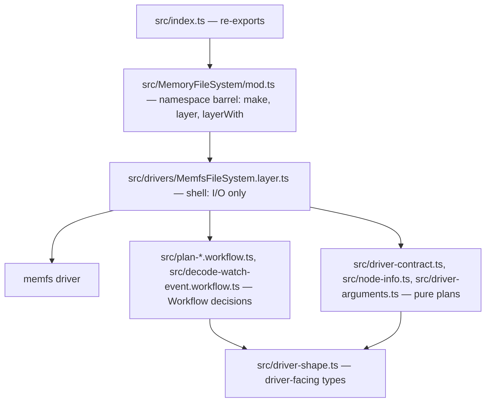

# effect-memfs Cell-Architecture Refactor - Plan

## Goal Capsule

- **Objective:** Consumers who mount an in-memory `FileSystem` in their tests get one that is verified rather than assumed — every decision it owns is pure and read by an instrument, every driver assumption is pinned against an independent oracle, and every refusal it reports is truthful.
- **Means:** The package's 711-line procedural adapter becomes a cell-shaped package — a pure decision core, a thin driver shell, and the evidence set that reads both (KD1, KD4).
- **Product authority:** `CONSTITUTION.md` and the two packs declared in `.compound-engineering/config.yaml` — `compound-packs/cell-architecture` and `compound-packs/boundary-testing`.
- **Open blockers:** None.

---

## Product Contract

Product Contract preservation: restructured, no scope change — R1 split into R1 + R17 (decisions versus single-outcome mappings), R18 added (seek refusal contract discovered in the vendored port), AE8 added, KD2's sandwich sites corrected by driver evidence, the inventory table's target column resolved, and the three deferred questions answered in KTD2, KTD6, and KTD8.

### Summary

`@systemfsoftware/effect-memfs` is refactored from one procedural file into a pure decision core plus a thin driver shell, with the evidence to read both. The published constructors keep their signatures and behavior, so no consumer migration is needed.

### Problem Frame

The package implements Effect's `FileSystem` port over the `memfs` driver, and that is its entire job: it is the in-memory filesystem adopters mount to test code that touches files. Every one of its ~100 private helpers decides something on the way from a port call to a driver call — how an errno code becomes a `SystemErrorTag`, how a driver stat record becomes `File.Info`, what a `mode` defaults to, how a temporary path is assembled — and every one of those decisions is written as an inline `if` ladder, an option-normalization helper, or an `unknown`-narrowing predicate inside a single 711-line module.

That shape costs exactly what the repo's doctrine says it costs. No decision can be read by an instrument: there are no `Workflow` values for mutation to target, and `src/**/*.test.ts` — the package's own vitest include — matches no file in the package. The decisions are also unobservable to a reviewer, because the branch that decides a `SystemErrorTag` sits 40 lines from the branch that decides a path.

The second cost is silence. `watch` returns `Stream.empty` for every path, so a consumer watching a directory is told "no events" by a filesystem that can never report one. `readDirectory` discards its `recursive` option. `makeTempFile` discards its `suffix` option. Driver failures are rebuilt as `PlatformError`s without `cause`, so the underlying error is destroyed on the way out. `File.seek` sets a negative cursor where the port's contract refuses the seek with `BadArgument`. None of this is visible from the package's own gates, which pass.

The gap is not the lint preset — `@systemfsoftware/oxlint-config-recommended` already composes the cell-architecture rules, so `ban-unknown`, `no-io-boundary-tests`, and `ban-error-string` are live against this package today. The gap is that nothing in the package gives those rules or the mutation instrument anything to read, and the two leaf rules that claim to gate the adapter (`MF1`, `MF2`) name rule ids no plugin publishes and a filename that does not exist.

### Key Decisions

- KD1. **The driver stays authoritative for filesystem semantics** — the refactor extracts the decisions the adapter owns and leaves `memfs` to decide filesystem behavior. (session-settled: user-directed — chosen over a pure-core in-memory volume with `memfs` demoted to an oracle: the wrapper's fidelity to the driver is its product, the published surface stays intact, and a hand-rolled engine would have to match `cp`, `glob`, symlink resolution, and mode semantics before it could ship.) Governs R1, R17, R2, R9.
- KD2. **A `Sandwich`-grade multi-phase sequence is used only where the adapter owns one** — the `writeAll` continuation loop and the watch stream; temporary-entry creation and the remaining port methods are a thin shell over the pure plans, because planning found they hold no decision beyond argument planning and the workflow slots demand a branded decision. Rejected: a sandwich per port method, which would make 25 five-phase cells out of methods that own no decision. Governs R1, R5, R13.
- KD3. **The refactor fixes only places where the port's promise is unmet or error information is destroyed** — a working default is not changed. A divergence the pins find against `node:fs` where the current default already works is recorded as pinned behavior, not silently corrected. Governs R4, R6, R7, R18, R9.
- KD4. **The namespace barrel lands additively** — `MemoryFileSystem` becomes a namespace export while `make`, `layer`, and `layerWith` stay as named exports, so no consumer breaks. Rejected: a namespace-only barrel, which would silently remove three published top-level exports. Governs R13, R14.
- KD5. **`watch` is implemented over the driver's watcher.** (session-settled: user-directed — chosen over failing loudly as unsupported and over leaving the silent empty stream: an empty stream reports "no events" for a filesystem that can never report any, which is neither acceptance nor refusal.) Governs R5. Feasibility verified after settlement: the driver ships both `fs.watch` (inode events) and `fs.watchFile` (stat polling) — `@jsonjoy.com/fs-node/lib/volume.d.ts:329-333`, `memfs/docs/node.md:138-152`.

### Requirements

#### Pure decision core

- R1. Every inventory row that branches over outcomes or carries an error channel is a `Workflow` value in its own `*.workflow.ts` module: cyclomatic complexity 1, exhaustive dispatch over a closed tagged union, and no I/O, clock read, or randomness in the body. (pack: cell-architecture, pure-decision-workflows.md)
- R17. Every remaining inventory row — a single-outcome mapping — is a pure function in a dedicated module outside the shell, never a workflow with an invented second variant and never a shell-private helper. (`docs/solutions/architecture-patterns/workflow-success-channel-tagged-union.md`)
- R2. No decision remains in the shell: `src/drivers/MemfsFileSystem.layer.ts` contains no control-flow ladder, no option-normalization helper, no driver-value narrowing helper, and no read/seek/write arithmetic. Gate: review against the inventory below.

**Decision inventory.** Each row is one decision to extract; the third column is its current form in `packages/effect-memfs/src/MemoryFileSystemMake.ts`; the fourth names the resolved home.

| #  | Decision                                              | Current form                                                                                                   | Resolved home                                        |
| -- | ----------------------------------------------------- | -------------------------------------------------------------------------------------------------------------- | ---------------------------------------------------- |
| 1  | Driver errno code to `SystemErrorTag`                 | `REASON_BY_ERRNO` lookup with `?? 'Unknown'`                                                                   | `src/driver-contract.ts` (pure)                      |
| 2  | Driver value to a typed stat or handle record         | Six `unknown` predicates throwing `TypeError`                                                                  | `src/node-info.ts` (pure)                            |
| 3  | Stat record to `File.Type`                            | Seven-deep mutually recursive `if` ladder                                                                      | `src/node-info.ts` (pure)                            |
| 4  | Numeric field to `Option` (zero and `NaN` are absent) | `numberUnlessNaN`, `numberOrNull`, `sizeOrNull`                                                                | `src/node-info.ts` (pure)                            |
| 5  | Access options plus constants to mode bits            | `withReadable`, `withWritable`, `accessMode`                                                                   | `src/driver-arguments.ts` (pure)                     |
| 6  | `makeDirectory` options to driver args                | `directoryMode` (`0o755` default), `recursiveOption`                                                           | `src/driver-arguments.ts` (pure)                     |
| 7  | `copy` options to driver args                         | `copyForce`, `copyPreserveTimestamps`, hardcoded `recursive: true`                                             | `src/driver-arguments.ts` (pure)                     |
| 8  | `remove` options to driver args                       | `removeFactory`, `recursiveOption`, `forceOption`                                                              | `src/driver-arguments.ts` (pure)                     |
| 9  | `open` and `writeFile` options to driver args         | `openFlag` (`'r'` default), `modeField`, `flagField`                                                           | `src/driver-arguments.ts` (pure)                     |
| 10 | Temp options to a directory path or file name         | `directoryFromOptions` (`/tmp`), `tempDirParentFromOptions` (`dir + '/.'`), `mkdtempPath`, `prefixFromOptions` | `src/driver-arguments.ts` (pure)                     |
| 11 | `glob` options to driver args, and entries to paths   | `globCwd*`, `globExclude*`, `toGlobPath`, `nameFromObject`                                                     | `src/driver-arguments.ts` (pure)                     |
| 12 | Read result to `Option<Uint8Array>`                   | `optionFromRead`, `optionFromNonemptyRead`                                                                     | `src/plan-read-slice.workflow.ts` (Workflow)         |
| 13 | Write progress to continue, fail, or done             | `writeAllChunk`, `continueWriteAll`, `afterWriteAllBytes`, `writeZeroError`                                    | `src/plan-write-continuation.workflow.ts` (Workflow) |
| 14 | Cursor arithmetic                                     | `applySeek`, `clampCursor`                                                                                     | `src/plan-seek.workflow.ts` (Workflow)               |
| 15 | Driver watcher event to `WatchEvent`                  | none today — `watch` returns `Stream.empty`                                                                    | `src/decode-watch-event.workflow.ts` (Workflow)      |

#### Boundary truthfulness

- R3. A driver failure reaches consumers as a `PlatformError` carrying the original driver error as `cause` and a `description` naming the operation. (pack: cell-architecture, four-channel-contracts.md)
- R4. Every errno the driver can raise maps to one of the 11 `SystemErrorTag` members in `repos/effect/packages/effect/src/PlatformError.ts`; `Unknown` is reserved for codes the driver never emits. (pack: boundary-testing, real-system-oracles.md)
- R5. `watch` emits the driver's real filesystem events as `WatchEvent`s — `Create`, `Update`, `Remove` — and never an empty stream. (pack: boundary-testing, staged-protocol-evidence.md)
- R6. `readDirectory` honors its `recursive` option.
- R7. `makeTempFile` honors its `suffix` option.
- R8. A driver value that does not match its expected shape is refused with a typed error naming the operation and carrying the offending value as `cause`, never a bare `TypeError` that degrades to an `Unknown` tag.
- R18. `File.seek` refuses a seek to before the start with `BadArgument` and leaves the cursor unchanged, per the port contract at `repos/effect/packages/effect/src/FileSystem.ts:861`.

#### Evidence

- R9. The driver semantics this layer relies on are pinned by `@systemfsoftware/differential-spec` comparisons against `node:fs` on the same operations: errno codes, `readdir` recursion, glob path shape, copy and overwrite semantics, temporary-path naming, and mode defaults. (pack: boundary-testing, pin-dependency-semantics.md)
- R10. The port is verified against a real in-memory volume and a real temporary directory: every operation proves both acceptance where its target exists and refusal where it does not, and every acquired handle, watcher, and listener is released by the end of the suite. (pack: boundary-testing, real-system-oracles.md)
- R11. Each extracted decision is enrolled in the mutation instrument at its `Workflow.make` boundary; a property test is granted to a decision only where a named risk justifies one, and that risk is stated beside the test.
- R12. No test targets the adapter file itself, in-source or as a `*.test.ts` — the shell is read by lint provenance and composition tests. (pack: boundary-testing, no-mocks-on-internal-glue.md) Gate: `no-io-boundary-tests` reports zero findings.

#### Topology and governance

- R13. Module topology follows the conformant sibling `packages/effect-readiness/src`: decisions and pure driver modules at the package `src/` root, the driver shell under `src/drivers/`, and one namespace barrel at `src/MemoryFileSystem/mod.ts` re-exported by `src/index.ts`. (pack: cell-architecture, single-namespace-barrel.md)
- R14. The published surface is unbroken: `make(contents?, opts?)`, `layer`, `layerWith(contents)`, `Contents`, and every `MemoryFileSystem.*` member keep their current signatures and behavior, with the api report regenerated deliberately in the same change. (pack: cell-architecture, composition-root-binding.md)
- R15. `AGENTS.md`'s `MF1` and `MF2` name gates that exist and files that exist, replacing the two rule ids no plugin publishes and the `memory-file-system.adapter.ts` path that was renamed away. Gate: `pnpm --filter @systemfsoftware/effect-memfs lint` exits 0 with zero findings on the replacement rules.
- R16. The package README states the package's role, its driver, and where its evidence lives, so a reader reaches the pins from the front page.

### Acceptance Examples

- AE1. **Covers R4.** Given the driver refuses an operation with an errno outside today's map, when the port call runs, then the failure is a `PlatformError` whose reason tag is the mapped `SystemErrorTag` and whose `cause` is the driver's error — not `Unknown`.
- AE2. **Covers R5.** Given a mounted volume and an active watch stream on a directory, when a file is created and then removed, then the stream yields a `Create` and a `Remove` event for that path in that order.
- AE3. **Covers R6.** Given a file at `nested/file.txt`, when `readDirectory(root, { recursive: true })` runs, then the result names the nested entry beneath the root rather than only the root's immediate children.
- AE4. **Covers R7.** Given `makeTempFile({ suffix: '.log' })`, when it resolves, then the returned path ends with `.log`.
- AE5. **Covers R8.** Given the driver returns a value that is not a file handle, when `open` runs, then the failure names the operation and carries the offending value as `cause`.
- AE6. **Covers R10.** Given a real temporary directory alongside the in-memory volume, when the port's operations run against both, then each operation accepts where its target exists and refuses where it does not, and no handle, watcher, or listener remains open afterwards.
- AE7. **Covers R9.** Given a pinned operation's differential comparison, when it runs over generated inputs, then the adapter's outcome and `node:fs`'s outcome agree under that operation's oracle, or the recorded divergence is asserted as pinned behavior per KD3.
- AE8. **Covers R18.** Given an open file with its cursor at 3, when `file.seek(-1n, 'current')` runs, then the effect fails with a `BadArgument` `PlatformError` and the cursor stays at 3.

### Dependencies and Assumptions

- The driver implements recursive `readdir`, `glob`, and both watch forms; each is verified in the driver's own tree at `node_modules/.pnpm/memfs@4.78.1` and pinned in U6 rather than assumed.
- `@systemfsoftware/effect-cell-types` becomes a runtime dependency; `@systemfsoftware/differential-spec`, `@systemfsoftware/effect-gherkin-spec`, and `@systemfsoftware/effect-schema-vite` become devDependencies of this package.
- `pnpm check:local` is green before the first edit (verified: 168 of 168 tasks, `FULL TURBO`).
- Effect's port and `SystemErrorTag` are read from the vendored tree at `repos/effect`, and the workspace pins `effect@4.0.0-rc.116`.
- `FileSystem.make` supplies `exists`, `readFileString`, `stream`, `sink`, and `writeFileString` over this package's methods, so those five are not this package's contract to implement.

### Outstanding Questions

None — the three questions deferred to planning are resolved: decision granularity by KTD1 and KTD2, driver `readdir` recursion support by KTD5 (native, start-relative paths), and the changeset magnitude by KTD8 (minor).

### Scope Boundaries

- Deferred for later: the same conformance gap in sibling packages — `effect-readiness` and `effect-microsandbox` carry the module layout but no differential pins, and the root `README.md` packages table still lists this package at `1.0.0`.
- Deferred for later: replacing the driver with an owned pure core (KD1's rejected alternative) remains available, because the extracted decisions land as a separable core.
- Outside this product's identity: no change to Effect's `FileSystem` port, no second driver behind it (`MF2` stands), and no new package.
- Outside this plan: defaults or quirks that already work, per KD3 — including the `0o755` `makeDirectory` default and the `dir + '/.'` temporary-parent form, which the pins record rather than correct.

### Sources / Research

- `packages/effect-memfs/src/MemoryFileSystemMake.ts` — the whole evidence for the inventory: 711 lines, one export, ~100 helpers, no `Sandwich`, `Workflow`, or `Schema`.
- `packages/effect-memfs/etc/effect-memfs.api.md` — the frozen published surface named in R14.
- `packages/effect-memfs/AGENTS.md` — `MF1` and `MF2` with their dead gates and stale path.
- `packages/effect-memfs/vitest.config.ts` — includes `src/**/*.test.ts`, which matches nothing in the package today.
- `packages/effect-readiness/src/` — the conformant sibling topology: `*.workflow.ts`, `*.schema.ts`, `*.port.ts`, `drivers/*.layer.ts`, `Readiness/mod.ts`, and `__tests__/*.workflow.property.test.ts`.
- `packages/effect-readiness/src/drivers/NodeHostProber.layer.ts` — the shell pattern for a driver-backed port, and the laziness comment the packs say belongs in an executable pin instead.
- `packages/effect-microsandbox/etc/effect-microsandbox.api.md` and `packages/effect-readiness/etc/effect-readiness.api.md` — both declare `export namespace X { export { … } }` with real members, so the api-extractor limitation asserted in `packages/effect-memfs/src/index.ts` no longer holds.
- `packages/differential-spec/src/dsl/Differential.ts` — the pin DSL: `Differential.compare({ reference, candidate }).on(arbitrary).assert(oracle)`.
- `packages/oxlint-plugin/oxlint-plugin-cell-architecture/src/rules/no-io-boundary-tests.config.ts` — `adapter.*.test.ts` is the banned shape behind R12.
- `packages/oxlint-presets/oxlint-config-recommended/src/index.ts` — composes the cell-architecture and dmmf-workflow presets, so this package already runs those rules.
- `packages/oxlint-plugin/oxlint-plugin-dmmf-workflow/src/index.ts` — the live workflow gates this plan builds to: `make-file-location` (Workflow.make only in a single-segment-stem `*.workflow.ts`, at most once per file), `workflow-file-export-topology` (exactly one non-schema value export), `damp-workflow-stem` (kebab stem of 2-5 tokens whose camelCase equals the export), `make-body-purity`, `workflow-match-exhaustive`, `make-command-schema`, `workflow-variant-constructed`, and the `complexity max 1 (modified)` override for `**/src/**/*.workflow.ts`.
- `packages/effect-schema-vite/src/mod.ts` with `packages/effect-schema-discovery/src/` — `inlineSchemaTests()` intercepts exactly `src/schema-laws.test.ts` and generates laws for every discovered named schema export across `src/` (`Schema.TaggedError` classes excluded), so the file must exist and the vitest plugin must be wired.
- `packages/effect-readiness/src/__tests__/evaluate-probe.workflow.property.test.ts` — the property-cell shape: `it.prop` with Effect Schemas as arbitraries and a pure `Result.getOrThrow` wrapper.
- `repos/effect/packages/effect/src/PlatformError.ts` — the 11 `SystemErrorTag` members and the `systemError` options carrying `cause` and `description`.
- `repos/effect/packages/effect/src/FileSystem.ts` — `make`'s five derived methods, `readDirectory`'s `recursive` option, `watch`'s `Stream<WatchEvent>` with `WatchOptions.recursive`, `WatchEvent.Create | Update | Remove` each carrying `path`, and the `File.seek` refusal contract at line 861.
- Driver facts verified in `node_modules/.pnpm/memfs@4.78.1` (cited per KTD5 and KTD3): recursive `readdir` returning start-relative paths, `glob` yielding cwd-relative strings, `cp` option defaults and the silent-skip branch, `mkdtemp`'s six base36 suffix characters, and `Volume.watch`/`FSWatcher` with `start(path, persistent, recursive, encoding)` and `close()`.
- `docs/plans/2026-08-23-001-feat-attw-fixture-dsl-plan.md` — the in-repo consumer that projects a file tree onto `MemoryFileSystem.make`'s directory JSON, which R14 protects.
- `CONCEPTS.md` — `Costume` names `MF1` and `MF2`'s condition; `Verification observer` places each instrument (mutation at the `Workflow.make` boundary, composition tests for a shell); `Independent oracle` names what the pins provide.
- `docs/solutions/architecture-patterns/workflow-success-channel-tagged-union.md` and `docs/solutions/architecture-patterns/workflow-error-channel-gates.md` — the channel gates behind KTD1 and KTD2.
- `docs/solutions/architecture-patterns/make-boundary-owns-a-decision.md` — the observer map behind KTD9's governance rewrite.

---

## Planning Contract

### Key Technical Decisions

- KTD1. **Four inventory rows are genuine decisions; eleven declassify.** Rows 12-15 branch over outcomes or carry an error channel and become `Workflow.make` values; rows 1-11 produce exactly one outcome and become pure functions in dedicated modules, because a workflow whose success channel holds one outcome is not a decision. Governs R1, R17. (`docs/solutions/architecture-patterns/workflow-success-channel-tagged-union.md`)
- KTD2. **Workflow channel shapes.** `planWriteContinuation`: command `{fd, written, remaining}`, decision `WriteContinued {skip} | WriteDrained`, error `WriteZero {fd}`. `planReadSlice`: command `{bytesRead, requested}`, decision `ReadWhole | ReadPartial | ReadExhausted` — the shell's branchless mapping keys `ReadPartial` to `buf.slice(0, bytesRead)` with the amount already decided. `planSeek`: command `{position, offset, from}`, decision `SeekPlanned {position}`, error `SeekBeforeStart` mapped to `badArgument` at the shell edge. `decodeWatchEvent`: command `{eventType, filename, exists}` with the existence probe taken in the shell's read phase, decision `WatchCreate | WatchUpdate | WatchRemove` each carrying `path`. Commands are `Schema.TaggedClass` and error variants `Schema.TaggedError`, colocated in the owning module per the exemplars. Governs R1, R5, R18. (`docs/solutions/architecture-patterns/workflow-error-channel-gates.md`)
- KTD3. **Watch rides the callback `FSWatcher`, not the promises iterator.** `volume.watch(path, {persistent: false, recursive}, listener)` delivers `'rename' | 'change'`; the shell probes existence at event time and `decodeWatchEvent` decides the `WatchEvent`; the stream owns the watcher and closes it in a finalizer, because `FSWatcher` holds a polling timer that would otherwise keep the event loop alive. The probe's verdict is time-of-probe: a driver event can be classified against a volume state a later event has already changed — the same race node's own `fs.watch` has — so the stream promises per-event truthful classification, not a cross-event ordering guarantee. Rejected: `promises.watch`'s `AsyncIterableIterator`, whose close semantics are less explicit than an owned finalizer. Governs R5, R10.
- KTD4. **Shell topology and cutover.** `src/drivers/MemfsFileSystem.layer.ts` implements the 25 port methods by composing the plans, builds failures through `src/driver-contract.ts` so every `PlatformError` carries `cause` and a `description` naming the operation, and runs the `writeAll` loop through `planWriteContinuation` with `Effect.whileLoop` — the loop primitive the pinned `effect@4.0.0-rc.116` actually exports — so no mutable cursor survives. `src/MemoryFileSystem/mod.ts` is the namespace barrel; `src/index.ts` re-exports it additively per KD4; `src/MemoryFileSystemMake.ts`, `src/MemoryFileSystemAdapter.ts`, and `src/MemoryFileSystemShape.ts` are deleted in the same unit that lands their replacements; `src/MemoryFileSystem/mod.ts` re-exports `Contents` from `src/driver-shape.ts` and `src/index.ts` keeps the named `Contents` export beside the namespace, so the api report's `export type Contents` survives regeneration. Governs R2, R3, R8, R13, R14.
- KTD5. **Driver facts the plans build on** (each verified in `node_modules/.pnpm/memfs@4.78.1`, never from memory): `readdir` accepts `{recursive: true}` and returns start-relative paths (`'b'`, `'b/c'` — direct children first, then descent); `glob` yields strings relative to `cwd` and only yields `Dirent` objects when `withFileTypes` is set, which the port never sets, so today's `toGlobPath` pass-through is shape-correct; `cp` defaults are `force: true, recursive: false, errorOnExist: false`, and with the adapter's `force: false` an existing destination is silently skipped; `mkdtemp` appends exactly six base36 characters and creates the directory with mode `0o777`; the driver's errno surface includes `EINVAL`, `EPERM`, `ENOTEMPTY`, `EBADF`, and `EAGAIN`, all of which fall to `Unknown` today. Governs R4, R6, R9.
- KTD6. **Evidence instruments and their placement.** Boundary suites live in `tests/` and run through `@systemfsoftware/effect-gherkin-spec` Features against a real volume and a real temporary directory, covering acceptance, refusal, and teardown for every port method. Driver parity pins live in `tests/` and run through `@systemfsoftware/differential-spec` with `node:fs` as the reference on a real temporary directory. Generated schema laws run through `@systemfsoftware/effect-schema-vite`, which requires the committed `src/schema-laws.test.ts` file, the `inlineSchemaTests()` plugin in `vitest.config.ts`, and `tests/**/*.test.ts` added to the include list. Property cells are granted to exactly three decisions for named risks: `planWriteContinuation` (loop termination — a wrong `skip` must be unreachable as an infinite loop), `planReadSlice` (copy exactness — a short read must never alias the oversized buffer), and `planSeek` (before-start refusal leaves the cursor untouched). `decodeWatchEvent` carries no risk-named property cell: its exhaustive table runs as a deterministic universal inside its own `*.workflow.property.test.ts` file, the only workflow-test basename the test-discipline lint accepts under `src/`. Governs R9, R10, R11, R12.
- KTD7. **Dependency placement.** `@systemfsoftware/effect-cell-types` becomes a runtime dependency because the workflow modules are imported by shipped source; `@systemfsoftware/differential-spec`, `@systemfsoftware/effect-gherkin-spec`, and `@systemfsoftware/effect-schema-vite` stay devDependencies because only the evidence imports them. Governs R9, R10.
- KTD8. **Release mechanics.** The changeset is `minor`: the namespace export is additive, and watch, recursive `readDirectory`, temp `suffix`, seek refusal, and cause preservation are behavior completion the port already promised, with no removals. `etc/effect-memfs.api.md` is regenerated with `pnpm --filter @systemfsoftware/effect-memfs api:update` inside the change and reviewed in the PR diff. Governs R14, R16.
- KTD9. **Governance rewrite names live gates.** `MF1` becomes the decision-purity rule whose gates exist — `make-body-purity`, `workflow-match-exhaustive`, and the `complexity max 1` override, with `pnpm --filter @systemfsoftware/effect-memfs lint` as the command. `MF2` stays the single-driver rule as a review-gated statement naming `src/drivers/MemfsFileSystem.layer.ts`, because no lint rule counts drivers behind a port and a costume must not be dressed as a gate. Governs R15.

### High-Level Technical Design

```mermaid
flowchart TB
  subgraph method["A thin-shell port method (24 of 25)"]
    call["port call"] --> read["shell read: driver I/O"]
    read --> plan["pure plan: driver-arguments / node-info / driver-contract"]
    plan --> drive["driver call with planned args"]
    drive --> fail["failure decode: cause + description + tag"]
    drive --> out["port-shaped result"]
  end
  subgraph loop["writeAll — the one decide-driven loop (KD2)"]
    chunk["write chunk"] --> decide["planWriteContinuation"]
    decide -->|WriteContinued skip| chunk
    decide -->|WriteDrained| done["succeed"]
    decide -->|WriteZero| zero["fail BadResource-family"]
  end
  subgraph watch["watch stream (KD5)"]
    sub["FSWatcher 'rename' / 'change'"] --> probe["existence probe in read phase"]
    probe --> decodeW["decodeWatchEvent"]
    decodeW --> emit["Stream WatchEvent — finalizer closes watcher"]
  end
```

### Assumptions

- The four-versus-eleven split in KTD1 applies the declassify rule to this package's inventory; a reviewer who reads a row as a genuine decision promotes it to a workflow with its own unit rather than widening R1.
- The declassified pure modules carry plain unsuffixed names (`driver-contract.ts`, `node-info.ts`, `driver-arguments.ts`, `driver-shape.ts`); the package lints clean with unsuffixed modules today, and the conformant core package `effect-cell-types` uses unsuffixed module names the same way.
- The callback `FSWatcher` over the promises iterator (KTD3) trades a smaller surface for an explicit teardown path, which R10 weighs heavier.
- The `minor` changeset (KTD8) assumes no api report member is removed; if regeneration shows a removal, the bump rises and the PR records why.

---

## Implementation Units

### U1. Decision workflows

- **Goal:** The four genuine decisions become branded, lint-gated `Workflow.make` values with colocated command and decision schemas.
- **Requirements:** R1, R11, R18; advances R5 and KD2.
- **Dependencies:** None.
- **Files:** `packages/effect-memfs/src/plan-write-continuation.workflow.ts`, `packages/effect-memfs/src/plan-read-slice.workflow.ts`, `packages/effect-memfs/src/plan-seek.workflow.ts`, `packages/effect-memfs/src/decode-watch-event.workflow.ts`, tests under `packages/effect-memfs/src/__tests__/` named `<stem>.workflow.property.test.ts` for the three granted cells and `decode-watch-event.workflow.property.test.ts` for the exhaustive table — the only workflow-test basename the test-discipline lint accepts under `src/`.
- **Approach:**
  1. Author each module with its `Schema.TaggedClass` command, decision variants, and `Schema.TaggedError` error variant, then the single `Workflow.make` export whose camelCase equals the stem.
  2. Keep every decider body inside `make-body-purity`: parameters, locals, and audited-pure Effect data modules only.
  3. Honor the topology rules: one non-schema value export per file, stem of 2-5 kebab tokens, complexity max 1, exhaustive dispatch.
- **Patterns to follow:** `packages/effect-microsandbox/src/render-sandbox-plan.workflow.ts` and `packages/effect-readiness/src/resolve-probe.workflow.ts` for schema colocation and `Match.exhaustive` dispatch; `packages/effect-readiness/src/__tests__/evaluate-probe.workflow.property.test.ts` for the `it.prop` shape.
- **Test scenarios:**
  - ∀(written, remaining) on `planWriteContinuation`: `written === 0` decides `WriteZero`; `0 < written < remaining` decides `WriteContinued` with `skip === written`; `written ≥ remaining` decides `WriteDrained` — the termination law that a remaining buffer always yields a strictly positive skip.
  - ∀(bytesRead, requested) on `planReadSlice`: `bytesRead === 0` decides `ReadExhausted`; `bytesRead === requested` decides `ReadWhole`; otherwise `ReadPartial` — and the shell mapping of `ReadPartial` yields exactly `bytesRead` bytes.
  - ∀(position, offset, from) on `planSeek`: a resulting negative position decides `SeekBeforeStart`; otherwise `SeekPlanned` with exact bigint arithmetic for both seek modes.
  - Exhaustive table on `decodeWatchEvent`: `rename` with existence decides `WatchCreate`, `rename` without decides `WatchRemove`, `change` decides `WatchUpdate` in both existence states.
- **Verification:** `pnpm --filter @systemfsoftware/effect-memfs typecheck` and `test` and `lint` exit 0 with zero workflow-rule findings.

### U2. Pure driver contract modules

- **Goal:** The eleven single-outcome mappings become pure, directly tested functions outside the shell, with the errno map widened to the driver's real surface.
- **Requirements:** R17, R2, R4, R7, R8; advances KD3.
- **Dependencies:** None (file-disjoint from U1; parallelizable).
- **Files:** `packages/effect-memfs/src/driver-shape.ts` (driver-facing `Stat`, `FileHandle`, `Contents` types moved from `src/MemoryFileSystemShape.ts`), `packages/effect-memfs/src/driver-contract.ts`, `packages/effect-memfs/src/node-info.ts`, `packages/effect-memfs/src/driver-arguments.ts`, tests under `packages/effect-memfs/src/__tests__/` (`driver-contract.test.ts`, `node-info.test.ts`, `driver-arguments.test.ts`).
- **Approach:**
  1. `driver-contract.ts` classifies an errno code to a `SystemErrorTag` with a per-method description and carries the original error as `cause` data; the map covers every errno the driver can raise — `EACCES`, `EBUSY`, `EEXIST`, `EISDIR`, `ELOOP`, `ENOENT`, `ENOTDIR`, `EINVAL`, `EPERM`, `ENOTEMPTY`, `EBADF`, `EAGAIN`, plus any additional codes surfaced during implementation — with `Unknown` reserved only for codes the driver never emits.
  2. `node-info.ts` decodes a driver stat or handle value into a typed record, refusing a shape mismatch with a typed error naming the operation, and projects `File.Info` — the `File.Type` dispatch over the closed kind union plus the zero-and-NaN-to-`Option.none` numeric projections.
  3. `driver-arguments.ts` plans access mode bits, `makeDirectory`, `copy`, `remove`, `open`/`writeFile`, and `glob` driver arguments, and plans temp paths including the `suffix` for files.
- **Patterns to follow:** the pure helper placement in `packages/effect-readiness/src/readiness.resource.ts`; unsuffixed pure module names as in `packages/effect-cell-types/src/Workflow.ts`.
- **Test scenarios:**
  - Table over the errno map: each listed code yields its tag (`EINVAL` → `InvalidData`, `EPERM` → `PermissionDenied`, `ENOTEMPTY` → `BadResource`, `EAGAIN` → `WouldBlock`, `EBADF` → `BadResource`), and the classifier is total — never returns an absent tag.
  - Stat decode: a well-formed driver stat yields the projected `File.Info` with `mtime`/`atime`/`birthtime` as `Option`s, and zero or `NaN` numerics land on `Option.none`; a malformed value yields the typed refusal naming the operation.
  - `File.Type` dispatch: each of the eight kinds resolves to its own type string, with the priority order File, Directory, SymbolicLink, BlockDevice, CharacterDevice, FIFO, Socket, Unknown preserved.
  - Argument plans: defaults (`'r'` flag, `0o755` mode, `/tmp` directory, `dir + '/.'` parent form, empty prefix) and overrides (`suffix` appended for temp files, `recursive` forwarded, `overwrite` to `force`) each decided by one assertion.
- **Verification:** `pnpm --filter @systemfsoftware/effect-memfs typecheck` and `test` and `lint` exit 0.

### U3. Shell, barrel, and cutover

- **Goal:** The 25 port methods are reimplemented as a thin shell composing U1 and U2, the barrel lands additively, and the three superseded files are deleted.
- **Requirements:** R2, R3, R8, R13, R14; advances KD2, KD4, R6, R7.
- **Dependencies:** U1, U2.
- **Files:** `packages/effect-memfs/src/drivers/MemfsFileSystem.layer.ts` (new), `packages/effect-memfs/src/MemoryFileSystem/mod.ts` (new), `packages/effect-memfs/src/index.ts` (rewrite), delete `packages/effect-memfs/src/MemoryFileSystemMake.ts`, `packages/effect-memfs/src/MemoryFileSystemAdapter.ts`, `packages/effect-memfs/src/MemoryFileSystemShape.ts`.
- **Approach:**
  1. Build each method as `Effect.tryPromise` over the driver with args from `driver-arguments`, decoding failures through `driver-contract` so `cause` and `description` are always present.
  2. Run `writeAll` through `planWriteContinuation` with `Effect.whileLoop`; build the `File` handle over `planSeek` and `planReadSlice` with the cursor held in a closure per acquisition.
  3. Forward `recursive` in `readDirectory` and `suffix` in `makeTempFile`; keep the `dir + '/.'` parent form and the `0o755` default exactly as today per KD3.
  4. Compose `FileSystem.make({...})` unchanged; export `make`, `layer`, `layerWith`, and `Contents` from the barrel and add `export * as MemoryFileSystem` beside the existing named exports in `src/index.ts`, dropping the stale api-extractor-limitation comment the sibling api reports disprove.
- **Patterns to follow:** `packages/effect-readiness/src/drivers/NodeHostProber.layer.ts` for the driver shell; `packages/effect-readiness/src/Readiness/mod.ts` for the barrel.
- **Test scenarios:** `Test expectation: none -- the shell has no unit surface; its composition contract is U5's boundary evidence plus the lint and typecheck gates.`
- **Verification:** `pnpm --filter @systemfsoftware/effect-memfs typecheck` and `test` and `lint` exit 0; `grep` confirms the three deleted files are gone and no source file imports them.

### U4. Watch stream

- **Goal:** `watch` streams the driver's real events as `WatchEvent`s with a deterministic teardown path.
- **Requirements:** R5, R10; advances KD5.
- **Dependencies:** U1 (decode workflow), U3 (same shell file — sequenced after U3, same owner).
- **Files:** `packages/effect-memfs/src/drivers/MemfsFileSystem.layer.ts` (watch member).
- **Approach:**
  1. Open `volume.watch(path, {persistent: false, recursive}, listener)` inside a scoped stream; forward `WatchOptions.recursive`.
  2. Probe existence in the read phase per event and hand `{eventType, filename, exists}` to `decodeWatchEvent`; emit its decision as the `WatchEvent`.
  3. Close the watcher in the stream's finalizer so the polling timer never outlives the subscription.
- **Test scenarios:**
  - Creating then deleting a watched file yields `Create` then `Remove` for that path, in order (AE2).
  - Appending to a watched file yields `Update`.
  - A subscription to a directory with `recursive: true` observes an event for a file created in a subdirectory.
  - Taking the scope down ends the stream and closes the watcher: the test process drains with no live timer (teardown proof, R10).
  - Each event is classified against the volume state at its probe time; the suite asserts arrival-order delivery and per-event truthfulness, never a cross-event ordering guarantee.
- **Verification:** `pnpm --filter @systemfsoftware/effect-memfs test` green including the watch suite; no lingering handle after the suite.

### U5. Boundary integration suites

- **Goal:** Every port method is proven against the real volume for acceptance, refusal, and teardown.
- **Requirements:** R10, R12; evidences AE1-AE6.
- **Dependencies:** U3, U4.
- **Files:** `packages/effect-memfs/tests/fs-boundary.integration.test.ts`, fixtures under `packages/effect-memfs/tests/__fixtures__/` if the gherkin layer needs them.
- **Approach:**
  1. Author the suite with `@systemfsoftware/effect-gherkin-spec` (`makeFeature` + `Given`/`When`/`Then`), one Feature per concern group: metadata methods, content methods, tree methods, temp methods, watch.
  2. For each method prove the acceptance pole (target exists), the refusal pole (target absent with the mapped `PlatformError` tag), and the teardown claim (handles, watchers, and listeners released).
  3. No test imports the shell module's internals — the suite reaches the port only through `make`/`layerWith`.
- **Patterns to follow:** `packages/differential-spec/tests/metamorphic.integration.test.ts` for the gherkin-spec integration shape.
- **Test scenarios:** the shell's composition contract moved here from U3: `layer` and `layerWith(contents)` provide a working `FileSystem`, `make(contents)` mounts the given directory JSON, `readDirectory` honors `recursive`, and `makeTempFile` honors `suffix`; a file created through `writeFile` and through `makeTempFile` each yields `Create` on the watch stream, executing the driver's event surface for both creation paths; plus one acceptance/refusal pair per port method across `access`, `chmod`, `chown`, `copy`, `copyFile`, `glob`, `link`, `makeDirectory`, `makeTempDirectory`, `makeTempFile`, `open`, `readDirectory`, `readFile`, `readLink`, `realPath`, `remove`, `rename`, `stat`, `symlink`, `truncate`, `utimes`, `watch`, `writeFile`, plus the derived `exists`, `readFileString`, `stream`, `sink`, `writeFileString`; each pair names the expected tag on the refusal side.
- **Verification:** `pnpm --filter @systemfsoftware/effect-memfs test` green; `no-io-boundary-tests` reports zero findings because nothing under `src/` is targeted.

### U6. Driver parity pins

- **Goal:** The driver semantics the layer relies on are pinned against `node:fs` as the independent oracle, with divergences asserted as pinned behavior per KD3.
- **Requirements:** R9; evidences AE7.
- **Dependencies:** U3, U4 (file-disjoint from U5; parallelizable).
- **Files:** `packages/effect-memfs/tests/driver-parity.differential.test.ts`.
- **Approach:**
  1. Use `Differential.compare({reference, candidate}).on(arbitrary).assert(oracle)` with `node:fs` promises on a real `mkdtemp` directory as the reference and the memfs-backed port as the candidate.
  2. Pin: `readdir` recursion shape, `glob` output shape, `copy` force semantics in both overwrite modes, `mkdtemp` name shape asserted against the driver's recorded six-base36-suffix shape rather than a node cross-platform comparison, and `stat` errno tags on a missing path. Watch event kinds are pinned self-relative in U5's boundary suite, not against `node:fs.watch`, whose event kinds vary by host watcher.
  3. Assert the recorded divergences explicitly — the `0o755` `makeDirectory` default versus node's umask-dependent mode, and the `dir + '/.'` temp-parent form — so a driver upgrade that changes them fails the pin before consumers feel it.
- **Test scenarios:**
  - Parity: for generated file names and contents, `readFile` returns identical bytes on both systems; a missing-path `stat` fails with `NotFound` on both.
  - Shape: recursive `readDirectory` output on the same tree matches node's entry set under the oracle that compares start-relative paths.
  - Pinned divergence: `makeDirectory` default mode is asserted against the recorded value, not against node's.
- **Verification:** `pnpm --filter @systemfsoftware/effect-memfs test` green; a deliberately flipped oracle in review makes the pin red (checked once by the reviewer, not committed).

### U7. Governance, wiring, and release

- **Goal:** The package's doctrine, manifest, test wiring, api baseline, and changeset match the refactored package.
- **Requirements:** R15, R16, R14, R11.
- **Dependencies:** U1-U6.
- **Files:** `packages/effect-memfs/AGENTS.md`, `packages/effect-memfs/README.md`, `packages/effect-memfs/package.json`, `packages/effect-memfs/vitest.config.ts`, `packages/effect-memfs/src/schema-laws.test.ts` (new placeholder the schema-vite plugin rewrites), `packages/effect-memfs/etc/effect-memfs.api.md` (regenerated), a new `.changeset/` intent.
- **Approach:**
  1. Rewrite `MF1`/`MF2` per KTD9 — `MF1` naming `make-body-purity`, `workflow-match-exhaustive`, and the `complexity max 1` override with the lint command as its gate, `MF2` as the review-gated single-driver statement naming `src/drivers/MemfsFileSystem.layer.ts`; document role, driver, and evidence pointers in the README per R16.
  2. Add `@systemfsoftware/effect-cell-types` to dependencies and the three evidence packages to devDependencies; add `tests/**/*.test.ts` to the vitest include and `inlineSchemaTests()` to the plugins.
  3. Regenerate the api report with `api:update`, review the diff against the additive expectation, and write the changeset with consumer-observable facts only.
- **Test scenarios:** `Test expectation: none -- packaging and doctrine; proven by the gates below.`
- **Verification:** `pnpm --filter @systemfsoftware/effect-memfs build` (tsdown + api:check) exits 0 after regeneration; `pnpm --filter @systemfsoftware/effect-memfs attw` exits 0; the changeset gate accepts the intent; `pnpm check:local` exits 0 as the last edit's gate.

---

## Verification Contract

| Gate                            | Command                                                 | Proves                                                                                                             |
| ------------------------------- | ------------------------------------------------------- | ------------------------------------------------------------------------------------------------------------------ |
| Types                           | `pnpm --filter @systemfsoftware/effect-memfs typecheck` | The four channels compile; workflow brands hold at construction.                                                   |
| Tests                           | `pnpm --filter @systemfsoftware/effect-memfs test`      | U1-U6 evidence: property cells, pure-module tables, composition, boundary suites, parity pins.                     |
| Lint                            | `pnpm --filter @systemfsoftware/effect-memfs lint`      | Workflow topology rules, `no-io-boundary-tests`, `ban-unknown`, and the rewritten `MF` gates.                      |
| Build + api                     | `pnpm --filter @systemfsoftware/effect-memfs build`     | The rollup regenerates and `etc/effect-memfs.api.md` matches after the deliberate update.                          |
| Types on the published artifact | `pnpm --filter @systemfsoftware/effect-memfs attw`      | Consumer type resolution survives the namespace barrel.                                                            |
| Workspace                       | `pnpm check:local`                                      | `REPO-D1`'s gate; run once after the last edit, not per unit.                                                      |
| Mutation                        | CI advisory workflow only                               | `REPO-D3`: never start a local mutation run; the decisions are enrolled at their `Workflow.make` boundaries (R11). |

---

## Definition of Done

- Every requirement R1-R18 has a named unit's evidence behind it, and every acceptance example AE1-AE8 is exercised by a committed test.
- `pnpm check:local` exits 0 after the last edit, and the PR's checks are watched to a decided state.
- The published surface is unbroken per R14: `make`, `layer`, `layerWith`, `Contents`, and `MemoryFileSystem.*` keep their signatures; the regenerated api report shows only the additive namespace and the deliberate regeneration is visible in the PR diff.
- `packages/effect-memfs/src/MemoryFileSystemMake.ts`, `MemoryFileSystemAdapter.ts`, and `MemoryFileSystemShape.ts` are deleted, and no source file imports them.
- The changeset is present, names only consumer-observable facts, and the api diff agrees with its bump.
- No abandoned-attempt code, scratch files, or dead helpers remain in the diff; the worktree is restartable for the next session.
