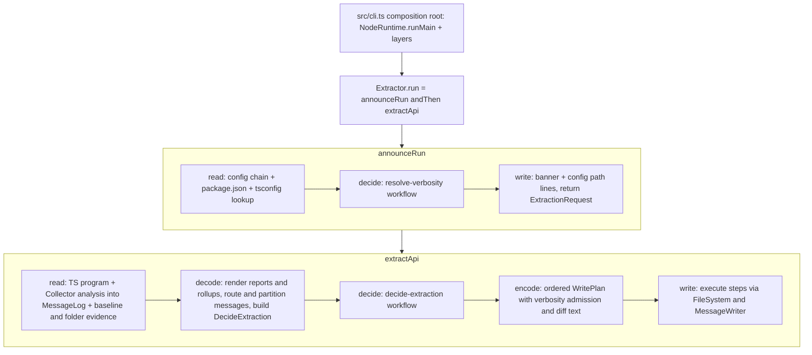

# api-extractor compound-pack conformance overhaul - Plan

## Goal Capsule

- **Objective:** A repo engineer reading `packages/api-extractor` finds every outside interaction, decision, service, and test shaped exactly as `compound-packs/cell-architecture` and `compound-packs/boundary-testing` prescribe, while every workspace `api-extractor*.json` config still produces the same `.api.md` reports, rollups, console output, and exit codes as before.
- **Means:** two composed Sandwich cells over a pure analysis snapshot, with analysis messages recorded as data and written only in the write phase (KTD1, KTD2).
- **Authority:** `compound-packs/` rule files > this plan's Requirements > KTDs > unit Approach text. Upstream `/tmp/rushstack/apps/api-extractor` is the behavioral reference for message routing, counting, and drift semantics.
- **Stop conditions:** stop and report if any workspace config's report changes by one byte, if a pack rule cannot be satisfied without breaking R12, or if `Cell`/`Sandwich` from `@systemfsoftware/effect-cell-types` cannot express a required phase (edit that package instead of working around it).
- **Execution profile:** Deep; eight units, strictly dependency-ordered; one pull request (#462 branch `fork-api-extractor`).
- **Finish and ship:** `ce-work` implements, the lfg pipeline reviews, commits, pushes, and watches CI to green.

---

## Product Contract

### Summary

Rebuild the api-extractor engine's shell around the packs. The run becomes two composed cells: one loads configuration and announces the run, one analyzes, renders, decides report drift, and writes. Analysis and generation stop emitting output directly and record messages as data. The public surface collapses to one `Extractor` namespace, the CLI becomes the only composition root, and the test suite proves behavior through that entry point against real temp directories.

### Problem Frame

The package passed its gates but not its law. The run cell's `decide` only branches on `localBuild`, while analysis, generation, drift detection, and file I/O all happen inside `write`, and the command smuggles live runtime objects through `Schema.declare(Predicate.isObject)` (`src/plan-extractor-run.workflow.ts:29`). Ten `Effect.runSync` calls interpret effects from inside synchronous analysis code (`src/collector/Collector.ts:258-268`, `src/analyzer/AstSymbolTable.ts:402`, `src/analyzer/PackageMetadataManager.ts:306`, `src/analyzer/package-json-lookup.ts:85`, `src/collector/package-doc-comment.ts:37`), so the engine has interpretation edges the CLI cannot see. The public barrel is 30 fragmented `export *` lines exposing analyzer internals (`src/index.ts`), `invoke` puts a `Promise` on the surface (`src/invoke.ts:22`), and a static writer singleton ships from the library (`src/collector/console-message-writer.ts`). The user rejected the earlier incremental pass as not aligned with `compound-packs/`; conformance is now mandatory.

### Key Decisions

- **Eliminate every in-engine interpretation edge.** (session-settled: user-directed — chosen over keeping sync `runSync` emission edges guarded by a pinned sync-writer invariant: the user judged the pinned exception to be slop.) Governs R1, R2, R3.
- **Full taxonomy overhaul, not hot-spot patching.** (session-settled: user-directed — chosen over conforming only the orchestration layer: "Both full overhaul", with pack conformance mandatory.) Governs R4-R11.
- **Artifact parity is non-negotiable.** Carried from the fork plan (`docs/plans/2026-09-22-0558-feat-fork-api-extractor-plan.md`): reports and config compatibility stay 1:1 with upstream. Governs R12, R13.
- **Breaking public API changes are allowed.** Packages are pre-1.0 (REPO-R1); `invoke`, the flat barrel, and the boolean result shape go. Governs R8, R9.

### Requirements

**Interpretation and effects**

- R1. `src/` contains no `Effect.runSync`, `Effect.runPromise`, `Effect.runFork`, or `Effect.orDie`; the only interpretation edge is `NodeRuntime.runMain` in `src/cli.ts`. (pack: cell-architecture, sandwich-phase-order.md)
- R2. Analysis, enhancement, and rendering code records every message (console or report-bound) into a per-run message log as plain data and constructs no `Effect` values.
- R3. All console output and all file writes happen in a Sandwich `write` phase; all file and program reads happen in a `read` phase.

**Cells and decisions**

- R4. One outside interaction, "run the extractor", is a composition of Sandwich cells joined with `Cell.andThen`; no cell calls another cell's `run`. (pack: cell-architecture, pipeline-composition.md)
- R5. Report drift, report creation, missing-folder refusal, and run pass/fail are decided by a `Workflow` whose command is pure Schema data; the decision is a tagged union on channel A. (pack: cell-architecture, pure-decision-workflows.md; four-channel-contracts.md)
- R6. Every `*.workflow.ts` decision body and its helpers use no `if`/`else`/`switch`/`?:`/`for`/`while` and mutate nothing; iteration is `map`/`filter`/`reduce`. (pack: cell-architecture, pure-decision-workflows.md)
- R7. Channel E carries only infrastructure failures that are actually raised, each a `Schema.TaggedError` with `cause: Schema.optional(Schema.Unknown)` when it wraps a thrown value; domain refusals (report drift, missing report) never appear on E. (pack: cell-architecture, four-channel-contracts.md)

**Surface and taxonomy**

- R8. The package root exports exactly one namespace, `Extractor`; no `Promise`-returning export and no static writer singleton exist. (pack: cell-architecture, single-namespace-barrel.md; four-channel-contracts.md)
- R9. `MessageWriter` is declared in a `*.service.ts` file with no driver imports; the console implementation is a driver module exporting `layer`; layers are bound only in `src/cli.ts`. (pack: cell-architecture, service-and-layer-boundaries.md; ports-separate-from-layers.md)
- R10. No external data crosses into typed code through a cast: config, `package.json`, source-map JSON, and the dynamically loaded TypeScript module are decoded or guarded. (pack: cell-architecture, decode-never-cast.md)
- R11. No module-level mutable state and no untagged `throw` remain in `src/`; internal invariant failures throw one tagged defect class. (pack: cell-architecture, handle-state-privacy.md)

**Parity**

- R12. For every workspace `api-extractor*.json` config (excluding `node_modules/`, `repos/`, and test fixtures), the rebuilt CLI in verification mode exits 0 and leaves the committed `.api.md` baseline byte-identical.
- R13. Console output of a successful run keeps upstream order and text: banner, config path, compiler preamble, analysis-time diagnostics, report and rollup lines, remaining messages, success footer; error and warning counts equal upstream `MessageRouter` counting over the same message sequence.

**Tests**

- R14. Behavior is proven through the `Extractor` entry point against real temporary directories, covering acceptance and refusal for each outside interaction; no test imports analyzer or collector internals. (pack: boundary-testing, real-system-oracles.md; no-mocks-on-internal-glue.md)
- R15. Every refined schema a user can feed (config enums, message log levels) has an explicit refusal scenario beside the generated schema codec laws, which run for every exported non-error schema. (pack: boundary-testing, refusals-beside-generated-laws.md)
- R16. Third-party semantics the engine relies on stay pinned by differential tests; pins for assumptions this plan deletes are removed. (pack: boundary-testing, pin-dependency-semantics.md)

### Scope Boundaries

- The TypeScript AST walker (`src/analyzer/**`, `Span.ts`, `ExportAnalyzer.ts`) keeps its upstream-mirrored algorithm and per-file lint relaxations for TS internals; only its message, throw, cast, and I/O seams change.
- Complexity-32 lint allowance for ported engine code stays; pack complexity-1 applies to workflow bodies only.
- On a run that fails with a typed error after analysis starts, the analysis-time console lines (diagnostic listings, the misplaced `@packageDocumentation` warning) are no longer printed before the error; every success-path line keeps R13 order. This is the only console-output delta.

#### Deferred to Follow-Up Work

- Writing `tsdoc-metadata.json` (`tsdocMetadata` config): never wired today (`writeTsdocMetadataFile` is dead code at `src/analyzer/PackageMetadataManager.ts:262-279`); this plan deletes the dead path and leaves the feature for a separate change.
- Flipping consumer packages' `api:check` scripts to this engine and retiring `api-extractor-quiet` (fork plan follow-ups).
- `compiler.overrideTsconfig` wiring and the `test:e2e` build dependency (PR #462 residual findings) unless a unit touches them directly.

### Outstanding Questions

- Deferred to implementation: the exact rule for a report-bound message that more than one report variant (`complete`/`beta`/`public`) renders — mirror upstream's `fetchAssociatedMessagesForReviewFile` handled-flag behavior exactly; the parity corpus and a routing property test settle it.

---

## Planning Contract

### Key Technical Decisions

- KTD1. **Two cells composed with `Cell.andThen`.** `announceRun` is a raw three-phase chain: read loads and Schema-decodes the config chain and emits an `AnnounceRun` command class carrying `cliFlags`, `configQuiet`, the resolved `ExtractorConfig` (a Schema class), and the run options; decide is `resolveVerbosity`, whose command becomes `AnnounceRun`; write emits the banner and config path and returns `ExtractionRequest` built from the raw command. The read output must be that command because a raw-chain `write` receives only `(outcome, raw)` (`packages/effect-cell-types/src/Sandwich.ts:172-176`). `extractApi` is the five-phase chain. Two cells, not one, because upstream prints the banner after config load and before compiler load (R13).
- KTD2. **Analysis runs once inside `extractApi`'s read phase as one synchronous boundary call.** The read phase wraps compiler-program creation and `Collector` analysis in `Effect.try`, mapping tagged analysis errors to E and rethrowing the internal-invariant class as a defect. Analysis may read files through the TypeScript host and `ts.sys` (source maps, `package.json` lookups) because that is read-phase I/O; it never writes and never builds an `Effect`. Chosen over pre-reading every file (impossible: the needed set is discovered during analysis).
- KTD3. **`MessageLog` replaces `MessageRouter` inside analysis.** A per-run class owned by the `Collector` appends immutable `ExtractorMessage` records in insertion order, including the diagnostic listings and the analysis-time console warnings that today go through `runSync`. Routing (config reporting rules plus defaults → report-bound, console level, or suppressed) is a pure `route-extractor-message.workflow.ts` applied in decode. Counting is derived from routed console residue, never incremented as a side effect.
- KTD4. **Decode renders; decide judges; encode orders.** Decode (`Sandwich.pure`) renders each report variant and rollup target from the analysis snapshot, partitions routed messages, and builds the `DecideExtraction` command; generator failures are decode failures on E. Decide is `decide-extraction.workflow.ts` (`Workflow.total`) returning `ExtractionPassed | ExtractionFailed`, each carrying per-report outcomes (`ReportUnchanged`, `ReportUpdated`, `ReportCreated`, `ReportDriftRefused`, `ReportMissingRefused`, `ReportFolderMissing`), the generated texts, and counts. Encode turns the decision into an ordered `WritePlan` of steps (emit line, ensure directory, write file), applying verbosity admission and rendering the report diff; every report variant always gets its temp-folder write (`<projectFolder>/temp/<file>`, `src/generators/index.ts:147-148`) regardless of outcome. Write executes the steps in order. The Phase Data Contracts table fixes what each phase hands the next.
- KTD5. **Evidence types instead of booleans for read facts.** The read phase records each report baseline as `BaselinePresent{content}` or `BaselineAbsent`, and the report folder as `FolderPresent` or `FolderAbsent`; the drift workflow matches on those tags. (pack: boundary-testing, staged-protocol-evidence.md)
- KTD6. **Channel A is a tagged outcome.** `ExtractionPassed | ExtractionFailed` replaces the `{ succeeded, errorCount, warningCount }` record; the CLI maps `ExtractionFailed` to exit 1 with the same message it prints today.
- KTD7. **Surface: one `Extractor` namespace.** `src/index.ts` is a single `export * as Extractor from './Extractor/mod.js'`. The namespace carries the composed cell and a `run(configPath, options)` convenience returning an `Effect`, the options and outcome schemas, `version`, `loadConfig` for config-only callers, the `ExtractorError` union and its variants, the `MessageWriter` service, and the console writer driver's `layer`. Analyzer, collector, generator, and enhancer modules are internal. `invoke.ts`, `extractor.ts`, `extractor.cell.ts`, and `plan-extractor-run.workflow.ts` are deleted. (pack: cell-architecture, single-namespace-barrel.md)
- KTD8. **Service and driver files.** `src/message-writer.service.ts` declares `MessageWriter`; `src/drivers/console-message-writer.ts` exports a parameterized `layer(options?)` whose optional `stdout`/`stderr` writable streams default to the process streams (stdout for info and verbose, stderr for error and warning, unchanged). `src/compiler/compiler-state.resource.ts` becomes `src/compiler/typescript-program.ts` (no lifecycle, so not a resource), and the dynamically loaded TypeScript module passes a structural guard that fails with a typed `TsCompilerLoadError` instead of a cast. (pack: cell-architecture, service-and-layer-boundaries.md; decode-never-cast.md)
- KTD9. **Throws become tagged.** User-input failures in the walker throw existing `ExtractorError` variants; internal invariants throw a single `InternalInvariantError` tagged class (a defect, caught nowhere but the read boundary's rethrow). `src/utils/invariant.ts` returns that class. Dead error variants (`ApiReportMismatchError`, `ApiReportMissingError`, `ForgottenExportError`, `CircularNamespaceReferenceError`, `TypeScriptDiagnosticError`) are deleted, and `ConfigFileNotFound` gains `cause`.
- KTD10. **`merge-config` folds.** The merge helper becomes an `Array.reduce` over entries producing fresh records, so the workflow file carries no loop or mutation (R6).
- KTD11. **Tests by layer.** Workflows get property tests in colocated `src/__tests__/<name>.workflow.property.test.ts` files; in-source blocks test private helpers only. Exported non-error schemas get generated codec laws via `inlineSchemaTests()` and `src/schema-laws.test.ts`, as in `packages/effect-microsandbox`. Cells get in-process integration scenarios only: `Extractor.run` against fixture projects copied into `FileSystem.makeTempDirectoryScoped` directories, bound to the real console driver on in-memory streams so console text and order are asserted without a double. The e2e suite stays at its three journeys (help, clean `--quiet` exit 0, drift exit 1). Tests importing internals are rewritten or deleted; constructor and round-trip plumbing tests in `src/errors/__tests__/errors.test.ts` are deleted. (pack: boundary-testing, real-system-oracles.md; no-mocks-on-internal-glue.md)

### High-Level Technical Design

Report decision truth table (the workflow's contract, mirroring upstream `Extractor.ts:371-447`):

| Baseline | Equivalent | Folder  | localBuild | Outcome                | Console effect                         |
| -------- | ---------- | ------- | ---------- | ---------------------- | -------------------------------------- |
| Present  | yes        | any     | any        | `ReportUnchanged`      | verbose `ApiReportUnchanged`           |
| Present  | no         | any     | false      | `ReportDriftRefused`   | warning `ApiReportNotCopied`           |
| Present  | no         | any     | true       | `ReportUpdated`        | warning `ApiReportCopied`, write file  |
| Absent   | n/a        | any     | false      | `ReportMissingRefused` | warning `ApiReportNotCopied`           |
| Absent   | n/a        | Present | true       | `ReportCreated`        | warning `ApiReportCreated`, write file |
| Absent   | n/a        | Absent  | true       | `ReportFolderMissing`  | error `ApiReportFolderMissing`         |

Pass rule: `localBuild` passes iff errors = 0; otherwise iff errors + warnings = 0, counted over residue plus report-outcome lines (including an `ApiReportDiff` warning when `printApiReportDiff` is set).

Phase Data Contracts (what each phase receives; the Sandwich passes only these):

| Cell          | Read output (Raw)                                                                                         | Decide command                             | Decision                                                                       | Encoded                        | Write returns                                    |
| ------------- | --------------------------------------------------------------------------------------------------------- | ------------------------------------------ | ------------------------------------------------------------------------------ | ------------------------------ | ------------------------------------------------ |
| `announceRun` | `AnnounceRun` (cliFlags, configQuiet, `ExtractorConfig`, options)                                         | same `AnnounceRun`                         | verbosity variant                                                              | n/a (raw chain)                | `ExtractionRequest` (config, options, verbosity) |
| `extractApi`  | analysis snapshot: `Collector`, `MessageLog`, program file lists, baseline and folder evidence per report | `DecideExtraction` (pure data from decode) | `ExtractionPassed` or `ExtractionFailed` with outcomes, texts, residue, counts | `WritePlan` steps plus outcome | the tagged outcome                               |

### Rule Conformance Matrix

| Pack rule                                          | Applies    | Satisfied by                                                                                                    |
| -------------------------------------------------- | ---------- | --------------------------------------------------------------------------------------------------------------- |
| cell-architecture/sandwich-phase-order.md          | yes        | R3, KTD1, KTD4, U5                                                                                              |
| cell-architecture/pure-decision-workflows.md       | yes        | R5, R6, KTD4, KTD10, U4                                                                                         |
| cell-architecture/four-channel-contracts.md        | yes        | R7, KTD6, KTD9, U1, U5                                                                                          |
| cell-architecture/pipeline-composition.md          | yes        | R4, KTD1, U5                                                                                                    |
| cell-architecture/service-and-layer-boundaries.md  | yes        | R9, KTD8, U1, U6                                                                                                |
| cell-architecture/ports-separate-from-layers.md    | yes        | R9, KTD8, U1                                                                                                    |
| cell-architecture/decode-never-cast.md             | yes        | R10, KTD8, U1, U2                                                                                               |
| cell-architecture/handle-state-privacy.md          | yes        | R11, U1 (`AedocDefinitions.ts` module `let`)                                                                    |
| cell-architecture/single-namespace-barrel.md       | yes        | R8, KTD7, U6                                                                                                    |
| cell-architecture/scoped-lifecycle-boundaries.md   | tests only | U7 temp directories via `makeTempDirectoryScoped`, no `beforeAll` lifecycles                                    |
| cell-architecture/callable-vs-resource-syntax.md   | trivially  | workflows stay callable; no resources or policies exist                                                         |
| cell-architecture/resource-vs-handle-duality.md    | no         | no lifecycle-bearing resource or handle; `typescript-program.ts` loses the misleading `.resource` suffix (KTD8) |
| cell-architecture/pipeable-dual-parity.md          | no         | no builders or combinators on the surface after KTD7                                                            |
| cell-architecture/staged-lawful-builders.md        | no         | no external-target resource definitions                                                                         |
| boundary-testing/real-system-oracles.md            | yes        | R14, KTD11, U7                                                                                                  |
| boundary-testing/no-mocks-on-internal-glue.md      | yes        | R14, KTD11, U7                                                                                                  |
| boundary-testing/refusals-beside-generated-laws.md | yes        | R15, U4, U7                                                                                                     |
| boundary-testing/arbitrary-filter-floors.md        | yes        | U4 workflow arbitraries built from bounded generators; existing pin arbitraries already enumerate               |
| boundary-testing/pin-dependency-semantics.md       | yes        | R16, U7                                                                                                         |
| boundary-testing/staged-protocol-evidence.md       | yes        | KTD5, U4, U5                                                                                                    |

### Assumptions

- The parity corpus from the earlier conformance pass (29 configs, all identical) is re-derivable by enumerating `**/api-extractor*.json` outside `node_modules/`, `repos/`, and `tests/__fixtures__/`, after a workspace build produces their `.d.ts` inputs.
- Workspace configs pass upstream verification today without warnings, so exit 0 in verification mode is the right corpus oracle.
- Batching analysis-time console lines into the write phase keeps success-path output identical because nothing is printed between analysis and the first write today (verified ordering in `src/extractor.cell.ts` and `src/generators/index.ts`); the failure-path delta is declared in Scope Boundaries.

### Challenged Assumptions

Destructive review, Edge-First lens, against the first draft of this plan; each resolution is folded into the KTD it names.

- A raw-chain cell can carry the loaded config to its write phase without the read output being the command: false, fixed in KTD1.
- The `WritePlan` covers every file written when it lists expected reports and rollups: false, the temp report write was missing, fixed in KTD4.
- Moving analysis-time lines into write only shifts timing: false on failure paths, declared in Scope Boundaries.

### Risks

| Risk                                                                                                               | Mitigation                                                                                                                   |
| ------------------------------------------------------------------------------------------------------------------ | ---------------------------------------------------------------------------------------------------------------------------- |
| Message handled-flag semantics across multiple report variants drift from upstream, changing counts and exit codes | Routing workflow property test against a reference table; parity corpus (R12); e2e exit-code journeys                        |
| The `Collector` refactor (1142 lines) silently drops a message                                                     | Characterization first: record today's full console output and counts for the corpus and fixtures before U2, then diff after |
| Surface collapse breaks callers outside the package                                                                | Consumers still use upstream (flip is deferred); `pnpm check:local` builds the workspace and would surface imports           |
| `Cell.andThen` input typing rejects `ExtractionRequest` flow                                                       | If `effect-cell-types` cannot express it, fix that package (REPO-O1) rather than hand-sequencing `run` calls                 |

---

## Implementation Units

### U1. Service, driver, error, and state foundations

**Goal:** Put the file roles, error channel, and module state in their pack shape before the flow changes.
**Requirements:** R7, R9, R10, R11; KTD8, KTD9.
**Dependencies:** none.
**Files:**

- `packages/api-extractor/src/message-writer.service.ts` (new), `src/drivers/console-message-writer.ts` (new), `src/collector/console-message-writer.ts` (delete)
- `src/compiler/compiler-state.resource.ts` → `src/compiler/typescript-program.ts`
- `src/errors/*.schema.ts`, `src/errors/extractor-error.schema.ts`, `src/errors/index.ts`, one-line shim files under `src/errors/`, `src/config/schema.ts`, `src/utils/*`
- `src/utils/invariant.ts`, every `throw` site listed in the Sources section
- `src/model/aedoc/AedocDefinitions.ts`
- `src/errors/__tests__/errors.test.ts` (delete)
  **Approach:**

1. Move the `MessageWriter` service out of `src/collector/message-router.ts` into the service file; the driver exports `layer`.
2. Rename the compiler module; replace the cast on the loaded TypeScript module with a guard that fails with a new `TsCompilerLoadError`, and drop that file's lint relaxations that only served the cast.
3. Delete the five never-raised error variants and the one-line re-export shims; add `cause` to `ConfigFileNotFound`; add `InternalInvariantError`.
4. Convert every `throw new Error` and `throw invariant(...)` to a tagged class per KTD9.
5. Make the TSDoc configuration per-run state held by the `Collector` instead of a module `let`.
   **Patterns to follow:** `packages/effect-microsandbox/src/MicroVMError.schema.ts` for tagged errors with `cause`.
   **Test scenarios:**

- A `typescriptCompilerFolder` pointing at a folder without a TypeScript package fails the run with `TsCompilerLoadError`, not a defect.
- A config path that does not exist fails with `ConfigFileNotFound` carrying the path.
  **Verification:** no `throw new Error`, `as unknown as`, or module-level `let` remains in `src/`; typecheck and lint pass.

### U2. Message log as data; no interpretation inside analysis

**Goal:** Analysis, enhancement, and rendering record messages as data and build no effects.
**Requirements:** R1, R2, R10, R13; KTD2, KTD3.
**Dependencies:** U1.
**Files:**

- `src/collector/message-log.ts` (new, replaces `src/collector/message-router.ts`), `src/collector/message-router.schema.ts`
- `src/collector/route-extractor-message.workflow.ts` (new), `src/__tests__/route-extractor-message.workflow.property.test.ts` (new)
- `src/collector/Collector.ts`, `src/collector/package-doc-comment.ts`, `src/analyzer/AstSymbolTable.ts`, `src/analyzer/PackageMetadataManager.ts`, `src/analyzer/package-json-lookup.ts`, `src/collector/SourceMapper.ts`, `src/enhancers/*.ts`, `src/generators/api-report-generator.ts`
  **Approach:**

1. Record a characterization baseline first: full console output and counts for every corpus config and test fixture under the current engine.
2. Introduce `MessageLog` with the synchronous append API the walker already uses (`addAnalyzerIssue`, `addCompilerDiagnostic`, `addTsdocMessages`, plus console-message append for diagnostics listings and the misplaced `@packageDocumentation` warning).
3. Replace all ten `runSync` sites with appends; decode `package.json` and source-map JSON with synchronous Schema decode returning `Result` (no `Effect`), removing the three casts at `PackageMetadataManager.ts:85,91,136`.
4. Delete the dead `writeTsdocMetadataFile` path.
5. Author the routing workflow: command = message identity plus rule table and report-enabled flag; decision = `RoutedToReport | RoutedToConsole{level} | RoutedSuppressed`; associated-message selection for report rendering becomes a pure function over routed messages returning the consumed set.
   **Execution note:** Capture the characterization baseline before editing; diff against it after.
   **Patterns to follow:** `src/collector/resolve-verbosity.workflow.ts` for command, decision TypeId, and in-source property tests.
   **Test scenarios:**

- Property: for every message id and rule table, the routed destination equals upstream's rule lookup (explicit rule wins, category default otherwise, `none` suppresses).
- Property: a message routed to a report is never in the console residue, and every other message is in exactly one of residue or suppressed.
- Refusal (integration scenario authored in U7's `tests/config-fixtures.integration.test.ts`): a config `messages` entry with `logLevel: "loud"` fails the run with `ConfigSchemaValidationError`.
  **Verification:** no `Effect` import remains in `src/analyzer/**`, `src/enhancers/**`, or `src/collector/Collector.ts`; characterization output diff is empty.

### U3. Pure renderers

**Goal:** Report, rollup, and diff generation are pure functions of the analysis snapshot.
**Requirements:** R2, R3, R12.
**Dependencies:** U2.
**Files:** `src/generators/index.ts`, `src/generators/api-report-generator.ts`, `src/generators/dts-rollup-generator.ts`, `src/generators/dts-emit-helpers.ts`, `src/generators/namespace-aliaser.ts`.
**Approach:**

1. Strip `FileSystem` and message emission from `src/generators/index.ts`; expose render functions returning texts per report variant and rollup target, failing with the existing tagged generator errors.
2. Keep `areEquivalentApiFileContents` semantics and newline conversion byte-for-byte.
   **Patterns to follow:** upstream `/tmp/rushstack/apps/api-extractor/src/api/Extractor.ts:371-447` for what is compared and when.
   **Test scenarios:** covered at the entry point by U7 parity scenarios; no direct renderer tests (internal glue).
   **Verification:** `src/generators/**` imports no `effect/FileSystem` and constructs no `Effect`.

### U4. Decision workflows

**Goal:** Every decision in the run is a lawful, property-tested workflow.
**Requirements:** R5, R6, R15; KTD4, KTD5, KTD10.
**Dependencies:** U1.
**Files:** `src/decide-extraction.workflow.ts` (new), `src/config/merge-config.workflow.ts`, `src/collector/resolve-verbosity.workflow.ts`, `src/plan-extractor-run.workflow.ts` (delete), `src/__tests__/decide-extraction.workflow.property.test.ts` (new), `src/__tests__/merge-config.workflow.property.test.ts` (new), `src/__tests__/resolve-verbosity.workflow.property.test.ts` (new).
**Approach:**

1. Author `DecideExtraction` (per-report generated text, baseline evidence, folder evidence, `localBuild`, `printApiReportDiff`, verbosity, residue levels) and the decision union per the High-Level Technical Design table.
2. Replace the `merge-config` loop with a fold (KTD10).
3. Keep all command, decision, and helper declarations inside each workflow file; move the existing in-source laws that exercise exported workflows into the colocated property test files, leaving in-source blocks only for private helpers (KTD11).
   **Patterns to follow:** `packages/effect-microsandbox/src/render-sandbox-plan.workflow.ts`.
   **Test scenarios:**

- Property: each report outcome equals the truth-table row selected by its evidence and `localBuild`.
- Property: pass/fail equals the pass rule for every combination of residue counts, outcomes, and `printApiReportDiff`.
- Property: `merge-config` fold is associative and derived values replace base values key by key (existing laws kept).
- Arbitraries draw evidence tags and bounded counts directly; none filter after generation.
  **Verification:** workflow files contain no control-flow keywords; the colocated property tests pass.

### U5. The two cells

**Goal:** The run is `announceRun` composed with the 5-phase `extractApi`.
**Requirements:** R1, R3, R4, R5, R7, R13; KTD1, KTD2, KTD4, KTD6.
**Dependencies:** U2, U3, U4.
**Files:** `src/announce-run.cell.ts` (new), `src/extract-api.cell.ts` (new), `src/config/extractor-config.ts`, `src/config/lookup.ts`, `src/extractor.cell.ts` (delete), `src/extractor.ts` (delete), `src/invoke.ts` (delete).
**Approach:**

1. `announceRun`: read loads and decodes the config chain and lookups into the `AnnounceRun` command (KTD1); decide is `resolveVerbosity`; write emits the banner and config path and returns `ExtractionRequest` from the raw command.
2. `extractApi`: read builds the program, runs analysis (KTD2), and reads baseline and folder evidence for each configured report; decode renders and routes (U2, U3); decide is U4; encode builds the `WritePlan` in upstream order (R13); write executes it and returns the tagged outcome.
3. Remove `Result.getOrThrow` and `Effect.orDie` from the flow.
   **Patterns to follow:** `packages/effect-microsandbox/src/boot-microvm.cell.ts` for `Cell.andThen` composition.
   **Test scenarios:** exercised end to end in U7.
   **Verification:** `extractApi.phases` is the five-phase tuple; the characterization diff from U2 stays empty.

### U6. Namespace barrel and composition root

**Goal:** One `Extractor` namespace; layers bound once in the CLI.
**Requirements:** R8, R9; KTD7.
**Dependencies:** U5.
**Files:** `src/Extractor/mod.ts` (new), `src/index.ts`, `src/cli.ts`, `src/cli/run-action.ts`, `src/cli/init-action.ts`, `etc/api-extractor.api.md`, `api-extractor.json`, `tsdown.config.ts` if entry changes.
**Approach:**

1. Build the namespace per KTD7; reduce `src/index.ts` to the single namespace export.
2. The CLI merges `NodeServices.layer` with the console driver `layer` once and maps `ExtractionFailed` to exit 1.
3. Regenerate the self-hosted API report and review that it lists only the namespace surface.
   **Test scenarios:** e2e journeys in U7 cover the CLI mapping.
   **Verification:** `src/index.ts` has one export line; `Layer`/`Effect.provide` appear only in `src/cli.ts`; `attw` and `dts:check` pass.

### U7. Test suite realignment

**Goal:** Tests prove behavior through the entry point against real systems, with refusals beside laws.
**Requirements:** R12, R14, R15, R16; KTD11.
**Dependencies:** U6.
**Files:** `tests/extractor-flow.integration.test.ts`, `tests/config-fixtures.integration.test.ts`, `tests/api-report-parity.integration.test.ts`, `tests/namespace-rollup.integration.test.ts`, `tests/analyzer-fixtures.integration.test.ts`, `tests/vendor-pins.differential.test.ts`, `tests/__fixtures__/vendor-pins-arbitraries.ts`, `tests/e2e/cli-contract.e2e.test.ts`, `vitest.config.ts`, `src/schema-laws.test.ts` (new).
**Approach:**

1. Rewrite each integration feature to copy its fixture project into a scoped temp directory and run `Extractor.run`.
2. Delete the sync-writer metamorphic pin (its assumption no longer exists); keep the TypeScript compile-behavior pin.
3. Add the refusal scenarios and a console-order integration scenario bound to the console driver on in-memory streams (KTD8, KTD11).
4. Add `inlineSchemaTests()` to `vitest.config.ts` and the generated `src/schema-laws.test.ts` harness, matching `packages/effect-microsandbox/vitest.config.ts`.
   **Test scenarios:**

- Covers R12. Report parity fixtures (complete, beta, public variants) write reports byte-equal to the committed expected files.
- Namespace rollup fixture writes a rollup that compiles with zero diagnostics (AE3 kept).
- Clean run in verification mode returns `ExtractionPassed` and writes nothing outside the temp report folder.
- Drifted baseline in verification mode returns `ExtractionFailed` and leaves the baseline untouched.
- Drifted baseline in local mode returns `ExtractionPassed` and rewrites the baseline.
- Missing baseline with missing report folder in local mode returns `ExtractionFailed` with one error.
- Refusal: missing config, invalid JSON, schema-invalid config, `newlineKind: "bogus"`, `apiReport.reportVariants: ["internal"]`, circular `extends`, and an unresolved `<token>` each fail with their tagged error.
- Covers R13. A verbose clean run writes banner, config path, preamble, report lines, and footer to the in-memory stdout in upstream order, and nothing to stderr.
- Generated codec laws pass for every exported non-error schema.
- e2e (unchanged count, three journeys): `--help` exits 0; a clean `--quiet` run prints nothing and exits 0; a drifted run prints the `ApiReportNotCopied` warning to stderr and exits 1.
  **Verification:** no test imports from `src/analyzer`, `src/collector`, `src/generators`, or `src/enhancers`; `pnpm --filter @systemfsoftware/api-extractor test` and `test:e2e` pass.

### U8. Doctrine, gates, and release note

**Goal:** The package's leaf rules name the new invariants with runnable gates, and the change ships a changeset.
**Requirements:** R1, R8, R9.
**Dependencies:** U6.
**Files:** `packages/api-extractor/AGENTS.md`, `packages/api-extractor/README.md`, `.changeset/<slug>.md`.
**Approach:**

1. Add leaf rows: no interpretation edge in `src/` except `src/cli.ts`; root exports only `Extractor`; layers bound only in `src/cli.ts`. Each names its grep gate.
2. Update README usage to the `Extractor` namespace.
3. Author the changeset with the `author-changesets` skill; the body states the consumer-visible breaks (namespace import, `invoke` removed, tagged outcome).
   **Test expectation:** none -- documentation and release metadata.
   **Verification:** the changeset guard passes.

---

## Verification Contract

| Gate                           | Command                                                                                                                        | Proves                         |
| ------------------------------ | ------------------------------------------------------------------------------------------------------------------------------ | ------------------------------ |
| Package typecheck, lint, tests | `pnpm --filter @systemfsoftware/api-extractor typecheck`, `lint`, `test`, `test:e2e`                                           | R2, R6, R14, R15, R16          |
| Build and self-hosted report   | `pnpm --filter @systemfsoftware/api-extractor build`, `dts:check`, `attw`                                                      | R8, R12 for the package itself |
| Interpretation-edge gate       | grep `src/` for `Effect.runSync`, `runPromise`, `runFork`, `orDie`: zero hits                                                  | R1                             |
| Binding gate                   | grep `src/` for `Layer.` and `Effect.provide` outside `src/cli.ts`: zero hits                                                  | R9                             |
| Throw and cast gate            | grep `src/` for `throw new Error` and `as unknown as`: zero hits                                                               | R10, R11                       |
| Parity corpus                  | after workspace build, run the built CLI in verification mode for each enumerated config; all exit 0 and `git status` is clean | R12, R13                       |
| Repo gate                      | `pnpm check:local` exits 0                                                                                                     | REPO-D1                        |
| CI                             | `gh pr checks --watch --fail-fast`                                                                                             | REPO-D1                        |

---

## Definition of Done

- Every row of the Rule Conformance Matrix points at merged code that satisfies it.
- Every Verification Contract gate passes on the final tree.
- The characterization diff recorded in U2 is empty after U5.
- No abandoned-attempt code, compatibility shim, or re-export alias remains; deleted modules have no importers.
- The changeset is present and the PR body records any residual review findings.

---

## Sources

- Orchestration today: `packages/api-extractor/src/extractor.cell.ts`, `src/plan-extractor-run.workflow.ts`, `src/invoke.ts`, `src/index.ts`.
- `runSync` sites and message flow: `src/collector/Collector.ts:258-268`, `src/analyzer/AstSymbolTable.ts:402`, `src/analyzer/PackageMetadataManager.ts:306`, `src/analyzer/package-json-lookup.ts:85`, `src/collector/package-doc-comment.ts:37`.
- Untagged throws: `src/analyzer/AstSymbolTable.ts`, `src/analyzer/ExportAnalyzer.ts`, `src/collector/Collector.ts`, `src/analyzer/Span.ts`, `src/analyzer/TypeScriptHelpers.ts`, `src/analyzer/TypeScriptInternals.ts`, `src/collector/SourceMapper.ts`, `src/generators/dts-emit-helpers.ts`, `src/generators/dts-rollup-generator.ts`, `src/generators/api-report-generator.ts`, `src/analyzer/package-json-lookup.ts:82`, `src/analyzer/text.ts:7`.
- Workflow loop: `src/config/merge-config.workflow.ts:82-91`.
- Cell API: `packages/effect-cell-types/src/Sandwich.ts:157-274`, `packages/effect-cell-types/src/Cell.ts` (`andThen`, `provide`), `packages/effect-cell-types/src/Workflow.ts` (decision-shape constraints).
- Exemplar: `packages/effect-microsandbox/src/boot-microvm.cell.ts`, `boot-sandbox.cell.ts`, `micro-vm.resource.ts`, `mod.ts`.
- Upstream semantics: `/tmp/rushstack/apps/api-extractor/src/api/Extractor.ts:355-447`, `/tmp/rushstack/apps/api-extractor/src/collector/MessageRouter.ts`.
- Learnings: `docs/solutions/architecture-patterns/sandwich-cell-portable-declaration-emit.md` (re-export `Cell` type for declaration emit), `docs/solutions/architecture-patterns/one-cell-cannot-hold-a-port-and-its-implementation.md`.
