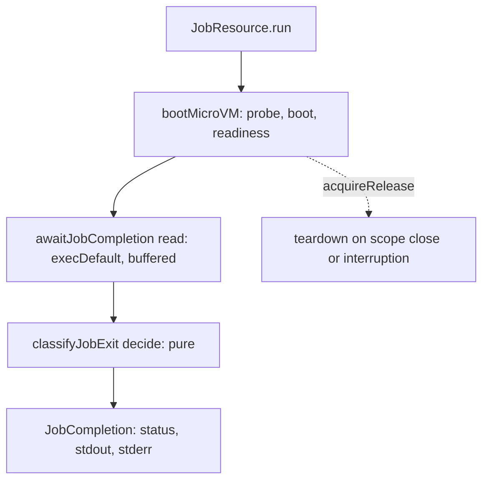

# effect-microsandbox job completion, host access, and workdir - Plan

## Goal Capsule

- **Objective:** A caller can run a one-shot workload in a disposable microVM and grade it from how it ended (exit code or signal, complete stdout and stderr), optionally reaching host services and choosing the working directory, while every spec that does not opt in behaves exactly as today.
- **Means:** a `.run` terminal on the resource `MicroVM.job` returns, executing the SDK default workload once (KTD1, KTD2); a per-job host-access flag rendered to microsandbox network profiles (KTD5); a `withWorkdir` combinator (KTD6).
- **Authority:** issue #471 acceptance criteria, then this plan's R-IDs, then KTDs. Compound pack `cell-architecture` governs shape.
- **Stop conditions:** a smoke case that cannot pass on a real VM for a reason other than R3's upstream gap; any change to a rendered `ServiceSpec` plan.
- **Execution profile:** one package (`packages/effect-microsandbox`) plus one CI line; real-VM proof runs only in CI (`reusable-smoke.yml`), since the dev host has no `/dev/kvm`.
- **Finish:** implemented, reviewed, and shipped as one PR watched to CI green.

---

## Product Contract

### Summary

Add `.run` to job resources: it boots the VM, runs the job's default workload once through the SDK default-workload API, and yields a `JobCompletion` holding an exit status and the byte-exact stdout and stderr. The status is `JobExited` with a code, or `JobSignaled` with no signal number, because `microsandbox@0.7.2` reports every signal death as code `-1`. Add `withHostAccess` and `withWorkdir` to job specs. Make the smoke journey prove each case on a real microVM and fail on hosts without KVM.

### Problem Frame

`MicroVM.job(image, cmd)` stores `cmd`, but `microsandbox@0.7.2` creation is boot-only, so nothing ever runs it, and no API reports how it ended (issue #471). Guests cannot reach host services because the default network policy denies the `host` group, and `JobSpec.workdir` exists with no DSL writer. One-shot integration lanes, such as the `stryker-js-effect` e2e lane that grades each run from exit code, NDJSON on stdout, and OTLP spans sent to a host collector, cannot use job VMs.

### Requirements

**Completion**

- R1. `MicroVM.job(image, cmd).run` runs the job's default workload exactly once and succeeds after it exits with its exit status, complete stdout, and complete stderr.
- R2. The exit status is exactly one of an exit code or a signal termination. A non-zero exit code is a success value, not an Effect failure.
- R3. A signal-terminated workload yields `JobSignaled`, never an exit code. Under `microsandbox@0.7.2` it carries no signal number (see Open Questions), so two different signals are distinguishable from exit codes but not from each other.
- R4. A workload that cannot start (no default command, transport failure) fails `.run` with a typed `MicroVMError`; no workload failure is caught into success.
- R5. The VM is torn down after success, failure, or interruption; no `effect-microsandbox-*` sandbox remains in the SDK listing.

**Host access**

- R6. A job spec can opt into the microsandbox `host` network profile so the guest reaches `host.microsandbox.internal`.
- R7. A spec that does not opt in renders no network policy and keeps the SDK default (host denied, public allowed).

**Working directory**

- R8. A job spec can set its working directory through the DSL, and the workload runs there.

**Compatibility and delivery**

- R9. Rendered `ServiceSpec` plans and every existing export's signature and default behavior stay source-compatible.
- R10. The smoke journey exits non-zero with a virtualization error on a host without KVM.
- R11. `README.md` documents `.run`, `withHostAccess`, and `withWorkdir` with a runnable example; a changeset declares the addition; `etc/effect-microsandbox.api.md` is regenerated.

### Scope Boundaries

- Services keep today's behavior; `.run`, `withHostAccess`, and `withWorkdir` exist only for jobs.
- No microsandbox catalog change from `0.7.2` (issue boundary: ask first).
- No guest-side wrapper, extra `exec`, shared mount, or log-file side channel to recover signal numbers or output.

### Deferred to Follow-Up Work

- Signal number in `JobSignaled`: needs an upstream microsandbox change (see Open Questions).
- Service default workloads: under 0.7.2 boot-only creation, `ServiceSpec` VMs never start their image `ENTRYPOINT`/`CMD` either. That is a separate defect outside #471.

### Open Questions

- Signal number (non-blocking for every other R). `microsandbox-agentd` 0.7.2 maps every signal death to exit code `-1` and sends only `Exited(i32)` over the exec-session wire (`lib/process.rs` `exit_code`, doc comment "Processes terminated by a signal resolve to `-1` ... to preserve the exec-session wire protocol"; `lib/session.rs` `SessionOutput::Exited(i32)`). The TS `ExitStatus` is `{ code, success }` only. 0.7.2 is the newest published release. The issue's criterion "each completion succeeds with that signal" cannot be met through the SDK; the smoke proves two different signals each yield `JobSignaled` with no exit code, and the PR records the gap.

---

## Planning Contract

### Key Technical Decisions

- KTD1. **The default workload is `Sandbox.execDefault()`.** In the SDK since 2026-08-07, `create()` is boot-only and `execDefault()` runs the effective OCI `ENTRYPOINT` plus the builder `.cmd` override (https://docs.microsandbox.dev/sandboxes/commands.md). `waitUntilStopped()` observes the VM, not a workload, and never resolves when a workload exits. The buffered form returns code plus `stdoutBytes()`/`stderrBytes()` after exit, so output cannot be read early. Rejected: `waitUntilStopped` plus `exec.log` reads, which never complete and add rotation risk.
- KTD2. **`.run` exists only on a new `JobResource`, and its `R` keeps `Scope`.** `MicroVM.job` returns `JobResource`, a subtype of `MicroVMResource`, so the change is source-compatible. The VM handle is never exposed to the caller, so the workload runs exactly once (pack: cell-architecture, staged-lawful-builders.md; scoped-lifecycle-boundaries.md). Rejected: a handle operation `awaitCompletion(vm)`, which a caller could invoke twice and re-run the workload; a standalone `run(spec)`, which the staged-builder law forbids.
- KTD3. **Exit classification is a pure `Workflow.total` in `src/classify-job-exit.workflow.ts`.** Code `>= 0` becomes `JobExited({ code })`; code `< 0` becomes `JobSignaled({})` (pack: cell-architecture, pure-decision-workflows.md). `JobExited.code` is schema-checked as a non-negative integer, so a misrouted `-1` cannot decode as an exit. `JobSignaled` has no fields until the runtime reports a number, so adding one later is additive.
- KTD4. **Output is `Uint8Array`, taken from `stdoutBytes()`/`stderrBytes()`.** The string accessors decode UTF-8 lossily. The runtime buffers at most 32 MiB of output per session (`lib/session.rs` `SESSION_OUTPUT_BYTE_CAPACITY`); the README states this limit.
- KTD5. **Host access renders to `SandboxPlan.networkProfiles = ['public', 'host']`, and only for opted-in jobs.** `compilePlan` applies `builder.network((n) => n.policy(NetworkPolicy.fromProfiles(profiles)))`, taking `NetworkPolicy` from the existing lazy `import('microsandbox')`. `public` stays, so opting in adds host access without removing default public egress. Rejected: `allowAll` (non-counting outcome); `fromProfiles(['host'])` alone, which would drop public egress.
- KTD6. **`withHostAccess(enabled)` and `withWorkdir(path)` are `dual(2)` combinators from `JobSpec` to `JobSpec`, with matching `JobResource` methods.** Typing them on `JobSpec` makes a no-op call on a service unrepresentable, so they skip the `Match.tag` dispatch the older combinators use. Each older combinator's `Job` arm becomes a named function from `JobSpec` to `JobSpec`. The existing dual dispatches to it, and the job factory's overrides of all five inherited methods (`withEnv`, `withMount`, `withMemoryLimit`, plus the no-op `withExposedPorts` and `withWaitStrategy`) call it, so every chained method returns `JobResource` without a cast (pack: cell-architecture, decode-never-cast.md; pipeable-dual-parity.md).
- KTD7. **The smoke journey no longer skips without KVM.** The first boot fails through `probeVirtualization` with `VirtualizationUnsupportedError`, and `NodeRuntime.runMain` exits non-zero. The `no /dev/kvm` alternative in the CI grep goes in its own `ci` commit (Evaluator surface).

### High-Level Technical Design

`.run` composes one new cell after the existing boot pipeline:



The public surface this adds (directional):

```text
MicroVM.job(image, cmd): JobResource
JobResource = MicroVMResource & {
  spec: JobSpec
  withHostAccess(enabled): JobResource
  withWorkdir(path): JobResource
  run: Effect<JobCompletion, MicroVMError, Scope | Crypto | FileSystem>
}
JobCompletion = { status: JobExited{code} | JobSignaled{}, stdout: Uint8Array, stderr: Uint8Array }
```

### Assumptions

Destructive review, lens Edge-First (the draft covered happy paths and left denial, interruption, and runtime-quirk edges thin). The three structural assumptions it surfaced:

- A1. `fromProfiles(['public'])` equals the SDK default policy: public egress plus gateway DNS, with private, loopback, link-local, metadata, and host denied (https://docs.microsandbox.dev/networking/overview.md, "Defaults" and "Reaching the host"). The not-opted-in smoke case would catch a mismatch in host reachability.
- A2. A host listener bound to `127.0.0.1` is reachable through `host.microsandbox.internal`, because the runtime proxies guest egress from the host process. The smoke journey checks this.
- A3. Interrupting the fiber blocked on `execDefault` does not wait for the promise. Vendored `repos/effect/packages/effect/src/internal/effect.ts` `tryPromise` (lines 1108-1135) is callback-based and attaches its rejection handler when the promise is created. Interruption resumes the fiber, the scope finalizer tears the VM down, and a later rejection resumes an already-finished callback, so no unhandled rejection surfaces. `Fiber.interrupt` returns only after the uninterruptible teardown finishes, so the listing check that follows it is deterministic, as it already is for the existing J2 journey.

Edge-First failures folded into the units: denied egress may hang rather than refuse, so both host cases pass `wget -T 5` (U5). agentd also maps a dropped reaper notification to `-1`, which classifies as `JobSignaled`; the README states this (U7). The builder `.workdir` is assumed to apply to `execDefault` sessions (`native/index.d.ts` `SandboxBuilder.workdir`: "Default working directory for commands"); the `pwd` smoke case checks it.

Test layers (skill `test-layer-selection`): `classify-job-exit.workflow.ts` and `render-sandbox-plan.workflow.ts` get property tests only. `JobCompletion.schema.ts` gets the generated `ruleOfSchemas` laws from `src/schema-laws.test.ts` (effect-schema-vite). The cells (`await-job-completion.cell.ts`, `boot-sandbox.cell.ts`) get no unit tests; the real-VM smoke journey covers them.

---

## Implementation Units

### U1. Host-access spec field and plan rendering

- **Goal:** Job specs carry an optional host-access flag, and the renderer emits network profiles only for opted-in jobs.
- **Requirements:** R6, R7, R8, R9.
- **Dependencies:** none.
- **Files:** `packages/effect-microsandbox/src/MicroVMSpec.schema.ts`, `packages/effect-microsandbox/src/render-sandbox-plan.workflow.ts`, `packages/effect-microsandbox/src/__tests__/render-sandbox-plan.workflow.property.test.ts`.
- **Approach:**
  1. Add `hostAccess: Schema.optional(Schema.Boolean)` to `JobSpec` only.
  2. Add optional `networkProfiles` (array of the literals `public` and `host`) to `SandboxPlan`.
  3. In the `Job` arm of `planOf`, set `networkProfiles` via `Match` on `hostAccess === true` (KTD5). Leave the `Service` arm byte-identical; it must not gain the key.
- **Patterns to follow:** existing `planOf` arms; `Match` instead of ternaries (the workflow lint bans control flow).
- **Test scenarios:**
  - A job built through the DSL with no opt-in and no workdir renders `networkProfiles` and `workdir` both undefined.
  - A job with `withHostAccess(true)` renders `networkProfiles` containing `host` and `public`.
  - A job with `withHostAccess(false)` renders no `networkProfiles`.
  - `withWorkdir(w)` for arbitrary `w` renders `plan.workdir === w`.
  - For arbitrary `ServiceSpec` and loopback bindings, the rendered plan equals an oracle built from the pre-change `Service` arm (same keys, `Schema.toEquivalence(SandboxPlan)`), and has no `networkProfiles` key.
- **Verification:** the new laws pass, and the opt-in and workdir laws fail when their rendering is reverted.

### U2. Compile network profiles into the SDK builder

- **Goal:** An approved plan with `networkProfiles` boots with the matching microsandbox network policy.
- **Requirements:** R6, R7.
- **Dependencies:** U1.
- **Files:** `packages/effect-microsandbox/src/boot-sandbox.cell.ts`.
- **Approach:** destructure `NetworkPolicy` next to `Sandbox` from the lazy import in `createSandbox` and pass it to `compilePlan`. Add an `Option.match` step over `plan.networkProfiles` that calls `.network((n) => n.policy(NetworkPolicy.fromProfiles(profiles)))`. With no profiles, make no `.network` call (KTD5).
- **Patterns to follow:** the existing `Option.match` steps in `compilePlan`.
- **Test scenarios:** Test expectation: none -- builder wiring against the native SDK; U5's host-reachability and not-opted-in smoke cases prove it, and removing this step alone fails the opted-in case.
- **Verification:** typecheck passes; U5 host cases pass in CI.

### U3. Job completion cell and exit classification

- **Goal:** A cell that runs the default workload of an acquired VM and returns a classified `JobCompletion`.
- **Requirements:** R1, R2, R3, R4.
- **Dependencies:** none.
- **Files:** `packages/effect-microsandbox/src/JobCompletion.schema.ts` (new), `packages/effect-microsandbox/src/classify-job-exit.workflow.ts` (new), `packages/effect-microsandbox/src/await-job-completion.cell.ts` (new), `packages/effect-microsandbox/src/__tests__/classify-job-exit.workflow.property.test.ts` (new).
- **Approach:**
  1. `JobCompletion.schema.ts` defines the tagged classes `JobExited({ code: non-negative Int })` and `JobSignaled({})`, the `JobExitStatus` union, and `JobCompletion({ status, stdout: Uint8Array, stderr: Uint8Array })`.
  2. `classifyJobExit` is `Workflow.total` over a `ClassifyJobExit` command carrying the raw code and both byte arrays (KTD3).
  3. `awaitJobCompletion` is a cell from `AcquiredVM` to `JobCompletion`, so it chains after `bootMicroVM`. Its read calls `vm.sandbox.execDefault()` through `Effect.tryPromise` and maps a rejection to `ExecError({ argv: vm.spec's cmd, cause })` (R4). Decide is `classifyJobExit`; write returns the completion.
- **Patterns to follow:** `boot-sandbox.cell.ts` (Sandwich read/decide/write), `resolve-wait-strategy.workflow.ts` (`Workflow.total`, instrumentation brand), existing property-test naming (`∀x_Subject_=Law`).
- **Test scenarios:**
  - For every code in 0..255 and arbitrary stdout/stderr bytes, the result is `JobExited` with that code and the bytes unchanged.
  - For every negative code, the result is `JobSignaled`, never `JobExited`, with the bytes unchanged.
- **Verification:** property tests pass and fail when the sign test is inverted.

### U4. JobResource DSL surface

- **Goal:** `MicroVM.job` returns a `JobResource` with `withHostAccess`, `withWorkdir`, and `.run`, all exported through the `MicroVM` namespace.
- **Requirements:** R1, R5, R6, R8, R9.
- **Dependencies:** U1, U3.
- **Files:** `packages/effect-microsandbox/src/micro-vm.resource.ts`, `packages/effect-microsandbox/src/MicroVM/mod.ts`, `packages/effect-microsandbox/etc/effect-microsandbox.api.md`.
- **Approach:**
  1. Turn each `Job` arm of `withEnv`, `withMount`, and `withMemoryLimit` into a named function from `JobSpec` to `JobSpec`, which the dual dispatches to (KTD6).
  2. Add `withHostAccess` and `withWorkdir` as `dual(2)` from `JobSpec` to `JobSpec`.
  3. Add a `JobResource` interface and a job factory. Its overrides of all five inherited combinator methods and of the two new ones return `JobResource` by calling the job-arm functions (KTD6).
  4. `.run` is `bootMicroVM` followed by `awaitJobCompletion` via `Cell.andThen`, run on the spec (KTD2).
  5. Export `JobResource`, `JobCompletion`, `JobExited`, `JobSignaled`, `JobExitStatus`, `withHostAccess`, and `withWorkdir`, then regenerate the API report.
- **Patterns to follow:** `makeProto`; the in-source `import.meta.vitest` laws in `micro-vm.resource.ts`.
- **Test scenarios:** Test expectation: none -- the new combinators are observable only through rendering, which U1's DSL-built laws cover; existing in-source laws must still pass unchanged.
- **Verification:** `typecheck`, `test`, `lint`, and `build` (with `api:check`) pass on the regenerated report.

### U5. Real-VM smoke journeys

- **Goal:** `examples/boot-alpine.ts` proves every issue case through `.run` on a real microVM and fails without KVM.
- **Requirements:** R1-R8, R10.
- **Dependencies:** U2, U4.
- **Files:** `packages/effect-microsandbox/examples/boot-alpine.ts`.
- **Approach:** remove the `/dev/kvm` skip (KTD7). Add journeys that observe results only through `.run`, with no mount, log read, or second `exec`, using `alpine:3.20` busybox `sh`, `yes`, `head`, `wget`, and `pwd`. Host listeners are Node `http` servers on `127.0.0.1:0`, scoped by `Effect.acquireRelease`.
- **Test scenarios:**
  - Stdout payload: `sh -c 'yes "$SEED" | head -c N'` with a host-random `SEED` in the env and `N >= 1 MiB`, then `JobExited(0)`, stdout byte-equal to the host-computed payload, and empty stderr.
  - Stderr payload with code: the same generator redirected to stderr, then `exit 42`, gives `JobExited(42)`, stderr byte-equal, and empty stdout.
  - One-shot host resource: a host server answers exactly one request with a random token and then closes. A host-opted `wget -T 5 -qO-` job prints the token, and a replay cannot reproduce it.
  - Host-opted fetch: a unique random body from a host listener equals stdout, with `JobExited(0)`.
  - Not opted in: the identical argv (`wget -T 5 -qO- <url>`) and URL gives a non-zero `JobExited`, stdout without the body, and the listener counted zero requests from that run.
  - Workdir: `MicroVM.job('alpine:3.20', ['pwd']).withWorkdir('/etc')` gives stdout exactly `/etc\n`.
  - Signals: `sh -c 'kill -TERM $$'` and `sh -c 'kill -KILL $$'` each give `JobSignaled`.
  - Interruption: a host-opted job signals a host listener on start and then sleeps. The journey interrupts its fiber after that signal, and no `effect-microsandbox-*` name remains across all `Sandbox.list`/`listWith` pages.
  - End of journey: no `effect-microsandbox-*` sandbox remains in the listing.
  - No KVM: running locally without `/dev/kvm` exits non-zero with `VirtualizationUnsupportedError`.
- **Verification:** CI `smoke · effect-microsandbox journeys (real microVM)` logs `all journeys green`; a local run on this dev host exits non-zero.

### U6. CI grep drops the no-KVM pass

- **Goal:** CI smoke passes only on `all journeys green`.
- **Requirements:** R10.
- **Dependencies:** U5.
- **Files:** `.github/workflows/reusable-smoke.yml`.
- **Approach:** remove the `|no /dev/kvm` alternative from the grep, in its own `ci` commit (KTD7).
- **Test scenarios:** Test expectation: none -- Evaluator config; the observed red is a log without the green line, and the observed green is the CI run.
- **Verification:** the CI smoke job is green on the PR.

### U7. Documentation and changeset

- **Goal:** Consumers can discover and run the three abilities.
- **Requirements:** R11.
- **Dependencies:** U4.
- **Files:** `packages/effect-microsandbox/README.md`, `.changeset/*.md` (via `pnpm change`).
- **Approach:** add a "One-shot jobs" section with a runnable `.run` example that uses `withHostAccess` and `withWorkdir` and matches on `JobExited`/`JobSignaled`. Document the 32 MiB output cap, the missing signal number, and the host policy: denied by default, and an opted-in job reaches both public egress and every host service at `host.microsandbox.internal`. Add the new combinators to the combinator table. Write the changeset per the author-changesets skill.
- **Test scenarios:** Test expectation: none -- documentation.
- **Verification:** the example typechecks against the exported surface; the changeset check passes in CI.

---

## Verification Contract

| Gate          | Command                                                                                          | Proves                                                   |
| ------------- | ------------------------------------------------------------------------------------------------ | -------------------------------------------------------- |
| Typecheck     | `pnpm --filter @systemfsoftware/effect-microsandbox typecheck`                                   | surface compiles                                         |
| Tests         | `pnpm --filter @systemfsoftware/effect-microsandbox test`                                        | U1 and U3 laws; existing laws unchanged                  |
| Lint          | `pnpm --filter @systemfsoftware/effect-microsandbox lint`                                        | workflow purity and complexity gates                     |
| Build         | `pnpm --filter @systemfsoftware/effect-microsandbox build`                                       | API report matches (`api:check`)                         |
| Smoke, no KVM | `pnpm --filter @systemfsoftware/effect-microsandbox smoke` locally; output quoted in the PR body | R10: non-zero exit with `VirtualizationUnsupportedError` |
| Smoke, KVM    | CI job `smoke · effect-microsandbox journeys (real microVM)`                                     | R1-R8 on a real VM                                       |
| Repo gate     | `pnpm check:local`                                                                               | REPO-D1                                                  |

## Definition of Done

- Every unit's verification holds, and the CI smoke job logs `all journeys green`.
- The PR body records the R3 signal-number gap with the agentd evidence, and the service default-workload finding as follow-up.
- No abandoned-attempt code, stray scripts, or debug logging remain in the diff.
- The API report, changeset, and README are committed.
