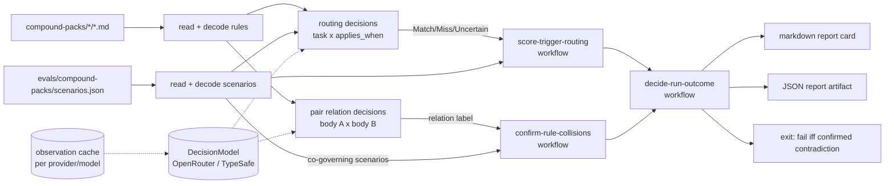
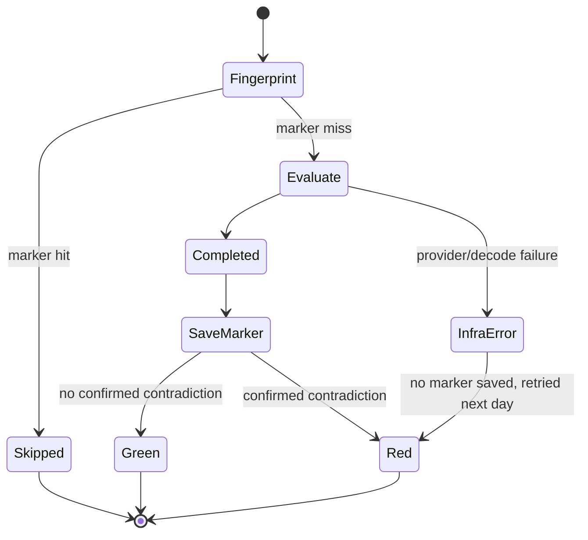

## Goal Capsule

- **Objective**: The repo owner learns, without running anything by hand, when a compound pack contains two rules that contradict each other on a real task, or a rule whose `applies_when` misses the tasks it governs or fires on tasks it does not.
- **Means**: A private `pack-eval` package that asks a decision model through `@systemfsoftware/discern` and runs as a daily, fingerprint-gated GitHub Actions job (KTD1, KTD4, KTD6).
- **Product Authority**: Repository owner, via `ce-brainstorm` dialogue and `ce-plan` scoping confirmation (2026-09-23).
- **Stop conditions**: Stop and report if PR #473 (`packages/discern`) is not merged or is rejected; stop if `@effect/ai-openrouter` at the catalog's `effect` version is not installable from the registry.
- **Execution profile**: Seven units. U1-U5 land as one PR of package code. U6 (scenario labels) and U7 (workflow) are Evaluator-class surfaces and land in their own commits, per the root `AGENTS.md` Surface Classes table.
- **Finish and ship**: The implementer delivers PRs watched to green (REPO-D1) and runs the workflow once via manual dispatch.

---

## Product Contract

### Summary

`pack-eval` scores the two compound packs (`compound-packs/cell-architecture` and `compound-packs/boundary-testing`) on two properties. The first is internal disjointness: no two rules may prescribe contradictory behavior on a task where both apply. The second is trigger accuracy: each rule's `applies_when` must fire on the tasks it governs and stay silent on the others. It runs daily in GitHub Actions and only does work when something it depends on has changed.

### Problem Frame

Compound packs inject domain constraints into agent planning and review. The Every.to pack guide names two ways a pack fails:

1. **Rule collisions.** Two rules reach the same code decision with contradictory mandates, and review has no arbiter.
2. **Key drift and over-triggering.** An `applies_when` that is too narrow leaves work unguarded. One that is too broad taxes every unrelated planning run.

Both properties are semantic. No lint or typecheck in the repo can see them. Today nothing in the repo evaluates packs at all: `.compound-engineering/config.yaml` declares both packs, and no instrument reads them.

### Key Decisions

- **Focus strictly on semantic conflict and routing evaluation** (session-settled: user-directed — chosen over also linting frontmatter and compiling code snippets: frontmatter linting is trivial, and snippets in markdown are elided sketches). Governs R1, R2, R3, R4, R5, R6.
- **Use discern with a Jev-class decision model for semantic classification** (session-settled: user-approved — chosen over general-purpose generative LLM judges: typed probabilities with an explicit uncertain band). Governs R1, R4, R5, R6.
- **Maintain a curated, labelled scenario benchmark** (session-settled: user-approved — chosen over ad-hoc prompts: repeatable scoring across pack versions). Governs R4, R5, R11.
- **Run as a daily scheduled job, not a manual command** (session-settled: user-directed — chosen over a hand-run CLI). Governs R7.
- **Skip unless the evaluation fingerprint changed** (session-settled: user-directed — chosen over evaluating every day). Governs R10.
- **Provider-agnostic, OpenRouter by default** (session-settled: user-directed — chosen over binding to TypeSafe's API: Jev is served by several gateways, and Vercel's free period ends 2026-09-25). Governs R9.
- **Advisory report, never a merge gate** (session-settled: user-approved — chosen over enrolling in `pnpm check:local` or PR checks: root `AGENTS.md` classes `compound-packs/` as Doctrine, never an input to a gate). Governs R7, R8.
- **Two-tier conflict verdicts** (session-settled: user-approved — chosen over treating every model-flagged contradiction as a failure: rules that read as contradictory often do not collide on a concrete task, per [WIRE, arXiv 2605.27784](https://arxiv.org/html/2605.27784v1)). Governs R2, R3.
- **Label ground truth from rule bodies, owner-approved** (session-settled: user-approved — chosen over labelling from `applies_when` text, which would score the key against itself). Governs R11.

### Requirements

#### Pairwise Conflict & Disjointness Analysis

- R1. The tool evaluates every distinct pair of rules within a pack.
- R2. Each pair is classified as disjoint, overlapping with a shared fix, contradictory, or unclear. A contradiction is **confirmed** only when at least one labelled scenario expects both rules to govern it. Otherwise it is a **candidate** that needs review.
- R3. Every confirmed or candidate contradiction reports both rule files, the witnessing scenario IDs (none for a candidate), and a remediation line.

#### Trigger Simulation & Routing Benchmark

- R4. The benchmark holds at least 30 developer task scenarios spanning common repository workflows, including scenarios where no rule should fire.
- R5. Each rule's report shows true-positive, false-negative, false-positive, true-negative, and uncertain counts, plus recall and specificity. It flags rules that miss target tasks or fire as noise. A rule with fewer than the minimum number of positive or negative scenarios in a split is marked "insufficient evidence" instead of getting rates.
- R6. An ambiguous match is counted as uncertain, never coerced into a hit or a miss.
- R11. Scenario labels live apart from the evaluator's source, are approved by the repo owner, and change only in commits that touch no pack file and no evaluator code.

#### Operation & Reporting

- R7. The evaluation runs daily as a scheduled GitHub Actions job, can also be started by manual dispatch, and can be run locally through a package script. It is never a required check on pull requests.
- R8. Each run publishes a per-pack report card to the run summary: pairs checked, confirmed and candidate contradictions, mean recall, mean specificity, and per-rule warnings. A machine-readable report is uploaded as a run artifact. A run with at least one confirmed contradiction fails. Routing warnings and candidates do not fail a run.
- R9. The decision-model provider and model ID are chosen by configuration. OpenRouter is the default, and the TypeSafe API is a supported alternative. Changing provider requires no code change.
- R10. A scheduled run does nothing when the evaluation fingerprint is unchanged since the last completed evaluation. The fingerprint covers the pack files, the scenario labels, the evaluator's code and dependency lockfile, and the configured provider and model.

### Scope Boundaries

- **Outside this product's identity**:
  - Compiling or executing code snippets embedded in markdown rule files.
  - Structural frontmatter linting or markdown format verification.
  - Automated rewriting or auto-fixing of rule files. The tool diagnoses and scores; authors revise.
  - Replacing per-package oxlint rules or typecheck suites.
  - Blocking pull requests.
- **Deferred to Follow-Up Work**:
  - Conflict analysis across different packs.
  - A consumer-agreement spot check that runs the real planning agent on a sample of scenarios to measure how well the proxy judge tracks it (see Appendix, Destructive review).
  - A Vercel AI Gateway adapter. Effect ships no DecisionModel provider for it.

### Acceptance Examples

- AE1. Disjoint pair passes
  - **Covers:** R1, R2, R8
  - **Given:** Two `cell-architecture` rules: one prescribes `*.service.ts` contract placement, the other prescribes single-path `Workflow.make` decisions.
  - **When:** The pair is evaluated.
  - **Then:** The pair is disjoint, and no contradiction is reported.
- AE2. Witnessed contradiction fails the run
  - **Covers:** R1, R2, R3, R8
  - **Given:** A fixture pack where rule 1 says service contracts are pure interfaces with no implementations, rule 2 says services export a default live singleton, and one labelled scenario ("add a caching service") expects both to govern.
  - **When:** The evaluation runs.
  - **Then:** A confirmed contradiction names both rule files and the scenario, and the run fails.
- AE3. Trigger leak flagged
  - **Covers:** R4, R5, R6, R8
  - **Given:** A scenario "Fix typo in README.md" labelled with no governing rules, and a rule whose `applies_when` is broad enough to match it.
  - **When:** The trigger simulation runs.
  - **Then:** The rule gets a false positive on that scenario, its specificity drops, and it is flagged for trigger narrowing. The run does not fail on this alone.
- AE4. Candidate without witness does not fail
  - **Covers:** R2, R3, R8
  - **Given:** A pair classified contradictory, where no scenario expects both rules.
  - **When:** The evaluation runs.
  - **Then:** The pair is reported as a candidate needing review, and the run does not fail.
- AE5. Unchanged fingerprint skips
  - **Covers:** R10
  - **Given:** A completed evaluation for the current fingerprint.
  - **When:** The next scheduled run starts with no change to packs, labels, evaluator, lockfile, or model config.
  - **Then:** The job reports "fingerprint unchanged" and makes no provider call.

### Success Criteria

- The first scheduled run after landing completes on both packs and publishes a report card.
- An edit to one rule file triggers the next run, and only decisions involving that rule reach the provider. The run summary shows cache hits for all other decisions.

---

## Planning Contract

### Key Technical Decisions

- **KTD1. `pack-eval` is a private workspace package at `packages/pack-eval`.** It is not a script under `scripts/tools/`. A package gets turbo tasks, the oxlint `all` preset, and the root requirements to use `@systemfsoftware/effect-cell-types` and `@systemfsoftware/effect-schema-vite`. `private: true` exempts it from changesets (`scripts/guards/check-changeset.ts`, `publishable = private !== true`). It depends on `@systemfsoftware/discern` (PR #473), not the upstream `@doeixd/discern` name.
- **KTD2. The routing judge reads only the task and the rule's key; the labels come from the rule's body.** The routing decision's state is the scenario text plus the rule's `title` and `applies_when`, which is what is under test. The ground truth answers a different question, set from the rule body: "does this rule constrain the work in this task?" Sharing an input between judge and label would make the score tautological (Key Decisions: label ground truth; `docs/solutions/architecture-patterns/provenance-ritual-gates.md`).
- **KTD3. Collision verdicts are split into a nomination and a witness.** The model classifies each pair's relation from both rule bodies into `disjoint`, `overlap_shared_fix`, `contradictory`, or `unclear`. A pure workflow then confirms a contradiction only when a scenario's expected set contains both rules. It mirrors WIRE's split, where the solver nominates and concrete witnesses decide (arXiv 2605.27784 §3.2).
- **KTD4. Code depends only on Effect's `DecisionModel` service.** Provider selection lives at the composition root and is read from `PACK_EVAL_PROVIDER` (`openrouter` | `typesafe`) and `PACK_EVAL_MODEL` (default `typesafe/jev-1.13`). OpenRouter uses `@effect/ai-openrouter` `OpenRouterDecisionModel` (`repos/effect/packages/ai/openrouter/src/OpenRouterDecisionModel.ts`), which maps `Probability` to OpenRouter's `noul` and `Classify` to `choice`. TypeSafe uses `@effect/ai-typesafe` (`repos/effect/packages/ai/typesafe/src/TypeSafeDecisionModel.ts`). Both are version `4.0.0-rc.116`, matching the `effect` catalog entry, and both are added to the pnpm catalog. Model IDs are not portable across channels: `typesafe/jev-1.13` on OpenRouter and `jev-1.13.0` on TypeSafe ([Jev channels](https://jevaiguide.com/channels/)).
- **KTD5. The observation cache is partitioned by provider and model, and is never committed.** discern's `Model.caching` addresses an observation by decision definition and input, not by model (`packages/discern/src/model.ts`, `split`/`observationAddress` on `discern-fork`), so a cache shared across models would replay one model's answers as another's. The store file is keyed by `<provider>/<model>` and lives in a gitignored dot directory. CI persists it with actions/cache. Committing recorded answers would violate CONST-T11.
- **KTD6. The skip is a fingerprint marker in actions/cache, computed by the tool, not by YAML.** `pack-eval fingerprint` hashes the sorted path and byte content of `compound-packs/**`, the scenario-label directory, `packages/pack-eval/src/**`, `packages/pack-eval/package.json`, and `pnpm-lock.yaml`, plus the provider and model ID. The workflow looks up a `pack-eval-done-<fingerprint>` key and exits early on a hit. The marker is saved when an evaluation completes, whatever the verdict, so a found contradiction fails once per change instead of every day. Provider or infrastructure errors save no marker and are retried the next day. Including the lockfile trades an occasional extra run on unrelated dependency bumps for never missing a dependency change; the observation cache makes those reruns nearly free. Branch logic stays in the committed tool (`skill://ci-failure-legibility` M3).
- **KTD7. Thresholds are tuned on the dev split only.** Each scenario is labelled `dev` or `test`. The routing probability band (`above`/`missBelow`) and the relation margin are chosen with discern `Eval.calibrate` on dev. Reports show dev and test metrics side by side, and test labels never feed tuning (`validate-evaluator` discipline from ai-evals-course/evals-skills). The starting band is match ≥ 0.85, miss ≤ 0.30, with uncertain between. The starting insufficient-evidence minimum is 3 positives and 3 negatives per rule per split.
- **KTD8. Scenario labels live at `evals/compound-packs/`, outside the evaluator.** One JSON file holds scenarios: id, task text, split, and for each pack the rule file stems expected to govern. A `README.md` beside it states the body-based labelling question. The root `AGENTS.md` Directory Map gains an `evals/` row classing it as Evaluator (R11; `docs/solutions/architecture-patterns/extraction-strands-the-origins-gate.md`).
- **KTD9. Frontmatter is parsed with the `yaml` package, added to the catalog.** No YAML parser is in the catalog today. Rule files carry `title`, `applies_when` (a list), and `tags`. Decoding goes through a Schema, and a malformed rule file is a typed decode error that names the file and fails the run as an infrastructure error, not as a verdict.
- **KTD10. Report output has two forms.** A markdown report card goes to stdout, and the workflow appends it to `$GITHUB_STEP_SUMMARY`. A schema-versioned JSON report is written to a path argument and uploaded as a run artifact (`skill://ci-failure-legibility` M2). Neither is committed (CONST-T11).

### High-Level Technical Design

Evaluation data flow. The pure workflows sit between the decision shell and the report.



Scheduled job lifecycle:



### Output Structure

```text
packages/pack-eval/
  package.json                 # private, bin: pack-eval
  oxlint.config.ts
  src/
    main.ts                    # composition root: provider layer, CLI dispatch
    pack-rule.schema.ts
    scenario-set.schema.ts
    eval-report.schema.ts
    score-trigger-routing.workflow.ts
    confirm-rule-collisions.workflow.ts
    decide-run-outcome.workflow.ts
    rule-judge.service.ts      # RuleJudge contract: routing + relation questions over DecisionModel (discern)
    evaluate-packs.cell.ts     # Sandwich: read -> decode -> decide -> encode -> write
    compute-fingerprint.cell.ts
    __tests__/*.workflow.property.test.ts
  tests/
    fixtures/                  # planted-contradiction and trigger-leak packs + scenario sets
    *.integration.test.ts
evals/compound-packs/
  README.md
  scenarios.json
.github/workflows/pack-eval.yml
```

### Assumptions

- PR #473 merges with `packages/discern`'s public API as recorded in `packages/discern/etc/discern.api.md` on `discern-fork` (`Eval.run`/`calibrate`, `Model.caching`/`intercept`/`store`/`provider`).
- `@effect/ai-openrouter@4.0.0-rc.116` and `@effect/ai-typesafe@4.0.0-rc.116` are published to npm.
- A pair prompt holding two rule bodies fits in OpenRouter's 32k context. The largest rule file in the packs is a few KB.
- The repo owner adds an `OPENROUTER_API_KEY` Actions secret with prepaid credit.

### Sequencing

U1 → U2 → (U3, U4 in parallel) → U5. U6 (labels) is authored alongside U3-U5 but committed separately. U7 (workflow) lands last, in its own commit, after U5 and U6 are on main.

---

## Implementation Units

### U1. Scaffold the private `pack-eval` package

**Goal:** A buildable, lintable, empty private package wired into the workspace.
**Requirements:** R7, R9 (dependencies only).
**Dependencies:** PR #473 merged.
**Files:** `packages/pack-eval/package.json`, `packages/pack-eval/oxlint.config.ts`, `packages/pack-eval/tsconfig*.json`, `packages/pack-eval/vitest.config.ts`, `pnpm-workspace.yaml` (catalog: `@effect/ai-openrouter`, `@effect/ai-typesafe`, `yaml`), `.gitignore` (`.pack-eval-cache/`).
**Approach:**

1. Copy manifest and config shape from an existing private package (`packages/oxlint-plugin/import-origin`) and a runnable one with a `bin` (`packages/toolchain/tsdown-config`).
2. Depend on `effect`, `@effect/platform-node`, `@systemfsoftware/discern`, `@systemfsoftware/effect-cell-types`, the two provider packages, and `yaml`. Dev-depend on `@systemfsoftware/effect-schema-vite`, `@systemfsoftware/effect-gherkin-spec`, and `@effect/vitest`.
3. Extend the recommended oxlint preset per the root `AGENTS.md` (the `all` preset).
   **Patterns to follow:** `packages/effect-memfs` package layout.
   **Test expectation:** none -- scaffolding. `pnpm check:local` passing is the proof.
   **Verification:** The package appears in `pnpm map`. Typecheck, lint, and test run on an empty package without error.

### U2. Rule and scenario schemas with refusal tests

**Goal:** Typed decoding of pack rule files and the scenario set.
**Requirements:** R4, R11; KTD8, KTD9.
**Dependencies:** U1.
**Files:** `packages/pack-eval/src/pack-rule.schema.ts`, `packages/pack-eval/src/scenario-set.schema.ts`, `packages/pack-eval/src/eval-report.schema.ts`, `packages/pack-eval/src/__tests__/` (refusal tests beside generated laws).
**Approach:**

1. `PackRule` holds pack id, file stem, `title`, non-empty `applies_when` list, `tags`, and body text.
2. `ScenarioSet` holds a version, and scenarios with id, task text, `split` (`dev` | `test`), and a per-pack list of expected rule stems.
3. Cross-reference checks (every expected stem exists in its pack, scenario IDs are unique) run as a decode step against the loaded rules, not as a schema refinement over one file.
4. `EvalReport` is the schema-versioned JSON artifact shape (KTD10).
   **Patterns to follow:** `compound-packs/cell-architecture/decode-never-cast.md` (pack: cell-architecture, decode-never-cast.md); refusals beside generated laws (pack: boundary-testing, refusals-beside-generated-laws.md).
   **Test scenarios:**

- Happy path: a rule file with `title`, a two-item `applies_when`, and a body decodes to `PackRule`.
- Error path: a rule file with `applies_when` as a bare string, not a list, is refused with an error naming the file.
- Error path: a rule file with no frontmatter is refused.
- Error path: a scenario with `split: "train"` is refused.
- Error path: a scenario that expects a rule stem absent from the pack is refused and names the scenario and the stem.
- Edge: a scenario with empty expected lists for every pack decodes (a no-rule negative, needed by AE3).
- Error path: duplicate scenario IDs are refused.
  **Verification:** Generated schema laws and the hand-written refusals pass. Sabotage check (CONST-T10): widening `split` to any string turns a refusal test red.

### U3. Pure scoring workflows

**Goal:** Deterministic scoring from decision outcomes and labels to per-rule metrics, collision findings, and the run outcome.
**Requirements:** R2, R3, R5, R6, R8; KTD3, KTD7.
**Dependencies:** U2.
**Files:** `packages/pack-eval/src/score-trigger-routing.workflow.ts`, `packages/pack-eval/src/confirm-rule-collisions.workflow.ts`, `packages/pack-eval/src/decide-run-outcome.workflow.ts`, and matching `packages/pack-eval/src/__tests__/*.workflow.property.test.ts`.
**Approach:**

1. `score-trigger-routing` takes, for each (scenario, rule, split), the expected boolean and the observed `Match`/`Miss`/`Uncertain`. It returns per-rule, per-split TP/FN/FP/TN/uncertain counts, recall and specificity over decided cells, the insufficient-evidence mark, and warnings.
2. `confirm-rule-collisions` takes each pair's relation label and the scenario set. It derives witnesses as scenarios expecting both rules, and returns `Confirmed` (contradictory with a witness), `Candidate` (contradictory without one), `Unclear`, or clean findings, with remediation text.
3. `decide-run-outcome` returns `Fail` if and only if some finding is `Confirmed`.
4. All three are `Workflow.make` or `Workflow.total`, with cyclomatic complexity 1 and exhaustive `Match` (CONST-P2).
   **Patterns to follow:** `packages/effect-memfs/src/__tests__/decode-watch-event.workflow.property.test.ts`; pure decision workflows (pack: cell-architecture, pure-decision-workflows.md).
   **Test scenarios:**

- Happy path: one rule, one positive scenario observed `Match`, one negative observed `Miss` → TP 1, TN 1, recall 1, specificity 1.
- Covers AE3. A negative scenario observed `Match` → FP 1, specificity drops below 1, and a narrowing warning is emitted.
- Edge (R6): an `Uncertain` observation increments uncertain only, changes neither recall nor specificity, and is never counted as a hit or a miss.
- Edge: a rule with 2 positives in a split is marked insufficient evidence for that split and gets no rates.
- Property: TP + FN + FP + TN + uncertain equals the number of scored cells for every rule.
- Covers AE2. A contradictory pair with one co-governing scenario → `Confirmed`, carrying that scenario ID.
- Covers AE4. A contradictory pair with no co-governing scenario → `Candidate`.
- Covers AE1. A disjoint pair → no finding.
- Property: `decide-run-outcome` fails exactly when the findings contain a `Confirmed` entry.
- Property: pair enumeration yields n(n-1)/2 unordered pairs with no self-pairs.
  **Verification:** Property suites pass. Sabotage: dropping the witness check makes the `Candidate` scenario go red.

### U4. RuleJudge service and provider-agnostic model wiring

**Goal:** Semantic questions defined once, answerable by any configured provider, with a per-model cache.
**Requirements:** R1, R2, R6, R9; KTD2, KTD4, KTD5.
**Dependencies:** U2.
**Files:** `packages/pack-eval/src/rule-judge.service.ts`, `packages/pack-eval/src/main.ts` (provider layer only; U5 adds CLI dispatch), `packages/pack-eval/tests/rule-judge.integration.test.ts`.
**Approach:**

1. `RuleJudge` is a `Context.Service` whose implementation uses discern over `DecisionModel` and imports no provider package (pack: cell-architecture, ports-separate-from-layers.md). It exposes two questions.
2. The routing question is a discern `probability` over `{ task, ruleTitle, appliesWhen }`, wrapped with `band` using the KTD7 thresholds. The rule body is excluded from the state (KTD2).
3. The relation question is a discern `classify` over `{ ruleA: {title, body}, ruleB: {title, body} }`, with the four labels from KTD3, each with a criterion sentence.
4. The composition root in `main.ts` chooses `OpenRouterDecisionModel.layer` or `TypeSafeDecisionModel.layer` from config. API keys come from `Config.Redacted` (`OPENROUTER_API_KEY` or `TYPESAFE_API_KEY`). It wraps the chosen layer with discern `Model.intercept([Model.caching(store)])`, where `store` is loaded from and snapshotted to `.pack-eval-cache/<provider>/<model>.json`.
5. An unknown provider value is a typed config error.
   **Patterns to follow:** discern `Model.intercept` docs example (`packages/discern/src/model.ts` on `discern-fork`); provider test stub pattern in `repos/effect/packages/ai/typesafe/test/TypeSafeDecisionModel.test.ts`.
   **Test scenarios:**

- Integration: with a hand-written discern `Model.provider` that returns a fixed probability, the routing decision yields `Match` above the band, `Miss` below it, and `Uncertain` inside it.
- Integration: two runs over the same input with a caching store call the fake provider once. The second run is a full hit.
- Integration (KTD5): the same input under model IDs `a` and `b` writes two separate store files, and model `b` does not reuse `a`'s answer.
- Error path: `PACK_EVAL_PROVIDER=vercel` fails with a config error naming the accepted values.
- Error path: a provider failure surfaces as an infrastructure error, distinct from a verdict.
  **Verification:** Integration tests pass with no network access. No test imports a live provider client.

### U5. Evaluation cell, fingerprint cell, and CLI

**Goal:** The end-to-end command: read packs and scenarios, decide, score, report, and exit. Plus the fingerprint subcommand.
**Requirements:** R1-R10; KTD5, KTD6, KTD10; AE1-AE5.
**Dependencies:** U3, U4.
**Files:** `packages/pack-eval/src/evaluate-packs.cell.ts`, `packages/pack-eval/src/compute-fingerprint.cell.ts`, `packages/pack-eval/src/main.ts`, `packages/pack-eval/tests/fixtures/**`, `packages/pack-eval/tests/evaluate-packs.integration.test.ts`, `packages/pack-eval/tests/compute-fingerprint.integration.test.ts`.
**Approach:**

1. `evaluate-packs` is a Sandwich (CONST-B3). Read pack directories and the scenario file. Decode them (U2). Run routing decisions over scenario × rule and relation decisions over within-pack pairs through `DecisionModel`, batching per scenario and per pair. Score with the U3 workflows. Encode the markdown card and the JSON report. Write stdout and the report path.
2. `compute-fingerprint` hashes the KTD6 inputs in sorted path order and prints the hex digest. The pack root and scenario path are arguments, so the fixtures can be fingerprinted.
3. `main.ts` is the single interpretation edge (`runMain`). It offers `pack-eval evaluate --packs <dir> --scenarios <file> --report <path>` and `pack-eval fingerprint ...`. Exit code 1 means a confirmed contradiction; 2 means an infrastructure error.
4. There are two fixture packs. `contradiction` holds the AE2 pair plus a disjoint third rule. `leak` holds the AE3 broad rule. Each has a scenario set with hand-written expected outcomes as the oracle (CONST-T10).
   **Execution note:** Write the gherkin integration feature for AE2 first, with the fake provider scripted to answer "contradictory" for the planted pair. Watch it fail, then build the cell.
   **Patterns to follow:** `packages/effect-memfs/tests/learn-why-a-request-was-turned-down.integration.test.ts` (`makeFeature`, required by `behaviour-test-requires-gherkin`); sandwich phase order (pack: cell-architecture, sandwich-phase-order.md).
   **Test scenarios:**

- Covers AE2. `contradiction` fixture with a scripted provider → report lists one `Confirmed` naming both files and the scenario ID, and the process exits 1.
- Covers AE1. The disjoint pair in the same fixture produces no finding.
- Covers AE3. `leak` fixture → the broad rule shows FP 1 on the README-typo scenario and a narrowing warning, and the process exits 0.
- Covers AE4. Remove the witness scenario from the `contradiction` set → `Candidate`, exit 0.
- Error path: a malformed rule file in the fixture → exit 2, and the message names the file.
- Integration: the JSON report decodes with `EvalReport`, and its per-rule counts match the markdown card.
- Covers AE5 (tool side). The fingerprint of the fixture tree is stable across two runs.
- Fingerprint: it changes when one rule byte, one label byte, the model ID, or a `packages/pack-eval/src` file changes.
- Fingerprint: it does not change on a file outside the declared inputs.
  **Verification:** `pnpm --filter @systemfsoftware/pack-eval test` passes offline. A local live run against `compound-packs/` with `OPENROUTER_API_KEY` prints a card for both packs.

### U6. Author and approve the scenario labels

**Goal:** At least 30 owner-approved scenarios with dev and test splits.
**Requirements:** R4, R11; KTD2, KTD8.
**Dependencies:** U2 (schema). Commit separately from U1-U5 and from any pack edit.
**Files:** `evals/compound-packs/scenarios.json`, `evals/compound-packs/README.md`, `AGENTS.md` (Directory Map row for `evals/`).
**Approach:**

1. Draft scenarios along three dimensions: artifact touched (service contract, driver module, workflow, builder, handle, barrel, test file, docs-only, CI config), boundary (composition root, reusable library, external consumer), and work kind (new feature, bug fix, refactor, test addition). This is the tuple method from `generate-synthetic-data` in ai-evals-course/evals-skills.
2. Include at least 25% scenarios where no rule in either pack should fire.
3. Label each scenario by asking of each rule's **body**, not its `applies_when`: "does this rule constrain the work this task requires?"
4. Mark each scenario `dev` or `test`, about 50/50, balancing positives per rule across the splits.
5. The repo owner reviews and approves each label before commit. The README records the labelling question and that approval.
   **Test expectation:** none -- data. U2's decode and cross-reference checks validate it; `pack-eval evaluate` refuses a malformed set.
   **Verification:** The file decodes against the live packs. Every rule has at least one positive scenario in the dev split, or the gap is named in the README.

### U7. Scheduled GitHub Actions workflow

**Goal:** A daily and dispatchable job that skips unchanged fingerprints, evaluates, and publishes the card.
**Requirements:** R7, R8, R10; KTD5, KTD6, KTD10; AE5.
**Dependencies:** U5 and U6 on main. Land in its own commit (Evaluator surface).
**Files:** `.github/workflows/pack-eval.yml`.
**Approach:**

1. Triggers are `schedule` (daily) and `workflow_dispatch`, with inputs `packs` (default `compound-packs`) and `scenarios` (default `evals/compound-packs/scenarios.json`), so a dispatch can target a fixture to prove the red path. There is no `pull_request` or `push` trigger.
2. Steps, each named:
   1. Install.
   2. Compute the fingerprint with the tool.
   3. Look up `pack-eval-done-<fingerprint>` with actions/cache `lookup-only`. On a hit, one step writes "fingerprint unchanged" to the summary; every later step is conditioned on the lookup's `cache-hit` output being false, so a hit runs nothing else (a `lookup-only` miss does not fail the step by itself).
   4. Restore the observation cache with key `pack-eval-obs-<provider>-<model>-<run_id>` and restore-keys `pack-eval-obs-<provider>-<model>-` (`skill://ci-failure-legibility` P1).
   5. Run `evaluate`, passing `OPENROUTER_API_KEY` from secrets, with `PACK_EVAL_PROVIDER` and `PACK_EVAL_MODEL` as workflow env.
   6. Append the card to `$GITHUB_STEP_SUMMARY`.
   7. Upload the JSON report.
   8. Save the observation cache.
   9. Save the done marker only when the evaluation exit code is 0 or 1.
3. The workflow keeps no loops or conditionals beyond exit-code routing. Logic stays in the tool (M3).
4. Scheduled runs are skipped on forks, and the job's permissions are `contents: read` only.
   **Test expectation:** none -- workflow wiring. Proven by the observed runs below.
   **Verification:**

- A manual dispatch on main evaluates both packs and publishes a card.
- A second dispatch with no change reports "fingerprint unchanged" and makes no provider call.
- A dispatch with `packs` and `scenarios` pointed at the U5 `contradiction` fixture fails red with the confirmed finding in the summary.
- After a one-line rule edit, the summary's cache-hit count shows only decisions for that rule were re-asked.

---

## Verification Contract

- Package gate: `pnpm --filter @systemfsoftware/pack-eval typecheck`, `lint`, `test`, and `test:types` if type tests are added.
- Repo gate: `pnpm check:local` exits 0 after the last edit (REPO-D1). `pack-eval` is not added to `gate:tasks` or `check:ci` (R7).
- Local mutation runs are forbidden (REPO-D3). Mutation is read from the CI Mutation workflow report.
- Live proof, run once and recorded in the PR: the U5 local run and the four U7 dispatch observations.
- CI: `gh pr checks --watch --fail-fast` exits 0 for each PR.

## Definition of Done

- R1-R11 hold as observed on the live packs and the fixtures. AE1-AE5 each have a passing test or an observed run.
- `pack-eval` runs daily on main. It skips unchanged fingerprints and fails only on confirmed contradictions.
- No recorded model answers, reports, or cache files are committed.
- Scenario labels are owner-approved and committed separately from evaluator code and pack edits. The workflow is committed separately from the code it runs.
- The `evals/` row is present in the root `AGENTS.md` Directory Map.
- Abandoned-attempt code and scratch scripts are removed from the diff.
- Per-unit: each unit's Verification bullets hold.

---

## Risks & Dependencies

- **PR #473 is open.** `packages/discern` exists only on `discern-fork`. Every unit waits on it (stop condition).
- **Proxy validity.** A pinned Jev reading `applies_when` stands in for how the planning agent actually selects rules. A low recall can mean a bad key or a judge miss. Per-rule reports are diagnostics for a human, not verdicts. The deferred consumer-agreement check measures the gap.
- **Small per-rule samples.** At 30+ scenarios, most rules have a handful of positives. The insufficient-evidence mark (KTD7) prevents precise-looking rates. Growing the set is the remedy, and every label change re-runs the evaluation (R10).
- **Channel drift.** Model names and limits differ by gateway, and OpenRouter's decisions endpoint is labelled alpha. Pin the model ID in workflow env, and change it deliberately, which also changes the fingerprint.
- **Cost.** About 30 × 20 routing decisions plus 106 within-pack pairs per full run, at $0.042 per 1M input tokens on OpenRouter, costs cents. The cache makes partial reruns cheaper still.

---

## Appendix

### Destructive review

- **Assumptions surfaced:**
  1. A pinned decision model reading `applies_when` approximates the planning agent's rule selection.
  2. Labels judged from rule bodies are independent of the `applies_when` text under test.
  3. A pair's conflict can be judged from the two rule bodies alone.
- **Lens:** Substitution. The whole plan rests on one judge pattern, so the review replaced it and compared.
- **Radical alternative:** Drop the proxy. Run the real planning agent (`ce-plan` with packs declared) on each scenario, and read which pack rules it cites. This is highest validity, but it costs one agent run per scenario, is non-deterministic, and uses no cache. Rejected as the primary instrument and deferred as a sampled consumer-agreement check.
- **Delta:**
  - Kept: semantic-only scope, discern and a Jev-class judge, the curated set, and advisory status.
  - Replaced: a single "contradiction" verdict is now candidate plus witness (assumption 3 fails without a concrete co-governing task, per WIRE).
  - Added: body-based labels (answers assumption 2), a provider-partitioned cache, fingerprint skip, and insufficient-evidence marking.
  - Removed: the hand-run CLI as the primary surface, and the `@doeixd/discern` package name.

### Sources

- [WIRE: Diagnosing Live Within-Policy Instruction Conflicts in LLM Agents, arXiv 2605.27784](https://arxiv.org/html/2605.27784v1)
- [ai-evals-course/evals-skills](https://github.com/ai-evals-course/evals-skills): `validate-evaluator` (splits, TPR/TNR), `generate-synthetic-data` (dimension tuples)
- [Jev channels compared](https://jevaiguide.com/channels/), checked 2026-09-19
- [Balanced Accuracy for LLM Judges (Collot et al., EACL 2026)](https://doi.org/10.18653/v1/2026.eacl-industry.69): report recall and specificity, not accuracy
- `docs/solutions/architecture-patterns/constraint-reaches-only-via-window-or-gate.md`, `docs/solutions/architecture-patterns/provenance-ritual-gates.md`, `docs/solutions/tooling-decisions/rule-admission-severity-and-accretion.md`
