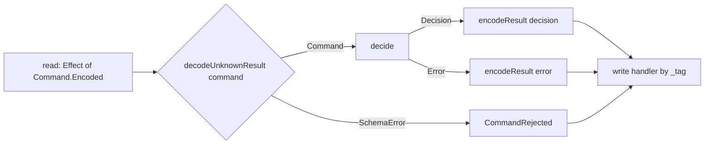

# Schema-Enforced Cell Edges - Plan

## Summary

`@systemfsoftware/effect-cell-types` makes every cell edge a schema boundary. A workflow declares its command, decision and error as schemas. The sandwich derives `decode` and `encode` from those schemas, and authors can no longer supply or skip them. `write` becomes a handler record the compiler holds exhaustive over every encoded decision and error tag. Decisions may be one exclusive outcome or a list of events. `Workflow.total`, `Workflow.andThen` and `Sandwich.pure` are deleted, `Cell.provide` stops rebuilding its layer per run, and loops use Effect's own `repeat`/`retry` with a `Schedule`. The four consumer packages migrate in the same change.

---

## Problem Frame

The sandwich names five phases, but only three do work. In all three production chains that fill `decode`, it builds the command from what `read` returned and runs no schema (`packages/effect-readiness/src/await-condition.cell.ts:58`, `packages/effect-microsandbox/src/await-readiness.cell.ts:81`, `packages/effect-daemon-spec/src/internal/SupervisorBodyExecutor.ts:83`). In the same three chains `encode` is the identity function (`Sandwich.pure(Result.succeed)`). Real decoding lives in the adapters instead (`NodeHostProber.layer.ts:10`, memfs `driver-values.ts:155`). The library allowed this because `decode` and `encode` are free author-supplied functions, and a raw chain (`read -> decide -> write`) skips both.

The same looseness shows in `write`. It takes `(outcome, raw)` as a free function, so nothing forces it to handle every decision variant, and the shell ends up deciding things itself. `await-condition.cell.ts:29-66` computes its real verdict inside `write` by calling `evaluateProbe` through `Result.getOrThrow`, while the cell's own decision only picks which probe to run.

Four defects in the library fall outside the design law it enforces:

- `Workflow.make` refuses a single success variant even when the error channel is inhabited (`Workflow.ts:87-90`), so Wlaschin's `Command -> Result<Event, Error>` does not compile. `Workflow.total` exists only to work around `make` refusing a `never` error channel.
- `Workflow.andThen` composes workflow into workflow, which the DMMF design this repo follows rules out. It has no production callers.
- `Cell.provide` is `make((input) => Effect.provide(self.run(input), layer))` (`Cell.ts:258`), which builds the layer inside each run's scope (`repos/effect/packages/effect/src/internal/layer.ts:8-22`). The doctrine classifies it as once-per-process wiring (`CONCEPTS.md:256`).
- `evaluate-probe.workflow.ts:47` decides a bare `boolean` and typechecks, so the tagged-union check on decisions has a hole.

The library also lacks the event-list decision shape: `Result<ReadonlyArray<Event>, Error>`, zero or more past-tense facts per run. DMMF defines a workflow as one function from a command to a list of events (see Sources), and the DMMF `PlaceOrder` workflow cannot be written today. The user directed that the library cover the whole design law rather than only what its current consumers need. `STRATEGY.md`'s cell-architecture track asks for a type surface that makes illegal programs unrepresentable, and that promise does not hold if legal programs cannot be expressed at all.

---

## Requirements

**Workflow contract**

- R1. A workflow is constructed by one `Workflow.make` call declaring its command, decision and error schemas plus a pure `decide` function.
- R2. A decision is either an exclusive tagged union or a `ReadonlyArray` of a tagged event union, and the compiler refuses every other decision type, including `boolean`.
- R3. A workflow with an inhabited error channel may decide a single success variant.
- R4. A workflow value stays callable as `(command) => Result<Decision, Error>` so property tests and in-process callers keep working.

**Cell edges**

- R5. `read` returns the command's `Encoded` form, and the library decodes it with the workflow's command schema before `decide` runs. No author-supplied decode exists.
- R6. The library encodes every decision and every domain error with the workflow's schemas before `write` sees them, so `write` only receives encoded values.
- R7. `write` is a record of handlers keyed by every encoded decision tag, every error tag, and `CommandRejected`, and a missing handler is a compile error.
- R8. Malformed input fails as `CommandRejected`, carrying the schema issue, and telemetry counts it as `failure`, not `infrastructure`.

**Composition and wiring**

- R9. The library ships no loop, retry or repeat combinator. Repeated passes use `Effect.repeat`, `Effect.retry` and `Schedule` over `cell.run`.
- R10. Services are bound to a cell once, at the composition root, and never rebuilt per run.
- R11. `Workflow.total`, `Workflow.andThen`, `Sandwich.pure`, the raw chain, and the author-facing `decode`/`encode` chain steps are removed with no aliases.

**Enforcement and migration**

- R12. The workflow lint rules (`make-boundary` and `oxlint-plugin-dmmf-workflow`) locate the decision body, command and constructor set in the new `Workflow.make` shape, with no rule going silent.
- R13. Every consumer in `packages/` migrates, and the polling loop in `effect-readiness` makes its verdict a pure decision.
- R14. Doctrine that describes the removed surface (`CONCEPTS.md`, `compound-packs/`, package README and AGENTS) describes the new surface.

---

## Scope Boundaries

- Stays out of scope: `packages/discern`. This change lands on a new branch off `main`, where `packages/discern` does not exist. discern migrates to the new surface in its own plan after this change merges, so the `pnpm check:local` gate in U9 never sees discern's pre-migration code.
- Stays out of scope: whether `Cell` shrinks to a branded `(input) => Effect` function. Most combinators in `Cell.ts:83-384` re-wrap an `Effect` operator, and that deserves its own decision record.
- Stays out of scope: whether the supervisor's epoch loop (`SupervisorBodyExecutor.ts:116-160`) becomes `Effect.repeat`. Its restart cell migrates to the new edges, and its loop stays as it is.
- Stays out of scope: durable, restart-surviving processes. Effect's `unstable/workflow` covers them.
- Stays out of scope: a Decider or state-machine runner (KTD1).

---

## Key Technical Decisions

- KTD1. The sandwich stays the only cell primitive: `read -> decode -> decide -> encode -> write`, one pass per run. Loops stack sandwiches instead of interpreting instructions. (session-settled: user-directed — chosen over a Decider/state-machine runner: the impure/pure/impure sandwich is the architecture's core, and an interpreter adds a second model for the same work.)
- KTD2. `decode` and `encode` are mandatory and derived from the workflow's schemas with `Schema.decodeUnknownResult` and `Schema.encodeResult` (`repos/effect/packages/effect/src/Schema.ts:1668`, `:2106`). Authors cannot supply either. (session-settled: user-directed — chosen over deleting both phases: data entering the pure core must be decoded by a schema and data leaving it encoded by one, and today's misuse came from the library letting authors write them by hand.)
- KTD3. No library loop combinator. A polling or retrying cell is one pass, and the shell repeats `cell.run` with `Effect.repeat({ schedule, until })`, `Effect.retry`, and `Effect.timeoutOrElse` (`Effect.ts:7656`, `:4090`, `:4641`). The decision's tag drives `until` through `Predicate.isTagged`. (session-settled: user-directed — chosen over a `Sandwich.repeat`: Effect's schedules already model spacing, limits and backoff as values, and each `run` already opens its own span.)
- KTD4. Event-list decisions are first class: `decision: Schema.Array(EventUnion)`. The shape checks apply to the element union, and an empty list is a valid decision. (session-settled: user-directed — chosen over dropping event lists: the library must cover every shape its design law allows, not only what discern needs.)
- KTD5. `Workflow.make` takes one options object, `{ command, decision, error, decide }`. The precedent is Effect's durable `Workflow.make` (`repos/effect/packages/effect/src/unstable/workflow/Workflow.ts:432-446`), which also declares its `payload`, `success` and `error` schemas in an options object. This plan drops that function's leading `tag` argument and its `idempotencyKey`, because both exist for durable execution. `error: Schema.Never` expresses a decision that cannot fail, so `Workflow.total` and `UninhabitedError` are deleted. The names `command` and `decision` stay because `CONCEPTS.md` uses them.
- KTD6. The decision-shape law in `Workflow.ts` becomes: an exclusive decision needs at least two outcomes across its success variants and its error variants together, so one success variant plus an inhabited error channel is valid. Every success variant must be tagged and share one TypeId. An event-list element union needs at least one tagged variant sharing one TypeId. Error variants must be `Schema.TaggedError`. The root cause of `boolean` passing today is found and closed as part of U1.
- KTD7. `write` takes a handler record. For an exclusive decision, exactly one handler runs and its result is the cell's response. For an event list, handlers run sequentially in list order through `Effect.forEach`, the first failure stops the rest, and the response is the array of handler results. Every handler receives the encoded value and, as its second argument, the encoded command `read` returned. This preserves the existing read-snapshot access in `write`.
- KTD8. `CommandRejected` is a library `Schema.TaggedError` carrying the `SchemaError` issue and is always part of the handler record. Telemetry classes are: success when a decision is written, `failure` for a domain error or `CommandRejected`, and `infrastructure` for a failure in `read` or `write`. Failure to encode a value the workflow produced is a programming defect and dies. The generated round-trip laws (KTD11) catch it before runtime.
- KTD9. `Cell.provide(layer)` is replaced by `Cell.provideContext(context)`, which takes a `Context` the composition root built once (`Layer.build` under the root scope, or a `ManagedRuntime`). The rejected alternative, memoizing the layer inside `provide`, cannot give scoped resources a process lifetime, because the scope still closes when the run ends.
- KTD10. `Workflow.andThen` is deleted without a replacement. Sequencing across decisions happens in cells: each decision gets its own sandwich, and cells compose with the existing arrows.
- KTD11. Every `decision` and `error` schema is exported from the workflow module that decides it, so `@systemfsoftware/effect-schema-vite`, which scans every export under `src/`, generates the encode/decode round-trip laws for it with no hand-written test. The variants cannot sit in a sibling `*.schema.ts`: `make-body-purity` forbids a decider from referencing another local module's values, so the module that constructs a variant must declare it.
- KTD12. The `make-boundary` kernel's constructor set shrinks to `make`, and the decision body is the `decide` property of the options object, resolved the same way as today (inline function or same-file reference). `make-command-schema` reads the `command` property instead of argument 0.
- KTD13. A cell's response is whatever its handlers return, and handlers only see encoded values, so a cell hands its caller DTOs. Cells composed with the arrows exchange DTOs, and the next cell's `read` receives an encoded command, which it can pass through unchanged. A caller that needs domain types decodes at its own edge.

---

## High-Level Technical Design

Directional sketch, not an implementation specification. Type-level parts reflect the current `Workflow.ts` and the vendored `Schema` and `Match` modules.

```ts
// judge-probe.workflow.ts
export const judgeProbe = Workflow.make({
  command: JudgeProbe, // Schema.TaggedClass + InstrumentationBrand
  decision: ProbeVerdict, // Schema.Union([Satisfied, NotYet]) from probe-verdict.schema.ts
  error: Schema.Never,
  decide: (command) => Result.succeed(verdictOf(command)),
})

// place-order.workflow.ts (event list, R3 + KTD4)
export const placeOrder = Workflow.make({
  command: PlaceOrder,
  decision: Schema.Array(PlaceOrderEvent), // OrderPlaced | BillableOrderPlaced | AcknowledgmentRequested
  error: Schema.Union([InvalidOrder, PricingFailed]),
  decide: (command) => Result.gen(function*() {/* validate -> price -> events */}),
})
```

```ts
// probe-condition.cell.ts: one pass
export const probeConditionCell = Sandwich.named('probe_condition')(probeOnce) // Effect<JudgeProbe['Encoded'], ...>
  .decide(judgeProbe)
  .write({
    Satisfied: (verdict) => Effect.succeed(verdict),
    NotYet: (verdict) => Effect.succeed(verdict),
    CommandRejected: (rejected) => Effect.fail(new ProbeInputInvalid({ issue: rejected.issue })),
  })

// body of the public Readiness.awaitCondition(target, condition); the loop is Effect's
const pollUntilSatisfied = (input: AwaitCondition) =>
  probeConditionCell.run(input).pipe(
    Effect.repeat({
      schedule: Schedule.spaced(`${input.target.pollMs} millis`),
      until: Predicate.isTagged('Satisfied'),
    }),
    Effect.timeoutOrElse({
      duration: `${input.target.timeoutMs} millis`,
      orElse: () => Effect.succeed(new TimedOut({})),
    }),
  )
```

One pass inside the library:



| Removed                             | Replacement                               |
| ----------------------------------- | ----------------------------------------- |
| `.decode(Sandwich.pure(fn))`        | derived from `command` schema             |
| `.encode(Sandwich.pure(fn))`        | derived from `decision` / `error` schemas |
| raw chain `read -> decide -> write` | every chain decodes                       |
| `write(outcome, raw)`               | tag-keyed handler record (KTD7)           |
| `Workflow.total`                    | `error: Schema.Never`                     |
| `Workflow.andThen`                  | cells compose                             |
| `Cell.provide(layer)`               | `Cell.provideContext(context)`            |

---

## Test Layers

Admission per `skill://test-layer-selection` and CELL-T2. Default is refusal: a test enters only at the layer below.

| Subject                                                                                      | Layer                                           | Location                                         |
| -------------------------------------------------------------------------------------------- | ----------------------------------------------- | ------------------------------------------------ |
| Workflow and Sandwich type surface (shape law, handler exhaustiveness, `Encoded` parameters) | tstyche type assertions                         | `packages/effect-cell-types/test-types/`         |
| Derived decode, encode and handler dispatch                                                  | composition tests running real cells end to end | `packages/effect-cell-types/tests/`              |
| Decision logic in each migrated workflow                                                     | property tests                                  | `src/__tests__/<stem>.workflow.property.test.ts` |
| Round trip of every decision, error and command schema                                       | generated laws, no hand-written test (KTD11)    | `effect-schema-vite`                             |
| Polling loop in `effect-readiness`                                                           | composition test under `TestClock`              | package `tests/`                                 |
| Lint rule reach                                                                              | RuleTester suites                               | existing `__tests__/`                            |

## Refused: unit tests of the decode/encode glue in isolation, tests that restate a schema's fields, and any test of a removed API kept to prove its removal.

## Implementation Units

- U1. **Workflow schema contract**
  - Goal: R1–R4 and R11 on the workflow side, following KTD5, KTD6 and KTD10.
  - Dependencies: none.
  - Files: `packages/effect-cell-types/src/Workflow.ts`, `packages/effect-cell-types/test-types/workflows-surface.tst.ts`, `packages/effect-cell-types/tests/__fixtures__/*.workflow.ts` (delete `chain-admit-decisions`, `chain-admit-tagged-commands`, `total-pair-admit-tagged-commands`, `total-admit-decision`, `total-admit-tagged-command`; migrate the rest), `packages/effect-cell-types/etc/effect-cell-types.api.md`.
  - Approach: `WorkflowSchemasKey` carries `command`, `decision` and `error` schemas. The shape conditionals move from the decider's return type onto the schemas' `Type`, keeping the conditionals out of parameter position (see `docs/solutions/architecture-patterns/constructor-rule-boundary.md` on the collapse trap).
  - Test scenarios (tstyche): a single success variant with an inhabited error compiles; a single variant with `Schema.Never` error is refused; `boolean`, an untagged variant and an unshared TypeId are refused; an event list with one tagged variant compiles; an event list of untagged elements is refused; an untagged error is refused; a decider whose return disagrees with the declared schemas is refused.
  - Verification: `pnpm --filter @systemfsoftware/effect-cell-types typecheck test:types api:check` passes after `api:update`.

- U2. **Sandwich derived edges**
  - Goal: R5–R8 and R11 on the cell side, following KTD2, KTD7 and KTD8.
  - Dependencies: U1.
  - Files: `packages/effect-cell-types/src/Sandwich.ts`, new `packages/effect-cell-types/src/CommandRejected.schema.ts`, `packages/effect-cell-types/src/mod.ts`, `packages/effect-cell-types/test-types/cells-surface.tst.ts`, `packages/effect-cell-types/tests/*.integration.test.ts`, `packages/effect-cell-types/vitest.config.ts` (register `inlineSchemaTests`), new `packages/effect-cell-types/src/schema-laws.test.ts` seed.
  - Approach: the chain becomes `named(name)(read).decide(workflow).write(handlers)`. `ReadChain`, `DecodedChain`, `EncodedChain`, `RawDecidedChain`, `PurePhase` and `pure` are deleted. `phases` stays the five-phase tuple because all five run. `monitoredRun`, the spans and the command-field annotations keep their current shape.
  - Test scenarios: tstyche refuses a handler record missing a decision tag, an error tag or `CommandRejected`; refuses a handler whose parameter is the domain `Type` instead of `Encoded`; refuses `read` returning a value that is not the command's `Encoded`. Composition tests run real cells: malformed input reaches the `CommandRejected` handler with `result_class=failure`; an event-list decision runs handlers in order and stops at the first failing handler; a domain error reaches its handler encoded.
  - Verification: `pnpm --filter @systemfsoftware/effect-cell-types typecheck test test:types lint`.

- U3. **Context binding**
  - Goal: R10 per KTD9.
  - Dependencies: none.
  - Files: `packages/effect-cell-types/src/Cell.ts`, `packages/effect-cell-types/test-types/cells-surface.tst.ts`, `packages/oxlint-plugin/oxlint-plugin-effect-platform/src/rules/runtime-construction-placement.config.ts` and its test.
  - Approach: `provideContext` is `Effect.provideContext` over `run`. Remove `Cell.provide` from the placement rule's tracked wiring calls and do not track `provideContext`, because passing a context built once rebuilds nothing. `Layer.build` and `ManagedRuntime.make` stay tracked.
  - Test scenarios: a composition test acquires a scoped resource once across two runs of a provided cell and releases it only when the root scope closes; tstyche confirms `R` narrows by the provided services.
  - Verification: both packages' `typecheck test lint`.

- U4. **Workflow lint retarget**
  - Goal: R12 per KTD12.
  - Dependencies: U1, for the shape the fixtures model.
  - Files: `packages/oxlint-plugin/make-boundary/src/MakeBoundary.ts`, `packages/oxlint-plugin/oxlint-plugin-dmmf-workflow/src/rules/*` (message configs name only `Workflow.make`), `packages/oxlint-plugin/oxlint-plugin-dmmf-workflow/src/rules/__tests__/*`, `packages/oxlint-plugin/oxlint-plugin-dmmf-workflow/README.md`.
  - Approach: resolve the `decide` property on the first object argument; `COMPOSING_MEMBERS` is deleted; test cases for `total` and `andThen` are deleted, not re-pinned.
  - Test scenarios: `make-body-purity`, `workflow-match-exhaustive` and `workflow-variant-constructed` report inside an inline `decide`, a same-file referenced `decide`, and a computed `Workflow['make']`; `make-command-schema` reports a type assertion at `command`; a `decide` given as a shorthand property resolves.
  - Verification: `pnpm --filter @systemfsoftware/oxlint-plugin-dmmf-workflow test lint`.

- U5. **effect-readiness migration**
  - Goal: R13 for the polling cell, per KTD3.
  - Dependencies: U1, U2.
  - Files: `packages/effect-readiness/src/await-condition.cell.ts`, `readiness.resource.ts`, `evaluate-probe.workflow.ts`, `resolve-probe.workflow.ts`, their `__tests__/*.workflow.property.test.ts`, new verdict and plan `*.schema.ts` modules, `packages/effect-readiness/vitest.config.ts` (register `inlineSchemaTests`), new `src/schema-laws.test.ts` seed.
  - Approach: probe evidence becomes the command. A new internal per-pass decision (`Satisfied | NotYet`) becomes the workflow decision. The public `Readiness.awaitCondition(target, condition)` dual signature and its `Satisfied | TimedOut` result (`ReadinessVerdict`) stay unchanged. Its body repeats the single-pass cell with `Effect.repeat` and bounds it with `Effect.timeoutOrElse`, and `Result.getOrThrow` leaves the shell.
  - Test scenarios: property tests over the verdict workflow for each condition kind; an integration test with `TestClock` shows a satisfied probe stops polling and an unanswered one yields `TimedOut` at the deadline, including a probe that hangs.
  - Verification: package `typecheck test lint`.

- U6. **effect-microsandbox migration**
  - Goal: R13 for `await-readiness`, `boot-sandbox`, `await-job-completion` and `probe-virtualization`.
  - Dependencies: U1, U2.
  - Files: those four `*.cell.ts`, the four workflows (`classify-job-exit`, `render-sandbox-plan`, `resolve-wait-strategy`, `assess-virtualization`), their property tests, their schema modules.
  - Approach: each `read` returns its command's encoded form, and each `write` becomes a handler record. The hand-built decode in `await-readiness.cell.ts:81` is replaced by `read` producing `ResolveWaitStrategy`'s encoded form.
  - Verification: package `typecheck test lint`.

- U7. **effect-memfs migration**
  - Goal: R13 for the four memfs workflows.
  - Dependencies: U1.
  - Files: `decode-watch-event`, `plan-read-slice`, `plan-truncate-cursor`, `plan-write-continuation` workflows and their schema modules.
  - Approach: add decision and error schemas only. The handles keep calling the workflows directly (R4).
  - Verification: package `typecheck test lint`.

- U8. **effect-daemon-spec migration**
  - Goal: R13 for the supervisor restart cell, leaving the epoch loop as it is.
  - Dependencies: U1, U2.
  - Files: `packages/effect-daemon-spec/src/internal/SupervisorBodyExecutor.ts:70-110`, `choose-restart-strategy.workflow.ts`, its property test and schema module.
  - Approach: `read` returns `DecideInput`'s encoded form, and `write` dispatches `Continue`, `Restart` and `Exhausted` through handlers. The second `Result.match` dispatch at `:95-108` goes away.
  - Verification: package `typecheck test lint`.

- U9. **Doctrine and release**
  - Goal: R14, plus changesets.
  - Dependencies: U1–U8.
  - Files: `CONCEPTS.md` (`:252`, `:256`, `:264`), `compound-packs/cell-architecture/{four-channel-contracts,pure-decision-workflows,sandwich-phase-order,service-and-layer-boundaries}.md`, `compound-packs/boundary-testing/no-mocks-on-internal-glue.md`, `packages/effect-cell-types/{README,AGENTS}.md` (CELL-T1, CELL-T3, CELL-T5), the `docs/solutions/architecture-patterns/` pages that name removed APIs (`constructor-rule-boundary`, `generic-default-in-parameter-position-still-enforces`, `grain-table-identifier-three-fates`, `make-boundary-owns-a-decision`, `workflow-error-channel-gates`), and `.changeset/`.
  - Approach: rewrite descriptions in place, with no superseded sections left in. Changesets via `pnpm change`: breaking for `effect-cell-types`; consumer packages bump by their public surface. Bodies state only consumer-observable facts (REPO-R2).
  - Verification: `pnpm check:local` exits 0.

---

## Risks and Dependencies

- Inference over handler records keyed on large encoded unions may degrade error messages or compile time. U2 measures a 12-variant union in tstyche before consumers migrate. If it fails, fall back to a curried `write(tag => handler)` builder with the same exhaustiveness.
- `Schema.Array(Union)` decisions and the TypeId check interact at the type level in ways the current conditionals were not built for. U1's tstyche cases are the gate.
- Encoded forms containing `Uint8Array` or `bigint` (microsandbox job output, memfs cursors) must round-trip through their schemas unchanged. KTD11's generated laws cover them.
- The migration is one breaking change across `effect-cell-types`, four consumers and two lint packages. U1 and U2 land first in the branch, and consumers follow in parallel.
- `read` must produce the command's `Encoded` form. Most commands are `Schema.TaggedClass` values with plain fields, and an instance is assignable to its own `Encoded`, so in-process `read`s pass it unchanged. A command with a transforming field (for example a `bigint` carried as a string) makes `read` encode first, and that encoding is the edge's real cost.
- An event-list `write` is not transactional. When a later handler fails, earlier handlers have already run their I/O, and the cell fails with the later error. Consumers that need all-or-nothing wrap the handlers in their own transaction or outbox.

---

## Open Questions

- Should `Cell` shrink to a branded function over `Effect`? This needs a separate decision record (Scope Boundaries).
- Can the supervisor epoch loop become `Effect.repeat` once its cooldown and restart branches are read closely?
- What does `Effect.repeat` return when the schedule runs out before `until` holds? U5 avoids depending on it by using `timeoutOrElse`, and confirms the behaviour in its test.

---

## Assumptions Under Review

Destructive review, lens Edge-First (the previous review of this library used Substitution).

1. `read` can always produce the command's `Encoded` form. The edge that breaks this is an in-process source holding typed values with transforming fields. It is resolved in Risks: it costs one explicit encode and does not change the design.
2. Every decision a workflow produces can be encoded. None of the eleven workflows this plan migrates decides a live handle or a function. A decision that cannot be encoded fails the generated round-trip law instead of reaching runtime.
3. `write` handlers never need domain types. The edge that tests this is a caller of `cell.run` that needs the typed decision back. It is resolved by KTD13: cells return DTOs and callers decode at their own edge.

Radical alternative considered: declare the schemas on the cell (`Sandwich.named(name, { command, decision, error })`) and keep workflows as plain branded functions. It was rejected because `decide`'s types derive from those schemas, and the lint and property-test tooling locate a decision by its `Workflow.make` boundary, so schemas owned by the cell would sit one file away from the function they constrain.

---

## Sources

- Vendored Effect v4: `repos/effect/packages/effect/src/Schema.ts:1668,2072,2106`; `Effect.ts:4090,4166,4641,7656,7730`; `Schedule.ts:750,1169,1198,1294`; `internal/layer.ts:8-22`; `unstable/workflow/Workflow.ts:432-446`; `Match.ts:437,500,1181`.
- Library: `packages/effect-cell-types/src/{Workflow,Sandwich,Cell}.ts`.
- Scott Wlaschin, _Six approaches to dependency injection_ (https://fsharpforfunandprofit.com/posts/dependencies/) and _Dependency interpretation_ (https://fsharpforfunandprofit.com/posts/dependencies-4/): the impure/pure/impure sandwich as the default, and multi-layer sandwiches for I/O partway through a decision.
- Jérémie Chassaing, _Functional Event Sourcing Decider_ (https://thinkbeforecoding.com/post/2021/12/17/functional-event-sourcing-decider): decisions return events; the application layer performs side effects.
- Scott Wlaschin, _Domain Modeling Made Functional_, "Workflows Within a Bounded Context" (https://www.oreilly.com/library/view/domain-modeling-made/9781680505481/f_0033.xhtml): each workflow is one function from a command to a list of events. Untrusted DTOs are validated at the context's edge, and output is serialized there.
- `STRATEGY.md` (cell-architecture track), `CONCEPTS.md`, `compound-packs/cell-architecture/`.
