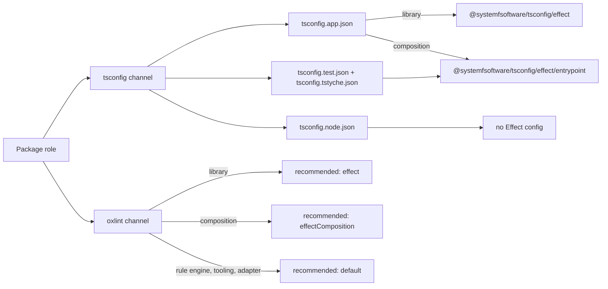
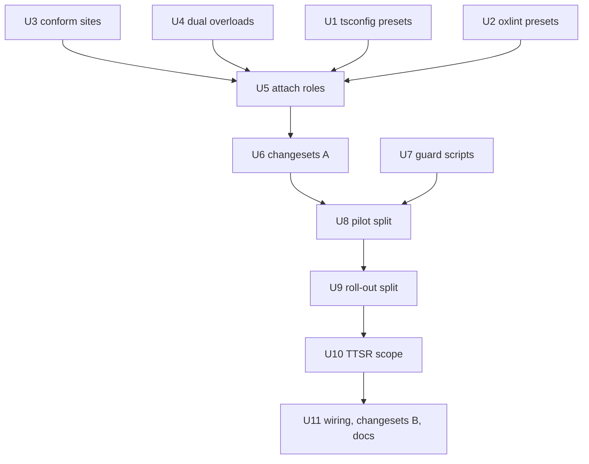

# Per-package tsconfig project split with role-scoped Effect policy - Plan

## Goal Capsule

- **Objective:** A file's TypeScript and Effect policy is decided by what that file actually is — shipped source, test, tooling, or rule engine — so no package carries a policy its code has no business obeying, and no suppression, waiver, or repo-wide mute remains anywhere in the tree.
- **Means:** Each package's `tsconfig.json` becomes a reference-only root over `app` / `test` / `node` projects, each extending the Effect config matching its role; the same role assignment governs the oxlint preset (KTD1, KTD2).
- **Authority:** Repository owner, then this plan's Product Contract, then its Planning Contract; `AGENTS.md` repo rules (REPO-S3, REPO-S4, REPO-R2, REPO-D3) override both where they speak.
- **Stop conditions:** Stop and report instead of improvising when U8's pilot shows a reference-only root cannot typecheck tests that import their own package's source; when a site cannot be conformed without violating a Key Decision; or when a conformance change would alter runtime behavior rather than code shape.
- **Execution profile:** Deep, two ordered deliverables (D8): Phase A units U1-U6, then Phase B units U7-U11. Mechanical fan-out (U4, U9) runs as parallel workers over disjoint packages; the orchestrator owns verification and commits.
- **Finisher:** `lfg` — implement, review, one pull request watched to green.

---

## Product Contract

### Summary

Every package's `tsconfig.json` becomes a reference-only root over three projects, and each project extends the Effect diagnostic config matching its role — with a new config for tests only. The same roles govern which oxlint preset a package inherits, so rule-engine and tooling code stops carrying an Effect policy it has no use for. All ten current suppressions resolve as role boundaries or code changes; none survives as a mute.

### Problem Frame

The Effect policy is attached to packages that are not Effect-domain code, and the cost is measured. Ten suppressions exist: seven `off` entries in `packages/toolchain/tsconfig/effect.json` and three `@effect-diagnostics-next-line` waivers in `atom/effect-atom` and `atom/effect-atom-react`.

Forcing the seven `off` rules to `error` through the oxlint config over `packages` and `examples` yields roughly 2000 sites, and the shape is the finding: 1742 are `strictBooleanExpressions`, of which 1730 sit in **seven ESTree visitor files** — `oxlint-plugin-effect-schema/src/rules/ban-data-taggederror.ts` (608), `oxlint-plugin-cell-architecture/src/rules/ban-error-string.ts` (428), `effect-schema-discovery/src/internal/schema-names.ts` (265), `no-manual-tag-property.ts` (189), `damp-test-naming.ts` (100), `pbt-naming.ts` (96), `no-context-generic-tag.ts` (44). Truthiness checks are that idiom, not a defect class. The other large entry, `missingPipeableSignature` at 134, is exported functions on **published entry points** (`Atom.ts` 18, `Rel.ts` 10, `Result.ts` 6, `FeatureRuntime.ts` 5, `Hooks.ts` 5); `processEnv`'s 26 sites are 23 harness files plus 3 shipped `src/mod.ts` reads.

That population comes from two attachment defects, and they motivate R6-R10 rather than the layout work. Seven packages extend the Effect preset with zero Effect-importing source (`effect-schema-discovery`, `effect-schema-extensions`, `effect-schema-vite`, `oxlint-plugin/make-boundary`, three `oxlint-presets` configs), and the shared oxlint preset spreads the Effect rule set into every package regardless of role.

The layout change has its own, separate motivation. Three packages — `effect-cell-types`, `atom/effect-atom`, `atom/effect-atom-react` — keep `tests/` outside their program entirely, the defect class already recorded in `docs/solutions/build-errors/tests-outside-tsconfig-hide-workspace-source-errors.md` for `effect-memfs` and `npm-package`. And the split carries a silent failure mode: with `tsconfig.json` reduced to `files: []` plus `references`, a non-build `tsc` typechecks nothing and exits clean — verified on `typescript@7.0.2` by placing a deliberate `TS2322` in the referenced project, where both `tsc --noEmit --incremental` and `tsc -p tsconfig.json --noEmit` exited 0 silently while `tsc -b` reported the error. Thirty-three packages run the non-build form today.

### Key Decisions

- D1. **Policy attaches by package role, on both channels.** A package whose source is not Effect-domain code inherits neither the Effect tsconfig preset nor the Effect oxlint preset. (session-settled: user-directed — chosen over path-glob scoping and over retaining the repo-wide attachment: an oxlint-plugin package extending the Effect tsconfig preset is the defect). Governs R6, R7, R9.
- D2. **The enforcement channel is the oxlint config, not the tsconfig severity map.** Measured: forcing `strictBooleanExpressions`, which the map sets to `off`, through the oxlint config produced 1742 findings, so the map cannot mute what the config enables. Governs R6, R8.
- D3. **Fix the code where the code is wrong; where a rule fires outside its intent, the attachment is the defect.** (session-settled: user-directed — chosen over scoping such rules away: a rule that cannot be satisfied by the code it fires on is scoped wrong, with a Vitest setup file reading env as the named instance). Governs R10, R11.
- D4. **Enrol and clean, scoped to the policy's legitimate population.** Every rule a suppression names is at `error` for the roles that govern it, and the code conforms. (session-settled: user-directed — chosen over scoping the harm-less rules away by default, and over deleting rules another gate already carries). Governs R12, R13.
- D5. **Clause citations leave the policy configs.** (session-settled: user-directed — chosen over keeping the ids: the numbering does not resolve against `repos/constitution/CONSTITUTION.md`, where API-First sits at position 5 rather than V.4, No Silent Bypass at 7 rather than V.6, and `A.2` has no counterpart). Governs R14.
- D6. **`tsconfig.json` becomes a reference-only root.** (session-settled: user-directed — chosen over a single flat per-package config). Governs R1, R4.
- D7. **No unscoped mute survives.** A rule is either enforced at `error` in the roles that govern it, or absent from that role's policy; no `off` entry and no per-site waiver remains. Governs R10, R11, R12.
- D8. **The policy attachment lands before the layout split.** The attachment is independent of the split and shrinks the policy population before files move; the split then closes the typecheck and test-in-program hazards. Governs R18.

### Requirements

**Policy attachment by role**

- R6. A package's role decides both attachments: the Effect config its projects extend and the oxlint preset it inherits.
- R7. The rule-engine role (`packages/oxlint-plugin/*`, `packages/oxlint-presets/*`) and the tooling role (`packages/toolchain/*`) carry no Effect diagnostic config in either channel.
- R8. A test-only Effect config exists and is what the `test` project extends; it is distinct from the config shipped source extends.
- R9. The Effect policy's population is the packages whose source is Effect-domain code, and the seven packages that attach it with zero Effect-importing source stop attaching it.
- R10. Each of the seven `off` entries in `packages/toolchain/tsconfig/effect.json` is resolved: either the rule is at `error` for every role it governs with the code conforming, or it is absent from that role's config because the role's code is outside the rule's intent.
- R11. No `@effect-diagnostics-next-line` directive remains in the tree; the three host-boundary sites in `atom/effect-atom/src/internal/HostTimer.ts` and `atom/effect-atom-react/src/RegistryContext.ts` are resolved by a code change or by a boundary the final policy expresses.
- R12. The two rules whose recorded reason is that they name no harm are at `error` and their sites are conformed, including `missingPipeableSignature`'s published entry points.
- R13. `anyUnknownInErrorContext` is at `error`; it has no live site today, so conformance is immediate.
- R14. The policy configs this work owns state their reasons in plain terms, with no constitution or clause identifiers.

**Project layout**

- R1. `tsconfig.json` declares no compiler options and no `include`; it carries only `files: []` and `references`.
- R2. Each package's projects are `app` for shipped source, `test` for `tests/`, `node` for tooling and harness files, and a `tstyche` project where `test-types/` exists; each project's `include` claims a disjoint file set.
- R3. Every TypeScript file a package owns belongs to exactly one project, and a file belonging to none fails a guard.
- R4. Every `typecheck` script that is not already `tsc -b` becomes `tsc -b`, and each project redirects `tsBuildInfoFile` outside the package directory.
- R5. `tsconfig.build.json`, `tsconfig.api.json` and `tsconfig.dts.json` keep serving tsdown, api-extractor and `dts:check` after the move; the build config no longer needs to narrow `include` back to source, because the `app` project already is source-only.
- R16. The three packages whose `tests/` sit outside their program join the `test` project, satisfying the invariant recorded in `docs/solutions/build-errors/tests-outside-tsconfig-hide-workspace-source-errors.md`.

**Instruments and delivery**

- R15. The project-references rule in `omp/plugins/omp-typescript-discipline/rules/tsconfigs.md` covers the new filenames, so the guard fires on the files this work introduces.
- R19. The two new checks — project membership (R3) and the silent-green mode (R4) — are root guard scripts with planted-fixture selftests, wired into the gate chain the way `scripts/guards/check-changeset.ts` is; neither is a colocated test file.
- R18. The attachment work (R6-R14) lands as its own change before the layout work (R1-R5, R16) begins.
- R17. Every package whose build hash moves carries a `.changeset`, and the published-surface changes earn the bump they require (REPO-R2).

### How This Work Fits Together

<!-- ce-section: work-relationships -->

This plan covers the project-layout split and the role-scoped policy attachment. The breakdown below is the current understanding, not a committed roadmap.

- **Policy attachment by role** — the first of this plan's two ordered deliverables; depends on nothing else.
  - **The layout split** — depends on the attachment landing first (R18); closes the tests-outside-program defect and the silent-green mode.
  - **The adopt-a-rule-set representation** (a region names the rules it adopts, `off` ceasing to exist) — deferred for later; it needs a leak alarm first, since an unadopted upstream rule would otherwise land silently.
  - **Unciting clause ids in historical `docs/`** — deferred; this plan uncites only the policy configs it owns.

### Scope Boundaries

- Deferred for later: the adopt-a-rule-set representation, and repo-wide removal of clause citations from historical `docs/`.
- Outside this product's identity: changes to the `@effect/tsgo` diagnostics themselves (upstream's to make), and anything under `repos/`, which is a read-only vendored subtree (REPO-S3).
- Key Flows and Acceptance Examples are omitted: the change is structural — project membership and policy attachment — with no runtime path or state-dependent behavior to specify.

### Success Criteria

Two ordered deliverables, each with its own signal — a single green does not close both.

- **Attachment (R6-R14):** no package attaches the Effect policy without Effect-importing source; no `off` entry and no per-site directive remains in `packages/`, `omp/` or `examples/`.
- **Layout (R1-R5, R16):** every TypeScript file belongs to exactly one project; the project-membership guard's selftest goes red on a planted unclaimed file; the silent-green guard's selftest goes red on a planted type error inside a referenced project.
- Both: `pnpm check:local` exits 0.

### Dependencies / Assumptions

- Depends on `@effect/tsgo@0.45.0`'s supported component matrix holding: `typescript@7.0.2`, `oxlint@1.82.0`, `oxlint-tsgolint@7.0.2001`.
- Depends on the project-references rule being widened in the same change (R15); without it the guard is silent on the new filenames.
- **Assumption 1:** every TypeScript file a package owns can be assigned to exactly one of `app` / `test` / `node` / `tstyche`.
- **Assumption 2:** each package has exactly one role, so its projects never need two policies at once.
- **Assumption 3:** `noEmit` with `composite` in a _referenced_ project stays legal for library packages. TypeScript 5.6 requires such projects to have fully accessible types ([microsoft/TypeScript#59951](https://github.com/microsoft/TypeScript/issues/59951)), and the historical failure is TS6310 "Referenced project may not disable emit" ([SO 71704754](https://stackoverflow.com/questions/71704754/typescript-yarn-workspaces-referenced-project-may-not-disable-emit)); this repo's `typescript@7.0.2` probe accepted the combination, and the declaration-projection cost is already recorded in `docs/solutions/build-errors/sandwich-cell-portable-declaration-emit.md`.
- **Review lens applied:** Scope Challenge — the two deliverables verify differently, which is what R18 and the split Success Criteria answer.
- Whether the tsconfig map can _enable_ a rule the oxlint config omits is unmeasured and unrelied upon; enforcement is oxlint-side per D2.

### Outstanding Questions

- Resolve Before Planning: none.
- Resolved in planning: preset names and role shape (KTD1, KTD2, KTD3); R11's host-boundary sites (KTD5); the changeset bumps (KTD8). The core-vs-shell project boundary the FCIS ruling names is deferred to follow-up work (Scope Boundaries in the Planning Contract).
- Product Contract preservation: unchanged — R-IDs, Key Decisions and Success Criteria stand as written; the Planning Contract instantiates them.

### Sources / Research

- `packages/toolchain/tsconfig/effect.json` — the seven `off` entries and their recorded reasons; the map that D2 shows does not govern the lint gate.
- `packages/oxlint-presets/oxlint-config-recommended/src/index.ts` — the shared preset that spreads `@effect/tsgo`'s correctness and recommended rule sets into every package, and the `sourceAndTestOverrides` globs already in use.
- `examples/inventory-fulfillment/tsconfig.json` with `tsconfig.app.json` / `.test.json` / `.node.json` / `.tstyche.json` and its `tsc -b` script — the only package already shaped this way, and the shape R1-R5 generalise.
- `docs/solutions/build-errors/tests-outside-tsconfig-hide-workspace-source-errors.md` — the invariant behind R16.
- `docs/solutions/build-errors/exports-types-rollup-drift.md` — why `tsconfig.api.json` extends the base preset rather than the package config, which R5 must preserve.
- `docs/solutions/build-errors/sandwich-cell-portable-declaration-emit.md` — the declaration-projection cost behind Assumption 3.
- Measurements on this tree, reproducible with the commands named: the seven-rule census forced through the oxlint config over `packages` and `examples` (1742 / 134 / 46 / 37 / 26 / 15 / 0 across `strictBooleanExpressions`, `missingPipeableSignature`, `strictEffectProvide`, `missedPipeableOpportunity`, `processEnv`, `nodeBuiltinImport`, `anyUnknownInErrorContext`; zero hits under `dist/` or `repos/`); the reference-root typecheck probe on `typescript@7.0.2`; and a multi-reference-root probe showing a `src/` file receiving the `app` project's options while a `tests/` file receives the test project's.
- `turbo.json` — every package's `build`, `typecheck`, `lint` and `test:types` inputs include `tsconfig.json` and `tsconfig.*.json`, so R1-R5 move those task hashes and R17 follows.
- `qmd://software-wiki/wiki/concepts/fcis-structural-properties.md` — the corpus ruling that a project boundary with a declaration-only projection is the mechanism for core/shell separation; the basis of the Outstanding Question on that axis.
- `qmd://software-wiki/wiki/concepts/test-placement.md` — the placement doctrine behind R19's guard-not-test form.

---

## Planning Contract

### Role Model

Every package takes exactly one role (Assumption 2). The role decides which config each of its projects extends, in both channels (D1, R6).

| Role               | Packages                                                                                                                                                                                                                                                                           | Effect policy                                 |
| ------------------ | ---------------------------------------------------------------------------------------------------------------------------------------------------------------------------------------------------------------------------------------------------------------------------------- | --------------------------------------------- |
| Effect library     | `atom/effect-atom`, `atom/effect-atom-react`, `effect-daemon-spec`, `effect-memfs`, `effect-microsandbox`, `effect-readiness`, `effect-schema-law`, `effect-schema-recursion-budget`, `hex-schema`, `npm-package`, `rx-effect`, `trace-taxonomy`, `examples/inventory-fulfillment` | shipped source: library set; tests: entry set |
| Effect composition | `effect-cell-types`, `effect-spec-runtime`, `effect-gherkin-spec`, `trace-spec`, `storybook-gherkin`, `differential-spec`                                                                                                                                                          | shipped source and tests: entry set           |
| Rule engine        | `oxlint-plugin/*`, `oxlint-presets/*`                                                                                                                                                                                                                                              | none                                          |
| Tooling            | `toolchain/*`                                                                                                                                                                                                                                                                      | none                                          |
| Adapter            | `effect-schema-discovery`, `effect-schema-extensions`, `effect-schema-vite`                                                                                                                                                                                                        | none                                          |

The **library set** is today's `effect.json` diagnostics with the seven `off` entries raised to `error`. The **entry set** is the library set without `strictEffectProvide`, whose upstream intent excludes application entry points. Test, type-test, and runnable-example files are entry points; so is the shipped source of a composition package, whose code is the provision mechanism: spec runners that provide scenario layers, and `Cell.provide`, whose call-site placement `oxlint-plugin-effect-platform`'s `runtime-construction-placement` rule already governs.

### Key Technical Decisions

- KTD1. **Two tsconfig Effect presets, both complete plugin blocks.** `@systemfsoftware/tsconfig/effect` carries the library set with no `off` value; `@systemfsoftware/tsconfig/effect/entrypoint` carries the entry set. A rule a role does not carry is omitted, not set `off`: all seven default to `off` upstream (`_packages/tsgo/src/metadata.json` at tag `@effect/tsgo@0.45.0`), so omission is absence. Both files are full blocks because tsconfig `extends` replaces the `plugins` array rather than merging it. Governs R8, R10, R14 through D1, D5, D7.
- KTD2. **The oxlint preset splits by role through `extends`, never spread.** `@systemfsoftware/oxlint-config-recommended`'s default export becomes role-neutral: no `effecttsgo` plugin and no `oxlint-plugin-effect-platform`. Named exports `effect` (library role) and `effectComposition` (composition role) extend that base and add the Effect plugins with a source override and an entry override covering `tests/`, `__tests__/`, `*.test.ts`, `*.spec.ts`, `test-types/`, and `examples/`. `extends` merges `plugins` and `overrides`; a spread replaces them (`docs/solutions/build-errors/oxlint-preset-overrides-are-replaced-by-a-spread.md`). Governs R6, R7 through D1, D2.
- KTD3. **In-source tests take whatever the `src/` override gives them when oxlint cannot subtract a rule by glob.** If oxlint's `overrides[].files` accepts a negated glob, the library source override excludes `src/**/__tests__/**` and `src/**/*.test.ts`. Otherwise those files keep the library set in the oxlint channel, because removing `strictEffectProvide` from them would take an `off` entry (D7). They carry zero `strictEffectProvide` sites today. U2 settles which branch holds.
- KTD4. **`missingPipeableSignature` is conformed with `Function.dual`, additively.** Each flagged export gains a data-last overload beside its existing data-first form, per `skill://author-pipeable-export`. An export whose optional trailing parameter makes arity-based dispatch ambiguous uses dual's predicate form; where no predicate separates the two forms, the export is reshaped and its package's changeset records the break. Governs R12.
- KTD5. **The host boundary routes through Effect-native primitives.** `hostNow` reads the default `Clock.Clock` reference's `currentTimeMillisUnsafe()` (`repos/effect/packages/effect/src/Clock.ts`), which needs no fiber. `hostScheduleTimer` forks `Effect.sleep` followed by the callback on the default runtime and cancels by interrupting that fiber; a timer is scheduled only for idle eviction, so no fiber runs under a registry read. `effect-atom-react`'s deferred dispose goes through the registry's configured `scheduleTimer` instead of its own `setTimeout`. Governs R11.
- KTD6. **Project shape per package.** `tsconfig.json` carries `files: []` and `references` (R1). `tsconfig.app.json` claims `src/` minus in-source test files and extends the base preset plus the role's Effect config. `tsconfig.test.json` claims `tests/`, in-source test files and `examples/`, and extends the entrypoint config. `tsconfig.tstyche.json` claims `test-types/` and is named in `tstyche.json#tsconfig`. `tsconfig.node.json` claims every root-level tooling and harness file. Each project sets `composite: true`, `noEmit: true`, and a `tsBuildInfoFile` under `node_modules/.cache/`, matching `examples/inventory-fulfillment`. `tsconfig.build.json` extends `./tsconfig.app.json`. Governs R1, R2, R4, R5.
- KTD7. **Test projects resolve their own package's source the way the pilot proves.** The preferred shape: the test project reaches `src/` through the `@systemfsoftware/source` condition, as its imports do today, without claiming those files. If `composite` rejects that with TS6307, the test project references the app project instead. U8 decides on `effect-cell-types` before any other package moves. Governs R2, R16.
- KTD8. **The two new guards are Deno scripts beside `check-changeset.ts`, wired into `gate:tasks`.** `scripts/guards/check-project-membership.ts` reads each referenced project's file list from `tsc --showConfig`, the compiler's own answer, and requires every tracked TypeScript file outside `dist/` to appear in exactly one. `scripts/guards/check-typecheck-build-mode.ts` requires a package with a reference-only root to run `tsc -b`. Each has a `--selftest` over a planted fixture; the build-mode selftest also shows the premise: a type error in a referenced project, non-build `tsc` exiting 0, `tsc -b` exiting non-zero. Guard scripts and their wiring land in commits separate from the work they judge (`AGENTS.md`, Surface Classes). Governs R3, R4, R19.
- KTD9. **Changesets follow the consumer-visible change.** A package whose exports gain dual overloads earns `minor`. `@systemfsoftware/tsconfig` and `@systemfsoftware/oxlint-config-recommended` earn `major`: seven diagnostics now fail adopters' builds, and the preset's default export stops carrying the Effect rules. Every other publishable package whose build hash moved earns `none`. Bodies follow `skill://author-changesets`. Governs R17.

### High-Level Technical Design

The role decides both channels; nothing else attaches Effect policy.

Commit order across the two deliverables (D8, R18):

### Scope Boundaries

- Deferred to follow-up work: making the core-vs-shell axis a project boundary with a declaration-only projection, as `fcis-structural-properties` rules; one rule list generating both channels' presets, which would remove the drift risk KTD1 and KTD2 accept.
- Not changed: the correctness-category rules oxlint enables for `effecttsgo` at the top level of Effect-role configs, which reach root harness files today and fire on none.

### Risks

- The pilot may find no project shape under which a composite test project typechecks imports of its own package's source (KTD7). That is a stop condition, not a fallback: D6 would be invalidated.
- `effect-tsgo diagnostics --project tsconfig.json` against a reference-only root may check zero files; the three `lint:tsgo` scripts then name each project (U9).
- tsdown's `dts` build reads `tsconfig.build.json`; inheriting `composite` from the app project may change what it emits. Every package's `build` and `api:check` prove it (U9).
- 118 dual overloads rewrite published declarations; `api:check` compares the `etc/*.api.md` reports, which update in the same commits (U4).

---

## Implementation Units

| U-ID | Title                                                 | Key files                                                           | Depends on |
| ---- | ----------------------------------------------------- | ------------------------------------------------------------------- | ---------- |
| U1   | Tsconfig Effect presets by role                       | `packages/toolchain/tsconfig/effect.json`, `effect-entrypoint.json` | —          |
| U2   | Oxlint preset split by role                           | `packages/oxlint-presets/oxlint-config-recommended/src/index.ts`    | —          |
| U3   | Conform the non-signature sites and the host boundary | Effect-role `src/`, `tests/`, `test-types/`                         | —          |
| U4   | Dual overloads for flagged exports                    | Effect-role `src/`, `etc/*.api.md`                                  | —          |
| U5   | Attach every package to its role                      | every `oxlint.config.ts`, `tsconfig.json`                           | U1-U4      |
| U6   | Phase A changesets                                    | `.changeset/`                                                       | U5         |
| U7   | Project-membership and build-mode guards              | `scripts/guards/`                                                   | —          |
| U8   | Pilot split on `effect-cell-types`                    | `packages/effect-cell-types/tsconfig*.json`                         | U6, U7     |
| U9   | Roll the split out                                    | every package `tsconfig*.json`, `package.json`                      | U8         |
| U10  | Widen the tsconfig TTSR rule                          | `omp/plugins/omp-typescript-discipline/rules/tsconfigs.md`          | U9         |
| U11  | Wire guards, Phase B changesets, docs                 | root `package.json`, `.changeset/`, docs                            | U10        |

### U1. Tsconfig Effect presets by role

**Goal:** Two tsconfig Effect presets exist, one per Effect policy set, with no `off` value and no clause id.
**Requirements:** R8, R10, R14; KTD1.
**Dependencies:** none.
**Files:** `packages/toolchain/tsconfig/effect.json`, `packages/toolchain/tsconfig/effect-entrypoint.json` (new), `packages/toolchain/tsconfig/package.json`, `packages/toolchain/tsconfig/README.md`.
**Approach:**

1. Raise the seven `off` entries in `effect.json` to `error` and rewrite every comment block in plain terms, without clause ids (R14).
2. Write `effect-entrypoint.json` as the same block without `strictEffectProvide`, with one comment naming why the rule is absent.
3. Export it as `./effect/entrypoint` and add it to `files`; this package ships plain JSON, so its `exports` map is hand-edited (REPO-S4 covers tsdown packages only).
4. Document the two presets and the role each serves in the README.
   **Patterns to follow:** `effect.json`'s existing per-group comment blocks.
   **Test scenarios:** Test expectation: none -- declarative presets; U5's attachment and `lint:tsgo` exercise them.
   **Verification:** `jq` over both files shows no `"off"` value and no `A.`/`I.`/`II.`/`V.` clause token; the two maps differ by exactly `strictEffectProvide`.

### U2. Oxlint preset split by role

**Goal:** The shared oxlint preset exposes a role-neutral default and two Effect-role configs.
**Requirements:** R6, R7, R8; KTD2, KTD3.
**Dependencies:** none.
**Files:** `packages/oxlint-presets/oxlint-config-recommended/src/index.ts`, its existing tests, `packages/oxlint-presets/oxlint-config-recommended/README.md` if present.
**Approach:**

1. Move `effecttsgo` out of the base `plugins` and move `oxlint-plugin-effect-platform` (plugin, rules, overrides) out of the base.
2. Build `effect` and `effectComposition` with `extends: [base]`, each adding the Effect plugins, a source override, and an entry override (KTD2). The source override carries today's promoted `@effect/tsgo` correctness and recommended rules, the three explicit `effecttsgo/*` promotions, and the seven rules at `error`; the entry override carries the same set without `effecttsgo/strict-effect-provide`.
3. Probe whether a negated glob in `overrides[].files` is honoured and take the KTD3 branch it allows.
   **Patterns to follow:** the existing `promoteWarnToError` and override arrays in `src/index.ts`.
   **Test scenarios:**

- `oxlint --print-config` for a config extending the default export lists no `effecttsgo/*` rule and no `effecttsgo` plugin.
- For `effect`, a file under `src/` resolves `effecttsgo/strict-effect-provide` to `error` and a file under `tests/` does not carry it.
- For `effectComposition`, neither a `src/` nor a `tests/` file carries `effecttsgo/strict-effect-provide`, and both carry `effecttsgo/strict-boolean-expressions` at `error`.
  **Verification:** the three print-config smokes above, run as throwaway commands; the package's existing `test` stays green.

### U3. Conform the non-signature sites and the host boundary

**Goal:** Effect-role code satisfies every rule its role will carry, except `missingPipeableSignature`, and the three waivers are gone.
**Requirements:** R10, R11, R13; D3, KTD5.
**Dependencies:** none. Sites are found with a transient oxlint config that forces the seven rules and is never committed.
**Files:** `packages/atom/effect-atom/src/Atom.ts`, `packages/atom/effect-atom-react/src/Hooks.ts`, `packages/atom/effect-atom-react/tests/widgets-independent-scopes.integration.test.ts` (truthiness); the 37 `missedPipeableOpportunity` sites across `atom/*`, `rx-effect`, `effect-memfs`, `effect-microsandbox`, `effect-readiness`, `effect-cell-types`, `examples/inventory-fulfillment`; `packages/effect-schema-recursion-budget/src/recursion-budget-transform.ts` and its integration test (`nodeBuiltinImport`); `packages/effect-microsandbox/src/await-readiness.cell.ts`, `examples/inventory-fulfillment/src/rpc/client.ts` (`strictEffectProvide` in library code); `packages/atom/effect-atom/src/internal/HostTimer.ts`, `packages/atom/effect-atom-react/src/RegistryContext.ts`.
**Approach:**

1. Truthiness, pipe, and node-builtin sites are shape changes with no behavior change.
2. The two library-code `strictEffectProvide` sites lift provision to the caller that is the entry point.
3. The host boundary follows KTD5; both directive comments and their justification blocks are deleted.
   **Execution note:** run each touched package's existing `test` after its edits; a changed assertion means behavior moved and is a stop condition.
   **Patterns to follow:** `Registry.make`'s existing `now` / `scheduleTimer` options in `packages/atom/effect-atom/src/Registry.ts`.
   **Test scenarios:**

- An atom with an idle TTL is still evicted after the TTL under the new host timer, as `effect-atom`'s existing registry idle tests assert.
- Disposing a registry before a scheduled eviction fires cancels it; no callback runs after dispose.
- A `RegistryProvider` unmounted and remounted inside the 500 ms window reclaims the same registry.
  **Verification:** the forced-rule census reports zero sites for the six rules in Effect-role files; `grep -r "@effect-diagnostics"` over `packages/` and `examples/` finds nothing outside `node_modules`.

### U4. Dual overloads for flagged exports

**Goal:** Every export `missingPipeableSignature` flags in Effect-role code has a pipeable overload.
**Requirements:** R12; KTD4.
**Dependencies:** none.
**Files:** three disjoint worker groups, each including the group's `etc/*.api.md` reports.

- Group 1: `packages/atom/effect-atom/src/{Atom,Result,AtomCore,ResultValues,Hydration,ResultSchema,Browser}.ts`, `packages/atom/effect-atom/src/internal/HostTimer.ts` (after U3), `packages/atom/effect-atom-react/src/Hooks.ts`.
- Group 2: `packages/trace-spec/src/{Rel,Graph,FailureDump,Prop}.ts`, `packages/effect-gherkin-spec/src/**`, `packages/effect-spec-runtime/src/**`, `packages/storybook-gherkin/src/**`, `packages/differential-spec/src/**`, `packages/effect-cell-types/src/**`.
- Group 3: `packages/effect-daemon-spec/src/**`, `packages/npm-package/src/**`, `packages/effect-microsandbox/src/**`, `packages/effect-readiness/src/**`, `packages/effect-memfs/src/**`, `packages/effect-schema-law/src/**`, `packages/effect-schema-recursion-budget/src/**`, `examples/inventory-fulfillment/src/**`, `examples/inventory-fulfillment/tests/__fixtures__/fulfillment-trace.fixture.ts`.
  **Approach:** apply KTD4 per site; regenerate each package's API report with its `api:check` flow; leave data-first call sites untouched.
  **Execution note:** workers own disjoint packages; U3 lands first in group 1's files.
  **Patterns to follow:** existing `Function.dual` exports in these packages, e.g. `Cell.provide` in `packages/effect-cell-types/src/Cell.ts`.
  **Test scenarios:**
- For one representative export per package, the data-last form returns the same value as the data-first form for the same arguments; add it to that package's existing type test or integration test only where one already exercises the export.
- An export with an optional trailing parameter, called data-first without the optional argument, still takes the data-first path.
  **Verification:** the forced-rule census reports zero `missingPipeableSignature` sites in Effect-role files; each package's `typecheck`, `test`, `test:types`, and `api:check` pass.

### U5. Attach every package to its role

**Goal:** Each package extends exactly the configs of its role in both channels.
**Requirements:** R6, R7, R9, R10; D1, D2.
**Dependencies:** U1, U2, U3, U4.
**Files:** every `packages/**/oxlint.config.ts` and `examples/inventory-fulfillment/oxlint.config.ts`; every `packages/**/tsconfig.json` that extends `@systemfsoftware/tsconfig/effect`; `packages/npm-package/tsconfig.json`, which carries only a plugin name today.
**Approach:**

1. Effect library packages extend `effect` and keep `@systemfsoftware/tsconfig/effect`.
2. Composition packages extend `effectComposition` and `@systemfsoftware/tsconfig/effect/entrypoint`.
3. Rule-engine, tooling, and adapter packages keep the default oxlint export and drop the Effect tsconfig preset.
4. Confirm each composition assignment by reading the package's `src/` against the Role Model criterion; a package that fails it moves to the library role and its sites are conformed.
   **Test scenarios:** Test expectation: none -- configuration; every package's `lint` and `typecheck` are the proof.
   **Verification:** `pnpm check:local` exits 0; `grep -rn '"off"' packages/toolchain/tsconfig/effect*.json` finds nothing.

### U6. Phase A changesets

**Goal:** Every publishable package whose build hash Phase A moved carries its intent.
**Requirements:** R17; KTD9.
**Dependencies:** U5.
**Files:** `.changeset/*.md` created with `pnpm change --bump <level>`.
**Approach:** one intent per consumer-visible change, written with `skill://author-changesets`.
**Test scenarios:** Test expectation: none -- release metadata; `.github/workflows/changeset-check.yml` judges coverage.
**Verification:** `deno run --allow-read scripts/guards/check-changeset.ts --selftest` passes, and the guard against `origin/main` reports no missing intent.

### U7. Project-membership and build-mode guards

**Goal:** Two guards exist that fail when a TypeScript file belongs to no project or to two, and when a reference-only root is typechecked without `tsc -b`.
**Requirements:** R3, R4, R19; KTD8.
**Dependencies:** none. Committed alone, before U8, and not yet wired into the gate.
**Files:** `scripts/guards/check-project-membership.ts`, `scripts/guards/check-typecheck-build-mode.ts`.
**Approach:** file lists come from `tsc --showConfig -p <project>`; tracked files come from `git ls-files`; each guard prints one line per violation naming package, file, and projects.
**Patterns to follow:** `scripts/guards/check-changeset.ts` — Deno, `--selftest` dispatch, planted fixture rows.
**Test scenarios:**

- Selftest: a planted package whose `tests/` file sits in no project fails membership, naming the file.
- Selftest: a planted file claimed by both `app` and `test` fails membership, naming both projects.
- Selftest: a planted reference-only root with a type error in its app project exits 0 under `tsc --noEmit` and non-zero under `tsc -b`; the build-mode guard flags the non-build `typecheck` script.
  **Verification:** both selftests pass; run against today's tree, the membership guard fails on `effect-cell-types`, `atom/effect-atom`, and `atom/effect-atom-react` — the red-before observation, recorded in the U7 commit body.

### U8. Pilot split on `effect-cell-types`

**Goal:** One package runs the full project shape green, and the template for U9 is fixed.
**Requirements:** R1, R2, R4, R5, R16; KTD6, KTD7.
**Dependencies:** U6, U7.
**Files:** `packages/effect-cell-types/tsconfig.json`, `tsconfig.app.json` (new), `tsconfig.test.json` (new), `tsconfig.tstyche.json` (new), `tsconfig.node.json`, `tsconfig.build.json`, `tsconfig.api.json`, `tstyche.json`, `package.json`.
**Approach:** apply KTD6; decide KTD7 by typechecking `tests/` with `tsc -b`; record the chosen test-project shape in the commit body so U9 copies it.
**Execution note:** this unit settles Assumption 3. If neither KTD7 shape typechecks, stop the run with the compiler output.
**Test scenarios:**

- A deliberate type error placed in `tests/` fails `pnpm --filter @systemfsoftware/effect-cell-types typecheck`; removing it passes.
- The same probe in `src/` and in `test-types/` fails the typecheck and the `test:types` run respectively.
  **Verification:** membership and build-mode guards pass for this package; its `typecheck`, `lint`, `test`, `test:types`, `build`, and `api:check` pass.

### U9. Roll the split out

**Goal:** Every remaining package with a `tsconfig.json` has the U8 shape.
**Requirements:** R1, R2, R3, R4, R5, R16; KTD6, KTD7.
**Dependencies:** U8.
**Files:** per package, `tsconfig.json`, `tsconfig.app.json`, `tsconfig.test.json`, `tsconfig.tstyche.json` where `test-types/` exists, `tsconfig.node.json`, `tsconfig.build.json`, `tsconfig.api*.json` and `tsconfig.dts.json` where present, `tstyche.json`, `package.json` (`typecheck`, `lint:tsgo`). Also the test files of `atom/effect-atom` and `atom/effect-atom-react` that surface type errors once they join a program. Workers split by group: `atom/*`; the other Effect-role packages; `oxlint-plugin/*` and `oxlint-presets/*`; `toolchain/*` and adapters. `packages/oxlint-plugin/oxlint-plugin-dmmf-workflow/tsconfig.test.json` folds into the new test project.
**Approach:**

1. Copy U8's template; rule-engine packages' tests live under `src/**/__tests__/` and go to the test project.
2. Every config that extends `./tsconfig.json` re-points: build configs to `./tsconfig.app.json`, api configs keep their current base.
3. The three `lint:tsgo` scripts name each Effect project.
4. The errors `atom/*` tests surface are fixed in the test code (R16).
   **Test scenarios:** Test expectation: none -- configuration; the membership guard and each package's gate tasks are the proof.
   **Verification:** both guards pass tree-wide; `pnpm check:local` exits 0.

### U10. Widen the tsconfig TTSR rule

**Goal:** The project-references rule fires on the files this work introduces.
**Requirements:** R15.
**Dependencies:** U9.
**Files:** `omp/plugins/omp-typescript-discipline/rules/tsconfigs.md`.
**Approach:** add `tsconfig.app.json` and `tsconfig.test.json` to `scope`; the node-types clause targets `tsconfig.app.json`, the project that replaces the main library config.
**Test scenarios:** Test expectation: none -- rule text; the plugin's own `check` task runs.
**Verification:** `pnpm --filter @systemfsoftware/omp-typescript-discipline check` passes.

### U11. Wire guards, Phase B changesets, docs

**Goal:** The guards run in every gate, the layout's intents are recorded, and the docs describe the new shape.
**Requirements:** R17, R19; KTD8, KTD9.
**Dependencies:** U10.
**Files:** root `package.json` (`gate:tasks`), `.changeset/*.md`, `packages/toolchain/tsconfig/README.md`, `docs/solutions/build-errors/tests-outside-tsconfig-hide-workspace-source-errors.md` (Prevention names the membership guard).
**Approach:** the wiring lands in its own commit after U9 is green; changesets follow KTD9.
**Test scenarios:** Test expectation: none -- wiring and prose.
**Verification:** `pnpm check:local` exits 0 with both guards in its output.

---

## Verification Contract

- Full gate: `pnpm check:local` exits 0 after the last edit (REPO-D1).
- Per package: `pnpm --filter <pkg> typecheck`, `lint`, `test`, `test:types`, `build`, `api:check`.
- Guards: `deno run --allow-read --allow-run scripts/guards/check-project-membership.ts --selftest` and the same for `check-typecheck-build-mode.ts`, then both without `--selftest` from the repo root.
- Census: a transient oxlint config forcing the seven rules over `packages examples` reports zero sites in Effect-role files after U4; the config is deleted afterward.
- Mutation runs stay in CI (REPO-D3).

---

## Definition of Done

- Every R-ID's verification above passed on the final tree, and `pnpm check:local` exits 0.
- `packages/toolchain/tsconfig/effect*.json` contain no `off` value and no clause id; no `@effect-diagnostics` directive exists outside `node_modules`.
- The membership guard's red run on the pre-split tree is recorded in the U7 commit body; both guards are green in `gate:tasks`.
- Transient census configs, probe fixtures, and abandoned attempts are deleted; `git status --porcelain` shows only intended changes.
- Each unit's commit names only that unit's files; guard scripts and guard wiring sit in their own commits.
