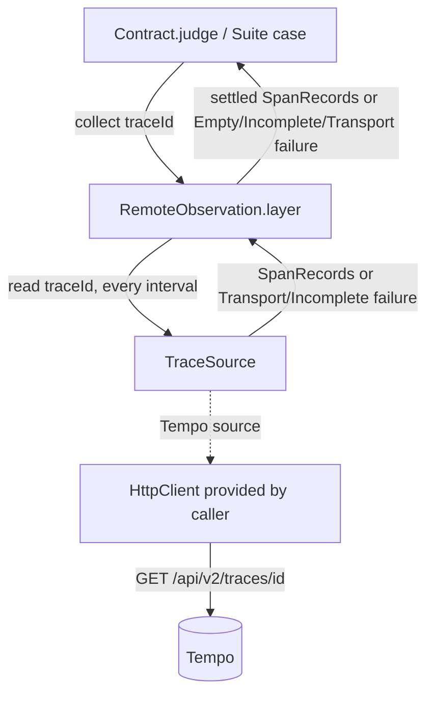
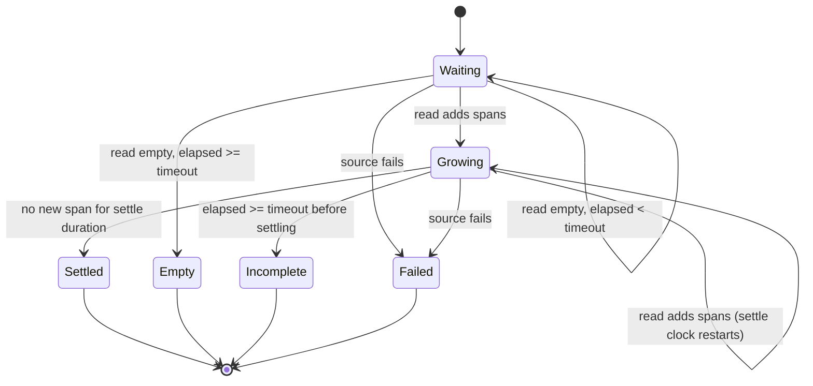

# Remote Trace Observation - Plan

## Goal Capsule

- **Objective:** Test suites executing across process boundaries, child workers, and containerized microVMs can hold their behaviors to trace contracts by observing completed traces from an external trace store without requiring in-process tracer exporter wiring.
- **Means:** A vendor-neutral `Observation` layer that polls a pluggable single-read trace source until the span set settles (KTD1, KTD2), plus one thin source for Grafana Tempo built on Effect's native HTTP client (KTD3).
- **Product Authority:** GitHub Issue #476, governed by the Product Contract below. On product behavior the R-IDs win; on mechanism the Planning Contract KTDs win.
- **Execution profile:** one package, `packages/trace-spec`; six units (U1–U5, U7), U1 first, U7 last.
- **Stop conditions:** stop and report if the captured Tempo v2 response contradicts KTD2 wire facts in a way the decoder cannot absorb (for example IDs not base64), or if widening the failure unions breaks a caller outside `packages/trace-spec`.
- **Finish and ship:** delivered as one pull request watched to green (REPO-D1).
- **Open Blockers:** None.

---

## Product Contract

Product Contract preservation: restructured, no scope change. The three "Deferred to Planning" questions are resolved in KTD7 (retry policy), KTD9 (variant names and fields) and KTD12 (Tempo headers). R/F/AE IDs are unchanged.

### Summary

A remote observation layer for `@systemfsoftware/trace-spec` that satisfies the `Observation` context service by collecting spans for an owned trace ID from an external trace store. The layer owns completeness (interval, settle window, total timeout) and knows no store. A trace source owns one read against one store; Grafana Tempo ships as the first source.

### Problem Frame

`trace-spec` enables deterministic trace-based contract testing by asserting structural relations (`Rel`) over decoded trace graphs (`Graph`). Currently, observation is restricted to in-process execution via `ObservationWindow`, which hardcodes an `InMemorySpanExporter` tied to an in-process OpenTelemetry `BasicTracerProvider`.

When the system under test runs across process boundaries—such as CLI binaries, worker subprocesses, or isolated microVMs (`@systemfsoftware/effect-microsandbox`) streaming OTLP telemetry to a host store like Tempo—`trace-spec` cannot observe those spans. Test authors are forced to abandon `Contract.judge`, `Contract.check`, and `Suite`, hand-rolling brittle custom polling loops against external endpoints. Furthermore, naive polling introduces flakiness: stores have no native "trace complete" signal, causing premature reads that return partial traces where parent spans have arrived but child spans are still in transit, leading to spurious contract breaches.

### Key Decisions

- KTD1. **Settle-window stabilization over first-non-empty reads.** `collect(traceId)` polls until the observed span set remains stable across a declared settle interval (mimicking OpenTelemetry Collector tail-sampling `decision_wait`), bounded by a total timeout.
  (Governs R4–R7)
- KTD2. **Split polling from reading.** Completeness logic lives in one vendor-neutral layer; each store contributes only a single-read source. OTLP defines ingest, not query, so every store's read is store-specific while completeness is not. (session-settled: user-approved — chosen over one Tempo driver owning its own polling: that binds the settle window to one store's wire format and makes every future store reimplement it; the user had rejected a Tempo-heavy design as "too aggressive")
  (Governs R1, R2, R4–R7, R15)
- KTD3. **Tempo source reads `/api/v2/traces/<traceID>` through `effect/unstable/http/HttpClient`.** No new third-party dependency. Alternatives evaluated (REPO-W8): v1 `/api/traces/<traceID>` is rejected (legacy `batches` key, no partial-trace status); `Accept: application/protobuf` is rejected because it needs an OTLP protobuf codec, a dependency the issue's boundaries require asking about first.
  (Governs R8–R13)
- KTD4. **Three distinct observation failures.** Absence (`EmptyObservationError`), incompleteness, and transport are separate tagged variants on the Effect error channel (CONST-D2). Names and fields: KTD9.
  (Governs R6, R7, R13, R14)
- KTD5. **Placement complies with cell-architecture doctrine.** The Tempo source lives at `src/drivers/tempo-trace-store.ts`; no module uses the banned `.port.ts` or `.layer.ts` suffixes (pack: cell-architecture, service-and-layer-boundaries.md).
  (Governs R8)

<!-- ce-section: work-relationships -->

### How This Work Fits Together

This plan delivers the remote observation layer required to observe external telemetry in `@systemfsoftware/trace-spec`. The relationship to the broader system:

- **Enables**
  - Out-of-process and microVM end-to-end integration lanes (e.g. `stryker-js-effect` CLI runs in microVMs) to execute trace contract assertions with `Contract.check` and `Suite`.
  - The process-level test lane and cross-project connector selection deferred in `docs/plans/2026-09-22-1714-feat-trace-taxonomy-spec-plan.md:131,143`.
- **Depends on**
  - Core `trace-spec` architecture: `Observation.service.ts`, `Graph.ts`, `Contract.ts`, and `TraceGraph.schema.ts`.
- **Shares**
  - Span normalization and attribute decoding rules with `observation-window.handle.ts`.
- **Still to decide (in future plans)**
  - A project-level Vitest connector selection matrix (running identical test suites against in-memory vs. remote stores via Vitest projects).
  - Differential execution contracts (`compare` and `morph`) relating in-memory traces to remote traces.

### Requirements

#### Remote Observation Layer (vendor-neutral)

- R1. `@systemfsoftware/trace-spec` must export a layer constructor that takes a trace source plus polling options and provides exactly `Observation` - never `Observation | OtelTracer.OtelTracer` - constructing no in-process tracer provider (contrast `observation-window.resource.ts:32`). The layer's requirements are exactly its source's.
- R2. A trace source is one read: given a trace ID, it returns the spans the store currently holds as `ReadonlyArray<SpanRecord>`, or fails with a transport or incomplete failure. It never polls, waits, or retries.
- R3. `ObservationWindow.make(...).layer` behaviour must remain unchanged; the widened failure unions (R14) are the only type-level change its callers see.

#### Trace Completeness and Polling

- R4. `collect(traceId)` must read the source repeatedly at a configurable interval, bounded by a configurable total timeout. Only successful reads are repeated; a source failure ends the poll immediately.
- R5. `collect(traceId)` must return spans only after the observed set of span IDs has remained unchanged for at least the configured settle duration.
- R6. If every read before the total timeout returns no spans, `collect(traceId)` must fail with `EmptyObservationError`.
- R7. If spans are read but the set does not stabilize before the total timeout, `collect(traceId)` must fail with the incomplete failure rather than return a partial trace that would cause false relation breaks.

#### Tempo Source

- R8. The Tempo source's only requirement is `HttpClient.HttpClient` (`FetchHttpClient.layer` ships in `effect` core); it adds no third-party dependency to `package.json`.
- R9. The Tempo source reads with one HTTP GET to `/api/v2/traces/<traceID>` under a configured base URL.
- R10. Responses must be parsed through Schema decoding into `ReadonlyArray<SpanRecord>`, never cast (CONST-B5).
- R11. Decoding must map span IDs, parent span IDs (`null` for roots), names, start times and durations in milliseconds, status codes (`ok`, `unset`, `error`), `error.type` attributes, events, and links, producing the same `SpanRecord` form `ObservationWindow` emits for the same span.
- R12. Parent-child relationships in the decoded records must hold regardless of span order in the response.
- R13. An unreachable endpoint, a refused connection, any non-200 status, or an undecodable body fails the read with the transport failure. A response Tempo marks `status: PARTIAL` fails the read with the incomplete failure, since waiting cannot complete it.

#### Failures

- R14. Transport, incomplete, and empty failures must be distinct error variants so infrastructure outages cannot be confused with absent or unfinished test traces. `Collector.collect`, `Contract.JudgeFailure`, and `Suite.CaseFailure` widen to carry the new variants (a breaking type change permitted under REPO-R1).

#### Verification and Packaging

- R15. The polling layer is proven against a scripted in-memory source: no HTTP in its tests.
- R16. The Tempo source is proven against a real loopback HTTP server (`127.0.0.1:0`) at both poles: a served trace decodes; a closed port, 404, and 500 each fail with the transport failure (pack: boundary-testing, real-system-oracles.md).
- R17. At least one Tempo decoding fixture is captured from a real Tempo v2 response rather than hand-written; the wire details the source relies on were read from Tempo source code, not observed on the wire.
- R18. `Contract.judge` and `Contract.check` must execute when provided with the remote layer over the Tempo source in place of `ObservationWindow.make(...).layer`.
- R19. `README.md` must document composing the remote layer with the Tempo source, and what a new source must satisfy (R2).
- R20. A changeset must be included declaring a `minor` feature release for `@systemfsoftware/trace-spec`.

### Key Flows

- F1. Observing an external trace across process boundaries
  - **Trigger:** A test case stimulates an out-of-process workload (e.g. CLI binary execution) passing an owned traceparent.
  - **Actors:** Test author, Stimulus, Remote Observation layer, Tempo source, Tempo.
  - **Steps:**
    1. Stimulus generates an owned trace ID and executes the external process with the corresponding W3C `traceparent`.
    2. The external process emits spans over OTLP to Tempo and flushes before termination.
    3. `Contract.judge` invokes `observation.collect(traceId)`.
    4. The layer reads the Tempo source at the configured interval until spans are observed and the span ID set stays unchanged across the settle window.
    5. The layer returns the settled `ReadonlyArray<SpanRecord>`.
    6. `Contract.judge` decodes the records against the taxonomy and evaluates the relation.
  - **Outcome:** The contract holds or reports a legitimate disparity based on the complete multi-process trace.
  - **Covered by:** R1, R2, R4, R5, R9, R10, R11, R18.

- F2. Handling store unreachability or downtime
  - **Trigger:** `observation.collect(traceId)` is invoked when Tempo is offline or misconfigured.
  - **Actors:** Remote Observation layer, Tempo source, Network boundary.
  - **Steps:**
    1. The Tempo source issues an HTTP GET to the configured base URL.
    2. Connection is refused, or the response is non-200.
    3. The source fails the read with the transport failure.
    4. The layer ends the poll and surfaces that failure on the Effect error channel.
  - **Outcome:** The test fails immediately with an infrastructure diagnostic naming the unreachable endpoint, rather than timing out or claiming the trace was empty.
  - **Covered by:** R4, R13, R14, R16.

### Acceptance Examples

Layer examples use a scripted in-memory source; Tempo examples use a loopback server.

- AE1. Late span inside the settle window (layer)
  - **Covers R5, R15.**
  - **Given:** A scripted source that returns only the root span on the first read and adds the child span 60ms later.
  - **When:** `collect` runs with a 20ms interval and 100ms settle duration.
  - **Then:** It returns both spans; it never returns the root alone.

- AE2. Absent trace timeout (layer)
  - **Covers R6, R15.**
  - **Given:** A scripted source that always returns no spans for trace ID `0af7651916cd43dd8448eb211c80319c`.
  - **When:** `collect` runs with a 200ms total timeout.
  - **Then:** It fails with `EmptyObservationError` carrying that trace ID.

- AE3. Source failure ends the poll (layer)
  - **Covers R4, R15.**
  - **Given:** A scripted source whose first read fails with the transport failure.
  - **When:** `collect` runs with a 1s total timeout.
  - **Then:** It fails with that transport failure after one read, without waiting out the timeout.

- AE4. Complete trace decoding (Tempo)
  - **Covers R10, R11, R16.**
  - **Given:** A loopback server serving a v2 response with root span `PlaceOrder` and child span `PaymentCapture` for trace ID `4bf92f3577b34da6a3ce929d0e0e4736`.
  - **When:** The Tempo source reads that trace ID.
  - **Then:** It returns two `SpanRecord` entries, `PaymentCapture.parentSpanId` equal to `PlaceOrder.spanId`, with attributes and events matching the payload.

- AE5. Out-of-order spans (Tempo)
  - **Covers R12.**
  - **Given:** A v2 response listing `PaymentCapture` before `PlaceOrder`.
  - **When:** The Tempo source decodes it.
  - **Then:** The records carry the same spans, and `PaymentCapture.parentSpanId` equals `PlaceOrder.spanId`, asserted on the records rather than through `Graph.decode`.

- AE6. Transport refusals (Tempo)
  - **Covers R13, R14, R16.**
  - **Given:** A closed loopback port; a loopback server answering 404; one answering 500.
  - **When:** The Tempo source reads against each.
  - **Then:** Each fails with the transport failure, never `EmptyObservationError`.

- AE7. Store-reported partial trace (Tempo)
  - **Covers R13.**
  - **Given:** A loopback server answering 200 with spans and `status: PARTIAL`.
  - **When:** The Tempo source reads.
  - **Then:** It fails with the incomplete failure instead of returning the spans.

### Scope Boundaries

#### Deferred for Later

- **Further sources:** Jaeger, MLflow, or other stores as additional sources over the same layer (R2 is the contract they satisfy).
- **Per-project connector selection:** Configuring Vitest projects to dynamically switch between `ObservationWindow` and remote layers across the entire test suite.
- **Differential multi-process assertions (`compare` / `morph`):** Running an in-process reference simulator and an out-of-process candidate binary side-by-side to assert trace isomorphism.
- **In-process OTLP push receiver:** Embedding a local loopback OTLP ingest server into `trace-spec` to bypass external stores entirely during local microVM runs.

#### Outside this Product's Identity

- **In-process proxying:** Running a local receiver that forwards incoming spans into `InMemorySpanExporter`.
- **Store provisioning:** Managing or launching Docker containers for Tempo or OpenTelemetry Collector; the test environment or host provides the endpoint.
- **Production telemetry ingestion:** `trace-spec` is a contract testing library that observes finished test traces; it is not a production observability agent or APM backend.

#### Deferred to Follow-Up Work

- Per-variant Vitest annotations in `Prop.predicate` naming which infrastructure failure ended a draw; the variants already reach the runner distinctly on the error channel.
- Wiring `@systemfsoftware/effect-schema-vite` (`inlineSchemaTests`) into `packages/trace-spec/vitest.config.ts` so every exported schema, old and new, gets auto-discovered codec laws; the package does not use it today.

### Dependencies / Assumptions

- `effect` peer dependency (pinned at `4.0.0-rc.116` in workspace catalog) provides `effect/unstable/http/HttpClient` (`repos/effect/packages/effect/src/unstable/http/FetchHttpClient.ts:125`).
- The system under test flushes spans to the store prior to or upon process termination (e.g. via `tracerProvider.shutdown()` or `forceFlush()`), ensuring telemetry is in flight before observation starts.
- The target Tempo serves the v2 trace-by-id endpoint; an older Tempo surfaces as a 404 transport failure (R13), not a silent fallback to v1.

### Sources / Research

- **Issue Reference:** `systemfsoftware/systemfsoftware#476`.
- **Prior Roadmap Precedent:** `docs/plans/2026-09-22-1714-feat-trace-taxonomy-spec-plan.md:131,143` explicitly deferred the OTLP connector and wait-until-complete polling.
- **OpenTelemetry on Trace Completeness:** Collector tail-sampling uses a `decision_wait` timer rather than an on-the-wire completion signal (`processor/tailsamplingprocessor/README.md`, PR #46762).
- **Tracetest on Polling Termination:** the poller stops on trace stability with a bounded give-up (`kubeshop/tracetest#2622`).
- **MLflow Trace Completeness:** MLflow added an explicit `spans_complete` flag to `GetTrace` because client-side heuristic detection broke silently (`mlflow/mlflow#21067`).
- **Grafana Tempo source (`grafana/tempo` main):** v2 answers `{ trace: { resourceSpans }, status?, message? }` and never 404s an absent trace (`modules/querier/http.go`); the v2 combiner marks size-limited, filtered, or pruned traces `PARTIAL` (`modules/frontend/combiner/trace_by_id_v2.go`); v1 renames `resourceSpans` to `batches` (`pkg/tempopb/trace_utils.go`); IDs are proto `bytes`, so JSON carries them base64 (`pkg/tempopb/trace/v1/trace.pb.go`); `FindTraceByID` does not check ingest lag (`modules/livestore/live_store.go`), so a lagging read is silently incomplete, which the settle window absorbs.
- **Architectural Rules:** `compound-packs/cell-architecture/service-and-layer-boundaries.md` (banning `.port.ts`/`.layer.ts`), `compound-packs/boundary-testing/real-system-oracles.md` (loopback oracles at both poles), and `CONSTITUTION.md` (CONST-D2 distinct tagged error variants, CONST-B5 decode never cast, CONST-T10 independent test oracles).

---

## Planning Contract

### Key Technical Decisions

- KTD6. **Settle over the union of reads.** The layer keeps every span it has seen, keyed by span ID, and the settled result is that union once no read has added a span for the settle duration. A read that returns fewer spans than an earlier one never drops a span: OTLP exporters send spans only after they end, finished spans are immutable, and a store answering from lagging queriers can transiently serve less (Sources: `FindTraceByID` does not check lag). A repeated span ID keeps its first record.
  (Implements R5, R7)
- KTD7. **Explicit deadline from `Clock`; fixed interval.** The loop reads the clock once at entry, then after each read decides settled, empty, incomplete, or continue, and sleeps the interval with `Effect.sleep`. Timeout outcomes are therefore `EmptyObservationError` or the incomplete failure as values, never `Cause.TimeoutError` from `Effect.timeout`. Interruption is not caught. The interval is fixed with no backoff or jitter: settle is measured in wall time, and backoff would stretch reads past the settle window. A whole-loop `Effect.whileLoop` needs its own sleep (`docs/solutions/conventions/the-oxlint-gate-wall-shapes-new-package-code.md`).
  (Implements R4, R6, R7)
- KTD8. **Pure settle step, `Ref`-held state.** The per-read decision is a pure function of the prior state, the read, and the elapsed time, returning continue, settled, empty, or incomplete. The effectful loop holds that state in a `Ref`; no mutable `let` inside `Effect.gen` (standing user directive). The pure step carries the in-source `it.prop` laws (`in-source-test-prop-only` allows only property tests in `src/`).
  (Implements R5–R7)
- KTD9. **Variant names and fields.** `IncompleteObservationError { traceId, spanCount, detail }` and `TransportObservationError { traceId, source, detail }`, each a `Schema.TaggedError` in its own `*.schema.ts` beside `EmptyObservationError.schema.ts`, exported from the `Observation` namespace. `source` names what was read (for Tempo, the request URL); an HTTP status goes into `detail`. `Suite`'s `isCheckFailure` union gains both, otherwise `caseFailureOf` wraps them as `StimulusFailure` and the variant is lost (`packages/trace-spec/src/Suite.ts:62`).
  (Implements R14)
- KTD10. **`RemoteObservation` namespace owns the source contract and the layer.** `src/RemoteObservation.ts` exports the `TraceSource` function type, the polling options, and `layer(source, options)`. Options are three `Duration` inputs: interval, settle, timeout. The layer is built with `Layer.effect` over the source's requirements captured from context, so its `RIn` is exactly the source's. A new `RemoteObservation` barrel entry sits beside `ObservationWindow` in `mod.ts`.
  (Implements R1, R2, R3)
- KTD11. **Tempo wire schema is permissive on defaults.** gogo `jsonpb` omits zero-valued fields, so every field except trace ID, span ID, name, and start/end time decodes as optional with a default: absent `parentSpanId` or an empty string means root (`null`), absent status means `unset`, absent events/links/attributes mean empty. IDs decode base64 to lowercase hex, `*UnixNano` strings to millisecond numbers, `STATUS_CODE_*` names to `Status`. Attribute `AnyValue`s map `stringValue`/`boolValue`/`doubleValue`/`intValue` (a string on the wire) and scalar `arrayValue`s; `kvlistValue` and `bytesValue` are dropped, the rule `observation-window.handle.ts` already applies to non-scalar values. The wire schema lives in `src/drivers/tempo-trace.schema.ts`; `*.schema.ts` may export schemas only.
  (Implements R10, R11)
- KTD12. **Tempo options are the base URL alone; headers ride the caller's `HttpClient`.** Tenant (`X-Scope-OrgID`) and auth headers are applied by the caller mapping their provided client (`HttpClient.mapRequest`), which the README shows. Any `HttpClientError` (transport, status, body) and any Schema decode failure map to `TransportObservationError`. An invalid trace ID needs no pre-validation: Tempo answers 400, which is already a transport failure.
  (Implements R8, R9, R13)

### High-Level Technical Design

Component flow for one `collect`:

Settle state machine (KTD6–KTD8); elapsed time is measured from the first read:

`Failed` surfaces the source's own failure unchanged, which for Tempo is `TransportObservationError` or, on `PARTIAL`, `IncompleteObservationError`.

### Assumptions

These are unconfirmed planning bets; review them before relying on them.

- Scripted-source tests (U2) drive time with the test clock and script reads by read index, not by wall time, so AE1's "60ms later" becomes "on the fourth read at a 20ms interval". AE timings stay as stated; only the mechanism is deterministic.
- `NodeHttpServer.layerTest` from `@effect/platform-node` (already a devDependency) is the loopback oracle: it binds an ephemeral port on `127.0.0.1` without importing `node:*` in test code (`repos/effect/packages/platform/node/src/NodeHttpServer.ts:496`). The closed-port case uses the address of a server whose scope has already closed.
- The captured Tempo fixture is recorded from the latest `grafana/tempo` release image run locally with `podman` (available on the workstation), fed one OTLP/HTTP JSON trace with known hex IDs. Its body is stored verbatim as a string constant in a `.fixture.ts` file, since `JSON.parse` is banned and `*.json` imports would bypass Schema decoding.
- Widening `Collector.collect` affects only `packages/trace-spec`: no other workspace package imports `@systemfsoftware/trace-spec`'s `Observation` type. U1 verifies this with `lsp references` before editing.

### Sequencing

U1 (failure variants) lands first because every other unit fails with its types. U2 (polling layer) and U3 (Tempo decoding) are independent of each other. U4 (Tempo read) needs U3, U5 (end-to-end contract) needs U2 and U4, and U7 (docs and release) closes.

---

## Implementation Units

### U1. Failure variants and widened failure unions

- **Goal:** Add the incomplete and transport variants and carry them through every observation failure union.
- **Requirements:** R3, R14; KTD4, KTD9.
- **Dependencies:** none.
- **Files:**
  - `packages/trace-spec/src/IncompleteObservationError.schema.ts` (new)
  - `packages/trace-spec/src/TransportObservationError.schema.ts` (new)
  - `packages/trace-spec/src/Observation.service.ts`
  - `packages/trace-spec/src/Contract.ts`
  - `packages/trace-spec/src/Suite.ts`
  - `packages/trace-spec/tests/observation-failures.integration.test.ts` (new)
- **Approach:**
  1. Mirror `EmptyObservationError.schema.ts` for both new variants with the KTD9 fields.
  2. Widen `Collector.collect`'s error to the three-variant union and re-export both variants from `Observation.service.ts`, the way it re-exports `EmptyObservationError`.
  3. Widen `Contract.JudgeFailure` and re-export from `Contract` as `EmptyObservationError` is.
  4. Widen `Suite.CaseFailure` and add both variants to `isCheckFailure`'s `Schema.Union`.
  5. Run `lsp references` on `Collector`, `JudgeFailure`, and `CaseFailure` first; a caller outside the package is a stop condition.
- **Patterns to follow:** `packages/trace-spec/src/EmptyObservationError.schema.ts`; the Gherkin `Feature` style in `packages/trace-spec/tests/trace-observation.integration.test.ts`.
- **Test scenarios:**
  - A `Suite` case whose scenario layer provides an `Observation` failing with `TransportObservationError` fails with that tag and its `source`, not with `StimulusFailure`.
  - The same case with `IncompleteObservationError` fails with that tag and its `spanCount`.
- **Verification:** the new variants reach `Suite` and `Contract` callers by tag; existing trace-spec tests pass unmodified.

### U2. Remote polling layer

- **Goal:** Ship `RemoteObservation.layer(source, options)` that settles a trace per KTD6–KTD8.
- **Requirements:** R1, R2, R4–R7, R15; KTD1, KTD2, KTD6, KTD7, KTD8, KTD10.
- **Dependencies:** U1.
- **Files:**
  - `packages/trace-spec/src/RemoteObservation.ts` (new)
  - `packages/trace-spec/src/mod.ts`
  - `packages/trace-spec/tests/remote-observation.integration.test.ts` (new)
  - `packages/trace-spec/test-types/remote-observation.tst.ts` (new)
- **Approach:**
  1. Declare `TraceSource` and the options in `RemoteObservation.ts`; decode options so a non-positive interval, settle, or timeout is refused at construction.
  2. Write the pure settle step (KTD8) as a private module binding, with the union-by-span-ID rule (KTD6).
  3. Drive it from an effectful loop that holds state in a `Ref`, reads the clock once at entry, sleeps the interval between reads, and never uses `Effect.timeout` (KTD7).
  4. Build the layer with `Layer.effect` over the source's context so `RIn` equals the source's requirements (KTD10); provide only `Observation`.
  5. The empty-timeout `EmptyObservationError.detail` names the remote store, not an observation window.
  6. Add the `RemoteObservation` barrel entry to `mod.ts`.
- **Execution note:** write the in-source laws for the pure step first; they pin KTD6 before the loop exists.
- **Patterns to follow:** namespace-module shape of `packages/trace-spec/src/Contract.ts`; in-source `it.prop` block in `packages/trace-spec/src/Prop.ts` (touches a private binding); `Ref` fixtures in `packages/effect-daemon-spec/src/tests/__fixtures__/TestUtils.ts`.
- **Test scenarios:**
  - In-source law: for any sequence of reads, the settled result contains every span ID any read returned.
  - In-source law: the step returns settled only when the union has not grown for at least the settle duration.
  - In-source law: a read with fewer spans than the union never shrinks the union.
  - Covers AE1. Scripted source serves the root alone, then root and child from the fourth read; `collect` returns both spans.
  - Covers AE2. Scripted source always empty; `collect` fails with `EmptyObservationError` carrying `0af7651916cd43dd8448eb211c80319c`.
  - Covers AE3. Scripted source fails `TransportObservationError` on the first read; `collect` fails with it after exactly one read, well before the timeout.
  - A source that keeps adding a span every read never settles and fails `IncompleteObservationError` with the last `spanCount`.
  - An interval longer than the timeout performs one read and then ends with `EmptyObservationError` or the incomplete failure, without hanging.
  - Constructing the layer with a zero or negative duration is refused.
  - Type: over a source requiring `R`, `RemoteObservation.layer` is `Layer<Observation, never, R>` and does not provide `OtelTracer` (R1).
  - Type: a source whose error channel carries anything but the transport or incomplete failure is rejected (R2).
- **Verification:** scripted-source tests pass deterministically on the test clock; no HTTP in this unit's tests (R15).

### U3. Tempo v2 wire schema, decoding, and captured fixture

- **Goal:** Decode a Tempo v2 trace-by-id body into `SpanRecord`s, proven on a response captured from a real Tempo.
- **Requirements:** R10, R11, R12, R13, R17; KTD3, KTD11.
- **Dependencies:** U1.
- **Files:**
  - `packages/trace-spec/src/drivers/tempo-trace.schema.ts` (new)
  - `packages/trace-spec/src/drivers/tempo-trace-store.ts` (new; decode half)
  - `packages/trace-spec/tests/__fixtures__/tempo-v2-trace.fixture.ts` (new; captured body plus the hex IDs that were pushed)
  - `packages/trace-spec/tests/tempo-trace-store.integration.test.ts` (new; decode scenarios)
- **Approach:**
  1. Capture first: run a local Tempo, push one OTLP/HTTP JSON trace with known hex trace and span IDs, and fetch `/api/v2/traces/<id>`. The trace carries a root with no status, a child with status error and an `error.type` attribute, one event, one link, and int, array, and kvlist attributes. Store the body verbatim with the Tempo image tag in the fixture, next to the `SpanRecord`s the pushed data implies.
  2. If the captured body contradicts KTD2 or KTD11 (for example hex IDs, or defaults emitted), correct the schema to the wire. If it contradicts the design itself, stop and report.
  3. Write the wire schema per KTD11, with base64-to-hex and nanos-to-millis as Schema transformations.
  4. Map a decoded response to `SpanRecord`s, and `status: PARTIAL` to `IncompleteObservationError`.
- **Execution note:** capture before writing the schema; the fixture is the oracle (CONST-T10), and the pushed hex IDs are the independent expectation.
- **Patterns to follow:** `packages/trace-spec/src/TraceGraph.schema.ts`; attribute rules in `packages/trace-spec/src/observation-window.handle.ts`; `Encoding` and `SchemaTransformation` in `repos/effect/packages/effect/src/`.
- **Test scenarios:**
  - The captured fixture decodes to exactly the expected `SpanRecord`s built from the pushed data: hex IDs, `null` root parent, millisecond times, statuses (absent maps to `unset`), `errorType`, event, link, int and array attributes, and the kvlist attribute dropped.
  - Covers AE5. A body listing the child before the root decodes to the same parent relation, asserted on the records.
  - Covers AE7. A body with spans and `status: PARTIAL` decodes to `IncompleteObservationError`, not records.
  - A body missing `trace` entirely, or with a non-base64 span ID, fails decoding.
  - In-source law: base64-to-hex decoding round-trips any 8- or 16-byte ID.
- **Verification:** the captured fixture decodes without hand edits and matches the pushed IDs.

### U4. Tempo source read over HTTP

- **Goal:** Expose `TempoTraceStore.source({ baseUrl })`, a `TraceSource` whose only requirement is `HttpClient`.
- **Requirements:** R8, R9, R13, R14, R16; KTD3, KTD5, KTD12.
- **Dependencies:** U3.
- **Files:**
  - `packages/trace-spec/src/drivers/tempo-trace-store.ts`
  - `packages/trace-spec/src/mod.ts`
  - `packages/trace-spec/tests/tempo-trace-store.integration.test.ts` (HTTP scenarios)
- **Approach:**
  1. One GET to `<baseUrl>/api/v2/traces/<traceId>` with `Accept: application/json`, rejecting non-2xx via `HttpClientResponse.filterStatusOk`.
  2. Decode the body through the U3 schema; map every `HttpClientError` and decode failure to `TransportObservationError` whose `source` is the request URL and whose `detail` names the status or cause (KTD12).
  3. Add the `TempoTraceStore` barrel entry to `mod.ts`.
- **Patterns to follow:** `HttpClient.get` and `filterStatusOk` in `repos/effect/packages/effect/src/unstable/http/`; loopback lifecycle in `repos/effect/packages/platform/node/src/NodeHttpServer.ts:496`.
- **Test scenarios:**
  - Covers AE4. A loopback server serving the captured body for `4bf92f3577b34da6a3ce929d0e0e4736` yields the `PlaceOrder`/`PaymentCapture` records.
  - Covers AE6. A closed loopback port fails `TransportObservationError` whose `source` names the URL.
  - Covers AE6. A 404 fails `TransportObservationError` whose `detail` names 404, never `EmptyObservationError`.
  - Covers AE6. A 500 does the same, naming 500.
  - A 200 with a non-JSON body fails `TransportObservationError`.
  - A 200 with an empty `trace` returns an empty record array (the layer, not the source, turns that into `EmptyObservationError`).
  - A caller-mapped `HttpClient` adding `X-Scope-OrgID` reaches the server with that header (KTD12).
  - Type: `TempoTraceStore.source(...)` requires exactly `HttpClient.HttpClient` (R8), asserted in `packages/trace-spec/test-types/remote-observation.tst.ts`.
- **Verification:** both poles pass against a real loopback listener; each scenario's server lives in a scope that closes when the scenario ends, and the next scenario binds a fresh port (pack: boundary-testing, real-system-oracles.md); no `node:*` import in test or source files.

### U5. Contracts judged through the remote layer

- **Goal:** Prove `Contract.judge` and `Contract.check` work end to end over the Tempo source (F1, F2).
- **Requirements:** R18, R4, R13; F1, F2.
- **Dependencies:** U2, U4.
- **Files:**
  - `packages/trace-spec/tests/remote-trace-contract.integration.test.ts` (new)
- **Approach:** a loopback server plays both the system under test and Tempo. The stimulus sends its `traceparent` to the server over HTTP; the server records spans under that trace ID (parented under the stimulus's span ID) and serves them on the v2 route in Tempo's wire form. The scenario layer is `RemoteObservation.layer(TempoTraceStore.source(...), ...)` plus `FetchHttpClient.layer` and a file system for dumps.
- **Patterns to follow:** `packages/trace-spec/tests/trace-contract.integration.test.ts` and its `fulfillment-trace.schema.ts` taxonomy.
- **Test scenarios:**
  - Covers F1. A settlement whose charge span the server records under the settlement satisfies `Contract.check`.
  - Covers F2. With the Tempo route answering 503, `Contract.judge` fails with `TransportObservationError` before the timeout.
- **Verification:** the same contract that passes over `ObservationWindow` in `trace-contract.integration.test.ts` passes over the remote layer.

### U7. README and changeset

- **Goal:** Document remote observation and ship the release intent.
- **Requirements:** R19, R20.
- **Dependencies:** U1–U5.
- **Files:**
  - `packages/trace-spec/README.md`
  - `.changeset/<generated>.md` (via `pnpm change --bump minor`)
- **Approach:**
  1. Add an "Observe a remote store" section: composing `RemoteObservation.layer` with `TempoTraceStore.source` and `FetchHttpClient.layer`, the three options, settle semantics, and mapping the client for tenant headers.
  2. State what a new source must satisfy (R2).
  3. Extend the failure table with the incomplete and transport rows, and the namespace count and list.
  4. The changeset body states consumer-observable facts only: the new namespaces, the new failure variants, and the widened `Collector.collect`, `Contract.JudgeFailure`, and `Suite.CaseFailure` unions as a breaking type change.
- **Test expectation:** none -- documentation and release metadata.
- **Verification:** README examples compile against the exported names; changeset-check passes in CI.

---

## Verification Contract

| Gate              | Command                                                       | Proves                                                         |
| ----------------- | ------------------------------------------------------------- | -------------------------------------------------------------- |
| Package tests     | `pnpm --filter @systemfsoftware/trace-spec test`              | U1–U5 scenarios and in-source laws                             |
| Type tests        | `pnpm --filter @systemfsoftware/trace-spec test:types`        | type assertions in U2 and U4                                   |
| Typecheck         | `pnpm --filter @systemfsoftware/trace-spec typecheck`         | unions compile across the package                              |
| Lint              | `pnpm --filter @systemfsoftware/trace-spec lint`              | cell-architecture, schema-location, no-`node:*`, no-cast rules |
| Build and exports | `pnpm --filter @systemfsoftware/trace-spec build` then `attw` | new namespaces ship in `dist`                                  |
| Local gate        | `pnpm check:local`                                            | REPO-D1 after the last edit                                    |
| CI                | `gh pr checks --watch --fail-fast`                            | REPO-D1 delivery                                               |

Mutation testing is not run locally (REPO-D3).

## Definition of Done

- Every R1–R20 is implemented and exercised by a named scenario in U1–U5 or by U7's docs and changeset.
- The Tempo fixture in U3 was captured from a real Tempo, not hand-written, and records its image tag.
- `pnpm check:local` exits 0 after the last edit; the PR's checks are green.
- No mutable `let` in `Effect.gen`, no `as` casts, no `node:*` imports in the new files.
- No abandoned-attempt code or unused exports remain in the diff.
