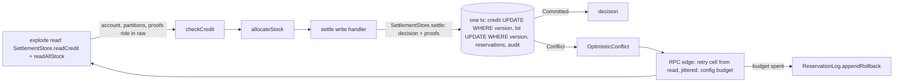

# Store Doctrine - Plan

## Goal Capsule

- **Objective:** Agents building cells stop shipping lost updates, mixed-up tenants, and in-memory fakes that behave differently from the real database. The rules they load say what a store must promise, and the compiler rejects the most damaging mistake.
- **Means:** New store rules in the `cell-architecture` pack, one new rule in the `boundary-testing` pack, and `examples/inventory-fulfillment` rebuilt so its stores follow the rules: store-issued proofs checked at one commit point, and a law suite that the in-memory and Postgres stores both pass.
- **Product authority:** This plan covers store doctrine and the example that demonstrates it. Rewriting the endgame handbook, reconciling rule ids, and the other pack repairs are not active scope.
- **Open blockers:** None.

---

## Product Contract

### Summary

Add store rules to the `cell-architecture` pack. They cover what a store promises, re-checking before a save, where coordination is needed, and keeping tenants apart. Add one rule to the `boundary-testing` pack: fake and real stores pass the same law suite. The compiler enforces the re-check rule: a store's conditional save accepts a decision only with a proof, issued by that store's read, that the data the decision used has not changed. `examples/inventory-fulfillment` adopts all of it and stops over-granting credit.

### Problem Frame

No repo rule governs stores. Neither pack mentions lost updates, conditional writes, version checks, or locking, and none of the 55 rule files across the five oxlint plugins detects a write that depends on an earlier read.

The only store code is in `examples/inventory-fulfillment`, and each store handles concurrency differently. `ReservationLogDrizzle` does a version-guarded compare-and-set. `CreditLedgerDrizzle` charges credit without any check and depends on `CustomerGateInMemory`, a lock that only works inside one process. Retries happen at the RPC edge, outside the cell. A past incident shows what this costs: rollback signals were merged into one, so duplicate order ids were reported as version conflicts (`docs/solutions/logic-errors/duplicate-order-ids-masquerade-as-version-conflicts.md`).

A throwaway race against real Postgres (two to four app instances, separate pools) showed the damage is live. With a credit limit of 100 and ten orders of 20 units split across two products, the example charged 120 in every run. Orders for different products touch different stock lots, so the stock-lot version check never fires. The credit charge (`fulfillment.cell.ts` `persistReservation`) runs after the reservation transaction commits and checks nothing. That is write skew.

The cell sandwich (read, decide, write) is optimistic concurrency with no validation step. Nothing checks at write time that the data `read` saw is still current. An uncommitted draft handbook chapter on stores tried to fill this gap and failed in four ways:

- It defined a store by its role, which fits every port.
- It listed four concurrency mechanisms without ranking them.
- It counted sagas as a fix for read-then-write races, but a saga gives no isolation.
- It separated tenants with a generic type parameter. TypeScript erases that parameter, and Effect's `Context` looks services up by a string key, so the parameter separates nothing.

### Key Decisions

- **Store rules live inside the `cell-architecture` pack.** (session-settled: user-directed — chosen over a new pack, constitutional rules, or a rewritten handbook chapter: the user picked it.) Governs R1–R17, R20–R23.
- **The law-suite rule goes in `boundary-testing`.** (session-settled: user-approved — chosen over putting it in `cell-architecture`: it governs how boundaries are tested, which is what `boundary-testing` covers.) Governs R18, R19.
- **A store's law suite is its declaration; prose is not.** A store states its laws by shipping the shared suite its fake and real adapter both pass, so "is this port a store?" has a check instead of a reviewer's reading. Governs R1–R3, R18.
- **All five obligations are in scope.** (session-settled: user-directed — chosen over a smaller subset: "boil the ocean".) Governs R1–R19.
- **The compiler enforces the re-check rule; a written rule is not enough.** (session-settled: user-approved — chosen over one prose rule file or prose-only rules per obligation: only a check enforces the rule whose violation loses data.) Governs R8–R11.
- **The proof lives on the store port, not in `effect-cell-types`.** The prototype got the compile guarantee (no proof, a hand-built proof, or another store's proof all fail to typecheck) with no library change: the proof type uses a module-private `unique symbol` key that only the store's modules can write. A shared helper would only wrap one `Symbol()` call, and any library-provided `mint` would let every importer forge proofs. So `effect-cell-types`, CELL-T1, and its API report stay unchanged, and no changeset is needed. This replaces the earlier assumption that the save costs a breaking library change. Governs R8, R11, R23.
- **Default mechanism: a store-issued proof checked at one commit point.** Measured against the other two prototypes: it keeps the four-sandwich pipeline and the pure-core/thin-shell split. The store running the pure decision under `SELECT ... FOR UPDATE` (R5's second way) never retried, but it removes read/decide/write from the cell and the compiler cannot tell whether the decision reads only locked data; it is the sanctioned escalation for hot rows. A wrapper that binds the commit inside `effect-cell-types` gave up on the most orders and needed new library surface; rejected. Governs R4–R10.
- **The default guard is a version check; a business condition is the exception.** (session-settled: user-approved — chosen over a business condition in the write as the default: the business rule stays in one place, `decide`. The cost is extra retries when many requests hit the same data.) Governs R9.
- **Only stores are affected, not every sandwich.** Most sandwiches in the repo don't save shared state (probes, readiness checks, sandbox boot), so the proof sits on store operations, not on `.write`. Governs R8.
- **The example becomes a working demonstration.** (session-settled: user-directed — chosen over leaving the example's migration as follow-up: the user asked for an example "that isn't vaporware".) Governs R24–R27.
- **New lint checks are proposals, not deliverables.** Under CONST-E9, whoever writes a rule never builds the check that grades it. Governs R21.

### Actors

- A1. Authoring agent: writes cells and store adapters, and loads pack rules through their `applies_when` triggers.
- A2. Reviewer: enforces the rules whose gate is `review`.
- A3. Type checker: enforces the store-issued proof.
- A4. Lint gate owner: receives lint proposals and decides whether to build them.

### Requirements

**What a store is** (`cell-architecture`)

- R1. A pack rule defines a store as a port over shared state that outlives one interaction and ships a law suite (R18). The suite states the laws its operations obey, which operations are atomic, and the consistency its reads see.
- R2. A port with no law suite is not a store. The other store rules and the proof do not apply to it.
- R3. Every store's suite covers at least these laws: read-after-write returns the value written, a repeated read changes nothing, and operations on different keys commute. A store with blind writes adds last-write-wins. Every conditional write adds one law: when two writes carry the same observed version, exactly one applies.

**Re-checking before a save** (`cell-architecture`)

- R4. A pack rule requires that when a save depends on an earlier read and protects a non-confluent invariant (see R12), it commits through one atomic operation that re-checks the values the invariant depends on.
- R5. The rule names the two ways to build that operation: a conditional write (on a version, etag, or condition) or the store running the pure decision inside its own atomic region. The second way must name what makes it atomic, either locked rows or SERIALIZABLE isolation with retry.
- R6. When the re-check fails, the whole sandwich runs again from `read`. Irreversible effects happen only at or after the single commit point, unless they are idempotent.
- R7. The re-check covers every value `decide` read that the protected invariant depends on, including values from a second record, so write skew cannot get through. Values that only change which valid choice `decide` makes (for example, which lot an allocation draws from) may go unchecked, and the store's rule entry says which.

**Store-issued proof** (`cell-architecture`, demonstrated in the example)

- R8. A store's conditional save accepts a decision only with a proof issued by that store's read, and code outside the store's modules cannot create one. Saving without a proof, with a hand-built value, or with another store's proof fails to typecheck. A proof for a different key, or a stale one, fails at runtime as a conflict.
- R9. By default the proof carries a version or etag. A store may use a business condition instead where contention makes version conflicts costly. The rule requires that condition to come from `decide`'s precondition, not a second copy of the business rule.
- R10. A failed check returns a typed conflict outcome that the caller retries by running the cell again from `read`. The retry limit and spacing come from configuration, not from a number written in cell code.
- R11. A tstyche test in the adopting package proves that a save without a proof, with an object literal, or with another store's proof is rejected.

**Coordinating only where needed** (`cell-architecture`)

- R12. A pack rule says when a save needs no coordination: the invariant is confluent, as with appends under fresh ids. It also says when a save does need coordination: claiming a unique value, or keeping a lower bound while values decrease. It forbids adding version checks to confluent saves.
- R13. The rule ranks mechanisms by which writers they bind, from strongest to weakest:
  - a database constraint (binds every writer)
  - a conditional write
  - an atomic region
  - an in-process lock (one process only)
  - a saga (no isolation)

  The rule also states that a saga does not fix read-then-write races.
- R14. Store boundaries follow the scope of each invariant. If an invariant spans two stores, merge them or expose one atomic operation on a port. Never enforce it by chaining two saves with `Cell.andThen`.

**Keeping tenants apart** (`cell-architecture`)

- R15. A pack rule requires building the tenant-bound store at the request edge from the authenticated caller and providing it in that request's context. Store operations never take a tenant id argument.
- R16. The rule states that a generic type parameter on a store tag does not separate tenants. It cites TypeScript's erasure of unused type parameters and Effect's string-keyed `Context` (`repos/effect/packages/effect/src/Context.ts`).
- R17. Work that touches two tenants receives two store handles as values.

**Law contract tests** (`boundary-testing`)

- R18. A `boundary-testing` rule requires the in-memory fake and the real store to pass one shared suite of the laws the store declares (R3). The suite runs in-process as a `*.integration.test.ts` outside `src/`, with the real adapter on an embedded engine such as PGlite. It uses fixed histories, not generated inputs, and spawns no processes.
- R19. The suite includes concurrent histories, built as fixed interleavings rather than real races (PGlite serializes every statement): two reads issue proofs for the same version, the first save applies and the second conflicts. A proof issued for one key is refused on another.

**Enforcement and packaging**

- R20. Each new rule file names its real gate: `type-checker` for the rule R8 enforces, `review` for the others. No rule claims a lint gate that does not exist.
- R21. Lint candidates are filed as proposals to the owners of `packages/oxlint-plugin/*` and not built in this work. Two examples: a store operation that takes a tenant id, and an in-process lock used as the only guard.
- R22. The new rule files use the frontmatter the packs already use (`title`, `applies_when`, `tags`), and each pack README lists them. Every review-gated rule ships a wrong/right example pair, and every failure a rule claims cites its source.
- R23. This work adds three kinds of test, all in the example: the tstyche proof test (R11), the settlement law suite (R18, R19), and cell-level integration tests for conflict-then-retry (AE2) and the write-skew regression (AE7). No unit tests of store or save internals.

**The example demonstrates the doctrine** (`examples/inventory-fulfillment`)

- R24. The credit charge, stock decrements, reservation rows, and settle audit row commit in one transaction that re-checks the credit account's version and each allocated lot's version (R7, R14).
- R25. The per-customer in-process lock is deleted; the conditional commit is the only guard (R13).
- R26. The settlement store ships a Postgres adapter and an in-memory adapter that pass one law suite (R18).
- R27. The RPC edge retries a conflicted order by running the cell again, with a configured, jittered schedule, and records a rollback when the budget runs out (R10).

### Acceptance Examples

- AE1. **Covers R8, R11.**
  - **Given:** the settle handler, holding the stock and credit reads.
  - **When:** the author calls `settle` without the credit proof, with an object literal, or with a stock proof in the credit slot.
  - **Then:** typecheck fails. Passing the proofs from the read compiles.
- AE2. **Covers R6, R10, R27.**
  - **Given:** an order has read stock and credit, and another settle bumps the lot's version before it commits.
  - **When:** the order reaches the conditional commit.
  - **Then:** it gets a conflict, the edge runs the cell again from `read`, and the second attempt decides on current data.
- AE3. **Covers R7.**
  - **Given:** a decision that reads the customer's credit and the stock level.
  - **When:** the save re-checks only the stock level.
  - **Then:** review rejects it because the credit read is unguarded.
- AE4. **Covers R12.** Given an audit event appended under a fresh id, when the author adds a version check to that append, then review rejects it as coordination on a confluent save.
- AE5. **Covers R15, R16.** Given a store declared as `LedgerStoreFor<Tenant>`, when review applies the tenant rule, then it is rejected. The accepted form builds the ledger from the authenticated user at the request edge.
- AE6. **Covers R18, R19.** Given a fake store that passes the sequential laws, when the suite runs two saves with proofs for the same version and both apply, then the suite fails for the fake.
- AE7. **Covers R24.**
  - **Given:** a customer with 60 of headroom, and two orders of 40 for different products that both read the account before either commits.
  - **When:** both settle.
  - **Then:** one commits; the other conflicts, re-reads, and is held for credit. Outstanding balance never exceeds limit plus overdraft privilege.

### Scope Boundaries

- Rewriting the endgame handbook chapters.
- Mapping endgame rule ids onto `CONST-*` ids, and the `CELL-*` prefix collision.
- Repairing existing pack defects: the `cell-architecture` README lists 10 of its 14 rules, `pipeable-dual-parity.md` links a skill that does not exist, and `arbitrary-filter-floors.md` names the wrong mechanism.
- Building lint rules (R21 covers proposals only).
- Any change to `packages/effect-cell-types`.
- Escalating the example to store-run decisions under row locks. The race showed hot-row retries under one busy customer; that is the documented escalation, not built here.

### Dependencies / Assumptions

- `examples/inventory-fulfillment` is `private: true` and the packs are not packages, so no publishable package's build hash changes and REPO-R2 needs no changeset.
- The theory this doctrine relies on was checked against primary sources: Berenson et al. 1995 (P4 lost update, A5B write skew), Harris et al. 2005 (atomicity does not compose), Bailis et al. 2014 (invariant confluence), Hellerstein and Alvaro (CALM), Kung and Robinson 1981 (optimistic concurrency, via lecture notes), and Herlihy 1991 (consensus numbers, via lecture notes).
- Postgres re-evaluates an `UPDATE`'s `WHERE` against the row a concurrent transaction just committed (READ COMMITTED), so `WHERE credit_version = $observed` detects the race without raising isolation (https://www.postgresql.org/docs/17/transaction-iso.html).

---

## Technical Design

### Proof shape

```ts
// src/store/SettlementProof.ts - imported only by the two settlement adapters
const CreditProofId: unique symbol = Symbol('CreditProof')
export interface CreditProof {
  readonly [CreditProofId]: { readonly customerId: string; readonly version: number }
}
export const mintCreditProof = (customerId: string, version: number): CreditProof => ({
  [CreditProofId]: { customerId, version },
})
export const creditObservation = (proof: CreditProof) => proof[CreditProofId]
// StockProof: same shape, keyed by StockProofId, holding lotId -> version for every lot read
```

Directional sketch, not final code. The port file re-exports the proof types only. The package barrel exports neither the symbols nor the minting functions, so code outside `src/store/` cannot name the key. An object literal elsewhere cannot write the key, and a `StockProof` is not assignable to `CreditProof`. `as` casts are already banned by lint.

### Data flow



Proofs travel the way `RawContext` already does: the first cell's `read` returns them, and each later cell's `read` carries them forward beside the command, never inside it. `decide` never sees a proof.

### Settlement port

| Operation                | Returns                      | Law                                                                                                                                                                       |
| ------------------------ | ---------------------------- | ------------------------------------------------------------------------------------------------------------------------------------------------------------------------- |
| `readCredit(customerId)` | account, tier, `CreditProof` | repeated read changes nothing                                                                                                                                             |
| `readAllStock`           | partitions, `StockProof`     | repeated read changes nothing                                                                                                                                             |
| `settle(command)`        | `'Committed' \| 'Conflict'`  | read-after-write; different customers commute; two settles on proofs of one version: exactly one commits; a proof for another customer or a stale lot version: `Conflict` |

`settle` takes the order and customer ids, the reservation events, the audit payload, the credit proof plus the charge amount (absent for held or backordered decisions), and the stock proof. Only proof-check failures map to `Conflict`; a unique violation or driver error dies, so the duplicate-order misattribution cannot come back.

---

## Implementation Units

### U1. Settlement store with proofs (example)

- **Files:** new `src/ports/SettlementStore.ts`, `src/store/SettlementProof.ts`, `src/store/SettlementStoreDrizzle.ts`, `src/store/SettlementStoreMemory.ts`; `src/store/schema.tables.ts` plus a generated migration under `drizzle/`; delete `src/ports/CreditLedger.ts`, `src/store/CreditLedgerDrizzle.ts`, `src/ports/CustomerGate.ts`, `src/store/CustomerGateInMemory.ts`; edit `src/ports/ReservationLog.ts`, `src/store/ReservationLogDrizzle.ts`, `src/inventory/InventoryStore.ts`, `src/store/InventoryStoreDrizzle.ts`, `src/mod.ts`.
- **Change:** add `credit_version integer not null default 1` to `user`. `SettlementStore` has `Live` (Drizzle) and `memory(seed)` (a `Ref`-held state; no hand-written classes). `readAllStock` moves from `InventoryStore` to `SettlementStore`; `InventoryStore` keeps the listing reads. `ReservationLog.commit` becomes `appendRollback`, a confluent audit append with no version check, written under its own id (`<orderId>:rollback`) with `ON CONFLICT DO NOTHING`, so a resubmitted order never collides with its earlier rollback. The Drizzle `settle` runs one transaction: the credit `UPDATE ... WHERE id AND credit_version = observed RETURNING`, one `UPDATE ... WHERE id AND version = observed RETURNING` per distinct allocated lot (allocations are summed per lot first, because two allocations from one lot would otherwise fail their own version check), then reservation and audit inserts; any update that touches zero rows rolls back to `Conflict`. It reuses the row builders from `ReservationLogDrizzle`.
- **Covers:** R7, R8, R9, R14, R24, R25, R26.

### U2. Pipeline and edge rewired (example)

- **Files:** `src/fulfillment/fulfillment.cell.ts`, `src/rpc/inventory-fulfillment.rpc.ts`, `src/store/PgRuntime.ts`, `src/fulfillment/FulfillmentConfig.ts`, `README.md`.
- **Change:** the explode read calls `SettlementStore`; proofs ride in each cell's raw read to the settle handler, which calls `settle` once and maps `Conflict` to `OptimisticConflict`. The `ReservationCommit` span wraps the settle; the `CreditCharge` span wraps it too for charging decisions, so the taxonomy and trace contracts keep their meaning. The edge drops `CustomerGate` and retries with `Schedule.spaced(config.retryInterval).pipe(Schedule.jittered)` bounded by `config.maxRetries`. The Live config raises `maxRetries` from 3 to 8, because without the in-process gate same-process orders now conflict too. README describes the settlement store instead of `CreditLedger`.
- **Covers:** R6, R10, R24, R25, R27.

### U3. Tests (example)

- **Files:** new `tests/settlement-store.integration.test.ts`, `test-types/settlement-proof.tst.ts`; edit `tests/__fixtures__/server.fixture.ts`, `tests/__fixtures__/fulfillment-trace.fixture.ts`, `tests/inventory-fulfillment.integration.test.ts`, `tests/fulfillment.refusal.integration.test.ts`, `tests/fulfillment.settle.trace.test.ts`.
- **Change:** the law suite runs the same fixed histories against `SettlementStore.memory(seed)` and `SettlementStore.Live` over PGlite (R3 laws, R19 interleavings, AE6 by construction). The tstyche test pins AE1. The conflict seam moves from `InventoryStore.readAllStock` to the settlement reads and bumps a lot or credit version; the existing retry-success and retry-exhaustion tests keep passing against it (AE2). A new cell-level test pins AE7 through the seam. The trace fixture uses `SettlementStore.memory` in place of hand-written `CreditLedger`/`InventoryStore`/`ReservationLog` fakes; a forced conflict comes from an interleaving, never from a fake that returns `Conflict`. Follow the existing files' conventions (Gherkin specs, naming) as lint enforces them.
- **Covers:** R11, R18, R19, R23, AE1, AE2, AE6, AE7.

### U4. Pack rules

- **Files:** in `compound-packs/cell-architecture/`: `store-declares-its-laws.md` (R1–R3), `store-recheck-at-one-commit.md` (R4–R7, R10), `store-issued-proofs.md` (R8, R9, R11; gate `type-checker`), `coordinate-only-non-confluent-saves.md` (R12–R14), `tenant-bound-store-handles.md` (R15–R17), and README entries. In `compound-packs/boundary-testing/`: `fake-and-real-store-laws.md` (R18, R19) and a README entry.
- **Change:** each file follows the existing rule anatomy (frontmatter, body, wrong/right pair, `Gate:` line). Examples use the example's real names from U1–U2 (`SettlementStore`, `CreditProof`, `settle`) and cite the race finding and primary sources.
- **Covers:** R1–R22.

### U5. Lint proposals

- **Change:** at ship time, open one GitHub issue per R21 candidate, addressed to the oxlint plugin owners, and link them from the PR.
- **Covers:** R21.

U1–U3 share files and go to one implementer. U4 runs in parallel against the names fixed above. U5 runs with the PR.

---

## Verification

- `pnpm --filter @systemfsoftware/example-inventory-fulfillment typecheck`, `lint`, `test`, `test:types`.
- `pnpm check:local` exits 0 after the last edit.
- Race rerun: the throwaway harness at `.context/compound-engineering/ce-prototype/2026-09-23-store-conflict-proof/01-mechanism/proto/`, pointed at the migrated example, reports outstanding balance within the limit at 2 and 4 instances.

## Risks

- **Hot-row retries.** With one busy customer across instances, optimistic retries starved in the prototype (5 of 10 gave up at 5 attempts). Jitter and a larger configured budget reduce it; the store-run decision under row locks is the documented escalation.
- **Proof boundary is module-level.** Any file that imports `src/store/SettlementProof.ts` can mint. Review enforces that only the settlement adapters import it; a lint proposal can harden that later.
- **Migration on existing databases.** The new column has a default, so existing rows get version 1 and existing code paths stay valid.

## Destructive Review

Lens: Edge-First. Assumptions challenged:

1. **Proofs survive the pipeline.** Each later cell's `read` receives the previous cell's response, so proofs issued in the first read reach the settle handler without a re-read. Held: the prototype carried them the same way `RawContext` travels.
2. **One version check per allocation is enough.** Broken: an order drawing twice from one lot would conflict with itself. U1 now sums allocations per lot before checking.
3. **The rollback append cannot collide.** Broken: a resubmission after a rollback would reuse the settle audit id, and with conflicts now narrowed to proof checks it would die instead of mislabelling. U1 now gives the rollback its own idempotent row.

## Sources / Research

- `packages/effect-cell-types/src/Sandwich.ts` (lines 353–377, 436–448): the chain is `named → decide → write`, and decode and encode are derived from the workflow's schemas.
- `repos/effect/packages/effect/src/Context.ts` (lines 462–474): services are stored in a `Map` keyed by each tag's string key.
- `repos/effect/packages/sql/pglite/src/PgliteClient.ts` (line 213): one single-permit semaphore serializes every statement, so concurrent laws use fixed interleavings.
- `repos/effect/packages/effect/src/Schedule.ts` (`jittered`, line 1093; `spaced`, line 1198).
- `examples/inventory-fulfillment/src/fulfillment/fulfillment.cell.ts` (lines 313–322): the charge after the committed reservation transaction.
- `docs/solutions/tooling-decisions/effect-v4-unstable-stack-binding.md`: the version-bump seam precedent.
- `docs/solutions/logic-errors/duplicate-order-ids-masquerade-as-version-conflicts.md`: why only proof checks may map to `Conflict`.
- Handles are values, not services (pack: cell-architecture, resource-vs-handle-duality.md). This is why R17 passes store handles as values.
- Ports are declared apart from their adapters (pack: cell-architecture, ports-separate-from-layers.md). R1 narrows ports to stores rather than adding a new kind of component.
- Microsoft's event-sourcing pattern describes the retry loop R6 requires: an append is rejected if the stream changed since it was read, and the handler reloads, re-decides, and retries (https://learn.microsoft.com/en-us/azure/architecture/patterns/event-sourcing).
- James Shore, _Testing Without Mocks_: a substitute needs tests that fail when it stops behaving like the real code (https://www.jamesshore.com/v2/projects/nullables/testing-without-mocks). R18 applies that to stores.
- PostgreSQL 17, Transaction Isolation: `UPDATE` re-evaluates its `WHERE` against a concurrently committed row under READ COMMITTED (https://www.postgresql.org/docs/17/transaction-iso.html).
- TypeScript Handbook, Symbols: "no two `unique symbol` types are assignable or comparable to each other", and each is tied to one `const` declaration (https://www.typescriptlang.org/docs/handbook/symbols.html). This is what makes a module-private proof key unforgeable at compile time.
