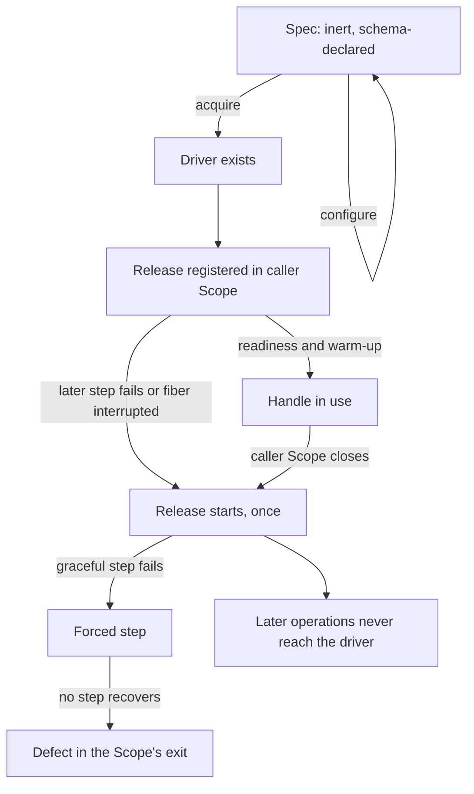
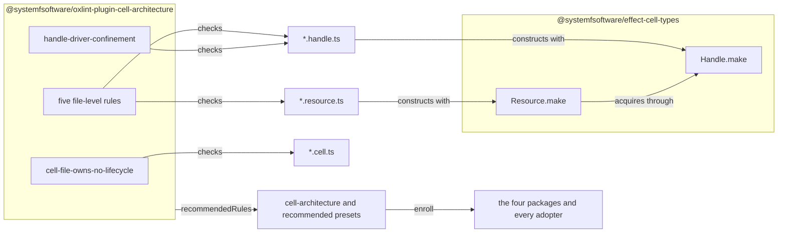
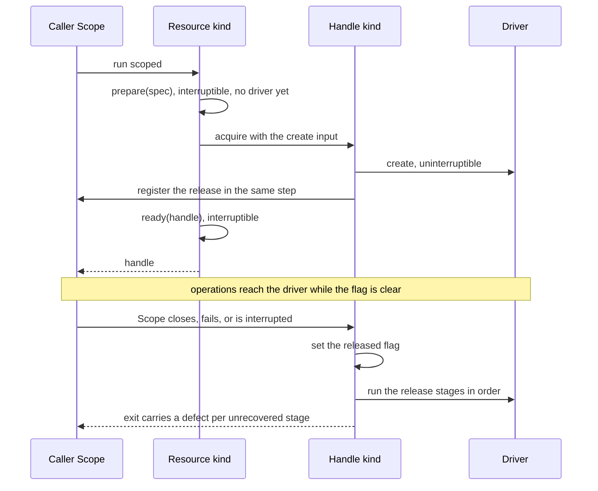
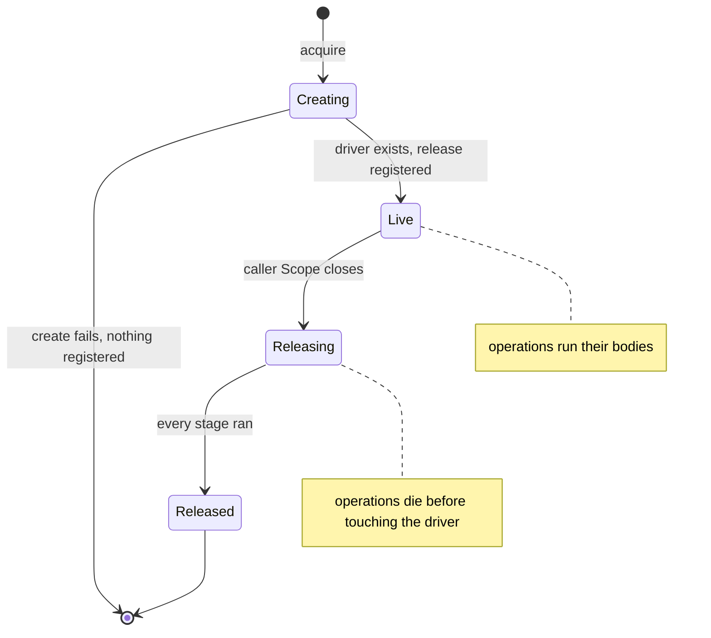
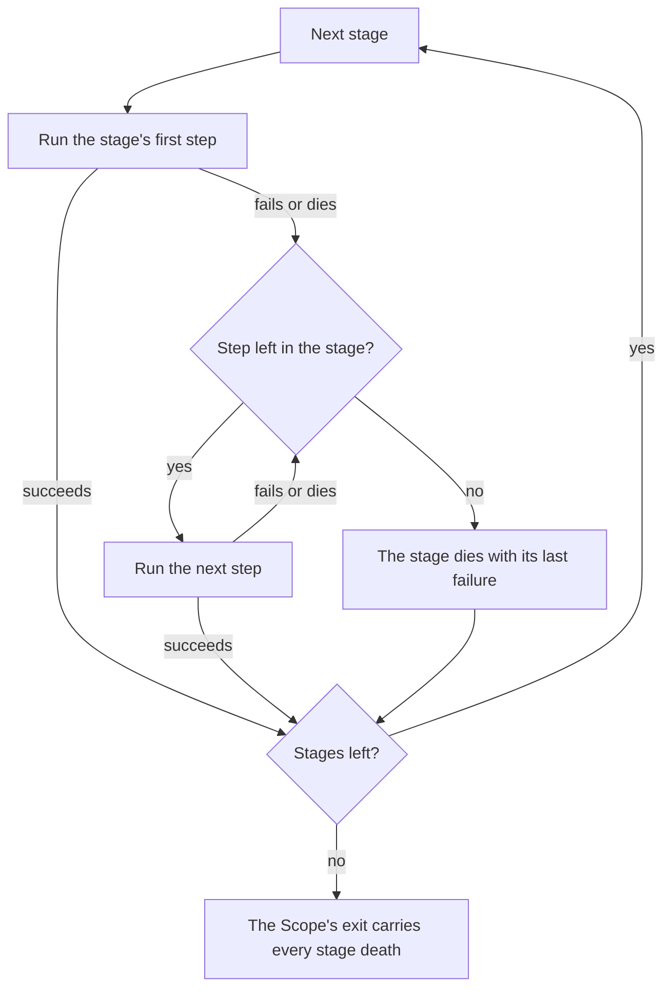
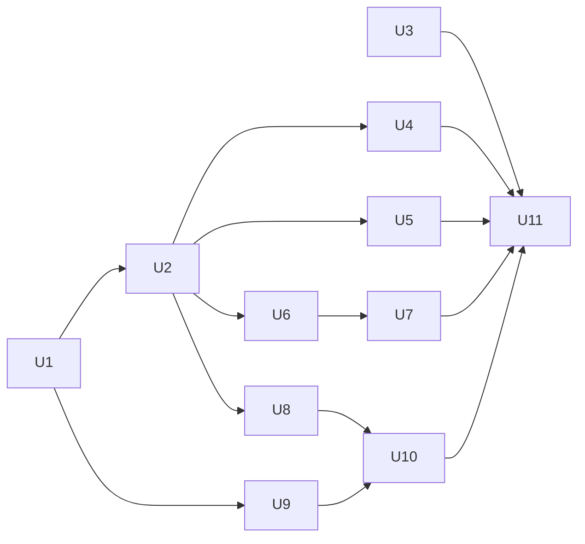

# Resource and Handle Cell Kinds - Plan

## Goal Capsule

- **Objective:** Resources and handles become cell kinds that typecheck and lint hold to the cell-architecture pack's lifecycle and privacy law, in every package that enables the recommended oxlint preset. A driver lent to caller code, a handle modeled as a service, a release registered after a step that can fail or inside a sandwich, and a file whose suffix misstates its contents all fail typecheck or lint. A release failure that no escalation step recovers surfaces as a defect instead of vanishing.
- **Means:** Resource and Handle kinds in `@systemfsoftware/effect-cell-types` (KTD1-KTD9), plus seven oxlint rules in `@systemfsoftware/oxlint-plugin-cell-architecture` keyed on `*.resource.ts`, `*.handle.ts`, and `*.cell.ts` (KTD4, KTD10), enrolled after the four packages migrate (KTD11-KTD15).
- **Product authority:** The user set the framing: resource and handle are cell kinds with constructors in `effect-cell-types`, and a cell kind is a file suffix. The user delegated every remaining choice to state-of-the-art research, and this plan records each choice with its evidence. Not active scope: splitting `.cell.ts` into sandwich and composite kinds, the `Cell` naming question, and a closed list of permitted suffixes.
- **Execution profile:** Deep. Eleven units in four phases: kinds, then migration and rules in parallel, then doctrine and enrollment. The kinds and rules have one owner and the migration another (Implementation Constraints).
- **Stop conditions:** Stop and report when a type-level refusal in KTD1, KTD2, KTD4, or KTD7 cannot be expressed in TypeScript; name the requirement that loses its instrument instead of shipping it as review-only. A migration unit blocked by a refusal stops and hands the case to the instrument owner (CONST-E9). Enrollment that finds a violation outside the migrated code migrates it or stops; it never adds a baseline or a warn phase (R28).
- **Finish and ship:** The implementer lands U1-U11 in one pull request and watches `gh pr checks --watch --fail-fast` to green, including the microsandbox smoke job (REPO-D1).
- **Open blockers:** None.

---

## Product Contract

Product Contract preservation: restructured, no scope change. R6 names the acquisition step instead of the Resource constructor as the carrier, and the Summary and the first Key Decision follow it. AE3 compares data-first application with the resource's `pipe`, because configuration is dual-only (KTD8). The Deferred to Planning questions are resolved in KTD1-KTD15 and removed.

### Summary

Add Resource and Handle as cell kinds in `@systemfsoftware/effect-cell-types`. Acquiring a handle creates its driver and registers the driver's release in one step, and a resource can only yield handles acquired that way, so no later step runs first. The Handle kind lets only its own operations read the driver, refuses an operation that lends it, and surfaces a release failure that no escalation step recovers. Oxlint rules keyed on the two suffixes force the kinds and check what a type cannot see, and a rule on `*.cell.ts` keeps release and scope closure out of sandwiches. The four packages that use the suffixes conform before the rules enroll at error.

### Problem Frame

The cell-architecture pack states the law for resources and handles: an inert spec versus a live handle, a private driver, a scoped lifecycle, and pipeable parity. The only enforcement is review, or prose that names the type-checker, and `STRATEGY.md` grades review-only doctrine as an automatic F. No rule keys on either suffix, which CONST-N2 forbids.

The four packages that use the suffixes have drifted apart:

- `packages/effect-readiness/src/readiness.resource.ts` declares no resource; it exports only `Wait`, `TargetOptions`, `target`, and `awaitCondition`.
- The memfs resource offers a scope-free `effect` where the other resources offer `scoped`, and its `make` takes no identity (`packages/effect-memfs/src/memory-file-system.resource.ts:21,41`).
- Microsandbox's `withEnv`, `withExposedPorts`, and `withMount` duals take `MicroVMSpec` rather than the resource, so the pipe form and the chained form accept different values (`packages/effect-microsandbox/src/micro-vm.resource.ts:256-311`).
- `JobResource` silently ignores exposed ports and wait strategies by returning itself (`micro-vm.resource.ts:149-151,161-163`).
- `MicroVM.use` lends the raw sandbox driver to caller code (`packages/effect-microsandbox/src/running-vm.handle.ts:123-133`), and `packages/effect-microsandbox/examples/boot-alpine.ts:210-216` exercises it.
- Trace-spec's handle returns its tracer provider, which is its driver, inside a `Context` (`packages/trace-spec/src/observation-window.handle.ts:142-145`). The resource's layer merges that context into the one its callers run in, though the layer's declared type omits the provider (`packages/trace-spec/src/observation-window.resource.ts:32-36`).
- Microsandbox registers the sandbox release inside a sandwich's write handler (`packages/effect-microsandbox/src/boot-sandbox.cell.ts:141`), because nothing else guarantees the release is registered before readiness runs. The same file closes a scope inside a cell to probe for a free port (`boot-sandbox.cell.ts:103-107`). The pack forbids both (`compound-packs/cell-architecture/scoped-lifecycle-boundaries.md:18`).
- A failed release ends in one of two ways. The pack's escalation example discards the failure of its last step (`compound-packs/cell-architecture/scoped-lifecycle-boundaries.md:25-40`). Microsandbox's teardown copies it (`boot-sandbox.cell.ts:89-101`), so a failed sandbox destroy goes unreported. Trace-spec's shutdown and memfs's temporary-file removal turn the same failure into a defect (`observation-window.handle.ts:51-52`, `packages/effect-memfs/src/memory-file-system.handle.ts:329,351`).
- TypeIds are declared by hand in two styles: a string at `micro-vm.resource.ts:74`, and `Symbol.for` everywhere else.

### Key Decisions

- **Resource and Handle are cell kinds with constructors in `effect-cell-types`.** (session-settled: user-directed — chosen over a lint-only suffix convention with no ADT: the user's reason was that sandwiches, workflows, resources, and handles are all cells.) Conflict: `docs/solutions/architecture-patterns/constructor-rule-boundary.md` stops a constructor when Effect already supplies the composer, and `Effect.acquireRelease` composes acquisition and release. The kinds clear that doc's bar only through what no author-written annotation can reject: per R6 the two kinds together make a release registered after readiness unwritable, and per R12 the Handle kind refuses a lend. Governs R1, R19, R20.
- **A cell kind is a file suffix.** Each suffix names one kind: its constructor carries what a type can see, and suffix-keyed rules carry the rest, as the workflow kind does with `Workflow.make` and its presence and location rules. (session-settled: user-directed — chosen over "a handle's I/O operations are Cell arrows" and "a lifecycle of acquire, ready, and release cells": the user answered "the file suffix.") Governs R19 through R27.
- **Types carry what they can see; lint carries file-level facts.** Oxlint JS plugin rules read only the syntax tree. So every property a type can express lives in a kind, and the rules check suffixes, imports, exports, declarations, and the positions a kind fixes (`repos/constitution/ENFORCEMENT.md` mechanism order). Governs R9, R11, R12, R19, R20, R24.
- **The Handle kind passes the driver to operations as a parameter.** Today a handle keeps its driver in a slot such as `self[SandboxTypeId]`, and a syntax rule sees that read as any other property access, so it cannot tell a driver from data or a lend from a use. A driver that exists only as a parameter of operations the kind builds has a type the kind knows and a position a rule can find. Governs R11, R12, R18.
- **A resource compiles to Scope; there is no Managed-style effect type.** ZIO 2 retired `ZManaged` for Scope, and the vendored Effect v4 tree has no Managed module. Effect v4's child-process command is itself a scoped Effect. Governs R4.
- **Release is registered the moment the driver exists, before readiness.** Cats Effect registers a resource's release at allocation, before later steps run, and Effect's `Pool` adds its finalizer before its first resize. Governs R6, R17.
- **An unrecovered release failure is a defect, never discarded.** Effect v4 turns a failed temporary-directory removal into a defect (`repos/effect/packages/platform/node-shared/src/NodeFileSystem.ts:203-211`). Its child-process release escalates to `SIGKILL` when `forceKillAfter` is set (`repos/effect/packages/platform/node-shared/src/NodeChildProcessSpawner.ts:479-491`). The same release discards a failed termination (`repos/effect/packages/platform/node-shared/src/NodeChildProcessSpawner.ts:543-560`). This plan does not follow that discard, because discarding is what hides a failed sandbox destroy today (`boot-sandbox.cell.ts:98-100`). Governs R14, R15, R32.
- **No driver lending, over a named unsafe escape.** Named escapes are the common pattern (Prisma's `$queryRawUnsafe`, JDBC's `unwrap`, Rust's `AsRawFd`). But a lent driver's own stop and kill methods bypass the Scope that R6 guarantees, and Effect v4's child-process handle exposes no raw process. Governs R12, R30.
- **Handles carry data and operations are standalone functions, over operation-bearing fields.** Effect v4's child-process handle carries its operations as fields. The pack's data-only handle, like Effect's `Pool` and `Queue`, keeps operations pipeable and the value inert. Governs R9, R10.
- **The kinds are named after their suffixes: `Resource` and `Handle`.** Effect v4 exports its own `Resource`, a refreshable scoped value, but no package in this repo imports it; a file that needs both aliases one. Governs R1.

### Requirements

**Cell kinds**

- R1. `@systemfsoftware/effect-cell-types` exports a Resource kind and a Handle kind beside Workflow and Sandwich, and CELL-T1's closed runtime surface is amended to admit their constructors and nothing else.

**Resource kind**

- R2. Constructing or configuring a resource spec performs no I/O. (pack: cell-architecture, staged-lawful-builders.md)
- R3. A resource spec is schema-declared, so a spec missing a required field, including its target's identity, does not construct. (pack: cell-architecture, staged-lawful-builders.md)
- R4. Acquisition is an ordinary scoped Effect that yields the handle, not a second effect type. (pack: cell-architecture, scoped-lifecycle-boundaries.md)
- R5. Every other projection of a resource derives from that one acquisition, whether it binds the handle under a caller's tag or provides a service the handle implements. (pack: cell-architecture, resource-vs-handle-duality.md)
- R6. Acquisition splits at the moment the driver exists and registers the driver's release in the caller's Scope before any later step, such as a readiness check, runs.
- R7. Each configuration option has a single definition from which the pipe form and any chained form both derive. (pack: cell-architecture, pipeable-dual-parity.md)
- R8. An option that a spec variant cannot honor is absent from that variant, never accepted and ignored.

**Handle kind**

- R9. A handle is a branded, pipeable value that carries only data; a handle that declares a function-valued public field does not construct. (pack: cell-architecture, resource-vs-handle-duality.md)
- R10. A handle's operations are standalone functions that take the handle. (pack: cell-architecture, resource-vs-handle-duality.md)
- R11. The driver is readable only inside the operations that the handle's own definition builds, where it arrives as a parameter. (pack: cell-architecture, handle-state-privacy.md)
- R12. No operation lets the driver reach caller code, whether through a callback, its result, or a service it provides; a third-party library may receive the driver inside an operation that exposes only the library's own service.
- R13. No code outside the handle's package can build a handle around a driver of its own.
- R14. The handle kind owns its driver's release, which may escalate from a graceful step to a forced one when the graceful step fails. (pack: cell-architecture, scoped-lifecycle-boundaries.md)
- R15. A release failure that no later release step recovers reaches the caller's Scope exit as a defect, never discarded.
- R16. A handle whose driver needs no release constructs without declaring one.
- R17. A handle acquired through another handle's operation, such as a file opened from a file system, gets the same release guarantee as a handle acquired from a resource.
- R18. An operation called after its handle's release has started never reaches the driver.

R6, R14, R15, R17, and R18 give every resource, and every handle acquired through another handle's operation, this lifecycle:



**Suffix rules**

- R19. A `*.resource.ts` file constructs a resource with the Resource constructor, and a `*.handle.ts` file constructs a handle with the Handle constructor.
- R20. Neither constructor appears in any other kind of file.
- R21. Resource and handle files declare no `Context.Service`. (pack: cell-architecture, resource-vs-handle-duality.md)
- R22. Resource and handle files hold no module-level mutable state. (pack: cell-architecture, handle-state-privacy.md)
- R23. A handle file never imports a resource file.
- R24. A `*.cell.ts` file neither registers a release nor closes a scope; the resource and handle kinds own both. (pack: cell-architecture, scoped-lifecycle-boundaries.md)
- R25. Each rule's message states exactly what the rule checked.
- R26. No rule keys on this repo's own naming, such as TypeId prefixes.
- R27. The rules ship enabled in the published recommended preset, so adopters' resource, handle, and `*.cell.ts` files are held to the same law.

**Migration and doctrine**

- R28. The rules enroll at error only after `effect-microsandbox`, `trace-spec`, `effect-memfs`, and `effect-readiness` conform, with no baseline, allowlist, or warn phase.
- R29. `readiness.resource.ts` leaves the resource suffix, since it declares no resource.
- R30. `MicroVM.use` is removed, and any sandbox capability a caller needs becomes a named handle operation.
- R31. The cell-architecture pack files on resources and handles name the constructor or rule that enforces each property, and mark any property no instrument can see as unenforced guidance.
- R32. The pack's escalation example surfaces the failure of its last step, as R15 requires.

### Acceptance Examples

- AE1. **Covers R6.** **Given** a resource whose readiness check fails after its driver exists, **when** it is acquired inside a scope, **then** the driver's release runs once and the caller receives the readiness failure.
- AE2. **Covers R6.** **Given** a resource still running its readiness check, **when** the acquiring fiber is interrupted, **then** the driver's release runs once.
- AE3. **Covers R7.** **Given** the same options, **when** they are applied once data-first and once through the resource's `pipe`, **then** the two resulting specs are equal.
- AE4. **Covers R8.** **Given** a job spec, **when** a caller sets exposed ports on it, **then** compilation fails.
- AE5. **Covers R9.** **Given** a handle declaration with a function-valued public field, **when** it is compiled, **then** construction fails.
- AE6. **Covers R12, R30.** **Given** a handle operation that passes the driver to a caller's callback, as `MicroVM.use` does today, **when** typecheck and lint run, **then** at least one of them fails.
- AE7. **Covers R12.** **Given** trace-spec's observation window, **when** an operation hands the tracer provider to `OtelTracer` and exposes only the tracer, **then** typecheck and lint pass.
- AE8. **Covers R12.** **Given** trace-spec's observation window, **when** its layer leaves the tracer provider in the context its callers run in, as the layer built from `context` does today, **then** typecheck or lint fails.
- AE9. **Covers R14, R15.** **Given** a microVM whose graceful stop fails, **when** the caller's Scope closes, **then** the forced kill runs, and if the sandbox then cannot be destroyed, the Scope's exit carries that failure as a defect.
- AE10. **Covers R16.** **Given** an in-memory file system whose driver has nothing to release, **when** its handle is constructed, **then** no release declaration is required and acquisition succeeds.
- AE11. **Covers R17.** **Given** a file system handle, **when** a caller opens a file inside a scope and the scope closes, **then** the file's release runs once, whether the caller's work succeeded or failed.
- AE12. **Covers R18.** **Given** a handle whose Scope has closed, **when** a caller runs one of its operations, **then** the operation fails and the driver is not called.
- AE13. **Covers R19, R29.** **Given** `readiness.resource.ts` as it stands today, **when** lint runs, **then** it reports that the file constructs no resource.
- AE14. **Covers R24.** **Given** `packages/effect-microsandbox/src/boot-sandbox.cell.ts` as it stands today, **when** lint runs, **then** it reports the release registered at line 141 and the scope closed at line 104.

### Success Criteria

- Reintroducing any drift case listed in the Problem Frame fails typecheck or lint, with two exceptions. A TypeId declared by hand beside a kind brands nothing, since the kind computes the brand. A release step that discards its own failure is caught only by the package's real-system release test.
- No property of resources or handles in the cell-architecture pack still names `review` as its gate while a type or rule could check it.
- Every constructor refusal is pinned by a type assertion in `packages/effect-cell-types/test-types/`, as CELL-T2 already requires for the cell surface.
- `pnpm check:local` passes with the rules at error in all four packages.

### Scope Boundaries

- Splitting `.cell.ts` into sandwich and composite kinds, and renaming the `Cell` type and namespace, belong to the next brainstorm. R24's rule on `*.cell.ts` covers only release and scope closure.
- Turning CONST-N2 into a closed list of permitted suffixes, and deciding the `.service.ts` kind, are deferred.
- Whether every hand-written release in production source must live in a kind is deferred with the closed suffix list.
- A generated lifecycle law suite that proves release against real drivers is deferred.
- A restricted, non-releasing view of the driver for callers is deferred until a caller needs a capability that no handle operation covers.
- Workflow and Sandwich keep their current constructors.
- `CONCEPTS.md` gains Resource and Handle entries once the kinds ship. Each glossary entry names the gate that enforces it, and until the kinds exist that gate is review.

#### Deferred to Follow-Up Work

- A lint rule for a release step that discards its own failure. Today only each package's real-system release test catches it, as Success Criteria states.
- Mutation testing for the kinds' release and guard runtime, if CELL-T1's exemption for `effect-cell-types` is revisited.
- Splitting `@systemfsoftware/oxlint-plugin-cell-architecture` into private rule leaves, if the new rules push its CI mutation cell past its budget (`docs/solutions/architecture-patterns/mutation-budgets-split-rule-packages-into-private-cells.md`).

<!-- ce-section: work-relationships -->

### How This Work Fits Together

This plan covers the resource and handle cell kinds. The areas below are the current understanding of the surrounding work, not a committed roadmap.

- Sandwich and composite kinds: `.cell.ts` files hold five single sandwiches and two composites (`packages/effect-microsandbox/src/boot-microvm.cell.ts` and `examples/inventory-fulfillment/src/fulfillment/fulfillment.cell.ts`).
  - Shares the suffix-kind law with this plan.
  - Shares `packages/effect-microsandbox/src/boot-sandbox.cell.ts` with this plan's migration, since R24 moves microsandbox's release and port probe out of it.
  - Still to decide: the kind names, and the name of the `Cell` type and namespace.
- A closed suffix list (CONST-N2 as a rule) and the `.service.ts` kind:
  - Depends on this plan and on the sandwich area earning their suffixes first.
  - Decides whether every hand-written release belongs to a kind. Outside the four packages, releases are registered by hand in `packages/atom/effect-atom/src/Registry.ts:188,230,398`, `packages/rx-effect/src/FromObservable.ts:9`, and `examples/inventory-fulfillment/src/store/PgRuntime.ts:33`. An atom mount and an Observable subscription have no spec with an identity, so R3 would not fit them.
- Generated lifecycle laws:
  - Enables executable proof of what R6, R15, and R17 leave to each package's real-system tests.
  - Still to decide: how each resource exposes a liveness observer, and which drivers CI can host.

### Alternatives Considered

- Constructor-forced kinds (chosen): constructors carry every property a type can see, rules force the constructors and check file-level facts, and each package's real-system tests cover what neither can see.
- Lint-first kinds with type-only brands: rules pattern-match today's hand-written TypeIds, slots, and projections, and no runtime constructor ships. Rejected, because the rules would check proxies for properties a constructor computes outright, and the drift in the Problem Frame shows that hand-written shapes diverge.
- Kinds with a minimal rule set: the kinds carry every shape, and lint keeps only suffix presence, kind location, the `*.cell.ts` lifecycle rule, and the driver's position. Rejected, because a kind cannot see a `Context.Service` declared beside it, module-level state, or an import, which R21 to R23 check.
- Constructor-forced kinds plus generated lifecycle laws: `effect-cell-types` would discover each resource and prove release on readiness failure and interruption against the real driver, the way schema laws are generated today. Deferred, because each resource would need a liveness observer, and microsandbox needs a host with hardware virtualization.

### Dependencies / Assumptions

- Packages are pre-1.0 (REPO-R1). Removing `MicroVM.use`, reshaping the resource APIs, and surfacing the release failures microsandbox discards today ship as breaking changes with changesets (REPO-R2).
- The rules grade work, so they land in their own commits, observed failing before and passing after, per `repos/constitution/ENFORCEMENT.md` and CONST-E9.
- Two facts stay with each package's real-system integration tests: acquisition ends exactly when the driver exists, and release frees the driver. (pack: boundary-testing, real-system-oracles.md)
- The plan rests on three structural assumptions, each checked against the repo under an Edge-First review:
  - Every property has an instrument that can see it. A kind's types see value shapes and operation signatures, oxlint sees one file's syntax, including the driver position R11 fixes, and real-system tests see driver behavior.
  - Enrolled at error, the rules find violations only inside the four packages R28 migrates. Resource and handle files exist only there, and the only release registered or scope closed in a `*.cell.ts` file is at `packages/effect-microsandbox/src/boot-sandbox.cell.ts:104,141`.
  - Every lifecycle edge has an outcome: R6 covers readiness failure and interruption, R14 escalation, R15 an unrecovered release failure, and R18 use after release.

### Sources / Research

- Enforcement law: `docs/solutions/architecture-patterns/what-a-filename-suffix-can-enforce.md`, `docs/solutions/architecture-patterns/constructor-rule-boundary.md`, `repos/constitution/ENFORCEMENT.md`, CONST-N2 in `CONSTITUTION.md`, and `STRATEGY.md`.
- Workflow kind template: the `make-file-location`, `workflow-file-make-presence`, and `workflow-file-export-topology` rules in `packages/oxlint-plugin/oxlint-plugin-dmmf-workflow`.
- Vendored Effect v4 (4.0.0-rc.116):
  - `repos/effect/packages/effect/src/unstable/process/ChildProcess.ts:42-53`: the command is a scoped Effect. Lines `:798` and `:837`: configuration is by dual combinators.
  - `repos/effect/packages/effect/src/unstable/process/ChildProcessSpawner.ts:79-129`: the handle exposes no raw process.
  - `repos/effect/packages/effect/src/Pool.ts:32-33`: unregistered private symbols. Line `:382`: the finalizer is registered before the first resize. Lines `:446-449`: `get` after shutdown interrupts the caller.
  - `repos/effect/packages/effect/src/Resource.ts:41-45`: Effect's `Resource` is a refreshable scoped value.
  - `repos/effect/packages/platform/node-shared/src/NodeFileSystem.ts:203-211`: a failed temporary-directory removal becomes a defect.
  - `repos/effect/packages/platform/node-shared/src/NodeChildProcessSpawner.ts:18-22` and `NodeChildProcessSpawner.ts:479-491`: release escalates to `SIGKILL` when `forceKillAfter` is set. `NodeChildProcessSpawner.ts:543-560`: the release discards a failed termination.
- Cats Effect 3 `Resource`, including release registered at allocation, acquire and release that cancellation cannot interrupt, and `allocated` documented as leak-prone: https://github.com/typelevel/cats-effect/blob/series/3.x/kernel/shared/src/main/scala/cats/effect/kernel/Resource.scala, https://typelevel.org/cats-effect/docs/std/resource, and https://typelevel.org/cats-effect/api/3.x/cats/effect/kernel/Resource.html
- ZIO 2 replacing `ZManaged` with Scope: https://zio.dev/reference/resource/scope/ and https://zio.dev/guides/migrate/zio-2.x-migration-guide
- Named escape hatches: https://www.prisma.io/docs/orm/prisma-client/using-raw-sql/raw-queries, https://docs.oracle.com/en/java/javase/26/docs/api/java.sql/java/sql/Wrapper.html, and https://doc.rust-lang.org/std/os/fd/trait.AsRawFd.html
- Oxlint JS plugins read only the syntax tree ("No custom type-aware rules"): https://oxc.rs/blog/2026-03-11-oxlint-js-plugins-alpha.html and https://oxc.rs/docs/guide/usage/linter/type-aware

---

## Planning Contract

### Key Technical Decisions

**Kinds**

- KTD1. Every handle is created by its own definition, in one step that also registers its release in the caller's Scope. `Handle.make` takes a `create` from data input to driver, and the kind runs it as the acquire half of `Effect.acquireRelease`, which acquires uninterruptibly and registers the release in the same step (`repos/effect/packages/effect/src/internal/effect.ts:4106-4122`). No API accepts a driver a caller already holds, and the kind refuses a `create` whose input can hold the driver's type. Implements R6, R13, R17.
- KTD2. A handle is a branded, pipeable record of data, and its driver sits in a slot keyed by a symbol that `effect-cell-types` never exports, the way Effect's `Pool` keeps its state (`repos/effect/packages/effect/src/Pool.ts:32-33`). `Handle.make` refuses data with a function-valued member or a member that can hold the driver. Each refusal is a marker member on a constraint or return type, never a conditional in parameter position (`docs/solutions/architecture-patterns/constructor-rule-boundary.md`). The kind mints each definition's brand and guard, so no package declares a TypeId. Implements R9, R11.
- KTD3. The kind builds every operation and runs its body only after a release check. A definition declares each operation as a function that receives the driver first and the handle second, and the kind returns it as a dual over the handle. Effect operations and stream operations are declared in separate groups, so the kind can defer both kinds of body until the effect or stream runs. The release sets a flag in the private slot before its first step, and a deferred body that finds the flag set dies with a defect naming the handle. The check runs when the operation runs, not when it is called, because an effect built before release can run after it (AE12). A revocable proxy around the driver was rejected. MDN notes that proxy forwarding fails for native objects and anything with internal slots (https://developer.mozilla.org/en-US/docs/Web/JavaScript/Reference/Global_Objects/Proxy). Microsandbox's driver is a native binding (`packages/effect-microsandbox/src/boot-sandbox.cell.ts:12-14`). For R11, every definition function that receives the driver is an operation: effect and stream operations, child creators, release steps, and the integration. Implements R10, R11, R18.
- KTD4. Types and one rule refuse a lend. The kind refuses an operation whose success value or stream element can hold the driver or is a function, and one with an argument that is a function accepting the driver. The `handle-driver-confinement` rule tracks the driver parameter through one definition function, as Semgrep's taint mode tracks a source through a function body (https://docs.semgrep.dev/writing-rules/data-flow/taint-mode/overview). A reference to the driver passes only in two positions:
  - the head of a member chain that ends in a call other than `bind`;
  - a call argument, bare or as a member chain, inside the integration (KTD7).

  Every function between the reference and its definition function must be a thunk passed to an allowlisted `effect` constructor, such as `Effect.tryPromise`, resolved by import origin. A driver method whose result itself controls the driver passes both checks, and the pack marks that case unenforced. Implements R11, R12, R30.
- KTD5. A release is an ordered list of stages, and each stage is an escalation chain. A step runs only when the step before it in its stage failed or died, and every stage runs. A stage whose last attempted step failed dies with that failure, so the Scope's exit carries it beside any failure of the body (`repos/effect/packages/effect/src/internal/effect.ts:3935-3938`). JavaScript's explicit resource management makes the same choice and keeps a disposal error beside the body's as a `SuppressedError` (https://www.typescriptlang.org/docs/handbook/release-notes/typescript-5-2.html). A failure that a later step recovers is dropped. A definition with no release still registers the flag of KTD3. Implements R14, R15, R16.
- KTD6. A handle acquired through another handle is declared in the parent's definition. A child entry names the child definition and a creator that receives the parent's driver, and the kind runs the creator through KTD1's step, registering the child's release in the caller's Scope. A child definition has no `create` and no acquisition of its own, so the parent's driver never reaches another definition's code and no caller supplies a child driver. Implements R11, R13, R17.
- KTD7. A handle provides services in two ways. A service builder receives only the handle and assembles the service from the definition's operations, as memfs will build Effect's `FileSystem` and trace-spec its `Observation`. One integration function receives the driver and returns a library's layer. The kind refuses the integration unless every output service is class-declared, so its `Service` member exposes the shape (`repos/effect/packages/effect/src/Context.ts:144-147`), and no output shape can hold the driver. `Layer.provide` inside the integration keeps the driver's own service out of the output, while `Layer.provideMerge` leaves it in and fails typecheck (AE7, AE8). Implements R5, R12.
- KTD8. Configuration is dual-only. A resource value carries its spec, `pipe`, and its projections, and no configuration methods, as Effect v4 configures its child-process command (`repos/effect/packages/effect/src/unstable/process/ChildProcess.ts:798`). Each option is a `dual(2, …)` over the resource types of the variants that honor it, so a job resource is not an argument to `withExposedPorts` (AE4). `missingPipeableSignature`, at error in `packages/toolchain/tsconfig/effect.json:111`, already forces the pipe form. Implements R7, R8.
- KTD9. `Resource.make` takes the spec's Schema class, a handle definition that has a `create`, an optional `prepare`, and an optional `ready`. `prepare` turns the spec into the handle's create input before the driver exists; it runs interruptibly and may close its own scopes, as microsandbox's port probe does. `ready` receives the handle after its release is registered, for readiness and warm-up. The kind derives every projection from one `scoped` acquisition: a layer of the handle's services and integration outputs, and a layer that binds the handle under a caller's key. Implements R2, R3, R4, R5, R6.

**Rules**

- KTD10. Seven rules join `@systemfsoftware/oxlint-plugin-cell-architecture`: one per suffix requirement, plus the driver rule. Each keys on a file suffix and on constructor calls resolved by import origin from `@systemfsoftware/effect-cell-types`, including `await import` bindings (`docs/solutions/architecture-patterns/dynamic-import-blinds-static-provenance-rules.md`). Each reports in OP-D1's four-part message (`packages/oxlint-plugin/AGENTS.md:9-25`) and skips `.tst.ts` files, as `make-file-location` does. `@systemfsoftware/oxlint-import-origin` joins the plugin as a bundled dev dependency, as it is in `oxlint-plugin-effect-schema` (`docs/solutions/build-errors/tsdown-private-dependency-bare-import-dist.md`). Implements R19-R26.

| Rule                              | Files                          | Reports                                                                                                                     | Requirement |
| --------------------------------- | ------------------------------ | --------------------------------------------------------------------------------------------------------------------------- | ----------- |
| `kind-file-construction`          | `*.resource.ts`, `*.handle.ts` | a file that never calls its suffix's constructor                                                                            | R19         |
| `kind-construction-location`      | every file                     | `Resource.make` outside `*.resource.ts`, or `Handle.make` outside `*.handle.ts`                                             | R20         |
| `kind-file-declares-no-service`   | `*.resource.ts`, `*.handle.ts` | a `Context.Service` declaration                                                                                             | R21         |
| `kind-file-holds-no-module-state` | `*.resource.ts`, `*.handle.ts` | a module-level `let` or `var`, or a module-level mutable collection or `Ref`                                                | R22         |
| `handle-imports-no-resource`      | `*.handle.ts`                  | an import, re-export, or `import()` of a `*.resource` module                                                                | R23         |
| `cell-file-owns-no-lifecycle`     | `*.cell.ts`                    | a call to an `effect` export that registers a release or closes a scope, such as `Effect.acquireRelease` or `Effect.scoped` | R24         |
| `handle-driver-confinement`       | `*.handle.ts`                  | a driver reference outside KTD4's positions                                                                                 | R11, R12    |

- KTD11. The rules land unenrolled, each in its own commit, and the instrument owner records their run over the pre-migration packages failing. After the migration, one commit adds all seven at `error` to `recommendedRules` in `packages/oxlint-plugin/oxlint-plugin-cell-architecture/src/index.ts`. The cell-architecture preset spreads that map (`packages/oxlint-presets/oxlint-config-cell-architecture/src/index.ts:20-22`), and the recommended preset extends that preset (`packages/oxlint-presets/oxlint-config-recommended/src/index.ts:95`). No baseline, allowlist, or `warn` phase comes first (`repos/constitution/ENFORCEMENT.md`). Implements R27, R28.

**Migration**

- KTD12. Microsandbox's boot splits at the sandbox. The virtualization probe, the port probe, and the sandbox plan run in the resource's `prepare`, and `createSandbox` becomes RunningVM's `create`. The teardown becomes two release stages: stop escalating to kill, then destroy. `awaitReadiness` becomes the resource's `ready` and reads logs through a handle operation. The service and job variants become two resources over one handle definition, and the job's `run` awaits the exit through a new handle operation. Implements R6, R14, R15, R24.
- KTD13. `MicroVM.use` goes with no replacement operation. Its only caller is J4 in `packages/effect-microsandbox/examples/boot-alpine.ts:210-216`, which tests `use` itself, and J4 keeps its check that the handle surface exposes no driver. Implements R30.
- KTD14. Trace-spec's exporter and provider form one driver. The integration hands the provider to `OtelTracer.layer` through `Layer.provide`, `context` goes, and the resource's layer outputs only `Observation` and `OtelTracer`. Implements R12.
- KTD15. A memfs volume's identity is its contents, so `MemoryFileSystem.make` requires them. The scope-free `effect` projection goes, `FileSystem` becomes a service assembled from operations, and `open` becomes a child entry whose driver holds the file handle and its cursor. Implements R3, R4, R5, R17.

### High-Level Technical Design

The kinds sit between the suffixed files and the rules that check them:



Acquisition splits at the driver, and the release is registered in the same step that creates it (KTD1, KTD9):



A handle's states decide whether an operation reaches its driver (KTD3):



Each release stage escalates on its own, and every stage runs (KTD5):



Directional sketch of the definitions U4 and U6 produce, not an API specification; field names are deferred to implementation:

```text
RunningVM = Handle.make({
  name:       "RunningVM"
  create:     (input: SandboxInput) -> Effect<{ driver: Sandbox, data: { name, portBindings } }>
  release:    [ [stop within 10s, kill within 5s], [destroy] ]
  operations: { exec, ping, port, url, awaitExit }    each written in the call as (sandbox, vm, ...args) -> Effect
  streams:    { logs }                                (sandbox, vm) -> Stream<LogLine>
})

MemoryFileSystem = Handle.make({
  name:       "MemoryFileSystem"
  create:     (spec) -> Effect<{ driver: Volume, data: { cwd } }>     no release
  operations: { readFile, writeFile, stat, ... }
  streams:    { watch }
  children:   { open: { handle: OpenFile, create: (volume, fs, path, options) -> Effect<{ driver, data }> } }
  services:   [ FileSystem from (fs) -> port assembled from the operations ]
})

Service = Resource.make({
  spec:    ServiceSpec
  handle:  RunningVM
  prepare: (spec) -> probe virtualization, allocate ports, plan -> SandboxInput
  ready:   (vm, spec) -> await the wait strategy through RunningVM operations
})

Service.of(spec).scoped | .layer | .bind(key)        options are duals: withEnv, withExposedPorts, ...
```

### Design Assumptions

The decisions rest on three assumptions, tested under a Substitution review that replaced each draft mechanism with its strongest alternative:

- A released flag checked when an operation's effect or stream starts keeps the driver out of reach of every operation run after release begins. An operation already past its check when release starts is not stopped (KTD3).
- Refusing function-valued and driver-holding results, callback arguments that accept the driver, and driver references outside KTD4's positions refuses the lends AE6-AE8 name and the closure and method-reference lends beyond them. A driver method whose result controls the driver still escapes (KTD4).
- A child's creation needs the parent's driver only inside the parent's own definition (KTD6).

### Implementation Constraints

- The work has two owners, because CONST-E9 in `CONSTITUTION.md` forbids editing what grades your work. The instrument owner writes U1, U2, and U8-U11. The migration owner writes U3-U7 and edits neither `packages/effect-cell-types/src/` nor `packages/oxlint-plugin/oxlint-plugin-cell-architecture/src/`.
- A migration a kind or rule refuses stops and goes back to the instrument owner.
- Mutation runs happen only in CI (REPO-D3), and CA2's bar for the new rules is read from CI's Mutation report.
- Each publishable package whose build output changes ships a `.changeset/` intent through `pnpm change`, with a body limited to what consumers observe (REPO-R2).

### Sequencing

The kinds come first. The migration and the rules then proceed in parallel under their two owners, and doctrine and enrollment close the work.



### Risks

| Risk                                                                                   | Mitigation                                                                                                                                                   |
| -------------------------------------------------------------------------------------- | ------------------------------------------------------------------------------------------------------------------------------------------------------------ |
| A refusal in KTD1, KTD2, KTD4, or KTD7 cannot be expressed, or collapses to `unknown`  | Each refusal has a type assertion in U1 or U2, and the Goal Capsule's stop condition applies                                                                 |
| Kind-built duals fail `missingPipeableSignature` in the consuming packages             | U1's fixture handle files export their operations at module level, so effect-cell-types' `typecheck` meets the diagnostic in U1, before any package migrates |
| The new rules push the plugin's CI mutation cell past its budget                       | Splitting the plugin into private rule leaves is deferred follow-up work                                                                                     |
| Only the smoke job boots a real microVM, so U6 can pass locally and fail there         | U6's execution note, and the pull request waits for the smoke job                                                                                            |
| `effect-cell-types` gains release and guard runtime with no mutation testing (CELL-T1) | U1's stage property and the lifecycle scenarios in U1 and U2; mutation testing is deferred follow-up work                                                    |
| Adopters of the recommended preset meet seven new error-level rules                    | The plugin's changeset states the break                                                                                                                      |

### Deferred to Implementation

- Field and export names in the design sketch, such as `operations`, `streams`, `children`, `services`, `integration`, and `bind`.
- The thunk allowlist and the list of release-registering and scope-closing exports in the two rules' configs.
- The name of the defect a released handle's operation dies with.

---

## Implementation Units

| Unit | Title                                     | Files touched                                                                                   | Depends on          |
| ---- | ----------------------------------------- | ----------------------------------------------------------------------------------------------- | ------------------- |
| U1   | Handle kind                               | `packages/effect-cell-types/src/Handle.ts`, its type and lifecycle tests                        | none                |
| U2   | Resource kind and public surface          | `packages/effect-cell-types/src/Resource.ts`, `src/mod.ts`, `AGENTS.md`                         | U1                  |
| U3   | Readiness leaves the resource suffix      | `packages/effect-readiness/src/readiness.ts`                                                    | none                |
| U4   | memfs on the kinds                        | `packages/effect-memfs/src/*.resource.ts`, `*.handle.ts`, `tests/`                              | U1, U2              |
| U5   | trace-spec on the kinds                   | `packages/trace-spec/src/observation-window.*.ts`, `test-types/`                                | U1, U2              |
| U6   | Microsandbox acquisition and release      | `packages/effect-microsandbox/src/*.cell.ts`, `running-vm.handle.ts`, `micro-vm.resource.ts`    | U1, U2              |
| U7   | Microsandbox configuration and operations | `packages/effect-microsandbox/src/micro-vm.resource.ts`, `examples/boot-alpine.ts`, `README.md` | U6                  |
| U8   | File-level rules                          | `packages/oxlint-plugin/oxlint-plugin-cell-architecture/src/rules/`                             | U2                  |
| U9   | Lifecycle and confinement rules           | `packages/oxlint-plugin/oxlint-plugin-cell-architecture/src/rules/`                             | U1                  |
| U10  | Doctrine                                  | `compound-packs/cell-architecture/`, `CONCEPTS.md`                                              | U8, U9              |
| U11  | Enrollment and ship                       | `packages/oxlint-plugin/oxlint-plugin-cell-architecture/src/index.ts`, `.changeset/`            | U3, U4, U5, U7, U10 |

### U1. Handle kind

**Goal:** `@systemfsoftware/effect-cell-types` gains `Handle.make`, which acquires a driver in one step, builds guarded operations, and runs release stages.

**Requirements:** R1, R9-R18; AE5-AE10, AE12; KTD1-KTD7.

**Dependencies:** None.

**Files:**

- Create `packages/effect-cell-types/src/Handle.ts`
- Create `packages/effect-cell-types/test-types/handles-surface.tst.ts`
- Create `packages/effect-cell-types/tests/handle-lifecycle.integration.test.ts`
- Create fixture definitions in `packages/effect-cell-types/tests/__fixtures__/`, such as `recording-driver.handle.ts` and `recording-file.handle.ts`

**Approach:**

- The kind owns the slot symbol, the brand, the release flag, the stage runner, and dual construction (KTD1-KTD3, KTD5).
- Refusals are marker members, as in `Workflow.ts` (KTD2, KTD4, KTD7).
- Fixture drivers are plain objects that log each call into a `Ref` carried by the create input, so fixture files hold no module state and assertions read the log.
- Fixture handle files export their built operations at module level, as migrated handle files will, so the package's `typecheck` runs `missingPipeableSignature` over kind-built duals. The test config extends `packages/toolchain/tsconfig/effect-entrypoint.json`, which sets that diagnostic to error at line 111.

**Patterns to follow:**

- `packages/effect-cell-types/src/Workflow.ts` for marker-member refusals.
- `packages/effect-cell-types/src/Cell.ts` for the brand and `Prototype`.
- `docs/solutions/build-errors/sandwich-cell-portable-declaration-emit.md` for namespace companion types.
- `packages/effect-cell-types/tests/cell-context.integration.test.ts` for a Gherkin feature over fixtures.

**Test scenarios:**

Type assertions in `test-types/handles-surface.tst.ts`:

- Covers AE5. `Handle.make` is not callable with handle data that has a function-valued member.
- Handle data with a member that can hold the driver, including an `unknown` member, is refused.
- A `create` whose input can hold the driver is refused.
- Covers AE6. An operation with an argument that is a function accepting the driver is refused.
- An operation whose success value can hold the driver is refused, and so is one whose success value is a function.
- A stream operation whose element can hold the driver is refused.
- Covers AE8. An integration whose output includes a class-declared service whose shape can hold the driver is refused, and so is one whose output service is not class-declared.
- Covers AE7. An integration whose output shapes cannot hold the driver is accepted.
- A built operation takes its handle data-first and data-last, and refuses a handle of another definition.

Lifecycle scenarios in `tests/handle-lifecycle.integration.test.ts`:

- Covers AE12. An operation effect built while the handle is live and run after its Scope closed dies with the defect naming the handle, and the driver log shows no call.
- A stream operation started after release dies the same way.
- Covers AE10. A definition with no release acquires, its operations run, and closing the Scope logs no release call.
- A child acquired through a parent's child entry is released once when the caller's Scope closes, after a successful use and after a failed one.
- A `create` that fails registers nothing, and no release call is logged.

In-source property over the private stage runner in `src/Handle.ts`:

- Covers AE9. For every vector of step outcomes (succeed, fail, die) drawn from a Schema literal over two stages, a step runs only after the previous step in its stage failed or died, every stage runs once, and the exit carries a defect for exactly the stages whose last attempted step failed.

**Verification:** Every refusal has a type assertion, and `effect-cell-types` typecheck, `test`, and `test:types` pass.

### U2. Resource kind and public surface

**Goal:** `Resource.make` acquires through `prepare`, the handle's step, and `ready`, derives the projections, and both kinds enter the package's closed surface.

**Requirements:** R1-R8; AE1, AE2; KTD8, KTD9.

**Dependencies:** U1.

**Files:**

- Create `packages/effect-cell-types/src/Resource.ts`
- Modify `packages/effect-cell-types/src/mod.ts`
- Modify `packages/effect-cell-types/AGENTS.md` for CELL-T1
- Modify `packages/effect-cell-types/etc/effect-cell-types.api.md`
- Create `packages/effect-cell-types/test-types/resources-surface.tst.ts`
- Create `packages/effect-cell-types/tests/resource-acquisition.integration.test.ts` and the fixture `packages/effect-cell-types/tests/__fixtures__/recording.resource.ts`
- Add a `.changeset/` intent for `@systemfsoftware/effect-cell-types`

**Approach:**

- `prepare` runs before the handle's step, and `ready` receives the handle after it (KTD9).
- Both layers derive from `scoped`, so neither acquires outside it.
- CELL-T1 admits `Resource.make` and `Handle.make`, with the acquisition and release runtime they carry, and nothing else (R1).

**Patterns to follow:** `packages/effect-cell-types/src/Sandwich.ts` for a namespace of builders and its companion types.

**Test scenarios:**

Type assertions in `test-types/resources-surface.tst.ts`:

- A spec value missing its identity field is refused by the resource's constructor.
- A child definition, which has no `create`, is refused as a resource's handle.
- `ready` receives the handle type, not the driver type.
- A resource's type carries its spec type, so a dual typed over one definition's resources refuses another definition's resource.

Lifecycle scenarios in `tests/resource-acquisition.integration.test.ts`:

- Covers AE1. `ready` fails after the driver exists: the caller receives the readiness failure, and the log shows one release.
- Covers AE2. The acquiring fiber is interrupted while `ready` runs, and the log shows one release.
- `prepare` fails, and the log shows no create and no release.
- The services layer and the key-binding layer each acquire once per build and release when the layer's scope closes.

**Verification:** `effect-cell-types` typecheck, `test`, `test:types`, `api:check`, and `attw` pass, and CELL-T1 names both constructors.

### U3. Readiness leaves the resource suffix

**Goal:** `packages/effect-readiness/src/readiness.resource.ts` becomes `packages/effect-readiness/src/readiness.ts` with the same exports.

**Requirements:** R29; AE13.

**Dependencies:** None.

**Files:**

- Rename `packages/effect-readiness/src/readiness.resource.ts` to `packages/effect-readiness/src/readiness.ts`
- Modify `packages/effect-readiness/src/Readiness/mod.ts`
- Modify `packages/effect-readiness/src/__tests__/evaluate-probe.workflow.property.test.ts`
- Add a `.changeset/` intent for `@systemfsoftware/effect-readiness` with bump `none`

**Approach:** The file keeps its exports and only moves off the suffix that R19 keys on.

**Test scenarios:** Test expectation: none -- a rename with unchanged exports, proved by typecheck and `api:check`.

**Verification:** readiness typecheck, `test`, and `api:check` pass with an unchanged API report.

### U4. memfs on the kinds

**Goal:** memfs's resource, file-system handle, and open-file handle are built with the kinds.

**Requirements:** R2-R5, R9-R12, R16-R18; AE10, AE11; KTD15.

**Dependencies:** U1, U2.

**Files:**

- Modify `packages/effect-memfs/src/memory-file-system.resource.ts`
- Modify `packages/effect-memfs/src/memory-file-system.handle.ts`
- Modify `packages/effect-memfs/src/open-file.handle.ts`
- Modify `packages/effect-memfs/src/MemoryFileSystem/mod.ts`
- Modify `packages/effect-memfs/etc/effect-memfs.api.md`
- Modify `packages/effect-memfs/tests/shape-a-filesystem-before-using-it.integration.test.ts`
- Modify `packages/effect-memfs/tests/work-through-an-open-file.integration.test.ts`
- Modify `packages/npm-package/tests/package-tree-memfs.integration.test.ts`
- Add a `.changeset/` intent for `@systemfsoftware/effect-memfs`

**Approach:**

- `create` builds the volume from the spec, and the definition declares no release (R16).
- Each `FileSystem` port method becomes an operation and `watch` a stream operation, and the `FileSystem` service is assembled from them (KTD7).
- `open` becomes a child entry, and the open file's driver carries the memfs file handle and the cursor `Ref` now held in a private slot (`packages/effect-memfs/src/open-file.handle.ts:21-22`).
- Reads of `nfs.constants` become imported constants, because KTD4 refuses a driver member read that ends without a call.
- Temporary files keep their own release inside their operations, which already dies on a failed removal (`packages/effect-memfs/src/memory-file-system.handle.ts:329,351`).
- Callers of `.effect` acquire `scoped` inside a scope and build the port from the handle.

**Patterns to follow:** the Gherkin suites in `packages/effect-memfs/tests/`.

**Test scenarios:**

- Covers AE11. In `work-through-an-open-file`, a file opened inside a scope is closed once when the scope ends, after a successful read and after a failing one, and the volume no longer holds its descriptor.
- Covers AE10. The shape scenarios acquire the file system with no release declared and read back the contents they were given.

**Verification:** memfs and npm-package typecheck, `test`, and `api:check` pass, and the existing memfs suites pass unchanged.

### U5. trace-spec on the kinds

**Goal:** trace-spec's observation window is built with the kinds, and its tracer provider no longer reaches callers.

**Requirements:** R4, R5, R9-R12, R14, R15; AE7, AE8; KTD14.

**Dependencies:** U1, U2.

**Files:**

- Modify `packages/trace-spec/src/observation-window.resource.ts`
- Modify `packages/trace-spec/src/observation-window.handle.ts`
- Modify `packages/trace-spec/src/mod.ts`
- Modify `packages/trace-spec/package.json` to depend on `@systemfsoftware/effect-cell-types`
- Create `packages/trace-spec/test-types/observation-window.tst.ts`
- Add a `.changeset/` intent for `@systemfsoftware/trace-spec`

**Approach:**

- `create` builds the exporter and provider from the spec (`packages/trace-spec/src/observation-window.handle.ts:36-49`), and the release is one stage that shuts the provider down.
- `collect` becomes an operation, and `Observation` is a service assembled from it.
- The integration provides the provider and `OtelResource.layer` to `OtelTracer.layer` through `Layer.provide` (KTD7, KTD14).
- The layer's declared type becomes exactly what it outputs.

**Patterns to follow:** `repos/effect/packages/opentelemetry/src/OtelTracer.ts:233-235`, where `OtelTracer.layer` needs the provider and the resource.

**Test scenarios:**

- Covers AE7. `Handle.make` accepts trace-spec's integration, which gives the provider to `OtelTracer.layer` and outputs only the tracer.
- Covers AE8. The same integration built with `Layer.provideMerge`, which leaves the provider in the output as today's `context` layer does, is refused.

**Verification:** trace-spec typecheck, `test`, and `test:types` pass, and the `examples/inventory-fulfillment` tests, which run under the window's layer, pass.

### U6. Microsandbox acquisition and release

**Goal:** Booting a microVM acquires through the kinds, and no `*.cell.ts` file registers a release or closes a scope.

**Requirements:** R6, R11, R14, R15, R24; AE1, AE2, AE9, AE14; KTD12.

**Dependencies:** U1, U2.

**Files:**

- Modify `packages/effect-microsandbox/src/running-vm.handle.ts`
- Modify `packages/effect-microsandbox/src/micro-vm.resource.ts`
- Modify `packages/effect-microsandbox/src/boot-sandbox.cell.ts`
- Modify `packages/effect-microsandbox/src/boot-microvm.cell.ts`
- Modify `packages/effect-microsandbox/src/await-readiness.cell.ts`
- Modify `packages/effect-microsandbox/src/await-job-completion.cell.ts`

**Approach:**

- `createSandbox` and the plan compiler move into RunningVM's `create` (`packages/effect-microsandbox/src/boot-sandbox.cell.ts:27-87`).
- `teardown` becomes two stages with today's timeouts, stop escalating to kill and then destroy, and nothing discards a failure (`boot-sandbox.cell.ts:18-19,89-101`, KTD5).
- `allocateBinding` leaves the cell file for the resource's `prepare`, beside the virtualization probe and the plan sandwich, whose write handler no longer creates the sandbox.
- `awaitReadiness` takes the handle and reads logs through the `logs` operation.
- `awaitJobCompletion` reads the exit through a new operation instead of calling `execDefault` on the driver (`packages/effect-microsandbox/src/await-job-completion.cell.ts:29`).
- `AcquiredVM` goes, since no cell carries the driver any more.

**Execution note:** The CI smoke job is the only check that boots a real microVM, so confirm it passes before calling this unit done.

**Test scenarios:**

- Covers AE1, AE2. The smoke journeys J1 and J2 still find the sandbox record gone after a closed scope and after an interrupted one (`packages/effect-microsandbox/examples/boot-alpine.ts:363-366`).
- Covers AE9. U1's stage property proves the escalation, and this unit declares the microVM teardown in that stage form.
- Covers AE14. U9's rule test reads `boot-sandbox.cell.ts` as it stands today.

**Verification:** microsandbox typecheck and `test` pass, and the CI smoke job passes.

### U7. Microsandbox configuration and operations

**Goal:** Microsandbox configuration is dual-only over its two resource variants, and `MicroVM.use` is gone.

**Requirements:** R7, R8, R12, R30; AE3, AE4, AE6; KTD8, KTD13.

**Dependencies:** U6.

**Files:**

- Modify `packages/effect-microsandbox/src/micro-vm.resource.ts`
- Modify `packages/effect-microsandbox/src/running-vm.handle.ts`
- Modify `packages/effect-microsandbox/src/MicroVM/mod.ts`
- Modify `packages/effect-microsandbox/examples/boot-alpine.ts`
- Modify `packages/effect-microsandbox/README.md`
- Modify `packages/effect-microsandbox/etc/effect-microsandbox.api.md`
- Modify `packages/effect-microsandbox/package.json` to add the `test:types` script and the `tstyche` dev dependency
- Modify `packages/effect-microsandbox/tsconfig.json` to reference `tsconfig.tstyche.json`
- Create `packages/effect-microsandbox/tstyche.json`, `packages/effect-microsandbox/tsconfig.tstyche.json`, and `packages/effect-microsandbox/test-types/micro-vm.tst.ts`
- Add a `.changeset/` intent for `@systemfsoftware/effect-microsandbox`

**Approach:**

- The chained methods and spec-typed duals (`micro-vm.resource.ts:77-183,256-359`) become duals over the resource variants. `withExposedPorts` and `withWaitStrategy` take only the service resource, and `withHostAccess` and `withWorkdir` take only the job resource.
- The in-source properties move to the resource-typed duals, and the job property drops the service-only options it can no longer apply.
- `use` and the exported `RunningVMTypeId` go, since the kind supplies the guard (KTD2, KTD13).
- J4 drops its escape-hatch checks and keeps its check that `'sandbox' in vm` is false (`examples/boot-alpine.ts:209-216`). J12 moves from chained `withHostAccess` to `pipe` (`examples/boot-alpine.ts:343-348`).
- The README's examples and option table move to the pipe form.

**Patterns to follow:** trace-spec's type-test setup: `packages/trace-spec/tstyche.json`, `packages/trace-spec/tsconfig.tstyche.json`, its reference in `packages/trace-spec/tsconfig.json`, and the `tstyche` dev dependency.

**Test scenarios:**

- Covers AE4. In `test-types/micro-vm.tst.ts`, `withExposedPorts` and `withWaitStrategy` refuse a job resource, and `withHostAccess` refuses a service resource.
- Covers AE3 by construction: every option is one `dual(2, …)` body, so the data-first and pipe forms share it, and a runtime test would only restate `dual`.
- Covers AE6 through U1's type assertion and U9's rule test, which both use today's `use` shape.

**Verification:** microsandbox typecheck, `test`, `test:types`, and `api:check` pass, and the CI smoke job passes.

### U8. File-level rules

**Goal:** Five rules hold resource and handle files to their construction, location, service, module-state, and import law.

**Requirements:** R19-R23, R25, R26; AE13; KTD10, KTD11.

**Dependencies:** U2.

**Files:**

- Create `kind-file-construction.ts`, `kind-construction-location.ts`, `kind-file-declares-no-service.ts`, `kind-file-holds-no-module-state.ts`, and `handle-imports-no-resource.ts`, each with its `.config.ts`, in `packages/oxlint-plugin/oxlint-plugin-cell-architecture/src/rules/`
- Create one test per rule in `packages/oxlint-plugin/oxlint-plugin-cell-architecture/src/rules/__tests__/`
- Modify `packages/oxlint-plugin/oxlint-plugin-cell-architecture/src/index.ts` to register the rules outside `recommendedRules`
- Modify `packages/oxlint-plugin/oxlint-plugin-cell-architecture/package.json` for the import-origin dev dependency
- Modify `packages/oxlint-plugin/oxlint-plugin-cell-architecture/etc/oxlint-plugin-cell-architecture.api.md`

**Approach:**

- Each rule pairs a `<rule>.ts` with a `<rule>.config.ts` holding its OP-D1 messages (CA1 in `packages/oxlint-plugin/oxlint-plugin-cell-architecture/AGENTS.md`).
- Constructor calls resolve through `resolveImportOrigin`, which covers named, namespace, and `await import` bindings.
- Each rule lands in its own commit (KTD11).

**Patterns to follow:** `packages/oxlint-plugin/oxlint-plugin-dmmf-workflow/src/rules/make-file-location.ts` and `workflow-file-make-presence.ts`, and `packages/oxlint-plugin/oxlint-plugin-cell-architecture/src/rules/no-context-generic-tag.ts` with its test.

**Test scenarios:**

- Covers AE13. `kind-file-construction` reports `readiness.resource.ts` as it stands today, and passes a resource file that calls `Resource.make` through a namespace import or an `await import` binding.
- A handle file whose `Handle.make` comes from a package other than `@systemfsoftware/effect-cell-types` is reported.
- `Resource.make` in a `*.handle.ts` or `*.cell.ts` file is reported, and the same call in a `.tst.ts` file is not.
- A `Context.Service` class in a handle file is reported, and a caller's key received as a parameter is not.
- A module-level `let`, `var`, or `new WeakMap()` in a resource file is reported, and a `let` inside a function or an in-source test block is not.
- A handle file that imports, re-exports, or dynamically imports a `*.resource` module is reported, and one that imports a `*.handle` module is not.

**Verification:** Plugin typecheck, `test`, `lint`, and `build` pass, and CI's Mutation report shows no surviving mutant in the new rules (CA2).

### U9. Lifecycle and confinement rules

**Goal:** `cell-file-owns-no-lifecycle` and `handle-driver-confinement` report what KTD10 and KTD4 describe.

**Requirements:** R11, R12, R24-R26; AE6, AE14; KTD4, KTD10, KTD11.

**Dependencies:** U1.

**Files:**

- Create `cell-file-owns-no-lifecycle.ts` and `handle-driver-confinement.ts`, each with its `.config.ts`, in `packages/oxlint-plugin/oxlint-plugin-cell-architecture/src/rules/`
- Create one test per rule in `packages/oxlint-plugin/oxlint-plugin-cell-architecture/src/rules/__tests__/`
- Modify `packages/oxlint-plugin/oxlint-plugin-cell-architecture/src/index.ts`

**Approach:**

- `cell-file-owns-no-lifecycle` lists Effect's release-registering and scope-closing exports in its config and matches them by import origin.
- `handle-driver-confinement` takes the first parameter of each definition function in a `Handle.make` call as the driver and walks its references with scope analysis, as `packages/oxlint-plugin/oxlint-plugin-effect-schema/src/rules/schema-declaration-location.ts:23-40` walks scopes.
- The driver parameter must be a plain identifier, so a destructured driver is reported.
- Each definition function is written inside the `Handle.make` call, so the rule walks every one. A function-valued member given by reference, such as a module-level or imported function, is reported, because a one-file syntax rule cannot walk a body it does not see.
- The thunk allowlist lives in the rule's config.

**Test scenarios:**

- Covers AE14. `cell-file-owns-no-lifecycle` reports `boot-sandbox.cell.ts` as it stands today, at the `Effect.scoped` on line 104 and the `Effect.acquireRelease` on line 141.
- The same calls in a `*.resource.ts` or `*.handle.ts` file are not reported.
- Covers AE6. An operation that passes the driver to a caller's callback, as `MicroVM.use` does today, is reported.
- A thunk passed to `Effect.tryPromise` that calls a driver method passes, and the same arrow passed to `Effect.succeed` or returned is reported.
- A method reference, a `bind` chain, an alias, and a destructured driver are each reported.
- An operation, release step, child creator, or integration given by reference instead of written in the call is reported.
- Inside the integration, the driver or a member chain on it passed to `Layer.succeed` passes, and the same call inside an operation is reported.
- Release steps and child creators are checked the same way as operations.

**Verification:** Plugin typecheck, `test`, `lint`, and `build` pass, and CI's Mutation report shows no surviving mutant in the new rules (CA2).

### U10. Doctrine

**Goal:** The pack files on resources and handles name the instrument behind each property, and `CONCEPTS.md` defines both kinds.

**Requirements:** R31, R32.

**Dependencies:** U8, U9.

**Files:**

- Modify `compound-packs/cell-architecture/resource-vs-handle-duality.md`
- Modify `compound-packs/cell-architecture/handle-state-privacy.md`
- Modify `compound-packs/cell-architecture/scoped-lifecycle-boundaries.md`
- Modify `compound-packs/cell-architecture/staged-lawful-builders.md`
- Modify `compound-packs/cell-architecture/pipeable-dual-parity.md`
- Modify `compound-packs/cell-architecture/callable-vs-resource-syntax.md`
- Modify `CONCEPTS.md`

**Approach:**

- Each `Gate:` line names the constructor refusal, rule, or real-system test that holds its property.
- The lend through a driver method's result is marked as unenforced guidance (KTD4).
- The escalation example in `scoped-lifecycle-boundaries.md:25-40` becomes a stage list whose last failure dies (R32).
- `pipeable-dual-parity.md` states dual-only configuration (KTD8).
- The `CONCEPTS.md` entries follow the existing format, and each ends with its gate.

**Test scenarios:** Test expectation: none -- doctrine prose, which no gate reads.

**Verification:** No `Gate: review` line remains on a property that a type or rule now checks.

### U11. Enrollment and ship

**Goal:** The seven rules run at error wherever the recommended preset runs, and the pull request goes green.

**Requirements:** R27, R28; KTD11.

**Dependencies:** U3, U4, U5, U7, U10.

**Files:**

- Modify `packages/oxlint-plugin/oxlint-plugin-cell-architecture/src/index.ts`
- Add `.changeset/` intents for every publishable package the changeset gate lists: the plugin, both presets, and each package re-hashed only through a dependency, such as `@systemfsoftware/effect-daemon-spec`, which gets bump `none` (`docs/solutions/build-errors/changeset-gate-transitive-build-hash.md`)

**Approach:**

- One commit adds all seven rules to `recommendedRules` at `error`.
- A violation found outside the migrated code is migrated, or the unit stops (Goal Capsule stop conditions).
- Before pushing, run the changeset gate (`scripts/guards/check-changeset.ts`) against the base commit. It demands an intent for every publishable package whose turbo build hash moved (lines 11-17), and changing `effect-cell-types` or the plugin re-hashes every package that depends on them.

**Test scenarios:** Test expectation: none -- enrollment is configuration, and `pnpm check:local` over the migrated tree is its check.

**Verification:** `pnpm check:local` exits 0, and `gh pr checks --watch --fail-fast` exits 0 with the smoke job included.

---

## Verification Contract

| Gate                  | Command                                                                                                                                                                                                            | Proves      |
| --------------------- | ------------------------------------------------------------------------------------------------------------------------------------------------------------------------------------------------------------------ | ----------- |
| Kinds                 | `pnpm --filter @systemfsoftware/effect-cell-types` with `typecheck`, `test`, `test:types`, `lint`, `api:check`, and `attw`                                                                                         | U1, U2      |
| Rules                 | `pnpm --filter @systemfsoftware/oxlint-plugin-cell-architecture` with `typecheck`, `test`, `lint`, and `build`                                                                                                     | U8, U9      |
| Migrated packages     | `pnpm --filter <package>` with `typecheck`, `test`, `lint`, `api:check`, and `test:types` where the package has it, for `effect-readiness`, `effect-memfs`, `trace-spec`, `effect-microsandbox`, and `npm-package` | U3-U7       |
| Red before enrollment | the unenrolled rules, run over the pre-migration packages, report them                                                                                                                                             | KTD11       |
| Whole repository      | `pnpm check:local` after the last edit                                                                                                                                                                             | REPO-D1     |
| CI                    | `gh pr checks --watch --fail-fast`, including the microsandbox smoke job and the Mutation report                                                                                                                   | U6, U7, CA2 |

Mutation runs happen only in CI (REPO-D3).

---

## Definition of Done

- Every requirement R1-R32 holds, and each acceptance example AE1-AE14 is exercised by the test its unit names, or, for AE3, holds by construction.
- `pnpm check:local` exits 0 after the last edit, and the pull request's checks pass (REPO-D1).
- Each rule landed in its own commit, and the pull request description records the rules failing over the pre-migration packages.
- Every publishable package whose turbo build hash moved has a changeset intent, with bump `none` for one re-hashed only through a dependency (REPO-R2).
- No baseline, allowlist, `warn` entry, suppression comment, or disabled rule was added.
- Code from abandoned attempts is gone from the diff.
- Each unit's Verification holds.
