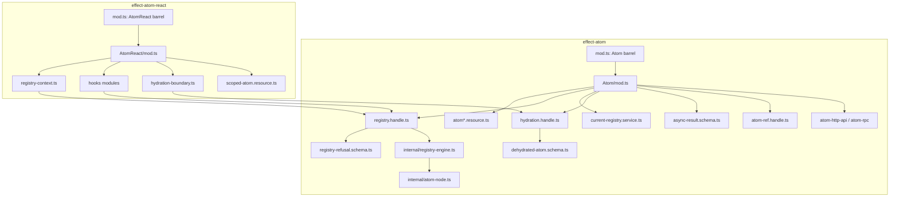
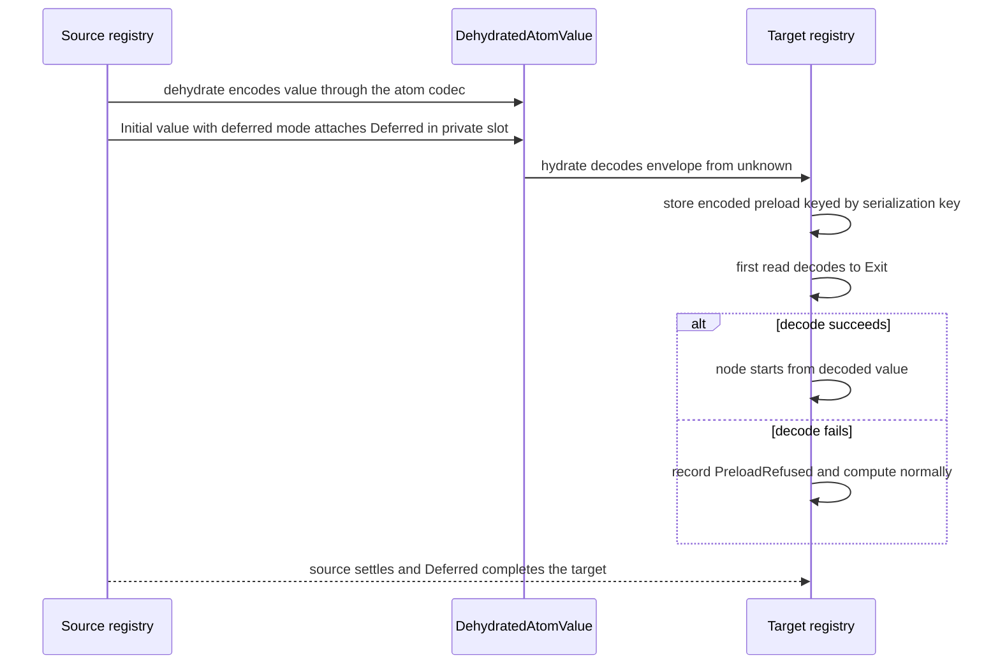

# packages/atom Compound-Packs Conformance - Plan

## Goal Capsule

- **Objective:** Consumers of `@systemfsoftware/effect-atom` and `@systemfsoftware/effect-atom-react` get a reactive toolkit that holds no process-global state, refuses malformed hydration payloads visibly, and follows the same `compound-packs` design law as every conformant sibling, with existing runtime behaviour intact.
- **Means:** Repair the verified violations in the current topology first, then decompose both packages into role-named modules behind one namespace barrel each, then add the schema-law, refusal, and type-surface layers (KD4, KTD1-KTD9).
- **Product Authority:** The two declared Compound Packs (`cell-architecture`, `boundary-testing`), the root `AGENTS.md` standing laws (use of `@systemfsoftware/effect-schema-vite`), and the precedent established by `docs/plans/2026-09-23-1600-refactor-discern-cell-architecture-plan.md`. This plan governs `packages/atom/effect-atom` and `packages/atom/effect-atom-react` together; other packages are not active scope.
- **Execution profile:** `ce-work` via `lfg`, one branch, one pull request; units land in U-ID dependency order as atomic commits.
- **Stop conditions:** Stop and report when an existing integration scenario can only pass by changing observable behaviour that no R-ID sanctions, or when a unit would need a TypeId literal changed (R3).
- **Open Blockers:** None.

---

## Product Contract

### Summary

Bring both packages under `packages/atom/` to full conformance with the declared Compound Packs by repairing verified review-gated violations, decomposing the core's 3,940-line `Atom.ts` into role-suffixed concept modules, and building the schema-law, refusal, and type-testing layers the package currently lacks. Both packages already pass oxlint and effect-tsgo with zero findings, so this work addresses architectural invariants and verification completeness rather than static lint debt.

### Problem Frame

The packages currently pass every mechanical gate (`oxlint --config oxlint.config.ts` reports 0 warnings and 0 errors across 303 rules; `pnpm lint:tsgo` reports 0 errors and 0 warnings on app and test projects). However, their internal architecture violates six load-bearing rules from the declared compound packs, and their test layout predates the repo's standing law.

Specifically: `Hydration.ts` and `Hooks.ts` maintain module-scope `WeakMap` registries that survive across test runs and split under dual-bundle installs; `HostTimer.ts` holds a module-level mutable clock reference; `Registry.ts` models a multi-instance runtime handle as a singleton `Context.Service`; the hydration rehydration seam is an untyped `{ encode, decode }` pair that silently swallows decode errors with a bare `catch { return }`; the react package exports a flat surface with no namespace barrel and masks a mis-typed Suspense throw helper with a `@ts-expect-error`; and neither package ships `src/schema-laws.test.ts`, `test-types/*.tst.ts`, or `*.refusal.test.ts`. Without these, the package remains unconformant under doctrine despite passing local linters.

### Key Decisions

- KD1. Break the public surface freely. (session-settled: user-directed — chosen over preserving the published surface: doctrine wins over fork drop-in compatibility; behaviour is preserved through the existing 15 integration suites while exported names and topology may move). Governs R1, R2, R4, R5, R7, R15, R16.
- KD2. Wire-format TypeId literals stay frozen. (session-settled: user-directed — chosen over migrating to Symbol.for: AGENTS.md AT5 governs the literals as wire format, and Effect v4 itself uses string literals in repos/effect/packages/effect/src/Fiber.ts:25). Governs R3.
- KD3. Acceptance bar is discern's bar plus the root standing law. (session-settled: user-directed — chosen over adding new mechanical gates: lint-clean under recommended, role-suffixed modules, pack architecture rules satisfied, effect-schema-vite laws, refusal suites, tstyche pins, and dispositioned upstream scenarios). Governs R8, R9, R10, R11, R12.
- KD4. Conform by repairing in place and decomposing. (session-settled: user-directed — chosen over either alone: local architectural repairs and role-suffixed decomposition are both in scope; repairs land first to isolate behaviour changes from structural moves). Governs R1, R4, R7, R16.
- KD5. Scope covers both packages in one unified artifact. A shared Registry handle contract binds core and react; neither can conform meaningfully without the other. Governs R1 through R12.
- KD6. Rules without subject matter in atom are explicitly inapplicable. Atom contains no Sandwich chains, Workflow deciders, or Context.Service ports; those six rules are documented as N/A rather than forced into reactive primitives. Governs R13.
- KD7. The Registry handle is separated from its environment binding. The Registry interface is a hot runtime handle with TypeId and Pipeable; Context.Service binding is provided on demand via a parameterised constructor rather than an ambient singleton. Governs R4, R5, R15.

### Destructive Review Record

Three structural assumptions surfaced before convergence:

1. **Assumption 1 (Module Map):** `Atom.ts` must be split along concept boundaries (`*.resource.ts`, `*.handle.ts`, `*.schema.ts`), assuming fine-grained role suffixes preserve internal cyclical type references cleanly without creating cyclic imports across files.
2. **Assumption 2 (Registry Handle Privacy):** Storing `initialValuesSet` and `atomPromiseMap` on the `Registry` handle instance requires expanding the `Registry` protocol record or using module-private symbol slots, assuming consumers never instantiate registries outside `Registry.make`.
3. **Assumption 3 (Hydration Codec Seam):** Replacing the untyped `{ encode, decode }` seam with an Effect Schema transformation requires all serializable atoms to provide an explicit `Schema.Schema<A, I>`, assuming serializable atom values never carry un-serializable transient instances (such as live fibers or open streams).

**Selected Lens:** Substitution (rotated from Inversion).
**Rationale:** Atom is currently structured as a monolithic procedural toolkit (`Atom.ts` + `Registry.ts`). Testing whether an alternate structural primitive (e.g. modeling `Registry` strictly as an Effect-native `Scope` manager rather than an imperative node dictionary) surfaces latent boundary leaks.

**Three Failures Under Substitution:**

1. _Registry Lifecycle Coupling:_ `Registry.ts` couples node eviction, scheduler management, and serializable cache into a single monolithic object. If `Registry` is replaced by an explicit resource specification, callers lose synchronous `registry.get(atom)` reads.
2. _Suspense Thenable Contract:_ In React 19+, throwing thenables is superseded by `React.use(thenable)`. Relying solely on `throwForSuspense` traps `effect-atom-react` in legacy Suspense semantics without an explicit contract test pinning thenable resolution.
3. _Hydration Silent Failure:_ `Registry.ts:517` silently swallows decoding errors in `catch { return }`. Substituting an Effect Schema codec causes previously silently-dropped malformed preloads to fail fast, which could break consumers relying on graceful partial hydration.

**Convergence Delta:**

- **Kept:** Nominal TypeId branding (`~effect-atom/...`), dual-function combinator style, existing 17 integration suites as behavior oracles.
- **Replaced:** Untyped hydration `{ encode, decode }` seam replaced with an explicit Schema transformation preserving parse issues on refusal; fixed `throwForSuspense(error: unknown)` to eliminate `@ts-expect-error`.
- **Added:** Paired negative refusal suites (`*.refusal.test.ts`), `src/schema-laws.test.ts` via `@systemfsoftware/effect-schema-vite`, TSTyche type-surface laws (`test-types/*.tst.ts`), and an executable contract test for React Suspense thenable throwing (`pin-dependency-semantics.md`).
- **Removed:** Module-level `WeakMap` registries in `Hydration.ts` and `Hooks.ts`, module `let hostClock` in `HostTimer.ts`, and static unconditional `layer: Layer.Layer<AtomRegistry>` in `Registry.ts`.

### Test Layer Placement & Admission Matrix

Admitted per `skill://test-layer-selection`. No isolated unit tests for internal helpers or private glue modules are permitted.

| Target File / Suffix                  | Admitted Test Kind                | Permitted Location                                   | Why / Invariant                                                                                                                           |
| :------------------------------------ | :-------------------------------- | :--------------------------------------------------- | :---------------------------------------------------------------------------------------------------------------------------------------- |
| `*.schema.ts` (Hydration, Result)     | Schema codec laws + Refusal tests | `src/schema-laws.test.ts`, `tests/*.refusal.test.ts` | `ruleOfSchemas`: bidirectional round-trip stability + explicit negative parse failure verification (`refusals-beside-generated-laws.md`). |
| `*.handle.ts` (`Registry`, `AtomRef`) | In-process integration tests      | `tests/*.integration.test.ts`                        | Sociable execution verifying state isolation across concurrent registries; zero mocks on internal glue (`no-mocks-on-internal-glue.md`).  |
| `*.resource.ts` (`Atom` constructors) | Law & property tests              | `tests/*.property.test.ts`                           | PBT verifying atom identity, dependency tracking, and combinator composition over arbitrary values.                                       |
| Technology Boundary (React Suspense)  | Contract test                     | `tests/suspense-thenable.contract.test.ts`           | Pins React thenable-throwing protocol semantics without relying on unverified prose comments (`pin-dependency-semantics.md`).             |
| Type Surface (`Atom`, `Registry`)     | TSTyche type laws                 | `test-types/*.tst.ts`                                | Pins exact type inference, variance constraints, and type-level rejection of invalid atom compositions.                                   |

### Requirements

#### State Encapsulation and Privacy

- R1. Eliminate every module-level mutable state site and every live instance created at module load across both packages. Governed by KD1, KD4. (pack: cell-architecture, handle-state-privacy.md)
  - `packages/atom/effect-atom/src/Hydration.ts:57`: the `pendingResults` `WeakMap`.
  - `packages/atom/effect-atom-react/src/Hooks.ts:34`: `initialValuesSet` (`WeakMap<Registry, WeakSet<Atom>>`).
  - `packages/atom/effect-atom-react/src/Hooks.ts:285`: `atomPromiseMap` (two `WeakMap` instances).
  - `packages/atom/effect-atom/src/internal/HostTimer.ts:20`: `let hostClock`.
  - `packages/atom/effect-atom/src/Atom.ts:2551`: the exported `runtime` factory singleton, whose closure holds a mutable `globalLayer` shared by every caller of `addGlobalLayer`.
  - `packages/atom/effect-atom/src/AtomRef.ts:155`: the `keyState` counter shared by every ref.
  - `packages/atom/effect-atom/src/Browser.ts:319`: the `searchParamState` coordinator (`Map` plus mutable generation and flag).
  - `packages/atom/effect-atom-react/src/RegistryContext.ts:50`: the default registry that `React.createContext` builds at import time and shares with every provider-less render in the process.

#### Hydration Boundary and Codec Safety

- R2. Replace the untyped hydration codec seam with an Effect Schema transformation. Governed by KD1.
  - The serializable atom contract must require an Effect Schema or bidirectional `Codec<Type, Encoded>`, replacing the untyped `{ readonly decode: (encoded: AnyValue) => AnyValue }` interface in `Registry.ts:417-421`. (pack: cell-architecture, decode-never-cast.md)
  - `Registry.ts:517-521` must not silently swallow decoding errors via `catch { return }`; decode failures on external payloads must surface on the typed error channel or return structured diagnostic issues. (pack: cell-architecture, decode-never-cast.md)

- R3. Preserve TypeId string literals as stable wire format. Governed by KD2.
  - `~effect/reactivity/Atom`, `~effect-atom/atom/Registry`, `~@effect/atom-react/ScopedAtom`, and `~effect/reactivity/DehydratedAtom` must remain unchanged across all renames and module splits, per `packages/atom/AGENTS.md` rule AT5. (pack: cell-architecture, handle-state-privacy.md)

#### Handle Duality and Service Boundaries

- R4. Restructure `Registry` from an ambient `Context.Service` to a runtime handle with on-demand layer synthesis. Governed by KD1, KD4, KD7.
  - `Registry` must be authored as a nominal `Pipeable` handle interface with TypeId branding; operations remain standalone dual functions in the module namespace. (pack: cell-architecture, resource-vs-handle-duality.md)
  - `AtomRegistry extends Context.Service` must not be exported as the primary identity; bind a registry handle into `Context` on demand through a parameterised constructor `Registry.layer(tag, options?)` accepting the caller's service tag. (pack: cell-architecture, resource-vs-handle-duality.md)
  - The static unconditional `export const layer: Layer.Layer<AtomRegistry>` in `Registry.ts:198` must be removed from the library's public surface. (pack: cell-architecture, service-and-layer-boundaries.md)

- R5. `AtomHttpApi` and `AtomRpc` depend on no process-global runtime: a service built without an explicit runtime factory owns a private one instead of falling back to the module-level `Atom.runtime` (`AtomHttpApi.ts:177`, `AtomRpc.ts:342`). Governed by KD1, KD7.

- R15. Every hot handle the packages publish (`Registry`, `AtomRef.ReadonlyRef`, `AtomRef.AtomRef`, `AtomRef.Collection`) is a minimal `Pipeable` protocol record branded with its TypeId, and its operations are standalone dual functions. Governed by KD1, KD7. (pack: cell-architecture, resource-vs-handle-duality.md)

#### React Binding Conformance

- R6. Remove the `@ts-expect-error` directive in `Hooks.ts:461`. Governed by KD3.
  - Change `throwForSuspense(error: Error): never` in `Hooks.ts:443` to accept `error: unknown`, eliminating the type mismatch when throwing a thenable `Promise<void>` for React Suspense.
  - Pin the React Suspense thenable-throwing protocol semantics in a dedicated contract test rather than documenting the invariant in a source comment. (pack: boundary-testing, pin-dependency-semantics.md)

- R7. Convert `packages/atom/effect-atom-react/src/index.ts` from flat `export * from` declarations into the single `AtomReact` namespace barrel R16 defines. Governed by KD1, KD4. (pack: cell-architecture, single-namespace-barrel.md)

- R16. Each package root exports exactly one namespace barrel (`Atom` for the core, `AtomReact` for the React binding) and one package entry point; every other public name is reached through that barrel. Governed by KD1, KD4. (pack: cell-architecture, single-namespace-barrel.md)

#### Verification Layers and Test Discipline

- R8. Auto-discover Schema exports and run bidirectional round-trip property tests using `@systemfsoftware/effect-schema-vite`. Governed by KD3.
  - Add `@systemfsoftware/effect-schema-vite` to `devDependencies` of both packages.
  - Add `src/schema-laws.test.ts` to both packages, asserting round-trip laws over all exported Schemas (Hydration payloads, Result schemas, AtomHttpApi schemas). (pack: boundary-testing, refusals-beside-generated-laws.md)

- R9. Ship negative refusal test suites beside every refined schema. Governed by KD3.
  - For every schema carrying a refinement (`Schema.filter`, bounds, non-empty checks), author a paired `tests/*.refusal.test.ts` asserting that invalid inputs fail decoding with structured parse issues. (pack: boundary-testing, refusals-beside-generated-laws.md)
  - Refined schemas tested under fast-check must attach explicit bounded `Arbitrary` generators to prevent rejection trap timeouts. (pack: boundary-testing, arbitrary-filter-floors.md)

- R10. Pin type inference and rejection laws using TSTyche. Governed by KD3.
  - Create `test-types/` directories in both packages with `*.tst.ts` suites asserting exact return types, pipeable inference, variance laws, and compilation rejections for invalid atom combinations.

- R11. Author boundary integration tests with paired acceptance and refusal conditions. Governed by KD3.
  - Browser and SSR integration tests in `effect-atom-react` must verify clean lifecycle teardown and prove both acceptance and refusal conditions for external event sources and timers. (pack: boundary-testing, real-system-oracles.md)
  - No internal boundary functions or driver seams may be verified with mocked implementations or synthetic stubs. (pack: boundary-testing, no-mocks-on-internal-glue.md)

- R12. Freeze upstream behaviour with a scenario disposition table. Governed by KD3.
  - Every scenario in the 15 existing integration test files must be mapped to exactly one disposition: retained integration test, property law, type test, or retired with an explicit architectural reason.

#### Scope Exclusions and Inapplicable Rules

- R13. Document inapplicable rules without forcing synthetic abstractions. Governed by KD6.
  - The following rules are classified as N/A due to the absence of cells and business deciders in a reactive toolkit: `sandwich-phase-order.md`, `pure-decision-workflows.md`, `four-channel-contracts.md`, `pipeline-composition.md`, `ports-separate-from-layers.md`, and `staged-lawful-builders.md`. No synthetic workflows or sandwich chains may be introduced to satisfy these rules nominally.

- R14. Ship a changeset under `REPO-R2`.
  - Both packages' build hashes change; author a `.changeset/` intent declaring the breaking public surface modifications and consumer-observable improvements.

### Key Flows

- F1. Registry Lifecycle and State Isolation
  - **Trigger:** Application or test initialises a reactive scope.
  - **Actors:** Calling application, `Registry` handle.
  - **Steps:** Caller invokes `Registry.make(options)`; a fresh `Registry` handle is returned carrying all internal state (node maps, listeners, promise caches) on instance properties; caller optionally synthesises a scoped `Layer` bound to an application-specific tag via `Registry.layer(tag)`.
  - **Outcome:** Zero module-level state is shared across concurrent registries or test runs; closing or disposing a registry frees all associated node resources deterministically.
  - **Covered by:** R1, R4.

- F2. Serialisation and Safe Hydration
  - **Trigger:** Server dehydrates atom state to JSON; client preloads it into a fresh registry.
  - **Actors:** Server renderer, client `Registry` handle, `Hydration` module.
  - **Steps:** Server calls `Hydration.dehydrate(registry)`; serializable values are encoded via their registered Effect Schemas into `DehydratedAtomValue` records; client receives raw JSON and passes it to `Hydration.hydrate(registry, payload)`; each envelope and value decodes through its Schema; valid entries populate preloaded values; malformed entries are recorded as `PreloadRefused` diagnostics on the registry instead of dropping silently.
  - **Outcome:** The serialization boundary is fully typed; every refused entry is readable from the registry with its schema issue, and the affected atom computes its own value (KTD5).
  - **Covered by:** R2, R3, R9.

- F3. React Suspense Integration
  - **Trigger:** React component reads an atom that has not completed its initial async resolution.
  - **Actors:** React rendering fiber, `useAtomValue` hook, `Registry` handle.
  - **Steps:** Component calls `useAtomValue(atom)`; hook checks readiness; finding the atom pending, it accesses the per-registry promise cache, obtains the resolution promise, and passes it to `throwForSuspense(promise)`; React catches the thenable and suspends the subtree; once the atom settles, the promise resolves and React re-renders.
  - **Outcome:** The Suspense protocol functions without `@ts-expect-error` directives; the promise cache lives on the registry handle rather than a module-level `WeakMap`.
  - **Covered by:** R1, R6.

### Acceptance Examples

- AE1. Module State Isolation Across Registries
  - **Covers:** R1
  - **Given:** Two distinct `Registry` instances created via `Registry.make()`.
  - **When:** Atoms are written, hydrated, and accessed in both registries concurrently in the same Node.js process.
  - **Then:** Neither registry reads, mutates, or evicts values from the other; no module-level `WeakMap` or `let` variable holds cross-instance state.

- AE2. Hydration Schema Refusal
  - **Covers:** R2, R9
  - **Given:** An atom registered with a schema that requires a positive integer.
  - **When:** `Hydration.hydrate` receives an external payload where the value is `-5` or a string `"invalid"`.
  - **Then:** Rehydration does not drop the key silently; it reports a structured decode failure preserving the parse issue.

- AE3. Clean React Suspense Throw
  - **Covers:** R6
  - **Given:** A React component reading an unresolved async atom.
  - **When:** `atomResultOrSuspend` executes.
  - **Then:** The thenable promise is thrown cleanly; `tsc --noEmit` and `pnpm lint` pass with zero directives and zero errors.

- AE4. Multiple Registries in Effect Context
  - **Covers:** R4
  - **Given:** An application requiring two distinct registries (e.g. primary and background worker).
  - **When:** Both registries are bound to distinct tags using `Registry.layer(TagA)` and `Registry.layer(TagB)`.
  - **Then:** Both layers merge into a single environment without tag collision; `Context.get` retrieves each handle independently.

- AE5. Schema Law Coverage
  - **Covers:** R8, R10
  - **Given:** Every exported schema in `packages/atom/effect-atom` and `packages/atom/effect-atom-react`.
  - **When:** `pnpm test` runs `src/schema-laws.test.ts` via `@systemfsoftware/effect-schema-vite`.
  - **Then:** 100% of exported schemas pass automated bidirectional round-trip property tests, and `test-types/*.tst.ts` passes TSTyche typecheck.

### Scope Boundaries

#### In Scope

- Eliminating all eight module-level mutable state sites R1 lists across `effect-atom` and `effect-atom-react`.
- Re-architecting `Registry` from an ambient `Context.Service` singleton to an explicit handle with parameterised layer synthesis.
- Converting the untyped hydration codec to an Effect Schema codec that rejects malformed external payloads explicitly.
- Decomposing the core package's mega-modules into role-suffixed concept modules (`*.resource.ts`, `*.handle.ts`, `*.schema.ts`).
- Authoring namespace barrels for `effect-atom-react`.
- Removing the `@ts-expect-error` in `Hooks.ts` and authoring an executable contract test for the Suspense protocol.
- Adding `@systemfsoftware/effect-schema-vite` schema laws, refusal suites, and TSTyche type-surface tests.
- Mapping all existing integration scenarios into a disposition table.
- Shipping a `.changeset/` entry for the breaking release.

#### Deferred for Later

- Creating new Oxlint rules in `@systemfsoftware/oxlint-plugin-cell-architecture` to mechanically enforce these review-gated patterns across other packages.
- Enrolling `packages/atom` in local or CI Stryker mutation gates (governed by AGENTS.md AT4).
- Retiring or pruning little-used public surfaces (e.g. `AtomHttpApi`, `AtomRpc`) — the fork's full breadth is retained.

#### Outside This Product's Identity

- Introducing artificial Sandwich cells or Workflow deciders into a reactive toolkit: atom is a state primitive library, not an application workflow engine.
- Migrating string-literal TypeIds (`~effect-atom/...`) to `Symbol.for`: the wire format is frozen by AT5 and conforms to Effect v4 lineage.
- Maintaining backward drop-in compatibility with upstream `@effect-atom/atom`: doctrine wins over fork parity.

### Success Criteria

1. `pnpm --filter @systemfsoftware/effect-atom lint` and `pnpm --filter @systemfsoftware/effect-atom-react lint` exit 0 with zero warnings, zero errors, and zero `@ts-expect-error` / `@ts-ignore` comments in `src/`.
2. `pnpm --filter @systemfsoftware/effect-atom typecheck` and `pnpm --filter @systemfsoftware/effect-atom-react typecheck` exit 0.
3. `pnpm --filter @systemfsoftware/effect-atom test` and `pnpm --filter @systemfsoftware/effect-atom-react test` exit 0 with all existing scenarios accounted for in the disposition table.
4. `src/schema-laws.test.ts` executes and passes via `@systemfsoftware/effect-schema-vite` in both packages.
5. `pnpm dts:check` and `pnpm api:check` pass in both packages with updated API reports.
6. A `.changeset/` file is present declaring the major breaking release.
7. Architectural review confirms no module-level mutable binding, mutable collection, or live registry instance exists in either package's `src/`.

---

## Planning Contract

**Product Contract preservation:** changed: R1 (site list extended from five to eight after research found `Atom.ts:2551`, `AtomRef.ts:155`, `Browser.ts:319`, and `RegistryContext.ts:50`), R4 bullet 2 (`Registry.layer(tag, options?)` signature), R5 (premise refuted: neither `AtomHttpApi.ts` nor `AtomRpc.ts` references `AtomRegistry`; re-scoped to their fallback onto the module-level `Atom.runtime`), R7 (now cites R16), R12 and KD1 (file count corrected from 17 to 15); added R15 and R16 for handle-protocol and single-barrel obligations the brainstorm's list missed. The objective of full applicable-rule conformance is unchanged.

### Key Technical Decisions

- KTD1. **Registry becomes a minimal handle record; its engine sits in a module-private symbol slot.** The public `Registry` interface carries only `[TypeId]`, the engine slot, and `Pipeable`; every operation (`get`, `set`, `modify`, `update`, `refresh`, `mount`, `subscribe`, `reset`, `dispose`, `getNodes`, `setSerializable`, `setInitialValue`) becomes a `dual` function in the registry module. The existing `RegistryImpl` engine survives as an internal object, so node bookkeeping in `AtomNode.ts` keeps its current shape. Covers R4, R15. (pack: cell-architecture, resource-vs-handle-duality.md; pack: cell-architecture, handle-state-privacy.md)
- KTD2. **One library tag, `Registry.Current`, names the registry evaluating an effect; no static layer exists.** Runtime atoms already inject the owning registry into each evaluation's services (`Atom.ts:2203`, `Atom.ts:2624`), and `Atom.get`/`Atom.set`-style conversions require it, so the tag stays as a fiber-local capability declared in a `*.service.ts` module under a new key; the handle's TypeId literal is untouched (R3). Applications bind a registry with `Registry.layer(tag, options?)`, a scoped layer that disposes the registry with its scope; passing `Registry.Current` gives the old behaviour, and distinct tags hold several registries at once (AE4). Rejected: deleting the tag, because every runtime atom and conversion would then need the registry threaded by hand. Covers R4.
- KTD3. **Per-registry storage lives inside the registry engine.** The engine carries keyed instance storage reached through one dual operation that returns the value for a key, creating it on first use. Callers outside the engine (React hook caches, the seeded-atoms set, the search-param coordinator) key it with module-constant symbols, which are immutable. Storage dies with the registry. Covers R1. (pack: cell-architecture, handle-state-privacy.md)
- KTD4. **Each registry resolves its clock and timer at construction.** `Registry.make` reads Effect's default `Clock` once when no `now` option is given and keeps it on the instance, and schedules timers through the same instance-held path; `internal/HostTimer.ts` loses its module `let`. Covers R1.
- KTD5. **Hydration refusals are recorded on the registry, never dropped.** The serializable seam carries a JSON codec built from the atom's schema and decodes to an `Exit`; a failed decode records a `PreloadRefused` value (key plus the schema issue) on the registry, readable through a dual accessor, and the atom then computes its value as if nothing was preloaded. The `DehydratedAtomValue` envelope becomes a Schema that `hydrate` decodes from `unknown`, and an in-process pending result travels on the entry in a non-enumerable module-private symbol slot that JSON serialization never sees. Encode failures during `dehydrate` are recorded the same way instead of throwing through `Option.getOrThrow` (`Atom.ts` serializable combinator). Covers R1, R2, AE2. (pack: cell-architecture, decode-never-cast.md)
- KTD6. **React needs an explicit registry.** `RegistryContext` has no default value; a hook rendered outside `RegistryProvider` (or an explicit context provider) fails with a defect that names `RegistryProvider`. Rejected: a lazily created global default, which is the same module-level instance under another name. Covers R1.
- KTD7. **No library-level runtime singleton.** `Atom.runtime` is deleted; callers build factories with `Atom.context()` at their own composition root. `AtomHttpApi.Service` and `AtomRpc.Service` create a private factory per service definition when no `runtime` option is given. Behaviour change: two services no longer share global layers unless handed the same factory. Covers R1, R5.
- KTD8. **Modules take a role suffix when one of the six roles fits; others are named for their concern.** Atom definitions and combinators are `*.resource.ts` (cold definitions a registry evaluates); `Registry` and refs are `*.handle.ts`; data contracts and codecs are `*.schema.ts`; `Registry.Current` is `*.service.ts`. React components and hooks, and the internal node engine, match no role and take concern names, which `service-and-layer-boundaries.md` §1 permits for implementation modules. Each package ships one entry (`.` → `src/mod.ts`) with one barrel (`Atom`, `AtomReact`); nested namespaces (`Atom.Registry`, `Atom.AsyncResult`, `Atom.Hydration`, `Atom.Ref`, `Atom.HttpApi`, `Atom.Rpc`) replace today's seven subpath entries. Covers R7, R16. (pack: cell-architecture, single-namespace-barrel.md; pack: cell-architecture, service-and-layer-boundaries.md)
- KTD9. **Verification layers copy the conformant siblings.** Both `vitest.config.ts` files add `inlineSchemaTests()` and include `src/**/*.test.ts`, mirroring `packages/effect-microsandbox/vitest.config.ts`; refusal suites are `effect-gherkin-spec` `scenarioOutline` tables in `tests/*.refusal.test.ts`, following `packages/effect-memfs/tests/learn-why-a-request-was-turned-down.integration.test.ts`; TSTyche uses `tstyche.json` with `rejectAnyType` and `rejectNeverType` plus a `test:types` script, mirroring `packages/trace-spec`. Root `gate:tasks` already runs `test:types`. Covers R8, R9, R10.
- KTD10. **The twelve `throw` sites stay defects.** They guard dual-dispatch misuse (`Atom.ts:1228-1263`, `AtomHttpApi.ts:85-142`, `AtomRpc.ts:95,412`), a disposed registry (`Registry.ts:679`), and builder exhaustiveness (`Result.ts` builder), all programmer errors with no domain refusal to type; `four-channel-contracts.md` has no cell here to apply to (R13). Only the serializable `getOrThrow` pair changes (KTD5).

### High-Level Technical Design

Module map after U9 and U10. Arrows point from importer to imported module; the internal engine stays behind the handle.

Hydration with a pending result, after U5:

### Test Layer Admission

Every test this plan adds passes `skill://test-layer-selection`: behaviour of the registry, hooks, and hydration is proven through public surfaces in in-process integration suites; schemas get generated laws plus refusal tables; the React Suspense dependency gets one contract test; types get TSTyche pins. No test targets `internal/` modules or private helpers, and no process is spawned. The Product Contract matrix row for `*.resource.ts` property tests is admitted but not required: this plan adds none, because no R-ID owns a combinator law that the retained integration scenarios do not already pin.

### Assumptions

- The run is `lfg`-driven, so the plan-time scoping confirmation was skipped; the R-ID changes in the preservation note are recorded here for review rather than confirmed live.
- `AtomReact.useAtomValue`-style member access satisfies the React hooks lint rules in `oxlint-config-recommended`; if not, the barrel keeps hook names and the finding is recorded in the PR.
- The search-param coordinator keyed per registry is acceptable: two registries on one page batch their own URL writes.
- Removing the React default registry is acceptable breakage under KD1; every existing React test already renders under a provider or will be given one (U3).

### Sequencing

Phase 1 repairs the current topology (U1-U8) so each behaviour change lands in a file reviewers already know. Phase 2 moves code without changing behaviour (U9, U10). Phase 3 adds verification layers against the final names (U11-U14). U7 lands before the other repairs that touch registry call sites, so hooks and hydration change call shape once.

---

## Implementation Units

| U-ID | Title                                           | Key files                                                                                 | Depends on |
| ---- | ----------------------------------------------- | ----------------------------------------------------------------------------------------- | ---------- |
| U1   | Registry owns its clock and timer               | `src/Registry.ts`, `src/internal/HostTimer.ts`                                            | none       |
| U7   | Registry handle protocol and `Registry.Current` | `src/Registry.ts`, `src/Atom.ts`, react `src/Hooks.ts`                                    | U1         |
| U2   | Registry-local storage for React hook state     | `src/Registry.ts`, react `src/Hooks.ts`                                                   | U7         |
| U3   | Explicit registry provision in React            | react `src/RegistryContext.ts`                                                            | U7         |
| U4   | Suspense throw fix and thenable contract test   | react `src/Hooks.ts`                                                                      | U2         |
| U5   | Typed hydration boundary                        | `src/Hydration.ts`, `src/Registry.ts`, `src/Atom.ts`                                      | U7         |
| U6   | Remove remaining module singletons              | `src/Atom.ts`, `src/AtomRef.ts`, `src/Browser.ts`, `src/AtomHttpApi.ts`, `src/AtomRpc.ts` | U2         |
| U8   | AtomRef handle protocol                         | `src/AtomRef.ts`, react `src/Hooks.ts`                                                    | U6         |
| U9   | Core decomposition and `Atom` barrel            | all core `src/`, `tsdown.config.ts`, `package.json`, api-extractor configs                | U1-U8      |
| U10  | React decomposition and `AtomReact` barrel      | all react `src/`, packaging configs                                                       | U9         |
| U11  | Schema laws                                     | both `vitest.config.ts`, `src/schema-laws.test.ts`                                        | U9, U10    |
| U12  | Refusal and boundary suites                     | `tests/*.refusal.test.ts`, react tests                                                    | U11        |
| U13  | TSTyche type-surface pins                       | `test-types/`, `tstyche.json`                                                             | U9, U10    |
| U14  | Disposition record, changeset, leaf docs        | `packages/atom/AGENTS.md`, READMEs, `.changeset/`                                         | U12, U13   |

All paths below are repo-relative; `core` means `packages/atom/effect-atom` and `react` means `packages/atom/effect-atom-react`.

### U1. Registry owns its clock and timer

**Goal:** Remove the module-level clock memo so each registry holds its own time source.
**Requirements:** R1 (site `HostTimer.ts:20`); KTD4.
**Dependencies:** none.
**Files:** `packages/atom/effect-atom/src/Registry.ts`, `packages/atom/effect-atom/src/internal/HostTimer.ts`, `packages/atom/effect-atom/tests/Registry.integration.test.ts`.
**Approach:**

1. Replace `hostNow` with a function that takes the clock the registry resolved at construction; `nowOrHost` (`Registry.ts:436`) resolves the default clock once per `make` call.
2. Keep `hostScheduleTimer` stateless; it already holds no module state.
   **Patterns to follow:** `RegistryMakeOptions` option fallbacks in `Registry.ts:117-125`.
   **Test scenarios:**

- A registry made without `now` reports increasing timestamps from Effect's default clock when an idle TTL expires.
- Two registries made with different `now` functions expire the same idle atom at their own times, and neither affects the other.
  **Verification:** `HostTimer.ts` has no `let`; existing TTL scenarios in `Registry.integration.test.ts` pass unchanged.

### U7. Registry handle protocol and `Registry.Current`

**Goal:** `Registry` becomes a minimal handle with dual operations, and the only way to put a registry in `Context` is `Registry.layer(tag, options?)`.
**Requirements:** R4, R15, AE4; KTD1, KTD2.
**Dependencies:** U1.
**Files:** `packages/atom/effect-atom/src/Registry.ts`, `packages/atom/effect-atom/src/Atom.ts`, `packages/atom/effect-atom/src/AtomNode.ts`, `packages/atom/effect-atom/src/Hydration.ts`, `packages/atom/effect-atom/src/Server.ts`, `packages/atom/effect-atom-react/src/Hooks.ts`, `packages/atom/effect-atom-react/src/RegistryContext.ts`, `packages/atom/effect-atom-react/src/ReactHydration.ts`, every test file that calls a registry method, `packages/atom/effect-atom/tests/Registry.integration.test.ts`.
**Approach:**

1. Split the public `Registry` interface from the engine: the handle record holds `[TypeId]`, a module-private engine slot, and `Pipeable`; `make` returns it.
2. Author each registry method as a `dual` function over the handle that forwards to the engine; migrate every call site in both packages and the tests.
3. Rename the `AtomRegistry` class to `Current` in its own service module with a key distinct from the TypeId literal; update the runtime service maps (`Atom.ts:2203`, `Atom.ts:2624`) and every `AtomRegistry` requirement in signatures.
4. Replace `layerOptions` and the static `layer` with `layer(tag, options?)`, a scoped layer that disposes the registry when its scope closes.
   **Execution note:** Migrate call sites mechanically first and run both packages' suites before touching behaviour; this unit should change no observable result.
   **Patterns to follow:** `packages/effect-microsandbox/src/running-vm.handle.ts` (TypeId, private symbol slot, `Prototype`).
   **Test scenarios:**

- Covers AE4. Two registries bound to two distinct tags through `Registry.layer` merge into one environment; each tag yields its own handle, and a write through one is invisible through the other.
- `Registry.layer(Registry.Current, { initialValues })` provides a registry whose preloaded atom reads the seeded value (replaces `Registry.integration.test.ts:783-789`).
- Closing the layer's scope disposes the registry: a later read through the captured handle fails with the disposed-registry defect.
- Every registry operation gives the same result called data-first and piped data-last.
  **Verification:** No `class AtomRegistry`, `layerOptions`, or static `layer` export remains; both packages' existing suites pass.

### U2. Registry-local storage for React hook state

**Goal:** The two `WeakMap` caches in the React hooks move into storage owned by each registry.
**Requirements:** R1 (sites `Hooks.ts:34`, `Hooks.ts:285`), AE1; KTD3.
**Dependencies:** U7.
**Files:** `packages/atom/effect-atom/src/Registry.ts`, `packages/atom/effect-atom-react/src/Hooks.ts`, `packages/atom/effect-atom/tests/Registry.integration.test.ts`, `packages/atom/effect-atom-react/tests/seeding-and-listening.integration.test.ts`.
**Approach:**

1. Add keyed instance storage to the engine and a dual accessor that returns the stored value for a key, creating it on first access; storage is cleared on dispose.
2. Re-key `initialValuesSetFor` and `promiseMapFor` on registry-local storage with module-constant symbol keys.
   **Test scenarios:**

- Covers AE1. Two registries seeded with different initial values for the same atom through `useAtomInitialValues` each read their own seed.
- Registry-local storage created under one key on one registry is absent on a second registry.
- After `dispose`, a fresh registry starts with empty storage for the same key.
  **Verification:** `Hooks.ts` declares no module-level `WeakMap`; React suites pass.

### U3. Explicit registry provision in React

**Goal:** No registry is created at import time.
**Requirements:** R1 (site `RegistryContext.ts:50`); KTD6.
**Dependencies:** U7.
**Files:** `packages/atom/effect-atom-react/src/RegistryContext.ts`, `packages/atom/effect-atom-react/src/Hooks.ts`, `packages/atom/effect-atom-react/src/ReactHydration.ts`, React test files that render without a provider, `packages/atom/effect-atom-react/tests/keeping-registry-alive.integration.test.ts`.
**Approach:**

1. Give `RegistryContext` an absent default and route every hook through one registry lookup that fails with a defect naming `RegistryProvider` when absent.
2. Wrap provider-less test renders in `RegistryProvider`; record each such change for the U14 disposition record.
   **Test scenarios:**

- A component using `useAtomValue` inside `RegistryProvider` renders the atom's value.
- The same component rendered with no provider raises an error whose message names `RegistryProvider`, caught by an error boundary.
- Two sibling providers keep independent values for the same atom.
  **Verification:** Importing the React package creates no registry; React suites pass.

### U4. Suspense throw fix and thenable contract test

**Goal:** Remove the only suppression directive and pin the React Suspense contract executably.
**Requirements:** R6, AE3.
**Dependencies:** U2.
**Files:** `packages/atom/effect-atom-react/src/Hooks.ts`, `packages/atom/effect-atom-react/tests/suspense-thenable.contract.test.ts`.
**Approach:** Type the throw helper's parameter as `unknown` and delete the directive at `Hooks.ts:461`. The contract test drives real React in the browser project: a component suspends on the cached promise, the fallback shows, and settling the atom renders the value. React's thenable semantics per react.dev `<Suspense>` reference.
**Test scenarios:**

- Covers AE3. A component reading an unresolved async atom through `useAtomSuspense` shows the Suspense fallback, then the value once the atom succeeds.
- Two components suspending on the same atom in one registry receive the same cached promise and both render after one settlement.
- An atom that fails renders the nearest error boundary instead of the value.
  **Verification:** `src/` contains no `@ts-expect-error` or `@ts-ignore`; the contract test passes in headless chromium.

### U5. Typed hydration boundary

**Goal:** Hydration decodes external payloads through Schema, records every refusal, and keeps pending results off module state.
**Requirements:** R1 (site `Hydration.ts:57`), R2, R3, AE2; KTD5.
**Dependencies:** U7.
**Files:** `packages/atom/effect-atom/src/Hydration.ts`, `packages/atom/effect-atom/src/Registry.ts`, `packages/atom/effect-atom/src/Atom.ts`, `packages/atom/effect-atom/tests/Hydration.integration.test.ts`.
**Approach:**

1. Define the `DehydratedAtomValue` envelope as a Schema whose tag field keeps the `'~effect/reactivity/DehydratedAtom'` literal (R3); `hydrate` decodes each input entry from `unknown` and records malformed entries as refusals.
2. Change the serializable seam to carry the JSON codec and decode to `Exit`; replace the bare `catch { return }` in `applyDecodedSerializable` (`Registry.ts:519`) with a recorded `PreloadRefused` plus normal computation.
3. Replace `pendingResults` with a non-enumerable module-private symbol slot on the entry.
4. Replace the `Option.getOrThrow` encode and decode in the serializable combinator with the same recorded-refusal path.
   **Test scenarios:**

- Covers AE2. Hydrating `-5` into an atom whose schema requires a positive integer records one `PreloadRefused` naming the key and the schema issue, and the atom computes its own value.
- Hydrating the string `"invalid"` into a numeric atom records a refusal; valid sibling entries in the same payload still preload.
- An entry missing `key` is refused at envelope decode and never reaches the registry.
- `JSON.stringify` of a dehydrated pending entry contains no Deferred data, and in-process hydration of the same entry still settles the target when the source succeeds.
- A round trip of a serializable `AsyncResult` atom through dehydrate, JSON, and hydrate yields an equal value.
  **Verification:** `Hydration.ts` has no module `WeakMap`; `Registry.ts` has no bare `catch`; hydration suites pass.

### U6. Remove remaining module singletons

**Goal:** No runtime factory, key counter, or URL coordinator lives at module scope.
**Requirements:** R1 (sites `Atom.ts:2551`, `AtomRef.ts:155`, `Browser.ts:319`), R5; KTD3, KTD7.
**Dependencies:** U2.
**Files:** `packages/atom/effect-atom/src/Atom.ts`, `packages/atom/effect-atom/src/AtomRef.ts`, `packages/atom/effect-atom/src/Browser.ts`, `packages/atom/effect-atom/src/AtomHttpApi.ts`, `packages/atom/effect-atom/src/AtomRpc.ts`, `packages/atom/effect-atom/tests/Atom.integration.test.ts`, `packages/atom/effect-atom/tests/AtomHttpApi.integration.test.ts`, `packages/atom/effect-atom/tests/AtomRpc.integration.test.ts`, `packages/atom/effect-atom/tests/AtomRef.integration.test.ts`.
**Approach:**

1. Delete `export const runtime`; migrate internal and test callers to a factory from `Atom.context()` created at the call site's root.
2. Have `AtomHttpApi.Service` and `AtomRpc.Service` build a private factory per service definition when no `runtime` option is given (`AtomHttpApi.ts:177`, `AtomRpc.ts:342`).
3. Give each ref an identity key that needs no shared counter.
4. Move the search-param coordinator into registry-local storage (U2 accessor).
   **Test scenarios:**

- Two runtime factories from `Atom.context()` with different global layers give atoms that each see only their own factory's layer.
- An `AtomHttpApi` service built without `runtime` resolves its endpoints; a second service definition does not observe the first one's added global layer.
- Two refs created in sequence have distinct keys and equal refs compare by value as before.
- Two `searchParam` atoms written in the same tick in one registry produce one URL update carrying both values (browser suite).
  **Verification:** No module-level `let`, mutable `Map`, counter, or singleton factory remains in `Atom.ts`, `AtomRef.ts`, or `Browser.ts`.

### U8. AtomRef handle protocol

**Goal:** Refs and collections become minimal handle records with dual operations.
**Requirements:** R15; KTD1 applied to refs.
**Dependencies:** U6.
**Files:** `packages/atom/effect-atom/src/AtomRef.ts`, `packages/atom/effect-atom-react/src/Hooks.ts`, `packages/atom/effect-atom/tests/AtomRef.integration.test.ts`, `packages/atom/effect-atom-react/tests/shared-values-read-write.integration.test.ts`.
**Approach:** Keep each ref's mutable value and subscriber list behind a module-private slot; expose `get`, `set`, `update`, `subscribe`, `map`, `prop`, and the collection operations as dual functions; migrate `useAtomRef`, `useAtomRefProp`, and `useAtomRefPropValue`.
**Test scenarios:**

- Setting a ref notifies each subscriber once with the new value.
- A `prop` ref of a nested field updates the parent value and notifies parent subscribers.
- A collection insert and remove notify collection subscribers, and a removed item's ref no longer notifies them.
- Each ref operation gives the same result called data-first and piped data-last.
  **Verification:** No public ref interface declares methods; AtomRef suites pass.

### U9. Core decomposition and `Atom` barrel

**Goal:** The core package ships one entry with one `Atom` barrel over role-named modules, with no behaviour change.
**Requirements:** R16, R3; KTD8.
**Dependencies:** U1, U2, U3, U4, U5, U6, U7, U8.
**Files:** `packages/atom/effect-atom/src/` (new `mod.ts`, `Atom/mod.ts`, and the module map in the High-Level Technical Design; delete `index.ts` and the flat modules they replace), `packages/atom/effect-atom/tsdown.config.ts`, `packages/atom/effect-atom/package.json`, `packages/atom/effect-atom/api-extractor*.json`, `packages/atom/effect-atom/tsconfig.api*.json`, `packages/atom/effect-atom/etc/*.api.md`, every core and React test import.
**Approach:**

1. Move code into the target modules by the `Atom.ts` section map; keep the `ResultValues.ts` cycle break as the leaf of the async-result schema module.
2. Collapse the eight tsdown entries to `mod` and the package exports to `.`; drop the per-entry api-extractor configs for one report.
3. Repoint every import in both packages and tests to the barrel.
   **Execution note:** Move code without editing it; run both suites after each moved group so a failure points at one move.
   **Patterns to follow:** `packages/effect-microsandbox/src/mod.ts`, `packages/effect-microsandbox/tsdown.config.ts`.
   **Test expectation:** none new -- a pure move; the retained suites are the oracle.
   **Verification:** `src/` holds only `mod.ts`, `Atom/mod.ts`, role-named modules, and `internal/`; build, `dts:check`, `api:check`, and `attw` pass; every TypeId literal is byte-identical to before.

### U10. React decomposition and `AtomReact` barrel

**Goal:** The React package ships one entry with one `AtomReact` barrel.
**Requirements:** R7, R16; KTD8.
**Dependencies:** U9.
**Files:** `packages/atom/effect-atom-react/src/` (new `mod.ts`, `AtomReact/mod.ts`, concern-named modules; delete `index.ts`), `packages/atom/effect-atom-react/tsdown.config.ts`, `packages/atom/effect-atom-react/package.json`, `packages/atom/effect-atom-react/api-extractor.json`, `packages/atom/effect-atom-react/etc/effect-atom-react.api.md`, React test imports.
**Approach:** Split `Hooks.ts` by concern (value hooks, ref hooks, Suspense) and move `ScopedAtom.ts` to a resource module; point tsdown at `mod`.
**Test expectation:** none new -- a pure move; the retained suites are the oracle.
**Verification:** React build, `dts:check`, `api:check`, `attw`, and both Vitest projects pass.

### U11. Schema laws

**Goal:** Every exported schema in both packages gets generated round-trip laws.
**Requirements:** R8, AE5; KTD9.
**Dependencies:** U9, U10.
**Files:** `packages/atom/effect-atom/vitest.config.ts`, `packages/atom/effect-atom-react/vitest.config.ts`, `packages/atom/effect-atom/src/schema-laws.test.ts`, `packages/atom/effect-atom-react/src/schema-laws.test.ts`, both `package.json` files.
**Approach:** Add `@systemfsoftware/effect-schema-vite` and `@systemfsoftware/effect-schema-law` as dev dependencies, register `inlineSchemaTests()`, and widen `include` to `src/**/*.test.ts`; in the React config add it to the node project only. Refined schemas get bounded arbitraries through annotations (R9 second bullet).
**Test scenarios:**

- Covers AE5. The generated file holds a law pair for the dehydrated-atom envelope and the registry refusal schema, and both pass.
- A refined field in the envelope generates values without fast-check rejection exhaustion.
  **Verification:** `pnpm --filter` `test` runs the generated laws in both packages.

### U12. Refusal and boundary suites

**Goal:** Every refined schema and every external boundary has an explicit refusal proof beside its acceptance proof.
**Requirements:** R9, R11; KTD9.
**Dependencies:** U11.
**Files:** `packages/atom/effect-atom/tests/hydration.refusal.test.ts`, `packages/atom/effect-atom-react/tests/window-focus-and-search-params.integration.test.ts`, existing React integration files for teardown.
**Approach:** Author the hydration refusal table as a `scenarioOutline` over malformed envelopes and values; add browser scenarios for the two external event sources (visibility and URL) proving acceptance, refusal, and listener teardown on unmount; timers are covered through registry TTL with real time.
**Test scenarios:**

- Envelope refusals: missing `key`, non-string `key`, missing tag literal, negative `dehydratedAt`; each is refused with a schema issue naming the field.
- Value refusals: wrong primitive type and refinement violation each record a `PreloadRefused`.
- A visibility change to `visible` refreshes an atom using `refreshOnWindowFocus`; a change to `hidden` does not.
- A malformed URL search parameter decodes to the atom's fallback rather than throwing.
- Unmounting the last subscriber removes the visibility and popstate listeners it added.
  **Verification:** The refusal suite passes; no test in either package uses `vi.fn` to replace a driver seam (`no-mocks-on-internal-glue.md`), with the SSR read counter at `ssr.integration.test.ts` retained as an observed input, not a stub.

### U13. TSTyche type-surface pins

**Goal:** Pin the public type surface both packages promise.
**Requirements:** R10; KTD9.
**Dependencies:** U9, U10.
**Files:** `packages/atom/effect-atom/tstyche.json`, `packages/atom/effect-atom/test-types/atom.tst.ts`, `packages/atom/effect-atom-react/tstyche.json`, `packages/atom/effect-atom-react/test-types/atom-react.tst.ts`, both `package.json` files, both `tsconfig.test.json` (include `test-types/`).
**Approach:** Add `tstyche` as a dev dependency and a `test:types` script mirroring `packages/trace-spec/package.json`.
**Test scenarios:**

- `Atom.make(0)` is a writable atom of `number`; `Atom.make(Effect.succeed(1))` reads as `AsyncResult<number, never>`.
- `Atom.get` requires `Atom.Registry.Current` in its environment.
- `Atom.Registry.layer(tag)` rejects a tag whose shape is not a registry.
- Every registry and ref operation accepts both data-first and data-last calls.
- `AtomReact.useAtomValue` with a selector returns the selector's type; `AtomReact.useAtomSet` rejects a read-only atom.
  **Verification:** `test:types` passes in both packages.

### U14. Disposition record, changeset, leaf docs

**Goal:** Reviewers can trace every existing scenario, rule applicability, and release note.
**Requirements:** R12, R13, R14.
**Dependencies:** U12, U13.
**Files:** `packages/atom/AGENTS.md`, `packages/atom/effect-atom/README.md`, `packages/atom/effect-atom-react/README.md`, `.changeset/<generated>.md`.
**Approach:**

1. Disposition rule: every scenario in the 15 integration files is retained as an integration test with imports repointed; the exceptions are the scenarios U3, U5, U6, and U7 rewrote, each listed with its reason in the pull request body.
2. Update AT1 (one entry, one API report) and the Verification block to add `lint:tsgo` and `test:types`; record the six inapplicable rules with R13's reason.
3. Update both READMEs' entry-point sections to the single barrel.
4. Run `pnpm change --bump major` for both packages with a consumer-facing body.
   **Test expectation:** none -- documentation and release metadata.
   **Verification:** The changeset guard passes; README examples name only exports that exist.

---

## Verification Contract

| Gate         | Command                                                                                                      | Applies to   |
| ------------ | ------------------------------------------------------------------------------------------------------------ | ------------ |
| Types        | `pnpm --filter @systemfsoftware/effect-atom typecheck` and the same for `@systemfsoftware/effect-atom-react` | every unit   |
| Lint         | `pnpm --filter <pkg> lint` and `pnpm --filter <pkg> lint:tsgo`                                               | every unit   |
| Behaviour    | `pnpm --filter <pkg> test` (React needs `pnpm exec playwright install chromium`, AT6)                        | every unit   |
| Type surface | `pnpm --filter <pkg> test:types`                                                                             | U13 onward   |
| Packaging    | `pnpm --filter <pkg> build` (runs `dts:check` and `api:check`) and `pnpm --filter <pkg> attw`                | U9, U10, U14 |
| Repository   | `pnpm check:local`                                                                                           | final        |
| CI           | `gh pr checks --watch --fail-fast`                                                                           | final        |

Mutation runs stay out of scope (REPO-D3, AT4).

---

## Definition of Done

- Every R-ID is implemented and every AE has a passing scenario.
- Every gate in the Verification Contract exits 0 after the last edit.
- Review confirms: no module-level mutable state or live instance in either `src/` (Success Criterion 7); every exported combinator and handle operation is `dual` over a `Pipeable` subject (`pipeable-dual-parity.md`); no `.port.ts` or `.layer.ts` file and no static `layer`/`*Live` export.
- Every TypeId literal is byte-identical to its value before this work.
- No abandoned-attempt code, commented-out blocks, or unused modules remain in the diff.
- The pull request body carries the scenario disposition exceptions (U14) and any residual review findings.
