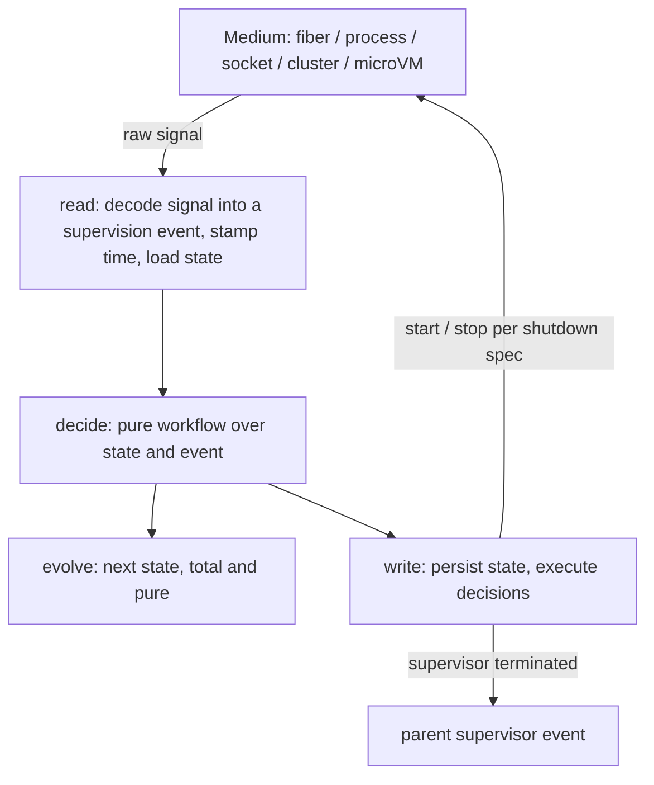
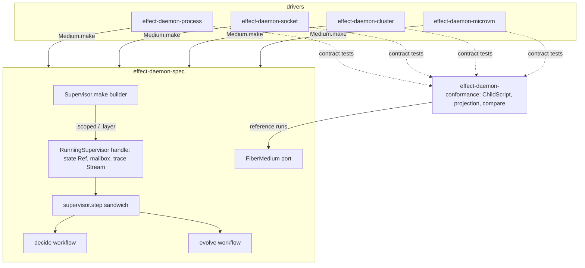

# Effect Daemon Spec Rewrite - Plan

## Goal Capsule

- **Objective:** An Effect-TS engineer can supervise children running on any execution medium with Erlang/OTP supervisor semantics that are proven against real processes, sockets, microVMs and cluster runners. An AI agent that writes a child, a medium, or supervision logic in the wrong place is rejected by a gate rather than by a reviewer.
- **Means:** A supervision kernel whose state is a pure fold over supervision events, driving five interchangeable media through one child protocol (Product Contract Key Decisions; KTD2, KTD3).
- **Authority:** Root `AGENTS.md` and `CONSTITUTION.md`, then the Product Contract, then the Key Technical Decisions, then unit text. The user owns product authority (2026-09-24): all five media and all four work areas are active scope, and adding new gates is authorized.
- **Stop conditions:** Stop and surface when a medium cannot meet the child-protocol floor (R15) against its real oracle, when a pack rule contradicts a KTD and U5's doctrine note cannot reconcile them, or when fixing a U4 violation would change another package's public behaviour.
- **Execution profile:** Deep, multi-package, one pull request (REPO-D2 allows one plan per PR). Gates land before the code they police: U1 and U2, then the U3 rules, then U6. After U8, units U10 through U13 run in parallel, and U14 can run beside them.
- **Finishes and ships:** The implementing run commits every unit, opens one pull request, and watches it until CI decides, the contract lane included (REPO-D1).
- **Open blockers:** None.

---

## Product Contract

### Summary

A ground-up rewrite of `@systemfsoftware/effect-daemon-spec` delivering OTP supervisor parity, where every restart, escalation and shutdown decision is a pure, mutation-tested fold over a closed set of supervision events. The same kernel supervises in-process fibers, OS child processes, managed sockets and services, cluster runners and entities, and microVM containers through one child protocol, and a pairwise contract suite proves the media interchangeable. The rewrite is done only when a real in-repo consumer runs on it and planted non-conformant code is rejected by the gates.

### Problem Frame

The package is named in `docs/plans/2026-08-07-001-refactor-extract-stryker-cli-plan.md` as the repo's first-party cell-taxonomy exemplar. Nothing outside `packages/effect-daemon-spec/` imports it, including `examples/inventory-fulfillment`.

Its restart semantics have never met a real exit. All 24 integration suites run in-process against `NoopLayer`, `LeaderLockFake`, `LockPrimitiveFakes`, `ReporterSpy` and `TestClock`. The failure every restart test reacts to is `Effect.fail` with a string inside one process (`tests/__fixtures__/TestUtils.ts`). None of them spawns a process, opens a socket or creates a directory. `compound-packs/boundary-testing/real-system-oracles.md` names "process supervisors against real local child processes" as the case its rule exists for.

The supervisor's central decision escapes measurement. Whether restart intensity is exceeded is decided in `src/internal/IntensityWindow.ts` (`exceedsRestarts`, `pruneTimestamps`), and `src/internal/Intensity.ts` reads `Clock.currentTimeMillis` inside the shell. `stryker.config.ts:26-33` mutates only `src/**/*.workflow.ts` at `break: 100`, so the one pure workflow (`chooseRestartStrategy`) is measured and the intensity logic is not. `docs/solutions/architecture-patterns/label-routed-rules-are-unfalsifiable.md:70` records this glob as the defect shape.

The documented surface does not exist. `README.md` shows `Daemon.supervised`, `RestartPolicy.exponential` and `LeaderLock.make`, none of which `src/mod.ts` exports or `etc/effect-daemon-spec.api.md` lists. `README.md` also claims the library is "built on top of Effect's supervision primitives"; the vendored Effect v4 tree has no `Supervisor` module and no occurrence of the word `supervisor` (`repos/effect/packages/effect/src/`).

`repos/effect/packages/effect/src/unstable/cluster/` provides distributed placement through `Sharding` and `Entity`, single ownership through `Singleton`, and runner liveness through `RunnerHealth`. It has no restart strategies, intensity or cooldown, and it requires runner storage, message storage and runner communication (`Sharding.ts:1-8`, `:253-254`). It is a medium a supervisor can drive, not a supervisor.

### Key Decisions

- **Supervision state is a pure fold over events, not an imperative loop.** Restart logic gets exactly one legal home the gates can police. (session-settled: user-approved — chosen over a protocol-first rewrite that keeps the imperative supervisor body and over building on `unstable/cluster` as the substrate: only the fold makes "no decisions outside the kernel" mechanically enforceable.) Governs R11, R12, R13, R14.
- **Locality is a substitution, not a product axis.** A child is an `Effect` whose medium stays open in `R` and is chosen once at the composition root. (session-settled: user-directed — chosen over treating in-process and distributed supervision as separate products: substituting what a child runs on is what Effect's `R` channel exists for.) Governs R15, R18.
- **Substitution is lossy, so the contract states what each medium owes.** A fiber reports a full `Cause`, a process reports an exit status and signal, and a remote runner's death is only inferred from a health timeout. The kernel requires exactly what the child protocol names. Governs R15, R16.
- **The child protocol floor is start, termination report, health, and owned shutdown.** (session-settled: user-directed — chosen over termination-only and over adding capacity/backpressure and medium-supplied identity: order and identity are supervisor-assigned.) Governs R15, R17.
- **All five media are first-class.** (session-settled: user-directed — chosen over a smaller proven set: the ambition is the whole medium space.) Governs R19–R25.
- **One plan owns kernel, contract, media and enforcement.** (session-settled: user-directed — chosen over a kernel-and-contract-first split that defers the media to later plans.) One plan may still deliver several packages; see R24.
- **Cluster is one medium, not the substrate; `LeaderLock` is retired.** Leader election becomes the cluster medium's single-owner child, so users without cluster lose leader election. (session-settled: user-approved — chosen over keeping `LeaderLock` beside `Singleton`: the cut is cheaper before the contract lands.) Governs R22, R35.
- **OTP supervisor parity is the semantics contract; everything beyond it is a declared extension.** Parity rows trace to the OTP `supervisor` reference; behaviour OTP lacks is listed separately so no one mistakes it for OTP. (session-settled: user-approved — chosen over including `gen_server`/`gen_statem`, application start phases, hot code upgrade and a global registry.) Governs R1–R10.
- **Intensity exhaustion terminates the supervisor, as in OTP; cool-down is opt-in.** The current package's retry-forever behaviour (`tests/never-surrender.integration.test.ts`) survives as an extension a supervisor must declare. Governs R3, R9.
- **A child counts as started only when its medium reports it ready.** OTP's start call returns only after the child has initialized; readiness is this contract's analogue. Governs R10.
- **The fold is a decide workflow plus a total evolve function.** `Workflow.make` refuses a success channel that is not a union of at least two branded `S.TaggedClass` variants, as recorded in `docs/solutions/architecture-patterns/workflow-success-channel-tagged-union.md:27-31`. A workflow returning a `(state, commands)` record therefore cannot compile (pack: cell-architecture, pure-decision-workflows.md). Governs R11, R29.



### Actors

- A1. Application engineer — declares supervision trees, restart policy, which medium each child runs on, and the composition root.
- A2. AI coding agent — writes children, new media and changes to supervision behaviour; the gates exist for this actor.
- A3. Supervision kernel — folds events into decisions and never sees what medium a child ran on.
- A4. Medium — an interpreter that starts, observes, probes and stops children, and reports what it saw as events.
- A5. In-repo consumer — a real program that supervises real children through the library.

### Requirements

**Supervision semantics: OTP parity**

Each row traces to the OTP `supervisor` reference at https://www.erlang.org/doc/apps/stdlib/supervisor.html and the design principles at https://www.erlang.org/doc/system/sup_princ.html.

| ID | Requirement                                                                                                                                                                                                                    | OTP counterpart                         |
| -- | ------------------------------------------------------------------------------------------------------------------------------------------------------------------------------------------------------------------------------ | --------------------------------------- |
| R1 | A supervisor applies `one_for_one` (default), `one_for_all` or `rest_for_one`, starts children in declared order and terminates them in reverse.                                                                               | `strategy`; start and termination order |
| R2 | A child's restart type is one of three: `permanent` is the default and always restarts; `transient` restarts only after abnormal termination; `temporary` never restarts, even when a sibling's restart terminated it.         | `restart`                               |
| R3 | More restarts than the declared intensity within the declared period terminates every child and then the supervisor; defaults are 1 restart per 5 seconds.                                                                     | `intensity`, `period`                   |
| R4 | A child's shutdown is one of three: `brutal` forces immediately; a timeout stops gracefully and forces when it elapses; `infinity` stops gracefully with no force. A child that is itself a supervisor defaults to `infinity`. | `shutdown`                              |
| R5 | A child can be marked significant, and a supervisor's auto-shutdown is `never` (default), `any_significant` or `all_significant`; a significant `permanent` child, or any significant child under `never`, is rejected.        | `significant`, `auto_shutdown`          |
| R6 | A supervisor can start and stop dynamic children of one declared kind up to a declared ceiling, assigning their identity and stopping them without ordering guarantees.                                                        | `simple_one_for_one`                    |
| R7 | A child can be a supervisor, and a supervisor's termination reaches its parent as an ordinary termination event.                                                                                                               | supervision tree                        |

**Supervision semantics: declared extensions**

- R8. A declared backoff schedule spaces consecutive restarts of the same child.
- R9. A supervisor can declare cool-down instead of termination on intensity exhaustion: it stops its children, waits the declared duration, then starts them again.
- R10. A child counts as started when its medium reports it ready; a start that is not ready within its declared start timeout is an abnormal termination.

**Kernel purity**

- R11. Every supervision decision — restart set, intensity, auto-shutdown, termination, shutdown order, backoff step, cool-down — is made by the fold and nowhere else.
- R12. Time enters the kernel only as a field on an event.
- R13. Supervision state lives only inside the running supervisor handle; no module-level state exists.
- R14. Each event is processed as one complete sandwich step: decode the event, decide, persist state and execute decisions.

**Child protocol and substitution contract**

- R15. A medium supplies start, a termination report, a readiness and liveness probe, and owned shutdown honouring R4's modes that cannot be interrupted part-way.
- R16. A medium declares what it can report about a termination and which `one_for_all` guarantee it can honour; the kernel assumes nothing beyond that declaration.
- R17. Child order and child identity come from the supervisor, never from the medium.
- R18. The same supervision tree runs on any medium without change; the medium is bound once at the composition root.

**Media**

- R19. In-process fiber medium, which is also the reference every other medium is compared against.
- R20. OS child-process medium, reporting exit status and signal.
- R21. Managed socket or service medium.
- R22. Cluster runner or entity medium, including single-owner children via `Singleton`.
- R23. Container or microVM medium built on `@systemfsoftware/effect-microsandbox`.
- R24. Media with platform or heavy dependencies ship as separate driver packages, and the core package carries no driver dependency (pack: cell-architecture, service-and-layer-boundaries.md).
- R25. Each non-fiber medium is proven against its real local oracle: acceptance and immediate refusal are both asserted, and teardown is proven to leave no process, handle, VM or registration behind (pack: boundary-testing, real-system-oracles.md).

**Forcing functions**

- R26. A supervision decision written outside the kernel's pure boundary fails a gate: new oxlint rules, landed as their own Evaluator commit and observed red before and green after.
- R27. A medium that omits a child-protocol obligation fails `pnpm --filter @systemfsoftware/effect-daemon-spec typecheck`.
- R28. A pairwise suite drives every medium through the same scripted child lifecycles and requires the fiber medium's event trace, within each medium's declared loss; it runs in the `test:contract` lane.
- R29. The Mutation workflow reaches every pure supervision decision and the evolve function at `break: 100`.
- R30. The kernel's laws are property-tested over event traces built by constructed generators, and every refined event or policy schema has refusal tests beside it (pack: boundary-testing, arbitrary-filter-floors.md; pack: boundary-testing, refusals-beside-generated-laws.md).
- R31. Behaviour the cluster and microsandbox media rely on is pinned by contract tests against the vendored library (pack: boundary-testing, pin-dependency-semantics.md).

**Public surface**

- R32. The package exports one namespace barrel; a supervision spec is built from an identity-bearing entry point and pure combinators, and acquired only through `.scoped` or `.layer` (pack: cell-architecture, single-namespace-barrel.md; pack: cell-architecture, staged-lawful-builders.md).
- R33. A running supervisor is a handle value, never a `Context.Service` (pack: cell-architecture, resource-vs-handle-duality.md).
- R34. The README documents only symbols listed in `etc/effect-daemon-spec.api.md`, confirmed at review.
- R35. `LeaderLock`, `LockPrimitive` and the free-floating `run.*` entry points are removed, and the release is a breaking major.

**Adoption**

- R36. A real in-repo consumer supervises real children through the library in its checked-in code.

### Key Flows

- F1. Child crash and restart
  - **Trigger:** A supervised child terminates abnormally on some medium.
  - **Actors:** A4, A3
  - **Steps:** The medium reports the termination as a decoded, time-stamped event; the fold selects the restart set by strategy and restart type and checks intensity; the write phase stops the affected siblings in reverse order per their shutdown specs and starts them again in declared order after backoff.
  - **Covered by:** R1, R2, R3, R4, R8, R11, R12, R14, R15
- F2. Intensity exhaustion
  - **Trigger:** A restart would exceed the supervisor's intensity.
  - **Actors:** A3
  - **Steps:** Without a declared cool-down, the supervisor stops all its children and terminates, and its parent handles that as a child termination; with one, it stops its children, waits, and starts them again.
  - **Covered by:** R3, R7, R9, R11
- F3. Tree shutdown
  - **Trigger:** The supervisor's scope closes, or auto-shutdown fires.
  - **Actors:** A3, A4
  - **Steps:** Children stop in reverse order per their shutdown specs, child supervisors finish their own subtrees first, and the scope finishes closing only after every medium confirms.
  - **Covered by:** R1, R4, R5, R15, R17, R25
- F4. An agent adds a medium
  - **Trigger:** A2 writes a new medium or edits an existing one.
  - **Actors:** A2
  - **Steps:** The protocol type refuses a missing obligation, the pairwise suite compares the medium's traces against the fiber medium, and its real-oracle suite must prove both poles and leak-free teardown.
  - **Covered by:** R25, R27, R28

### Acceptance Examples

- AE1. **Covers R1, R2, R17.**
  - **Given** a `rest_for_one` supervisor with `permanent` a, `permanent` b, `temporary` c, in that order.
  - **When** b terminates abnormally.
  - **Then** c then b are stopped, b is started again, c stays down, and a is untouched.
- AE2. **Covers R2, R3.**
  - **Given** a `transient` child.
  - **When** it terminates normally.
  - **Then** it is not restarted and the intensity count does not change.
- AE3. **Covers R3, R7.**
  - **Given** a supervisor with intensity 3 per 5 seconds and no cool-down, under a parent.
  - **When** its children fail 4 times within 5 seconds.
  - **Then** it stops all its children and terminates, and the parent receives exactly one child-termination event.
- AE4. **Covers R4, R7.**
  - **Given** a child supervisor with default shutdown and slow-stopping grandchildren.
  - **When** its parent shuts it down.
  - **Then** every grandchild completes its own shutdown before the child supervisor is reported stopped, and none is left running.
- AE5. **Covers R5.**
  - **Given** a supervisor with `any_significant` auto-shutdown and a `transient` significant child.
  - **When** that child terminates normally.
  - **Then** the supervisor shuts down all remaining children and terminates.
- AE6. **Covers R15, R16, R20.**
  - **Given** a child process killed by a signal.
  - **When** the process medium reports it.
  - **Then** the event carries the signal and exit status as reported, and no event claims a `Cause` the medium cannot supply.
- AE7. **Covers R16, R22.**
  - **Given** a `one_for_all` supervisor over a cluster medium whose shutdown is eventually consistent.
  - **When** a child fails.
  - **Then** the behaviour matches the guarantee the medium declared, and a medium declaring an atomic guarantee it cannot honour fails the pairwise suite.
- AE8. **Covers R10.**
  - **Given** a child whose medium never reports ready.
  - **When** its start timeout elapses.
  - **Then** the start counts as an abnormal termination against intensity.
- AE9. **Covers R26, R29.**
  - **Given** a planted change that decides intensity outside the kernel's pure boundary.
  - **When** the gates run.
  - **Then** a lint rule fails naming the location, and the Mutation workflow's reach excludes nothing that decides.
- AE10. **Covers R27, R28.**
  - **Given** a planted medium that reports ready without starting the child.
  - **When** the gates run.
  - **Then** the pairwise suite or the medium's real-oracle suite fails and names the medium.

### Test Layers

Every test this plan implies is admitted through the repo's test-layer gate; anything not listed here is refused.

| Test family                                                           | Layer                                                                                             | Location                                 | Covers             |
| --------------------------------------------------------------------- | ------------------------------------------------------------------------------------------------- | ---------------------------------------- | ------------------ |
| Decide workflow and evolve function                                   | Property tests only, over generated event traces                                                  | colocated `*.workflow.property.test.ts`  | R1–R12, R29, R30   |
| Event, decision and policy schemas                                    | Generated codec laws plus refusal tests                                                           | `schema-laws.test.ts` and refusal suites | R30                |
| Kernel shell: per-event sandwich, handle state                        | Sociable in-process integration through the fiber medium, no spawning                             | package `tests/`                         | R13, R14, R17, R18 |
| Each non-fiber medium against the fiber reference and its real oracle | Pairwise contract; the only lane allowed to start real processes, sockets, VMs or cluster runners | `*.contract.test.ts` in `test:contract`  | R25, R28           |
| Cluster and microsandbox semantics pins                               | Contract                                                                                          | `test:contract`                          | R31                |
| Gate rejections                                                       | RuleTester for the new lint rules; type tests for the child protocol                              | oxlint plugin package; `test-types/`     | R26, R27           |

Refused: README execution tests, because R34 is review-gated; unit tests on shell or interpreter helpers; process spawning outside `test:contract`; and end-to-end journeys, because R36's consumer carries its own boot check.

### Success Criteria

- Each planted violation in AE9 and AE10 is observed red before its gate lands and green after, and stays in the tree as an executable counterfactual (RuleTester invalid case, type test, or contract case).
- `pnpm check:local` and `api:check` pass with a regenerated `etc/effect-daemon-spec.api.md`.

### Scope Boundaries

**Deferred for later**

- Capacity and backpressure in the child protocol.
- A kernel that itself spans nodes; placement across nodes stays the cluster medium's job.

**Outside this product's identity**

- `gen_server` and `gen_statem` behaviours, application start phases, hot code upgrade, and a global name registry.
- Compatibility with the current public API.

### Dependencies / Assumptions

- `unstable/cluster` is unstable in effect `4.0.0-rc.117`; R31's pins are the tripwire when it moves.
- The microVM medium needs KVM on the CI runner. CI already boots microVMs on `ubuntu-latest` after granting KVM access (`.github/workflows/reusable-smoke.yml:21-25`); the contract lane needs the same step (U9).
- `test:contract` is defined (`turbo.json:81-99`) and run by `.github/workflows/reusable-contract.yml` through `pnpm check:contract`, but no package implements it today; the four driver lanes are its first suites. When it last had suites it was 85-92% of gate wall time (`docs/solutions/performance-issues/turbo-cache-never-warm.md:297`).
- The package is at 4.1.0, so R35 is a major bump through a changeset (REPO-R2).
- `compound-packs/cell-architecture/scoped-lifecycle-boundaries.md` forbids closing scopes inside inner sandwich phases but does not anticipate a component whose job is closing child scopes; U5 records that child lifetimes are sub-scopes forked from the supervisor's own scope and closed only by a medium's owned shutdown.
- Most pack gates are `review`; R26 and R27 are what turn the kernel-boundary and protocol rules into command gates.

### Review Assumptions

Reviewed under the Edge-First lens against the OTP `supervisor` reference. The three assumptions the contract rests on:

1. OTP parity (R1–R7) plus three declared extensions (R8–R10) is the complete semantics; nothing else a user of OTP supervisors relies on is missing.
2. Every decision in R11 can be computed from supervisor state plus one time-stamped event, with no effectful read inside the fold.
3. Real-medium proofs are contract tests paired against the fiber medium, not integration tests, and the fiber medium is faithful enough to serve as the reference.

### Sources / Research

- `packages/effect-daemon-spec/src/mod.ts`, `src/DaemonSpec.schema.ts`, `src/DaemonPolicy.schema.ts`, `src/internal/SupervisorBodyExecutor.ts`, `src/internal/choose-restart-strategy.workflow.ts`, `src/internal/Intensity.ts`, `src/internal/IntensityWindow.ts` — the current kernel and the logic outside mutation reach.
- `packages/effect-daemon-spec/stryker.config.ts:26-33` — mutation reach.
- `packages/effect-daemon-spec/tests/` and `tests/__fixtures__/` — the in-process test surface.
- `repos/effect/packages/effect/src/unstable/cluster/` — `Singleton.ts`, `Sharding.ts`, `RunnerHealth.ts`, `Entity.ts`.
- `turbo.json:81` — the `test:contract` lane.
- `docs/solutions/architecture-patterns/label-routed-rules-are-unfalsifiable.md`, `workflow-success-channel-tagged-union.md`, `grain-table-identifier-three-fates.md` — prior decisions constraining the kernel's shape and per-event cells.
- https://www.erlang.org/doc/apps/stdlib/supervisor.html and https://www.erlang.org/doc/system/sup_princ.html (OTP 29.1.1) — parity source for R1–R7.
- `compound-packs/cell-architecture/` and `compound-packs/boundary-testing/` — cited inline.

---

## Planning Contract

### Key Technical Decisions

- KTD1. **One core package, four driver packages, one conformance kit.** `@systemfsoftware/effect-daemon-spec` keeps the kernel, child protocol, spec builders, supervisor handle and fiber medium, depending only on `effect` (peer) and `@systemfsoftware/effect-cell-types`. The drivers are `effect-daemon-process`, `effect-daemon-socket`, `effect-daemon-cluster` and `effect-daemon-microvm`, and the published `effect-daemon-conformance` kit holds the pairwise suite. Each driver pins a different unstable or heavy dependency and owns its own oracle and mutation cell, so a churn in `effect/unstable/cluster` bumps only the cluster driver. The alternative was media as core submodules; it was rejected because it puts unstable cluster types into core's API report and makes microsandbox a dependency for users who only want processes (R24). Governs R19–R24, R28.
- KTD2. **The fold is two `Workflow.make` values: `decide(state, event) -> Decision` and `evolve(state, decision) -> State`.** Both declare `Schema.Never` errors, so `make-body-purity`, CC=1 and the success-channel law bind both halves. `SupervisorState` is a phase-tagged union (running, restarting, cooling down, shutting down, terminated), which gives evolve's success channel the two or more variants the law demands. A decision carries the ordered commands the write phase executes: start, stop with an R4 mode, arm a timer, reply, and terminate with a reason. Governs R11, R29.
- KTD3. **One mailbox per supervisor, one sandwich step per envelope.** Every medium report, timer, dynamic request and shutdown request enters one queue as a supervision event. A single fiber runs `Sandwich.named('supervisor.step')` for each envelope. Read takes the envelope, stamps `at` from `Clock` and loads state from the handle's `Ref`: time is gathered in read, as `compound-packs/cell-architecture/pure-decision-workflows.md:14` requires. Decide runs the workflow. Write sets `evolve(state, decision)` and executes the commands. Fold order is mailbox order, so concurrent media cannot make the fold nondeterministic. Dynamic start and stop requests are ordinary events that go through decide and evolve. Only their reply handle rides on the envelope outside the event schema, and a `Reply` command completes it. Governs R12–R14.
- KTD4. **Every child incarnation carries `(childId, generation)`, and every report and timer echoes both.** Decide returns a `Stale` decision, with no commands and unchanged state, for any event whose generation is not current. This closes the defect where `RaceForExit` returns an offset into a slice that has since shifted. Governs R15, R17.
- KTD5. **The kernel owns time only through timers.** Start deadlines (R10), backoff (R8), cool-down (R9) and liveness ticks are `ArmTimer` commands. The shell executes them with `Effect.sleep` forked into the supervisor scope, and they re-enter the mailbox as `TimerElapsed`. Escalating a shutdown timeout is not a kernel timer: the medium executes the declared R4 mode as part of its owned shutdown (R15). Governs R8–R10, R12.
- KTD6. **Termination reasons and restart counting follow OTP's `supervisor.erl`.** Reasons are `normal`, `shutdown` or `abnormal(report)`. `permanent` always restarts, `transient` restarts only on `abnormal`, and `temporary` never restarts and is removed from the child list when a sibling's restart stops it. Removing a non-permanent child is the only thing that triggers auto-shutdown. Intensity records one restart per restart action (a `one_for_all` group restart counts once), stamped with the terminating event's `at` before any backoff. A start that fails or misses its deadline records another restart. Exhaustion and auto-shutdown terminate the supervisor with reason `shutdown`. Source: OTP-29.0.2 `lib/stdlib/src/supervisor.erl` `do_restart`, `restart/2`, `add_restart` and `terminate_children`. Governs R2, R3, R5, R10.
- KTD7. **Death inferred from liveness is a fold rule, not a medium privilege.** The medium's liveness probe is single-shot. Each kernel-armed tick runs it once, and its result enters as an event. A per-child policy field sets how many consecutive failures decide an abnormal termination on every medium, which is how the cluster medium's inferred death enters. Governs R15, R16, R22.
- KTD8. **A medium exists only through `Medium.make`, whose parameter type requires every obligation, and the medium APIs return evidence types.** `start` returns `Started` evidence, and `stop(mode)` accepts only `Started`, runs uninterruptibly and returns `Stopped`. `Started` exposes the termination report, a readiness signal and a single-shot liveness probe. The readiness signal completes when the child is ready, and the kernel races it against its start-deadline timer (R10). The declaration states which termination facts the medium can report (cause, exit status, signal or inferred) and its group-stop guarantee (`atomic` or `eventual`). The kernel's behaviour does not branch on the declaration. The declaration bounds how the conformance kit projects and compares traces. Pack: `boundary-testing/staged-protocol-evidence.md`. Governs R10, R15, R16, R27.
- KTD9. **Children are declared against medium ports, and the composition root binds each port.** A child names its program and the medium port that interprets it. A port is a `Context.Service` that its driver provides as `layer(options)`, so a tree can mix media: in U14, a fiber-hosted HTTP server can sit beside a process-hosted database. R18's "without change" is about the tree: strategy, order and policy never mention a medium implementation. Governs R17, R18, R24.
- KTD10. **A supervisor is itself a fiber-medium child program.** Nesting is uniform, a child supervisor's default shutdown is `infinity`, and its termination reaches the parent through the fiber medium's report (R4, R7).
- KTD11. **The public surface is one namespace barrel with a staged, identity-first builder.** `src/mod.ts` exports only `export * as Supervisor from './Supervisor/mod.js'`. `Supervisor.make(name)` is followed by pipeable dual combinators for strategy, intensity, auto-shutdown and children, and ends in `.scoped` or `.layer`. The running supervisor is a handle value with a `TypeId` (pattern: `packages/effect-microsandbox/src/running-vm.handle.ts`), never a `Context.Service`. Governs R32, R33.
- KTD12. **One observation surface.** The handle exposes the kernel trace (decoded events and decisions) as a `Stream`, plus current child status. The write phase emits restart and exhaustion counters and a children gauge from decisions, and `Sandwich.named` already records each step's duration. The conformance kit compares traces from this same stream, so the surface users observe is the surface that is proven. Reporter hooks, health latches and the poll, stream and subscription worker shapes are removed: a child is an `Effect`, and a poll is `Effect.repeat` inside the child. Governs R28, R35.
- KTD13. **Mutation aims at every package's whole `src/**` at `break: 100`, and drivers mutate against their contract vitest config.** No rename can escape the aim (`docs/solutions/architecture-patterns/label-routed-rules-are-unfalsifiable.md:100`). A driver's shell is observable only against its oracle, so its real-oracle suites are what kill its mutants. Mutation stays CI-only (REPO-D3). Governs R29.
- KTD14. **Scripted children are driven over a control channel, not by sleeps.** A conformance scenario is a `ChildScript` of steps: become ready, exit normal, exit abnormal, ignore graceful stop, never become ready. The harness advances each step explicitly over a control channel that reaches the child, never the supervisor's mailbox, so no control step appears in the trace. The fiber medium uses a queue, and the process, socket and microVM fixtures read steps from stdin or a loopback socket. Real time appears only in scenarios about timeouts, with margins sized for CI. Traces compare order, kinds, child ids and generations, with each termination projected to the medium's declared reporting level. The alternative, sleep-sized steps on the live clock, was rejected because the order of the compared traces would depend on the scheduler (`docs/solutions/developer-experience/differential-targets-run-on-the-live-clock.md`). Governs R25, R28.
- KTD15. **Two new rules in `oxlint-plugin-cell-architecture`, wired into `@systemfsoftware/oxlint-config-recommended` at `error`, bind every package, not only this one.** `sandwich-shell-is-straight-line` refuses control flow inside functions passed to a Sandwich's `read` and `write`, and clock reads inside `write`. Control flow means the forms `make-body-purity` refuses (`if`, `switch`, ternaries, loops and value short-circuits) plus `Match` pipelines. `read` may read the clock, because read is where time is gathered. The rule follows same-file helpers the way `make-body-purity` does (`packages/oxlint-plugin/oxlint-plugin-dmmf-workflow/src/rules/ReferenceClassification.ts`). `medium-owns-no-recovery` refuses `Effect.retry`, `Effect.retryOrElse`, `Effect.forever` and `Stream.retry` inside functions passed to `Medium.make`, identified by import origin through `packages/oxlint-plugin/import-origin`. Waiting for readiness through `@systemfsoftware/effect-readiness` conditions is waiting, not recovery, and stays lawful. Both rules are keyed on call sites, never filenames. Messages follow OP-D1 (`packages/oxlint-plugin/AGENTS.md`). A decision in a helper in another file is not lint-visible; KTD13's whole-package aim is the backstop. Governs R26.
- KTD16. **Cluster oracle: `SingleRunner.layer` over a PGlite `SqlClient` plus `Crypto`, inside the contract test.** It declares reports `inferred` and group stop `eventual`, and single-owner children use `Singleton.make`. `SingleRunner` wires no-op runner health (`repos/effect/packages/effect/src/unstable/cluster/SingleRunner.ts:48-49`), so the medium's liveness probe is a direct call to the entity, never `RunnerHealth`. Governs R22, R31.
- KTD17. **Process and socket media reuse `@systemfsoftware/effect-readiness` conditions for readiness.** The process medium spawns through `ChildProcessSpawner` (`repos/effect/packages/effect/src/unstable/process/`). It maps graceful to SIGTERM and force to SIGKILL, and reports the exit code and signal. The socket medium supervises a long-lived connection: it dials, reports close or refusal with the OS error or close code, and stops by graceful close and then destroy. Governs R20, R21.
- KTD18. **R36's consumer is `examples/inventory-fulfillment`.** Its HTTP server becomes a `permanent` fiber-medium child of a supervisor in `src/main.ts`, and its existing integration test boots the app through the supervisor's `.layer`. It is the repo's reference application for the cell architecture and currently imports nothing from this package. Governs R36.
- KTD19. **Today's code is deleted, not migrated.** The 24 integration suites and their fixtures exercise the removed API. The `restartIndicesFor` law and the intensity-window semantics carry over as decide-workflow property laws. Governs R35.

### High-Level Technical Design

The sketch below is directional guidance, not an implementation specification.



```text
step(envelope):                      -- Sandwich.named('supervisor.step')
  read:   event = envelope.event with at = Clock.now; state = Ref.get(handle.state)
  decide: decision = decide(state, event)          -- Workflow, CC=1, Schema.Never
  write:  Ref.set(handle.state, evolve(state, decision))
          for command in decision.commands: execute(command)   -- per-tag handler, straight-line
execute(Start(id, gen))    = medium.start(program) in a sub-scope; fork report -> mailbox
execute(Stop(id, gen, m))  = medium.stop(started, m) uninterruptible; ChildStopped -> mailbox
execute(ArmTimer(k, d))    = fork sleep(d) then offer TimerElapsed(k)
```

### Sequencing and Assumptions

- Gates precede the code they police. U2's type tests and U3's rules land before U6 writes the shell, and U9's CI step lands before U13 needs a microVM.
- U3 is an Evaluator surface (root `AGENTS.md` Surface Classes). It lands in its own commit, red on its planted RuleTester cases, and U4 lands the repo-wide fixes in separate commits.
- The `supervisor.step` command class declares its instrumentation map, because `Sandwich` requires one (`packages/effect-cell-types/src/Workflow.ts:59-71`).
- Changesets (REPO-R2): `effect-daemon-spec` gets a major bump, each new publishable package gets its first release, and `oxlint-plugin-cell-architecture` and `oxlint-config-recommended` get minor bumps because they add rules at `error`.

### System-Wide Impact

- The recommended preset gains two `error` rules, so every package that extends it is re-linted, and U4 repairs whatever they find.
- The contract lane goes from zero suites to four, and CI wall time moves with it (Risks).
- `effect-daemon-spec` breaks every existing import. There are no in-repo importers today, so the break lands only on external users, through the major release.

### Risks

| Risk                                                                                             | Mitigation                                                                                                                         |
| ------------------------------------------------------------------------------------------------ | ---------------------------------------------------------------------------------------------------------------------------------- |
| `effect/unstable/cluster` changes shape in a future rc                                           | R31 pins in U12 fail first; only `effect-daemon-cluster` bumps                                                                     |
| Contract-lane wall time grows past the 45-minute job limit                                       | Drivers run as parallel turbo tasks; microVM scenarios share one booted image per suite; image digests pinned                      |
| `sandwich-shell-is-straight-line` flags legitimate branching in other packages' `read` phases    | U4 moves each branch into that cell's decide workflow; if a branch has no pure home, stop per the Goal Capsule                     |
| Driver mutation against contract configs exceeds the mutation cell's budget                      | Split the driver's cell per `docs/solutions/architecture-patterns/mutation-budgets-split-rule-packages-into-private-cells.md`      |
| Whole-`src` aim multiplies the core package's mutants past the mutation cell's wall-clock budget | U7 records the mutant count for the new aim; if the cell exceeds its budget, split per the same doc before relying on `break: 100` |
| Timeout scenarios flake on slow CI                                                               | Only timeout scenarios use real time (KTD14), with margins sized for CI                                                            |

### Planning Sources

- OTP-29.0.2 `lib/stdlib/src/supervisor.erl` (https://github.com/erlang/otp/blob/OTP-29.0.2/lib/stdlib/src/supervisor.erl): `do_restart`, `restart/2`, `add_restart`, `terminate_children`, `do_auto_shutdown`.
- `packages/effect-cell-types/src/Workflow.ts`, `Sandwich.ts`: decision-channel laws and handler records.
- `packages/oxlint-plugin/oxlint-plugin-dmmf-workflow/src/rules/make-body-purity.ts`: helper-following purity check to mirror.
- `packages/effect-microsandbox/src/running-vm.handle.ts`, `micro-vm.resource.ts`, `boot-sandbox.cell.ts`: handle, resource and cell shapes.
- `packages/effect-readiness/src/Readiness/mod.ts`: readiness conditions.
- `.github/workflows/reusable-contract.yml`, `reusable-smoke.yml`; `turbo.json:81-99`; `package.json` `check:contract`.
- `docs/solutions/architecture-patterns/gate-activation-is-plugin-presence.md`, `constraint-reaches-only-via-window-or-gate.md`, `docs/solutions/build-errors/stale-api-report-outlives-toolchain.md`.

---

## Implementation Units

| U-ID | Title                                       | Key files                                                                          | Depends on     |
| ---- | ------------------------------------------- | ---------------------------------------------------------------------------------- | -------------- |
| U1   | Kernel model and fold workflows             | `packages/effect-daemon-spec/src/*.schema.ts`, `*.workflow.ts`                     | none           |
| U2   | Child protocol and `Medium.make`            | `packages/effect-daemon-spec/src/medium*.ts`, `test-types/`                        | U1             |
| U3   | Kernel-boundary lint rules (Evaluator)      | `packages/oxlint-plugin/oxlint-plugin-cell-architecture/src/rules/`                | U2             |
| U4   | Repo-wide rule violations repaired          | packages flagged by U3                                                             | U3             |
| U5   | Scoped-lifecycle doctrine note              | `compound-packs/cell-architecture/scoped-lifecycle-boundaries.md`                  | none           |
| U6   | Kernel shell, builder, handle, fiber medium | `packages/effect-daemon-spec/src/`, `tests/`                                       | U1, U2, U3, U5 |
| U7   | Surface cutover and release intent          | `packages/effect-daemon-spec/src/mod.ts`, `README.md`, `stryker.config.ts`, `etc/` | U6             |
| U8   | Conformance kit                             | `packages/effect-daemon-conformance/`                                              | U6             |
| U9   | Contract lane grants KVM (Evaluator)        | `.github/workflows/reusable-contract.yml`                                          | none           |
| U10  | Process medium                              | `packages/effect-daemon-process/`                                                  | U8             |
| U11  | Socket medium                               | `packages/effect-daemon-socket/`                                                   | U8             |
| U12  | Cluster medium                              | `packages/effect-daemon-cluster/`                                                  | U8             |
| U13  | MicroVM medium                              | `packages/effect-daemon-microvm/`                                                  | U8, U9         |
| U14  | In-repo consumer                            | `examples/inventory-fulfillment/src/main.ts`, `tests/`                             | U7             |

### U1. Kernel model and fold workflows

- **Goal:** Every supervision decision is a pure, property-tested fold step.
- **Requirements:** R1–R12, R29, R30; KTD2, KTD4–KTD7.
- **Files:** `packages/effect-daemon-spec/src/` event, decision, state, command, policy and termination-report schemas (`*.schema.ts`); `decide-supervision.workflow.ts`; `evolve-supervisor.workflow.ts`; colocated `src/__tests__/*.workflow.property.test.ts` following `packages/effect-readiness/src/__tests__/`; refusal suites beside refined schemas.
- **Approach:** Model the closed event set: child started, ready, terminated, stopped, probe result, timer elapsed, dynamic start/stop requested, shutdown requested. Model the decision set, one variant per transition, each carrying ordered commands. Model the phase-tagged state. The policy schemas carry R1–R10's options with OTP defaults. Refined schemas (intensity, ceiling, durations) carry explicit arbitraries (`arbitrary-filter-floors.md`). Event traces are built by constructed generators over a small child-id alphabet, with generations near current so stale paths are reached.
- **Test scenarios:**
  - Restart set equals OTP's definition per strategy and restart type: stops in reverse declared order, starts in declared order, and temporary siblings removed rather than restarted (AE1).
  - `transient` exiting `normal` or `shutdown` leaves the intensity count unchanged and is not restarted (AE2).
  - Exhaustion happens exactly when restarts within the period exceed intensity. Without cool-down it stops all children and terminates with `shutdown` (AE3). With cool-down it stops, arms a cool-down timer, then restarts. Intensity 0 terminates on the first restart.
  - A `one_for_all` group restart records one restart.
  - Auto-shutdown follows OTP for `any_significant` and `all_significant` (AE5). Policies with a significant child under `never` or a significant `permanent` child are refused at decode.
  - A missed start deadline is an abnormal termination that counts against intensity (AE8).
  - A stale-generation event yields `Stale` with no commands and unchanged state.
  - Dynamic starts never exceed the ceiling, and ids are never reused.
  - Backoff delay grows per consecutive restart of the same child and never moves the intensity stamp.
- **Verification:** `pnpm --filter @systemfsoftware/effect-daemon-spec test` and `typecheck` pass; `make-body-purity` passes on both workflows.

### U2. Child protocol and `Medium.make`

- **Goal:** A medium that omits an obligation or skips an evidence stage does not compile.
- **Requirements:** R15–R17, R27; KTD8, KTD9.
- **Files:** `packages/effect-daemon-spec/src/` medium builder, declaration schema and evidence types; `test-types/medium.tst.ts`; `tstyche.json` and `tsconfig.tstyche.json` following `examples/inventory-fulfillment/`.
- **Approach:** `Medium.make` takes one options record whose type requires `start`, the declaration, and `Started`'s report, probe and uninterruptible `stop(mode)`. Medium ports are `Context.Service` tags keyed by program type. Evidence types follow `boundary-testing/staged-protocol-evidence.md`.
- **Test scenarios:**
  - Each missing obligation is not callable, and the tstyche assertion names the missing member.
  - `stop` is not callable with anything other than `Started` evidence.
  - A declaration without a reporting level or group-stop guarantee is refused.
- **Verification:** `pnpm --filter @systemfsoftware/effect-daemon-spec test:types` passes, and deleting any obligation from a valid call turns the type test red.

### U3. Kernel-boundary lint rules (Evaluator)

- **Goal:** A supervision decision written in a Sandwich shell phase or inside a medium fails `lint` with a location.
- **Requirements:** R26; KTD15.
- **Files:** `packages/oxlint-plugin/oxlint-plugin-cell-architecture/src/rules/sandwich-shell-is-straight-line.ts` plus `.config.ts` (CA1), `medium-owns-no-recovery.ts` plus `.config.ts`, `src/rules/__tests__/` for both, `src/index.ts`; `packages/oxlint-presets/oxlint-config-recommended/src/index.ts`.
- **Approach:** Mirror `make-body-purity`'s boundary collection and same-file helper following. Resolve `Sandwich` and `Medium` by import origin, never by name or path. Activate by presence in the preset, with no option switch (`gate-activation-is-plugin-presence.md`).
- **Execution note:** Commit the rules alone. Show the planted invalid cases red before the rule exists and green after. Record the repo-wide violation count this commit introduces; U4 fixes those.
- **Test scenarios:**
  - Invalid cases: an `if` on a restart count inside a `write` handler (AE9); a ternary inside `read`; a `Match` pipeline inside `write`; `Clock.currentTimeMillis` inside `write`; a same-file helper with a `switch` called from `write`; `Effect.retry` inside a `Medium.make` `start`.
  - Valid cases: a straight-line `write` handler; a `read` that gathers state and `Clock.currentTimeMillis`; a `Match.exhaustive` inside a `Workflow.make` body; a readiness wait through an `effect-readiness` condition inside `Medium.make`; `Effect.retry` in a child program outside `Medium.make`; a same-named `Medium.make` from another module.
- **Verification:** `pnpm --filter @systemfsoftware/oxlint-plugin-cell-architecture test` passes, and its mutation run passes CA2 in CI.

### U4. Repo-wide rule violations repaired

- **Goal:** `pnpm check:local` is green with the U3 rules at `error` everywhere.
- **Requirements:** R26; KTD15.
- **Files:** Whatever U3's lint run flags, for example `packages/effect-microsandbox/src/boot-sandbox.cell.ts` if its handlers branch.
- **Approach:** Move each flagged branch into its cell's decide workflow as a decision variant, never into a disable comment. A repair that would change a package's public behaviour triggers the Goal Capsule's stop condition.
- **Test scenarios:** None new. Each repaired package's existing suite must stay green.
- **Verification:** `pnpm check:local` exits 0.

### U5. Scoped-lifecycle doctrine note

- **Goal:** The pack names the lawful shape for a component whose job is closing child scopes.
- **Requirements:** R15; KTD5.
- **Files:** `compound-packs/cell-architecture/scoped-lifecycle-boundaries.md`.
- **Approach:** Add a section: a supervisor forks each child's scope from its own scope held on its handle, and only a medium's owned shutdown, executed in the write phase, closes that scope. Keep the pack's frontmatter and gate line.
- **Test scenarios:** None. This is a Doctrine surface.
- **Verification:** Review.

### U6. Kernel shell, builder, handle and fiber medium

- **Goal:** A supervision tree built from `Supervisor.make` runs on the fiber medium with the semantics U1 proves.
- **Requirements:** R13, R14, R17–R19, R32, R33; KTD3, KTD5, KTD9–KTD12.
- **Files:** `packages/effect-daemon-spec/src/Supervisor/mod.ts`, the builder resource, `running-supervisor.handle.ts`, `supervisor-step.cell.ts`, the fiber medium; `packages/effect-daemon-spec/tests/*.integration.test.ts`.
- **Approach:** Build the handle once per `.scoped` acquisition, holding the state `Ref`, the mailbox, the timer fibers and the trace `PubSub`. Any `Layer.provide` inside the handle goes through the `??=` cache binding (`grain-table-identifier-three-fates.md:44-45`). The fiber medium forks the child program into a sub-scope and reports its `Exit` projected to a termination reason. Readiness is a capability the child calls. Children that declare no readiness are ready on start.
- **Test scenarios:** Sociable, in-process, fiber medium, `TestClock`, no spawning.
  - AE1 end to end, asserting stop order and start order on the trace.
  - AE3 with a parent: exactly one termination event reaches the parent.
  - AE4: grandchildren finish their shutdown before the child supervisor reports stopped.
  - Scope close stops children in reverse order, and the scope finishes closing only after the last `ChildStopped`.
  - A dynamic start beyond the ceiling is refused through the reply, and a dynamic stop removes the child.
  - A report arriving after the supervisor restarted that child is ignored (KTD4).
- **Verification:** `pnpm --filter @systemfsoftware/effect-daemon-spec test`, `lint` and `typecheck` pass.

### U7. Surface cutover and release intent

- **Goal:** The published surface is only the new namespace, and every old path is gone.
- **Requirements:** R29, R32, R34, R35; KTD11, KTD13, KTD19.
- **Files:** `packages/effect-daemon-spec/src/mod.ts`; delete `src/internal/`, the old `src/*.ts`, `tests/__fixtures__/` and the 24 old suites; `stryker.config.ts`; `README.md`; `etc/effect-daemon-spec.api.md`; `AGENTS.md`; a new `.changeset/` intent.
- **Approach:** Set `mutate` to `src/**/*.ts` minus tests and declarations. Regenerate the API report with `api:update`. Rewrite the README from the regenerated report. Record the major bump with `pnpm change --bump major`.
- **Test scenarios:** None new.
- **Verification:** `pnpm --filter @systemfsoftware/effect-daemon-spec build` (runs `api:check`) and `pnpm check:local` pass. Every README symbol appears in `etc/effect-daemon-spec.api.md` at review.

### U8. Conformance kit

- **Goal:** Any medium author can prove their medium against the fiber reference with one call.
- **Requirements:** R28; KTD1, KTD12, KTD14.
- **Files:** `packages/effect-daemon-conformance/` (package scaffold following `packages/effect-readiness/`), `src/` for `ChildScript`, the scenario catalogue, trace projection and `compare`, plus colocated property tests.
- **Approach:** Each scenario is a supervision tree plus `ChildScript`s and a control-channel driver. A run returns the trace stream from U6's handle. `compare(reference, candidate, declaration)` projects both traces to the candidate's declared reporting level and group-stop guarantee, and returns a typed mismatch naming the scenario, the medium and the first diverging entry.
- **Test scenarios:** Property laws on the pure core only.
  - Projecting a trace to its own full reporting level is the identity.
  - `compare` accepts any trace against itself.
  - A trace that differs in one decision is rejected at exactly that index.
  - An `eventual` declaration never accepts an order violation on starts.
- **Verification:** `pnpm --filter @systemfsoftware/effect-daemon-conformance test` passes.

### U9. Contract lane grants KVM (Evaluator)

- **Goal:** The contract lane can boot microVMs.
- **Requirements:** R23, R25.
- **Files:** `.github/workflows/reusable-contract.yml`.
- **Approach:** Copy the KVM udev step from `.github/workflows/reusable-smoke.yml:21-25` in its own commit.
- **Test scenarios:** None.
- **Verification:** U13's contract suite boots a VM in CI.

### U10. Process medium

- **Goal:** OS child processes are supervised with exit status and signal reported as received.
- **Requirements:** R20, R24, R25, R28; KTD13, KTD17.
- **Files:** `packages/effect-daemon-process/` (scaffold following `packages/effect-readiness/`): the medium, `layer(options)`, `vitest.contract.config.ts`, `__tests__/*.contract.test.ts`, a `ChildScript` fixture program reading steps from stdin; `stryker.config.ts` using the contract config.
- **Test scenarios:** Contract lane only.
  - Every U8 scenario matches the fiber reference within the declaration.
  - A SIGKILLed child reports the signal and exit status, and no event claims a `Cause` (AE6).
  - `brutal`, `timeout` and `infinity` stops behave per R4 against a script that ignores SIGTERM.
  - A spawn of a missing binary is an immediate abnormal termination.
  - After scope close, no child pid is alive.
  - A planted medium that reports ready before spawning fails the suite and names the medium (AE10).
- **Verification:** `pnpm --filter @systemfsoftware/effect-daemon-process test:contract` passes locally and in CI.

### U11. Socket medium

- **Goal:** Long-lived connections are supervised, with close and refusal reported as received.
- **Requirements:** R21, R24, R25, R28; KTD17.
- **Files:** `packages/effect-daemon-socket/`, with the same layout as U10 and a loopback listener fixture driven by `ChildScript`.
- **Test scenarios:** Contract lane only.
  - Every U8 scenario matches the fiber reference within the declaration.
  - A dial to a closed loopback port is refused immediately.
  - A peer close is reported with its close information.
  - Graceful stop and forced destroy both leave no open handle.
- **Verification:** `pnpm --filter @systemfsoftware/effect-daemon-socket test:contract` passes locally and in CI.

### U12. Cluster medium

- **Goal:** Cluster entities and single-owner singletons are supervised with inferred death and eventual group stop.
- **Requirements:** R22, R24, R25, R28, R31, R35; KTD7, KTD16.
- **Files:** `packages/effect-daemon-cluster/`, with the same layout as U10; pins in `__tests__/cluster-semantics.contract.test.ts`.
- **Test scenarios:** Contract lane only.
  - Every U8 scenario matches the fiber reference within the `inferred` and `eventual` declaration (AE7).
  - A medium that claims `atomic` fails the `one_for_all` scenario.
  - Pins against the vendored library: a singleton `run` that fails becomes a defect; a `run` that completes is kept alive until its registration scope closes (`Singleton.ts` docs); closing the layer deregisters.
  - After scope close, no registration remains.
- **Verification:** `pnpm --filter @systemfsoftware/effect-daemon-cluster test:contract` passes locally and in CI.

### U13. MicroVM medium

- **Goal:** Workloads in microVMs are supervised through `@systemfsoftware/effect-microsandbox`.
- **Requirements:** R23, R24, R25, R28, R31; KTD1.
- **Files:** `packages/effect-daemon-microvm/`, with the same layout as U10, and a digest-pinned image carrying the `ChildScript` fixture.
- **Execution note:** Boot one VM in the contract lane before writing the medium.
- **Test scenarios:** Contract lane only.
  - Every U8 scenario matches the fiber reference within the declaration.
  - Pins on the microsandbox behaviours the medium relies on: boot readiness and teardown on scope close.
  - After scope close, no VM remains.
- **Verification:** `pnpm --filter @systemfsoftware/effect-daemon-microvm test:contract` passes in CI.

### U14. In-repo consumer

- **Goal:** The reference application runs its HTTP server under supervision in checked-in code.
- **Requirements:** R36; KTD18.
- **Files:** `examples/inventory-fulfillment/src/main.ts`, `package.json`, `tests/__fixtures__/server.fixture.ts`.
- **Approach:** `main.ts` launches a supervisor whose `permanent` child is the HTTP server, with the database layers provided at the root. The test fixture builds its server through the same supervisor `.layer`.
- **Test scenarios:** `examples/inventory-fulfillment/tests/inventory-fulfillment.integration.test.ts` passes when booted through the supervisor. No new suite.
- **Verification:** `pnpm --filter @systemfsoftware/example-inventory-fulfillment test` passes.

---

## Verification Contract

| Gate              | Command                                                               | Proves                                                                      |
| ----------------- | --------------------------------------------------------------------- | --------------------------------------------------------------------------- |
| Local gate        | `pnpm check:local`                                                    | Build, API reports, lint including U3's rules, typecheck, tests, type tests |
| Fold laws         | `pnpm --filter @systemfsoftware/effect-daemon-spec test`              | U1 laws and U6 shell behaviour                                              |
| Protocol refusals | `pnpm --filter @systemfsoftware/effect-daemon-spec test:types`        | R27                                                                         |
| Rule refusals     | `pnpm --filter @systemfsoftware/oxlint-plugin-cell-architecture test` | R26, AE9                                                                    |
| Real media        | `pnpm check:contract`, or `pnpm --filter <driver> test:contract`      | R25, R28, R31, AE6, AE7, AE10                                               |
| CI                | `gh pr checks --watch --fail-fast`                                    | Checks, contract lane, advisory Mutation workflow report at `break: 100`    |

Red-before and green-after evidence for U3's rules, U2's type tests and U10's planted medium goes in the pull request body.

---

## Definition of Done

- Every unit's verification passes, and `pnpm check:local` has been run after the last edit.
- CI is green on the pull request, including the contract lane with all four drivers.
- The Mutation workflow reports no surviving mutant in `effect-daemon-spec`.
- Each planted counterfactual (AE9, AE10, and the U2 type refusals) stays in the tree as a RuleTester invalid case, a type test or a contract case.
- No module, test or fixture from the old API remains, and no abandoned-attempt code is left in the diff.
- Changesets exist for every publishable package whose build hash changed.
