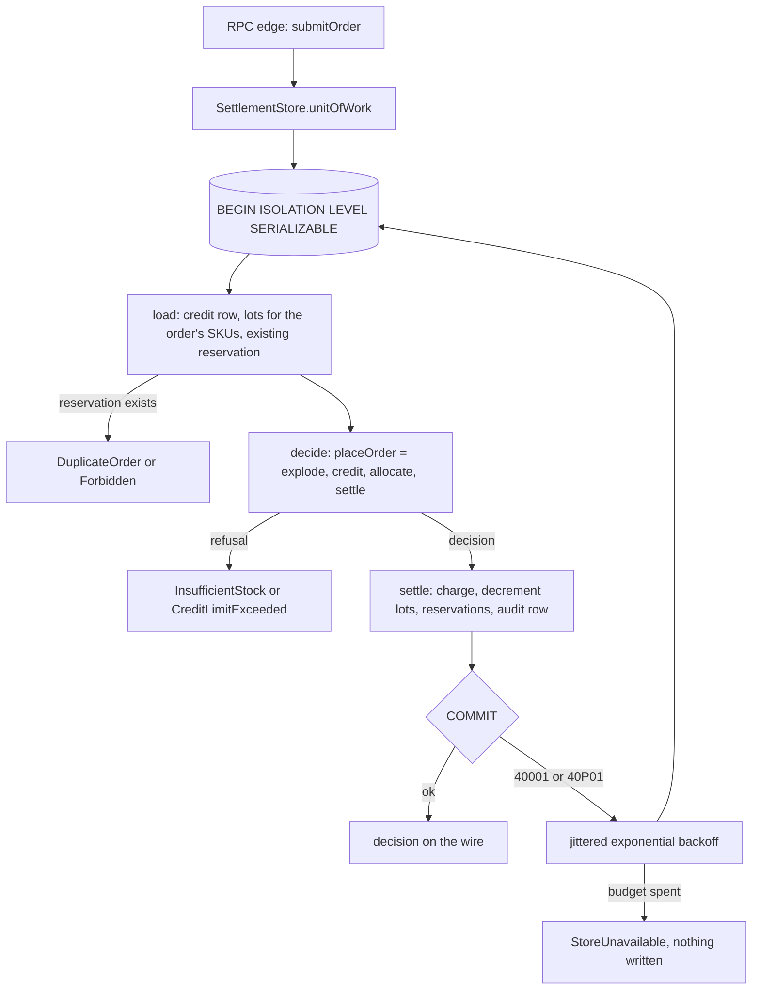

# Store Doctrine on a Serializable Unit of Work - Plan

## Goal Capsule

- **Objective:** Agents building cells stop shipping lost updates, write skew, mixed-up tenants, and in-memory fakes that behave differently from the real database. The rules they load say what a store must promise, the compiler rejects the most damaging mistake, and `examples/inventory-fulfillment` never over-grants credit or oversells stock when several app instances take orders at once.
- **Means:** Each use case runs as one sandwich inside a SERIALIZABLE unit of work that the store owns and re-runs whole on a serialization failure (KTD1, KTD2, KTD3).
- **Product authority:** This plan covers store doctrine and the example that demonstrates it. Rewriting the endgame handbook, reconciling rule ids, and the other pack repairs are not active scope.
- **Execution profile:** Work lands on branch `refresh-compound-packs` (PR #495). U1 and U2 share files and go to one implementer, in that order. U4 runs in parallel against the names in the Sequencing section. U6 and U7 follow U2. U5 runs when the PR is updated.
- **Stop conditions:** Stop and report if PGlite cannot raise a real SQLSTATE 40001 for the retry tests (Open Questions). Never fake the engine's error in an adapter or fixture.
- **Open blockers:** None.

---

## Product Contract

### Summary

Add store rules to the `cell-architecture` pack. They cover what a store promises, where coordination is needed, keeping tenants apart, and the default way to keep a read-decide-save correct under concurrency: run it inside one SERIALIZABLE unit of work owned by the store, and re-run the whole unit when Postgres reports a serialization failure. Add one rule to the `boundary-testing` pack: fake and real stores pass the same law suite. The compiler enforces that a decision's reads and saves happen inside a unit of work. `examples/inventory-fulfillment` adopts all of it and stops over-granting credit.

### Problem Frame

No repo rule governed stores. Neither pack mentioned lost updates, write skew, isolation levels, or locking, and none of the 55 rule files across the five oxlint plugins detects a write that depends on an earlier read.

A throwaway race against real Postgres (two to four app instances, separate pools) showed the damage in `examples/inventory-fulfillment`. With a credit limit of 100 and ten orders of 20 units split across two products, the example charged 120 in every run. Orders for different products touched different stock lots, so the stock-lot version check never fired, and the credit charge ran after the reservation transaction committed without checking anything. That is write skew.

The example on this branch now prevents it with store-issued proofs. A `credit_version` column and version-guarded `UPDATE`s back typed proofs, which travel through a four-cell pipeline, and an `OptimisticConflict` is retried at the RPC edge. It holds under the race, but it is the wrong pattern. Optimistic offline locking exists because "often a business transaction executes across a series of system transactions" and the database alone cannot then keep the data consistent (Fowler, Optimistic Offline Lock). In this example the read and the save run in one request, so one database transaction can cover both. At SERIALIZABLE the database checks every value the decision read, including values nobody thought to guard.

Prototypes measured the alternatives against Postgres 17: credit limit 100, 20-unit orders on two SKUs, one pool per app instance.

| Carrier                                                   | 2 inst / 10 orders | 4 / 20    | 8 / 40  | Result                                                                                 |
| --------------------------------------------------------- | ------------------ | --------- | ------- | -------------------------------------------------------------------------------------- |
| One sandwich, SERIALIZABLE, whole-unit retry              | 47 tx              | 112 tx    | 235 tx  | All invariants hold. Exactly 5 orders granted, the rest held for credit, none gave up. |
| Same code at READ COMMITTED (control)                     | 10 tx              | 20 tx     | 40 tx   | 200 charged against a limit of 100                                                     |
| SERIALIZABLE plus `SELECT ... FOR UPDATE` on the customer | 51 tx              | 120 tx    | 281 tx  | All hold; more re-runs, up to 3x slower                                                |
| Row locks under READ COMMITTED                            | 0 re-runs          | 0 re-runs | not run | Holds only because every row the decision read was locked                              |

Two further findings shape the design:

- Drizzle's `effect-postgres` driver does not join an ambient `PgClient.withTransaction`. A probe saw a different transaction id, and the insert survived the ambient rollback. So the store has to open the transaction itself.
- Drizzle wraps the Postgres error in an `EffectDrizzleQueryError` whose cause is an Effect `Cause`. A retry check that walks only `.cause` never finds SQLSTATE 40001. The first prototype run failed every losing order as `StoreUnavailable` for this reason.

### Key Decisions

- **Store rules live inside the `cell-architecture` pack.** (session-settled: user-directed — chosen over a new pack, constitutional rules, or a rewritten handbook chapter: the user picked it.) Governs R1–R17, R20–R22.
- **The law-suite rule goes in `boundary-testing`.** (session-settled: user-approved — chosen over putting it in `cell-architecture`: it governs how boundaries are tested, which is what `boundary-testing` covers.) Governs R18, R19.
- **A store's law suite is its declaration; prose is not.** A store states its laws by shipping the shared suite that its fake and real adapters both pass, so "is this port a store?" has a check instead of a reviewer's reading. Governs R1–R3, R18.
- **All five obligations are in scope.** (session-settled: user-directed — chosen over a smaller subset: the user wanted every obligation covered.) Governs R1–R19.
- **The compiler enforces that a decision's reads and saves run inside a unit of work; a written rule is not enough.** (session-settled: user-approved — chosen over one prose rule file or prose-only rules per obligation: only a check enforces the rule whose violation loses data.) Governs R8–R11.
- **The example becomes a working demonstration.** (session-settled: user-directed — chosen over leaving the example's migration as follow-up: the user wanted an example that actually runs.) Governs R24–R28.
- **New lint checks are proposals, not deliverables.** Under CONST-E9, whoever writes a rule never builds the check that grades it. Governs R21.

### Actors

- A1. Authoring agent: writes cells and store adapters, and loads pack rules through their `applies_when` triggers.
- A2. Reviewer: enforces the rules whose gate is `review`.
- A3. Type checker: enforces that a decision's reads and saves run inside a unit of work.
- A4. Lint gate owner: receives lint proposals and decides whether to build them.

### Requirements

**What a store is** (`cell-architecture`)

- R1. A pack rule defines a store as a port over shared state that outlives one interaction and ships a law suite (R18). The suite states the laws its operations obey, which operations are atomic, and the consistency its reads see.
- R2. A port with no law suite is not a store. The other store rules and the unit-of-work requirement do not apply to it.
- R3. Every store's suite covers at least these laws: read-after-write returns the value written, a repeated read changes nothing, and operations on different keys commute. A store with blind writes adds last-write-wins. A store with a unit of work adds the laws in R19.

**Running a read-decide-save as one unit** (`cell-architecture`)

- R4. A pack rule requires that when a save depends on an earlier read and protects a non-confluent invariant (see R12), the read, the decision, and the save run inside one unit of work that the store owns.
- R5. The default unit of work is a SERIALIZABLE transaction, and every writer of the tables the invariant spans runs at SERIALIZABLE, because Postgres checks only serializable transactions against each other (Postgres 17 §13.2.3, §13.4.1). The rule forbids adding `SELECT ... FOR UPDATE` inside a serializable unit to reduce contention.
- R6. When Postgres reports `serialization_failure` (40001) or `deadlock_detected` (40P01), the whole unit runs again from its first read, as Postgres 17 §13.5 requires. Other errors are not retried. Irreversible effects happen only after commit, unless they are idempotent.
- R7. Every read that the decision depends on happens inside the unit of work, including existence checks such as "has this order id already been reserved". A read that happens before the unit opens is outside serialization and can go stale.

**The compiler enforces the unit of work** (`cell-architecture`, demonstrated in the example)

- R8. A store's decision-serving reads and saves carry a `UnitOfWork` service in their Effect requirements, and only the store's `unitOfWork` removes it. Three cases fail to typecheck: running the sandwich outside `unitOfWork`, calling a save outside one, and saving after the unit that did the read has closed.
- R9. If code outside the store provides a `UnitOfWork` value by hand, the adapter dies before it reads or writes anything. No store operation runs outside a real transaction.
- R10. Once the configured retry budget is spent, the unit fails with `StoreUnavailable`, carrying the last serialization failure as its cause, and has written nothing. The budget and backoff come from configuration at the composition root, never from literals in cell or adapter code.
- R11. A tstyche test in the adopting package proves the three refusals in R8 and that the accepted form compiles.

**Coordinating only where needed** (`cell-architecture`)

- R12. A pack rule says when a save needs no coordination: the invariant is confluent, as with appends under fresh ids. It also says when a save does need coordination: claiming a unique value, or keeping a lower bound while values decrease. A confluent save does not need a unit of work.
- R13. The rule ranks mechanisms by which writers they bind, from strongest to weakest:
  - a database constraint (binds every writer)
  - a single-statement conditional write, when the invariant lives on one row
  - a SERIALIZABLE unit of work with whole-unit retry (binds every serializable writer)
  - row locks under READ COMMITTED (correct only if every row the decision reads is locked, and nothing checks that)
  - an in-process lock (one process only)
  - a saga (no isolation)

  The rule also states that a saga does not fix read-then-write races.
- R14. Store boundaries follow the scope of each invariant. If an invariant spans two stores, merge them or run both inside one unit of work on one port. Never enforce it by chaining two saves with `Cell.andThen`.

**Keeping tenants apart** (`cell-architecture`)

- R15. A pack rule requires building the tenant-bound store at the request edge from the authenticated caller and providing it in that request's context. Store operations never take a tenant id argument.
- R16. The rule states that a generic type parameter on a store tag does not separate tenants. It cites TypeScript's erasure of unused type parameters and Effect's string-keyed `Context` (`repos/effect/packages/effect/src/Context.ts`).
- R17. Work that touches two tenants receives two store handles as values.

**Law contract tests** (`boundary-testing`)

- R18. A `boundary-testing` rule requires the in-memory fake and the real store to pass one shared suite of the laws the store declares (R3). The suite runs in-process as a `*.integration.test.ts` outside `src/`, with the real adapter on an embedded engine such as PGlite. It uses fixed histories, not generated inputs, and spawns no processes.
- R19. A store with a unit of work adds three laws:
  - A unit of work that fails writes nothing, on both adapters.
  - On the in-memory fake, concurrent units of work for one customer leave the state that some serial order would leave.
  - On the real adapter, a serialization failure raised by the engine re-runs the whole unit, and the unit commits once.

  PGlite has one session and cannot race, so real concurrency is proven against a Postgres server by the race script (R28), not by the suite.

**Enforcement and packaging**

- R20. Each new rule file names its real gate: `type-checker` for the rule R8 enforces, `review` for the others. No rule claims a lint gate that does not exist.
- R21. Lint candidates are filed as proposals to the owners of `packages/oxlint-plugin/*` and are not built in this work. The candidates:
  - a store operation that takes a tenant id
  - an in-process lock used as the only guard
  - `UnitOfWork` provided outside a store adapter
  - a store transaction opened without SERIALIZABLE isolation
- R22. The new rule files use the frontmatter the packs already use (`title`, `applies_when`, `tags`), and each pack README lists them. Every review-gated rule ships a wrong/right example pair, and every failure a rule claims cites its source.
- R23. This work adds four kinds of test, all in the example, and no unit tests of store or retry internals:
  - the tstyche unit-of-work test (R11)
  - the settlement law suite (R18, R19)
  - router-level integration tests for serialization retry and budget exhaustion (AE2)
  - router-level integration tests for duplicate submission (AE8)

**The example demonstrates the doctrine** (`examples/inventory-fulfillment`)

- R24. The order's reads commit in one SERIALIZABLE unit of work with the writes that depend on them. The reads are the customer's credit row, the lots of the order's SKUs, and any existing reservation for the order id. The writes are the credit charge, the stock decrements, the reservation rows, and the settle audit row.
- R25. No in-process lock, version column, or proof guards the example. The unit of work's isolation level is its concurrency control, backed by a `CHECK (quantity_on_hand >= 0)` constraint on stock lots.
- R26. The settlement store ships a Postgres adapter and an in-memory adapter that pass one law suite (R18, R19).
- R27. The fulfillment use case is one sandwich over one composed workflow. The RPC edge runs it through the store's `unitOfWork` and has no retry loop of its own.
- R28. The example ships a race script that runs concurrent orders from several app instances against a real Postgres and reports each invariant: the credit limit, one charge per grant, no stock lost or double-sold, reserved units equal to charged credit, and one audit row per committed order.

### Acceptance Examples

- AE1. **Covers R8, R11.**
  - **Given:** the place-order cell and the settlement store.
  - **When:** the author runs the cell without `unitOfWork`, calls `settle` outside one, or calls `settle` inside a second `unitOfWork` after the first one did the `load`.
  - **Then:** typecheck fails and names `UnitOfWork` as the missing service. Running the cell inside `unitOfWork` compiles.
- AE2. **Covers R6, R10.**
  - **Given:** an order whose first unit-of-work attempt fails at settle with SQLSTATE 40001 raised by the engine.
  - **When:** the order is submitted.
  - **Then:** the whole unit runs again from `load`, and the order commits once: one charge, one set of reservations, one audit row. If every attempt fails, the order fails with `StoreUnavailable` and nothing is written.
- AE3. **Covers R7.**
  - **Given:** a use case that checks whether an order id was already reserved.
  - **When:** the check runs before the unit of work opens.
  - **Then:** review rejects it because the read the decision depends on is outside serialization.
- AE4. **Covers R12.** Given an audit event appended under a fresh id, when the author wraps that append alone in a unit of work, then review rejects it as coordination on a confluent save.
- AE5. **Covers R15, R16.** Given a store declared as `LedgerStoreFor<Tenant>`, when review applies the tenant rule, then it is rejected. The accepted form builds the ledger from the authenticated user at the request edge.
- AE6. **Covers R18, R19.** Given an in-memory fake whose `unitOfWork` lets two units run at once, when the suite runs two concurrent orders for one customer with room for only one, then both are granted and the suite fails for that fake.
- AE7. **Covers R24, R25, R28.**
  - **Given:** a customer with a credit limit of 100, and 20-unit orders on two SKUs submitted from 2, 4, and 8 app instances against Postgres 17.
  - **When:** all orders race.
  - **Then:** exactly 5 orders are granted, the outstanding balance never exceeds 100, and stock, charges, reservations, and audit rows reconcile.
- AE8. **Covers R7, R24.**
  - **Given:** an order id that already has a reservation.
  - **When:** its owner submits it again, or another caller submits it.
  - **Then:** the owner gets `DuplicateOrder` and the other caller gets `Forbidden`, and nothing is written. Two concurrent submissions of one order id never both reserve. The loser gets `DuplicateOrder` after its re-run, or `StoreUnavailable` in the corner cases where Postgres reports a unique violation instead of a serialization failure (Postgres 17 §13.5).

### Scope Boundaries

- Rewriting the endgame handbook chapters.
- Mapping endgame rule ids onto `CONST-*` ids, and the `CELL-*` prefix collision.
- Repairing existing pack defects: the `cell-architecture` README lists 10 of its 14 rules, `pipeable-dual-parity.md` links a skill that does not exist, and `arbitrary-filter-floors.md` names the wrong mechanism.
- Building lint rules (R21 covers proposals only).
- Any change to `packages/effect-cell-types`.
- Shipping row locks under READ COMMITTED as a carrier in the example. R13 ranks it, and its race numbers are recorded above, but the example does not implement it.

#### Deferred to Follow-Up Work

- A CI job that runs the race script against a Postgres service container. The job is an evaluator surface, so under CONST-E9 it lands in its own commit. This work files it as an issue (U5).
- A measured answer to hot-customer contention beyond the retry budget, if a real workload ever exhausts it.

### Dependencies / Assumptions

- `examples/inventory-fulfillment` is `private: true` and the packs are not packages, so no publishable package's build hash changes and REPO-R2 needs no changeset.
- The `credit_version` migration, `SettlementProof.ts`, and the four-cell settlement pipeline exist only on this branch; `origin/main` has none of them. They are deleted outright, with no down-migration.
- Postgres 17 §13.2.3: a SERIALIZABLE transaction commits only if some serial order of the concurrent serializable transactions gives the same result. Index scans take finer predicate locks than sequential scans. The example's reads use `user.id`, `stock_lots_sku_idx`, and `reservations_order_id_idx`.
- Postgres 17 §13.5: retry the complete transaction, "including all logic that decides which SQL to issue and/or which values to use". Unique violations can still appear in corner cases, and retrying them needs more care because they can be persistent.
- The theory this doctrine relies on was checked against primary sources: Berenson et al. 1995 (P4 lost update, A5B write skew), Harris et al. 2005 (atomicity does not compose), Bailis et al. 2014 (invariant confluence), Hellerstein and Alvaro (CALM), and Kung and Robinson 1981 (optimistic concurrency, via lecture notes).

### Open Questions

- **Resolved during planning:** nothing sets SERIALIZABLE by default. Drizzle's effect session issues `set transaction isolation level <level>` only when the caller passes `isolationLevel` (`drizzle-orm` `pg-core/effect/session.js`, lines 107–135); without it, Postgres opens the transaction at READ COMMITTED. `@effect/sql-pglite` holds its single permit from `BEGIN` to commit or rollback (`repos/effect/packages/sql/pglite/src/PgliteClient.ts`, lines 215–224), so units on PGlite run one at a time. The PGlite suite therefore proves atomicity and the retry path, never isolation. Isolation is proven by the race script (R28).
- **Deferred to implementation:** whether PGlite runs PL/pgSQL, which the retry seam uses to raise a real 40001 (U2). If it does not, the Goal Capsule's stop condition applies.

---

## Planning Contract

### Key Technical Decisions

- KTD1. **The default carrier is a SERIALIZABLE unit of work, re-run whole on 40001 or 40P01.** The database then checks every value the decision read, so correctness does not depend on the author guarding the right columns. Row locks under READ COMMITTED needed no re-runs, but they are correct only if every row the decision reads is locked, and nothing checks that: one missed read reopens write skew with no failing test. Every candidate was built and raced, so the choice was a judgment on measured results and needed no Bake-off. Governs R4–R7, R24, R25.
- KTD2. **The unit of work lives on the store port, not in `effect-cell-types`.** Drizzle does not join an ambient `PgClient.withTransaction`, so only the adapter that owns the Drizzle session can open the transaction its queries run in. A `UnitOfWork` service in `R` gives the compile-time guarantee with no library change. The port exposes an effect combinator, never a transaction handle. Governs R8–R11.
- KTD3. **One sandwich per use case: the four decisions compose inside one `Workflow.make`.** A workflow is one business transaction, and its I/O belongs as high in the call stack as possible (Wlaschin, "Six approaches to dependency injection"). Atomicity does not compose across cells, and a unit of work wrapped around four sandwiches would bring back the proof design's threading. CONST-B3 requires the shell to call the core directly, and the wiki's composite-operations ruling requires a composite route to be one operation whose decision composes several decisions. `Workflow.andThen` stays deleted (`docs/plans/2026-09-23-0601-refactor-cell-schema-edges-plan.md`, KTD10); the composed `decide` calls the four existing decisions directly. Governs R27.
- KTD4. **Retries live inside `unitOfWork`, with a budget taken from configuration.** The adapter re-runs the whole effect under an exponential, jittered schedule. The defaults come from the prototype, where they were never exhausted: 30 attempts, starting at 2 ms. `Settlement.Drizzle.layer` takes the budget as a layer spec, per the pack's parameterized-constructor rule. `PgRuntime` reads it through Effect `Config` with those defaults. `FulfillmentConfig` loses its only two fields and is deleted. Governs R6, R10.
- KTD5. **The retry check finds the SQLSTATE through Effect `Cause` reasons as well as `.cause` fields, and retries only 40001 and 40P01.** Drizzle wraps the Postgres error in `EffectDrizzleQueryError`, whose cause is a `Cause`. A `CHECK` or unique violation surfaces as `StoreUnavailable` and is not retried, because §13.5 warns those can be persistent. Governs R6.
- KTD6. **The in-memory adapter serializes units with a single-permit semaphore and a staged copy of the state.** Running units one at a time is trivially serializable. A failed unit discards its staged copy, so it writes nothing. The fake never raises serialization failures, and no fixture pretends it does. Governs R19, R26.
- KTD7. **A hand-provided `UnitOfWork` dies inside the adapter; the type does not make it unforgeable.** Each adapter's `load` and `settle` also need a module-private handle that only its own `unitOfWork` provides, so a forged marker fails before any query runs. A module-private symbol brand would close the gap at compile time, but it would bring back the minting module the proofs needed. The remaining gap goes to a lint proposal (R21). Governs R9.
- KTD8. **A spent budget is `StoreUnavailable`; `ConflictRollback` and `ReservationLog.appendRollback` are deleted.** A spent budget means the store could not serve the order right now, which is what `StoreUnavailable` already tells the caller, and its cause names the serialization failure. Under a serializable unit, a failed order has written nothing, so there is no rollback to record. Each attempt appears as its own span, so traces show every re-run. Governs R10, R27.
- KTD9. **The duplicate-order check moves inside the unit of work.** `load` reads any existing reservation for the order id, and the cell refuses `DuplicateOrder` or `Forbidden` from that read. The edge's check outside the transaction is deleted. The settle audit row's primary key, `<orderId>:audit`, is a database constraint that refuses a second settle for one order id whatever the isolation level, so AE8's "never both reserve" has a backstop (R13). Governs R7, R24.
- KTD10. **The race script is promoted from the prototype into the example and runs only at SERIALIZABLE.** The adapter has no isolation option, so production code cannot select READ COMMITTED. The READ COMMITTED control result stays recorded in the Problem Frame and the pack rule, not as a runnable mode. Governs R28.

### High-Level Technical Design

The settlement port after the rebuild:

| Operation            | Requires                                    | Returns                                                                     | Law                                                                                |
| -------------------- | ------------------------------------------- | --------------------------------------------------------------------------- | ---------------------------------------------------------------------------------- |
| `load(key)`          | `UnitOfWork`                                | credit account, tier, lots for the order's SKUs, existing reservation owner | a repeated load changes nothing                                                    |
| `settle(plan)`       | `UnitOfWork`                                | nothing                                                                     | read-after-write; different customers commute                                      |
| `unitOfWork(effect)` | whatever `effect` needs except `UnitOfWork` | the effect's result, or `StoreUnavailable`                                  | a failed unit writes nothing; a serialization failure re-runs the whole unit (R19) |

`settle` takes the order and customer ids, the charge (absent for held or backordered decisions), the reservation events, and the audit payload. Its writes are plain, with no guards and no version columns (R25).

### Alternatives Considered

- **Keep the store-issued proofs.** They hold under the race, but they need a version column, proofs threaded through four cells, a typed conflict, and an edge retry loop, and they guard only the columns their author chose. Rejected by KTD1.
- **A store-collapsed span: one store operation per use case that runs the pure decision as a callback inside its transaction.** It needs no `UnitOfWork` type and has no forged-marker gap. It moves read, decide, and write out of the cell into each adapter, and every new use case needs a new store operation. One generic `unitOfWork` keeps the sandwich in the cell and serves every use case.
- **Row locks under READ COMMITTED.** Measured at 0 re-runs, but correct only when every row the decision reads is locked. Ranked in R13 and not implemented.
- **`SELECT ... FOR UPDATE` inside the serializable unit.** Measured at more re-runs and up to 3x the wall time, and §13.2.3 advises removing such locks under SERIALIZABLE. Forbidden by R5.
- **An `Atomic` port or `modify` combinator in `effect-cell-types`.** Its optimistic carrier needed 45 and 190 re-runs, and the library change is out of scope.
- **One `sql.withTransaction` at the edge.** Drizzle's queries do not join it (KTD2).

### Risks

| Risk                                                                                                                           | Mitigation                                                                                                                    |
| ------------------------------------------------------------------------------------------------------------------------------ | ----------------------------------------------------------------------------------------------------------------------------- |
| A later change drops SERIALIZABLE isolation, and CI still passes because PGlite has one session and cannot race.               | The race script in the README (R28), a lint proposal (R21), and the CI race job issue (U5).                                   |
| A writer at a lower isolation level touches the same tables, and Postgres does not check it against serializable transactions. | R5 requires every writer of those tables to be serializable. The example's only writer to them is the settlement store.       |
| One busy customer costs about 5 transactions per order across 8 instances.                                                     | The retry budget comes from configuration (KTD4). A workload that exhausts it gets a measured follow-up, not a guessed lock.  |
| Sequential scans take relation-level predicate locks and cause false conflicts.                                                | `load` reads through `user.id`, `stock_lots_sku_idx`, and `reservations_order_id_idx`, and only the lots of the order's SKUs. |
| Adding the `CHECK` constraint fails on an existing database that holds a negative `quantity_on_hand`.                          | The README upgrade section gives the query that finds such rows before migrating.                                             |
| A hand-provided `UnitOfWork` compiles.                                                                                         | The adapter dies before any query (KTD7), and a lint proposal is filed (R21).                                                 |

### Sequencing

U1 and U2 go to one implementer, in that order, because U2's cell, edge, and tests depend on U1's port. U4 can start at once against these names: `SettlementStore`, `UnitOfWork`, `unitOfWork`, `load`, `settle`, `Settlement.Memory.layer(seed)`, `Settlement.Drizzle.layer(spec)`. U6 and U7 follow U2. U5 runs when the PR body is updated. There is no U3.

### Destructive Review

Lens: Edge-First, chosen because the first draft covered the happy path and the retry path but left the error and boundary outcomes loose. Three assumptions were challenged:

1. **A concurrent duplicate submission always ends in `DuplicateOrder`.** Broken: Postgres 17 §13.5 documents corner cases where a unique violation appears instead of a serialization failure, and KTD5 does not retry it. AE8 now allows `StoreUnavailable` for the loser and pins only what must hold: never two reservations.
2. **Contested traces can still come from in-memory layers.** Broken: the old trace fixture made a fake return `Conflict`, and the new fake never fails serialization (KTD6). The contested trace test in U2 runs on the Drizzle adapter over PGlite with the serialization seam.
3. **`StoreUnavailable` on a spent budget hides what happened.** Held, with one change: R10 now requires the last serialization failure as its cause, and every attempt is a span (KTD8).

The radical alternative this lens produced, a store-collapsed span per use case, is recorded under Alternatives Considered.

---

## Implementation Units

### U1. Settlement store as a serializable unit of work

- **Goal:** `SettlementStore` exposes `load`, `settle`, and `unitOfWork`; both adapters satisfy it; the proof machinery and version column are gone.
- **Requirements:** R3, R5, R6, R8–R10, R18, R19, R24–R26; KTD2, KTD4–KTD8.
- **Dependencies:** none.
- **Files:**
  - modify `examples/inventory-fulfillment/src/ports/SettlementStore.service.ts`
  - modify `examples/inventory-fulfillment/src/store/SettlementStoreDrizzle.ts`
  - modify `examples/inventory-fulfillment/src/store/SettlementStoreMemory.ts`
  - delete `examples/inventory-fulfillment/src/store/SettlementProof.ts`
  - modify `examples/inventory-fulfillment/src/store/schema.tables.ts`
  - delete `examples/inventory-fulfillment/drizzle/20260923215213_add_credit_version/`; add one generated migration for the `CHECK` constraint
  - modify `examples/inventory-fulfillment/src/fulfillment/decision.schema.ts`
  - modify `examples/inventory-fulfillment/src/ports/ReservationLog.service.ts`, `src/store/ReservationLogDrizzle.ts`, `src/store/ReservationLogMemory.ts`
  - delete `examples/inventory-fulfillment/src/fulfillment/FulfillmentConfig.service.ts`; modify `src/fulfillment/mod.ts`, `src/Settlement.ts`, `src/mod.ts`, `src/store/PgRuntime.ts`
  - modify `examples/inventory-fulfillment/tests/settlement-store.integration.test.ts`, `tests/__fixtures__/settlement-store.fixture.ts`
  - delete `examples/inventory-fulfillment/tests/drizzle-rollback.integration.test.ts`; the settlement suite's failed-unit law replaces it
  - modify `examples/inventory-fulfillment/tests/reservation-log.integration.test.ts`, `tests/__fixtures__/reservation-log.fixture.ts`
  - add `examples/inventory-fulfillment/test-types/unit-of-work.tst.ts`; delete `test-types/settlement-proof.tst.ts`
- **Approach:**
  1. Port: declare `UnitOfWork` beside `SettlementStore`. Replace `readCredit`, `readAllStock`, and the proof-carrying `settle` with the three operations in the port table. The order key carries the customer id, the order's SKUs, and the order id.
  2. Drizzle adapter: `unitOfWork` passes `isolationLevel: 'serializable'` on every `db.transaction` call, provides `UnitOfWork` and a module-private transaction handle, and retries per KTD4 and KTD5. `load` and `settle` read the private handle and die without it (KTD7). Writes are plain.
  3. Memory adapter: `unitOfWork` per KTD6, with the same private-handle rule.
  4. Schema: drop `creditVersion` and add a `stock_lots_on_hand_non_negative` check. Delete the `credit_version` migration directory and generate the check migration with drizzle-kit.
  5. Delete `OptimisticConflict`, `ConflictRollback` and its place in the `FulfillmentDecision` union, `appendRollback`, and `FulfillmentConfig`. `Settlement.Drizzle.layer` becomes `layer(spec)`, and `PgRuntime` supplies the spec from `Config`.
- **Patterns to follow:** the prototype at `.context/compound-engineering/ce-prototype/2026-09-24-serializable-sandwich/01-serializable-sandwich/proto/`: `order.drizzle.ts` for the retry predicate and private transaction handle, `order.store.ts` for the port and `UnitOfWork` shape. The `acrossStores` fixture pattern for running one history against both adapters. The pack's parameterized `layer(spec)` rule (pack: cell-architecture, service-and-layer-boundaries.md).
- **Test layer:** the law suite is the Fake-vs-Real contract for the adapters, in-process on PGlite. Store internals and the retry predicate get no unit tests; an engine-raised 40001 exercises the predicate through the real driver.
- **Test scenarios:**
  - Covers R3. After `settle` inside a unit, a following unit's `load` shows the charged balance, the decremented lots, and the reservation owner, on both adapters.
  - Covers R3. Two `load`s in one unit return equal snapshots and change nothing.
  - Covers R3. Settling for two different customers in either order leaves the same final state.
  - Covers R19. A unit that settles and then fails with a business error leaves the balance, lots, reservations, and audit rows unchanged, on both adapters.
  - Covers R19, AE6. On the memory adapter, two concurrent units for one customer whose headroom fits one order leave exactly one charge.
  - Covers R19, R6. On the Drizzle adapter over PGlite, a unit whose first settle hits an engine-raised 40001 re-runs from `load` and commits exactly once.
  - Covers R10. On the Drizzle adapter, a unit that hits 40001 on every attempt, with a budget of 3, fails with `StoreUnavailable` whose cause carries SQLSTATE 40001, and writes nothing.
  - Covers R6. A settle that violates the `CHECK` constraint fails with `StoreUnavailable` on the first attempt and is not retried.
  - Covers R9. `load` under a hand-provided `UnitOfWork` dies on both adapters before any query, and nothing is written.
  - Covers R11, AE1. tstyche: running the cell without `unitOfWork`, calling `settle` outside one, and settling in a second unit after the first did the `load` are all rejected; the accepted form compiles.
- **Verification:** The law suite passes on both adapters, the tstyche file passes, and no source file references `SettlementProof`, `CreditProof`, `StockProof`, `creditVersion`, `OptimisticConflict`, `ConflictRollback`, `appendRollback`, or `FulfillmentConfig`.

### U2. One place-order sandwich and a retry-free edge

- **Goal:** Fulfillment runs as one sandwich over one composed workflow, inside `unitOfWork`, with the duplicate check inside the unit.
- **Requirements:** R7, R24, R27; KTD3, KTD8, KTD9.
- **Dependencies:** U1.
- **Files:**
  - add `examples/inventory-fulfillment/src/fulfillment/place-order.workflow.ts`
  - add `examples/inventory-fulfillment/src/fulfillment/place-order.cell.ts`; delete `src/fulfillment/fulfillment.cell.ts`
  - modify `examples/inventory-fulfillment/src/fulfillment/mod.ts`, `src/fulfillment/FulfillmentTaxonomy.ts`
  - modify `examples/inventory-fulfillment/src/rpc/inventory-fulfillment.rpc.ts`
  - modify `examples/inventory-fulfillment/tests/inventory-fulfillment.integration.test.ts`, `tests/__fixtures__/server.fixture.ts`
  - modify `examples/inventory-fulfillment/tests/fulfillment.settle.trace.test.ts`, `tests/fulfillment.refusal.integration.test.ts`, `tests/__fixtures__/fulfillment-trace.fixture.ts`, `test-types/fulfillment-settle.tst.ts`
- **Approach:**
  1. `placeOrder` is one `Workflow.make` whose `decide` calls `explodeBundle`, `checkCredit`, `allocateStock`, and `settleFulfillment` in order. It builds the inner commands without decodes that can throw; any refinement they need belongs in `PlaceOrderCommand`'s schema.
  2. `placeOrderCell` is one `Sandwich.named(...)(load).decide(placeOrder).write(...)`. Its `load` calls `SettlementStore.load` and refuses `DuplicateOrder` or `Forbidden` from the existing reservation (KTD9). Its write handlers call `settle` for grants, backorders, and holds, and map refusals to the wire.
  3. The RPC edge runs `store.unitOfWork(placeOrderCell.run(request))`. Delete `runFulfillment`'s retry, `rollback`, the pre-transaction `findReservation` check, and `ConflictRollback` from `submitOrderOutcome`.
  4. Taxonomy: the place-order span replaces `FulfillmentSettle` as the parent of `ReservationCommit` and `CreditCharge`. Each unit-of-work attempt is its own span.
  5. Test seam: replace `ConflictSeam` and `bumpStockVersions` with a serialization seam. Through the raw PGlite client, the seam installs a test-only trigger on `audit_events` insert that raises SQLSTATE 40001 while an arming row says so. Tests arm it once or always.
- **Patterns to follow:** the prototype's `place-order.workflow.ts` and `place-order.cell.ts`. The Gherkin feature style in `tests/inventory-fulfillment.integration.test.ts` and the trace contracts in `tests/fulfillment.settle.trace.test.ts`.
- **Test layer:** router-level integration through the in-process test server for the edge and cell; trace contracts for spans. The composed workflow gets no new test: its schemas get the generated schema laws, and its four decisions keep their own coverage.
- **Test scenarios:**
  - Happy path. A granted order over RPC returns `AllocatedSplit`, and the database holds one charge, the decremented lots, the reservations, and one audit row.
  - Happy path. An order beyond the customer's headroom returns `CreditHold` and writes only the settle audit row.
  - Covers AE2. With the seam armed once, the order commits once: one charge, one set of reservations, one audit row.
  - Covers AE2, R10. With the seam armed always and a budget of 3, submit fails with `StoreUnavailable`, and no charge, reservation, or audit row exists for the order.
  - Covers AE8. Resubmitting a reserved order id fails with `DuplicateOrder` for its owner and `Forbidden` for another caller, and neither writes.
  - Refusals. `InsufficientStock` and `CreditLimitExceeded` still reach the wire as errors, and nothing is written.
  - Trace, on the Drizzle adapter with the seam armed once. The trace holds two attempt spans, and `ReservationCommit` and `CreditCharge` appear once, under the place-order span of the committed attempt.
  - Trace. The allocate contract still forbids `CreditCharge` outside allocation decisions.
- **Verification:** The integration, trace, and type tests pass. No file references `fulfillmentCell`, `ConflictSeam`, or `bumpStockVersions`, and the RPC edge contains no `Schedule` or `Effect.retry`.

### U4. Pack rules

- **Goal:** The packs state this doctrine, and nothing in them describes proofs, version checks, or a typed conflict outcome.
- **Requirements:** R1–R22.
- **Dependencies:** none; uses the names in the Sequencing section.
- **Files:**
  - rename and rewrite `compound-packs/cell-architecture/store-recheck-at-one-commit.md` as `compound-packs/cell-architecture/store-serializable-unit-of-work.md` (R4–R7, R12–R14; gate `review`)
  - rename and rewrite `compound-packs/cell-architecture/store-issued-proofs.md` as `compound-packs/cell-architecture/store-unit-of-work-in-requirements.md` (R8–R11; gate `type-checker`)
  - rewrite `compound-packs/boundary-testing/fake-and-real-store-laws.md` (R1–R3, R18, R19)
  - modify `compound-packs/cell-architecture/README.md` and `compound-packs/boundary-testing/README.md`
- **Approach:**
  - `store-serializable-unit-of-work.md`: the wrong/right pair is four sandwiches chained with `Cell.andThen` versus one sandwich run through `store.unitOfWork`. It cites the measured table in the Problem Frame and Postgres 17 §13.2.3 and §13.5. It keeps the confluence and mechanism-ranking content, with R13's ranking, and ends with one `Gate:` line; the current file has two.
  - `store-unit-of-work-in-requirements.md`: the port-shape pair is a store whose `settle` needs nothing in `R` versus one whose `load` and `settle` need `UnitOfWork`. It names the forged-marker gap and the adapter's death on it (KTD7).
  - `fake-and-real-store-laws.md`: replace the proof interleavings with the three R19 laws. Replace the PGlite "fixed interleavings" item with the statement that PGlite has one session, so real concurrency is proven by a race against a Postgres server. The wrong example is a fake whose `unitOfWork` does not serialize (AE6).
  - Tenant rules (R15–R17) stay in `service-and-layer-boundaries.md` item 5, unchanged.
- **Patterns to follow:** the existing rule anatomy (frontmatter, body, wrong/right pair, `Gate:` line) and the example's real names.
- **Test scenarios:** Test expectation: none -- doctrine files are not code and never feed a gate. Review checks R20 and R22 by reading.
- **Verification:** A search of both packs for `proof`, `credit_version`, `OptimisticConflict`, `'Conflict'`, and `store-issued-proofs` finds nothing, and both READMEs list the renamed files.

### U5. Proposals and PR update

- **Goal:** Lint candidates and the CI race job exist as issues, and PR #495 describes the rebuild.
- **Requirements:** R21; the CI race job under Deferred to Follow-Up Work.
- **Dependencies:** U1, U2, U4.
- **Files:** none in the repo.
- **Approach:**
  1. File one issue per R21 candidate that is not already open, addressed to the oxlint plugin owners.
  2. File one issue for a CI job that runs the race script against a Postgres service, naming CONST-E9 as the reason it is separate.
  3. Rewrite the PR body: what replaced the proofs and why, with the measured table; the deleted symbols and migration; links to the issues.
- **Test scenarios:** Test expectation: none -- issue filing and PR text.
- **Verification:** Each issue exists and is linked from the PR body.

### U6. Race script

- **Goal:** Anyone with a Postgres server can reproduce AE7 from the example.
- **Requirements:** R28; KTD10.
- **Dependencies:** U1, U2.
- **Files:**
  - add `examples/inventory-fulfillment/scripts/race.ts`
  - modify `examples/inventory-fulfillment/package.json` to add a `race` script
  - modify `examples/inventory-fulfillment/tsconfig.json` if `scripts/` is not already in a typechecked project
- **Approach:** Port the prototype's `race.ts` onto `Settlement.Drizzle.layer(spec)` and `placeOrderCell`. It reads the database URL, instance count, and order count through Effect `Config`. It seeds one customer and two SKUs, gives every instance its own pool, prints one ok or fail line per R28 invariant plus the transaction count, and exits non-zero when any invariant fails. Neither `vitest` nor CI runs it.
- **Patterns to follow:** the prototype's `race.ts`, without the isolation and row-lock options.
- **Test scenarios:** Test expectation: none -- the script is the verification instrument for AE7, exercised in the Verification Contract.
- **Verification:** Against Postgres 17 at 2, 4, and 8 instances, every invariant line reads ok and exactly 5 orders are granted.

### U7. Documentation

- **Goal:** The example's README and the related learning describe the unit of work, not proofs.
- **Requirements:** R22, R24–R28.
- **Dependencies:** U2, U6.
- **Files:**
  - modify `examples/inventory-fulfillment/README.md`
  - modify `docs/solutions/logic-errors/duplicate-order-ids-masquerade-as-version-conflicts.md`
- **Approach:**
  - README "What it prevents": the write-skew race and how one serializable unit prevents it.
  - README "Upgrading an existing database": replace the `credit_version` checks with the query that finds negative `quantity_on_hand` before the `CHECK` migration.
  - README "Where each rule lives": map the two renamed pack rules to `src/ports/SettlementStore.service.ts`, `src/store/SettlementStoreDrizzle.ts`, and `test-types/unit-of-work.tst.ts`.
  - README: add a "Race it" section with the `race` command and its expected output.
  - Solutions doc: keep the incident intact and add a short dated note. The note says only 40001 and 40P01 are retried now, and a duplicate order id surfaces as `DuplicateOrder` from inside the unit of work.
- **Test scenarios:** Test expectation: none -- documentation.
- **Verification:** Every command in the README walkthrough is run once and behaves as written, and the README names no deleted symbol.

---

## Verification Contract

| Check      | Command or procedure                                                                                             | Proves                                                            |
| ---------- | ---------------------------------------------------------------------------------------------------------------- | ----------------------------------------------------------------- |
| Types      | `pnpm --filter @systemfsoftware/example-inventory-fulfillment typecheck`                                         | U1, U2, U6 compile                                                |
| Lint       | `pnpm --filter @systemfsoftware/example-inventory-fulfillment lint`                                              | the `all` preset holds on new files                               |
| Tests      | `pnpm --filter @systemfsoftware/example-inventory-fulfillment test`                                              | the law suite, integration tests, and trace tests (AE2, AE6, AE8) |
| Type tests | `pnpm --filter @systemfsoftware/example-inventory-fulfillment test:types`                                        | AE1                                                               |
| Race       | `pnpm --filter @systemfsoftware/example-inventory-fulfillment race` against Postgres 17 at 2, 4, and 8 instances | AE7; run by hand, not in CI                                       |
| Local gate | `pnpm check:local` after the last edit                                                                           | REPO-D1                                                           |
| CI         | PR #495 checks watched to green                                                                                  | REPO-D1                                                           |

## Definition of Done

- Every unit's Verification holds.
- `pnpm check:local` exits 0 after the last edit, and PR #495's checks are green.
- The race script reports every invariant ok at 2, 4, and 8 instances against Postgres 17.
- No file in the example or the packs references `SettlementProof`, `CreditProof`, `StockProof`, `credit_version`, `creditVersion`, `OptimisticConflict`, `ConflictRollback`, `appendRollback`, `FulfillmentConfig`, `fulfillmentCell`, or `ConflictSeam`.
- No abandoned-attempt code remains, `examples/inventory-fulfillment/proto/` does not exist, and the prototype stays only under `.context/`.
- The PR body describes the rebuild and links the U5 issues.

---

## Sources / Research

- PostgreSQL 17 §13.2.3 Serializable Isolation Level: serial-order guarantee, predicate locks, index versus sequential scans, and removing `SELECT FOR UPDATE` (https://www.postgresql.org/docs/17/transaction-iso.html).
- PostgreSQL 17 §13.4 Data Consistency Checks at the Application Level (https://www.postgresql.org/docs/17/applevel-consistency.html).
- PostgreSQL 17 §13.5 Serialization Failure Handling: retry 40001 unconditionally, consider 40P01, retry the complete transaction, and take care with 23505 (https://www.postgresql.org/docs/17/mvcc-serialization-failure-handling.html).
- Martin Fowler, Optimistic Offline Lock (https://martinfowler.com/eaaCatalog/optimisticOfflineLock.html). Quoted in the Problem Frame.
- Scott Wlaschin, "Six approaches to dependency injection": the impure/pure/impure sandwich, a workflow as one business transaction, and I/O as high in the call stack as possible. The wiki's composite-operations page (`software-wiki/wiki/concepts/composite-operations.md`) captures it. Used in KTD3.
- `CONSTITUTION.md` CONST-B3 (The I/O Sandwich). Used in KTD3.
- `repos/effect/packages/sql/pglite/src/PgliteClient.ts` (lines 212–224): one connection and one single-permit semaphore, which is why PGlite cannot race (R19).
- `repos/effect/packages/effect/src/Context.ts` (lines 462–474): services live in a `Map` keyed by each tag's string key (R16).
- `docs/plans/2026-09-23-0601-refactor-cell-schema-edges-plan.md`, KTD10: `Workflow.andThen` and `Workflow.total` were removed on purpose (KTD3).
- `docs/solutions/logic-errors/duplicate-order-ids-masquerade-as-version-conflicts.md`: why only real concurrency failures may trigger a retry (KTD5).
- Ports are declared apart from their adapters, and library layers are parameterized constructors (pack: cell-architecture, service-and-layer-boundaries.md). Used in KTD4.
- Handles are values, not services (pack: cell-architecture, resource-vs-handle-duality.md). R17 passes store handles as values for this reason.
- James Shore, _Testing Without Mocks_: a substitute needs tests that fail when it stops behaving like the real code (https://www.jamesshore.com/v2/projects/nullables/testing-without-mocks). R18 applies that to stores.
