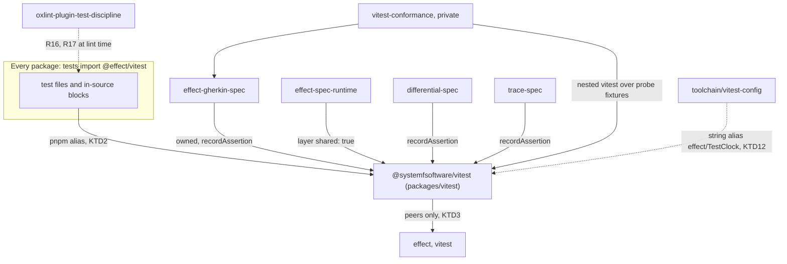
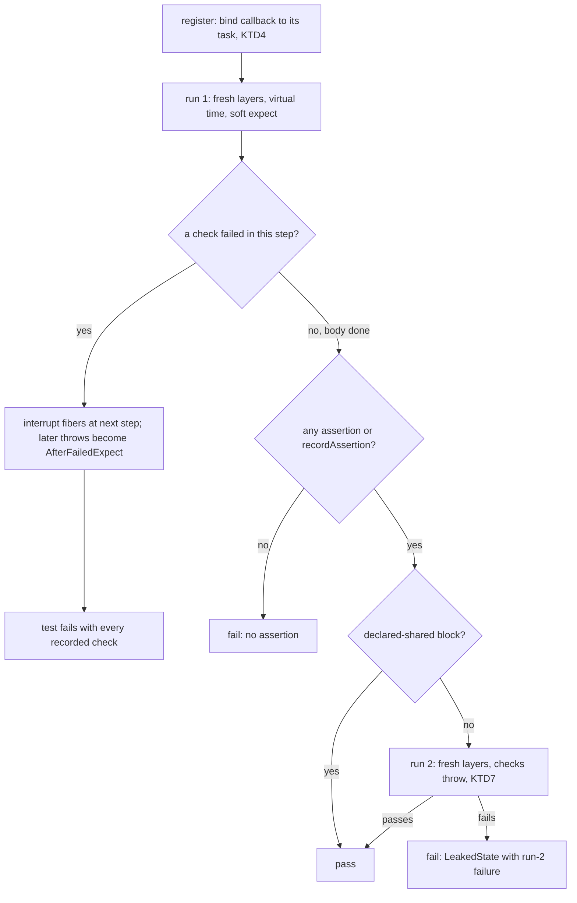
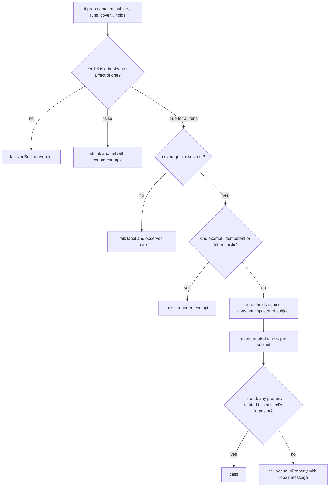
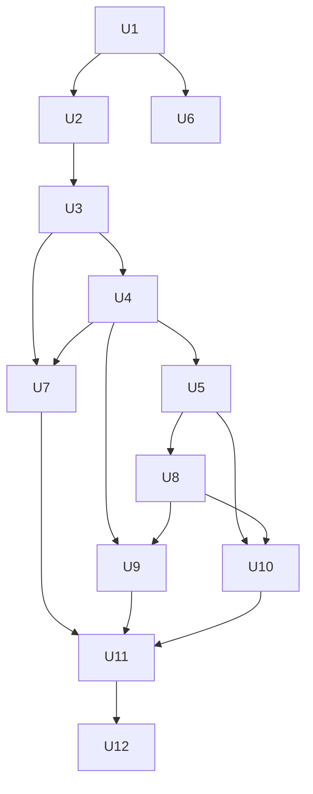

# Lawful @effect/vitest Fork - Plan

## Goal Capsule

- **Objective:** A test written in this repo the lazy way is either a good test or refused with its rewrite. Test outcomes report real defects: leaked state, properties that check nothing, and weak assertions fail. Everything that already passed for a real reason keeps passing.
- **Means:** fork `@effect/vitest` as `@systemfsoftware/vitest`, resolve `@effect/vitest` to it in every package through a pnpm workspace alias (KTD1, KTD2), and migrate the repo onto its defaults (U9-U11).
- **Authority:** repo rules (`AGENTS.md`, `CONSTITUTION.md`) > this plan's Product Contract (R-IDs) > its KTDs > unit Approach text. The prototype record `.context/compound-engineering/ce-prototype/2026-09-24-lawful-property-api/decisions.md` is evidence, not authority. It is gitignored and exists only in this worktree.
- **Stop conditions:**
  - Stop and report if the pnpm alias cannot resolve on any edge (KTD2).
  - Stop and report if the fork cannot run a browser-mode suite without node-only APIs (KTD4).
  - Stop and report if a behaviour produces a false positive that no declared opt-out (`shared: true`, exempt law kind) covers. Never widen an opt-out to absorb one.
- **Execution profile:** Deep. 12 units, grouped into five phases. Gates (U3-U5, U8) land in their own commits before the work they grade (KTD13).
- **Finish:** `pnpm check:local` exits 0 after the last edit, and the PR is watched to green with `gh pr checks --watch --fail-fast` (REPO-D1).

---

## Product Contract

### Summary

Create `packages/vitest` (`@systemfsoftware/vitest`), a first-party fork of the vendored `@effect/vitest` rc.117 that keeps its whole surface and turns on, with no opt-in, what five prototype questions measured. The defaults are:

- a fresh layer per test;
- a second run of every passing test;
- `expect` soft within one Effect step, with the test stopped at the next step;
- idle-driven virtual time;
- the no-assertion gate;
- narrowed refusals whose message is the rewrite;
- a lawful `it.prop` that names its subject and is refuted against a constant impostor.

Every package resolves `@effect/vitest` to the fork. The four testing libraries adopt its integration API. New lint rules cover the two refusals a runtime cannot decide. Every existing property is migrated, and the four real defects the fork exposed are fixed.

### Problem Frame

Upstream `@effect/vitest` passes any property verdict `!== false` (`repos/effect/packages/vitest/src/internal/internal.ts`, the `it.prop` and `it.effect.prop` verdict checks). So `packages/trace-spec/src/drivers/tempo-trace-store.ts:101` returns an `Effect` that never runs and counts as green. Upstream shares state across tests unchecked: `packages/effect-cell-types/tests/pipeline-execution.integration.test.ts` passes only while nothing else touches a process-global histogram. It reports failures as `expected false to be true`.

Measured in the prototypes, cheap models write `expect(Equal.equals(a, b)).toBe(true)` and never write isolation tests (0 of 17 green wave-3 suites in Q2). Arm D's authors used `expect.soft` and `expect.poll` in 0 of 16 suites (Q2). Only defaults change what gets written.

- Q4: under the lawful DSL, 5 of 5 authors went green after one repair and caught 30/30 seeded bugs.
- Under upstream, 1 of 5 went green after three repairs.

### Key Decisions

- **Refuse the slop form, with the fix as the message.** (session-settled: user-directed — chosen over the Q3 import-routing drop-in: the drop-in made slop run but left it in the files.) Governs R9, R16, R17.
- **Lawful properties: impostor-refuted law, plus law kinds, coverage and exempt kinds.** (session-settled: user-directed — chosen over the strict verdict alone and over law kinds alone: each stopped only 5/9 and 4/8 cheats.) Governs R11-R15.
- **The fork keeps the whole upstream surface; the repo's test-layer law stays repo policy.** (session-settled: user-directed — chosen over removing the example-test APIs: the package is published, and `CONST-T8`/`T14`/`T15` are enforced by this repo's review and lint, not by the library.) Governs R1.
- **`expect` is soft within one step; the test stops before the next step.** (session-settled: user-directed — chosen over soft for the whole test: a failed check let later steps run side effects on a state already known wrong.) Governs R6.
- **Defaults are forced, not opt-in.** (session-settled: user-directed — chosen over optional helpers: agents used them 0/16 times.) Governs R3-R9.
- **The fork is the runner under every in-repo testing library.** (session-settled: user-approved — the agent proposed it, with its costs listed; the user agreed it is a net benefit.) Governs R2, R10.

### Requirements

**Package and resolution**

- R1. `@systemfsoftware/vitest` exports the full upstream rc.117 surface: `it`, `test`, `it.effect`, `it.live`, `it.scoped`, `it.each`, `it.layer`, `layer`, `describe`, `expect`, `it.prop`, `it.effect.prop`, `flakyTest`, `addEqualityTesters`, `makeMethods`, `describeWrapped`, and `export * from "vitest"`.
- R2. Every workspace edge that names `@effect/vitest` resolves to the fork, including published peer and dependency edges; source files keep importing `@effect/vitest`.

**Runner defaults**

- R3. Every test gets its own build of its layers. `layer(L, { shared: true })` is the only way to share one build across a block, and nested layers inherit it.
- R4. Tests inside a `describe` run concurrently and in shuffled order. A failure in a shuffled block reports the shuffle seed, and passing that seed back replays the same order.
- R5. Every passing test outside a declared-shared block runs a second time on fresh services. If the second run fails, the test fails as `LeakedState`, and the message names the second run's failure.
- R6. `expect` records softly within one Effect step. Before any of the test's fibers takes its next step after a failed check, that fiber is interrupted. Anything thrown after a failed check is reported as `AfterFailedExpect`.
- R7. Effect bodies run on virtual time that advances only when the test's fibers are idle. A sleep that ends now returns without waiting. On a deadline tie, background sleepers wake before the test fiber. Fractional-millisecond schedules work. `TestClock.adjust` still moves time.
- R8. `toEqual` compares with Effect `Equal`.
- R9. Each of these fails with one message, identical at compile time and at run time, that states the rewrite:
  - `toBeDefined`, `toBeTruthy`, `toBeFalsy`, `not.toBeNull` and `not.toBeUndefined`;
  - `beforeEach` and `afterEach`;
  - an `async` test body;
  - an Effect body that needs a service nothing provides;
  - a test with no assertion (runtime only).

  Not refused: `toBe` on objects, and `toBeTypeOf`/`toBeInstanceOf`. Q5 found every existing use deliberate (4/4 and 9/9).

**Integration API**

- R10. A testing library can wrap an Effect in `owned(...)`, inside which `expect` throws instead of recording. It can also call `recordAssertion()` so an Effect-native check counts as an assertion.

**Properties**

- R11. `it.prop(name, { of, subject, runs }, holds)` and `it.effect.prop(...)` name the function under test and require a positive integer `runs`. A verdict that is not a literal boolean, or an `Effect` of one, fails as `NonBooleanVerdict`. A missing budget fails as `MissingBudget`.
- R12. After a property holds, it runs again against a constant impostor of its subject, which returns the first output forever. Each subject is judged across all properties in its file. If no property in the file refutes the impostor, the file fails with `VacuousProperty` and the repair message.
- R13. Law kinds `model`, `metamorphic`, `roundTrip` and `invariant` are sugar over R11/R12. `idempotent` and `deterministic` are declared exempt: they skip the impostor gate, are reported as exempt, and are the only exemptions.
- R14. A property may declare coverage classes: labelled input predicates, each with a minimum share of runs. A class fails only when a sequential statistical test is confident its share is below the minimum, and passes once it is confident the share is at least 0.9 of the minimum (QuickCheck's `stdConfidence`: certainty 10^9, tolerance 0.9). The tolerance is what makes the test terminate: a class sitting exactly at its minimum would otherwise draw forever. `runs` is then the minimum run count, not the maximum. The failure names the label and the observed share.
- R15. The positional form `it.prop(name, [arbitraries], predicate)` is refused at compile time and at run time. The message is the rewrite to R11.

**Source-level refusals (this repo)**

- R16. Lint refuses `expect(<a predicate evaluated in the test>)` asserted against `true` or `false`, with the rewrite `expect(x).toSatisfy(P)` or `expect(a).toEqual(b)`. A boolean the code under test returned stays legal.
- R17. Lint refuses importing `expect` from `vitest`; it comes from `@effect/vitest`.
- R18. A test importing the v3 path `effect/TestClock` resolves it to the fork's virtual-time `TestClock` and type-checks.

**Migration and outcomes**

- R19. Every `it.prop`/`it.effect.prop` call and wrapper in `packages/` and `examples/` uses R11-R13 with an explicit subject, and none fails `VacuousProperty`.
- R20. The four real defects Q5 exposed are fixed:
  - the vacuous Effect property at `packages/trace-spec/src/drivers/tempo-trace-store.ts:101`;
  - the metric-registry leak in `packages/effect-cell-types/tests/pipeline-execution.integration.test.ts`;
  - the presence checks at `packages/discern/tests/caching-and-budgets.integration.test.ts:176` and `packages/npm-package/tests/package-tree-memfs.integration.test.ts:90`.
- R21. Every workspace suite passes under the fork, including `packages/atom/effect-atom-react` (browser mode) and `packages/effect-schema-recursion-budget`, which Q5 did not run.

**Records**

- R22. A REPO-W8 alternatives record for the fork is committed under `docs/`.

### Acceptance Examples

- AE1. Covers R3, R5.
  - **Given** two tests in one `layer(L)` block, where the first adds to an in-memory store.
  - **When** both run.
  - **Then** each sees an empty store, and each passes twice.
  - **Given** the same block declared `layer(L, { shared: true })`.
  - **Then** the second test sees the first test's write, and neither runs twice.
- AE2. Covers R5.
  - **Given** a test reading a module-level counter that it increments.
  - **When** it passes once.
  - **Then** the second run sees the counter at 1, fails, and the test reports `LeakedState` with the second run's assertion text.
- AE3. Covers R6.
  - **Given** `expect(a).toEqual(3)` and `expect(b).toEqual(4)` fail in one step, followed by `yield* sideEffect`.
  - **Then** both failures are reported, and `sideEffect` never runs.
  - **Given** a forked child fiber that performs the side effect.
  - **Then** the child is interrupted too.
- AE4. Covers R7.
  - **Given** a background fiber that ships after `Effect.sleep("3 seconds")` and a test that sleeps exactly 3 seconds.
  - **Then** the test reads `Shipped`, at a virtual 3000 ms, and not at 2999 or 3001.
- AE5. Covers R11, R12, R13.
  - **Given** `it.prop("sorts", { of: [S.Array(S.Int)], subject: sort, runs: 100 }, (s, [xs]) => isSorted(s(xs)))` alone in a file.
  - **Then** the file fails `VacuousProperty`, because a constant empty array is also "sorted".
  - **Given** a `model` law against an independent oracle is added to the same file.
  - **Then** it passes.
  - **Given** `idempotent` alone.
  - **Then** it passes and is reported exempt.
- AE6. Covers R16.
  - **Given** `expect(Result.isFailure(s.reading)).toBe(true)`.
  - **Then** lint refuses it with the `toSatisfy(Result.isFailure)` rewrite.
  - **Given** `expect(s.acquired).toBe(false)`.
  - **Then** lint accepts it.

### Success Criteria

- Against the installed rc.117 baseline, the full workspace changes outcome only at R20's four sites, all found by the fork, plus tests the migration itself rewrote.
- Summed test time across packages stays at or under 1.5× the baseline (Q5 measured about 1.37×, excluding `trace-spec`'s load timeouts).
- The Q1 cheat corpus (9 cheats, 2 controls) is refused 9/9, and both controls pass, when run as conformance fixtures.

### Scope Boundaries

- Outside this work: the Q2 suite-scoped service impostor (`VacuousTest`), which was measured but not carried into Q4. Also out: the dropped background-work gate, forcing `expect.poll` or `bench`, and an in-runner mutation engine, which would duplicate Stryker.
- Outside this work: compatibility for adopters who install upstream `@effect/vitest` beside the published libraries (KTD2).

#### Deferred to Follow-Up Work

- Impostor families beyond the constant stand-in, such as lagged output.
- Re-measuring cheap-model authors against the shipped package with the Q4 specimen harness.

### Sources

- Prototype record: `.context/compound-engineering/ce-prototype/2026-09-24-lawful-property-api/decisions.md`, Questions 1-5, including the measurements quoted above. Prototype sources to port are listed per unit.
- Vendored upstream: `repos/effect/packages/vitest/src/{index.ts,utils.ts,internal/internal.ts}`, `repos/effect/packages/vitest/package.json`.
- Step boundary: `repos/effect/packages/effect/src/internal/effect.ts:677` (`scheduler.shouldYield`). Clock semantics: `repos/effect/packages/effect/src/testing/TestClock.ts:330` (a zero sleep is immediate) and `:354` (nanosecond rounding).
- Alias syntax and publish rewrite: pnpm docs, "Referencing workspace packages through aliases" (https://pnpm.io/workspaces). Catalogs have held `workspace:` ranges since pnpm 12.2.0 (https://pnpm.io/catalogs); the repo pins pnpm 12.6.0.
- Coverage soundness: QuickCheck documents a fixed-share coverage check as unsound, because shares vary by luck, and fails a property on coverage only under `checkCoverage`'s sequential statistical test (`Test.QuickCheck.Property`, `checkCoverage`/`cover`, https://hackage.haskell.org/package/QuickCheck-2.14.2/docs/src/Test.QuickCheck.Property.html). R14 follows it.
- Order dependence: order-dependent tests were 50.5% of the 422 flaky tests iDFlakies found, and random reordering detected the most flaky tests (Lam et al., ICST 2019, https://mir.cs.illinois.edu/marinov/publications/LamETAL19iDFlakies.pdf). R4's shuffle surfaces them; R4's seed replay makes each surfaced failure reproducible.

---

## Planning Contract

### Key Technical Decisions

- KTD1. **New package `packages/vitest`, named `@systemfsoftware/vitest`, started as a verbatim port of rc.117.** The first commit changes nothing observable. The upstream copy matched the installed package on all 18 Q5 suites, so every later difference traces to one behaviour. The package is owned outright (REPO-O1); `repos/` stays read-only.
- KTD2. **Every edge declares `"@effect/vitest": "workspace:@systemfsoftware/vitest@*"`, published peer and dependency edges included.** Put it in the default and `peers` catalog entries if pnpm 12.6.0 accepts an alias there; otherwise put it in each `package.json`. Specifier-keyed lint rules and the 58 importing files stay unchanged. On publish, pnpm rewrites the entry to `npm:@systemfsoftware/vitest@<version>`. (session-settled: user-directed — chosen over aliasing only dev edges and naming the fork on published edges: adopters holding upstream `@effect/vitest` are explicitly out of scope.)
- KTD3. **The fork has no workspace runtime dependency.** Its peers are `effect` and `vitest`, and fast-check arrives through `effect/testing`. `effect-cell-types` declares `@effect/vitest` as a devDependency, and `effect-schema-vite`'s generated law tests run through `effect-schema-law`, which peers on `@effect/vitest`. Depending on either would form a cycle. pnpm counts devDependencies in cycles and "cannot guarantee that scripts will be run in topological order" when one exists (https://pnpm.io/workspaces, Troubleshooting). So the AGENTS.md rules requiring those two packages cannot apply here. Pure deciders are plain modules with in-source property blocks.
- KTD4. **Test binding uses no node-only API.** Q3 showed that callbacks must bind to the Vitest task created at registration, not `getCurrentTest()`, which points at another in-flight test under concurrency. The binding has two paths:
  - Effect code finds the current run through a `Context.Reference` read from `Fiber.getCurrent()`, the mechanism the Q5 prototype already uses for `owned`.
  - A synchronous body runs with a module-level slot set to its task for exactly the duration of the synchronous call. No other test can interleave inside one synchronous call.

  `async` bodies are refused (R9), so no third path is needed. The Q5 prototype's `node:async_hooks` store is not ported, because browser mode (R21) cannot load it.
- KTD5. **The step boundary is a wrapped `Scheduler` on the test runtime.** Its `shouldYield` interrupts a fiber once its run has a failed check (`effect.ts:677`). Finalizers still run. Property verdicts are returned, not asserted, so shrinking is unaffected.
- KTD6. **Virtual time is a counting scheduler plus a `Clock` that advances to the earliest sleeper when the pending count reaches zero.** It is provided both as the `Clock` and behind the `TestClock` service, so `adjust` works. Port it from Q5's corrected `virtual-time.ts`, which fixes the two Q3/Q4 bugs: a sleep that ends now waited, and `BigInt` threw on fractional nanoseconds.
- KTD7. **The second run uses a fresh build of the test's layers, and its checks throw.** A per-run shadow flag carries this, so its failures never land as soft reports on the first run. It is skipped only in declared-shared blocks. `it.live` is re-run too: under Q5, every live and real-resource suite, including `effect-microsandbox` VMs, passed its second run.
- KTD8. **`owned` and `recordAssertion` are the whole integration API.** `owned` sets a `Context.Reference` for its region. `recordAssertion` increments the bound task's assertion count. With these two calls in four libraries, Q5's 6 gherkin conflicts and 26 no-assertion false flags dropped to 0.
- KTD9. **One string per refusal.** Each R9 message is one constant, used by the type-level refusal (argument or `this` position, per Q4) and by the runtime throw. The boolean refusal moves out of types to lint (KTD11), because types cannot tell a returned boolean from a predicate evaluated in the test (Q5: 94 legitimate sites against 147 predicate sites).
- KTD10. **The property engine is the Q1 avenue-B engine with C's kinds routed through it.**
  - Sources: `01-cheat-proof-prop-shape/src/{engine.ts,b-refuted.ts,c-kinds.ts}` and the `prop` surface in `04-lawful-dsl/lib/index.ts`.
  - `of` accepts what upstream accepts: a tuple or record of Schemas or Arbitraries.
  - Impostor verdicts are collected per subject and decided when the file finishes, so file-level judging (R12) holds under concurrency.
- KTD11. **The source-level refusals (R16, R17) are rules in `packages/oxlint-plugin/oxlint-plugin-test-discipline`.** A Vite transform inside the fork would reach adopters, who are out of scope (KTD2), and would add a second parser to the runner. Lint already runs in `pnpm check:local` and on edit.
- KTD12. **The v3 `effect/TestClock` path is a string alias in the shared Vite config, plus ambient types from the fork.** `packages/toolchain/vitest-config/lib/base.js` maps `effect/TestClock` to `@effect/vitest/TestClock`, which resolves through each package's alias. The fork's main type entry references an ambient `declare module "effect/TestClock"`. No config package imports the fork, so there is no cycle (KTD3).
- KTD13. **Gates land before the work they grade, each in its own commit.** Each gate is observed red on the pre-migration tree and green after (`repos/constitution/ENFORCEMENT.md:35-44`, `CONCEPTS.md:107-114`). The gates are the fork behaviours (U3-U5) and the lint rules (U8). Different agents author gates and do the migrations (U9-U11). Intermediate commits may be red by design; only the PR head must be green.
- KTD14. **The fork's runner behaviour is tested in a private package, `packages/vitest-conformance`.** Its gherkin `.integration.test.ts` features run nested Vitest in-process over probe fixtures through `vitest/node` on the worker-threads pool, and assert on the JSON report. They spawn no child process and no browser. The fork cannot use gherkin itself, because `effect-gherkin-spec` depends on the fork (KTD3). The conformance package depends on both without forming a cycle, and it satisfies `behaviour-test-requires-gherkin`. Browser-mode proof (R21) comes from `effect-atom-react`'s existing suite running on the fork, not from a new test.

### Assumptions

These were Phase 0.7 call-outs the user did not answer. Each takes the default recorded here.

- The `it.prop` break happens now. The positional form is removed (R15), and every call is migrated in this PR (U10), per REPO-R1, instead of shipping the strict verdict alone and migrating over time.
- The source-level refusals are oxlint rules (KTD11), not a fork Vite transform.
- The second run is on for every test, and declared-shared blocks are the only opt-out (R5). The cost is about 1.37× summed test time.
- `describe` concurrency and shuffle (R4) come from Q4, but Q5 did not run them against real suites. U2's parity run and U11's triage are where an order-dependent suite would surface. Each such suite is a finding to fix, not a reason to turn the default off.

### Destructive Review

Lens: Edge-First, chosen because the plan's weak spots are randomness (shuffle, coverage) and process boundaries.

Assumptions surfaced:

1. A fixed-share coverage threshold is a sound failure signal (R14).
2. Shuffled order produces actionable failures (R4).
3. Runner behaviour can be observed with nested runs that stay inside the test-layer admission gate (KTD14).

Outcomes:

1. Refuted by QuickCheck's own documentation (Sources). R14 now uses a sequential test.
2. Incomplete: an order-dependent failure with no seed cannot be replayed (Sources: iDFlakies). R4 now reports and accepts the seed.
3. Violated as first drafted. Vitest's default pool forks child processes, and the browser probe spawned Chromium; `skill://test-layer-selection` automatically fails spawning a process in an integration test. KTD14 now pins the in-process worker-threads pool, and the browser probe is removed.

### High-Level Technical Design

Package graph after the change. Arrows point at what each package resolves.



The lifecycle of one test under the fork:



The property gate (R11-R14):



The property surface, as directional grammar (not an exact signature):

```text
it.prop(name, { of: Gens, subject: S, runs: PositiveInt, cover?: { [label]: [predicate(values), minShare] } }, holds(subject, values) => boolean)
it.effect.prop(... holds(subject, values) => Effect<boolean>)
it.law.model | metamorphic | roundTrip | invariant (name, spec, ...kind-specific functions)   -- gated
it.law.idempotent | deterministic (name, spec, ...)                                       -- exempt, reported
it.prop(name, [arbitraries], predicate)                                                    -- refused, message = rewrite
```

### Output Structure

```text
packages/vitest/
  package.json  tsdown.config.ts  oxlint.config.ts  vitest.config.ts  tsconfig*.json  tstyche.json  .attw.json  README.md
  src/
    mod.ts                      public surface (R1, R10), references compat types
    TestClock.ts                v3-path compat entry (R18)
    internal/runner.ts          port of upstream internal.ts plus R3-R5, R7
    internal/binding.ts         task and run binding (KTD4)
    internal/step-boundary.ts   scheduler wrapper (KTD5)
    internal/virtual-time.ts    KTD6
    internal/expect.ts          soft expect, refusals, owned, recordAssertion (R6, R8-R10)
    internal/property/*.ts      engine, impostor, kinds, coverage (R11-R15)
    internal/refusals.ts        one string per refusal (KTD9)
  test-types/*.tst.ts
packages/vitest-conformance/
  package.json  vitest.config.ts  oxlint.config.ts  tsconfig*.json
  tests/*.integration.test.ts
  tests/__fixtures__/probes/*.ts    probe suites run by nested vitest
```

### Sequencing



### System-Wide Impact

- **Every test run in the repo** changes semantics: concurrency, shuffle, the second run, virtual time and soft `expect`. CI time rises by roughly the Q5 factor.
- **Published libraries** (`effect-gherkin-spec`, `effect-spec-runtime`, `differential-spec`, `trace-spec`, `effect-schema-law`) ship an aliased `@effect/vitest` edge. `effect-schema-law` (`RuleOfSchemas`, `recursionLaws`) and `trace-spec` (`Case.prop`) change their property-wrapper signatures. Both are breaking, which REPO-R1 allows.
- **Lint:** two new rules. `prop-arbitrary-schema-origin` is retargeted, because its `find(ArrayExpression)` misses the `{ of }` object. `property-file-purity` gets new message text. About 150 rule-test fixtures move to the new shape.

### Risks

| Risk                                                                                                                                                                         | Mitigation                                                                                                                                                                                                                                                                                           |
| ---------------------------------------------------------------------------------------------------------------------------------------------------------------------------- | ---------------------------------------------------------------------------------------------------------------------------------------------------------------------------------------------------------------------------------------------------------------------------------------------------- |
| pnpm rejects the alias form inside a catalog entry                                                                                                                           | Fall back to per-`package.json` entries (KTD2); no source change either way                                                                                                                                                                                                                          |
| The fork cannot run in browser mode                                                                                                                                          | KTD4 forbids node-only APIs; U2 and U3 run `effect-atom-react` in its browser config; a failure is a stop condition                                                                                                                                                                                  |
| Concurrency or shuffle breaks an order-dependent suite                                                                                                                       | Treat it as a finding and fix the suite (U11); record any fix that changes what a test asserts in the PR body                                                                                                                                                                                        |
| The second run doubles cost for real-resource suites                                                                                                                         | Q5 showed ~1.37× overall; the success criterion caps it at 1.5×; declared sharing is the only opt-out                                                                                                                                                                                                |
| Load-sensitive tests flake at higher parallelism (`trace-spec` `annotation-on-disparity` timeouts, `effect-schema-law` `∀c_Budget_∈MeasuredBand`, which measures wall-clock) | Q5 saw both only under its 6-way parallel harness, installed package included; `MeasuredBand` passed in isolation. U2 runs each suite the way CI does. A failure there under the fork is a U11 finding: fix its root cause (the fixed timeout, the wall-clock measurement), never an exemption (R21) |

---

## Implementation Units

### Phase: Fork package

### U1. Port rc.117 verbatim as `@systemfsoftware/vitest`

- **Goal:** A workspace package whose behaviour is identical to the installed `@effect/vitest`.
- **Requirements:** R1; KTD1, KTD3.
- **Dependencies:** none.
- **Files:**
  - `packages/vitest/{package.json,tsdown.config.ts,oxlint.config.ts,vitest.config.ts,tsconfig.json,tsconfig.app.json,tsconfig.test.json,tsconfig.tstyche.json,tsconfig.node.json,tstyche.json,.attw.json,README.md}`
  - `packages/vitest/src/mod.ts`, `packages/vitest/src/utils.ts`, `packages/vitest/src/internal/runner.ts`
  - `packages/vitest/test-types/surface.tst.ts`
- **Approach:**
  1. Copy the source from `repos/effect/packages/vitest/src/`.
  2. Adopt the conventions of `packages/effect-spec-runtime`: `tsdown` generates exports with `devExports: '@systemfsoftware/source'` (never hand-edit exports, REPO-S4), the oxlint config extends `@systemfsoftware/oxlint-config-recommended`, the shared vitest config, `tstyche`, and `attw`.
  3. Peers are `effect` (`catalog:peers`) and `vitest`. There are no workspace runtime dependencies.
  4. Fix whatever the oxlint `all` preset flags in the ported code at its source. Do not suppress it (`docs/solutions/tooling-decisions/the-oxlint-gate-wall-shapes-new-package-code.md`).
- **Patterns to follow:** `packages/effect-spec-runtime/tsdown.config.ts` and `package.json`.
- **Test scenarios:**
  - A type test: every R1 export exists with upstream's type.
  - A type test: `it.effect` rejects a body whose error channel is not `never`-compatible, exactly as upstream does.
- **Verification:** `build`, `typecheck`, `lint`, `test:types` and `attw` pass for the package.

### U2. Resolve `@effect/vitest` to the fork everywhere; prove parity

- **Goal:** Every package runs its tests on the fork copy, and every outcome equals the installed baseline.
- **Requirements:** R2, R21 (parity half); KTD2.
- **Dependencies:** U1.
- **Files:**
  - `pnpm-workspace.yaml` (the `@effect/vitest` entries in `catalog` and `catalogs.peers`)
  - `pnpm-lock.yaml`
  - each package `package.json` declaring `@effect/vitest`, if the catalog route is rejected
- **Approach:**
  1. Try the alias in both catalog entries. If `pnpm install` rejects it, write `workspace:@systemfsoftware/vitest@*` in every declaring `package.json`: dependencies, devDependencies and peerDependencies.
  2. Record a baseline of per-test outcomes with the installed package on the parent commit. Compare per package, by test full name.
  3. The Q5 harness (`05-fork-under-real-suites/matrix.py`, gitignored) shows the comparison method.
- **Execution note:** Record the baseline before changing resolution. Include the browser config of `effect-atom-react` and `effect-schema-recursion-budget`.
- **Test scenarios:** `Test expectation: none -- resolution-only change; parity is the proof.`
- **Verification:**
  - `node_modules/@effect/vitest` resolves to `packages/vitest` in every package.
  - Per-test outcomes are identical to the baseline in every suite.

### U3. Runner defaults: fresh layers, sharing, concurrency, second run, step boundary, virtual time

- **Goal:** R3-R5 and R7 hold for every test, and the runner can stop a test at its next step.
- **Requirements:** R3, R4, R5, R7, R21; KTD4, KTD5, KTD6, KTD7, KTD13.
- **Dependencies:** U2.
- **Files:**
  - `packages/vitest/src/internal/{runner.ts,binding.ts,step-boundary.ts,virtual-time.ts}`
  - `packages/vitest-conformance/{package.json,vitest.config.ts,oxlint.config.ts,tsconfig*.json}`
  - `packages/vitest-conformance/tests/runner-defaults.integration.test.ts`
  - `packages/vitest-conformance/tests/__fixtures__/probes/{isolation,leak,clock,concurrency}.ts`
- **Approach:**
  1. Port from `05-fork-under-real-suites/lib/internal/{internal.ts,features.ts,virtual-time.ts}` with the feature switches removed; every behaviour is always on.
  2. Replace the `AsyncLocalStorage` store with the binding in KTD4.
  3. `describe` passes `concurrent: true` and `shuffle: true`.
  4. Nested `layer` calls inherit `shared`.
  5. Pure deciders get in-source property blocks using the fork's own `it.prop`, imported relatively. Examples: sleeper ordering on a tie, and whether a run's outcome differs.
- **Execution note:** Land this in its own commit (KTD13). Run the whole workspace on it once and keep the list of newly failing tests. That list is the red evidence U7 and U11 turn green.
- **Patterns to follow:** gherkin features in `packages/effect-gherkin-spec/tests/*.integration.test.ts`.
- **Test scenarios:**
  - AE1, isolation half: two tests in `layer(L)` each see an empty store and each run twice.
  - AE1, sharing half: `shared: true` shares one build, and neither test runs twice.
  - A nested `layer` inside a shared block does not rebuild the outer layer per test.
  - AE2: a module-level counter makes the second run fail, and the report is `LeakedState` carrying the run-2 assertion text.
  - AE4: tie ordering exactly at 2999, 3000 and 3001 ms.
  - `Effect.sleep(0)` returns without advancing time.
  - `Schedule.jittered` over 1 ms delays completes without throwing (fractional nanoseconds).
  - `TestClock.adjust("3 seconds")` still releases a 3-second sleeper.
  - Four interleaved concurrent tests each fail with only their own failures (the Q3 binding case).
  - A shuffled block containing an order-dependent pair fails with the seed in its report; re-running with that seed reproduces the failure, and re-running with another seed may pass.
- **Verification:** conformance features pass; the whole-workspace red list is recorded.

### U4. Expect surface: soft within one step, refusals, integration API, no-assertion gate

- **Goal:** R6, R8, R9 and R10 hold, with one message per refusal.
- **Requirements:** R6, R8, R9, R10; KTD5, KTD8, KTD9, KTD13.
- **Dependencies:** U3.
- **Files:**
  - `packages/vitest/src/internal/{expect.ts,refusals.ts}`
  - `packages/vitest/src/mod.ts`
  - `packages/vitest/test-types/refusals.tst.ts`
  - `packages/vitest-conformance/tests/expect-semantics.integration.test.ts`
  - `packages/vitest-conformance/tests/__fixtures__/probes/{stop,refusals,owned}.ts`
- **Approach:**
  1. Port `05-fork-under-real-suites/lib/expect.ts` with its narrowed refusal set and the `owned`/`recordAssertion` additions. Port the type-level refusals from `04-lawful-dsl/lib/index.ts`, minus the boolean refusal (KTD9).
  2. Keep Chai matchers unbound when read through the Proxy. Re-binding breaks them (`Invalid Chai property: toBe.length`, Q4).
  3. Treat a zero-parameter test callback as receiving Vitest's deprecated `done` stub, not the context (Q3).
- **Execution note:** Land this in its own commit (KTD13), then re-run the workspace to extend U3's red list.
- **Test scenarios:**
  - AE3, body: both failures are reported and the side effect never runs.
  - AE3, fork: the child fiber is interrupted.
  - A `TypeError` caused by the first failure is reported as `AfterFailedExpect`, not as a second fault.
  - A property's `false` verdict still shrinks. The step boundary does not affect properties.
  - `expect(Money.of(1)).toEqual(Money.of(1))` passes when the two are Effect-`Equal` but different references.
  - Each R9 form fails at run time with the constant from `refusals.ts`. A `tstyche` test asserts that the same text appears in the compile error.
  - `toBe` on an object is not refused, and neither are `toBeInstanceOf` and `toBeTypeOf`.
  - Inside `owned(effect)`, a failing `expect` throws, and the enclosing Effect sees the failure in its cause.
  - A test whose only check is `recordAssertion()` passes the no-assertion gate. A test with neither fails it.
- **Verification:** conformance features pass; the type tests pass.

### U5. Lawful properties

- **Goal:** R11-R15, with file-level impostor judging.
- **Requirements:** R11, R12, R13, R14, R15; KTD10, KTD13.
- **Dependencies:** U4.
- **Files:**
  - `packages/vitest/src/internal/property/{engine.ts,impostor.ts,kinds.ts,coverage.ts}`
  - `packages/vitest/src/mod.ts`
  - `packages/vitest/test-types/property.tst.ts`
  - `packages/vitest-conformance/tests/lawful-properties.integration.test.ts`
  - `packages/vitest-conformance/tests/__fixtures__/probes/cheats/*.ts`, porting the Q1 corpus from `01-cheat-proof-prop-shape/`
- **Approach:**
  1. Port the engine and kinds (KTD10). Register a per-file finaliser that decides `VacuousProperty` for each subject.
  2. `cover` counts label hits during the holding run and compares each share at the end.
  3. The positional form gets a type overload whose parameter is the rewrite string, and a runtime throw with the same string.
- **Execution note:** Land this in its own commit (KTD13). Its red evidence is the Q1 cheat corpus and the unmigrated repo properties, which fail R15.
- **Test scenarios:**
  - AE5: the sort-only property is vacuous alone; adding a `model` law makes it pass; `idempotent` alone passes and is reported exempt.
  - The Q1 corpus: 9/9 cheats refused, 2/2 controls pass.
  - A verdict of `undefined`, `1` or an `Effect<boolean>` returned from `it.prop` (not `it.effect.prop`) fails `NonBooleanVerdict`. This is the tempo-trace-store case.
  - A missing `runs`, `runs: 0` or `runs: 1.5` fails `MissingBudget`, and the positional form is a type error.
  - A `cover` class requiring 30% of runs but hit about 5% fails, naming the label and the observed share.
  - A class requiring 20% and hit about 19% does not fail on a single unlucky sample; the sequential test keeps drawing until it is confident either way.
  - Two concurrent files with same-named subjects are judged independently.
  - An impostor over a record subject replaces every member with a constant.
- **Verification:** conformance features pass; the type tests pass.

### U6. v3 `effect/TestClock` path

- **Goal:** R18.
- **Requirements:** R18; KTD12.
- **Dependencies:** U1.
- **Files:**
  - `packages/vitest/src/TestClock.ts`
  - `packages/vitest/src/compat.d.ts`
  - `packages/vitest/tsdown.config.ts` (add the `./TestClock` entry)
  - `packages/toolchain/vitest-config/lib/base.js`
  - `packages/vitest-conformance/tests/__fixtures__/probes/v3-testclock.ts`
- **Approach:**
  1. Port `04-lawful-dsl/lib/TestClock.ts` and `compat.d.ts`. On virtual time, `adjust` means letting that much time pass.
  2. Add the string alias to `sharedConfig.resolve.alias` in `base.js`.
  3. The main type entry carries a reference to the ambient declaration.
- **Test scenarios:**
  - A probe that imports `TestClock` from `effect/TestClock` and calls `adjust("3 seconds")` passes type-checking and releases a 3-second sleeper.
- **Verification:** the conformance probe passes; `typecheck` passes on the probe.

### Phase: Library integration

### U7. Testing libraries adopt `owned`, `recordAssertion` and `shared`

- **Goal:** The four libraries run correctly on the fork's defaults, turning U3/U4's library-caused red to green.
- **Requirements:** R10, R21; KTD8.
- **Dependencies:** U3, U4.
- **Files:**
  - `packages/effect-gherkin-spec/src/FeatureRuntime.ts` (wrap `normalizePipeline`'s pipeline in `owned`)
  - `packages/effect-gherkin-spec/src/DoNotation.ts` (`recordAssertion` after `Then` and `Then.soft` succeed)
  - `packages/effect-spec-runtime/src/Suite.ts` (`layerSetupOptions` passes `shared: true`)
  - `packages/differential-spec/src/core/DualExecutionSupervisor.ts` (`recordAssertion` on a conclusive pass)
  - `packages/trace-spec/src/Contract.ts` (`recordAssertion` at the `checkDual` verdict)
- **Approach:** Apply the Q5 overlay (`05-fork-under-real-suites/overlay.patch`, 5 files, about 12 lines). Q5 moved trace-spec's assertion record from `Suite.ts` to `Contract.ts`, because a `Case` that expects a failure must not count its own flip as an assertion.
- **Test scenarios:**
  - The gherkin meta-tests `tests/gherkin-step-combinators.integration.test.ts` and `pipeline-semantics.integration.test.ts` pass unchanged on the fork. These are the 6 Q5 conflicts.
  - `scenario-layer-lifecycle` and `trace-spec` `suite-shared-layer` pass unchanged. These are the shared-by-design cases.
  - A gherkin `Then` with no `expect` is not flagged by the no-assertion gate.
- **Verification:** the listed suites pass; U3/U4's red list shrinks to R20's sites plus the properties U10 migrates.

### Phase: Lint

### U8. Lint rules for R16 and R17; retarget property rules

- **Goal:** Source-level refusals exist, and the property rules read the new shape.
- **Requirements:** R16, R17, R15 (rule side); KTD11, KTD13.
- **Dependencies:** U5 (the shape).
- **Files:**
  - `packages/oxlint-plugin/oxlint-plugin-test-discipline/src/rules/{expect-boolean-predicate.ts,expect-from-effect-vitest.ts}` with `.config.ts` siblings
  - `packages/oxlint-plugin/oxlint-plugin-test-discipline/src/rules/__tests__/{expect-boolean-predicate,expect-from-effect-vitest}.test.ts`
  - `packages/oxlint-plugin/oxlint-plugin-test-discipline/src/rules/prop-arbitrary-schema-origin.ts` (read `of` from the object at index 1)
  - `packages/oxlint-plugin/oxlint-plugin-test-discipline/src/rules/property-file-purity.ts` (message text)
  - the 10 rule test files under `src/rules/__tests__/` whose fixtures use the positional shape
  - `packages/oxlint-plugin/oxlint-plugin-test-discipline/README.md`
  - the plugin's rule registration
- **Approach:**
  1. `expect-boolean-predicate`: refuse when the `expect` argument is a call, comparison, `!` or `&&`/`||` expression, and the matcher is `toBe(true|false)` or `toEqual(true|false)`. Member and identifier reads stay legal. The fix message names the `toSatisfy` or `toEqual` rewrite.
  2. `expect-from-effect-vitest`: refuse `expect` named in an import from `vitest`.
  3. Enrol both where the plugin's other rules are enrolled.
- **Execution note:** Own commit (KTD13). Observe both rules red on the unmigrated tree before U9: 147 predicate sites and 107 files importing `expect` from `vitest`.
- **Patterns to follow:** `behaviour-test-requires-gherkin.ts` and its `.config.ts` for message constants; `prop-call.ts` for shared callee matching.
- **Test scenarios:**
  - AE6: `expect(Result.isFailure(x)).toBe(true)` is refused, and `expect(s.acquired).toBe(false)` is accepted.
  - `expect(a === b).toBe(true)`, `expect(!ok).toBe(false)` and `expect(xs.includes(y)).toEqual(true)` are refused.
  - `expect(fn()).toBe(3)` is accepted; a non-boolean matcher argument is out of scope.
  - `import { expect, vi } from 'vitest'` is refused, `import { vi } from 'vitest'` is accepted, and `import { expect } from '@effect/vitest'` is accepted.
  - `prop-arbitrary-schema-origin` still flags a non-Schema arbitrary inside `{ of: [...] }` and inside a record `of`.
  - Each updated fixture keeps its original valid or invalid classification in the new shape.
- **Verification:** the plugin's RuleTester suites pass; the recorded red counts match the census.

### Phase: Migration

### U9. Codemod `expect` imports and boolean predicates

- **Goal:** U8's rules go green across the repo.
- **Requirements:** R16, R17; KTD13.
- **Dependencies:** U4, U8.
- **Files:**
  - the 107 test files importing `expect` from `vitest`
  - the 147 boolean-predicate sites (Q5 `reports/boolean-codemod.txt`)
  - `packages/effect-gherkin-spec/vitest.setup.ts`, `packages/effect-schema-law/vitest.setup.ts`, `packages/effect-daemon-spec/vitest.setup.ts`: remove the `Equal` equality-tester registration now that the fork's `expect` does it (R8). Keep any setup that does other work.
- **Approach:**
  1. Run a structural codemod, `ast_edit` or an equivalent. It moves `expect` into an `@effect/vitest` import and rewrites `expect(P(x)).toBe(true)` to `expect(x).toSatisfy(P)`.
  2. Hand-rewrite the rest (Q5 counted 33) to compare values with `toEqual`.
  3. `.integration.test.ts` files may import `expect` from `@effect/vitest`. `behaviour-test-requires-gherkin` bans only runner names (`path.config.ts` `RUNNER_NAMES`).
- **Execution note:** A different agent from U8's author does this (KTD13).
- **Test scenarios:** `Test expectation: none -- mechanical rewrite; the suites it touches are the proof.`
- **Verification:** lint has zero `expect-boolean-predicate` and `expect-from-effect-vitest` findings; every touched suite has the same outcomes as before the codemod.

### U10. Migrate every property to the lawful form

- **Goal:** R19, and the vacuous property at `tempo-trace-store.ts:101` is fixed.
- **Requirements:** R19, R20 (first site), R15; KTD10.
- **Dependencies:** U5, U8.
- **Files:**
  - Workflow property tests under `packages/{discern,effect-daemon-spec,effect-memfs,effect-microsandbox,effect-readiness}/src/**/__tests__/*.workflow.property.test.ts`.
  - In-source blocks:
    - `packages/effect-cell-types/src/Sandwich.ts`
    - `packages/effect-memfs/src/{driver-values.ts,open-file.handle.ts}`
    - `packages/effect-microsandbox/src/{micro-vm.resource.ts,running-vm.handle.ts}`
    - `packages/effect-daemon-spec/src/internal/choose-restart-strategy.workflow.ts`
    - `packages/effect-spec-runtime/src/{Suite.ts,TaskRef.service.ts}`
    - `packages/effect-schema-recursion-budget/src/recursion-budget-runtime.ts`
    - `packages/trace-spec/src/{Graph.ts,Prop.ts,RemoteObservation.ts,Rel.ts,drivers/tempo-trace-store.ts}`
    - `packages/trace-taxonomy/src/{Span.ts,Taxonomy.ts}`
  - Wrappers:
    - `packages/effect-schema-law/src/{RuleOfSchemas.ts,recursion-laws.ts}`
    - `packages/trace-spec/src/Suite.ts` (`Case.prop`)
  - `examples/inventory-fulfillment/src/**/__tests__/*.workflow.property.test.ts`
- **Approach:**
  1. Re-run the census at start. The scout counted 162 call sites in 31 files; earlier Q1 and Q5 counts differ.
  2. For each property, name the function it actually checks as `subject`, and pass `runs` from the current options or the fast-check default.
  3. Wrappers take the subject from their callers: `RuleOfSchemas` passes the schema's encode/decode pair, and `Case.prop` passes the contract's target.
  4. Where the gate reports `VacuousProperty`, add or strengthen a refuting law in the same file (a model or metamorphic law). Declare `idempotent` or `deterministic` only for laws a constant satisfies by definition, such as `packages/trace-taxonomy/src/Taxonomy.ts:101` add-idempotence.
  5. At `tempo-trace-store.ts:101`, make the round-trip actually run (`it.effect.prop` over the Effect) and fix whatever it then finds.
  6. Every migrated property must still satisfy `CONST-T14` (`CONSTITUTION.md:223-231`).
- **Execution note:** Fan out one agent per package. A different agent from U5's author does this (KTD13). A `VacuousProperty` the agent cannot refute with a real law goes to the PR body as a finding. Never silence it with an exempt kind the law does not earn.
- **Test scenarios:**
  - `tempo-trace-store`'s hex-id round-trip runs its Effect and fails if `decodeId(encodeId(x)) !== x`, checked once by temporarily breaking `hexOf` locally.
- **Verification:**
  - No positional `it.prop` remains (R15 refuses any).
  - No `VacuousProperty` or `NonBooleanVerdict` failures.
  - Exempt properties are listed in the PR body with one reason each.

### U11. Fix the remaining true positives and triage every changed outcome

- **Goal:** R20 and R21. Every outcome that differs from U2's baseline is a fixed defect or a documented rewrite.
- **Requirements:** R20, R21.
- **Dependencies:** U7, U9, U10.
- **Files:**
  - `packages/effect-cell-types/tests/pipeline-execution.integration.test.ts`, plus its fixture or layer if the metric registry moves
  - `packages/discern/tests/caching-and-budgets.integration.test.ts`
  - `packages/npm-package/tests/package-tree-memfs.integration.test.ts`
  - any suite that concurrency or shuffle exposes
- **Approach:**
  1. Metric leak: give the scenario a metric registry of its own, or assert on the delta it caused. Either way, the second run must see the same observation as the first.
  2. At `discern:176`, drop the redundant `toBeDefined`; the next line already asserts `isBudgetExceeded`.
  3. At `npm-package:90`, assert `toHaveProperty('/node_modules/demo/package.json')` on `s.contents`, or its exact contents.
  4. For each other changed outcome, fix the root cause. A fix that changes what a test asserts goes in the PR body.
- **Test scenarios:**
  - `pipeline-execution`'s refusal-count scenario passes both runs, and passes with other scenarios touching the same metric in the same process.
  - The rewritten presence checks fail if the key is absent (a local mutation check).
- **Verification:** the whole workspace is green; the diff against U2's baseline lists only R20's four sites and migration rewrites.

### Phase: Records and ship

### U12. Records, docs and changesets

- **Goal:** R22. Docs match the new API, and releases are declared.
- **Requirements:** R22; REPO-R2, REPO-W8.
- **Dependencies:** U11.
- **Files:**
  - `docs/solutions/tooling-decisions/fork-effect-vitest-as-lawful-runner.md` (the REPO-W8 record)
  - `packages/vitest/README.md`
  - `docs/solutions/conventions/unsanctioned-property-lane-rehomed-as-deterministic-universals.md` and `docs/solutions/design-patterns/generated-schema-laws-are-tautological.md` (update their `it.prop` examples)
  - `CONCEPTS.md` (gap-fill `LeakedState`, `VacuousProperty` and declared-shared layer, if missing)
  - `.changeset/*`
- **Approach:**
  1. The W8 record compares the alternatives listed below and cites Q1-Q5 evidence.
  2. Write changesets through `skill://author-changesets`. Declare `@systemfsoftware/vitest` as a new package, and give every package whose build hash moved an intent. The breaking wrapper signatures in `effect-schema-law` and `trace-spec` and the aliased peer edge in the four libraries are consumer-observable.
  3. The PR body lists exempt properties and rewritten assertions.
- **Test scenarios:** `Test expectation: none -- documentation and release metadata.`
- **Verification:** `pnpm check:local` exits 0, the changeset check passes, and `gh pr checks --watch --fail-fast` exits 0.

---

## Alternative Approaches Considered

| Approach                                                                                                   | Why not                                                                                                                                                                                                                                               |
| ---------------------------------------------------------------------------------------------------------- | ----------------------------------------------------------------------------------------------------------------------------------------------------------------------------------------------------------------------------------------------------- |
| Build the behaviours into `effect-spec-runtime` and a property wrapper, and keep upstream `@effect/vitest` | Workflow property files and plain `it.effect` never pass through spec-runtime. The step boundary and virtual time need the scheduler at the point where upstream builds the test runtime (`internal.ts` `makeRunTest`), which a wrapper cannot reach. |
| Q3 import-routing drop-in                                                                                  | Slop ran better but stayed in the files (Q3). Superseded by the user-directed Q4 decision.                                                                                                                                                            |
| Upstream contribution                                                                                      | [INFERENCE] Forced opinionated defaults (a second run, a refused `toBeDefined`) are unlikely to be accepted as upstream defaults, and the repo needs them now.                                                                                        |
| Config-only Vitest setup files                                                                             | A setup file cannot replace the Effect scheduler or clock per test, and cannot change `it.prop`'s verdict rule.                                                                                                                                       |
| Zero-migration property gate that infers the subject                                                       | Measured in Q5: 268 of 288 inferred subjects were the test's own helpers, so inference cannot gate.                                                                                                                                                   |

---

## Verification Contract

| Scope               | Command                                                                                          | Proves                                |
| ------------------- | ------------------------------------------------------------------------------------------------ | ------------------------------------- |
| Fork package        | `pnpm --filter @systemfsoftware/vitest build`, `typecheck`, `lint`, `test`, `test:types`, `attw` | U1, U4-U6 package surface and types   |
| Conformance         | `pnpm --filter @systemfsoftware/vitest-conformance test`                                         | R3-R15, R18 runner behaviour, AE1-AE5 |
| Lint rules          | `pnpm --filter @systemfsoftware/oxlint-plugin-test-discipline test`                              | R16, R17, retargeted rules, AE6       |
| Any touched package | `pnpm --filter <pkg> test`                                                                       | U7, U9-U11 per package                |
| Parity              | per-test outcome diff against the U2 baseline (method: `05-fork-under-real-suites/matrix.py`)    | success criterion 1                   |
| Repo gate           | `pnpm check:local`                                                                               | REPO-D1, after the last edit          |
| CI                  | `gh pr checks --watch --fail-fast`                                                               | REPO-D1                               |

Mutation runs stay in CI (REPO-D3).

Test admission (`skill://test-layer-selection`):

- Admitted:
  - in-source property blocks over the fork's pure deciders (sleeper order, run-outcome comparison, verdict classification, impostor, coverage statistics);
  - `tstyche` tests of the published type surface and refusal texts;
  - RuleTester suites for lint rules;
  - in-process conformance features (KTD14).
- Refused:
  - a browser-launching conformance probe (spawns a process);
  - a wrapper-level `VacuousProperty` test inside `effect-schema-law` (it would need a nested run; the conformance cheat corpus covers the gate);
  - any test of `owned` or `recordAssertion` plumbing inside the four libraries (their existing suites passing on the fork is the observable contract).

---

## Definition of Done

- Every R1-R22 holds, and every AE passes as a conformance or rule test.
- The gate commits (U3, U4, U5, U8) each precede the commits they grade, with their red evidence recorded in the PR body.
- The outcome diff against the U2 baseline contains only R20's sites and migration rewrites. Summed test time is ≤ 1.5× the baseline.
- No prototype code is left in the tree: no feature switches, no debug traces (`VT_TRACE`, `REFUSE_TRACE`), no `FORK PROBE`. No abandoned attempts are left in the diff.
- `docs/plans/` gains only this plan (REPO-D2).
- `pnpm check:local` exits 0 after the last edit, and the PR checks are green.
