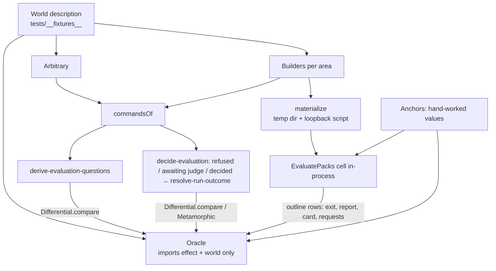

# pack-eval Test Suite Rebuild - Plan

## Goal Capsule

- **Objective:** The owner can trust that pack-eval's routing scores, contradiction verdicts, and exit codes are right across the whole range of possible inputs. Every expected value traces to the evaluation method, never to a number typed into a test.
- **Product authority:** The owner decides. Only `evals/pack-eval` is in scope. Other packages, and gates that would hold them to this bar, are not active scope.
- **Means:** One world description drives two test levels. Generated worlds run through pack-eval's pure workflows and are compared with a reference oracle through `@systemfsoftware/differential-spec` (KTD1). Named outline rows run the real cells against temp folders and the loopback provider (KTD6).
- **Execution profile:** `ce-work` runs U1-U10 in dependency order on branch `feat/pack-eval`, committing each unit on its own. Product fixes that the oracle forces land as separate `fix` commits (R18).
- **Stop conditions:** Stop and report instead of continuing when the oracle and the product disagree on a point the method sources do not settle, when a lint rule blocks a planned file (never weaken the rule: CONST-E9), or when the full pack-eval run exceeds 30 seconds after U8.
- **Finishes and ships:** `lfg` pushes the commits to PR #504 and watches CI until it passes (R19).
- **Open blockers:** None.

---

## Product Contract

### Summary

Rebuild pack-eval's tests around a single description of a test world. A world is plain data: packs, dataset files, and scripted provider answers. Generated worlds exercise pack-eval's decision logic directly, with no I/O. Named outline rows exercise the real commands against real folders and the loopback provider. An independent reference oracle derives every expected value at both levels, except for a few anchor rows worked out by hand and the seeded intervals, which are checked by relations between runs.

### Problem Frame

The suite passes (433 tests across 24 files), but it proves less than it appears to.

- Expected counts and verdicts are written out by hand in `tests/__fixtures__/evaluate-pack.fixture.ts` (585 lines). A test therefore compares the product with numbers someone once typed, not with the method.
- Worlds are switched by boolean flags (`renamedRule`, `malformedRule`) and fixed plan constants, so each new case needs another flag or another constant.
- The eight scenarios in `tests/evaluate-packs.integration.test.ts` share one Given/When skeleton and differ only in data, while the library's `scenarioOutline` goes unused.
- The same file declares local copies of the cell's type and computes judge calls by subtraction.
- The path-escape scenario appears in two files.
- Tests and fixtures total 6,131 lines, and each scenario checks exactly one hand-picked world.
- Evaluate's decisions (scoring, gating, verdicts, outcome) are private helpers inside the 1,323-line `evaluate-packs.cell.ts`. Nothing can exercise them over many worlds without disk and network I/O.
- The in-process `--help` smoke boot of `main.ts` that the pack-evaluator plan requires (U7) was deleted when the command tree moved into `main.ts`.

### Key Decisions

- **pack-eval only.** The rebuild sets the bar for one package and does not enforce it anywhere else. (session-settled: user-directed — chosen over pack rules plus lint or CI gates forcing every package: the owner chose the narrower rebuild.)
- **Hand-checked anchor rows guard the oracle.** Without them, a misreading of the method shared by the oracle and the product would go unnoticed. (session-settled: user-directed — chosen over trusting the oracle alone, and over hand-written expected columns in every table: anchors catch a shared misreading while every other value stays derived.) Governs R6, R7.
- **One world description serves both generated worlds and outline rows.** Worlds are described once, and refusal cases become data. (session-settled: user-directed — chosen over separate outline and property suites, and over an oracle that also recomputes bootstrap intervals: one description avoids drift, and interval relations avoid a second copy of judgy.) Governs R1, R8, R10, R11. Conflict call-out: the test-layer admission gate (`skill://test-layer-selection`, "Randomness vs I/O") refuses generated inputs that reach disk or network. Generated worlds therefore drive the pure decision logic (R10), and outline rows are the only worlds that reach the real commands (R11). Both levels still read the same world description and the same oracle.
- **Evaluate's decision logic becomes published pure workflows.** The code moves but pack-eval's behaviour stays the same. Generated worlds reach the decision through the published surface instead of private helpers. Governs R9, R20.
- **The rebuild lands in PR #504 before it merges.** The suite ships with the code it tests. (session-settled: user-directed — chosen over a follow-up PR after merge: main never carries the current suite.) Governs R19.
- **Mutation score is not a success criterion.** (session-settled: user-directed — the owner left mutation evidence out of the bar when choosing its parts.) Conflict call-out: `skill://test-layer-selection` calls a full mutation score non-negotiable for property and composition tests. The repo runs mutation only as the advisory CI workflow, and local runs stay banned (REPO-D3). The advisory report on #504 is read but does not gate this work.

### Requirements

**World description**

- R1. A test world is plain data: pack rule files, the dataset files (selector instruction, tasks, routing labels, pair labels, judge prompt), and scripted answers per provider role. Refusal cases are world data, not flags or one-off constants: a renamed or malformed rule, labels naming a missing rule, a provider refusal, pair labels without a judge prompt, and an unwitnessed pair.
- R2. Each test area has exactly one world builder: evaluate, discovery, review, fingerprint, rule selector, contradiction judge, and tune-judge. A builder starts from defaults that produce an admissible world, and its typed modifiers change only what they name.
- R3. The world generator is itself tested. A property confirms that every generated world is admissible or fails with the refusal it was built to hold, and the generator reports how its worlds are distributed across refusal kinds, label sparsity, and pair counts. Real datasets have sparse labels and few witnessed pairs, and the generated population must include both.

**Expectations**

- R4. A reference oracle derives these from a world alone: routing counts per rule and split, rule verdicts, TPR and TNR, witnessed pairs, judge validity, the run outcome and exit code, and which selector and judge questions the run asks. It is written from the method sources and never imports pack-eval's `src/`. (pack: boundary-testing, refusals-beside-generated-laws.md)
- R5. No assertion holds a hand-written expected value except on an anchor row (R6). Call counts come from the oracle's list of questions, never from subtraction.
- R6. A small set of anchor rows carries expected values worked out by hand from the method sources: `ai-evals-course/evals-skills` and judgy's Rogan-Gladen correction and bootstrap. Both the oracle and the product must match every anchor.
- R7. Seeded bootstrap intervals are checked by relations plus anchors, not by the oracle. The same world and seed give the same interval. Every interval lies within [0, 1] and contains its point estimate. At least one anchor row pins an exact interval.

**Decision level (generated worlds)**

- R8. The generator draws worlds from the R1 description, covering admissible worlds and every refusal kind.
- R9. Evaluate's decisions are reachable as one published pure workflow. Given an admitted dataset plus the selector and judge answers, it returns the report and the run outcome. pack-eval's commands keep their current observable behaviour. (pack: cell-architecture, pure-decision-workflows.md)
- R20. The questions an evaluate run can ask, meaning one selector question per task and pack and one judge request per validity or witness target, are derived by a published pure workflow from the admitted dataset alone. The cell asks every selector question, and asks the judge requests only when the decision workflow says the run awaits the judge.
- R10. Model-based properties run generated worlds through that workflow and through the other decision workflows, and compare the results with the oracle (R4) and the interval relations (R7). Each property declares its draw budget and a wall-clock bound, so an overrun fails as a budget breach rather than as a runner timeout.

**Command level (named rows)**

- R11. Integration scenarios that share a Given/When skeleton become one `scenarioOutline`. Its Examples rows are named worlds: the anchor rows, one row per refusal kind, and representative admissible rows. Each row runs the real command against real temp directories and the loopback OpenRouter listener, with no mocked internal glue and no spawned process. (pack: boundary-testing, real-system-oracles.md) (pack: boundary-testing, no-mocks-on-internal-glue.md)
- R12. On an empty answer cache, the requests the loopback listener receives equal the questions the oracle derives for that row.
- R13. `main.ts` has exactly one in-process smoke boot. `--help` lists every command, and a rejected command line exits 2.
- R14. Each behaviour is tested in one place. For example, the path-escape scenario now duplicated between discovery and review-pairs collapses to one.

**Test hygiene**

- R15. Tests call the published `PackEval` exports as a consumer would. They hold no local copy of a cell's or service's type and no casts. (pack: cell-architecture, decode-never-cast.md)
- R16. Every assertion reads output a consumer can observe: the exit code, the JSON report, the card on stdout, files written, requests reaching the loopback listener, or a published workflow's result.
- R17. The workflow property tests under `src/__tests__` follow the same rules: generators come from the schemas and respect declared filter floors, and assertions contain no unexplained literal values. (pack: boundary-testing, arbitrary-filter-floors.md)

**Product and delivery**

- R18. pack-eval's behaviour does not change. If the oracle and the product disagree because of a product defect, the fix goes into `src/` in its own `fix` commit, and the oracle is never bent to match. Changes stay inside `evals/pack-eval`, except an owned test library such as `@systemfsoftware/effect-gherkin-spec` when an outline cannot express a world row without a change there.
- R19. The rebuilt suite is committed on PR #504, with `pnpm check:local` and CI green, before #504 merges.

### Acceptance Examples

- AE1. **Covers R1, R11, R4.** **Given** the evaluate outline, **when** a row describes a pack whose labels name a rule file that was renamed, **then** the run exits 2, the loopback receives no request, and those expectations come from the oracle rather than from the row.
- AE2. **Covers R6, R4.** **Given** an anchor row with hand-worked TP, FN, FP, and TN counts, **when** both the oracle and the product evaluate it, **then** both match the hand values. An oracle that disagrees with an anchor fails the test even when the product agrees with the oracle.
- AE3. **Covers R7.** **Given** one world, **when** it is evaluated twice with the same seed, **then** the intervals are identical. With a different seed the interval may move, but it stays within [0, 1] and contains the point estimate.
- AE4. **Covers R10, R20, R4.** **Given** a generated world holding a rule pair that no labelled task needs together, **when** the question workflow derives its questions with a judge model set, **then** the judge questions equal the oracle's, and none concerns the unwitnessed pair.
- AE5. **Covers R12.** **Given** an outline row with a witnessed and an unwitnessed pair, **when** evaluate runs on an empty cache, **then** the loopback receives exactly the oracle's selector and judge questions.
- AE6. **Covers R18.** **Given** a generated world on which the oracle and the product disagree, **when** the cause is a product defect, **then** the fix lands in `src/` as its own commit, and the oracle stays as the method source states it.

### Success Criteria

- Tests and fixtures total fewer lines than the current 6,131, while covering at least every behaviour the current suite covers.
- The full `pnpm --filter @systemfsoftware/pack-eval test` run stays under about 30 seconds locally (about 8 seconds today).
- A deliberate one-line fault in scoring, witnessed-pair finding, judge validity, or exit-code mapping turns at least one generated property and one outline row red.

### Scope Boundaries

- Other packages' suites, and any pack rule, lint rule, or CI gate that would hold them to this bar.
- Mutation score as a gate (see Key Decisions).
- New product behaviour, flags, or report fields. R9 moves code without changing what any command does.
- A live OpenRouter run. Every world uses the loopback listener.

### Dependencies / Assumptions

- `@systemfsoftware/effect-gherkin-spec` exposes `scenarioOutline` with Examples rows and `<tag>` expansion (`packages/effect-gherkin-spec/src/Feature.ts:143`, `packages/effect-gherkin-spec/src/FeatureRuntime.ts:163`).
- The bootstrap is deterministic for a given seed (`evals/pack-eval/src/bootstrap-rate-interval.workflow.ts`), which makes R7's relations checkable.
- The loopback fixture (`evals/pack-eval/tests/__fixtures__/openrouter-loopback.fixture.ts`) serves scripted replies in request order and records every request (`requests`, `requestCount`). It cannot yet answer by request content; U3 adds that.

### Sources / Research

- `docs/plans/2026-09-24-0049-feat-pack-evaluator-plan.md`: the product plan whose behaviour this suite proves (U1-U15, AE1-AE7; U7's smoke boot).
- `evals/pack-eval/tests/__fixtures__/evaluate-pack.fixture.ts:133` (`evaluateWorld` flags), `:192-209` (hand-written `expectedCounts` and `expectedVerdict`).
- `evals/pack-eval/tests/evaluate-packs.integration.test.ts:30-68` (local cell interfaces, judge calls computed by subtraction), `:106-282` (eight scenarios on one skeleton).
- `evals/pack-eval/tests/discovery.integration.test.ts:240` and `evals/pack-eval/tests/review-pairs.integration.test.ts:317` (the duplicated path-escape scenario).
- Hughes, [How to Specify It!](https://research.chalmers.se/publication/517894/file/517894_Fulltext.pdf): model-based properties find the most bugs fastest. Metamorphic properties are the alternative where a model is expensive, which is the case for the bootstrap. "Avoid replicating your code in your tests." Test your generators.
- Software wiki `wiki/concepts/property-test-admissibility.md` (a verdict comes from an independent model or a relation; generated population matches the real one; declared per-case budget) and `wiki/concepts/oracle-independence.md` (the oracle comes from the specification, not the implementation under test).
- `skill://test-layer-selection`: decisions get property tests only, cells get sociable integration, and the composition root gets a smoke boot only. Random inputs must not reach I/O.
- [ai-evals-course/evals-skills](https://github.com/ai-evals-course/evals-skills) `validate-evaluator` and [judgy](https://github.com/ai-evals-course/judgy): the method sources for the oracle and the anchors.
- `packages/differential-spec/README.md`: the repo's harness for differential and metamorphic checks (`Differential.compare`, `Metamorphic.on`, `runBudget`, `interruptAfterTimeLimit`).
- `packages/oxlint-plugin/oxlint-plugin-test-discipline/README.md`: outside `src/`, a test file ends `.integration.test.ts`, `.differential.test.ts`, or `.trace.test.ts`. `differential-test-requires-harness` binds the differential lane to `@systemfsoftware/differential-spec` and forbids raw runner calls there.
- `docs/solutions/conventions/unsanctioned-property-lane-rehomed-as-deterministic-universals.md`: `property-file-purity` admits only boolean `it.prop` predicates, and a fast-check import inside an integration file is a violation.

---

## Planning Contract

Product Contract preservation: restructured, no scope change. R20 was added beside R9 because an evaluate run asks its provider questions between pure steps, and the questions need their own published workflow to be checked over generated worlds. The Key Decision on published workflows now governs R9 and R20, and AE4 covers R20. The five Deferred-to-Planning questions are answered by KTD1, KTD2, KTD4, KTD5, KTD6, and U4, and review added KTD7's matching rule and KTD9, so the Product Contract's Outstanding Questions section was removed.

### Key Technical Decisions

- KTD1. **Generated worlds run in `tests/*.differential.test.ts` through `@systemfsoftware/differential-spec`.** The reference side is the oracle and the candidate side is a published pack-eval workflow. Each check declares its `runBudget` and `interruptAfterTimeLimit` (R10). This is the lane the repo reserves for model-based and metamorphic checks, and `differential-test-requires-harness` enforces it. Rejected: `it.prop` under `src/__tests__/`, because `property-file-purity` allows only boolean `it.prop` predicates and a world-versus-oracle comparison returns structured differences. Rejected: `it.prop` in integration files, because fast-check imports are banned there. Governs R3, R10.
- KTD2. **Evaluate splits into two published pure workflows.** `derive-evaluation-questions` takes the admitted dataset and the request's judge settings and returns the selector questions and the judge requests (R20). `decide-evaluation` takes the admitted dataset, the selector answers, and optional judge answers, and returns one of three tagged decisions: refused, awaiting the judge, or decided with the report parts that `resolve-run-outcome` consumes (R9). The read phase gathers the inputs and asks every selector question. It then calls `decide-evaluation` without judge answers. Only on awaiting-the-judge does it ask the judge requests and call it again with the answers. Today the cell refuses before judging when any selection fails or routing scoring refuses (`evals/pack-eval/src/evaluate-packs.cell.ts:476-490`, `:450-474`), so whether the judge is asked depends on selector answers, and the awaiting-the-judge decision keeps that rule pure. The decide phase composes `decide-evaluation`'s decided result with `resolve-run-outcome` through `Workflow.andThen`. (pack: cell-architecture, pure-decision-workflows.md) (pack: cell-architecture, sandwich-phase-order.md)
- KTD3. **The world is one plain-data type with three interpreters.** The world description lives in `tests/__fixtures__/`. It has a builder per test area, a fast-check arbitrary, and three interpreters: `commandsOf` builds the published workflow commands with no I/O, `materialize` writes the world to a scoped temp directory and scripts the loopback, and the oracle reads the world directly. Only `commandsOf` and `materialize` import `@systemfsoftware/pack-eval`.
- KTD4. **The oracle is `tests/__fixtures__/pack-eval-oracle.fixture.ts` and imports only `effect` and the world fixture.** It returns plain records: counts, verdict tags, point-estimate rates, witnessed pairs, validity tags, outcome, and question keys. Differential relations compare these with projections of the product's typed results. Its independence from `src/` and from `@systemfsoftware/pack-eval` (R4) is checked by the Verification Contract's grep.
- KTD5. **Interval checks are relations, not recomputation.** A differential relation takes the oracle's exact point estimate and requires the product's interval to lie within [0, 1] and contain it. A metamorphic identity relation (same world, same seed) requires byte-identical intervals. One anchor pins an exact interval (R7). (session-settled: user-directed — chosen over an oracle that recomputes bootstrap intervals: relations plus anchors avoid a second copy of judgy.) Governs R7.
- KTD6. **Command-level rows use `scenarioOutline` under `withScenarioLayer(openRouterLoopback)`.** Each row gets a fresh scope, temp directories, and loopback, following `packages/effect-gherkin-spec/tests/order-fulfillment-lifecycle.integration.test.ts`, so `effect-gherkin-spec` needs no change. A row names a world. The oracle supplies each row's expectations, except the anchor rows (R11).
- KTD7. **The loopback answers by request content.** `materialize` scripts replies keyed by the question each request carries: the task and pack for the selector, the pair and task for the judge. It finds a request's question by locating the world's own strings in the request text: the task text, the pack id, and the rule stems. Worlds give these values unique, non-overlapping strings, so matching depends only on the prompt containing them, which both drivers' prompts do (`evals/pack-eval/src/drivers/openrouter-rule-selector.ts:38-46`, `evals/pack-eval/src/drivers/openrouter-contradiction-judge.ts:38-51`), and not on the template's wording. A request that matches no question, or more than one, fails the row. A reply then no longer depends on call order, and a row can compare the recorded request keys with the oracle's questions (R12). Rejected: adding structured metadata to the driver requests, which changes product behaviour for a test (R18).
- KTD8. **Anchors are data with written derivations.** `tests/__fixtures__/pack-eval-anchors.fixture.ts` holds four anchor worlds. Each carries hand-worked expected values and a comment deriving them from the method sources. The anchors cover a scored rule's counts plus TPR and TNR, an insufficient-evidence rule, a validated judge's Rogan-Gladen corrected rate, and one exact seeded interval. A differential check over the anchors compares the oracle with the hand values. Outline rows compare the product with them (R6).
- KTD9. **The smoke boot reaches `main.ts` through a published subpath.** `main.ts` keeps the command tree and exports `root` and `VERSION`. `NodeRuntime.runMain` runs only when `import.meta.main` is true (Node 24.20 in this repo), so importing the module runs nothing. Removing `main` from `exports.exclude` in `evals/pack-eval/tsdown.config.ts` publishes `@systemfsoftware/pack-eval/main` (REPO-S4: the config is edited, never `package.json#exports`). Tests may not import `src/` by relative path (`tests-import-public-api`), so a published subpath is the only in-process route. Rejected: a separate command-tree module, because the owner keeps command trees in `main.ts`. Rejected: spawning `dist/main.mjs`, because R13 requires an in-process boot. Governs R13.

### High-Level Technical Design

Both levels go through the same world and the same oracle. Generated worlds never reach `materialize` (R10), and outline rows never reach the arbitrary (R11).

### Assumptions

- The Rogan-Gladen corrected-rate interval may, by method, fail to contain its point estimate once clipping to [0, 1] applies. If U4 shows that judgy's method permits this, the containment relation applies to routing intervals only, the corrected-rate interval keeps the [0, 1] and same-seed relations, and the decision is recorded in U4's commit. Any other disagreement stops the run (Goal Capsule).
- The distribution evidence in R3 comes from a deterministic sample of the arbitrary at a fixed seed, asserted to include every refusal kind, labels at under 20% density, and packs with at most one witnessed pair. If `differential-spec` cannot express that without a raw runner call, the check lives in an integration scenario that calls a fixture helper, and fast-check stays inside the fixture.

### Sequencing

U1 extracts the workflows while the current suite still passes, so it serves as a characterization net. U2-U4 build the world, the oracle, and the decision-level checks. U5 replaces the evaluate integration suite. U6 and U7 rebuild the remaining suites. U8 restores the smoke boot. U9 cleans the workflow property tests. U10 deletes what the rebuild superseded and measures the result.

---

## Implementation Units

### U1. Extract evaluate's questions and decision into published workflows

**Goal:** Evaluate's questions and decisions are pure published workflows, and the cell keeps only I/O.
**Requirements:** R9, R20, R18; KTD2.
**Dependencies:** None.
**Files:** `evals/pack-eval/src/derive-evaluation-questions.workflow.ts` (new), `evals/pack-eval/src/decide-evaluation.workflow.ts` (new), `evals/pack-eval/src/evaluate-packs.cell.ts`, `evals/pack-eval/src/PackEval/mod.ts`, `evals/pack-eval/src/__tests__/derive-evaluation-questions.workflow.property.test.ts` (new), `evals/pack-eval/src/__tests__/decide-evaluation.workflow.property.test.ts` (new).
**Approach:**

1. Move the pure helpers into the two workflows, keeping their names where they still fit: the unknown-stem check, `admitDataset`, the gate and refusals, witnessed and validity targets, `buildJudgeRequests`, scoring, verdicts, judge validity, the corrected rates, and the report parts.
2. The read phase keeps `gatherInputs`, the selector calls, and the judge calls. It asks every derived selector question, and asks the derived judge requests only after an awaiting-the-judge decision (KTD2).
3. The decide phase runs `decide-evaluation`'s decided result through `resolve-run-outcome` (KTD2). The write phase is unchanged.
4. Append the new exports to `src/PackEval/mod.ts` in sorted order.

**Execution note:** Keep the current integration suite green after every move. It is the characterization net for R18.

**Patterns to follow:** `evals/pack-eval/src/resolve-run-outcome.workflow.ts` and `evals/pack-eval/src/build-judge-requests.workflow.ts` for the `Workflow.make` shape and tagged decisions.

**Test scenarios:**

- Admitted inputs whose labels name a missing rule stem derive no questions and decide a refusal naming each task.
- With empty pair labels, no judge requests are derived, whatever the judge model.
- With pair labels but no judge model, deciding gives a refusal that no answers can change.
- Derived selector questions are exactly the tasks crossed with the packs, each once.
- A selector fault on any question decides a refusal and never awaiting the judge.
- With pair labels, a judge prompt, and fault-free selector answers, deciding without judge answers awaits the judge, and deciding with them never awaits it again.
- With one pair witnessed by N labelled tasks and M `test` pair labels, the derived judge requests are exactly M validity requests and N witness requests, each naming its pack, rules, and task. An unwitnessed pair yields no witness request.
- Each refusal the cell raises today decides a refusal with the same detail, one scenario per source: an admission error, a witnessed-pairs refusal, a judge-request build refusal (unknown task, unknown stem, few-shot pair not in `train`), a bootstrap refusal (confidence outside (0, 1), zero iterations), an unbound judge, and a judge or answer-cache failure among the judge answers.

**Verification:** All 24 current test files still pass. The cell file holds no decision helper, so every pure function it used before now lives in a workflow. `pnpm exec oxlint .` and `pnpm exec tsc -b` are clean in the package.

### U2. World description, builders, and arbitrary

**Goal:** One plain-data world type, with a builder per test area and a generator.
**Requirements:** R1, R2, R8; KTD3.
**Dependencies:** None.
**Files:** `evals/pack-eval/tests/__fixtures__/pack-eval-world.fixture.ts` (new), `evals/pack-eval/tests/__fixtures__/pack-eval-world-arbitrary.fixture.ts` (new), `evals/pack-eval/package.json` (devDependency `@systemfsoftware/differential-spec`).
**Approach:**

1. The world holds the packs and their rules (stem, title, applies-when, body, or a malformed marker), the selector instruction, tasks with splits, routing labels, pair labels, the judge prompt, and the answers per question: the selector's chosen stems and the judge's verdict, critique, and served model.
2. Refusal kinds are world data, per R1.
3. Builders start from an admissible default and expose one typed modifier per R1 case: `withRenamedRule`, `withMalformedRule`, `withLabelNamingMissingRule`, `withUnwitnessedPair`, `withoutJudgePrompt`, and `withProviderRefusal`.
4. The arbitrary draws sparse labels, few witnessed pairs, and every refusal kind. Refusals are built by construction, never by `filter`. (pack: boundary-testing, arbitrary-filter-floors.md)

**Patterns to follow:** `evals/pack-eval/tests/__fixtures__/discovery-dataset.fixture.ts` for fixture layout. The Schema-derived arbitraries in `evals/pack-eval/src/__tests__/estimate-corrected-rate.workflow.property.test.ts` for bounded generation.

**Test scenarios:** Test expectation: none -- the world is test support. U4's generator-validity check proves it (R3).

**Verification:** The fixtures type-check and lint clean, and they import no module under `src/`.

### U3. Interpreters: workflow commands and disk worlds with a content-keyed loopback

**Goal:** A world can become published workflow commands, or files on disk plus loopback replies.
**Requirements:** R11, R12, R15; KTD3, KTD7.
**Dependencies:** U1, U2.
**Files:** `evals/pack-eval/tests/__fixtures__/pack-eval-commands.fixture.ts` (new), `evals/pack-eval/tests/__fixtures__/pack-eval-disk.fixture.ts` (new), `evals/pack-eval/tests/__fixtures__/openrouter-loopback.fixture.ts`.
**Approach:**

1. `commandsOf` builds the question and decision commands from the published `PackEval` schemas.
2. `materialize` writes the rule files and dataset JSON through `PackEval.DatasetFiles` into a scoped temp directory, then scripts the loopback.
3. The loopback gains `answerBy`, which maps a request to its reply by the question the request carries (KTD7). `answerWith` stays for the provider-driver suites that script transport faults.

**Patterns to follow:** The existing `evaluateWorld` writing sequence in `evals/pack-eval/tests/__fixtures__/evaluate-pack.fixture.ts`, which U10 deletes.

**Test scenarios:** Test expectation: none -- the interpreters are exercised by U4 and U5, whose failures would expose them.

**Verification:** U5's outline rows pass with requests answered in any order.

### U4. Reference oracle, anchors, and differential checks

**Goal:** The oracle and the anchors, and the decision-level checks over generated worlds.
**Requirements:** R3, R4, R5, R6, R7, R10, R20; KTD1, KTD4, KTD5, KTD8. AE2, AE3, AE4, AE6.
**Dependencies:** U1, U2, U3.
**Files:** `evals/pack-eval/tests/__fixtures__/pack-eval-oracle.fixture.ts` (new), `evals/pack-eval/tests/__fixtures__/pack-eval-anchors.fixture.ts` (new), `evals/pack-eval/tests/evaluate-decision.differential.test.ts` (new).
**Approach:**

1. Write the oracle from the method sources: evals-skills `validate-evaluator` for TPR and TNR, judgy for the Rogan-Gladen correction, and the pack-evaluator plan's R-IDs for gating and exit codes. Never read `src/` while writing it (R4).
2. Build a differential check for each: questions, routing counts and verdicts, witnessed pairs, judge validity, outcome and exit code, interval containment, and anchors versus the oracle.
3. Add one metamorphic same-seed identity check.
4. Add a generator-validity check: the world's intended refusal kind against the product's admission result (R3).
5. Declare `runBudget` and `interruptAfterTimeLimit` on every check. Size them so the file stays within its share of the 30-second budget.

**Execution note:** Write the oracle before reading the new workflows' bodies. If a check disagrees, decide per R18 and the Goal Capsule's stop conditions.

**Test scenarios:**

- Covers AE4. A generated world with an unwitnessed pair yields judge questions equal to the oracle's, and none names that pair.
- Covers AE2. The oracle reproduces each anchor's hand-worked counts, rates, corrected rate, and interval.
- Covers AE3. The same world and seed give identical intervals. Every interval lies within [0, 1] and contains the oracle's point estimate.
- Generated refusal worlds decide outcome 2 with no questions derived. Admissible worlds decide the oracle's outcome.
- A world with pair labels and a validated judge yields the oracle's witnessed failures and corrected rate.

**Verification:** A deliberate one-line fault in `score-rule-routing`, `find-witnessed-pairs`, `assess-judge-validity`, or the exit mapping turns a check red, and restoring it turns the check green. The oracle file matches no import of `@systemfsoftware/pack-eval` or `src/`.

### U5. Rebuild the evaluate integration suite as outlines

**Goal:** Evaluate's command-level behaviour is covered by outline rows over named worlds.
**Requirements:** R5, R11, R12, R15, R16; KTD6, KTD7. AE1, AE5.
**Dependencies:** U3, U4.
**Files:** `evals/pack-eval/tests/evaluate-packs.integration.test.ts` (rewrite).
**Approach:**

1. One Feature with two outlines, routing and contradiction. Their rows are the anchor worlds, one row per refusal kind, and representative admissible worlds.
2. Each row materializes its world into its own temp directory, including an empty cache directory, so no row shares cache state. It runs `PackEval.EvaluatePacks.run.run` in-process and checks the exit code, report fields, card lines, and recorded request keys against the oracle.
3. Anchor rows check against the hand values instead.
4. The file holds no local interfaces and no arithmetic on call counts.

**Test scenarios:**

- Covers AE1. The renamed-rule row exits 2 and the loopback records no request.
- Covers AE5. A row with a witnessed and an unwitnessed pair records exactly the oracle's selector and judge questions on an empty cache.
- Malformed-rule, missing-judge-prompt, and provider-refusal rows each exit 2 and name the cause on the card.
- The validated-judge Fail row exits 1 and lists the pair, the task, and the critique.
- The unvalidated-judge row exits 0 and marks the judge advisory.
- The anchor rows produce the anchors' counts, verdicts, corrected rate, and interval in the report.

**Verification:** The file passes with no hand-written expected value outside the anchors fixture.

### U6. Rebuild the discovery and review suites

**Goal:** The discovery, review-server, and review-pairs suites use their area builders and outlines, and each behaviour is tested once.
**Requirements:** R2, R11, R14, R15, R16.
**Dependencies:** U2, U3.
**Files:** `evals/pack-eval/tests/discovery.integration.test.ts`, `evals/pack-eval/tests/review-server.integration.test.ts`, `evals/pack-eval/tests/review-pairs.integration.test.ts`, `evals/pack-eval/tests/__fixtures__/discovery-dataset.fixture.ts`, `evals/pack-eval/tests/__fixtures__/review-server.fixture.ts`.
**Approach:**

1. Re-express each fixture as a builder over the world type.
2. Fold scenarios that share a skeleton into outlines.
3. Keep the path-escape scenario only in the review-pairs suite, which covers both the trace writer and the reader, and delete it from discovery.

**Test scenarios:**

- Accepted offers join the task set and rejected offers never do, as outline rows per decision.
- A label naming a rule the pack does not hold is refused, as one row per label kind (routing and pair).
- A task id carrying slashes and `..` keeps its trace inside the work directory.
- The selector stays hidden until a task is labelled.

**Verification:** Every behaviour the three files covered before maps to a row or scenario after the rebuild. The mapping is listed in U6's commit body.

### U7. Rebuild the provider-driver, fingerprint, and tune-judge suites

**Goal:** The rule-selector, contradiction-judge, task-generator, fingerprint, and tune-judge suites use builders and outlines.
**Requirements:** R2, R11, R15, R16.
**Dependencies:** U2, U3.
**Files:** `evals/pack-eval/tests/rule-selector.integration.test.ts`, `evals/pack-eval/tests/contradiction-judge.integration.test.ts`, `evals/pack-eval/tests/task-generator.integration.test.ts`, `evals/pack-eval/tests/compute-fingerprint.integration.test.ts`, `evals/pack-eval/tests/tune-judge.integration.test.ts`, `evals/pack-eval/tests/__fixtures__/fingerprint-checkout.fixture.ts`, `evals/pack-eval/tests/__fixtures__/tune-judge.fixture.ts`.
**Approach:**

1. Provider-fault scenarios (a refused call, an unknown stem, a missing critique) become outline rows over reply kinds.
2. The fingerprint's input-change scenarios become rows, one per input kind.
3. Tune-judge's expected rates come from the oracle's rate function applied to the dev labels.

**Test scenarios:**

- Each provider fault is reported with its role and model, and no selection or verdict is kept.
- Asking the same question twice reaches the provider once, and different models keep separate answers.
- A change to any input moves the fingerprint, and a file outside the inputs leaves it unchanged.
- Tune-judge judges dev pairs only, and its printed TPR and TNR equal the oracle's.

**Verification:** Every behaviour the five files covered before maps to a row or scenario. The mapping is listed in U7's commit body.

### U8. Restore the main.ts smoke boot

**Goal:** One in-process smoke boot of the composition root.
**Requirements:** R13.
**Dependencies:** None.
**Files:** `evals/pack-eval/src/main.ts`, `evals/pack-eval/tsdown.config.ts`, `evals/pack-eval/tests/main.integration.test.ts` (new).
**Approach:** Apply KTD9. The test imports `root` and `VERSION` from `@systemfsoftware/pack-eval/main` and runs `Command.runWith(root, { version: VERSION })` with `--help`, then with an unknown subcommand. The deleted test at `git show 256db8d7e86^:evals/pack-eval/tests/main.integration.test.ts` shows the in-process layer stack (recording console, test stdio and terminal, loopback client). If `import.meta.main` is not false under vitest, stop and report (Goal Capsule).
**Test scenarios:**

- `--help` lists evaluate, fingerprint, generate, trace, review, and tune-judge.
- An unknown subcommand exits 2.

**Verification:** The file passes, and no test spawns a process. After build, running `node evals/pack-eval/dist/main.mjs --help` by hand still prints help and exits 0, so the guard did not stop the binary.

### U9. Clean the workflow property tests

**Goal:** The files under `src/__tests__` meet R17.
**Requirements:** R15, R17.
**Dependencies:** None.
**Files:** `evals/pack-eval/src/__tests__/*.workflow.property.test.ts`, `evals/pack-eval/src/__tests__/schema-refusals.test.ts`.
**Approach:**

1. Replace unexplained literals with values drawn from, or named by, the schemas.
2. Replace `filter` chains with constructed arbitraries.
3. Delete any property that re-runs the implementation to compare it with itself. (wiki `concepts/property-test-admissibility.md` term 3)

**Test scenarios:** Test expectation: none -- this unit changes how existing laws are written, not what they claim. The existing laws must still fail when their workflow is sabotaged.

**Verification:** Each changed file still goes red under a one-line sabotage of its workflow.

### U10. Delete superseded fixtures and measure

**Goal:** Nothing superseded remains, and the success criteria are measured.
**Requirements:** R14, R19; Success Criteria.
**Dependencies:** U4, U5, U6, U7, U8, U9.
**Files:** `evals/pack-eval/tests/__fixtures__/evaluate-pack.fixture.ts` (delete), plus any fixture left unused.
**Approach:** Delete unused fixtures and exports. Count test and fixture lines. Time the full package run.
**Test scenarios:** Test expectation: none -- deletion and measurement.
**Verification:** The line total is below 6,131. The package test run takes under about 30 seconds locally. `pnpm check:local` exits 0.

---

## Verification Contract

| Gate                | Command or check                                                                                                                   | Proves                                                                              |
| ------------------- | ---------------------------------------------------------------------------------------------------------------------------------- | ----------------------------------------------------------------------------------- |
| Package tests       | `pnpm --filter @systemfsoftware/pack-eval test`                                                                                    | R1-R17, R20 behaviour; AE1-AE5                                                      |
| Package lint        | `pnpm --filter @systemfsoftware/pack-eval exec oxlint .`                                                                           | Lane placement, harness use, gherkin structure, public-API imports (R11, R15; KTD1) |
| Package types       | `pnpm --filter @systemfsoftware/pack-eval exec tsc -b`                                                                             | Tests compile against the published types (R15)                                     |
| No test casts       | grep `evals/pack-eval/tests` and `evals/pack-eval/src/__tests__` for `\bas [A-Z]`, `as unknown`, and `!\.`; expect no match        | R15                                                                                 |
| Oracle independence | grep `evals/pack-eval/tests/__fixtures__/pack-eval-oracle.fixture.ts` for `@systemfsoftware/pack-eval` and `src/`; expect no match | R4                                                                                  |
| Fault detection     | One-line sabotage per target in U4 turns a check red, and restoring it turns the check green                                       | Success Criteria                                                                    |
| Size and time       | Line count of `tests/` plus `src/__tests__/`; wall time of the package test run                                                    | Success Criteria                                                                    |
| Repo gate           | `pnpm check:local` exits 0                                                                                                         | R19                                                                                 |
| CI                  | `gh pr checks 504 --watch --fail-fast`                                                                                             | R19                                                                                 |

Mutation runs stay in CI only (REPO-D3). The advisory Mutation report is read, not gated (Key Decisions).

---

## Definition of Done

- U1-U10 are committed on `feat/pack-eval`, each unit on its own. Any product fix the oracle forces is its own `fix` commit.
- Every gate in the Verification Contract passes on the final commit.
- The mapping of old behaviours to new rows or scenarios in U6 and U7 shows no behaviour dropped.
- No abandoned-attempt code remains: no unused fixture, export, or helper, and no commented-out test.
- PR #504's description names the rebuild and states the measured lines and run time.
