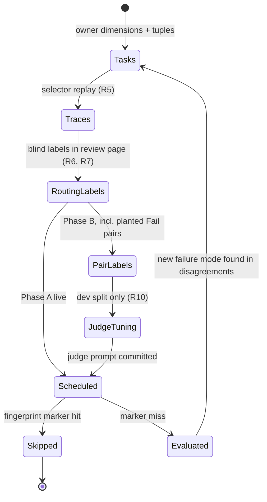
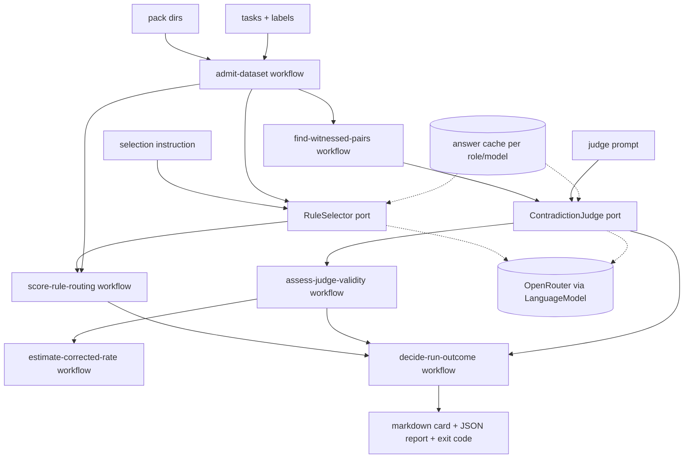

# Compound Pack Evaluator - Plan

## Goal Capsule

- **Objective**: For any set of compound packs, the repo owner can see, with measured confidence, which rules the agent's real rule selection loads on the wrong tasks or misses on the right ones. Once contradiction labels exist, the owner can also see which rule pairs contradict each other on a task that needs both.
- **Means**: A private CLI at `evals/pack-eval`. It replays CE's rule-selection step and scores it in code against owner labels (KTD1, KTD2). In a second phase it adds a validated, critique-first contradiction judge (KTD3). The method follows `ai-evals-course/evals-skills` and a TypeScript port of `ai-evals-course/judgy` (KTD4).
- **Product Authority**: Repository owner, through the `ce-brainstorm` and `ce-plan` dialogue of 2026-09-23 and 2026-09-24.
- **Stop conditions**: Stop and report if `@effect/ai-openrouter` at the catalog's `effect` version cannot be installed. Stop if OpenRouter's structured-output mode cannot return the selector's or the judge's object shape for the configured model (U5 and U13 prove it).
- **Execution profile**: Two phases.
  - Phase A (routing) is U1-U7 and U10. It lands as one PR, followed by U8 (dataset scaffold) and U9 (workflow), each in its own commit because they are Evaluator-class surfaces under the root `AGENTS.md` Surface Classes table.
  - Phase B (contradiction) is U11-U15, in a second PR.
- **Finish and ship**: The implementer delivers each PR watched to green (REPO-D1) and runs the workflow once by manual dispatch. The labels are the owner's work, entered in the review page. The implementer never authors them.

---

## Product Contract

### Summary

`pack-eval` evaluates any compound pack directories it is given.

- **Phase A: routing.** It replays CE's rule selection over a labelled task set and scores it in code. Each rule gets rates with confidence intervals.
- **Phase B: contradiction.** It adds a binary judge. The judge is asked only about rule pairs a labelled task needs together, and it must pass validation against owner labels before it can fail a run.

The tool runs daily in GitHub Actions, does work only when an input changed, and never gates a merge.

### Problem Frame

Compound packs inject rules into agent planning and review. A rule reaches the agent only when CE's selection step decides its `applies_when` matches the work. That step is a model reading `title`, `applies_when`, and `tags` under a consumer-specific instruction. Examples are the `learnings-researcher` prompt used by `ce-plan` and `ce-code-review`, and the pack instructions in `ce-doc-review` and `ce-dogfood`. A key that is too narrow leaves work unguarded. A key that is too broad taxes every unrelated run. Two rules that one change cannot both satisfy leave review with no arbiter. No instrument in the repo measures any of this.

The previous attempt measured a stand-in decision model, not the selection step. It fixed the pack set at the repo's own two packs. It used unvalidated four-label judgments and reported rates without intervals. It was also built outside the repo's own cell and boundary-testing law. No pack failure has been observed, so this is a preventive instrument. Its dataset is designed and labelled by the owner, not mined from incidents.

### Key Decisions

- **Semantic evaluation only: routing and contradiction** (session-settled: user-directed — chosen over also linting frontmatter and compiling embedded snippets: frontmatter linting is trivial, and snippets are elided sketches). Governs R1, R7, R9.
- **Packs are a runtime parameter, never named in code or fixtures** (session-settled: user-directed — chosen over evaluating the repo's two packs by name: the tool must serve any pack). Governs R1, R2.
- **Evaluate CE's real selection step, not a proxy model reading `applies_when`**. The selection instruction is an input, so the tool follows whichever consumer is being evaluated. Governs R3, R5.
- **Method follows `ai-evals-course/evals-skills` and `ai-evals-course/judgy`** (user-named sources). Discovery comes before scoring. Judges are binary and critique-first. Validation uses train/dev/test splits with TPR/TNR. Aggregates are corrected with Rogan-Gladen and carry bootstrap intervals. Governs R4, R6, R8, R10, R11, R12.
- **Routing ships before contradiction**. Routing needs only task labels. Contradiction also needs about 100 pair labels, including planted Fail pairs. Governs R9, R10, R11, R12.
- **Advisory report, never a merge gate** (session-settled: user-approved — chosen over enrolling in `pnpm check:local` or PR checks: `compound-packs/` is Doctrine and never an input to a gate). Governs R14.
- **Daily scheduled job that skips unless an input changed** (session-settled: user-directed — chosen over a hand-run command and over evaluating unconditionally every day). Governs R14, R15.
- **Provider chosen by configuration, OpenRouter by default** (session-settled: user-directed — chosen over binding to one vendor's API). Governs R16.

### Requirements

**Inputs**

- R1. Every run takes the pack directories to evaluate as arguments. A pack's id is its directory name. A top-level `README.md` is the pack's description and never a rule.
- R2. Every rule file must decode to a title, a non-empty `applies_when` list, tags, and a body. A file that fails is refused, the refusal names the file, and no model is called.
- R3. The selection instruction is an input file that records its provenance: the consumer it was taken from, the plugin version, and the source path.

**Discovery and labelling**

- R4. The tool generates candidate tasks from owner-written dimensions and tuples. Tuples expand to tasks in a second, separate step. The owner accepts or rejects each candidate before it enters the task set.
- R5. The tool runs the selection step over the task set and keeps each trace: task, instruction fingerprint, model, the rules it loaded, and the raw response.
- R6. A local review page lets the owner label, for each task and each rule, whether the rule governs the work. Routing labels are entered blind: the page does not show the selector's output until that task is labelled. In Phase B the page also labels contradiction pairs Pass or Fail, with notes.
- R7. Routing labels are judged from the rule's body, not its `applies_when`: "does this rule constrain the work this task requires?"

**Routing (Phase A)**

- R8. Each rule's report shows TP, FN, FP, and TN counts and TPR and TNR with a 95% bootstrap interval, per split (dev, test). A rule below the evidence floor in a split is marked insufficient evidence instead of getting rates.
- R13. A label that names a rule no longer in its pack is refused, naming the task and the rule. A rule with no labels is reported as unlabelled, not scored as a negative.

**Contradiction (Phase B)**

- R9. A contradiction is judged only for a rule pair that some labelled task needs both of. The judge sees that task and both rule bodies, and writes a critique before its verdict. A pair no labelled task needs both of is listed as unwitnessed and is not judged.
- R10. The judge is validated on owner-labelled pairs split into train, dev, and test. Few-shot examples come only from train. Tuning reads dev only. The judge counts as validated when its test TPR and TNR both reach the configured minimum (default 0.8).
- R11. A run fails only when a validated judge returns Fail on at least one witnessed pair. An unvalidated judge's verdicts are reported as advisory and never fail a run. Before pair labels exist, the report says contradiction is not yet evaluated.
- R12. For each pack, the report gives the corrected contradiction rate among witnessed pairs (Rogan-Gladen) with a 95% bootstrap interval, only when the judge is validated.

**Operation**

- R14. The evaluation runs daily as a scheduled GitHub Actions job and on manual dispatch, and can be run locally. It is never a required check.
- R15. A scheduled run does nothing when the fingerprint is unchanged since the last completed evaluation. The fingerprint covers pack files, task set, labels, selection instruction, judge prompt, evaluator code and lockfile, model ids, and the scoring parameters (seed, iterations, thresholds, evidence floor).
- R16. The selector model, judge model, and provider come from configuration and have no default model id. The report records the model id the provider says it served.
- R17. Each run writes a markdown report card to stdout (appended to the run summary in CI) and a schema-versioned JSON report to a path. Neither is committed.

### Acceptance Examples

- AE1. Loaded where it should be
  - **Covers:** R5, R8
  - **Given:** A task labelled as governed by rule `a`, and a selector that loads `a`.
  - **When:** Routing is scored.
  - **Then:** Rule `a` gets TP 1 in that task's split.
- AE2. Leak on an unrelated task
  - **Covers:** R8
  - **Given:** A "fix a typo in the README" task labelled as governed by no rule, and a selector that loads a broad rule `b`.
  - **When:** Routing is scored.
  - **Then:** Rule `b` gets FP 1, its TNR drops, and the run does not fail on this alone.
- AE3. Validated judge fails the run on a witnessed contradiction
  - **Covers:** R9, R10, R11
  - **Given:** A validated judge, and a task labelled as needing both `c` and `d`, whose bodies prescribe opposite placements for the same code.
  - **When:** The pair is judged and the judge returns Fail with a critique.
  - **Then:** The report shows the pair, the task, and the critique, and the outcome is exit code 1.
- AE4. Unvalidated judge cannot fail a run
  - **Covers:** R10, R11
  - **Given:** A judge whose test TNR is 0.6, and the same witnessed pair as AE3.
  - **When:** The evaluation runs.
  - **Then:** The report marks the judge unvalidated and the verdict advisory, and the outcome is exit code 0.
- AE5. Unwitnessed pair is not judged
  - **Covers:** R9
  - **Given:** Two rules no labelled task needs both of.
  - **When:** The evaluation runs.
  - **Then:** The pair is listed as unwitnessed, and no judge call is made for it.
- AE6. Unchanged inputs skip
  - **Covers:** R15
  - **Given:** A completed evaluation for the current fingerprint.
  - **When:** The next scheduled run starts with no input changed.
  - **Then:** The job reports "fingerprint unchanged" and makes no provider call.
- AE7. Renamed rule breaks labels loudly
  - **Covers:** R13
  - **Given:** Labels naming rule `e`, after `e.md` is renamed to `f.md`.
  - **When:** The evaluation runs.
  - **Then:** It is refused before any model call, and the message names each task that labels `e`.

### Scope Boundaries

- **Outside this product's identity**:
  - Rewriting or auto-fixing rule files. The tool diagnoses; authors revise.
  - Blocking pull requests.
  - Frontmatter linting and snippet compilation.
- **Deferred to Follow-Up Work**:
  - Contradictions between rules of different packs.
  - Running full CE skills end to end to observe selection inside a real planning run. The replayed selection step is the evaluated unit here.
  - Predefined failure-mode tags in the review page. `build-review-interface` adds them only after error analysis names the categories.

### Success Criteria

These need the owner's labels, so they are observed after the implementer's Definition of Done:

- The first scheduled run after routing labels land publishes a card for every evaluated pack. Each rule gets rates with intervals or an explicit insufficient-evidence mark.
- After Phase B pair labels land, the judge reaches validated status on the test split, or the report names which rate fell short and by how much.
- After a one-rule edit, the next run re-asks only the calls whose inputs involve that rule. The summary shows cache hits for everything else.

---

## Planning Contract

### Key Technical Decisions

- KTD1. **The evaluated unit is the selection step replayed through a text model.** The selector receives the instruction file (R3), each rule's `title`, `applies_when`, and `tags`, and the task. It returns the loaded rule stems as a structured object via Effect `LanguageModel.generateObject` (`repos/effect/packages/effect/src/unstable/ai/LanguageModel.ts`). Rule bodies never reach the selector, which matches what CE consumers read (`ce-plan/references/agents/learnings-researcher.md`, `ce-doc-review/references/dispatch.md`). This supersedes the earlier user-approved choice of discern with a Jev-class decision model: Jev measured a stand-in, not the selection step, and returns no reasoning.
- KTD2. **Routing is scored in code; only contradiction uses a model judge.** Once labels exist, routing correctness is a set comparison per task and rule. `write-judge-prompt` requires exhausting code checks before reaching for a judge.
- KTD3. **The contradiction judge is one binary, critique-first check.** Its criterion: "on this task, can one change satisfy both rules?" It outputs `{critique, verdict: Pass | Fail}`, with the critique first, through `generateObject`. The prompt file holds the criterion, the Pass and Fail definitions, and 2-4 few-shot example ids that must come from the train split (`evals-skills/write-judge-prompt`). Witness scoping follows WIRE (arXiv 2605.27784): a pair is judged only against a concrete task that needs both rules.
- KTD4. **Statistics are a pure TypeScript port of `judgy.estimate_success_rate`.** A port was chosen over calling `judgy` in a Python subprocess: the tool and CI stay on a single runtime, and the port's laws run in the workspace test suite. The port covers:
  - TPR and TNR from test labels;
  - the Rogan-Gladen point estimate, clipped to [0, 1];
  - a percentile bootstrap that resamples only the test labels, holds the observed rate fixed, and skips resamples with one class or with TPR + TNR ≤ 1.
    Refusals mirror judgy's errors, typed: empty input, non-binary input, mismatched lengths, one-class test labels, TPR + TNR ≤ 1, a confidence level outside (0, 1), and zero iterations. Per-rule routing intervals use the same seeded percentile bootstrap over tasks. Randomness comes from a seeded pure generator passed in the command, and the seed is recorded in the report. That keeps the core a pure workflow (pack: cell-architecture, pure-decision-workflows.md).
- KTD5. **Code conforms to the cell-architecture pack** (session-settled: user-directed — chosen over plain Effect code and over conforming only in tests: the tool must obey the law it serves). The module roles are:
  - `*.schema.ts` data contracts;
  - `*.workflow.ts` pure decisions at complexity 1 with exhaustive `Match`;
  - `*.service.ts` ports with zero driver imports;
  - `src/drivers/<tech>.ts` adapters;
  - `*.cell.ts` Sandwich shells;
  - a single `src/mod.ts` barrel.
    Layers are bound only in `src/main.ts`, and no `*.layer.ts` or `*.port.ts` exists (pack: cell-architecture, service-and-layer-boundaries.md; ports-separate-from-layers.md; sandwich-phase-order.md; single-namespace-barrel.md).
- KTD6. **Tests follow the test-layer permission matrix and the boundary-testing pack.**
  - `*.workflow.ts` files get property tests only.
  - `*.schema.ts` files get generated codec laws (`inlineSchemaTests`) plus hand-written refusals.
  - `*.cell.ts` files and drivers get in-process integration suites in `tests/` against real local oracles: a loopback listener at `127.0.0.1:0` that speaks OpenRouter's chat-completions wire, reached by the real `OpenRouterClient` through its `apiUrl` config (`repos/effect/packages/ai/openrouter/src/OpenRouterClient.ts`, `layerConfig`), and real temp directories.
  - No test spawns a process, and `main.ts` gets a smoke boot only (`skill://test-layer-selection`; pack: boundary-testing, real-system-oracles.md; no-mocks-on-internal-glue.md; refusals-beside-generated-laws.md).
- KTD7. **The answer cache is a scoped resource keyed by role, served model, and prompt digest.** It is loaded when its scope opens, written back to `.pack-eval/cache/<role>/<model>.json` when the scope closes, and gitignored. It is never committed (CONST-T11). Keying by model stops one model's answers from replaying as another's (pack: cell-architecture, resource-vs-handle-duality.md; scoped-lifecycle-boundaries.md).
- KTD8. **The fingerprint is computed by the tool and stored as an actions/cache marker.** `pack-eval fingerprint` digests the R15 inputs by sorted relative path and byte content, so the digest does not depend on the checkout location. The workflow looks up `pack-eval-done-<fingerprint>` and exits early on a hit. The marker is saved when an evaluation completes, whatever its verdict. Infrastructure failures save no marker (`skill://ci-failure-legibility`).
- KTD9. **The workspace lives at `evals/pack-eval` with `src/` and `tests/`** (session-settled: user-directed — chosen over `packages/` and over a flat layout). Its `private: true` exempts it from changesets. Workflow property suites sit in `src/__tests__/`, and cell and driver suites in `tests/`, mirroring `packages/effect-memfs`.
- KTD10. **Rule frontmatter is parsed with the `yaml` package and decoded through Schema** (pack: cell-architecture, decode-never-cast.md). The catalog gains `yaml` and `@effect/ai-openrouter` and drops the `@effect-uai/*` entries added by the abandoned attempt.

### High-Level Technical Design

The evaluation lifecycle. Phase B's states activate only once pair labels exist.



Data flow of one evaluation. Only the drivers perform I/O beyond files.



Run outcome decision (`decide-run-outcome`):

| Contradiction state                          | Witnessed Fail verdicts | Exit | Report                                               |
| -------------------------------------------- | ----------------------- | ---- | ---------------------------------------------------- |
| Not evaluated (no pair labels)               | —                       | 0    | routing only; contradiction marked not yet evaluated |
| Judge validated                              | ≥ 1                     | 1    | failing pairs with task and critique                 |
| Judge validated                              | 0                       | 0    | corrected rate with interval                         |
| Judge unvalidated                            | any                     | 0    | verdicts marked advisory, shortfall named            |
| Validity refused (e.g. one-class test split) | any                     | 0    | refusal reason                                       |
| Input refused or provider error              | —                       | 2    | named file, label, or provider failure               |

### Output Structure

```text
evals/pack-eval/
  package.json            # private, bin: pack-eval
  oxlint.config.ts        # `all` preset via the recommended config
  vitest.config.ts        # inlineSchemaTests from effect-schema-vite
  src/
    mod.ts
    main.ts               # composition root, single runMain edge
    pack-rule.schema.ts
    task-set.schema.ts
    labels.schema.ts
    selector-instruction.schema.ts
    judge-prompt.schema.ts
    eval-report.schema.ts
    admit-dataset.workflow.ts
    estimate-corrected-rate.workflow.ts
    bootstrap-rate-interval.workflow.ts
    score-rule-routing.workflow.ts
    find-witnessed-pairs.workflow.ts       # Phase B
    assess-judge-validity.workflow.ts      # Phase B
    decide-run-outcome.workflow.ts
    rule-selector.service.ts
    task-generator.service.ts
    answer-cache.service.ts
    contradiction-judge.service.ts         # Phase B
    drivers/
      openrouter-rule-selector.ts
      openrouter-task-generator.ts
      file-answer-cache.ts
      review-server.ts
      review-page.html
      openrouter-contradiction-judge.ts    # Phase B
    generate-tasks.cell.ts
    trace-selection.cell.ts
    evaluate-packs.cell.ts
    compute-fingerprint.cell.ts
    tune-judge.cell.ts                     # Phase B
    __tests__/*.property.test.ts
  tests/
    fixtures/             # synthetic packs, tasks, labels, pairs
    support/openrouter-loopback.ts
    *.integration.test.ts
evals/compound-packs/     # the repo's own dataset (U8)
.github/workflows/pack-eval.yml
```

### Assumptions

- `@effect/ai-openrouter@4.0.0-rc.117` is on npm. It was verified published on 2026-09-24.
- The configured OpenRouter models support structured output for `generateObject`. U5 confirms this for the selector model, and U13 for the judge model.
- The owner labels about 100 tasks and, in Phase B, about 100 pairs (about 50 Pass and 50 Fail, including planted contradictions). Below 60 labelled items, intervals are wide, and the report says so (`evals-skills/validate-evaluator`).
- The repo owner adds an `OPENROUTER_API_KEY` Actions secret with prepaid credit.

### Sequencing

- **Phase A:** U1 → U2 → U3 and U4 in parallel → U5 → U6 and U10 in parallel → U7. U8 lands in its own commit after U7. U9 lands last, in its own commit.
- **Phase B:** U11 → U12 and U13 in parallel → U14 → U15.

---

## Implementation Units

### U1. Clear the abandoned attempt and scaffold the workspace

**Goal:** An empty, buildable, lintable `evals/pack-eval` workspace that meets the root mandates.
**Requirements:** R14 (runs locally); KTD5, KTD9, KTD10.
**Dependencies:** None.
**Files:** `evals/pack-eval/**` (delete existing `src/`, `test/`, and `dist/`), `evals/pack-eval/package.json`, `evals/pack-eval/oxlint.config.ts`, `evals/pack-eval/tsconfig*.json`, `evals/pack-eval/vitest.config.ts`, `evals/pack-eval/src/mod.ts`, `pnpm-workspace.yaml` (catalog: add `@effect/ai-openrouter`, `yaml`; remove `@effect-uai/core`, `@effect-uai/typesafe-ai`), `.gitignore` (`.pack-eval/`).
**Approach:**

1. Delete every source and test file of the abandoned attempt. Nothing is carried over.
2. Mirror the manifest, tsconfig, and vitest shape of `packages/effect-memfs`, including `inlineSchemaTests` from `@systemfsoftware/effect-schema-vite`.
3. Depend on `effect`, `@effect/platform-node`, `@effect/ai-openrouter`, `@systemfsoftware/effect-cell-types`, and `yaml`. Dev-depend on `@systemfsoftware/effect-schema-vite`, `@systemfsoftware/effect-gherkin-spec`, `@effect/vitest`, and `fast-check`.
4. Extend the recommended oxlint config (the `all` preset) as the root `AGENTS.md` requires.

**Patterns to follow:** `packages/effect-memfs/package.json`, `packages/effect-memfs/vitest.config.ts`.
**Test expectation:** none -- scaffolding.
**Verification:** Typecheck, lint, and test pass on the empty workspace, and `pnpm check:local` exits 0.

### U2. Data contracts with refusals

**Goal:** Every input and the report decode through Schema, and malformed files are refused with a named cause.
**Requirements:** R1, R2, R3, R6, R7, R13, R17; KTD3, KTD10.
**Dependencies:** U1.
**Files:** `evals/pack-eval/src/pack-rule.schema.ts`, `task-set.schema.ts`, `labels.schema.ts`, `selector-instruction.schema.ts`, `judge-prompt.schema.ts`, `eval-report.schema.ts`, `admit-dataset.workflow.ts` (all under `evals/pack-eval/src/`), `evals/pack-eval/src/__tests__/schema-refusals.test.ts`, `evals/pack-eval/src/__tests__/admit-dataset.workflow.property.test.ts`.
**Approach:**

1. `PackRule`: pack id, stem, title, non-empty `applies_when`, tags, body.
2. `TaskSet`: tasks with id, text, split (`dev` | `test`), and the dimension tuple that produced them.
3. `RoutingLabels`: per task and pack, the governing stems plus deferred stems.
4. `PairLabels`: task id, two stems, split (`train` | `dev` | `test`), verdict, origin (`observed` | `planted`), notes.
5. `SelectorInstruction`: text plus provenance. `JudgePrompt`: criterion, Pass and Fail definitions, few-shot pair ids.
6. `admit-dataset` is a pure workflow over the decoded packs and dataset. It refuses:
   - unknown stems (R13);
   - duplicate ids;
   - few-shot ids that are not in the train split;
   - a pair whose task does not label both rules as governing.
     Cross-file checks never sit in schema refinements.

**Patterns to follow:** pack: cell-architecture, decode-never-cast.md; pack: boundary-testing, refusals-beside-generated-laws.md; `packages/effect-memfs/src/__tests__/`.
**Test scenarios:**

- Schema laws: every schema passes the generated round-trip and encode-stability laws.
- Refusal: `applies_when` given as a bare string is refused.
- Refusal: a pair split outside `train` | `dev` | `test` is refused.
- Refusal: a task split outside `dev` | `test` is refused.
- Property (covers AE7): for any dataset and pack, a routing label naming a stem absent from its pack is refused, and the refusal names that task and stem.
- Property: a judge prompt whose few-shot ids include any non-train pair is refused as leakage.
- Property: a pair whose task does not label both of its rules as governing is refused.
- Property: a dataset with every id unique and every reference resolvable is admitted unchanged.

**Verification:** Laws and refusals pass. Sabotage check (CONST-T10): widening the pair `split` to any string turns a refusal red.

### U3. Statistics core: the judgy port

**Goal:** Pure, seeded workflows for Rogan-Gladen with a bootstrap interval, and for rate intervals over labelled items.
**Requirements:** R8, R12; KTD4.
**Dependencies:** U2.
**Files:** `evals/pack-eval/src/estimate-corrected-rate.workflow.ts`, `evals/pack-eval/src/bootstrap-rate-interval.workflow.ts`, `evals/pack-eval/src/__tests__/estimate-corrected-rate.workflow.property.test.ts`, `evals/pack-eval/src/__tests__/bootstrap-rate-interval.workflow.property.test.ts`.
**Approach:**

1. Port `judgy/src/judgy/core.py` `estimate_success_rate` as it stands. Keep its resampling of test pairs only, its skip rules, its percentile bounds, and its defaults (20000 iterations, 0.95 confidence).
2. Each judgy error becomes a variant of a typed refusal union on the workflow's error channel.
3. The seeded generator is a pure function of the seed. The exact algorithm is chosen during implementation.

The judgy cases in `tests/test_core.py` are the oracle, generalised into laws.
**Patterns to follow:** `packages/effect-memfs/src/__tests__/decode-watch-event.workflow.property.test.ts`; pack: cell-architecture, pure-decision-workflows.md; pack: boundary-testing, arbitrary-filter-floors.md.
**Test scenarios:**

- Property (judgy "perfect judge"): whenever the test labels equal the test predictions, the point estimate equals the observed unlabelled rate.
- Property (Rogan-Gladen identity): if the unlabelled predictions have observed rate `θ·TPR + (1−θ)·(1−TNR)` exactly, the point estimate is `θ`. Here `θ` is the true pass rate and TPR and TNR are built exactly into the test set.
- Property (judgy "poor judge"): any test set with TPR + TNR ≤ 1 is refused with the no-better-than-random variant.
- Property (judgy "one class"): any all-positive or all-negative test label set is refused.
- Property: mismatched lengths, empty inputs, a non-binary value, a confidence outside (0, 1), and zero iterations are each refused with their own variant.
- Property (judgy "confidence levels"): the point estimate is the same at any two confidence levels, and the higher level's interval is at least as wide.
- Property: the point estimate is in [0, 1] and does not depend on the seed or the iteration count.
- Property: the same seed and inputs give identical bounds, and lower ≤ upper.

**Verification:** Property suites pass. Sabotage: resampling the unlabelled predictions breaks the fixed-observed-rate behaviour and turns the confidence-level law red.

### U4. Routing and outcome workflows

**Goal:** Deterministic routing scores and the run outcome.
**Requirements:** R8, R11, R13; KTD2.
**Dependencies:** U2, U3.
**Files:** `evals/pack-eval/src/score-rule-routing.workflow.ts`, `evals/pack-eval/src/decide-run-outcome.workflow.ts`, and the matching `evals/pack-eval/src/__tests__/*.workflow.property.test.ts`.
**Approach:**

1. `score-rule-routing` works from admitted labels and loaded stems per task. It returns per-rule, per-split counts, rates with intervals from U3, the insufficient-evidence mark (default floor: 3 positives and 3 negatives), and the unlabelled mark.
2. `decide-run-outcome` implements the High-Level Technical Design outcome table. In Phase A the contradiction state is always "not evaluated".

**Patterns to follow:** pack: cell-architecture, pure-decision-workflows.md.
**Test scenarios:**

- Property (covers AE1): for any labelled cell where the rule governs and was loaded, the rule's TP count rises by exactly one.
- Property (covers AE2): for any cell where the rule does not govern and was loaded, FP rises by one, and TNR is below 1 whenever FP > 0.
- Property: for every rule and split, TP + FN + FP + TN equals the number of labelled cells.
- Property: a rule with fewer positives or negatives than the floor in a split gets the insufficient-evidence mark and no rates.
- Property: a rule with no labels is marked unlabelled and adds nothing to any count.
- Property: the outcome is 2 exactly when the input is refused or a provider error occurred. It is 1 exactly when the judge is validated and some witnessed verdict is Fail. Otherwise it is 0.

**Verification:** Property suites pass. Sabotage: dropping the validated-judge condition from the outcome turns the outcome law red.

### U5. Selector port, OpenRouter driver, and answer cache

**Goal:** The selection step and task generation are defined as ports, served by OpenRouter drivers, and cached per model.
**Requirements:** R3, R5, R16; KTD1, KTD6, KTD7.
**Dependencies:** U2.
**Files:** `evals/pack-eval/src/rule-selector.service.ts`, `evals/pack-eval/src/task-generator.service.ts`, `evals/pack-eval/src/answer-cache.service.ts`, `evals/pack-eval/src/drivers/openrouter-rule-selector.ts`, `evals/pack-eval/src/drivers/openrouter-task-generator.ts`, `evals/pack-eval/src/drivers/file-answer-cache.ts`, `evals/pack-eval/tests/support/openrouter-loopback.ts`, `evals/pack-eval/tests/rule-selector.integration.test.ts`.
**Approach:**

1. Ports import only Effect primitives and the U2 schemas.
2. The selector driver builds its prompt from the instruction file and each rule's title, `applies_when`, and tags, then calls `generateObject` for the loaded stems. A stem not in the pack is an infrastructure error, not a verdict.
3. The file cache keys each answer by role, served model id, and prompt digest. It runs as a scoped resource (KTD7).
4. The loopback support answers chat-completion requests from a per-test script and records request bodies.

**Patterns to follow:** pack: boundary-testing, real-system-oracles.md; `repos/effect/packages/ai/openrouter/test/` for the client's wire shape.
**Test scenarios:**

- Integration: against the loopback listener, the selector's request body holds the instruction text and each rule's title and `applies_when` but no rule body. The scripted reply decodes into loaded stems.
- Error path: a scripted reply naming an unknown stem surfaces as an infrastructure error.
- Error path: a scripted 500 surfaces as a provider error, distinct from any selection result.
- Integration: two runs over the same input, with the cache in a temp directory, make one request, and the second run is a hit.
- Integration: the same input under two model ids writes two cache entries, and the second model makes its own request.

**Verification:** Integration tests pass offline. A live smoke run against OpenRouter with the configured selector model returns decoded stems, which proves the stop condition for the selector. Residual risk: the loopback listener has no Fake-vs-Real contract suite offline, so the live smoke runs are the fidelity evidence.

### U6. Task generation and selection traces

**Goal:** The owner can grow a task set and run the selector over it.
**Requirements:** R4, R5; KTD1.
**Dependencies:** U5.
**Files:** `evals/pack-eval/src/generate-tasks.cell.ts`, `evals/pack-eval/src/trace-selection.cell.ts`, `evals/pack-eval/tests/discovery.integration.test.ts`.
**Approach:**

1. `generate-tasks` reads the owner's dimensions and tuples file. It expands tuples and then writes one task per tuple in a separate call, following `evals-skills/generate-synthetic-data`, and writes candidates to `.pack-eval/candidates.json`. Nothing enters the task set until the owner accepts it in the review page (U10).
2. `trace-selection` runs the selector over the task set and writes traces to `.pack-eval/traces/`. Traces are never committed.

**Patterns to follow:** pack: cell-architecture, sandwich-phase-order.md.
**Test scenarios:**

- Integration: generating from a two-tuple file against the loopback listener makes two separate calls per tuple (expand, then write). The candidates file holds two tasks tagged with their tuples.
- Integration: tracing a two-task set writes two traces, each carrying the instruction fingerprint and the served model id.
- Error path: a malformed tuples file is refused with its path named, and no request reaches the listener.

**Verification:** Integration tests pass offline.

### U10. Review page for task acceptance and routing labels

**Goal:** A local page where the owner accepts candidate tasks and labels routing blind.
**Requirements:** R4, R6, R7.
**Dependencies:** U2, U6.
**Files:** `evals/pack-eval/src/drivers/review-server.ts`, `evals/pack-eval/src/drivers/review-page.html`, `evals/pack-eval/tests/review-server.integration.test.ts`.
**Approach:**

1. `review-server` listens on `127.0.0.1` only and serves the page and a small JSON API. The API reads and writes the task set and label files through the U2 schemas.
2. The page follows `evals-skills/build-review-interface`:
   - one item at a time;
   - rule bodies rendered as markdown with raw HTML escaped, because pack text is an input the tool does not trust;
   - accept/reject and governs/does-not-govern buttons;
   - notes and defer;
   - keyboard shortcuts;
   - auto-save;
   - a progress counter.
3. The selector's output stays hidden while a task's routing labels are entered (R6). A disagreement view shows it once the task is labelled, for error analysis.

**Patterns to follow:** `evals-skills/build-review-interface` design checklist; pack: boundary-testing, real-system-oracles.md.
**Test scenarios:**

- Integration: an accept request moves a candidate into the task set on disk, and a reject leaves it out.
- Integration: a routing-label request persists to the label file in a temp directory and is served back on the next read. The written dataset passes `admit-dataset` (U2) unchanged.
- Integration: the label-view response for an unlabelled task contains no selector output, and the same response after labelling contains it.
- Error path: a label request naming an unknown stem is rejected with the stem named, and the file is unchanged.

**Verification:** Integration tests pass. A browser check of the page with fixture data shows rendered markdown, working shortcuts, and labels that persist across reload.

### U7. Routing evaluation, fingerprint, and the CLI

**Goal:** The end-to-end `evaluate` and `fingerprint` commands behind a single entrypoint, reporting routing.
**Requirements:** R1, R2, R8, R13-R17; KTD4, KTD5, KTD8.
**Dependencies:** U3, U4, U5, U6, U10.
**Files:** `evals/pack-eval/src/evaluate-packs.cell.ts`, `evals/pack-eval/src/compute-fingerprint.cell.ts`, `evals/pack-eval/src/main.ts`, `evals/pack-eval/tests/fixtures/**`, `evals/pack-eval/tests/evaluate-packs.integration.test.ts`, `evals/pack-eval/tests/compute-fingerprint.integration.test.ts`.
**Approach:**

1. `evaluate-packs` is a Sandwich: read the inputs, decode and admit them (U2), decide with U4 over selector answers, encode the card and JSON report, then write stdout and the report path. Its result carries the decided exit code.
2. `compute-fingerprint` digests the R15 inputs (KTD8).
3. `main.ts` is the single `runMain` edge. It binds `OpenRouterClient`, the drivers, and the file cache from configuration, and maps the cell's exit code to the process.
4. Fixtures are synthetic, domain-neutral packs, tasks, and labels, with hand-written expected outcomes as the oracle (CONST-T10).

**Execution note:** Write the gherkin feature for AE2 first, against the loopback listener. Watch it fail, then build the cell.
**Patterns to follow:** `packages/effect-memfs/tests/*.integration.test.ts` (`makeFeature`); pack: cell-architecture, sandwich-phase-order.md; `skill://design-effect-entrypoint`.
**Test scenarios:**

- Covers AE2. The leak fixture yields exit code 0, and the broad rule shows FP 1 on the typo task.
- Covers AE1. The fixture's governed task yields TP 1 for its rule.
- Covers AE7. A renamed-rule fixture yields exit code 2, names each labelling task, and sends no request to the listener.
- Error path: a malformed rule file yields exit code 2, names the file, and sends no request.
- Integration: the report records the seed and the served model id, and marks contradiction as not yet evaluated.
- Covers AE6 (tool side). The fixture fingerprint is equal across two runs and across two temp checkout directories.
- Integration: the fingerprint changes when one rule byte, one label, the instruction, a model id, or the seed changes, and stays equal when a file outside the inputs changes.
- Smoke: `main.ts` boots with `--help` in-process.

**Verification:** `pnpm --filter @systemfsoftware/pack-eval test` passes offline. A local live run against `compound-packs/` prints a card for each pack, with every rule unlabelled before labels exist.

### U8. The repo's own dataset scaffold

**Goal:** The inputs needed to evaluate this repo's packs, ready for the owner's labels.
**Requirements:** R3, R4, R7.
**Dependencies:** U7 on the branch. Commit it separately from evaluator code and from any pack edit.
**Files:** `evals/compound-packs/README.md`, `evals/compound-packs/selector-instruction.json` (the `learnings-researcher` text with provenance), `evals/compound-packs/dimensions.json`, empty `tasks.json` and `routing-labels.json`, and `AGENTS.md` (a Directory Map row classing `evals/` as Evaluator).
**Approach:**

1. The README states the routing labelling question (R7) and the split rules.
2. It also records that labels are the owner's work and change only in commits that touch no pack file and no evaluator code.
3. Dimensions start at three, covering artifact touched, boundary, and work kind, per `generate-synthetic-data`. The owner reviews 20 draft tuples before any generation.

**Test expectation:** none -- data. `admit-dataset` and `pack-eval evaluate` validate it.
**Verification:** `pack-eval evaluate --pack compound-packs/cell-architecture --pack compound-packs/boundary-testing` against this directory runs and reports every rule as unlabelled.

### U9. Scheduled workflow

**Goal:** A daily and dispatchable job that skips unchanged fingerprints, evaluates, and publishes the card.
**Requirements:** R14, R15, R16, R17; KTD7, KTD8.
**Dependencies:** U7 and U8 on main. Land it in its own commit (Evaluator surface).
**Files:** `.github/workflows/pack-eval.yml`.
**Approach:**

1. Triggers are `schedule` (daily) and `workflow_dispatch`. Dispatch inputs are `packs`, `dataset`, `selector_model`, and `judge_model`, so a dispatch can target a fixture to prove the red path. There is no `push` or `pull_request` trigger.
2. The named steps are:
   1. Install.
   2. Compute the fingerprint.
   3. Look up the done marker; a hit writes "fingerprint unchanged" to the summary, and every later step is conditioned on a miss.
   4. Restore the answer cache.
   5. Evaluate, with `OPENROUTER_API_KEY` from secrets.
   6. Append the card to the summary.
   7. Upload the JSON report.
   8. Save the answer cache.
   9. Save the done marker when the exit code is 0 or 1.
3. Permissions are `contents: read`. Scheduled runs skip on forks.

**Test expectation:** none -- workflow wiring, proven by the observed runs below.
**Verification:**

- A manual dispatch on main evaluates both packs and publishes a card.
- A second dispatch with no change reports "fingerprint unchanged" and makes no provider call.
- A dispatch pointed at a U7 fixture with a malformed rule fails red, and the file is named in the summary.

### U11. Pair labels in the dataset and the review page

**Goal:** The owner can label contradiction pairs, including planted Fail pairs, across train, dev, and test splits.
**Requirements:** R6, R10; KTD3.
**Dependencies:** Phase A merged.
**Files:** `evals/pack-eval/src/drivers/review-server.ts`, `evals/pack-eval/src/drivers/review-page.html`, `evals/pack-eval/tests/review-server.integration.test.ts`, `evals/compound-packs/pair-labels.json`, `evals/compound-packs/judge-prompt.json` (empty few-shot list; committed separately as Evaluator data).
**Approach:**

1. The page gains a pair view: the witnessing task, both rule bodies, Pass/Fail, and a notes field for the critique.
2. Planted Fail pairs are authored by the owner in the page: a rewritten copy of a real rule that contradicts its partner, recorded with origin `planted`.
3. The page assigns splits in a stratified way at about 15/45/40 once each class has enough pairs.

**Patterns to follow:** U10; `evals-skills/validate-evaluator` split table.
**Test scenarios:**

- Integration: a pair-label request persists with its origin and split, and is served back on the next read.
- Integration: split assignment over a labelled pair set yields train, dev, and test with both verdicts present in dev and test.
- Error path: a pair request whose task does not label both rules as governing is rejected, and the file is unchanged.

**Verification:** Integration tests pass. A browser check shows the pair view with both bodies rendered.

### U12. Witness and validity workflows

**Goal:** Pure selection of witnessed pairs and a pure judge-validity verdict.
**Requirements:** R9, R10, R12; KTD3, KTD4.
**Dependencies:** U11.
**Files:** `evals/pack-eval/src/find-witnessed-pairs.workflow.ts`, `evals/pack-eval/src/assess-judge-validity.workflow.ts`, and the matching `evals/pack-eval/src/__tests__/*.workflow.property.test.ts`.
**Approach:**

1. `find-witnessed-pairs` returns, per pack, each unordered rule pair with the tasks labelled as needing both. Pairs with none are unwitnessed.
2. `assess-judge-validity` takes the judge's test verdicts against the labels. It returns `Validated`, `Unvalidated` with the short rate, or `Refused` with the U3 refusal.

**Patterns to follow:** pack: cell-architecture, pure-decision-workflows.md.
**Test scenarios:**

- Property: pair enumeration gives n(n-1)/2 unordered pairs with no self-pairs, and a one-rule pack gives none.
- Property (covers AE5): a pair no task labels as needing both is returned unwitnessed and never as witnessed.
- Property (covers AE4): any test verdicts with TPR or TNR below the minimum give `Unvalidated`, naming the short rate.
- Property: one-class test labels give `Refused`, never `Validated`.

**Verification:** Property suites pass. Sabotage: comparing TNR against the minimum with `>` in place of `≥` turns a boundary law red.

### U13. Contradiction judge port and driver

**Goal:** The critique-first judge is defined once, served by OpenRouter, and cached per model.
**Requirements:** R9, R16; KTD3, KTD6, KTD7.
**Dependencies:** U5, U11.
**Files:** `evals/pack-eval/src/contradiction-judge.service.ts`, `evals/pack-eval/src/drivers/openrouter-contradiction-judge.ts`, `evals/pack-eval/tests/contradiction-judge.integration.test.ts`.
**Approach:**

1. The driver builds the prompt from the judge prompt file (criterion, definitions, few-shot pairs from train), the witnessing task, and both rule bodies.
2. It calls `generateObject` for `{critique, verdict}` and shares the U5 cache under the `judge` role.

**Patterns to follow:** U5.
**Test scenarios:**

- Integration: against the loopback listener, the request body holds the task, both bodies, and the few-shot examples. The scripted reply decodes with the critique before the verdict.
- Error path: a reply missing the critique is refused as an infrastructure error.
- Integration: a repeated pair with the cache in a temp directory makes one request.

**Verification:** Integration tests pass offline. A live smoke run with the configured judge model returns a decoded verdict, which proves the stop condition for the judge.

### U14. Judge tuning command

**Goal:** Dev-only iteration on the judge prompt.
**Requirements:** R10; KTD3.
**Dependencies:** U12, U13.
**Files:** `evals/pack-eval/src/tune-judge.cell.ts`, `evals/pack-eval/src/main.ts`, `evals/pack-eval/tests/tune-judge.integration.test.ts`.
**Approach:**

1. `tune-judge` runs the judge on dev pairs only. It prints TPR, TNR, and every disagreement with its critique, sorted false Pass first.
2. It never reads test labels or requests test pairs.

**Patterns to follow:** `evals-skills/validate-evaluator` steps 2-5.
**Test scenarios:**

- Integration: over a fixture with dev and test pairs, no request for a test pair reaches the listener.
- Integration: disagreements are listed with their critiques, and the printed rates match the scripted verdicts.

**Verification:** Integration tests pass offline.

### U15. Contradiction in the evaluation and the report

**Goal:** `evaluate` judges witnessed pairs, measures judge validity, reports the corrected rate, and fails on validated witnessed contradictions.
**Requirements:** R9, R10, R11, R12, R15; KTD3, KTD4.
**Dependencies:** U12, U13, U14.
**Files:** `evals/pack-eval/src/evaluate-packs.cell.ts`, `evals/pack-eval/src/eval-report.schema.ts`, `evals/pack-eval/tests/fixtures/**`, `evals/pack-eval/tests/evaluate-packs.integration.test.ts`, `evals/pack-eval/tests/compute-fingerprint.integration.test.ts`.
**Approach:**

1. The cell judges witnessed pairs, runs the judge on the labelled test split, then passes both to U12 validity, U3 correction, and U4 outcome.
2. The judge prompt and pair labels join the fingerprint.

**Execution note:** Write the gherkin feature for AE3 first, against the loopback listener scripted to return Fail. Watch it fail, then extend the cell.
**Test scenarios:**

- Covers AE3. A fixture whose scripted test verdicts match the labels, and whose witnessed pair is scripted Fail, yields exit code 1. The card names the pair, the task, and the critique.
- Covers AE4. The same fixture with test verdicts giving TNR 0.6 yields exit code 0, with the judge marked unvalidated.
- Covers AE5. The fixture's unwitnessed pair produces no judge request at the listener.
- Integration: with a validated judge and no Fail verdicts, the report shows the corrected rate and its interval.
- Integration: the fingerprint changes when the judge prompt or a pair label changes.

**Verification:** Integration tests pass offline. A U9 dispatch pointed at the AE3 fixture fails red, with the pair and critique in the summary.

---

## Verification Contract

| Scope      | Command or observation                                               | Done when                                                           |
| ---------- | -------------------------------------------------------------------- | ------------------------------------------------------------------- |
| Workspace  | `pnpm --filter @systemfsoftware/pack-eval typecheck`, `lint`, `test` | all exit 0, offline                                                 |
| Repo gate  | `pnpm check:local` after the last edit                               | exits 0 (REPO-D1); `pack-eval` is not in `gate:tasks` or `check:ci` |
| Mutation   | CI Mutation workflow report                                          | read from CI only; no local mutation runs (REPO-D3)                 |
| Live smoke | U5 and U13 live calls; U7 local run with `OPENROUTER_API_KEY`        | decoded objects and a card per pack, recorded in the PR             |
| Workflow   | the U9 dispatch observations; the U15 red dispatch                   | observed and recorded in the PR                                     |
| CI         | `gh pr checks --watch --fail-fast`                                   | exits 0 per PR                                                      |

## Definition of Done

- **Phase A:** R1-R8 and R13-R17 hold on the fixtures and the live packs. AE1, AE2, AE6, and AE7 each have a passing test or an observed run.
- **Phase B:** R9-R12 hold on the fixtures. AE3, AE4, and AE5 each have a passing test. The red dispatch is observed.
- No model answers, traces, candidates, caches, or reports are committed. `.pack-eval/` is gitignored.
- Evaluator code, dataset files, and the workflow land in separate commits.
- The abandoned attempt's files, its `@effect-uai/*` catalog entries, and both superseded plan files are gone from the branch, which carries only this plan (REPO-D2).
- Every module carries a cell role suffix or sits in `src/drivers/`, and no `*.layer.ts` or `*.port.ts` exists.
- Per unit: each unit's Verification bullets hold.

---

## Risks & Dependencies

- **Replay fidelity.** The replayed step uses the consumer's instruction and a configured model. If CE's live session runs on a different model, measured rates describe the configured model. The report records the served model id, so the gap stays visible.
- **Labelling load.** Honest intervals need about 100 labelled items per question. Below the evidence floor the report says insufficient evidence instead of inventing precision.
- **Planted contradictions.** Real packs hold few true contradictions, so Fail pairs are mostly planted. A judge validated on planted pairs may miss subtler real ones. Pair labels record their origin, and the report counts observed Fails separately.
- **Oracle fidelity.** The loopback listener stands in for OpenRouter offline and has no Fake-vs-Real contract suite. The live smoke runs in U5 and U13 are the evidence that the wire shape matches.
- **Channel drift.** Model ids can be re-pointed by the provider. The served model id in the report and in the cache key surfaces this.

---

## Appendix: Product Plan Details

### Destructive review

- **Assumptions surfaced:**
  1. Replaying the selection step with a configured model reproduces what CE loads in live runs (KTD1).
  2. The owner can produce enough labels for rates to clear the evidence floor (Assumptions; R8, R10).
  3. A judge validated largely on planted contradictions transfers to real rule pairs (R10).
- **Lens:** Scope Challenge, first cycle. The artifact symptom was an Objective joining two independent measurements with "and".
- **Failures under this lens:**
  1. The Objective and the unit order coupled routing to contradiction, so routing value waited on about 100 pair labels.
  2. The discovery unit bundled task generation, tracing, and a web review app into one unit.
  3. The Definition of Done required live results that only the owner's labels can produce, so the implementer could not meet it alone.
- **Radical alternative adopted:** Two phases. Routing ships first and runs daily on its own. Contradiction activates when pair labels exist. Owner-dependent observations move to Success Criteria.
- **Delta:**
  - Kept: every session-settled Key Decision and KTD, witness scoping (KTD3), and the judgy port (KTD4).
  - Replaced: a single unit sequence with Phase A and Phase B. Live-label checks in Done with Success Criteria.
  - Added: U10 (review page, split from U6), U11-U15 (Phase B units split out of U4, U5, and U7), and the "not yet evaluated" outcome row.
  - Removed: example-based workflow tests and tests of test support, refused by the test-layer admission gate.
- **Remediation:** All three failures were Clear, resolved from the plan's own content. No external research was needed.

### Sources

- [ai-evals-course/evals-skills](https://github.com/ai-evals-course/evals-skills): `validate-evaluator`, `write-judge-prompt`, `generate-synthetic-data`, `build-review-interface`, `eval-audit`.
- [ai-evals-course/judgy](https://github.com/ai-evals-course/judgy): `src/judgy/core.py` (algorithm), `tests/test_core.py` (oracle cases for U3).
- [WIRE: Diagnosing Live Within-Policy Instruction Conflicts in LLM Agents, arXiv 2605.27784](https://arxiv.org/html/2605.27784v1): witness-scoped conflict verdicts (KTD3).
- `repos/effect/packages/effect/src/unstable/ai/LanguageModel.ts` (`generateObject`), `repos/effect/packages/ai/openrouter/src/OpenRouterLanguageModel.ts` (`layer`), and `repos/effect/packages/ai/openrouter/src/OpenRouterClient.ts` (`layerConfig`, `apiUrl`).
- CE rule-selection consumers: `ce-plan/references/agents/learnings-researcher.md`, `ce-code-review/references/personas/learnings-researcher.md`, `ce-doc-review/references/dispatch.md`, `ce-dogfood/references/phases.md` (compound-engineering plugin 3.26.2).
- Wiki: `software-wiki/wiki/concepts/layered-agent-evaluation.md` (a judge is validated as a binary classifier against hand labels).
- `docs/solutions/architecture-patterns/provenance-ritual-gates.md` and `docs/solutions/architecture-patterns/constraint-reaches-only-via-window-or-gate.md`: why the tool is advisory and its labels live apart from its code.

---

## Test Suite Rebuild

### Goal Capsule

- **Objective:** The owner can trust that pack-eval's routing scores, contradiction verdicts, and exit codes are right across the whole range of possible inputs. Every expected value traces to the evaluation method, never to a number typed into a test.
- **Product authority:** The owner decides. Only `evals/pack-eval` is in scope. Other packages, and gates that would hold them to this bar, are not active scope.
- **Means:** One world description drives two test levels. Generated worlds run the real evaluate cell in process, against an in-memory filesystem and world-scripted selector and judge ports, and are compared with a reference oracle through `@systemfsoftware/differential-spec` (TKTD1, TKTD2). Named outline rows run the real cells against temp folders and the loopback provider (TKTD6).
- **Stop conditions:** Stop and report when the oracle and the product disagree on a point the method sources do not settle, or when a lint rule blocks a planned file (never weaken the rule: CONST-E9).
- **Finishes and ships:** The commits go to PR #504, which is watched until CI passes (TR19).
- **Open blockers:** None.

### Problem Frame

Before the rebuild the suite passed (433 tests across 24 files) but proved less than it appeared to:

- Expected counts and verdicts were written out by hand in `tests/__fixtures__/evaluate-pack.fixture.ts` (585 lines), so a test compared the product with numbers someone once typed, not with the method.
- Worlds were switched by boolean flags (`renamedRule`, `malformedRule`) and fixed plan constants.
- The eight evaluate scenarios shared one Given/When skeleton, while `scenarioOutline` went unused.
- The evaluate suite declared local copies of the cell's type and computed judge calls by subtraction.
- The path-escape scenario appeared in two files.
- Tests and fixtures totalled 6,131 lines, and each scenario checked exactly one hand-picked world.

### Key Decisions

- **pack-eval only.** (session-settled: user-directed — chosen over pack rules plus lint or CI gates forcing every package.)
- **Hand-checked anchor rows guard the oracle.** (session-settled: user-directed — chosen over trusting the oracle alone, and over hand-written expected columns in every table.) Governs TR6, TR7.
- **One world description serves both generated worlds and outline rows.** (session-settled: user-directed — chosen over separate outline and property suites, and over an oracle that also recomputes bootstrap intervals.) Governs TR1, TR8, TR10, TR11.
- **Generated worlds run the real evaluate cell with doubles at its ports.** The filesystem, rule selector, and contradiction judge are replaced; the cell and every workflow it composes run unchanged. Governs TR9, TR20. This replaces the earlier decision to extract evaluate's decisions into published pure workflows. `make-body-purity` forbids a `Workflow.make` body from calling sibling workflows, and `effect-cell-types` has no `Workflow.andThen`, so a decision composed of about eight workflows cannot be one workflow. The attempted extraction split the orchestration between the cell and a workflow, and it changed observable behaviour: provider refusals became input refusals, and each validity judge request was asked twice.
- **No in-process smoke boot of `main.ts`.** (session-settled: user-approved — chosen over moving the command tree out of `main.ts` and over loosening the entrypoint lint.) `entrypoint-no-exports` and `entrypoint-not-imported` make `main.ts` unimportable, including through a published `/main` subpath, and `skill://test-layer-selection` exempts composition roots. The built binary's `--help` exit 0 and bad-subcommand exit 2 are checked by hand. This removes the earlier TR13.
- **The rebuild lands in PR #504 before it merges.** (session-settled: user-directed — chosen over a follow-up PR after merge.) Governs TR19.
- **Mutation score is not a success criterion.** (session-settled: user-directed.) The repo runs mutation only as the advisory CI workflow, and local runs stay banned (REPO-D3).

### Requirements

**World description**

- TR1. A test world is plain data: pack rule files, the dataset files (selector instruction, tasks, routing labels, pair labels, judge prompt), and scripted answers per provider role. Refusal cases are world data, not flags: a renamed or malformed rule, labels naming a missing rule, a provider refusal, pair labels without a judge prompt, a pair label on an unwitnessed pair, and a few-shot pair outside `train`.
- TR2. Each test area has one world builder: evaluate, discovery, review, fingerprint, rule selector, contradiction judge, and tune-judge. A builder starts from an admissible default, and its typed modifiers change only what they name.
- TR3. The world generator is itself tested. Every generated world is admissible or fails with the refusal it was built to hold, and the generated population includes sparse labels and packs with few witnessed pairs. A world holds at most one routing entry per task and pack, and a scripted judge answer for every judge question it can raise, because real datasets always do.

**Expectations**

- TR4. A reference oracle derives these from a world alone: routing counts per rule and split, rule verdicts, TPR and TNR, witnessed pairs, judge validity, the corrected contradiction rate, the run outcome and exit code, and the distinct selector and judge questions the run asks. It is written from the method sources and imports only `effect` and the world fixture. (pack: boundary-testing, refusals-beside-generated-laws.md)
- TR5. No assertion holds a hand-written expected value except through an anchor (TR6). Call counts come from the oracle's questions, never from subtraction.
- TR6. Anchors carry expected values worked out by hand from the method sources (the product contract above, `ai-evals-course/evals-skills`, judgy). The oracle and the product must both match every anchor.
- TR7. Seeded bootstrap intervals are checked by relations plus one pinned anchor. The same world and seed give the same report. Every interval lies within [0, 1] and contains its point estimate. The pinned interval is a product characterization pin, because the bootstrap stream cannot be derived by hand.

**Decision level (generated worlds)**

- TR8. The generator draws worlds from the TR1 description, covering admissible worlds and every refusal kind.
- TR9. Evaluate's decisions are observed through the real cell run in process with an in-memory filesystem and scripted ports: the exit code, the written report, and the recorded questions.
- TR20. The run asks every selector question (one per task and pack) and one judge request per validity or witness target, and only when selection has no fault and routing does not refuse. The distinct judge questions equal the oracle's; the answer cache serves a repeated question.
- TR10. Differential and metamorphic checks run generated worlds and compare the results with the oracle (TR4) and the interval relations (TR7). Each check declares its run budget and wall-clock bound.

**Command level (named rows)**

- TR11. Integration scenarios that share a Given/When skeleton become one `scenarioOutline` whose rows are named worlds: the anchors, one row per refusal kind, and representative admissible worlds. Each row runs the real command against real temp directories and the loopback OpenRouter listener, with no mocked internal glue and no spawned process. (pack: boundary-testing, real-system-oracles.md) (pack: boundary-testing, no-mocks-on-internal-glue.md)
- TR12. On an empty answer cache, the requests the loopback listener receives equal the distinct questions the oracle derives for that row.
- TR14. Each behaviour is tested in one place.

**Test hygiene**

- TR15. Tests call the published `PackEval` exports as a consumer would, with no local copy of a cell's or service's type and no casts. (pack: cell-architecture, decode-never-cast.md)
- TR16. Every assertion reads output a consumer can observe: the exit code, the JSON report, the card, files written, requests reaching the loopback or a port double, or a published workflow's result.
- TR17. The workflow property tests under `src/__tests__` draw generators from the schemas, respect filter floors, and contain no unexplained literal values. (pack: boundary-testing, arbitrary-filter-floors.md)

**Product and delivery**

- TR18. pack-eval's behaviour does not change. When the oracle and the product disagree, the method sources decide. A product defect is fixed in `src/` in its own `fix` commit, and the oracle is never bent to match the product.
- TR19. The rebuilt suite is committed on PR #504, with `pnpm check:local` and CI green, before #504 merges.

### Acceptance Examples

- TAE1. **Covers TR1, TR11, TR4.** A row whose labels name a renamed rule exits 2, and the loopback receives no request. Both expectations come from the oracle.
- TAE2. **Covers TR6, TR4.** An anchor with hand-worked TP, FN, FP, and TN counts: the oracle and the product both match the hand values.
- TAE3. **Covers TR7.** The same world and seed give an identical report, and every interval lies within [0, 1] and contains the point estimate.
- TAE4. **Covers TR10, TR20, TR4.** A generated world holding a pair no labelled task needs together: the judge questions the cell asks equal the oracle's, and none concerns the unwitnessed pair.
- TAE5. **Covers TR12.** A row with a witnessed and an unwitnessed pair on an empty cache: the loopback receives exactly the oracle's selector and judge questions.

### Success Criteria

- Tests and fixtures total fewer lines than the 6,131 before the rebuild, while covering at least every behaviour the earlier suite covered.
- The full `pnpm --filter @systemfsoftware/pack-eval test` run stays under about 30 seconds locally.
- A one-line fault in scoring, witnessed-pair finding, judge validity, or exit-code mapping turns at least one differential check and one outline row red.

### Scope Boundaries

- Other packages' suites, and any pack rule, lint rule, or CI gate that would hold them to this bar.
- Mutation score as a gate.
- New product behaviour, flags, or report fields.
- A live OpenRouter run.

### Method readings settled by the anchors

The anchors caught these misreadings in the first oracle. Each is settled by the product contract of this document:

- A deferred stem is the owner abstaining, not a negative. The review page has separate governs, does-not-govern, and defer controls (U10). Every other rule of a labelled task and pack that is not governing is a negative.
- The evidence floor applies per class: 3 positives and 3 negatives (U4).
- A loaded rule the labels leave ungoverned is a false positive (U4 / AE2).
- A pair label needs one routing entry that governs both rules (U2). A few-shot pair must be a `train` pair (U2).
- The report gives the corrected contradiction rate, the Fail side, 1 − θ of judgy's Rogan-Gladen success rate (R12). A judge with TPR + TNR ≤ 1 is refused (U3).

### Key Technical Decisions

- TKTD1. **Generated worlds run in `tests/*.differential.test.ts` through `@systemfsoftware/differential-spec`.** The reference side is the oracle and the candidate side is the evaluate cell. Each check declares `runBudget` and `interruptAfterTimeLimit`.
- TKTD2. **Ports, not internals, are doubled.** `tests/__fixtures__/pack-eval-memory.fixture.ts` provides an in-memory `FileSystem` (effect's `FileSystem.layerNoop` with map-backed overrides) and world-scripted `RuleSelector` and `ContradictionJudge` services that record every question asked. No generated world reaches disk or network.
- TKTD3. **The world is one plain-data type with three readers.** The oracle reads it directly, the memory fixture turns it into port doubles, and the disk fixture writes it to a scoped temp directory and scripts the loopback. The world fixture does not import pack-eval.
- TKTD4. **The oracle is `tests/__fixtures__/pack-eval-oracle.fixture.ts`** and imports only `effect` and the world fixture.
- TKTD5. **Interval checks are relations** plus one product-pinned anchor.
- TKTD6. **Command-level rows use `scenarioOutline` under `withScenarioLayer(openRouterLoopback)`,** so each row gets a fresh scope, temp directories, and loopback.
- TKTD7. **The loopback answers by request content.** It finds a request's question by locating the world's own strings (task text, pack id, rule stems) in the judged section of the prompt. Worlds keep those strings unique and non-overlapping (`hasDistinctMatchableStrings`). A request matching no question or several fails the row.
- TKTD8. **Anchors are data with written derivations** in `tests/__fixtures__/pack-eval-anchors.fixture.ts`: a scored rule, an insufficient-evidence rule, a validated judge's corrected contradiction rate, and one pinned interval.

### Implementation Units

Each unit landed as its own commit on `feat/pack-eval`.

- TU2. World description, builders, and generator: `tests/__fixtures__/pack-eval-world.fixture.ts`, `pack-eval-world-arbitrary.fixture.ts`.
- TU3. Disk interpreter and content-keyed loopback: `tests/__fixtures__/pack-eval-disk.fixture.ts`, `openrouter-loopback.fixture.ts`.
- TU4. Oracle, anchors, in-memory ports, and differential checks: `tests/__fixtures__/pack-eval-oracle.fixture.ts`, `pack-eval-anchors.fixture.ts`, `pack-eval-memory.fixture.ts`, `tests/evaluate-decision.differential.test.ts`.
- TU5. Evaluate suite as outline rows: `tests/evaluate-packs.integration.test.ts`.
- TU6. Discovery and review suites: `tests/discovery.integration.test.ts`, `review-server.integration.test.ts`, `review-pairs.integration.test.ts` and their fixtures.
- TU7. Provider-driver, fingerprint, and tune-judge suites: `tests/rule-selector.integration.test.ts`, `contradiction-judge.integration.test.ts`, `task-generator.integration.test.ts`, `compute-fingerprint.integration.test.ts`, `tune-judge.integration.test.ts` and their fixtures.
- TU9. Workflow property tests: `src/__tests__/*.workflow.property.test.ts`, `src/__tests__/schema-refusals.test.ts`.
- TU10. Delete `tests/__fixtures__/evaluate-pack.fixture.ts` and measure.

TU1 (workflow extraction) and TU8 (smoke boot) were dropped by the Key Decisions above.

### Verification Contract

| Gate                | Command or check                                                                                                                                                                                         | Proves                               |
| ------------------- | -------------------------------------------------------------------------------------------------------------------------------------------------------------------------------------------------------- | ------------------------------------ |
| Package tests       | `pnpm --filter @systemfsoftware/pack-eval test`                                                                                                                                                          | TR1-TR12, TR14-TR17, TR20; TAE1-TAE5 |
| Package lint        | `pnpm --filter @systemfsoftware/pack-eval exec oxlint .`                                                                                                                                                 | Lane placement, TR11, TR15           |
| Package types       | `pnpm --filter @systemfsoftware/pack-eval exec tsc -p tsconfig.test.json --noEmit`                                                                                                                       | TR15                                 |
| Oracle independence | grep the oracle fixture's imports for `src/` and `@systemfsoftware/pack-eval`; expect no match                                                                                                           | TR4                                  |
| Fault detection     | A one-line sabotage in each of score-rule-routing, find-witnessed-pairs, assess-judge-validity, resolve-run-outcome turns a differential check and an outline row red, and restoring it turns them green | Success Criteria                     |
| Size and time       | Line count of `tests/` plus `src/__tests__/`; wall time of the package test run                                                                                                                          | Success Criteria                     |
| Repo gate           | `pnpm check:local` exits 0                                                                                                                                                                               | TR19                                 |
| CI                  | `gh pr checks 504 --watch --fail-fast`                                                                                                                                                                   | TR19                                 |

### Definition of Done

- Every gate in the Verification Contract passes on the final commit.
- Every behaviour the earlier suite covered maps to a row, scenario, or check in the rebuilt suite.
- No abandoned-attempt code remains.
- PR #504's description names the rebuild and states the measured lines and run time.

### Sources

- The product contract of this document: the product plan whose behaviour this suite proves, and the method source for gating and admission.
- [ai-evals-course/evals-skills](https://github.com/ai-evals-course/evals-skills) `validate-evaluator` and [judgy](https://github.com/ai-evals-course/judgy): the method sources for rates and the corrected rate.
- Hughes, [How to Specify It!](https://research.chalmers.se/publication/517894/file/517894_Fulltext.pdf): model-based properties, metamorphic properties where a model is expensive, and testing the generators.
- `packages/differential-spec/README.md`; `packages/oxlint-plugin/oxlint-plugin-test-discipline/README.md`.
