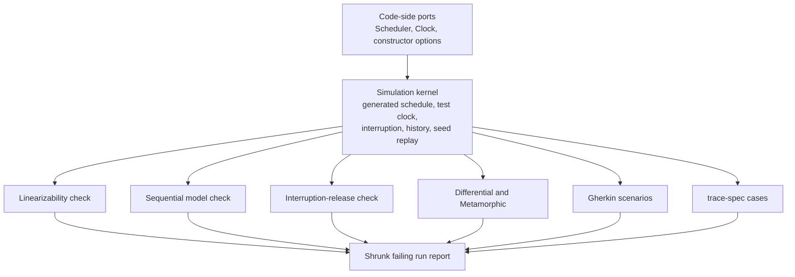
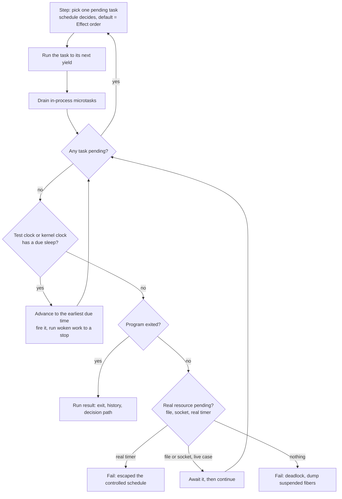
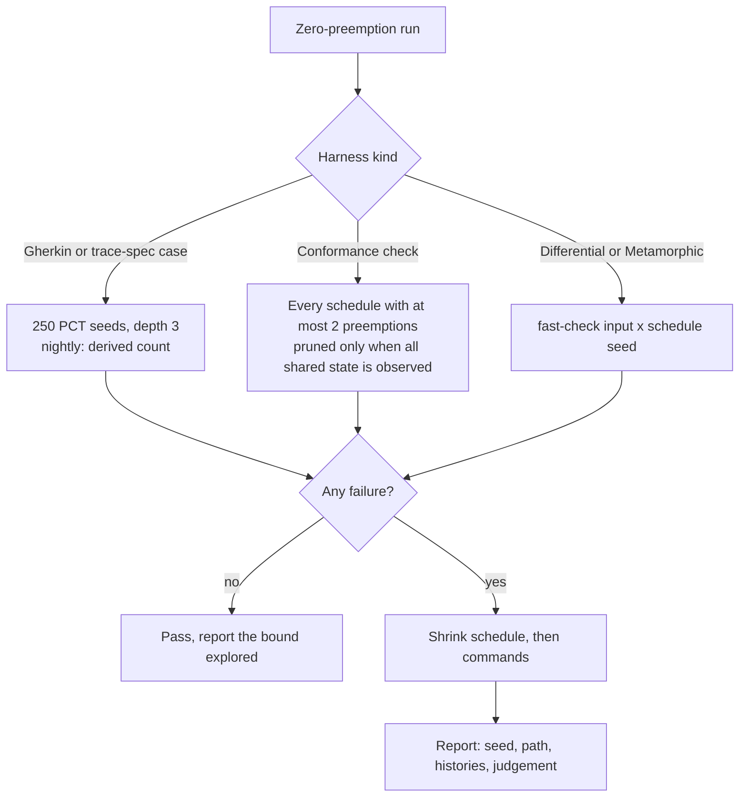

# Concurrency Conformance Testing - Plan

## Goal Capsule

- **Objective:** Every race, leaked resource, or stateful divergence in this repo's Effect code that lies within a stated search bound fails a check before it ships, and one beyond the bound is missed only with a stated probability. Every package that owns concurrent or stateful behaviour is exercised through its public surface under generated schedules, operation sequences, and interruption points.
- **Means:** A deterministic simulation kernel that owns the in-process execution environment, with checks and the existing harnesses running on it.
- **Product authority:** This plan owns the whole concurrency and stateful-conformance gap, including every package that has that gap. A general mutation gate beyond R33's concurrency faults, Jev fidelity checks, and law-family libraries are separate areas (see How This Work Fits Together).
- **Authority order:** Requirements win on product behaviour. KTDs win on mechanism within their cited Requirements. Units override neither.
- **Stop conditions:** Stop and report instead of working around it when the kernel self-tests (R34) cannot pass on the pinned Effect version, or when evidence shows a settled Key Decision cannot hold.
- **Execution profile:** Deep. Units run in the dependency order of the Unit Index; the Evaluator units (U9, U19, U20) land as their own commits, observed red before green.
- **Ships as:** One pull request with a commit per unit, watched to green (REPO-D1). `pnpm check:local` passes after the last edit.
- **Open blockers:** R33 (U21) and the conditional R30 wait for `systemfsoftware/stryker-js-effect#83` to be released. Nothing else depends on them; the pull request records them as unmet.

---

## Product Contract

### Summary

Build a kernel that runs any Effect program under a generated, shrinkable, replayable schedule and records what each fiber called and got back. Three checks judge the recorded runs:

- whether concurrent results match some sequential order of a pure model (linearizability),
- whether an operation sequence stays in step with the model,
- whether an interruption at any point leaves anything held.

Differential, Metamorphic, Gherkin, and trace-spec tests run on the same kernel. Every package with concurrent or stateful behaviour adopts the checks, and production code exposes every source of nondeterminism as a port.

### Problem Frame

The repo's test instruments cover examples, properties over generated inputs, equations, differential comparison, emitted effects, and types. None of them controls how code executes:

- `differential-spec` runs both sides with plain `Effect.all` on the default scheduler (`packages/differential-spec/src/core/DualExecutionSupervisor.ts:11-17`).
- trace-spec cases run on the live clock (`packages/trace-spec/src/Suite.ts:111`).
- Gherkin scenarios order fibers by hand; `packages/effect-daemon-spec/tests/lock-primitive-contract.integration.test.ts` does it with `Effect.yieldNow` at lines 64 and 255.

No package uses `fc.scheduler`, `fc.commands`, or `fc.modelRun`.

So the packages that exist to manage concurrency are tested only at points someone chose by hand. `differential-spec`'s judgement type, `(outputA, outputB) => boolean` (`packages/differential-spec/src/core/RelationalOracle.ts:9-12`), can't state "some sequential order explains this history". Every `Differential.compare` call also registers the same fixed test title (`packages/differential-spec/src/dsl/Differential.ts:22`).

On this code even a perfect mutation score would prove nothing. Deleting a lock acquire produces a mutant that only a test exploring interleavings can kill.

### Key Decisions

- **Nothing in the concurrency and stateful gap is out of scope.** Schedule-fuzzing existing scenarios, checking memfs against a real filesystem, VM lifecycle release, and larger nightly runs are all active requirements. (session-settled: user-directed — chosen over the earlier narrowed scope that deferred them.) Governs R15, R24, R26, R28, R29.
- **The execution environment and the judgement are separate layers.** A kernel owns the schedule, clock, interruption, history, and replay; the checks and existing harnesses consume it. `differential-spec` owns none of this today, its judgement type can't express linearizability, and trace-spec and Gherkin need the same environment. Governs R1-R5, R13, R15, R16.
- **The kernel drives Effect through a `Scheduler` it supplies, with one scheduling decision per runtime primitive, and relies on nothing upstream in Effect.** A prototype showed that Effect's op-count yield leaves some adjacent operations unseparated (`Effect.uninterruptible` hid a check-then-set race), and that a kernel-supplied `Scheduler` closes this without changing Effect. (session-settled: user-approved — chosen over proposing an Effect hook upstream.) Governs R1, R34.
- **Preemptions are tried only before steps that touch shared state, and only where the kernel observes all of that state.** Unpruned exhaustive search costs 28–50x more in the prototype. Governs R32, R35.
- **The kernel's zero-preemption schedule is the order Effect's own dispatcher would run; a preemption is any deviation from it.** Effect keeps running a fiber until it yields, and a fiber woken inside an operation runs inline inside it, so the kernel continues the fiber it sliced last and runs an inline-woken fiber's continuation first. A third prototype measured the alternative, continuing whichever fiber ran last even after it yielded on purpose: 23 of 36 real scenarios failed on the kernel's zero-preemption schedule and 2 never passed. With Effect's order all 36 pass, as they do under vitest, and the interruption leak in the lock fakes (R21) is still found at two deviations. (session-settled: user-directed — "state of the art"; chosen over counting only switches away from the last-run fiber as preemptions.) Governs R1, R32.
- **Tests use only what a consumer can use; never in-source.** Linearizability is defined over the responses of public operations, and reading private state could only let the model echo the implementation. (session-settled: user-approved — chosen over in-source property blocks.) Governs R17, R30.
- **Interruption is tried at every step, not sampled.** (session-settled: user-approved — chosen over sampled interruption points.) Governs R8.
- **A clean run is bounded evidence, not proof of absence.** Generated search only finds what it reaches, so every result states its bound, and planted concurrency faults in each target's own code show the search is strong enough. Line coverage and the advisory mutation score cannot show this. (session-settled: user-approved — chosen over relying on coverage metrics.) Governs R28, R30, R32, R33.
- **A surviving planted fault fails the build, and synchronisation is never removed automatically.** A fault can survive because the search cannot reach it, not because the synchronisation is redundant: in the prototype, a split `Ref.modify` survived a coarse kernel although the atomic update was needed. (session-settled: user-directed — chosen over removing synchronisation that a surviving fault marks redundant.) Governs R30, R33.
- **Untestable nondeterminism is a defect in the code.** When the kernel can't control a source of nondeterminism through a declared port, the code is fixed, not the test. (session-settled: user-approved — chosen over test-side workarounds such as hand-placed `yieldNow`.) Governs R19, R20.
- **For resources outside the process, the real system is the judge.** Filesystems and VMs are checked against real state, not the implementation's bookkeeping. (pack: boundary-testing, real-system-oracles.md) Governs R9, R24, R26.
- **Scenarios that wait on real I/O stay on the live clock and are listed, not forced onto the kernel.** Containers, sockets, and OS file events complete outside the process; conformance checks over in-process test doubles cover their concurrency. (session-settled: user-approved — chosen over running every scenario under generated schedules.) Governs R15, R16.
- **The kernel owns every clock and every in-process wakeup.** Microtasks and Promises that settle inside the process are kernel work: they run between steps, and a fiber they wake becomes one more scheduling choice. The kernel also supplies the clock the test clock treats as live, so no in-process wait reaches a real timer. A second prototype found that settling Promises only when no fiber could run never reached the one outcome Effect's default scheduler always produced. It also found that memfs reports watch events through `queueMicrotask`, and that every `TestClock` sleep starts a live one-second warning timer. (session-settled: user-directed — "state of the art"; chosen over settling Promises only when no fiber can run, and over exempting TestClock's warning timer by call site.) Governs R2, R36.
- **Test time moves only when nothing can run.** `TestClock.adjust` and `setTime` suspend the caller; the kernel then fires due sleeps in timestamp order and lets everything they wake run to a stop before the next one, the way simulators and Tokio's paused clock auto-advance only once the runtime is idle. Effect's own `TestClock` opens each due sleep and yields once, which is only enough under its FIFO dispatcher: on randomized schedules the supervisor, readiness, and poll-worker scenarios failed because a worker had not yet registered its sleep when time moved. With the kernel's clock none of them failed in 100 runs each. (session-settled: user-directed — "state of the art"; chosen over keeping Effect's `TestClock` under the kernel.) Governs R2, R37.
- **Suites run on the kernel under one deterministic schedule plus seeded randomized schedules; bounded exhaustive search is for conformance checks.** Randomized schedulers with probabilistic guarantees (PCT) scale to whole test suites, and exhaustive search suits small targets. In the second prototype, searching every schedule with at most two preemptions took about 2 s for a one-fiber scenario, and 30 of 36 real scenarios exhausted a 10 s budget. The harness's own environment is built before exploration starts, because @effect/vitest's two test layers alone produced 7,024 schedules for an empty test. (session-settled: user-directed — "state of the art"; chosen over bounded exhaustive search of every scenario on each change, and over leaving suites on Effect's default scheduler.) Governs R15, R16.
- **Conformance adoption is enforced by a gate, not by review, and measured rather than declared.** Each package's test run recomputes its concurrency-primitive sites from source and fails when one never executes under a conformance check. (session-settled: user-approved — chosen over leaving R29's inventory as a document; user-directed — measured inside vitest, chosen over a hand-kept inventory file.) Governs R29.
- **Releases need a fresh green nightly.** A release with no recent nightly has no evidence at the nightly bound. (session-settled: user-approved — chosen over letting publishing pass until the first nightly exists.) Governs R31.
- **memfs is checked through a pure filesystem model that is itself checked against a real filesystem.** Replaying every candidate order on a real temporary directory is far slower than checking against a model. (session-settled: user-approved — chosen over replaying candidate orders on a real temporary directory.) Governs R24.



### Requirements

**Simulation kernel**

- R1. A kernel package runs any Effect program under a harness-generated schedule, with a scheduling decision between any two runtime primitives of any fiber, whatever wrappers surround them (`Effect.uninterruptible`, `uninterruptibleMask`, scoped `acquireRelease`).
- R2. Inside the kernel, time advances only through the test clock. The kernel supplies every clock a program can reach, including the one the test clock treats as live, and a program that reaches a real timer fails the run. `queueMicrotask` is in-process work, not a timer.
- R3. The kernel records every run as a history of invocation and response events for each fiber, in the order the controlled scheduler produced them.
- R4. A failing run shrinks to a minimal failing schedule and replays deterministically from its recorded seed and path.
- R5. The kernel can interrupt any fiber at any step the schedule selects.
- R34. The kernel ships self-tests that fail when it stops separating adjacent primitives: a check-then-set race under each wrapper named in R1 must be found at one preemption. The Effect version the kernel depends on is pinned, and changing it re-runs these self-tests.
- R36. A Promise or microtask that settles inside the process runs between kernel steps, and a fiber it wakes becomes a scheduling choice at the next step, so in-process Promises never need a live declaration. When no fiber can run and nothing in the process can wake one, the run fails and names what it waits on: nothing (a deadlock), a real timer, a file, or a socket. A deadlock report lists every suspended fiber with the frames it is suspended in.
- R37. The kernel supplies the test clock. `adjust` and `setTime` move time only when no fiber can run, firing due sleeps in timestamp order with everything they wake run to a stop between them. Suites do not build their own test clock; the seven suite files that provide `TestClock.layer()` themselves drop it.
- R38. The kernel's own suite carries every defect it has found in Effect as a regression case. The first is a lost wakeup in `Queue.take`, reported upstream as [Effect-TS/effect#8471](https://github.com/Effect-TS/effect/issues/8471) (`effect@4.0.0-rc.116` and `rc.117`, also in the vendored `repos/effect/packages/effect/src/Queue.ts:1426-1429,2048-2056`): `take` checks for a message and registers as a taker in separate operations, so a taker that yields between them misses an offer made meanwhile and waits for a later one. `takeN`, `takeAll`, `takeBetween`, and `peek` share the gap. It reproduces on Effect's own scheduler with no kernel, at the default `MaxOpsBeforeYield` of 2048 as well as small budgets (14 of 574 op-budget and offset settings from 3 to 16). The repo carries a patch of the pinned Effect that re-checks for a message or pending offer when a taker registers, and drops the patch once a pinned release closes #8471.

**Checks**

- R6. The linearizability check takes the real implementation as a Layer, a Schema of commands, and a pure model. It passes only if every history matches some sequential order of the same commands through the model, keeping any operation that completed before another began ahead of it.
- R7. The sequential model check runs command sequences drawn from the Schema, with a precondition per command over the model state. It compares each response with the model, and a divergence names the step where it happened.
- R8. The release check interrupts the program at every yield point it passes through, closes its scope, and requires the release probe to succeed after each interruption.
- R9. When the resource is held outside the process (files, VMs, ports), the release probe checks the real system.
- R10. Every failure report carries the shrunk schedule, each fiber's operations with their observed responses, and which judgement broke: no sequential order explains the history, the model diverged at step N, or an interruption at step N left the resource held.
- R11. Commands are generated from the declared Schema, and a model may not import the implementation under test.
- R12. Each check ships with planted-bug fixtures it must catch: a non-atomic check-then-set lock, a release that runs only on the success path, and a store whose state diverges from its model after a particular operation order. Each fixture's correct counterpart must pass, so a fixture also tests the kernel and the check. A check's own bookkeeping must survive interruption of the code under test.

**Search strength**

- R32. Every conformance result states the bound it explored: fibers (including the harness's own), operations, preemptions, depth, and runs. Per-change runs explore every schedule with at most two preemptions for targets of up to four worker fibers plus the harness; larger configurations run nightly.
- R33. Concurrency faults are planted in each adopting package's own source (a removed lock or semaphore, an atomic update split into a read then a write, a release moved out of its finalizer), and CI fails when one survives. A survivor is resolved only by strengthening the search or the check, or by a human-reviewed argument, recorded with the change, that the synchronisation is redundant. Nothing removes or relaxes synchronisation automatically.
- R35. The search preempts a fiber only before a step that touches shared state the kernel observes. Pruning is enabled for a target only when the kernel observes every shared primitive that target uses; otherwise the target is searched unpruned.

**Existing harnesses on the kernel**

- R13. `Differential.compare` and `Metamorphic.on` run both sides inside the kernel, under the same generated schedule.
- R14. Each `Differential.compare` and `Metamorphic.on` call registers its own caller-named test, replacing the fixed `Should_HoldForAllGeneratedInputs_When_OracleRelationApplied` title.
- R15. `effect-gherkin-spec` scenarios run on the kernel by default. Each change runs every scenario under the kernel's zero-preemption schedule plus 250 seeded PCT schedules of depth 3; the nightly run uses 10,000. The rarest order-dependent failure the prototype saw showed up in 2 of 100 runs, and 250 runs miss a failure that frequent with probability below 1%; 100 runs cost 0.09 s per scenario on average and 0.5 s at most. Exploration starts at the scenario body; the harness's own environment is built under the zero-preemption schedule. A scenario that depends on a particular order states that order in its steps, and one whose assertions hold only under an order it never stated fails. A scenario that waits on real I/O runs on the live clock only when it declares so with a reason, and every run report lists it with its seeds.
- R16. trace-spec cases run inside the kernel instead of on the live clock, under the same schedule policy and live-clock declaration as R15.

**Access boundary**

- R17. Conformance tests import only the package's published entry points and control execution only through what a consumer can supply: Effect services such as `Scheduler` and `Clock`, Layers, fiber interruption, and public constructor options. The kernel itself may read Effect runtime internals; tests may not.
- R18. The test-discipline lint rules accept the new checks as valid harness calls in the test lane that owns them.
- R30. An internal module is published as its own entry point or package and checked against its own model there when a planted fault inside it (R33) survives the public-surface search. Holding concurrent state with two or more public importers marks a module as a likely candidate. Tests never reach into internal modules.

**Code-side ports**

- R19. Production source takes timers, clocks, randomness, and task scheduling only through a named, replaceable port, and lint fails on any direct use outside a registered port.
- R20. Every direct timer, clock, or randomness call that exists in production source today is recognised by R19's rule as an explicitly registered port or moved behind one, not left as an unchecked diagnostic suppression. The current sites are `packages/atom/effect-atom/src/internal/HostTimer.ts:22,27`, `packages/atom/effect-atom-react/src/RegistryContext.ts:114`, and `packages/effect-schema-law/src/recursion-laws.ts:32,35`.

**Adoption**

- R21. daemon-spec's `LeaderLockFromPrimitive` is checked for linearizability (R6) and release under interruption (R8) over a reference in-memory `LockPrimitive`. The lock model also ships as a conformance suite that any `LockPrimitive` implementation can run, since the package defines `LockPrimitive` only as an interface; it interrupts inside `tryAcquire` too. Both in-repo lock fakes fail that today: they claim the key and register its release in separate operations, so an interruption between the two leaves the key held forever. Each makes the claim and the registration one uninterruptible step.
- R22. The public operations of effect-atom's `Registry` are checked for linearizability, driving both the Effect scheduler and the `scheduleTask`, `now`, and `scheduleTimer` options of `Registry.make`.
- R23. effect-atom's `AtomRef.Collection` is checked with the sequential model check against a plain array.
- R24. `effect-memfs` is checked against a pure filesystem model. The model is first checked against a real filesystem as the reference, including refusals the real filesystem produces (permission-denied writes, missing parents). `effect-memfs` operation sequences are then checked against the model, and concurrent `effect-memfs` calls are checked for linearizability against it. `FileSystem.watch` registers its watcher in a forked fiber, so a consumer cannot tell when watching has started; `effect-memfs` exposes that moment, and scenarios about changes "while it is watched" wait for it instead of yielding eight times.
- R25. Probe resources in `effect-readiness` are checked with the release check.
- R26. `effect-microsandbox` VM lifecycle release is checked against the real host at generated interruption points, and a refused sandbox start is reported as a failure and never as success. Both run in an existing end-to-end journey outside the in-process test lane.
- R27. Existing scenarios whose claim a conformance check now covers are deleted, not kept alongside it, including the hand-ordered `Effect.yieldNow` cases in `lock-primitive-contract.integration.test.ts`. Scenarios that stay establish what their `Given` claims with a signal, not `yieldNow`: the "held lock" and "contention" lock scenarios and the two leader-election scenarios whose holder fiber must hold the lock first fail on randomized schedules today and pass all of them once the holder signals that it holds the lock.
- R29. Every concurrency-primitive site in a package's production source (a fiber fork, `Queue`, `Deferred`, `Ref`, or `Semaphore` state, a scoped acquisition) executes under a conformance check in that package's test run, and the run fails when one does not. The checkers and the packages they run on are judged by whether their own tests run each site. A repo guard fails when a package holding such a site does not run that gate. R21-R26 are the packages identified by name.

**Scale**

- R28. Every conformance property has a per-change CI budget (R32) and a larger nightly budget, and both replay from seed. The nightly run count is derived from PCT's per-run bound for a target bug depth and miss probability, not chosen by hand.
- R31. Publishing a release requires the latest nightly conformance run on main to be green and less than 48 hours old. With no nightly run yet, publishing stays blocked until a manually started run passes.

### Acceptance Examples

- AE1. **Covers R6, R10, R12.**
  - **Given** a lock whose `tryAcquire` checks and sets the holder in two separate steps
  - **When** two fibers call `TryAcquire("k")` under generated schedules
  - **Then** the run fails and shrinks to the interleaving where both check before either sets. The report shows both fibers observing `true`, with no sequential order that explains it.
- AE2. **Covers R6.**
  - **Given** a correct lock
  - **When** the same property runs over all generated schedules
  - **Then** every history matches a sequential order of the model, and the run passes.
- AE3. **Covers R8, R10, R12.**
  - **Given** a lock whose release runs only on the success path
  - **When** the program is interrupted after `tryAcquire` and before the finalizer is registered
  - **Then** a fresh caller's `tryAcquire("k")` probe fails, and the report names that step.
- AE4. **Covers R7, R10.**
  - **Given** a collection whose `insertAt` at the end index drops the element
  - **When** generated `Push | InsertAt | Remove` sequences run against it and a plain array
  - **Then** the run fails at the first `InsertAt` at the end index and names that step.
- AE5. **Covers R2.**
  - **Given** a program that sleeps on the real clock
  - **When** it runs inside the kernel
  - **Then** the run fails, reporting that it escaped the controlled schedule.
- AE6. **Covers R15.**
  - **Given** a Gherkin scenario whose assertion passes only when fiber A runs before fiber B, with no step stating that order
  - **When** the scenario runs under generated schedules
  - **Then** it fails and reports the schedule where B ran first.
- AE7. **Covers R14.**
  - **Given** a file with two `Differential.compare` calls
  - **When** the suite runs
  - **Then** the runner reports two tests, each under its caller's name.
- AE8. **Covers R19.**
  - **Given** production source that calls `setTimeout` directly, outside a registered port
  - **When** lint runs
  - **Then** lint fails at that call.
- AE9. **Covers R9, R24.**
  - **Given** memfs's watch, which holds a real OS watcher (`packages/effect-memfs/src/memory-file-system.handle.ts:475`)
  - **When** the program is interrupted at each step of watch setup
  - **Then** no open watcher remains on the host after any interruption, and a leftover watcher fails the run at the step that leaked it.
- AE10. **Covers R32, R33.**
  - **Given** `LeaderLockFromPrimitive` with a planted fault that skips the scope close in the `onError` handler when acquisition is interrupted (`packages/effect-daemon-spec/src/LeaderLockAdapter.ts:46`)
  - **When** the per-change search explores its R32 bound, counting the harness fiber that interrupts, and interrupts at every step
  - **Then** the release check fails. If it passes instead, CI fails and names the surviving fault.
- AE11. **Covers R1, R34.**
  - **Given** a check-then-set on a `Ref` wrapped in `Effect.uninterruptible`, run by two fibers
  - **When** the kernel self-test searches every schedule with one preemption
  - **Then** it finds both fibers acquiring. If it does not, the kernel self-test fails.
- AE12. **Covers R35.**
  - **Given** a target whose shared state includes a `Queue` the kernel does not observe
  - **When** its conformance check runs
  - **Then** the search runs unpruned, and the result states that pruning was off and why.
- AE13. **Covers R36.**
  - **Given** fiber A awaits an already-resolved Promise and then writes "A", while fiber B yields once and then writes "B"
  - **When** the kernel searches every schedule with at most one preemption
  - **Then** runs ending in "A" and runs ending in "B" both occur. "B" is the outcome Effect's default scheduler always produces.
- AE14. **Covers R37.**
  - **Given** a stream worker forked with a 90-second tick timeout whose stream sleeps 100 seconds
  - **When** the scenario adjusts the test clock by 91 seconds on a schedule where the worker has not yet started
  - **Then** time moves only after the worker has registered its sleep and timeout, and the worker is removed. Under Effect's own `TestClock` the same schedule deadlocks.
- AE15. **Covers R38.**
  - **Given** an unbounded queue, a taker whose operation budget runs out between checking the queue and registering, and an offerer queued behind it
  - **When** the taker yields, the offerer offers, and the taker resumes, on Effect's own scheduler
  - **Then** with the patched Effect the taker receives the message; with the unpatched Effect it is still waiting beside it, and the regression case fails.

<!-- ce-section: work-relationships -->

### How This Work Fits Together

This plan covers the concurrency and stateful-conformance gap end to end.

- **Mutation as a real gate.** R33 already gates concurrency faults in adopting packages. The general gate would cover every other kind of mutant and can proceed independently.
- **Jev fidelity checks on laws and models.** They can proceed independently of this plan. They share this plan's models as inputs, since a model could say something other than what was intended.
- **Law-family libraries for pure combinators.** They can proceed independently, and nothing in them is concurrent.

### Challenged Assumptions

This plan was reviewed under the Substitution lens: replacing "extend `differential-spec`" with "a kernel beneath every harness". The review tests three assumptions:

- **Yield points inside Effect are the only interleavings that matter.** This is false for filesystems and VMs. R9, R24, and R26 check those against real systems instead.
- **Every target can be driven with only what a consumer can supply.** This holds for today's targets (see Dependencies / Assumptions). R19 makes it hold for future code.
- **Small histories find the bugs that matter.** Musuvathi and Qadeer found every previously unknown bug in their study with at most two preemptions, which R32 covers exhaustively. R28's PCT-derived nightly runs bound the miss probability for deeper bugs.

### Dependencies / Assumptions

- Effect exposes `Scheduler` as a replaceable `Context.Reference` (`repos/effect/packages/effect/src/Scheduler.ts:78`) and `MaxOpsBeforeYield` as a `Context.Reference` defaulting to 2048 (`Scheduler.ts:279-282`). On `effect@4.0.0-rc.116`, `MaxOpsBeforeYield` of 1 or 2 livelocks, because resuming from a yield spends runtime operations on bookkeeping.
- A prototype (a kernel spike with its reports and decisions, kept locally under `.context/compound-engineering/ce-prototype/2026-09-23-kernel-scheduler-control/`, which is gitignored) measured these costs on the real `LeaderLockFromPrimitive`, searching every schedule with at most two preemptions: pruned, 86 / 910 / 8,516 / 81,145 schedules for 2 / 3 / 4 / 5 workers (9 ms / 0.11 s / 1.2 s / 13.7 s); unpruned, 2,448 / 39,515 / 414,811 for 2 / 3 / 4. Planted faults were found at the same bounds with and without pruning.
- A second prototype (`.context/compound-engineering/ce-prototype/2026-09-23-kernel-async-boundary/`, gitignored) ran 36 scenarios from five unmodified suites under the kernel through the real `effect-gherkin-spec`, and a third round there diagnosed every failure. With Effect's order as the zero-preemption schedule and the kernel's test clock, all 36 pass on that schedule; 100 PCT runs each failed 19 of them and a 10 s two-preemption search 5. Every failure traced to one of: an unstated order in the test (`yieldNow` before the other fiber had acted, or a watch not yet registered), the lock fakes' interruption leak (R21), or Effect's `Queue.take` lost wakeup (R38). With each fixed in a copy of the scenario, all six representative scenarios passed 300 PCT runs and the search. Pruning missed outcomes that hinge on state the kernel does not observe, such as a scope's finalizers (R35).
- `TestClock` controls when sleeps wake, not which fiber runs next, so it does not reduce interleaving cost; it remains required for code with timers (R2).
- `Registry.make` accepts `scheduleTask`, `now`, and `scheduleTimer` (`packages/atom/effect-atom/src/Registry.ts:126-130`).
- Workspace production source has three direct timer, clock, or randomness sites today, all named in R20; none of them is in `effect-daemon-spec`, `effect-memfs`, `effect-readiness`, `effect-microsandbox`, or `effect-cell-types`. Effect language-service diagnostics already fail on `globalTimers`, `globalDate`, and `globalRandom` (`packages/toolchain/tsconfig/effect.json:38-45`), but not on `performance.now`, which `recursion-laws.ts:32,35` uses.
- `differential-spec` has no consumers outside its own tests, so moving its execution onto the kernel breaks no adopter.
- An integration test must not spawn processes, so R26 runs in the microsandbox smoke journeys (`.github/workflows/reusable-smoke.yml`, built on `packages/effect-microsandbox/examples/boot-alpine.ts`) and not in the in-process test lane.
- The linearizability search gets expensive quickly as histories grow. R32 caps per-change runs at four worker fibers and leaves larger runs to the nightly budget.
- R33's planted faults come from three opt-in mutators in the repo's own Stryker fork, requested in `systemfsoftware/stryker-js-effect#83`. R33 runs in CI only, because REPO-D3 forbids local mutation runs.

### Sources / Research

- Herlihy & Wing, "Linearizability: A Correctness Condition for Concurrent Objects", TOPLAS 1990: https://dl.acm.org/doi/10.1145/78969.78972
- Hughes, "Experiences with QuickCheck: Testing the Hard Stuff and Staying Sane": https://www.cs.tufts.edu/~nr/cs257/archive/john-hughes/quviq-testing.pdf
- Porcupine linearizability checker (a model plus a recorded history, checked after the fact; memoises on linearized set and model state): https://github.com/anishathalye/porcupine
- Lowe, "Testing for linearizability", 2017 (just-in-time linearization and the Wing–Gong graph search with state memoisation): http://www.cs.ox.ac.uk/people/gavin.lowe/LinearizabiltyTesting/paper.pdf
- Musuvathi & Qadeer, "Iterative context bounding for systematic testing of multithreaded programs", PLDI 2007 (every one of 9 new bugs needed at most 2 preemptions): https://www.microsoft.com/en-us/research/publication/iterative-context-bounding-for-systematic-testing-of-multithreaded-programs-2/
- Shuttle, randomized concurrency testing for Rust (PCT; not exhaustive, but scales to much larger tests than the exhaustive Loom): https://github.com/awslabs/shuttle
- Tokio, `time::pause` (a paused clock auto-advances to the next timer only once the runtime has no work to do): https://docs.rs/tokio/latest/tokio/time/fn.pause.html
- Burckhardt, Kothari & Musuvathi, "A Randomized Scheduler with Probabilistic Guarantees of Finding Bugs" (PCT: one run finds a depth-d bug with probability at least 1/(n·k^(d−1))): https://www.microsoft.com/en-us/research/publication/a-randomized-scheduler-with-probabilistic-guarantees-of-finding-bugs/
- S2, "Linearizability testing S2 with deterministic simulation" (the simulator records the run and a separate checker judges it): https://s2.dev/blog/linearizability
- fast-check model-based testing (`fc.commands`, shrinking of command sequences): https://fast-check.dev/docs/advanced/model-based-testing/
- Wiki `concepts/model-based-filesystem-stress-testing.md`: drive the real interface, validate after every step, seed everything, dump on failure.
- Wiki `concepts/hughes-property-taxonomy.md`: model-based properties are the strongest kind, and a test must not replicate the implementation.
- `.github/workflows/mutation.yml:111`: the mutation step is `continue-on-error: true`.

---

## Planning Contract

**Product Contract preservation:** Product Contract unchanged. The Goal Capsule's execution profile, shipping, and blocker lines were rewritten for this delivery.

### Key Technical Decisions

- KTD1. **Two new packages: `packages/effect-sim-kernel` owns execution, `packages/conformance-spec` owns the three checks.** This follows the harness family (`differential-spec`, `trace-spec`) and the Product Key Decision that separates environment from judgement. Checks import the kernel; the kernel imports no check. Governs R1-R12.
- KTD2. **The kernel supplies Effect's `Scheduler`, wraps the fiber resume methods, and observes `Ref` and `Deferred` field access.** These are the three hooks the prototypes proved (`.context/compound-engineering/ce-prototype/2026-09-23-kernel-async-boundary/kernel.ts`). They read Effect runtime internals, which R17 allows only inside the kernel. The pinned catalog version of `effect` is part of the kernel package's build hash, so a version change reruns the R34 self-tests. Governs R1, R5, R34, R35.
- KTD3. **A preemption is any deviation from Effect's dispatcher order, and the zero-preemption run replays that order exactly.** This instantiates the Product Key Decision on Effect's order (R1, R32).
- KTD4. **Histories are recorded by the check harness, not by the kernel.** The harness wraps each command call in an invoke/response pair stamped with the kernel's step index. The kernel exposes the step index and fiber identity; it never knows what a command is. Governs R3.
- KTD5. **Linearizability uses the Wing–Gong search with Lowe's memoisation on (linearized set, model state).** Model states are hashed with Effect `Hash` and compared with `Equal`, so a model state must be a Schema type with structural equality. Porcupine and Lowe both memoise this way; without it the search is exponential in history length. Governs R6.
- KTD6. **Commands are generated from the declared command Schema's arbitrary; a precondition skips a command at run time rather than filtering the arbitrary.** fast-check's model runner does the same, and array shrinking then removes commands without re-deriving preconditions. Governs R7, R11.
- KTD7. **A failing schedule shrinks by resetting deviations to the default one at a time, keeping each reset that still fails, then shrinking the command sequence with the schedule fixed.** Every step replays from the recorded decision path, so the result is deterministic. Governs R4, R10.
- KTD8. **One environment variable, `CONFORMANCE_PROFILE`, selects the per-change or nightly budget.** Per change: suites run the zero-preemption schedule plus 250 PCT seeds of depth 3, and conformance checks run every schedule with at most two preemptions. Nightly: suites run the PCT count R28 derives, and checks raise the fiber and operation bounds. The derivation is `runs = ceil(ln(miss) / ln(1 - p))` with `p = 1 / (n · k^(d-1))`, taking `n` fibers and `k` steps from the scenario's own zero-preemption run, `d = 3`, and `miss = 0.01`. Governs R15, R28, R32.
- KTD9. **The `Queue` lost-wakeup fix ships as a pnpm `patchedDependencies` entry for `effect@4.0.0-rc.116`.** It patches `dist/Queue.js` and the shipped `src/Queue.ts` so that `awaitTake` resumes at once when a message or pending offer exists at registration. pnpm verifies the patch applies, so a catalog bump that no longer needs it fails installation instead of silently dropping it. Governs R38.
- KTD10. **Conformance checks get their own lane, `.conformance.test.ts`, enforced by a new `conformance-test-requires-harness` rule.** A new suffix needs its own enforcing rule; extending the differential lane would make a lane mean two harnesses. Governs R18.
- KTD11. **`effect-spec-runtime` owns the kernel case runner, so Gherkin and trace-spec move together.** A case's live declaration becomes a required reason string instead of the `liveClock` boolean, and the run report lists every live case. Governs R15, R16.
- KTD12. **The time-source rule lives in `oxlint-plugin-effect-platform` as `no-unported-time-source`, with a `ports` option listing the files allowed to touch time, randomness, and task scheduling.** It flags `Date.now`, argument-less `new Date()`, `performance.now`, `process.hrtime`, `Math.random`, `crypto.getRandomValues`, `crypto.randomUUID`, `setTimeout`, `setInterval`, `setImmediate`, and static or dynamic imports of `node:timers`. It does not flag `queueMicrotask` (R2). The rule must see guard-local dynamic imports (`docs/solutions/integration-issues/dynamic-import-blinds-static-provenance-rules.md`). Governs R19, R20.
- KTD13. **Adoption is measured inside every vitest run, not declared.** `@systemfsoftware/vitest-config`'s `defineConfig` adds a conformance-coverage plugin to every package config. It recomputes each concurrency-primitive site in the run's `coverage.include` from source, records which sites execute while a checker (`conformance-spec`, `differential-spec`) drives a program through `Kernel.run`/`Kernel.search`, and fails the run when any site never did. The checkers and the workspace packages they run on are judged by whether their own tests ran each site. `scripts/guards/check-conformance-enrollment.ts` (in `guard:projects`) fails when a package with a primitive in its source does not run vitest through that `defineConfig`. Governs R29.
- KTD14. **The nightly run is `.github/workflows/nightly-conformance.yml`, and `release.yml` gains a gate job that reads the latest nightly run on main through the GitHub API.** A manual `workflow_dispatch` on the nightly workflow covers the first run. Governs R28, R31.
- KTD15. **effect-memfs exposes watch readiness as a scoped operation that completes only after the OS watcher is registered and returns the event stream.** A scoped acquisition gives a consumer the exact moment without polling, and its release closes the watcher. Governs R24.
- KTD16. **effect-daemon-spec publishes the `LockPrimitive` conformance suite at a `./testing` subpath, with `conformance-spec` as an optional peer dependency.** Production importers of the root entry pull in no test code. Governs R21.
- KTD17. **Every search declares its budget and a wall-clock bound, and a search that exhausts either before covering its stated bound fails as over budget, naming the limit.** A truncated search that passed would report a bound it never explored. Governs R28, R32.
- KTD18. **A model lives in a `*.model.ts` fixture, and lint rejects any `*.model.ts` that imports the package under test.** The rule belongs to U9's lane rule set, since a static import check is the only place the dependency is visible. Governs R11.
- KTD19. **Adoption precedes the harness move.** The package checks (U14-U17) land before every suite moves onto the kernel (U12), so scenarios the checks supersede are already deleted (R27) and the lock fakes already fixed (R21) when U12 meets the remaining failures.

### High-Level Technical Design

The kernel's step loop decides at every step what runs next, and stops only at one of five outcomes.



Per change and nightly, every harness drives the kernel the same way; only the budget differs (KTD8).



Directional shape of the `conformance-spec` surface. Names are indicative; the Schema-first inputs and the three judgements are the contract.

```text
Linearizable.check(name, {
  implementation: Layer<Target>,
  commands: Schema<Command>,             // generated, never hand-picked (R11)
  model: { initial: State, step: (State, Command) => [State, Response] },
  run: (Target, Command) => Effect<Response>,
  fibers: 2..4, operations: n
})
SequentialModel.check(name, { implementation, commands, model, run,
  precondition: (State, Command) => boolean })
Released.check(name, { program: Effect<A, E, Scope>, probe: Effect<void, ProbeFailure> })
```

### Assumptions

- Package names `effect-sim-kernel` and `conformance-spec` and the `.conformance.test.ts` suffix are chosen here; nothing downstream depends on the names yet.
- `effect-schema-law`'s two `performance.now` calls stay where they are and are registered as a port (R20 allows either).
- `RegistryContext.ts:114` already calls the registry's `scheduleTimer` port, so R19's rule has nothing to flag there; `HostTimer.ts` is registered as the port file.
- The R29 predicate's current matches are effect-atom, effect-cell-types, effect-daemon-spec, effect-memfs, effect-microsandbox, rx-effect, storybook-gherkin, and trace-spec. The guard is authoritative; this list only sizes U19.
- The kernel cannot drive browser-mode suites (effect-atom-react, storybook-gherkin), whose waits complete in the browser. Those suites stay live under R15's declaration, each with its reason.
- effect-gherkin-spec stops a feature at its first failing scenario (`docs/solutions/logic-errors/attw-cli-entrypoints-flags-dropped-and-empty-array-override.md`). The kernel runner reports each scenario's own result, so one order-dependent scenario cannot hide another.

### Risks

- **Effect internals move under a version bump.** The KTD2 hooks break silently unless the R34 self-tests run on every bump; the build hash covers that, and the stop condition applies.
- **Every suite in the repo meets generated schedules at once (U12).** The prototype found order-dependence in 19 of 36 sampled scenarios, so U12's size is known only when it runs. Each failure is fixed at its source (R15, R27), never by declaring the scenario live.
- **A dist race in the nightly workflow.** A job that builds and packs in parallel can mutate `dist/` mid-run (`docs/solutions/build-errors/pack-lifecycle-hooks-mutate-dist-mid-gate.md`), so the nightly job runs tests only, on a completed build.

---

## Implementation Units

| U-ID | Title                                                          | Key files                                                                  | Depends on                             |
| ---- | -------------------------------------------------------------- | -------------------------------------------------------------------------- | -------------------------------------- |
| U1   | Patch Effect's `Queue` lost wakeup                             | `package.json`, `patches/effect@4.0.0-rc.116.patch`                        | U5                                     |
| U2   | Kernel core: scheduler, step loop, replay                      | `packages/effect-sim-kernel/src/`                                          | —                                      |
| U3   | Kernel clocks                                                  | `packages/effect-sim-kernel/src/KernelClock.ts`, `KernelTestClock.ts`      | U2                                     |
| U4   | Schedule search, PCT, pruning, shrinking                       | `packages/effect-sim-kernel/src/Search.ts`, `Pct.ts`, `Shrink.ts`          | U2                                     |
| U5   | Kernel self-tests and Effect regression cases                  | `packages/effect-sim-kernel/tests/`                                        | U2, U3, U4                             |
| U6   | Linearizability check and history recording                    | `packages/conformance-spec/src/Linearizable.ts`                            | U4, U9                                 |
| U7   | Sequential model check                                         | `packages/conformance-spec/src/SequentialModel.ts`                         | U6                                     |
| U8   | Interruption-release check                                     | `packages/conformance-spec/src/Released.ts`                                | U4, U9                                 |
| U9   | Conformance test lane and lint acceptance                      | `packages/oxlint-plugin/oxlint-plugin-test-discipline/src/rules/`          | —                                      |
| U10  | Gherkin and trace-spec cases on the kernel                     | `packages/effect-spec-runtime/src/`, `packages/trace-spec/src/Suite.ts`    | U3, U4                                 |
| U11  | Differential and Metamorphic on the kernel, caller-named tests | `packages/differential-spec/src/`                                          | U4                                     |
| U12  | Every existing suite passes on the kernel                      | suites under `packages/*/tests/`                                           | U10, U14, U16                          |
| U13  | Time-source port rule                                          | `packages/oxlint-plugin/oxlint-plugin-effect-platform/src/rules/`          | —                                      |
| U14  | Lock conformance in effect-daemon-spec                         | `packages/effect-daemon-spec/`                                             | U6, U8, U9                             |
| U15  | Registry and `AtomRef.Collection` conformance                  | `packages/atom/effect-atom/tests/`                                         | U6, U7, U9                             |
| U16  | effect-memfs model, watch readiness, conformance               | `packages/effect-memfs/`                                                   | U6, U7, U8, U9                         |
| U17  | effect-readiness release check                                 | `packages/effect-readiness/tests/`                                         | U8, U9                                 |
| U18  | microsandbox VM release journey                                | `packages/effect-microsandbox/examples/`                                   | U4                                     |
| U19  | Conformance coverage gate and remaining adopters               | `packages/toolchain/vitest-config/`, `scripts/guards/`, remaining packages | U14-U18                                |
| U20  | Nightly conformance workflow and release gate                  | `.github/workflows/`                                                       | U10, U19                               |
| U21  | Planted concurrency faults gate                                | `.github/workflows/mutation.yml`, adopters' Stryker configs                | U19; blocked on `stryker-js-effect#83` |

### U1. Patch Effect's `Queue` lost wakeup

- **Goal:** No `take`, `takeN`, `takeAll`, `takeBetween`, or `peek` on an open queue waits while a message or pending offer exists.
- **Requirements:** R38, AE15. KTD9.
- **Dependencies:** U5 (its AE15 case is written first and observed failing against the unpatched Effect; this unit turns it green in the same commit).
- **Files:** `package.json` or `pnpm-workspace.yaml` (whichever holds `patchedDependencies` for this pnpm version), `patches/effect@4.0.0-rc.116.patch`, `pnpm-lock.yaml`.
- **Approach:** Patch `awaitTake` in `dist/Queue.js` and `src/Queue.ts` exactly as the prototype did (`.context/compound-engineering/ce-prototype/2026-09-23-kernel-async-boundary/05-stated-order/patched-effect/`). The regression case lives in U5, so this unit ships no test of its own.
- **Test expectation:** none — U5's AE15 case proves it.
- **Verification:** A fresh install applies the patch, and the Upstream reproduction in Effect-TS/effect#8471 prints `[]` against the installed package.

### U2. Kernel core: scheduler, step loop, replay

- **Goal:** Any Effect program runs under a decision path the caller supplies and returns its exit, the decisions taken, and a per-step record of which fiber ran.
- **Requirements:** R1, R2 (escape recorder), R3 (step index and fiber identity), R4 (replay), R5, R36. KTD1, KTD2, KTD3.
- **Dependencies:** none.
- **Files:** create `packages/effect-sim-kernel/` with the package scaffold that `packages/differential-spec` uses (`package.json`, `tsconfig.json`, `tsconfig.app.json`, `tsconfig.test.json`, `tsconfig.build.json`, `tsconfig.node.json`, `tsdown.config.ts`, `vitest.config.ts`, `oxlint.config.ts` on the `all` preset, `api-extractor.json`, `etc/effect-sim-kernel.api.md`, `README.md`), `src/mod.ts`, `src/Kernel.ts`, `src/StepLoop.ts`, `src/EscapeRecorder.ts`, `src/Deadlock.ts`, `tests/step-loop.integration.test.ts`.
- **Approach:**
  1. Port the prototype's `Kernel` class, fiber-resume interception, Ref/Deferred observation, and async step loop into production modules under the repo's lint and type rules.
  2. Replace the prototype's module-level mutable state with a kernel instance per run; the global hooks are installed once and dispatch to the running kernel.
  3. Drain microtasks after every step (R36), classify a stall with `process.getActiveResourcesInfo()`, and fail with the suspended-fiber dump on deadlock.
  4. Expose interruption of any fiber at a chosen step (R5) and `beginExploration` for harnesses (R15).
- **Patterns to follow:** `packages/differential-spec` package layout; `docs/solutions/build-errors/exports-types-rollup-drift.md` for api-extractor wiring.
- **Test scenarios:**
  - Covers AE13. A fiber awaiting a resolved Promise then writing "A", against a fiber that yields once then writes "B": the zero-preemption run ends in "B", and the run with one deviation at the Promise wakeup ends in "A".
  - Covers AE5. A program that calls `setTimeout` inside the kernel fails and names the call site.
  - A program whose `queueMicrotask` callback resumes a fiber passes, and the resumed fiber appears as a scheduling choice.
  - Two fibers each awaiting a `Deferred` the other completes only after its own await fail as a deadlock, and the report lists both fibers with their suspended frames.
  - The same decision path replayed twice yields identical exits and step records.
  - Interrupting a fiber at step N runs its finalizers and the run exits with that interruption.
  - A run that starts while another kernel run is active fails immediately instead of sharing global hooks.
- **Verification:** The package builds, its api report is committed, and every scenario above passes.

### U3. Kernel clocks

- **Goal:** Inside the kernel, every clock is virtual, and test time moves only when nothing can run.
- **Requirements:** R2, R37, AE14.
- **Dependencies:** U2.
- **Files:** `packages/effect-sim-kernel/src/KernelClock.ts`, `packages/effect-sim-kernel/src/KernelTestClock.ts`, `packages/effect-sim-kernel/tests/clocks.integration.test.ts`.
- **Approach:** Port the prototype's `KernelClock` as the root `Clock` and `KernelTestClock` as the `Clock` a harness provides in place of `TestClock.layer()`. `TestClock.adjust` and `setTime` reach the kernel clock through the `Clock` service, so scenarios keep calling Effect's `TestClock` API unchanged.
- **Test scenarios:**
  - Covers AE14. A stream worker with a 90-second tick timeout whose stream sleeps 100 seconds, adjusted by 91 seconds on a schedule where the worker has not started: the worker registers its timeout first, then time moves, and the worker is removed.
  - Two sleeps due at 5 s and 10 s under one `adjust(10 s)` fire in timestamp order, and work woken by the first runs to a stop before the second fires.
  - `TestClock`'s one-second warning fiber sleeps on the kernel clock and never reaches a real timer.
  - `adjust` with no due sleeps moves time and returns without running anything.
- **Verification:** All scenarios pass; no scenario in this file declares a live case.

### U4. Schedule search, PCT, pruning, shrinking

- **Goal:** Harnesses can explore schedules by bounded exhaustive search or by seeded PCT, shrink a failure to a minimal replayable path, and report the bound they explored.
- **Requirements:** R4, R32, R35, AE12. KTD7, KTD8.
- **Dependencies:** U2.
- **Files:** `packages/effect-sim-kernel/src/Search.ts`, `src/Pct.ts`, `src/Shrink.ts`, `src/Bound.ts`, `src/Profile.ts`, `tests/search.integration.test.ts`.
- **Approach:**
  1. Port the preemption-bounded DFS with Effect-order cost (KTD3) and the PCT chooser.
  2. Mark steps that touch observed shared state (Ref, Deferred). Detect any unobserved shared primitive a run creates (Queue, PubSub, Semaphore, Latch, scope finalizers); when one appears, the search runs unpruned and the result says which primitive disabled pruning.
  3. Every result carries its bound: fibers including the harness's, operations, preemptions, depth, runs, and whether pruning ran.
  4. `Profile` reads `CONFORMANCE_PROFILE` and computes the nightly PCT count by KTD8.
- **Test scenarios:**
  - Covers AE12. A target whose shared state includes a `Queue` is searched unpruned, and the result states that the `Queue` turned pruning off.
  - A check-then-set on a `Ref` with two fibers is found at one preemption, pruned and unpruned.
  - A failing path with three deviations, only one of which matters, shrinks to that one deviation and still fails on replay.
  - The same PCT seed replays the same schedule.
  - With `CONFORMANCE_PROFILE=nightly`, a scenario with 3 fibers and 400 steps gets the run count the KTD8 formula gives, and the per-change profile gets 250.
  - A search that exhausts its schedule budget or wall-clock bound before covering its stated bound fails as over budget and names the limit (KTD17).
- **Verification:** All scenarios pass.

### U5. Kernel self-tests and Effect regression cases

- **Goal:** The kernel fails its own suite if it stops separating adjacent primitives, and every Effect defect it has found stays covered.
- **Requirements:** R34, R38, AE11, AE15.
- **Dependencies:** U2, U3, U4.
- **Files:** `packages/effect-sim-kernel/tests/self-test.integration.test.ts`, `packages/effect-sim-kernel/tests/effect-regressions.integration.test.ts`.
- **Approach:** For each wrapper named in R1, a two-fiber check-then-set race must be found at one preemption. The AE15 case runs on Effect's own scheduler with no kernel, across operation budgets and taker offsets, exactly as `05-stated-order/queue-lost-wakeup.proto.test.ts` did; it therefore passes only with U1's patch installed.
- **Test scenarios:**
  - Covers AE11. A check-then-set wrapped in `Effect.uninterruptible` is found at one preemption.
  - The same race under `uninterruptibleMask` and inside a scoped `acquireRelease` acquire is found at one preemption.
  - Covers AE15. Across `MaxOpsBeforeYield` 3-16 and taker offsets 0-40, no taker is left waiting beside an offered message. The case is observed failing on the unpatched install before U1 applies the patch.
- **Verification:** Both files pass, and the kernel package's turbo inputs include the resolved `effect` version.

### U6. Linearizability check and history recording

- **Goal:** A test can check a real implementation's concurrent behaviour against a pure model through its public operations.
- **Requirements:** R3, R6, R10, R11, R12, R17, AE1, AE2. KTD4, KTD5.
- **Dependencies:** U4, U9.
- **Files:** create `packages/conformance-spec/` with the same scaffold as U2, `src/mod.ts`, `src/History.ts`, `src/Linearizable.ts`, `src/Report.ts`, `tests/__fixtures__/Locks.ts`, `tests/__fixtures__/lock.model.ts`, `tests/linearizable.conformance.test.ts`.
- **Approach:**
  1. The harness runs `fibers` worker fibers, each issuing generated commands through `run`, recording invoke and response events with kernel step stamps.
  2. Every history from the U4 search is checked by KTD5; the first failing history shrinks by KTD7.
  3. The report carries the shrunk path, each fiber's operations and responses, and the judgement "no sequential order explains this history" (R10).
  4. The model comes from a `*.model.ts` fixture that KTD18's rule forbids from importing the package under test (R11).
  5. The check's own history buffer is owned by the harness fiber, so interrupting a worker cannot drop recorded events (R12).
- **Test scenarios:**
  - Covers AE1. A lock whose `tryAcquire` checks and sets in two steps fails, shrinks to both fibers checking before either sets, and reports both observing `true`.
  - Covers AE2. The correct lock passes over every schedule in the bound.
  - A history where a completed operation's response contradicts a later operation's is rejected, and one where overlapping operations may commute is accepted.
  - A model whose state is not a structural-equality value is rejected at definition with a clear error.
  - Interrupting a worker mid-command leaves every earlier recorded event in the history.
- **Verification:** All scenarios pass; the report text for AE1 names the shrunk schedule and both responses.

### U7. Sequential model check

- **Goal:** A test can check that generated command sequences stay in step with a model, and learn the first step where they do not.
- **Requirements:** R7, R10, R11, R12, AE4. KTD6.
- **Dependencies:** U6.
- **Files:** `packages/conformance-spec/src/SequentialModel.ts`, `tests/__fixtures__/Stores.ts`, `tests/__fixtures__/collection.model.ts`, `tests/sequential-model.conformance.test.ts`.
- **Approach:** Commands come from the command Schema's arbitrary; a command whose precondition fails on the current model state is skipped. The sequence runs on one fiber under the kernel's zero-preemption schedule, comparing each response with the model's.
- **Test scenarios:**
  - Covers AE4. A collection whose `insertAt` at the end index drops the element fails at the first such `InsertAt` and names that step.
  - The correct collection passes 1,000 generated sequences.
  - A failing sequence of 40 commands shrinks to the shortest sequence that still diverges.
  - A `Remove` on an empty collection is skipped by its precondition, not counted as a divergence.
- **Verification:** All scenarios pass.

### U8. Interruption-release check

- **Goal:** A test can prove that interrupting a program at any step it passes through, then closing its scope, leaves nothing held.
- **Requirements:** R8, R9, R10, R12, AE3.
- **Dependencies:** U4, U9.
- **Files:** `packages/conformance-spec/src/Released.ts`, `tests/__fixtures__/Resources.ts`, `tests/released.conformance.test.ts`.
- **Approach:** Run the program once to count its steps, then once per step with interruption at that step, closing the scope and running the probe each time. The probe is any effect, so resources outside the process are checked against the real system (R9).
- **Test scenarios:**
  - Covers AE3. A lock whose release runs only on success fails after interruption between `tryAcquire` and finalizer registration, and the report names that step.
  - The correct lock passes at every step.
  - A probe that checks a real temporary file detects a file left behind by a program that creates it before registering its removal.
  - A program with zero steps between acquire and release registration passes trivially and reports the number of interruption points tried.
- **Verification:** All scenarios pass.

### U9. Conformance test lane and lint acceptance

- **Goal:** `.conformance.test.ts` files outside `src/` are a valid lane that must call a conformance check.
- **Requirements:** R18. KTD10.
- **Dependencies:** none; the rule names `@systemfsoftware/conformance-spec` without needing it to exist.
- **Files:** `packages/oxlint-plugin/oxlint-plugin-test-discipline/src/rules/path.config.ts`, `src/rules/conformance-test-requires-harness.ts` (and its `.config.ts`), `src/rules/test-suffix-outside-src.ts`, the plugin's rule registry, `recommended` config, and README, and its tests. The workspace preset `packages/oxlint-presets/oxlint-config-recommended/src/index.ts` spreads the plugin's `recommended` rules, so it needs no edit.
- **Approach:** Mirror `differential-test-requires-harness` for the new suffix and `@systemfsoftware/conformance-spec`, and add a companion rule that rejects a `*.model.ts` file importing the package whose tests it serves (KTD18). The rules land in their own commit, observed red on fixtures that break them and green on fixtures that do not.
- **Patterns to follow:** `differential-test-requires-harness.ts` and its tests.
- **Test scenarios:**
  - A `.conformance.test.ts` that calls `Linearizable.check` passes.
  - A `.conformance.test.ts` that only uses `it` from vitest fails with the rule's message.
  - A `.conformance.test.ts` under `src/` is rejected by the existing suffix rule.
  - A `tests/__fixtures__/lock.model.ts` that imports the package under test fails the companion rule; one that imports only `effect` passes.
- **Verification:** The plugin's tests pass, and linting U6-U8's test files is clean.

### U10. Gherkin and trace-spec cases on the kernel

- **Goal:** Every Gherkin scenario and trace-spec case runs on the kernel by default, with the zero-preemption schedule and the per-change PCT budget.
- **Requirements:** R15, R16, R37, AE6. KTD8, KTD11.
- **Dependencies:** U3, U4.
- **Files:** `packages/effect-spec-runtime/src/Register.ts`, `src/Suite.ts`, `src/KernelCase.ts`, `packages/effect-gherkin-spec/src/` (live declaration surface), `packages/trace-spec/src/Suite.ts`, and tests in `packages/effect-spec-runtime/tests/` and `packages/effect-gherkin-spec/tests/`.
- **Approach:**
  1. Replace `selectCaseRunner`'s `it.live`/`it.effect` split with a kernel case: register a vitest test whose body builds the case's layers (including suite-level shared layers, rebuilt per run for replay) under the zero-preemption schedule, provides `KernelTestClock`, calls `beginExploration`, and runs the scenario body.
  2. A failure reports the seed and decision path, and replays with an environment variable naming them.
  3. A live case requires a reason string, runs on the live clock as today, and is listed with the reason in the run report.
  4. trace-spec's `liveClock: true` becomes the kernel runner.
- **Test scenarios:**
  - Covers AE6. A scenario whose assertion holds only when fiber A runs before fiber B, with no step stating the order, fails and reports a schedule where B ran first.
  - The same scenario with a `Deferred` signal stating the order passes all 250 seeds.
  - A scenario declared live with a reason runs once on the live clock and appears in the report with that reason; one declared live without a reason fails type-checking.
  - Replaying a reported failing seed reproduces the same failure.
  - A scenario that calls `TestClock.adjust` moves the kernel test clock.
  - Two failing scenarios in one feature are both reported.
- **Verification:** `effect-spec-runtime`, `effect-gherkin-spec`, and `trace-spec` suites pass on the kernel.

### U11. Differential and Metamorphic on the kernel, caller-named tests

- **Goal:** Both sides of every differential comparison run inside the kernel under one generated schedule, and each call registers its own named test.
- **Requirements:** R13, R14, AE7.
- **Dependencies:** U4.
- **Files:** `packages/differential-spec/src/dsl/Differential.ts`, `src/dsl/Metamorphic.ts`, `src/core/DualExecutionSupervisor.ts`, `tests/parity.differential.test.ts`, `tests/metamorphic.differential.test.ts`, `tests/supervisor.integration.test.ts`, `etc/*.api.md`.
- **Approach:** `compare` and `on` take a caller name. The property becomes async: each generated input is paired with a PCT seed, both sides run in one kernel run, and fast-check shrinks input and seed together. This is a breaking API change with no external consumer (REPO-R1).
- **Test scenarios:**
  - Covers AE7. A file with two `Differential.compare` calls produces two tests, each under its caller's name.
  - Two implementations that agree only when one side finishes first disagree under some generated schedule and shrink to a single deviation.
  - Two equivalent implementations pass.
- **Verification:** `differential-spec` tests pass; the api report shows the new name parameter.

### U12. Every existing suite passes on the kernel

- **Goal:** Every Gherkin and trace-spec suite in the workspace passes U10's per-change profile, with order stated in the scenario and no test clock built by the suite.
- **Requirements:** R15, R27, R37. KTD11.
- **Dependencies:** U10, U14, U16 (KTD19).
- **Files:** the seven suites that build `TestClock.layer()` (`packages/effect-daemon-spec/tests/daemon-leader-election.integration.test.ts`, `leader-lock-contract.integration.test.ts`, `lock-acquisition-retry.integration.test.ts`, `lock-primitive-contract.integration.test.ts`, `noop-contract.integration.test.ts`, `with-leader-lock-contract.integration.test.ts`, `packages/effect-readiness/tests/polling-readiness.integration.test.ts`), and every other suite U10 fails.
- **Approach:**
  1. Drop the seven `TestClock.layer()` provisions (R37).
  2. For each failing scenario, find the unstated order and state it with a signal (R15, R27), fix a real defect when that is what the failure is, or declare the scenario live with its reason when it waits on real I/O.
  3. Record each real defect found here in the commit that fixes it.
- **Execution note:** Run each package's suite under the kernel first and fix failures package by package; the prototype diagnosed six representative failures, and their fixes transfer.
- **Test expectation:** none new — the existing scenarios are the tests; the unit is done when they pass under the kernel.
- **Verification:** Every package's test task passes; no scenario was deleted except under R27 in U14 and U16.

### U13. Time-source port rule

- **Goal:** Lint fails on any direct timer, clock, randomness, or task-scheduling call in production source outside a registered port.
- **Requirements:** R19, R20, AE8. KTD12.
- **Dependencies:** none.
- **Files:** `packages/oxlint-plugin/oxlint-plugin-effect-platform/src/rules/no-unported-time-source.ts` (and `.config.ts`), its tests, the plugin registry, `recommended` config, and README, and the `ports` option naming `packages/atom/effect-atom/src/internal/HostTimer.ts` and `packages/effect-schema-law/src/recursion-laws.ts`. The workspace preset `packages/oxlint-presets/oxlint-config-recommended/src/index.ts` spreads the plugin's `recommended` rules into its production-source rules, so the rule reaches production source through that config.
- **Patterns to follow:** existing rules in `oxlint-plugin-effect-platform/src/rules/`.
- **Test scenarios:**
  - Covers AE8. `setTimeout` in production source outside a port fails at that call.
  - The same call inside a file listed in `ports` passes.
  - `performance.now()`, `Date.now()`, `new Date()`, and `Math.random()` each fail; `new Date(0)` passes.
  - `const { setTimeout } = await import('node:timers')` inside a function fails.
  - `queueMicrotask` passes.
  - A test file is outside the rule's scope.
- **Verification:** The plugin's tests pass and `pnpm check:local` reports no finding on the workspace.

### U14. Lock conformance in effect-daemon-spec

- **Goal:** The lock adapter is checked for linearizability and release, any `LockPrimitive` implementation can run the lock conformance suite, and both fakes pass it.
- **Requirements:** R21, R27, R32, AE10. KTD16.
- **Dependencies:** U6, U8, U9.
- **Files:** `packages/effect-daemon-spec/src/testing/LockPrimitiveConformance.ts`, `packages/effect-daemon-spec/tsdown.config.ts` (add the `./testing` entry), `package.json` (optional peer), `tests/__fixtures__/LockPrimitiveFakes.ts`, `tests/lock.conformance.test.ts`, `tests/lock-primitive-contract.integration.test.ts`, `tests/leader-lock-contract.integration.test.ts`, `etc/*.api.md`.
- **Approach:**
  1. The suite checks `tryAcquire` against a lock model for linearizability and interrupts inside `tryAcquire` for release (R21).
  2. Make each fake's claim and release registration one uninterruptible step.
  3. `LeaderLockFromPrimitive` is checked over the reference fake at up to four worker fibers plus the interrupting harness fiber (R32).
  4. Delete the scenarios these checks now cover, including the `yieldNow` cases (R27).
- **Test scenarios:**
  - Both fakes pass the `LockPrimitive` suite; before the fix, each fails it with a key still held after interruption.
  - `LeaderLockFromPrimitive` passes linearizability with two, three, and four workers.
  - Covers AE10. A planted variant of `LeaderLockFromPrimitive` that skips the scope close in `onError` when acquisition is interrupted fails the release check within the per-change bound; the variant lives in `tests/__fixtures__`, not in `src/`.
- **Verification:** The package's tests pass; no remaining scenario orders fibers with `yieldNow`.

### U15. Registry and `AtomRef.Collection` conformance

- **Goal:** Registry's public operations are linearizable against a model, and `AtomRef.Collection` stays in step with a plain array.
- **Requirements:** R22, R23.
- **Dependencies:** U6, U7, U9.
- **Files:** `packages/atom/effect-atom/tests/registry.conformance.test.ts`, `packages/atom/effect-atom/tests/atom-ref-collection.conformance.test.ts`, `packages/atom/effect-atom/tests/__fixtures__/registry.model.ts`, `packages/atom/effect-atom/tests/__fixtures__/collection.model.ts`.
- **Approach:** Drive `Registry.make` with kernel-backed `scheduleTask`, `now`, and `scheduleTimer`, and model a small graph of writable and derived atoms over `get`, `set`, `modify`, `update`, `refresh`, `subscribe`, `mount`, and `reset`. `AtomRef.Collection` runs `Push | InsertAt | Remove` against an array.
- **Test scenarios:**
  - Registry operations from two and three fibers pass linearizability over the per-change bound.
  - A derived atom read concurrently with a write to its source returns either the old or the new derived value, never a mix.
  - A subscriber registered before a `set` observes the new value exactly once.
  - `AtomRef.Collection` passes 1,000 generated sequences against the array model.
- **Verification:** Both files pass.

### U16. effect-memfs model, watch readiness, conformance

- **Goal:** effect-memfs behaves like a real filesystem through a model that is itself checked against one, and a consumer can wait until a watch is live.
- **Requirements:** R24, R27, AE9. KTD15.
- **Dependencies:** U6, U7, U8, U9.
- **Files:** `packages/effect-memfs/src/` (watch readiness operation and its export), `packages/effect-memfs/tests/__fixtures__/file-system.model.ts`, `tests/model-vs-real.differential.test.ts`, `tests/memfs.conformance.test.ts`, `tests/watch-a-folder-for-changes.integration.test.ts`, `etc/*.api.md`.
- **Approach:**
  1. The pure model covers the operations memfs implements, including refusals (permission denied, missing parent).
  2. A differential test runs model and a real temporary directory on the same generated sequences, then the model serves as the oracle for memfs sequences and concurrent calls.
  3. The watch scenarios wait on the new readiness operation instead of eight `yieldNow` calls.
  4. The release check interrupts at each step of watch setup and probes the host for open watchers.
- **Test scenarios:**
  - The model matches a real temporary directory on 500 generated sequences, including a write under a missing parent and a write to a read-only file.
  - memfs matches the model on 1,000 generated sequences.
  - Concurrent `writeFile` and `readFile` on the same path from two fibers are linearizable against the model.
  - Covers AE9. Interrupting at each step of watch setup leaves no open watcher on the host.
  - A watch acquired through the readiness operation reports a letter written right after acquisition, on every PCT seed.
- **Verification:** All files pass; the watch suite has no `yieldNow`.

### U17. effect-readiness release check

- **Goal:** Interrupting a readiness probe at any step leaves no socket open.
- **Requirements:** R25.
- **Dependencies:** U8, U9.
- **Files:** `packages/effect-readiness/tests/probe-release.conformance.test.ts`.
- **Approach:** Probe a loopback server bound to port 0 through `NodeHostProber`, and after each interruption ask the server how many connections are open (the real-system oracle).
- **Patterns to follow:** `compound-packs/boundary-testing/no-mocks-on-internal-glue.md` loopback oracles.
- **Test scenarios:**
  - `dial` interrupted at each step leaves zero open connections.
  - `exchange` interrupted at each step leaves zero open connections.
- **Verification:** The file passes.

### U18. microsandbox VM release journey

- **Goal:** VM lifecycle release is checked against the real host at generated interruption points, and a refused start is reported as a failure.
- **Requirements:** R26.
- **Dependencies:** U4.
- **Files:** `packages/effect-microsandbox/examples/boot-alpine.ts` (a new journey), `.github/workflows/reusable-smoke.yml` only if the journey needs a new step.
- **Approach:** The journey interrupts the boot at seeded points drawn with U4's PCT seed source, then checks the host for leftover VM processes. The interruption points and seed are logged so a failure replays.
- **Test scenarios:**
  - Boot interrupted at each drawn point leaves no VM process on the host.
  - A sandbox start refused by the plan fails the journey with the refusal, never passes it.
- **Verification:** The smoke job passes in CI; it does not run in the in-process test lane.

### U19. Conformance coverage gate and remaining adopters

- **Goal:** A package's test run fails when a concurrency-primitive site in its source never executes under a conformance check, and every package passes.
- **Requirements:** R29. KTD13.
- **Dependencies:** U14, U15, U16, U17, U18.
- **Files:** `packages/toolchain/vitest-config/lib/conformance-*.js`, `scripts/guards/check-conformance-enrollment.ts`, the root `guard:projects` script, and the `.conformance.test.ts` files that cover each uncovered site.
- **Approach:** The gate lands first, in its own commit, observed red on the current tree; the adopters then turn it green by adding checks that fail on a planted fault at the sites they cover.
- **Test scenarios:**
  - A site that runs only in integration tests is reported with the test that ran it.
  - A site no test runs is reported as never run.
  - Instrumentation adds no Effect operation: kernel step and operation counts are unchanged.
  - A vitest started by a test is neither instrumented nor judged.
  - rx-effect's `fromObservable` interrupted at each step leaves no subscription open, on the value, error, and completion paths.
- **Verification:** every package's `vitest run` reports all sites exercised; `pnpm guard:projects` passes.

### U20. Nightly conformance workflow and release gate

- **Goal:** A scheduled run explores the nightly budget and a release cannot publish without a green nightly on main less than 48 hours old.
- **Requirements:** R28, R31. KTD8, KTD14.
- **Dependencies:** U10, U19.
- **Files:** `.github/workflows/nightly-conformance.yml`, `.github/workflows/release.yml`, `.github/AGENTS.md` (runbook entry).
- **Approach:** The nightly workflow builds once, then runs tests with `CONFORMANCE_PROFILE=nightly`. The release gate job fails when the latest nightly run on main is missing, failed, or older than 48 hours. Both land in their own commit.
- **Test scenarios:**
  - The release gate fails with no nightly run on main and names `workflow_dispatch` as the recovery.
  - It passes after a manually started nightly run succeeds.
- **Verification:** `actionlint` (or the repo's workflow lint) is clean, and a manually dispatched nightly run on the branch passes.

### U21. Planted concurrency faults gate

- **Goal:** CI plants concurrency faults in each adopting package's source and fails when one survives.
- **Requirements:** R33, R30.
- **Dependencies:** U19; a released `systemfsoftware/stryker-js-effect#83`.
- **Files:** `.github/workflows/mutation.yml`, the adopting packages' Stryker configs.
- **Approach:** Enable the three concurrency mutators in each adopter's config and make surviving concurrency mutants fail the job. A survivor is resolved by R33's rules; one surviving inside an internal module triggers R30.
- **Test scenarios:**
  - A config with the mutators enabled produces concurrency mutants for `LeaderLockFromPrimitive`, and U14's conformance tests kill them.
- **Verification:** The mutation workflow fails on a surviving concurrency mutant and passes when none survive. Blocked until the mutators are released; the pull request records it as unmet.

---

## Verification Contract

| Gate                   | Command                                                        | Applies to             |
| ---------------------- | -------------------------------------------------------------- | ---------------------- |
| Package tests          | `pnpm --filter <pkg> test`                                     | every unit's package   |
| Package lint and types | `pnpm --filter <pkg> lint`, `pnpm --filter <pkg> typecheck`    | every changed package  |
| API reports            | the package build (`tsdown && pnpm api:check`)                 | U2, U6, U11, U14, U16  |
| Guards                 | `pnpm guard:projects`                                          | U19 and the final tree |
| Local chain            | `pnpm check:local`                                             | after the last edit    |
| CI                     | `gh pr checks --watch --fail-fast`                             | the pull request       |
| Nightly                | `gh workflow run nightly-conformance.yml`, then its run passes | U20                    |

Mutation runs are CI-only (REPO-D3). Every publishable package whose build hash changes gets a changeset (REPO-R2); `differential-spec` and `effect-spec-runtime` are breaking changes.

---

## Definition of Done

- Every unit U1-U20 meets its Verification, and its test scenarios exist and pass.
- `pnpm check:local` exits 0 after the last edit, and the pull request's checks are green.
- No suite declares a live case without a reason, and no scenario orders fibers with `yieldNow`.
- The Evaluator changes (U9, U19, U20) each sit in their own commit, observed red before green.
- U21 is recorded as blocked on `stryker-js-effect#83` in the pull request body; R30 stays conditional on it.
- Prototype code under `.context/` is not copied into the diff; abandoned attempts are removed.
