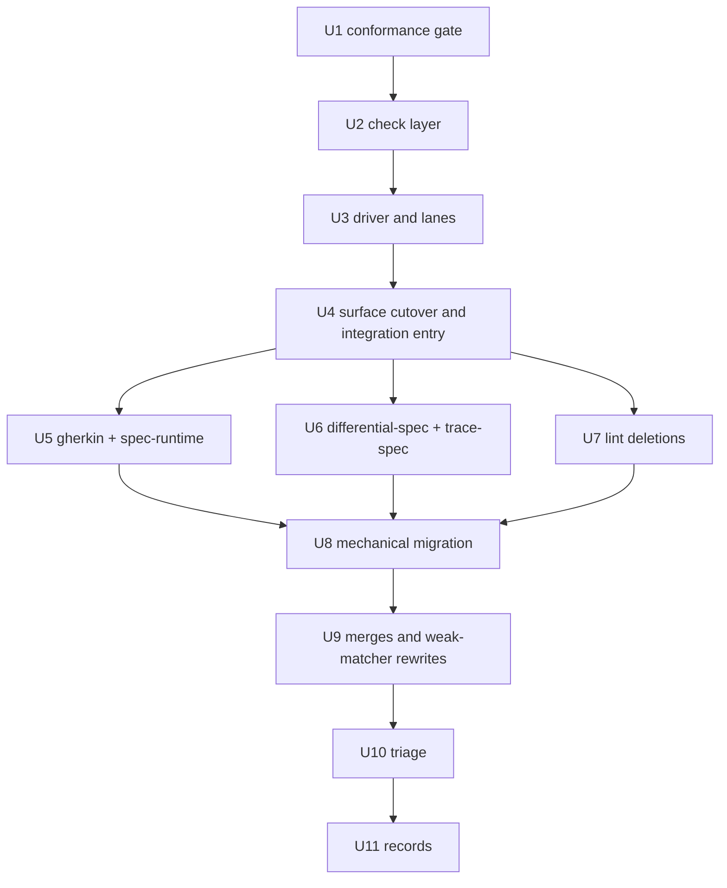

# Yielded, Callback-Bound expect - Plan

## Goal Capsule

- **Objective:** In this repo, `expect` exists only as the test's own callback parameter, every check is yielded, each observed state gets one strong check, and weak matchers fail with their rewrite. A test written from `@effect/vitest` habit either compiles into that shape or is refused with the rewrite.
- **Means:** in `packages/vitest` (`@systemfsoftware/vitest`, resolved as `@effect/vitest` everywhere), replace the soft-step `expect` with a generator driver and a curated check vocabulary (U2-U4). Port the testing libraries (U5, U6), delete the lint rules the type channel now covers (U7), and migrate every suite (U8-U10).
- **Authority:** repo rules (`AGENTS.md`, `CONSTITUTION.md`) > this plan's Product Contract (R-IDs) > its KTDs > unit Approach text. The prototype record `.context/compound-engineering/ce-prototype/2026-09-24-yielded-expect/decisions.md` is evidence, not authority. It is gitignored and exists only in this worktree.
- **Stop conditions:**
  - Stop and report if the driver cannot run a browser-mode suite (`packages/atom/effect-atom-react`) without node-only APIs.
  - Stop and report if a merge of piecewise checks would have to drop an asserted fact to compile. Never weaken a check to fit the one-check rule.
  - Stop and report if any runner default that shipped in #512 changes an outcome for a reason other than this plan's refusals: fresh layers, second run, virtual time, Effect `Equal`, or the lawful `it.prop`.
- **Execution profile:** Deep. 11 units in five phases. The conformance gate (U1) lands in its own commit before the fork work it grades.
- **Finish:** `pnpm check:local` exits 0 after the last edit, and the PR is watched to green with `gh pr checks --watch --fail-fast` (REPO-D1).

---

## Product Contract

### Summary

Change the fork's test lane so that:

- the body is a generator the runner drives: `it(name, function* ({ expect }) { ... })`;
- `expect` comes only from that parameter;
- every matcher returns a check (an Effect that only the runner can satisfy) that must be yielded;
- the runner refuses a second check on one observed state;
- weak matchers exist only as refusals whose text is the rewrite.

Every other #512 default stays, and the property lane is unchanged. The testing libraries take `expect` by parameter, the two lint rules this makes redundant are deleted, and every suite in the repo moves to the new form in this PR.

### Problem Frame

After #512 the fork refuses presence matchers and booleans, but `expect` is still an import. A test can call it anywhere and as often as it likes. Cheap models write piecewise checks: several `expect`s drilling into one state, `toHaveLength` in place of contents, `toSatisfy(isX)` with no reason. The fork cannot see this, because an Effect body shows it only the finished Effect.

The Q1 prototype (`01-callback-yielded-expect/`) measured the alternative with gemini-3.8-flash, 5 authors per wave, up to 3 revisions:

- **Habit wave** (prompt only "tests using @effect/vitest"): first drafts held 59 unyielded checks, 27 `Equal.equals` and 13 booleans. Final drafts held 0 weak forms; 5/5 went green, and 25/25 seeded bugs were caught with 0 false failures.
- **Refusal text matters:** once every refusal printed its rewrite, the habit wave went from 0/5 to 5/5.
- **Merging happened unprompted:** authors merged checks into one whole-state `toEqual` (for example `{ initial, mid, final }`).

### Key Decisions

- **`expect` is the test callback's parameter; the package exports none.** (session-settled: user-directed — chosen over an importable `expect` guarded by a lint ban: "why not make expect a callback parameter so u dont need to import shit and theres no ambiguity".) Governs R1, R11.
- **Every check is yielded.** (session-settled: user-directed — chosen over checks as plain throwing calls: "make such that expect needs to be yielded ... this ensures AI will actually use it".) Governs R3, R4.
- **Only Staff-QA-grade assertions; weak ones are refused by name.** (session-settled: user-directed — chosen over refusing only the presence matchers: "theres other forms of slop too, like multiple expects instead of an expect objectContaining ... force it to be good using the most advanced vitest out there".) Governs R5, R6.
- **The body is a generator the runner drives; one observed state gets one check.** (session-settled: user-approved — the prototype set this beside the Effect-returning body, which cannot see steps and so cannot refuse piecewise checks; the user then ran LFG on it.) Governs R2, R5, R8.
- **No escape hatch.** (session-settled: user-directed — chosen over keeping bypass routes for convenience: "Theres no point giving ai agents an escape hatch to write bad tests".) Governs R1, R10.

### Requirements

**Body and `expect`**

- R1. The fork exports no `expect`, `assert`, or `@effect/vitest/utils` helpers, and its `vitest` re-export omits them. A test's only `expect` is the `{ expect }` its body receives. Any assertion made outside a check from that `expect` fails the test with "✗ an expect imported from vitest ran; take it from the test callback: it(name, function* ({ expect }) { ... })". That covers a raw `vitest` `expect`, `expect.soft`, and chai `assert`. A test registered with `vitest`'s own `it`/`test` fails with "✗ this test was registered with vitest's it; import it from @effect/vitest". Both hold in every test file of the repo, whatever it imports.
- R2. A test body is a generator the runner drives. It yields services, Effects and checks directly. A sync function, an `async` function, and a function returning an Effect are each refused with the rewrite at compile time and at run time.
- R3. Every matcher returns a check: an Effect that needs `Asserted`, a service only the runner provides. A check written but not yielded fails the build (`floatingEffect`) and is refused at run time as "written but never yielded".
- R4. A body that yields no check is refused on the test name at compile time. At run time the no-assertion gate counts only yielded checks.
- R5. One observed state gets one check. A second check before the body's next non-check step, and a check inside a loop, are refused with "assert the state once" and the rewrite (`toMatchObject({...})`, `expect({ a, b }).toEqual({...})`, or `it.each` for several inputs).
- R6. The vocabulary is curated, and each refusal uses one message at compile time and run time.
  - Refused by name: `toBeDefined`, `toBeTruthy`, `toBeFalsy`, `not.toBeNull`, `not.toBeUndefined`, `toHaveLength`, `toHaveProperty`, `toBeInstanceOf`, `toBeTypeOf`, `toHaveBeenCalled`, `toHaveBeenCalledTimes`, every snapshot matcher, `expect.anything`, `.resolves`, `.rejects`, `expect.poll`, `expect.soft`.
  - Refused without the argument that makes them specific: `toThrow()`, `toThrowError()`, `toSatisfy(fn)` without a reason, `toMatchObject({})`.
  - Refused as the actual: a `boolean`.
  - Kept: `toEqual` (Effect `Equal`), `toStrictEqual`, `toBe`, `toContain`, `toMatch`, `toMatchObject`, `toThrow(X)`, `toSatisfy(fn, why)`, `toHaveBeenCalledExactlyOnceWith`, `toHaveBeenNthCalledWith`, the ordered comparisons, and the statics `objectContaining`, `arrayContaining`, `closeTo`, `any`, `stringMatching`, and `schemaMatching` (which takes an Effect Schema).

**Runner**

- R7. Every #512 default holds unchanged: a fresh layer build per test, `shared: true` as the only sharing, concurrent and shuffled blocks, a second run that fails as `LeakedState`, idle-driven virtual time, Effect `Equal` in `toEqual`, and the lawful `it.prop`/`it.effect.prop`/`it.law`.
- R8. A failed check stops the test at that check. The generator's `finally` blocks and scope finalizers still run, and the report shows the check's diff.
- R9. Habit names exist only as refusals that carry the rewrite: calling `it.effect`, `it.scoped` or `it.scopedLive`, and `beforeEach`/`afterEach`. `it.effect.prop` and `it.live` (a generator body on the real clock) stay. `it.each(rows)` calls the generator body with `(row, { expect })`, the order Vitest's `it.for` passes.

**Libraries and lint**

- R10. A testing library receives the test's `expect` by parameter. Gherkin `Then`/`And`/`But` bodies take `(state, expect)` and return exactly one check. One assertion step per observed state: a `Then`/`And`/`But` chain with no `Given`/`When` between its steps is refused and merges into one `Then` over a record. `Then.soft`/`Then.poll` (and their `And`/`But` forms) are deleted. No API counts an assertion without a check.
- R11. The lint rules `vitest-from-effect-vitest` and `expect-boolean-predicate` are deleted. Every remaining rule that reads `expect` matches the identifier name: `expect-call.ts:3`, `no-assert-in-property.ts:34` and `trace-test-requires-taxonomy.ts:35` in test-discipline, plus `no-either-tag-assertions.ts:100`, `no-bodyless-status-assertion.ts:19` and `in-source-test-prop-only.ts:34`. A destructured `{ expect }` therefore keeps all six firing unchanged.

**Migration and records**

- R12. Every test in `packages/` and `examples/` uses the new form and passes. Each merged check asserts at least every fact the checks it replaced asserted.
- R13. Changesets, the fork and Gherkin READMEs, and a solution doc record the change.

### Acceptance Examples

- AE1. Covers R2, R3, R4.
  - **Given** `it("ships", function* ({ expect }) { const shop = yield* Shop; expect(yield* shop.total).toEqual(Money.of(0)) })`.
  - **Then** the build fails with `floatingEffect` on the check. At run time the test fails with "written but never yielded", and the test name carries the no-check refusal.
- AE2. Covers R5.
  - **Given** `yield* expect(order.id).toEqual(1)` followed directly by `yield* expect(order.status).toEqual("Pending")`.
  - **Then** the second check fails with "assert the state once", naming `toMatchObject({ id: 1, status: "Pending" })`.
  - **Given** the same two checks with `yield* TestClock.adjust("3 seconds")` between them.
  - **Then** the test passes.
- AE3. Covers R6.
  - **Given** `yield* expect(lines).toHaveLength(2)`.
  - **Then** tsc reports the rewrite as the `this`-type mismatch, and the run fails with the same text.
- AE4. Covers R8, R7.
  - **Given** a failing check inside `try { ... } finally { yield* release }`, in a test whose layer adds a finalizer.
  - **Then** the test fails with the diff, the `finally` step and the layer finalizer both run, and there is no second run.
- AE5. Covers R10.
  - **Given** a Gherkin `Then("...")((s, expect) => expect(s.result).toMatchObject({ reading: 7, notes: [{ key: "count-must-be-positive" }] }))`.
  - **Then** it passes and counts as the scenario's check.
  - **Given** a `Then` body that yields two checks, or a `Then` followed directly by an `And`.
  - **Then** it is refused with "assert the state once".
- AE6. Covers R1.
  - **Given** `import { expect } from "@effect/vitest"`.
  - **Then** it is a compile error naming the callback parameter. There is no lint rule involved.
  - **Given** a fork test that yields one real check and also calls `import { expect } from "vitest"`'s `expect(1).toEqual(1)`.
  - **Then** the test fails with the raw-expect refusal.
  - **Given** a test registered with `import { it } from "vitest"`.
  - **Then** it fails with the registration refusal.

### Success Criteria

- Against the post-#512 `main`, every changed outcome is a refusal this plan introduced that the migration then rewrote, or a real defect a merged check exposed. Each one is listed in the PR body.
- The migrated suites contain no refused form, and no `@ts-expect-error` outside the conformance and tstyche refusal probes.

### Scope Boundaries

- Out: `packages/storybook-gherkin`. Its play functions use `storybook/test`, not the fork.
- Out: refusing NEITHER-class slop (loose bounds like `toBeGreaterThan(0)`, a wrong oracle, missing scenarios). Only a human can judge those.
- Out: any change to the property lane's semantics (R11-R15 of the #512 plan).

#### Deferred to Follow-Up Work

- Re-running the prototype's specimen harness against the shipped package.
- A lint rule for `toBeGreaterThan(0)`-style bounds, if a census shows a pattern worth refusing.

### Sources

- Prototype: `.context/compound-engineering/ce-prototype/2026-09-24-yielded-expect/01-callback-yielded-expect/lib/{checks.ts,generator.ts,habit-a.ts,runtime.ts}`, plus the probes under `probe/`.
- Prior plan: `docs/plans/2026-09-24-0448-feat-lawful-effect-vitest-fork-plan.md` (the R-IDs and KTDs this supersedes are listed under KTD7).
- The Effect v4 iterator protocol (`repos/effect/packages/effect/src/Utils.ts` `SingleShotGen`, `repos/effect/packages/effect/src/internal/effect.ts` `fromIteratorUnsafe`), and the `Effect.gen` signature (`repos/effect/packages/effect/src/Effect.ts:1431`).
- Vitest 5 `TestContext.expect` (`node_modules/.pnpm/vitest@5.0.1*/node_modules/vitest/dist/chunks/config.d.*.d.ts:3252`).
- Census for this plan (branch base `659321de6d5`):
  - 166 files with 2,110 `expect(` sites; 37 files with 59 `it.effect(` sites; 114 files with `Then`/`And`/`But`; 63 `it.effect.prop`; about 138 one-argument `toSatisfy`.
  - Integration users: `recordAssertion` at `packages/effect-gherkin-spec/src/DoNotation.ts:226,272`, `packages/differential-spec/src/core/DualExecutionSupervisor.ts:188` and `packages/trace-spec/src/Contract.ts:192`; `owned` at `packages/effect-gherkin-spec/src/FeatureRuntime.ts:50`.
  - Scenario registration: `packages/effect-spec-runtime/src/Register.ts:51` (`it.effect`/`it.live`).

---

## Planning Contract

### Key Technical Decisions

- KTD1. **The driver is one Effect.** A loop in the style of `Effect.gen` steps the body's iterator and runs each yielded Effect in the same fiber. A value carrying the check brand is judged against the ledger; anything else is a step, which opens a new observed state. Scope, layers, virtual time, concurrency, the second run and finalizers therefore keep working through the existing runner (`runner.ts` `runTest`/`buildSingleRun`) unchanged. A loop is detected as a second check with no step since the last one, so it needs no separate mechanism.
- KTD2. **`expect` is built per test and bound by construction** from `ctx.expect` of the Vitest task created at registration. It replaces `binding.ts` (the `Fiber.getCurrent` reference and the module-level sync slot), `owned.ts` and the scheduler step boundary in `step-boundary.ts`. The prior plan's KTD4 (binding) and KTD5 (soft within a step, stop at the next) are superseded: one check per state leaves nothing to report softly. Governs R1, R8.
- KTD3. **Every refusal travels on two channels with one text.** At compile time the refusal is a `this` type, a parameter union, or the gate on the test name. At run time it is the thrown message. It never sits in a return type, which TS prints as "not callable" (prototype habit wave: 0/5 → 5/5). The texts are ported verbatim from the prototype's `checks.ts` `refusedText`/`negatedText` and extended to `expect.poll`/`expect.soft`. Governs R3-R6, R9.
- KTD4. **The no-check gate sits on the test name.** It reads `[R] extends [Asserted | Provided]` and requires `[Asserted] extends [R]`, as the prototype's `Gate`. A gate on the body is judged before a destructured `{ expect }` is inferred, so it cannot see the checks. `NoInfer` does not stop a distributive `Exclude` from widening `R`, hence the tuple form.
- KTD5. **Library integration hands over `expect`; pipelines mark their steps.** Gherkin gets the test's `expect` when `effect-spec-runtime` registers the scenario as a generator body that yields the scenario Effect. Each `Given`/`When` runs inside an integration step marker exported from a new `@effect/vitest/integration` entry (a `tsdown.config.ts` entry, REPO-S4), which opens a new observed state inside a nested Effect. `Then`/`And`/`But` never open a state: they judge the state the last `Given`/`When` produced, so a `Then` followed by `And`/`But` before the next `Given`/`When` is two checks on one state and is refused (R5). The marker needs `Asserted`, so it only type-checks inside a test. `differential-spec` and `trace-spec` take `expect` from their caller and state their verdict as a check. There is no replacement for `recordAssertion`. Governs R10.
- KTD6. **Delete both lint rules rather than retarget them.** With no `expect` export, `vitest-from-effect-vitest`'s concern moves to the type channel. The type-level refusal of a `boolean` actual covers every form `expect-boolean-predicate` flags. Type beats lint (`docs/solutions/architecture-patterns/provenance-ritual-gates.md`), and duplicate diagnostics cost volume (`docs/solutions/tooling-decisions/rule-admission-severity-and-accretion.md`). Governs R11.
- KTD7. **Which parts of the #512 contract this supersedes.**
  - The prior plan's R1 (full upstream surface) changes: `expect`, `utils`, `owned`, `recordAssertion` and the Effect-body callables go.
  - R6 (soft within a step) is replaced by R5/R8 here, and R10 (`owned`/`recordAssertion`) by R10 here.
  - R16/R17 (lint) are withdrawn by KTD6.
  - Everything else in that plan stands.
- KTD8. **The library brands both assertions and tests, and a setup-file guard refuses anything else.** The `Asserted` brand alone only proves a test yielded at least one fork check. It cannot see a raw `vitest` `expect` beside that check. U1 measured on vitest 5.0.1 that raw `expect` keeps its own state object: a raw call moved the task's `assertionCalls` 0→0, so counting cannot catch it.
  - Every Vitest assertion (raw `expect`, `expect.soft`, `expect.poll`, chai `assert`, and the task's `ctx.expect`) runs on the one shared `chai.Assertion` prototype.
  - The guard wraps that prototype's methods and properties once and throws the R1 refusal unless a synchronous flag is set. Only the fork's check sets that flag, for the duration of its matcher call.
  - The fork's `it` marks each task it registers in `task.meta`. The guard's `beforeEach` refuses any task without that mark.
  - The guard ships as the `@effect/vitest/guard` entry (a `tsdown.config.ts` entry, REPO-S4). The shared `packages/toolchain/vitest-config` `sharedConfig` lists it in `setupFiles`, so every package gets it without any import. This setup-file hook is internal plumbing; the user-facing `beforeEach` refusal (R9) is unchanged.
  - Governs R1.
- KTD9. **The gate lands first.** U1's conformance probes and tstyche refusals are committed red before U2-U4 (Evaluator surface class, `AGENTS.md`).
- KTD10. **A merge keeps every fact.** A piecewise group becomes one `toMatchObject`/`toEqual` over a record containing every value the old checks named. A presence or length check becomes the value it implied. Where the value is unknowable at authoring time, `expect.schemaMatching(Schema)` or `expect.arrayContaining` stands in, with the reason in the check. Governs R12.

### Assumptions

This ran in pipeline mode, so these scoping bets were not confirmed and take the defaults recorded here:

- The full migration lands in this PR. `expect` stops being exported, so a staged cutover would leave the tree red.
- `it.layer` stays as a block form equal to `layer(...)`. Only the Effect-body callables become refusals.
- `expect.poll` is refused. Its one site (`packages/atom/effect-atom-react/tests/waiting-for-async-values.integration.test.ts:131`) becomes a check after virtual time settles.

### Test-Layer Gate

Every proposed test went through the admission gate, which refuses by default. All admitted tests run in-process through a published surface: `run-fixtures.ts` drives `startVitest` from `vitest/node`, and tstyche reads types. None spawns a process.

| Proposed test                                                                          | Verdict | Why                                                                                                |
| -------------------------------------------------------------------------------------- | ------- | -------------------------------------------------------------------------------------------------- |
| AE1-AE6, one-state/loop/`it.each`/forked-fiber fixtures                                | admit   | Each defends an observable contract of the runner a plausible bug would break.                     |
| One runtime fixture per refusal class; tstyche per refused name                        | admit   | The message text is the contract. Names are separate type declarations but share one runtime path. |
| Every kept matcher passes and fails                                                    | refuse  | That re-tests Vitest's matchers, which is forwarding. One ledger-judgment fixture replaces it.     |
| A new second-run `LeakedState` fixture                                                 | refuse  | The #512 `runner/leak.test.ts` already defends it and migrates mechanically.                       |
| `Then.soft`/`Then.poll` behaviour                                                      | refuse  | The feature is deleted (R10).                                                                      |
| A raw `vitest` `expect` beside a real check, and a raw `vitest` `it`, are each refused | admit   | This is the brand's escape route; each is a plausible bypass the guard must close.                 |
| Differential and trace verdicts count as the one check                                 | admit   | This is the gate interplay the new integration introduces.                                         |
| RuleTester suites for deleted rules                                                    | refuse  | They are deleted with the rules.                                                                   |

### Destructive Review

Lens: Scope Challenge, chosen because the capsule's Means joins a fork change, three library ports, lint and a repo-wide migration.

Assumptions surfaced:

1. The Gherkin combinators `Then.soft`/`Then.poll` need to survive, over a check.
2. Some lint rules identify `expect` by its import, so they need retargeting to the callback parameter.
3. The migration must land in the same PR as the surface change.

Failures, with their resolutions:

1. Scoping U5 to preserve soft/poll was unfounded. They are used only in `effect-gherkin-spec`'s own tests. Resolution: delete them (R10, U5).
2. Scoping U7 to retarget rules was unfounded. All six rules that read `expect` match the identifier name. Resolution: U7 is deletion only (R11).
3. U1 scoped a pass/fail fixture for every kept matcher, which re-tests Vitest. Resolution: one ledger-judgment fixture (Test-Layer Gate).

Assumption 3 holds: without a dual surface there is no green intermediate tree, and a dual surface is the rejected escape hatch. Kept: every KTD and the unit order.

### High-Level Technical Design

_Directional, not an implementation spec._

Driver loop (KTD1). States are what the ledger tracks per test.

```mermaid
stateDiagram-v2
  [*] --> Fresh: body() called with { expect }
  Fresh --> Stepped: yield Effect (not a check) / run it
  Stepped --> Stepped: yield Effect / run it
  Stepped --> Checked: yield check / judge
  Fresh --> Checked: yield check / judge
  Checked --> Stepped: yield Effect / new observed state
  Checked --> Refused: yield check / "assert the state once"
  Checked --> Failed: check fails / return() runs finally
  Stepped --> Done: generator returns
  Checked --> Done: generator returns
  Done --> Gate: ledger.judged == 0 -> no-assertion refusal; written != judged -> "never yielded"
  Gate --> SecondRun: passed, not shared
```

Surface after the change (the API shape the migration writes):

```text
import { describe, it, layer } from "@effect/vitest"        // no expect
it(name, function* ({ expect }) { ...; yield* expect(x).toEqual(y) })
it.live(name, function* ({ expect }) { ... })                 // real clock
it.each(rows)(name, function* (row, { expect }) { ... })     // Vitest it.for order
layer(Shop.layer)((it) => { it(name, function* ({ expect }) { ... }) })
it.prop / it.effect.prop / it.law                             // unchanged
it.effect(...)  it.scoped(...)  it.scopedLive(...)  beforeEach  afterEach   // refusals with rewrite

import { step } from "@effect/vitest/integration"             // name decided in U4; needs Asserted
Then(text)((state, expect) => expect(state.result).toMatchObject({...}))   // one check
```

Unit dependencies:



### System-Wide Impact

- **Every suite** changes authoring shape. Semantics change only where a refusal fires, where a merged check asserts more, or where soft reporting of several failures on one state is gone. Each such site is triaged in U10.
- **Published libraries** change public signatures: `effect-gherkin-spec` (step bodies; `Then.soft`/`Then.poll` removed), `effect-spec-runtime` (registration), `differential-spec` and `trace-spec` (take `expect`), `oxlint-plugin-test-discipline` (two rules removed), `oxlint-config-recommended` (enforced list), and `@systemfsoftware/vitest` itself. All are pre-1.0, so the breaks ship directly (REPO-R1).

### Risks

| Risk                                                                                                                                              | Mitigation                                                                                                                                                                                                                  |
| ------------------------------------------------------------------------------------------------------------------------------------------------- | --------------------------------------------------------------------------------------------------------------------------------------------------------------------------------------------------------------------------- |
| The one-check rule fires inside library pipelines, where several steps run within one yielded Effect.                                             | KTD5's step marker. U5's AE5 probe pins it.                                                                                                                                                                                 |
| A merge silently drops a fact.                                                                                                                    | KTD10, plus U9's reviewer pass comparing asserted facts per site; stop condition in the capsule.                                                                                                                            |
| The guard refuses assertions made by a runner that is not the fork (Storybook's `storybook/test` play functions in `packages/storybook-gherkin`). | U4 runs `storybook-gherkin`'s browser suite. If Storybook's `expect` shares the `chai` instance and its project inherits `sharedConfig`, that project leaves the guard out of its `setupFiles`, because it is out of scope. |
| The browser-mode suite needs a node API in the driver.                                                                                            | The driver is plain iterator + Effect code (KTD1). U3 runs `effect-atom-react`'s browser project before U8.                                                                                                                 |
| The step marker becomes an escape hatch for authors.                                                                                              | It lives on `/integration`, needs `Asserted`, and only opens a state; it counts nothing. U10 greps migrated test files for `/integration` imports; any hit is rewritten or the marker gets a lint refusal in test files.    |
| Losing soft multi-failure reporting hides a second failure.                                                                                       | One structural check prints a diff of every wrong field (prototype finding).                                                                                                                                                |

---

## Implementation Units

### Phase: Gate

### U1. Conformance probes and tstyche refusals for the yielded surface

- **Goal:** Red evidence for R1-R9 before any fork change.
- **Requirements:** R1-R9; KTD8, KTD9.
- **Files:** `packages/vitest-conformance/tests/__fixtures__/probes/expect/*` (rewrite `soft-step`, `after-failed`, `assertion-gate`, `owned`, `narrowed`, `concurrent-gate`, `forked-fiber`, `check-only`, `async-body`, `hooks`; add `yielded`, `one-state`, `vocabulary`, `habit`, `raw-vitest-expect`), `packages/vitest-conformance/tests/expect-surface.integration.test.ts`, `packages/vitest/test-types/{surface,refusals}.tst.ts`.
- **Approach:**
  - Port the prototype's `probe/a-{good,slop,vocab-good,vocab-slop}.test.ts` and `probe/habit-forms.test.ts` as fixtures run by `support/run-fixtures.ts`. Every fixture, old or new, is written in the new surface, so none needs migrating after U4.
  - The integration test asserts each fixture's outcome and message. Each refusal's compile half goes in tstyche.
  - Measured before writing fixtures: raw `vitest` `expect` has separate state from `ctx.expect`, so KTD8 enforces through the chai guard, not through counters.
- **Test scenarios** (each admitted by the test-layer gate below):
  - AE1-AE4 and AE6 as fixtures.
  - One fixture per refusal class: by name, missing the specific argument, and boolean actual. Each fails with its text. tstyche pins every refused name's compile half, since each is a separate declaration.
  - One kept matcher is judged by the ledger: it counts toward the gate, and when it fails, the test fails. Matcher semantics are Vitest's and are not re-tested.
  - A check in `Effect.forEach` over two items is refused.
  - `it.each` with two rows judges each row once.
  - A forked fiber's failed check fails the test.
  - AE6's raw-expect and raw-`it` cases: each fails with its refusal under the guard setup file.
- **Verification:** the fixtures fail against the #512 fork, each for the stated reason, recorded for the PR body.

### Phase: Fork

### U2. Check layer: `Asserted` ledger, checks, curated vocabulary

- **Goal:** R3, R5 (ledger half) and R6 as a library layer, with no runner changes yet.
- **Requirements:** R3, R5, R6; KTD2, KTD3.
- **Files:** new `packages/vitest/src/internal/checks.ts`; `packages/vitest/src/internal/refusals.ts` (texts); `packages/vitest/src/internal/equal.ts` (unchanged, reused).
- **Approach:**
  - Port `checks.ts` from the prototype: `Asserted`, `Check`, and the ledger (written, judged, failed, per-state count).
  - Build `makeExpect(ctx)`: the matcher proxy returning unbound chai members (the Proxy rule from #512), the refusal tables, and the statics including `schemaMatching` via `Schema.toStandardSchemaV1` (`repos/effect/packages/effect/src/Schema.ts:1339`).
  - Refusal getters use `Object.defineProperty` with a throwing static, because `Object.assign` triggers getters.
  - No `any`, no inline cast member access, no mutable variables in `Effect.gen` (use `Ref` or the ledger object).
- **Test scenarios:** tstyche refusals pass. The runtime halves of U1's vocabulary fixtures go green once U3's driver runs them.

### U3. Generator driver and lanes

- **Goal:** R2, R4, R5, R7, R8 and R9, with #512's defaults preserved.
- **Requirements:** R2, R4, R5, R7, R8, R9; KTD1, KTD4, KTD8.
- **Files:** `packages/vitest/src/internal/runner.ts` (lanes, `makeMethods`, `layer` blocks, `each`, second run), new `packages/vitest/src/internal/driver.ts`, `packages/vitest/src/mod.ts` (types `Test`, `Methods`, `Gate`).
- **Approach:**
  - Build the driver per KTD1 as the body builder for `it`, `it.live`, `it.each`, `it.only/skip/skipIf/runIf/fails`, and the `layer`/`it.layer`/`describeWrapped` blocks. It uses only the public `Effect.gen` iterator contract, never `effect/internal`.
  - After the body, the gate compares written, judged and zero.
  - Build the KTD8 guard in `packages/vitest/src/internal/guard.ts`: the chai prototype wrapper, the authorized-call flag set by U2's check, the `task.meta` mark set at registration, and the `beforeEach` registration refusal.
  - `it.effect`/`it.scoped`/`it.scopedLive` become callables that refuse, and `it.effect.prop` keeps working. `beforeEach`/`afterEach` refusals stay.
  - Keep virtual time, fresh layers, shuffle, the second run and `LeakedState` as they are.
- **Execution note:** run `packages/atom/effect-atom-react`'s browser project on a minimal generator test before U4.
- **Test scenarios:** U1's runner and expect fixtures pass. The #512 runner fixtures (`runner/*`, `v3-testclock/*`) pass after only the mechanical body rewrite. AE4 holds.

### U4. Surface cutover and integration entry

- **Goal:** R1, and the KTD5 integration entry, with no leftover code.
- **Requirements:** R1, R10; KTD2, KTD5, KTD7.
- **Files:**
  - `packages/vitest/src/mod.ts`.
  - Delete `packages/vitest/src/{utils.ts,Refusals.ts}` if nothing public remains in them, plus `src/internal/{expect.ts,binding.ts,owned.ts,step-boundary.ts}` and `AfterFailedExpect` in `errors.schema.ts`.
  - New `packages/vitest/src/integration.ts` and `packages/vitest/src/guard.ts` (the setup-file entry).
  - `packages/toolchain/vitest-config/lib/base.js` (`sharedConfig.test.setupFiles` gains `@effect/vitest/guard`), and every package config that replaces rather than extends `setupFiles`.
  - `packages/vitest/tsdown.config.ts`, `packages/vitest/README.md`, `packages/vitest/test-types/*`.
- **Approach:**
  - Replace `export * from "vitest"` with an explicit list that omits `expect` and `assert`.
  - `integration.ts` exports the step marker and the `Check`/`Asserted` types. Its exact names are decided here and used by U5/U6.
  - Update `api:check` output (api-extractor report).
- **Test scenarios:** AE6. tstyche proves `expect`, `assert` and `utils` are absent, and that the marker does not type-check outside a test.

### Phase: Libraries

### U5. `effect-gherkin-spec` and `effect-spec-runtime`

- **Goal:** Gherkin scenarios run as generator bodies. `Then`/`And`/`But` take `(state, expect)` and return one check. `Then.soft`/`Then.poll`, `checkSoftFailures`, `SoftFailuresRef` and `SoftFailuresContext` are deleted: only this package's own tests use them, soft contradicts R8, and virtual time makes polling unnecessary.
- **Requirements:** R10; KTD5.
- **Files:** `packages/effect-gherkin-spec/src/{DoNotation.ts,FeatureRuntime.ts}` (drop `recordAssertion`/`owned`), `packages/effect-spec-runtime/src/{Register.ts,Suite.ts}`, both packages' READMEs and the gherkin skill examples inside the repo.
- **Approach:**
  - Registration builds `function* ({ expect }) { yield* scenario(expect) }` on `it` or `it.live`.
  - Each step runs inside the U4 marker.
  - A step body's type accepts one `Check`, or an `Effect` producing one. Two checks in one `Then` body are refused by the ledger.
- **Test scenarios:**
  - AE5.
  - A scenario with no `Then` is refused by the no-check gate.
  - The scenarios that exercised `Then.soft`/`Then.poll` in `gherkin-step-combinators`, `interruption-lifecycle` and `pipeline-semantics` are deleted with the feature, not rewritten. The other scenarios in those files migrate.

### U6. `differential-spec` and `trace-spec`

- **Goal:** Their verdicts become checks from the caller's `expect`. Each public entry point that reported through `recordAssertion` gains an `expect` parameter and ends in one check over its report: a pass is the check passing, and a disparity or break is the check failing with the report. Called from a Gherkin `Then`, that check is the step's one check.
- **Requirements:** R10; KTD5.
- **Files:** `packages/differential-spec/src/core/DualExecutionSupervisor.ts` and its public entry points, `packages/trace-spec/src/Contract.ts` and `packages/trace-spec/README.md`.
- **Test scenarios:** a conclusive differential pass, and a trace contract that holds, each count as the test's one check. Existing disparity and break tests migrate unchanged in meaning.

### Phase: Lint

### U7. Lint deletions

- **Goal:** R11.
- **Requirements:** R11; KTD6.
- **Files:**
  - `packages/oxlint-plugin/oxlint-plugin-test-discipline/src/rules/{vitest-from-effect-vitest,expect-boolean-predicate}*`, their `__tests__`, `src/index.ts`, `src/rules/path.config.ts` (drop the exemptions only that rule read), `README.md`, `etc/*.api.md`.
  - `packages/oxlint-presets/oxlint-config-recommended/src/index.ts` (`enforcedTestDisciplineRules`).
- **Approach:** delete the rules, their configs, their `__tests__`, their README rows and their preset entries. Regenerate `etc/*.api.md`. No rule is retargeted (R11).
- **Test expectation:** none. Deleted rules take their RuleTester suites with them.

### Phase: Migration

### U8. Mechanical migration

- **Goal:** every suite compiles on the new surface, before any merging.
- **Requirements:** R12.
- **Approach:**
  - A codemod (`ast_edit` or a throwaway script) rewrites:
    - `it.effect(name, () => Effect.gen(function* () {...}))` into `it(name, function* ({ expect }) {...})`;
    - sync bodies into generators, and `expect(...)` into `yield* expect(...)`;
    - Gherkin step bodies into `(s, expect) => ...`;
    - the `expect` imports away.
  - Work runs per package, one worker each, with each file owned by a single worker.
  - In-source `import.meta.vitest` blocks and `examples/` are included.
- **Verification:** per package, typecheck errors are only R5/R6 refusals, which U9 fixes.

### U9. Merges and weak-matcher rewrites

- **Goal:** zero refused forms remain. Every merge follows KTD10.
- **Requirements:** R12; KTD10.
- **Approach:**
  - Per package, rewrite each refused site: piecewise groups, one-argument `toSatisfy`, `toHaveLength`, `toBeInstanceOf`, `toHaveProperty`, `expect.anything`, `expect.poll`, the `utils` asserts at `packages/effect-microsandbox/examples/boot-alpine.ts`, and README examples.
  - Each worker reports per site the facts before and after.
  - A reviewer pass samples the reports against the diffs.
- **Verification:** `pnpm --filter <pkg> typecheck`, `lint` and `test` exit 0 per package.

### U10. Triage changed outcomes

- **Goal:** every outcome that differs from the `main` baseline is explained.
- **Requirements:** R12, and the success criteria.
- **Approach:**
  - Record per-test outcomes on `main` and on the branch.
  - For each difference, classify it as a refusal rewritten, a defect a merged check exposed (fix it at the source), or a regression (fix the fork).
  - List them in the PR body.

### Phase: Records

### U11. Records, docs and changesets

- **Goal:** R13.
- **Files:**
  - Changesets for every package whose build hash changed. The fork, `effect-gherkin-spec`, `effect-spec-runtime`, `differential-spec`, `trace-spec`, `oxlint-plugin-test-discipline` and `oxlint-config-recommended` are breaking minors; test-only packages get `none`.
  - `docs/solutions/` gets one learning: refusals must be in the printed error, and the generator body over the Effect body.
  - The alternatives table below serves as the REPO-W8 record.
- **Test expectation:** none, since this unit is documentation and release intents.

---

## Alternative Approaches Considered

| Approach                                                            | Why not                                                                                                                                                 |
| ------------------------------------------------------------------- | ------------------------------------------------------------------------------------------------------------------------------------------------------- |
| Effect-returning body with a callback `expect` (prototype avenue B) | The runner sees only the finished Effect, so it cannot refuse a second check on one state or a check in a loop. It also reports only the first failure. |
| Keep an importable `expect` and ban `vitest` imports by lint (#512) | Lint is a weaker channel than the type (provenance-ritual-gates). The import still allowed unyielded, piecewise checks.                                 |
| Soft reporting of several checks per step (#512 R6)                 | Merged structural checks print every wrong field in one diff; soft reporting kept the piecewise form alive.                                             |
| Stage the migration across PRs with both `expect`s exported         | That is a second convention beside the first, and an escape hatch for the transition's lifetime. The user rejected escape hatches.                      |

## Verification Contract

| Scope                 | Command                                                                          | Proves                            |
| --------------------- | -------------------------------------------------------------------------------- | --------------------------------- |
| Fork                  | `pnpm --filter @systemfsoftware/vitest typecheck lint test test:types api:check` | R1-R9 compile and run halves      |
| Conformance           | `pnpm --filter @systemfsoftware/vitest-conformance test`                         | AE1-AE6, #512 runner defaults     |
| Browser               | `pnpm --filter @systemfsoftware/effect-atom-react test`                          | the driver runs without node APIs |
| Each migrated package | `pnpm --filter <pkg> typecheck lint test`                                        | R12                               |
| Whole tree            | `pnpm check:local`                                                               | REPO-D1                           |
| CI                    | `gh pr checks --watch --fail-fast`                                               | REPO-D1                           |

## Definition of Done

- R1-R13 hold, the KTD8 guard is active in every package's test config, and AE1-AE6 pass as conformance fixtures or tstyche assertions.
- U1's probes were observed red on the #512 fork, and green after U4, with the evidence in the PR body.
- No refused form remains outside the refusal probes, and every U10 difference is classified in the PR body.
- `pnpm check:local` exits 0 after the last edit, the PR is open, and its checks are green.
