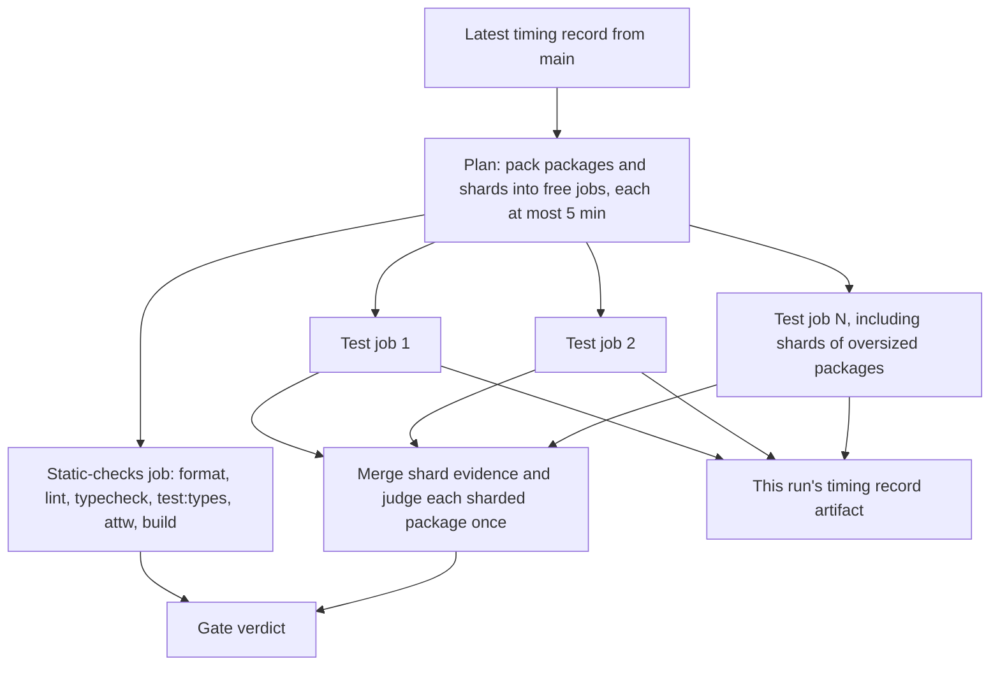

# CI Test Timing Routing - Plan

## Goal Capsule

- **Objective:** A pull request gets its gate verdict with no test job's work much past 5 minutes and with progress visible while it runs. The CI gate stops hitting its 45-minute timeout, and it adjusts on its own as packages' test cost changes, without buying runners that free public runners can replace.
- **Means:** record each package's test duration on every run; pack `test` work into free `ubuntu-latest` jobs to a 5-minute target using `main`'s latest record; shard any package that is over the target on its own; judge a sharded package once over its merged shards.
- **Authority:** R-IDs win on behavior. The root `AGENTS.md` Evaluator rule binds the workflow and gate-script changes: they go in their own commit, and the gate is observed red before the change and green after it.
- **Open blockers:** none.
- **Finish and ship:** one PR against `main`, watched to green.

---

## Product Contract

### Summary

Every gate run records how long each package's tests took and keeps that record as a run artifact. The next run reads `main`'s latest record and packs the `test` work into free `ubuntu-latest` jobs of 5 minutes or less. A package that is too large for one job is split into test-file shards, and its conformance and coverage judgment runs once over the merged shards. Lint, typecheck, and build stay in one free job, and CI output streams while tasks run.

### Problem Frame

The gate step took 7.5 minutes at #509 (`6682e31e77`). After #510 (`13fab8d87b`) moved every Gherkin, trace, and differential case onto the schedule-exploring kernel, it took 39.5 minutes (cancelled) at #510 and 44.1 minutes at #519, where it hit the job's 45-minute timeout (`.github/workflows/reusable-checks.yml:13`). #516 and #518 were also cancelled before they finished.

All of that work runs in one 4-vCPU `ubuntu-latest` job (`.github/workflows/reusable-checks.yml:12`). Lint, typecheck, type tests, attw, build, and every package's tests share that job. Measured locally at the per-change profile, the `test` lane alone took 400 s, and four packages accounted for 846 s of task time: `effect-daemon-spec` 328 s, `effect-atom` 222 s, `effect-memfs` 192 s, `discern` 104 s. The other 29 test tasks together took 283 s.

The run is also silent. Passing test tasks print nothing (`turbo.json` `test.outputLogs: errors-only`), and in CI turbo prints a task's output only after the task ends. The #519 log shows 22 minutes with no output before the summary appeared.

No workflow or script records per-package timing today, so no routing decision can use measured cost.

### Requirements

**Timing record**

- R1. Every gate run records, for each package or shard whose `test` task executed, its duration, the job it ran in, and whether it passed, failed, or was cut off, as an artifact of that run.
- R2. A `test` task served from turbo's cache records no duration and does not replace that package's last measured duration.
- R3. The run's summary page lists each package or shard with its duration and job, and flags any job whose test work exceeded 5 minutes.

**Routing**

- R4. Before tests run, the gate reads each package's most recent measured duration from `main`'s timing records and packs packages' `test` work into free `ubuntu-latest` jobs so each job's predicted test work is at most 5 minutes. A cancelled or partial `main` run updates only the packages it measured.
- R5. A package whose predicted duration alone exceeds 5 minutes is split into test-file shards sized to at most 5 minutes each, and those shards are packed the same way as packages. A single test file that alone exceeds 5 minutes becomes its own shard and is flagged over target per R3.
- R6. Gate test jobs never run on Blacksmith.
- R7. A package with no recorded duration, or a run where the record is missing or unreadable, still runs every package's tests in that gate. Missing timing never skips a package and never fails the gate.
- R8. A job whose actual test work overruns its prediction, for example because the PR made a package slower, still runs to completion within the job timeout, and the run records the new duration.

**Judgment**

- R9. A sharded package's conformance-coverage judgment and v8 coverage are computed once over the union of its shards, and pass or fail exactly as an unsharded run of the same test files would.
- R10. When any shard of a package did not complete, that package is reported failed, never as "not judged".
- R11. The gate's verdict is red when the static-checks job, any test job, or any merged judgment is red, in both CI and the release gate that reuse the same checks workflow.

**Unrouted lanes**

- R12. Format, lint, lint:tsgo, typecheck, test:types, attw, check, and build run together in one free `ubuntu-latest` job.
- R13. `pnpm check:local` and local full runs keep running every package's tests with no timing record required.

**Output**

- R14. In CI, each job prints task output while tasks run, so progress is visible before a task finishes. Local and agent runs keep today's quiet output.

### Key Flows

- F1. Pull request gate run
  - **Trigger:** a push to a PR, or the release gate.
  - **Steps:** read each package's most recent `main` duration (R4, R7); pack packages and shards into free test jobs (R4, R5, R6); run the static-checks job alongside the test jobs (R12); stream output (R14); merge each sharded package's evidence and judge it once (R9, R10); record this run's timings and publish the summary (R1, R2, R3); decide the verdict (R11).
  - **Outcome:** a verdict in which every package's tests ran and every judgment ran over complete evidence.

### Acceptance Examples

- AE1. **Covers R4, R5.** **Given** `main`'s record lists `effect-daemon-spec` at 11 min, `effect-atom` at 4 min, `effect-memfs` at 3 min, and the remaining packages at 4 min combined, **when** a PR's gate runs, **then** `effect-daemon-spec` is split into at least three shards and no job's predicted test work exceeds 5 minutes.
- AE2. **Covers R7, R1.** **Given** a PR adds a package that has no recorded duration, **when** the gate runs, **then** that package's tests run in some test job, and this run's record includes its duration.
- AE3. **Covers R9, R10.** **Given** a package is split into three shards and one shard is cancelled, **when** the judgment runs, **then** the package is reported failed and the gate is red.
- AE4. **Covers R2.** **Given** every `test` task in a run is a cache hit, **when** the record is written, **then** each package keeps its previous measured duration.
- AE5. **Covers R8, R3.** **Given** a PR makes `effect-atom`'s tests take 9 minutes while `main`'s record still says 4, **when** the gate runs, **then** the job holding `effect-atom` finishes, the summary flags it over target, and the run records 9 minutes.
- AE6. **Covers R5, R3.** **Given** one conformance test file in a package takes 7 minutes on its own, **when** the package is sharded, **then** that file runs as a shard by itself, the rest of the package's files are packed into other shards, and the summary flags the 7-minute shard over target.

### Success Criteria

- A cache-cold run that exercises every package finishes the gate with no job near its timeout, and the summary reports every test job against the 5-minute target.
- The gate uses zero Blacksmith minutes.
- The first time a package's tests grow past 5 minutes, the next `main`-based plan splits that package into shards with no manual list edit.

### Key Decisions

- **Pack free-first to a wall-clock target.** Governs R4, R5. (session-settled: user-directed — chosen over a fixed per-package threshold and over a fixed balanced shard count: lowest spend, and tests are not concentrated in one runner.)
- **The target is 5 minutes.** Governs R3, R4, R5. (session-settled: user-directed — chosen over 10 and 15 minutes: fastest feedback.)
- **Shard a package that exceeds the target on its own.** Governs R5. (session-settled: user-directed — chosen over accepting the overrun and over failing the gate on it: keeps each job near the target.)
- **Merge shard evidence and judge once.** Governs R9, R10. (session-settled: user-directed — chosen over judging only in unsharded nightly runs and over keeping conformance files unsharded: the gate still applies on every PR.)
- **Route from recorded timings.** Governs R1, R4. (session-settled: user-directed — chosen over a hardcoded list of heavy packages: routing follows measured cost as it changes.)
- **Blacksmith stays reserved for Mutation-class work.** Governs R6. (session-settled: user-approved — chosen over routing heavy gate test jobs to Blacksmith: free runners carry gate tests once sharding exists.)
- **Timings come from `main` only.** Governs R4, R8. (session-settled: user-approved — chosen over reading the PR's own earlier runs: one trusted source, and a stale plan only slows a run, it never fails it.)
- **Output streaming belongs in this plan.** Governs R14. (session-settled: user-approved — chosen over a separate change: it touches the same jobs.)

### Scope Boundaries

- The kernel's per-change seed budget, which gives single-fiber cases 250 seeded runs (`packages/effect-sim-kernel/src/Kernel/Profile.ts:15,48`), is a separate package fix. Fixing it shrinks the durations this plan packs.
- The contract, nightly conformance, and Mutation workflows keep their current runners and shape.
- The `credit-ledger` in-memory conformance test that times out on `main` (`examples/inventory-fulfillment`) is a separate defect.

### Dependencies / Assumptions

- The repository is public, so standard `ubuntu-latest` jobs are free at 4 vCPU and 16 GB ([GitHub changelog, 2026-01-01](https://github.blog/changelog/2026-01-01-reduced-pricing-for-github-hosted-runners-usage/)).
- The org's GitHub plan could not be read. On the Free plan all repositories share 20 concurrent GitHub-hosted jobs ([Actions limits](https://docs.github.com/en/actions/reference/limits)), so test jobs compete with the Contract and CI jobs for those slots.
- Vitest supports `--shard=<index>/<count>` and merging shard output via the blob reporter and `--merge-reports` (vitest CLI and reporter docs).
- The conformance reporter today judges only a run that executed every test file, and passes any other run as "not judged" (`packages/toolchain/vitest-config/lib/conformance-coverage.js:266-277,402-408`). R9 and R10 require changing that behavior.

### Outstanding Questions

**Deferred to Planning**

- How each shard's conformance evidence reaches the merged judgment. It is not verified whether the reporter's site evidence survives vitest's blob merge.
- Where the latest `main` timing record is read from (a previous run's artifact or a cache entry), and how long it is retained.
- Whether to cap the number of free test jobs per run, given the shared concurrent-job limit.
- How shard and job sizing accounts for per-job setup: checkout, install, and building upstream packages.

### Sources / Research

- `.github/workflows/mutation.yml` and `scripts/tools/discover-mutation-targets.mjs`: the existing discover-then-matrix pattern, which emits its matrix through `GITHUB_OUTPUT` and runs cells on `blacksmith-8vcpu-ubuntu-2404`.
- `.github/workflows/reusable-checks.yml`, reused by `.github/workflows/ci.yml` and `.github/workflows/release.yml`: the single gate job running `corepack pnpm check:ci`.
- Root `package.json` scripts `check:ci`, `gate:tasks`, `gate:dist`, `check`, `check:local`, `gate:local`.
- `turbo.json` `test` task: `outputLogs: errors-only`, cached, `CONFORMANCE_PROFILE` in `env`.
- `packages/toolchain/vitest-config/lib/base.js`: v8 coverage enabled in CI.
- `packages/effect-spec-runtime/src/KernelCase.ts:200-300`: baseline run plus seeded schedule exploration per case.
- `docs/solutions/integration-issues/parallel-lanes-race-on-one-immutable-cache-key.md`: parallel lanes need disjoint cache keys.
- [Blacksmith instance types and free tier](https://docs.blacksmith.sh/blacksmith-runners/overview): 3000 2-vCPU minutes per month per org, consumed at the vCPU ratio, shared with Mutation.
