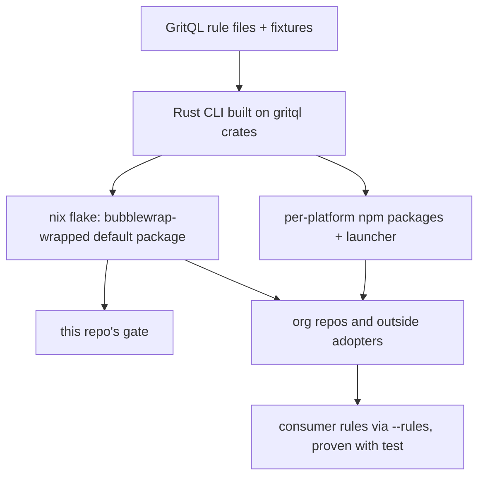
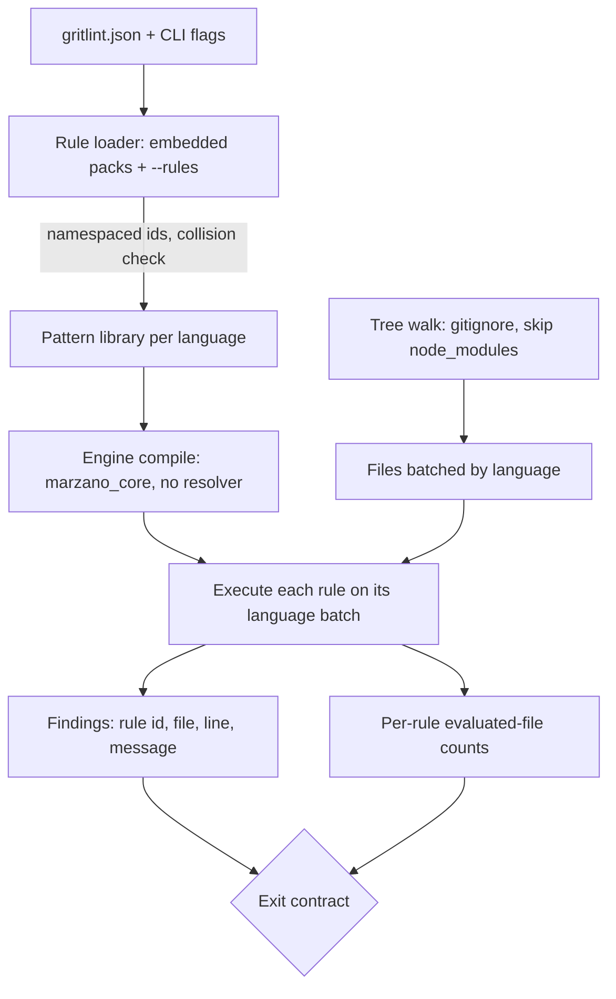

# GritQL Conventions Platform - Plan

## Goal Capsule

- **Objective:** Conventions about file structure that are enforced today by hand-written guard scripts and an agent skill become GritQL rules. Any repo, inside the systemfsoftware org or outside it, can install those rules, add its own, and prove each rule catches a violation. The first set is this repo's source-resolution wiring. Once it is enforced, the `workspace-source-resolution` skill and the scripts that encode the same checks are deleted.
- **Means:** Our own Rust CLI built on the MIT gritql crates, distributed the way `systemfsoftware/comment-checker` is.
- **Delivery boundary:** R1–R25 and R32–R35 land in the new platform repository. R26–R31 land in this repository after the platform's first release (F1).
- **Authority:** The repository owner, then this Product Contract. The `AGENTS.md` repo rules override both where they apply, in particular REPO-W8 (decision record) and the Evaluator own-commit discipline.
- **Open blockers:** None.
- **Stop condition:** If the first planning spike shows that the pinned gritql engine cannot evaluate a pure-match rule across two JSON files in one package directory, offline, stop and report. R2 is a settled decision; do not substitute single-file rules.
- **Execution profile:** Deep. U1–U9 build `systemfsoftware/gritlint`, and U10–U13 adopt it here. Rule fixtures and engine contract tests come before the rules they prove.
- **Finisher:** `lfg`. This repo's work ships as one pull request watched to green. The gritlint repository ships through its own CI.

---

## Product Contract

### Summary

Build a Rust CLI, in its own repository, that runs GritQL rules across one file or several related files. It ships through a nix flake whose default package is the bubblewrap-sandboxed binary, and through per-platform npm packages with no postinstall step. A `test` command proves every rule fires on a known-bad fixture. The bundled rules replace the source-resolution wiring checks and the typecheck-build-mode guard. This repo is the first adopter.

### Problem Frame

PR #410 (https://github.com/systemfsoftware/systemfsoftware/pull/410) built `@systemfsoftware/conventions` around one rule: every package `tsconfig.json` references `tsconfig.node.json`. Since then the tsconfig project split made that convention nearly universal on main (43 of 46 package roots), and `scripts/guards/check-project-membership.ts` guards tsconfig shape. Most of #410's 46 files were a Node wrapper that worked around the frozen `@getgrit/cli` alpha, plus nix delivery for a binary whose npm postinstall step this repo denies. The alpha's quirks: JSON on stderr, exit 0 when there are findings, `--grit-dir` ignored, global-config shadowing, a first-run HOME race, and ETXTBSY on the pnpm shim.

The source-resolution convention is currently encoded three times. The `workspace-source-resolution` skill teaches it to agents. That skill's own `check_dev_conditions.ts` checks one package, and `scripts/guards/check-dev-conditions.ts` checks the workspace from the `guard:projects` gate. None of the three can be handed to another repo. Each new file-shape convention so far has meant another bespoke Deno guard.

The engines have shifted as well. Biome now accepts `language json` GritQL plugins (biomejs/biome#8723), but only as single-file queries: its `grit_context.rs:342-346` defers multifile support. `@getgrit/gritql` 0.0.3 exposes the engine in-process, but only as a search API that returns matching file paths. Both of these, and the CLI, run on the same `marzano_core` crate in `biomejs/gritql`.

### Key Decisions

- **A published platform, rebuilt lean.** (session-settled: user-directed — chosen over a repo-only gate that replaces the guards and over a rules-only pack: anyone should be able to plug their own GritQL rules into the same run.) Governs R4, R12, R15.
- **Cross-file rules from day one.** (session-settled: user-directed — chosen over single-file-only rules, now or as a later extension: the conventions worth enforcing span sibling config files, even though this ties the platform to the gritql engine rather than biome's plugin runtime.) Governs R2, R19, R21, R24.
- **Distribution copies comment-checker.** (session-settled: user-directed — chosen over asking adopters to allow a postinstall step or put a binary on PATH: most adopters will install through nix, bubblewrapped.) Governs R13, R14, R15.
- **Our own Rust CLI on the gritql crates, with a rule test command.** (session-settled: user-directed — chosen over repackaging the frozen grit binary behind a wrapper and over a Node CLI on `@getgrit/gritql`: owning the CLI removes every alpha-CLI workaround #410 needed.) Governs R3, R6, R10.
- **The first bundled rules exist so the `workspace-source-resolution` skill can be deleted.** The skill's static wiring checks become rules. Governs R16–R22, R28, R29.
- **Package class is inferred from the bundler config.** (session-settled: user-directed — chosen over listing internals packages in the pack config and over an explicit `package.json` marker: adopters write nothing extra, and an internals package that uses the bundler is accepted as unexpressible.) Governs R22.
- **Runtime diagnosis leaves with the skill.** (session-settled: user-approved — chosen over keeping a slim runtime-diagnosis doc: the wiring rules prevent the misconfigurations that the delete-dist, sibling-typecheck and coverage-key symptoms came from.)
- **Import coverage is restated over JSON only.** (session-settled: user-approved — chosen over a single rule that mixes TS imports with tsconfig includes, which one GritQL pattern cannot express because a pattern targets one language: `check-project-membership.ts` keeps the TS half.) Governs R19.
- **`check-typecheck-build-mode` migrates too.** (session-settled: user-approved — chosen over leaving it a Deno guard: it has the same two-JSON-file shape as the source-resolution rules.) Governs R24.
- **Bundled rules ship as opt-in packs.** (session-settled: user-directed — chosen over default-on rules that fire wherever a tool's config exists: a repo using tsdown without a source condition would otherwise get house-rule findings on first run.) Governs R23.
- **The repository follows the oxc and biome layout, released through comment-checker's pipeline.** (session-settled: user-approved — chosen over biome's committed per-platform package folders and over a many-crate split: we maintain no parsers, and generated platform packages keep unpublished names out of the lockfile.) Governs R32–R35.
- **Crates are not published to crates.io.** (session-settled: user-approved — chosen over building on the published `grit-pattern-matcher` with our own language layer and over republishing marzano forks: crates.io rejects crates with git-only dependencies, and npm plus nix already reach every adopter named here.) Governs R3, R32.
- **The product is named `gritlint`.** (session-settled: user-directed — chosen over `conventions` and `ruleset`: the name says GritQL lint at a glance and matches oxlint and tsgolint.) Governs R13.

### Requirements

**Rule language and engine**

- R1. Rules are GritQL files. The platform defines no rule format of its own.
- R2. A rule can match across several files of the same language in one evaluation.
- R3. The CLI is a native binary built from the MIT gritql crates, pinned to an exact upstream commit. It reads no global or user-level grit configuration.

**Running rules**

- R4. Bundled rules ship inside the binary, and `--rules <path>` adds consumer rules to the same run.
- R5. A consumer rule whose name collides with a bundled rule fails the run rather than shadowing it.
- R6. The run exits 0 when clean, 1 on findings, and 2 when the instrument is broken. A missing or unparseable rule, an unparseable target file, a run with no enabled rules, or a run that selects no files at all exits 2, never 0 (repos/constitution/docs/solutions/architecture-patterns/the-vacuous-pass-gate-input-sets.md).
- R7. The run reports how many files each rule evaluated, and names every rule that evaluated zero files on the success line.
- R8. Each finding names the rule, the file and the line, with a message that states the defect and the fix.
- R9. A scan needs no network access and writes nothing to the tree it scans.

**Rule tests**

- R10. A `test` command runs every rule against its known-bad and known-good fixture files. It fails when a known-bad fixture produces no finding or a known-good fixture produces any.
- R11. Every bundled rule ships at least one known-bad and one known-good fixture, and the platform's CI runs `test` (pack: boundary-testing, pin-dependency-semantics.md).
- R12. Consumers run `test` on their own rules under the same contract as R10.

**Distribution**

- R13. The platform lives in `systemfsoftware/gritlint`. The binary is `gritlint`, and the npm launcher is `@systemfsoftware/gritlint`.
- R14. A nix flake builds the binary from source. Its default package is the binary wrapped in bubblewrap, with no network and a read-only working directory.
- R15. Per-platform npm packages behind a launcher deliver the binary with no postinstall step, published through OIDC trusted publishing with provenance, for comment-checker's platform set.



**Bundled source-resolution rules**

- R16. In every workspace package's export map, the development source condition is the first key of each object subpath, and `types` precedes `default` and points into `dist`.
- R17. A publish-time export map exists, holds no bare-string entries, and never carries the source condition.
- R18. The bundler config names the source condition as a string (never `true`), declares the export-customization hook, and does not disable output cleaning.
- R19. Every tsconfig project that owns source or test files names the source condition in `customConditions` and resolves a NodeNext, Node16, Bundler or preserve module mode through its `extends` chain.
- R20. Every Vitest config, or the shared config it extends, sets both `resolve.conditions` and `ssr.resolve.conditions` to the source condition.
- R21. When an api-extractor config exists, it points at a tsconfig that clears `customConditions` and inherits a module mode from a project that has compiler options.
- R22. A package with a bundler config is consumer-safe, and one without is internals. An internals package carries no source condition in its export map.
- R23. Bundled rules ship as named packs that run only when a repo enables them in its config, which also sets the source condition's name.
- R24. A reference-only `tsconfig.json` root (`files: []` plus `references`) requires the sibling `package.json` `typecheck` script to run `tsc -b` or `tsc --build`.
- R25. No tsconfig maps the package's own published name to source through `compilerOptions.paths`.

**Adoption in this repo**

- R26. This repo runs the platform from its flake inside the `check:local` and `check:ci` gates.
- R27. The enrolling gate is observed red on a planted violation of each bundled rule, then green on the real tree, and that evidence is recorded in the PR.
- R28. After enrollment, `scripts/guards/check-dev-conditions.ts` and `scripts/guards/check-typecheck-build-mode.ts` are deleted and removed from `guard:projects`.
- R29. The `workspace-source-resolution` skill is deleted from its source repository.
- R30. A REPO-W8 decision record under `docs/solutions/tooling-decisions/` names each rejected alternative and why it lost: the repackaged grit binary, a Node CLI on `@getgrit/gritql`, biome plugins, and keeping the Deno guards.
- R31. PR #410 is closed unmerged, citing this plan.

**Repository layout**

- R32. The platform repository is a Cargo workspace with one binary crate under `apps/` and one library crate under `crates/`. Rule packs live as data under `packs/`, each rule beside its fixtures, and are embedded in the binary at build time.
- R33. Per-platform npm packages are generated at release from one targets table and are never committed.
- R34. A JSON schema for the adopter config is generated from the CLI's config types and ships in the npm launcher.
- R35. One version, set by the release tag, applies to the crates, the launcher, the platform packages and the flake.

### Key Flows

- F1. Adoption in this repo
  - **Trigger:** The platform's first release is published with the source-resolution pack.
  - **Steps:** This repo pins the release through its flake and enables the pack (R26). The gate is observed red on planted violations, then green on the tree (R27). The two guards are deleted (R28), then the skill (R29).
  - **Outcome:** The skill and both guards are gone, and the rules alone enforce the wiring.
  - **Covered by:** R26, R27, R28, R29

### Acceptance Examples

- AE1. **Covers R6.** **Given** a target tree whose `tsconfig.json` fails to parse, **when** the run scans it, **then** it exits 2 and names that file.
- AE2. **Covers R5.** **Given** a consumer rule with the same name as a bundled rule, **when** the run loads rules, **then** it exits 2 and names both sources.
- AE3. **Covers R10, R12.** **Given** a rule whose known-bad fixture produces no finding, **when** `test` runs, **then** it fails and names the rule and the fixture.
- AE4. **Covers R16.** **Given** a `package.json` whose `./tester` subpath lists `types` before the source condition, **when** the run scans it, **then** exactly one finding names that subpath.
- AE5. **Covers R22.** **Given** a package with no bundler config whose export map carries the source condition, **when** the run scans it, **then** the run reports a finding.
- AE6. **Covers R7, R23.** **Given** a repo that enables the source-resolution pack but has no api-extractor config, **when** the run scans it cleanly, **then** it exits 0 and the success line names R21's rule as having evaluated zero files.
- AE7. **Covers R24.** **Given** a reference-only `tsconfig.json` whose sibling `package.json` runs `tsc --noEmit` for `typecheck`, **when** the run scans it, **then** exactly one finding names that package.
- AE8. **Covers R23.** **Given** a repo that uses tsdown without a source condition, enables no pack, and passes one consumer rule, **when** the run scans it, **then** only the consumer rule runs and no bundled rule reports a finding.

### Success Criteria

- The `workspace-source-resolution` skill is gone. An agent that trips the wiring gets the defect and the fix from the rule's finding.
- A repo outside the org installs the platform through nix, adds one rule of its own and proves it with `test`, without reading the platform's source.

### Scope Boundaries

**Deferred for later**

- Autofix rewrites and editor or language-server integration.
- Conventions beyond R16–R25. Each future convention is a new GritQL rule file, not a platform change.
- Moving to biome's plugin runtime if it gains multifile queries.
- Publishing to crates.io. `cargo install --git` works in the meantime.

**Outside this product's identity**

- Guards that do not check file contents stay scripts: `check-single-plan.ts` (git diff), `check-changeset.ts` (turbo hashes), `check-project-membership.ts` (tsc include resolution), the `.claude/hooks` guards (runtime tool calls) and the `scripts/tools/pack-all.mjs` tarball assertions.
- Runtime diagnosis: reproducing by deleting `dist`, the sibling-typecheck consumer-safety probe, and coverage-key checks.
- Reviving #410's wrapper code.

### Dependencies / Assumptions

- `marzano_core` and its language crates are not published to crates.io (only `grit-pattern-matcher` 0.5.1 and `grit-util` 0.5.1 are), so the CLI depends on `biomejs/gritql` at a pinned git commit. That is also why our own crates stay off crates.io, which rejects git-only dependencies. The upstream is quiet: the last CLI release was 0.1.0-alpha.1743007075 (March 2025) and the last bindings release was 0.0.3 (March 2026).
- Assumption: GritQL `multifile` patterns, which upstream documents for cross-file refactors, can express a pure-match rule across two JSON files in one package directory. The Goal Capsule's stop condition covers the case where they can't.
- Assumption: marzano's JSON grammar parses `//` and `/* */` comments. #410's spike observed it on the pinned alpha; a static read of the engine source during planning concluded the opposite. U2 settles it on the pinned commit. This repo's tsconfigs carry no comments, so only adopters are exposed.
- New npm package names may need a seed publish before their OIDC trusted-publisher records can be configured, per comment-checker's `docs/solutions/architecture-patterns/rust-cli-npm-distribution.md`.

### Sources / Research

- PR #410 and its decision record: https://github.com/systemfsoftware/systemfsoftware/pull/410
- comment-checker distribution: https://github.com/systemfsoftware/comment-checker (`flake.nix`, `docs/solutions/architecture-patterns/rust-cli-npm-distribution.md`); this repo's consumer: `nix/comment-checker.nix`, `nix/comment-checker-sandbox.nix`.
- Reference layouts: https://github.com/oxc-project/oxc (`apps/`, `crates/`, `npm/oxlint` launcher, `oxc_release.toml`) and https://github.com/biomejs/biome (`crates/`, `packages/@biomejs/biome` launcher with `configuration_schema.json`).
- Biome single-file limit: https://github.com/biomejs/biome/blob/35305c91/crates/biome_grit_patterns/src/grit_context.rs (lines 342-346); JSON support: biomejs/biome#8723.
- `@getgrit/gritql` search-only API: https://github.com/biomejs/gritql/blob/main/js/gritql/src/search.rs
- GritQL multifile: https://docs.grit.io/language/patterns
- Current checks: `scripts/guards/check-dev-conditions.ts`, `scripts/guards/check-typecheck-build-mode.ts`, `scripts/guards/check-project-membership.ts`, and `package.json` `guard:projects`.

---

## Planning Contract

**Target repos:** U1–U9 land in the new repository `systemfsoftware/gritlint`, and paths in those units are relative to it. U10–U13 land in this repository.

**Product Contract preservation:** Product Contract unchanged. The deferred questions were resolved in place: cross-file scoping is KTD5, and the skill's source location is U13's first step.

### Key Technical Decisions

- KTD1. **Embed the engine crates directly and skip the module resolver.** `crates/gritlint_core` depends on `marzano-core`, `marzano-language`, `marzano-util`, `grit-pattern-matcher` and `grit-util` from `biomejs/gritql` at one pinned `rev`, with every network-bearing feature off (`embeddings`, `ai_builtins`, `grit_tracing`, `external_functions`, `network_requests`). gritlint never calls `marzano-gritmodule`'s resolver, so no `$HOME/.grit` user config, no cwd walk-up, and no standard-library fetch can reach a run. That resolver was the shadowing vector behind #410. Governs R3, R9.
- KTD2. **Rules use the engine's markdown pattern format, and consumers may pass plain `.grit`.** (session-settled: user-approved — chosen over plain `.grit` for bundled rules: the description paragraph becomes the finding message R8 requires.) gritlint parses the markdown itself (a title, a description, one `grit` block) and hands only the grit body to the engine. Findings carry no severity level: every finding fails the run (R6). A plain `.grit` rule uses its file stem as the message. Governs R1, R8.
- KTD3. **No GritQL standard library.** (session-settled: user-approved — chosen over auto-importing grit's stdlib: the engine fetches it over the network, which R9 forbids.) Each rule compiles against a library made of its own pack's rule files plus the consumer rules, so helper patterns live inside packs. Governs R9.
- KTD4. **Rule ids are namespaced, and collisions are checked before compiling.** A bundled rule's id is `<pack>/<stem>` and a consumer rule's id is `local/<stem>`. The engine silently shadows duplicate pattern names, so gritlint rejects duplicates while it builds the library and never leaves that to the engine (R5).
- KTD5. **Cross-package facts come from the adopter config. Same-package joins use multifile patterns.** (session-settled: user-approved — chosen over gritlint built-ins that resolve package names: GritQL cannot resolve package specifiers, and one pattern cannot join TypeScript with JSON.) The source-resolution pack's config names the condition, the tsconfig preset specifiers that carry it, and the shared Vitest config modules that wire both keys. Separate rules then check those in-tree preset and shared-config files directly. A sibling join inside one package directory is a `multifile` pattern that compares the directory part of `$filename`. It follows relative `extends` one hop. Governs R19, R20, R21, R23, R24.
- KTD6. **Configuration is one `gritlint.json` at the scan root.** It holds enabled packs with their parameters, consumer rule paths and ignore globs. Its JSON schema is generated from the Rust config types and committed to `npm/gritlint/configuration_schema.json`, and CI fails when the committed schema drifts from the types. Pack parameters reach a rule as values bound before it compiles. U2 decides between GritQL pattern parameters and a generated prelude of definitions. Governs R23, R34.
- KTD7. **The scan walks the tree once and batches files by language.** The walk from the scan root honours `.gitignore` and always skips `node_modules` and `.git`. Files are grouped by the engine's extension-to-language map, and each rule runs on the files of its language. A multifile rule receives that whole batch in one evaluation, as the engine requires. A rule's evaluated-file count is the size of the batch it received (R7). Engine parse diagnostics on a target file become exit 2 (R6).
- KTD8. **Three test layers.**
  - Rule behaviour is proven only by `gritlint test` over pack fixtures. Each case pairs a known-bad and a known-good input (pack: boundary-testing, real-system-oracles.md).
  - The core is proven by in-process Rust integration tests over temporary directories. They call the library API and never spawn the binary.
  - Exactly two end-to-end journeys run in CI: the nix bubblewrap binary over a fixture repo, and the packed npm launcher installed in a scratch project.

  Engine behaviours gritlint relies on are pinned by contract tests against the pinned commit (pack: boundary-testing, pin-dependency-semantics.md). Governs R10, R11.
- KTD9. **The release pipeline copies comment-checker's.** That means one `scripts/targets.json` table, platform manifests generated at release, `optionalDependencies` injected at publish, and a tag-triggered `release.yml` publishing through OIDC with provenance. The first publish of each new npm name is a one-time local bootstrap, per `docs/solutions/tooling-decisions/first-publish-under-oidc-trusted-publishing.md` in this repo. Governs R15, R33, R35.
- KTD10. **This repo consumes the gritlint flake's sandboxed package, built from source and pinned by `flake.lock`.** Release-binary fetching through a hashes manifest, the way `nix/comment-checker.nix` works, waits until gritlint has releases. `bin/gritlint` copies `bin/dprint`'s wrapper, so the same command works in `nix develop`, CI and a bare shell with nix. Governs R26.

### High-Level Technical Design



The exit decision the diagram ends in (R6, R7):

| Condition, checked in order                                                           | Exit | Output                                 |
| ------------------------------------------------------------------------------------- | ---- | -------------------------------------- |
| A rule file is missing or does not compile, a rule id collides, or no rule is enabled | 2    | names the rule or source               |
| The walk selected no files                                                            | 2    | names the scan root                    |
| A target file failed to parse                                                         | 2    | names the file                         |
| Any finding                                                                           | 1    | findings, then per-rule counts         |
| Otherwise                                                                             | 0    | per-rule counts; zero-file rules named |

### Output Structure

```text
systemfsoftware/gritlint
├── Cargo.toml · Cargo.lock · rust-toolchain.toml · deny.toml
├── package.json · pnpm-workspace.yaml
├── flake.nix · flake.lock · nix/{package.nix,bwrap.nix}
├── apps/gritlint/src/main.rs
├── crates/gritlint_core/{src,tests}/
├── packs/
│   ├── source-resolution/{rules,fixtures}/
│   └── typecheck-build-mode/{rules,fixtures}/
├── npm/gritlint/{bin/gritlint,package.json,configuration_schema.json,README.md}
├── scripts/{targets.json,generate-platform-manifest.ts,sync-version.ts,check-matrix.ts}
├── .changeset/
└── .github/workflows/{ci.yml,release.yml}
```

### Sequencing

U1 → U2 → U3 → U4 → U5 → U6, then U7, U8 and U9 in parallel. U10 can land at any time. U11 needs U6 and U8. U12 needs U11 green, and U13 needs U12.

Four steps need the repository owner: creating `systemfsoftware/gritlint` (U1), the first npm publish (U9), deleting the skill in its source repository, and closing #410 (U13). The npm publish and the skill deletion cannot be undone, so an autonomous executor records them as pending and continues everything that does not depend on them.

### Deferred to Implementation

- How pack parameters bind (GritQL pattern parameters or a generated prelude), settled in U2 (KTD6).
- The exact pinned `biomejs/gritql` commit, chosen in U2 as the latest `main` commit on which the engine contract tests pass.
- Where the skill's source lives. Only installed copies in the local omp profile were found; U13 starts by locating the repository that ships it.

### Risks

| Risk                                                                                                                | Mitigation                                                                                                                           |
| ------------------------------------------------------------------------------------------------------------------- | ------------------------------------------------------------------------------------------------------------------------------------ |
| Cargo or nix cannot build the engine's tree-sitter grammars, which live in git submodules of a path-dependency tree | U2 builds both ways before anything else. Fallback: vendor the pinned crates with their submodules into `vendor/` under a `[patch]`. |
| The JSON grammar rejects comments                                                                                   | Unparseable files exit 2 (R6), never pass silently. Adopters with commented tsconfigs are told plainly, and the README says so.      |
| Multifile rules evaluate every file of their language in one batch, so they may be slow on large trees              | Only rules that need a join are multifile. Per-rule counts make the cost visible.                                                    |
| The upstream engine goes quiet or breaks on a re-pin                                                                | The pin is a rev plus a lockfile, and the contract tests fail on any re-pin that changes behaviour gritlint depends on.              |

---

## Implementation Units

| U-ID | Title                                            | Key files                                                                             | Depends on |
| ---- | ------------------------------------------------ | ------------------------------------------------------------------------------------- | ---------- |
| U1   | Scaffold the gritlint workspace                  | `Cargo.toml`, `apps/gritlint`, `crates/gritlint_core`, `.github/workflows/ci.yml`     | none       |
| U2   | Engine adapter and contract tests                | `crates/gritlint_core/src/engine.rs`, `crates/gritlint_core/tests/engine_contract.rs` | U1         |
| U3   | Rule loading, packs and config                   | `crates/gritlint_core/src/{rules,packs,config}.rs`                                    | U2         |
| U4   | Scan run contract                                | `crates/gritlint_core/src/{scan,report}.rs`, `apps/gritlint/src/main.rs`              | U3         |
| U5   | `gritlint test` fixture runner                   | `crates/gritlint_core/src/fixtures.rs`                                                | U4         |
| U6   | Source-resolution and typecheck-build-mode packs | `packs/*`                                                                             | U5         |
| U7   | Config schema generation                         | `npm/gritlint/configuration_schema.json`                                              | U3         |
| U8   | Nix flake and bubblewrap package                 | `flake.nix`, `nix/*`                                                                  | U4         |
| U9   | npm launcher and release pipeline                | `npm/gritlint`, `scripts/*`, `.github/workflows/release.yml`                          | U4, U7     |
| U10  | REPO-W8 decision record                          | `docs/solutions/tooling-decisions/gritlint-conventions-platform.md`                   | none       |
| U11  | Enroll gritlint as this repo's gate              | `flake.nix`, `bin/gritlint`, `gritlint.json`, `package.json`                          | U6, U8     |
| U12  | Retire the two guards and their citations        | `scripts/guards/*`, `package.json`, `CONCEPTS.md`                                     | U11        |
| U13  | Out-of-repo cleanup                              | skill source repo, PR #410                                                            | U12        |

### U1. Scaffold the gritlint workspace

- **Goal:** Create a buildable `systemfsoftware/gritlint` repository with the layout from R32 and a CI that gates format, lints, tests and licences.
- **Requirements:** R13, R32, R35
- **Dependencies:** none. Creating the GitHub repository is an owner step, and it can be undone.
- **Files:** `Cargo.toml`, `rust-toolchain.toml`, `deny.toml`, `apps/gritlint/Cargo.toml`, `apps/gritlint/src/main.rs`, `crates/gritlint_core/Cargo.toml`, `crates/gritlint_core/src/lib.rs`, `package.json`, `pnpm-workspace.yaml`, `LICENSE`, `README.md`, `AGENTS.md`, `.github/workflows/ci.yml`, `.changeset/config.json`
- **Approach:**
  1. Copy comment-checker's workspace manifest: shared package fields, `unsafe_code = "deny"`, clippy all and pedantic, and the release profile.
  2. Give the binary a `--version` flag and the two subcommands `check` and `test`, with bodies filled in by U4 and U5.
  3. Have `ci.yml` run `cargo fmt --check`, `cargo clippy -D warnings`, `cargo test` and `cargo deny check`. In `deny.toml`, allow `github.com/biomejs/gritql` as the one git source.
- **Patterns to follow:** comment-checker `Cargo.toml` and `.github/workflows/ci.yml`; the root-file set of oxc and biome.
- **Test expectation:** none, because this is scaffolding. The smoke check is that `gritlint --version` prints the workspace version.
- **Verification:** CI is green on the first push, and the version comes from `[workspace.package]`.

### U2. Engine adapter and contract tests

- **Goal:** Compile a grit body against an explicit library and run it over files in-process, with network features off and no resolver, then pin every engine behaviour gritlint relies on.
- **Requirements:** R2, R3, R9. This unit also executes the Goal Capsule stop condition.
- **Dependencies:** U1
- **Files:** `crates/gritlint_core/src/engine.rs`, `crates/gritlint_core/tests/engine_contract.rs`, `crates/gritlint_core/tests/fixtures/engine/**`
- **Approach:**
  1. Pin `biomejs/gritql` at one rev with default features off and only `language-parsers`, `grit-parser` and `non_wasm` on (KTD1).
  2. Expose one call: the compile inputs (body, library, language, parameters) and a batch of files go in, and matches with ranges plus parse diagnostics come out.
  3. Decide how parameters bind (KTD6).
  4. Confirm `cargo build` and `nix build` both compile the submodule grammars. On failure, take the vendoring fallback in Risks.
- **Execution note:** Write the contract tests first. If the sibling-join scenario cannot pass, stop per the Goal Capsule.
- **Patterns to follow:** `crates/cli/src/commands/check.rs` and `crates/core/src/problem.rs` (`execute_paths`) in `biomejs/gritql`.
- **Test scenarios:**
  - A single-file JSON pattern matches a pair in `package.json` and reports the file path and line range.
  - A multifile pattern joining `tsconfig.json` and a sibling `package.json` in one directory reports one match, and none when the two sit in different directories.
  - An object pattern detects which key comes first in an `exports` subpath object.
  - JSON with `//` and `/* */` comments either parses, or yields a parse diagnostic. Record which, since R6 depends on it.
  - A TypeScript pattern finds `ssr.resolve.conditions` inside a `defineConfig` call in a `.ts` file, and inside a `.js` file.
  - A run with `HOME` pointed at a directory containing a `.grit` user config and a `grit.yaml` in the cwd produces results identical to a clean `HOME`.
  - A bound parameter value such as the condition name changes what the pattern matches.
- **Verification:** All contract tests pass on the pinned rev, and `nix build` of the core crate succeeds with the network disabled.

### U3. Rule loading, packs and config

- **Goal:** Build each run's rule set from embedded packs enabled in `gritlint.json` and from consumer rules, with namespaced ids and a collision check.
- **Requirements:** R1, R4, R5, R23. Covers AE2 and AE8.
- **Dependencies:** U2
- **Files:** `crates/gritlint_core/src/rules.rs`, `crates/gritlint_core/src/packs.rs`, `crates/gritlint_core/src/config.rs`, `crates/gritlint_core/tests/rule_loading.rs`
- **Approach:**
  1. Parse the markdown rule format (KTD2).
  2. Embed `packs/` at build time.
  3. Resolve enabled packs and bind their parameters (KTD6).
  4. Load `--rules` paths, whether files or directories.
  5. Build the library per language and reject duplicate ids (KTD4) and rules outside KTD3's self-contained library.
- **Test scenarios:**
  - A config enabling `source-resolution` with a condition name loads that pack's rules with ids prefixed `source-resolution/`.
  - Covers AE8. With no pack enabled and one consumer rule, only `local/<stem>` is loaded.
  - Covers AE2. A consumer rule whose pattern name equals a bundled one fails with both sources named.
  - A markdown rule without a grit block fails and names the file.
  - An unknown pack name in the config fails and lists the known packs.
  - A missing `--rules` path fails, naming the path.
  - A pack enabled without a required parameter fails, naming the parameter.
- **Verification:** Each failure above maps to the exit-2 row of the exit table once U4 wires it.

### U4. Scan run contract

- **Goal:** Make `gritlint check` select files, run rules, print findings and per-rule counts, and exit by the table in the High-Level Technical Design.
- **Requirements:** R6, R7, R8, R9. Covers AE1 and AE6.
- **Dependencies:** U3
- **Files:** `crates/gritlint_core/src/scan.rs`, `crates/gritlint_core/src/report.rs`, `apps/gritlint/src/main.rs`, `crates/gritlint_core/tests/scan_contract.rs`
- **Approach:**
  1. Walk the tree per KTD7.
  2. Run each rule on its language batch.
  3. Map engine parse diagnostics to exit 2.
  4. Render human output by default and JSON with `--format json`, keeping the binary a thin shell over the core.
- **Test scenarios:**
  - Covers AE1. A tree whose `tsconfig.json` fails to parse exits 2 and names the file.
  - Covers AE6. With the pack enabled and no `api-extractor.json`, a clean tree exits 0 and the success line names the api rule with zero files.
  - A tree with one violation exits 1, and the finding carries the rule id, relative path, line and the rule's description.
  - A tree containing only `node_modules` or gitignored files exits 2 and names the scan root.
  - A config with no enabled packs and no `--rules` exits 2.
  - `--format json` emits one object per finding plus a summary with the counts, parseable as JSON.
  - The same tree scanned twice gives byte-identical output.
- **Verification:** The exit table holds for every row, and no scenario touches the network or writes into the scanned tree.

### U5. `gritlint test` fixture runner

- **Goal:** Prove each rule fires on its known-bad cases and stays quiet on its known-good cases, for bundled packs and consumer rules alike.
- **Requirements:** R10, R11, R12. Covers AE3.
- **Dependencies:** U4
- **Files:** `crates/gritlint_core/src/fixtures.rs`, `apps/gritlint/src/main.rs`, `crates/gritlint_core/tests/fixture_runner.rs`
- **Approach:**
  1. Take fixtures from `<pack-or-rules-dir>/fixtures/<rule>/{bad,good}/<case>/`. Each case is a small directory tree scanned as its own root with that case's `gritlint.json`.
  2. A bad case passes when the named rule yields at least one finding. A good case passes when it yields none.
  3. A rule with no bad case or no good case is itself a failure.
- **Test scenarios:**
  - Covers AE3. A rule whose bad case yields nothing fails and names the rule and the case.
  - A good case that yields a finding fails and names the finding.
  - A rule directory with only good cases fails as untested.
  - Running on a consumer rules directory applies the same contract as a bundled pack.
- **Verification:** `gritlint test packs` runs in `ci.yml`, and a deliberately broken rule turns it red.

### U6. Source-resolution and typecheck-build-mode packs

- **Goal:** Ship the rules that replace `scripts/guards/check-dev-conditions.ts` and `scripts/guards/check-typecheck-build-mode.ts`, each with fixtures and a message carrying the skill's defect and fix.
- **Requirements:** R16, R17, R18, R19, R20, R21, R22, R24, R25. Covers AE4, AE5 and AE7.
- **Dependencies:** U5
- **Files:** `packs/source-resolution/rules/*.md`, `packs/source-resolution/fixtures/**`, `packs/typecheck-build-mode/rules/*.md`, `packs/typecheck-build-mode/fixtures/**`, `packs/*/README.md`
- **Approach:**
  1. Write one rule per check the guard runs today (the export-map order, dist types, publish map, bundler, Vitest, api-extractor, internals and paths checks) and one for the typecheck script.
  2. Parameterise every rule on the configured condition (KTD5, KTD6).
  3. Seed each rule's bad and good cases from the guards' own selftest fixtures.
- **Patterns to follow:** the failure messages in `scripts/guards/check-dev-conditions.ts` and `scripts/guards/check-typecheck-build-mode.ts`, and the workspace-source-resolution skill's do and harm lines for the message text.
- **Test scenarios:** each rule's `fixtures/` directory is its test suite under U5. At minimum:
  - Covers AE4. A `./tester` subpath listing `types` before the condition gives one finding naming that subpath.
  - Covers AE5. A package with no `tsdown.config.ts` whose export map carries the condition gives a finding.
  - Covers AE7. A reference-only `tsconfig.json` beside a `package.json` whose `typecheck` is `tsc --noEmit` gives one finding. `tsc -b` and `tsc --build` are good cases.
  - A `tsconfig.app.json` extending a configured preset passes, and one extending an unlisted preset without its own `customConditions` is flagged.
  - A `vitest.config.ts` importing a configured shared config passes, and one wiring only `resolve.conditions` is flagged.
  - A `publishConfig.exports` subpath carrying the condition is flagged.
  - A tsconfig mapping the package's own name through `compilerOptions.paths` is flagged.
- **Verification:** `gritlint test packs` is green. Running both packs over this repo's tree, with the preset and shared-config parameters from U11, gives zero findings, because the current guards pass on main.

### U7. Config schema generation

- **Goal:** Generate the `gritlint.json` schema from the config types and ship it in the launcher.
- **Requirements:** R34
- **Dependencies:** U3
- **Files:** `crates/gritlint_core/src/config.rs`, `apps/gritlint/src/main.rs`, `npm/gritlint/configuration_schema.json`, `.github/workflows/ci.yml`
- **Approach:** A hidden `gritlint schema` subcommand prints the schema. CI regenerates it and fails on any diff with the committed copy.
- **Test scenarios:**
  - The committed schema validates this repo's `gritlint.json` from U11.
  - A config with an unknown top-level key fails validation.
- **Verification:** The schema drift check is green, and an editor using the schema completes pack names.

### U8. Nix flake and bubblewrap package

- **Goal:** Build gritlint from source in nix, and make the default package the sandboxed wrapper.
- **Requirements:** R14
- **Dependencies:** U4
- **Files:** `flake.nix`, `flake.lock`, `nix/package.nix`, `nix/bwrap.nix`, `.github/workflows/ci.yml`
- **Approach:**
  1. Build with `buildRustPackage` from `Cargo.lock`, pinning the git dependency's output hash.
  2. Copy the bubblewrap wrapper from comment-checker, including its working-directory guard.
  3. Expose three packages: `gritlint` (unwrapped), `gritlint-bwrap`, and `default` pointing at the bubblewrap one.
- **Patterns to follow:** comment-checker `flake.nix`; this repo's `nix/comment-checker-sandbox.nix`.
- **Test scenarios:** this is end-to-end journey 1 of KTD8. In CI, `nix run .#default -- check` over a fixture repo with one violation exits 1, and over a clean one exits 0, both with the network unshared.
- **Verification:** `nix build .#default` and `nix flake check` succeed on Linux in CI.

### U9. npm launcher and release pipeline

- **Goal:** Deliver the binary through `@systemfsoftware/gritlint` with no postinstall step, released from tags.
- **Requirements:** R15, R33, R35
- **Dependencies:** U4, U7
- **Files:** `npm/gritlint/package.json`, `npm/gritlint/bin/gritlint`, `npm/gritlint/README.md`, `scripts/targets.json`, `scripts/generate-platform-manifest.ts`, `scripts/sync-version.ts`, `scripts/check-matrix.ts`, `.github/workflows/release.yml`
- **Approach:** Port comment-checker's pipeline file by file (KTD9). The first publish of `@systemfsoftware/gritlint` and each platform name is the owner's local bootstrap. Until it happens, the release workflow's publish job stays unreached, and the tag gate plus matrix jobs still run on dry-run tags.
- **Patterns to follow:** comment-checker `scripts/lib/targets.json`, `scripts/lib/sync-root-version.ts`, `scripts/tools/generate-platform-manifest.ts`, `scripts/tools/check-matrix.ts`, `npm/packages/comment-checker/src/platform.ts`, `.github/workflows/release.yml`.
- **Test scenarios:**
  - `check-matrix` fails when the workflow matrix and `targets.json` disagree in either direction.
  - End-to-end journey 2 of KTD8: in each release lane, the packed launcher plus that lane's platform tarball, installed in a scratch project, runs `gritlint --version`.
- **Verification:** A dry-run tag produces every platform tarball and the launcher tarball with an exact-pinned `optionalDependencies` set, and nothing is published.

### U10. REPO-W8 decision record

- **Goal:** Record why gritlint exists in its current shape and what it replaced, for this repository.
- **Requirements:** R30
- **Dependencies:** none
- **Files:** `docs/solutions/tooling-decisions/gritlint-conventions-platform.md`
- **Approach:** State the choice, then each rejected alternative with the reason it lost: the repackaged grit binary, a Node CLI on `@getgrit/gritql`, biome plugins, keeping the Deno guards, and publishing to crates.io. Cite this plan and #410.
- **Test expectation:** none, because this is documentation.
- **Verification:** Every alternative named in R30 appears with a reason.

### U11. Enroll gritlint as this repo's gate

- **Goal:** Run gritlint with both packs in `check:local` and `check:ci`, observed red on planted violations, then green on the tree.
- **Requirements:** R26, R27. Implements F1.
- **Dependencies:** U6, U8
- **Files:** `flake.nix`, `flake.lock`, `bin/gritlint`, `gritlint.json`, `package.json`, `.github/AGENTS.md`, `AGENTS.md`
- **Approach:**
  1. Add the `gritlint` flake input and expose its package (KTD10).
  2. Copy `bin/dprint` to `bin/gritlint`.
  3. Write `gritlint.json`: enable both packs, set the condition `@systemfsoftware/source`, the presets from `packages/toolchain/tsconfig`, and the shared config `@systemfsoftware/vitest-config`.
  4. Add `lint:conventions` to `package.json` and call it from `gate:tasks` and `gate:local` beside `guard:projects`.
  5. Add the failure row to `.github/AGENTS.md`.
- **Execution note:** This is an Evaluator surface. It lands in its own commit. The red run comes from planted violations that are never committed, one per rule, and its output goes in the PR body.
- **Patterns to follow:** `bin/dprint`, the `comment-checker` entries in `flake.nix`, and the `guard:projects` chain.
- **Test expectation:** none in this repo's suites. The gate's observed red and green is the evidence (R27).
- **Verification:** `pnpm lint:conventions` exits 1 with every planted violation named, then 0 on the clean tree, and `pnpm check:local` exits 0.

### U12. Retire the two guards and their citations

- **Goal:** Remove `check-dev-conditions` and `check-typecheck-build-mode` now that gritlint enforces the same facts, and fix every document that names them.
- **Requirements:** R28
- **Dependencies:** U11
- **Files:** `scripts/guards/check-dev-conditions.ts` (delete), `scripts/guards/check-typecheck-build-mode.ts` (delete), `package.json`, `CONCEPTS.md`, `packages/toolchain/tsconfig/README.md`, `docs/solutions/build-errors/tests-outside-tsconfig-hide-workspace-source-errors.md`
- **Approach:**
  1. Drop both names from the `guard:projects` loop.
  2. Grep for every remaining citation and re-derive it from gritlint. The `_Gate:_` lines in `CONCEPTS.md` must name a runnable command (`docs/solutions/conventions/agents-md-leaf-mandates-never-describes.md`).
- **Execution note:** This is also an Evaluator surface, so it gets its own commit, after U11 is green.
- **Test expectation:** none, because this is a deletion. The replacement gate from U11 covers the behaviour.
- **Verification:** No file outside `docs/plans/` names either deleted guard, and `pnpm check:local` exits 0.

### U13. Out-of-repo cleanup

- **Goal:** Delete the `workspace-source-resolution` skill at its source, and close #410 citing this plan.
- **Requirements:** R29, R31
- **Dependencies:** U12
- **Files:** none in this repository.
- **Approach:** First find the repository that ships the skill; only installed copies were found locally. Both actions need the owner. An autonomous executor records them as pending in the PR body.
- **Test expectation:** none, because this is repository administration.
- **Verification:** The skill no longer loads in a fresh session, and #410 is closed with a link to this plan.

---

## Verification Contract

| Gate                      | Command                                                                                  | Repo      | Units    |
| ------------------------- | ---------------------------------------------------------------------------------------- | --------- | -------- |
| Format, lints, tests      | `cargo fmt --check`, `cargo clippy --workspace -- -D warnings`, `cargo test --workspace` | gritlint  | U1–U7    |
| Licences and sources      | `cargo deny check`                                                                       | gritlint  | U1, U2   |
| Rule contract             | `cargo run -p gritlint -- test packs`                                                    | gritlint  | U5, U6   |
| Schema drift              | regenerate with `gritlint schema`; the diff must be empty                                | gritlint  | U7       |
| Nix build and sandbox run | `nix build .#default`, `nix flake check`                                                 | gritlint  | U8       |
| Release dry run           | a pre-release tag produces the tarballs and publishes nothing                            | gritlint  | U9       |
| Conventions gate          | `pnpm lint:conventions`: red on planted violations, then green                           | this repo | U11      |
| Whole-repo gate           | `pnpm check:local` exits 0 after the last edit                                           | this repo | U11, U12 |
| CI                        | `gh pr checks --watch --fail-fast` exits 0                                               | both      | all      |

---

## Definition of Done

- Every unit's Verification holds.
- The gritlint repository's CI is green on `main`, with the packs' `gritlint test` inside it.
- This repository's PR shows the red-then-green gate evidence and is green in CI.
- The two guards are gone, and no document cites them.
- The owner-gated steps (the npm debut, skill deletion, closing #410) are either done or listed as pending in the PR body.
- No spike scratch code, abandoned engine-adapter variant, or commented-out experiment remains in either diff.
