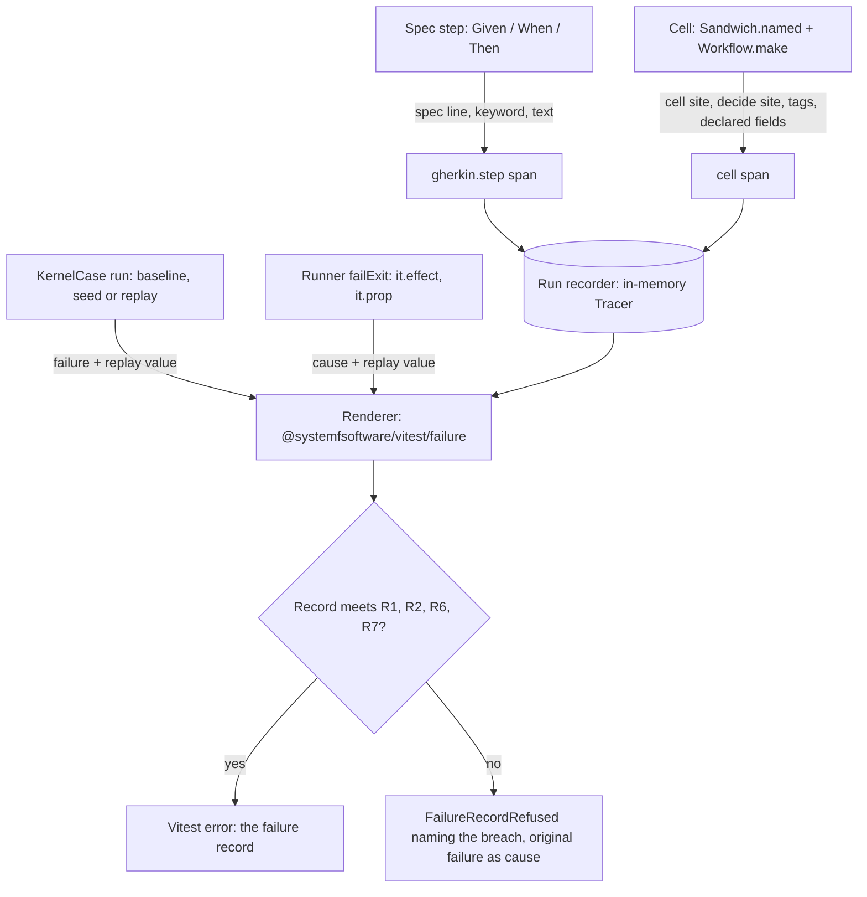

# Spec Failure Diagnostics - Plan

## Goal Capsule

- **Objective:** When a spec, or one of the repository's own failure reporters, reports a failure, an AI agent holding only that output can tell what failed and which production file to fix.
- **Means:** Spans recorded under the spec runner, rendered by one runner-owned renderer and gated by per-family failure corpora (KTD1, KTD2, KTD10).
- **Authority:** The Product Contract's R-IDs and Key Decisions win on behavior; the Planning Contract's KTDs win on mechanism; units override neither. The owner chose the reader, the scope and the approach, and delegated every remaining choice to `STRATEGY.md`.
- **Stop conditions:** Stop and report if spans do not survive kernel scheduling (KTD2), if a corpus can only pass by weakening a test-discipline rule, or if a family cannot route its failures through the runner without a dependency cycle.
- **Execution profile:** Deep, phased per the Sequencing section. The corpus gate (U2), the lint rule (U8) and the mutation reporter (U10) are Evaluator surfaces, each in its own commit.
- **Finishes and ships:** The LFG pipeline: `ce-work` implements, then review, a pull request and CI to green. Merging stays with the owner.
- **Open blockers:** None.

---

## Product Contract

### Summary

Every spec failure renders as one record in the Vitest error. The record comes from Effect spans the steps and cells already run inside. It leads with where the error was raised, then lists the steps and the production decisions each one caused. The runner refuses to report a failure whose record breaks that contract, and a per-family failure corpus proves it on every run. Error classes carry messages by construction, and the repo's own failure reporters print the error their tools recorded instead of guessing.

### Problem Frame

A failing `@systemfsoftware/effect-gherkin-spec` scenario prints `StepError:` with nothing after it. Its nine stack frames sit inside Effect's Schema internals. The headline is then padded with `schedule: Effect's order` and a `CONFORMANCE_REPLAY="path=0,0,0,…"` string of several hundred characters on a run where a plain rerun reproduces the failure. The runner prints the whole failure twice. A kernel deadlock prints only `deadlocked with 3 suspended fibers`, so two unrelated production defects produce byte-identical output. The Mutation workflow had the same shape of failure: its reporter printed "infrastructure failure (missing binary, crashed run or timeout)" while Stryker's own error event, `Instrument failed: No files to instrument.`, sat in the stream it had already saved (CI job 108115664629).

Nothing enforces a better record. 47 of the 64 `Schema.TaggedError` classes in production source have no message, and no lint rule, type or test checks what a failure prints.

A prototype injected three defects into `packages/effect-readiness/src` and gave each output to a blind agent holding nothing else:

| Defect                                                     | Today's output                         | Record rendered from spans                                              |
| ---------------------------------------------------------- | -------------------------------------- | ----------------------------------------------------------------------- |
| A: the Tcp check matches the wrong evidence tag (deadlock) | wrong: names only the `src/` directory | right file                                                              |
| B: the port lookup compares the wrong field (deadlock)     | wrong                                  | right file                                                              |
| C: the Tcp write handler fails with a message-less error   | right file and line                    | wrong: printed command data (`hostPort: 1`) outranked the raising frame |

### Actors

- A1. The AI agent fixing the code. It reads only the runner output.
- A2. The spec or cell author. They write steps, cells and error classes.
- A3. The spec runner: the `@systemfsoftware/vitest` fork plus `@systemfsoftware/effect-spec-runtime`, the only code that turns a failed run into what Vitest prints.

### Key Decisions

- **The reader is an AI agent fixing code with only the runner output.** (session-settled: user-directed — chosen over a human skimming the terminal, a CI reviewer, or both: STRATEGY has humans write intent and machines fix code.) Governs R1–R8.
- **Scope is the whole spec stack in this repository.** (session-settled: user-directed — chosen over gherkin-only, repo-wide errors, or including the Stryker fork: the same broken shape recurs in every family.) Governs R9.
- **The repository's own failure reporters join the same contract.** The mutation reporter guessed "infrastructure failure" while Stryker's recorded error sat in its stream; STRATEGY removes a class in one wave, not one instance. Governs R15.
- **Spans carry the diagnosis; the runner is the only renderer and refuses bad failures.** (session-settled: user-directed — chosen over a separate typed diagnostic contract, spans without a gate, or a gate without spans: it reuses Effect core, and the gate makes the contract fail.) Governs R5, R10, R11.
- **The Vitest error is the only channel.** (session-settled: user-directed — chosen over NDJSON or OpenTelemetry exports.) The prototype also rejected a short headline plus report file: its "last decision" summary sent upstream defect B to the wrong cell. Governs R8.
- **The raising frame leads the record.** Today's output beat the prototype on defect C only because Vitest showed the raising frame with its function name. Governs R2.
- **Decision lines show tags and declared fields, never free command data.** Printed fixture data misled the agent on defect C; a member tag (`evidence: Connected`) is what solved A. Governs R5.
- **Messages by construction, the whole class in one wave.** The renderer alone fixes spec output, but logs, CLIs and tool reporters would still print empty headlines; STRATEGY grades a regression no gate catches as an automatic F. Governs R13, R14.
- **Actionability is gated deterministically, never by a model.** STRATEGY bars model gates; blind-agent runs stay finders only. Governs R11, R12.
- **The gates are Evaluator surfaces.** The R11 corpus gate and the R13 lint rule each land in their own commit, observed red before and green after (`AGENTS.md`, Surface Classes). Governs R11, R13.

### Requirements

**Failure record**

- R1. The headline names what failed from the failure's own fields and is never empty. A step failure's headline carries the keyword, the step text and a one-line cause summary.
- R2. The first source location in the record is where the error was raised in code outside the spec libraries and runtime, with file, line and function name. When the stack holds no such frame, for example an error built by a schema constructor whose internal frames fill the stack limit, it is the site of the innermost span that failed. The failing step and its spec line follow it.
- R3. The cause chain renders every layer. A layer with no message renders as its tag plus its fields, followed by its raising frame.
- R4. The step trail lists each step up to and including the failing one, marked passed, failed or unfinished, each with the spec line that wrote it. A failure before the first step, such as a scenario layer that fails to build, says so and names the layer.
- R5. Under each step, the record lists the cell decisions that step caused. Each line shows the cell name, the command tag, the tags of its tagged members and the fields its instrumentation map declares, then the outcome, the decide site and the cell site. No other command data appears, and consecutive identical lines collapse into one with a count.
- R6. The record ends with a rerun command naming the package, test file and scenario. It carries a replay value only when a generator chose the run, a kernel seed or a property-test seed and path, and never on a baseline run.
- R7. Each failure is printed exactly once. Errors that are not rethrown are still logged.
- R8. The record lives in the Vitest error. Its length is bounded by R4 and R5: it stops at the failing step and collapses repeats.

**Across spec families**

- R9. Every spec family meets the record contract where its concepts apply: `effect-gherkin-spec`, `storybook-gherkin`, `effect-spec-runtime`, `conformance-spec`, `differential-spec`, `trace-spec` and `effect-daemon-spec`. A family without steps or cells still meets R1–R3, R6 and R7.

**Enforcement**

- R10. The runner refuses to report a failure whose record breaks R1, R2, R6 or R7. The refusal names the breach and keeps the original failure and its cause visible.
- R11. Each spec family ships a failure corpus of fixtures with a known injected defect, rendered in-process through the runner without spawning Vitest. A gate checks each fixture's record in `pnpm check:local` and CI: the record names the defect's file, and when the failure has a raising frame outside the libraries, that frame is the record's first location.
- R12. The corpus covers at least: a deadlock caused by an upstream cell, a deadlock caused by a downstream cell, a message-less error raised in a write handler, an error built by a schema constructor, a failed `Then` assertion, a scenario layer that fails to build, and a failure that occurs only under one seeded schedule.

**Messages by construction**

- R13. Every `Schema.TaggedError` in production source derives a non-empty message from its fields. An oxlint rule fails any class that does not.
- R14. Every existing message-less class, 47 across 12 packages as of 2026-09-25, gains its message in the same change that lands the rule.

**Repo failure reporters**

- R15. A repository script that reports a tool's failure prints the error the tool recorded, with its phase and exit code. It calls a failure infrastructure only when the tool recorded no error. `scripts/tools/build-mutation-summary.ts` is the known instance.

Key Flows are omitted because the product is an output contract; the Acceptance Examples carry its conditional paths.

**Target record shape** (illustrative, defect C; wording is planning's):

```text
StepError: When "readiness is checked for connection acceptance" failed: LogSourceError: log source "host 127.0.0.1:1" failed
  raised at packages/effect-readiness/src/await-condition.cell.ts:21 (ProbeTcp)
Failing step: When "readiness is checked for connection acceptance"   packages/effect-readiness/tests/polling-readiness.integration.test.ts:27

Steps and the decisions each caused:
  ✓ Given a guest service that accepts connections on its mapped port   packages/effect-readiness/tests/polling-readiness.integration.test.ts:26
  ✗ When readiness is checked for connection acceptance   packages/effect-readiness/tests/polling-readiness.integration.test.ts:27
      cell probe_condition_resolve: ResolveProbe{condition: Tcp} → ProbeTcp
        decide packages/effect-readiness/src/resolve-probe.workflow.ts:58   cell packages/effect-readiness/src/await-condition.cell.ts:16

Rerun only this scenario:
  pnpm --filter @systemfsoftware/effect-readiness exec vitest run tests/polling-readiness.integration.test.ts -t "A service that answers on the first attempt satisfies the wait without further probing"
```

### Acceptance Examples

- AE1. Downstream deadlock
  - **Covers R4, R5.**
  - **Given** `evaluate-probe.workflow.ts` treats `Connected` evidence as unsatisfied, **when** the scenario deadlocks, **then** the failing step's trail shows `EvaluateProbe{condition: Tcp, evidence: Connected} → NotYet` with its decide site in `packages/effect-readiness/src/evaluate-probe.workflow.ts`.
- AE2. Upstream deadlock
  - **Covers R5, R11.**
  - **Given** `resolve-probe.workflow.ts` misses a mapped port, **when** the scenario deadlocks, **then** the trail shows `ResolveProbe{condition: Tcp} → ProbeAbsent` before the evaluate decision, and the record names `packages/effect-readiness/src/resolve-probe.workflow.ts`.
- AE3. Message-less error in a write handler
  - **Covers R1, R2, R3.**
  - **Given** a write handler fails with an error that has no message, **when** the step fails, **then** the headline carries the error's tag and fields and the first location is the handler's file, line and function name.
- AE4. Replay value only for generated runs
  - **Covers R6.**
  - **Given** a failure on the baseline run, **then** the rerun line carries no `CONFORMANCE_REPLAY` value. **Given** a failure found only under a kernel seed, **then** the rerun line carries that seed and path in the format `packages/gherkin/effect-gherkin-spec/tests/kernel-unstated-order.integration.test.ts` already pins. **Given** a property-test counterexample, **then** the rerun line carries its seed and path.
- AE5. Printed once
  - **Covers R7.**
  - **Given** a failure with one error, **then** it appears once in the output. **Given** several errors, **then** the rethrown one appears in the Vitest error and each other one is logged once.
- AE6. Refused record
  - **Covers R10.**
  - **Given** a family renders a failure with an empty headline, **then** the runner reports a refusal naming the empty headline, and the original failure and its cause stay visible beneath it.
- AE7. Rule re-fires
  - **Covers R13.**
  - **Given** a new `Schema.TaggedError` in production source with no message, **then** `pnpm check:local` fails on that class.
- AE8. Recorded tool error
  - **Covers R15.**
  - **Given** Stryker exits 3 after an instrument-phase error event, **then** the reporter prints `Stryker refused the run in its instrument phase (exit 3): Instrument failed: No files to instrument.` **Given** a run that recorded no error, **then** the infrastructure wording stays.
- AE9. Failure before the first step
  - **Covers R4, R2.**
  - **Given** a scenario layer fails to build, **then** the record says no step ran, names the layer, and its first location is where the layer's error was raised.

### Success Criteria

- Every family's corpus passes R11. Reverting any one ordering or attribution rule turns the gate red.
- As a finder, not a gate, a blind agent holding only the record names the defect file for all three prototype defects. The prototype's record reached 2 of 3; today's output reaches 1 of 3.

### Scope Boundaries

- The Stryker fork's own empty `InstrumentError` message and its refusal of an empty mutate set (`systemfsoftware/stryker-js-effect#114`), and the effect-atom shard failure it causes (#545).
- Failure report files, NDJSON records and OpenTelemetry exports.
- Line precision beyond the decide site: the record names the line where the workflow was made, not the branch that decided wrongly.
- Model-judged actionability as a gate.

### Dependencies / Assumptions

- `Effect.withTracer` records step and cell spans under the simulation kernel. The prototype confirmed this with a custom Tracer around `KernelCase` runs.
- `@systemfsoftware/effect-cell-types` already opens a span per cell and copies declared command fields onto it (`packages/effect-cell-types/src/Sandwich.ts`, `annotateFields` and `annotateOutcome`).
- This plan covers #546. Its acceptance criteria fall under R1, R2, R6 and R7, and its uncommitted red tests in `packages/gherkin/effect-gherkin-spec/tests/gherkin-step-combinators.integration.test.ts` join the gherkin corpus.

### Outstanding Questions

**Deferred to Implementation**

- The derived message wording for each class U8 reports.
- How the rerun line learns the package name from Vitest's task and project metadata, given that production lint bans Node built-ins.
- Which test-file shape `oxlint-plugin-test-discipline` admits for a corpus that drives `KernelCase.explore` from a plain test body in each family (KTD10).

### Sources / Research

- `docs/solutions/architecture-patterns/machine-stream-is-a-file.md`: weighed. It governs unbounded streams; R8 keeps one bounded record in Vitest instead.
- `docs/solutions/architecture-patterns/workflow-error-channel-gates.md`: the "by construction and lint" precedent R13 follows.
- `packages/effect-spec-runtime/src/KernelCase.ts` (`scheduleReport`, `throwExitFailure`), `packages/runner/vitest/src/internal/runner.ts` (`logErrors` before the rethrow), `packages/gherkin/effect-gherkin-spec/src/StepError.schema.ts`, `packages/gherkin/effect-gherkin-spec/src/DoNotation.ts` (`stepWrapImpl`): where today's record is built.
- `scripts/tools/build-mutation-summary.ts` (`buildRequireError`): the reporter R15 names.
- Playwright `test.step({ box: true })` points the failure at the step's call site; fast-check prints its replay seed only for generated inputs; miette renders labelled, coded diagnostics.

---

## Planning Contract

Product Contract preservation: restructured, no scope change. The Outstanding Questions deferred to planning were answered in place by KTD1, KTD8 and KTD10 and by Assumptions; the three that remain are implementation-time unknowns. The Goal Capsule gained Means, Authority, Stop conditions, Execution profile and Finishes lines.

### Key Technical Decisions

- KTD1. **One renderer, in `@systemfsoftware/vitest`, behind a new public `./failure` entry.** Every spec failure leaves through one of two throw sites: `KernelCase`'s kernel-failure and exit-failure throws, or the runner's `failExit`. Both reach this package without a cycle: `effect-spec-runtime`, `effect-gherkin-spec`, `differential-spec` and `trace-spec` depend on it, and it depends on no workspace package. The entry is declared in `packages/runner/vitest/tsdown.config.ts` (REPO-S4). (session-settled: user-directed — chosen over a separate typed diagnostic contract, spans without a gate, or a gate without spans: it reuses Effect core, and the gate makes the contract fail.) Governs R5, R10, R11.
- KTD2. **Each run records its spans with an in-memory `Tracer` installed by `Effect.withTracer`.** The kernel's baseline, seeded and replay runs each get a fresh recorder, and so does each `it.effect` program in the runner. The recorder keeps that run's `NativeSpan` objects and exports nothing. The prototype showed these spans survive kernel scheduling. Rejected: the OpenTelemetry SDK and `trace-spec`'s observation-window recorder, whose asynchronous export would escape the kernel.
- KTD3. **A step captures its spec line when the spec calls `Given`, `When`, `Then`, `And` or `But`, and `stepWrap` opens a `gherkin.step` span carrying keyword, text and that line.** Capturing at the call keeps the author's frame; at failure time only library and fiber frames remain.
- KTD4. **`Workflow.make` and `Sandwich.named` each record their call site, and the cell's outer span carries both sites plus the command's tag, its members' tags and its declared instrumentation fields.** The decide site is a typed field in the workflow's schema record beside `command`, `decision` and `error`, not a hidden symbol. A member tag is the `_tag` of a direct field value that has one. Rejected: the decoded command as JSON, which produced the defect-C red herring.
- KTD5. **The replay value reaches the renderer as data.** `KernelCase` passes the run's seed and decision path, with no seed on a baseline run. The property engine passes fast-check's seed and path from its check result. The renderer never parses a message for them.
- KTD6. **The raising frame is the first stack frame outside `node_modules` and outside the spec libraries' own `src/`; otherwise it is the site of the innermost span that failed or never finished.** The library set is a closed list in the renderer: `runner/vitest`, `effect-spec-runtime`, `effect-cell-types` and every family R9 names (`effect-gherkin-spec`, `storybook-gherkin`, `conformance-spec`, `differential-spec`, `trace-spec`, `effect-daemon-spec`). Families build their failure values in their own `src/` (KTD8), so a list without them would put a library frame first. A new family joins the list in the same change that adds it. A deadlock has no raising frame, so its first location is the innermost unfinished cell span's decide site. The global `Error.stackTraceLimit` stays untouched.
- KTD7. **The renderer returns the record with its breaches; the runner throws a `FailureRecordRefused` refusal naming them, with the original failure as its cause.** The refusal's text is fixed prose that is never checked itself, so a refusal cannot recurse. It joins the existing refusals in `packages/runner/vitest/src/internal/refusals.ts` and `errors.schema.ts`. `logErrors` logs only the errors the runner does not rethrow.
- KTD8. **Family renderers become failure messages.** Where a family builds failure text today (`Conformance.render`, `formatDisparity`, `FailureDump.report`, the daemon's `Cause.pretty` reports), that text reaches Vitest only as the message of a `Schema.TaggedError` failure value, and the runner renders the record around it. No family throws its own formatted record. The conformance tests that match rendered text keep passing because the text is unchanged.
- KTD9. **R13 is an `oxlint-plugin-effect-schema` rule, `tagged-error-requires-message`, in the recommended preset.** A production class extending `Schema.TaggedError` must declare a `message` getter or a `message` field; test files and `__fixtures__` are exempt. Rejected: a runtime check, which fires only once an error is thrown, and a mandatory `message` schema field, which changes every error's encoded shape.
- KTD10. **Corpora live in each family's `tests/`, and their defects in `tests/__fixtures__/`, so nothing defective is published.** Each package ships `dist` only. A corpus drives its defective fixture through `KernelCase.explore` or the runner from a plain test body, never inside another kernel run, and asserts on the thrown record.
- KTD11. **The mutation reporter reads the stream's last error event and phase.** Its fixture is the error event from CI job 108115664629.

### High-Level Technical Design

Spans flow from steps and cells into a per-run recorder. Both throw sites hand the failure, the spans and the replay value to one renderer, and the runner checks the record before Vitest sees it.



Record grammar (directional; the Target record shape above is one instance):

```text
record    := headline NL location NL failing-step [NL causes] NL trail NL rerun
headline  := failure-name ": " message             -- tag plus fields when the message is empty (R1, R3)
location  := "raised at " file ":" line " (" function ")" | span-site   (KTD6)
trail     := { step-line { NL decision-line } }    -- up to the failing step (R4, R5)
decision  := "cell " name ": " tag "{" member-tags declared-fields "} -> " outcome
             NL "decide " site "   cell " site
rerun     := package-filter test-file scenario [replay-value]   (R6, KTD5)
```

### Assumptions

- `storybook-gherkin` runs its steps in the browser under Storybook's own runner (`@storybook/addon-vitest`), not `@systemfsoftware/vitest`; there it meets R1–R3 through R13 messages, and its step trail stays in Storybook's Interactions panel. Its node `conformance` project already runs Gherkin scenarios on `@systemfsoftware/vitest`, and that is where its corpus runs.
- Steps in a scenario run one after another and concurrency happens inside a step, so span parentage gives a linear step trail.
- `scripts/tools/build-mutation-summary.ts` is the only repository reporter that guesses a cause (search of `scripts/` and `.github/`).
- Every family's failures reach Vitest through `KernelCase` or the runner's `failExit`; `conformance-spec`, `effect-daemon-spec` and `storybook-gherkin` have no dependency on the runner but fail inside tests that run on it.

### Risks

- The mutation stream's discriminator: `countMutantLines` decodes `kind`, but the NDJSON envelope in CI job 108115664629 uses `_tag`. If the stream file uses `_tag` as well, today's mutant count is always zero. U10 confirms the real shape before changing either path.
- Span memory on seeded exploration: every seeded run records its spans. A passing run drops its recorder at once, so only the failing run's spans are held.
- Public surface churn: `effect-cell-types`, `effect-gherkin-spec`, `effect-spec-runtime`, `oxlint-plugin-effect-schema` and every package whose error class gains a getter change their API reports; `@systemfsoftware/vitest` gains the `./failure` entry. REPO-R1 allows breaking changes pre-1.0.

### Sequencing

1. U1 builds the renderer and recorder.
2. U2 lands the corpus gate alone and is observed red against today's output.
3. U3, U4, U5 and U6 wire steps, cells, the kernel and the runner, turning the gherkin, kernel and runner corpora green.
4. U7 routes the remaining families, turning their corpora green.
5. U8 lands the lint rule alone, observed red over the message-less classes; U9 turns it green.
6. U10 lands the mutation reporter change alone.

The Evaluator commits in steps 2, 5 and 6 are the only intermediate reds; `pnpm check:local` passes after the last unit.

---

## Implementation Units

| U-ID | Title                                       | Key files                                                                                                               | Depends on |
| ---- | ------------------------------------------- | ----------------------------------------------------------------------------------------------------------------------- | ---------- |
| U1   | Failure renderer and run recorder           | `packages/runner/vitest/src/failure.ts`, `src/internal/failure-record.ts`, `tsdown.config.ts`                           | —          |
| U2   | Failure corpus gate                         | `tests/failure-corpus.*` and `tests/__fixtures__/` per family                                                           | —          |
| U3   | Gherkin step spans and StepError message    | `packages/gherkin/effect-gherkin-spec/src/DoNotation.ts`, `StepError.schema.ts`                                         | —          |
| U4   | Cell attribution on cell spans              | `packages/effect-cell-types/src/Workflow.ts`, `Sandwich.ts`                                                             | —          |
| U5   | Kernel and runner wiring                    | `packages/effect-spec-runtime/src/KernelCase.ts`, `packages/runner/vitest/src/internal/runner.ts`, `property/engine.ts` | U1, U3, U4 |
| U6   | Refusal of contract-breaking records        | `packages/runner/vitest/src/internal/refusals.ts`, `errors.schema.ts`                                                   | U1, U5     |
| U7   | Families route failures through the record  | conformance, differential, trace and daemon failure paths                                                               | U5, U6     |
| U8   | `tagged-error-requires-message` rule        | `packages/oxlint-plugin/oxlint-plugin-effect-schema/src/rules/`                                                         | —          |
| U9   | Messages for message-less TaggedErrors      | every class U8 reports                                                                                                  | U8         |
| U10  | Mutation reporter prints the recorded error | `scripts/tools/build-mutation-summary.ts`                                                                               | —          |

### U1. Failure renderer and run recorder

**Goal:** A renderer that turns a failure, its run's spans, the test's identity and a replay value into a failure record plus its contract breaches, and the recorder that collects the spans.

**Requirements:** R1–R8; KTD1, KTD2, KTD5, KTD6.

**Dependencies:** None.

**Files:**

- Create `packages/runner/vitest/src/failure.ts` (public entry), `packages/runner/vitest/src/internal/failure-record.ts`, `packages/runner/vitest/src/internal/span-recorder.ts`.
- Modify `packages/runner/vitest/tsdown.config.ts` (entry and `typesOf`).
- Test `packages/runner/vitest/tests/failure-record.test.ts`.

**Approach:**

1. Input: the failure (a `Cause` or thrown value), the recorded spans, the test file and full name, and the replay value (KTD5).
2. Output: the record text in the order R2–R6 fix, and the breach list KTD7 consumes. The renderer throws nothing.
3. Repeated identical decision lines collapse per R5.

**Patterns to follow:** `.context/compound-engineering/ce-prototype/2026-09-25-failure-diagnostics/01-failure-output/overlay/PrototypeDiagnostics.ts` shows a working trail walk and repeat collapse (evidence only, not code to copy); `packages/runner/vitest/src/internal/refusals.ts` for runner error shapes.

**Test scenarios:**

- A failure raised in user code with a message: the headline carries its tag and message, and the first location is that frame with its function name.
- Covers AE3. A tagged error with no message: the headline shows its tag and fields.
- A stack holding only library frames: the first location falls back to the innermost failed span's site.
- Spans for three steps with the second failing: the trail lists steps one and two, marks the second failed and omits the third.
- Five identical consecutive decisions: one line with a count of five.
- A decision span whose command carries an undeclared numeric field: the field does not appear.
- A baseline replay value produces a rerun line with no replay value; a seeded value produces one with seed and path.
- An empty headline input yields an R1 breach and no exception.

**Verification:** Renderer tests pass; the `./failure` entry builds with types.

### U2. Failure corpus gate

**Goal:** Per-family corpora with injected defects and a gate that checks R11, landed alone and observed red against today's output.

**Requirements:** R11, R12; KTD10.

**Dependencies:** None; it must land before U3–U7.

**Files:**

- Create the kernel corpus in `packages/effect-spec-runtime/tests/` with its defective cells under `tests/__fixtures__/` (devDependency on `@systemfsoftware/effect-cell-types`, which has no workspace dependencies).
- Create the gherkin corpus in `packages/gherkin/effect-gherkin-spec/tests/` with fixtures under `tests/__fixtures__/failure-corpus/`.
- Create the runner corpus (`it.effect` and property failures) in `packages/runner/vitest/tests/`.
- Create corpora for `packages/sim/conformance-spec`, `packages/sim/differential-spec`, `packages/trace/trace-spec` and `packages/daemon/effect-daemon-spec` in their `tests/`, covering R1–R3, R6 and R7.
- Create the `packages/gherkin/storybook-gherkin` corpus in its `tests/`, run by its node `conformance` Vitest project on the runner: a story fixture whose step fails, covering R1–R3, R6 and R7.

**Approach:**

1. Each fixture states its defect's file; the gate asserts the record names that file and, when the failure has a raising frame, that the frame comes first.
2. The gate's own failure output lists each fixture, the expected file and the first location found, so its red is readable.

**Execution note:** Land it alone and record the red run's digest in the commit body before any wiring unit.

**Test scenarios:**

- Covers AE2. A resolve cell that reports a mapped port as absent deadlocks the scenario; the record names the resolve workflow's file.
- Covers AE1. An evaluate cell that treats `Connected` as unsatisfied deadlocks the scenario; the record names the evaluate workflow's file.
- Covers AE3. A write handler raising a message-less tagged error; the first location is the handler's file.
- A cell error built by a schema constructor; the record names the cell's file through the span fallback.
- A failed `Then` assertion; the first location is the `Then`'s spec line.
- Covers AE9. A scenario layer that fails to build; the record says no step ran and names the layer.
- A failure that occurs only under one seed; the rerun line carries that seed and path.
- Each family fixture (conformance judgement, differential disparity, trace break, daemon termination, storybook step failure) yields a non-empty headline and a first location.

**Verification:** The gate fails on the tree before U3 with a readable digest, and passes after U7.

### U3. Gherkin step spans and StepError message

**Goal:** Every step runs inside a `gherkin.step` span carrying its spec line, and `StepError` derives its message from its fields.

**Requirements:** R1, R2, R4, R13; KTD3.

**Dependencies:** None.

**Files:**

- Modify `packages/gherkin/effect-gherkin-spec/src/DoNotation.ts` (step constructors capture the call site; `stepWrapImpl` opens the span), `src/extensions/Pairwise.ts`, `src/StepError.schema.ts`, `etc/effect-gherkin-spec.api.md`.
- Test `packages/gherkin/effect-gherkin-spec/tests/gherkin-step-combinators.integration.test.ts` (the uncommitted #546 red scenarios and the `AccessDenied` fixture in `tests/__fixtures__/TestDomainError.schema.ts`).

**Test scenarios:**

- A `Given` failing with an `Error` that has a message: the `StepError` message reads `Given "…" failed: <cause summary>`.
- A `Given` failing with a message-less tagged error: the message carries the tag and fields.
- A `Given` failing with a plain value: the message carries the value.
- Two failing steps written on different lines: each `StepError`'s stack points at its own spec line.
- A step text computed from scope: the span and the message carry the resolved text.

**Verification:** The #546 scenarios pass; the API report is updated.

### U4. Cell attribution on cell spans

**Goal:** Every cell span carries its cell site, decide site, command tag, member tags and declared fields.

**Requirements:** R5; KTD4.

**Dependencies:** None.

**Files:**

- Modify `packages/effect-cell-types/src/Workflow.ts`, `packages/effect-cell-types/src/Sandwich.ts`, `etc/effect-cell-types.api.md`.
- Test `packages/effect-cell-types/tests/cell-pipeline.integration.test.ts`, observing spans through an in-memory `Tracer`.

**Test scenarios:**

- A named cell's span records a cell site and a decide site that both point into the test's fixture file.
- A command with a tagged member records the member's tag; an undeclared numeric field is absent.
- A declared instrumentation field still appears.
- A refusal outcome records the refusal's tag on the cell span.

**Verification:** Cell tests pass; the API report is updated.

### U5. Kernel and runner wiring

**Goal:** `KernelCase` and the runner record spans per run, pass replay values, throw the rendered record, and print each failure once.

**Requirements:** R6, R7, R8; KTD2, KTD5, KTD7.

**Dependencies:** U1, U3, U4.

**Files:**

- Modify `packages/effect-spec-runtime/src/KernelCase.ts` (replace `scheduleReport`, `throwExitFailure` and `throwKernelFailure`), `packages/runner/vitest/src/internal/runner.ts` (`failExit`, `logErrors`, recorder around the program), `packages/runner/vitest/src/internal/property/engine.ts` (`dieReported` passes seed and path), `etc/effect-spec-runtime.api.md`.
- Test `packages/gherkin/effect-gherkin-spec/tests/kernel-unstated-order.integration.test.ts`, `packages/runner/vitest/tests/runner.test.ts`.

**Execution note:** Keep `kernel-unstated-order.integration.test.ts`'s seeded-run assertions passing unchanged; only its baseline expectations may change.

**Test scenarios:**

- Covers AE4. A baseline failure's rerun line carries no `CONFORMANCE_REPLAY` value.
- Covers AE4. A seeded failure keeps the `seed=N;path=…` format the existing test pins.
- Covers AE4. A property counterexample's rerun line carries its seed and path.
- Covers AE5. A failure with one error appears once in the output.
- Covers AE5. A failure with several errors rethrows one and logs each other one once.
- A deadlock's record starts at the innermost unfinished cell span's decide site.

**Verification:** The kernel, gherkin and runner corpora pass.

### U6. Refusal of contract-breaking records

**Goal:** A failure whose record breaks R1, R2, R6 or R7 surfaces as a `FailureRecordRefused` refusal naming the breach, with the original failure visible.

**Requirements:** R10; KTD7.

**Dependencies:** U1, U5.

**Files:**

- Modify `packages/runner/vitest/src/internal/refusals.ts`, `packages/runner/vitest/src/internal/errors.schema.ts`, `packages/runner/vitest/src/internal/runner.ts`, and the kernel throw site in `packages/effect-spec-runtime/src/KernelCase.ts`.
- Test `packages/runner/vitest/tests/runner.test.ts`.

**Test scenarios:**

- Covers AE6. A record with an empty headline surfaces as a refusal naming the empty headline, with the original failure and its cause beneath it.
- A record with no location surfaces as a refusal naming the missing location.
- A replay value on a baseline run surfaces as a refusal naming it.
- A valid record surfaces unchanged.
- A failure whose cause is itself a refusal renders once, without a second refusal.

**Verification:** Runner tests and all corpora pass.

### U7. Families route failures through the record

**Goal:** Conformance, differential, trace and daemon failures reach Vitest as tagged failure values whose message is their existing text, inside the runner's record.

**Requirements:** R9; KTD8.

**Dependencies:** U5, U6.

**Files:**

- Modify the failure paths of `packages/sim/conformance-spec/src/Conformance/report.ts`, `packages/sim/differential-spec/src/core/DisparityReporter.ts` and its callers that wrap `formatDisparity` in an `Error`, `packages/trace/trace-spec/src/FailureDump.ts` and `src/Suite.ts`, and `packages/daemon/effect-daemon-spec/src/Supervisor/FiberMedium.ts`, plus each package's API report.
- Test each family's U2 corpus and `packages/sim/conformance-spec/tests/linearizable.integration.test.ts`, `released.integration.test.ts`, `sequential-model.integration.test.ts`.

**Test scenarios:**

- A linearizability failure's record carries the existing judgement text, and the three conformance tests that match rendered text still pass.
- A differential disparity's record names the disparity, and its rerun line carries fast-check's seed and path.
- A trace break's record carries the `FailureDump` text, with the raising frame first.
- A daemon supervisor termination's record includes the terminated cause in its cause chain.

**Verification:** Every family corpus passes.

### U8. tagged-error-requires-message rule

**Goal:** An oxlint rule that fails any production `Schema.TaggedError` class with no message, landed alone.

**Requirements:** R13; KTD9.

**Dependencies:** None; it lands before U9.

**Files:**

- Create `packages/oxlint-plugin/oxlint-plugin-effect-schema/src/rules/tagged-error-requires-message.ts`, `tagged-error-requires-message.config.ts` and `src/rules/__tests__/tagged-error-requires-message.test.ts`.
- Modify `packages/oxlint-plugin/oxlint-plugin-effect-schema/src/index.ts` (rules and recommended preset) and `etc/oxlint-plugin-effect-schema.api.md`.

**Patterns to follow:** `no-manual-tag-property.ts` for the class-body walk, `ban-data-taggederror.ts` for superclass detection, their `.config.ts` companions and `__tests__` RuleTester layout, and the repo's Expected / Actual / Fix message form.

**Test scenarios:**

- Valid: a `Schema.TaggedError` with a `message` getter.
- Valid: a `Schema.TaggedError` with a `message` field.
- Valid: a message-less class in a test file or under `__fixtures__`.
- Invalid: a `Schema.TaggedError` with fields and no message, reported with the class name.
- Invalid: the same through an aliased `S.TaggedError` import.
- Not reported: `Schema.TaggedClass` and `Data.TaggedError`, which other rules own.

**Verification:** Rule tests pass; linting the repo lists the message-less classes (red, recorded in the commit body).

### U9. Messages for message-less TaggedErrors

**Goal:** Every production `Schema.TaggedError` U8 reports derives a non-empty message from its fields.

**Requirements:** R14; KTD9.

**Dependencies:** U8.

**Files:** Each class U8 reports, across `packages/discern`, `packages/effect-cell-types` (`CommandRejected`, `LawMalformed`), `packages/effect-memfs`, `packages/effect-microsandbox`, `packages/effect-readiness`, `packages/trace/trace-spec`, `packages/sim/conformance-spec`, `packages/gherkin/storybook-gherkin`, `packages/daemon/effect-daemon-spec` and `examples/inventory-fulfillment`, plus each package's API report. `StepError` is done in U3.

**Test expectation:** None beyond U8's rule over the repository and the existing package tests; a getter that formats its own fields has no branch a further test would pin.

**Verification:** Lint passes repository-wide; API reports are updated; package tests pass.

### U10. Mutation reporter prints the recorded error

**Goal:** The mutation summary and its `::error` line print Stryker's recorded error with phase and exit code, and fall back to the infrastructure wording only when no error was recorded.

**Requirements:** R15; KTD11.

**Dependencies:** None.

**Files:** Modify `scripts/tools/build-mutation-summary.ts` (`buildSummary`, `buildRequireError` and the `selftest` cases), and `scripts/tools/mutation-job.ts` only if the stream path must be threaded through.

**Execution note:** Confirm the stream file's event discriminator against a real Stryker 11 stream first (see Risks), and fix `countMutantLines` in the same unit if it miscounts.

**Test scenarios:**

- Covers AE8. A stream ending in an instrument-phase error event with exit 3 prints `Stryker refused the run in its instrument phase (exit 3): Instrument failed: No files to instrument.`
- Covers AE8. A stream with no error event and no mutants keeps the infrastructure wording.
- A partial stream with mutants and an error event prints the error and the mutant count.
- The existing selftest cases (complete report, torn JSON, cancelled run) keep their intent, and their stream fixtures use the discriminator the Execution note confirmed.

**Verification:** The selftest passes.

---

## Verification Contract

| Gate              | Command                                                                                                                                                                                                                                        | Proves                                                           |
| ----------------- | ---------------------------------------------------------------------------------------------------------------------------------------------------------------------------------------------------------------------------------------------- | ---------------------------------------------------------------- |
| Local chain       | `pnpm check:local`                                                                                                                                                                                                                             | Lint including the new rule, types, API reports, build and tests |
| Package tests     | `pnpm --filter <pkg> test` for `@systemfsoftware/vitest`, `@systemfsoftware/effect-spec-runtime`, `@systemfsoftware/effect-gherkin-spec`, `@systemfsoftware/effect-cell-types`, `@systemfsoftware/oxlint-plugin-effect-schema` and each family | Unit behavior and the corpora (R11, R12)                         |
| Reporter selftest | `scripts/tools/build-mutation-summary.ts --selftest` under the repo's Deno config                                                                                                                                                              | R15                                                              |
| API reports       | `pnpm --filter <pkg> api:update`, committed                                                                                                                                                                                                    | Public surface changes are intentional                           |
| Mutation          | CI Mutation workflow only; no local runs (REPO-D3)                                                                                                                                                                                             | Advisory                                                         |
| CI                | `gh pr checks --watch --fail-fast`                                                                                                                                                                                                             | REPO-D1                                                          |

---

## Definition of Done

- R1–R15 and AE1–AE9 hold, traced through U1–U10.
- The corpus gate (U2), the lint rule (U8) and the reporter change (U10) each sit in their own commit, and U2 and U8 were observed red before the commits that turn them green.
- `pnpm check:local` exits 0 after the last edit, and the pull request's CI is green.
- A changeset from `pnpm change --bump` covers every publishable package whose build changed, with consumer-observable bodies.
- The #546 scenarios in `gherkin-step-combinators.integration.test.ts` pass.
- The `@systemfsoftware/vitest` README documents the failure record and the `./failure` entry, and the effect-schema plugin's rule list names the new rule wherever the plugin documents its rules.
- No prototype code remains (no `PrototypeSite.ts`, `PrototypeDiagnostics.ts` or `PROTO_CHANNEL` reads), and code from abandoned attempts is removed from the diff.
- Per unit: each unit's Verification holds.
