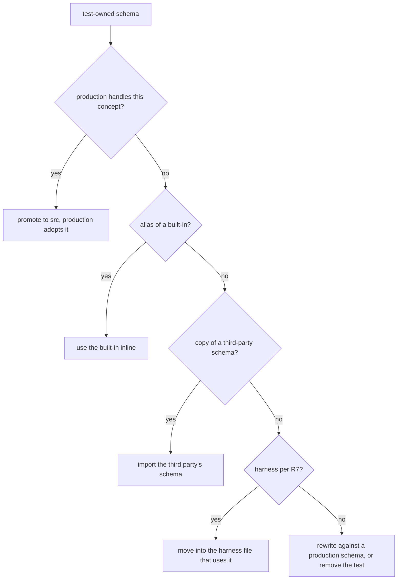

# Rich Schema Laws - Plan

## Goal Capsule

- **Objective:** Effect schemas in this repo carry their own domain rules. An invalid value or state fails at decode instead of being re-checked in consuming code, tests exercise the real production schemas, and CE planning and review hold new schema work to the same standard.
- **Means:** six new `schema-laws` pack rules, a sweep of every production schema, and removing every test-owned `*.schema.ts` (KTD1-KTD6).
- **Product authority:** the repo owner, through the Key Decisions below, then this plan's KTDs. XState lifecycle machines are not in scope here (see How This Work Fits Together).
- **Stop conditions:** `pnpm check:local` exits 0 after the last edit; no `*.schema.ts` remains under any `tests/` or `src/__tests__/` directory; the PR's checks are green.
- **Execution profile:** one branch and one PR, a commit per unit; U2 is an Evaluator change and lands in its own commit.
- **Open blockers:** none.

---

## Product Contract

Product Contract preservation: changed R7, R14 and Scope Boundaries. The user directed a harness carve-out during planning (Key Decisions), and research found that `schema-declaration-location`'s own fix text prescribes test-owned fixture schemas.

### Summary

The `schema-laws` pack gains six rules:

- domain invariants expressed as checks and brands;
- cross-field invariants as struct-level checks;
- tagged unions instead of records whose state shows in which fields are present;
- a rich domain Type decoded from wire shapes a third party owns;
- schema classes that hold data only;
- no schemas owned by tests, and no schemas exported just so tests can reach them.

The invariant and union rules also fire on the symptom: consuming code that re-checks a value it has already decoded. A sweep brings every production schema into compliance. Every test-fixture `*.schema.ts` is deleted, and the tests that used one are rewritten against production schemas, built-ins, third-party schemas or their own harness.

### Problem Frame

`CONSTITUTION.md` already states the law:

- make illegal states unrepresentable (`CONSTITUTION.md:61-65`);
- brand values that carry domain meaning (`:75-79`);
- model mutually exclusive states as a tagged union, one variant per state (CONST-D4, `:83-92`).

The `schema-laws` pack does not apply that law to Effect Schema. Its four rules cover codec laws, refusal properties, constructive generation and recursion. The Constitution names lint as the check for brands and for optionals that track a discriminant, but no rule in `packages/oxlint-plugin/` implements either. So nothing grades schema design today.

The repo shows the result. As of 2026-09-25, its 95 `*.schema.ts` files hold about 360 bare `String`/`Number`/`Finite`/`Int`/`Boolean` references against 9 `brand` calls and 48 `check` calls, plus 68 `optional` fields. Examples:

- `CaseTrace` pairs `status` with a `reason` that means something for only one status (`packages/discern/src/Inspection.schema.ts:38-42`).
- `DecisionInspection` pairs a `kind` literal with a `criteria` field that its own doc comment says only some kinds declare (`:11-17`).
- `BudgetLimits` uses two optional numbers to mean "unlimited" (`packages/discern/src/Budget.schema.ts:3-7`).
- effect-readiness keeps a raw `statusLine: string` and regex-checks it inside the decider (`packages/effect-readiness/src/evaluate-probe.workflow.ts:37`, `:50`). Meanwhile its property test draws from a refined `StatusCode` that exists only in a test fixture.

Test-owned schemas hide these gaps. `tests/__fixtures__/` holds 24 `*.schema.ts` files, and `packages/daemon/effect-daemon-spec/src/__tests__/supervisor-boot.schema.ts` is a 25th. `@systemfsoftware/effect-schema-vite` scans only `src` (`packages/schema/effect-schema-vite/src/mod.ts:13`, `:119`), so the 24 get no generated laws. Some alias a built-in (`packages/discern/tests/__fixtures__/request.schema.ts` is `Schema.String`). One hand-copies Effect RPC's failure envelope (`examples/inventory-fulfillment/tests/__fixtures__/rpc-wire.schema.ts`). Others carry a domain type production lacks, such as `StatusCode`. The lint that places schemas tells authors to do this: its fix text reads "a schema only a test uses belongs in tests/**fixtures**/<stem>.schema.ts" (`packages/oxlint-plugin/oxlint-plugin-effect-schema/src/rules/schema-declaration-location.config.ts:26`).

Methods on schema classes are a separate hazard. A spike on 2026-09-25 against the installed Effect v4 found three failures:

- Spreading a `TaggedClass` instance drops its prototype. The copy fails `S.is`, fails to encode, and loses its getters.
- A method called after being pulled off its instance throws.
- `array.map(Order.make)` throws, because Effect's own static `make` reads `this` (`repos/effect/packages/effect/src/Schema.ts:14497-14498`).

No schema class in the repo has an instance method today. Many are classes with no contract that needs one.

### Key Decisions

- **Pack rules are the gate; no new lint** (session-settled: user-directed — chosen over pack rules plus new oxlint rules: heuristic lint risks false positives, and review against pack rules is the grading path). Governs R8.
- **Repo-wide sweep, not rules alone** (session-settled: user-directed — chosen over rules-only and over fixing a few named examples: the rules land with the repo already compliant). Governs R10.
- **The sweep covers hidden states and real invariants, not every primitive** (session-settled: user-directed — chosen over branding every domain-position primitive: each added refinement then carries a refusal property that tests something real). Governs R1, R10.
- **Schemas the repo doesn't own keep their wire shape and decode into a rich Type** (session-settled: user-directed — chosen over exempting them and over rewriting them to tagged unions: the wire stays compatible and domain code still sees the rich type). Governs R4.
- **Schema classes only where a contract requires one; those may have derived getters** (session-settled: user-directed — chosen over "any type with a derived value may be a class" and over author's choice: keeps class instances, and their spread hazard, to contract-required types). Governs R5.
- **One rule per situation, plus a symptom trigger** (session-settled: user-directed — chosen over three broad rules: each rule has one trigger moment and one fix, and review catches anemia where it leaks into consuming code). Governs R1-R6, R9.
- **Data-only schema classes are part of this work** (session-settled: user-directed — chosen over a separate brainstorm). Governs R5.
- **Tests own no schemas; the doctrine lives in the pack** (session-settled: user-directed — chosen over keeping named fixture exceptions and over allowing schema declarations in test files: fixtures hid missing production types and escaped generated laws). Governs R7, R14, R15.
- **Rewrite tests that need a consumer-owned schema, even at the cost of some negative-fixture proofs** (session-settled: user-directed — chosen over a lint exemption for test files and over keeping named exceptions: the user accepted losing proofs such as the recursion-budget negative fixture). Governs R14.
- **A test's harness is not smuggling** (session-settled: user-directed — chosen over banning conformance models too and over moving models into `src/`: a model's command language and a generic library's stand-in API exist only to drive the test). Governs R7, R14.
- **Module functions live in an unsuffixed sibling module named after the type.** The cell-architecture pack bans new file suffixes (pack: cell-architecture, service-and-layer-boundaries.md), and `schema-file-exports-schemas-only` stops a `*.schema.ts` file from exporting functions. Governs R5.

### Requirements

**Pack rules**

- R1. A new `schema-laws` rule requires a value that carries a domain invariant (non-negative, bounded, id format, closed set) to be refined with checks, and branded when it has domain meaning. Each custom check states its invariant as a domain sentence in its failure annotation. A primitive with no invariant stays bare.
- R2. A new rule requires a relation between fields (ordering, sum, conditional presence) to be a struct-level check. It adopts the dense/sparse generation doctrine in `docs/solutions/architecture-patterns/cross-field-schema-invariants-and-arbitrary-derivation.md` without restating it.
- R3. A new rule binds CONST-D4 to Effect Schema. Mutually exclusive states are a tagged union with one variant per state, each variant carrying only its valid fields. An optional field that correlates with a discriminant, status literal or boolean flag is the defect. An optional that is absent the same way in every state is allowed.
- R4. A new rule covers schemas whose encoded shape a third party owns. The foreign shape stays as the Encoded side and decodes into a rich Type through a lawful transformation (pack: schema-laws, law-failure-is-a-codec-defect.md). R1-R3 apply to that Type side.
- R5. A new rule makes schema classes data-only.
  - A schema class exists only where a contract requires one: a `Workflow.make` command, a variant of a decision union, or a tagged error.
  - Such a class may define derived getters that take no arguments, have no side effects and read only the instance's own fields.
  - It defines no instance methods, and no statics beyond schema metadata.
  - Behavior over schema data is a set of module-level functions.
  - Every other type is a plain struct, tagged union or opaque nominal type.
- R6. R1 and R3 also fire on the symptom of an anemic schema:
  - a decider, handler or cell re-checking a value it already decoded (a range guard, a regex, a guard on state or field presence);
  - a test that needs a refined schema for a concept production keeps bare.

  In both cases the fix moves the invariant into the production schema.
- R7. A new rule forbids test-owned schemas and schema smuggling.
  - A test never declares, copies or aliases a schema that stands in for a domain concept, a third party's schema or a built-in. It uses the production schema of its own package, the schema the third party exports (such as Effect RPC's), or the built-in.
  - A test's harness is the exception. It covers a conformance model's command, response and state language, and the stand-in API or error through which a test drives a generic library. Harness schemas live in the harness file that uses them, never in a `*.schema.ts`, and are never exported as domain types.
  - Production never exports a schema, and never adds a `package.json` subpath, solely so a test can reach it.
  - A test that cannot find the domain schema it needs has found a missing production type (R6), or it is testing something production does not do.
- R8. Each new rule states `Gate: review` and cites a working example in `src/` produced by the sweep.
- R9. The six new rules and the four existing ones prescribe disjoint fixes. The pack README describes the widened scope: schema design and test ownership as well as codec laws.

**Production sweep**

- R10. Every production schema under a package's or example's `src/`, whether in a `*.schema.ts` or a `*.workflow.ts`, complies with R1-R5.
- R11. Each refinement the sweep adds carries a refusal property (pack: schema-laws, refusals-beside-generated-laws.md) and generates its values constructively (pack: schema-laws, arbitrary-filter-floors.md). A generated law that fails is fixed in the codec (pack: schema-laws, law-failure-is-a-codec-defect.md).
- R12. Consuming code stops re-checking an invariant the schema now carries. The redundant guard is deleted, not kept as a backup.
- R13. A change to the encoded shape of a schema the repo owns ships with a changeset that names the wire change.

**Test-owned schema removal**

- R14. Every `*.schema.ts` under a `tests/` or `src/__tests__/` directory is deleted, and the repo complies with R7.
  - A fixture that models a concept production handles becomes that production schema, and production adopts it.
  - A fixture that aliases a built-in is replaced by the built-in.
  - The copy of Effect RPC's failure envelope is replaced by Effect's own schema.
  - A fixture that is harness under R7 moves into the harness file that uses it.
  - Any other test that needs a schema no production module owns is rewritten against a real production schema from its own package, or removed when none fits.
- R15. Removing fixtures adds no leaky exports. A type promoted into production is exported only when it is part of the package's public API.

### Acceptance Examples

- AE1. **Covers R3, R12.** Given `CaseTrace { id, status, reason? }` where `reason` is present only for an uncertain case, when the sweep runs, then `CaseTrace` becomes a tagged union whose uncertain variant alone carries `reason`, and no consumer checks for `reason` being present.
- AE2. **Covers R3.** Given `BudgetLimits { decisions?, calls? }` where absence means "unlimited", then each limit is either a bounded count or an explicit unlimited variant, and no code path reads absence as meaning.
- AE3. **Covers R1, R4, R6, R12, R14.** Given effect-readiness regex-checks `statusLine` in its decider and a test fixture declares `StatusCode`, then production decodes the status line into a refined status code, the decider matches on it without a regex, the property test draws from the production type, and the fixture file is gone.
- AE4. **Covers R4.** Given `SocketOsError { code?, errno? }` mirrors a Node OS error, then the encoded side still accepts Node's shape byte for byte and the decoded Type is a union of the cases the domain distinguishes.
- AE5. **Covers R5.** Given a Workflow decision variant needs a total, when the author writes `get total()` computed from its own fields, then review accepts it. When the author writes `withQty(n)` on the class, review flags it and the behavior moves to a module function.
- AE6. **Covers R7, R14, R15.** Given `packages/discern/tests/__fixtures__/request.schema.ts` exports `Schema.String`, then the file is deleted and the three integration tests use `Schema.String` directly, with no new export from discern.
- AE7. **Covers R7.** Given a later change adds a test that declares its own tagged error to stand in for a domain failure, when review runs against the pack, then the test is flagged under R7. The fix is either a production schema the library actually uses or removing the test. A conformance model's command language in its `*.model.ts` is not flagged.

### Success Criteria

- A review of `src/` and `tests/` against the ten `schema-laws` rules finds no violation.
- No `*.schema.ts` file remains under any `tests/` or `src/__tests__/` directory.
- `pnpm check:local` exits 0, and so do the PR checks.
- Each refinement the sweep adds has a refusal property that fails when the refinement is widened.

### Scope Boundaries

- No new lint rules, and no change to any lint verdict. The lint checks `CONSTITUTION.md:79` and `:90` name remain unbuilt, and correcting the Constitution's gate text is not part of this work.
- `schema-declaration-location` keeps its verdicts; only its fix text changes, so it stops prescribing test-owned fixture schemas (U2).
- The law generator's scan directory does not change.
- The choice of issue formatter for decode failures at cell boundaries is not decided here. R1 only requires checks to carry domain messages.
- XState lifecycle machines are out of scope (see How This Work Fits Together).

#### Deferred to Follow-Up Work

- `packages/daemon/effect-daemon-conformance/src/Scenario.schema.ts` and `Trace.schema.ts` redeclare `Millis`, `Intensity`, `Generation`, `ChildId` and the restart literals from `effect-daemon-spec`, with different bounds (a `Generation` cap of 64 against 1024). Deciding whether conformance should import the spec's schemas changes a package boundary; it gets its own change.

### Dependencies / Assumptions

- Breaking changes to owned schemas are acceptable under REPO-R1.
- Allowing derived getters (R5) relies on `typescript/no-misused-spread` reporting spread class instances. The oxlint-guard hook reported it on a probe file on 2026-09-25. The recommended preset enables the whole `correctness` category (`packages/oxlint-presets/oxlint-config-recommended/src/index.ts:100`) without naming the rule.
- Harness classification (R7) is applied per fixture in U8 by the rule stated there. Each harness relocation is listed in the PR body so the owner can challenge any single case.

### Outstanding Questions

**Deferred to Planning**

None remain. The four questions the brainstorm deferred are resolved in KTD3, KTD5 and U8, and under Dependencies / Assumptions.

**Deferred to Implementation**

- Discern's `Trace` and `CompiledPlan` carry `version` literals. If a decoded trace is ever persisted outside the process, reshaping `CaseTrace` bumps `Trace.version`. U3 checks for a persistence path before choosing.
- `DecisionInspection.criteria` is `Schema.Json` today. The per-kind criteria shapes come from the kind definitions in `packages/discern/src/`; U3 reads them there.

<!-- ce-section: work-relationships -->

### How This Work Fits Together

This plan covers schema design rules, test ownership of schemas, and bringing the repo into compliance. The breakdown below is the current understanding, not a committed roadmap.

- XState lifecycle machines, assessed through ce-pov against pure `Workflow.make` deciders.
  - Shares the principle: tagged unions make impossible states unrepresentable; a machine makes impossible transitions unrepresentable.
  - Can proceed independently of this plan.
  - Still to decide: whether to adopt XState at all (REPO-W8 requires researching at least two alternatives).
- Lint rules for anemia smells and test-owned schemas: an optional correlated with a discriminant, bare primitives in domain positions, and a `*.schema.ts` under `tests/`.
  - Depends on this plan's rules settling on real schemas.
  - Still to decide.

### Sources / Research

- `CONSTITUTION.md:61-65`, `:75-79`, `:83-92`, `:403-405`: the illegal-states, brand and tagged-union law R1 and R3 bind.
- `docs/solutions/architecture-patterns/workflow-success-channel-tagged-union.md`: `Workflow.make` requires a union of two or more `S.TaggedClass` variants that share one family TypeId.
- `docs/solutions/architecture-patterns/a-schema-type-claim-can-outrun-its-examination.md`: a brand with no filter, and a constructor that skips checks, as anti-patterns R1 must name.
- `docs/residual-review-findings/refactor-strykerjs-concept-modules.md:14`: nine `no-misused-spread` defects on the `Mutant` `TaggedClass`.
- `docs/plans/2026-09-21-1627-refactor-adt-class-elimination-plan.md` KD3: prior choice of interface plus standalone functions over classes.
- Effect v4 surface in `repos/effect/packages/effect/src/`:
  - `Schema.Opaque` (`Schema.ts:6341`) and `TaggedUnion` with `cases`/`guards`/`isAnyOf`/`match` (`:6223-6231`, `:6276`);
  - `toType`/`toEncoded`/`flip` (`:2500`, `:2541`, `:2601`) and `makeFilterGroup` (`:6514`);
  - class instance recognition through a prototype getter (`:14479`, `:14582-14583`);
  - `SchemaIssue.defaultCheckHook` (`SchemaIssue.ts:1226`);
  - `Rpc.exitSchema` (`unstable/rpc/Rpc.ts:1123`), which derives the RPC exit envelope.
- Exemplary schemas already in `src/`: `examples/inventory-fulfillment/src/fulfillment/credit.schema.ts` (branded, checked `Money` with refusal properties) and `packages/atom/effect-atom/src/internal/node-lifetime.schema.ts` (the `NodeFate` tagged union).

---

## Planning Contract

### Key Technical Decisions

- KTD1. **Classes that stay.** A schema class is contract-required when it is a command passed to `Workflow.make` (it carries `static readonly [Workflow.InstrumentationBrand]`), a variant of a decision union whose family TypeId `Workflow.make` checks, or a `Schema.TaggedError`. Everything else becomes `Schema.Struct`/`TaggedStruct`, or `Schema.Opaque` over a struct when a nominal type is needed. The data types that decisions carry (for example `ComponentDemand` and `LotReservation` in `examples/inventory-fulfillment/src/fulfillment/place-order.workflow.ts`) are not decision variants and convert too. Governs R5, R10.
- KTD2. **Converting a class never changes the wire unless the shape changes.** A `TaggedClass` becomes a `TaggedStruct` with the same tag, and a `Class` becomes a `Struct` with the same fields, so the Encoded side is byte-identical. Only R3 and R4 rewrites change encodings, and only those carry R13 changesets that name a wire change. Class removals still change public types (constructor calls become `make`), so each affected publishable package gets a changeset through `pnpm change`. Governs R5, R13.
- KTD3. **Status line decoding.** `Responded` keeps the raw HTTP status line as its Encoded side and decodes it into a refined `StatusCode` (integer 100-599) through a lawful transformation (R4). The decider asks whether the code is 2xx and deletes the regex. A non-2xx response is still valid evidence ("not yet satisfied"), so decode must not reject it. Governs R1, R4, R6, R12.
- KTD4. **Fixture removal follows one decision order** (see High-Level Technical Design): domain concept → promote; built-in alias → built-in; third-party copy → the third party's schema; harness → move into the harness file; otherwise → rewrite or remove. A module that the recursion-budget tests must load from disk is not a schema fixture. It becomes a source string that the test writes to a temporary file or feeds straight to the transform, so the gate proof survives without a `*.schema.ts`. Governs R7, R14.
- KTD5. **The RPC wire test derives the envelope.** `examples/inventory-fulfillment/tests/__fixtures__/server.fixture.ts` decodes RPC exits through `Rpc.exitSchema` applied to the real RPC from `src/rpc/`, never a hand copy. Governs R7, R14.
- KTD6. **Lint fix text, not lint behavior.** `schema-declaration-location`'s `FIX` string stops recommending `tests/__fixtures__/<stem>.schema.ts`. It now names the production module that owns the concept, or the harness file for a harness schema. Verdicts and tests stay the same apart from any assertion on the old text. This is an Evaluator surface, so it lands in its own commit. Governs R7.

### High-Level Technical Design

The fixture decision order KTD4 fixes, applied to each of the 25 test-owned `*.schema.ts` files:

### Implementation Constraints

- Every edit to a `*.schema.ts` keeps `schema-file-exports-schemas-only` green: module functions (R5) go to a sibling module named after the type.
- Every new check carries `arbitraryConstraint` or a constructive generator, so `schema-filter-constructive-generation` stays green (pack: schema-laws, arbitrary-filter-floors.md).
- Never hand-edit `package.json#exports` (REPO-S4). No unit adds an export path.
- Repo commands run from the root as `pnpm --filter <pkg> <cmd>`.

### Sequencing

U2 lands first because it is an Evaluator commit. U3-U7 are independent package sweeps. U8 depends on U4 (the `StatusCode` promotion) and on U7 (the example RPC types). U1 goes last because each rule cites a working example the sweep produced. U9 closes out.

---

## Implementation Units

### U1. Six new schema-laws rules and README

- **Goal:** the pack carries R1-R7 as six top-level rule files, and the README describes the widened scope.
- **Requirements:** R1-R9.
- **Dependencies:** U3-U8 (working examples).
- **Files:** `compound-packs/schema-laws/README.md`, plus six new rule files under `compound-packs/schema-laws/` named for the situations: invariants as refinements, cross-field checks, tagged unions over state-by-presence, rich Type over a foreign Encoded, data-only schema classes, and tests own no schemas.
- **Approach:**
  1. Match the existing rule shape in `compound-packs/schema-laws/arbitrary-filter-floors.md`: frontmatter `title`, situational `applies_when` lines, `tags`, then a prose lead, `## Rule`, one short example, `Working example:` pointing into `src/`, and `Gate: review`.
  2. The rules for R1 and R3 add R6's symptom situations to their `applies_when` lines.
  3. The R7 rule states the harness exception and names `*.model.ts` and fixture workflow files as harness homes.
  4. The R5 rule names the three contracts from KTD1 and the spread and detached-`this` failures.
  5. Each rule cites the Constitution and the solution docs by path rather than restating them (R9).
- **Test expectation:** none — doctrine files with no runtime behavior. dprint formats them.
- **Verification:** `pnpm exec dprint check` passes. Every `Working example:` path exists. No two rules prescribe different fixes for the same line.

### U2. Stop the placement lint prescribing fixture schemas

- **Goal:** `schema-declaration-location`'s fix text stops sending authors to `tests/__fixtures__/<stem>.schema.ts`.
- **Requirements:** R7; KTD6.
- **Dependencies:** none.
- **Files:** `packages/oxlint-plugin/oxlint-plugin-effect-schema/src/rules/schema-declaration-location.config.ts`, `packages/oxlint-plugin/oxlint-plugin-effect-schema/src/rules/__tests__/schema-declaration-location.test.ts` (only if it asserts the old text), `packages/oxlint-plugin/oxlint-plugin-effect-schema/README.md` (if it quotes the message).
- **Approach:** rewrite `FIX` to say: move the schema to the `*.schema.ts` or owning `*.workflow.ts` of the module whose concept it is. A test that needs a schema production lacks has found a missing production type; a test's harness schema lives in its `*.model.ts` or fixture workflow file. Verdict logic stays untouched.
- **Test scenarios:**
  - An existing rule-test case that reports a misplaced schema still reports, with the new fix text in the message.
- **Verification:** `pnpm --filter @systemfsoftware/oxlint-plugin-effect-schema test` passes, and no rule-test case changed verdict.

### U3. discern sweep

- **Goal:** discern's schemas carry their states and invariants, with no data-only classes.
- **Requirements:** R3, R5, R1, R10-R13; AE1, AE2.
- **Dependencies:** none.
- **Files:**
  - Modify: `packages/discern/src/Inspection.schema.ts`, `packages/discern/src/Budget.schema.ts`, `packages/discern/src/Verdict.schema.ts`, `packages/discern/src/Route.schema.ts`, `packages/discern/src/EvalReport.schema.ts`, `packages/discern/src/Observation.schema.ts`, and consumers found by references (`run-policy.cell.ts`, `select-case.workflow.ts`, `matcher.blueprint.ts`, `pattern.blueprint.ts`, `budget-provider.cell.ts`, `admit-budget-charge.workflow.ts`, `budget.handle.ts`, `measure-pattern.cell.ts`).
  - Tests: in-source refusal properties in the edited `*.schema.ts` files, and the existing discern integration tests.
- **Approach:**
  1. `CaseTrace` becomes a tagged union by status, with `reason` required on the uncertain variant only (AE1). Delete the presence guards in `select-case.workflow.ts`.
  2. `DecisionInspection.criteria` becomes per-kind variants keyed by `kind`, carrying each kind's own criteria shape (R3).
  3. `BudgetLimits` becomes one limit per dimension, each either `Unlimited` or a bounded non-negative count (AE2). Delete the `?.`/`??` absence readings.
  4. `PatternUncertain` carries a required `reason`. `PatternMatched` and `PatternMissed` drop `reason` unless a consumer reads it on those tags, in which case R3 decides from that evidence.
  5. `RouteCandidate.probability` gets a `Probability` brand over its existing 0-1 check.
  6. The `Class` types `EvalMetrics`, `EvalRecord`, `EvalReport`, `CaseInspection`, `DecisionInspection`, `CompiledPlan`, `Trace`, `Observation` and `Observations` become structs (KTD1). Workflow commands, decisions and tagged errors stay classes.
  7. Pick the `Trace.version` handling per the deferred implementation question.
- **Execution note:** Start with the consumers' current use of `reason` and budget absence (find references). The union's variants come from what consumers actually branch on.
- **Patterns to follow:** `packages/atom/effect-atom/src/internal/node-lifetime.schema.ts` (tagged union with a field on only one variant); `examples/inventory-fulfillment/src/fulfillment/credit.schema.ts` (brand plus refusal property).
- **Test scenarios:**
  - Covers AE1. An uncertain case with no `reason` fails decode. A matched case that carries `reason` fails decode when the variant has no such field.
  - Covers AE2. A limit of `Unlimited` admits any charge. A bounded limit of 0 refuses the first charge. A negative bound fails decode.
  - Refusal property for `Probability`: candidates drawn from `Schema.Finite` plus seeds -0.01, 0, 1, 1.01, NaN and ±Infinity; decode succeeds iff 0 ≤ p ≤ 1.
  - Integration: the existing inspection-and-tracing and caching-and-budgets integration tests pass against the new shapes.
- **Verification:** `pnpm --filter @systemfsoftware/discern test typecheck lint` pass, and the generated schema laws stay green.

### U4. effect-readiness: status code and verdict

- **Goal:** readiness decodes HTTP status into a domain type and decides on it without a regex.
- **Requirements:** R1, R4, R5, R6, R12, R14; AE3; KTD3.
- **Dependencies:** none.
- **Files:**
  - Modify: `packages/effect-readiness/src/DialEvidence.schema.ts`, `packages/effect-readiness/src/evaluate-probe.workflow.ts`, `packages/effect-readiness/src/verdict.schema.ts`, and consumers of `TimedOut`.
  - Create: a `StatusCode` schema in the `*.schema.ts` that owns HTTP evidence.
  - Delete: `packages/effect-readiness/tests/__fixtures__/status-code.schema.ts`.
  - Test: `packages/effect-readiness/src/__tests__/evaluate-probe.workflow.property.test.ts`, and a refusal property beside `StatusCode`.
- **Approach:**
  1. `StatusCode` is an integer 100-599 with a domain failure message.
  2. `Responded`'s status line decodes to `{ statusCode }` through a transformation whose Encoded side is the raw status line, and encodes back to a canonical status line (KTD3).
  3. `isOkStatusLine` and its regex are deleted; the decider matches on 2xx.
  4. `TimedOut` becomes a `TaggedStruct` (KTD1).
  5. The property test imports production `StatusCode`, and the fixture is deleted.
- **Patterns to follow:** `packages/trace/trace-spec/src/drivers/tempo-trace.schema.ts` (foreign wire decoded through lawful transformations).
- **Test scenarios:**
  - Covers AE3. For every `StatusCode` drawn from production, `evaluateProbe` reports Satisfied iff the code is in 200-299.
  - `HTTP/1.1 503 Service Unavailable` decodes to status 503 and evaluates as not yet satisfied.
  - A status line with no parsable code fails decode with a domain message.
  - Refusal property for `StatusCode`: candidates from `Schema.Int` plus seeds 99, 100, 599, 600 and -1; decode succeeds iff 100 ≤ n ≤ 599.
- **Verification:** `pnpm --filter @systemfsoftware/effect-readiness test typecheck lint` pass, and no regex remains in the decider.

### U5. Daemon and microsandbox sweep

- **Goal:** daemon and microsandbox schemas have no data-only classes, and the socket OS error decodes into a domain union.
- **Requirements:** R4, R5, R10-R13; AE4; KTD1, KTD2.
- **Dependencies:** none.
- **Files:**
  - Modify: `packages/daemon/effect-daemon-conformance/src/ConformanceReport.schema.ts` (`ScenarioCompared`, `ScenarioStalled`), `packages/daemon/effect-daemon-microvm/src/MicroVMMedium/MicroVMProgram.schema.ts` (`MicroVMWorkload`), `packages/effect-microsandbox/src/MicroVMSpec.schema.ts` (`ExposedPort`, `BaseSpec`, `ServiceSpec`, `JobSpec`), `packages/effect-microsandbox/src/JobCompletion.schema.ts`, `packages/daemon/effect-daemon-socket/src/SocketMedium/socket-failure.schema.ts`, `packages/daemon/effect-daemon-spec/src/kernel/SupervisorPolicy.schema.ts` (confirm `SupervisionPolicy` is a `Workflow.make` command before keeping it a class), and their consumers.
  - Tests: existing package suites; a decode property for `SocketOsError`.
- **Approach:**
  1. Convert each data-only class per KTD1/KTD2. `ServiceSpec`/`JobSpec` keep their tags as `TaggedStruct`s sharing base fields.
  2. `SocketOsError` keeps Node's `{ code?, errno? }` as Encoded and decodes into the cases `socket-termination.ts` actually distinguishes (AE4). Its consumer's presence checks are deleted (R12).
- **Test scenarios:**
  - Covers AE4. Each Node error shape decodes to its union case: code only, errno only, both, and neither. Encoding each case returns the original Node shape.
  - Existing microsandbox property tests that construct `ServiceSpec`/`JobSpec` pass with struct constructors.
- **Verification:** `pnpm --filter "./packages/daemon/**" --filter @systemfsoftware/effect-microsandbox test typecheck lint` pass.

### U6. trace-spec and effect-memfs sweep

- **Goal:** trace and memfs schemas have no data-only classes and carry their numeric invariants.
- **Requirements:** R1, R5, R10-R12.
- **Dependencies:** none.
- **Files:** `packages/trace/trace-spec/src/Verdict.schema.ts` (`Hold`, `Break`), `packages/trace/trace-spec/src/ObservationWindowSpec.schema.ts`, `packages/trace/trace-spec/src/TraceGraph.schema.ts` (`startMillis` and `durationMillis` ≥ 0), `packages/trace/trace-spec/src/IncompleteObservationError.schema.ts` (`spanCount` a positive integer), `packages/effect-memfs/src/MemoryFileSystemSpec.schema.ts`, and consumers (`Rel.ts`, `FailureDump.ts`, `Prop.ts`, `TaskAnnounce.ts`).
- **Approach:** convert the classes per KTD1. `Hold`/`Break` keep their `VerdictTypeId` brand as a struct field or an `Opaque` nominal type if consumers guard on it. Add the numeric checks with refusal properties (R11). The `TraceGraph` millis checks sit on the Type side of the existing Tempo transformation, so the wire is unchanged (R4).
- **Test scenarios:**
  - Refusal property for span millis: candidates from `Schema.Finite` plus seeds -1, 0, NaN and ±Infinity; decode succeeds iff the value is finite and ≥ 0.
  - Refusal property for `spanCount`: seeds 0, 1 and -1; decode succeeds iff it is an integer > 0.
  - Existing `.trace.test.ts` suites pass with struct `Hold`/`Break`.
- **Verification:** `pnpm --filter @systemfsoftware/trace-spec --filter @systemfsoftware/effect-memfs test typecheck lint` pass.

### U7. inventory-fulfillment example sweep

- **Goal:** the reference example models data as structs and keeps classes only for its commands, decisions and errors.
- **Requirements:** R5, R10; KTD1, KTD2.
- **Dependencies:** none.
- **Files:** `examples/inventory-fulfillment/src/fulfillment/credit.schema.ts` (`CreditAccount`), `.../fulfillment/order.schema.ts` (`Order`, `OrderLine`), `.../fulfillment/event.schema.ts` (`AuditPayload`, `StockReserved`, `BackorderRecorded`), `.../fulfillment/place-order.workflow.ts` (`ComponentDemand`, `LotReservation`, `UnfulfilledDemand` and any other non-variant class), `.../inventory/inventory.schema.ts` (`StockLot`, `WarehouseStockPartition`, `KitComponent`, `KitDefinition`, `LotAllocation`), `.../rpc/inventory-fulfillment.schema.ts` (request and view classes), and their consumers in `src/` and `tests/`.
- **Approach:** classify each class by KTD1, confirming against the `Workflow.make` call at `place-order.workflow.ts` and the decision union's TypeId. Convert the rest. Event classes stay tagged as `TaggedStruct` unless an event union carries a TypeId that `Workflow.make` checks.
- **Test scenarios:**
  - Existing example integration, conformance and gherkin suites pass unchanged in behavior.
  - The RPC round trip through the example server still decodes each request and view.
- **Verification:** `pnpm --filter @systemfsoftware/example-inventory-fulfillment test typecheck lint` pass.

### U8. Remove test-owned schemas

- **Goal:** no `*.schema.ts` remains under `tests/` or `src/__tests__/`, and every former consumer uses a production, built-in, third-party or harness schema.
- **Requirements:** R7, R14, R15; AE6; KTD4, KTD5.
- **Dependencies:** U4 (`StatusCode`), U7 (example RPC types).
- **Files:** the 25 files below, their importing tests, and the harness files that receive relocated schemas.

| Fixture                                                                                       | Decision (KTD4)        | Target                                                                                  |
| --------------------------------------------------------------------------------------------- | ---------------------- | --------------------------------------------------------------------------------------- |
| `packages/discern/tests/__fixtures__/request.schema.ts`                                       | built-in               | `Schema.String` at each use (AE6)                                                       |
| `packages/discern/tests/__fixtures__/facts.schema.ts`                                         | built-in               | `Schema.Record(Schema.String, Schema.Json)` at the use                                  |
| `packages/discern/tests/__fixtures__/release-ticket.schema.ts`                                | harness                | the routing model fixture that drives discern                                           |
| `packages/atom/effect-atom/tests/__fixtures__/Result.schema.ts`                               | production + harness   | `Atom.AsyncResult.Schema`; the stand-in error moves into the atom harness               |
| `packages/atom/effect-atom/tests/__fixtures__/SavedText.schema.ts`                            | built-in               | `Schema.fromJsonString(Schema.Array(Schema.Json))`                                      |
| `packages/atom/effect-atom-react/tests/__fixtures__/Unavailable.schema.ts`                    | harness                | the SSR test harness file                                                               |
| `examples/inventory-fulfillment/tests/__fixtures__/conformance-bounds.schema.ts`              | production or built-in | the example's own `Quantity`/`Version` if they match the bound, else the built-in check |
| `examples/inventory-fulfillment/tests/__fixtures__/rpc-wire.schema.ts`                        | third party            | `Rpc.exitSchema` over the real RPC (KTD5)                                               |
| `packages/effect-readiness/tests/__fixtures__/status-code.schema.ts`                          | promote                | U4's `StatusCode`                                                                       |
| `packages/effect-memfs/tests/__fixtures__/HandleLeftOpen.schema.ts`                           | harness                | `open-file.model.ts` (the conformance probe's failure)                                  |
| `packages/daemon/effect-daemon-spec/tests/__fixtures__/supervisor-conformance.schema.ts`      | harness                | a `supervisor-conformance.model.ts`                                                     |
| `packages/daemon/effect-daemon-spec/src/__tests__/supervisor-boot.schema.ts`                  | production             | the spec's own child declaration and `RestartType` schemas                              |
| `packages/daemon/effect-daemon-conformance/tests/__fixtures__/conformance-fixtures.schema.ts` | harness                | the conformance model fixtures                                                          |
| `packages/daemon/effect-daemon-microvm/tests/__fixtures__/microvm-runtime.schema.ts`          | harness                | `microvm-runtime.fixture.ts`                                                            |
| `packages/daemon/effect-daemon-microvm/tests/__fixtures__/exceptional-termination.schema.ts`  | harness                | the microvm conformance harness file that uses it                                       |
| `packages/effect-cell-types/tests/__fixtures__/Command.schema.ts`                             | harness                | each fixture `*.workflow.ts` owns the command it drives; type tests use `import type`   |
| `packages/effect-cell-types/tests/__fixtures__/Decision.schema.ts`                            | harness                | as above, owned by the fixture workflows                                                |
| `packages/gherkin/effect-gherkin-spec/tests/__fixtures__/OrderFulfillment.schema.ts`          | harness                | the gherkin-spec test harness file                                                      |
| `packages/gherkin/effect-gherkin-spec/tests/__fixtures__/TestDomainError.schema.ts`           | harness                | the gherkin-spec test harness file                                                      |
| `packages/schema/effect-schema-recursion-budget/tests/__fixtures__/bad-budget.schema.ts`      | rewrite (KTD4)         | source string loaded through the transform                                              |
| `packages/schema/effect-schema-recursion-budget/tests/__fixtures__/chain.schema.ts`           | rewrite (KTD4)         | source string loaded through the transform                                              |
| `packages/sim/differential-spec/tests/__fixtures__/CandidateDefect.schema.ts`                 | harness                | the differential harness file                                                           |
| `packages/trace/trace-spec/tests/__fixtures__/fulfillment-trace.schema.ts`                    | harness                | `trace-store.model.ts` or the trace harness fixture                                     |
| `packages/trace/trace-spec/tests/__fixtures__/probe-arbitrary.schema.ts`                      | built-in               | the `Int` 0-12 check at the use                                                         |
| `packages/trace/trace-taxonomy/tests/__fixtures__/declared-span.schema.ts`                    | harness                | a declared-span harness fixture; the `.tst.ts` uses `import type`                       |

- **Approach:**
  1. Work down the table.
  2. Before accepting a harness row, confirm that the package has no production schema for the concept. If one exists, the row becomes production.
  3. Harness schemas are not exported from any package entry (R15).
  4. `.tst.ts` files switch to `import type` from the harness file.
  5. List every harness relocation in the PR body (Dependencies / Assumptions).
- **Execution note:** `.tst.ts` files cannot hold runtime values, so confirm each type test still compiles after its import turns type-only.
- **Test scenarios:**
  - Covers AE6. The three discern integration tests pass using `Schema.String` directly.
  - The recursion-budget suite still proves that a malformed budget refuses the module at load, using the source-string path (KTD4).
  - The inventory RPC wire test decodes a real failure exit through `Rpc.exitSchema` and asserts the same failure it asserted before.
  - Every package that lost a fixture passes its full suite, including `test:types`.
- **Verification:** `git ls-files '*.schema.ts' | grep -E '/(tests|__tests__)/'` prints nothing, and `pnpm check:local` passes.

### U9. Changesets and closeout

- **Goal:** every publishable package whose build hash changed ships a changeset that names its consumer-visible change.
- **Requirements:** R13; KTD2.
- **Dependencies:** U2-U8.
- **Files:** `.changeset/*.md` created through `pnpm change --bump <level>`.
- **Approach:**
  - Breaking type or wire changes (discern `CaseTrace`/`BudgetLimits`/`PatternUncertain`, readiness `Responded`) take the bump the repo's pre-1.0 policy (REPO-R1) assigns to breaking changes.
  - Class-to-struct conversions take the level that matches their public type change.
  - The body lists consumer-observable facts only.
- **Test expectation:** none — release metadata.
- **Verification:** the changeset guard (`scripts/guards/check-changeset.ts`) passes in `pnpm check:local` and in CI.

---

## Verification Contract

| Gate                    | Command                                                                                                                          | Proves                                                                                                                        |
| ----------------------- | -------------------------------------------------------------------------------------------------------------------------------- | ----------------------------------------------------------------------------------------------------------------------------- |
| Local chain             | `pnpm check:local`                                                                                                               | dprint, lint, tsgo lint, typecheck, tests including generated schema laws, type tests, attw, api:check, build and dist checks |
| Per-package loop        | `pnpm --filter <pkg> test typecheck lint`                                                                                        | a unit's package is green before its commit                                                                                   |
| No test-owned schemas   | `git ls-files '*.schema.ts' \| grep -E '/(tests\|__tests__)/'`                                                                   | prints nothing (R14)                                                                                                          |
| Refusal properties bite | widen one new refinement locally once and watch its refusal property fail (pack: schema-laws, refusals-beside-generated-laws.md) | R11                                                                                                                           |
| CI                      | `gh pr checks --watch --fail-fast`                                                                                               | REPO-D1                                                                                                                       |

## Definition of Done

- U1-U9 are complete and each unit's Verification holds.
- Success Criteria in the Product Contract hold.
- API reports (`etc/*.api.md`) are regenerated for every package whose public types changed.
- No abandoned attempt, commented-out code or stray probe file remains in the diff.
