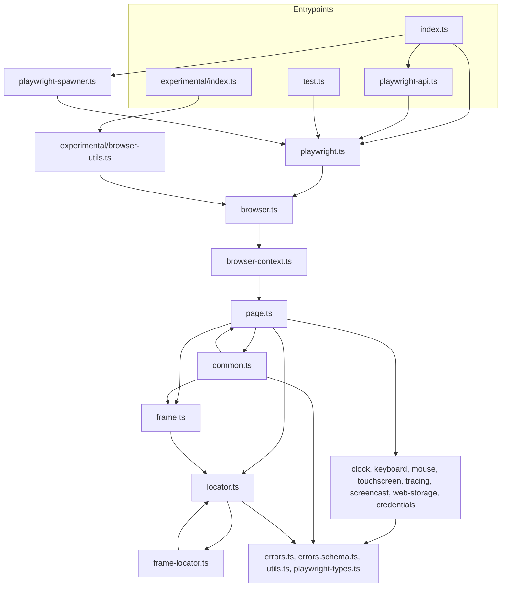

# Effect Playwright Port - Plan

## Goal Capsule

- **Objective:** Consumers can install `@systemfsoftware/effect-playwright` and drive a real browser from Effect programs through the complete upstream effect-playwright 0.8.0-2 API, with every repo gate green on current `main`.
- **Means:** a fresh owned-package port of upstream commit `fd314a2` into `packages/effect-playwright`, rebuilt to the current scaffold and test discipline (KTD1, KTD2, KTD9), delivered as a new PR that supersedes #323.
- **Authority:** `AGENTS.md` and `CONSTITUTION.md` > this plan > upstream source > the abandoned #323 branch (reference only).
- **Stop conditions:** a gate that cannot pass without relaxing a preset, editing an Evaluator surface, or editing `repos/`; any settled decision (KTD labels below) proven infeasible.
- **Execution profile:** source units U2 to U8 can be authored in parallel against the upstream interfaces; the module graph is cyclic (common, frame, page, locator), so the package only typechecks once U2 to U7 have all landed.
- **Finish and ship:** the lfg pipeline implements, reviews, and opens the PR; merge and first npm publish (`pnpm publish:unpublished`) stay with the maintainer.

---

## Product Contract

### Summary

Port Jobflow-io/effect-playwright at upstream commit `fd314a2` (version 0.8.0-2) into this monorepo as the owned package `@systemfsoftware/effect-playwright`. The port ships all three upstream entrypoints (`.`, `./experimental`, `./test`) and the `effect-playwright` CLI. It passes the unrelaxed `recommended` lint preset, the gritlint conventions gate, the project-membership guard, api-extractor reports, attw, and a real-chromium behaviour suite written as gherkin capability features. PR #323 is closed as superseded once the new PR is open.

### Problem Frame

PR #323 ported upstream 0.8.0-0 onto a `main` that has since moved 216 commits. It is now unmergeable (merge state DIRTY), and current gates reject most of its shape: the `@systemfsoftware/oxlint-config/base` preset it extends no longer exists, `@systemfsoftware/vitest-config`'s `defineConfig` is now async and throws unless the package devDepends on `@systemfsoftware/vitest`, the flat tsconfig trio fails `check-project-membership`, its `Data.TaggedClass` wrappers predate upstream's 0.8.0-2 service conversion, and its `e2e/` Playwright-Test directory has no lawful home under the test-discipline taxonomy. Rebasing it would drag every obsolete choice through conflict resolution, so the user asked for a restart from scratch.

### Key Decisions

- **Full upstream surface ships, not a subset.** (session-settled: user-directed — chosen over a partial port or thin wrapper: the user asked for the full surface.) Governs R1, R2, R3.
- **Apache-2.0 license.** (session-settled: user-directed — chosen over keeping MIT: the user rejected MIT on #323.) Governs R8.
- **Binary payloads are `Uint8Array`.** (session-settled: user-directed — chosen over `Buffer`: repo law, `Buffer` is an ambient Node global a `types: []` consumer lacks.) Governs R4.
- **Documented public API never sits under an `internal/` segment or carries `@internal`.** (session-settled: user-directed — chosen over `@internal` plus docs or deleting the docs: the pair `internal-export-jsdoc` / `no-internal-jsdoc-outside` makes the combination contradictory.) Governs R5.
- **Start from a fresh branch off `main`.** (session-settled: user-directed — chosen over rebasing #323: "Restart this PR from scratch".) Governs R11.

### Requirements

**Surface**

- R1. Every upstream export of `src/index.ts`, `src/playwright-api.ts`, `src/experimental/index.ts`, and `src/test.ts` at `fd314a2` is exported under the same name from the matching entrypoint, including the six `make*` wrapper constructors from upstream PR #31.
- R2. The six common wrappers (Request, Response, Worker, Dialog, FileChooser, Download) are `Context.Service` interfaces built by `makeRequest` through `makeDownload`, exposing no `_tag`, as in upstream 0.8.0-2.
- R3. The package ships an `effect-playwright` bin that forwards its arguments to the playwright-core CLI.
- R4. `screenshot`, `pdf`, `Request.postDataBuffer`, and `Download.stream` are typed with `Uint8Array`.
- R5. No exported declaration carries `@internal`, and no source path contains an `internal` segment.
- R6. Every failure surfaces as `PlaywrightError` with `_tag` `"PlaywrightError"`, `reason` `"Timeout"` for playwright-core `TimeoutError` and `"Unknown"` otherwise, and the original error as `cause`.

**Packaging and gates**

- R7. `pnpm check:local` exits 0 with the package present, and CI on the PR is green.
- R8. The package is Apache-2.0, and its README, description, `NOTICE`, and `AGENTS.md` record the fork of Jobflow-io/effect-playwright at `fd314a2` with upstream's MIT notice retained.
- R9. The committed api-extractor reports cover all three entrypoints, and `build` fails when the public surface drifts from them.
- R10. A `.changeset` intent announces the first release of the package.

**Behaviour proof**

- R11. The work lands on branch `playwright-library` cut from current `main`, and #323 is closed with a link to the new PR.
- R12. Every behaviour exercised by an upstream vitest case (`src/**/*.test.ts` at `fd314a2`) is exercised by a scenario in the new suite against real headless chromium through the public package entry, except cases that assert nothing beyond "does not crash".
- R13. The `./test` entry is proven under the real Playwright Test runner by at most four journeys: an effect test body with its finalizers, a shared `layer(...)` block, `makeMethods` custom fixtures, and an effect failure reported as a test failure.

### Scope Boundaries

- Upstream dev tooling is not ported: `scripts/coverage.ts`, `scripts/check-doc-examples.ts` (ts-morph), `src/scratchpad/setup.ts`, typedoc, and `.agents/skills`. They are repository tooling, not library surface.
- No preset relaxation, no Evaluator-surface edit (`.github/workflows/`, vitest-config guard table, lint rules), no `repos/` subtree for upstream.
- The unlanded `tagged-error-requires-message` rule (sibling worktree `gherkin-library-full-rehaul`) is not anticipated here.

#### Deferred to Follow-Up Work

- Mutation testing (`stryker.config.ts`) for the package.
- First npm publish and trusted-publisher registration (maintainer action per `.github/AGENTS.md`).

### Sources

- Upstream: https://github.com/Jobflow-io/effect-playwright at `fd314a23748b727a28f963d12fd2a2b4018a4126` (0.8.0-2 is `da01b42`).
- Old attempt: PR #323, branch `origin/effect-playwright-fork2`, solution doc `docs/solutions/integration-issues/porting-browser-library-into-constitution-gates.md` on that branch.
- `docs/solutions/tooling-decisions/a-forked-repo-lands-as-an-owned-package.md` — the fork-as-owned-package precedent and provenance obligations.

---

## Planning Contract

### Key Technical Decisions

- KTD1. **Location `packages/effect-playwright`, flat `src/` mirroring upstream module names.** REPO-S5 puts a family-less package at `packages/<name>`, and the `packages/*` workspace glob already covers it. Upstream's flat layout already satisfies R5, so the old port's `src/api/` renest only added churn against upstream diffs. Barrels: `src/index.ts`, `src/playwright-api.ts`, `src/experimental/index.ts`, `src/test.ts`.
- KTD2. **Scaffold copies `packages/effect-memfs` and `packages/effect-readiness`.** Reference-only `tsconfig.json` over `tsconfig.app.json`, `tsconfig.test.json`, `tsconfig.node.json`, plus `tsconfig.build.json` and `tsconfig.api.json`. `tsconfig.app.json` extends `@systemfsoftware/tsconfig/bundler/dom/library-monorepo` and `@systemfsoftware/tsconfig/effect`, and the test project swaps in `effect/entrypoint`. Neither project sets a `types` key. (session-settled: user-directed — chosen over a single preset or an explicit `types` list: user instruction on #323.) Conflict call-out: current `main` packages set `types: ["node"]`; omitting the key still loads `@types/node` ambiently, so the settled form is workable.
- KTD3. **Three tsdown entries plus a static bin.** Entries `index`, `experimental/index`, and `test`, with `customExports` injecting `types` per subpath as `effect-memfs` does. The CLI stays upstream's plain ESM `bin/cli.mjs`, listed in `files`. It sits outside `src/`, so its `node:module` import is outside the Node-builtin ban (`packages/oxlint-plugin/oxlint-plugin-effect-platform/src/index.ts`).
- KTD4. **One api-extractor config per entrypoint, one shared `tsconfig.api.json`, `dtsRollup` disabled.** `api-extractor.json`, `api-extractor.experimental.json`, and `api-extractor.test.json` each write `etc/<entry>.api.md`. All three point at the same `tsconfig.api.json` (`customConditions: []`). The rollup stays disabled because the public surface is namespace barrels (`export * as Playwright`), the `effect-readiness` variant. `api:check` chains the three runs through `api-extractor-quiet`. (session-settled: user-directed — chosen over no API gate or per-entry api tsconfigs: consistency with other packages, "We dont" need separate tsconfigs.) Conflict call-out: `packages/schema/effect-schema-recursion-budget` uses a tsconfig per entry, but nothing entry-specific lives in those files, so one shared file is sufficient.
- KTD5. **`PlaywrightError` is a `Schema.TaggedError` in `src/errors.schema.ts`.** Fields: `reason` as a literal union of `"Timeout" | "Unknown"`, and `cause` as a defect. `ban-data-taggederror` forbids upstream's `Data.TaggedError`, and `schema-declaration-location` requires the `.schema.ts` home. `wrapError` and the `useHelper` bridge live in plain modules (`src/errors.ts`, `src/utils.ts`) and are not re-exported from any barrel (pack: schema-laws, data-only-schema-classes.md).
- KTD6. **No Node builtin imports in `src/`.** `Download.stream` builds its stream with `Stream.fromAsyncIterable` directly over the `Readable` that `createReadStream()` resolves to. Its chunks are `Buffer`, a `Uint8Array` subtype, and the iterator's `any` element type is narrowed to `Uint8Array` in one typed helper. This replaces upstream's `node:stream` `Readable.toWeb` bridge, which `no-restricted-imports` and the Effect LSP `nodeBuiltinImport` diagnostic both reject.
- KTD7. **Unrelaxed `recommended` lint preset.** `oxlint.config.ts` is the three-line `effect-memfs` file. A rule that collides with a runtime-validated third-party contract, such as Playwright's destructured fixture parameters or the `no-either-tag-assertions` substring match on "wright", gets a line-scoped disable with a written reason. It never gets a preset change. Gate-forced helper splits must not be inlined back (`docs/solutions/conventions/the-oxlint-gate-wall-shapes-new-package-code.md`).
- KTD8. **Dependencies track the lockfile's Playwright 1.63.0.** Add root catalog entries for `playwright-core` and `@playwright/test`, ranged so they resolve to 1.63.0, the version `playwright` already resolves to. `playwright-core` is the one runtime dependency. `@playwright/test` is an optional peer plus devDependency. `effect` stays a `catalog:peers` peer. `playwright` pinned `1.63.0` is a devDependency, because `scripts/tools/test-timings.ts` sets a CI job's `browser` flag only from `devDependencies.playwright`. The CI install step runs the `effect-atom-react` playwright CLI into the shared `~/.cache/ms-playwright`, so equal versions mean the same chromium revision and no workflow edit.
- KTD9. **Behaviour suite: one gherkin feature per capability.** Files are `tests/<capability>.integration.test.ts`, each holding exactly one module-level `Feature` from `makeFeature({ it })` of `@systemfsoftware/effect-gherkin-spec`, where `it` is the one binding it accepts. Every feature chains `Feature(...).withLayer(PlaywrightSpawner.layer(chromium)).live(reason).body(...)`, with `.live` because the browser runs on wall-clock time, and imports only `@systemfsoftware/effect-playwright`. Pages come from `data:` URLs, `about:blank`, and `page.route` fulfilment, so no scenario touches the network. Assertions use the `expect` a `Then` step receives, never raw `vitest`. `packages/gherkin/effect-gherkin-spec/tests/feature-builder-surfaces.integration.test.ts` is the shape to copy.
- KTD10. **The `./test` entry gets a capped e2e lane run by the Playwright Test runner itself.** Registration with `@playwright/test` is observable only through that runner, and the in-process admission gate forbids an integration test that spawns a process (`skill://test-layer-selection`), so a vitest feature driving the runner CLI is refused. Instead, `e2e/test-runner.pw.ts` with `e2e/playwright.config.ts` holds at most four journeys (the seam-only e2e cap), and the package `test` script runs `playwright test` after `vitest run`, so the turbo `test` gate covers both. The `.pw.ts` suffix sits outside the test-discipline taxonomy (`TEST_BASENAME` in `packages/oxlint-plugin/oxlint-plugin-test-discipline/src/rules/path.config.ts`), because these tests are not vitest-registered. The runner writes its output under the OS temp directory, so `.gitignore` is unchanged. Every other upstream `test.spec.ts` case is dropped as redundant with a kept journey or with U9.
- KTD11. **No mutable bindings in `Effect.gen` or anywhere in `src/`.** Upstream `let` state becomes `Ref` or `MutableRef` (standing user directive, enforced by review).
- KTD12. **Provenance: `AGENTS.md` leaf, `NOTICE`, and README fork clause.** The leaf is a mandate table carrying the pinned upstream commit, per `docs/solutions/conventions/agents-md-leaf-mandates-never-describes.md`. `LICENSE` is the Apache-2.0 text used by `packages/effect-memfs`. `NOTICE` carries upstream's MIT copyright and permission notice.

### High-Level Technical Design

Module dependency graph. Arrows point from importer to imported. The cycle among `common`, `frame`, `page`, and `locator` is upstream's and is kept.

### Assumptions

- The ported source compiles against the catalog's `effect` 4.0.0-rc.117, ahead of upstream's rc.111; API drift is fixed in place during U2 to U8.
- Headless chromium from `playwright install chromium` runs on the CI runners, as it already does for `effect-atom-react`.
- Upstream's CDP scenarios bind fixed ports 9222 and 9223. The port uses OS-assigned ports so parallel test jobs cannot collide (pack: boundary-testing, real-system-oracles.md).

### Sequencing

U1 first. U2 to U8 in parallel after U1. U9 and U10 in parallel once U2 to U7 typecheck, and U10 also waits for U8. U11 last. Real-chromium features in U9 are admitted integration tests: they call the published surface in-process, and the only process spawn is chromium, which the system under test launches as its boundary (pack: boundary-testing, real-system-oracles.md).

---

## Implementation Units

### U1. Package scaffold and workspace wiring

- **Goal:** an empty-but-valid package that every later unit builds into.
- **Requirements:** R3, R7, R8, R10; KTD1, KTD2, KTD3, KTD4, KTD7, KTD8, KTD12.
- **Dependencies:** none.
- **Files:** `packages/effect-playwright/package.json`, `packages/effect-playwright/tsconfig.json`, `packages/effect-playwright/tsconfig.app.json`, `packages/effect-playwright/tsconfig.build.json`, `packages/effect-playwright/tsconfig.test.json`, `packages/effect-playwright/tsconfig.node.json`, `packages/effect-playwright/tsconfig.api.json`, `packages/effect-playwright/tsdown.config.ts`, `packages/effect-playwright/vitest.config.ts`, `packages/effect-playwright/oxlint.config.ts`, `packages/effect-playwright/api-extractor.json`, `packages/effect-playwright/api-extractor.experimental.json`, `packages/effect-playwright/api-extractor.test.json`, `packages/effect-playwright/.attw.json`, `packages/effect-playwright/LICENSE`, `packages/effect-playwright/NOTICE`, `packages/effect-playwright/README.md`, `packages/effect-playwright/AGENTS.md`, `packages/effect-playwright/bin/cli.mjs`, `pnpm-workspace.yaml`, `pnpm-lock.yaml`, `.changeset/<generated>.md`.
- **Approach:**
  1. `package.json` follows `packages/effect-memfs/package.json`: scripts `clean`, `build` (`tsdown -l warn && pnpm api:check`), `typecheck` (`tsc -b`), `test` (`vitest run && playwright test --config e2e/playwright.config.ts`, per KTD10), `lint`, `attw`, `api:check`, `api:update`, with no `prepack`. Add `bin`, `files` including `bin` and `NOTICE`, and the gritlint provenance fields. devDependencies: `@systemfsoftware/vitest`, `@systemfsoftware/vitest-config`, `@systemfsoftware/effect-gherkin-spec`, `@systemfsoftware/effect-schema-vite`, `@systemfsoftware/tsconfig`, `@systemfsoftware/tsdown-config`, `@systemfsoftware/oxlint-config-recommended`, `@microsoft/api-extractor`, `@playwright/test`, and `playwright` pinned `1.63.0` (KTD8).
  2. The vitest config uses the async `defineConfig` and `sharedConfig` with `include: ['tests/**/*.test.ts']`. No coverage thresholds, since the suite is integration-level. Add the `inlineSchemaTests()` plugin because `errors.schema.ts` exports a schema.
  3. Add the catalog entries per KTD8, install, and commit the lockfile.
  4. `pnpm change --bump minor` with a consumer-facing body naming the package, its three entrypoints, and the CLI.
- **Patterns to follow:** `packages/effect-memfs/*`, `packages/effect-readiness/api-extractor.json` and `tsconfig.api.json`, `packages/discern/AGENTS.md`.
- **Test expectation:** none -- scaffolding; U11 proves it through the gates.
- **Verification:** `pnpm install` resolves `playwright-core` and `playwright` to the same version, and `pnpm lint:conventions` passes over the new manifests.

### U2. Error model and shared primitives

- **Goal:** the error type and helper every service module depends on.
- **Requirements:** R6; KTD5, KTD11.
- **Dependencies:** U1.
- **Files:** `packages/effect-playwright/src/errors.schema.ts`, `packages/effect-playwright/src/errors.ts`, `packages/effect-playwright/src/utils.ts`, `packages/effect-playwright/src/playwright-types.ts`.
- **Approach:** port upstream `errors.ts`, `utils.ts` (0.8.0-2 `Effect.tryPromise({ try, catch })` form), and `playwright-types.ts`. Move the error class to `errors.schema.ts` per KTD5. `PatchedEvents` appears in public signatures, so it is exported from the `Playwright` namespace with the other utility types, because R5 forbids upstream's `@internal` and api-extractor's `ae-forgotten-export` is an error. `wrapError` and `useHelper` never reach a barrel.
- **Patterns to follow:** an existing `*.schema.ts` tagged error, e.g. under `packages/effect-readiness/src/`.
- **Test scenarios:** covered by U9's typed-errors feature.
- **Verification:** the module set typechecks once U3 to U7 exist.

### U3. Leaf device services

- **Goal:** Clock, Keyboard, Mouse, Touchscreen, Tracing, Screencast, WebStorage, and Credentials services with their `make*` constructors.
- **Requirements:** R1; KTD1, KTD7, KTD11.
- **Dependencies:** U1, U2.
- **Files:** `packages/effect-playwright/src/clock.ts`, `keyboard.ts`, `mouse.ts`, `touchscreen.ts`, `tracing.ts`, `screencast.ts`, `web-storage.ts`, `credentials.ts` (all under `packages/effect-playwright/src/`).
- **Approach:** port member-for-member from upstream, keeping API docs and dropping `@since` tags (not in the repo's TSDoc vocabulary).
- **Test scenarios:** covered by U9 features (clock, input devices, capture, browsing state).
- **Verification:** each upstream member is present with the same name and signature.

### U4. Common wrappers

- **Goal:** the 0.8.0-2 service form of Request, Response, Worker, Dialog, FileChooser, and Download.
- **Requirements:** R1, R2, R4; KTD6.
- **Dependencies:** U1, U2.
- **Files:** `packages/effect-playwright/src/common.ts`.
- **Approach:** port upstream `common.ts` at `fd314a2`, not the old branch's `Data.TaggedClass` version. `postDataBuffer` returns `Option<Uint8Array>`. `Download.stream` follows KTD6.
- **Test scenarios:** covered by U9's observing-traffic and page-events features.
- **Verification:** no `node:` import, and no `_tag` on any wrapper.

### U5. Locators

- **Goal:** Locator and FrameLocator services.
- **Requirements:** R1, R4.
- **Dependencies:** U1, U2.
- **Files:** `packages/effect-playwright/src/locator.ts`, `packages/effect-playwright/src/frame-locator.ts`.
- **Approach:** port member-for-member; `Locator.screenshot` yields `Uint8Array`.
- **Test scenarios:** covered by U9's element-discovery and interaction features.
- **Verification:** every upstream Locator member is present.

### U6. Frame and page

- **Goal:** Frame and Page services, `PageEventMap`, and the page event mappings.
- **Requirements:** R1, R2, R4.
- **Dependencies:** U1, U2; typechecks together with U3, U4, U5.
- **Files:** `packages/effect-playwright/src/frame.ts`, `packages/effect-playwright/src/page.ts`.
- **Approach:** port from upstream `fd314a2`. Event mappings call `makeRequest` through `makeDownload`. `screenshot` and `pdf` yield `Uint8Array`.
- **Test scenarios:** covered by U9 features.
- **Verification:** the page member set matches upstream (about 60 methods).

### U7. Browser, context, launch services, and barrels

- **Goal:** Browser, BrowserContext, Playwright, and PlaywrightSpawner services, the experimental browser utils, and the `.` and `./experimental` barrels.
- **Requirements:** R1, R5; KTD1.
- **Dependencies:** U1, U2; typechecks together with U3 to U6.
- **Files:** `packages/effect-playwright/src/browser.ts`, `browser-context.ts`, `playwright.ts`, `playwright-spawner.ts`, `playwright-api.ts`, `index.ts`, `experimental/index.ts`, `experimental/browser-utils.ts` (under `packages/effect-playwright/src/`).
- **Approach:** port from upstream `fd314a2`. `playwright-api.ts` adds the six `make*` exports. `index.ts` re-exports `chromium`, `firefox`, and `webkit`.
- **Test scenarios:** covered by U9's session and experimental features.
- **Verification:** the barrel export names equal upstream's.

### U8. Playwright Test integration entry

- **Goal:** the `./test` entry: `test`, `layer`, `effect`, `makeMethods`, and their types.
- **Requirements:** R1; KTD7.
- **Dependencies:** U1, U2; typechecks with U7.
- **Files:** `packages/effect-playwright/src/test.ts`.
- **Approach:** port upstream `test.ts`, keeping the object-destructuring fixture parameters that the runner validates at runtime (KTD7 disable with reason) and upstream's `bind` usage so test-file attribution stays on the caller.
- **Test scenarios:** covered by U10.
- **Verification:** compiles and exports upstream's names.

### U9. Capability behaviour features

- **Goal:** real-chromium gherkin features that carry every upstream vitest case's behaviour (R12).
- **Requirements:** R4, R6, R12; KTD9.
- **Dependencies:** U2 to U7.
- **Files:** under `packages/effect-playwright/tests/`: `browser-sessions.integration.test.ts`, `browsing-state.integration.test.ts`, `navigation.integration.test.ts`, `page-content.integration.test.ts`, `page-scripting.integration.test.ts`, `element-interaction.integration.test.ts`, `waiting.integration.test.ts`, `frames.integration.test.ts`, `page-events.integration.test.ts`, `network-and-console.integration.test.ts`, `capture.integration.test.ts`, `emulation.integration.test.ts`, `browser-clock.integration.test.ts`, `input-devices.integration.test.ts`, `typed-errors.integration.test.ts`, `experimental-browser-utils.integration.test.ts`, plus shared fixtures in `tests/__fixtures__/`.
- **Approach:** map each upstream `it.effect` in `src/*.test.ts` at `fd314a2` to one capability feature. Parameterized families such as locator strategies and drag approaches become scenario outlines.
- **Test scenarios:**
  - Launching with `Playwright.launchScoped(chromium)` yields a connected browser that is closed when the scope ends.
  - `connectCDP` to a chromium started with an OS-assigned remote-debugging port reaches its pages, and `connectCDPScoped` disconnects on scope close.
  - `PlaywrightSpawner.withBrowser` provides one browser per program.
  - Two contexts keep separate cookies, local storage, and credentials.
  - `goto`, `reload`, `goBack`/`goForward`, and `waitForURL` move through `data:` pages.
  - Locators found by role, text, label, placeholder, test id, and CSS reach the same element (outline).
  - `click`, `fill`, `check`/`uncheck`, `selectOption`, `setInputFiles` (bytes supplied as `Uint8Array`), and `dragTo` change DOM state observably.
  - `evaluate` returns serializable values, and `exposeFunction` lets page code call back into the program.
  - `dialog`, `filechooser`, `download`, `popup`, and `worker` events arrive through `eventStream` as wrapper services without `_tag`.
  - `route` fulfilment answers a request, and `request`/`response`/`console`/`pageerror` events are observed.
  - `screenshot` and `pdf` yield non-empty `Uint8Array` values, and `Download.stream` yields the downloaded bytes.
  - `Clock` install and `fastForward` advance page time deterministically.
  - A locator action past its timeout fails with `PlaywrightError` `reason` `"Timeout"`, and a malformed selector fails with `reason` `"Unknown"` whose `cause` is the original error.
  - `allPages`, `allFrames`, and `allFrameNavigatedEventStream` observe pages and navigations across contexts.
- **Verification:** each upstream case appears in a traceability table in the PR body, mapped to its scenario or marked dropped as a no-assertion case.

### U10. Playwright Test runner journeys

- **Goal:** prove the `./test` entry under the real Playwright Test runner (R13).
- **Requirements:** R13; KTD10.
- **Dependencies:** U1, U8.
- **Files:** `packages/effect-playwright/e2e/test-runner.pw.ts`, `packages/effect-playwright/e2e/playwright.config.ts`, `packages/effect-playwright/package.json` (`test` script), `packages/effect-playwright/tsconfig.test.json` (include `e2e/**/*.pw.ts`), `packages/effect-playwright/tsconfig.node.json` (include `e2e/playwright.config.ts`).
- **Approach:** port the upstream `src/test.spec.ts` cases that each journey needs, dropping the rest. The config sets `testMatch` to `*.pw.ts`, one worker, and an OS-temp `outputDir`.
- **Test scenarios:**
  - A `test.effect` body that succeeds passes, and a scope finalizer it registered has run before the next test in the file starts.
  - Two tests inside one `layer(...)` block observe the same layer instance, via a counter service built once.
  - A `makeMethods` custom fixture value reaches the effect body.
  - An effect that fails is reported as a test failure, asserted through Playwright's expected-failure annotation so the lane stays green.
- **Verification:** `pnpm --filter @systemfsoftware/effect-playwright test` runs both vitest and the runner and exits 0.

### U11. API reports and gate closure

- **Goal:** committed API reports and a green tree.
- **Requirements:** R7, R9.
- **Dependencies:** U1 to U10.
- **Files:** `packages/effect-playwright/etc/effect-playwright.api.md`, `packages/effect-playwright/etc/experimental.api.md`, `packages/effect-playwright/etc/test.api.md`.
- **Approach:** generate the reports with `api:update`, review them against R1, and fix `ae-forgotten-export` errors by exporting the type or making it unexported, never by suppression.
- **Test expectation:** none -- the gate is the test.
- **Verification:** `pnpm check:local` exits 0.

---

## Verification Contract

| Gate          | Command                                                      | Proves                                                                                    |
| ------------- | ------------------------------------------------------------ | ----------------------------------------------------------------------------------------- |
| Local chain   | `pnpm check:local`                                           | dprint, gritlint, project membership, build + api:check, lint, lint:tsgo, typecheck, test |
| Package tests | `pnpm --filter @systemfsoftware/effect-playwright test`      | R4, R6, R12, R13 against real chromium                                                    |
| Types surface | `pnpm --filter @systemfsoftware/effect-playwright attw`      | exports resolve for consumers                                                             |
| API drift     | `pnpm --filter @systemfsoftware/effect-playwright api:check` | R9                                                                                        |
| CI            | `gh pr checks --watch --fail-fast`                           | R7                                                                                        |

## Definition of Done

- R1 to R13 hold, with evidence from the gates above and the PR-body traceability table (U9).
- `pnpm check:local` exits 0 after the last edit, and PR CI is green.
- No `@internal`, no `internal/` segment, no `node:` import under `src/`, no `let` under `src/`, and no preset relaxation.
- Every lint disable carries a written reason naming the runtime contract that forces it.
- No abandoned-attempt code, scratch scripts, or stray output directories remain in the diff.
- PR #323 is closed with a link to its replacement.
