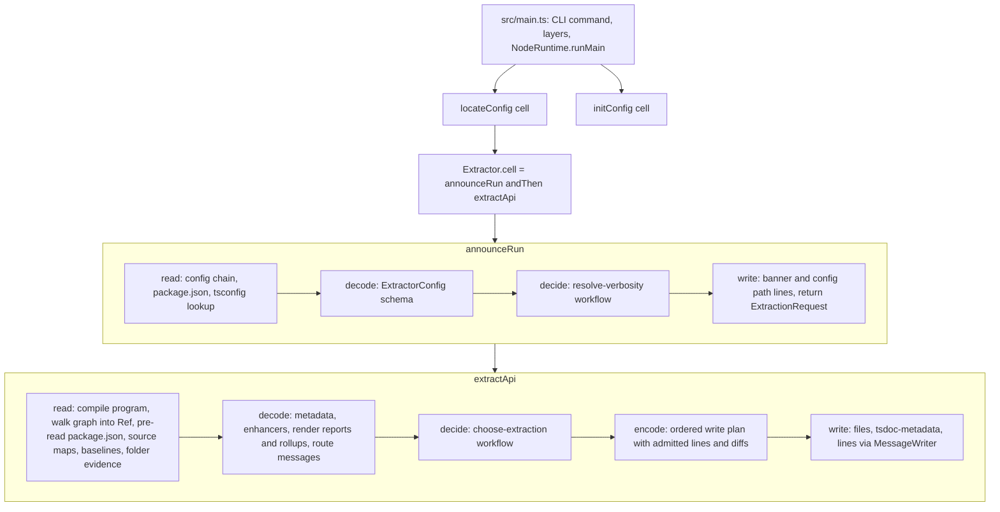

# Owned Effect-Native API Extractor on Current Main - Plan

## Goal Capsule

- **Objective:** Any package in this repo can gate its API surface with an owned, published `@systemfsoftware/api-extractor` that reads its existing `api-extractor.json` unchanged, reproduces the reports upstream `@microsoft/api-extractor@7.59.1` produces byte for byte, rolls namespace barrels into `.d.ts` files that compile, and prints nothing on a clean `--quiet` run.
- **Means:** re-author the package on a fresh branch from current main, porting upstream's walker semantics into the pack-conforming cell architecture that PR #462's final tree proved out (KTD1, KTD2, KTD6).
- **Authority:** `compound-packs/` rule files > this plan's Requirements > KTDs > unit Approach text. Behavioral reference: upstream `microsoft/rushstack` at `bc4cd29cc4984cef267437565bf681582948285e` (`apps/api-extractor`, the commit npm `7.59.1` was published from). Parity oracle: the real `@microsoft/api-extractor@7.59.1` and the repo's committed `etc/*.api.md` baselines it produced.
- **Execution profile:** Deep; eleven units, dependency-ordered (U11 runs second); one pull request from branch `fork-api-extractor2` that supersedes PR #462.
- **Stop conditions:** a workspace config's report differs from its committed baseline and the difference cannot be traced to a fixable engine defect; a pack rule cannot be met without breaking R16; `@systemfsoftware/effect-cell-types` cannot express a needed phase (change that package per REPO-O1, never work around it); evidence that a session-settled decision cannot work.
- **Finish and ship:** `ce-work` implements; the lfg pipeline simplifies, reviews, commits, pushes, opens the PR, and watches CI to decided.

---

## Product Contract

**Product Contract preservation:** changed: R2 gate names re-pointed to current main's gate set (`dts:check` and `test:e2e` have no live convention); R7 qualified to the published dependency set so the upstream package may serve as a devDependency oracle (KTD8). R1, R3–R6, R8–R16, F1, F2, AE1–AE3, KD1–KD6 carried unchanged from origin. R17–R29 are new: R17–R23 bind the pack-conformance law the origin's later lineages made mandatory, R24–R29 close PR #462's unresolved review findings. R25 and R26 deliberately re-enter work the origin's second lineage deferred (`overrideTsconfig` wiring and `tsdoc-metadata.json` writing), because #462's review left both open.

### Summary

Land `packages/api-extractor` as a single clean change on current main. The package keeps the product the origin plan defined: 1:1 config compatibility, byte-identical reports, valid namespace rollups, native quiet mode, and no `@rushstack/*` runtime code. It keeps the architecture #462 converged on: composed Sandwich cells over an immutable analysis graph, pure decision workflows, one `Extractor` namespace. It also fixes what #462 left open: the self-hosted gate runs in verification mode, `compiler.overrideTsconfig` reaches the compiler, `tsdoc-metadata.json` is written by default, and the parity oracle becomes a committed test lane.

### Problem Frame

Upstream `@microsoft/api-extractor` cannot roll up `export * as X` namespace barrels, so the atom family ships with `dtsRollup` disabled (the AT1 blocker the origin plan names). It drags in the Rushstack runtime (`node-core-library`, `terminal`, `ts-command-line`, `rig-package`), and it has no quiet mode, which is why 30 packages route `api:check` through the `api-extractor-quiet` shim in `packages/toolchain/tsdown-config/src/api-extractor-quiet.ts`.

PR #462 built the replacement, but across 70 commits it rewrote the engine three times, merged main four times, and fell behind main's gates: `@systemfsoftware/vitest` no longer exports `expect` (#517), conformance runs in its own vitest project (#526), packages moved into family folders (#532), gritlint enforces export-map and tsconfig conventions (#539), and schemas carry their own refusal rules (#547). Its merge state is dirty and its history records abandoned designs. Its review left five findings unresolved, including a self-hosted gate that can never fail.

### Key Decisions

- KD1. **Independent workspace package at `packages/api-extractor`.** (session-settled: user-directed — chosen over a vendored subtree or a toolchain-internal module: owned outright per REPO-O1 as a published package.) Governs R1, R2.
- KD2. **Deep Effect-native overhaul.** (session-settled: user-directed — chosen over a shallow wrapper around the upstream walker: analysis, generation, and I/O run as typed Effect workflows and services.) Governs R3–R6, R17–R23.
- KD3. **Sever every `@rushstack/*` dependency.** (session-settled: user-directed — chosen over depending on published Rushstack libraries: Effect platform and Node built-ins replace them.) Governs R7, R8.
- KD4. **1:1 `api-extractor.json` compatibility.** (session-settled: user-directed — chosen over a breaking schema rewrite: existing configs run without migration.) Governs R9, R10, R16.
- KD5. **Native `--quiet` flag and `"quiet"` config property.** Obsoletes the `api-extractor-quiet` shim. Governs R11, R12.
- KD6. **Native namespace barrel rollup.** `export * as X` produces standalone, compilable declarations. Governs R13–R15.
- KD7. **Full compound-pack conformance across the whole package.** (session-settled: user-directed — chosen over conforming only the orchestration layer: every file obeys `cell-architecture`, `boundary-testing`, and `schema-laws`.) Governs R17–R23.
- KD8. **No interpretation edge inside the engine.** (session-settled: user-directed — chosen over keeping synchronous `runSync` emission edges behind a pinned invariant: the user judged that exception slop.) Governs R17.
- KD9. **Artifact parity is non-negotiable; breaking public API is allowed.** Reports and non-namespace rollups stay byte-identical to upstream, and namespace rollups compile (R14); the package's own API may change freely while pre-1.0 (REPO-R1). Governs R16, R20.

### Requirements

**Packaging and monorepo integration**

- R1. The package lives at `packages/api-extractor`, publishes as `@systemfsoftware/api-extractor`, and ships an `api-extractor` binary plus an Effect-based programmatic entry point.
- R2. The package builds with tsdown and passes `typecheck`, `lint`, `test`, `attw`, `api:check`, gritlint, and every other gate `pnpm check:local` runs.

**Effect architecture and dependency severance**

- R3. File system and path access use Effect's `FileSystem` and `Path` services, bound to `@effect/platform-node` layers only at the composition root.
- R4. CLI parsing uses Effect's CLI module (`effect/unstable/cli`).
- R5. Terminal output goes through an Effect service with a console driver; no Rushstack terminal code.
- R6. Configuration, compiler, and analysis failures are typed tagged errors on the error channel; broken internal invariants are one tagged defect class.
- R7. `dependencies` and `peerDependencies` in `packages/api-extractor/package.json` name no `@rushstack/*` or `@microsoft/api-extractor*` package, and no source file under `src/` imports one.
- R8. Rig configuration lookup is dropped; `extends` resolves through relative paths and Node package resolution.

**Configuration and backward compatibility**

- R9. The loader accepts `api-extractor.json` files valid against upstream schema v7, including `<projectFolder>`, `<lookup>`, `<packageName>`, `<unscopedPackageName>` tokens and `extends` chains.
- R10. Every committed `api-extractor*.json` in the workspace runs against the engine without modification or schema error.
- R11. The config schema accepts an optional root-level boolean `"quiet"`.
- R12. The CLI accepts `--quiet` and `-q`; under quiet, a clean run prints nothing, and warnings, errors, and diagnostics still print.

**Analysis and rollup generation**

- R13. The analyzer represents `export * as Name from './module'`, including nested namespaces and star exports inside a namespaced module, without dropping declarations.
- R14. The rollup generator emits namespace exports as declarations that compile under `tsc --noEmit`, including modules that import their own namespace back from the entry point.
- R15. The rollup generator honors `untrimmedFilePath`, `alphaTrimmedFilePath`, `betaTrimmedFilePath`, `publicTrimmedFilePath`, and `bundledPackages`.
- R16. For every input upstream 7.59.1 accepts, the engine's `*.api.md` report variants are byte-identical to upstream's.

**Pack conformance**

- R17. `src/` contains no `Effect.runSync`, `Effect.runPromise`, `Effect.runFork`, or `Effect.orDie`; the only interpretation edge is the CLI entry module. (pack: cell-architecture, sandwich-phase-order.md)
- R18. Every outside interaction is a Sandwich cell; cells compose with `Cell.andThen`, never by calling another cell's `run`. (pack: cell-architecture, pipeline-composition.md)
- R19. Every decision (config location, config template, config merge, verbosity, message routing, report outcomes) is a `Workflow.make` workflow with a Schema command, a tagged decision union, and no control-flow keywords. (pack: cell-architecture, pure-decision-workflows.md)
- R20. The package root exports exactly one namespace, `Extractor`, and every type its exported values mention is reachable from it. (pack: cell-architecture, single-namespace-barrel.md)
- R21. Services live in `*.service.ts` files with no driver imports; drivers export parameterized `layer` values; layers are bound only in the CLI entry module. (pack: cell-architecture, service-and-layer-boundaries.md; pack: cell-architecture, ports-separate-from-layers.md)
- R22. External data (config JSON, `package.json`, source maps, the TypeScript module) is decoded or guarded, never cast; no module-level mutable state and no untagged `throw` remain in `src/`. (pack: cell-architecture, decode-never-cast.md; pack: cell-architecture, handle-state-privacy.md)
- R23. Every exported schema passes its generated codec laws, and every refined schema states its refusal boundary beside them. (pack: schema-laws, refusals-beside-generated-laws.md; pack: schema-laws, law-failure-is-a-codec-defect.md)

**Closing PR #462's residual findings**

- R24. The package's own `api:check` runs its built CLI in verification mode, so drift in `etc/api-extractor.api.md` fails the gate.
- R25. `compiler.overrideTsconfig`, when present, is the compiler configuration, and `tsconfigFilePath` is not read.
- R26. With `tsdocMetadata.enabled` true (upstream's default), the engine writes `tsdoc-metadata.json` to the configured or default path with upstream's content shape, naming this package as the tool.
- R27. A config with `docModel.enabled: true` fails with a typed refusal naming the unsupported feature, instead of being silently ignored.
- R28. A committed differential test runs the engine and the real upstream package, in process, over the fixture corpus and over generated declaration packages, and fails on any byte difference in reports or non-namespace rollups. (pack: boundary-testing, pin-dependency-semantics.md)
- R29. Journeys over the packed tarball, installed into a scratch project, prove `--help`, a clean `--quiet` run, and a drifted run's exit code; the journey script fails when it runs fewer journeys than it declares.

### Key Flows

- F1. Quiet extraction in a workspace build
  - **Trigger:** a package script runs `api-extractor run --quiet`, or `api-extractor run` with `"quiet": true`.
  - **Steps:** locate and load the config chain; decide verbosity; compile and analyze; render reports and rollups; decide each report's outcome; write files and admitted lines; exit.
  - **Outcome:** a clean run prints nothing and exits 0.
  - **Covered by:** R4, R11, R12, R16.
- F2. Namespace barrel rollup
  - **Trigger:** an entry point contains `export * as Atom from './Atom.js'` and sibling modules import `Atom` back from the entry.
  - **Steps:** the analyzer records the namespace export; the collector maps member symbols; the rollup generator hoists aliases and emits the namespace block.
  - **Outcome:** the rollup compiles under `tsc --noEmit`.
  - **Covered by:** R13, R14, R15.

### Acceptance Examples

- AE1. Built-in quiet execution
  - **Covers:** R11, R12
  - **Given:** a clean package whose `api-extractor.json` sets `"quiet": true`.
  - **When:** `api-extractor run` runs.
  - **Then:** exit code 0 and empty stdout.
- AE2. Failure output under quiet
  - **Covers:** R12, R16
  - **Given:** a package whose `etc/<package>.api.md` no longer matches the source, run without `--local`.
  - **When:** `api-extractor run --quiet` runs.
  - **Then:** the out-of-date report warning prints and the exit code is non-zero.
- AE3. Namespace barrel compilation
  - **Covers:** R13, R14
  - **Given:** a package with `export * as MyNamespace from './submodule.js'` and `dtsRollup.enabled: true`.
  - **When:** `api-extractor run` writes the rollup.
  - **Then:** `tsc --noEmit` over the rollup reports zero errors.

### Success Criteria

- Every committed workspace `api-extractor*.json` config outside `repos/` and test fixtures (34 today, across 30 packages), run through the built engine in verification mode after a workspace build, exits 0 and leaves `git status` clean.
- `etc/api-extractor.api.md` hashes identically across repeated clean builds and carries no `ae-forgotten-export` warning.

### Scope Boundaries

#### Deferred for later

- Switching the 30 consumer packages' `api:check` scripts to the engine, and moving their manifests off `@microsoft/api-extractor`.
- Deleting `packages/toolchain/tsdown-config/src/api-extractor-quiet.ts` after that switch.
- Re-enabling `dtsRollup` on `packages/atom` entry points (AT1) once AE3 holds on that topology.
- Writing the docModel `.api.json` file and publishing a separate `api-extractor-model` package.

#### Outside this product's identity

- Replacing TypeScript's parser or checker with another compiler; semantic analysis stays on the TypeScript compiler API.
- Becoming a general-purpose bundler or minifier.

#### Deferred to Follow-Up Work

- Vendoring `microsoft/rushstack` under `repos/` via `subtrees.toml`; this plan cites the pinned commit instead.

---

## Planning Contract

### Key Technical Decisions

- KTD1. **Fresh branch from current main, new plan, new history.** Work lands on `fork-api-extractor2`, cut from `origin/main`, with commits per unit; PR #462's branch is never merged or rebased in, and the new PR states that it supersedes #462. (session-settled: user-directed — chosen over merging main into or rebasing PR #462's 70-commit branch: the user asked to restart the PR from scratch.)
- KTD2. **PR #462's final tree is the architecture reference, upstream is the behavior reference, and neither is copied blind.** Each unit re-authors its files against current main's gates, reading the matching #462 module (`packages/api-extractor/` at `590d0535d4d`) for the proven shape and upstream `bc4cd29` for the algorithm. A porting from upstream alone was rejected because #462 already paid for the immutable-graph design, the namespace aliaser, and the upstream-minted goldens, and no audit found a defect in that design. Copying #462 wholesale was rejected because every test file breaks on main (#517, #526) and the tree carries known defects: a phantom error channel on `MessageWriter.write`, 16+ `ae-forgotten-export` leaks in its own report, vitest inlined into `dist/`, a license notice copied from another package, and the five residual findings R24–R28 close.
- KTD3. **Pin to the commit npm 7.59.1 was published from.** `bc4cd29` carries `@microsoft/tsdoc ~0.16.0` and `@microsoft/tsdoc-config ~0.18.1`, the versions inside the tarball that produced every committed baseline; the engine pins the same. #462 took `~0.17.0` from a later commit that did not change the version number; that drift is corrected here.
- KTD4. **Analysis runs on a bundled `typescript@5.9.3`.** The engine declares it as a regular dependency, as upstream does, and `typescriptCompilerFolder` supplies lib typings only. The consumer's compiler was rejected because building the program on one compiler and analyzing on another broke symbol identity on #462; tsgo 7 was rejected because its `typescript` package exposes no compiler API and its lib set diverges from the baselines.
- KTD5. **CLI mirrors upstream's flags on `effect/unstable/cli`.** `run` takes `--config/-c`, `--local/-l`, `--verbose/-v`, `--diagnostics`, `--typescript-compiler-folder`, `--print-api-report-diff`, plus the new `--quiet/-q`; `init` creates the template; the root takes `--debug/-d`. Verbosity precedence is `--diagnostics` > `--verbose` > `--quiet` > config `"quiet"` > default. The module is `repos/effect/packages/effect/src/unstable/cli/` at the catalog pin `4.0.0-rc.117`.
- KTD6. **Four cells over an immutable graph.** `locateConfig`, `announceRun`, `extractApi`, and `initConfig` are Sandwich cells; `Extractor.cell` is `announceRun` composed with `extractApi` through `Cell.andThen`. `extractApi`'s read phase compiles the program and walks the checker into an id-keyed graph threaded through a `Ref`; decode renders and routes messages; decide is the report-outcome workflow; encode builds an ordered write plan; write executes it. The graph keys, record shapes, pure renderers, and message model follow #462's lineage-3 decisions D1–D10 (graph keyed by `ts.getSymbolId`/`ts.getNodeId`, never by compiler objects, because Effect v4 hashes plain objects structurally). The report-outcome truth table and pass rule follow upstream `Extractor.ts:371-447`.
- KTD7. **Written types on every exported composed value.** `Extractor.cell` and every other exported value built by a combinator carry a written annotation, and every type those annotations name is exported through the namespace. An inferred composed error union prints its members in checker order, which changed the self-hosted report between identical builds on #462.
- KTD8. **The upstream package is the differential oracle, as a devDependency only.** `tests/upstream-parity.differential.test.ts` calls upstream's programmatic `Extractor.invoke` and the engine's `Extractor.run` in process, each on its own temp copy of the input, and compares every emitted report and non-namespace rollup byte for byte. Inputs are the fixture corpus plus packages drawn from a bounded declaration grammar (interfaces, type aliases, functions, classes, enums, consts, namespaces, release tags, doc comments, re-exports across two modules, a forgotten export), generated constructively. Namespace-barrel inputs, where upstream throws, are judged by an in-process compiler-API `noEmit` check instead. Fixed fixtures alone would check only hand-picked points; the generated packages probe the grammar the author did not enumerate. This makes R16 a standing contract that re-fires when either side changes, and it is why R7 names the published dependency set. (pack: boundary-testing, pin-dependency-semantics.md)
- KTD9. **The self-hosted gate uses the built artifact in verification mode.** `api:check` runs `node dist/main.mjs run --quiet`; `api:update` adds `--local`; once the engine runs end to end (U10), `build` becomes `tsdown -l warn && pnpm api:check`, matching `packages/effect-microsandbox/package.json`; before that `build` is `tsdown -l warn` so every intermediate unit commits green. The binary is invoked by path because a package cannot depend on itself: turbo rejects the self edge and pnpm links no `.bin` shim.
- KTD10. **`tsdoc-metadata.json` is a write-plan step; docModel is a decode-time refusal.** The metadata file joins the write plan when `tsdocMetadata.enabled` resolves true, at `tsdocMetadataFilePath` or upstream's `<lookup>` default beside `package.json#types`. `docModel.enabled: true` fails decode with a tagged error, because emitting `.api.json` requires the api-extractor-model tree this plan defers.
- KTD11. **Test lanes follow the placement law.** Workflow properties live only in `src/__tests__/<stem>.workflow.property.test.ts`; generated schema laws in `src/schema-laws.test.ts` via `inlineSchemaTests()`; refusal properties in in-source blocks inside each refined schema's file; behavior through the `Extractor` namespace in `tests/*.integration.test.ts` Gherkin features against temp copies of fixtures; parity in the differential lane (KTD8); the shipped binary in two to four packed-install journeys run by `smoke:journey`. Checks come from the test callback (#517), never an imported `expect`. No test spawns a process except the journey script, no test imports an internal module, and no lane exists without a subject it alone can observe: a conformance lane is refused (extraction is not a stateful system judged against a model), a separate TypeScript pin is refused (the upstream differential already re-fires on a compiler change), and golden-file parity tests for inputs upstream accepts are refused (the live upstream run is the oracle). (pack: boundary-testing, no-mocks-on-internal-glue.md; pack: boundary-testing, real-system-oracles.md)
- KTD12. **Build shape copies the exemplar.** Entries are `mod` (`src/mod.ts`, the namespace barrel) and `main` (`src/main.ts`, the CLI edge); `define: { 'import.meta.vitest': 'undefined' }` strips in-source tests so no test runtime reaches `dist/`; runtime libraries are externalized as `dependencies`, workspace helpers used only at build time stay `devDependencies`. The pattern is `packages/effect-microsandbox/tsdown.config.ts`.
- KTD13. **Mutation enrollment covers the pure workflows.** `stryker.config.ts` mutates `src/**/*.workflow.ts` through `shardMutate`, so each shard fits the Mutation workflow's 900-second job budget; the walker and renderers are judged by the parity lanes instead. Mutation runs only in CI (REPO-D3).

### High-Level Technical Design

Pipeline across the cells:



Report outcome per variant (the choose-extraction contract):

| Baseline | Equivalent | Report folder | Local | Outcome                | Console effect            |
| -------- | ---------- | ------------- | ----- | ---------------------- | ------------------------- |
| present  | yes        | any           | any   | `ReportUnchanged`      | verbose line              |
| present  | no         | any           | no    | `ReportDriftRefused`   | warning, report untouched |
| present  | no         | any           | yes   | `ReportUpdated`        | warning, report rewritten |
| absent   | n/a        | any           | no    | `ReportMissingRefused` | warning                   |
| absent   | n/a        | present       | yes   | `ReportCreated`        | warning, report written   |
| absent   | n/a        | absent        | yes   | `ReportFolderMissing`  | error                     |

Pass rule: a local run passes when errors are zero; a verification run passes when errors and warnings are both zero, counted over routed console messages plus report-outcome lines, including one diff warning per drifted report when `--print-api-report-diff` is set.

### Output Structure

```text
packages/api-extractor/
  package.json, tsdown.config.ts, turbo.json, stryker.config.ts
  tsconfig.json, tsconfig.app.json, tsconfig.build.json, tsconfig.node.json, tsconfig.test.json, tsconfig.api.json
  api-extractor.json, oxlint.config.ts, vitest.config.ts, .attw.json
  AGENTS.md, README.md, LICENSE
  etc/api-extractor.api.md
  examples/cli-journey.ts
  src/
    mod.ts, main.ts
    Extractor/mod.ts
    *.cell.ts, *.workflow.ts, *.schema.ts, *.service.ts
    drivers/
    config/, compiler/, analyzer/, collector/, generators/, model/, errors/
    __tests__/*.workflow.property.test.ts
    schema-laws.test.ts
  tests/
    upstream-parity.differential.test.ts, *.integration.test.ts
    __fixtures__/
```

### Assumptions

- The restart keeps #462's product scope and adds its residual findings (R24–R29); switching consumers stays deferred, as #462 deferred it.
- PR #462 is closed with a comment linking the new PR once the new PR is open; closing is reversible.
- Upstream source is read from a scratch clone of `microsoft/rushstack` at `bc4cd29`; every citation names that commit so the clone is disposable.
- The committed consumer baselines were produced by npm `7.59.1` with `@microsoft/tsdoc 0.16.x`, so matching those pins is what byte parity needs.
- The `smoke:journey` turbo task pattern from `packages/effect-microsandbox/turbo.json` is the right home for the packed-install journeys; the root `check:local` does not run it, so the Verification Contract runs it explicitly. Installing the tarball resolves its dependencies from the registry or the local pnpm store.
- `LICENSE` is Apache-2.0 for the package with a third-party notice reproducing the upstream MIT notice from `microsoft/rushstack`.

### Risks

| Risk                                                                                                               | Mitigation                                                                                                                                                                        |
| ------------------------------------------------------------------------------------------------------------------ | --------------------------------------------------------------------------------------------------------------------------------------------------------------------------------- |
| The walker port silently drops or reorders a message, changing counts and exit codes                               | Differential oracle (KTD8) and the conformance corpus run every fixture against upstream output; the workspace corpus run in the Verification Contract covers all 30 real configs |
| Symbol-identity or ordering drift between upstream's mutable walker and the immutable graph                        | The walk keeps upstream's call order (memoize on first fetch, same recursion order); goldens minted by upstream catch ordering changes                                            |
| Self-hosted report changes between identical builds                                                                | KTD7 written annotations; the determinism check in the Verification Contract builds twice and compares hashes                                                                     |
| The changeset guard demands intents for packages whose build hash moves because of lockfile or `dprint.json` edits | Run the guard before pushing and add a `none` intent listing each affected package                                                                                                |
| `effect-cell-types` cannot express a phase the cells need                                                          | Change `effect-cell-types` in the same PR under its own changeset (REPO-O1), never sequence cells by hand                                                                         |
| Upstream's in-process run is slow enough to stretch the test lane                                                  | Generated-input runs take the repo's property budget profile, never a literal run count; the fixture corpus stays at #462's size                                                  |
| The packed-install journey cannot resolve dependencies offline                                                     | It runs only in `smoke:journey`, outside `check:local`, and reports the install failure as a journey failure, never a skip                                                        |

---

## Implementation Units

| U-ID | Title                             | Key files                                                                                                                       | Depends on      |
| ---- | --------------------------------- | ------------------------------------------------------------------------------------------------------------------------------- | --------------- |
| U1   | Package scaffold and gates        | `packages/api-extractor/{package.json,tsdown.config.ts,tsconfig*.json,turbo.json}`                                              | none            |
| U11  | Oracle harness and fixture corpus | `tests/upstream-parity.differential.test.ts`, `tests/__fixtures__/parity/`, `tests/__fixtures__/declaration-package.fixture.ts` | U1              |
| U2   | Error union, services, drivers    | `src/errors/`, `src/*.service.ts`, `src/drivers/`                                                                               | U1              |
| U3   | Configuration                     | `src/config/`, `src/*config*.workflow.ts`, `src/locate-config.cell.ts`, `src/init-config.cell.ts`                               | U2              |
| U4   | Messages and verbosity            | `src/collector/message-*.ts`, `src/collector/*.workflow.ts`                                                                     | U2              |
| U5   | Compiler and analysis graph       | `src/compiler/`, `src/analyzer/graph/`                                                                                          | U3, U4          |
| U6   | Collector and enhancers           | `src/analyzer/collect/`                                                                                                         | U5              |
| U7   | Renderers and namespace rollup    | `src/generators/`                                                                                                               | U6              |
| U8   | Cells, namespace, CLI             | `src/*.cell.ts`, `src/choose-extraction.workflow.ts`, `src/Extractor/mod.ts`, `src/mod.ts`, `src/main.ts`                       | U3, U4, U7, U11 |
| U9   | Behavior features and journeys    | `tests/*.integration.test.ts`, `examples/cli-journey.ts`, `vitest.config.ts`                                                    | U8              |
| U10  | Self-host, docs, release          | `api-extractor.json`, `etc/api-extractor.api.md`, `AGENTS.md`, `README.md`, `.changeset/`                                       | U9              |

Execution order: U1, U11, U2, then U3 and U4, then U5–U10. U11 comes second so the upstream side of the oracle and the fixture corpus exist before any walker code is written.

### U1. Package scaffold and gates

- **Goal:** `packages/api-extractor` exists with the exemplar's full config set and passes every structural gate before any engine code lands.
- **Requirements:** R1, R2, R7; KTD9, KTD12, KTD13.
- **Dependencies:** none.
- **Files:** `packages/api-extractor/package.json`, `tsdown.config.ts`, `turbo.json`, `stryker.config.ts`, `tsconfig.json`, `tsconfig.app.json`, `tsconfig.build.json`, `tsconfig.node.json`, `tsconfig.test.json`, `tsconfig.api.json`, `oxlint.config.ts`, `vitest.config.ts`, `.attw.json`, `LICENSE`, `src/mod.ts`, `src/main.ts`, `dprint.json`, `pnpm-lock.yaml`.
- **Approach:**
  1. Mirror `packages/effect-microsandbox` for `files`, `exports` with the `@systemfsoftware/source` condition, `publishConfig` (`access`, `provenance`, per-subpath `{types, default}`), `repository.url`, and scripts, so the gritlint `source-resolution`, `typecheck-build-mode`, and `npm-provenance` packs pass; `build` is `tsdown -l warn` until U10 (KTD9).
  2. Declare `bin: { "api-extractor": "./dist/main.mjs" }` and the `mod` and `main` entries (KTD12).
  3. Dependencies: `effect`, `@effect/platform-node`, `@systemfsoftware/effect-cell-types`, `typescript@5.9.3`, `@microsoft/tsdoc ~0.16.0`, `@microsoft/tsdoc-config ~0.18.1`, `diff`, `minimatch`, `semver`, `source-map` at upstream's ranges (KTD3, KTD4); devDependencies include `@microsoft/api-extractor` pinned exactly to `7.59.1`, not the catalog range, for the oracle only (KTD8).
  4. `tsconfig.api.json` carries `"customConditions": []` and includes `dist/mod.d.ts`; `tsconfig.node.json` includes every root config file so the project-membership guard passes.
  5. `turbo.json` extends the root and adds `smoke:journey` (depends on `build`, uncached); `stryker.config.ts` follows KTD13.
  6. Add the fixtures glob to `dprint.json` excludes so fixture inputs stay byte-stable.
  7. `LICENSE` reproduces the upstream MIT notice (see Assumptions).
- **Patterns to follow:** `packages/effect-microsandbox/{package.json,tsdown.config.ts,tsconfig.*.json,stryker.config.ts,turbo.json,vitest.config.ts}`; `packs/source-resolution/rules/api-extractor-tsconfig.md`.
- **Test scenarios:** Test expectation: none -- packaging scaffold; the gates in Verification prove it.
- **Verification:** `pnpm install` resolves; package `typecheck`, `lint`, and gritlint pass on the stub entries; the project-membership guard passes.

### U2. Error union, services, drivers

- **Goal:** the error channel's shape and every I/O capability have their typed homes before porting starts.
- **Requirements:** R3, R5, R6, R21, R22, R23; KTD6.
- **Dependencies:** U1.
- **Files:** `src/errors/internal-invariant.schema.ts`, `src/errors/extractor-error.schema.ts`, `src/message-writer.service.ts`, `src/typescript-compiler.service.ts`, `src/drivers/console-message-writer.ts`, `src/drivers/typescript-compiler.ts`, `src/errors/compiler.schema.ts`.
- **Approach:**
  1. `ExtractorError` is a closed `Schema.Union` module that each later unit extends with the `Schema.TaggedError` variants it produces (config variants in U3, analysis variants in U5), so no variant exists without a producer; this unit adds only the compiler-load variant its driver raises. Variants that wrap a thrown value carry `cause: Schema.optional(Schema.Unknown)`. `InternalInvariantError` is the one defect class.
  2. `MessageWriter.write` has an error channel only if the driver can fail; the console driver's `layer(options?)` takes optional stdout and stderr streams (info and verbose to stdout, warnings and errors to stderr).
  3. The TypeScript compiler port loads the bundled compiler and, when `typescriptCompilerFolder` is set, only its lib folder, guarded structurally (R22, KTD4).
- **Patterns to follow:** #462 `src/errors/*.schema.ts`, `src/message-writer.service.ts`, `src/drivers/`; `packages/effect-microsandbox/src/MicroVMError.schema.ts`; `docs/solutions/architecture-patterns/workflow-error-channel-gates.md`.
- **Test scenarios:**
  - Generated codec laws pass for every exported error schema.
  - A `typescriptCompilerFolder` with no TypeScript lib folder fails the run with the compiler-load error, not a defect (exercised through `Extractor.run` in U9).
- **Verification:** no `throw new Error` or `as unknown as` in `src/`; typecheck and lint pass.

### U3. Configuration

- **Goal:** load, merge, expand, and validate any upstream-valid `api-extractor.json` exactly as upstream resolves it, plus `"quiet"`.
- **Requirements:** R8, R9, R10, R11, R19, R22, R23, R25, R27; KTD5, KTD10.
- **Dependencies:** U2.
- **Files:** `src/config/api-extractor.schema.json`, `src/config/api-extractor-defaults.json`, `src/config/extractor-config.schema.ts`, `src/config/extractor-config.ts`, `src/config/tokens.ts`, `src/config/merge-config.workflow.ts`, `src/errors/config.schema.ts`, `src/resolve-config-location.workflow.ts`, `src/resolve-config-template.workflow.ts`, `src/locate-config.cell.ts`, `src/init-config.cell.ts`, `src/__tests__/merge-config.workflow.property.test.ts`, `src/__tests__/resolve-config-location.workflow.property.test.ts`, `src/__tests__/resolve-config-template.workflow.property.test.ts`.
- **Approach:**
  1. Vendor the schema and defaults JSON from upstream `bc4cd29` `apps/api-extractor/src/schemas/`, adding the root `"quiet"` boolean.
  2. The upstream config JSON is the Encoded side and decodes into a rich `ExtractorConfig` type (pack: schema-laws, rich-type-over-foreign-encoded.md); enums (`newlineKind`, report variants, log levels) are refined literals with refusal properties.
  3. The extends walk reads files in a read phase; the merge is a fold where arrays replace and objects merge key by key, matching upstream `ExtractorConfig.ts`; a revisited file is the circular-extends error.
  4. Token expansion is pure; an unknown `<token>` is the unresolved-token error naming it; `<lookup>` walks up for `package.json` as upstream does.
  5. `overrideTsconfig` survives decode intact and reaches the compiler in U5 (R25); `docModel.enabled: true` fails decode (R27, KTD10).
  6. Config search walks up from the working folder trying `config/api-extractor.json` then `api-extractor.json`; the not-found error names the start folder and both candidate names.
- **Patterns to follow:** #462 `src/config/`, `src/locate-config.cell.ts`, `src/init-config.cell.ts`, and the three workflows; upstream `apps/api-extractor/src/api/ExtractorConfig.ts`; `docs/solutions/logic-errors/sandwich-read-must-not-validate-what-decode-rejects.md` (build read-phase classes with checks disabled).
- **Test scenarios:**
  - Property: the merge fold is associative, and a derived value replaces the base value key by key while untouched base keys survive.
  - Property: config location picks the first existing candidate walking upward and reports not-located only when no ancestor holds either name.
  - Property: the template decision creates when the target is free and refuses when it is occupied.
  - Refusal: `newlineKind: "bogus"`, `apiReport.reportVariants: ["internal"]`, and a `messages` rule with `logLevel: "loud"` each fail schema validation (in-source blocks beside the schemas).
  - Integration (U9 feature): missing config, invalid JSON, circular `extends`, unresolved `<token>`, and `docModel.enabled: true` each fail with their tagged error (not found, JSON syntax, circular extends, unresolved token, unsupported feature, all declared in `src/errors/config.schema.ts`).
  - Differential (U11): a `<lookup>` plus one-level `extends` fixture produces the same reports as upstream.
- **Verification:** colocated properties pass; every committed workspace config decodes (checked in U10's corpus run).

### U4. Messages and verbosity

- **Goal:** messages are immutable data routed by pure workflows, and quiet is a routing decision made before any text is formatted.
- **Requirements:** R12, R17, R19; KTD5.
- **Dependencies:** U2.
- **Files:** `src/collector/extractor-message.schema.ts`, `src/collector/message-log.ts`, `src/collector/route-extractor-message.workflow.ts`, `src/collector/resolve-verbosity.workflow.ts`, `src/collector/verbosity.schema.ts`, `src/__tests__/route-extractor-message.workflow.property.test.ts`, `src/__tests__/resolve-verbosity.workflow.property.test.ts`.
- **Approach:**
  1. `ExtractorMessage` carries id, category, text, raw position, and association; `MessageLog` is an immutable value (chunk plus association index plus handled set) inside the graph state.
  2. Routing reproduces upstream `MessageRouter`: explicit rule wins, category default otherwise, `none` suppresses, report-bound messages leave the console residue, associated messages follow upstream's handled-flag behavior across report variants.
  3. Verbosity follows KTD5's precedence; counts derive from routed residue, never from side effects.
- **Patterns to follow:** #462 `src/collector/{message-log,route-extractor-message.workflow,resolve-verbosity.workflow}.ts`; upstream `apps/api-extractor/src/collector/MessageRouter.ts`; `packages/effect-microsandbox/src/render-sandbox-plan.workflow.ts`.
- **Test scenarios:**
  - Property: for every message id and rule table, the routed destination equals upstream's lookup (explicit rule, then category default, then suppression for `none`).
  - Property: a message routed to a report never appears in the console residue, and every other message lands in exactly one of residue or suppressed.
  - Property: `--diagnostics` beats every other input, `--verbose` beats both quiet sources, the CLI flag beats config, config beats default.
- **Verification:** the two workflow files contain no control-flow keywords; properties pass.

### U5. Compiler and analysis graph

- **Goal:** build the program on the bundled compiler and walk it into the immutable, id-keyed graph with upstream's traversal order.
- **Requirements:** R13, R16, R17, R22, R25; KTD4, KTD6.
- **Dependencies:** U3, U4.
- **Files:** `src/compiler/typescript-program.ts`, `src/errors/analysis.schema.ts`, `src/analyzer/typescript-internal.d.ts`, `src/analyzer/TypeScriptHelpers.ts`, `src/analyzer/TypeScriptInternals.ts`, `src/analyzer/SyntaxHelpers.ts`, `src/analyzer/SourceFileLocationFormatter.ts`, `src/analyzer/graph/` (ast-symbol, ast-declaration, ast-entity, ast-import, ast-module, ast-namespace-import, ast-symbol-table, ast-reference-resolver, export-analyzer, analysis-graph, analyze-graph, package-index, package-metadata, working-package).
- **Approach:**
  1. Program options come from `overrideTsconfig` when present, else from reading `tsconfigFilePath` (R25); an unreadable tsconfig or a missing main entry point is a typed error, never `Effect.die`.
  2. The walker is Effect code over a `Ref` holding the graph, with `Match`-only control flow and no I/O imports; it keeps upstream's memoize-on-first-fetch and recursion order because output order depends on it.
  3. `export * as` and star exports resolve through the target module's export table; a member that cannot be enumerated is the unsupported-star-export error.
  4. `package.json` lookups and source maps are pre-read in the read phase and handed to pure code as indexes.
- **Patterns to follow:** #462 `src/compiler/typescript-program.ts` and `src/analyzer/`; upstream `apps/api-extractor/src/analyzer/{AstSymbolTable,ExportAnalyzer,AstReferenceResolver,PackageMetadataManager}.ts`.
- **Test scenarios:**
  - Integration (U9 feature): a fixture whose `overrideTsconfig` is set and whose `tsconfigFilePath` points at a missing file extracts successfully; with both present, `overrideTsconfig` wins.
  - Integration (U9 feature): a missing `mainEntryPointFilePath` and an unreadable tsconfig each fail with their tagged error and a message line, never a defect trace.
  - Differential (U11): the forgotten-export, ambient, global-reference, value-import-type, external-API, and external-star fixtures and the generated declaration packages report byte-identically to upstream.
- **Verification:** no `Effect` interpretation, `as` cast, or mutable collection in `src/analyzer/**`; typecheck and lint pass; the U11 characterization record is unchanged (the differential lane judges this unit's output once U8 wires the engine side).

### U6. Collector and enhancers

- **Goal:** entities, metadata, doc-comment enhancement, and validation are pure folds over the graph that append messages.
- **Requirements:** R6, R16, R22; KTD6.
- **Dependencies:** U5.
- **Files:** `src/analyzer/collect/` (collect-analysis, collector-entity, api-item-metadata, symbol-metadata, declaration-metadata, metadata-ensure, package-doc-comment, doc-comment-enhancement, effective-doc-comment, enhancement-view, validation), `src/model/aedoc/`.
- **Approach:**
  1. Entity naming, release-tag resolution, and forgotten-export detection follow upstream `Collector.ts` and `CollectorEntity.ts`; `shouldInlineExport` ports unchanged.
  2. TSDoc configuration is per-run state inside the analysis snapshot, not a module variable.
  3. Enhancers return new metadata maps and appended messages; tsdoc mutation that only fed the docModel is not ported.
- **Patterns to follow:** #462 `src/analyzer/collect/`; upstream `apps/api-extractor/src/collector/` and `src/enhancers/`.
- **Test scenarios:**
  - Differential (U11): the forgotten-export fixture's `ae-forgotten-export` line, at its configured level, matches upstream in the report and the console residue.
  - Differential (U11): a misplaced `@packageDocumentation` comment produces upstream's warning in the report and on the console.
- **Verification:** no module-level `let` in `src/`; typecheck and lint pass; the differential lane judges this unit's output once U8 lands.

### U7. Renderers and namespace rollup

- **Goal:** reports and rollups are pure functions of the snapshot; namespace barrels roll up validly while every other rollup matches upstream.
- **Requirements:** R13, R14, R15, R16; KTD6, KD6.
- **Dependencies:** U6.
- **Files:** `src/generators/span-tree.ts`, `src/generators/span-plan.ts`, `src/generators/render-span.ts`, `src/generators/text-writer.ts`, `src/generators/declaration-span-plan.ts`, `src/generators/api-report-generator.ts`, `src/generators/dts-rollup-generator.ts`, `src/generators/dts-emit-helpers.ts`, `src/generators/namespace-aliaser.ts`, `src/generators/tsdoc-metadata.ts`.
- **Approach:**
  1. Spans are an immutable tree plus a modification map keyed by node id; the text writer is an immutable value with a scoped-indent combinator.
  2. Report rendering keeps upstream's newline policy and whitespace-normalizing equivalence byte for byte.
  3. Namespace emission uses alias-lowering: a hoisted, uniquely named alias per member (`type` for type-only, `declare const` for value-only, both for classes and enums, `import =` for nested namespaces), then `export declare namespace Ns { export { … } }`; star-exported members come from the star module's export table.
  4. The `tsdoc-metadata.json` body mirrors upstream `PackageMetadataManager.writeTsdocMetadataFile` content, naming `@systemfsoftware/api-extractor` and its version as the tool (R26).
- **Patterns to follow:** #462 `src/generators/`; upstream `apps/api-extractor/src/generators/{ApiReportGenerator,DtsRollupGenerator}.ts`; rollup-plugin-dts `NamespaceFixer` strategy.
- **Test scenarios:**
  - Covers AE3. The `ae3` fixture (namespace barrel with a sibling back-import and type-only and value-only members) writes a rollup that the in-process compiler check accepts with zero diagnostics and that byte-matches its committed expected rollup (U9 feature).
  - Edge (U9 feature): a nested namespace export keeps its hierarchy instead of flattening into the root.
  - Edge (U9 feature): a star export inside a namespaced module enumerates members from the star module, or fails with the unsupported-star-export error.
  - Covers R15. Differential (U11): untrimmed, alpha, beta, and public rollups and `bundledPackages` inlining match upstream.
  - Covers R26. The `tsdoc-metadata.json` writer's output matches upstream's for the same input except for the tool name and version (U11 differential and U9 feature).
  - Differential (U11): complete, beta, and public report variants match upstream byte for byte.
- **Verification:** `src/generators/**` imports no `FileSystem` and builds no `Effect`; typecheck and lint pass; the namespace rollup feature and the differential lane judge the output once U8 lands.

### U8. Cells, namespace, CLI

- **Goal:** the run is the composed cell, the public surface is one namespace, and the CLI is the only place layers are bound and effects are run.
- **Requirements:** R1, R4, R12, R17, R18, R19, R20, R21, R26; KTD5, KTD6, KTD7, KTD10.
- **Dependencies:** U3, U4, U7, U11.
- **Files:** `src/announce-run.cell.ts`, `src/extract-api.cell.ts`, `src/choose-extraction.workflow.ts`, `src/extraction-request.schema.ts`, `src/write-plan.schema.ts`, `src/run-extractor.ts`, `src/Extractor/mod.ts`, `src/mod.ts`, `src/main.ts`, `src/cli/command.ts`, `src/cli/run-action.ts`, `src/cli/init-action.ts`, `src/version.ts`, `src/__tests__/choose-extraction.workflow.property.test.ts`.
- **Approach:**
  1. `announceRun`: read the config chain in its Encoded form; decode; decide verbosity; write admitted banner and config-path lines and return the extraction request.
  2. `extractApi`: read (program, graph, pre-read indexes, baseline and folder evidence per report variant); decode (renders, routed messages, the decide command); decide (`choose-extraction`, the truth table and pass rule in the High-Level Technical Design); encode (ordered write plan: lines, directory ensures, temp report writes, report writes, rollups, `tsdoc-metadata.json`); write.
  3. `Extractor.cell` carries a written type (KTD7); `Extractor.run` is its `run` property; the namespace exports the cell, run, request and outcome schemas, error union and variants, the service, the console driver `layer`, and `version`, and nothing else from internals.
  4. `src/main.ts` builds the command tree (KTD5), binds `NodeServices` and the drivers once, maps a failed outcome to exit 1 and a typed error to its message plus exit 1, and prints the full cause only under `--debug`.
- **Patterns to follow:** #462 `src/{announce-run,extract-api,init-config,locate-config}.cell.ts`, `src/run-extractor.ts`, `src/Extractor/mod.ts`, `src/cli/`; `packages/effect-microsandbox/src/boot-sandbox.cell.ts`; `docs/solutions/build-errors/sandwich-cell-portable-declaration-emit.md`.
- **Test scenarios:**
  - Property: each report outcome equals the truth-table row its evidence and local flag select.
  - Property: pass or fail equals the pass rule for every combination of residue counts, outcomes, and the diff flag.
  - Integration (U9 features): the extractor-flow scenarios listed in U9.
- **Verification:** `extractApi` exposes the five-phase tuple; `Layer` and `Effect.provide` appear only in `src/main.ts`; `src/mod.ts` is one namespace export line; the U11 differential lane is green for every input.

### U9. Behavior features and journeys

- **Goal:** each outside interaction's acceptance and refusal paths are proven through the `Extractor` namespace, and the shipped tarball is proven at its install seam.
- **Requirements:** R12, R14, R23, R25–R27, R29; KTD11.
- **Dependencies:** U8.
- **Files:** `vitest.config.ts`, `src/schema-laws.test.ts`, `tests/extractor-flow.integration.test.ts`, `tests/config-fixtures.integration.test.ts`, `tests/namespace-rollup.integration.test.ts`, `tests/__fixtures__/flow/`, `tests/__fixtures__/rollup/`, `examples/cli-journey.ts`.
- **Approach:**
  1. Every feature copies its fixture into a scoped temp directory and runs `Extractor.run` bound to the real console driver on in-memory streams; checks come from the step callback.
  2. Namespace rollup expected files come from #462's `tests/__fixtures__/rollup/` and are judged by an in-process compiler-API check, since upstream cannot produce them.
  3. U11's `tests/__fixtures__/parity/` corpus is reference data owned by U11; features that need a parity input copy it into their temp directory rather than editing it.
  4. `examples/cli-journey.ts` packs the package with lifecycle scripts disabled, installs the tarball into a scratch project, runs the installed bin on temp fixture copies, and asserts exit codes and streams.
  5. `vitest.config.ts` uses the shared config with the standard include set and the `inlineSchemaTests()` plugin.
- **Patterns to follow:** #462 `tests/extractor-flow.integration.test.ts`, `tests/config-fixtures.integration.test.ts`, `tests/namespace-rollup.integration.test.ts`; `packages/atom/effect-atom/tests/Result.integration.test.ts` for the callback-check idiom; `packages/effect-microsandbox/examples/boot-alpine.ts` and its `smoke:journey` script; `docs/solutions/build-errors/pack-lifecycle-hooks-mutate-dist-mid-gate.md`.
- **Test scenarios:**
  - Covers AE1. A clean fixture whose config sets `"quiet": true` returns a passed outcome with empty stdout.
  - Covers AE2. A drifted baseline in verification mode under `--quiet` returns a failed outcome, prints the out-of-date warning to stderr, and leaves the baseline untouched.
  - A drifted baseline in local mode returns a passed outcome and rewrites the baseline.
  - A missing baseline with a missing report folder in local mode returns a failed outcome with one error.
  - A verbose clean run writes banner, config path, compiler preamble, report lines, and footer to stdout in upstream order, and nothing to stderr.
  - Covers R25. The `overrideTsconfig` scenarios from U5.
  - Covers R26. A config with `tsdocMetadata` left at its default writes `tsdoc-metadata.json` whose content equals upstream's output for the same fixture except for the tool name and version.
  - Covers R27. `docModel.enabled: true` fails with the unsupported-feature error.
  - The config refusal battery from U3 and the compiler failures from U5.
  - Covers AE3. The namespace rollup scenarios from U7.
  - Generated codec laws pass for every exported non-error schema.
  - Covers R29. Journeys against the installed tarball: `--help` exits 0; a clean `--quiet` run prints nothing and exits 0; a drifted run prints the out-of-date warning and exits 1.
- **Verification:** no test imports from `src/analyzer`, `src/collector`, `src/generators`, or `src/config`; package `test` and `smoke` pass.

### U11. Oracle harness and fixture corpus

- **Goal:** before any walker code lands, the upstream side of the parity oracle runs on every input the engine must match.
- **Requirements:** R16, R28; KTD8.
- **Dependencies:** U1.
- **Files:** `tests/upstream-parity.differential.test.ts`, `tests/__fixtures__/parity/` (fixture projects carried from #462 minus their golden `etc/*.api.md` files), `tests/__fixtures__/declaration-package.fixture.ts`.
- **Approach:**
  1. Carry #462's fixture projects: `report-parity/simple-pkg`, `config-lookup/*`, `analyzer/*`, `node-ambient`, `global-reference`, `ambient-alias`, `value-import-type`, `external-api`, `external-star`, and the non-namespace rollup inputs.
  2. The declaration-package arbitrary builds small two-module packages from KTD8's grammar constructively (no post-generation filtering) and writes them into temp directories with a matching `api-extractor.json`.
  3. The harness runs upstream `Extractor.invoke` on each input and records its emitted files; the engine side is wired through `Extractor.run` once U8 exists, and until then the file holds only the upstream-side characterization.
- **Execution note:** characterization first: record upstream's outputs and console messages for every input before U5 starts, and compare against them after each of U5–U8.
- **Patterns to follow:** `packages/sim/differential-spec` (`Differential.compare`) and the `write-differential-specs` skill; #462 `tests/__fixtures__/`; `compound-packs/schema-laws/arbitrary-filter-floors.md` for constructive generation.
- **Test scenarios:**
  - Covers R16, R28. For every fixture and every generated package, each report variant and non-namespace rollup the engine writes is byte-identical to upstream's.
  - For every input, the engine's pass or fail outcome agrees with upstream's `succeeded` flag.
  - Edge: a generated package containing a forgotten export yields the same `ae-forgotten-export` routing on both sides.
  - For every input with `tsdocMetadata` enabled, the engine's `tsdoc-metadata.json` equals upstream's except for the tool name and version.
- **Verification:** the differential lane runs green once U8 lands; before that the upstream side completes on every input.

### U10. Self-host, docs, release

- **Goal:** the package gates its own surface with itself, documents its rules, and ships a release intent.
- **Requirements:** R2, R20, R24; KTD7, KTD9.
- **Dependencies:** U9.
- **Files:** `packages/api-extractor/api-extractor.json`, `packages/api-extractor/etc/api-extractor.api.md`, `packages/api-extractor/AGENTS.md`, `packages/api-extractor/README.md`, `.changeset/<slug>.md`, `docs/solutions/build-errors/inferred-composed-cell-type-makes-api-report-nondeterministic.md`, `docs/solutions/build-errors/self-host-dogfood-self-dependency.md`.
- **Approach:**
  1. The self-host config mirrors the 30 workspace configs (report in `etc/`, `ae-forgotten-export` at error, rollup, docModel, and tsdocMetadata disabled); mint the report with `api:update`, switch `build` to `tsdown -l warn && pnpm api:check` (KTD9), then confirm `api:check` passes in verification mode.
  2. `AGENTS.md` leaf rules name each invariant with its grep or command gate: no Rushstack imports, no interpretation edge outside `src/main.ts`, one namespace export, layers bound only in `src/main.ts`, no child processes outside `examples/`, typed errors only, upstream commit pin.
  3. `README.md` documents CLI usage, the `Extractor` namespace, the quiet contract, and provenance (`forked from @microsoft/api-extractor@7.59.1`, commit `bc4cd29`).
  4. Carry #462's two solution docs, updated to this tree's paths.
  5. Author the changeset with the `author-changesets` skill: `minor` for the new package, plus a `none` intent for any package whose build hash the guard reports as changed.
- **Patterns to follow:** `packages/effect-microsandbox/{api-extractor.json,AGENTS.md,README.md}`; #462 `packages/api-extractor/AGENTS.md`; `docs/solutions/conventions/a-release-note-claims-the-published-surface.md`.
- **Test scenarios:**
  - Covers R24. Editing `etc/api-extractor.api.md` by one line makes `api:check` exit non-zero; restoring it makes it pass.
- **Verification:** the self-hosted report shows only the `Extractor` namespace surface with no `ae-forgotten-export` warning; the changeset guard passes.

---

## Verification Contract

| Gate                           | Command                                                                                                                                                                                                                         | Proves                     |
| ------------------------------ | ------------------------------------------------------------------------------------------------------------------------------------------------------------------------------------------------------------------------------- | -------------------------- |
| Package build and self-host    | `pnpm --filter @systemfsoftware/api-extractor build`                                                                                                                                                                            | R2, R24                    |
| Package typecheck, lint, tests | `pnpm --filter @systemfsoftware/api-extractor typecheck`, `lint`, `test`                                                                                                                                                        | R2, R17–R23, R25–R28       |
| Published types                | `pnpm --filter @systemfsoftware/api-extractor attw`                                                                                                                                                                             | R1                         |
| Built-binary journeys          | `pnpm --filter @systemfsoftware/api-extractor smoke`                                                                                                                                                                            | R12, R29, AE1, AE2         |
| Interpretation-edge gate       | search `packages/api-extractor/src` for `runSync`, `runPromise`, `runFork`, `orDie`: zero hits                                                                                                                                  | R17                        |
| Binding gate                   | search `packages/api-extractor/src` for `Layer.` and `Effect.provide` outside `src/main.ts`: zero hits                                                                                                                          | R21                        |
| Severance gate                 | search `packages/api-extractor/src` and the manifest's `dependencies`/`peerDependencies` for `@rushstack/` and `@microsoft/api-extractor`: zero hits                                                                            | R7                         |
| No test runtime in dist        | search `packages/api-extractor/dist` for `vitest` imports and inspect `package.json` for an `inlinedDependencies` block: none                                                                                                   | KTD12                      |
| Report determinism             | two clean builds produce the same `etc/api-extractor.api.md` hash                                                                                                                                                               | KTD7                       |
| Workspace corpus               | after `pnpm build`, run `node packages/api-extractor/dist/main.mjs run --config <path>` for each committed `api-extractor*.json` outside `repos/` and test fixtures (34 today): all exit 0 and `git status --short` stays clean | R10, R16, Success Criteria |
| Repo gate                      | `pnpm check:local` exits 0                                                                                                                                                                                                      | REPO-D1                    |
| CI                             | `gh pr checks --watch --fail-fast` exits 0                                                                                                                                                                                      | REPO-D1                    |

Mutation is not run locally (REPO-D3); CI's advisory Mutation workflow reads `stryker.config.ts`.

---

## Definition of Done

- U1–U11 are implemented and every Verification Contract gate passes on the final tree, with `pnpm check:local` run after the last edit.
- Every requirement R1–R29 and acceptance example AE1–AE3 maps to a passing test, journey, or gate named above.
- The PR description states that it supersedes #462 and lists any unapplied review finding.
- No abandoned-attempt code, compatibility shim, re-export alias, or unused fixture remains; deleted modules have no importers.
- The changeset is present and the tree is restartable.

---

## Appendix

### Sources

- Origin plan and prior tree: `docs/plans/2026-09-22-0558-feat-fork-api-extractor-plan.md` and `packages/api-extractor/` on branch `fork-api-extractor` at `590d0535d4d` (PR #462); its lineage-3 section holds decisions D1–D10 that KTD6 binds.
- Upstream: `microsoft/rushstack` at `bc4cd29cc4984cef267437565bf681582948285e`, `apps/api-extractor/src/` (`api/Extractor.ts:371-447` report outcomes, `api/ExtractorConfig.ts` load and merge, `collector/MessageRouter.ts`, `generators/DtsRollupGenerator.ts`, `cli/RunAction.ts` flags, `analyzer/PackageMetadataManager.ts` tsdoc metadata).
- Effect CLI: `repos/effect/packages/effect/src/unstable/cli/Command.ts`, `Flag.ts` (catalog pin `4.0.0-rc.117`).
- Cell API: `packages/effect-cell-types/src/Workflow.ts` (`Workflow.make`), `Sandwich.ts` (`Sandwich.named`, handler records), `Cell.ts` (`andThen`).
- Exemplar: `packages/effect-microsandbox/` config set, `src/boot-sandbox.cell.ts`, `src/render-sandbox-plan.workflow.ts`, `examples/boot-alpine.ts`.
- Gates: `package.json` (`check:local`, `gate:local`), `turbo.json`, `gritlint.json`, `packs/source-resolution/rules/`, `scripts/guards/check-project-membership.ts`, `scripts/guards/check-changeset.ts`, `packages/toolchain/vitest-config/lib/base.js`, `packages/oxlint-presets/oxlint-config-recommended/src/index.ts`.
- Learnings: `docs/solutions/build-errors/sandwich-cell-portable-declaration-emit.md`, `docs/solutions/build-errors/dts-emitter-drops-bundled-entry-reexports.md`, `docs/solutions/build-errors/exports-types-rollup-drift.md`, `docs/solutions/build-errors/tsdown-private-dependency-bare-import-dist.md`, `docs/solutions/logic-errors/sandwich-read-must-not-validate-what-decode-rejects.md`, `docs/solutions/architecture-patterns/workflow-error-channel-gates.md`, `docs/solutions/architecture-patterns/workflow-success-channel-tagged-union.md`, `docs/solutions/design-patterns/generated-schema-laws-are-tautological.md`, `docs/solutions/tooling-decisions/a-forked-repo-lands-as-an-owned-package.md`.
