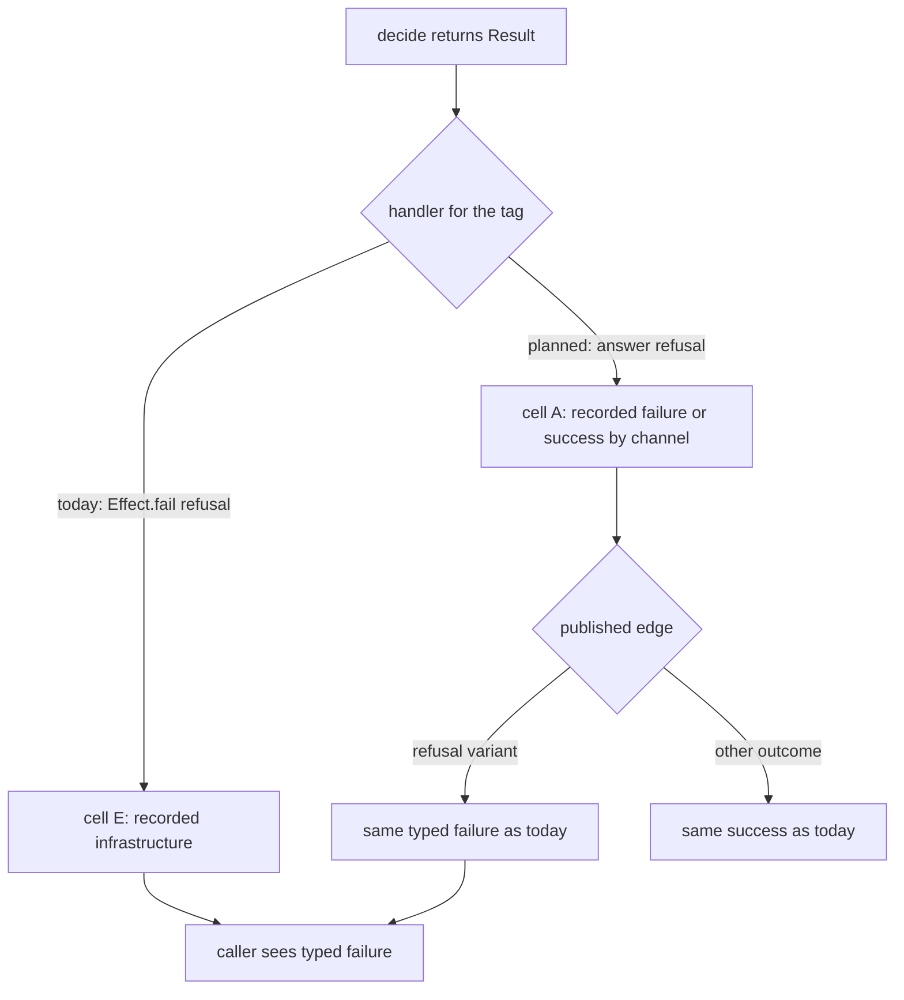

# Cell Refusals Answer on the Response - Plan

## Goal Capsule

- **Objective:** A consumer of `discern` or `effect-microsandbox` sees a domain refusal recorded as a completed run, not as an infrastructure fault. Every published API of those two packages keeps its current success and error types. An author of a `Workflow.make` decision can no longer place an error class on the success channel.
- **Means:** Write handlers answer refusals on the cell's response and the published edge converts them to typed failures (KTD1, KTD3). `Workflow.make` gains one decision-channel refusal (KTD2).
- **Authority:** `CONSTITUTION.md` > root `AGENTS.md` > `compound-packs/cell-architecture/four-channel-contracts.md` > package `AGENTS.md` files > this plan.
- **Stop conditions:** stop if keeping a published error union identical proves impossible without a cast or `Effect.die` in `packages/discern/src` (discern rule D5), or if the new refusal cannot be observed by both tstyche and the package `tsc`.
- **Execution profile:** one PR, three packages plus doctrine text. `repos/` stays read-only.
- **Finishing:** the implementer owns `pnpm check:local`, the per-package gates and changesets. The user owns the merge.

---

## Product Contract

### Summary

Nine write handlers stop failing with a domain refusal. They answer it instead, and the function or blueprint target that publishes the API converts it to today's typed failure. `Workflow.make` refuses a `Schema.TaggedError` in its decision channel.

### Problem Frame

A cell's error channel means the run did not complete. Retries, transactions, fallbacks and `Effect.repeat` all act on it: `SettlementStoreDrizzle.ts:177-180` retries the unit of work on failure, `Cell.orElse` runs its fallback on any failure (`Cell.ts:290-291`), and `readiness.blueprint.ts:36-39` polls until an outcome on the response. The pack rule says domain refusals are outcomes on `A` (`four-channel-contracts.md:13-14`). Nine handlers in discern and effect-microsandbox break it by returning `Effect.fail(...)` for a refusal. Their runs are recorded as `infrastructure` (`Sandwich.ts:164-165`), so operators cannot tell a refused budget from a crashed provider. The reference example already follows the rule: `examples/inventory-fulfillment/src/fulfillment/place-order.cell.ts:80-81,233-234` answers refusals and `inventory-fulfillment.rpc.ts:59-68` converts them at the RPC edge.

Separately, a `Schema.TaggedError` can sit in a decision union today. Nothing refuses it (`Workflow.ts:134-174` checks only `_tag` and a shared TypeId), so a value typed as an error rides the success channel.

### Requirements

**Workflow contract**

- R1. `Workflow.make` refuses a decision whose exclusive variants or event-list elements include a `Schema.TaggedError`, whatever the error channel, `Schema.Never` included. This is the only channel-placement rule: a refusal-like `TaggedClass` success stays legal, and the error channel is not required to be a `TaggedError`.

**Cell refusals**

- R2. In the migrated cells, a write handler answers each refusal U2 and U3 name, decision variant or error variant, on the response. It fails only when its own effect fails. The `CommandRejected` handlers are outside R2 (Scope Boundaries).
- R3. Every published API that runs a migrated cell keeps its exact success and error types. The answered refusal becomes the same typed failure it produced before, at that API's edge.
- R4. A migrated cell's run records `result_class` by where the workflow placed the refusal, not by the cell channel that carries it: `failure` for a refusal in the workflow's `error` schema (e.g. `BudgetExhausted`), `success` for a decision-variant refusal. Neither records `infrastructure`.

**Documentation**

- R5. The `effect-cell-types` README compiler-refusal table lists R1. Its composition text states R2 and where the conversion happens (R3). `docs/solutions/architecture-patterns/workflow-error-channel-gates.md` marks its Gate A as superseded by R1.

### Key Decisions

- **Refusals are outcomes on the response; the error channel means the run did not complete.** Governs R2, R3, R4. (session-settled: user-approved — chosen over `Sandwich.refuse`, which would fail the cell with the refusal and record `failure`: a refusal on `E` triggers the retry, transaction, fallback and repeat machinery built for runs that did not finish.)
- **Reject only a `TaggedError` in the decision channel.** Governs R1. (session-settled: user-directed — chosen over also requiring every error variant to be a `TaggedError` or banning refusal-like `TaggedClass` successes: the software-wiki `decision-gate` ruling, after Wlaschin's _Against Railway-Oriented Programming_, keys a workflow on choice, not failability, and admits a refusal in either channel.)

### Scope Boundaries

- The `CommandRejected` handlers stay as they are.
- Refusals a cell's `read` fails with (the `InvalidThresholdError` gates in `measure-pattern.cell.ts` and `run-policy.cell.ts`) stay as they are: they run before any decision exists, so R2 does not reach them.
- The workflow channel of the five decision-variant refusals (`RouteUncertain`, `RouteNone`, `UncertainUnhandled`, `PlanRefused`, `VirtualizationRefused`) stays as it is.
- `effect-readiness` is untouched; its only failing handlers are `CommandRejected`.
- `effect-cell-types` gains no runtime API.

#### Deferred to Follow-Up Work

- Classify each `CommandRejected` handler by whose data failed the schema: caller input answers on `A`, a dependency's data stays typed on `E`, our own data dies. `packages/discern/AGENTS.md` D5 forbids `Effect.die` in `discern/src`, and several of those error classes sit in published unions (`test-types/procedure.tst.ts:81-118`, `test-types/discern.tst.ts:240-244`). The rule and the published types need their owner's decision first.
- Review each decision-variant refusal's channel with the question "would an operator count this outcome as the use case failing?". Moving one to the error channel turns its recorded class from `success` to `failure`.
- Make error-tag handlers optional, defaulting to answering the encoded error, so the correct path is the shortest.
- A lint rule, owned by `oxlint-plugin-dmmf-workflow`, flagging a decision-tag or error-tag handler whose body is only `Effect.fail(...)`. It is a proposal only (CONST-E9).

### Success Criteria

- A budget refusal through `Model.budgeted` still fails with the same `AiError`, and its run records `result_class=failure`.
- The published type tests in `discern/test-types` and the effect-microsandbox API report are unchanged.

---

## Planning Contract

### Key Technical Decisions

- KTD1. **A migrated handler answers the value it used to fail with.** The only change inside a handler is `Effect.fail(x)` becoming `Effect.succeed(x)`, where `x` is the error the handler builds today, so a published error keeps the read context only the handler can see. `VirtualizationUnsupportedError` needs `command.platform` (`probe-virtualization.cell.ts:92-97`), which `VirtualizationRefused` does not carry. The answered value keeps its error class: R1 governs a workflow's decision schema, and the cell's response carries the error only as far as the edge that fails with it. Implements the refusals-on-response Key Decision (R2, R4). (session-settled: user-approved — chosen over `Sandwich.refuse`: see Key Decisions.)
- KTD2. **The R1 check lives in the decision-shape law, applied to exclusive variants and to event-list elements, not in `ErrorLaw`.** `ErrorLaw<never>` is `Top` (`Workflow.ts:162`), so a check there lets `error: Schema.Never` through. It is a new marker whose property name is the diagnostic, in the style of `UntaggedDecision` (`Workflow.ts:122-125`), and it detects a member assignable to `Error`: `Schema.TaggedError` builds `Cause.YieldableError` (`repos/effect/packages/effect/src/Schema.ts:14871`), which extends `Error`, and a `TaggedClass` instance does not. (session-settled: user-directed — chosen over also requiring `error` to be a `TaggedError`: see Key Decisions.)
- KTD3. **The conversion sits at the first code that runs the cell and publishes a type.** That code is the function that builds and runs the cell (`invokeProcedure`, `invokeProcedureWithFallback`, the `finishPolicy` call), or the interceptor that runs it (`replaying`, `caching`, `budgeted`). Each dispatches over the answer by tag: an answered refusal fails with that same value, or through the existing converter where one exists (`replayMissFailure`, `cacheFailure` and `budgetExceededFailure` in `decision-model.blueprint.ts:47-51,68-69`, replacing the `catchTag` calls at `:325`, `:350` and `:362`). Everything else succeeds unchanged. The pattern is `examples/inventory-fulfillment/src/rpc/inventory-fulfillment.rpc.ts:59-68`.
- KTD4. **`bootMicroVM` branches on the response and converts at its own end.** A virtualization refusal skips `bootSandbox`, and a plan refusal skips `awaitReadiness`. The refusal then fails with the same error class as today, so `bootMicroVM`'s declared `Cell` type (`boot-microvm.cell.ts:19-23`) stays identical. `scopedOf`, `layerOf` and `Jobs.run` in `micro-vm.blueprint.ts` therefore need no change. Converting once in the shared composition is chosen over converting at each of the three targets, which would triplicate the match.

### High-Level Technical Design

Where a refusal travels, before and after:

### Assumptions

- The invocation asks for the full design recorded in this session's POV: the required library change plus the consumer migration. The optional default handlers are excluded.
- The migrated runs' recorded classes change from `infrastructure` to `failure` or `success`. Nothing outside the repo alerts on `result_class` for these cells; this is unverified.
- A migrated cell whose run and edge conversion happen inside one exported function still gains R4, because the cell's own run completes before the edge fails.
- Effect's own guidance puts expected errors on the error channel (https://effect.website/docs/v4/error-management/expected-errors). This plan follows the repo's cell-level rule instead (`four-channel-contracts.md:13-14`). Inside a handler and after the edge the Effect idiom still holds.

### Risks

| Risk                                                                                                                                  | Mitigation                                                                                                                                                                                                                                   |
| ------------------------------------------------------------------------------------------------------------------------------------- | -------------------------------------------------------------------------------------------------------------------------------------------------------------------------------------------------------------------------------------------- |
| `bootMicroVM`'s branch trips the cell-architecture lint on shell or composition shape                                                 | Run the package lint after U3. Branch with `Cell.flatMap` and `Match` rather than inline control flow.                                                                                                                                       |
| tstyche (TS 6.0.3) leaves the new check deferred, as `workflow-success-channel-tagged-union.md:79-80` records for symbol-keyed checks | Probe the refusal under both tstyche and the package `tsc`. When tstyche cannot see it, pin it with a `Workflow.Inhabited` `toBe` marker test (the `workflows-surface.tst.ts:309-311` pattern) and record the compile sweep as the observer. |
| The edge match drops a variant or changes a published union                                                                           | The published type tests (`discern/test-types`, the effect-microsandbox api report) must not change.                                                                                                                                         |

---

## Implementation Units

### U1. Refuse an error class in the decision channel

- **Goal:** `Workflow.make` refuses R1's shapes and names the fix.
- **Requirements:** R1, R5. KTD2.
- **Dependencies:** none.
- **Files:**
  - `packages/effect-cell-types/src/Workflow.ts`
  - `packages/effect-cell-types/test-types/workflows-surface.tst.ts`
  - `packages/effect-cell-types/tests/__fixtures__/Decision.fixture.ts` (new fixture variants only)
  - `packages/effect-cell-types/README.md`
  - `packages/effect-cell-types/etc/effect-cell-types.api.md`: regenerate, never hand-edit
  - `docs/solutions/architecture-patterns/workflow-error-channel-gates.md`
- **Approach:**
  1. Add the marker and fold the check into the exclusive-decision and event-list laws (KTD2).
  2. Add fixture schemas: an exclusive union with one `TaggedError` member, and an event-list union with one.
  3. Add the README table row and supersede Gate A.
- **Patterns to follow:** `UntaggedDecision` and `TaggedVariants` in `Workflow.ts:122-157`. The positive-control pairing at `workflows-surface.tst.ts:206-232`. Fixture schemas live in `tests/__fixtures__` (pack `schema-laws`, `tests-own-no-schemas.md`).
- **Test scenarios:**
  - Refuses an exclusive union of one `TaggedClass` and one `TaggedError` with an inhabited error channel.
  - Refuses the same union with `error: Schema.Never`.
  - Refuses `Schema.Array` of a union containing a `TaggedError`.
  - Refuses `Schema.Array` of a lone `TaggedError`.
  - Still accepts a `TaggedClass` decision union with `Schema.Never` and with a `TaggedError` on the error channel (existing controls stay green).
  - `Workflow.Inhabited` over a union containing an error class resolves to the new marker.
- **Verification:** each refusal fails under tstyche and under the package `tsc`. The existing surface tests stay green.

### U2. discern refusals answer on the response

- **Goal:** the seven discern refusal handlers answer, and their published edges keep today's errors.
- **Requirements:** R2, R3, R4. KTD1, KTD3.
- **Dependencies:** none.
- **Files:**
  - `packages/discern/src/budget-provider.cell.ts`, `cache-provider.cell.ts`, `replay-provider.cell.ts`: the `BudgetExhausted` and `RecordingMissing` handlers
  - `packages/discern/src/decision-model.blueprint.ts`: the `replaying`, `caching` and `budgeted` edges
  - `packages/discern/src/invoke-procedure.cell.ts`: `RouteUncertain` and `RouteNone` in `invokeProcedure`, `RouteNone` in `invokeProcedureWithFallback`, with the conversion after each `.run(request)`
  - `packages/discern/src/run-policy.cell.ts`: `UncertainUnhandled`, with the conversion where `finishPolicy` runs the cell
  - a discern integration test for R4 (`packages/discern/tests/`, extending an existing Feature)
- **Approach:**
  1. Replace each refusal handler's `Effect.fail(x)` with `Effect.succeed(x)` (KTD1).
  2. At each running site, dispatch over the answer and fail with the answered refusal or its existing converter (KTD3).
  3. Leave the `CommandRejected` handlers alone (Scope Boundaries).
- **Patterns to follow:** `inventory-fulfillment.rpc.ts:59-68`. The `refusalSnapshotsOf` metric read in `packages/effect-cell-types/tests/pipeline-execution.integration.test.ts:74-87`.
- **Test scenarios:**
  - The existing edge suites stay green unchanged: `caching-and-budgets`, `recording-and-replay`, `when-routing-is-unsure`, `routing-on-a-projection`, `policy-matching-and-uncertainty` and `nested-and-bounded-procedures`.
  - A spent budget through `Model.budgeted` fails with the budget `AiError`, and the `discern.model.budget` duration metric carries `result_class=failure`, not `infrastructure`.
- **Verification:** `discern/test-types` passes unchanged, and `git grep` for D5's banned forms in `packages/discern/src` prints nothing.

### U3. effect-microsandbox refusals answer on the response

- **Goal:** `PlanRefused` and `VirtualizationRefused` answer, and `bootMicroVM` branches and converts (KTD4) so its declared type is unchanged.
- **Requirements:** R2, R3, R4. KTD1, KTD4.
- **Dependencies:** none.
- **Files:**
  - `packages/effect-microsandbox/src/boot-sandbox.cell.ts`
  - `packages/effect-microsandbox/src/probe-virtualization.cell.ts`
  - `packages/effect-microsandbox/src/boot-microvm.cell.ts`
  - an in-process test in `packages/effect-microsandbox/tests/` over `tests/__fixtures__/sandbox-runtime.fixture.ts` (`recordingSandboxRuntime`); no VM is spawned
- **Approach:**
  1. Answer the errors both handlers build today (`LoopbackViolationError`, and `VirtualizationUnsupportedError` with `command.platform`), keeping `probe-virtualization`'s debug log before the answer (KTD1).
  2. Rebuild `bootMicroVM` as KTD4's branch, so later cells never run after a refusal, and fail at its end with the answered error.
- **Patterns to follow:** `Cell.flatMap` as `boot-microvm.cell.ts:25` uses it today. The edge match from U2.
- **Test scenarios:**
  - A plan refusal through the published `scoped` target fails with `LoopbackViolationError` carrying the same `sandboxName`, `host` and `guestPort`, and `awaitReadiness` never runs.
  - A platform that fails the virtualization probe (set through the `ConfigProvider`, as the conformance fixture does) fails the published target with `VirtualizationUnsupportedError`, and the runtime ledger shows no sandbox acquired.
  - An approved plan still boots and becomes ready (the existing conformance suites stay green).
- **Verification:** the effect-microsandbox api report is unchanged. The `examples/boot-alpine.ts` smoke journey j15 still observes a typed refusal where a VM runtime is available; otherwise it is reported as not run.

### U4. Changesets and doctrine text

- **Goal:** each changed publishable package ships its consumer-visible facts.
- **Requirements:** R4, R5.
- **Dependencies:** U1, U2, U3.
- **Files:**
  - `.changeset/*.md`: one intent per package
  - `packages/effect-cell-types/README.md`: the composition section around line 241
- **Approach:**
  1. `effect-cell-types`: the new compile refusal. The bump follows the `author-changesets` skill; the refusal is a compile-time break for any consumer with an error class in a decision.
  2. `discern` and `effect-microsandbox`: the recorded `result_class` for refused runs.
  3. State R2 and R3 in the README composition section.
- **Test expectation:** none -- documentation and release intents only.
- **Verification:** the changeset check accepts the intents, and each body names only published names and observable behaviour.

---

## Verification Contract

| Scope                 | Command                                                                                | Proves                       |
| --------------------- | -------------------------------------------------------------------------------------- | ---------------------------- |
| effect-cell-types     | `pnpm --filter @systemfsoftware/effect-cell-types typecheck test test:types lint`      | U1 refusals and controls     |
| effect-cell-types api | `pnpm --filter @systemfsoftware/effect-cell-types api:update`, then no unexpected diff | only the new marker is added |
| discern               | `pnpm --filter @systemfsoftware/discern typecheck test test:types lint`                | U2 edges and R4              |
| effect-microsandbox   | `pnpm --filter @systemfsoftware/effect-microsandbox typecheck test lint`               | U3 edges                     |
| repo                  | `pnpm check:local`                                                                     | full local gate              |
| CI                    | `gh pr checks --watch --fail-fast`                                                     | REPO-D1                      |

## Definition of Done

- R1-R5 hold, and each unit's verification passed after the last edit.
- No published success or error type changed in discern or effect-microsandbox.
- No `Effect.die`, cast or `throw` was added in `packages/discern/src`.
- No abandoned attempt remains in the diff.
- The deferred items are recorded in the PR body.
