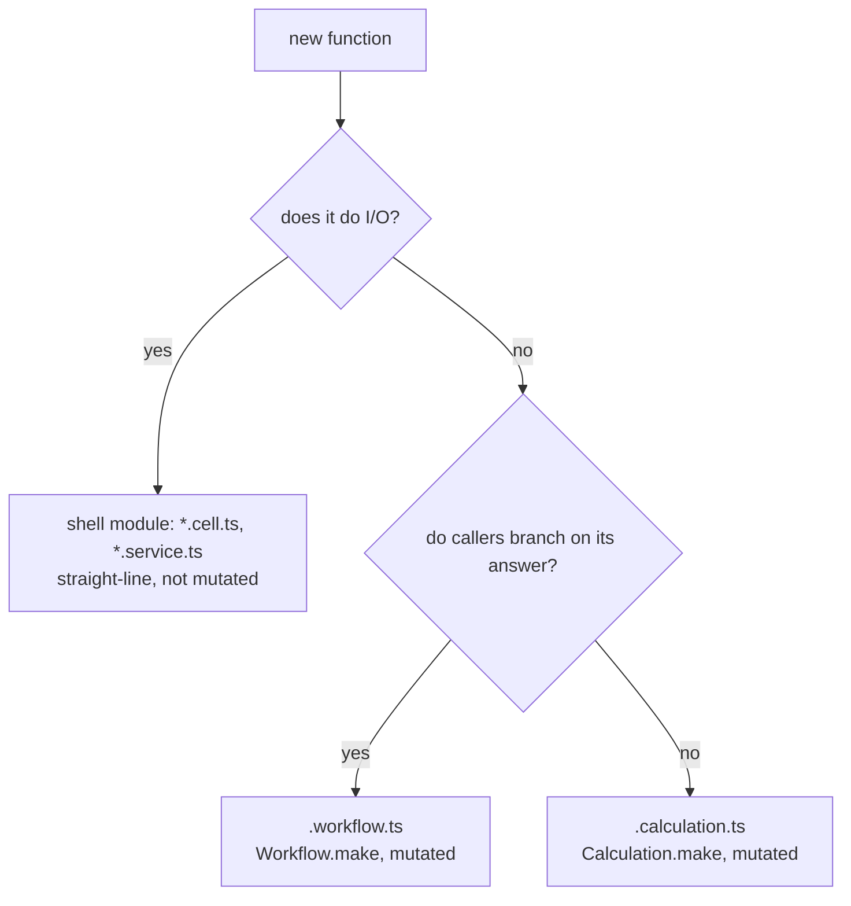

# Calculation Boundary for Shared Pure Functions - Plan

## Goal Capsule

- **Objective:** An author, human or agent, holding a pure function with one kind of answer that two or more modules use finds one home for it that every pack, lint rule and doctrine names (issue #556). The mutation gate measures the function in that home.
- **Means:** a `Calculation.make` constructor pinned to `<stem>.calculation.ts` files, the twin of `Workflow.make` pinned to `<stem>.workflow.ts`.
- **Product authority:** this plan owns the calculation constructor, its file location and test obligation, the workflow `uses` channel, the rule that stops unsuffixed modules from exporting functions, and the text alignment #556 lists. The packs, `CONSTITUTION.md` and lint fix texts are rewritten to match this design; they are not inputs to it. Lifecycle and state-machine modelling and the `stryker-js-effect` migration are not active scope.
- **Open blockers:** Q1 (drivers) must be answered before planning.

---

## Product Contract

### Summary

A shared pure function becomes a calculation: `Calculation.make` turns a total function with one kind of answer into a branded value.
It may be constructed only in a `<stem>.calculation.ts` file that holds exactly one calculation and carries its own required in-source property test.
The mutation globs that select workflows also select that file.
Workflows receive calculations through a declared `uses` record.
Unsuffixed modules no longer export functions, and every document that addresses this shape names `<stem>.calculation.ts`.

### Problem Frame

Issue #556 records that no file location satisfies the packs, `CONSTITUTION.md` and the recommended lint presets for a pure, shared, non-decision function.
Each guess breaks a different rule, so authors wrapped functions as fake `Workflow.make` commands, duplicated them privately, or left them in unmeasured modules.

The consumer evidence on `stryker-js-effect` branch `full-rewrite` shows where these functions live today.
`metricsResultFromFiles`, `runExitCodeFromOutcome`, `positionAt` and `lineStartsOf` are called only from shell code (`merge-reports.cell.ts:330`, `conclude-run.cell.ts:415`, the parser and transformer services), never from a workflow.
`metricsResultFromFiles` groups, sorts and branches with `Match.when`, and no mutation run sees it.

Four facts in this repo keep that logic there:

- `make-body-purity` refuses every imported value inside a `Workflow.make` body, including a branded constructor from a sibling `*.schema.ts`, so a decision cannot reuse a shared function (`packages/oxlint-plugin/oxlint-plugin-dmmf-workflow/src/rules/make-body-purity.config.ts:268-269`).
- `sandwich-shell-is-straight-line` refuses branching in same-file shell helpers but passes helpers imported from other files, naming whole-package mutation as the backstop (`packages/oxlint-plugin/oxlint-plugin-cell-architecture/src/rules/__tests__/sandwich-shell-is-straight-line.test.ts:271-284`). Mutation here is aimed at workflows, so that backstop does not exist.
- The complexity ceiling outside workflows cannot see `Match`, `Option.match` or `Boolean.match` branching, because calls count as complexity 1 (`docs/solutions/architecture-patterns/make-boundary-owns-a-decision.md:18-21`).
- Four documents name four different homes: an unsuffixed sibling module (`compound-packs/schema-laws/data-only-schema-classes.md:22`), a pure `Workflow` (`compound-packs/boundary-testing/no-mocks-on-internal-glue.md:14`), "the module that owns it" (`schema-file-exports-schemas-only` fix text), and the schema chain itself (`compound-packs/schema-laws/rich-type-over-foreign-encoded.md`).

The same gap exists in this repo: `packages/effect-readiness/src/DialEvidence.schema.ts:20-164` holds about thirty pure helpers behind its codec transforms, and `packages/effect-readiness/stryker.config.ts:26-33` mutates only `*.workflow.ts` and `*.cell.ts`.

### Key Decisions

- **Mutation is not aimed at whole packages.** Logic belongs in constructed boundaries; mutating every module drags shell and driver code into the 100% population. (session-settled: user-directed — chosen over whole-package mutation with per-mutant ignorers: about 99% of the logic lives in workflows, and mutating everything is the wrong instrument.) Governs R5.
- **Calculations live in a file whose suffix the mutation glob names.** A constructor-pinned suffix keeps the mutated set explicit, and renaming a file off the suffix is a lint error, not a silent escape. (session-settled: user-directed — chosen over unsuffixed modules selected by computing whether their import tree reaches I/O: a mutated set should be named, not derived.) Governs R4, R5.
- **The suffix is `.calculation.ts`.** Every role suffix in the repo is a full word. (session-settled: user-approved — chosen over `.calc.ts`: the user adopted the full word.) Governs R4.
- **One calculation per file, tested in-source, and the test is required.** A per-file rule can require an in-source block but cannot see a sibling test file, and one calculation per file makes a present block cover that calculation. (session-settled: user-directed — chosen over a sibling `__tests__/<stem>.calculation.property.test.ts`: tidier, and the only form a rule can require.) Governs R4, R6.
- **A calculation's answer cannot carry a choice.** An answer a caller branches on is a decision and belongs in `Workflow.make`; the compiler refuses the output type rather than trusting review. Governs R2.
- **Decisions reuse calculations through a declared parameter, not an import.** A `uses` entry reaches the `decide` body as a parameter, which `make-body-purity` already accepts, and the compiler checks each entry's brand. Governs R7, R12.
- **An unsuffixed module may not export a function.** Without this, the shell keeps calling plain helpers and #556 persists. Governs R8.

### Requirements

**Calculation constructor**

- R1. `Calculation.make` takes input schemas, an output schema and a `compute` function, and returns a branded value callable with `compute`'s parameters.
- R2. `Calculation.make` fails to compile when its output type can carry a choice anywhere in it: a union, `boolean`, a literal union, `Option`, `Result`, an optional field, a `_tag`, or an open type such as `unknown`, and the error names the offending path.
- R3. A `Calculation.make` body carries the same purity and one-path obligations a `Workflow.make` body carries.

**Location and test**

- R4. `Calculation.make` may be constructed only in a single-segment `<stem>.calculation.ts`, exactly once per file, and that file's only non-schema value export is the calculation.
- R5. Every mutation config that selects `*.workflow.ts` also selects `*.calculation.ts`.
- R6. Every `*.calculation.ts` carries an in-source property block exercising its calculation, and lint refuses a calculation file without one.

**Consumption**

- R7. `Workflow.make` accepts a `uses` record whose entries are calculations or workflows, passed to `decide` as a parameter, and the compiler refuses any other entry.

**Closing the other homes**

- R8. A module under `src/` that is not a workflow, calculation, schema, cell, service, handle or blueprint module declares no exported function, except re-export barrels, the `main.ts` entry and drivers (Q1).
- R9. Each codec transform body a schema file uses becomes a calculation the schema chain references, so `*.schema.ts` files hold declarations only.

**Alignment**

- R10. `compound-packs/schema-laws/data-only-schema-classes.md`, `compound-packs/cell-architecture/service-and-layer-boundaries.md`, `compound-packs/boundary-testing/no-mocks-on-internal-glue.md`, `compound-packs/schema-laws/rich-type-over-foreign-encoded.md`, the `schema-file-exports-schemas-only` fix text and CONST-T4 each name `<stem>.calculation.ts` for this function shape or do not address it.
- R11. The `in-source-test-targets-private` fix text no longer tells authors to delete assertions on pure public functions.
- R12. `make-body-purity` refuses a module-level alias of an imported value inside a make body, as it refuses the import itself.
- R13. `docs/solutions/architecture-patterns/label-routed-rules-are-unfalsifiable.md` carries a supersession note on its whole-package mutation recommendation.

### Acceptance Examples

- AE1. **Covers R2.** **Given** a calculation whose `compute` returns `boolean`, **when** it is type-checked, **then** compilation fails naming "the output". **Given** an output `{ score: number, verdict: 'pass' | 'fail' }`, **then** compilation fails naming "the output.verdict".
- AE2. **Covers R4.** **Given** `Calculation.make` in `Location.ts`, **then** lint fails. **Given** `position-at.calculation.ts` with no `Calculation.make`, or with two, **then** lint fails.
- AE3. **Covers R6.** **Given** `position-at.calculation.ts` with no `import.meta.vitest` block, **then** lint fails.
- AE4. **Covers R7, R12.** **Given** a `decide` body that calls an imported `positionAt`, **then** lint fails; **given** `const aliased = positionAt` at module scope called from `decide`, **then** lint fails; **given** `uses: { positionAt }` and `uses.positionAt(...)` in `decide`, **then** lint and compilation pass.
- AE5. **Covers R8.** **Given** `reporting/metrics-from-report.ts` exporting `metricsResultFromFiles`, **then** lint fails and names `<stem>.calculation.ts` as the home.
- AE6. **Covers R5.** **Given** a package whose mutation config selects `src/**/*.workflow.ts`, **then** `src/position-at.calculation.ts` is in the mutated set.
- AE7. **Covers R4, R6, R10.** **Given** one `<stem>.calculation.ts` holding one calculation over a schema type and imported by two other modules, **when** oxlint runs the recommended presets of `@systemfsoftware/oxlint-plugin-effect-schema` and `@systemfsoftware/oxlint-plugin-test-discipline`, **then** it reports zero diagnostics with no disable comment.

### Success Criteria

- Every acceptance criterion in issue #556 holds: AE7 passes, both plugins' existing suites pass, the documents in R10 agree, the mutation configs cover the location (R5), and codec transforms no longer contradict CONST-T4 (R9, R10).

### Scope Boundaries

- Deferred: a lifecycle model for work with states (a decider or XState). `render-progress-report.workflow.ts` in `stryker-js-effect` encodes a state transition as a decision and needs its own brainstorm.
- Deferred: migrating `stryker-js-effect` to calculations.
- Outside this work: whole-package mutation and mutation selected by computed import purity.
- Accepted residual: a pure helper exported from a shell module, such as `identityOf` in `mutation-reporting.service.ts:46`, stays unmeasured.
- Accepted residual: an in-range sentinel (`0` meaning "no discount") or a verdict carried as an open `string` passes R2 and is caught only by review.
- Accepted residual: the calculation brand, like `WorkflowBrand`, refuses accidents, not adversaries; any branded value can donate it by intersection (`docs/solutions/architecture-patterns/make-boundary-owns-a-decision.md:48-50`).

### Dependencies / Assumptions

- CONST-T4 lives in `systemfsoftware/constitution`, vendored read-only under `repos/constitution/`; its change lands upstream and arrives by subtree update.
- Lint rules, presets and mutation configs grade other code, so each change to them lands in its own commit, apart from the code it grades.
- Mutation scores come from the CI Mutation workflow; local mutation runs are blocked.

### Outstanding Questions

**Resolve Before Planning**

- Q1. Driver modules such as `src/drivers/memfs-file-system.ts` are unsuffixed and export `layer` functions, which R8 would refuse. Should drivers be exempt by a `drivers/` path or carry their own constructor-pinned suffix?

**Deferred to Planning**

- Q2. `make-body-purity` refuses imports from sibling `*.schema.ts` files, yet a calculation body needs branded constructors such as `Line.make`. Planning chooses between declaring a calculation's schemas in its own file, which `schema-declaration-location` would have to admit, and sealing `*.schema.ts` imports for make bodies.
- Q3. Whether the test-contribution audit, which flags property files that kill nothing unique, counts in-source properties, and what grades a toothless in-source property if it does not.
- Q4. Whether calculations offer a pipeable data-last call form alongside the data-first one.
- Q5. The depth limit of the R2 output check on recursive outputs, and correct handling of `Record` outputs (a string index covers `_tag`) and tuples (element types form a union), both of which the prototype got wrong.
- Q6. A helper module renamed to `*.service.ts` or `*.cell.ts` escapes R8. Planning decides whether those suffixes need a check that the file constructs what its suffix names, as `*.workflow.ts` and `*.calculation.ts` do.

### Sources / Research

- Issue #556: `https://github.com/systemfsoftware/systemfsoftware/issues/556`.
- Prototype, gitignored and local to this worktree: `.context/compound-engineering/ce-prototype/2026-09-26-calculation-boundary/01-calculation-shape/`. `src/Calculation.ts` and `src/WorkflowUses.ts` hold the constructor and `uses`; `src/refused.ts` holds six compile-time refusals checked by `tsc` 7.0.2; `src/residual.ts` and `src/escapes.ts` hold what passes; `lint/` holds the `make-body-purity` probes run against the built plugin.
- `packages/oxlint-plugin/make-boundary/src/MakeBoundary.ts:15-40` hard-codes `Workflow` and `make`; generalising its constructor list lets the existing make-boundary rules cover `Calculation.make`.
- `packages/oxlint-plugin/oxlint-plugin-dmmf-workflow/src/rules/make-file-location.config.ts:5-26` is the location rule R4 mirrors.
- `packages/oxlint-plugin/oxlint-plugin-test-discipline/src/rules/src-property-test-cell.config.ts:5-8,23-28` holds the `cellsRequiringTest` option R6 uses; it reads only in-source blocks.
- `packages/effect-readiness/src/DialEvidence.schema.ts:169-189` is the existing in-source property pattern: a dynamic import of `@systemfsoftware/vitest` that tsdown strips from builds.
- Software wiki `wiki/concepts/total-computations.md` places a type's algebra inside its schema file; this plan rejects that home because it would put behaviour back into declaration files.
