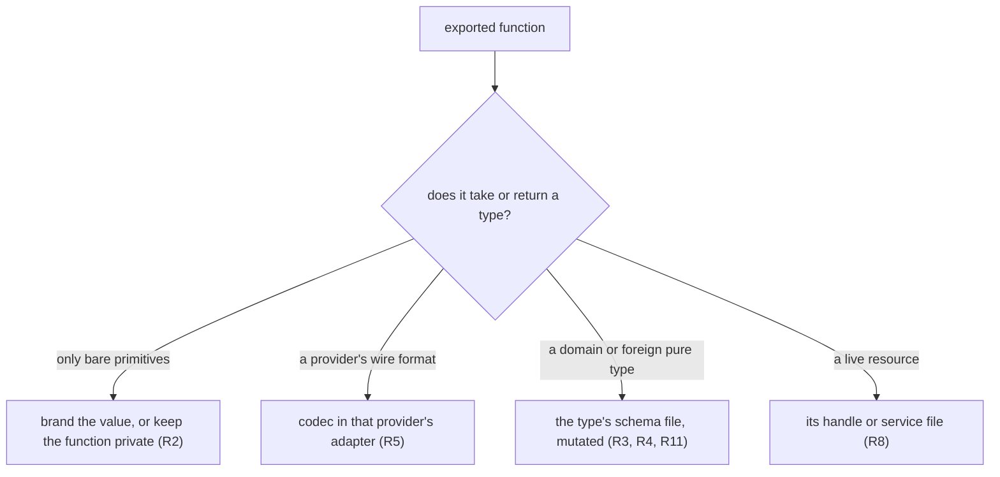
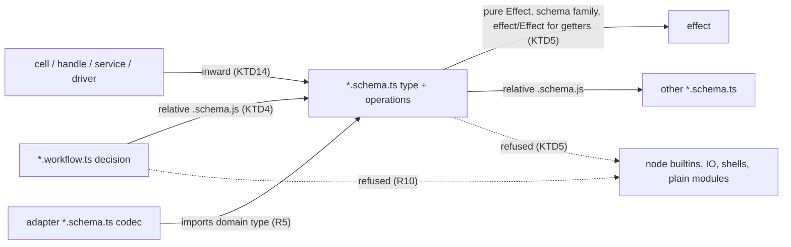
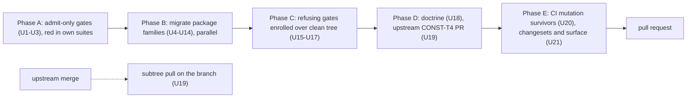

# ADT Operation Homes for Exported Logic - Plan

## Goal Capsule

- **Objective:** An author, human or agent, holding exported logic in a runtime package finds exactly one legal home for it, every pack, lint fix text and the constitution agree on that home, and the mutation gate measures the logic there (issue #556).
- **Means:** every exported function is an operation on a type, homed by the type it operates on; a pure data type's operations live in the `*.schema.ts` file that declares it, which every runtime package's mutation config selects (KTD8, R3, R11).
- **Product authority:** this plan owns where exported logic lives in runtime packages, the lint and mutation-config changes that enforce it, the alignment of packs and fix texts, the retirement of CONST-T4 upstream, and the migration of every runtime package. It replaces the calculation plan from commit `7101884d055`. Tooling packages, the `stryker-js-effect` consumer and lifecycle modelling are not active scope.
- **Authority hierarchy:** Product Contract R-IDs decide behaviour; KTDs decide mechanism within them; a unit overrides neither. Session-settled Key Decisions are not reopened.
- **Execution profile:** one branch and one pull request. Phase A (U1-U3) lands first; Phase B migration units (U4-U14) are independent per package family and may run in parallel once Phase A is in; Phase C gates (U15-U17) land after Phase B; Phase D (U18-U19) and Phase E (U20-U21) close. Every lint rule, preset or mutation-config change is its own commit (R20, KTD2).
- **Stop conditions:** evidence that a session-settled decision cannot work; a gate that goes green only by loosening a threshold, glob or rule beyond what a KTD names; the upstream constitution change being rejected; `pnpm check:local` red at a phase boundary with no in-scope fix.
- **Who finishes and ships:** `ce-work` implements, review and simplification follow, the pull request is opened and watched to a CI decision. Merging stays with the user. U19's subtree pull lands on the branch after the upstream constitution change merges.
- **Open blockers:** none for implementation. U19's subtree pull waits on the upstream merge (R16).

---

## Product Contract

### Summary

Every exported function in a runtime package becomes an operation on a type, and it lives in that type's schema file, which the mutation tests cover.
Codecs for a provider's format move into that provider's adapter, types the repo does not own get a declared schema of their own, and shells keep only private helpers.
The packs and lint fix texts name that one home, CONST-T4 is retired upstream, and every runtime package migrates in this work.

### Problem Frame

Issue #556 records that a pure function over schema data, shared by two or more modules, has no file location that satisfies the compound packs, `CONSTITUTION.md` and the recommended lint presets at once.
Each author guess breaks a different rule, so logic ends up duplicated, wrapped as fake workflow commands, or left in modules nothing mutates.

The rules in this repo produce that outcome directly:

- `schema-file-exports-schemas-only` refuses any exported function in a `*.schema.ts` file (`packages/oxlint-plugin/oxlint-plugin-effect-schema/src/rules/schema-file-exports-schemas-only.ts:181-184`).
- `make-body-purity` refuses every import inside a `Workflow.make` decision except Effect's own modules (`packages/oxlint-plugin/oxlint-plugin-dmmf-workflow/src/rules/ReferenceClassification.ts:216-227`). Workflows therefore keep private copies: `packages/effect-memfs/src/plan-write-continuation.workflow.ts:10-16` says so in a comment, and `effect-daemon-spec` declares its supervisor state classes twice, once in each workflow that needs them.
- Four texts name four homes: an unsuffixed sibling module (`compound-packs/schema-laws/data-only-schema-classes.md`), a pure `Workflow` (`compound-packs/boundary-testing/no-mocks-on-internal-glue.md`), "the module that owns it" (the `schema-file-exports-schemas-only` fix text), and the schema chain itself (`compound-packs/schema-laws/rich-type-over-foreign-encoded.md`).
- CONST-T4 calls schemas behaviour-free declaration files, while the codec pack requires transform bodies inside schema chains (`CONSTITUTION.md:253-259`, a symlink to `repos/constitution/`).
- The `in-source-test-targets-private` fix text tells authors to delete assertions on pure public functions because "the type system already proves it" (`packages/oxlint-plugin/oxlint-plugin-test-discipline/src/rules/in-source-test-targets-private.config.ts:11-12`).
- Mutation coverage is uneven. Five daemon packages mutate all of `src`, shell included; `effect-readiness` mutates cells; `effect-atom` mutates one file; 21 runtime packages have no mutation config at all.

The same gap shows in the code. `packages/effect-readiness/src/DialEvidence.schema.ts` parses HTTP status lines inside the domain module and keeps the domain type as a private copy behind an exported HTTP codec. The replay text `seed=<n>;path=<a,b>` is written in `packages/runner/vitest/src/internal/failure-record.ts:604` and parsed in `packages/effect-spec-runtime/src/KernelCase.ts:242-272`, with two shapes and no shared law. Four cell files export more than their cell, and no lint rule stops it.

### Key Decisions

- **Only operations on a type are exported.** (session-settled: user-directed — chosen over a calculation category with its own constructor and file suffix: the user rejected it as the wrong abstraction and pointed at Effect's own type modules.) Governs R1, R2.
- **A type's operations live in the schema file that declares it, and every schema file is mutated.** (session-settled: user-directed — chosen over a sibling module named after the type and over a new suffix: one file per type, and codec transform bodies get measured too.) Governs R3, R11. (pack: schema-laws, data-only-schema-classes.md)
- **Types without a schema get a `Schema.declare` companion schema.** (session-settled: user-directed — chosen over unsuffixed companion modules, owned types only, and exempting foreign types: one home, mutated, and checkable by lint.) Effect's `DateTimeUtc` is the precedent (`repos/effect/packages/effect/src/Schema.ts`, `DateTimeUtc` at line 10871). Governs R4.
- **A provider's wire codec lives in that provider's adapter.** (session-settled: user-directed — chosen over Effect's layout of one module per type with every codec beside it: that layout fits a library of generic encodings; in an application it makes the domain depend on the provider.) Governs R5. (pack: schema-laws, rich-type-over-foreign-encoded.md)
- **Decisions import operations straight from schema files.** (session-settled: user-approved — chosen over passing operations into `decide` as parameters: the software wiki treats pure helpers as code, not dependencies, and the price is that schema files import only pure code.) Governs R6, R10.
- **Shells export no logic; their private helpers are measured by vitest coverage.** (session-settled: user-directed — chosen over mutating shell code or requiring in-source property tests for shell helpers.) Governs R7, R8.
- **Mutation covers the functional core only.** (session-settled: user-directed — chosen over mutating all of `src`: shell mutants are noise.) Governs R11, R12.
- **Role suffixes are best effort.** (session-settled: user-directed — chosen over requiring a role suffix on every file: not every module fits a role, and a forced suffix is a trap.) Governs the accepted residual in Scope Boundaries.
- **Tooling packages are exempt and keep their current mutation testing.** (session-settled: user-directed — chosen over applying the rules everywhere, and over new mutation configs for `import-origin` and `make-boundary`: every helper in an oxlint plugin's rules folder is already mutated, those packages have no domain type, and the two shared kernels deliberately carry no tests or mutation config (`packages/oxlint-plugin/AGENTS.md` IO4).) Governs R17.
- **Every runtime package migrates in this work.** (session-settled: user-directed — chosen over rules plus one proving package, and over rules only: no lint rule goes red on merge.) Governs R17-R19.
- **Every runtime package gets a core mutation config at a 100 break threshold now.** (session-settled: user-approved — chosen over adding configs with a lower threshold first, and over changing only the existing configs.) Governs R12.
- **CONST-T4 is retired, not rewritten.** (session-settled: user-approved — chosen over rewriting it: CONST-T3 and CONST-T8 already carry its purpose, its one unique clause describes one mutation config's exclude list, and a layout rule is the contestable kind of choice CONST-G5 sends to packs and ADRs.) Governs R16.
- **Gate changes follow AGENTS.md's Evaluator row.** (session-settled: user-approved — chosen over CONST-E9's requirement of a different owner for gate changes.) Governs R20.

### Requirements

**Where exported logic lives**

- R1. In a runtime package, every exported function is an operation on a type declared in the module that exports it; a workflow file exports its workflow and a cell file its cell.
- R2. A function whose inputs and output are only bare primitives is not exported: its value gets a branded type and the function becomes that type's operation, or it stays private to its one consumer.
- R3. A pure type's operations live in the `*.schema.ts` file that declares the type, as module functions rather than class members. (pack: schema-laws, data-only-schema-classes.md)
- R4. A pure type whose values are data and that has no schema today, whether the repo does not own it (Effect's `Cause` and `Exit`, vitest and Stryker report shapes) or it is a hand-written type module (`effect-atom`'s async result), is declared once with `Schema.declare` in its own `*.schema.ts`, and its operations move there. A type whose values carry closures, schemas or effect-returning operations is not a pure type; its home is KTD8.
- R5. A codec for a provider's or protocol's format lives in the adapter that talks to that provider, as its own schema file that imports the domain type and exports the codec; the domain module holds no provider grammar. (pack: schema-laws, rich-type-over-foreign-encoded.md)
- R6. A `Workflow.make` decision may call operations imported from `*.schema.ts` files. A `*.schema.ts` file imports only the pure Effect modules `make-body-purity` already accepts, Effect's schema family, `effect/Effect` for fallible codec getters, the arbitrary modules a `toCodecArbitrary` annotation needs, other `*.schema.ts` files, and workspace packages (`@systemfsoftware/*`), which carry other packages' schemas; lint does not trace what a package entry re-exports.

**Shells**

- R7. A `*.cell.ts` file exports its cell and nothing else, and lint refuses any other value export from it.
- R8. Cells, services, handles and drivers keep their pure helpers private; those helpers are measured by vitest coverage, not mutation, and a handle or service exports only operations over the resource it describes.

**Lint**

- R9. `schema-file-exports-schemas-only` accepts an exported function whose declared parameter or return types name a type the same file declares and whose return type is not an Effect carrier, keeps refusing every other non-schema export, and its fix text names the same-file operation as the home.
- R10. `make-body-purity` accepts a reference to a binding imported from a `*.schema.ts` file, keeps refusing every other import, and lint refuses a `*.schema.ts` file that imports anything outside R6's set.

**Mutation**

- R11. Every runtime package's mutation config selects its `*.workflow.ts` and `*.schema.ts` files, excludes cells, services, handles and drivers, and breaks below a score of 100.
- R12. Every runtime package whose migrated `src/` holds a `*.schema.ts` or `*.workflow.ts` file has a mutation config: the 21 without one gain it, the existing runtime configs are narrowed or widened to R11's set, and a package with neither file kind gets no config and is named in the pull request.

**Doctrine alignment**

- R14. `compound-packs/schema-laws/data-only-schema-classes.md`, `compound-packs/cell-architecture/service-and-layer-boundaries.md`, `compound-packs/boundary-testing/no-mocks-on-internal-glue.md`, `compound-packs/schema-laws/rich-type-over-foreign-encoded.md` and the `schema-file-exports-schemas-only` fix text each name the homes in R3-R5 for this function shape or do not address it.
- R15. The `in-source-test-targets-private` fix text stops telling authors to delete assertions on exported pure functions and points them at the operation's public tests instead.
- R16. CONST-T4 is retired in `systemfsoftware/constitution`, and this repo takes the change by subtree update, never by editing `repos/`.

**Migration**

- R17. Before merge, every exported function in every runtime package satisfies R1-R8; tooling packages keep their layout.
- R18. `docs/solutions/architecture-patterns/label-routed-rules-are-unfalsifiable.md` carries a supersession note on its whole-package mutation recommendation.
- R19. The calculation plan from commit `7101884d055` is removed, leaving this plan as the only plan file in the pull request.

**Delivery**

- R20. Each change to a lint rule, preset or mutation config lands in its own commit, observed red before and green after: a change that refuses more is red against the unmigrated tree and green after the migration; a change that only admits more is red on a currently-refused fixture in its own suite and green after the change.

**Tests for operations**

- R21. An exported operation's law properties have one lint-legal test home that the package's mutation run executes, the test-discipline rules and fix texts name it, and no fix text tells authors to delete those tests.

### Acceptance Examples

- AE1. **Covers R1, R3, R9.** **Given** `line-map.schema.ts` declaring `LineStarts` and exporting `positionAt(lineStarts, offset)`, imported by two other modules, **when** oxlint runs the recommended presets of `@systemfsoftware/oxlint-plugin-effect-schema` and `@systemfsoftware/oxlint-plugin-test-discipline`, **then** it reports zero diagnostics with no disable comment.
- AE2. **Covers R2, R9.** **Given** a schema file exporting `ensureTrailingSeparator(path: string): string`, **then** lint fails and its fix text names branding the value.
- AE3. **Covers R6, R9, R10.** **Given** a `decide` body calling `positionAt` imported from `line-map.schema.ts`, **then** lint passes. **Given** the same body calling a function imported from a plain module, **then** lint fails. **Given** a schema file importing `node:fs`, **then** lint fails. **Given** an adapter's schema file whose status-line getter imports `effect/Effect` to fail a decode, **then** lint passes. **Given** a schema file exporting an operation that returns an `Effect`, **then** lint fails.
- AE4. **Covers R7.** **Given** `supervisor-step.cell.ts` exporting `Steps` beside its cell, **then** lint fails.
- AE5. **Covers R5, R17.** **Given** `effect-readiness` after migration, **then** `DialEvidence.schema.ts` exports the domain `Responded { statusCode }` and holds no status-line parsing, and the HTTP driver decodes through a status-line codec in its own adapter schema file.
- AE6. **Covers R1, R17.** **Given** the replay text after migration, **then** one `Replay` type and one codec for it exist, the test runner writes through it, and the spec runtime reads through it.
- AE7. **Covers R11, R12.** **Given** any runtime package whose `src/` holds a schema or workflow file, **then** its mutation config selects `src/**/*.schema.ts` and `src/**/*.workflow.ts` and selects no `*.cell.ts`.
- AE8. **Covers R4.** **Given** a function over Effect's `Cause` exported from a plain module today, **then** after migration it is an operation in a `Schema.declare`d companion schema file.
- AE9. **Covers R21.** **Given** a law property for `positionAt` in the home R21 names, **then** test-discipline lint passes, and the CI mutation run for that package executes it against `line-map.schema.ts`'s mutants.

### Success Criteria

- Every acceptance criterion of issue #556 holds: AE1 passes, both plugins' test suites pass, the texts in R14 agree, R11 covers the home, and codec transforms no longer contradict the constitution (R16).
- `pnpm check:local` exits 0 after the last migration commit, including every package's `api:check` against its updated report.
- The CI Mutation workflow report shows every runtime package's selected set at a score of 100.

### Test Obligations

Each test this plan implies went through the test-layer admission gate, default refuse.

- Admitted: rule-contract fixtures in each changed rule's existing suite for R7, R9, R10 and R21, one accept and one refuse case per acceptance example; they carry R20's red-before, green-after observation.
- Admitted: the generated codec laws for every exported schema, including each type R4 declares. They cover round-trip and encode stability only, and nothing is hand-written for that half.
- Admitted: law properties over exported operations and hand-written refusal laws at refinement bounds, in R21's home, written only for mutants that the generated laws and the calling workflows' property tests leave alive.
- Refused: a permanent test that spawns oxlint over an example file. Spawning a process fails the in-process gate; AE1 is observed by `pnpm check:local` linting the migrated tree and by the rule fixtures.
- Refused: unit tests for shell private helpers. Vitest coverage measures them.
- Refused: tests asserting where a file lives or what it exports. Lint rules and mutation globs observe placement.

### Scope Boundaries

- Tooling packages (`packages/oxlint-plugin/*`, `packages/oxlint-presets/*`, `packages/toolchain/*`) keep their layout and their current mutation testing; the lint units change their rules, not their layout or mutation configs, and `import-origin` and `make-boundary` stay without a mutation config (IO4).
- Accepted residual: a module without a role suffix stays legal, and logic exported from it is a review finding, not a lint failure.
- Replaced: the calculation constructor, its `.calculation.ts` suffix, the `uses` channel into workflows and the closed-output check from the calculation plan.
- Deferred: migrating the `stryker-js-effect` consumer, and modelling work that moves through states.
- Outside this work: mutating whole packages, and choosing the mutated set by computing import purity.

#### Deferred to Follow-Up Work

- Unifying the three copies of the schema-member tables (`oxlint-plugin-dmmf-workflow`, `oxlint-plugin-effect-schema`, `effect-schema-discovery`).
- Widening `@systemfsoftware/stryker-test-contribution`'s hardcoded suffix list; the in-source home (KTD1) adds no required test file for it to audit.

### Dependencies / Assumptions

- The CONST-T4 retirement merges in `systemfsoftware/constitution` before this work's subtree update. REPO-S3 keeps `repos/` read-only, and the copy nested under `repos/worktrunk-scripts/` is not touched.
- Mutation scores come from the advisory CI Mutation workflow; local mutation runs are blocked (REPO-D3).
- Schema discovery generates round-trip laws for every exported schema in every scanned `.ts` file (`packages/schema/effect-schema-discovery/src/mod.ts:35-70`). A `Schema.declare` without a `toCodecArbitrary` annotation on the declare call itself makes Effect's arbitrary compiler throw inside those laws (`repos/effect/packages/effect/src/internal/arbitrary/schema.ts:1567-1609`), so KTD9 governs every new declare.
- Every package under `packages/` outside the three tooling families is a runtime package, including `runner/vitest` and `schema/*`.
- Inventory counts are approximate, from grep over `src`: about 500 exported functions outside schema, workflow and cell files across 30 runtime packages with a `src/`, before the tooling exemption.
- Moving exports changes some packages' published surface. Each publishable package whose build hash changes ships a changeset, and a removed published name is a breaking change (REPO-R1, REPO-R2).

### Sources / Research

- Issue #556: `https://github.com/systemfsoftware/systemfsoftware/issues/556`.
- Cell files exporting more than their cell: `packages/daemon/effect-daemon-spec/src/Supervisor/supervisor-step.cell.ts:150` exports `Steps`; `packages/discern/src/invoke-procedure.cell.ts` exports `invokeProcedure`, `invokeProcedureWithFallback` and `prepareRoute`; `packages/discern/src/measure-pattern.cell.ts` exports `run`, `sweep`, `calibrate` and `Eval`; `packages/discern/src/run-policy.cell.ts` exports `finishPolicy` and `runWithTrace`.
- Provider codecs already in adapters: `packages/daemon/effect-daemon-socket/src/SocketMedium/socket-failure.schema.ts` (Node error shape) and `packages/trace/trace-spec/src/drivers/tempo-trace.schema.ts` (Tempo JSON into `SpanRecord`).
- Effect precedent for declared companion types and per-encoding codecs: `repos/effect/packages/effect/src/Schema.ts`, `DateTimeUtc` (line 10871) and `DateTimeUtcFromMillis` (line 11007).
- Prototype runs, gitignored and local to this worktree: `.context/compound-engineering/ce-prototype/2026-09-26-calculation-obligation/`. Laws over the codec caught 14 of 14 injected bugs, while copied oracle functions caught 11 and missed every bug written into both copies. The `effect-daemon-spec` run showed the state-class duplication that `make-body-purity` forces.
- Software wiki `wiki/concepts/pure-core-no-dependency.md` and `wiki/concepts/dependency-approach-placement.md`: a dependency is something impure; passing pure helpers as parameters adds indirection the decision never uses.
- Types R4 excludes: `packages/discern/src/pattern.blueprint.ts:136-162` (a `Pattern` spec carries `evaluate` and `preview` closures) and `packages/trace/trace-taxonomy/src/Span.ts:19-57` (a `Span` holds a `Schema`, and `start` returns an `Effect`).
- Fallible codecs need `effect/Effect`: `SchemaGetter.transformEffect` takes `(e) => Effect.Effect<T, SchemaIssue.Issue, R>` (`repos/effect/packages/effect/src/SchemaGetter.ts:740-743`), while `make-body-purity` lists `effect/Effect` as an I/O carrier and omits the schema-family modules from its pure set (`packages/oxlint-plugin/oxlint-plugin-dmmf-workflow/src/rules/make-body-purity.config.ts:56,84-112`).
- Scoping mutation to pure logic is outside practice too: cat-factory mutates only its pure-logic packages and excludes interface-declaration folders because they bury the signal under `NoCoverage` (`https://github.com/kibertoad/cat-factory/blob/main/docs/internal/mutation-testing.md`).

---

## Planning Contract

**Product Contract preservation:** changed: R12 and AE7 — a package whose migrated `src/` holds no schema or workflow file gets no mutation config, because an empty mutated set cannot pass (CONST-T3; `scripts/tools/mutation-job.ts` exits 1 when a package produces no report). Removed after document review, by user decision: R13 (mutation configs for `import-origin` and `make-boundary`), since both kernels have no tests and a config over a test-less package fails CI (IO4); R-IDs are not renumbered. Changed after document review: R6 names the arbitrary modules and workspace packages KTD5 already allows; R20 states the red that admit-only changes show (KTD2). Restructured, no scope change: Q1-Q6 resolved into KTD10, KTD8, KTD3, KTD1, KTD9 and KTD2; R4's home pointer moved from Q2 to KTD8; the cell list gained `run-policy.cell.ts`; Test Obligations state what the generated laws cover; the declare dependency states the throw; the R21 test-home evidence moved into KTD1.

### Key Technical Decisions

- KTD1. **R21's home is an in-source `if (import.meta.vitest)` block in the schema file whose `it.prop` names the exported operation or schema in its `subject` slot.** The rule already admits this: `collectModuleNames` includes exported declarations and `isSubjectValue` accepts them as `subject` (`packages/oxlint-plugin/oxlint-plugin-test-discipline/src/rules/in-source-test-targets-private.ts:62-88,129-131`). Only fix and expected texts change (R15). Chosen over `<stem>.schema.property.test.ts`, which reverses `refusals-beside-generated-laws.md:22` (pack: schema-laws, refusals-beside-generated-laws.md), and over `tests/*.property.test.ts`, which needs a new suffix in `test-suffix-outside-src` and moves laws away from the mutated file. The in-source ignorer keeps the block out of the mutant set, and the test-contribution evaluator audits only its hardcoded suffixes. Not a Bake-off: the pack names the home and the rule already admits it.
- KTD2. **Gate order follows what each change does to the tree.** (session-settled: user-approved — chosen over CONST-E9's separate-owner requirement: gate changes follow AGENTS.md's Evaluator row.) Governs R20. Changes that only admit more (U1's accept arm, U2's schema-import exemption, U3's texts) land first; the tree cannot use what they admit yet, so their red is a currently-refused fixture in their own suite. Changes that refuse more (U15, U16, U17) land after migration as enrollment over a clean tree; their red is the new rule run against the pre-migration base revision, recorded in the commit body. `repos/constitution/ENFORCEMENT.md` § Enrollment: migrate every live violation first, then enroll at error; `warn` is never a resting state.
- KTD3. **R9 decides "same-file type" from declared annotations only.** An exported function is accepted when its explicit parameter or return type annotation's root identifier is a schema, type alias, interface or enum bound at module scope in the same file (the rule's pass-2 bindings map, not a scope query), and its return annotation names no `Effect`, `Stream` or `Layer` handle. Error data such as `PlatformError` is a type, not a carrier. An exported function without explicit annotations is refused; the fix text names adding them. Unions and branded aliases count when their root name is same-file. Resolves Q3; (`docs/solutions/architecture-patterns/constructor-rule-boundary.md`) — the rule reads the whole file, never a call-site type.
- KTD4. **R10's exemption is structural: a static import whose relative specifier's basename ends `.schema.js` or `.schema.ts` gets a new passing verdict.** (session-settled: user-approved — chosen over passing operations into `decide` as parameters.) Governs R6, R10. No allowlist of local modules, as `make-body-purity.config.ts:180-200` requires; `UNSEALED_IMPORT_FIX` and the "imports run toward the decision" comment (`ReferenceClassification.ts:145-162`) are rewritten to name the schema-file edge. Package specifiers and dynamic imports stay refused inside decision bodies.
- KTD5. **R6's converse rule is a new rule in `oxlint-plugin-effect-schema` over `*.schema.ts` files, and the source vocabularies it shares with `make-body-purity` move into `import-origin`.** Allowed value imports: `EFFECT_PURE_SUBPATHS`, the `effect` root pure names, Effect's schema family (`Schema`, `SchemaAST`, `SchemaGetter`, `SchemaTransformation`, `SchemaIssue`, `SchemaParser`, `Encoding`), `effect/Effect` (for fallible getters, R6), the arbitrary modules a `toCodecArbitrary` annotation needs, relative `*.schema.js` specifiers, and `@systemfsoftware/*` package specifiers. Type-only imports are ignored. Everything else is refused: node builtins, `IO_SOURCES`, relative non-schema modules, other third-party packages. Accepted residual: a workspace package barrel is not traced, so cross-package purity is a review finding. Moving the sets into `import-origin` avoids a second copy (CONST-S4).
- KTD6. **R7 is a new rule in `oxlint-plugin-cell-architecture` that counts value exports in a `*.cell.ts` file directly.** Exactly one value export; type-only exports are free; schema declarations count, because they belong in schema files; re-exports are refused. It does not reuse dmmf-workflow's `walkExportedValues`, which exempts schema declarations R7 must count. `boot-sandbox.cell.ts` (one value, one interface) already passes.
- KTD7. **Mutation configs copy `packages/effect-readiness/stryker.config.ts` with `mutate: shardMutate` over `src/**/*.workflow.ts` and `src/**/*.schema.ts` minus tests, and a per-config `thresholds.break` of 100.** (session-settled: user-approved — chosen over a lower threshold first and over changing only existing configs.) Governs R11, R12. Conflict call-out: the settled decision gives every runtime package a config, but a package with no core file would run an empty mutated set, which CONST-T3 forbids and `scripts/tools/mutation-job.ts` fails; those packages get no config and are named in the pull request (R12). Stryker aborts when a pattern matches no files, which is the subject guard issue #138 recorded (`docs/solutions/architecture-patterns/constraint-reaches-only-via-window-or-gate.md`).
- KTD8. **An exported function's home is decided by the type it operates on: its `self` (first) parameter, or the returned type for a constructor.** Resolves Q2.

  | The type                                                                          | Home                                                                                                                                                 | Mutated                                        |
  | --------------------------------------------------------------------------------- | ---------------------------------------------------------------------------------------------------------------------------------------------------- | ---------------------------------------------- |
  | Pure data, owned or foreign                                                       | the type's `*.schema.ts` (R3, R4)                                                                                                                    | yes                                            |
  | A provider or protocol format                                                     | the adapter's schema file (R5)                                                                                                                       | yes                                            |
  | A value carrying closures, schemas or effects (`Pattern`, `Span`, `Cell`, `Atom`) | the module that declares the type: its `*.blueprint.ts`, or the library module, merged where one type's operations are split across files today (R1) | no; purity is judged by return type (CONST-P3) |
  | A live resource                                                                   | its `*.handle.ts` or `*.service.ts` (R8)                                                                                                             | no                                             |
  | Only bare primitives                                                              | brand it, or keep it private (R2)                                                                                                                    | —                                              |

- KTD9. **New schemas use the most structural form available.** Owned data becomes `Schema.Struct`, `Schema.TaggedStruct` or a class-free union; Effect's own types use Effect's built-in schemas (`Schema.Cause`, `Schema.Exit`, `Schema.Option`), which already carry arbitraries (`repos/effect/packages/effect/src/Schema.ts:10575-10612`); `Schema.declare` is used only when neither fits, and always carries `toCodecArbitrary` on the declare call itself, following `packages/atom/effect-atom/src/async-result.ts:1274-1281`. Every chain is rooted at `Schema.*` so discovery sees it (pack: schema-laws, rich-type-over-foreign-encoded.md). A declare whose predicate admits more than its type says has no refusing channel; review owns it (`docs/solutions/architecture-patterns/a-schema-type-claim-can-outrun-its-examination.md`). Resolves Q5.
- KTD10. **`Replay` and its codec live in `packages/runner/vitest` and are published from its `./failure` entry.** `effect-spec-runtime` already depends on `@systemfsoftware/vitest`, so the reader imports the writer's type; the reverse edge does not exist. Resolves Q1.
- KTD11. **CONST-T4 is vacated upstream, not retitled or renumbered.** (session-settled: user-approved — chosen over rewriting it.) Governs R16. The corpus gate names a vacated id on its success line and fails a citation to it (`repos/constitution/scripts/validate-constitution.ts:24-31,241-253`), so the upstream change removes the rule and every corpus citation of it, and states its `--against` output. The subtree pull uses the documented fetch, verify and `git subtree pull --squash -S` sequence (`agent-plugins/git-subtrees/README.md:43-49`).
- KTD12. **R18's note states the harm the narrow glob accepts.** `label-routed-rules-are-unfalsifiable.md` argues a suffix-keyed glob stops measuring logic that moves out of the named file. This plan accepts that harm for unsuffixed modules (the Scope residual) and closes it for suffixed shells with R7, R8 and R9; the note says so and links this plan, not only "superseded".
- KTD13. **Published names survive moves where they were public.** A package barrel keeps re-exporting a moved name; its `etc/*.api.md` report is regenerated with `api:update` in the same unit; a name that leaves the barrel ships as a breaking changeset (REPO-R1). The changeset set comes from the build-hash guard, which also names dependents whose sources did not change (`docs/solutions/tooling-decisions/changeset-requirement-keys-on-turbo-build-hash.md`); bodies follow `skill://author-changesets`.
- KTD14. **Shells may import operations from schema files, and a private duplicate is deleted rather than kept.** The edge runs inward (shell to core). `failureOf` in `packages/effect-memfs/src/open-file.handle.ts:80` duplicates the one in `driver-values.ts`; the migration keeps one.

### High-Level Technical Design

Allowed import edges after the change:

Phase order and gate commits:

### Assumptions

- R1 is applied literally: where one type's operations are split across several modules today (the `atom-*.ts` and `async-result*.ts` clusters in `effect-atom`, `runner/vitest`'s internal modules), they merge into the module that declares the type.
- A moved name that leaves a package barrel ships as a breaking changeset with no deprecation alias (REPO-R1).
- The upstream constitution change needs the user's merge. The pull request opens without the subtree pull, and its body records the pending dependency.
- Mutation reaches 100 through CI iteration on the branch, by dispatching the Mutation workflow (`workflow_dispatch`) against it.
- Stryker's `related` run executes a mutated schema file's own in-source block; U20's first report checks it.

### Risks & Dependencies

| Risk                                                           | Mitigation                                                                                                                                             |
| -------------------------------------------------------------- | ------------------------------------------------------------------------------------------------------------------------------------------------------ |
| About 500 exports across 30 packages make Phase B long         | One unit per package family, each ending green (`test`, `lint`, `typecheck`, `api:check`) before the next family relies on it                          |
| New schemas throw inside generated laws                        | KTD9: built-in schemas first; `toCodecArbitrary` on every declare call                                                                                 |
| Stale disable comments name a changed rule and silence nothing | U15 and U16 sweep disable comments naming the changed rule ids (`docs/solutions/build-errors/a-disable-comment-names-the-config-key.md`)               |
| A consumer config spreads a preset and drops a rule            | U15 and U16 plant one violation per consumer idiom and require red (`docs/solutions/build-errors/oxlint-preset-overrides-are-replaced-by-a-spread.md`) |
| 21 new mutation packages exceed CI job caps                    | Timings plan marks new packages `unknown-seconds`; U20 splits a package with `STRYKER_SHARD` shards before touching any threshold                      |
| Narrowing daemon configs drops measured shell mutants          | Settled decision; KTD12 names the harm; the pull request states the narrowing                                                                          |
| Changeset gate runs only in CI                                 | U21 runs the build-hash guard before opening the pull request                                                                                          |
| Upstream constitution change is not merged at ship time        | Pull request opens with U19's pull pending and says so; merge waits for it                                                                             |

### Deferred to Implementation

- Exact rule ids and message ids for the two new rules (U15, U16).
- Each function's destination inside KTD8's table, and whether a new owned type is a `Struct` or a `TaggedStruct`.
- Which barrel names disappear; the api report diff in each unit decides.
- Which mutants need hand-written laws; the first CI report decides (U20).

### Alternatives Considered

- **One gate commit before all migration.** Refused: a refusing rule enrolled over an unmigrated tree reds `pnpm check:local` for every package, and the pre-commit hook lints staged files, so the commit sequence has no green intermediate state (`repos/constitution/docs/solutions/architecture-patterns/the-vacuous-pass-gate-input-sets.md`).
- **Reusing dmmf-workflow's export walker for R7 through a new shared package.** Refused: the walker exempts schema declarations, which R7 counts, so sharing it would need a mode flag, and a new package costs more than a direct count.
- **Migrating by package dependency order.** Refused: the moves keep barrel names (KTD13), so families are independent; ordering them by dependency would serialize work that has no data dependency.

---

## Implementation Units

| U-ID | Title                                             | Key files                                                                                           | Depends on |
| ---- | ------------------------------------------------- | --------------------------------------------------------------------------------------------------- | ---------- |
| U1   | Accept same-file operations in schema files       | `oxlint-plugin-effect-schema/src/rules/schema-file-exports-schemas-only*`                           | —          |
| U2   | Let decisions import schema-file bindings         | `oxlint-plugin-dmmf-workflow/src/rules/ReferenceClassification.ts`, `make-body-purity*`             | —          |
| U3   | Name the in-source law home in fix texts          | `oxlint-plugin-test-discipline/src/rules/in-source-test-targets-private.config.ts`                  | —          |
| U4   | Migrate effect-readiness                          | `packages/effect-readiness/src/DialEvidence.schema.ts`, `drivers/`                                  | U1, U2, U3 |
| U5   | Migrate runner/vitest and effect-spec-runtime     | `packages/runner/vitest/src/`, `packages/effect-spec-runtime/src/KernelCase.ts`                     | U1, U3     |
| U6   | Migrate effect-memfs                              | `packages/effect-memfs/src/`                                                                        | U1, U2, U3 |
| U7   | Migrate the daemon family and effect-microsandbox | `packages/daemon/*/src/`, `packages/effect-microsandbox/src/`                                       | U1, U2, U3 |
| U8   | Migrate discern                                   | `packages/discern/src/`                                                                             | U1, U2, U3 |
| U9   | Migrate the atom family                           | `packages/atom/*/src/`                                                                              | U1, U3     |
| U10  | Migrate effect-cell-types                         | `packages/effect-cell-types/src/`                                                                   | U1, U3     |
| U11  | Migrate the trace family                          | `packages/trace/*/src/`                                                                             | U1, U3     |
| U12  | Migrate the sim family                            | `packages/sim/*/src/`                                                                               | U1, U3     |
| U13  | Migrate the gherkin family                        | `packages/gherkin/*/src/`                                                                           | U1, U3, U5 |
| U14  | Migrate schema/*, npm-package and rx-effect       | `packages/schema/*/src/`, `packages/npm-package/src/`, `packages/rx-effect/src/`                    | U1, U3     |
| U15  | Enroll the schema-file import rule                | `oxlint-plugin-effect-schema/src/rules/`, `import-origin/src/`                                      | U4-U14     |
| U16  | Enroll the cell-file export rule                  | `oxlint-plugin-cell-architecture/src/rules/`                                                        | U7, U8     |
| U17  | Core mutation configs                             | `packages/**/stryker.config.ts`, `package.json` files                                               | U4-U14     |
| U18  | Align packs, solutions and fix texts              | `compound-packs/**`, `docs/solutions/architecture-patterns/label-routed-rules-are-unfalsifiable.md` | U1-U3      |
| U19  | Retire CONST-T4 upstream and pull it              | `systemfsoftware/constitution`, `repos/constitution/`                                               | —          |
| U20  | Close CI mutation survivors                       | schema and workflow files in every enrolled package                                                 | U17        |
| U21  | Changesets and published surface                  | `.changeset/*.md`, `packages/**/etc/*.api.md`                                                       | U4-U14     |

### Phase A — admit-only gates

### U1. Accept same-file operations in schema files

**Goal:** `schema-file-exports-schemas-only` accepts exported operations over same-file types and names that home in its fix text.

**Requirements:** R3, R9, R14; AE1, AE2, AE3 (return-type arm); KTD2, KTD3.

**Dependencies:** none.

**Files:**

- `packages/oxlint-plugin/oxlint-plugin-effect-schema/src/rules/schema-file-exports-schemas-only.ts`
- `packages/oxlint-plugin/oxlint-plugin-effect-schema/src/rules/schema-file-exports-schemas-only.config.ts`
- `packages/oxlint-plugin/oxlint-plugin-effect-schema/src/rules/__tests__/schema-file-exports-schemas-only.test.ts`

**Approach:**

1. Replace the unconditional `FunctionDeclaration` report (`schema-file-exports-schemas-only.ts:222`) and the arrow/function-expression `other` verdict with an `operation` verdict decided by KTD3 against the pass-2 bindings map.
2. Add message ids for the two refusals KTD3 names: missing annotations, and an Effect-carrier return. Primitive-only functions keep the `nonSchemaExport` report with a fix text that names branding (AE2).
3. Rewrite `NON_SCHEMA_EXPORT_FIX` and `meta.docs.description` to name the same-file operation as the home; keep the `codec` arm reachable (`S.encodeSync(X)` exports stay codecs).

**Patterns to follow:** the existing verdict union and per-verdict report data; suite helpers binding exported config constants (`src/rules/__tests__/_tester.ts`).

**Test scenarios:**

- Covers AE1. A `line-map.schema.ts` fixture declaring `LineStarts` and exporting `positionAt(lineStarts: LineStarts, offset: Offset): Position` with all three schemas same-file reports nothing.
- Covers AE2. `export const ensureTrailingSeparator = (path: string): string => ...` reports `nonSchemaExport` with the branding fix text.
- An operation whose only same-file type is its return type (a constructor from a branded input) is accepted.
- An operation over a union alias `type Shape = Circle | Square`, declared in the file, is accepted.
- An operation whose parameter type is imported from another schema file and whose return is a bare `number` is refused.
- An exported arrow function with no annotations is refused with the annotation fix text.
- Covers AE3. An operation returning `Effect.Effect<Position>` is refused with the Effect-carrier message; one returning `PlatformError` data is accepted.
- `export const decodeX = S.decodeUnknownSync(X)` still reports `codecExport`.
- A forward-declared recursive schema binding (`let U: S.Schema<A>`) still counts as a same-file type.

**Verification:** the new accept fixtures fail against the pre-change rule and pass after; `pnpm --filter @systemfsoftware/oxlint-plugin-effect-schema test` passes; `pnpm check:local` stays green, since no schema file exports a function today.

### U2. Let decisions import schema-file bindings

**Goal:** a `Workflow.make` decision body may reference a binding statically imported from a relative `*.schema.js` specifier.

**Requirements:** R6, R10; AE3 (decision arms); KTD2, KTD4.

**Dependencies:** none.

**Files:**

- `packages/oxlint-plugin/oxlint-plugin-dmmf-workflow/src/rules/ReferenceClassification.ts`
- `packages/oxlint-plugin/oxlint-plugin-dmmf-workflow/src/rules/make-body-purity.ts`
- `packages/oxlint-plugin/oxlint-plugin-dmmf-workflow/src/rules/make-body-purity.config.ts`
- `packages/oxlint-plugin/oxlint-plugin-dmmf-workflow/src/rules/__tests__/make-body-purity.test.ts`

**Approach:**

1. In `classifyImportBinding` (`ReferenceClassification.ts:164-187`), return a new passing verdict when the import source is relative and its basename ends `.schema.js` or `.schema.ts`; wire it through `verdictOfKind`, `verdictData` and `isFailingVerdict`.
2. Rewrite the doctrine comment at `ReferenceClassification.ts:145-162` and `UNSEALED_IMPORT_FIX` to name the schema-file edge as the one local import a decision may make.

**Patterns to follow:** the existing verdict kinds and the no-allowlist doctrine in `make-body-purity.config.ts:180-200`.

**Test scenarios:**

- Covers AE3. A decide body calling `positionAt` from `./line-map.schema.js` passes.
- Covers AE3. The same body calling a function from `./line-map.js` fails with `unsealedImport`.
- A decide body calling a binding from `./supervisor.cell.js` fails.
- A decide body calling a binding from `@systemfsoftware/effect-cell-types` fails.
- A schema-file binding referenced through `await import('./x.schema.js')` inside the body stays refused.
- A decide body using a schema imported from `./x.schema.js` only as a type annotation stays accepted, as before.

**Verification:** the accept fixture fails before and passes after; the dmmf-workflow suite passes; `pnpm check:local` stays green.

### U3. Name the in-source law home in fix texts

**Goal:** the test-discipline texts point an exported operation's laws at an in-source block naming it as `subject`, and stop telling authors to delete them.

**Requirements:** R15, R21; AE9; KTD1, KTD2.

**Dependencies:** none.

**Files:**

- `packages/oxlint-plugin/oxlint-plugin-test-discipline/src/rules/in-source-test-targets-private.config.ts`
- `packages/oxlint-plugin/oxlint-plugin-test-discipline/src/rules/__tests__/in-source-test-targets-private.test.ts`

**Approach:**

1. Rewrite `NO_PRIVATE_TARGET_FIX` in the TP4 shape: keep the ban, replace the "type system already proves it" rationale, and name the `subject` slot as the home for an exported operation's laws (`docs/solutions/design-patterns/generated-schema-laws-are-tautological.md:130-134`).
2. Align `NO_PRIVATE_TARGET_EXPECTED` and `meta.docs.description` with the subject arm the rule already enforces.
3. Add a schema-file fixture if the suite has none for the subject arm.

**Test scenarios:**

- Covers AE9. An in-source block in `line-map.schema.ts` whose `it.prop` passes `subject: positionAt`, with `positionAt` exported, passes.
- The same block referencing `positionAt` only inside the property body, not as `subject`, reports `noPrivateTarget` with the new fix text.
- A block nested inside a function still reports `notModuleLevel`.

**Verification:** the suite passes and binds the rewritten constants; no text anywhere in the plugin tells authors to delete a test of an exported pure function.

### Phase B — migration

Every Phase B unit follows the same completion shape: exported functions placed per KTD8; new schemas per KTD9; shells import operations and keep no duplicates (KTD14); moved names keep their barrel exports where they were public (KTD13), and a unit that removes a barrel name updates every in-repo importer of it in the same unit; existing in-source laws move with their subjects, and new hand-written laws wait for U20's survivors (Test Obligations); `pnpm --filter <pkg> test`, `lint`, `typecheck` and `api:check` green, with `api:update` run when the surface moved.

### U4. Migrate effect-readiness

**Goal:** the domain `Responded { statusCode }` lives in `DialEvidence.schema.ts`, and HTTP status-line parsing lives in the HTTP driver's adapter schema.

**Requirements:** R3, R5, R17; AE5; KTD8, KTD9.

**Dependencies:** U1, U2, U3.

**Files:**

- `packages/effect-readiness/src/DialEvidence.schema.ts`
- `packages/effect-readiness/src/drivers/http-status-line.schema.ts` (new)
- `packages/effect-readiness/src/drivers/NodeHostProber.ts`
- `packages/effect-readiness/src/mod.ts`
- `packages/effect-readiness/etc/*.api.md`

**Approach:**

1. Export the domain `Responded` and `StatusCode` from `DialEvidence.schema.ts`; delete the private domain copy (`DialEvidence.schema.ts:51`) and every status-line helper from the file.
2. Create the driver's schema file holding `RespondedFromStatusLine` as `Schema.String.pipe(Schema.decodeTo(Responded, ...))`, rooted at `Schema.*`, with the version and code parsing private to it.
3. Point `NodeHostProber.ts` at the new codec; move the in-source status-line laws (`DialEvidence.schema.ts:169-189`) into the new file.

**Test scenarios:**

- Covers AE5. `HTTP/1.1 200 OK` decodes through `RespondedFromStatusLine` to `Responded { statusCode: 200 }`.
- `HTTP/2 200` (no minor version) decodes to the same value.
- `HTTP/1.1 99 X` and `HTTP/1.1 600 X` are refused at the `StatusCode` bound.
- `200 OK` without a version token and an empty line are refused with the unreadable-status-line issue.
- Encoding a `Responded` yields a line that decodes back to the same status code.
- The generated laws in `src/schema-laws.test.ts` pass for the new codec.
- The existing readiness workflow property tests pass unchanged.

**Verification:** `DialEvidence.schema.ts` holds no `HTTP/` literal; the package gates pass.

### U5. Migrate runner/vitest and effect-spec-runtime

**Goal:** one `Replay` type and codec serves both the writer and the reader, and the runner's internal operations sit with the types they operate on.

**Requirements:** R1, R2, R3, R4, R17; AE6, AE8; KTD8, KTD9, KTD10, KTD13.

**Dependencies:** U1, U3.

**Files:**

- `packages/runner/vitest/src/replay.schema.ts` (new)
- `packages/runner/vitest/src/internal/failure-record.ts`
- `packages/runner/vitest/src/internal/*.ts`
- `packages/runner/vitest/src/failure.ts` (the `./failure` entry)
- `packages/effect-spec-runtime/src/KernelCase.ts`
- `packages/runner/vitest/etc/*.api.md`, `packages/effect-spec-runtime/etc/*.api.md`

**Approach:**

1. Declare `Replay { seed, path }` with branded fields and `ReplayFromText` rooted at `Schema.String` in `replay.schema.ts`; export both from the `./failure` entry.
2. Make `failure-record.ts:604` encode through the codec and `KernelCase.ts:242-272` decode through it; delete both hand-written grammars.
3. Move internal operations (`checks.ts`, `equal.ts`, `refusals.ts`, `call-site.ts` and siblings) to the module declaring their `self` type, turning pure data interfaces into schemas per KTD9; vitest shapes the runner consumes become declared companions with `toCodecArbitrary`.

**Test scenarios:**

- Covers AE6. `seed=7;path=1,2,3` decodes to `Replay { seed: 7, path: [1, 2, 3] }` and encodes back to the same text.
- `seed=1;path=` decodes to an empty path.
- `seed=-3;path=`, `seed=;path=1` and `foo` are refused.
- The existing `failure-record.test.ts` assertion on `CONFORMANCE_REPLAY="seed=1;path="` still holds.
- Generated laws pass for every new runner schema.

**Verification:** `grep` finds one replay grammar in the tree; both package gates pass.

### U6. Migrate effect-memfs

**Goal:** the four workflows import their decision types from schema files, and driver helpers become operations or private helpers.

**Requirements:** R1, R2, R3, R8, R10, R17; KTD4, KTD8, KTD14.

**Dependencies:** U1, U2, U3.

**Files:**

- `packages/effect-memfs/src/decode-watch-event.workflow.ts`, `plan-read-slice.workflow.ts`, `plan-truncate-cursor.workflow.ts`, `plan-write-continuation.workflow.ts`
- `packages/effect-memfs/src/MemoryFileSystemSpec.schema.ts`, `MemoryFileSystemError.schema.ts`
- `packages/effect-memfs/src/driver-values.ts`
- `packages/effect-memfs/src/memory-file-system.handle.ts`, `open-file.handle.ts`

**Approach:**

1. Move each workflow's locally declared decision classes into the owning schema file and import them; delete the "declared here rather than in a sibling `*.schema.ts`" comments (`decode-watch-event.workflow.ts:11-14` and three siblings).
2. Move `driver-values.ts`'s pure helpers to the schema file of their `self` type; `failureOf` and `shapeFailure` return `PlatformError` data and move as operations (KTD3); `stringOrEmpty` stays private to its one consumer (R2).
3. Delete the private `failureOf` copy in `open-file.handle.ts:80` and import the operation (KTD14); delete `driver-values.ts` if it empties.

**Test scenarios:**

- Each workflow's existing property test passes with the decision types imported.
- The existing handle tests pass with `volumeJSONOf` and `failureOf` imported from the schema file.
- `failureOf` for a missing path yields a `NotFound` `PlatformError` in both the handle and the open-file path.
- Generated laws pass for every decision type moved into a schema file.

**Verification:** no workflow in the package declares a schema; the package gates pass.

### U7. Migrate the daemon family and effect-microsandbox

**Goal:** `supervisor-step.cell.ts` exports only its cell, the supervisor state classes are declared once, and the six daemon packages plus microsandbox satisfy R1-R8.

**Requirements:** R1, R3, R6, R7, R8, R17; AE4; KTD4, KTD8, KTD14.

**Dependencies:** U1, U2, U3.

**Files:**

- `packages/daemon/effect-daemon-spec/src/Supervisor/supervisor-step.cell.ts`
- `packages/daemon/effect-daemon-spec/src/kernel/*.schema.ts`, `evolve-supervisor.workflow.ts`, `interpret-supervision-event.workflow.ts`, `initial-supervisor-state.ts`, `SupervisionTypeIds.ts`
- `packages/daemon/effect-daemon-spec/src/Supervisor/running-supervisor.handle.ts`, `supervisor-commands.ts`, `bound-child.ts`
- `packages/daemon/effect-daemon-conformance/src/ConformanceReport.schema.ts`
- `packages/daemon/effect-daemon-socket/src/`, `effect-daemon-process/src/`, `effect-daemon-microvm/src/`, `effect-daemon-cluster/src/`
- `packages/effect-microsandbox/src/`

**Approach:**

1. Move `Steps` and its interfaces out of `supervisor-step.cell.ts` into the schema or module declaring their type.
2. Import the supervisor state classes into both workflows from `SupervisorState.schema.ts`; delete the second declaration.
3. Move `TraceComparison` out of `compare-traces.workflow.ts` into a schema file so `ConformanceReport.schema.ts` imports a schema, not a workflow.
4. Keep `running-supervisor.handle.ts`'s accessors on the handle (live resource, R8); move pure helpers in the socket, process, microvm and cluster packages per KTD8.

**Test scenarios:**

- Covers AE4. After the move, `supervisor-step.cell.ts` has exactly one value export (checked in U16's run over the tree).
- The existing supervisor workflow property tests pass with the shared state classes.
- The conformance comparison produces the same `ConformanceReport` for an existing recorded trace pair.
- Generated laws pass for every schema that gains or moves a declaration.

**Verification:** no class is declared in two workflow files; all seven package gates pass.

### U8. Migrate discern

**Goal:** three cells export only their cell, blueprints keep their effectful operations, and pure operations move to schema files.

**Requirements:** R1, R2, R3, R7, R8, R17; KTD8, KTD9.

**Dependencies:** U1, U2, U3.

**Files:**

- `packages/discern/src/invoke-procedure.cell.ts`, `measure-pattern.cell.ts`, `run-policy.cell.ts`
- `packages/discern/src/pattern.blueprint.ts`, `decision-model.blueprint.ts`, `decision.blueprint.ts`, `procedure.blueprint.ts`, `matcher.blueprint.ts`, `registry.blueprint.ts`
- `packages/discern/src/*.schema.ts`
- `packages/discern/src/mod.ts`, `packages/discern/etc/*.api.md`

**Approach:**

1. Split each cell's extra exports: `invokeProcedureWithFallback` and `prepareRoute`; `sweep`, `calibrate` and `Eval`; `finishPolicy` and `runWithTrace`. Pure pieces go to schema files; effectful pieces go to a cell of their own or to the blueprint declaring their `self` type.
2. Keep `Pattern`'s closure-carrying operations in `pattern.blueprint.ts` (KTD8); move `statusOf`, `reasonOf` and the pure result combinators (`andResult`, `orResult`) to the schema declaring `PatternResult`.
3. Move `decision-model.blueprint.ts`'s pure predicates (`isBudgetExceeded`, `isReplayMiss`, `hash`, `decisionFingerprint`) to the schema file of their `self` type.

**Test scenarios:**

- The generated laws pass for `PatternResult` and every other type that gains a schema.
- The existing discern tests pass through the public barrel with unchanged names, or through the new names where the api report shows a removal.
- Each of the three discern cells has exactly one value export.

**Verification:** the package gates pass; the api report diff lists every name that left the barrel.

### U9. Migrate the atom family

**Goal:** `effect-atom`'s operations sit with the types they operate on, and `AsyncResult`'s data operations live in its schema file.

**Requirements:** R1, R3, R4, R17; KTD8, KTD9, KTD13.

**Dependencies:** U1, U3.

**Files:**

- `packages/atom/effect-atom/src/async-result.ts`, `async-result-values.ts`, a new `async-result.schema.ts`
- `packages/atom/effect-atom/src/atom.blueprint.ts`, `atom-combinators.ts`, `atom-constructors.ts`, `atom-conversions.ts`, `registry.handle.ts`
- `packages/atom/effect-atom/src/Atom/mod.ts`, `packages/atom/effect-atom/etc/*.api.md`
- `packages/atom/effect-atom-react/src/`

**Approach:**

1. Declare `AsyncResult` in `async-result.schema.ts`, reusing its existing `schemaCodec` and arbitrary; move its pure operations (`isWaiting`, `isInitial`, `isSuccess`, `getOrElse`, `replacePrevious`, `all`) there.
2. Merge the `atom-*.ts` operations over `Atom` into the module declaring `Atom` (KTD8 row three); they stay outside the mutated set.
3. Keep `registry.handle.ts` accessors on the handle; migrate `effect-atom-react`'s exports per KTD8.

**Test scenarios:**

- The existing `async-result` tests pass against the operations in their new module.
- The existing atom and react test suites pass through the public barrels.
- Generated laws pass for `AsyncResult`.

**Verification:** no module exports an operation whose `self` type another module declares; both package gates pass.

### U10. Migrate effect-cell-types

**Goal:** the cell, workflow, sandwich, blueprint and handle modules each hold the operations over the type they declare.

**Requirements:** R1, R3, R17; KTD8.

**Dependencies:** U1, U3.

**Files:**

- `packages/effect-cell-types/src/Cell.ts`, `Workflow.ts`, `Sandwich.ts`, `Blueprint.ts`, `Handle.ts`
- `packages/effect-cell-types/src/*.schema.ts`
- `packages/effect-cell-types/etc/*.api.md`

**Approach:**

1. Keep the effectful combinators (`Cell.map`, `zip`, `gate`, `provideContext`) in the module declaring their type (KTD8 row three).
2. Move any operation whose `self` type another module declares to that module; move pure data helpers to the schema file.

**Test scenarios:**

- The existing cell-types tests and type tests pass through the public barrel.
- Test expectation for moved effectful combinators: none beyond the existing suites; they are not in the mutated set (KTD8).

**Verification:** the package gates pass, including `test:types`.

### U11. Migrate the trace family

**Goal:** trace-spec's pure operations live in its schema files, and trace-taxonomy's `Span` keeps its effectful operations.

**Requirements:** R1, R2, R3, R5, R17; KTD8.

**Dependencies:** U1, U3.

**Files:**

- `packages/trace/trace-spec/src/Rel.ts`, `FailureDump.ts`, `Contract.ts`, `Suite.ts`, `TaskAnnounce.ts`, `TraceGraph.schema.ts`
- `packages/trace/trace-taxonomy/src/Span.ts`

**Approach:**

1. Move `Rel`'s pure combinators (`soft`, `not`, `all`, `any`) and `FailureDump.report` to the schema file of their `self` type; `FailureDump.write` stays a shell operation (it does I/O).
2. Keep `Span.declare` and `Span.start` in `Span.ts` (KTD8 row three).

**Test scenarios:**

- Generated laws pass for every trace-spec type that gains a schema.
- The existing trace-spec suites pass.

**Verification:** both package gates pass.

### U12. Migrate the sim family

**Goal:** the kernel's internal operations and the two spec packages satisfy R1-R8.

**Requirements:** R1, R2, R3, R17; KTD8.

**Dependencies:** U1, U3.

**Files:** `packages/sim/effect-sim-kernel/src/`, `packages/sim/differential-spec/src/`, `packages/sim/conformance-spec/src/`.

**Approach:** move each internal operation to the module declaring its `self` type; pure data types with operations become schemas (KTD9); effectful scheduler operations stay with their types.

**Test scenarios:**

- The existing kernel and spec suites, including `effect-sim-kernel-tests`, pass unchanged.
- Generated laws pass for every new schema; a type whose generator is not meaningful carries a justified `toCodecArbitrary`.

**Verification:** the three package gates and `effect-sim-kernel-tests` pass.

### U13. Migrate the gherkin family

**Goal:** `StepError.schema.ts` imports schema-legal sources only, and both gherkin packages satisfy R1-R8.

**Requirements:** R1, R6, R17; KTD5, KTD8.

**Dependencies:** U1, U3, U5.

**Files:** `packages/gherkin/effect-gherkin-spec/src/StepError.schema.ts`, `DoNotation.ts`, `FeatureRuntime.ts`; `packages/gherkin/storybook-gherkin/src/`.

**Approach:**

1. Replace `StepError.schema.ts`'s import of `summaryOf` from `@systemfsoftware/vitest/failure` with the schema operation U5 publishes for the failure summary, or move the summarising into the shell that renders it.
2. Place `DoNotation` and `FeatureRuntime` exports per KTD8.

**Test scenarios:**

- A failing gherkin step's error renders the same summary text as before the move.
- The existing gherkin suites pass.

**Verification:** both package gates pass.

### U14. Migrate schema/*, npm-package and rx-effect

**Goal:** the small packages satisfy R1-R8, and `npm-package`'s primitive-only helper is branded or private.

**Requirements:** R1, R2, R8, R17; AE2; KTD8.

**Dependencies:** U1, U3.

**Files:** `packages/schema/*/src/`, `packages/npm-package/src/`, `packages/rx-effect/src/`.

**Approach:**

1. Keep I/O entry points (`findExportedSchemas`, `packPackage`, `extractTarball`) as operations of the type they return, outside the mutated set (KTD8).
2. Make `ensureTrailingDirectorySeparator` private or an operation of a branded directory path (R2).
3. Move `identityOf` and `quote` in effect-schema-discovery to the schema of their `self` type or make them private.

**Test scenarios:**

- Covers AE2. The pre-migration `ensureTrailingDirectorySeparator` shape, placed in a schema file, is what U1's AE2 fixture refuses; after migration no exported primitive-only function remains in these packages.
- The existing suites of all eight packages pass.

**Verification:** the eight package gates pass.

### Phase C — refusing gates

### U15. Enroll the schema-file import rule

**Goal:** lint refuses a `*.schema.ts` file importing anything outside R6's set.

**Requirements:** R6, R10, R20; AE3 (schema-file arms); KTD2, KTD5.

**Dependencies:** U4-U14.

**Files:**

- `packages/oxlint-plugin/import-origin/src/` (the moved source vocabularies)
- `packages/oxlint-plugin/oxlint-plugin-dmmf-workflow/src/rules/make-body-purity.config.ts` (imports the moved sets)
- `packages/oxlint-plugin/oxlint-plugin-effect-schema/src/rules/<new-rule>.ts`, `<new-rule>.config.ts`, `__tests__/<new-rule>.test.ts`
- `packages/oxlint-plugin/oxlint-plugin-effect-schema/src/index.ts` (recommended at error)

**Approach:**

1. Move `IO_SOURCES`, `EFFECT_PURE_SUBPATHS` and the root name sets into `import-origin` in their own commit; `oxlint-plugin-dmmf-workflow` gains the `@systemfsoftware/oxlint-import-origin` dependency that `oxlint-plugin-effect-schema` and `oxlint-plugin-cell-architecture` already carry, and imports the sets unchanged.
2. Author the rule over `*.schema.ts` files with KTD5's allowed set; enroll it at error in the plugin's recommended config.
3. Before committing, run the rule against the pre-migration base revision and record its violation count in the commit body; sweep disable comments naming the rule id.

**Test scenarios:**

- Covers AE3. A schema file importing `node:fs` is refused.
- Covers AE3. An adapter schema file importing `effect/Effect` for a failing getter passes.
- A schema file importing `./x.schema.js` passes; one importing `./x.workflow.js` or `./x.js` is refused.
- A schema file importing `@systemfsoftware/effect-daemon-spec` passes (the accepted residual).
- A schema file with `import type { Foo } from './foo.js'` passes.
- A schema file importing `fast-check` directly is refused; one importing Effect's arbitrary module for `toCodecArbitrary` passes.

**Verification:** the rule suite passes; the base-revision run reports the violations U4-U14 removed; `pnpm check:local` is green on the migrated tree.

### U16. Enroll the cell-file export rule

**Goal:** lint refuses a second value export from a `*.cell.ts` file.

**Requirements:** R7, R20; AE4; KTD2, KTD6.

**Dependencies:** U7, U8.

**Files:**

- `packages/oxlint-plugin/oxlint-plugin-cell-architecture/src/rules/<new-rule>.ts`, `<new-rule>.config.ts`, `__tests__/<new-rule>.test.ts`
- `packages/oxlint-plugin/oxlint-plugin-cell-architecture/src/rules/kind-file.ts` (cell suffix)
- `packages/oxlint-plugin/oxlint-plugin-cell-architecture/src/index.ts`

**Approach:** count value exports per KTD6, enroll at error, record the base-revision violation count in the commit body, sweep disable comments.

**Test scenarios:**

- Covers AE4. A `supervisor-step.cell.ts` fixture exporting `Steps` beside its cell is refused.
- A cell file exporting one const and two interfaces passes.
- A cell file exporting a `Schema.Struct` beside its cell is refused.
- A cell file with `export { x } from './y.js'` is refused.
- A file named `cell.ts` without the role suffix is not judged.

**Verification:** the suite passes; the base revision reports the four known files; the migrated tree is green.

### U17. Core mutation configs

**Goal:** every runtime package with a core has a mutation config over its schema and workflow files at break 100.

**Requirements:** R11, R12, R20; AE7; KTD7, KTD12.

**Dependencies:** U4-U14.

**Files:**

- `packages/**/stryker.config.ts` for each runtime package with a core
- each enrolled package's `package.json` (`mutation` script, the `stryker` catalog devDependencies)
- `pnpm-lock.yaml`

**Approach:**

1. Narrow the five whole-`src` daemon configs, widen `effect-microsandbox` and `effect-daemon-conformance`, drop the cell glob from `effect-readiness`, and replace `effect-atom`'s single file, each in its own commit.
2. Add configs for the packages that gained or already hold a core; list the packages with none in the pull request body (R12).

**Test expectation:** none — configuration; U20's CI run is the observation.

**Verification:** each config's glob matches at least one file; `pnpm install --frozen-lockfile` and `pnpm check:local` pass.

### Phase D — doctrine

### U18. Align packs, solutions and fix texts

**Goal:** every doctrine text names the same homes, and the narrow-glob departure is stated with its harm.

**Requirements:** R14, R18; KTD1, KTD12.

**Dependencies:** U1-U3.

**Files:**

- `compound-packs/schema-laws/data-only-schema-classes.md` (retire rule 4's unsuffixed sibling home)
- `compound-packs/cell-architecture/service-and-layer-boundaries.md`
- `compound-packs/boundary-testing/no-mocks-on-internal-glue.md`
- `compound-packs/schema-laws/rich-type-over-foreign-encoded.md`
- `compound-packs/schema-laws/refusals-beside-generated-laws.md` (operation laws share the in-source home)
- `docs/solutions/architecture-patterns/label-routed-rules-are-unfalsifiable.md`

**Approach:** rewrite each text to name R3-R5's homes or drop the claim; delete the retired shape rather than leaving two conventions (`repos/constitution/ENFORCEMENT.md` § Enrollment); write R18's note per KTD12.

**Test expectation:** none — doctrine, not a gate input.

**Verification:** a grep across `compound-packs/` and the fix-text configs finds no second home for exported pure logic.

### U19. Retire CONST-T4 upstream and pull it

**Goal:** CONST-T4 is vacated in `systemfsoftware/constitution`, and this repo takes the change by subtree pull.

**Requirements:** R16; KTD11.

**Dependencies:** none for the upstream change; the pull waits on its merge.

**Files:** upstream `CONSTITUTION.md` and any corpus file citing CONST-T4; `repos/constitution/` via subtree pull only.

**Approach:**

1. Open the upstream pull request removing CONST-T4 and its corpus citations, with the corpus gate's `--against` output naming the vacancy.
2. After it merges, run the documented fetch, verify and signed squash pull for `repos/constitution`; leave `repos/worktrunk-scripts/repos/constitution/` untouched.

**Test expectation:** none in this repo — the upstream corpus gate is the observation.

**Verification:** `CONSTITUTION.md` (the symlink) no longer contains CONST-T4; `pnpm check:local` passes after the pull.

### Phase E — close

### U20. Close CI mutation survivors

**Goal:** every enrolled package's mutated set scores 100 in the CI Mutation workflow.

**Requirements:** R11, R21; Success Criteria; KTD1, KTD7.

**Dependencies:** U17.

**Files:** schema and workflow files in each enrolled package; their in-source blocks.

**Approach:**

1. Dispatch the Mutation workflow on the branch and read each package's report by file and column range.
2. Kill each survivor with an in-source law or refusal naming its subject, or delete the dead branch it exploits; record proven-equivalent survivors in the file beside the code.
3. Split a package that exceeds its job cap into shards; never lower a threshold or narrow a glob to pass (CONST-T3).

**Test scenarios:**

- For each refinement bound that survives (`isBetween({ minimum: 100, maximum: 599 })` in `StatusCode`), an in-source refusal property draws values just outside the bound from the domain contract and requires rejection.
- For each operation whose mutant survives, a law relating two views of its output kills it; candidates the migration surfaces include `offsetAt(positionAt(o)) = o`, `getOrElse(success(a), f) = a`, `andResult(a, matched) = a`, `orResult(a, missed) = a`, and `not(not(r))` judging the same trace as `r`.
- The first report confirms a mutated schema file's own in-source block runs under `related`.

**Verification:** the CI report shows 100 for every enrolled package with no ignored or excluded file added.

### U21. Changesets and published surface

**Goal:** every publishable package whose build hash changed ships an intent whose bump matches its published surface.

**Requirements:** R17, R19; KTD13.

**Dependencies:** U4-U14.

**Files:** `.changeset/*.md`; `packages/**/etc/*.api.md`.

**Approach:**

1. Run the build-hash changeset guard against the base revision to list required intents, dependents included.
2. Write one intent per package; bump from the api report diff: a removed barrel name is breaking, an unchanged surface is `none`.
3. Confirm this plan is the only file under `docs/plans/` in the branch diff (R19).

**Test expectation:** none — release metadata.

**Verification:** the changeset guard exits 0 locally; `.github/workflows/changeset-check.yml` passes in CI.

---

## Verification Contract

| Gate              | Command                                                                                                                                                                                                                                                                          | Applies to                                    | Passes when                           |
| ----------------- | -------------------------------------------------------------------------------------------------------------------------------------------------------------------------------------------------------------------------------------------------------------------------------- | --------------------------------------------- | ------------------------------------- |
| Rule suites       | `pnpm --filter @systemfsoftware/oxlint-plugin-effect-schema test`, `pnpm --filter @systemfsoftware/oxlint-plugin-dmmf-workflow test`, `pnpm --filter @systemfsoftware/oxlint-plugin-test-discipline test`, `pnpm --filter @systemfsoftware/oxlint-plugin-cell-architecture test` | U1-U3, U15, U16                               | exit 0                                |
| Package gates     | `pnpm --filter <pkg> test`, `lint`, `typecheck`, `build` (runs `api:check`)                                                                                                                                                                                                      | U4-U14                                        | exit 0                                |
| Surface update    | `pnpm --filter <pkg> api:update`                                                                                                                                                                                                                                                 | a unit whose moves change the report          | report diff lists only intended names |
| Whole repo        | `pnpm check:local`                                                                                                                                                                                                                                                               | every phase boundary, and after the last edit | exit 0                                |
| Refusing-gate red | the new rule run against the pre-migration base revision                                                                                                                                                                                                                         | U15, U16                                      | reports the known violations          |
| Changesets        | `deno run --config=scripts/deno.jsonc -A scripts/guards/check-changeset.ts <base-sha>`                                                                                                                                                                                           | U21                                           | exit 0                                |
| Mutation          | Mutation workflow dispatched on the branch; `stryker merge-reports` artifact                                                                                                                                                                                                     | U17, U20                                      | every enrolled package at 100         |
| CI                | `gh pr checks --watch --fail-fast`                                                                                                                                                                                                                                               | the pull request                              | exit 0                                |

Local mutation runs are never started (REPO-D3).

## Definition of Done

- Every unit's verification holds, and every R-ID and AE-ID in the Product Contract is met, except R16's subtree pull when the upstream merge is pending, which the pull request records.
- No exported function in a runtime package sits outside KTD8's table; no workflow keeps a private copy of a schema-file type; no cell exports more than its cell.
- `pnpm check:local` exits 0 after the last edit, and the pull request's CI checks pass.
- The CI Mutation report shows 100 for every enrolled package, with no threshold lowered and no glob narrowed beyond R11.
- Every Evaluator change is its own commit with its red and green recorded (R20).
- Abandoned-attempt code, scratch probes and dead duplicates are removed from the diff.
