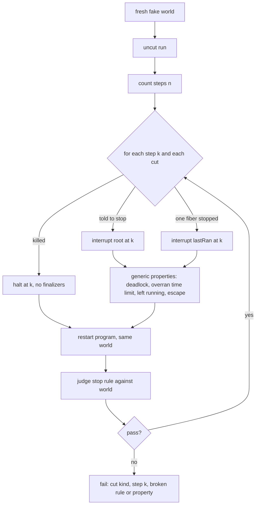
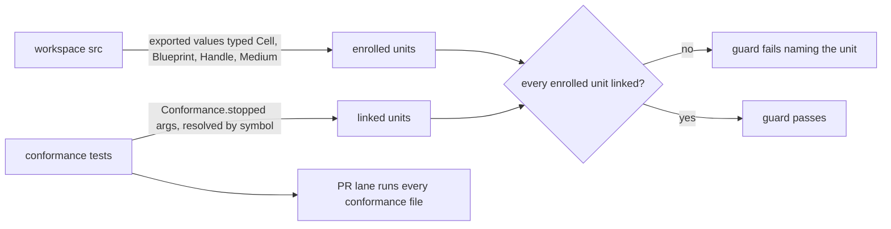

# Stop Obligation Check - Plan

## Goal Capsule

- **Objective:** Code that agents write meets what it owes when it is stopped (flush held work, tell whoever waits, finish or undo a change in another system, stop in time) without anyone telling them about Effect interruption, and any miss fails CI before merge.
- **Means:** every enrolled unit states a one-sentence stop rule, and CI stops it at every step and checks that rule (Key Decisions; KTD1, KTD5).
- **Product authority:** the repository owner chose this direction on 2026-09-26 after a 42-agent trial. The Product Contract owns what; the Planning Contract owns how.
- **Stop conditions:** stop and report if the kernel fix cannot make every calibration implementation pass (R7), or if a production unit cannot get a fake that passes its Fake-vs-Real contract suite.
- **Execution profile:** one pull request, delivered by `lfg`. Evaluator changes (U5, U6) land in their own commits, observed red before and green after. Deleting the skill (R12) happens after merge, once the gate is live on `main`.
- **Open blockers:** none.

---

## Product Contract

### Summary

CI stops every enrolled unit at every step, three ways (told to stop, one fiber stopped, process killed then restarted), then judges the unit's stated stop rule plus three generic properties. The test engine's false alarm is fixed first. Once existing units pass, the `effect-interruption` skill is deleted.

### Problem Frame

Correct stop behaviour today depends on an agent being prompted with the `effect-interruption` skill. Nobody knows where the repo is wrong: production source has 169 lifecycle call sites, and the only existing check (`Conformance.released`) is opted into by hand at about 25 sites, each with its own probe. The earlier gate that forced every site to have one was removed in #526 (commit `03567f9d8da`) because it measured reach, not detection.

A trial on 2026-09-26 measured what actually makes agents correct. It ran 42 agents with no knowledge of the session on three stop-obligation tasks, and every result went through the full stop-at-every-step check.

| Agent was given                                      | Passed |
| ---------------------------------------------------- | ------ |
| the task, with no stop rule and no test              | 4/6    |
| the task with the stop rule, and a normal test       | 5/6    |
| the task with the stop rule and the skill            | 6/6    |
| any setup that included the stop-at-every-step check | 24/24  |

The check caught all three failures:

- a flush with no time limit hung shutdown;
- a waiter waited forever once the worker was stopped alone;
- a sender that removes a batch before sending lost an event, which only a one-fiber cut revealed.

The same trial exposed two defects in the check itself. The published simulation kernel failed known-correct code at 4 of 491 cut points. And two passing agents left network sends running after shutdown, which nothing checked.

### Key Decisions

- **The forcing function is a written stop rule plus the stop-at-every-step check.** The trial shows the rule carries most of the gain and the check catches the rest. (session-settled: user-approved — chosen over project building blocks and a crash-only law: the blocks fit one of four real sites read, and agents under the law still hand-wrote masks.) Governs R1, R4, R5, R6.
- **No lint rule decides where masks go.** Where cleanup must be protected is a judgement a syntax rule cannot make; outcomes are judged instead. (session-settled: user-directed — chosen over mask-placement lint: "a lint rule cannot legitimately determine where uninterruptible blocks should go".)
- **Stop obligations are the subject, not acquire/release.** Resource acquisition is already handled by Effect and by the resource kinds. (session-settled: user-directed — chosen over kind-owned acquire/release: "This task has nothing to do with acquire release semantics".)
- **No opt-out and no allowlist.** Opt-in checking is what left today's coverage unknown. (session-settled: user-directed — chosen over opt-in enrollment: "no point giving ai agents an escape hatch".) Governs R2, R3.
- **Deleting the skill is the finish line, and its content is not re-homed as prose.** A rule or AGENTS.md paragraph would recreate the prompting this removes. Governs R12.
- **Enforcement ships inside a published package, never in this repository's scripts.** A repo that installs our packages adopts one published command and gets the same enrollment check this repo runs. (session-settled: user-directed — chosen over the repo-root Deno guard: "a random script is not portable between repos"; over a Vitest plugin: "vite/vitest cannot do that", since the test runner transpiles without types; and over a `@ttsc/lint` project rule, because ttsc is incompatible with `@effect/tsgo`.) Governs R13.
- **The command is `systemf stops`, the first subcommand of one generic `systemf` CLI.** `@systemfsoftware/systemf` (`packages/systemf`) replaces the single-purpose `@systemfsoftware/stop-enrollment`, which was never published. The command tree is `effect/unstable/cli`, which also deletes the hand-written argument parser. Each check is a capability subtree under `src/`, and only the root command knows the list. (session-settled: user-directed — "morph it into a generic systemf cli".) Governs R13, R14.
- **Consumers get it through Nix, and the flake's `systemf` runs under bubblewrap.** It follows the gritlint precedent (`nix/gritlint.nix`, `nix/gritlint-sandbox.nix`). The Nix build compiles from this repository's source with nixpkgs' `fetchPnpmDeps` (pnpm 12 workspaces, fixed-output hash) and ships a `pnpm deploy --prod` closure behind a `nodejs` wrapper. The sandbox binds `/nix/store` and the enclosing repository read-only, puts a tmpfs on `/tmp`, clears the environment, and unshares everything, including the network. (session-settled: user-directed — "consumers need to be able to run it bubblewrap and distributed over nix".) Alternatives weighed:
  - Build a published npm tarball with `buildNpmPackage` and a committed `package-lock.json`. Rejected: the flake would lag the source it sits beside, and it cannot build before the first publish.
  - A `bun build --compile` single binary. Rejected: the binary is dynamically linked and needs patchelf, the TypeScript 7 native binary still ships beside it, and Bun would become a second runtime for the TypeScript native API.
  - The chosen source build costs one fixed-output hash (`pnpmDepsHash`) that moves whenever the CLI's dependency closure moves. A stale hash fails loudly, the same as gritlint's `cargoHash`.

  Governs R15.

### Requirements

**Stop rules**

- R1. Every enrolled unit states its stop rule: one sentence saying what must be true after the unit is stopped, killed, or restarted, written as a check against a fake of each outside system the unit talks to.
- R2. Enrollment follows from what a unit is: every production Cell, Blueprint, Handle, and daemon medium, never its author opting in.
- R3. An enrolled unit without a stop rule fails CI.

**The check**

- R4. CI runs each enrolled unit uncut, then again stopped at every step in three ways: the unit told to stop, a single fiber stopped, and the process killed then restarted.
- R5. After each run and a restart, CI judges the unit's stop rule against the fake outside world.
- R6. CI also judges three properties for every enrolled unit, with no rule written: stopping finishes within the unit's declared time limit, no waiter waits forever, and nothing (fiber or outside call) is left running after stop.
- R7. Code that meets its rule never fails the check; engine faults are not reported as the unit's failures.
- R8. Each failure names the kind of cut, the step, and the broken rule or property in plain words.
- R9. The check runs on every pull request as a required gate, not in an advisory or nightly lane.

**Engine**

- R10. The simulation kernel resolves a race or timeout inside cleanup code the way Effect's own runtime does, pinned by a regression test.

**Migration and retirement**

- R11. Every existing stop obligation in production source becomes an enrolled unit with a rule and passes the check.
- R12. The `effect-interruption` skill is deleted after R1–R11 hold.

**Portability**

- R13. The check that every unit is reached by a stop check ships as a published command that runs against one package's own tsconfig in any repository; it finds unit kinds by package and export name, so it works where they resolve to published declaration files, and no repository-local script takes part in stop enforcement.
- R14. The stop check is one subcommand of a generic `systemf` CLI; a package opts in with `"check:stops": "systemf stops"`, and a later check is another subcommand, not another package or bin.
- R15. `nix run github:systemfsoftware/systemfsoftware#systemf -- stops` runs the check on Linux inside bubblewrap: no network, the repository and `/nix/store` read-only, only a private `/tmp` writable. It gives the same verdict as the npm-installed command on the same package. `systemf-unwrapped` is the same program without the sandbox, for every flake system.

### Acceptance Examples

- AE1. **Covers R4, R5, R8.** **Given** an exporter whose sender takes a batch out of its buffer before sending, **when** CI stops only the sender fiber at the step between the two, **then** CI fails with "one fiber stopped at step N: lost 1 accepted event".
- AE2. **Covers R6.** **Given** an exporter that flushes on stop with no time limit, **when** the collector is down and the exporter is told to stop, **then** CI fails with "stop never finished".
- AE3. **Covers R6.** **Given** an exporter that sends each batch on a detached fiber, **when** the collector is down and the exporter stops, **then** CI fails with "left running after stop" even though every accepted event was delivered after restart.
- AE4. **Covers R7, R10.** **Given** a correct exporter whose cleanup delivers what it holds under a timeout, **when** CI stops it at every step, **then** every cut passes.
- AE5. **Covers R2, R3.** **Given** a new daemon medium that calls an outside process and has no stop rule, **when** CI runs, **then** it fails naming the medium and the missing rule.
- AE6. **Covers R4, R5.** **Given** a transfer that re-checks the balance after a restart instead of reading its recorded decision, **when** the process is killed after the debit and restarted with exactly enough funds opening, **then** CI fails with "expected a=0 b=30, got a=0 b=0".

### Success Criteria

- Re-running the blind-agent trial against real repo units: agents without the skill pass at least as often as agents given it.
- Zero false alarms on a calibration set of known-correct implementations.
- The skill directory no longer exists and no rule, AGENTS.md, or doc paragraph restates its content.

### Scope Boundaries

- Out: kind-owned acquire/release and resource lifecycle design.
- Out: lint rules on mask, finalizer, or `uninterruptible` placement.
- Deferred: building blocks for common obligations (outbox, worker ending, recorded change); reconsider only where they fit real sites.
- Deferred: a crash-only design law.
- Deferred: exploring more than one scheduling order per cut.
- Out: fixing stryker-js-effect's in-place backup bugs (separate repository).

### Dependencies / Assumptions

- The simulation kernel cannot drive real asynchronous I/O, so every outside system an enrolled unit talks to needs a fake the kernel can run.
- Root cause of the kernel false alarm: the kernel defers a whole resume (`fiber.evaluate`) as a queued step, so Effect's suspension-consuming prologue runs late. A newer resume can then consume the suspension, and the orphaned one delivers `undefined` to a race continuation. The candidate fix is 17 lines in `packages/sim/effect-sim-kernel/src/internal/kernel.ts` (consume the suspension before queueing, in `resumeExternallyThrough`), proven against two repros and the prototype harness.
- The check is only as honest as its fakes: a fake that behaves unlike the real system passes wrong code. Each fake needs a Fake-vs-Real contract test (`skill://test-layer-selection`, Fake Fidelity check).
- The check is only as strong as the stated rule: a weak or wrong sentence passes wrong code, and nothing generic can catch that.
- One scheduling order per cut misses bugs that need two fibers interleaved differently; the trial did not measure how many exist.
- The stop-rule check is a model-based conformance spec (`*.conformance.test.ts`, the `write-conformance-specs` family). The kernel fix is pinned by a deterministic regression test.

### Outstanding Questions

**Deferred to Implementation**

- The exact place each unit's time limit is read from, where the unit exports none today.
- Which fixture shape each package's fakes take; the existing `tests/__fixtures__/` style per package wins.
- Final wording of each failure line beyond the AE templates.

### Product Contract preservation

changed: R2. "A cell, resource kind, or daemon medium that calls something outside its process" became "every production Cell, Blueprint, Handle, and daemon medium". Whether a unit calls outside its process cannot be derived from code, and a hand-written marker would be an opt-out (KTD5). Resource kinds are Blueprints and Handles now; the `.resource.ts` suffix is retired (`packages/oxlint-plugin/oxlint-plugin-cell-architecture/src/rules/kind-file.ts`).

### Sources / Research

- Trial run (local, gitignored): `.context/compound-engineering/ce-prototype/2026-09-26-stop-obligations/`: the `decisions.md` summary, harness and verdicts under `01-viability/`, and `kernel-fix.diff`.
- Existing stop obligations read during the brainstorm:
  - `packages/trace/trace-spec/src/observation-window.handle.ts:73-74`: flush through OpenTelemetry `provider.shutdown()`.
  - `packages/daemon/effect-daemon-cluster/src/ClusterMedium/medium.ts:67-68`: ending reported via `onExit` to a `Deferred`, program run by the sharding runner.
  - `packages/daemon/effect-daemon-socket/src/SocketMedium/socket-medium.ts:130-134`: failure reported to the reader via `Queue.failCause`.
  - `packages/daemon/effect-daemon-spec/src/Supervisor/running-supervisor.handle.ts:180-186`: shutdown request sent under a mask, wait left interruptible.
- Existing opt-in check: `packages/sim/conformance-spec/src/Conformance/released.ts`.
- Removed coverage gate: commit `03567f9d8da` (#526).
- Precedent for crash-and-restart simulation as a correctness gate: FoundationDB simulation restart tests (https://apple.github.io/foundationdb/testing.html) and TigerBeetle's VOPR (https://github.com/tigerbeetle/tigerbeetle/blob/main/docs/internals/vopr.md).

---

## Planning Contract

### Assumptions

- Widening R2 to every Cell, Blueprint, Handle, and medium matches the owner's "no escape hatch" direction. A unit whose only parties are in-process still owes its waiters and callers, so it still has a rule.
- A crash is simulated by halting the kernel run after step k without running finalizers, as the trial harness did (`.context/compound-engineering/ce-prototype/2026-09-26-stop-obligations/01-viability/lib/sweep.ts`). The kernel has no process-death mode, and a halted run leaves the fake world exactly as a killed process would.
- Stop-check cost fits the CI test job once packed by recorded timings. U6 lands after the migration, so its CI-profile measurement covers every stop check that will run.

### Key Technical Decisions

- KTD1. **One harness, `Conformance.stopped`, replaces `Conformance.released`.** It takes a fresh fake world per run, the unit's program, its restart program, its rule, and its time limit, then runs every cut. `released` is deleted and its callers in 14 conformance files migrate, so there is one stop check, not two. Governs R1, R4, R5, R6, R8.
- KTD2. **The three cuts map onto kernel options that already exist.** "Told to stop" is `interrupt: { atStep: k, target: 'root' }`. "One fiber stopped" is `interrupt: { atStep: k, target: 'lastRan' }`, the fiber that ran step k. "Killed" is halting the run at step k with no finalizers, then running the restart program against the same world. Each of the first two cuts is also followed by a restart before the rule is judged (R5). Governs R4, R5.
- KTD3. **The generic properties come from kernel outcomes, not from the rule.** A run that ends in `Deadlock` means some waiter waits forever. A run that runs away, or whose stop takes longer in virtual time than the time limit, did not stop in time. A completed run with unfinished fibers left something running; U2 exposes those fibers from the kernel's existing tracking (`Kernel.fibers`, `describeSuspended` in `packages/sim/effect-sim-kernel/src/internal/deadlock.ts`). An outside call through a fake is a suspended fiber, so the same field covers it. A call that reaches a real host timer or socket already ends the run as `Escape` or `Blocked`, and the harness reports that as a failure naming the site. After a killed cut nothing of the dead process runs, so for that cut the properties are judged on the restart run. Governs R6.
- KTD4. **The time limit is read from the unit, never tuned in the test.** Where a unit already has one (a medium's Graceful millis, an exporter's shutdown budget), the stop check passes that value. Where none exists, the unit gains an exported constant and the check reads it. A number tuned until a fixture passes is a fixture alias (`docs/solutions/architecture-patterns/a-law-floor-must-be-structural.md`). Governs R6.
- KTD5. **Enrollment is derived from types and linked by symbol.** Superseded in carrier by KTD12: the repo-root Deno guard is deleted. The semantics stay: a unit is enrolled by what its type is, never by a filename or an author's marker, and it is linked only when a `Conformance.stopped` call reaches it through symbols, directly or through a checked unit's own code.
- KTD6. **The pull-request lane runs every conformance file.** The `VITEST_LANE=pr` exclusion (`packages/toolchain/vitest-config/lib/base.js`, the "Select the pr lane" step in `.github/workflows/reusable-checks.yml`) is removed rather than special-cased for stop checks. A second suffix for stop checks would be another label route. The measured CI cost decides test-job sharding, not whether the checks run (`docs/solutions/performance-issues/ci-gate-silent-then-timed-out-after-kernel-exploration.md`). Governs R9.
- KTD7. **The kernel fix consumes Effect's suspension when a resume is queued, and it is pinned by the two minimal repros.** The fix is `.context/compound-engineering/ce-prototype/2026-09-26-stop-obligations/kernel-fix.diff`. The repros are copied under `kernel-repros/` beside it. A determinism sweep proves nothing about this defect (`docs/solutions/architecture-patterns/repetition-cannot-observe-constant-io.md`), so the pins are specific schedules. The fix reads Effect's private `_yielded` field, so a pin also asserts that field still exists and behaves on the vendored Effect (pack: boundary-testing, pin-dependency-semantics.md). Governs R7, R10.
- KTD8. **Adapters are judged by Fake-vs-Real law suites, not by the stop check.** An adapter's own stop logic, such as `SandboxRuntime.release`'s stop, kill, destroy chain or `NodeHostProber`'s socket close, talks to the real system. The stop check replaces the adapter with a fake, so the fake and the real adapter run one shared set of law cases, the real one against a local system oracle (pack: boundary-testing, fake-and-real-store-laws.md; pack: boundary-testing, real-system-oracles.md). A unit whose parties are all in-process needs no fake; the check runs its real parties. Governs R7, R11.
- KTD9. **No double fault in this change.** Crash, crash the restart, then restart clean doubles every sweep. The single crash-and-restart cut catches the lost-decision failure the trial found (AE6); failures that need a second crash are not checked and stay deferred.
- KTD10. **The skill is deleted after merge, from the harness profile.** It lives at `/opt/omp-profile/skills/effect-interruption`, outside the repository. Deleting it before the gate is live on `main` would leave agents with neither. Governs R12.
- KTD11. **No stop declaration on the unit constructors.** Requiring a one-sentence `owes` at `Sandwich.named`, `Blueprint.make`, `Handle.make`, and `Supervisor.Medium.make` was weighed and dropped: it breaks all 40 units, `owes: 'x'` satisfies it, and the trial measured agents given a stated rule, not agents writing their own. The reachability check plus `Conformance.stopped` is what turns CI red. (session-settled: user-selected — chosen over a required constructor declaration.)
- KTD12. **Reachability is a published CLI on the TypeScript 7 native API.** The enrollment check moves from `scripts/guards/check-stop-enrollment.ts` into a published package with a `stop-enrollment` bin that runs in Node on `typescript/unstable/async`, the same `typescript` that `@effect/tsgo` patches. It takes one package root, loads that package's test tsconfig (src plus tests), enrolls and links exactly as KTD5 states, and also fails when the package's `test` script never runs the conformance project. Kinds are found by resolving the `@systemfsoftware/effect-cell-types` and `@systemfsoftware/effect-daemon-spec` exports (`Cell`, `Blueprint`, `Handle` and their `Definition`s, `Supervisor.Medium` and `MediumPortShape`), not by `src` paths, so the check enrolls units in a repository where those kinds resolve to `dist/*.d.ts`. Alternatives weighed (REPO-W8):
  - A published Vite/Vitest plugin: rejected. The test runner transpiles without type information.
  - An oxlint JS rule in the published preset: rejected. It sees one file at a time with no types, so linking a unit to a check in another file would need filename conventions (CONST-T12).
  - A `@ttsc/lint` project rule: rejected. ttsc is incompatible with `@effect/tsgo`.
  - An `@effect/tsgo` diagnostic: rejected for this change. It is an upstream package this repo does not own, and it would have to know our kinds.
  - Residual accepted: a consuming repository adds the command to its CI once, as it adopts any linter. No tool can force a test file to exist without the consumer running some command.
    Governs R2, R3, R13.

### High-Level Technical Design

One enrolled unit through the stop check:

Enrollment and the gate:

### Sequencing

Engine first (U1, U2), then the harness (U3, U4). The enrollment guard (U5) lands next and is red on the current tree. The migration (U7-U11) and fake fidelity (U12) turn it green. The lane change (U6) lands after the migration, so its measured CI cost includes every stop check; its red run is a planted conformance file that the PR lane skips. Docs and changesets (U13) close. Portability follows: U14 publishes the guard's check as a CLI, and U15 runs it in every package and deletes the repo-root guard. U16 turns that CLI into `systemf`. U17 packages it in the flake behind bubblewrap. U18 proves the sandboxed build on a planted unit in CI, as its own Evaluator commit.

---

## Implementation Units

| U-ID | Title                                          | Key files                                                                                    | Depends on |
| ---- | ---------------------------------------------- | -------------------------------------------------------------------------------------------- | ---------- |
| U1   | Kernel resolves races inside cleanup correctly | `packages/sim/effect-sim-kernel/src/internal/kernel.ts`                                      | none       |
| U2   | Kernel reports fibers left running             | `packages/sim/effect-sim-kernel/src/internal/stepLoop.ts`                                    | U1         |
| U3   | `Conformance.stopped` replaces `released`      | `packages/sim/conformance-spec/src/Conformance/`                                             | U1, U2     |
| U4   | Conformance lint accepts `stopped`             | `packages/oxlint-plugin/oxlint-plugin-test-discipline/src/rules/`                            | U3         |
| U5   | Enrollment guard                               | `scripts/guards/check-stop-enrollment.ts`, `scripts/deno.jsonc`, `package.json`              | U3         |
| U6   | PR lane runs conformance files                 | `packages/toolchain/vitest-config/lib/base.js`, `.github/workflows/reusable-checks.yml`      | U7-U12     |
| U7   | Migrate existing `released` checks             | 14 `*.conformance.test.ts` files                                                             | U3, U4     |
| U8   | Enroll the supervisor and daemon media         | `packages/daemon/*`                                                                          | U7         |
| U9   | Enroll discern units                           | `packages/discern`                                                                           | U3         |
| U10  | Enroll microsandbox and readiness units        | `packages/effect-microsandbox`, `packages/effect-readiness`                                  | U7         |
| U11  | Enroll atom, memfs, and trace kinds            | `packages/atom/*`, `packages/effect-memfs`, `packages/trace/trace-spec`                      | U7         |
| U12  | Fake-vs-Real law suites for every fake used    | package `tests/*.integration.test.ts`, `tests/*.contract.test.ts`                            | U8-U11     |
| U13  | Docs, vocabulary, changesets                   | `CONCEPTS.md`, `.changeset/`                                                                 | U12        |
| U14  | Published stop-enrollment CLI                  | `packages/sim/stop-enrollment/`                                                              | U5         |
| U15  | Every package runs the CLI; guard deleted      | packages with units, `turbo.json`, `package.json`, `scripts/guards/check-stop-enrollment.ts` | U14        |
| U16  | `systemf` CLI replaces stop-enrollment         | `packages/systemf/`, every `check:stops` script, docs                                        | U15        |
| U17  | Flake package and bubblewrap sandbox           | `nix/systemf.nix`, `nix/systemf-sandbox.nix`, `flake.nix`                                    | U16        |
| U18  | Sandboxed journey in CI                        | `.github/workflows/reusable-checks.yml`                                                      | U17        |

### U1. Kernel resolves races inside cleanup correctly

**Goal:** a race or timeout inside a scope finalizer resolves under the kernel exactly as under Effect's own runtime.

**Requirements:** R7, R10; AE4. KTD7.

**Dependencies:** none.

**Files:**

- modify `packages/sim/effect-sim-kernel/src/internal/kernel.ts` (`resumeExternallyThrough`)
- test `packages/sim/effect-sim-kernel-tests/tests/effect-regressions.integration.test.ts`, fixtures under `packages/sim/effect-sim-kernel-tests/tests/__fixtures__/`

**Approach:**

1. Apply `kernel-fix.diff`: consume the fiber's pending suspension before the resume is queued.
2. Port the two minimal repros (`kernel-repros/min.ts`, `kernel-repros/dyn-min.ts`) into the existing regression feature as fixed schedules.

**Patterns to follow:** the existing scenarios in `effect-regressions.integration.test.ts`.

**Test scenarios:**

- Covers AE4. A program whose finalizer runs `Effect.timeout` over a send that completes in time, root interrupted at the step that minimal repro names: the run completes with the send's value, not `undefined`.
- A finalizer racing two effects, root interrupted at the repro's step: the winner's value reaches the race continuation.
- The same two programs on Effect's own runtime produce the same exits (the control).
- Effect's fiber still exposes `_yielded` as a callable guard after a suspension and clears it after a resume (dependency pin).

**Verification:** both repros fail before the fix and pass after; the kernel-tests package passes.

### U2. Kernel reports fibers left running

**Goal:** a completed run says which fibers were still unfinished when the root exited.

**Requirements:** R6. KTD3.

**Dependencies:** U1.

**Files:**

- modify `packages/sim/effect-sim-kernel/src/internal/stepLoop.ts` (`RunCompleted`), `packages/sim/effect-sim-kernel/src/internal/deadlock.ts` if `describeSuspended` needs to serve both paths
- test `packages/sim/effect-sim-kernel-tests/tests/started-children.integration.test.ts`

**Approach:** add the unfinished fibers, described the way deadlocks already describe them, to the completed result. An empty list means nothing was left.

**Test scenarios:**

- A root that forks a detached fiber suspended on a never-completing fake call, then exits: the result lists one fiber left running, with its innermost frame.
- A root whose forked children all finish or are interrupted by scope close: the list is empty.
- A root interrupted at step k whose scope closes every child: the list is empty.

**Verification:** the kernel-tests package passes; existing consumers of `RunCompleted` still typecheck.

### U3. `Conformance.stopped` replaces `released`

**Goal:** one harness runs every cut, judges the generic properties and the unit's rule, and reports failures in plain words.

**Requirements:** R1, R4, R5, R6, R7, R8; AE1, AE2, AE3, AE4, AE6. KTD1, KTD2, KTD3, KTD4, KTD9.

**Dependencies:** U1, U2.

**Files:**

- create `packages/sim/conformance-spec/src/Conformance/stopped.ts`
- modify `packages/sim/conformance-spec/src/Conformance/report.ts` (new problems and their plain-word renderings), `packages/sim/conformance-spec/src/Conformance/mod.ts`
- delete `packages/sim/conformance-spec/src/Conformance/released.ts`
- test `packages/sim/conformance-spec/tests/stopped.integration.test.ts` (replaces `released.integration.test.ts`)
- create calibration fixtures under `packages/sim/conformance-spec/tests/__fixtures__/`: exporter, worker, and transfer implementations, known-correct and known-wrong, ported from the trial's `01-viability/zz-calibration/`

**Approach:**

1. The spec a caller supplies: a world factory, the program, the restart program, the rule, and the time limit (KTD4).
2. Run uncut once to count steps and to judge the rule, so a rule that fails without any cut is reported as a broken unit, not a cut failure.
3. For each step and cut (KTD2), run on a fresh world, then check the generic properties (KTD3), then restart and judge the rule.
4. Report the first failure per cut kind with the step and the broken rule or property, and the count of cuts tried.

**Patterns to follow:** `released.ts`'s counted-then-cut structure; `report.ts`'s `render`.

**Test scenarios:**

- Covers AE1. A sender that takes a batch out of its buffer before sending, one-fiber cut: fails with "one fiber stopped at step N: lost 1 accepted event".
- Covers AE2. An exporter that flushes on stop with no time limit, collector down: fails with "stop never finished".
- Covers AE3. An exporter that sends each batch on a detached fiber, collector down: fails with "left running after stop" even though the rule holds after restart.
- Covers AE6. A transfer that re-checks the balance after restart instead of reading its recorded decision, killed after the debit with exactly enough funds: fails with "expected a=0 b=30, got a=0 b=0".
- A worker that never tells its waiter when only the worker is stopped: fails with "waited forever".
- Covers AE4. Every known-correct calibration implementation passes every cut in every world.
- A rule that fails on the uncut run is reported as such, naming no cut.
- A program with zero steps is reported as not checked, never as a pass.

**Verification:** every known-wrong fixture fails with its expected line, every known-correct fixture passes, and the package passes.

### U4. Conformance lint accepts `stopped`

**Goal:** the existing lint that requires a conformance harness in every `*.conformance.test.ts` names `stopped` and no longer names `released`.

**Requirements:** R1. KTD1.

**Dependencies:** U3.

**Files:**

- modify `packages/oxlint-plugin/oxlint-plugin-test-discipline/src/rules/conformance-test-requires-harness.ts`, its `.config.ts`, and the plugin `README.md` row
- test `packages/oxlint-plugin/oxlint-plugin-test-discipline/src/rules/__tests__/conformance-test-requires-harness.test.ts` (its fixtures and expected message name `released` today)

**Test scenarios:**

- A conformance file calling `Conformance.stopped`: no report.
- A conformance file calling only `Conformance.released`: reported.

**Verification:** the plugin's tests pass.

### U5. Enrollment guard

**Goal:** CI fails naming every enrolled unit that has no stop check.

**Requirements:** R2, R3; AE5. KTD5.

**Dependencies:** U3.

**Files:**

- delete `scripts/guards/check-stop-enrollment.ts` and its `guard:projects` wiring (superseded by U15; the guard's selftest cases become U15's rule cases)

**Approach:**

1. Superseded by U15. The guard landed red-then-green on this branch and is removed once U15's rule is enabled in every package.

**Execution note:** this is an Evaluator surface. Land it alone and run it on the current tree first; it must fail there, listing today's unchecked units, before any migration commit.

**Patterns to follow:** `scripts/guards/check-project-membership.ts` (Deno, `--selftest`).

**Test scenarios:**

- Covers AE5. Selftest tree: a medium built with `Supervisor.Medium.make` and no stop check: fails naming the medium and "has no stop rule".
- Selftest tree: the same medium with a stop check passing it to `Conformance.stopped`: passes.
- Selftest tree: a Cell built by a `Sandwich.named(...)` chain and a Cell built by a `Cell` combinator: both enrolled.
- Selftest tree: a Blueprint declared in a file without the `.blueprint.ts` suffix: still enrolled.
- Selftest tree: a stop check that imports the module but passes a different export: the unit stays unlinked.
- Selftest tree: a stop check outside a `*.conformance.test.ts` file: the unit stays unlinked.
- Selftest tree: a package with no units: passes with zero enrolled, and the guard reports the count it checked.

**Verification:** selftest passes; the real tree fails before U7-U12 and passes after.

### U6. PR lane runs conformance files

**Goal:** every stop check runs on every pull request inside the required gate.

**Requirements:** R9. KTD6.

**Dependencies:** U7, U8, U9, U10, U11, U12.

**Files:**

- modify `packages/toolchain/vitest-config/lib/base.js` (drop `isPrLane`, `laneLeavesOut`, the pr-lane branch of `splitProjects`, and the stale coverage-gate doc comment), `packages/toolchain/vitest-config/lib/base.d.ts` if exported names change
- modify `.github/workflows/reusable-checks.yml` (the "Select the pr lane" step stops exporting `VITEST_LANE=pr`; `CONFORMANCE_PROFILE=local` stays), `turbo.json` (drop `VITEST_LANE` from the test task env), `.github/AGENTS.md` (lane conventions)

**Approach:** remove the lane rather than add a second one. Measure the test task at the CI profile with every stop check present, before and after the change. If the test job no longer fits its 30-minute timeout, split it from the recorded test timings in the same commit.

**Execution note:** Evaluator surface, own commit. Observe red first: on a PR-lane run, a planted failing conformance file is skipped before the change and fails after. The planted file is removed before the commit lands.

**Test expectation:** none -- the lane is judged by the observed red and green PR-lane runs; `packages/toolchain/vitest-config` has no test surface and a test pinning a removed branch would test wiring.

**Verification:** a PR run executes every package's conformance project; the measured CI test time before and after is recorded in the PR body.

### U7. Migrate existing `released` checks

**Goal:** every existing `Conformance.released` call becomes a `Conformance.stopped` check with a stated rule, a restart, and a time limit.

**Requirements:** R1, R5, R11. KTD1, KTD4.

**Dependencies:** U3, U4.

**Files:** modify

- `packages/trace/trace-spec/tests/observation-window.conformance.test.ts`
- `packages/daemon/effect-daemon-cluster/tests/cluster-medium.conformance.test.ts`
- `packages/daemon/effect-daemon-socket/tests/socket-medium.conformance.test.ts`
- `packages/daemon/effect-daemon-process/tests/process-medium.conformance.test.ts`
- `packages/daemon/effect-daemon-microvm/tests/microvm-medium.conformance.test.ts`
- `packages/effect-memfs/tests/in-memory-store.conformance.test.ts`, `packages/effect-memfs/tests/open-file.conformance.test.ts`
- `packages/effect-microsandbox/tests/boot-sandbox-release.conformance.test.ts`
- `packages/atom/effect-atom/tests/registry.conformance.test.ts`
- `packages/rx-effect/tests/from-observable.conformance.test.ts`
- `packages/effect-readiness/tests/probe-release.conformance.test.ts`
- `packages/gherkin/storybook-gherkin/tests/story-leave.conformance.test.ts`
- `packages/effect-cell-types/tests/sandwich.conformance.test.ts`
- `examples/inventory-fulfillment/tests/pg-runtime-release.conformance.test.ts`
- `packages/sim/conformance-spec/README.md` (its `released` section)
- and their `tests/__fixtures__/` fakes where a fake must record state that survives a restart

**Approach:** each existing probe becomes the rule sentence. Each fake gains the state a restart reads. Where a check ran only on a settled success, the rule now also covers the failure and shutdown endings.

**Test scenarios:**

- Each migrated check passes every cut on the current production code.
- For each package, deleting the unit's cleanup step (a local, uncommitted mutation) makes its check fail with a named cut and step. This is run once per package during implementation to prove the rule can fail; it is not committed.

**Verification:** every migrated package passes; no `Conformance.released` reference remains in the repository.

### U8. Enroll the supervisor and daemon media

**Goal:** every Blueprint, Handle, Cell, and medium in the daemon packages has a stop check.

**Requirements:** R1, R2, R11.

**Dependencies:** U7.

**Files:**

- test `packages/daemon/effect-daemon-spec/tests/running-supervisor.conformance.test.ts` (create) covering `running-supervisor.handle.ts` and `supervisor-step.cell.ts`
- modify the four medium conformance files from U7 (cluster, socket, process, microvm) so each passes its `Supervisor.Medium` export to `Conformance.stopped`; this unit owns linking the media

**Approach:** the supervisor's rule states that every dynamic start or stop caller and every `awaitTerminated` waiter is answered (`Ops.resolveWaiting`, `supervisor-commands.ts` `executeTerminate`), and that no child is left running.

**Test scenarios:**

- A dynamic stop request in flight when the supervisor is told to stop: its caller is answered.
- A child told to stop that never exits within Graceful millis: the supervisor still answers and the child is gone after restart.
- `awaitTerminated` held by an outside fiber when the supervisor's own fiber is stopped: the waiter is answered.

**Verification:** the enrollment guard reports no daemon unit unlinked.

### U9. Enroll discern units

**Goal:** every Blueprint, Handle, and Cell in `packages/discern/src` has a stop check.

**Requirements:** R1, R2, R11.

**Dependencies:** U3.

**Files:**

- test `packages/discern/tests/*.conformance.test.ts` (create, one feature per unit family)
- fixtures under `packages/discern/tests/__fixtures__/` for the model provider, cache, and replay stores these cells talk to

**Approach:** each cell's rule states what its write owes: a recorded observation is either durable or never acknowledged, and no provider call outlives the stop.

**Test scenarios:**

- For each cell: the process killed between the provider's answer and the write, then restarted: no answer is acknowledged without being recorded.
- For each Blueprint and Handle: told to stop mid-use, nothing is left running and no waiter waits forever.

**Verification:** the enrollment guard reports no discern unit unlinked.

### U10. Enroll microsandbox and readiness units

**Goal:** every Blueprint, Handle, and Cell in `packages/effect-microsandbox/src` and `packages/effect-readiness/src` has a stop check.

**Requirements:** R1, R2, R11.

**Dependencies:** U7.

**Files:**

- test `packages/effect-microsandbox/tests/*.conformance.test.ts`, `packages/effect-readiness/tests/*.conformance.test.ts`
- reuse `packages/effect-microsandbox/tests/__fixtures__/sandbox-runtime.fixture.ts`

**Test scenarios:**

- `boot-microvm`, `await-readiness`, `await-job-completion`, `probe-virtualization` cells: told to stop at every step, no sandbox is left created and no host port stays held.
- `running-vm` handle: one fiber stopped mid-exec, the VM is destroyed after restart.
- `await-condition` cell: stopped while a probe connection is open, the connection is closed.

**Verification:** the enrollment guard reports no unit in these packages unlinked.

### U11. Enroll atom, memfs, and trace kinds

**Goal:** the remaining Blueprints and Handles have stop checks.

**Requirements:** R1, R2, R11.

**Dependencies:** U7.

**Files:** tests for `packages/atom/effect-atom/src/atom.blueprint.ts`, `packages/atom/effect-atom/src/atom-ref.handle.ts`, `packages/atom/effect-atom-react/src/scoped-atom.blueprint.ts`, `packages/effect-memfs/src/memory-file-system.blueprint.ts`, `packages/trace/trace-spec/src/observation-window.blueprint.ts`

**Test scenarios:**

- Atom Blueprint: disposed mid-refresh, no timer or subscription survives and no update lands after disposal.
- Scoped atom: the React owner unmounts mid-run, the atom's fibers are interrupted.
- memfs Blueprint: stopped with a watch open and a temp file held, both are released.
- Observation window Blueprint: stopped with spans held, every finished span reaches the exporter.

**Verification:** the enrollment guard passes on the whole tree.

### U12. Fake-vs-Real law suites for every fake used

**Goal:** each fake a stop check relies on passes the same law cases as the real adapter.

**Requirements:** R7, R11. KTD8.

**Dependencies:** U8, U9, U10, U11.

**Files:** for each package whose fake has no law suite today, the shared law cases in `tests/__fixtures__/`, run against the fake in a `tests/*.integration.test.ts` and against the real adapter in a `tests/*.contract.test.ts`. Suffixes follow the repo taxonomy in `packages/oxlint-plugin/oxlint-plugin-test-discipline/src/rules/test-suffix-outside-src.config.ts`. Existing real-oracle example: `packages/daemon/effect-daemon-socket/tests/stop-teardown.contract.test.ts`.

**Approach:** list every fake the stop checks import. For each without a suite, write the law cases once and run them on both sides; the real side runs against a local system oracle (loopback port, real temp directory, real child process). Stop behavior is in the laws: stopping during a call, calling after stop, killing mid-call.

**Test scenarios:**

- For each fake: the same law cases pass against the fake and against the real adapter.
- The sandbox runtime fake and the real microsandbox runtime agree on what a destroy after a failed stop leaves behind; the real side runs only where virtualization exists, like today's smoke lane.

**Verification:** every fake used by a stop check is exercised by a shared law set on both sides.

### U13. Docs, vocabulary, changesets

**Goal:** the vocabulary and release notes describe the stop check; nothing restates the skill.

**Requirements:** R12 preparation; Success Criteria.

**Dependencies:** U12.

**Files:**

- modify `CONCEPTS.md` (Stop Obligation, Stop Rule, Cut)
- create `.changeset/*.md` via `pnpm change` for `@systemfsoftware/effect-sim-kernel` (fix and new field), `@systemfsoftware/conformance-spec` (breaking: `released` removed, `stopped` added), `@systemfsoftware/vitest-config` (PR lane), and each package whose `src` changed for a time-limit constant
- modify `packages/sim/conformance-spec/README.md` if it documents `released`

**Test expectation:** none -- documentation and release intents.

**Verification:** `grep` finds no `Conformance.released` and no doc paragraph teaching masks, finalizers, or `uninterruptible` placement.

### U14. Published stop-enrollment CLI

**Goal:** any repository runs one published command per package and gets a failure for every unit no stop check reaches.

**Requirements:** R2, R3, R13; KTD5, KTD12.

**Dependencies:** U5.

**Files:**

- create `packages/sim/stop-enrollment/` (tsdown package, `bin: stop-enrollment`, peer dependency `typescript`), porting the guard's enrollment, linking, and test-script checks

**Approach:**

1. Resolve the unit kinds by package and export name through the program, never by a `src` path suffix.
2. Enroll and link per KTD5 over the package's own test program; the package root and tsconfig come from the command's arguments, never from a workspace file.
3. Report each unlinked module as its file and declarations with "has no stop rule", and exit 0 with the enrolled count otherwise.

**Test scenarios** (the guard's selftest cases, moved into the package's tests as fixture projects): a medium with no stop check fails naming it; the same medium with a check passes; a Cell built by a `Sandwich.named` chain and one built by a `Cell` combinator are both enrolled; a Blueprint in a file without a kind suffix is enrolled; a check that imports the module but passes another export leaves the unit unlinked; a private unit reached from a checked unit's code is linked; a package whose `test` script never runs the conformance project fails; a package with no units passes with zero enrolled; a fixture whose kinds resolve to declaration files, as in a consumer repository, still enrolls.

**Verification:** the package's tests pass; run on a real package with one stop check removed, the command exits non-zero naming that unit, and exits 0 after the check is restored.

### U15. Every package runs the CLI; guard deleted

**Goal:** every package with units runs `stop-enrollment` inside the gate, and no stop enforcement remains under `scripts/`.

**Requirements:** R3, R13.

**Dependencies:** U14.

**Files:**

- add a `check:stops` script to each package with units, run by `turbo.json` inside `pnpm check:local` and CI
- delete `scripts/guards/check-stop-enrollment.ts`, its `guard:projects` wiring in `package.json`, and its `scripts/deno.jsonc` import mapping

**Verification:** `pnpm check:local` exits 0; the per-package runs enroll the same 40 modules the guard enrolled, each linked.

---

### U16. `systemf` CLI replaces stop-enrollment

**Goal:** one `systemf` bin whose `stops` subcommand is today's check, with room for later checks as subcommands.

**Requirements:** R13, R14.

**Dependencies:** U15.

**Files:**

- move `packages/sim/stop-enrollment` to `packages/systemf` (npm `@systemfsoftware/systemf`, bin `systemf`); the check lives under `src/stops/`
- the root command and the `stops` subcommand use `effect/unstable/cli` (`systemf stops [--project <tsconfig>] [<packageRoot>]`, plus `--help` and `--version`); the hand-written `parseArguments` is deleted
- every `check:stops` script becomes `systemf stops`, and every devDependency moves to `@systemfsoftware/systemf`; `CONCEPTS.md`, the cell-architecture pack, the solution doc, the README, and the changeset name the new command

**Test scenarios:** the moved suite keeps every case and now calls the check through the `stops` command handler; no new tests, because argument parsing and help belong to `effect/unstable/cli`.

**Verification:** package `test`, `typecheck`, `lint`, `lint:tsgo`, `api:check` pass; `turbo run check:stops` enrolls the same 39 modules, each with a stop rule.

### U17. Flake package and bubblewrap sandbox

**Goal:** a consumer runs the check from the flake inside bubblewrap without Node, pnpm, or network access of its own.

**Requirements:** R15.

**Dependencies:** U16.

**Files:**

- `nix/systemf.nix`: `stdenv.mkDerivation` over a fileset of the lockfile, the workspace manifest and patches, and the packages the build needs; `fetchPnpmDeps` with `pnpm_12` and `pnpmWorkspaces` narrowed to the CLI's closure; build, `pnpm deploy --prod`, then a `makeWrapper` over `nodejs_24`
- `nix/systemf-sandbox.nix`: bwrap wrapper binding `/nix/store` read-only, and the nearest ancestor of `$PWD` that holds `.git` (else `$PWD`) read-only, with `--chdir "$PWD"`, `--tmpfs /tmp`, `--dev /dev`, `--unshare-all --new-session --clearenv --die-with-parent`; the gritlint cwd guard refuses unsafe paths
- `flake.nix`: `systemf` (sandboxed, Linux), `systemf-unwrapped` (every system), and a `checks.systemf` build

**Test scenarios:** none permanent; the Nix build is proven by U18's journey. Smoke, run once: from a package directory of this checkout, the sandboxed `systemf stops` gives the npm command's verdict, exits 1 on a planted unchecked unit, and cannot write to the repository or reach the network.

**Verification:** `nix build .#systemf` and `nix flake check` succeed; red and green observed through `result/bin/systemf stops`.

### U18. Sandboxed journey in CI

**Goal:** CI proves the flake's sandboxed `systemf` on this tree, the way the gritlint job proves its binary.

**Requirements:** R15.

**Dependencies:** U17.

**Files:** `.github/workflows/reusable-checks.yml` (own Evaluator commit)

**Approach:** build `.#systemf` with its closure cached by store path; allow user namespaces; install the workspace; then in one package, plant an unchecked unit and expect exit 1, restore it and expect exit 0.

## **Verification:** the job goes green on the PR, and the plant step's exit-1 assertion is what it checks.

## Verification Contract

- `pnpm check:local` exits 0 after the last edit.
- `pnpm --filter @systemfsoftware/effect-sim-kernel-tests test` and `pnpm --filter @systemfsoftware/conformance-spec test` pass, including the calibration set.
- `pnpm --filter @systemfsoftware/systemf test` passes, and `check:stops` (`systemf stops`) passes in every package with units; a planted unchecked unit fails it, both through the npm bin and through the flake's sandboxed `systemf`.
- The CI-profile test time is measured with `env -u CONFORMANCE_PROFILE CI=true pnpm exec turbo run test --summarize` before and after U6, and fits the test job's timeout.
- U5 and U6 each show a red run before their fix commit and a green run after.
- `gh pr checks --watch --fail-fast` exits 0.
- After merge, the blind-agent trial is re-run on one real enrolled unit (a new daemon medium task), skill against no skill, two agents per arm. Agents without the skill pass at least as often (Success Criteria).

---

## Definition of Done

- Every Product Contract requirement R1-R15 holds on the branch, and `check:stops` passes in every package with units with a non-zero enrolled total.
- No stop-enforcement logic remains under `scripts/`.
- Every known-wrong calibration fixture fails with its expected line and every known-correct one passes.
- No `Conformance.released`, `isPrLane` exclusion, or abandoned prototype code remains in the diff.
- The PR is open with CI green.
- After merge: `/opt/omp-profile/skills/effect-interruption` is deleted, and no rule under `/opt/omp-profile/rules` restates its content (R12).
