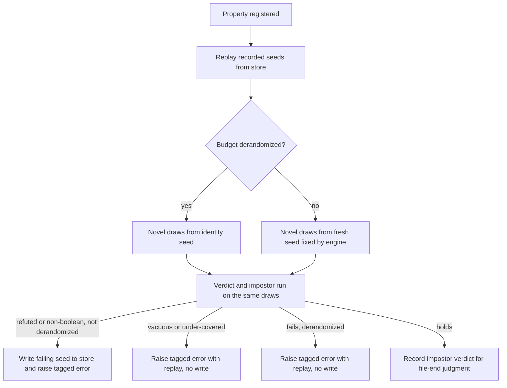
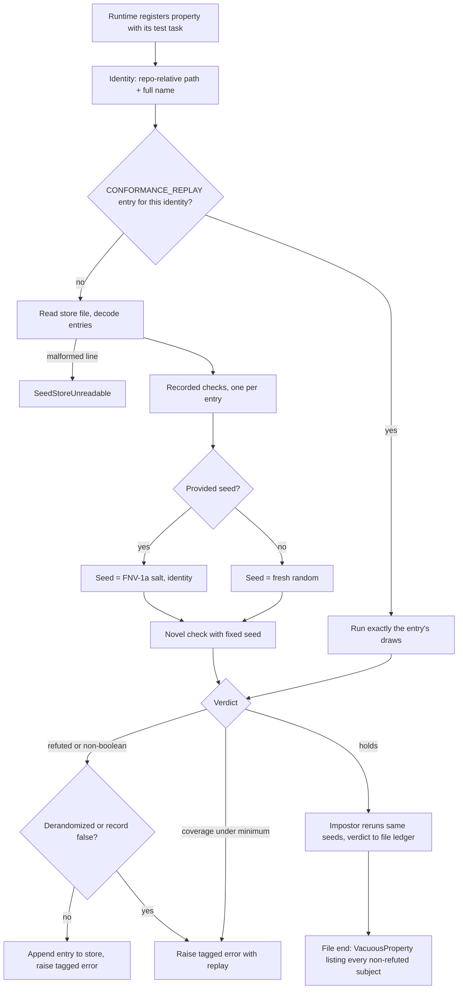
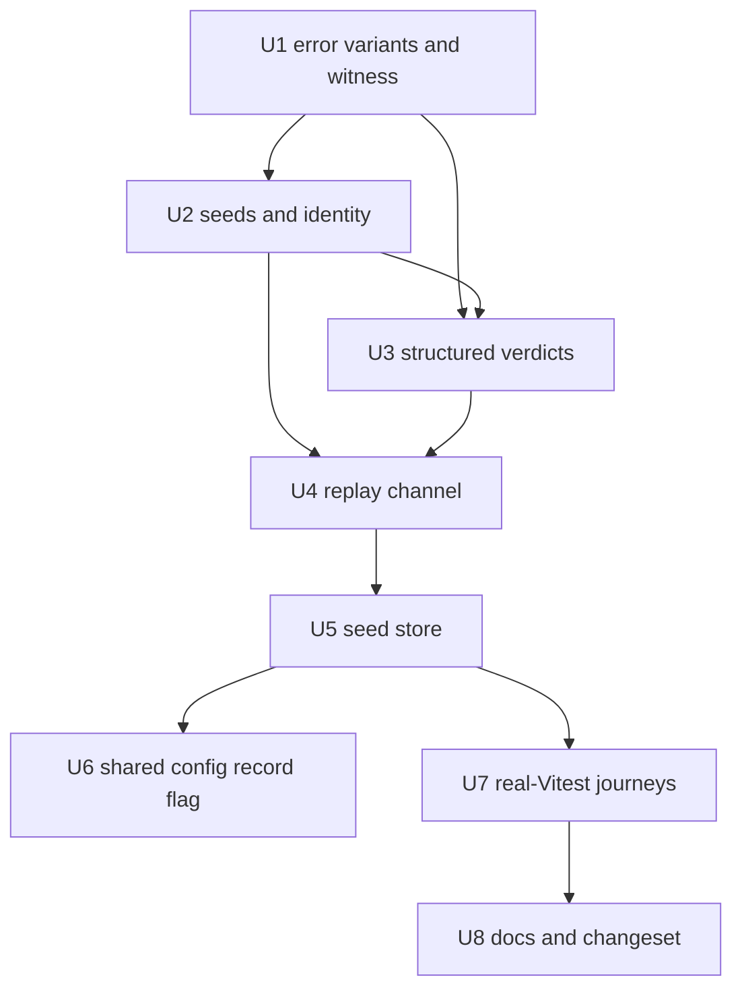

# Property Failure Structured Errors - Plan

## Goal Capsule

- **Objective:** When a property test written with `@systemfsoftware/vitest` fails in a consumer's CI, a mutation worker or an agent's session, a script or agent holding only the Vitest result can tell which properties failed and why, and can reproduce the same verdict without reading this package's source.
- **Means:** Exported tagged failure errors with structured fields and a replay the engine actually reads; per-property identity seeds under derandomized budgets; a checked-in seed store written on failure and replayed first (KD1-KD4, KTD1-KTD7).
- **Authority:** Issue #576's acceptance criteria are the acceptance floor. The Product Contract's R-IDs and Key Decisions win on behavior, and KD1 records the one declared departure from the issue's wording. The Planning Contract's KTDs win on mechanism; units override neither. The owner chose the state-of-the-art approach and delegated the remaining mechanism to planning.
- **Stop conditions:** Stop and report if a property's run cannot learn its own test identity without a global current-test lookup (KTD3), if Vitest's worker-to-reporter transport drops the error fields even through the Reported Tasks API (KTD8), or if a green suite needs an exemption, a lower budget or a weakened gate (R19).
- **Execution profile:** Deep, eight units in dependency order (see Sequencing). U6 edits the shared Vitest config another package owns, in its own commit.
- **Finishes and ships:** The LFG pipeline: `ce-work` implements, then simplification, review, a pull request and CI to green. Merging stays with the owner.
- **Open blockers:** None.

---

## Product Contract

### Summary

Every property failure the engine raises becomes a tagged error exported from the package entry. Its fields name each property involved with its call site, seed and run count, a readable witness, any coverage shortfall and a replay text that reproduces the verdict. Failing seeds are saved to a checked-in store and replayed before novel draws on every run. A budget that asks for derandomized runs gives each property its own stable seed.

### Problem Frame

On 2026-10-01, five of six mutation shards in `systemfsoftware/stryker-js-effect` failed because one property never drew its deciding input ([run 36935602456](https://github.com/systemfsoftware/stryker-js-effect/actions/runs/36935602456)). The only output was a paragraph saying the subject "always returned [object Object]". It named no seed, no drawn inputs and no way to replay.

Three defects sit behind that paragraph. The impostor stringifies the frozen output with `String(value)` and keeps only the last non-refuting property's evidence (`packages/runner/vitest/src/internal/property/impostor.ts:60`, `:182-187`). The error classes carry only prose, `CoverageBelowMinimum` has no tag, and `src/mod.ts` exports none of them. The rerun line prints `CONFORMANCE_REPLAY="seed=…;path=…"` (`src/internal/failure-record.ts:617`), but nothing in the package reads that variable; the only reader is `packages/effect-spec-runtime/src/KernelCase.ts:246`.

The consumer pinned `{ runs: 30, seed: 1 }` for every property, so every property drew from the same stream. A CI script or a coding agent could only diagnose the failure by reading this package's source.

### Actors

- A1. Consumer CI script or reporter: reads failure fields from Vitest's result.
- A2. Coding agent: reads the same fields and feeds the replay back to reproduce the failure.
- A3. Mutation worker (Stryker): runs with a derandomized budget and fails on purpose for every killed mutant.
- A4. Developer running tests locally with the default budget.

### Key Decisions

- KD1. **The engine writes failing seeds to the checked-in store on failure.** This departs from the issue's definition of recorded seeds as "seeds a consumer has saved"; the departure is declared here. Governs R16, R18. (session-settled: user-approved — chosen over a read-only store the consumer fills by hand and over writing only behind an update flag: proptest, Go fuzzing, Hypothesis and jqwik all record failures automatically.)
- KD2. **Recorded seeds replay before novel draws in every budget.** Resolves the issue's contradiction between its Goal (derandomized only) and its acceptance criterion ("in every budget") in favour of the criterion. Governs R17. (session-settled: user-approved — chosen over replaying only under derandomized budgets: every surveyed framework replays saved failures regardless of seeding.)
- KD3. **The store records seeds, not generated values.** Governs R16. (session-settled: user-approved — chosen over storing values: a seed still yields an in-domain input after the generator changes, per proptest's rationale.)
- KD4. **A property's identity is its repo-relative file path plus its full property name, not its source text.** Governs R13. (session-settled: user-approved — chosen over hashing the test's source as Hypothesis does: the seed survives body edits and refactors that keep the name.)
- KD5. **Derandomized runs never write the store.** A mutation worker fails on purpose for every killed mutant, so writing would fill the store and make verdicts depend on mutant order. This follows Hypothesis's CI profile, which disables its database and prints the replay instead. Governs R18.
- KD6. **A vacuous replay runs only the recorded draws.** Adding novel draws could let a lucky draw refute the impostor and pass a weak property, which the issue forbids. Governs R11.
- KD7. **The witness travels as rendered text and as a JSON-safe value.** Vitest serializes errors through `toJSON` and converts nested values on the way (functions become `"Function<name>"`), so a raw witness does not survive transport intact. Governs R3.
- KD8. **Replay texts extend the package's one replay grammar rather than adding a second format.** `src/replay.schema.ts` already defines that grammar. Governs R9.
- KD9. **Only two tests cross a process boundary.** Vitest's worker-to-reporter serialization and cross-process seed stability can only be observed across a real process, so those two journeys start real Vitest. Every other example runs in-process through the published surface, because spawning a process in an integration test fails the repository's test-layer admission gate. Governs R21, R22, R23.

### Requirements

**Failure errors**

- R1. Refuted, vacuous, under-covered and non-boolean failures are each their own tagged error, exported from the package entry. (pack: cell-architecture, four-channel-contracts.md) (pack: schema-laws, tagged-unions-over-state-by-presence.md)
- R2. Every failure error names each property involved with its call site, and the seed and run count each property ran with.
- R3. Every failure error carries its witness as rendered text and as a JSON-safe structured value. Records, arrays, tagged values, strings and `undefined` render distinguishably, and `[object Object]` never appears.
- R4. The witness depends on the kind: the shrunk counterexample for a refuted property; the frozen output of the subject or of each frozen record member for a vacuous verdict; hits and runs per class for under-coverage; the drawn values and the kind of value returned for a non-boolean verdict.
- R5. The vacuous error lists every vacuous subject in the file. For each subject it lists every non-refuting property's name, call site, seed, run count and frozen output.
- R6. A vacuous subject that was never called is reported as never called, with no frozen value. Exempt `it.law.idempotent` and `it.law.deterministic` laws in the same file are listed as exempt.
- R7. The under-coverage error carries, for each class left under its minimum, the class label, hits, runs and required minimum.
- R8. Each failure's fields reach a consumer of Vitest's result intact after Vitest's worker-to-reporter serialization.

**Replay**

- R9. Every failure error carries a replay text that, fed back to the engine, reproduces the same verdict.
- R10. The engine reads the replay channel that the rerun line prints.
- R11. Replaying a vacuous verdict runs each listed property on exactly the draws the verdict recorded, adding no novel draws.
- R12. Replaying a refuted property reproduces the same shrunk counterexample.

**Seeds**

- R13. When a provided budget asks for derandomized runs, each property draws from a seed derived from its identity (KD4). The seed is stable across processes, machines, registration order and file order, and differs between differently named properties.
- R14. Without a derandomization request, a property keeps today's default of 100 runs with a fresh random seed.
- R15. The engine fixes the seed of every check before running it, including impostor runs and coverage top-up draws, so each error can report it. Today a passing check does not report the seed it used, and coverage top-up draws use no seed at all.

**Seed store**

- R16. A property's failing seeds are recorded in a checked-in store keyed by the property's identity, and recording stays correct when Vitest runs test files in parallel workers.
- R17. A property's recorded seeds run before its novel draws in every budget.
- R18. Only a refuted or non-boolean failure writes its failing seed, and only in a run that is neither derandomized nor opted out of recording (KTD6). Vacuous and under-covered verdicts carry no counterexample and never write; a run that does not write only reports the replay.

**Gate integrity**

- R19. The constant-impostor gate stays on for every non-exempt property and judges the draws the property actually ran, including replayed recorded seeds.
- R20. Per-file judgment holds: a subject passes the constant-impostor gate when any property in the same file refutes its impostor, even if other properties on that subject do not.

**Proof and documentation**

- R21. One test starts real Vitest in a separate process, raises all four failure kinds, and reads every field from the run's result rather than from the in-process corpus runner. (pack: boundary-testing, no-mocks-on-internal-glue.md)
- R22. The derandomization proof runs one property in two separate processes and compares the inputs it drew.
- R23. Every other test runs in-process through the published surface and asserts on the errors' fields. Expected values come from literals or independent oracles, never from the renderer, the seed derivation or the replay parser under test. (pack: boundary-testing, real-system-oracles.md)
- R24. The README documents the error classes, their fields, the derandomization budget option, and the seed store's location and format under its constant-impostor gate and budget sections. It states that a generator change can stop a recorded seed reproducing its old failure, so a case that must always run belongs in the test source. The change ships with a changeset.



### Key Flows

- F1. Developer failure
  - **Trigger:** A property fails under the default budget.
  - **Actors:** A4
  - **Steps:** The engine raises the tagged error with its fields and replay text, then writes the failing seed to the store. The developer fixes the code and commits the store entry, which now runs before novel draws on every later run.
  - **Covered by:** R2, R9, R16, R17, R18
- F2. Mutation worker
  - **Trigger:** A Stryker worker runs a mutant with a derandomized budget, and a property kills it.
  - **Actors:** A3, A1
  - **Steps:** Each property draws from its identity seed, so the same mutant gets the same verdict on every worker. The failure raises a tagged error with replay text and writes nothing.
  - **Covered by:** R13, R18
- F3. Agent reproduction
  - **Trigger:** An agent reads a vacuous error from a CI run.
  - **Actors:** A2
  - **Steps:** The agent reads each property's name, call site, seed, runs and rendered frozen output, feeds the replay text back, and gets the same vacuous verdict locally.
  - **Covered by:** R5, R9, R11

### Acceptance Examples

- AE1. **Covers R3, R5, R9.** Given a property whose subject returns `{}` for every drawn input, when the file finishes, then it fails as vacuous, and the error's fields carry the property's name and call site, its seed, its run count, the frozen output rendered as `{}`, and a replay text. Reverting the change makes this test fail.
- AE2. **Covers R5.** Given two properties in one file that share a subject and neither refutes it, when the file finishes, then the vacuous error carries both properties' names, call sites, frozen outputs and run counts, not only the last one's.
- AE3. **Covers R6.** Given a property whose subject is never called during the vacuity check, when the file finishes, then the vacuous error says the subject was never called and carries no frozen value.
- AE4. **Covers R11, R12.** Given a refuted property's replay text, when it is fed back, then the same counterexample is reproduced. Given a vacuous verdict's replay text, when it is fed back, then the same vacuous verdict is reproduced.
- AE5. **Covers R13, R22.** Given a derandomized budget, when one property runs in two separate processes, then it draws identical inputs; when two differently named properties run, then they draw different inputs.
- AE6. **Covers R14.** Given no derandomization request, when a property runs, then it runs 100 times on a fresh random seed.
- AE7. **Covers R17.** Given a property with a recorded seed, under any budget, when it runs, then the recorded seed's draws run before any novel draw.
- AE8. **Covers R18.** Given the default budget and a property that is refuted, when the suite runs again, then the refuting draw runs before any novel draw. Given a derandomized budget, a property that is refuted and no recorded entry for it, when the suite runs again, then no recorded draw runs first, because the derandomized run wrote nothing.
- AE9. **Covers R7.** Given a coverage class confidently below its minimum, when the property finishes, then the error carries that class's label, hits, runs and required minimum.
- AE10. **Covers R8, R21.** Given each of the four failure kinds raised in a real Vitest run in a separate process, when the consumer reads the run's result, then every field named in R2-R7 is present.

### Scope Boundaries

- Deferred for later: emitting OpenPBTStats JSON Lines for tools such as Tyche; a shared or networked store fed by CI artifacts; pruning old store entries.
- Not changed: which law kinds are exempt (the issue requires asking first), the default budget, and the gate's on-by-default status. Exemptions, a lower budget or a silenced gate are never used to get a green run.
- No test pins message wording; human-readable messages may change freely.

### Dependencies / Assumptions

- Effect's `Arbitrary` check and `sampleEffect` accept a seed (`repos/effect/packages/effect/src/Arbitrary.ts`); a passing check result does not report its seed (`:274-278`), which is why R15 has the engine fix seeds itself.
- Effect errors serialize their own fields, including `_tag`, through `toJSON` (`repos/effect/packages/effect/src/internal/core.ts:628-646`), and Vitest uses `toJSON` when it serializes an error ([serialize.ts](https://github.com/vitest-dev/vitest/blob/main/packages/utils/src/serialize.ts)).
- Stryker runs tests in a sandbox copy of the project, so any store write a mutation run made would land in the sandbox; KD5 removes such writes regardless.

### Sources / Research

- Issue: `issue://576`.
- Prior plan whose replay machinery this extends: `docs/plans/2026-09-25-1526-feat-spec-failure-diagnostics-plan.md` (KTD5, KTD10).
- Code: `packages/runner/vitest/src/internal/property/engine.ts` (failure raise sites `:350-364`, file-end vacuous verdict `:486-490`, coverage draws `:270-276`), `impostor.ts`, `error.schema.ts`, `coverage.ts`, `defaults.ts`, `src/replay.schema.ts`, `src/internal/recorded-run.ts`, `tests/failure-corpus.runner.test.ts`.
- Coverage statistics already match QuickCheck's `stdConfidence` (certainty 10^9, tolerance 0.9): [Property.hs](https://github.com/nick8325/quickcheck/blob/master/src/Test/QuickCheck/Property.hs).
- Failure persistence and replay: [proptest](https://proptest-rs.github.io/proptest/proptest/failure-persistence.html), [Go fuzzing](https://go.dev/doc/security/fuzz/), [Hypothesis replaying failures](https://hypothesis.readthedocs.io/en/latest/tutorial/replaying-failures.html), [jqwik](https://jqwik.net/docs/current/user-guide.html), [rapid](https://github.com/flyingmutant/rapid/blob/master/engine.go).
- Derandomization: [Hypothesis settings](https://hypothesis.readthedocs.io/en/latest/reference/api.html) (`derandomize`, CI profile).
- Structured results: [fast-check RunDetails](https://github.com/dubzzz/fast-check/blob/main/packages/fast-check/src/check/runner/reporter/RunDetails.ts), [Hypothesis observability](https://hypothesis.readthedocs.io/en/latest/reference/integrations.html), [Tyche and OpenPBTStats](https://dl.acm.org/doi/fullHtml/10.1145/3654777.3676407).

---

## Planning Contract

Product Contract preservation: changed R18 — adds the recording opt-out that the brainstorm deferred to planning (KTD6); the deferred Outstanding Questions are answered by KTD2-KTD6 and removed. Every other R, KD, F and AE is unchanged.

### Key Technical Decisions

- KTD1. **The property failures are a closed set of `Schema.TaggedError` variants, all defined in `src/internal/property/error.schema.ts` and exported from the root entry `src/mod.ts`.** `PropertyRefuted`, `VacuousProperty`, `NonBooleanVerdict` and `CoverageBelowMinimum` keep their names. `NonBooleanVerdict` moves there from `src/internal/errors.schema.ts`, and `CoverageBelowMinimum` moves from a `Data.Error` in `coverage.ts` to a tagged error there, so one file holds every property-channel variant. The self-model refusal (`engine.ts` `refuseSelfModel`) stops borrowing `VacuousProperty` and becomes its own variant `SelfModelLaw` carrying the property's name and call site, because `VacuousProperty` now means an impostor verdict and one variant per failure is required (`CONSTITUTION.md` CONST-D2). The issue names the package entry, so the root entry is the home; `src/failure.ts` keeps its renderer surface. `InvalidBudget` stays as it is. Governs R1, R2. (pack: schema-laws, data-only-schema-classes.md)
- KTD2. **Witnesses are carried as a rendered string plus a JSON-safe projection, both built by the existing failure-record value renderer's traversal.** `renderValue`/`renderRecord`/`renderList` in `src/internal/failure-record.ts` already render records, arrays, tagged values, strings and `undefined` distinguishably, so no second renderer is written. The projection maps the same cases to JSON values and marks functions and symbols by kind. A vacuous frozen output is a tagged union, `Frozen` or `NeverCalled`, never an optional field. Governs R3, R4, R6. (pack: schema-laws, tagged-unions-over-state-by-presence.md)
- KTD3. **The engine owns every check's seed, and the property's identity comes from the running test's `ctx.task`, which the runtime hands to the program.** `runProperty` in `src/internal/runner.ts` already holds `ctx` for both the sync and effect lanes; the runtime passes the identity into the program instead of the program looking it up, so the property engine never calls `TestRunner.getCurrentTest()` (the corpus runtime in `recorded-run.ts` keeps its own lookup). The identity is the provided package name, the test file's path relative to the Vitest project root (`ctx.task.file.name`) and the test's full name without the file (`fullTestName`). A path relative to the project root is the same inside a Stryker sandbox copy as in the real tree, which a workspace-relative or absolute path is not. Without a derandomization request the engine draws a fresh non-negative 32-bit seed per run; with one it hashes the identity. The same seed drives the main check, the impostor rerun and the coverage top-up draws (`Arbitrary.sampleEffect` accepts `seed`). Governs R13, R14, R15.
- KTD4. **A provided budget asks for derandomization by carrying a `seed`; the engine then salts each property's identity hash with it.** Today a provided `seed` makes every property share one stream, which is the defect behind the downstream failure. After this change the same `{ runs: 30, seed: 1 }` gives each property its own reproducible seed with no consumer edit. Seed precedence is the property's own `arbitrary.seed` (literal), then the salted identity hash, then a fresh random seed; the salt is only computed when the property sets no seed. The hash is 32-bit FNV-1a over the UTF-8 bytes of the salt and the KTD3 identity parts, joined by NUL; it reads no clock, randomness, registration order or file order. The provided budget type gains `record` (KTD6) and is exported from the root entry as `PropertyBudget`. Because the package is at 1.0.0 and a shared-stream consumer's draws change, the changeset bumps major and the README gives the migration: set `arbitrary.seed` on each property to keep a literal seed. Governs R13, R14. (session-settled: user-approved — chosen over hashing the test's source as Hypothesis does: the seed survives body edits and refactors that keep the name.)
- KTD5. **The replay grammar in `src/replay.schema.ts` gains a property form, and the engine reads it from `CONFORMANCE_REPLAY`.** A property entry starts with its own key (`property=<identity hash>`) so it never decodes as the kernel's `seed=…;path=…` form, which still decodes unchanged; it then names the seed, the run count and, for a refuted entry, the shrink path, size and attempt the generator's replay token needs (`repos/effect/packages/effect/src/internal/arbitrary/runner.ts` `makeReplay`). One replay text may hold several property entries, so a vacuous verdict's replay names every listed property. An entry applies only to the property whose identity hash matches, so a broad `-t` filter is harmless. In replay mode a property runs exactly its entry: a refuted entry rebuilds the generator's replay token, a vacuous entry reruns its seed for its recorded run count (same seed and run count reproduce the same draws), and recorded store seeds are skipped. Governs R9, R10, R11, R12.
- KTD6. **The seed store is one JSON Lines file per test file, `__property_seeds__/<test file name>.jsonl` in the test file's directory, appended on failure, decoded on read, and committed.** The directory comes from `ctx.task.file.filepath`, so a Stryker sandbox run reads and writes the sandbox copy and never the real tree. Vitest runs each test file in exactly one worker, so a store file has one writer and parallel workers never race (R16). Each line holds the full property name, the generator's replay components (seed, path, size, attempt) and the failure kind. The decisions are pure and the file access is a thin shell (`CONSTITUTION.md` CONST-B1): decoding a line, matching entries to a property and deciding whether to append (failure kind, derandomization, `record`, duplicate) are pure functions; `seed-store.ts` only reads and appends. A line that fails to decode refuses the file with a tagged `SeedStoreUnreadable` error naming the file and line, because a silently skipped corrupt entry would hide a regression. An entry whose name matches no property never runs and is left in place. Writing requires the provided budget's `record` to be true (default true); the shared config sets it false under `CI` and `STRYKER_MUTATOR_WORKER`, matching Hypothesis's CI profile, which disables its database. Store files are committed like proptest's `proptest-regressions/`, so they are not gitignored and a new entry rightly changes the test task's cache inputs. Governs R16, R17, R18. (pack: cell-architecture, decode-never-cast.md)
- KTD7. **Recorded seeds replay as separate checks before the novel check and do not count toward the property's `runs` or its coverage judgment.** A generator replay token ignores `runs` and `seed` (`repos/effect/packages/effect/src/Arbitrary.ts:188-189`) and reports one run, so folding recorded draws into the novel check would corrupt both. The impostor rerun covers the recorded checks and the novel check, so a subject is refuted if any of them refutes it. Governs R17, R19.
- KTD8. **Real-Vitest proof runs through the conformance harness `packages/runner/vitest-conformance/tests/__fixtures__/run-fixtures.ts`, extended to take a pool, on the forks pool.** That harness already starts Vitest through `vitest/node` with `config: false` and an explicit root, which avoids the recursion recorded in `docs/solutions/test-failures/nested-startvitest-include-ignored-under-projects.md`; it runs on worker threads today, and threads share a process, so the cross-process journeys pass `forks`. Fields are read from the raw errors its reporter already captures (`TestCase.result().errors`), plus the module's errors for the file-end vacuous verdict; the JSON report carries only `stack || message` and is not used for fields. Probe runs provide `record: false` so no probe writes a store file into the repository. Governs R8, R21, R22.

### High-Level Technical Design

One property run, from registration to verdict:



The vacuous error's field shape (directional, not a schema):

```text
VacuousProperty
  subjects: [ { label, properties: [ { name, site, seed, runs, frozen: Frozen{rendered, value} | NeverCalled } ] } ]
  exempt:   [ { name, kind } ]
  replay:   text naming every listed property's seed and runs
```

### Assumptions

- Repurposing a provided `seed` as a salt changes draws for consumers who rely on one shared stream; the changeset is major and the README carries the migration (KTD4).
- Failing-run writes go to the working tree; committing them is the developer's step, as with proptest and Go.
- The test-layer rule against spawning processes in integration tests does not apply to the two cross-process journeys, which are seam-only end-to-end proofs (KD9).

### Sequencing



### Risks

- The identity seed assumes `ctx.task.file.name` and `fullTestName` are the same in every process and in a Stryker sandbox; both come from the project-relative file path and the describe and test titles, and U7's two-process journey is the check.
- Error fields that hold raw values could still be mangled by Vitest's serializer; KTD2 keeps every field JSON-safe so nothing depends on the serializer's handling of functions or prototypes.
- The `.jsonl` store files sit beside test sources; oxlint parses only JavaScript and TypeScript extensions and dprint's JSON plugin covers `.json`/`.jsonc`, so neither should touch them. U5 confirms both by running `pnpm --filter @systemfsoftware/vitest lint` and the repo formatter check with a store file present.
- `docs/solutions/build-errors/dts-emitter-drops-bundled-entry-reexports.md`: a named re-export can vanish from the emitted declarations while runtime keeps it, so U1's export is verified against the built types, not only the source.

### System-Wide Impact

- **Consumers of `@systemfsoftware/vitest`:** every package whose provided budget carries a `seed` gets per-property seeds after upgrading (KTD4, major changeset). New root exports: the property failure variants and `PropertyBudget`.
- **Shared toolchain:** `packages/toolchain/vitest-config/lib/base.js` gains `record: false` for `CI` and `STRYKER_MUTATOR_WORKER` (U6). The config runs every package's tests, so U6 lands in its own commit, and the change declares it under `CONSTITUTION.md` CONST-W3: it adds a side-effect switch and changes no budget, threshold or pass condition.
- **Repository tree:** local failing runs write `__property_seeds__/*.jsonl` beside test files; developers commit them like snapshot updates.
- **CI and mutation:** neither writes the store (U6). Mutation workers read any committed store entries, which only add refuting checks before the novel draws.

---

## Implementation Units

### U1. Tagged error variants and witness projection

- **Goal:** Every failure kind is a tagged error with the field shapes of R2-R7, exported from the root entry, with witnesses rendered and projected once.
- **Requirements:** R1, R2, R3, R4, R6, R7; KTD1, KTD2.
- **Dependencies:** None.
- **Files:** `packages/runner/vitest/src/internal/property/error.schema.ts`, `packages/runner/vitest/src/internal/errors.schema.ts`, `packages/runner/vitest/src/internal/property/coverage.ts`, `packages/runner/vitest/src/internal/property/defaults.ts`, `packages/runner/vitest/src/internal/failure-record.ts`, `packages/runner/vitest/src/mod.ts`, `packages/runner/vitest/test-types/property.tst.ts`.
- **Approach:**
  1. Define the shared field schemas: a property run (name, site, seed, runs) and a witness (rendered text plus JSON-safe value); seeds and run counts are branded non-negative integers.
  2. Reshape `PropertyRefuted`, `VacuousProperty`, `NonBooleanVerdict` and `CoverageBelowMinimum` to carry them, keeping a zero-argument `message` getter that reads only the instance's fields.
  3. Move `NonBooleanVerdict` and `CoverageBelowMinimum` into `property/error.schema.ts`, and add `SelfModelLaw` and `SeedStoreUnreadable` there.
  4. Add the JSON-safe projection beside the existing value renderer, reusing its traversal.
  5. Export the variants and `PropertyBudget` from `src/mod.ts`, with no `@internal` tag above the export.
- **Patterns to follow:** `FailureRecordRefused` in `src/internal/errors.schema.ts`; `renderValue` in `src/internal/failure-record.ts`.
- **Test scenarios:**
  - The witness projection of `{}`, `[]`, `{ _tag: 'Some', value: 1 }`, `'a'`, `undefined` and a function each produce distinct rendered text, and none is `[object Object]`.
  - A refused seed schema rejects `-1` and `1.5` beside the generated laws, with the refusal predicate written from the contract. (pack: schema-laws, refusals-beside-generated-laws.md)
  - The type test imports each variant and `PropertyBudget` from the package root and narrows a failure by `_tag`.
- **Verification:** The package root exports every variant in both runtime and emitted declarations, and the type tests pass.

### U2. Engine-owned seeds and run-time identity

- **Goal:** Each property run knows its identity and runs every check, impostor rerun and coverage top-up on a seed the engine fixed.
- **Requirements:** R13, R14, R15; KTD3, KTD4.
- **Dependencies:** U1.
- **Files:** `packages/runner/vitest/src/internal/property/engine.ts`, `packages/runner/vitest/src/internal/property/defaults.ts`, `packages/runner/vitest/src/internal/runner.ts`, `packages/runner/vitest/src/internal/recorded-run.ts`, `packages/runner/vitest/tests/property-seed.test.ts`.
- **Approach:**
  1. Extend `PropertyRuntime.register` so the program receives the run's identity; the Vitest runtimes build it in `runProperty` from `ctx.task` and the provided package name, and the corpus runtime in `recorded-run.ts` takes it from its caller.
  2. Resolve the seed in `program` with the KTD4 precedence, adding a seed branch beside the existing `runs` handling in `explicitOptions`/`mergedOptions`.
  3. Pass the seed to `runCheck` and `impostorRun`. Give each coverage top-up batch in `drawFor` its own seed, derived purely from the property's seed and the number of inputs drawn so far: `sampleEffect` with a fixed seed returns the same inputs on every call, so reusing one seed would make every batch redraw the first and inflate the coverage counts.
  4. Keep the seed derivation a pure function in its own module so it can be tested directly.
- **Patterns to follow:** `testIdentityOf` in `src/internal/failure-record.ts` for reading the full name; `resolveBudget` for option merging.
- **Test scenarios:**
  - Covers AE6. With no provided budget, a property that records its drawn values runs 100 times, and two runs of it report different seeds.
  - With `{ seed: 1 }` provided, two properties with different names report different seeds and draw different first values.
  - With `{ seed: 1 }` provided, one property run twice in-process reports the same seed and the same drawn values.
  - A property's own `arbitrary: { seed: 7 }` reports seed 7 even when a provided seed exists.
  - The derivation maps two fixed identities to the hash values computed by hand from the FNV-1a definition and written as literals.
  - With `{ seed: 1 }` provided, two top-up batches of one coverage judgment draw different inputs, and a second run of the property draws the same batches.
- **Verification:** Every failure produced in U3 reports a seed, and with a provided seed the reported seed is the same on every run.

### U3. Structured verdicts for all four kinds

- **Goal:** Each failure raises its tagged error with every field filled, and the vacuous verdict keeps every property's evidence.
- **Requirements:** R2, R3, R4, R5, R6, R7, R19, R20; KTD1, KTD2.
- **Dependencies:** U1, U2.
- **Files:** `packages/runner/vitest/src/internal/property/impostor.ts`, `packages/runner/vitest/src/internal/property/engine.ts`, `packages/runner/vitest/src/internal/property/coverage.ts`, `packages/runner/vitest/tests/property-failure-fields.test.ts`.
- **Approach:**
  1. Change the impostor ledger's per-subject judge to keep a list of property verdicts, each holding the raw frozen value, seed, runs, name and site, instead of overwriting one slot.
  2. At file end, raise one `VacuousProperty` listing every subject no property refuted, with exempt laws listed and never-called subjects marked `NeverCalled`.
  3. Fill the refuted, non-boolean and coverage errors from the check result and the coverage judge, keeping the coverage classes in declaration order.
  4. Route `refuseSelfModel` through `SelfModelLaw`.
- **Execution note:** Start with the AE1 test failing on the current code; the revert-fails requirement depends on it.
- **Patterns to follow:** `makeFileLedger` keeps per-file judgment; the gate stays on for every non-exempt property.
- **Test scenarios:**
  - Covers AE1. A property whose subject returns `{}` for every input fails as vacuous; the error carries its name, call site, seed, run count, frozen output rendered `{}`, and a replay text.
  - Covers AE2. Two properties sharing a subject, neither refuting, both appear with their own name, site, frozen output and runs.
  - Covers AE3. A property whose body never calls the subject yields `NeverCalled` with no frozen value.
  - A file with a vacuous subject and an `it.law.idempotent` law lists the law under exempt.
  - Covers AE9. A coverage class declared at 50% that a constant generator never hits fails with that label, its hits, the runs and minimum 0.5.
  - A refuted property's error carries the shrunk counterexample rendered and projected, and the seed it ran with.
  - A property returning an object fails as non-boolean with the drawn values and the kind `object`.
  - A subject whose impostor one property does not refute, but a second property in the same file does, passes the gate (R20).
  - No error message or rendered field in this file's failures contains `[object Object]`.
- **Verification:** Each kind's fields are readable from the in-process corpus runner without parsing a message.

### U4. Replay channel

- **Goal:** Every error's replay text, fed back through `CONFORMANCE_REPLAY`, reproduces the same verdict.
- **Requirements:** R9, R10, R11, R12; KTD5.
- **Dependencies:** U2, U3.
- **Files:** `packages/runner/vitest/src/replay.schema.ts`, `packages/runner/vitest/src/internal/property/replay.ts`, `packages/runner/vitest/src/internal/property/engine.ts`, `packages/runner/vitest/src/internal/failure-record.ts`, `packages/runner/vitest/tests/property-replay.test.ts`.
- **Approach:**
  1. Add the property entry form to the grammar, with a codec and refusal law in the schema's own file.
  2. Read `CONFORMANCE_REPLAY` once per run through `Config`, as `packages/effect-spec-runtime/src/KernelCase.ts` does, and select the entry whose identity hash matches.
  3. In replay mode run only that entry's draws (KTD5) and skip the store.
  4. Write each error's replay text from its seeds, and make the rerun line print it.
- **Patterns to follow:** `ReplayFromText` and `replayOfText` in `src/replay.schema.ts`; `vi.stubEnv('CONFORMANCE_REPLAY', …)` as in `packages/gherkin/effect-gherkin-spec/tests/kernel-unstated-order.integration.test.ts`.
- **Test scenarios:**
  - Covers AE4. A refuted property's replay text, stubbed into `CONFORMANCE_REPLAY` and rerun through the engine, yields a refuted error with the same counterexample.
  - Covers AE4. A vacuous verdict's replay text, fed back, yields a vacuous error with the same frozen outputs and run counts.
  - A replay text naming another property's identity leaves this property running its normal draws.
  - The old `seed=7;path=1,2,3` form still decodes to the same replay.
  - A text naming neither form is refused, beside the grammar's generated laws.
- **Verification:** Both replay round trips re-execute the engine and match on fields, not messages.

### U5. Seed store

- **Goal:** Failing seeds are saved beside their test file and replayed first on every later run.
- **Requirements:** R16, R17, R18, R19; KTD6, KTD7.
- **Dependencies:** U4.
- **Files:** `packages/runner/vitest/src/internal/property/seed-store.ts`, `packages/runner/vitest/src/internal/property/engine.ts`, `packages/runner/vitest/src/internal/property/defaults.ts`, `packages/runner/vitest/src/internal/recorded-run.ts`, `packages/runner/vitest/tests/property-seed-store.test.ts`.
- **Approach:**
  1. Read the test file's store lines in the shell, and decode them through a schema in pure code at the start of each property run; a bad line raises `SeedStoreUnreadable`.
  2. Run one recorded check per matching entry before the novel check, outside the run budget and coverage (KTD7), and include them in the impostor rerun.
  3. On a refuted or non-boolean failure, decide in pure code whether to append (KTD6), and append in the shell.
  4. Let the corpus runtime take a store directory from its caller so tests write under a temp directory.
- **Patterns to follow:** `ctx.task.file.filepath` for the store directory (KTD6), never `providedWorkspaceRoot()` or `import.meta.url`; `docs/solutions/test-failures/failure-corpus-path-breaks-in-stryker-sandbox.md` for why sandbox paths matter.
- **Test scenarios:**
  - Covers AE8. Under the default budget, a refuted property run twice runs its refuting draw first on the second run.
  - Covers AE8. Under a provided seed, the same failure leaves no recorded draw for the second run.
  - Covers AE7. A store entry for a property runs before any novel draw under each of: no budget, a provided seed, and `runs: 1`.
  - With `record: false`, a refuted property leaves nothing to replay on the next run.
  - A vacuous or coverage failure leaves nothing to replay.
  - A store line that is not valid JSON fails the file with `SeedStoreUnreadable` naming that line.
  - An entry whose name matches no property is ignored.
  - A recorded check whose subject is refuted by the impostor rerun counts toward the file's judgment.
- **Verification:** Store tests observe replay order through drawn values, not by inspecting the file.

### U6. Recording off in CI and mutation workers

- **Goal:** CI runs and Stryker workers never write the seed store.
- **Requirements:** R18; KTD6.
- **Dependencies:** U5.
- **Files:** `packages/toolchain/vitest-config/lib/base.js`.
- **Approach:** Where the shared config already chooses the property `runs` for `CI` and `STRYKER_MUTATOR_WORKER`, also provide `record: false`. Land it as its own commit carrying the CONST-W3 declaration from System-Wide Impact.
- **Test expectation:** none -- the provided value is configuration; U5 proves what `record: false` does.
- **Verification:** A CI-mode run of the package's suite leaves no store file changes.

### U7. Real-Vitest journeys

- **Goal:** Prove field transport across Vitest's worker boundary and seed stability across processes.
- **Requirements:** R8, R21, R22; KTD8; KD9.
- **Dependencies:** U5.
- **Files:** `packages/runner/vitest-conformance/tests/__fixtures__/run-fixtures.ts`, `packages/runner/vitest-conformance/tests/__fixtures__/probes/property-failure-kinds.test.ts`, `packages/runner/vitest-conformance/tests/__fixtures__/probes/property-seed-identity.test.ts`, `packages/runner/vitest-conformance/tests/property-failures.integration.test.ts`.
- **Approach:**
  1. Let the harness take a pool option and provided values; the property journeys pass `forks` and `record: false`, and the harness also captures module-level errors alongside test-case errors.
  2. One probe file raises each of the four kinds; the journey reads every R2-R7 field from the reported errors.
  3. One probe records its first drawn values with a provided seed; two harness runs in separate worker processes compare them, and a second property name must differ.
- **Patterns to follow:** `tests/property-budget.integration.test.ts` in the same package.
- **Test scenarios:**
  - Covers AE10. Each of the four kinds, raised in a forked worker, arrives at the reporter with `_tag` and every field named in R2-R7 present.
  - Covers AE5. One property under a provided seed draws identical values in two separate processes; a differently named property draws different values.
- **Verification:** Both journeys pass on the forks pool and fail when the engine stops passing the seed or drops a field.

### U8. README and changeset

- **Goal:** Consumers can find the error fields, the seed behavior and the store without reading source.
- **Requirements:** R24.
- **Dependencies:** U7.
- **Files:** `packages/runner/vitest/README.md`, `.changeset/` entry via `pnpm change --bump major`.
- **Approach:** Document the variants and fields and the replay channel under the constant-impostor gate section, and the provided `seed`, `record` and the store under the budget section, including the warning that a generator change can stop a recorded seed reproducing and the migration for shared-stream consumers.
- **Test expectation:** none -- documentation.
- **Verification:** The changeset names the provided-`seed` behavior change and the new exports.

---

## Verification Contract

| Gate                   | Command                                                                                                  | Proves                            |
| ---------------------- | -------------------------------------------------------------------------------------------------------- | --------------------------------- |
| Package tests          | `pnpm --filter @systemfsoftware/vitest test`                                                             | U1-U5 scenarios                   |
| Types                  | `pnpm --filter @systemfsoftware/vitest typecheck` and `pnpm --filter @systemfsoftware/vitest test:types` | Exported shapes                   |
| Lint                   | `pnpm --filter @systemfsoftware/vitest lint`                                                             | `all` preset holds                |
| Cross-process journeys | `pnpm --filter @systemfsoftware/vitest-conformance test`                                                 | U7                                |
| Repo gate              | `pnpm check:local`                                                                                       | Everything above plus repo guards |

Each new test in U3, U4 and U5 is shown red on the pre-change engine before it is shown green. No test computes its expected value with the renderer, the seed derivation or the replay parser it verifies (R23). Local mutation runs are not started (`AGENTS.md` REPO-D3).

---

## Definition of Done

- Every R1-R24 holds, and every AE has a passing test that names it.
- All Verification Contract commands exit 0 after the last edit.
- No `skip`, `todo`, suppression comment, exemption, lowered budget or disabled check is in the diff.
- No rendered property failure in the suites contains `[object Object]`.
- Abandoned-attempt code is removed from the diff.
- Per unit: each unit's Verification holds.
