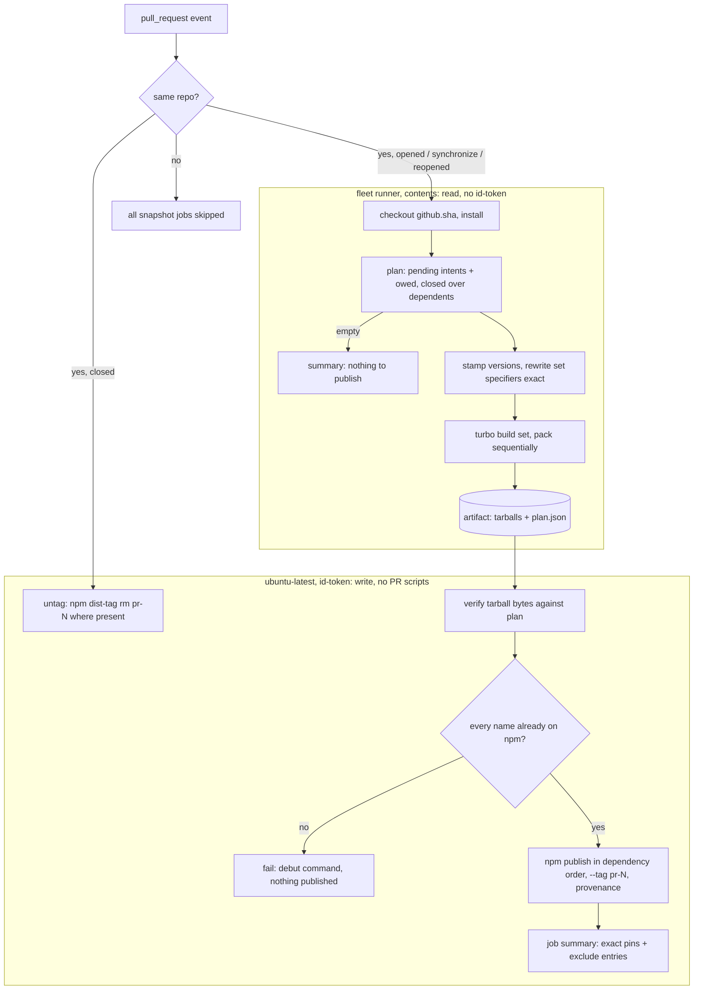
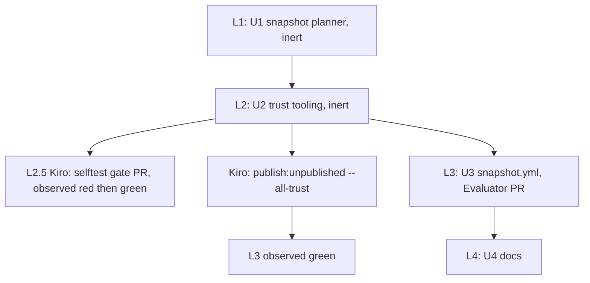

# sfs Snapshot Preview Releases - Plan

## Goal Capsule

- **Objective:** A starter branch can install an unreleased systemfsoftware change from npm by an exact version, with provenance, minutes after the sfs PR pushes, and never through `link:`, `file:` or a workspace hack.
- **Means:** A dedicated `snapshot.yml` workflow builds on the fleet and publishes through npm OIDC on a GitHub-hosted runner (KTD1, KTD2). The snapshot set is closed over dependents and pinned exactly (KTD3, KTD4).
- **Authority:** Ryan Lee owns scope. Kiro (conductor) answers as co-partner. `CONSTITUTION.md` and the origin Product Contract (R70, R71, R75, F6) govern. Where this plan and the origin disagree on product behavior, the origin wins.
- **Execution profile:** One `gh stack` on trunk `main` with four layers, squash-merged: L1 U1, L2 U2, L3 U3 (Evaluator surface, its own PR), L4 U4. Each layer is green alone and inert until L3 wires it in. Run targeted gates while iterating and `pnpm check:local` once before opening each PR. Do not self-review: Kiro runs `ce-code-review` separately.
- **Stop conditions:** Kiro's one-time trust registration (Dependencies) blocks L3's green observation. Stop and report if npm OIDC refuses `npm dist-tag` from a trusted publisher that holds the dist-tag permission.
- **Who finishes:** This omp session ships L1-L4. Kiro authors the L2.5 selftest gate PR and runs the npm trust registration.

---

## Product Contract

Product Contract preservation: R70, R71 and R75 are carried unchanged from the origin. R71a-R71f are this lake's derived constraints on R71. They come from Kiro's Lake 1 brief and do not change product scope.

### Summary

Every push to a same-repository sfs pull request publishes snapshot versions of the packages it changes, plus their dependents, to npm under that PR's dist-tag. The publish uses the existing OIDC trusted-publishing path, so each snapshot carries provenance. The run prints the exact pins a starter branch adopts, and closing the PR removes the tag. The plan ends with an outline of sfs Lake 2 (the unit-of-work kit), the first consumer of this path.

### Problem Frame

No snapshot mechanism exists today. `.github/workflows/release.yml` publishes only on pushes to `main`, and only versions that `pnpm version -r` produced from consumed change intents (`scripts/tools/plan-release.ts`, `scripts/tools/release-phase.ts`). A starter lake that needs an unreleased sfs change (origin F6) has two options: wait for a full release cycle, or use the tarball bridges the origin forbids (origin Superiority Map, `vendor/` row: "No tarball bridges ever").

### Key Decisions

- **Preview releases are npm snapshot versions under a PR dist-tag through sfs's existing OIDC publish path; pkg.pr.new is rejected.** Carried from the origin. Effect's registry still shows `snapshot: 0.0.0-snapshot-6ebc752b…` on `effect` and `@effect/platform` (registry dist-tags, read 2026-10-05). Effect 4's vendored tree has since moved to pkg-pr-new (`repos/effect/.github/workflows/snapshot.yml:49`). The rejection reasons still hold: no npm provenance, outside the release-age policy, needs an org app install. Governs R71.
- **Runtime libraries live in systemfsoftware as published packages, and the starter holds exact pins.** (session-settled: user-directed, carried from origin.) Governs R70, R75.
- **The npm publish and untag jobs run on `ubuntu-latest`; every job that runs install, build or pack stays on the fleet.** (session-settled: user-directed, Kiro ruling 2026-10-05; chosen over an npm token on the fleet, which drops OIDC and provenance.) npm trusted publishing does not support self-hosted runners: "Self-hosted runners are not currently supported but are planned for future releases" (https://docs.npmjs.com/trusted-publishers/, edited 2026-09-30). The two hosted jobs take only tarballs and publish with `--ignore-scripts`. Trigger: when npm supports self-hosted OIDC, those two jobs move to the fleet. Governs R71c, R71f.
- **gritlint is excluded from snapshots by name, and every summary says so.** (session-settled: user-directed, Kiro ruling 2026-10-05; chosen over a snapshot platform matrix: R72 names no gritlint consumer.) Governs R71a.

### Requirements

**Carried from origin**

- R70. Reusable runtime code is published from systemfsoftware under sfs doctrine (gates, schema laws, conformance specs, mutation floors at the release gate).
- R71. sfs PRs publish snapshot versions under a PR dist-tag through the OIDC publish path, and starter branches pin them exactly; no `link:`, `file:` or workspace hack.
- R75. The starter consumes `@systemfsoftware/*` at exact pins, each with an exact `minimumReleaseAgeExclude` entry. Starter-side; this lake supplies the pins it needs.

**Snapshot publication (this lake)**

- R71a. Every push to a same-repository PR whose built commit carries a pending releasing intent or an owed version publishes snapshot versions `0.0.0-snapshot-<sha>` of the affected packages and moves dist-tag `pr-<N>` onto them.
- R71b. A snapshot set installs as one consistent unit. Every snapshot package resolves each workspace dependency to the same run's snapshot version or to a version npm already serves.
- R71c. Fork PRs never run snapshot build, publish or untag jobs, and no job holds a long-lived npm credential. Publishing uses OIDC and produces provenance.
- R71d. Each publishing run reports, in its job summary, the exact pins a starter adopts: one `"<name>": "<version>"` manifest entry and one `<name>@<version>` `minimumReleaseAgeExclude` entry per published package.
- R71e. Closing a PR, merged or not, removes `pr-<N>` from every package that carries it. Published snapshot versions stay installable by exact version.
- R71f. Snapshot jobs run on fleet runners `[self-hosted, systemfsoftware-runner, <size>]` (org-wide ephemeral JIT runners whose handler refuses fork jobs), except the jobs that exchange an npm OIDC token (Key Decisions).

### Key Flows

- F6. Co-development across repos (origin)
  - **Trigger:** A starter lake needs an unreleased sfs change.
  - **Steps:** The sfs PR pushes, and `snapshot.yml` publishes the set under `pr-<N>`. The starter pins the summary's exact versions and exclude entries. After the sfs release, the starter moves each pin to the stable version. Closing the sfs PR drops `pr-<N>`.
  - **Covered by:** R71, R71a-R71e, R75

### Acceptance Examples

- AE1. **Covers R71a, R71b.** Given a pending intent `{"@systemfsoftware/a": patch}`, where `b` depends on `a` through `workspace:^` and `c` depends on `b`, a PR push at commit S publishes `a`, `b` and `c` at `0.0.0-snapshot-S`. The published `b` depends on `a` at exactly `0.0.0-snapshot-S`.
- AE2. **Covers R71a.** Given only consumed intents, `none` bumps and no owed versions, a PR push publishes nothing, and the summary says so.
- AE3. **Covers R71c.** Given a PR from a fork, the build, publish and untag jobs are skipped and no OIDC token is requested.
- AE4. **Covers R71e.** Given PR 812 with `pr-812` on 14 packages, closing it leaves `pr-812` on none of them, and `0.0.0-snapshot-S` still installs.
- AE5. **Covers R71b.** Given a set member whose new name npm has never served, the run publishes nothing and fails, naming the package and the debut command (KTD6).

### Scope Boundaries

- Starter-side adoption (exact pins, exclude entries, moving pins to stable) belongs to Starter Lake 1 (R75), not here.
- No snapshot on pushes to `main`. A merged change reaches npm through the existing release path.
- Considered and not built: a GitHub environment binding on the snapshot trusted publisher. The build job never holds `id-token: write`, so an environment without protection rules separates nothing. Revisit if the publish job ever executes PR code.
- Considered and not built: a PR comment carrying the pins. The job summary plus `npm view <pkg>@pr-<N> version` give the same data without granting `pull-requests: write`. Revisit if Kiro's cross-session tooling cannot read job summaries.
- Considered and not built: pruning old snapshot versions. npm versions are immutable after 72 hours, and pinned starter branches need them.

#### Deferred to Follow-Up Work

- gritlint snapshot matrix: excluded by ruling.

### Dependencies / Assumptions

- Kiro, once, after L2 merges: run `pnpm publish:unpublished --all-trust` from a maintainer machine with npm 2FA. It adds the `snapshot.yml` trusted publisher, with publish and dist-tag permission, to every public package.
- New package names, including sfs Lake 2's, still need a maintainer debut before OIDC can publish them (`docs/solutions/tooling-decisions/first-publish-under-oidc-trusted-publishing.md`).

---

## Planning Contract

### Key Technical Decisions

- KTD1. **A dedicated `.github/workflows/snapshot.yml` with its own trusted publisher, not a `pull_request` trigger on `release.yml`.** `release.yml` carries `contents: write` and phase jobs (version, publish, tag) that must never fire from a PR event. npm allows up to 10 trusted publishers per package, and each connection's allowed actions are fixed at creation (https://docs.npmjs.com/trusted-publishers/). The snapshot connection needs `npm publish` plus `npm dist-tag` for R71e, while the release connection keeps publish only. This forces one change in U2: `planReconcile` in `scripts/tools/publish-and-setup-npm-trust.ts` currently revokes every config that does not match `release.yml`, so its next run would delete the snapshot trust. `docs/solutions/tooling-decisions/first-publish-under-oidc-trusted-publishing.md` says the registry allows "one trusted publisher per package", which is stale. Governs R71, R71c, R71e.
- KTD2. **Install, build and pack run only on the fleet. The OIDC exchange runs only on GitHub-hosted runners, which receive tarballs and execute no PR code.** The build job checks out, installs, builds, stamps and packs on `[self-hosted, systemfsoftware-runner, large]` with `contents: read` and no `id-token`, then uploads the tarballs and the plan as an artifact. The publish and untag jobs run on `ubuntu-latest` with `id-token: write`. They check out the default branch's `scripts/` (never the PR ref), install no workspace dependencies, run no package scripts, and publish with `--ignore-scripts`. The same build-then-publish split already ships gritlint (`release.yml` `gritlint-build` → `gritlint-publish`). The workflow file itself still comes from the PR, so same-repository write access remains the trust boundary, as it already is for `release.yml`. Governs R71c, R71f (Key Decisions, Kiro ruling).
- KTD3. **The snapshot set covers pending releasing intents and owed versions at the built commit, closed over dependents. It is built at `github.sha` and versioned `0.0.0-snapshot-<github.sha>`.**
  - Pending intents are those `.changeset/ledger.yaml` does not record, read per package so a `none` bump does not count (`scripts/tools/pending-intents.ts`). Owed versions are versions npm does not serve (`scripts/tools/cycle.ts`). Main's unreleased changes therefore ship in the PR's snapshot as well, instead of hiding behind a stale stable dependency.
  - Dependents are taken transitively over `dependencies`, `peerDependencies` and `optionalDependencies` among public members. `devDependencies` do not count.
  - `github.sha` is the PR merge commit, and it is the commit the OIDC `sha` claim and the provenance statement name. Building it keeps the provenance honest. The summary also prints the PR head sha.
  - Governs R71a, R71b.
- KTD4. **Before packing, every dependency specifier that points at a set member is rewritten to that member's exact snapshot version. The publish job checks the tarball bytes.** `workspace:^` packs to `^0.0.0-snapshot-<sha>`, and that range accepts other PRs' snapshots. Probe (semver 7.7.2): `^0.0.0-snapshot-6ebc…` is satisfied by `0.0.0-snapshot-f00d…`, and `maxSatisfying` picks it. Rewrites happen only in the CI checkout and are never committed. Governs R71b.
- KTD5. **Publish in dependency order, run publish and untag one at a time per PR, and treat a re-published version as held.** Build jobs are cancellable per PR. The publish and untag jobs share one non-cancelling concurrency group per PR. A newer push therefore queues behind an in-flight publish instead of interrupting a half-published set, and closing a PR mid-publish untags only after that publish finishes, so the tag cannot be put back on a closed PR. npm's 409 and 403 "previously published" responses classify as `held` through `publishOutcome` in `scripts/tools/publish-set.ts`. Governs R71a, R71b, R71e.
- KTD6. **A set member npm has never served aborts the publish before any upload, and the debut learns `--tag`.** OIDC cannot debut a package. The run fails with `pnpm publish:unpublished --only <name> --tag pr-<N>`. U2 adds `--tag` so a new package's first version can be the snapshot rather than a placeholder. [INFERENCE] The registry may still set `latest` on a package's first publish even under a custom tag. The first debut (sfs Lake 2) checks `npm view <pkg> dist-tags` and reports the result. Governs R71b.
- KTD7. **gritlint is excluded from snapshot sets by name, and the summary says so.** If a set member depends on gritlint, the planner fails instead of shipping an unresolvable pin. Governs R71a (Key Decisions, Kiro ruling).
- KTD8. **The logic is Deno tooling under `scripts/tools/`: a pure decision module under CONST-P2, a thin shell that imports no npm package, and a separate selftest entry point.** Set closure, version stamping, specifier rewriting, plan decoding and admission, tarball verification, publish order and pin rendering are pure functions of plain data, separate from the shell that reads git, the registry and the filesystem (CONST-B1, CONST-P1). The selftest is its own entry point because its fast-check dependency must not load in the OIDC jobs (Kiro ruling, review round 1 F2). Scripts take shebang-scoped permissions (OP15).

### High-Level Technical Design

### Assumptions

- `pnpm ls -r --json --depth=-1` lists public members without an installed `node_modules`, so the untag job can enumerate packages without installing. U3 checks this. If it fails, the untag job reads manifests through `git ls-files`.
- Node 24 on `ubuntu-latest` bundles an npm older than 11.21.0, the minimum for dist-tag operations over OIDC (npm docs). The untag job therefore installs an exact npm version and asserts it.
- Dependabot PRs come from same-repository branches. Whether their runs can mint an npm OIDC token is unverified. U3 observes it, and adds an actor guard only if their runs fail.

### Sequencing

L2.5 is Kiro's Evaluator PR that wires the U1 and U2 `--selftest` modes into a standing gate. The author of the judged code does not author its gate (`repos/constitution/ENFORCEMENT.md`, CONST-E9).

---

## Implementation Units

### U1. Snapshot planner, stamper and verifier

- **Goal:** Compute the snapshot set and apply it to a CI checkout. Verify packed tarballs against it, order the publish, and render the pin block.
- **Requirements:** R71a, R71b, R71d; KTD3, KTD4, KTD5, KTD7, KTD8.
- **Dependencies:** none.
- **Files:**
  - Create `scripts/tools/snapshot-plan.ts`: pure decisions, no I/O, under CONST-P2 (one path per function: plain-TS exhaustive dispatch over tagged unions and booleans, array combinators, a bounded fixed-point fold for closure; no `if`, `switch`, `?:`, `&&`, `||`, `??`, `for` or `while`; no npm import, so not effect's `Match`). `snapshotVersion` and `distTag` return a `Checked` union instead of throwing.
  - Create `scripts/tools/snapshot.ts`: the shell. Subcommands `plan`, `stamp`, `pack`, `verify`, `publish --pr --sha`, `untag`. It imports no npm package, because it runs in the OIDC jobs.
  - Create `scripts/tools/snapshot-selftest.ts`: its own entry point holding the properties and refusals below, plus a `deno info` check that `snapshot.ts` resolves no `npm:` module (review round 1, F2).
  - Modify `scripts/deno.jsonc`: add `fast-check` at the workspace's v4 line (`overrides: fast-check: ^4`, exact version pinned) for the selftest properties.
  - Modify `scripts/tools/pending-intents.ts`: export the per-package pending bumps that U1 consumes, so the intent parse stays in one place. `countPendingIntents` derives from that export.
  - Modify `scripts/tools/workspace.ts` only if the manifest walk needs dependency maps. Keep one parse of `pnpm ls`.
- **Approach:**
  1. `plan` reads the pending bumps, `loadWorkspaceCycle()`, and every public manifest. It writes `plan.json`, holding sha, PR number, dist-tag, head sha, members in dependency order, and the exclusions with their reasons.
  2. `stamp` rewrites each member's `version` and each set-member specifier in the checkout.
  3. `verify` reads each tarball's `package/package.json` and compares it with `plan.json` (KTD4).
  4. `publish` decodes `plan.json` and admits it only when its dist-tag, sha, pr and every member version equal values recomputed from `--pr`/`--sha` (event context), and every member is a public, non-excluded package of the checkout's own workspace (the default branch in CI). Each rule is a predicate with its message, and every failing rule reports. It re-verifies the tarballs against the admitted plan, runs the never-published preflight (KTD6), then calls `npm publish <tgz> --tag pr-<N> --access public --provenance --ignore-scripts` per member in order. It classifies each result with `publishOutcome`; the summary pins only accepted or held versions and lists failures with their error.
  5. `untag` lists every `@systemfsoftware` package from npm's org listing (`GET /-/org/systemfsoftware/package`), reads each one's public dist-tags, and removes `pr-<N>` where present, so a package debuted only in that PR is untagged too.
- **Patterns to follow:** `scripts/tools/cycle.ts` (pooled registry probes, tri-state probe failure), `scripts/tools/publish-set.ts` (outcome classification), `scripts/tools/tag-released-packages.ts` (captured-set flow), and `--selftest` in `scripts/tools/check-npm-publish.ts`.
- **Test scenarios:** Every check targets a pure decision in `snapshot-plan.ts` (CONST-T14). Laws are fast-check properties over generated public-workspace graphs and intent sets. Refusals are hand-written examples beside them (CONST-T10).
  - Property, closure: every package named with a non-`none` bump, and every owed version, is in the set. Any public package with a runtime dependency (`dependencies`, `peerDependencies` or `optionalDependencies`) on a member is a member. Every member is either a seed or has a runtime dependency on a member. No private package is ever a member.
  - Property, stamping: after `stamp`, every specifier that points at a member equals that member's exact snapshot version, and every specifier to a non-member is byte-identical to the input.
  - Property, order: on generated acyclic graphs, a dependency always precedes its dependent in publish order.
  - Example, AE1: intent `{a: patch}`, `b` depends on `a` via `workspace:^`, and `c` depends on `b`. The set is `[a, b, c]`, and the stamped `b` depends on `a` at exactly `0.0.0-snapshot-S`.
  - Example: intent `{a: none, d: minor}`. The set is `d` plus its dependents, and `a` is absent.
  - Example, AE2: an intent stem recorded in the ledger contributes nothing, and with no owed versions the plan is empty.
  - Example: `f` depends on `a` only through `devDependencies`, so `f` is absent.
  - Refusal: an intent naming gritlint lists it under exclusions with a reason. A member that depends on gritlint fails planning and names both packages.
  - Refusal: an intent naming no workspace package fails planning and names it.
  - Refusal: `snapshotVersion(sha)` refuses a short or non-hex sha, and `distTag(n)` refuses 0 and negative numbers.
  - Refusal: admission refuses, each with its own message and all at once on a fully forged plan, a dist-tag, sha or pr other than the event's, a member version other than the recomputed one, a member outside the default branch workspace, and an excluded member. Decoding refuses a non-object plan, wrong field types, non-array members, a malformed member and a duplicate member.
  - Refusal: `verify` rejects each of these: a `^0.0.0-snapshot-…` dependency, a version that disagrees with the plan, a leftover `workspace:` or `catalog:` specifier, a missing tarball, and an extra tarball.
  - Refusal: a registry probe that errors, as opposed to returning 404, fails planning and the never-published preflight. It is never read as published or as unpublished (tri-state, as in `scripts/tools/cycle.ts`).
  - Example: members of a dependency cycle keep a stable name order instead of failing.
  - Example: the pin block for two members renders two manifest lines and two `name@version` exclude lines, sorted by name.
- **Verification:** `./scripts/tools/snapshot-selftest.ts` exits 0, and a sabotage copy of each law or refusal turns it red. `snapshot.ts plan` against this worktree prints the set. `stamp` followed by `pnpm pack` of one member yields a tarball that `verify` accepts. The checkout is restored afterwards.

### U2. Trust tooling for a second trusted publisher, and tagged debuts

- **Goal:** `pnpm publish:unpublished` registers both the `release.yml` and `snapshot.yml` trusted publishers and stops revoking the second. A debut can target a dist-tag.
- **Requirements:** R71, R71c, R71e; KTD1, KTD6.
- **Dependencies:** U1, for stack order only. No code dependency.
- **Files:**
  - Modify `scripts/tools/oidc.ts`: replace the single release-workflow constant with the expected trusted-publisher set, where each entry names a workflow file and its allowed actions; packages excluded from snapshots expect the release publisher only.
  - Modify `scripts/tools/publish-and-setup-npm-trust.ts`: `planReconcile` takes the expected set and keeps every matching config. It revokes only configs outside the set, and adds the missing ones with their actions. `executeDebut` passes `--tag` when `--tag` is given.
  - Modify `scripts/tools/check-npm-publish.ts` only where it prints the expected workflow.
- **Approach:** The release entry keeps `--allow-publish --allow-stage-publish` exactly as today. The snapshot entry gets publish plus dist-tag permission. Read the exact `npm trust github` flag for dist-tag permission from `npm trust github --help` at execution. If `npm trust list --json` exposes allowed actions, a snapshot config that lacks dist-tag permission counts as stale. Otherwise rely on the U3 untag run to surface it.
- **Patterns to follow:** the existing read-before-write reconcile and the one-window 2FA lock (`openTrustWindow`).
- **Test scenarios:** Every check targets the pure reconcile decision (CONST-T14).
  - Property: for any generated list of existing configs, applying the reconcile plan leaves exactly the expected `release.yml` and `snapshot.yml` configs, plus any config without an `id`, which is never passed to revoke.
  - Example: configs `[release]` produce "add snapshot" and revoke nothing.
  - Example: configs `[release, other-repo/release.yml]` add the snapshot config and revoke only the other repo's.
  - Example: when allowed actions are readable, a snapshot config without dist-tag permission is replaced.
  - Example: gritlint expects `release.yml` only, so a `snapshot.yml` config on it is stale.
  - Example: `parseTrustJson` (the `npm trust list --json` splitter) over hand-written fixtures: a single object, a one-object array, two configs after a header line, an object-form `repository`, malformed JSON between two valid configs, and an empty string.
- **Verification:** `pnpm publish:unpublished --dry-run --all-trust --only <one package>` prints adding `snapshot.yml` and keeping `release.yml`, with no revoke line. Kiro's real run succeeds, and `npm trust list <pkg>` shows two configs.

### U3. `snapshot.yml` workflow (Evaluator surface, its own PR)

- **Goal:** Run U1 on every same-repo PR event as the High-Level Technical Design shows.
- **Requirements:** R71a-R71f; KTD1, KTD2, KTD5.
- **Dependencies:** U1 and U2. Kiro's trust registration is required before the green observation.
- **Files:** Create `.github/workflows/snapshot.yml`.
- **Approach:**
  1. Triggers: `pull_request` on `branches: [main]` with types `opened`, `synchronize`, `reopened` and `closed`. Stacked PRs run as if they target `main` (GitHub stacked PR docs), so every layer gets a snapshot. Never use `pull_request_target`.
  2. Top-level `permissions: {}`. Every job carries `if: github.event.pull_request.head.repo.full_name == github.repository`.
  3. `build` runs on `[self-hosted, systemfsoftware-runner, large]` for non-close events: checkout `github.sha` with tags, `./.github/actions/install-deps`, `snapshot.ts plan`, an early success when the set is empty, `stamp`, a turbo build filtered to the set, a sequential pack, then an artifact upload. Concurrency group per PR with cancel-in-progress.
  4. `publish` runs on `ubuntu-latest` with `id-token: write` and needs `build`. Steps: a full checkout of the default branch (`persist-credentials: false`; `snapshot.ts publish` admits `plan.json` against its workspace manifests), setup-deno, setup-node 24 with the npmjs registry, "Enable Corepack" (the workspace listing calls `pnpm ls`, which needs no install), an exact npm install with a version assertion (the same as `untag`), download the artifact, then `snapshot.ts publish --pr <event pr> --sha <github.sha>`, which verifies the tarballs itself.
  5. `untag` runs on `ubuntu-latest` with `id-token: write` on `closed` only. Steps: checkout, setup-deno, setup-node 24, an exact npm install with a version assertion, then `snapshot.ts untag`. It shares the publish job's per-PR non-cancelling concurrency group (KTD5).
  6. No `secrets.*` reference anywhere in the file.
- **Execution note:** This is a CI integration, so prove it with live runs, not unit tests. Observe red before and green after on this layer's own PR: the publish job fails at the OIDC exchange before Kiro registers the snapshot trust, then the same run, re-run after registration, publishes. This needs a non-empty set at the PR's merge commit. If `main` has no pending releasing intent at that time, sfs Lake 2's first layer provides the green observation before L3 merges.
- **Test scenarios:** Test expectation: none. Workflow wiring is proven by the runs below, and U1's selftest covers the decisions.
- **Verification:**
  - Green publish: npm serves `0.0.0-snapshot-<github.sha>` under `pr-<N>` for every set member, with a provenance attestation. The job summary shows the pin block.
  - A fresh project that pins two dependent set members exactly installs one copy of each.
  - Re-running the publish job at the same sha reports `held` and exits 0.
  - A docs-only PR with an empty set exits green without a publish job.
  - Closing the PR removes `pr-<N>` (AE4).
  - Fork guard: a run on a fork PR shows every snapshot job skipped (AE3).

### U4. Documentation

- **Goal:** Docs describe the snapshot path and the two-publisher trust model, and the stale "one trusted publisher" claim is corrected.
- **Requirements:** R71; KTD1, KTD6.
- **Dependencies:** U3.
- **Files:**
  - Modify `.changeset/README.md`: a "Snapshot releases" section covering trigger, set rule, version, dist-tag, cleanup and debut. Also update the trusted-publishing paragraph to name both workflows.
  - Modify `.github/AGENTS.md`: a standing fact for `snapshot.yml` and a runbook row for "snapshot publish fails at the OIDC exchange" (unregistered snapshot publisher, or a never-published name).
  - Modify `docs/solutions/tooling-decisions/first-publish-under-oidc-trusted-publishing.md`: correct "one trusted publisher per package" to up to 10, and name the snapshot publisher.
- **Test scenarios:** Test expectation: none. Prose only.
- **Verification:** `./bin/dprint check` passes. `git grep -nw WORKFLOW_FILE -- scripts` finds nothing.

---

## sfs Lake 2 Outline: unit-of-work kit

This outline makes the dependency on Lake 1 concrete. Lake 2 is planned in its own session against origin R20, R22 and R72.

- **Package:** `@systemfsoftware/effect-unit-of-work` at `packages/effect-unit-of-work`. It stands alone because no family anchor exists (REPO-S5). Entry points are declared in `tsdown.config.ts` (pack: package-topology, `declared-entry-points.md`):
  - `.`: the port, with `unitOfWork` and the unit handle (pack: cell-architecture, `store-unit-of-work-handle.md`).
  - `./durable-object`: the SQLite DO adapter. It runs the unit inside `transactionSync`, refuses any async step, and refuses every read and write after the callback returns (R20).
  - `./postgres`: the SERIALIZABLE adapter, retrying the whole unit on 40001 and 40P01 under a configured budget (pack: cell-architecture, `store-serializable-unit-of-work.md`).
  - `./laws`: the shared law suite that both adapters and the in-memory fake pass (pack: boundary-testing, `fake-and-real-store-laws.md`).
  - `./input-gate`: the workerd kit. It goes red when an await or yield is injected inside the DO unit and green on `transactionSync` (R22, the DO form of pack: boundary-testing, `pin-dependency-semantics.md`).
- **Planned stack shape:** port, handle and laws with the memory fake first. Then the DO adapter with the workerd input-gate kit. Then the Postgres adapter. Each layer carries a real change intent, because that intent is what triggers a Lake 1 snapshot.
- **What Lake 2 needs from Lake 1, in order:**
  1. U1-U3 merged and observed green.
  2. Kiro debuts the new name once with `pnpm publish:unpublished --only @systemfsoftware/effect-unit-of-work --tag pr-<N>` (KTD6), then registers both trusted publishers. Lake 2 reports whether npm also set `latest`.
  3. Starter Lake 2 pins the summary's exact versions and exclude entries (R75).
- **Questions Lake 2 planning must settle:**
  - How sfs CI runs real workerd. sfs has no workerd today (`docs/brainstorms/inputs/starter-scratch/grounding-systemfsoftware.md`).
  - How CI runs a real Postgres server for the race and 40001 laws. PGlite cannot race.
  - Whether `@cloudflare/workers-types` and `@effect/sql-pg` enter as catalog dependencies (REPO-W8 research).

---

## Verification Contract

| Check             | Command                                                     | When                                      |
| ----------------- | ----------------------------------------------------------- | ----------------------------------------- |
| U1 decisions      | `./scripts/tools/snapshot.ts --selftest`                    | while iterating on L1, before L1's PR     |
| U2 reconcile      | `./scripts/tools/publish-and-setup-npm-trust.ts --selftest` | while iterating on L2                     |
| Format            | `./bin/dprint check`                                        | every layer                               |
| Local gate        | `pnpm check:local`                                          | once before opening each PR (Kiro ruling) |
| Workflow behavior | live runs listed under U3 Verification                      | L3, before merge                          |
| CI                | `xd://github run_watch` on each PR (OP13)                   | after each push                           |

Mutation testing does not apply. These are root scripts, not packages, and mutation runs only on `main` (REPO-D3). No changeset is needed, because no package build hash changes (`.changeset/README.md`). Re-check against the `changeset-check` verdict on each PR.

---

## Definition of Done

- L1-L4 open as one `gh stack` on trunk `main`, each green on its own. L3 is its own PR containing only `.github/workflows/snapshot.yml`.
- U3's verification list is observed on real runs. The run links are recorded in L3's PR body, including the red-before-trust and green-after-trust pair.
- L2.5 (Kiro) is merged, observed red then green.
- No `secrets.*`, `NPM_TOKEN` or `pull_request_target` appears in `snapshot.yml`.
- No scratch checkouts, probe tarballs or dead-end code remain in the diff.

---

## Sources / Research

- npm trusted publishing (supported runners, 10 publishers per package, allowed actions, dist-tag over OIDC from npm 11.21.0, `workflow_call` validation): https://docs.npmjs.com/trusted-publishers/
- GitHub stacked PRs run `pull_request` workflows as if they target the stack base: https://docs.github.com/en/pull-requests/reference/stacked-pull-requests
- Existing release path: `.github/workflows/release.yml`, `scripts/tools/plan-release.ts`, `scripts/tools/release-phase.ts`, `scripts/tools/cycle.ts`, `scripts/tools/pending-intents.ts`, `scripts/tools/publish-set.ts`, `scripts/tools/tag-released-packages.ts`, `scripts/tools/oidc.ts`, `scripts/tools/publish-and-setup-npm-trust.ts`, `.changeset/README.md`.
- Pack-time hooks delete build output under concurrency, so pack runs after build, one package at a time: `docs/solutions/build-errors/pack-lifecycle-hooks-mutate-dist-mid-gate.md`.
- Workspace specifier census: public manifests use `workspace:^` 50 times and `workspace:*` twice (counted 2026-10-05).
