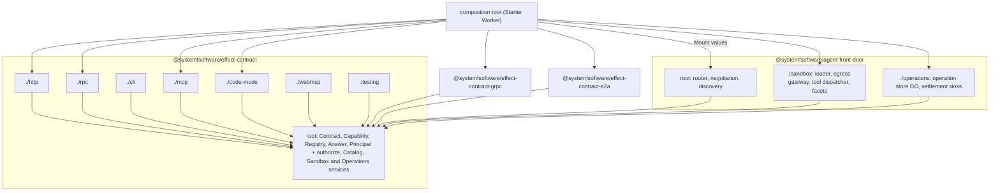
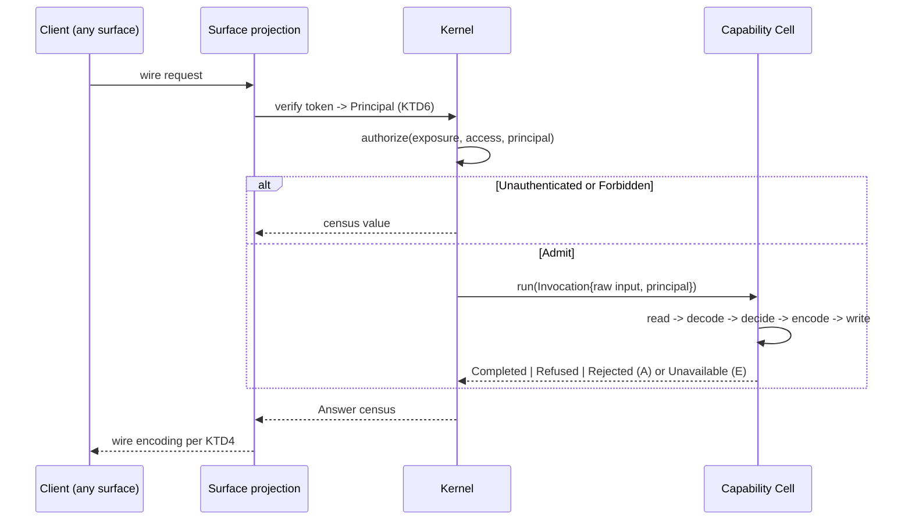
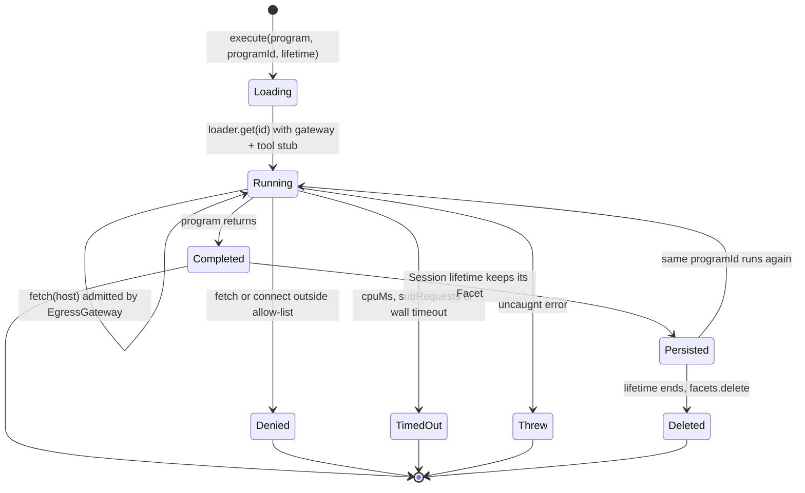

# sfs Contract Kernel and Agent Surfaces - Plan

## Goal Capsule

- **Objective:** An adopter declares each capability once, as schemas plus one Cell. They get a CLI, HTTP with OpenAPI 3.1 and generated clients, RPC, MCP, code mode, A2A, gRPC, WebMCP and a Markdown-first agent front door. One differential suite proves every surface answers and refuses identically, and any one surface can be deleted while the rest stay green.
- **Means:** A `packages/contract/` family. The kernel `@systemfsoftware/effect-contract` has one entry point per in-kernel surface. gRPC and A2A are sibling packages. `@systemfsoftware/agent-front-door` takes the surfaces as mounted values (KTD1, KTD2, KTD16).
- **Authority:** `CONSTITUTION.md` > root `AGENTS.md` > origin Product Contract (R26-R31, R42, R72, R81, R95, R96, R98-R100) > `docs/brainstorms/inputs/ruling-nix-distribution-sandbox.md` > this plan's KTDs > cited pack rules. Where this plan and the origin disagree on product behavior, the origin wins.
- **Execution profile:** One `gh stack` on trunk `main`: seven layers (Sequencing) plus Kiro's two Evaluator PRs (U16, U19), squash-merged. After L1, each surface unit owns its own directory, so surfaces fan out to isolated-worktree writers, one file to one owner. Run targeted gates while iterating and `pnpm check:local` once before each PR. Never run local mutation (REPO-D3). Kiro runs review; this session does not review its own work.
- **Stop conditions:**
  - The U3 type spike cannot project a three-capability registry onto HttpApi, RpcGroup and Toolkit without an unchecked cast. Stop and send Kiro the exact compiler error.
  - Miniflare with workerd `1.20261005.1` cannot bind a Worker Loader or run `ctx.facets`. Stop and send Kiro the exact error.
  - The same error appears three times on one approach.
- **Who finishes:**
  - This session (`sfs-contracts`) ships L1-L7. L7 (U20) rebases onto `main` after Lake 2 merges.
  - Kiro authors U16 and U19, holds WriteGuard beta access and rules on review findings.
  - The release-tooling session lands `lib.mkPnpmWorkspacePackages`, which makes these packages flake outputs, and the sandbox launcher (`packages.<system>.sandbox`) that U18 runs inside.
  - Starter Lake 5 composes everything into the one Worker.

---

## Product Contract

Product Contract preservation: R26-R31, R42, R72, R81, R95, R96 and R98-R100 are carried unchanged from the origin. R27a-R27d, R28a, R28b and R72a are this lake's derived constraints, taken from Kiro's Lake 3/4 brief. R27e-R27h come from Kiro's approval rulings of 2026-10-05. None of them changes product scope.

### Summary

This lake ships the systemfsoftware contract kernel and every agent-facing surface as `@systemfsoftware/*` workspace packages. A capability is one Effect Schema contract and one Cell. Each surface is a pure projection of the contract registry. Every outcome lands in a closed set of answers, and each surface maps that set the same way. A per-surface differential suite proves parity in-process and in real workerd, using independent third-party clients. The front door mounts the surfaces as values. That makes each surface a cartridge that CI can delete.

### Problem Frame

sfs has no contract kernel; the only transport code lives in `examples/inventory-fulfillment` (Effect RPC, Node, Postgres). The strongest public precedent, rat-stack at 54d3560, projects one contract to five surfaces. It recovers types through unchecked casts at every projection, e.g. `packages/capability/src/implement.ts:55` and `to-http-api.ts:39,51,398,541`. It has no cross-surface parity test: each projection re-declares its own fixtures. It generates no client from its OpenAPI, its discovery documents are unvalidated object literals, and surface removal is prose (`skills/keep-or-cut/SKILL.md`). Starter Lake 5 cannot start until these packages exist.

### Key Decisions

- **Handlers run only in workerd; the CLI is a contract-derived client of a target Worker.** Carried from the origin: `node:vm` is not a security mechanism, and DO-backed capabilities cannot run in Node. Governs R26, R31.
- **Code mode is a Dynamic Worker with a deny-by-default Outbound Worker and a DO Facet per stateful program.** (session-settled: user-directed — chosen over a Node subprocess sandbox: a probe showed `globalOutbound: null` blocks egress and a props allow-list admits exactly the named host.) Governs R31, R81.
- **Every projection ships. gRPC is served as Connect/gRPC-web over HTTP from the Worker in every environment. Native gRPC goes through the Worker `connect` handler behind Spectrum when deployed.** (session-settled: user-directed — chosen over fewer surfaces: staying at the frontier is in purpose.) Governs R27, R96.
- **Forge generates SDKs from our OpenAPI in CI, while the kernel keeps every projection.** Carried from the origin: Forge consumes OpenAPI only, so it cannot generate Cell handlers, refusal channels, A2A, gRPC or code-mode catalogs. Governs R27a (R97 is starter scope).
- **Distribution is Nix flakes; nothing is published to npm.** (session-settled: user-directed — chosen over npm snapshot versions under PR dist-tags: "npm is nothing more than a bankrupt registry".) Governs R72a.
- **Agents act for a person only through OAuth 2.1 per the MCP authorization spec, backed by passwordless identity.** Carried from the origin. Governs R98.

### Requirements

**Carried from origin**

- R26. Every capability is one contract (input, output, failure schemas) and one handler that is a Cell; handlers execute only inside the Worker.
- R27. Every capability is projected to CLI, HTTP + OpenAPI, MCP, browser RPC, code mode, A2A and gRPC, with no hand-written surface.
- R28. Differential tests run the same generated inputs through every projection and require the same outcome and failure tag.
- R29. MCP implements the 2026-07-28 specification (stateless, no `initialize`, `Mcp-Method`/`Mcp-Name` headers, MRTR, CIMD client registration), negotiates earlier revisions for legacy clients, exposes Code Mode `search` and `execute` tools beside per-capability tools, and is reachable through Cloudflare MCP server portals.
- R30. A2A exposes every capability as a skill in an agent card that validates against the A2A schema.
- R31. Code mode runs agent programs in a Dynamic Worker on every surface, including the CLI and local dev, with egress denied unless the capability's allow-list names the host. A program's environment holds only the capability's tool stubs, which meter and rate-limit, and its own Facet; tests prove that `fetch` and `connect` throw for anything else and that every other binding is unreachable.
- R42. The Worker serves `llms.txt`, `llms-full.txt`, `/openapi.json`, `/mcp`, `/a2a`, and discovery documents (agent card, api-catalog, `mcp.json`, agent-skills index, robots, sitemap), each validated against its published schema in CI.
- R72. Packages: `@systemfsoftware/effect-contract` (contract, Cell-shaped handler, one subpath entry point per projection, with gRPC/protobuf and A2A in separate packages because they bring heavy dependencies, confirmed by bundle numbers in planning) and `@systemfsoftware/agent-front-door` (negotiation, `llms.txt`, discovery documents, skills, WebMCP, x402, Dynamic Worker sandbox with egress allow-list). This lake ships both; x402 is Starter Lake 6.
- R81. A stateful sandboxed program gets its own DO Facet with its own SQLite, deleted when the program's lifetime ends.
- R95. The site registers every page-relevant capability as a WebMCP tool generated from its contract, so in-browser agents call capabilities on the page itself.
- R96. Protobuf definitions are generated from capability schemas, and the gRPC projection serves the same handlers with the same failure tags.
- R98. Authenticated MCP tools publish RFC 9728 protected-resource metadata and use OAuth with passwordless sign-in only.
- R99. Each MCP tool is classified read or write, and write tools require per-tool approval through WriteGuard policies on the MCP server portal.
- R100. Markdown responses carry token-count and content-signal headers matching Cloudflare's Markdown for Agents format.

**Derived for this lake (Kiro's Lake 3/4 brief)**

- R27a. HTTP emits OpenAPI 3.1 from the contracts, and HTTP clients are generated from that document by the official `@effect/openapi-generator`. Nothing in the plan hand-rolls client codegen.
- R27b. The CLI is built on `effect/cli`, HTTP on `effect/http-api`, RPC on `effect/rpc` and MCP on `effect/ai`, all from Effect 4.0.1.
- R27c. Every surface can be removed: deleting it leaves every other package and surface building, typechecking, linting and testing green, and CI proves this per surface.
- R27d. MCP authentication follows the 2026-07-28 authorization spec end to end: protected-resource discovery, audience-bound bearer tokens, per-tool scopes, and Client ID Metadata Document validation for the authorization server.
- R28a. Every non-error schema that a contract or the kernel exports carries generated codec laws. Every refinement boundary carries a hand-authored refusal property (pack: schema-laws, `refusals-beside-generated-laws.md`).
- R28b. Each surface's parity is proven twice: in-process, and through an independent third-party client against a real workerd Worker.
- R72a. The packages are `@systemfsoftware/*` workspace packages delivered as Nix flake outputs (`packages.<system>.<attr>`) through the shared packaging library, with no npm publication.

**Derived for this lake (Kiro's approval rulings, 2026-10-05)**

- R27e. A capability declared read-only projects to `GET /<kebab-name>`, with query parameters decoded by the same contract schema. Its `Completed` answers carry a strong `ETag` and the `Cache-Control` the contract declares. Writes stay `POST`. The differential tests cover both.
- R27f. A capability backed by a durable workflow (a registration hold, an expiry) answers `Accepted` with an operation that outlives the request. A2A streams and pushes the operation's settlement, and the official A2A CLI oracle exercises the stream.
- R27g. Every write-classified MCP tool asks for confirmation through MCP elicitation before it runs, independent of WriteGuard, which stays the portal layer.
- R27h. `effect-unit-of-work`'s workerd fixture moves onto `@systemfsoftware/effect-workerd-harness` in this lake, after Lake 2 merges.

### Acceptance Examples

- AE8. **Covers R31.** Given a program calling `fetch`, when it runs through `execute` on the CLI or the hosted site, then it fails with a typed sandbox error. (Origin.)
- AE11. **Covers R31.** Given a program whose capability allow-list names `allowed.test`, when it fetches `allowed.test` and `evil.test`, then the first succeeds and the second is refused by the Outbound Worker. (Origin.)
- AE30. **Covers R28, R28b.**
  - **Given:** the fixture capability `transfer` and an encoded input whose `amount` is `-1`.
  - **When:** it is sent through the CLI, HTTP (generated client), RPC, MCP (SDK v2 client), code mode, A2A (`@a2a-js/sdk` client), gRPC (Connect client) and WebMCP.
  - **Then:** each decodes back to `Rejected` with byte-identical issue text, and the CLI exits 2.
- AE31. **Covers R27c.**
  - **Given:** CI deletes the `mcp` surface directory and its tests.
  - **Then:** every other package and surface builds, typechecks, lints and tests green.
  - **And given:** a planted import of the `mcp` entry from the `http` entry.
  - **Then:** the same deletion leg fails.
- AE32. **Covers R29.**
  - **Given:** a 2026-07-28 `tools/call` without `Mcp-Name`. **Then:** a 400 with a header-mismatch JSON-RPC error.
  - **Given:** `MCP-Protocol-Version: 2099-01-01`. **Then:** error `-32022` listing exactly the five supported revisions.
  - **Given:** a 2025-06-18 client sending `initialize`. **Then:** it lists and calls tools.
- AE33. **Covers R98, R27d.**
  - **Given:** a write capability with Person exposure and a bearer token whose audience is another resource. **Then:** MCP answers 401 with `WWW-Authenticate: Bearer resource_metadata="…"`.
  - **Given:** a token lacking the write scope. **Then:** a 403 `insufficient_scope`.
  - **And:** every other surface returns the same `Unauthenticated` / `Forbidden` answer.
- AE34. **Covers R81.**
  - **Given:** a stateful program run twice under one program id. **Then:** the second run reads the row the first run wrote to its Facet.
  - **When:** the program's lifetime ends. **Then:** its Facet is deleted and the next run starts empty.
  - **And:** a second program id never sees that row.
- AE35. **Covers R96.**
  - **Given:** the fixture registry.
  - **Then:** the emitted `.proto` passes `buf lint`, and `buf build` of that text yields a descriptor set equal to the one the package builds in-process.
- AE36. **Covers R30.**
  - **Given:** the fixture registry.
  - **Then:** the served agent card decodes strictly as `AgentCard` under the vendored `a2a.proto` and lists exactly one skill per capability.
- AE37. **Covers R42, R100.**
  - **Given:** `GET /` with no `Accept`. **Then:** `text/markdown; charset=utf-8` with `Vary: Accept`, `x-markdown-tokens` and `Content-Signal`.
  - **Given:** `Accept: text/html`. **Then:** HTML.
  - **And:** every discovery document passes its validator in KTD16 and names the same capability set as the registry.
- AE38. **Covers R95.**
  - **Given:** a page in Chromium with WebMCP testing enabled. **Then:** `document.modelContext.getTools()` lists the page's capabilities, and `executeTool` returns the same answer the RPC client returns.
  - **When:** the page navigates away. **Then:** the tools are unregistered.
- AE39. **Covers R30.**
  - **Given:** an `@a2a-js/sdk` 1.3.0 client and the fixture capability `transfer`. **When:** it calls `SendStreamingMessage`. **Then:** the stream yields the task, then a terminal status update whose data part decodes to the same census value `SendMessage` returns.
  - **Given:** a push-notification config whose URL is the test receiver. **Then:** the receiver gets the terminal task once, carrying the config's credential.
  - **Given:** a config URL of `https://127.0.0.1/hook` or `http://example.com/hook`. **Then:** `CreateTaskPushNotificationConfig` answers `InvalidParamsError` and nothing is stored.
  - **Given:** a `Rejected` task in `TASK_STATE_INPUT_REQUIRED`. **When:** a follow-up `SendMessage` on that task carries a valid input. **Then:** the same task completes.
- AE40. **Covers R28, R30.**
  - **Given:** the official `a2a` CLI v0.3.0, built from the pinned flake input, running inside the sandbox launcher next to the workerd fixture.
  - **When:** it sends every fixture capability's generated inputs, invalid encodings and boundary seeds over `--transport jsonrpc` and `--transport rest`, blocking and with `--stream`.
  - **Then:** each `-o json` result decodes to the same census value as the direct call, and so as every other surface, and the CLI exits 0.
  - **And:** `a2a card get https://example.com` from inside the same sandbox exits 3 (unreachable).
- AE41. **Covers R27e.**
  - **Given:** the fixture read capability `getBalance` (`Read{ Fresh{ maxAge: 60s } }`, `Public`).
  - **When:** `GET /get-balance?account=a` is sent, and then sent again with `If-None-Match` set to the returned `ETag`.
  - **Then:** the first answers 200 with a strong `ETag` and `Cache-Control: public, max-age=60`. The second answers 304 with the same `ETag` and no body.
  - **And:** after a `transfer` changes the balance, the `ETag` changes. `POST /get-balance` answers 405. `GET /get-balance` without `account` answers 400 with the same issue text every other surface returns.
- AE42. **Covers R27f.**
  - **Given:** the durable fixture capability `hold{ ttlMs }`.
  - **When:** it is called on any surface. **Then:** the answer is `Accepted` with an operation, and `getOperation` reads `Pending`.
  - **When:** `confirmHold{ operation }` runs. **Then:** the operation settles `Completed{ confirmed }`. An unconfirmed hold settles `Completed{ expired }` when its alarm fires.
  - **And:** `a2a send --stream` on `hold` prints a `TASK_STATE_WORKING` task, stays open, and prints `TASK_STATE_COMPLETED` after the settlement. A push config's receiver gets the settled task exactly once.
- AE43. **Covers R27g.**
  - **Given:** a 2026-07-28 `tools/call` of `transfer` with no `inputResponses`. **Then:** the result is `input_required` with one `elicitation/create` request, and the Cell has not run.
  - **When:** the client retries with `approve: true`. **Then:** the answer equals every other surface's. With `approve: false`, the answer is the tool error `ConfirmationDeclined` and the fixture's write count is unchanged. A retry whose arguments differ from the confirmed ones answers `InvalidParams`.
  - **And:** a 2025-06-18 client that advertises `elicitation` receives `elicitation/create` and the call completes. A 2025-03-26 client gets `ConfirmationUnavailable`. Read tools never elicit.
- AE44. **Covers R27h.**
  - **Given:** `effect-unit-of-work` on `main` after Lake 2. **Then:** its workerd tests run on `effect-workerd-harness` with their assertions unchanged, and the package constructs no Miniflare of its own.

### Scope Boundaries

**Outside this product's identity (origin)**

- Passwords anywhere, including tests.
- Handlers outside workerd; capabilities that need the user's local machine.
- Any deploy target other than Cloudflare.

**Owned by another lake or owner**

- Next-action rendering proven on the site (R32), the CLI's default target and its packaging as a bin (R33), identity and the OAuth authorization server (R34-R38), Forge SDKs (R97), and composing the one Worker: Starter Lake 5. This lake carries next actions in the kernel answer and ships the CLI and stdio-bridge machinery.
- Credits metering in tool stubs (R16, R17): Starter Lake 6 wraps capability dispatch.
- Agent session store (R101), x402 (R102-R104): Starter Lake 6 and later.
- WriteGuard enforcement on the portal: private beta, portal-configured, Kiro holds access. This lake ships the authoritative classification and the generated policy (KTD10).
- Native gRPC through Spectrum and the Agent Readiness score: Starter Lake 8 deploy. Its deploy check runs U18's `a2aCliParity` with `--transport grpc` against the native-gRPC host.
- The Nix packaging library and its adoption in sfs (`release.yml` without npm): the release-tooling session (ruling, PRs B and C).

### Dependencies / Assumptions

- Lake 2 (`origin/sfs/uow-port`, unmerged) adds the `miniflare` and `esbuild` catalog entries and the `workerd` 1.20261005.1 override. Whichever stack lands first adds them, and the other rebases. U20 needs Lake 2 on `main`.
- `lib.mkPnpmWorkspacePackages` does not exist yet on any `systemfsoftware/pnpm-release-management` branch. Once sfs adopts it, every non-private workspace package becomes a flake output with no per-package edit.
- Dynamic Workers and DO Facets are open beta on Workers Paid; WriteGuard is private beta; WebMCP is a CG draft (2026-10-02) in a Chrome 149 origin trial.

---

## Superiority Map

Every row is rat-stack at 54d3560 (cloned read-only at `/tmp/repos/joelhooks__rat-stack`) against this plan, with the check that decides it.

| Surface              | rat-stack ships                                                                                                                                                                                                                                                                                                     | Ours                                                                                                                                                                                                                                                                                                               | Checkable proof                                                                                                                                                                                              |
| -------------------- | ------------------------------------------------------------------------------------------------------------------------------------------------------------------------------------------------------------------------------------------------------------------------------------------------------------------- | ------------------------------------------------------------------------------------------------------------------------------------------------------------------------------------------------------------------------------------------------------------------------------------------------------------------ | ------------------------------------------------------------------------------------------------------------------------------------------------------------------------------------------------------------ |
| Contract kernel      | `defineContract` + `implement` as a plain Effect wrapper (`packages/capability/src/contract.ts:61-73`, `implement.ts:23-56`). Casts at `implement.ts:55`, `to-http-api.ts:39,51,398,541`, `to-command.ts:88,121`, `to-rpc.ts:59`, `to-toolkit.ts:141`. Empty-input tool schema hand-written (`to-toolkit.ts:52-56`) | Contract + Cell; closed answer census (KTD4); every projection derived from contract types                                                                                                                                                                                                                         | `oxlint` `typescript/no-unsafe-type-assertion` at `error` reports zero over `packages/contract/**`. `test-types/*.tst.ts` pins each projection's types to the contract's                                     |
| Cross-surface parity | None. Each projection test re-declares fixtures (`packages/capability/test/*`). `apps/mischief/test/mcp-privacy.test.ts` checks telemetry only                                                                                                                                                                      | One differential file per surface against the direct Cell, in-process and in workerd with an independent client (KTD17)                                                                                                                                                                                            | AE30. Sabotage: change one refusal's HTTP status and only the HTTP differential goes red                                                                                                                     |
| CLI                  | `toCommand` with nested input as a JSON string. Code mode in the CLI runs `node:vm` (`packages/capability/src/sandbox-subprocess.ts:245-262`)                                                                                                                                                                       | Contract-derived RPC client of a target Worker. `execute` runs in the same Dynamic Worker as every surface                                                                                                                                                                                                         | The CLI e2e test spawns the built bin against the workerd fixture. AE8 output is identical to HTTP's                                                                                                         |
| HTTP + OpenAPI       | 3.1.0 by Effect delegation with no test pinning it. Empty-body patch at `to-http-api.ts:552-620`. No generated client (`openapi-generator` has 0 hits). Every capability is `POST`; reads carry no caching headers                                                                                                  | OpenAPI 3.1.0 validated against the OAS 3.1 schema. `openapigen` 4.0.1 client drives the parity suite. Reads are `GET` with a strong `ETag`, `304` and the contract's `Cache-Control`                                                                                                                              | OAS validation test. Generated-client parity over `GET` and `POST`. AE41. Sabotage: drop a refusal from an endpoint's error schema and the generated client goes red                                         |
| Browser RPC          | Two contracts in the browser group (`apps/web/src/client/docs.ts:8`). The only browser test hand-writes the wire message                                                                                                                                                                                            | Every capability, typed client, parity                                                                                                                                                                                                                                                                             | `tests/surfaces/rpc/*.differential.test.ts`                                                                                                                                                                  |
| MCP                  | Modern + legacy through a `LegacyMcp` DO. Headers are optional fallbacks (`apps/mischief/src/app.ts:797-799`). No auth (`content.ts:279`). CLI stdio offers three revisions (`apps/cli/src/surfaces.ts:38-46`). No conformance run. No confirmation on writes                                                       | Effect `McpServer`: 2026-07-28 stateless in the Worker, the four legacy revisions in a session DO. RFC 9728 + audience + scopes. Annotations from authoritative access. Generated WriteGuard policy. Elicitation confirms every write tool. MRTR, caching hints and origin checks                                  | `@modelcontextprotocol/conformance` 0.2.0-alpha.12 `--requirements 2026-07-28` (37 frozen server scenarios) and `--requirements 2025-11-25`, both with an empty expected-failures baseline. AE32, AE33, AE43 |
| Code mode            | `globalOutbound: null` deny-all; no allow-list; no per-program state. Worker tests use a fake that pattern-matches source (`apps/mischief/test/test-sandbox.ts`)                                                                                                                                                    | Allow-list gateway, Facet per program, same isolate on every surface, real-workerd tests                                                                                                                                                                                                                           | AE8, AE11, AE34 in the workerd harness                                                                                                                                                                       |
| A2A                  | One hand-built skill (`apps/mischief/src/content.ts:306-336`), `message/send` only, card checked by a test-local schema (`worker.test.ts:304-321`)                                                                                                                                                                  | Every capability is a skill. JSON-RPC, HTTP+JSON and gRPC bindings serving every v1.0.1 RPC, including streaming, `SubscribeToTask` and SSRF-guarded push notifications. Durable operations stream until they settle. Card checked against the normative `a2a.proto`. The A2A project's own CLI is a parity oracle | AE36, AE39, AE40, AE42. `@a2a-js/sdk` 1.3.0 and `a2a` v0.3.0 client parity                                                                                                                                   |
| gRPC                 | Absent                                                                                                                                                                                                                                                                                                              | Protobuf generated from contracts; Connect + gRPC-web on fetch                                                                                                                                                                                                                                                     | AE35. `@connectrpc/connect-web` 2.2.0 client parity                                                                                                                                                          |
| WebMCP               | Absent by decision (`.brain/projects/ratstack-sh/decide-not-applicable-checks.svx:30`)                                                                                                                                                                                                                              | Page capabilities registered on `document.modelContext`                                                                                                                                                                                                                                                            | AE38 in Chromium                                                                                                                                                                                             |
| Front door           | Hand-routed `apps/mischief/src/app.ts`. Documents are object literals (`content.ts`) with no schema validation. `mcp.json` served at one path. Not a cartridge (`VISION.md` priority 7)                                                                                                                             | A package that mounts surfaces as values. Every document is generated from the catalog and checked by an independent validator. Both MCP card paths served                                                                                                                                                         | AE37. Catalog-consistency test. U16 deletion legs                                                                                                                                                            |
| Removability         | Prose recipe (`README.md:166-178`); one CI job (`.github/workflows/ci.yml:1-25`)                                                                                                                                                                                                                                    | Per-surface CI deletion legs with a planted-violation negative control                                                                                                                                                                                                                                             | AE31                                                                                                                                                                                                         |

---

## Planning Contract

### Key Technical Decisions

- KTD1. **One `packages/contract/` family, anchored on `@systemfsoftware/effect-contract`.**
  - **Kernel entries:** `.`, `./testing`, and one per in-kernel surface: `./http`, `./rpc` (R27's browser RPC; the CLI and WebMCP call it too), `./cli`, `./mcp`, `./code-mode`, `./webmcp`.
  - **Siblings:** `@systemfsoftware/effect-contract-grpc` and `@systemfsoftware/effect-contract-a2a` each carry the protobuf runtime. `@systemfsoftware/agent-front-door` has entries `.`, `./sandbox` and `./operations`. `@systemfsoftware/contract-fixtures` is private.
  - **Why siblings:** the registry footprint (npm metadata, read 2026-10-05) decides the R72 split. `@bufbuild/protobuf` 2.16.0 unpacks to 1.99 MB and `@connectrpc/connect` 2.2.0 to 0.87 MB. The kernel's only runtime dependencies are `effect` and `jose` 6.2.12 (0.21 MB). U11 records the bundled sizes from an esbuild metafile.
  - **Placement:** four published packages build on the anchor, so the family satisfies REPO-S5, and `contract` is not a `RAW_VITEST_PACKAGES` segment (`packages/oxlint-plugin/oxlint-plugin-test-discipline/src/rules/path.config.ts:71-75`).
  - **Entry rules:** each entry assembles at least two modules and exposes fewer names than they offer (pack: package-topology, `declared-entry-points.md`). Entries enumerate their exports (pack: package-topology, `enumerated-entry-modules.md`). Importing an entry runs nothing (pack: package-topology, `import-time-inertness.md`).
- KTD2. **A surface is exactly one directory, and nothing outside it names it.**
  - **Layout:** in-kernel surfaces live at `src/surfaces/<surface>/`, with tests at `tests/surfaces/<surface>/` and their api-extractor config inside the surface directory, reporting to `etc/<surface>.api.md`.
  - **Entries:** `tsdown.config.ts` derives entries from `src/surfaces/*/mod.ts` plus `index` and `testing`, so deleting the directory deletes the entry. tsdown still writes `exports` (REPO-S4).
  - **Imports:** a surface imports only the root entry. The front door never imports a surface: each surface exports a `Mount` value (routes plus discovery contributions) that the composition root passes in.
  - **Code mode:** its declarations come from the root `Catalog`, never from the MCP toolkit. This removes rat-stack's interlock, where cutting MCP cuts code mode.
  - **Package surfaces:** gRPC and A2A are whole packages. Deleting either is a deletion leg too.
- KTD3. **A contract is a data value with closed-union fields. A capability pairs it with one Cell.**
  - **Fields:**
    - `name`: an `OperationName` brand, `^[a-z][a-zA-Z0-9]{0,63}$`. This is the intersection of MCP, WebMCP, JS-identifier and portal naming rules. Proto (PascalCase), CLI (kebab) and HTTP names are total functions of it.
    - `description`.
    - `input`: must be a `Schema.Struct` root, because McpServer refuses non-object params (`repos/effect/packages/effect/src/ai/McpServer.ts:1890-1896`).
    - `output`.
    - `refusals`: a tagged union, or `Schema.Never`.
    - `access`: `Read{ cache: Revalidate | Fresh{ maxAge } } | Write{ risk: MinimalImpact | ContainedWrite | Critical, settlement: Immediate | Durable }`. The risk tiers mirror WriteGuard's. Only a read carries a cache policy and only a write can be durable, so neither illegal pairing can be written. Shared or private caching is not a field: it follows `exposure` (KTD7), so a shared cache never holds a `Person`'s answer.
    - `exposure`: `Public | Person{ scopes }`.
    - `egress`: `Closed | AllowList{ hosts }`.
    - `links`: the contracts its next actions may name.
  - **Registry:** a record keyed by name. Its type checks that every key equals its contract's name and that every linked contract is registered.
  - **Cell:** the capability's Cell is `Cell<Invocation, Answer<C>, Unavailable, never>`. `Invocation` is `{ input, principal }`, with the principal as read-phase data.
  - Pack citations: (pack: cell-architecture, `four-channel-contracts.md`), (pack: schema-laws, `tagged-unions-over-state-by-presence.md`), (pack: schema-laws, `invariants-as-refinements.md`).
- KTD4. **A closed answer census is the one owner of per-surface outcome mapping.**
  - **On `A`:** `Completed{ output, next }`, `Refused{ refusal, next }` for a declared domain refusal, `Rejected{ issue }`, and, only for a `Durable` contract, `Accepted{ operation, next }` (KTD22). `Answer<C>` includes `Accepted` exactly when `C`'s access is `Write{ settlement: Durable }`. The Cell's `CommandRejected` write handler answers `Rejected` (`packages/effect-cell-types/src/Sandwich.ts:389`). `Rejected` sits on `A`, not on `E` as `SchemaError` the way the pack's worked example writes it, because a consumer renders it, and the pack's channel rule puts consumer-rendered refusals on `A` (pack: cell-architecture, `four-channel-contracts.md`).
  - **On `E`:** `Unavailable`.
  - **Before the Cell:** `Unauthenticated` and `Forbidden` come from the kernel's `authorize` workflow (KTD6).
  - **Defects** die.
  - Every surface maps the census, not the variants, through exhaustive `Match`, and its client decodes the census back. The differential oracle compares the decoded census value (KTD17).

  | Answer          | HTTP                     | RPC           | CLI exit | MCP                            | gRPC (Connect)                 | A2A task state                         | WebMCP / code mode           |
  | --------------- | ------------------------ | ------------- | -------- | ------------------------------ | ------------------------------ | -------------------------------------- | ---------------------------- |
  | Completed       | 200 `{output,next}`      | success       | 0        | result, `structuredContent`    | OK                             | `completed` + data artifact            | resolves the value           |
  | Accepted        | 202 + `Location`         | success       | 0        | result, `structuredContent`    | OK                             | `working`, then the settlement's state | resolves the value           |
  | Refused         | 422, encoded refusal     | typed error   | 3        | `isError`, `structuredContent` | `FAILED_PRECONDITION` + detail | `rejected` + data                      | rejects with encoded refusal |
  | Rejected        | 400, issue               | typed error   | 2        | `isError`, issue               | `INVALID_ARGUMENT` + detail    | `input-required` + issue               | rejects with issue           |
  | Unauthenticated | 401 + `WWW-Authenticate` | typed error   | 4        | HTTP 401 at transport          | `UNAUTHENTICATED`              | `auth-required`                        | rejects                      |
  | Forbidden       | 403 `insufficient_scope` | typed error   | 4        | HTTP 403 at transport          | `PERMISSION_DENIED`            | `rejected` + data                      | rejects                      |
  | Unavailable     | 503                      | typed failure | 5        | `isError`, tag                 | `UNAVAILABLE`                  | `failed`                               | rejects                      |
  | Defect          | 500                      | `Die`         | 1        | JSON-RPC `-32603`              | `INTERNAL`                     | `failed`                               | rejects                      |

- KTD5. **The Cell's decode phase is the one canonical input decoder.**
  - **Docs:** every surface still registers the contract's input schema, so OpenAPI, MCP `inputSchema`, proto, the A2A skill and WebMCP `inputSchema` stay exact.
  - **Libraries that decode first** (HttpApi payloads, RPC payloads, MCP tool params): a decode failure re-dispatches the raw payload to the capability, whose Cell answers the single `Rejected`. Issue text has one formatter.
  - **MCP:** registers dynamic raw-JSON tools when `effect/ai` `Tool` admits them [verify in U8]. This avoids double decoding.
- KTD6. **Authentication happens at the edge; authorization of exposure is a kernel workflow.**
  - **Edge:** a `TokenVerifier` service checks bearer JWTs against the authorization server's JWKS with `jose` 6.2.12. It passes an explicit `algorithms` list from config to `jwtVerify`, so a token whose header `alg` is outside it, `none` included, is refused before any other check. It requires the audience to equal the resource URL (RFC 8707) and yields `Principal = Anonymous | Person{ subject, scopes }`. A JWKS that cannot be fetched answers `Unavailable`, never `Anonymous`, so an outage at the authorization server is not reported as a missing login.
  - **Kernel:** the CC=1 workflow `authorize(exposure, access, principal)` answers `Admit | Unauthenticated | Forbidden`. A `Write` access requires the `write` scope. The Person principal then reaches the Cell as read-phase data, never as a decision input it fetches itself.
- KTD7. **HTTP serves one route per capability through `effect/http-api`: `GET /<kebab-name>` for a `Read`, `POST /<kebab-name>` for a `Write`.**
  - **Reads:** the query is the contract's input schema. `HttpApiEndpoint` runs every query schema through `Schema.toCodecStringTree` (`repos/effect/packages/effect/src/http-api/HttpApiEndpoint.ts:1150-1156`), so no second schema is written. A scalar or scalar-array field is its own parameter. Any other field travels as one JSON-text parameter decoded by the field's own schema, the rule KTD9 uses for CLI flags. A decode failure still re-dispatches to the Cell (KTD5). A read has no `POST` route, so `POST` answers 405.
  - **Caching:** a `Completed` read answers `ETag: "<base64url sha-256 of the encoded body>"`, a strong validator, because the encoded body is deterministic. `Cache-Control` comes from `access.cache` and `exposure`: `Revalidate` gives `no-cache`; `Fresh{ maxAge }` gives `max-age=<s>` with `public` for `Public` or `private` for `Person`; `Person` adds `Vary: Authorization`. A matching `If-None-Match` answers 304 with the same `ETag` and `Cache-Control` and no body. Every other answer, and every write, carries `Cache-Control: no-store` and no `ETag`. The read route uses `handleRaw` so the handler sets these headers (`repos/effect/packages/effect/src/http-api/HttpApiBuilder.ts:373`).
  - **Durable writes:** `Accepted` answers 202 with `Location` pointing at `GET /get-operation?operation=<id>`, itself a read.
  - **OpenAPI:** `OpenApi.fromApi` emits it at `/openapi.json`. The version string is `3.1.0` (`repos/effect/packages/effect/src/http-api/OpenApi.ts:334-335`). Reads document their query as `in: query` parameters.
  - **Status codes:** follow KTD4 through `httpApiStatus` annotations.
  - **Fetch handler:** `HttpRouter.toWebHandler` (`repos/effect/packages/effect/src/http/HttpRouter.ts:1367-1430`).
  - **Generated client:** a turbo task runs `openapigen -f httpclient` from `@effect/openapi-generator` 4.0.1 on the emitted fixture document into a gitignored directory. Nothing generated is committed, so it cannot go stale. Its parity covers the `GET` reads and the `POST` writes.
  - **Empty inputs:** an empty write input requires the `{}` body, and an empty read takes no query. The generated client's parity proves document and server agree. No post-processing patch.
- KTD8. **RPC is one `Rpc` per capability in one `RpcGroup`, with JSON serialization.**
  - **Fetch handler:** composed from `RpcServer.makeProtocolWithHttpEffect` and `HttpRouter.toWebHandler`, because 4.0.1 has no `RpcServer.toWebHandler` [INFERENCE from the API shapes; U6 proves it].
  - **Failures:** the error schema is the census minus `Completed`.
- KTD9. **The CLI derives one subcommand per capability from the input struct.**
  - **Flags:**
    - Primitive and literal fields become typed flags through `Flag.withSchema`.
    - Nested, array and union fields take a JSON flag decoded by the field's own schema.
    - `--input` takes the whole input as JSON or `@file`.
  - **Collisions:** reserved flags (`--json`, `--target`, `--input`) refuse a colliding field name at the type level.
  - **Transport:** the KTD8 RPC client against `--target`.
  - **Rendering:** human mode renders the answer and prints each next action as a runnable command line. `--json` prints the encoded census. Exit codes follow KTD4.
- KTD10. **MCP is `effect/ai` `McpServer.layerHttp` with five revisions: 2026-07-28 stateless in the Worker, and 2025-11-25, 2025-06-18, 2025-03-26 and 2024-11-05 in a session Durable Object (KTD24).**
  - **Tools:** generated from the catalog, plus the code-mode `search` and `execute` tools when that surface is mounted.
  - **Annotations from `access`:**
    - `Read` sets `readOnlyHint` and `idempotentHint`.
    - `Write{Critical}` sets `destructiveHint`. Every `Write` asks for confirmation (KTD23).
    - `AllowList` egress sets `openWorldHint`.
  - **Auth:**
    - Protected-resource metadata is served at both `/.well-known/oauth-protected-resource` and `/.well-known/oauth-protected-resource/mcp`.
    - 401 challenges carry `resource_metadata`.
    - `scopes_supported` derives from the registry.
    - A `ClientIdMetadata` decision validates a fetched CIMD document (client_id equals its URL, has a path, `redirect_uris` match) for the starter's authorization server.
  - **Portal compatibility:** the server name has no underscore, and contract names contain none, so the portal's `{server_id}_{name}` split stays unambiguous.
  - **WriteGuard:** `writeGuardPolicy(registry)` emits each tool's `riskLevel` from `access`.
  - **Stdio:** a stdio bridge relays JSON-RPC to a target Worker's `/mcp`. It is the machinery R33's CLI bridge uses; the bin itself is Starter Lake 5's.
  - **Origin:** `layerHttp`'s `allowedOrigins` comes from site config. Effect refuses a request whose `Origin` is present and unlisted with 403, and admits Origin-less clients (`repos/effect/packages/effect/src/ai/McpServer.ts:1746-1752`). The conformance scenario `dns-rebinding-protection` sends `Origin: http://evil.example.com`, so this check satisfies it. The conformance fixture lists its own localhost origin. The front door applies the same rule to every other surface (KTD16).
  - **MRTR (R29):** a tool handler may answer `McpSchema.InputRequired`, which Effect projects to `resultType: "input_required"` on 2026-07-28 and refuses on older revisions (`repos/effect/packages/effect/src/ai/internal/mcpProtocol/v2026_07_28.ts:104-135`). The handler reads `requestState` and `inputResponses` from `McpRequestContext` (`repos/effect/packages/effect/src/ai/McpServer.ts:218-221,430-441`). Write tools use it for confirmation (KTD23), and the conformance reference tools exercise the rest of it.
  - **Caching hints:** list and read results carry `ttlMs` and `cacheScope` (SEP-2549), which Effect emits (`v2026_07_28.ts:214-217`). The conformance scenario `caching` checks them.
  - **Conformance reference fixture:** the frozen 2026-07-28 server list names the reference fixture's tools, resources and prompts (`test_simple_text`, `test_input_required_result_elicitation`, `test_prompt_with_arguments`, …). A private `mcp-conformance.fixture.ts` registers them on the same `McpServer` beside the contract toolkit, behind the same auth and origin edge. They are harness fixtures that exercise the server stack, not capabilities. A scenario that fails because of Effect's `McpServer` goes to Kiro with its `checks.json`; it is never added to the baseline.
  - **Why Effect, not the SDK:** `@modelcontextprotocol/server` 2.3.1 is zod-based, so its schemas would be a second hand-written copy (R27). Effect already implements all five revisions (`repos/effect/packages/effect/src/ai/McpProtocol.ts:27`).
- KTD11. **Code mode is a projection of the catalog.**
  - **Declarations:** TypeScript declarations rendered from `Schema.toJsonSchemaDocument` (`repos/effect/packages/effect/src/Schema.ts:15441`).
  - **`search`:** a pure Cell ranking name, description and field names.
  - **`execute`:** a capability whose input is `{ program, programId, lifetime }`. It runs through the root `Sandbox` service, so every surface that can call a capability runs the same isolate. The root declares `Sandbox` as a service with no driver. Its one layer is the Worker Loader host in `agent-front-door/sandbox` (KTD12), because handlers run only in workerd (Key Decisions) and no in-process isolate exists.
  - **Not `@cloudflare/codemode` 0.5.3:** it is marked Experimental and peers `zod`, `ai` and `@modelcontextprotocol/sdk` ^1.25.
- KTD12. **The sandbox host (`agent-front-door/sandbox`) loads each program through the Worker Loader.**
  - **Isolate id:** `get(id)`, with id = sha256 over every input baked into the loaded `WorkerCode`: the program, the catalog version, the allow-list, the program id and the principal's subject. `get` reuses a cached isolate's `env` and `globalOutbound`, so leaving any of these out of the id would hand one caller's tool props, Facet or allow-list to another.
  - **Egress:** `globalOutbound` is an `EgressGateway` `WorkerEntrypoint` whose props carry the allow-list: the capability's `egress` intersected with the request. Its CC=1 workflow `admitHost` answers `Allow | Deny`. A `Deny` reaches the program as a typed `SandboxEgressDenied`.
  - **Environment:** `env` holds only a `ToolDispatcher` stub, whose props carry the program id and principal. A stateful program also gets its Facet stub.
  - **Facets:** a `ProgramSupervisor` DO holds Facets via `ctx.facets.get(programId)` and calls `delete` when the program's `Session{ ttl }` lifetime ends.
  - **Limits:** `cpuMs`, `subRequests` and a wall timeout map to `SandboxTimeout`. A thrown program maps to `SandboxThrew`.
- KTD13. **The protobuf projection mirrors each schema's Encoded (JSON) side.**
  - **Mapping:**
    - Struct becomes a message; tagged union becomes `oneof`; literal union becomes an enum with `_UNSPECIFIED = 0`.
    - Array becomes `repeated`, using a wrapper for nested arrays.
    - Record becomes `map<string, V>`; exact-optional becomes `optional`; nullable becomes `oneof` with `NullValue`.
    - number becomes `double`; string-encoded bigint and dates stay `string`; unknown becomes `google.protobuf.Value`.
    - Recursion uses recursive messages.
  - **Field numbers:** follow declaration order unless `Proto.field(n)` pins one.
  - **Build and serving:** a pure AST walk builds the `FileDescriptorProto`, and a pure printer renders the `.proto` text. At runtime, `@bufbuild/protobuf` 2.16.0 `createFileRegistry` feeds a `@connectrpc/connect` 2.2.0 router through universal fetch adapters, serving the Connect and gRPC-web protocols. Native gRPC from Spectrum arrives as gRPC-web, so it reuses the same handler.
  - **Errors:** refusals travel as Connect error details per KTD4.
  - **Independent check:** `buf` 1.73.0 lints and compiles the printed text (AE35).
- KTD14. **A2A decodes its wire with the normative `a2a.proto` descriptors.**
  - **Source:** `a2aproject/A2A` v1.0.1 is vendored as a `repos/a2a` subtree. `buf` compiles `specification/a2a.proto` at package build into an embedded descriptor set, which imports the third party's schema (pack: schema-laws, `rich-type-over-foreign-encoded.md`).
  - **Card:** generated from the registry, one skill per capability. It declares a capability-call extension URI, and a call is a `DataPart` `{ capability, input }`. The card's interfaces are `JSONRPC` and `HTTP+JSON`. It lists `GRPC` only when site config names a native-gRPC URL. A2A's `GRPC` binding is native gRPC over HTTP/2, which workerd does not serve inbound, so a card listing the Connect endpoint as `GRPC` would send a native client such as `a2a --transport grpc` to an address it cannot use.
  - **Bindings:** JSON-RPC 2.0, HTTP+JSON, and a Connect / gRPC-web handler over `@connectrpc/connect` directly (not the gRPC package, per KTD2). Spectrum translates native gRPC into gRPC-web for that handler when deployed. Each binding serves every v1.0.1 RPC: `SendMessage`, `SendStreamingMessage`, `GetTask`, `ListTasks`, `CancelTask`, `SubscribeToTask`, the four push-notification config RPCs and `GetExtendedAgentCard`. The card sets `streaming` and `push_notifications` true.
  - **Tasks:** states follow KTD4. A `TaskStore` service with memory and Durable Object adapters makes `GetTask` answer every task id the agent issued. The DO adapter applies each transition (create, continue, cancel) in one `transactionSync`, so a cancel racing a continuation serializes. An `Accepted` answer leaves the task in `TASK_STATE_WORKING`, keyed by its operation id, and the operation's settlement (KTD22) moves it to its terminal state.
  - **Input-required continuation:** a `Rejected` task waits in `TASK_STATE_INPUT_REQUIRED`. A follow-up `SendMessage` on that task id with a new call re-dispatches the same capability on the same task. A follow-up on a terminal task answers `UnsupportedOperationError`.
  - **Streaming:** `SendStreamingMessage` emits the task, then each status update and artifact until a terminal state. For an `Accepted` task the stream follows `Operations.watch`, so it stays open through `TASK_STATE_WORKING` until the settlement. `SubscribeToTask` streams a working or input-required task until it settles, and answers `UnsupportedOperationError` on a terminal task, as the spec's Subscribe to Task errors require. Streams are SSE on JSON-RPC and HTTP+JSON, and server-streaming on Connect, the one gRPC streaming mode Workers serve.
  - **Push notifications:** the CC=1 workflow `admitWebhook` admits an `https` URL whose host is a DNS name and not `localhost`. IP literals and every other scheme are refused, per the spec's SSRF rules for webhook URLs. Configs live in the `TaskStore`. A2A's `SettlementSink` (KTD22) delivers each settled operation's task to its configs; an immediate answer delivers in its request's `ctx.waitUntil`. Delivery sends the config's credential and retries at most three times on a bounded schedule.
  - **Listing and the extended card:** `ListTasks` returns only tasks owned by the caller's `Person` principal; an `Anonymous` caller gets an empty list and reads its tasks by id. The public card already lists every skill (R30), so `extended_agent_card` is false and `GetExtendedAgentCard` answers `ExtendedAgentCardNotConfiguredError`.
  - **Not the SDK server:** `@a2a-js/sdk` 1.3.0 needs an Express peer, its gRPC transport is Node-only, and it documents no Workers adapter. It serves only as a test client.
- KTD15. **WebMCP registers page capabilities with `document.modelContext.registerTool`, per the CG draft of 2026-10-02.**
  - **Annotations:** `access` maps to `readOnlyHint` and `consequentialHint`; `Write{Critical}` is consequential.
  - **Execution:** `execute` calls the RPC client, so the server's `authorize` (KTD6) decides every call. The page registers what R95 calls page-relevant; it holds no authority the RPC client does not already have.
  - **Lifetime:** a registration is a scoped resource whose close unregisters it.
  - **Unsupported browsers:** a missing `document.modelContext` yields a typed `WebMcpUnavailable` value rather than throwing.
- KTD16. **The front door is one fetch handler built from mounts, pages, skills and site config.**
  - **Routing:** machine paths and `/.well-known/*` route ahead of pages.
  - **Negotiation:** follows RFC 9110 q-values. Markdown is the default; HTML only when `text/html` outranks `text/markdown`. HEAD is served.
  - **Markdown headers:** `Vary: Accept`, `Content-Signal` from site config, and `x-markdown-tokens` as `ceil(utf8Bytes / 4)`. That is a documented estimate in Cloudflare's header format.
  - **Cross-origin:** the front door emits no CORS headers. A request whose `Origin` is present and outside the site's origins is refused with 403 before routing, on every surface, by the same rule Effect applies to MCP (KTD10). Origin-less clients (CLIs, servers, agents) pass. The refusal happens before the census, so it is never a `Forbidden` answer.
  - **Documents:** generated from the catalog plus mount contributions. Each validator below is independent of the emitter, and schema files are pinned harness fixtures with their source URL and sha256:

  | Document                                                        | Validator                                                                                          |
  | --------------------------------------------------------------- | -------------------------------------------------------------------------------------------------- |
  | `/openapi.json` (HTTP mount)                                    | `@hyperjump/json-schema` 1.18.0, OpenAPI 3.1 dialect                                               |
  | `/.well-known/agent-skills/index.json`                          | its `$schema`, `discovery/0.2.0`, via `@hyperjump/json-schema`                                     |
  | `/.well-known/mcp.json` and `/.well-known/mcp/server-card.json` | `$schema` `mcp-server-card/v1` via `@hyperjump/json-schema`                                        |
  | `/.well-known/agent-card.json`                                  | strict proto3-JSON decode as `AgentCard` (`a2a.proto`, `@bufbuild/protobuf` 2.16.0)                |
  | `/.well-known/api-catalog`                                      | RFC 9264 linkset shape with the RFC 9727 profile, against the RFC 9727 example as a literal oracle |
  | `/.well-known/oauth-protected-resource[/mcp]`                   | `@modelcontextprotocol/client` 2.3.1 discovery                                                     |
  | `/llms.txt`, `/llms-full.txt`                                   | reference parser `llms-txt` 0.0.7 (PyPI) via nixpkgs `uv`                                          |
  | `/robots.txt`                                                   | `robots-parser` 3.0.1, behavioral checks per crawler                                               |
  | `/sitemap.xml`                                                  | sitemaps.org `sitemap.xsd` via `xmllint-wasm` 5.3.0                                                |

- KTD17. **Each surface proves parity in two tiers, both with `@systemfsoftware/differential-spec`.**
  - **Reference:** the capability invoked directly, with its census encoded.
  - **Candidate:** a round trip through the surface's client, decoded back to the census.
  - **Relation:** deep equality of encoded JSON, a law between two views of one value (CONST-T10).
  - **Inputs:** the contract's input arbitrary, invalid encodings drawn from the unrefined encoded base, and boundary seeds.
  - **In-process tier:** `tests/surfaces/<s>/<s>.differential.test.ts` runs on the simulation kernel.
  - **workerd tier:** `<s>.workerd.differential.test.ts` uses an independent client and declares `hostBound` (`packages/sim/differential-spec/README.md:55-57`). It catches what the in-process tier cannot: the in-process client decodes with the same Effect schemas as the server, so an encoding defect both sides share passes there. A third-party client is a second implementation (CONST-T10), and the real Worker exercises the fetch handler, headers and streaming.
  - **Code mode:** its in-process tier covers `search` and the declarations. `execute` parity runs only in workerd, because the only `Sandbox` layer is the Worker Loader host (KTD11).
  - **Independent clients:** `openapigen` client (HTTP), `RpcClient` (RPC), the built CLI bin (CLI), `@modelcontextprotocol/client` 2.3.1 (MCP), `@connectrpc/connect-web` 2.2.0 (gRPC), `@a2a-js/sdk` 1.3.0 and the official `a2a` CLI v0.3.0 (A2A, KTD21), Chromium (WebMCP), and a program calling `tools.*` (code mode).
  - **Confirmation:** the MCP candidate answers every elicitation with `approve: true`, so parity compares the confirmed call. AE43 covers the declined and unavailable paths.
  - **Operations:** the relation replaces operation ids with a placeholder before comparing. It then settles both operations through `confirmHold` and compares the settled answers too (KTD22).
  - **Fixtures:** the registry and capabilities live in the private `@systemfsoftware/contract-fixtures` as `*.fixture.ts` harness files (pack: schema-laws, `tests-own-no-schemas.md`).
- KTD18. **workerd runs through Miniflare's programmatic API in a shared `@systemfsoftware/effect-workerd-harness`.**
  - **Shape:** it bundles a fixture Worker with esbuild and holds Miniflare as a scoped Effect resource. It exposes `dispatchFetch`, service bindings, Worker Loaders and DOs, with `workerd` overridden to 1.20261005.1.
  - **Why Miniflare:** `@cloudflare/vitest-pool-workers` 0.22.0 peers `vitest ^4.1` and the workspace runs vitest 5. Effect tests its DO client the same way (`repos/effect/packages/sql/sqlite-do/test/Miniflare.test.ts`).
  - **Why its own package:** this lake would be the second copy of Lake 2's fixture (CONST-S4). The contract family and the unit-of-work kit both consume it, so it lives at `packages/<name>` (REPO-S5).
- KTD19. **The workspace moves to Effect 4.0.1.** `@effect/openapi-generator` 4.0.1 peers `effect ^4.0.1` and `@effect/platform-node ^4.0.1`, and the lockfile resolves `effect@4.0.0`. The `repos/effect` subtree moves to the `effect@4.0.1` tag so REPO-W4 citations match the code that runs.
- KTD20. **This lake builds one Nix derivation: the `a2a` CLI (KTD21).** Each new package is publishable and passes `pnpm pack:all`. It becomes `packages.<system>.<attr>` automatically once sfs adopts `lib.mkPnpmWorkspacePackages` (ruling PR C).
- KTD21. **The official A2A CLI is a real-client oracle for the A2A surface.**
  - **Pin:** `a2aproject/a2a-cli` v0.3.0, released 2026-09-24 at `6286ed6a9a1f8c7360c03b5e832811fe0896414a`, enters as the flake input `a2a-cli` (`flake = false`). `nix/a2a-cli.nix` builds it with `buildGoModule` against the locked nixpkgs (Go 1.26 meets the module's `go 1.25.0`). It uses `vendorHash = "sha256-cO++G2PvDjcnve/fi/pjlNV/JAa8DVBL3ZSMQZ9JuRM="`, `subPackages = [ "." ]`, and ldflags that set `internal/cli.version` and `internal/cli.commit` (an unset build reports `dev`). It renames `a2a-cli` to `a2a` and is exposed as `packages.<system>.a2a-cli`. A planning probe built it at that hash.
  - **Sandbox:** the whole oracle test runs inside the release-tooling sandbox launcher (`--unshare-all`, loopback only). Miniflare and the `a2a` child share the sandbox's network namespace, so no egress allow-list is needed. A planning probe ran `a2a server --echo` and `a2a send -e http://127.0.0.1:18080 --transport rest -o json` inside `bwrap --unshare-all`: it got `TASK_STATE_COMPLETED` and exit 0, while `a2a card get https://example.com` exited 3. There is no unsandboxed mode: the test asserts that egress refusal and fails outside the launcher.
  - **Driver:** `a2aCliParity(url, transports)` in the a2a package's `./testing` entry. Per sample it builds a `--request-payload` `SendMessageRequest` whose message lists the extension URI and carries the call `DataPart`, runs `a2a send`, decodes the `-o json` (or last `-o jsonl` event under `--stream`) task into the census, and registers one `Differential.compare` against the direct call (KTD17). Equality with the same reference is what makes a2a-cli agree with every other surface. For the durable `hold` it runs `--stream`, settles the operation through `confirmHold` while the stream is open, and drives `task push-config` against a receiver that Miniflare's outbound service plays (AE42).
  - **Transports:** `jsonrpc` and `rest` locally. `grpc` is grpc-go over HTTP/2, which no local workerd serves (`workerd.capnp` at v1.20261005.1 has no HTTP/2 inbound option), so Starter Lake 8 runs the same driver with `grpc` against Spectrum.
  - **Exit codes:** the CLI's spec makes every conducted turn exit 0, whatever the task state (its §6.6, §11.6). A non-zero exit is a test failure, never an outcome.
- KTD22. **A durable capability answers `Accepted` with an operation that a kernel `Operations` service settles later.**
  - **Operation:** an `OperationId` brand holds 128 random bits as base64url. Its state is `Pending{ owner, startedAt } | Settled{ answer: Completed | Refused | Unavailable, settledAt }`.
  - **Service:** `Operations` lives in the root with no driver. It offers `begin(owner)`, `settle(id, answer)`, `get(id)` and `watch(id)`, a stream that ends at settlement. The CC=1 workflow `settleOperation` decides each settlement: the first wins, a repeat of the same answer is idempotent, and a different one is refused `AlreadySettled`. `./testing` ships a memory layer. `agent-front-door/operations` (U21) ships the Durable Object layer: one DO per operation, its state in SQLite, `watch` as a stream the DO closes after the settled write.
  - **Reading it:** the registry adds the built-in read capability `getOperation{ operation }` (`Read{ Revalidate }`, `Public`) whenever any contract is `Durable`. A `Person`-owned operation answers its owner only; anyone else gets the refusal `OperationNotFound`. An `Anonymous` operation is readable by its id. `Accepted.next` names `getOperation`.
  - **After settlement:** each `SettlementSink` the composition root registers runs in the DO after the settled write commits, under `ctx.waitUntil`. A2A's sink delivers push notifications (KTD14).
  - **Who settles:** the durable workflow behind the capability calls `settle`; in the starter, that is its `effect/workflow` engine for registration holds and expiry. The fixture `hold{ ttlMs }` begins an operation and sets a DO alarm. `confirmHold{ operation }` settles `Completed{ confirmed }` first; otherwise the alarm settles `Completed{ expired }`.
- KTD23. **Every write-classified MCP tool asks for confirmation through elicitation before its Cell runs.**
  - **Scope:** every tool whose contract access is `Write`, plus code mode's `execute`, whose access is the highest write access in its catalog. Read tools never elicit. WriteGuard stays the portal layer (R99); the server confirms with or without it.
  - **2026-07-28:** the handler answers `McpSchema.InputRequired` with one form `elicitation/create` request (`{ approve: boolean }`, with a message naming the tool and its risk tier). Its `requestState` is an HMAC-SHA-256 (WebCrypto, key from the `McpConfirmationKey` config) over the tool name, the canonical encoded arguments, the principal's subject and an expiry five minutes ahead. A retry runs the Cell only with `approve: true` and a valid, unexpired state for the same tool, arguments and principal. Anything else answers `InvalidParams`, which the scenario `input-required-result-tampered-state` checks.
  - **2025-06-18 and 2025-11-25:** the handler calls `McpServer.elicit`, a server-to-client request (`repos/effect/packages/effect/src/ai/McpServer.ts:2474-2504`), inside the session DO (KTD24).
  - **2025-03-26 and 2024-11-05:** these revisions have no elicitation; Effect fails `elicit` there (`repos/effect/packages/effect/src/ai/internal/mcpProtocol/v2025_03_26.ts:349-350`). Write tools stay listed and answer the tool error `ConfirmationUnavailable` without running the Cell. A legacy client that does not advertise `elicitation` gets the same answer.
  - **Outcomes:** a decline or cancel answers the tool error `ConfirmationDeclined`, and the Cell never runs. Both errors are MCP-surface answers before the census, like the origin refusal (KTD16).
- KTD24. **Legacy MCP sessions live in a Durable Object.**
  - **Why:** Effect keeps a legacy session in isolate memory (`clientStates`, `repos/effect/packages/effect/src/ai/McpServer.ts:726-736`) and answers 404 to a session id it does not hold (`:881`). Workers route consecutive requests to any isolate, and a legacy `elicitation/create` reply must reach the isolate that asked. So the first draft's single stateless endpoint would have failed legacy clients intermittently in production.
  - **Shape:** 2026-07-28 requests stay stateless in the Worker. `initialize`, and every request carrying `Mcp-Session-Id`, route to an `McpSession` DO keyed by session id, which runs the legacy `layerHttp` handler. The DO class lives in the `./mcp` surface, so deleting MCP deletes it too (KTD2), and the composition root re-exports it.
  - **Against rat-stack:** it also keeps legacy sessions in a DO (`apps/mischief/src/legacy-mcp/durable-object.ts:33-64`). The difference is confirmation, auth and the conformance runs.

### High-Level Technical Design

Package topology and the composition root (the starter's Worker):



One call on any surface:



Code-mode program lifecycle:



A2A task states over the census: `completed`, `rejected`, `input-required`, `auth-required` and `failed` end a single call. `Accepted` leaves the task `working` until its operation settles (KTD4, KTD14, KTD22).

A capability declaration. This sketch shows direction only and is not the final API:

```text
transfer = Contract {
  name: "transfer"            -- OperationName brand
  input:    Struct{ from: AccountId, to: AccountId, amount: PositiveCents }
  output:   Struct{ transferId: TransferId }
  refusals: InsufficientFunds | AccountFrozen
  access:   Write{ risk: ContainedWrite }
  exposure: Person{ scopes: ["write"] }
  egress:   Closed
  links:    [ getTransfer ]   -- next actions may only name these
}
capability = Capability(transfer, Sandwich.named("transfer")(read).decide(workflow).write(answers))
registry   = Registry{ transfer: capability, getTransfer: ... }
```

### Alternatives Considered

| Alternative                                                                         | Verdict                                                                                                                                                                     |
| ----------------------------------------------------------------------------------- | --------------------------------------------------------------------------------------------------------------------------------------------------------------------------- |
| One package per surface (nine packages)                                             | Rejected. R72 names subpath entries. A directory per surface (KTD2) makes deletion just as mechanical without nine sets of boilerplate.                                     |
| MCP on `@modelcontextprotocol/server` 2.3.1                                         | Rejected as the server: zod schemas would be a second copy of every contract. Kept as the independent test client.                                                          |
| Code mode on `@cloudflare/codemode` 0.5.3                                           | Rejected: Experimental, peers on `zod`, `ai` and the v1 MCP SDK, and no Effect schemas.                                                                                     |
| A2A on the `@a2a-js/sdk` 1.3.0 server                                               | Rejected: Express peer, Node-only gRPC, no documented Workers adapter. Kept as the test client.                                                                             |
| A2A oracle from `@a2a-js/sdk` alone                                                 | Rejected: one SDK client shares no code with the reference implementation the A2A project ships. a2a-cli is built on the Go SDK, a second implementation family (KTD21).    |
| Protobuf only as CI-time `.proto` compiled by `buf`, or only as runtime descriptors | Neither alone. The runtime descriptors come from our AST walk, and the printed `.proto` lets `buf` act as a second compiler (KTD13).                                        |
| `@cloudflare/vitest-pool-workers` 0.22.0                                            | Rejected: peers `vitest ^4.1`; the workspace runs vitest 5 (KTD18).                                                                                                         |
| Every capability as `POST` only                                                     | Rejected (Kiro, 2026-10-05): reads would lose HTTP caching. Reads are `GET` with strong validators (KTD7).                                                                  |
| msgpack RPC serialization                                                           | Not built (Kiro, 2026-10-05): Effect 4.0.1 ships JSON, NDJSON, JSON-RPC and binary-schema serializations only (`repos/effect/packages/effect/src/rpc/RpcSerialization.ts`). |
| Server-side MCP confirmation only through WriteGuard                                | Rejected (Kiro, 2026-10-05): elicitation is the protocol's own confirmation and works without the portal (KTD23).                                                           |
| Legacy MCP sessions in isolate memory                                               | Rejected: Workers route a session's requests to any isolate (KTD24).                                                                                                        |
| A Bake-off over the projection typing technique                                     | Not run. The public shape (a record registry, KTD3) is fixed either way. The fold technique stays internal, so reversing it is cheap. The U3 spike settles it.              |

### Assumptions

These are unconfirmed planning bets; Kiro rules on them at approval.

- Kiro authors the per-surface removal gate (U16) as an Evaluator, under CONST-E9 and the Lake 2 U5 precedent. This lake supplies the layout invariant the gate derives surfaces from (KTD2).
- A2A tasks persist through a `TaskStore` with a Durable Object adapter shipped here, rather than answering every call with a bare `Message`.
- The CIMD document validator for the starter's authorization server lives in `./mcp`.
- The front door's `x-markdown-tokens` value is a documented `ceil(utf8Bytes / 4)` estimate. Cloudflare publishes the header's format, not its tokenizer.
- WebMCP tests run in Playwright's bundled Chromium (from `playwright` 1.63.0) with WebMCP testing enabled by launch flag. If that build lacks the flag, U13 stops and reports it, and no polyfill stands in.
- The Durable Object `TaskStore` adapter, the operation store and the sandbox's Facet store do not need Lake 2's unit-of-work. Each runs its read-decide-write inside one DO method under `transactionSync` (KTD14, KTD22), and no transition spans two stores.

### Sequencing

````mermaid
flowchart TB
  L1["L1 Lake 3 foundation: U1, U2, U3, U4 + this plan"] --> L2["L2 Lake 3 surfaces: U5 http, U6 rpc, U7 cli"]
  L2 --> K["Kiro Evaluator PR: U16 removal legs"]
  L2 --> L3["L3 MCP: U8"]
  L3 --> L4["L4 code mode + operations: U9, U10, U21"]
  L4 --> L5["L5 protocol packages: U11 grpc, U12 a2a, U17 a2a-cli flake package"]
  L5 --> K2["Kiro Evaluator PR: U19 a2a-cli CI leg"]
  K2 --> L6["L6 browser + front door + oracle + docs: U13, U14, U18, U15"]
  L6 --> L7["L7 unit-of-work on the harness: U20"]
  LK2["Lake 2 merged on main"] --> L7

Every layer is green on its own. A new package or entry has no consumer until Starter Lake 5 imports it. U5-U7 and U11-U13 are independent after their dependencies land, so they fan out to parallel writers. Until U21 lands, the fixture Worker uses the memory `Operations` layer, so `hold` parity runs from L2 and alarm expiry from L4.

---

## Output Structure

```text
packages/
  effect-workerd-harness/              # U2
    src/{mod.ts, harness.ts, bundle.ts}
    tests/harness.integration.test.ts
    tests/__fixtures__/echo.worker.ts
  contract/
    effect-contract/
      src/mod.ts                       # root entry
      src/Contract/  src/Answer/  src/Principal/  src/Registry/  src/Catalog/  src/Sandbox/  src/Operations/
      src/testing/                     # ./testing
      src/surfaces/{http,rpc,cli,mcp,code-mode,webmcp}/   # one entry each (KTD2)
      tests/surfaces/<surface>/        # per-surface differential + integration
      test-types/                      # projection type pins
      etc/<entry>.api.md
    effect-contract-grpc/
    effect-contract-a2a/
      src/testing/a2a-cli.ts           # U18, ./testing entry
      tests/a2a-cli.workerd.differential.test.ts
    agent-front-door/
      src/mod.ts  src/surfaces/sandbox/  src/operations/
    contract-fixtures/                 # private, harness registry
repos/a2a/                             # subtree a2aproject/A2A v1.0.1
````

The per-unit `Files` lists are authoritative.

---

## Implementation Units

| U-ID | Title                             | Key files                                                                                    | Depends on    |
| ---- | --------------------------------- | -------------------------------------------------------------------------------------------- | ------------- |
| U1   | Workspace prerequisites           | `pnpm-workspace.yaml`, `subtrees.toml`, `repos/effect`, `repos/a2a`                          | none          |
| U2   | workerd harness package           | `packages/effect-workerd-harness/*`                                                          | U1            |
| U3   | Kernel root                       | `packages/contract/effect-contract/src/{Contract,Answer,Principal,Registry,Catalog,Sandbox}` | U1            |
| U4   | Testing entry and fixtures        | `src/testing/*`, `packages/contract/contract-fixtures/*`                                     | U2, U3        |
| U5   | HTTP surface                      | `src/surfaces/http/*`                                                                        | U4            |
| U6   | RPC surface                       | `src/surfaces/rpc/*`                                                                         | U4            |
| U7   | CLI surface                       | `src/surfaces/cli/*`                                                                         | U6            |
| U8   | MCP surface                       | `src/surfaces/mcp/*`                                                                         | U4            |
| U9   | Code-mode projection              | `src/surfaces/code-mode/*`                                                                   | U4            |
| U10  | Sandbox host                      | `packages/contract/agent-front-door/src/surfaces/sandbox/*`                                  | U9            |
| U11  | gRPC package                      | `packages/contract/effect-contract-grpc/*`                                                   | U4            |
| U12  | A2A package                       | `packages/contract/effect-contract-a2a/*`                                                    | U1, U4, U21   |
| U13  | WebMCP surface                    | `src/surfaces/webmcp/*`                                                                      | U6            |
| U14  | Front door                        | `packages/contract/agent-front-door/src/*`                                                   | U5, U8, U12   |
| U15  | Documentation                     | READMEs, `CONCEPTS.md`                                                                       | U14           |
| U16  | Removal CI legs (Kiro, Evaluator) | `.github/workflows/*`                                                                        | U7            |
| U17  | a2a-cli flake package             | `flake.nix`, `flake.lock`, `nix/a2a-cli.nix`                                                 | U1            |
| U18  | a2a-cli parity oracle             | `packages/contract/effect-contract-a2a/{src/testing,tests}/*`                                | U12, U17, U19 |
| U19  | a2a-cli CI leg (Kiro, Evaluator)  | `.github/workflows/*`                                                                        | U17           |
| U20  | unit-of-work on the harness       | `packages/effect-unit-of-work/tests/*`                                                       | U2, Lake 2    |
| U21  | Operations store                  | `packages/contract/agent-front-door/src/operations/*`                                        | U3, U4, U10   |

### U1. Workspace prerequisites

- **Goal:** The workspace resolves Effect 4.0.1, has the A2A spec vendored, and has every new dependency in the catalog at the version this plan verified.
- **Requirements:** R27b, R72; KTD14, KTD19, KTD24.
- **Dependencies:** none.
- **Files:** `pnpm-workspace.yaml` (glob `packages/contract/*`, catalog, `minimumReleaseAgeExclude`, `allowBuilds`), `pnpm-lock.yaml`, `subtrees.toml` (new `a2a` entry, tag prefix `v`), `repos/effect/**` (subtree to `effect@4.0.1`), `repos/a2a/**` (subtree at `v1.0.1`), `.changeset/<slug>.md` only if a publishable package's build hash moves.
- **Approach:**
  1. Bump `effect` and `@effect/*` to 4.0.1 through the catalog. Re-run each package's typecheck and fix only breakage the bump causes.
  2. Move the `repos/effect` subtree and add `repos/a2a` with the `git-subtree-vendor` skill (squashed, signed merge commits).
  3. Add catalog entries:
     - `@effect/openapi-generator` 4.0.1, `@bufbuild/protobuf` 2.16.0, `@connectrpc/connect` 2.2.0, `@connectrpc/connect-web` 2.2.0, `@bufbuild/buf` 1.73.0.
     - `jose` 6.2.12, `@cloudflare/workers-types` 5.20261005.1, `webmcp-types` 0.1.10.
     - `@modelcontextprotocol/client` 2.3.1, `@modelcontextprotocol/conformance` 0.2.0-alpha.12 (the `alpha` tag; `latest` 0.1.16 knows no revision after 2025-11-25 and has no `--requirements` flag), `@a2a-js/sdk` 1.3.0.
     - `@hyperjump/json-schema` 1.18.0 with its peer `@hyperjump/browser` 1.5.1, `robots-parser` 3.0.1, `xmllint-wasm` 5.3.0.
     - `miniflare`, `esbuild` and the `workerd` 1.20261005.1 override, unless Lake 2 landed them first.
  4. Each fresh third-party pin gets one exact-version `minimumReleaseAgeExclude` entry. `effect` and `@effect/*` stay name patterns.
- **Execution note:** This is a dependency and vendoring change. The proof is the existing gate staying green, not new tests.
- **Test expectation:** none -- no new behavior; existing suites guard the Effect bump.
- **Verification:** `pnpm check:local` exits 0, and `repos/effect/packages/effect/package.json` reads `4.0.1`. Every `repos/effect/...:<lines>` citation in this plan is re-read against the 4.0.1 tree, and any range that moved is corrected in the plan inside L1's PR.

### U2. workerd harness package

- **Goal:** Any sfs package test can run a bundled Worker in real workerd 1.20261005.1 as a scoped Effect resource.
- **Requirements:** R26, R28b; KTD18.
- **Dependencies:** U1.
- **Files:** `packages/effect-workerd-harness/{package.json,tsdown.config.ts,vitest.config.ts,oxlint.config.ts,tstyche.json,.attw.json,tsconfig*.json,api-extractor.json,etc/effect-workerd-harness.api.md,README.md,LICENSE}`, `src/{mod.ts,harness.ts,bundle.ts}`, `tests/harness.integration.test.ts`, `tests/__fixtures__/{echo.worker.ts,loader.worker.ts}`, `.changeset/<slug>.md` (minor; manifest `0.1.0`).
- **Approach:**
  1. Mirror the manifest, tsdown and tsconfig shape of `packages/effect-readiness`.
  2. `bundle` runs esbuild on a Worker entry and returns modules. The harness acquires Miniflare with the given bindings (DOs, Worker Loaders, outbound service) and releases it on scope close.
  3. Expose `dispatchFetch` and typed service-binding access. Configuration is a parameterized `layer(options)` (pack: cell-architecture, `service-and-layer-boundaries.md`).
- **Execution note:** Probe the Worker Loader binding and `ctx.facets` under this workerd first. Both are the second stop condition.
- **Patterns to follow:** `repos/effect/packages/sql/sqlite-do/test/Miniflare.test.ts`; Lake 2's `tests/__fixtures__/workerd.fixture.ts` on `origin/sfs/uow-durable-object`.
- **Test scenarios:**
  - The echo Worker answers `dispatchFetch` with the request body.
  - A fixture Worker's `loader.load` runs a module whose `fetch` to any host throws "not permitted to access the internet" under `globalOutbound: null`.
  - A fixture DO's `ctx.facets.get("a")` and `get("b")` hold separate SQLite rows across two requests.
  - Closing the scope stops workerd: a second `dispatchFetch` fails with a typed closed-harness error, and no child process remains.
- **Verification:** the integration suite is green, and tests fail when the workerd override is removed.

### U3. Kernel root

- **Goal:** An author declares contracts and capabilities, builds a registry, and gets a catalog and an answer census with no surface installed.
- **Requirements:** R26, R27, R27e, R27f, R28a; KTD3, KTD4, KTD6, KTD11 (the `Sandbox` service), KTD22 (the `Operations` service).
- **Dependencies:** U1.
- **Files:** `packages/contract/effect-contract/{package.json,tsdown.config.ts,vitest.config.ts,stryker.config.ts,oxlint.config.ts,tstyche.json,.attw.json,tsconfig*.json,api-extractor.json,etc/effect-contract.api.md,README.md,LICENSE}`, `src/mod.ts`, `src/Contract/{contract.schema.ts,operation-name.schema.ts,access.schema.ts,exposure.schema.ts,egress.schema.ts}`, `src/Answer/{answer.schema.ts,next-action.schema.ts,unavailable.schema.ts}`, `src/Principal/{principal.schema.ts,authorize.workflow.ts,token-verifier.service.ts}`, `src/Registry/registry.ts`, `src/Catalog/catalog.ts`, `src/Sandbox/sandbox.service.ts`, `src/Operations/{operation.schema.ts,operations.service.ts,settle-operation.workflow.ts,get-operation.contract.ts}`, `src/schema-laws.test.ts`, `src/Principal/__tests__/authorize.workflow.property.test.ts`, `src/Operations/__tests__/settle-operation.workflow.property.test.ts`, `test-types/{contract,registry,answer,projection-spike}.tst.ts`, `.changeset/<slug>.md` (minor; manifest `0.1.0`).
- **Approach:**
  1. Run the projection type spike first in `test-types/projection-spike.tst.ts`: a record of three capabilities folded into an HttpApi group, an RpcGroup and a Toolkit, with no unchecked cast. The result decides the internal fold technique. Failing it is the first stop condition.
  2. Contract fields and closed unions per KTD3. The `OperationName` refinement carries its refusal property (pack: schema-laws, `invariants-as-refinements.md`).
  3. `Answer<C>` is derived per contract (KTD4), with `Accepted` only for a `Durable` write. Constructors used in Cell write handlers produce each variant. The `CommandRejected` handler answers `Rejected`.
  4. `authorize` is a `Workflow.make` decision with CC=1 (KTD6). `TokenVerifier` is a `*.service.ts` with a parameterized `layer({ jwksUri, audience, issuer, algorithms })` built on `jose`.
  5. The registry type enforces key-name equality and link closure (KTD3). `Catalog` has one entry per capability: the contract's `access`, `exposure`, `egress`, `links` and refusal tags, plus JSON Schema documents for input, output and refusals from `Schema.toJsonSchemaDocument`. Code mode, MCP annotations, WebMCP and the discovery documents read only the catalog.
  6. `inlineSchemaTests()` in `vitest.config.ts` generates codec laws for every exported schema (R28a).
  7. `Operations` and `settleOperation` follow KTD22. The registry adds `getOperation` when any contract is `Durable`.
- **Patterns to follow:** `packages/effect-cell-types/{tsdown.config.ts,vitest.config.ts}`, `packages/runner/vitest/tsdown.config.ts` (multi-entry). Lake 2's `effect-unit-of-work` (per-entry api-extractor configs).
- **Test scenarios:**
  - A registry whose key differs from its contract's name fails to typecheck (tstyche `expect(...).type.toRaiseError`).
  - A registry with a capability linking an unregistered contract fails to typecheck.
  - A Cell whose answer type omits `Rejected` is not assignable to a capability for that contract.
  - `Answer<C>` of an `Immediate` write rejects an `Accepted` value at the type level, and a `Read` contract cannot be given a `settlement` nor a `Write` a `cache` (`test-types/answer.tst.ts`).
  - `settleOperation` property, with KTD22's three rules written as a table as the oracle: the first settlement wins, the same answer again is idempotent, and a different answer is refused `AlreadySettled`.
  - `authorize` property, independent oracle (a predicate written from KTD6's table):
    - `Public` with any principal admits a `Read`.
    - `Person` with `Anonymous` answers `Unauthenticated`.
    - `Write` without the `write` scope answers `Forbidden`.
  - `OperationName` refuses `""`, `"Transfer"`, `"has_underscore"`, `"has-dash"` and a 65-character name. Candidates are drawn from `Schema.String` and compared against a regex oracle.
  - `TokenVerifier` against a local JWKS signed with a test key:
    - A valid token yields `Person` with its scopes.
    - A wrong audience, an expired token and a bad signature each yield `Anonymous` plus a typed reason.
    - A token with `alg: none`, and one signed HS256 using the JWKS public key as the secret, are both refused.
    - An unreachable JWKS answers `Unavailable`.
  - The catalog document for a fixture contract round-trips through `JSON.parse` and matches `Schema.toJsonSchemaDocument` output for the same schema.
- **Verification:** `test`, `test:types`, `lint` (no unchecked assertions), `api:check` and `attw` pass for the package.

### U4. Testing entry and fixtures

- **Goal:** Any surface, here or in the starter, gets its parity check and contract laws from one call.
- **Requirements:** R28, R28a, R28b; KTD17.
- **Dependencies:** U2, U3.
- **Files:** `packages/contract/effect-contract/src/testing/{mod.ts,parity.ts,arbitraries.ts,laws.ts,operations-memory.ts,api-extractor.json}`, `etc/testing.api.md`, `packages/contract/contract-fixtures/{package.json (private),tsconfig*.json,oxlint.config.ts,src/registry.fixture.ts,src/capabilities.fixture.ts,src/fixture.worker.ts}`, `tests/testing/{parity.differential.test.ts,operations.integration.test.ts}`.
- **Approach:**
  1. `parity(registry, surfaceClient, options)` registers one `Differential.compare` per capability. The reference is direct invocation and the candidate is the surface client. `hostBound` passes through for workerd clients.
  2. `arbitraries` draws valid inputs from the input schema and invalid encodings from the unrefined encoded base plus boundary seeds (`-1`, `0`, max, `NaN`, `""`, missing field, excess property). Generation stays constructive (pack: schema-laws, `arbitrary-filter-floors.md`).
  3. `contractLaws(registry)` registers `ruleOfSchemas` for every capability's input, output and `Completed` schemas, which are the non-error schemas.
  4. Fixture capabilities cover:
     - refined and branded inputs, and an empty input struct;
     - a tagged-union output, and a bigint and a date encoding;
     - two declared refusals, an `Unavailable` path, a `Write{Critical}` with `Person` exposure, a next-action link;
     - a stateful program target and an `AllowList` egress capability;
     - a `Read{ Fresh{ maxAge: 60s } }` capability `getBalance`, and the durable `hold{ ttlMs }` with `confirmHold` (KTD22).
  5. `fixture.worker.ts` composes the fixtures for the workerd tier. Each surface's test adds only its own mount.
- **Test scenarios:**
  - `parity` against an identity surface client holds for every fixture capability.
  - Sabotage: `parity` against a client that flips `Refused` to `Rejected` reports a disparity naming the capability and the seed.
  - `contractLaws` on the fixture registry registers two laws per non-error schema and none for refusal schemas.
  - The memory `Operations` layer passes the operation store law suite that U21's DO layer also runs (pack: boundary-testing, `fake-and-real-store-laws.md`).
- **Verification:** the suite is green, and the sabotage case is observed red and then reverted in the L1 PR body.

### U5. HTTP surface

- **Goal:** Every capability is a documented HTTP endpoint whose generated client answers exactly as the direct call does.
- **Requirements:** R27, R27a, R27b, R27e, R28, R28b; KTD4, KTD5, KTD7; AE30, AE41.
- **Dependencies:** U4.
- **Files:** `src/surfaces/http/{mod.ts,api.ts,status.ts,cache.ts,mount.ts,api-extractor.json}`, `etc/http.api.md`, `tests/surfaces/http/{http.differential.test.ts,http.workerd.differential.test.ts,openapi.integration.test.ts,cache.integration.test.ts}`, `tests/__fixtures__/schemas/oas-3.1.json`, `turbo.json` (`generate:client` task), `.gitignore` (generated client dir), `.changeset/<slug>.md`.
- **Approach:**
  1. Map each `Read` to `GET /<kebab-name>` and each `Write` to `POST /<kebab-name>` (KTD7), with error schemas annotated by KTD4's status column.
  2. A decode failure re-dispatches the raw body to the Cell (KTD5).
  3. `mount(registry)` returns routes (the API plus `/openapi.json`) and discovery contributions.
  4. The generated client comes from the emitted fixture document via `openapigen -f httpclient -n FixtureClient`.
  5. `cache.ts` derives `ETag` and `Cache-Control` per KTD7. The validator comparison is a pure function of the request header and the encoded body.
- **Patterns to follow:** rat-stack `packages/capability/src/to-http-api.ts` for the status derivation only. Its casts and empty-body patch are what this unit avoids.
- **Test scenarios:**
  - In-process parity holds for every fixture capability, valid and invalid inputs.
  - workerd parity through the generated client holds, including `Refused`, `Rejected` and `Unavailable`.
  - The emitted document has `openapi: "3.1.0"` and validates against the pinned OAS 3.1 schema.
  - The empty-input capability is called by the generated client with `{}` and answers `Completed`.
  - An undeclared failure from a handler answers 500 and never leaks its body.
  - AE41 in workerd: 200 with a strong `ETag` and `Cache-Control: public, max-age=60`, then 304 on `If-None-Match`, a new `ETag` after a `transfer`, 405 on `POST`, and 400 with the shared issue text on a missing parameter. A `Person` read answers `private` with `Vary: Authorization`. A write answers `no-store` and no `ETag`.
  - `hold` answers 202 with a `Location` whose `GET` reads the operation.
  - Sabotage: removing one refusal from an endpoint's error schema makes generated-client parity fail on that refusal.
- **Verification:** both differential files and the OpenAPI test pass, and the sabotage is recorded in the PR body.

### U6. RPC surface

- **Goal:** Browser and CLI clients reach every capability through a typed RPC client with lossless answers.
- **Requirements:** R27, R27b, R28, R28b; KTD4, KTD5, KTD8.
- **Dependencies:** U4.
- **Files:** `src/surfaces/rpc/{mod.ts,group.ts,handler.ts,client.ts,mount.ts,api-extractor.json}`, `etc/rpc.api.md`, `tests/surfaces/rpc/{rpc.differential.test.ts,rpc.workerd.differential.test.ts}`, `.changeset/<slug>.md`.
- **Approach:**
  1. One `Rpc` per capability, with the census-minus-`Completed` error schema.
  2. The fetch handler is composed per KTD8, and `client(registry, { url })` builds the typed client.
  3. Payload decode failures re-dispatch per KTD5.
- **Execution note:** Prove the `makeProtocolWithHttpEffect` + `toWebHandler` composition in workerd before building the client.
- **Test scenarios:**
  - In-process and workerd parity hold for every fixture capability.
  - A defect in a handler surfaces as `Die` on the client and as a disparity in parity, never as a typed refusal.
  - Two concurrent calls on one client resolve to their own answers.
- **Verification:** both differential files pass.

### U7. CLI surface

- **Goal:** An adopter's CLI exposes every capability as a subcommand against a target Worker, with exit codes scripts can branch on.
- **Requirements:** R26, R27, R27b, R28, R31; KTD4, KTD9; AE8, AE30.
- **Dependencies:** U6.
- **Files:** `src/surfaces/cli/{mod.ts,command.ts,flags.ts,render.ts,exit.ts,api-extractor.json}`, `etc/cli.api.md`, `tests/surfaces/cli/{cli.differential.test.ts,cli.workerd.differential.test.ts,cli.e2e.integration.test.ts}`, `tests/__fixtures__/fixture-cli.ts`, `test-types/cli-flags.tst.ts`, `.changeset/<slug>.md`.
- **Approach:**
  1. Derive flags from the input struct per KTD9. The AST walk is a pure decision over a closed type (CONST-P2).
  2. Rendering is a pure operation over the census: a human mode and `--json`.
  3. The exit code is an exhaustive `Match` over the census.
- **Test scenarios:**
  - In-process parity holds: the CLI driver parses `--json` stdout back into the census.
  - The e2e test spawns the built fixture CLI against the workerd fixture. It covers `transfer` with a negative amount (exit 2, AE30), a declared refusal (exit 3), success (exit 0, next action printed as a command line), and `--help` listing exactly the registry's capabilities.
  - `hold` exits 0 and prints the `get-operation` command for its operation as the next action.
  - `execute` with a program calling `fetch` exits with the typed sandbox error, identical to HTTP's (AE8; lands with U10).
  - A field named `json` fails to typecheck (`test-types/cli-flags.tst.ts`).
  - A nested-object field accepts `--field '{"a":1}'` and rejects invalid JSON with `Rejected`.
- **Verification:** all three test files pass. AE8 is completed when U10 lands.

### U8. MCP surface

- **Goal:** Every capability is an MCP tool that the 2026-07-28 conformance suite passes, that legacy clients use through a session DO, that confirms every write through elicitation, and that authenticates per spec.
- **Requirements:** R27, R27b, R27d, R27g, R28, R28b, R29, R98, R99; KTD4, KTD5, KTD6, KTD10, KTD23, KTD24; AE32, AE33, AE43.
- **Dependencies:** U4.
- **Files:** `src/surfaces/mcp/{mod.ts,toolkit.ts,annotations.ts,server.ts,auth.ts,origin.ts,confirm.ts,confirmation-state.ts,session-object.ts,protected-resource.schema.ts,client-id-metadata.workflow.ts,client-id-metadata.schema.ts,write-guard.ts,stdio-bridge.ts,mount.ts,api-extractor.json}`, `src/surfaces/mcp/__tests__/client-id-metadata.workflow.property.test.ts`, `etc/mcp.api.md`, `tests/surfaces/mcp/{mcp.differential.test.ts,mcp.workerd.differential.test.ts,conformance.integration.test.ts,auth.integration.test.ts,confirmation.integration.test.ts,legacy-session.integration.test.ts,stdio-bridge.integration.test.ts}`, `tests/__fixtures__/conformance-baseline.yml` (empty), `packages/contract/contract-fixtures/src/{mcp-conformance.fixture.ts,mcp-conformance.worker.ts}`, `.changeset/<slug>.md`.
- **Approach:**
  1. Tools come from the catalog, annotated from `access` (KTD10). Inputs use single-site decode (KTD5).
  2. `layerHttp` serves 2026-07-28 in the Worker and the legacy revisions in the `McpSession` DO (KTD24). The auth middleware sits in front of both: protected-resource metadata, 401 and 403 challenges, `Principal` into `Invocation`.
  3. `writeGuardPolicy` is a pure projection. `ClientIdMetadata` is a `Workflow.make` decision.
  4. The stdio bridge relays JSON-RPC bytes to the target `/mcp` without parsing tool payloads.
  5. `confirm` wraps every write tool's handler per KTD23. `confirmation-state` signs and verifies the `requestState` with WebCrypto.
- **Test scenarios:**
  - The conformance CLI (0.2.0-alpha.12) runs `server --url <workerd fixture>/mcp --requirements 2026-07-28` and then `--requirements 2025-11-25` against the conformance fixture Worker (KTD10). Both pass with the empty baseline, including `server-stateless`, `caching`, `dns-rebinding-protection` and all 14 `input-required-result-*` scenarios. The run's `checks.json` is quoted in the PR body.
  - The client leg does not apply: the package ships no MCP client, and the stdio bridge relays bytes without parsing them.
  - AE32: missing `Mcp-Name` answers 400 with a header mismatch. Version `2099-01-01` answers `-32022` with the five revisions. A 2025-06-18 client lists and calls tools after `initialize`.
  - `@modelcontextprotocol/client` 2.3.1 parity holds against the workerd fixture for every fixture capability.
  - AE33:
    - A wrong-audience token answers 401 with `resource_metadata`.
    - A token missing the `write` scope answers 403 `insufficient_scope`.
    - An anonymous call to a `Public` `Read` tool succeeds.
  - The client SDK's discovery parser accepts the metadata served at both paths.
  - CIMD property:
    - A document whose `client_id` differs from its URL is refused.
    - A path-less URL is refused.
    - A `redirect_uri` not listed is refused.
    - The oracle is the spec's rules written as a predicate.
  - `writeGuardPolicy` maps each `access` variant to exactly one risk level. A `Write{Critical}` tool carries `destructiveHint: true`.
  - The stdio bridge relays a `tools/list` and a `tools/call` byte-for-byte to the workerd fixture.
  - AE43 on 2026-07-28, 2025-06-18 and 2025-03-26. A tampered, expired or other-principal `requestState` answers `InvalidParams`. Sabotage: skip the state check and the tampered-state case goes red.
  - Legacy sessions in workerd: a 2025-11-25 client's `initialize` and later calls succeed while Miniflare runs the Worker with two isolates, and an unknown session id answers 404.
- **Verification:** all MCP files pass, and conformance output is quoted in the PR body.

### U9. Code-mode projection

- **Goal:** An agent sees a two-tool code-mode surface whose TypeScript declarations are generated from the contracts and whose `execute` is an ordinary capability.
- **Requirements:** R27, R28, R29, R31; KTD2, KTD11.
- **Dependencies:** U4.
- **Files:** `src/surfaces/code-mode/{mod.ts,declarations.ts,search.workflow.ts,search.schema.ts,execute.contract.ts,mount.ts,api-extractor.json}`, `src/surfaces/code-mode/__tests__/search.workflow.property.test.ts`, `etc/code-mode.api.md`, `tests/surfaces/code-mode/{declarations.integration.test.ts,code-mode.workerd.differential.test.ts}`, `.changeset/<slug>.md`.
- **Approach:**
  1. Declarations render the catalog's JSON Schema documents into one `declare const tools: { … }`, with doc comments carrying refusals, access and next actions.
  2. `search` is a CC=1 workflow ranking catalog entries.
  3. The `execute` contract's Cell calls the `Sandbox` service.
- **Test scenarios:**
  - The declarations for the fixture registry typecheck with `tsc` against a program calling each tool with a valid input. A program passing a wrong field type fails to typecheck.
  - `search` property: every result names a registered capability, and a query equal to a capability's name ranks it first.
  - workerd parity: a program `return await tools.<name>(input)` answers the same census as the direct call, for every fixture capability.
- **Verification:** the suite passes. The workerd tier runs once U10 provides the host.

### U10. Sandbox host

- **Goal:** Agent programs run in a Dynamic Worker that can reach only the allowed hosts, its tool stubs and its own Facet.
- **Requirements:** R31, R81; KTD12; AE8, AE11, AE34.
- **Dependencies:** U9.
- **Files:** `packages/contract/agent-front-door/{package.json,tsdown.config.ts,vitest.config.ts,stryker.config.ts,oxlint.config.ts,tstyche.json,.attw.json,tsconfig*.json,README.md,LICENSE}`, `src/surfaces/sandbox/{mod.ts,host.ts,egress-gateway.ts,admit-host.workflow.ts,tool-dispatcher.ts,program-supervisor.ts,lifetime.schema.ts,api-extractor.json}`, `src/surfaces/sandbox/__tests__/admit-host.workflow.property.test.ts`, `etc/sandbox.api.md`, `tests/surfaces/sandbox/sandbox.integration.test.ts`, `tests/__fixtures__/sandbox.worker.ts`, `.changeset/<slug>.md` (minor; manifest `0.1.0`).
- **Approach:**
  1. Implement the `Sandbox` service per KTD12.
  2. The gateway, dispatcher and supervisor are classes the composition root re-exports from its Worker module.
  3. The isolate id follows KTD12. The Facet name is the program id.
- **Test scenarios:**
  - AE8: `fetch("https://example.com")` and `connect("example.com:443")` both answer `SandboxEgressDenied`.
  - AE11: the allow-list `["allowed.test"]` admits `allowed.test` and denies `evil.test`. Miniflare's outbound service plays the upstream.
  - Two principals running identical program text under different program ids get different isolates: each one's tool calls carry its own principal, and neither reads the other's Facet.
  - The program's `env` exposes only `TOOLS` (plus `STATE` when stateful). A program enumerating `env` sees nothing else, and probing a binding name from the host Worker yields `undefined`.
  - AE34:
    - The second run of a `Session` program reads the first run's row.
    - After TTL expiry, `facets.delete` runs and the next run starts empty.
    - Another program id never sees the row.
  - A CPU-bound loop answers `SandboxTimeout`. An uncaught `throw` answers `SandboxThrew`. A tool refusal inside the program rejects with the encoded refusal.
  - `admitHost` property: a host is admitted iff it is in the allow-list, and `evil.allowed.test` is not admitted by `allowed.test`.
- **Verification:** the integration suite passes in workerd, and AE8 is checked on the CLI path from U7.

### U21. Operations store

- **Goal:** A durable operation outlives its request in a Durable Object, settles exactly once, and notifies every registered sink after the settled write commits.
- **Requirements:** R27f; KTD22; AE42.
- **Dependencies:** U3, U4, U10 (the package exists).
- **Files:** `packages/contract/agent-front-door/src/operations/{mod.ts,operation-store.ts,operations-layer.ts,settlement-sink.ts,api-extractor.json}`, `tsdown.config.ts` (the `./operations` entry), `etc/operations.api.md`, `tests/operations/{operation-store.integration.test.ts,hold.integration.test.ts}`, `tests/__fixtures__/operations.worker.ts`, `.changeset/<slug>.md`.
- **Approach:**
  1. `OperationStore` is a DO class the composition root re-exports. Each method runs read, `settleOperation` and write in one `transactionSync`.
  2. `watch` keeps one stream per waiter and closes it after the settled write.
  3. Sinks run under `ctx.waitUntil` after the commit; a failing sink never reverts a settlement.
  4. `layer({ namespace })` implements `Operations` over the DO namespace.
- **Test scenarios:**
  - The operation store law suite from U4 holds on the DO layer.
  - AE42 in workerd: `confirmHold` settles `confirmed`; an unconfirmed hold settles `expired` when the alarm fires; a `confirmHold` after expiry answers `AlreadySettled`.
  - A `confirmHold` and the alarm racing on one operation leave exactly one settlement, and the sink runs once.
  - A `watch` opened before settlement ends with the settled answer; one opened after it yields the answer and ends at once.
  - A `Person`-owned operation answers `OperationNotFound` to another principal.
- **Verification:** the suite passes in workerd.

### U11. gRPC package

- **Goal:** Every capability is a gRPC method generated from its schemas, served over Connect and gRPC-web, with refusals identical to the other surfaces.
- **Requirements:** R27, R28, R28b, R72, R96; KTD1, KTD4, KTD13; AE35.
- **Dependencies:** U4.
- **Files:** `packages/contract/effect-contract-grpc/{package.json,tsdown.config.ts,vitest.config.ts,stryker.config.ts,oxlint.config.ts,tstyche.json,.attw.json,tsconfig*.json,api-extractor.json,etc/effect-contract-grpc.api.md,README.md,LICENSE}`, `src/{mod.ts,descriptor.ts,proto-type.workflow.ts,proto-text.ts,router.ts,errors.ts,client.ts,mount.ts}`, `src/__tests__/proto-type.workflow.property.test.ts`, `tests/{grpc.differential.test.ts,grpc.workerd.differential.test.ts,buf.integration.test.ts}`, `.changeset/<slug>.md` (minor; manifest `0.1.0`).
- **Approach:**
  1. `proto-type` is the CC=1 decision mapping one Encoded AST node to a proto type per KTD13. The descriptor builder folds it over the registry.
  2. `proto-text` prints the descriptor.
  3. The router serves Connect and gRPC-web through universal fetch adapters. Answer details follow KTD4.
  4. Record bundle numbers for R72: the esbuild metafile of the fixture Worker with and without this package.
- **Test scenarios:**
  - AE35: `buf lint` on the printed `.proto` reports nothing. `buf build` of it yields a `FileDescriptorSet` equal to the in-process one.
  - `proto-type` property, with a hand-written mapping table as the oracle: every AST variant maps to exactly one proto type, and literal unions add a zero-valued `_UNSPECIFIED`.
  - In-process parity through a Connect client over the handler, and workerd parity through `@connectrpc/connect-web` with both the Connect and gRPC-web transports.
  - A refusal answers `FAILED_PRECONDITION` with a detail that decodes to the same `Refused` the HTTP surface returns.
  - Inserting a field before an existing one without `Proto.field` changes that field's number. A `buf breaking` run against the prior descriptor reports it.
- **Verification:** the suite passes, and bundle numbers are quoted in the PR body.

### U12. A2A package

- **Goal:** An A2A client finds every capability as a skill in a schema-valid card and calls it over any of the three bindings, blocking or streaming, with push notifications for terminal tasks.
- **Requirements:** R27, R27f, R28, R28b, R30, R72; KTD1, KTD4, KTD14, KTD22; AE36, AE39, AE42.
- **Dependencies:** U1, U4, U21.
- **Files:** `packages/contract/effect-contract-a2a/{package.json,tsdown.config.ts,vitest.config.ts,stryker.config.ts,oxlint.config.ts,tstyche.json,.attw.json,tsconfig*.json,api-extractor.json,etc/effect-contract-a2a.api.md,README.md,LICENSE,buf.yaml}`, `src/{mod.ts,descriptors.ts,card.ts,task-state.workflow.ts,admit-webhook.workflow.ts,call.schema.ts,jsonrpc.ts,http-json.ts,grpc.ts,stream.ts,push.ts,settlement-sink.ts,task-store.service.ts,task-store-memory.ts,task-store-durable-object.ts,mount.ts}`, `src/__tests__/{task-state.workflow.property.test.ts,admit-webhook.workflow.property.test.ts}`, `tests/{a2a.differential.test.ts,a2a.workerd.differential.test.ts,card.integration.test.ts,task-store.integration.test.ts,streaming.integration.test.ts,push.integration.test.ts}`, `.changeset/<slug>.md` (minor; manifest `0.1.0`).
- **Approach:**
  1. The build compiles `repos/a2a/specification/a2a.proto` into an embedded descriptor set.
  2. Card generation, the extension URI and the call shape follow KTD14.
  3. `task-state` maps the census to a task state (KTD4).
  4. Streaming, continuation and push follow KTD14. `admitWebhook` is a `Workflow.make` decision.
  5. Both `TaskStore` adapters pass one store law suite (pack: boundary-testing, `fake-and-real-store-laws.md`).
- **Test scenarios:**
  - AE36: the served card decodes strictly as `AgentCard`, and its skill ids equal the registry keys. Without a native-gRPC URL in site config, its interfaces are exactly `JSONRPC` and `HTTP+JSON`.
  - `@a2a-js/sdk` 1.3.0 parity (JSON-RPC client) against the workerd fixture holds for every fixture capability.
  - The same call over the HTTP+JSON and gRPC bindings answers the same task state and data.
  - `GetTask` returns the stored task for an id the agent issued. `CancelTask` on a terminal task answers `TaskNotCancelableError`. An anonymous `ListTasks` is empty; a Person sees only their own tasks.
  - A message without the capability-call extension answers `TASK_STATE_INPUT_REQUIRED`, with text naming the extension.
  - AE39 on all three bindings: streaming yields the same census value as `SendMessage` (Connect server-streaming through `@connectrpc/connect-web`). The push receiver is a Miniflare outbound service. `SubscribeToTask` on a terminal task answers `UnsupportedOperationError`.
  - AE42 on all three bindings: `SendStreamingMessage` on `hold` yields a working task and stays open until `confirmHold` settles it; `SubscribeToTask` on the working task ends with the same settlement; the push receiver gets the settled task once.
  - `admitWebhook` property, with the spec's SSRF list written as a predicate as the oracle: every IP literal, `localhost` and non-`https` URL is refused, and `https` DNS names are admitted.
  - A cancel and a continuation sent concurrently to one input-required task leave it in exactly one terminal or continued state on the DO adapter.
  - `TaskStore` laws (read-after-write, idempotent read, distinct keys commute) hold on memory and on the DO adapter in workerd.
- **Verification:** the suite passes.

### U13. WebMCP surface

- **Goal:** In-browser agents call a page's capabilities through `document.modelContext`, with the same answers as RPC.
- **Requirements:** R27, R28, R95; KTD4, KTD15; AE38.
- **Dependencies:** U6.
- **Files:** `src/surfaces/webmcp/{mod.ts,register.ts,annotations.ts,api-extractor.json}`, `etc/webmcp.api.md`, `tests/surfaces/webmcp/webmcp.browser.test.ts`, `vitest.browser.config.ts`, `tests/__fixtures__/webmcp-page.ts`, `.changeset/<slug>.md`.
- **Approach:**
  1. `register(registry subset, rpcClient)` is a scoped registration per KTD15.
  2. Browser tests reuse the repo's vitest browser-mode toolchain (`@vitest/browser-playwright` ^5, `playwright` 1.63.0), with WebMCP testing enabled in Chromium.
- **Execution note:** First confirm that the bundled Chromium exposes `document.modelContext` with the testing flag. If it does not, stop and report it (Assumptions).
- **Patterns to follow:** `docs/solutions/tooling-decisions/atom-react-browser-test-toolchain.md`.
- **Test scenarios:**
  - AE38: `getTools()` lists exactly the registered subset, and each `inputSchema` equals the catalog's.
  - `executeTool` on `transfer` with a negative amount returns the same `Rejected` the RPC client returns.
  - Closing the registration scope (or navigating away) leaves `getTools()` empty.
  - With `document.modelContext` absent, `register` answers `WebMcpUnavailable` and throws nothing.
- **Verification:** the browser suite passes in CI's browser lane.

### U17. a2a-cli flake package

- **Goal:** Any sfs checkout builds the official A2A CLI v0.3.0 reproducibly from a pinned flake input.
- **Requirements:** R30; KTD20, KTD21.
- **Dependencies:** U1.
- **Files:** `flake.nix` (input `a2a-cli`, `packages.<system>.a2a-cli`, devShell `A2A_CLI` env), `flake.lock`, `nix/a2a-cli.nix`.
- **Approach:**
  1. Add the input pinned to tag `v0.3.0`, so `flake.lock` records rev `6286ed6a` and its narHash.
  2. `nix/a2a-cli.nix` follows `nix/gritlint.nix`'s shape: `buildGoModule`, fixed `vendorHash`, `doCheck = false`, and the version and commit ldflags.
  3. The devShell exports `A2A_CLI` as the store path of `bin/a2a`.
- **Execution note:** a build-only change. The proof is the derivation building and reporting its pin, not a test.
- **Test expectation:** none -- U18 is the behavior test.
- **Verification:** `nix build .#a2a-cli` succeeds on x86_64-linux, and `result/bin/a2a version -o json` reports version `0.3.0` and commit `6286ed6a9a1f8c7360c03b5e832811fe0896414a`.

### U18. a2a-cli parity oracle

- **Goal:** CI drives every A2A skill through the official A2A CLI, and its outcomes match every other surface's.
- **Requirements:** R28, R28b, R30; KTD17, KTD21; AE40.
- **Dependencies:** U12, U17, U19, and the release-tooling sandbox launcher on `main`.
- **Files:** `packages/contract/effect-contract-a2a/src/testing/{mod.ts,a2a-cli.ts,api-extractor.json}`, `etc/testing.api.md`, `tsdown.config.ts` (the `./testing` entry), `tests/a2a-cli.workerd.differential.test.ts`, `.changeset/<slug>.md` (minor).
- **Approach:**
  1. `a2aCliParity` per KTD21. It reads the binary from `A2A_CLI`, and an unset variable fails the run with a message naming `nix develop`.
  2. Before any sample, it asserts the pin (`a2a version -o json`) and the sandbox (the refused egress).
  3. Inputs and the census decoder are the ones `./testing` in the kernel already uses (U4), so a2a-cli sees the same samples as every surface.
- **Test scenarios:**
  - AE40 for every fixture capability over `jsonrpc` and `rest`, blocking and `--stream`.
  - `a2a card get -o json` lists skill ids equal to the registry keys.
  - `a2a task get`, `task list`, `task cancel` (on a terminal task: `TaskNotCancelableError`), `task subscribe` on an input-required task, and `task push-config` create, get, list and delete all answer what U12's `@a2a-js/sdk` tests answer.
  - `a2a send --task-id` continues a `Rejected` input-required task to completion (AE39's continuation, through a second client).
  - `a2a send --stream` on `hold` per AE42, settled through `confirmHold` while the stream is open, and `task push-config` delivery of the settlement to the receiver.
  - Sabotage: map `Refused` to `TASK_STATE_FAILED` in the a2a package and the a2a-cli differential goes red. Revert, and it goes green.
- **Verification:** the test passes under the sandbox launcher locally and in CI (U19), with output quoted in L6's PR body.

### U19. a2a-cli CI leg (Kiro, Evaluator)

- **Goal:** CI runs U18 against the pinned binary inside the sandbox on every pull request that touches the contract family.
- **Requirements:** R28; KTD21.
- **Dependencies:** U17.
- **Files:** the job that runs the package tests, both Kiro's.
- **Approach:** handed to Kiro as a spec (CONST-E9, GATE1). Build `.#a2a-cli` with the same exact-store-path check the `gritlint` job uses. Export `A2A_CLI` and add it to the launcher's pass-list. Run the a2a package's tests through the launcher.
- **Test expectation:** the job is the gate. It is red with `A2A_CLI` unset and green on L6.
- **Verification:** both states shown in Kiro's PR.

### U14. Front door

- **Goal:** One fetch handler routes every mounted surface, answers Markdown first, and serves discovery documents that independent validators accept and that agree with each other.
- **Requirements:** R42, R72, R100; KTD2, KTD16; AE37.
- **Dependencies:** U5, U8, U12.
- **Files:** `packages/contract/agent-front-door/src/{mod.ts,router.ts,negotiate.workflow.ts,markdown-headers.ts,discovery/{llms.ts,api-catalog.ts,mcp-card.ts,skills-index.ts,robots.ts,sitemap.ts,link-header.ts}}`, `src/__tests__/negotiate.workflow.property.test.ts`, `etc/agent-front-door.api.md`, `tests/{front-door.workerd.integration.test.ts,discovery.integration.test.ts,catalog-consistency.integration.test.ts}`, `tests/__fixtures__/schemas/{skills-discovery-0.2.0.json,mcp-server-card-v1.json,sitemap.xsd,rfc9727-example.json,SOURCES.md}`, `.changeset/<slug>.md`.
- **Approach:**
  1. `FrontDoor.make({ mounts, pages, skills, site })` per KTD16. `negotiate` is a CC=1 workflow over parsed `Accept` entries.
  2. Each discovery document is a pure function of the catalog and the mount contributions.
  3. `SOURCES.md` records each pinned schema's URL, retrieval date and sha256.
- **Test scenarios:**
  - AE37: `GET /` without `Accept` answers Markdown with `Vary: Accept`, an integer `x-markdown-tokens` and `Content-Signal`. `Accept: text/html` answers HTML. `Accept: text/markdown;q=0.5, text/html;q=0.9` answers HTML. `HEAD /` answers headers with no body.
  - Machine paths route ahead of pages: a page registered at `/mcp` is never served.
  - Each document passes its KTD16 validator.
  - Consistency: the capability names in `llms.txt`, the MCP card, the agent card, the OpenAPI paths and the skills index all equal the registry's keys. Removing a mount removes its entries everywhere.
  - `negotiate` property: q=0 media types are never chosen, and ties prefer Markdown.
  - A request with `Origin: https://evil.test` answers 403 on every mounted surface's path before routing. An Origin-less request and a same-site `Origin` both pass.
  - An unknown path answers 404 in Markdown.
- **Verification:** the suite passes in workerd.

### U15. Documentation

- **Goal:** An adopter learns to declare a capability, mount surfaces and remove any one of them from the package READMEs alone.
- **Requirements:** R27c, R72, R72a; KTD2.
- **Dependencies:** U14.
- **Files:** `packages/contract/*/README.md`, `packages/effect-workerd-harness/README.md`, `CONCEPTS.md` (Contract, Capability, Surface, Answer census, Mount), `README.md` (package list).
- **Approach:**
  1. Each README follows the `effect-readiness` shape: install from the flake input, one example, and a "Removing this surface" checklist naming its directory, tests, api report and dependencies.
  2. Install docs name the flake attribute, not npm.
- **Test expectation:** none -- prose only.
- **Verification:** `./bin/dprint check` passes, and `pnpm pack:all` includes each README.

### U16. Removal CI legs (Kiro, Evaluator)

- **Goal:** CI fails whenever deleting any one surface breaks another package or surface.
- **Requirements:** R27c; KTD2; AE31.
- **Dependencies:** U7. The gate derives surfaces from layout, so later surfaces are covered automatically.
- **Files:** a reusable workflow beside `.github/workflows/reusable-checks.yml` and its Deno script under `scripts/guards/`, both Kiro's.
- **Approach:** Handed to Kiro as a spec (CONST-E9, GATE1).
  1. Derive surfaces from source bytes: each `packages/contract/*/src/surfaces/*` directory, plus each non-anchor published package in the family.
  2. Per surface, in a scratch copy, delete the directory, its `tests/surfaces/<s>/`, its `etc/<s>.api.md` (or the whole package), then run `turbo` `build lint typecheck test test:types api:check` over the family.
  3. Assert the number of checked packages, so a deletion cannot shrink the checked set silently.
  4. A `--selftest` plants an import of one surface from another and must fail.
- **Test expectation:** the selftest is the gate's own red-before.
- **Verification:** observed red with the planted import and green on L2's tree, in Kiro's PR.

### U20. unit-of-work on the harness

- **Goal:** One workerd fixture remains in the repo: `effect-unit-of-work`'s workerd tests run on `effect-workerd-harness`.
- **Requirements:** R27h; KTD18; AE44.
- **Dependencies:** U2, and Lake 2 merged on `main`.
- **Files:** `packages/effect-unit-of-work/{package.json,tests/__fixtures__/workerd.fixture.ts (deleted)}`, each `packages/effect-unit-of-work/tests/**` file that builds that fixture, `.changeset/<slug>.md` only if `changeset-check` requires one.
- **Approach:**
  1. After Lake 2 merges, rebase L7 onto `main`.
  2. Replace the fixture's Miniflare construction with the harness layer. Lake 2's assertions stay byte-identical; they are the pin on the behavior being moved (CONST-T9).
  3. Drop `miniflare` and `esbuild` from the package's devDependencies once nothing there imports them.
- **Test expectation:** none new -- Lake 2's suites are the proof.
- **Verification:** `pnpm --filter @systemfsoftware/effect-unit-of-work test` passes, including the workerd race test. Sabotage: remove the harness's DO binding and the unit-of-work workerd tests go red; revert, green.

---

## Verification Contract

| Check             | Command                                                                                                                                                            | When                                                                          |
| ----------------- | ------------------------------------------------------------------------------------------------------------------------------------------------------------------ | ----------------------------------------------------------------------------- |
| Package suites    | `pnpm --filter <pkg> test`, `test:types`, `lint`, `typecheck`                                                                                                      | While iterating on a unit                                                     |
| Published surface | `pnpm --filter <pkg> build`, `api:check`, `attw`                                                                                                                   | Each unit that adds or changes an entry                                       |
| Conventions       | `pnpm lint:conventions`                                                                                                                                            | Each layer                                                                    |
| Tarball contract  | `pnpm pack:all`                                                                                                                                                    | L1 and every layer adding a package                                           |
| Full gate         | `pnpm check:local`                                                                                                                                                 | Once before each PR (REPO-D1)                                                 |
| MCP conformance   | inside `tests/surfaces/mcp/conformance.integration.test.ts` (CLI `@modelcontextprotocol/conformance` 0.2.0-alpha.12, `--requirements 2026-07-28` and `2025-11-25`) | L3                                                                            |
| A2A real client   | inside `tests/a2a-cli.workerd.differential.test.ts` (`a2a` v0.3.0 from `.#a2a-cli`, inside the sandbox launcher)                                                   | L6, and in CI through U19                                                     |
| Flake outputs     | `nix build .#<attr>` per new package                                                                                                                               | Once release-tooling's PR C is on `main`; otherwise the DoD records its state |
| Mutation          | none locally; the advisory Mutation workflow on `main` (REPO-D3)                                                                                                   | After merge                                                                   |

Each PR body carries:

- the commands run, with their output;
- one sabotage per new test family (break the code, show the test red, revert, show it green);
- for user-facing paths, real-CLI output (U7) and real-browser output (U13).

The workflow mutate set is every `*.workflow.ts` these packages add.

---

## Definition of Done

- L1-L7 are open as one `gh stack` on trunk `main`. Each layer is green on its own and carries a changeset per new or changed publishable package.
- AE8, AE11 and AE30-AE44 were observed in test output and are quoted in their PR bodies.
- Every Superiority Map proof was run, and its output appears in the PR that owns it.
- `oxlint` reports zero unsafe type assertions across `packages/contract/**` and `packages/effect-workerd-harness/**`.
- Kiro's U16 legs are red with the planted import and green on the stack. Kiro's U19 job is red with `A2A_CLI` unset and green on L6.
- `pnpm pack:all` includes every new package. `nix build` for each is verified, or its blocker on the release-tooling library is stated in the last PR.
- No abandoned-attempt code, spike files or scratch fixtures remain in the diff. The U3 type spike stays only as a passing type test.
- `docs/brainstorms/REFLECTION.md` gains one entry per PR (untracked; proposed AGENTS.md lines go to Kiro).

---

## Risks & Dependencies

| Risk                                                                                              | Mitigation                                                                                               |
| ------------------------------------------------------------------------------------------------- | -------------------------------------------------------------------------------------------------------- |
| Effect's builder types force a cast to fold a capability record into HttpApi, RpcGroup or Toolkit | U3 spike first, then stop condition 1. The public registry shape does not depend on the outcome.         |
| Miniflare (5.20261001.0-alpha) with workerd 1.20261005.1 lacks a Worker Loader or Facets option   | U2 probe first, then stop condition 2.                                                                   |
| workerd bug #7605 (local `deleteAll` deletes running Facets' storage)                             | The supervisor uses per-name `delete`, never `deleteAll`, and AE34 covers the lifecycle.                 |
| WebMCP testing flag missing from Playwright's bundled Chromium                                    | U13 checks it first and stops with the exact error (Assumptions).                                        |
| Draft schemas move (agent-skills 0.2.0, MCP server card v1, SEP-2127 path)                        | Schemas are pinned by sha256, and both card paths are served. A moved schema is a visible CI break.      |
| Conformance CLI pulls `@modelcontextprotocol/sdk` ^1.29.0 and `express`                           | Dev-only, run as a CLI in the sandbox, never linked into a published build.                              |
| A frozen conformance scenario fails inside Effect's `McpServer`                                   | The failing `checks.json` goes to Kiro as a wall. A baseline entry needs Kiro's ruling (KTD10).          |
| Lake 2 and this lake both edit the catalog and the workerd override                               | Whichever lands first owns the entries; the other rebases (Dependencies).                                |
| The release-tooling library is not on `main` when L6 is ready                                     | Packages stay publishable workspace packages, and the DoD states the dependency with its exact state.    |
| The sandbox launcher is not on `main` when U18 is ready                                           | U18 waits and the wall goes to Kiro with the launcher's state. There is no unsandboxed mode (ruling §2). |
| A future a2a-cli or nixpkgs bump changes the Go vendor tree                                       | `vendorHash` is fixed-output, so a re-pin fails loudly until the hash is updated in the same PR.         |
| Lake 2 is not merged when L6 is green                                                             | L1-L6 merge on their own; L7 (U20) waits and rebases when Lake 2 lands (Kiro's ruling 5).                |
| Miniflare cannot run the Worker with two isolates for the legacy-session test                     | U8 stops and sends Kiro the exact error; the DO routing itself is still covered by the session tests.    |

---

## Sources / Research

- Origin: `docs/brainstorms/inputs/requirements-final.md`. Bar: `docs/brainstorms/inputs/cloudflare-sota-bar.md`. Ruling: `docs/brainstorms/inputs/ruling-nix-distribution-sandbox.md`. Probes: `docs/brainstorms/inputs/starter-scratch/{probe-results.md,cf-verify-a.md,cf-bar-findings.md}`.
- Effect 4.0.1 vendored tree (`effect@4.0.1`):
  - `repos/effect/packages/effect/package.json`
  - `src/http-api/OpenApi.ts:334-335,697-716`
  - `src/http/HttpRouter.ts:1367-1430`
  - `src/rpc/{Rpc.ts:1169-1195,RpcSerialization.ts}`
  - `src/cli/{Flag.ts:1137-1143,CliError.ts}`
  - `src/ai/{McpProtocol.ts:27-36,McpServer.ts:1534-1546,1890-1896,Tool.ts:1719-1758,internal/mcpRuntime.ts:274-299}`
  - `src/Schema.ts:15441`
  - `packages/tools/openapi-generator/src/{main.ts,OpenApiGenerator.ts}`
- sfs:
  - `packages/effect-cell-types/src/{Sandwich.ts,Cell.ts,Workflow.ts}`
  - `packages/sim/differential-spec/{README.md,src/dsl/Differential.ts,src/core/DualExecutionSupervisor.ts}`
  - `packages/schema/{effect-schema-law,effect-schema-vite}/src/*`
  - `packages/runner/vitest/tsdown.config.ts`
  - `scripts/tools/pack-all.mjs`
  - `.github/workflows/reusable-checks.yml`
  - `docs/plans/2026-09-26-1539-feat-cell-refusals-answer-on-response-plan.md`
  - Lake 2 plan `docs/plans/2026-10-05-1932-feat-unit-of-work-kit-plan.md` on `origin/sfs/uow-port` (KTD7, KTD8)
- Specs:
  - MCP 2026-07-28: https://modelcontextprotocol.io/specification/2026-07-28 (changelog, streamable HTTP, authorization, client registration, versioning)
  - MCP conformance: https://raw.githubusercontent.com/modelcontextprotocol/conformance/main/README.md
  - RFC 9728: https://www.rfc-editor.org/rfc/rfc9728
  - RFC 9727: https://www.rfc-editor.org/rfc/rfc9727.html
  - A2A 1.0.0: https://a2a-protocol.org/latest/specification/
  - WebMCP CG draft: https://webmachinelearning.github.io/webmcp/
  - llms.txt: https://llmstxt.org/
  - Agent Skills discovery: https://github.com/cloudflare/agent-skills-discovery-rfc
- Cloudflare:
  - Worker Loader: https://developers.cloudflare.com/workers/runtime-apis/bindings/worker-loader/
  - Egress control and Facets: https://developers.cloudflare.com/dynamic-workers/usage/egress-control/ and `/usage/durable-object-facets/`
  - gRPC: https://blog.cloudflare.com/grpc-workers/
  - Markdown for Agents: https://developers.cloudflare.com/fundamentals/reference/markdown-for-agents/
  - MCP portals: https://developers.cloudflare.com/cloudflare-one/access-controls/ai-controls/mcp-portals/
  - WriteGuard: https://blog.cloudflare.com/mcp-portal-writeguard-private-beta/
  - Code Mode: https://blog.cloudflare.com/code-mode-mcp/
- Versions: verified against `https://registry.npmjs.org/<pkg>` on 2026-10-05, plus PyPI `llms-txt` 0.0.7. `alchemy` latest is 2.0.0-beta.81 (beta.80 to .81 is one OAuth-scope fix); that pin is the starter's.
- Competitor: rat-stack at 54d3560, cloned read-only at `/tmp/repos/joelhooks__rat-stack`. Paths are cited in the Superiority Map.
- A2A CLI: `a2aproject/a2a-cli` v0.3.0, cloned read-only at `/tmp/repos/a2aproject__a2a-cli`. Command reference `internal/README.md`, exit codes `specification/SPEC.md` §6.6 and §11.6, version ldflags `internal/cli/version.go:27-31`, `go 1.25.0` in `go.mod`. Release https://github.com/a2aproject/a2a-cli/releases/tag/v0.3.0.
