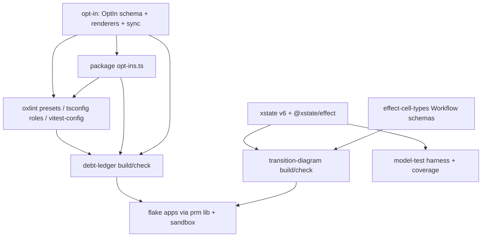

# sfs Lake 6 Generators and Presets Without Off Flags - Plan

## Goal Capsule

- **Objective:** Any systemfsoftware repo (the starter first) lints, typechecks and tests on sfs presets with zero repo overrides, ships a debt ledger generated from its own source that CI holds at zero undeclared entries, and ships statechart and workflow diagrams generated from code that CI fails when stale.
- **Means:** One opt-in contract shared by presets and the ledger (KTD1, KTD2). The ledger is the single gate for `off` flags and debt (KTD4). XState v6 machine definitions are the typed transition tables (KTD7). Each generator is a workspace package delivered as a flake output pinned to prm PR B (KTD11).
- **Authority:** Ryan owns scope; Kiro rules. `CONSTITUTION.md` binds. Origin R-IDs: `docs/brainstorms/inputs/requirements-final.md`. The Kiro rulings of 2026-10-05 are recorded in Key Decisions.
- **Execution profile:** one `gh stack` on trunk `main`, one layer per unit group (see Sequencing). Writers run in isolated worktrees with one owner per file. Mutation is never run locally.
- **Stop conditions:** U8's probe hits a wall (xstate v6 / @xstate/effect on Effect 4.0.1, @effect/tsgo 0.48.1, the role presets, or release age). The same error recurs 3 times. prm PR B has no branch when U13 starts. In each case send Kiro the exact error. There is no home-grown fallback.
- **Finishes:** sfs-generators runs ce-work. An independent verifier session reviews. Kiro rules the findings.

---

## Product Contract

### Summary

Rewrite the four oxlint presets, the tsconfig Effect presets and the test presets so every exception is a declared, named, reasoned opt-in and no rule is ever `off` or `warn`. Add `@systemfsoftware/opt-in`, `@systemfsoftware/debt-ledger` and `@systemfsoftware/transition-diagram`, and adopt all three in sfs at zero undeclared entries. Add an XState v6 model-test harness with a path-coverage gate. Deliver the generators as Nix flake outputs.

### Problem Frame

The starter cannot delete its two `off` overrides (R67), because sfs presets meet those needs only with `off` flags of their own (`oxlint-config-dmmf/src/index.ts:25`) and nothing fails a config that turns a rule off. The tsconfig Effect preset claims to list every diagnostic, but it omits 33 of @effect/tsgo 0.48.1's 118, and each omission silently keeps an upstream `warning`, `suggestion` or `off` default. rat-stack's ledger (217 directives) records reasons only: it has no owner, no JSON and no gate. Its diagrams are drawn by hand. No sfs tool generates either artifact (see origin: Superiority Map rows for `/debt.md`, fence, generated diagrams).

### Key Decisions

- **Exceptions are declared opt-ins, never `off`/`warn`.** Kiro bar. Governs R1-R4.
- **tsconfig role presets list every diagnostic at `error`. Library role grants exactly `effect/http` and `effect/observability`. Test role adds `effect/testing`. Each grant carries its reason in the preset.** (session-settled: user-directed — chosen over exactly two grants in every role: Effect 4.0.1 tags `effect/testing` unstable, and tests in 9 sfs packages and the starter use TestClock.) Governs R2, R3.
- **Lifecycles are XState v6 machines run through `@xstate/effect`. Durable orchestration stays on `effect/workflow`.** (session-settled: user-directed — Kiro ruling 2026-10-05, chosen over adding a home-grown `Machine` to effect-cell-types: that would reinvent a mature statechart library. Reverses the origin's "no XState" Key Decision.) Governs R10-R13.
- **No AST parsing for diagram edges.** Machines render from their definitions. The ~75 `Workflow.make` sites render as outcome diagrams from their runtime schemas. (session-settled: user-directed.) Governs R10, R11.
- **The generators' flake layer pins prm PR B by flake rev as soon as its branch exists, open or not. sfs builds no packaging library of its own.** (session-settled: user-directed — chosen over building in the sfs flake now and switching later.) Governs R14.
- **Distribution is Nix flakes, with no npm, and consumers run dependency code in the bubblewrap sandbox.** (session-settled: user-directed — Ryan ruling, `docs/brainstorms/inputs/ruling-nix-distribution-sandbox.md`.) Governs R14.

### Requirements

**Presets (R74)**

- R1. No published oxlint, tsconfig or test preset and no sfs package config sets a rule `off`, `allow`, `0`, `warn`, or a category `off`. Every exception is a narrowed configuration at `error`, declared as a named opt-in with a reason and an owner.
- R2. `@systemfsoftware/tsconfig` moves to `@effect/tsgo` 0.48.1. Each role lists all 118 diagnostics. Each is at `error` unless a declared opt-in excludes it from that role.
- R3. The library role grants `effect/http` and `effect/observability`. The test role also grants `effect/testing`. The reasons ship in the preset. The starter extends the role presets and needs no list of its own.
- R4. A consumer with Gherkin step bodies, build-config files (`vitest.config.ts`, `tsdown.config.ts`) and `effect/http` + `effect/observability` imports passes lint and typecheck with zero overrides.

**Debt ledger (R46)**

- R5. One command builds the ledger from tracked source as `debt.md` (humans) and `debt.json` (agents) from one model. The ledger covers inline suppressions (lint, Effect diagnostics, TypeScript, Stryker, coverage, formatter), Rust `allow`/`expect`/`ignore` attributes, skipped/focused tests, TODO-family markers, config severities, and grants.
- R6. Every entry is Declared (name, reason, owner) or Undeclared. Inline suppressions and skipped tests are never declarable. A TODO is declared only as `TODO(@owner): reason`.
- R7. `check` fails on any of these: an Undeclared entry, a declaration that matches no grant, a committed artifact that differs byte-for-byte from regeneration, or an empty or unscanned input root. Its success line reports the files and channels it scanned.
- R8. sfs ships at zero Undeclared entries.

**Diagrams (R14)**

- R9. One command renders every discovered machine and workflow as `.mmd`, `.svg` and Unicode text, plus a Markdown index. `check` fails on stale, missing or orphan files.
- R10. Machines render as `stateDiagram-v2` from the XState v6 definition: states, events, guards by name, initial and final states.
- R11. Workflows render as outcome flowcharts from `command`/`decision`/`error` schemas.
- R12. Discovery is closed: a configured module exporting no machine or workflow fails, and every `Workflow.make` site lives in a discovered file.
- R13. Model-based tests generate every shortest path through each machine with `xstate/graph` and run it against the caller's real store adapter. A coverage check fails when any state or transition has no generated path. Persisted snapshots round-trip through restore unchanged.
- R15. An `@xstate/effect` actor persists its snapshot in Durable Object SQLite through `@systemfsoftware/effect-unit-of-work`. On real workerd (Miniflare), disposing the instance with persisted storage and recreating it resumes the actor in the same state, and the next event is applied exactly once.

**Delivery**

- R14. Each generator is a workspace package with property tests, delivered as `packages.<system>.<name>` and `apps.<system>.<name>` that run in the prm sandbox and are configured by a repo-root config file.

### Success Criteria

- The starter deletes `tsconfig.base.json`'s own unstable list and both oxlint overrides, and lint and typecheck stay green (real-CLI QA in the U3/U4 PR bodies).
- Each gate has been seen red on a sabotage and green after the revert, with the evidence in its PR body.
- rat-stack comparison, each line checkable:

| Artifact           | rat-stack ships                                                                           | Ours, and the check                                                                                                                                                                                               |
| ------------------ | ----------------------------------------------------------------------------------------- | ----------------------------------------------------------------------------------------------------------------------------------------------------------------------------------------------------------------- |
| Debt ledger        | `/debt.md`, 217 directives across 3 comment families, reason only, Markdown only, no gate | Every family plus config severities, grants, skips, TODOs and Rust. Owner and reason on every declared entry. JSON + Markdown. `debt-ledger check` fails CI at 1 Undeclared entry and at any byte drift. sfs at 0 |
| Fence              | oxlint with `off` rules                                                                   | Zero `off`/`warn` across presets and consumers, judged on effective configs; the ledger fails on any                                                                                                              |
| Effect diagnostics | 75 `@effect-diagnostics` suppressions                                                     | 118/118 diagnostics accounted for per role; omissions are declared exclusions; 0 inline suppressions                                                                                                              |
| Diagrams           | hand-drawn Unicode text blocks                                                            | Mermaid + SVG + Unicode generated from the machine definition, byte-compared in CI                                                                                                                                |
| Statecharts        | `xstate@6.0.0-alpha.63` + `@xstate/effect@0.1.0-alpha.6`, no path coverage                | Same library. Every shortest path is generated and run against the real store. The coverage check fails on an uncovered state or transition                                                                       |

### Scope Boundaries

- Converting existing sfs Workflows (for example effect-atom's node-phase workflow) to XState machines is out of scope: no requirement asks for it. The starter's registration lifecycle is the first production machine.
- The starter consumes the persisted-actor adapter (R15) in Starter Lake 4. The adapter itself and its workerd proof ship here (Kiro ruling 2026-10-05).
- Package-script flags beyond `--passWithNoTests` (for example `--no-verify`) are not scanned. The ledger reports its channel list, so the gap is visible.
- Per-package tarball outputs for all sfs packages belong to prm PR C. U13 adds only the two generator apps.

---

## Planning Contract

### Key Technical Decisions

- KTD1. **`@systemfsoftware/opt-in` holds the opt-in contract.** It provides an Effect Schema `OptIn` (branded name, reason, owner handle) carrying a tagged `Grant` union. The variants are oxlint narrowed rule, Effect diagnostic exclusion, unstable/experimental API, duplicate package, vitest guard exemption, lint/format ignore, tsdown warning, type-refusal fixture scope, and `passWithNoTests`. The package also has pure renderers and a `sync` bin. Presets and the ledger both depend on it, which keeps the ledger CLI's heavy dependencies out of presets. It is separate from debt-ledger by capability (CONST-N1).
- KTD2. **Each package declares its own opt-ins in a package-root `opt-ins.ts`.** Its oxlint config builds overrides from them. `opt-in sync` writes its tsconfig plugin blocks as the role preset plus its grants, because `compilerOptions.plugins` replaces across `extends` (`docs/solutions/tooling-decisions/tsgo-lsp-linter-in-lint-pipeline.md`). vitest-config's central `guardExemptions` table (`packages/toolchain/vitest-config/lib/base.js:73-98`) is deleted. The exempt packages declare instead.
- KTD3. **The tsconfig JSON presets are rendered from a typed source in the package.** A package test byte-compares the source against the checked-in JSON. The reasons ship as JSONC comments above each grant plus a published `opt-ins.json`, because the plugin options schema has `additionalProperties: false`.
- KTD4. **The `off` ban is a ledger entry kind, not a separate checker.** The ledger imports oxlint configs (Vite 8 `runnerImport`), evaluates the `extends` graph, and resolves tsconfig chains. The oxlint-guard regex cannot see variables or spreads (`agent-plugins/oxlint-guard/README.md:113`). The tsgo channel takes effective severity as the listed value, else the installed schema default, so an omission cannot hide an `off`.
- KTD5. **Every verdict comes from recomputation.** `check` regenerates in memory and byte-compares. It asserts a non-empty input set and reports unscanned channels (`docs/solutions/architecture-patterns/provenance-ritual-gates.md`). Gates run outside turbo, so cache cannot blind them (`docs/solutions/build-errors/turbo-verdicts-under-stale-cache-and-strict-env.md`).
- KTD6. **Scanners are AST/lexer based, never regex on raw text.** TS/JS use oxc-parser comments and call expressions. Rust uses a lexer that skips strings and comments. A directive spelled inside a string literal is not an entry.
- KTD7. **The typed transition table is an XState v6 machine definition** (`setup(...).createMachine(...)`: pure guards and assigns as data). Effects run through `@xstate/effect`. Pins: `xstate` 6.0.0-alpha.64 (published 2026-10-03) and `@xstate/effect` 0.1.0-alpha.6 (2026-09-28, peer `effect ^4.0.0`, `xstate ^6.0.0-alpha.63`). Both clear `minimumReleaseAge: 1440` today. U8 confirms them before anything depends on them. (session-settled: user-directed — Kiro ruling; chosen over a home-grown `Machine`.)
- KTD8. **Path generation and coverage use `xstate/graph`, which xstate 6.0.0-alpha.64 exports** (`exports` keys: `.`, `./actors`, `./durable`, `./fsm`, `./graph`, `./validation`). U8 confirms the shortest-path API on v6. Snapshot persistence uses v6's own persisted-snapshot API (`./durable` is a candidate).
- KTD9. **Diagram discovery imports configured modules through Vite `runnerImport` and reflects them.** Machines are found by XState's machine shape. Workflows are found by `Symbol.for('@systemfsoftware/effect-cell-types/WorkflowSchemas')` (`packages/effect-cell-types/src/Workflow.ts:7,225-227`). The existing dmmf `make-file-location` rule closes the Workflow population, and a configured machine module that exports none fails (R12).
- KTD10. **Rendering uses beautiful-mermaid 1.1.3** (synchronous, pure JS, elkjs layout, `stateDiagram-v2` + flowchart, SVG and Unicode outputs). Byte-stable SVG needs no headless browser. nixpkgs mermaid-cli 11.17.0 requires Chromium plus fonts. One shared tail produces all three outputs (`docs/solutions/logic-errors/duplicated-packer-tails-diverge-on-determinism.md`).
- KTD11. **Flake outputs consume prm's `lib.mkPnpmWorkspacePackages` and `packages.<system>.sandbox` through a flake input pinned to the PR B rev.** sfs `checks` build the outputs. An eval-only gate would ship a compile failure green (`flake.nix` checks comment).
- KTD12. **Pins.** `@effect/tsgo` 0.48.1, which patches oxlint 1.82.0-1.86.0 and tsgolint 7.0.2001/7.0.2003. `oxlint` stays ~1.82.0. `effect` lock moves 4.0.0 → 4.0.1 to match the starter. `oxc-parser` 0.150.0 and `vite` 8 come from the catalog. Every version was checked against the registry or nixpkgs `4975466d` on 2026-10-05.
- KTD13. **Gates enroll in their own layer over a clean tree** and are seen red on a sabotage before green. Kiro's brief of 2026-10-05 commissioned them (GATE1). The verifier session, not this one, reviews them (CONST-E9, AGENTS.md Surface Classes).

### High-Level Technical Design



Ledger classification, as directional pseudo-grammar:

```text
Entry   = InlineDirective | SkippedTest | Marker | ConfigSeverity | Grant
Status  = Declared{name, reason, owner} | Undeclared{why}
check fails <=> any Undeclared  OR  any StaleDeclaration  OR  bytes(committed) != bytes(regen)  OR  scanned = 0
```

### Sequencing

Stack layers bottom-up (each green alone, inert until wired): U1 → U2 → U3, U4 → U5 → U6 → U8 → U9 → U10 → U11 → U12 → U14 → U7 (gate enrollment) → U13. The presets and the off ban (U1-U4) come first because starter R67 waits on them. U8 runs as a spike in parallel with U1 and gates U9-U12 and U14. U14 rebases onto Lake 2's `./durable-object` layer (#604) or onto `main` once it merges.

### Risks

| Risk                                                                         | Mitigation                                                                                                                                                                                                  |
| ---------------------------------------------------------------------------- | ----------------------------------------------------------------------------------------------------------------------------------------------------------------------------------------------------------- |
| Listing 33 more diagnostics at `error` exposes violations across sfs         | U3 measures each and fixes the code. A role exclusion is allowed only where a probe shows compliance is impossible (`docs/solutions/architecture-patterns/an-escape-hatch-is-an-unfalsified-hypothesis.md`) |
| xstate v6 / @xstate/effect are alphas                                        | Exact pins (KTD7). U8 probe. A wall goes to Kiro                                                                                                                                                            |
| oxlint rejects a symbol-keyed or extra override key used for opt-in metadata | Metadata lives in `opt-ins.ts`, not in the oxlint object. The ledger joins declarations to overrides by `files` + rule                                                                                      |
| prm PR B is absent or moves                                                  | Pin by rev. Re-pin on push. Escalate if no branch exists                                                                                                                                                    |
| U13 and prm PR C both edit `flake.nix`                                       | Whoever lands second rebases. Note it in both PR bodies                                                                                                                                                     |

---

## Implementation Units

### U1. opt-in package

- **Goal:** Contract, constructors, renderers and `opt-in sync` (KTD1, KTD2).
- **Requirements:** R1-R3.
- **Dependencies:** none.
- **Files:** `packages/opt-in/{package.json,tsdown.config.ts,vitest.config.ts,oxlint.config.ts,tsconfig*.json,turbo.json,README.md}`, `packages/opt-in/src/{mod.ts,OptIn.schema.ts,Grant.schema.ts,render-oxlint.ts,render-effect-plugin.ts,sync.ts,cli.ts}`, `packages/opt-in/tests/*.test.ts`, `.changeset/*.md`.
- **Approach:** Pure core plus a thin `cli.ts` shell. The package is inert at import (pack: package-topology, import-time-inertness.md). It has entries `.` and a `bin`.
- **Test scenarios:**
  - A malformed owner handle or an empty reason is refused, and decode fails with a typed error.
  - Rendering an oxlint grant never produces a severity other than `error` (property over generated grants).
  - A rendered Effect plugin block from role + grants equals role ∪ grants, with no duplicates, and its order is stable under permuted input.
  - `sync --check` on a tsconfig whose block differs exits non-zero and names the file.
- **Verification:** Package tests are green. The api report is committed.

### U2. tsconfig role presets on @effect/tsgo 0.48.1

- **Goal:** Library and test roles list all 118 diagnostics and carry the reasoned grants. sfs packages with extra grants are synced.
- **Requirements:** R2, R3; Key Decisions (role presets).
- **Dependencies:** U1.
- **Files:** `pnpm-workspace.yaml`, `pnpm-lock.yaml`, `packages/toolchain/tsconfig/{effect.json,effect-entrypoint.json,opt-ins.json,README.md,package.json}`, `packages/toolchain/tsconfig/src/effect-roles.ts`, `packages/toolchain/tsconfig/tests/roles.test.ts`, then `opt-ins.ts` + synced `tsconfig.app.json`/`tsconfig.test.json` in effect-atom, effect-daemon-cluster, -process, -socket, discern, trace-spec, effect-readiness, runner/vitest and examples/inventory-fulfillment.
- **Approach:**
  1. Bump `@effect/tsgo` and `effect`.
  2. Render the roles from `effect-roles.ts` (KTD3).
  3. Each package declares the unstable modules it uses, with reasons. The usage map comes from planning research and is re-measured at execution.
- **Test scenarios:**
  - The rendered role JSON is byte-identical to the checked-in file.
  - Every key in the installed `@effect/tsgo` schema appears in each role at `error` or under a declared exclusion.
  - A scratch file importing `effect/http-api` under the library role fails `lint:tsgo` with `unstableApiUsage`, and `effect/http` passes (sabotage probe recorded in the PR).
- **Verification:** `pnpm check:local` is green on the bumped lock.

### U3. oxlint and build presets without off

- **Goal:** Remove every `off`, either by fixing code or by narrowed opt-ins.
- **Requirements:** R1, R4.
- **Dependencies:** U1.
- **Files:** `packages/oxlint-presets/oxlint-config-{dmmf,recommended,rule-authoring}/src/index.ts`, `packages/oxlint-plugin/oxlint-plugin-effect-platform/src/index.ts`, `packages/oxlint-plugin/oxlint.config.ts`, `packages/toolchain/vitest-config/lib/base.js`, `packages/toolchain/tsdown-config/src/quiet-build.ts`, the exempt packages' `opt-ins.ts`, and the test files under `packages/oxlint-plugin/**/__tests__/` whose casts get fixed.
- **Approach:**
  1. `vitest/no-standalone-expect` becomes `['error', { additionalTestBlockFunctions: [...] }]`, with the Gherkin and fork registrar names measured from `effect-gherkin-spec` and `@systemfsoftware/vitest`.
  2. `no-restricted-imports` and `effecttsgo/node-builtin-import` get narrowed scopes for build-config and entry files.
  3. Test `complexity` and `consistent-type-assertions` offs are deleted. The code is fixed, or narrowed options are declared.
- **Execution note:** Diff the full-repo lint diagnostics before and after. The only allowed differences are the intended ones.
- **Test scenarios:**
  - A fixture consumer with a Gherkin step body calling `expect` lints clean under `recommended` with no overrides.
  - A fixture `vitest.config.ts` importing `node:path` lints clean, and the same import in `src/` still errors.
  - The full-repo diagnostic set is unchanged except for the listed deltas.
- **Verification:** Grepping the effective configs finds no `off`, `allow`, `0` or `warn` (proved again by U5 in U7). Starter QA is in the PR body.

### U4. Starter-shaped consumer acceptance

- **Goal:** Prove R4 end to end against the real starter branch.
- **Requirements:** R3, R4.
- **Dependencies:** U2, U3.
- **Files:** none committed (QA evidence only).
- **Approach:** Clone the starter `lake1/shared-configs` into `/tmp/repos`, point it at `pnpm pack` tarballs of the changed presets, delete `tsconfig.base.json`'s list and the overrides, then run lint and typecheck.
- **Test expectation:** none. This is real-CLI QA, recorded in the U3 PR body.
- **Verification:** Both runs exit 0. Adding `effect/http-api` exits non-zero.

### U5. debt-ledger package

- **Goal:** Scanners, model, renderers and the `debt-ledger build|check` CLI (KTD4-KTD6).
- **Requirements:** R5-R7.
- **Dependencies:** U1.
- **Files:** `packages/debt-ledger/{package.json,tsdown.config.ts,vitest.config.ts,oxlint.config.ts,tsconfig*.json,README.md}`, `packages/debt-ledger/src/{mod.ts,Entry.schema.ts,Ledger.schema.ts,classify.ts,scan-ts.ts,scan-rust.ts,scan-oxlint.ts,scan-tsconfig.ts,scan-vitest.ts,scan-stryker.ts,render-md.ts,render-json.ts,config.ts,cli.ts}`, `packages/debt-ledger/tests/**`.
- **Test scenarios:**
  - `// oxlint-disable` inside a string literal is not an entry (refusal).
  - `oxlint-disable`, `@effect-diagnostics`, `Stryker disable` and `@ts-ignore` are always Undeclared.
  - `TODO(@ryanleecode): reason` is Declared, and bare `TODO` is Undeclared.
  - Severity normalization maps `'off'`, `'allow'`, `0`, `['off', {...}]`, `'warn'`, `1` and a `categories` off to Undeclared ConfigSeverity, with an independent hand table as the oracle.
  - An `off` reached only through a spread or an `extends` chain is found.
  - An omitted tsgo diagnostic whose schema default is `warning` is Undeclared unless an exclusion is declared.
  - A grant with no declaration is Undeclared, and a declaration with no grant is Stale.
  - The JSON count equals the Markdown rows equals the per-kind totals (law across two views).
  - Permuting the input file order gives identical bytes.
  - An empty input root fails with a typed error, and the success line names the scanned channels.
  - A Rust `#[allow(x)]` inside a raw string is not an entry, and `#[allow(clippy::x)]` is.
- **Verification:** Package tests are green. Sabotage: drop one scanner kind and the tests go red.

### U6. sfs adopts the ledger at zero

- **Goal:** `debt-ledger.config.ts`, repo-level opt-ins, fixes, and committed `docs/debt.md` + `docs/debt.json`.
- **Requirements:** R8.
- **Dependencies:** U2, U3, U5.
- **Files:** `debt-ledger.config.ts`, `opt-ins.ts` (repo root: the `repos/` vendored exclusion, type-refusal fixture scopes), `crates/gritlint_core/src/domain.rs` (replace the `#[allow(clippy::too_many_arguments)]` with a parameter struct), `docs/debt.md`, `docs/debt.json`, root `package.json` scripts `debt:build`/`debt:check`.
- **Test expectation:** none. This is adoption config. Its proof is `debt:check` exiting 0 with Undeclared = 0, plus the sabotage below.
- **Verification:** Adding `'off'` to any preset turns `debt:check` red, and reverting turns it green. The same holds for adding `it.skip`.

### U8. XState v6 + @xstate/effect probe

- **Goal:** Confirm the KTD7/KTD8 pins work on Effect 4.0.1, @effect/tsgo 0.48.1 and the role presets.
- **Requirements:** R10, R13.
- **Dependencies:** U2 for the roles. Can start in parallel as a scratch spike.
- **Files:** scratch only (`.scratch/`, gitignored). The pins land in `pnpm-workspace.yaml` in U9.
- **Approach:**
  1. Install the exact pins and confirm pnpm accepts them under `minimumReleaseAge`.
  2. Write one machine with a guard, an assign and an `@xstate/effect` `fromEffect` actor.
  3. Run `tsc -b`, `lint`, `lint:tsgo` and a vitest run.
  4. Call the `xstate/graph` shortest-path API and the persisted-snapshot API.
- **Test expectation:** none. This is a probe, and its output is evidence.
- **Verification:** Every command exits 0. A rule conflict (for example the classes ban or unstable-API use inside xstate typings) gets either a fix or a declared opt-in whose probe shows compliance is impossible. Any other failure is sent to Kiro verbatim and stops U9-U12.

### U9. transition-diagram package

- **Goal:** Discovery, the machine and workflow renderers, and `transition-diagram build|check` (KTD9, KTD10).
- **Requirements:** R9-R12.
- **Dependencies:** U8.
- **Files:** `packages/transition-diagram/{package.json,tsdown.config.ts,vitest.config.ts,oxlint.config.ts,tsconfig*.json,README.md}`, `packages/transition-diagram/src/{mod.ts,discover.ts,machine-to-mermaid.ts,workflow-to-mermaid.ts,render.ts,config.ts,cli.ts}`, `packages/transition-diagram/tests/**` (fixture machines and workflows).
- **Test scenarios:**
  - Every transition in a fixture machine definition appears exactly once as `From --> To: event [guard]`. The oracle is the hand-written edge list.
  - Final states get `--> [*]`, and initial states get `[*] -->`.
  - Generated state and event names containing Mermaid metacharacters render without breaking the parse (property: beautiful-mermaid renders without throwing).
  - A workflow's decision variants get solid edges and its error variants dashed ones.
  - Shuffling discovery order gives identical `.mmd`, `.svg` and text bytes.
  - A configured module exporting nothing fails. An orphan checked-in diagram fails `check`, and so does a stale one.
- **Verification:** Package tests are green. Sabotage: change one fixture edge without regenerating, and `check` goes red.

### U10. sfs adopts diagrams

- **Goal:** `transition-diagram.config.ts` and committed `docs/diagrams/**` for every `*.workflow.ts`.
- **Requirements:** R9, R11, R12.
- **Dependencies:** U9.
- **Files:** `transition-diagram.config.ts`, `docs/diagrams/**`, root `package.json` scripts `diagrams:build`/`diagrams:check`.
- **Test expectation:** none. This is generated output, proved by `diagrams:check`.
- **Verification:** The count of rendered workflows equals the count of tracked `*.workflow.ts` files that `make-file-location` admits, and the success line reports it.

### U11. XState opt-ins and doc wiring

- **Goal:** Any unstable or lint grant that U8 found xstate needs, declared once in the presets.
- **Requirements:** R1, R10.
- **Dependencies:** U8, U3.
- **Files:** `packages/oxlint-presets/*/src/index.ts` or `packages/toolchain/tsconfig/src/effect-roles.ts`, depending on the U8 findings. `packages/transition-diagram/README.md`.
- **Test expectation:** covered by U5's preset checks. Skip the unit if U8 found no conflict.
- **Verification:** A U8-shaped consumer lints clean with zero overrides.

### U12. Model-based test harness and coverage

- **Goal:** Shortest-path generation, a run against a caller-supplied store adapter, a coverage check, and the snapshot round-trip law (R13; KTD8).
- **Requirements:** R13.
- **Dependencies:** U8, U9.
- **Files:** `packages/transition-diagram/src/model-test.ts` (exported as `./model-test`, a host-contract subpath per pack: package-topology, declared-entry-points.md), `packages/transition-diagram/tests/model-test.test.ts`.
- **Test scenarios:**
  - For a fixture machine, the generated paths cover every state and every transition, with the hand-listed sets as the oracle.
  - A fixture with an unreachable state makes the coverage check fail and name it.
  - A store adapter that drops one transition makes the path run fail on exactly that path.
  - The persisted snapshot after each path restores to an actor whose snapshot is deep-equal.
- **Verification:** Package tests are green. Sabotage: delete one edge from the fixture and the coverage check goes red.

### U14. Persisted actor on Durable Object SQLite

- **Goal:** `@systemfsoftware/durable-actor`: an `@xstate/effect` actor whose persisted snapshot is read and written inside the effect-unit-of-work Durable Object unit, proved on real workerd (R15).
- **Requirements:** R15.
- **Dependencies:** U8, U12, sfs Lake 2 `./durable-object` (#604; rebase on it, or on `main` once merged).
- **Files:** `packages/durable-actor/{package.json,tsdown.config.ts,vitest.config.ts,oxlint.config.ts,tsconfig*.json,README.md}`, `packages/durable-actor/src/**`, `packages/durable-actor/tests/__fixtures__/{actor.worker.ts,workerd.fixture.ts}`, `packages/durable-actor/tests/persisted-actor.integration.test.ts`.
- **Approach:** Each event runs as one unit: read the snapshot row, restore the actor, send the event, write the next snapshot plus an applied-event key, all inside `transactionSync`. An event key already applied is a no-op. Patterns: Lake 2's `tests/__fixtures__/workerd.fixture.ts` and `claims.worker.ts`.
- **Test scenarios:**
  - Persist after two events, dispose the Miniflare instance keeping persisted storage, recreate it: the actor reports the same state value and context.
  - After the restart, sending the next event moves the actor exactly once, and re-sending the same event key leaves state and row count unchanged.
  - An event the machine does not accept in the current state leaves the stored snapshot byte-identical.
- **Verification:** The integration test is green on workerd. Sabotage: write the snapshot outside the unit (after the transaction), and the restart scenario goes red.

### U7. Gate enrollment

- **Goal:** Wire `debt:check` and `diagrams:check` into `check:static` and `check:local` (KTD13).
- **Requirements:** R7, R9.
- **Dependencies:** U6, U10.
- **Files:** root `package.json`.
- **Test expectation:** none. This is an evaluator change, proved red-then-green in the PR body.
- **Verification:** Two sabotage commits (an `off` in a preset, a stale diagram) each fail `pnpm check:local`, and the reverts pass. The `static` CI job runs `check:static`, so no workflow edit is needed.

### U13. Flake outputs

- **Goal:** `packages`/`apps` for `debt-ledger` and `transition-diagram` over prm PR B, run in the sandbox (KTD11).
- **Requirements:** R14.
- **Dependencies:** U7, prm PR B branch.
- **Files:** `flake.nix`, `flake.lock`, `nix/generators.nix`.
- **Test expectation:** none. This is packaging, with a smoke run as proof.
- **Verification:**
  - `nix flake check` builds both outputs.
  - From a scratch repo, `nix run <sfs-rev>#debt-ledger -- check` and `#transition-diagram -- check` run inside the sandbox.
  - The scratch repo's `~/.ssh` is unreadable from inside the run.

---

## Verification Contract

| Scope                       | Command / evidence                                                            |
| --------------------------- | ----------------------------------------------------------------------------- |
| Per package while iterating | `pnpm --filter @systemfsoftware/<pkg> test`, `typecheck`, `lint`, `lint:tsgo` |
| Ledger                      | `pnpm debt:check` (0 Undeclared, byte-fresh)                                  |
| Diagrams                    | `pnpm diagrams:check`                                                         |
| Before each PR              | `pnpm check:local` once, exit 0                                               |
| Nix                         | `nix flake check`, `nix run` smoke from a scratch repo                        |
| Never                       | local mutation runs (REPO-D3)                                                 |

Each PR body carries the commands run, their outputs, one sabotage (break, red, revert), and real-CLI QA for user-facing changes (U4, U13). Each publishable package change gets a `pnpm change` changeset (REPO-R2). Each PR appends to `docs/brainstorms/REFLECTION.md`.

---

## Definition of Done

- R1-R15 hold, each shown by its unit's Verification.
- sfs `docs/debt.json` reports 0 Undeclared entries, and `check:local` includes both gates.
- The starter QA (U4) shows zero overrides.
- R15's workerd restart journey is green.
- No scratch probes, abandoned approaches or `.scratch/` files remain in the diff.

---

## Appendix

Sources: `docs/brainstorms/inputs/requirements-final.md` (R14, R46, R67, R74), `docs/brainstorms/inputs/ruling-nix-distribution-sandbox.md`, @effect/tsgo 0.48.1 `schema.json` and README (`allowedUnstableApis`, per-file overrides replace), effect 4.0.1 tarball (`@stability unstable` subtrees), starter `lake1/site` `tsconfig.base.json` (SHA 19ec81cd), rat-stack 54d3560 (`scripts/oxlint-plugin-debt-ledger.ts`, `ratstack.sh/debt.md`), prm `prm/toolchain` (SHA 118d82f7, no `lib` output), npm registry for `xstate` 6.0.0-alpha.64, `@xstate/effect` 0.1.0-alpha.6 and `beautiful-mermaid` 1.1.3 (2026-10-05).
