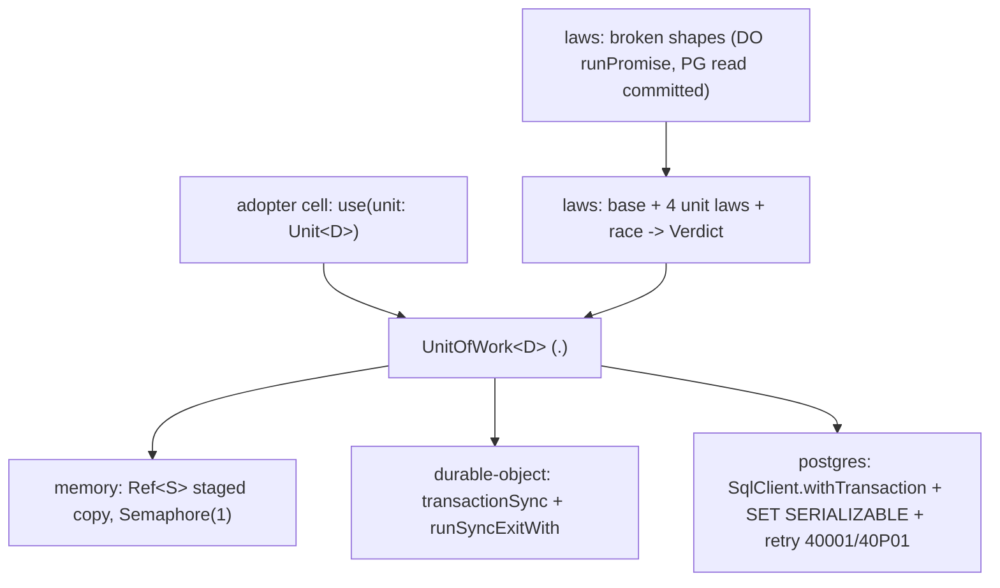
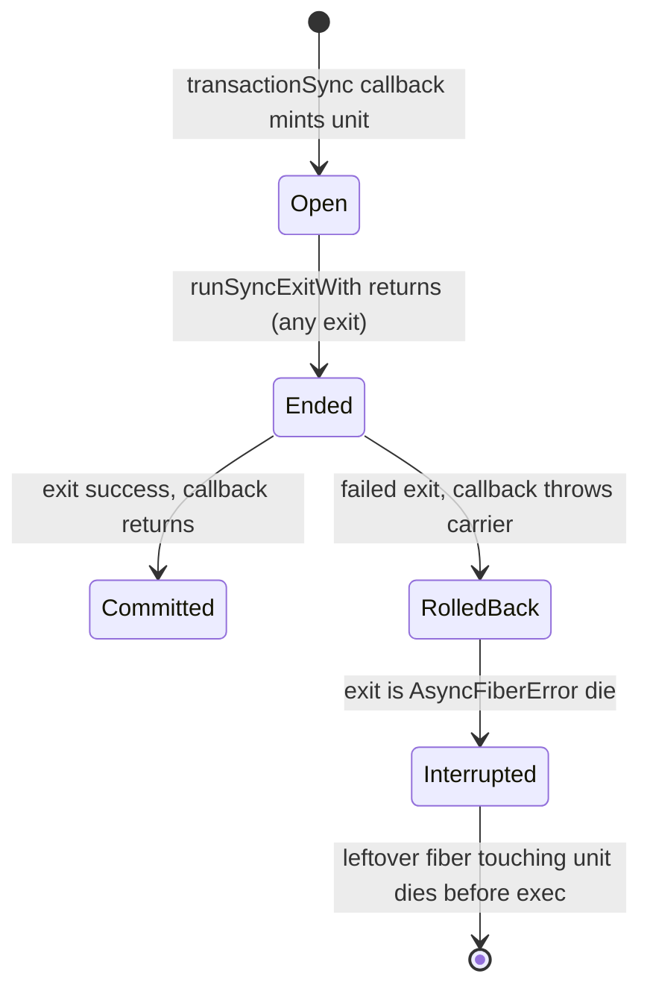
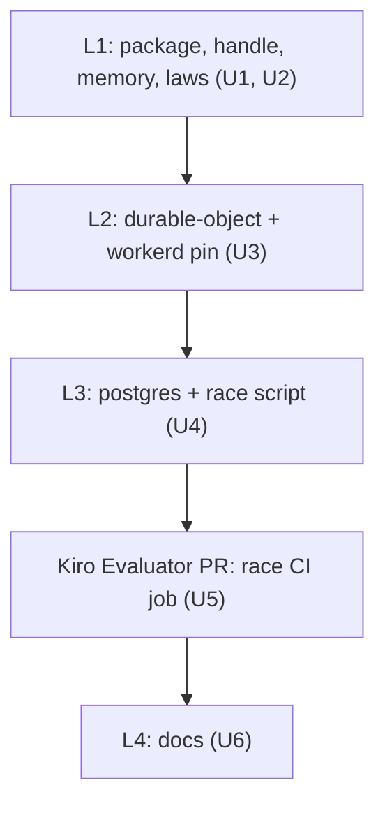

# sfs Unit-of-Work Kit - Plan

## Goal Capsule

- **Objective:** A starter store (and sfs Lake 5's Durable Object workflow engine) gets an atomic read-decide-write unit on a SQLite Durable Object and on Postgres from one systemfsoftware package, consumed as a flake output pinned by `flake.lock`, with laws and a real-workerd race that prove the unit cannot oversell or leak a write.
- **Means:** `@systemfsoftware/effect-unit-of-work`: one generic unit handle, three adapters (memory, `transactionSync` Durable Object, SERIALIZABLE `SqlClient`), and a law and race kit returning verdicts as values (KTD1-KTD6).
- **Authority:** origin R20, R22, R72 and its Key Decisions; then this plan's KTDs; then the cited pack rules.
- **Stop conditions:** evidence that `transactionSync(() => Effect.runSyncExit(...))` cannot hold the AE5 race in workerd stops the work and goes to Kiro as `settled-decision-invalidated`.
- **Execution profile:** one `gh stack` on trunk `main`: L1 (U1, U2), L2 (U3), L3 (U4), Kiro's Evaluator PR (U5) stacked right after L3, then L4 (U6). Each layer green alone. No local stryker. No self-review; Kiro runs `ce-code-review`.

---

## Product Contract

Product Contract preservation: R20, R22 and R72 are carried unchanged from the origin. R72a-R72f are this lake's derived constraints on them and do not change product scope.

### Summary

A new package, `@systemfsoftware/effect-unit-of-work`, provides the unit-of-work port and handle, an in-memory fake, a Durable Object SQLite adapter that runs the unit inside `ctx.storage.transactionSync`, a Postgres adapter that runs it SERIALIZABLE and re-runs it on serialization failure, and a kit of store laws plus a race law. A real-workerd test pins the input-gate semantics the Durable Object adapter depends on.

### Problem Frame

The only unit of work in sfs lives in `examples/inventory-fulfillment`, specialised to one store, Postgres only, and closed by a scope finalizer. The probe (`docs/brainstorms/inputs/starter-scratch/probe-results.md` section 2) showed that on a Durable Object every `runPromise` shape oversold 3x and that a `runSync` unit hitting an async gap leaked 28 rows after its transaction. A finalizer inside the leftover fiber never runs before that write, so the example's close mechanism cannot be lifted as is. sfs has no workerd, miniflare or Postgres server in CI today.

### Key Decisions

- **The DO unit runs as `transactionSync(() => Effect.runSync(...))`.** Carried from origin with its probe evidence. Governs R20, R22.
- **Store default is one SQLite Durable Object per contended aggregate, with Postgres SERIALIZABLE as a second adapter of the same port.** (session-settled: user-approved, carried from origin.) Governs R72, R72a.

### Requirements

**Carried from origin**

- R20. The DO adapter's unit of work refuses every read and write after its transaction callback returns, and refuses any async step inside it.
- R22. A test against real workerd goes red when an await or yield is injected inside the DO unit and green on the `transactionSync` adapter, named as the DO form of pin-dependency-semantics.
- R72. `@systemfsoftware/effect-unit-of-work` ships DO and Postgres adapters, a law harness and an input-gate kit.

**Port and handle**

- R72a. One unit type serves every adapter, so a store's cells and its law suite are adapter-agnostic and the adapter is selected by one value (enables origin R21).
- R72b. A unit used after its `unitOfWork` ended dies before touching storage, identically on every adapter.

**Adapters**

- R72c. A failed unit writes nothing, on every adapter.
- R72d. The Postgres unit runs SERIALIZABLE and re-runs the whole unit only on SQLSTATE `40001`/`40P01`, under a budget supplied by the caller; a spent budget fails with `StoreUnavailable` carrying the last cause.

**Laws and race**

- R72e. The kit exposes the base store laws, the four unit-of-work laws and a race law as programs that return verdicts, usable from a test or a race demo.
- R72f. The kit exposes the deliberately broken unit shapes the race law must fail on (DO `runPromise` unit, Postgres READ COMMITTED unit), so negative controls are one value (enables origin R23).

### Acceptance Examples

- AE5. **Covers R22.** Given an injected `Effect.yieldNow` inside the DO unit, when 300 concurrent claims hit a 100-seat session, then the test fails; on the `transactionSync` adapter it grants exactly 100. (Origin.) The yield fails on the `runPromise` shape; on the adapter `runSync` drains it (probe row 2).
- AE20. **Covers R20, R72b.** Given an `Effect.sleep` inside the DO adapter's unit, when 300 claims run, then every claim fails with the async-unit defect, 0 seats are granted and 0 rows exist afterwards.
- AE21. **Covers R72d.** Given a trigger armed to raise `40001` once, when one unit commits, then it ran twice and committed once; armed always, it fails `StoreUnavailable` whose cause is `40001` and nothing is written.

### Scope Boundaries

- Store-specific ports (registration, credits), the starter's race demo and its negative-control tests are starter work (Starter Lake 2).
- Editing compound packs (cell-architecture, boundary-testing) for DO rules is R79, sfs Lake 7.
- No Hyperdrive or PlanetScale path here; R89 is starter work.
- Considered and not built: a schema-decoding row helper on the DO adapter. Adopters decode inside the unit with Schema's synchronous decode; a helper would add surface no known requirement needs.
- Considered and not built: `@effect/sql-sqlite-do`. Its `withTransaction` uses async `storage.transaction` plus `Scheduler.PreventSchedulerYield` (`repos/effect/packages/sql/sqlite-do/src/SqliteClient.ts:171-191`), which cannot refuse an async step (R20).

#### Decided in a later lake

- Whether sfs Lake 5 extracts the workerd test fixture into a shared package is sequencing for Lake 5 planning.

### Dependencies / Assumptions

- Lake 2 builds no distribution step. The package reaches consumers as a flake output of this repo, `packages.<system>.<pkg-attr>` built by `lib.mkPnpmWorkspacePackages` from systemfsoftware/pnpm-release-management once systemfsoftware adopts it (owned by the release-tooling lane). A PR snapshot is the PR head rev; a stable version is the release tag. No npm registry, publish, dist-tag or debut step is involved.
- The manifest version, `0.1.0`, is the first stable version the release pipeline tags. Change intents still drive versioning.

---

## Planning Contract

### Key Technical Decisions

- KTD1. **The unit is one handle kind generic over the adopter's driver record.** `Unit<D>` is minted by `Handle.make` with an indexed slot holding the driver `D` (the adopter's `load`/`save` closures over one transaction) and a tagged open state (`Open | Ended`), never a `Context.Service` or a boolean (pack: cell-architecture, `store-unit-of-work-handle.md`; `resource-vs-handle-duality.md`; `handle-state-privacy.md`). Each adapter takes `makeDriver(token)`, so cells see only `Unit<D>` (R72a). Effect-cell-types' indexed slot (`packages/effect-cell-types/src/Handle.ts:14-42`) carries `D` without a cast.
- KTD2. **The adapter closes the unit from its own frame, never from a scope finalizer inside the unit's fiber.** A `runSync` fiber that suspends never reaches its finalizer before its continuation writes (probe row 7). The DO adapter sets the unit `Ended` inside the `transactionSync` callback after `Effect.runSyncExitWith` returns, whatever the exit. Postgres and memory close with `Effect.ensuring` around the unit. Every handle operation checks the state first and dies with a named defect when `Ended` (R72b).
- KTD3. **The DO adapter runs `transactionSync(() => runSyncExitWith(context)(use(unit)))`, throws a private carrier on any failed exit so SQLite rolls back, and interrupts the leftover fiber when the exit is an `AsyncFiberError` die.** `runSyncExitWith` returns `exitDie(new AsyncFiberError(fiber))` without interrupting the live fiber (`repos/effect/packages/effect/src/internal/effect.ts:5795-5803`). The interrupt stops non-storage side effects the fiber would still run; the `Ended` check (KTD2) is the backstop for storage. The async case surfaces as one named defect so tests and verdicts match by tag. The token is the object's `SqlStorage`, typed structurally in the package, so no `@cloudflare/workers-types` dependency enters.
- KTD4. **The Postgres adapter runs on `effect/sql` `SqlClient`, not a driver.** `withTransaction` takes no isolation level (`repos/effect/packages/effect/src/sql/SqlClient.ts:61-63`), so the unit's first statement is `SET TRANSACTION ISOLATION LEVEL SERIALIZABLE`. The retry predicate matches the `SerializationError` and `DeadlockError` reasons, which both `@effect/sql-pg` and `@effect/sql-pglite` classify from `40001`/`40P01` (`repos/effect/packages/sql/pg/src/internal/sqlError.ts:61-66`, `repos/effect/packages/sql/pglite/src/PgliteClient.ts:533`). One adapter therefore runs on PGlite in tests and a server in the race lane. Budget and backoff are parameters of the adapter's constructor, never literals (pack: cell-architecture, `store-serializable-unit-of-work.md`). Drizzle sessions do not join a `SqlClient` transaction (`docs/solutions/integration-issues/drizzle-effect-session-ignores-ambient-sql-transaction.md`); the README says so.
- KTD5. **Laws are Effect programs that return a tagged verdict, not test registrations.** `./laws` takes a subject (`unitOfWork`, read, write, and for Postgres an engine `40001` arming effect) and returns `Held | Broken { law, witness }`. Tests assert the verdict; a race demo prints it. This keeps `vitest` out of a published entry and keeps import-time inertness (pack: package-topology, `import-time-inertness.md`). Verdict folds are pure decisions under CONST-P2 and the mutation set.
- KTD6. **Four entry points: `.`, `./durable-object`, `./postgres`, `./laws`.** The outline's `./input-gate` folds into `./laws`: its content is the race law and the broken DO shape, neither has a host contract of its own, and a fifth entry would split one consumer's names across two specifiers (pack: package-topology, `declared-entry-points.md`). `.` is one namespace barrel holding the handle, the `UnitOfWork<D>` type, `StoreUnavailable` and the memory adapter (pack: cell-architecture, `single-namespace-barrel.md`). Entries are declared in `tsdown.config.ts`, one `api-extractor.<entry>.json` and golden per entry (precedent: `packages/schema/effect-schema-recursion-budget/api-extractor.runtime.json`).
- KTD7. **Real workerd runs through Miniflare's programmatic API from a Node Vitest test, with `workerd` pinned to the starter's R111 version.** `@cloudflare/vitest-pool-workers` needs `vitest ^4.1` (issue cloudflare/workers-sdk#15618) and the workspace runs `vitest ^5`. Effect tests its DO client the same way (`repos/effect/packages/sql/sqlite-do/test/Miniflare.test.ts`): bundle a fixture Worker with esbuild, start Miniflare with a SQLite DO, `dispatchFetch`. `workerd` gets an exact override at `1.20261005.1` with an exact `minimumReleaseAgeExclude` entry and an `allowBuilds` entry for its postinstall. Alternatives in Alternatives Considered (REPO-W8).
- KTD8. **The input-gate pin is `tests/input-gate.integration.test.ts`, not a `*.differential.test.ts`.** `differential-test-requires-harness` forces `@systemfsoftware/differential-spec`, whose targets fail on real sockets (`packages/sim/differential-spec/README.md:78`). The file keeps the pin's shape (pack: boundary-testing, `pin-dependency-semantics.md`): a raw `transactionSync` reference and the adapter run the same workload, and the `runPromise` shape must diverge, so an Effect or workerd change that stops the oversell turns the pin red. Its describe names it the DO form of pin-dependency-semantics (R22).
- KTD9. **The Postgres race runs in its own `race` script against `DATABASE_URL`; the default `test` script never needs a server.** The store law suite stays on memory and PGlite with fixed histories and no processes (pack: boundary-testing, `fake-and-real-store-laws.md` rules 1, 4). The race fails loudly when `DATABASE_URL` is unset. A dedicated job runs it on `ubuntu-latest` with a `postgres:17` service (U5, an Evaluator Kiro authors under CONST-E9). Until U5 lands, each PR body states the race is not yet gated.

### High-Level Technical Design



DO unit lifecycle, directional:



### Alternatives Considered

| Workerd test runner                      | Verdict                                                                         |
| ---------------------------------------- | ------------------------------------------------------------------------------- |
| `@cloudflare/vitest-pool-workers` 0.22.0 | Rejected: peer `vitest ^4.1.0`, workspace is on `vitest ^5`.                    |
| Miniflare programmatic API (chosen)      | Effect's own precedent; one workerd child per suite; exact workerd override.    |
| `wrangler dev` / raw `workerd` + HTTP    | Rejected: builds a harness Miniflare already is, plus a wrangler dependency.    |
| `alchemy dev`                            | Rejected for a library test: IaC tool and state directory; the starter uses it. |

| Postgres race server                             | Verdict                                                                                                                          |
| ------------------------------------------------ | -------------------------------------------------------------------------------------------------------------------------------- |
| `services: postgres` in a dedicated job (chosen) | GitHub-native on `ubuntu-latest`; the test spawns nothing; matches the pack's "dedicated job".                                   |
| Testcontainers inside `test`                     | Rejected: the test launches a container and local runs need a Docker socket (host has rootless podman).                          |
| `embedded-postgres`                              | Rejected: spawns native binaries from the test and needs another build-script approval.                                          |
| PGlite                                           | Rejected for the race: one connection, single-permit semaphore (`repos/effect/packages/sql/pglite/src/PgliteClient.ts:212-231`). |

### Assumptions

- Miniflare's bundled workerd can be overridden to `1.20261005.1` without breaking its config capnp; if not, U3 pins the Miniflare release that ships that workerd.
- The workerd suite (about 10 s) fits the existing `test` lane on `ubuntu-latest`; workerd needs no Docker.
- `@systemfsoftware/vitest` has a live-clock runner for tests that await real sockets; U3 confirms which.

### Sequencing



L2 and L3 stack linearly (L1, L2, L3, L4) for `gh stack`; they share no files besides the changeset and README.

---

## Output Structure

```text
packages/effect-unit-of-work/
  package.json  tsdown.config.ts  vitest.config.ts  vitest.race.config.ts
  stryker.config.ts  oxlint.config.ts  turbo.json  tstyche.json  .attw.json
  tsconfig.json  tsconfig.app.json  tsconfig.test.json  tsconfig.tstyche.json  tsconfig.node.json
  api-extractor.json  api-extractor.durable-object.json  api-extractor.postgres.json  api-extractor.laws.json
  etc/*.api.md
  README.md
  src/
    mod.ts                         # export * as UnitOfWork
    UnitOfWork/                    # unit.handle.ts, port, StoreUnavailable, memory adapter
    durable-object/                # transactionSync adapter, exit classification
    postgres/                      # SqlClient adapter, retry predicate
    laws/                          # laws, race, verdict folds, broken controls
  test-types/unit-of-work.tst.ts
  tests/
    unit-of-work.integration.test.ts
    input-gate.integration.test.ts
    postgres-race.integration.test.ts
    __fixtures__/                  # claims.worker.ts, workerd.fixture.ts, serialization-seam.fixture.ts, seats.model.ts
```

Per-unit `Files` lists are authoritative.

---

## Implementation Units

### U1. Package skeleton, unit handle, port and memory adapter

- **Goal:** Publishable package whose `.` entry gives the generic unit, the `UnitOfWork<D>` type, `StoreUnavailable` and a memory adapter.
- **Requirements:** R72, R72a, R72b, R72c; KTD1, KTD2, KTD6.
- **Dependencies:** none.
- **Files:** `packages/effect-unit-of-work/{package.json,tsdown.config.ts,vitest.config.ts,stryker.config.ts,oxlint.config.ts,turbo.json,tstyche.json,.attw.json,tsconfig*.json,api-extractor.json,etc/effect-unit-of-work.api.md}`, `src/mod.ts`, `src/UnitOfWork/*`, `test-types/unit-of-work.tst.ts`, `.changeset/<slug>.md` (minor; manifest `0.1.0`).
- **Approach:**
  1. Mirror `packages/effect-readiness` for manifest scripts, tsdown, tsconfigs, oxlint, attw and api-extractor.
  2. The handle module follows `examples/inventory-fulfillment/src/ports/settlement-unit.handle.ts` with KTD1's indexed slot and KTD2's adapter-owned close; it exports `TypeId`, the `is` guard, and a `use` dual that reaches the driver only while `Open`.
  3. Memory adapter mirrors `examples/inventory-fulfillment/src/store/SettlementStoreMemory.ts`: staged `Ref<S>`, one permit, commit on success only.
  4. Stryker mutate set: the handle's state check and the memory commit decision.
- **Patterns to follow:** `packages/effect-readiness/*`, `examples/inventory-fulfillment/test-types/unit-of-work.tst.ts`.
- **Test scenarios:**
  - Type: `unitOfWork` accepts `(unit) => Effect`, rejects a prebuilt Effect.
  - Type: `use` rejects a record carrying the brand without the slot.
  - Type: a cell typed over `Unit<D>` type-checks against memory, DO and Postgres `UnitOfWork<D>` alike.
  - Behaviour lives in U2's law suite (memory is its first subject).
- **Verification:** `pnpm --filter @systemfsoftware/effect-unit-of-work build`, `typecheck`, `test:types`, `lint`, `attw`, `api:check` pass; `guard:projects` claims every file.

### U2. Store laws, race law and verdicts

- **Goal:** `./laws` returns verdicts for the base laws, the four unit-of-work laws and the race law, and proves them on the memory adapter.
- **Requirements:** R72e, R72b, R72c; KTD5.
- **Dependencies:** U1.
- **Files:** `src/laws/*`, `api-extractor.laws.json`, `etc/laws.api.md`, `tests/unit-of-work.integration.test.ts`, `tests/__fixtures__/seats.model.ts`.
- **Approach:**
  1. Laws per pack (boundary-testing, `fake-and-real-store-laws.md`): read-after-write, idempotent read, cross-key commute, failed unit writes nothing, concurrent units serial-equivalent, engine `40001` re-runs once (subject-supplied arming effect, skipped by the memory subject by construction of its subject type, not a flag), ended unit dies.
  2. Race law: run N claims through a subject's claim with unbounded concurrency, then fold outcomes and the final count into a verdict: every request decided, granted equals `min(cap, N)`, rows equal granted.
  3. Folds are pure and single-path (CONST-P2) and in the mutate set.
- **Test scenarios:**
  - Memory subject: every law returns `Held`.
  - A memory subject whose commit ignores failure (fixture-local sabotage) makes "failed unit writes nothing" return `Broken` naming that law.
  - Race on memory: 300 claims, cap 100, verdict `Held` with 100 rows.
  - Race fold: outcomes with 101 grants for cap 100 yield `Broken` naming the oversell; an undecided claim yields `Broken` naming it.
  - A unit leaked out of its callback and used later dies with the ended-unit defect.
- **Verification:** `test` passes; verdict-fold sabotage (one comparison flipped) turns a case red.

### U3. Durable Object adapter and real-workerd input-gate pin

- **Goal:** `./durable-object` runs the unit atomically in a SQLite DO and refuses async steps and post-callback access; a real-workerd test pins why.
- **Requirements:** R20, R22, R72c, R72f; AE5, AE20; KTD2, KTD3, KTD7, KTD8.
- **Dependencies:** U1, U2.
- **Files:** `src/durable-object/*`, `src/laws/` (DO `runPromise` broken shape), `api-extractor.durable-object.json`, `etc/durable-object.api.md`, `tests/input-gate.integration.test.ts`, `tests/__fixtures__/{claims.worker.ts,workerd.fixture.ts}`, `pnpm-workspace.yaml` (catalog `miniflare`, `workerd` override, release-age excludes, `allowBuilds`), `.changeset/<slug>.md`.
- **Approach:**
  1. Adapter per KTD3; exit classification (success, failure, async die) is a pure decision in the mutate set.
  2. Fixture Worker exports DO classes: raw `transactionSync` reference, the adapter, the adapter with `Effect.sleep` injected, the `runPromise` shape with `Effect.yieldNow`, and one that runs `./laws` inside the DO and returns verdicts as JSON.
  3. `workerd.fixture.ts` bundles with esbuild and holds Miniflare as a scoped resource, started once per file.
- **Execution note:** Start with the reference and `runPromise` journeys; reproduce probe rows 1 and 3 before writing the adapter.
- **Test scenarios:**
  - Reference and adapter: 300 claims, cap 100, both grant exactly 100 with 100 rows (AE5 green side).
  - `runPromise` shape with `yieldNow`: granted above 100, so the race verdict is `Broken` (AE5 red side, the pin's tripwire).
  - Adapter with `Effect.sleep`: every claim fails with the async-unit defect, 0 granted, 0 rows after a settle wait (AE20).
  - Laws run inside the DO against the adapter all return `Held`, including ended-unit death and failed-unit rollback.
- **Verification:** `test` passes locally and in the PR's CI `test` lane; PR body links the run.

### U4. Postgres adapter and race script

- **Goal:** `./postgres` runs the unit SERIALIZABLE with whole-unit retry, passes the store laws on PGlite, and wins the race on a real server.
- **Requirements:** R72c, R72d, R72f; AE21; KTD4, KTD9.
- **Dependencies:** U1, U2.
- **Files:** `src/postgres/*`, `src/laws/` (READ COMMITTED broken shape), `api-extractor.postgres.json`, `etc/postgres.api.md`, `vitest.race.config.ts`, `package.json` (`race` script, devDeps `@effect/sql-pglite`, `@electric-sql/pglite`, `@effect/sql-pg` from catalog), `tests/unit-of-work.integration.test.ts` (Postgres-on-PGlite subject), `tests/postgres-race.integration.test.ts`, `tests/__fixtures__/serialization-seam.fixture.ts`, `.changeset/<slug>.md`.
- **Approach:**
  1. Adapter per KTD4; retry predicate is a pure decision in the mutate set.
  2. Seam fixture mirrors `examples/inventory-fulfillment/tests/__fixtures__/serialization-seam.fixture.ts` (engine-raised `40001`).
  3. Race file reads `DATABASE_URL` via `Config` and fails when unset. Its READ COMMITTED control holds a `pg_sleep` gap between read and write so the anomaly is forced; the adapter runs the same gap.
- **Test scenarios:**
  - PGlite subject: every store law `Held`.
  - Inside the unit, `current_setting('transaction_isolation')` reads `serializable`.
  - Seam armed once: tries 2, committed once (AE21). Armed always with budget 3: `StoreUnavailable`, cause `40001`, tries 3, nothing written (AE21).
  - A unique-violation inside the unit is not retried (tries 1).
  - Race on a server: the adapter fills the cap exactly; the READ COMMITTED control's verdict is `Broken` (oversell).
- **Verification:** `test` passes in CI; `race` passes locally against Postgres 17 and the result goes in the PR body, stating the race is not yet gated until U5 lands.

### U5. Race CI job (Evaluator, Kiro-authored, stacked after L3)

- **Goal:** A dedicated job runs `pnpm --filter @systemfsoftware/effect-unit-of-work race` on `ubuntu-latest` with a `postgres:17` service and `DATABASE_URL`.
- **Requirements:** R72d; KTD9.
- **Dependencies:** U4.
- **Files:** a new reusable workflow beside `.github/workflows/reusable-smoke.yml`, called from `.github/workflows/ci.yml`.
- **Approach:** Handed to Kiro as a spec (CONST-E9, GATE1). Observed red with the READ COMMITTED shape swapped in, green on the adapter.
- **Test expectation:** none -- the job is the gate; its red/green pair is the evidence.
- **Verification:** the red and green run links.

### U6. Documentation

- **Goal:** README and doctrine describe the kit and its adapters.
- **Requirements:** R72; KTD2-KTD4.
- **Dependencies:** U3, U4.
- **Files:** `packages/effect-unit-of-work/README.md`, `CONCEPTS.md` (Unit of Work entry covers the DO form and points its gate at the package).
- **Approach:** README per the `effect-readiness` shape: install, one cell over `Unit<D>`, adapter selection by one value, the DO rule (no async inside the unit), the Drizzle caveat (KTD4), the race lane.
- **Test expectation:** none -- prose only.
- **Verification:** `./bin/dprint check` passes.

---

## Verification Contract

| Check         | Command                                                                                                          | When                        |
| ------------- | ---------------------------------------------------------------------------------------------------------------- | --------------------------- |
| Package gates | `pnpm --filter @systemfsoftware/effect-unit-of-work <build\|typecheck\|test\|test:types\|lint\|attw\|api:check>` | while iterating each layer  |
| Race          | `pnpm --filter @systemfsoftware/effect-unit-of-work race` with `DATABASE_URL`                                    | U4, before its PR           |
| Format        | `./bin/dprint check`                                                                                             | every layer                 |
| Local gate    | `pnpm check:local`                                                                                               | once before opening each PR |
| CI            | `xd://github run_watch` on each PR                                                                               | after each push             |
| Mutation      | CI on `main` only                                                                                                | never local (REPO-D3)       |

---

## Definition of Done

- L1-L4 open as one `gh stack` on trunk `main`, each green on its own, each with a changeset.
- AE5, AE20 and AE21 observed in test output and quoted in their PR bodies.
- Sabotage per CONST-T10 on a scratch copy: removing the `Ended` check, the rollback carrier, or the SERIALIZABLE statement each turns at least one test red.
- U5's race job is green on the stack; the lake is not done before that. Until U5 lands, every PR body states the race is not yet gated.
- Once systemfsoftware's flake exposes the package, the top layer's PR body records the flake attribute and the head rev a starter pins.
- No dead code from abandoned attempts.

---

## Sources / Research

- Probe evidence: `docs/brainstorms/inputs/starter-scratch/probe-results.md` section 2.
- Effect 4 sources: `repos/effect/packages/effect/src/internal/effect.ts:5795-5803,6446-6454`; `repos/effect/packages/effect/src/sql/SqlClient.ts:61-63`; `repos/effect/packages/sql/pg/src/internal/sqlError.ts:61-66`; `repos/effect/packages/sql/sqlite-do/{src/SqliteClient.ts,test/Miniflare.test.ts}`.
- Cloudflare DO storage API and rules: https://developers.cloudflare.com/durable-objects/api/sqlite-storage-api/ , https://developers.cloudflare.com/durable-objects/best-practices/rules-of-durable-objects/
- Leftover-fiber write after `runSync`: https://github.com/drizzle-team/drizzle-orm/issues/6327
- Vitest pool versions: https://github.com/cloudflare/workers-sdk/issues/15618
- `workerd@1.20261005.1` has a `postinstall` (registry manifest, read 2026-10-05); `miniflare` `latest` is `5.20261001.0-alpha` with exact `workerd 1.20261001.1`.
