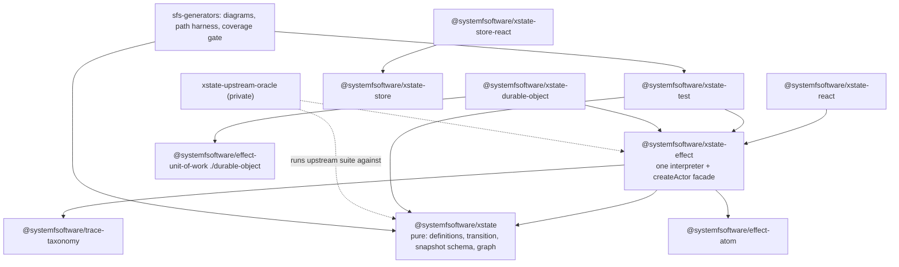
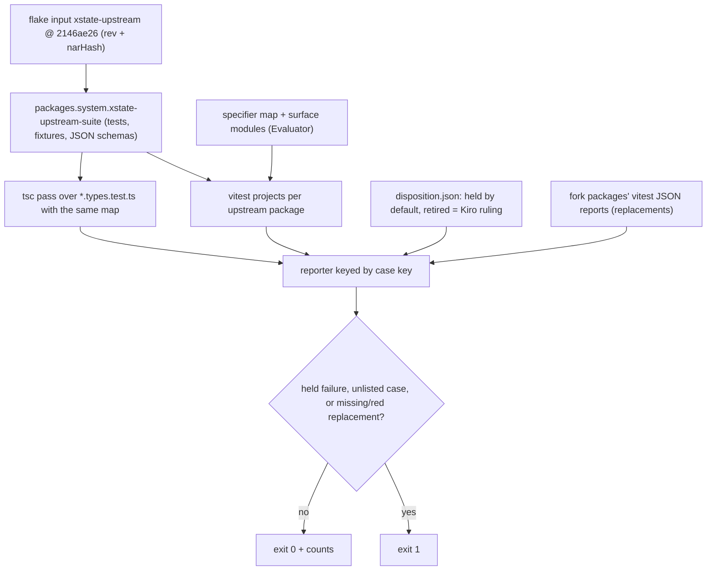
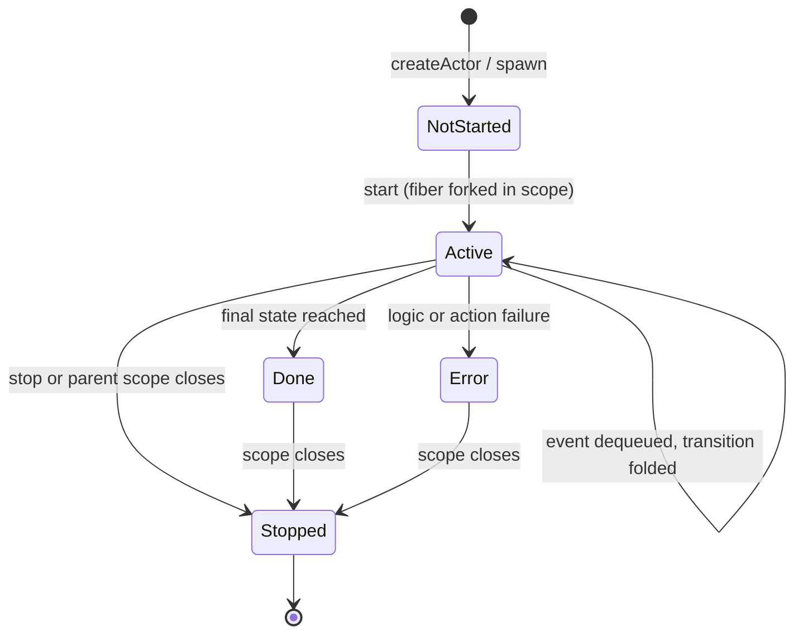
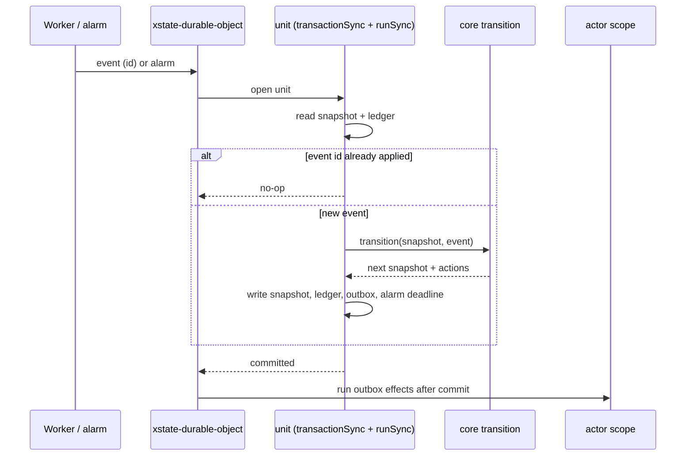

# XState v6 Fork as Owned Packages - Plan

## Goal Capsule

- **Objective:** The starter and sfs-generators build lifecycles, diagrams, model-based path coverage and Durable Object persistence on statechart packages that systemfsoftware owns outright. Upstream XState's own test suite proves those packages behave like upstream, and the repo's gates prove they beat it in ways a reviewer can check.
- **Means:** Fork six statelyai/xstate v6 packages into `packages/xstate/` (KTD1, KTD3). Run upstream's unedited suite against them through an oracle lane (KTD5), and rewrite them in a stack into pure cores and one Effect-native runtime (KTD6, KTD8). Add a Durable Object persisted-actor package (KTD13).
- **Decisions (one line each):**
  - KTD1: the import commit's `src/` and `test/` trees hash-equal upstream's at the pin.
  - KTD2: Landing 1 enrolls typecheck, tsgo, API, attw and tests; no oxlint until a package's rewrite finishes.
  - KTD3: package shape follows discern/effect-atom; subpaths kept only where the placement table justifies them.
  - KTD4: Effect is 4.0.1 stable via the catalog under the standing release-age exclusion; a retraction moves to the next stable 4.x.
  - KTD5: upstream's suite runs unedited from a pinned flake input through the oracle lane and a ruled disposition file.
  - KTD6: one Effect-native interpreter in xstate-effect, placement per module, machine children synchronous inside `runSync`.
  - KTD7: the persisted wire format is upstream v6's exactly; tagged classes are the in-memory model only.
  - KTD8: the transition algorithm is CC=1 workflows and folds over a closed node union.
  - KTD9: graph functions keep upstream's names and signatures; `list-uncovered` is the typed deliverable.
  - KTD10: each package enrolls lint and mutation in its finishing layer; mutation covers all of `src` minus a declared, reasoned exclusion list.
  - KTD11: React packages test in real Chromium, React 19 only.
  - KTD12: xstate-test keeps its API, moves its engine verbatim, deletes zod.
  - KTD13: the Durable Object adapter applies each event once per unit of work; outbox actions are at-least-once with idempotency keys.
  - KTD14: distribution is prm's `mkPnpmWorkspacePackages`, proven reproducible.
  - KTD15: one gh stack; L1 merge commit, later layers squash.
  - KTD16: upstream's held suite is the oracle; new tests only where it cannot reach.
  - KTD17: xstate-effect's `./atom` binds to `@systemfsoftware/effect-atom`, never `effect/reactivity`.
- **Authority:** Ryan owns scope and Kiro rules on it. `CONSTITUTION.md` binds. The origin is `docs/brainstorms/inputs/requirements-final.md`, whose "no XState" decision is superseded by `docs/brainstorms/inputs/ruling-xstate.md`. Distribution follows `docs/brainstorms/inputs/ruling-nix-distribution-sandbox.md`. Kiro rules every oracle-lane retirement in review.
- **Execution profile:** One `gh stack` on trunk `main` with fifteen layers (see Sequencing). Writers run in isolated worktrees, one owner per file. Mutation runs only in CI. Each PR body carries the commands, outputs, sabotage checks and a `docs/brainstorms/REFLECTION.md` entry.
- **Stop conditions:**
  - The same error recurs 3 times.
  - A gate-forced repair would change upstream behaviour.
  - The facade cannot satisfy an upstream test through public API and no replacement test can express the case.
  - #603/#604 have not merged when U15 starts.
  - prm PR #5 / PR C are absent when U16 needs them.
  - In each case Kiro gets the exact error. There is no home-grown statechart fallback.
- **Finishes:** sfs-xstate runs `ce-work`. starter-verify reviews the stack, including the oracle lane. Kiro rules the findings.

---

## Product Contract

### Summary

Import six upstream v6 packages verbatim at `2146ae26ebfc7e6a624b3a1f237f9e6ddc30b9f5`, repair only what the repo's gates refuse, and get upstream's tests green. Next, move upstream's tests out of the tree into a pinned oracle lane. Then rewrite package by package: core becomes pure, xstate-effect hosts the single Effect-native interpreter with a `createActor` facade, and each package enrolls in the unrelaxed preset and mutation as its rewrite finishes. Finally, add `@systemfsoftware/xstate-durable-object` on effect-unit-of-work, proven on real workerd, and ship everything as Nix flake outputs.

### Problem Frame

The XState ruling makes XState v6 machine definitions the typed transition tables for every lifecycle in the program. Generated diagrams and model-based path coverage (sfs-generators), the starter's registration lifecycle and persisted actors in Durable Objects all build on it. The published v6 line is an alpha that is not held to this repo's standards: it carries 192 `as any`, 65 `as unknown as` and 33 classes across the six packages' sources (Baseline Counts), and every cast is removed by the layer that rewrites its file, with no allowance carried between layers. It also has two interpreters: an imperative `Actor` and an Effect interpreter that still starts children as imperative actors. Its React binding depends on a pre-React-18 shim, and it is distributed through npm, which the Nix ruling retires. Depending on it would bring all of that into the exemplar. STRATEGY.md says what the stack needs beyond Effect core is "owned — forked or rewritten — and taken past the category leader". The repo's precedent (`docs/solutions/tooling-decisions/a-forked-repo-lands-as-an-owned-package.md`) says a tree we intend to repair is an owned `packages/` member, never a `repos/` subtree.

### Key Decisions

- **XState v6 is the lifecycle engine; no home-grown `Machine`.** (session-settled: user-directed — chosen over adding `Machine` to effect-cell-types: it would reinvent a mature statechart library; Kiro ruling 2026-10-05.) Governs R1, R6.
- **Distribution is Nix flakes, never npm; consumers run dependency code sandboxed.** (session-settled: user-directed — Ryan ruling 2026-10-05, chosen over npm publishing.) Governs R16.
- **One interpreter, in xstate-effect; core keeps only pure parts; a `createActor`-compatible facade lets upstream's core tests run unchanged.** (session-settled: user-directed — chosen over keeping core's imperative interpreter as a second shell, and over hosting the Effect runtime inside core.) Governs R6, R7.
- **sfs-xstate builds the Durable Object persisted-actor adapter as `@systemfsoftware/xstate-durable-object`; sfs-generators' U14 is dropped.** (session-settled: user-directed — chosen over sfs-generators keeping `@systemfsoftware/durable-actor`.) Governs R14.
- **Upstream's suite runs unedited from a pinned flake input through an oracle lane with a ruled disposition file.** (session-settled: user-directed — approved under CONST-E9 with conditions, chosen over a verifier-built lane and over keeping tests in-tree under an opt-in grant.) Governs R4, R5.
- **Confirmed scope rules:** frozen snapshot wire format, private-internal tests retired with named replacements, the held definitions for skipped and type-only cases, typed graph functions under upstream names, removal of the zod entry and the `use-sync-external-store` shim, per-layer enrollment, and the DO layer last. (session-settled: user-approved — Kiro confirmed the scoping synthesis.) Governs R4, R8, R10, R11, R12, R13, R14.

### Requirements

**Fork substrate and provenance**

- R1. `@systemfsoftware/xstate` (upstream `core`, including `./graph`), `-xstate-effect`, `-xstate-test`, `-xstate-react`, `-xstate-store` and `-xstate-store-react` live under `packages/xstate/` as owned members (REPO-O1, REPO-S5).
- R2. Each package README and the family `packages/xstate/AGENTS.md` say "forked from statelyai/xstate" and name branch `next` at `2146ae26ebfc7e6a624b3a1f237f9e6ddc30b9f5`. Upstream's MIT LICENSE (Copyright (c) 2015 David Khourshid) ships in every forked package.
- R3. Landing 1 brings in the sources unmodified at the pin. Every later difference is a repair a named gate forced. Upstream's tests are green under the repo's vitest, and the PR lands with a merge commit so the verbatim import stays a separate, readable commit in `main`'s history.

**Upstream oracle**

- R4. An oracle lane runs upstream's test files, never edited and sourced only from a flake input pinned to `2146ae26` (rev + narHash), against the fork. A committed disposition file defaults every case to held. A retired entry carries a reason and a named replacement test that exists and passes, and Kiro rules each one in review. The lane fails on any held failure, any unlisted case, or any retired entry whose replacement is missing or red.
- R5. The lane is green at every layer of the stack from the layer that introduces it.

**Runtime and core**

- R6. `@systemfsoftware/xstate` contains only pure parts: machine definitions, `setup`, `createMachine`, `createMachineFromConfig`, `transition`/`initialTransition`, snapshot serialization and versioned migrations, validation, and graph and path utilities. It has no interpreter.
- R7. `@systemfsoftware/xstate-effect` hosts the only interpreter. Actors are fibers in scopes, invoked and spawned children are Effect actors, and delays use Effect `Clock`. Inspection and tracing go through `@systemfsoftware/trace-taxonomy`. Its `createActor`-compatible facade is what `@systemfsoftware/xstate-react` drives.
- R8. The persisted snapshot wire format stays at upstream v6's shape. It changes only through a versioned migration, and a snapshot written at any layer restores at every later layer.
- R9. Every transition-algorithm decision is a pure workflow at cyclomatic complexity 1 (CONST-P2), covered by property tests over generated machines and events.
- R10. Upstream's graph functions keep their names and gain precise machine-derived types. One added function lists every transition of a machine and which of them a path set leaves uncovered, for sfs-generators' coverage gate.

**Standards and proof**

- R11. Each package passes the unrelaxed `@systemfsoftware/oxlint-config-recommended` preset and the tsgo role presets from the layer that finishes its rewrite. Before that layer it declares no lint script; it never declares a weakened preset.
- R12. Each package enrolls in mutation testing at the layer that finishes its rewrite, over a declared, non-empty mutated set held at break 100 in CI. It is never run locally.
- R13. The published surface shrinks relative to upstream, as measured by the API Extractor reports. xstate-test's zod `./schema` entry and xstate-react's `use-sync-external-store` dependency are removed (React 19 only).

**Durable persistence**

- R14. `@systemfsoftware/xstate-durable-object` persists an actor's snapshot in Durable Object SQLite through `@systemfsoftware/effect-unit-of-work`. On real workerd via Miniflare, a restarted or hibernated object resumes in the same state, applies the next event exactly once, and fires delayed transitions that fell due while it was down.
- R15. sfs-generators and the starter consume the packages from the workspace and the flake. A layer that moves a published name migrates every in-repo caller in the same layer.

**Distribution**

- R16. Every public package in the family is a flake output built by pnpm-release-management's `lib.mkPnpmWorkspacePackages`, with a bit-for-bit reproducible tarball. Nothing is published to npm.

### Success Criteria

These are the "better than upstream" claims, each checkable by a command or artifact:

- Every case of upstream's suite at the pin is held or retired with a passing replacement Kiro ruled. The lane's summary prints the held, upstream-skipped and retired counts.
- The transition algorithm carries property tests that upstream does not have (U8).
- The CI Mutation workflow reports break 100 on each package's declared set.
- The final API reports export fewer names than the Landing 1 reports, which equal upstream's surface.
- sfs-generators' coverage gate calls the typed graph functions (U10).
- `packages/xstate/**` carries zero suppression directives.
- The Durable Object restart, exactly-once and injected-yield proofs run on real workerd (U15).

### Scope Boundaries

- Not forked, because no program consumer needs them: `@xstate/solid`, `@xstate/svelte`, `@xstate/vue`, `@xstate/store-angular`, `@xstate/store-preact`, `@xstate/store-solid`, `@xstate/store-svelte`, `@xstate/store-vue`, `@xstate/codemod`, `@xstate/scxml`. None of the six forked packages imports them. xstate-store's Vue and Solid test configs (devDependency `@xstate/vue`) test those bindings and are excluded from the import, listed in U1.
- sfs-generators owns transition diagrams, the model-based path harness and the path-coverage gate. This plan supplies the typed graph API they call (R10).
- The starter's own machines and lifecycles belong to the starter's lakes.
- Durable multi-step orchestration stays on `effect/workflow` (sfs Lake 5). Statecharts own lifecycle state only (ruling-xstate.md item 1).
- npm publishing, dist-tags and trusted publishing are outside this product's identity (Nix ruling).

### Dependencies

- `@systemfsoftware/effect-unit-of-work` `./durable-object` and its Miniflare fixture: PRs #603 and #604 (sfs Lake 2). U15 starts after they merge to `main`.
- tsgo 0.48.1 role presets: sfs-generators U2. U3 repairs against whatever is on `main` at merge time. If U2 lands later, the xstate repairs it forces are made in this stack (KTD2).
- pnpm-release-management PR #5 (`lib.mkPnpmWorkspacePackages`, sandbox) and PR C (systemfsoftware adoption, per-package outputs): U16.

---

## Planning Contract

### Key Technical Decisions

- KTD1. **The import commit's trees are byte-identical to upstream's.** The first commit copies the six package directories (minus the files U1 lists as excluded) to `packages/xstate/<name>/`. The git tree object of each copied `src/` and `test/` directory equals the tree object of the same directory at `2146ae26` in the upstream clone, so identity is checked by hash, not by eye. Repairs land as later commits in the same PR (R3).
- KTD2. **Landing 1 enrolls typecheck, `lint:tsgo`, `api:check`, `attw` and tests, but not oxlint.** This follows discern's #473 precedent: a package with upstream's `any`, casts and over-ceiling functions declares no `lint` script rather than a weakened preset (R11). The tsgo role presets are sfs-generators' instrument (CONST-E9). Grants they would need for xstate are proposed to that owner, never edited here, and the target is zero grants.
- KTD3. **Package shape follows discern and effect-atom.** That means tsdown with the `@systemfsoftware/source` condition, `build` = `tsdown && pnpm api:check`, `api-extractor.json` per entry with committed `etc/*.api.md`, and the `tsconfig` app/test/tstyche/node/build/api set on `tsc/dom/library-monorepo` (`exactOptionalPropertyTypes` on). Exports are edited only in `tsdown.config.ts` (REPO-S4), and the family glob `packages/xstate/*` goes in `pnpm-workspace.yaml`. Landing 1 keeps every upstream subpath, each with its own report. The Module Placement table decides which subpaths remain after the rewrite; each remaining one meets the package-topology entry-point rule, and a merged one records its reason in the layer that merges it (pack: package-topology, declared-entry-points.md).
- KTD4. **Effect resolves to 4.0.1 stable through the catalog.** Excluding `effect` and `@effect/*` from `minimumReleaseAge` by name pattern is the repo's standing policy, not a 4.0.1 workaround. If 4.0.1 is ever retracted, the pin moves to the next stable 4.x; there is no rc fallback. xstate-test's `effect` 4.0.0-beta.106 dev pin and `vitest ^3` peer move to the catalog. Any API drift is a gate-forced repair.
- KTD5. **The oracle lane is a private package `packages/xstate/xstate-upstream-oracle`, an Evaluator surface Kiro approves.**
  1. Flake input `xstate-upstream` (`flake = false`, `github:statelyai/xstate/2146ae26…`) feeds `packages.<system>.xstate-upstream-suite`. That derivation is the six packages' `test/` trees, colocated `src/**/*.test.ts(x)`, their fixtures, and `persistedSnapshot.schema.json`/`machine.schema.json`. The store's Vue/Solid files are excluded (U1).
  2. One vitest project per upstream package resolves the store path through the flake (the `bin/dprint` pattern) and keeps upstream's per-package environment (node or happy-dom).
  3. A resolver plugin maps upstream specifiers to fork entries through one committed specifier map. The map covers xstate specifiers only, listed in full: relative `../src/**` imports inside each upstream package, `xstate`, `xstate/actors`, `xstate/durable`, `xstate/fsm`, `xstate/graph`, `xstate/validation`, `@xstate/effect` and `@xstate/effect/atom`, `@xstate/store` and each of its subpaths (`./persist`, `./reset`, `./undo`, `./validate`), `@xstate/test` and each of its subpaths (`./effect-schema`, `./playwright`, `./vitest`), `@xstate/react` and `@xstate/store-react`. Every upstream subpath has an entry, so the `actors` and `durable-*` cases (durable-restore, durable-adoption, durable-execution-identity among them) resolve and stay held. Third-party imports (effect, fast-check, immer, rxjs, testing-library, …) resolve through the lane's own pinned dependencies. zod, vue and solid are not mapped: their cases are retired or excluded per this plan. An unresolved specifier fails the lane, and adding a mapping is an Evaluator change Kiro rules. The map may point a specifier at a lane-local surface module that combines `@systemfsoftware/xstate` with xstate-effect's facade. That module re-exports only and lives in the oracle package.
  4. A case key is the suite-relative file path, the describe-title chain, the test title, and the occurrence index among identical full titles, which keeps `it.each` collisions distinct.
  5. "Held" means the fork's outcome equals the case's declared mode at the pin: pass, or skip/todo as written. For `*.types.test.ts` files it also means the file type-checks against the fork's types. A checked generator writes one tsconfig per upstream package whose `paths` mirror the specifier map, and each is type-checked with the repo's own compiler (tsgo, TS 7), never a separate TS 5 `tsc`. CI fails when the generated tsconfigs drift from the map.
  6. A reporter enforces R4 against `disposition.json`. It prints held, retired and upstream-skipped counts per retirement class, and prints each held failure with one category (timing/order, async/error propagation, microstep count, persisted shape, internal member, react server snapshot) plus per-category counts. Every held failure ends as a fix in the fork or a ruled retirement. There is no count cap and no quarantine: a flaky held case is a defect to fix. Retirement replacements are matched by full test name in the fork packages' vitest JSON reports, run as turbo dependencies.
  7. Changing the specifier map, the surface modules or the disposition file is an Evaluator change in its own commit. (session-settled: user-directed, see Key Decisions.)
- KTD6. **Runtime architecture.** (session-settled: user-directed — chosen over two thin shells and over an Effect runtime in core; governs R6, R7.)
  - An actor is a `*.handle.ts` handle bound to a `Scope`. Its mailbox is a `Queue`, its loop a fiber that folds events through core's pure `transition`, and its delays are `Clock` sleeps.
  - Invoked and spawned children are child handles in the parent's scope. The system registry (ids, `systemId`s) lives in the root handle's state, never in a module-level map (pack: cell-architecture, handle-state-privacy.md).
  - Placement is decided per module, not per name (Module Placement table). Pure definition, format and decision code stays in core's subpath; code that executes (starts, schedules, awaits) moves into xstate-effect's runtime, which imports the pure parts from core. Nothing is copied or implemented twice. The logic creators at the pin are `createAsyncLogic`, `createCallbackLogic`, `createObservableLogic`, `createEventObservableLogic` and `createLogic`; no legacy `from*` names come back. `createDurable` (core `src/durable/index.ts:311`, which xstate-effect imports from `xstate/durable` today) is split the same way.
  - The facade's `createActor(logic, options)` returns an object implementing upstream's public `Actor`/`ActorRef`/`ActorSystem` interfaces (`start`, `stop`, `send`, `getSnapshot`, `getPersistedSnapshot`, `subscribe`, `on`, `system.get`, `system.inspect`, `system.scheduler`) over one `ManagedRuntime` per root actor.
  - Upstream's `clock` option is accepted and adapted to a `Clock` layer. `SimulatedClock` ships from the facade over `TestClock`.
  - The inspection protocol stays upstream's two events (`@xstate.actor`, `@xstate.transition`). Spans are declared with `Span.declare` from trace-taxonomy (test-discipline `ban-raw-span-name-emit`).
  - Underscore-prefixed members and internal relative imports are not contract. Upstream cases that use them are grouped into named behaviour classes (internal timer scheduling, microstep collection, rehydration, mailbox ordering, and any further class the triage finds). Each class gets one public-API replacement test covering every case in it, and Kiro rules each class. Each layer's PR body lists held, retired and upstream-skipped counts per class. There is no numeric retirement cap.
  - Machine children are pure transitions, so they are processed synchronously inside the parent's `runSync` macrostep, as upstream does. Only genuinely async logic (async, callback and observable logic, invoked Effects, delays) is forked into the actor's scope. Processing one event is therefore a synchronous Effect: decode, `transition` of the actor and its machine children, registry and delay decisions, and synchronous actions. The facade runs each `send` with `runtime.runSync`, so `getSnapshot()`, including a machine child's snapshot, reflects the event when `send` returns, and async cases keep awaiting as upstream's tests already do. No `sendPromise` is added. A held case that fails on sync/async ordering goes through the lane's triage like any other. U15's adapter runs the same step inside `transactionSync`.
  - The internal infinite-transition error is `InfiniteTransitionError` as a `Data.TaggedError` (`_tag: "InfiniteTransition"`). The facade keeps upstream's observable behaviour for it, so the held cases pass.
- KTD7. **The persisted wire format is upstream v6's exactly.** Actor refs encode as `{ xstate$type: 'actorRef', id }`, children by logical address, and timers with `startedAt`. Tagged classes are the decoded in-memory model only; the encoder produces upstream's JSON byte shape.
  - A law validates generated encoded snapshots against `persistedSnapshot.schema.json` from the flake input with ajv, so the oracle is upstream's artifact, not the fork (CONST-T10). Its generator covers snapshots with machine children, Effect sources, observables and pending delayed timers, not only actor-less ones.
  - Snapshots written by upstream's own `getPersistedSnapshot()`, built from the flake input, must decode and restore in the fork.
  - The `machine: { id, version }` envelope and `machineVersions` migration chain stay in core as pure functions.
  - A shape change requires a new machine-version migration plus a test that restores the prior shape (R8).
  - Upstream's `persistedSnapshotFormat.ts` and the JSON schema are pinned before any rewrite touches them (CONST-T9).
- KTD8. **The transition algorithm becomes workflows over a closed node union.** State nodes are a tagged union: atomic, compound, parallel, history (shallow/deep), final.
  - Each decision is a `Workflow.make` ending in `Match.exhaustive`: transition selection, exit-set and entry-set computation, history recording and resolution, done-event generation, and guard evaluation over guard descriptors.
  - `selectTransitions` is its own fold, separate from the macrostep fold: an `Array.reduce`/`Array.findFirst` over candidates in document order, with guard evaluation dispatched through `Match.exhaustive`. It replaces upstream's loops and branches at `core/src/stateUtils.ts:584-585, 744-745, 763-824, 1403-1408, 1896-1898`.
  - Iteration is a fold. The macrostep is a fold over the internal-event queue bounded by the infinite-transition refusal (`InfiniteTransitionError`, KTD6).
  - `getMicrosteps`/`getInitialMicrosteps` are pure exports of `@systemfsoftware/xstate`, folds over the same workflows, because xstate-test's coverage engine reads them. They give equal results with and without an actor.
- KTD9. **Typed graph under upstream names.** Upstream's graph functions (`getShortestPaths`, `getSimplePaths`, `getPathsFromEvents`, `getAdjacencyMap`, `adjacencyMapToArray`, `toDirectedGraph`, `serializeSnapshot`, `joinPaths`, `getDescendantStateNodes`) are already typed at the pin. They keep their names and signatures, pinned by a type-level regression test. Raw state-node helpers keep `AnyStateNode`/`AnyStateMachine`. The typed deliverable is the `list-uncovered` workflow: one pure function that enumerates every transition of a machine (source state id, event type, guard name, target ids) and returns those a given path set leaves uncovered. Its result type is an Effect Schema so sfs-generators can serialize it. No parallel graph API is introduced.
- KTD10. **Enrollment and mutation per layer.** The layer that finishes a package's rewrite adds `oxlint.config.ts` (`extends: [recommended]`, nothing else), its `lint` script, `stryker.config.ts` and its `mutation` script.
  - The mutated set is the package's whole `src`, minus a declared exclusion list in `stryker.config.ts`. Every exclusion names its reason, and the debt ledger shows the list. Every module, `microstep.ts` and `macrostep.ts` included, is in by default; files are never renamed to fit a glob.
  - Kills are reported per lane: the package's own tests, and the upstream-oracle lane. The break-100 release-gate threshold applies to the own-tests score, so the package's own tests must stand alone; the oracle score is reported beside it. Mutation runs only at the release gate, never locally.
  - Packages larger than one CI shard budget use `shardMutate` (pack-independent precedent: `packages/discern/stryker.config.ts`).
- KTD11. **React packages test in real Chromium.** They use a Playwright `browser` project plus a `node` project for SSR and pure modules, following `docs/solutions/tooling-decisions/atom-react-browser-test-toolchain.md`, with a node-only config for Stryker. Peers are `react`/`react-dom` `^19.3.0`. `use-sync-external-store` is dropped for React's built-in hook. Upstream's React tests stay on happy-dom inside the oracle lane because they are not edited.
- KTD12. **xstate-test keeps upstream's public API** (`propertyTest`, `testPaths`, `./vitest`, `./playwright`, `./effect-schema`). Its engine modules move verbatim into the rewritten surface, including its seeded RNG; the lawful runner passes the seed through, and upstream's shrinking and search cases stay held. `vitest.ts` calls only `@systemfsoftware/vitest`'s property API (`docs/solutions/tooling-decisions/fork-effect-vitest-as-lawful-runner.md`). Every zod reference is deleted, not stubbed: the `./schema` entry goes, upstream's zod cases retire to `./effect-schema` equivalents, and `docsExamples` moves to `Schema.Struct` and stays held (R13). xstate-test's `effect` beta pin and `vitest` peer move to the catalog versions.
- KTD13. **The Durable Object adapter applies each event exactly once; outbox actions run at least once, each with a deterministic idempotency key.** Inside `durableObject(storage, …)`'s `transactionSync` + `Effect.runSyncExitWith` unit (#604, KTD3 there), one event is applied as follows:
  1. Read the snapshot row and the processed-event ledger.
  2. Decide with core's pure `transition`.
  3. Write the snapshot, the event id, an outbox of action and child-start effects, and the next alarm deadline. Each outbox action carries the idempotency key `actor id + snapshot version + action index`.
  4. After commit, drain the outbox in the actor scope. A replayed event id is a no-op. An outbox action may run again after a restart between commit and drain; it carries the same key. Actions that reach the outside pass the key through: HTTP actions send it as an `Idempotency-Key` header, and the repo's own handlers dedupe on it.
  5. Delayed events become a DO alarm at the earliest pending deadline.
  6. On restart, restore and re-arm the alarm. Effect children and streams restart from the beginning, as upstream documents for restored Effect actors.
  7. The adapter is a store port with one law suite shared by an in-memory fake and the DO adapter (pack: boundary-testing, fake-and-real-store-laws.md). `Controls.doRunPromise` (#604) is the injected-yield negative control (pack: boundary-testing, pin-dependency-semantics.md).
- KTD14. **Distribution is the prm library, not ours.** The family's public packages become flake outputs when prm PR C adopts `mkPnpmWorkspacePackages` in this repo. This plan makes their `pnpm pack` output reproducible (named type annotations where TS 7 prints unions nondeterministically, as prm #5 found) and proves it with `nix build --rebuild`. It also points sfs-generators and the starter at the outputs.
- KTD15. **Stack shape.**
  - Landing 1 is two layers: L1 (U1-U3, merged with a merge commit) and L2 (U4, the Evaluator layer Kiro approves).
  - Landing 2 layers merge bottom-up with `--squash` as approved. Each layer passes `pnpm check:ci` alone.
  - Each changes-a-build layer ships a `pnpm change` intent (REPO-R2).
  - Commits are signed (ruleset).
  - Because every runtime and API question was settled in this session, no bake-off was warranted.

- KTD16. **Test admission: the oracle first, new tests only where it cannot reach.** Upstream's held suite is the behavioural oracle for every rewritten module. A unit adds a test only in three cases:
  - It states a behaviour upstream does not have, such as Effect children, trace spans, the coverage listing, the real-browser environment, the storage port or the Durable Object adapter.
  - It is the named replacement for a ruled retirement.
  - It is a property on a `*.workflow.ts` decision or a law on a `*.schema.ts`, which the mutation gate needs (KTD10).

  Layers follow `skill://test-layer-selection`. Decisions get properties, schemas get generated laws plus hand-written refusals, published surfaces get in-process integration specs, and stateful runtimes get conformance against a model. The Durable Object adapter gets one fake-and-real law suite plus a differential pin. A test that restates a held upstream case is refused.
- KTD17. **xstate-effect's `./atom` binds to `@systemfsoftware/effect-atom`.** `effect/reactivity` is `@stability unstable` in Effect 4.0.1, and the library role preset allows only `effect/http` and `effect/observability`, so the binding is decided now, in U3. There is no `effect/reactivity` opt-in. effect-atom's root `Atom` namespace (`packages/atom/effect-atom/src/Atom/mod.ts`) already exports what `atom.ts` and `createEffectActor.ts:83-85` use: `Atom.make`, `Atom.writable`, `type Atom.Atom`, `type Atom.Writable`, `type Atom.AtomRuntime`; `Atom.AsyncResult` with `success`, `map`, `isSuccess`, `isInitial`, `failureWithPrevious` (its result type is `Atom.AsyncResult.Result`, not upstream's `AsyncResult.AsyncResult`); and `Atom.Registry` in place of upstream's `AtomRegistry`. U3 adds to effect-atom only what the rebind proves missing (for example the `atom` method on `AtomRuntime`, if its shape differs).

### Pins

All versions were checked against the npm registry on 2026-10-05. Every third-party pin is older than `minimumReleaseAge` (1440 min) except `effect`/`@effect/tsgo`, which are excluded by name.

| Package                                                 | Version                                                                                                                                                   | Use                                                                                    |
| ------------------------------------------------------- | --------------------------------------------------------------------------------------------------------------------------------------------------------- | -------------------------------------------------------------------------------------- |
| upstream                                                | statelyai/xstate `next` @ `2146ae26ebfc7e6a624b3a1f237f9e6ddc30b9f5` (tags `xstate@6.0.0-alpha.64` = 55d00473, `@xstate/effect@0.1.0-alpha.6` = c62db3e7) | fork source, oracle flake input                                                        |
| effect                                                  | 4.0.1                                                                                                                                                     | peer and dev                                                                           |
| @effect/tsgo                                            | 0.48.1 (via sfs-generators U2)                                                                                                                            | Effect diagnostics                                                                     |
| typescript / vitest / tsdown / @microsoft/api-extractor | 7.0.2 / 5.x catalog / 0.23.0 / ^7.59.1 catalog                                                                                                            | toolchain                                                                              |
| react, react-dom                                        | 19.3.0                                                                                                                                                    | React peers                                                                            |
| playwright, @vitest/browser-playwright                  | 1.63.0, 5.0.3                                                                                                                                             | browser tests                                                                          |
| @testing-library/react                                  | 16.3.3                                                                                                                                                    | React tests                                                                            |
| use-isomorphic-layout-effect                            | 1.2.1                                                                                                                                                     | xstate-react dependency kept from upstream                                             |
| happy-dom                                               | 20.14.5                                                                                                                                                   | upstream React/store suites in L1 and the oracle lane                                  |
| zod, ajv, rxjs, immer                                   | 4.6.5, 8.20.0, 7.8.2, 10.2.0                                                                                                                              | upstream test devDependencies (zod only until U14 deletes it); ajv also validates KTD7 |
| @statelyai/inspect                                      | 0.7.2                                                                                                                                                     | upstream store test devDependency                                                      |
| fast-check                                              | 4.10.2                                                                                                                                                    | properties                                                                             |
| miniflare / workerd                                     | 5.20261001.0-alpha / 1.20261001.1 (bundled; re-pin with #604)                                                                                             | U15                                                                                    |

### Baseline Counts

Recorded in the upstream clone at `2146ae26ebfc7e6a624b3a1f237f9e6ddc30b9f5` (`git rev-parse HEAD`). Scope: each package's `src/`, excluding `*.test.*` files. These outputs are the lint and debt-ledger baseline.

- `as any` occurrences: `git grep -ow 'as any' -- packages/<pkg>/src ':!*.test.*' | wc -l`
- `as unknown as` occurrences: `git grep -o 'as unknown as' -- packages/<pkg>/src ':!*.test.*' | wc -l`
- classes: `git grep -E '^(export )?(abstract )?class ' -- packages/<pkg>/src ':!*.test.*' | wc -l`
- source files: `git ls-files packages/<pkg>/src | rg '\.tsx?$' | rg -v '\.test\.' | wc -l`

| Package (upstream dir) | `as any` | `as unknown as` | classes | src files |
| ---------------------- | -------- | --------------- | ------- | --------- |
| core                   | 149      | 31              | 13      | 76        |
| xstate-effect          | 10       | 8               | 5       | 14        |
| xstate-test            | 13       | 21              | 14      | 22        |
| xstate-react           | 6        | 0               | 0       | 9         |
| xstate-store           | 14       | 4               | 1       | 13        |
| xstate-store-react     | 0        | 1               | 0       | 1         |
| total                  | 192      | 65              | 33      | 135       |

Core's `as any` figure counts occurrences. Counting matching lines instead (`git grep -cw 'as any' -- packages/core/src ':!*.test.*'`, summed) gives 143, one of them a comment. The earlier 144 and 156 figures came from other scopes and are superseded by this table.

### Module Placement

Placement under KTD6, one row per module under `core/src/actors/**` and `core/src/durable/**` plus the top-level modules they depend on. "Core" means the module stays in `@systemfsoftware/xstate` under its subpath; "split" means its pure part stays in core and its executing part moves to xstate-effect, which imports the pure part.

| Upstream module                                                                | Placement | Core keeps                                                                                       | xstate-effect runs                                                                   |
| ------------------------------------------------------------------------------ | --------- | ------------------------------------------------------------------------------------------------ | ------------------------------------------------------------------------------------ |
| `actors/logic.ts` (`createLogic`)                                              | core      | logic definition, snapshot shape, pure transition over its events                                | —                                                                                    |
| `actors/promise.ts` (`createAsyncLogic`)                                       | split     | definition, input/output schemas, snapshot and persisted shape, `TimeoutError` as a tagged error | invoking the async function, timeout scheduling, abort                               |
| `actors/callback.ts` (`createCallbackLogic`)                                   | split     | definition, snapshot shape, pure transition over received events                                 | running the callback, its cleanup, `sendBack` delivery                               |
| `actors/observable.ts` (`createObservableLogic`, `createEventObservableLogic`) | split     | definition, snapshot shape, pure transition over emissions                                       | subscribing and unsubscribing                                                        |
| `actors/listener.ts`                                                           | split     | definition and snapshot shape                                                                    | listener registration on the system                                                  |
| `actors/subscription.ts`                                                       | split     | definition, mappers, snapshot shape                                                              | subscribing to the source actor                                                      |
| `actors/attached.ts`                                                           | split     | `createAttachedLogic` definition, `relayMappedToParent` mapping                                  | relaying to the parent                                                               |
| `actors/index.ts` (`createEmptyActor`)                                         | core      | the `./actors` barrel over the core parts                                                        | empty actor handle                                                                   |
| `durable/index.ts` (`createDurable`)                                           | split     | `DurableSnapshot`, durable metadata and root-event types, adapter contract, persisted format     | the execution loop, `runStep` checkpoints, resume and cancel                         |
| `persistedSnapshotFormat.ts`                                                   | core      | `findNonJsonPath` and the wire format (KTD7)                                                     | —                                                                                    |
| `effectDescriptor.ts`                                                          | core      | `getEffectDescriptor`                                                                            | —                                                                                    |
| `actorSource.ts`                                                               | core      | `resolveRegisteredActorSource`                                                                   | —                                                                                    |
| `actorScope.ts`                                                                | effect    | —                                                                                                | actor scope capabilities on the handle                                               |
| `runtimeHelpers.ts`                                                            | effect    | —                                                                                                | `runStep`, `deliverEvent`, `rejectUndeliverableEvent`, `terminateActor`, `stopActor` |

`DurableExecutionCancelledError` and `DurableExecutionResumeError` become tagged errors beside the durable types in core. U5 confirms each row against the module's code before moving it; a row that changes is recorded in that layer's PR body.

### High-Level Technical Design

Package topology after the stack:



Oracle lane data flow (KTD5):



Actor handle lifecycle in the Effect runtime (KTD6), the status upstream's facade reports:



One event through the Durable Object adapter (KTD13):



### Sequencing

| Layer | Units      | Merge                 | Gate it adds                                               |
| ----- | ---------- | --------------------- | ---------------------------------------------------------- |
| L1    | U1, U2, U3 | merge commit          | upstream tests in-tree green; typecheck, tsgo, api, attw   |
| L2    | U4         | squash, Kiro approves | oracle lane; in-tree upstream tests removed                |
| L3    | U5         | squash                | Effect-native actor system                                 |
| L4    | U6         | squash                | facade; core interpreter gone; xstate-react on the runtime |
| L5    | U7         | squash                | snapshot and state-model schemas, JSON-schema law          |
| L6    | U8         | squash                | transition workflows and properties                        |
| L7    | U9         | squash                | core lint and mutation enrollment                          |
| L8    | U10        | squash                | typed graph and coverage listing                           |
| L9    | U11        | squash                | xstate-effect enrollment                                   |
| L10   | U12        | squash                | xstate-react enrollment                                    |
| L11   | U13        | squash                | store and store-react enrollment                           |
| L12   | U14        | squash                | xstate-test enrollment                                     |
| L13   | U15        | squash                | DO adapter on workerd                                      |
| L14   | U16        | squash                | reproducible tarballs, flake outputs                       |
| L15   | U17        | squash                | provenance docs, fork learning record                      |

U15 is the top runtime layer and waits for #603/#604 to merge. U16 proves every family output, xstate-durable-object included, and U17 closes provenance for every package.

### Output Structure

```text
packages/xstate/
  AGENTS.md
  xstate/                    @systemfsoftware/xstate (upstream core)
  xstate-effect/             @systemfsoftware/xstate-effect
  xstate-test/               @systemfsoftware/xstate-test
  xstate-react/              @systemfsoftware/xstate-react
  xstate-store/              @systemfsoftware/xstate-store
  xstate-store-react/        @systemfsoftware/xstate-store-react
  xstate-durable-object/     @systemfsoftware/xstate-durable-object (new, U15)
  xstate-upstream-oracle/    private Evaluator package (U4)
```

Each published package carries `package.json`, `tsdown.config.ts`, `tsconfig*.json`, `api-extractor*.json`, `etc/*.api.md`, `vitest.config.ts`, `README.md`, `LICENSE`, and from its enrollment layer `oxlint.config.ts` and `stryker.config.ts`.

### Assumptions

- The upstream clone at `/tmp/repos/statelyai__xstate` is a reference for reading. The flake input is the only source the lane executes.

---

## Implementation Units

| U-ID | Title                                               | Key files                                                                                                                                                   | Depends on     |
| ---- | --------------------------------------------------- | ----------------------------------------------------------------------------------------------------------------------------------------------------------- | -------------- |
| U1   | Verbatim import                                     | `packages/xstate/*/src/**`, `packages/xstate/*/test/**`                                                                                                     | —              |
| U2   | Workspace wiring                                    | `packages/xstate/*/{package.json,tsdown.config.ts,tsconfig*.json,api-extractor*.json,vitest.config.ts}`, `pnpm-workspace.yaml`, `packages/xstate/AGENTS.md` | U1             |
| U3   | Gate-forced repairs                                 | `packages/xstate/*/src/**`, `packages/xstate/*/etc/*.api.md`, `.changeset/*.md`                                                                             | U2             |
| U4   | Upstream oracle lane                                | `flake.nix`, `flake.lock`, `packages/xstate/xstate-upstream-oracle/**`                                                                                      | U3             |
| U5   | Effect-native actor system                          | `packages/xstate/xstate-effect/src/actor/**`                                                                                                                | U4             |
| U6   | createActor facade, core interpreter removal        | `packages/xstate/xstate-effect/src/facade/**`, `packages/xstate/xstate/src/**`, `packages/xstate/xstate-react/src/**`                                       | U5             |
| U7   | Snapshot and state-model schemas                    | `packages/xstate/xstate/src/snapshot/**`                                                                                                                    | U6             |
| U8   | Transition algorithm as workflows                   | `packages/xstate/xstate/src/transition/**`                                                                                                                  | U7             |
| U9   | Core definitions and enrollment                     | `packages/xstate/xstate/src/definition/**`, `packages/xstate/xstate/{oxlint,stryker}.config.ts`                                                             | U8             |
| U10  | Typed graph and coverage listing                    | `packages/xstate/xstate/src/graph/**`                                                                                                                       | U9             |
| U11  | xstate-effect rewrite and enrollment                | `packages/xstate/xstate-effect/src/**`                                                                                                                      | U10            |
| U12  | xstate-react rewrite and enrollment                 | `packages/xstate/xstate-react/**`                                                                                                                           | U11            |
| U13  | xstate-store and store-react rewrite and enrollment | `packages/xstate/xstate-store/**`, `packages/xstate/xstate-store-react/**`                                                                                  | U4             |
| U14  | xstate-test rewrite and enrollment                  | `packages/xstate/xstate-test/**`                                                                                                                            | U10            |
| U15  | xstate-durable-object                               | `packages/xstate/xstate-durable-object/**`                                                                                                                  | U11, #603/#604 |
| U16  | Reproducible tarballs and flake outputs             | `packages/xstate/*/src/**` (annotations), `flake.nix` consumer notes                                                                                        | U14, U15       |
| U17  | Provenance and fork learning                        | `packages/xstate/AGENTS.md`, `packages/xstate/*/README.md`, `docs/solutions/tooling-decisions/a-forked-repo-lands-as-an-owned-package.md`                   | U16            |

### U1. Verbatim import

- **Goal:** Bring the six packages in, unchanged, at the pin (R1, R3).
- **Requirements:** R1, R3; KTD1.
- **Dependencies:** none.
- **Files:** `packages/xstate/xstate/{src,test}/**` (upstream `packages/core`), `packages/xstate/xstate-effect/src/**`, `packages/xstate/xstate-test/{src,test}/**`, `packages/xstate/xstate-react/{src,test}/**`, `packages/xstate/xstate-store/{src,test}/**`, `packages/xstate/xstate-store-react/src/**`, each package's upstream `LICENSE`, `README.md`, `CHANGELOG.md`.
- **Approach:**
  1. Copy from the read-only clone at the pin. Exclude upstream build configs (`vitest.config.mts`, preconstruct fields), xstate-store's `vitest.config.solid.mts`/`vitest.config.vue.mts` and the test files only they include, and any file that imports a non-forked package. List every exclusion in the commit body.
  2. Record upstream's own pass/skip/todo counts per package by running upstream's vitest at the pin in a sandboxed scratch copy. These are the parity baseline U3 and U4 compare against.
- **Test expectation:** none -- the import adds no behaviour; its proof is tree identity.
- **Verification:** Each copied `src/` and `test/` tree hash equals upstream's at `2146ae26`. The exclusion list in the commit body matches the excluded set exactly.

### U2. Workspace wiring

- **Goal:** Make the imported trees workspace members built and tested by the repo toolchain under `@systemfsoftware/*` names (R1, R2).
- **Requirements:** R1, R2; KTD3, KTD4.
- **Dependencies:** U1.
- **Files:** `packages/xstate/*/package.json`, `packages/xstate/*/tsdown.config.ts`, `packages/xstate/*/tsconfig{,.app,.test,.tstyche,.node,.build,.api}.json`, `packages/xstate/*/api-extractor*.json`, `packages/xstate/*/vitest.config.ts`, `packages/xstate/AGENTS.md`, `packages/xstate/*/README.md` (fork clause), `pnpm-workspace.yaml` (family glob, catalog entries per Pins), `pnpm-lock.yaml`.
- **Approach:**
  1. Rename manifests to `@systemfsoftware/*` with workspace dependencies and `catalog:` versions. Upstream specifiers inside sources stay as written until U3 renames them.
  2. Declare every upstream subpath as a tsdown entry with its own API Extractor config.
  3. Configure vitest projects per upstream environment (node, or happy-dom for react/store/store-react).
  4. Scripts: `build`, `typecheck`, `test`, `test:types`, `lint:tsgo`, `attw`, `api:check`, `api:update`. No `lint` and no `mutation` (KTD2, KTD10).
  5. `packages/xstate/AGENTS.md` carries the pin, the not-forked list with its reason, and the family's leaf rules (enrollment per KTD10, oracle lane ownership per KTD5).
- **Patterns to follow:** `packages/discern/{package.json,tsdown.config.ts,api-extractor.json,tsconfig*.json}`, `packages/atom/AGENTS.md`, `packages/atom/effect-atom-react/vitest.config.ts`.
- **Test expectation:** none -- wiring; U3 runs the suites.
- **Verification:** `pnpm install` resolves offline-clean with the lockfile. `pnpm guard:projects` accepts the new members.

### U3. Gate-forced repairs

- **Goal:** Make every enrolled gate green with only the repairs those gates force, and get upstream's in-tree tests green (R3).
- **Requirements:** R3; KTD2, KTD4.
- **Dependencies:** U2.
- **Files:** `packages/xstate/*/src/**` (repair sites only), `packages/xstate/*/etc/*.api.md`, `packages/atom/effect-atom/src/**` (only for a KTD17 surface gap), `.changeset/xstate-fork-debut.md`.
- **Approach:**
  1. Repair categories, each a separate commit naming its gate: specifier renames (`xstate` → `@systemfsoftware/xstate`, `@xstate/*` → `@systemfsoftware/xstate-*`), `exactOptionalPropertyTypes` widenings, `ae-forgotten-export` and unresolved `{@link}` fixes, `@effect/tsgo` diagnostics, Effect 4.0.1 / vitest 5 API drift, and stripping `import.meta.vitest` doc fences (`docs/solutions/test-failures/jsdoc-vitest-fence-marks-source-as-test.md`).
  2. Rebind xstate-effect's `./atom` onto `@systemfsoftware/effect-atom` (KTD17), adding any missing surface to effect-atom in this layer.
  3. Ship one debut `pnpm change` intent naming the six packages.
- **Execution note:** Prove every claim with a cache-free run (`--force`, stale `tsbuildinfo` removed), per `docs/solutions/build-errors/turbo-verdicts-under-stale-cache-and-strict-env.md`.
- **Test scenarios:**
  - Upstream's in-tree suites pass with the same per-package pass/skip/todo counts as the U1 baseline.
  - The built `.mjs` and `.d.ts` of every entry expose the same names (pack: package-topology, condition-branch-agreement.md).
  - `attw` over each packed tarball reports no resolution problem.
- **Verification:** Each package's `build`, `typecheck`, `test`, `test:types`, `lint:tsgo`, `attw` and `api:check` exit 0, and `pnpm check:local` exits 0. Sabotage: revert one `exactOptionalPropertyTypes` repair and typecheck goes red.

### U4. Upstream oracle lane

- **Goal:** Run upstream's unedited suite against the fork from the pinned flake input, enforced by a ruled disposition file (R4, R5).
- **Requirements:** R4, R5; KTD5.
- **Dependencies:** U3.
- **Files:** `flake.nix`, `flake.lock`, `packages/xstate/xstate-upstream-oracle/{package.json,vitest.config.ts,tsconfig*.json,oxlint.config.ts,README.md}`, `packages/xstate/xstate-upstream-oracle/src/{specifier-map.ts,surface/*.ts,case-key.workflow.ts,disposition.schema.ts,verdict.workflow.ts,reporter.ts}`, `packages/xstate/xstate-upstream-oracle/disposition.json`, `packages/xstate/xstate-upstream-oracle/src/__tests__/{case-key,verdict}.workflow.property.test.ts`, `packages/xstate/xstate-upstream-oracle/tests/lane.integration.test.ts` (in-process: the reporter over fixture case reports, no nix), `packages/xstate/xstate-upstream-oracle/tests/__fixtures__/*.json`; deletion of `packages/xstate/*/test/**` and colocated upstream `src/**/*.test.ts(x)`.
- **Approach:**
  1. Add the flake input and the suite derivation.
  2. Build the lane projects, the specifier map, the reporter, and the checked tsconfig generator (`src/type-pass.ts` writes `type-pass/<pkg>.tsconfig.json` from the map; a lane test fails when the committed files differ from regeneration) whose outputs tsgo type-checks.
  3. Generate `disposition.json` with every case `held`.
  4. Prove parity: lane case counts per package equal the in-tree counts from U3.
  5. Delete the in-tree upstream tests in the same layer.
  6. Enroll the oracle package itself in the unrelaxed preset from birth; it is new first-party code.
- **Execution note:** This layer is an Evaluator surface. Keep it its own PR and get Kiro's approval before the next layer stacks on it.
- **Test scenarios:**
  - Property (`case-key`): cases with identical full titles in one file always get distinct keys, and the key of a case does not depend on the order of the other cases in the report.
  - Property (`verdict`): a held case passes the verdict only when its outcome equals its declared mode at the pin. `it.skip`/`it.todo` cases that stay skipped are held, and a held case that now fails or is newly skipped is not.
  - Property (`verdict`): a retired entry passes only when its named replacement appears in a fork report as passed. Missing or failed replacements are refused with distinct error variants.
  - Property (`verdict`): every held failure is assigned exactly one triage category, and the per-category counts sum to the number of held failures.
  - Integration: a specifier absent from the map fails the lane and names the specifier.
  - Integration: a fixture report holding a case absent from `disposition.json` exits the reporter non-zero and names the case key.
  - Integration: a fixture type pass reporting an error in a `*.types.test.ts` file fails that file's cases even though their runtime results passed.
  - Not tested here: flake lock and narHash enforcement are Nix's behaviour and are not re-tested.
- **Verification:** The lane is green with all cases held, and its counts equal U3's. Sabotage: break `transition`'s document-order conflict resolution in the fork and the lane goes red. Revert.

### U5. Effect-native actor system

- **Goal:** One interpreter in xstate-effect where every actor, including invoked and spawned children, is an Effect actor (R7).
- **Requirements:** R7; KTD6.
- **Dependencies:** U4.
- **Files:** `packages/xstate/xstate-effect/src/actor/{actor.handle.ts,actor.blueprint.ts,mailbox-step.workflow.ts,schedule-delay.workflow.ts,child-start.workflow.ts,system-registry.workflow.ts,ActorEvent.schema.ts,actor-spans.ts}`, `packages/xstate/xstate-effect/src/actor/__tests__/{mailbox-step,schedule-delay,child-start,system-registry}.workflow.property.test.ts`, `packages/xstate/xstate-effect/tests/effect-children.integration.test.ts`, `packages/xstate/xstate-effect/tests/mailbox.conformance.test.ts`, `packages/xstate/xstate-effect/tests/__fixtures__/mailbox.model.ts`, `packages/xstate/xstate-effect/tests/actor.trace.test.ts`.
- **Approach:**
  1. Decisions (what to do with a dequeued event, which delays to schedule or cancel, which children to start or stop, how to register ids) are workflows over core's `transition` output.
  2. The handle's fiber executes those decisions and nothing else.
  3. Existing `createEffectActor`, `fromEffect*` and `setupEffect` move onto this system. Their upstream suites stay held.
  4. Time comes only from `Clock` (`docs/solutions/runtime-errors/layered-liveclock-cannot-use-testclock-withlive.md`).
- **Patterns to follow:** `pack: cell-architecture, resource-vs-handle-duality.md`, `scoped-lifecycle-boundaries.md`, `handle-state-privacy.md`; `packages/discern/src/budget.handle.ts`.
- **Test scenarios:**
  - Conformance: events sent concurrently from several fibers are processed one at a time, in an order the mailbox model accepts, and `getSnapshot` after each step matches the model.
  - Property (`schedule-delay`): for any sequence of schedule and cancel decisions, the set of pending deadlines equals schedules minus cancels.
  - Property (`system-registry`): registering then stopping any set of `systemId`s leaves exactly the running ones resolvable, and a duplicate `systemId` is refused with its error variant.
  - Integration (new behaviour: children were core actors upstream): closing the root scope interrupts every invoked and spawned child fiber, and each child's snapshot ends `stopped`.
  - Conformance: after a restore, persisted timer deadlines resume in deadline order under `TestClock` (upstream `packages/xstate-effect/src/persistence.test.ts:376-377` stays held beside it).
  - Trace: each processed event emits the declared transition span, parented to the actor's span, with actor id and event type attributes.
  - Delays, cancellation and `fromEffect` error delivery are not re-tested here; upstream's xstate-effect cases hold them.
- **Verification:** The new tests and the oracle lane are green. Sabotage: make the mailbox drop the second of two queued events and the conformance test goes red.

### U6. createActor facade and core interpreter removal

- **Goal:** Upstream's imperative API runs on the Effect runtime, and core has no interpreter (R6, R7, R15).
- **Requirements:** R6, R7, R15; KTD6.
- **Dependencies:** U5.
- **Files:** `packages/xstate/xstate-effect/src/facade/{create-actor.ts,simulated-clock.ts,legacy-clock.ts,mod.ts}`, `packages/xstate/xstate-effect/tests/retired-replacements.integration.test.ts`; deletion from `packages/xstate/xstate/src/` of `createActor.ts`, `Mailbox.ts`, `system.ts`, `systemTransition.ts`, `timerClock.ts`, `SimulatedClock.ts`, `IndexedHeap.ts`, `actors/**`, `durable/**`, `inertActorScope.ts`, `remoteActorRef.ts`, `snapshotActorRef.ts`, `toPromise.ts`, `waitFor.ts` (each moved or rebuilt in xstate-effect); `packages/xstate/xstate-react/src/**` imports; `packages/xstate/xstate-test/src/**` imports; `packages/xstate/xstate-upstream-oracle/src/{specifier-map.ts,surface/*.ts}` (Evaluator commit); `packages/xstate/xstate-upstream-oracle/disposition.json` (proposed retirements); `packages/xstate/*/etc/*.api.md`.
- **Files (runtime helpers):** `packages/xstate/xstate-effect/src/facade/runtime-helpers.ts` re-exports `runStep`, `deliverEvent`, `stopActor`, `rejectUndeliverableEvent` and `terminateActor` from xstate-effect's runtime. The specifier map points upstream's `runtimeHelpers` import at it, so every held case that imports `runtimeHelpers` resolves unchanged.
- **Approach:**
  1. Build the facade over `ManagedRuntime`.
  2. In one Evaluator commit, point the oracle's `index` surface at core plus the facade.
  3. Migrate xstate-react, xstate-test and any caller on `main` (sfs-generators' packages if merged) to the facade in the same layer.
  4. Propose retirements only for cases that read underscore members or import deleted internals, grouped into behaviour classes (KTD6). Each class names one replacement test written in this layer.
- **Test scenarios:**
  - The facade's behaviour is held by upstream's core suite (clock, snapshot restore, stop, subscribe, system lookup), so no facade test restates it.
  - One replacement scenario per retirement class, through the public facade only, covering every case in the class and naming the observable those cases reached through internals. Example: the internal-timer-scheduling class (cases reading `actor.system._snapshot._scheduledTimers`) is replaced by one test that advances `SimulatedClock` and observes the delayed transitions.
  - A child machine's snapshot has changed when the parent's `send` returns.
- **Verification:** `@systemfsoftware/xstate` exports no interpreter symbol (API report). The lane is green with only Kiro-ruled retirements, and xstate-react's upstream suite is held. Sabotage: make the facade swallow `stop` and upstream's interpreter cases in the lane go red.

### U7. Snapshot and state-model schemas

- **Goal:** State values, snapshots and persisted snapshots become Effect Schemas whose wire shape upstream's own schema accepts (R8).
- **Requirements:** R8; KTD7.
- **Dependencies:** U6.
- **Files:** `packages/xstate/xstate/src/snapshot/{StateValue.schema.ts,MachineSnapshot.schema.ts,PersistedSnapshot.schema.ts,restore-snapshot.workflow.ts,migrate-snapshot.workflow.ts,mod.ts}`, `packages/xstate/xstate/src/schema-laws.test.ts`, `packages/xstate/xstate/src/__tests__/{restore-snapshot,migrate-snapshot}.workflow.property.test.ts`, `packages/xstate/xstate/tests/{persisted-snapshot-wire.integration,snapshot.refusal}.test.ts`.
- **Approach:**
  1. Snapshot status variants (active, done, error, stopped) are tagged classes in memory, each carrying only its fields (pack: schema-laws, tagged-unions-over-state-by-presence.md). The encoder writes upstream's JSON byte shape (KTD7).
  2. Pin upstream's persisted shape before replacing `persistedSnapshotFormat.ts` (CONST-T9).
  3. Restore refuses a mismatched machine id or version with typed errors unless a registered migration exists.
- **Test scenarios:**
  - Wire law: every generated persisted snapshot, including ones with machine children, Effect sources, observables and pending delayed timers, encodes to JSON that ajv accepts against upstream's `persistedSnapshot.schema.json` from the flake input. The expected side is upstream's artifact.
  - Integration: snapshots written by upstream's own `getPersistedSnapshot()`, built from the flake input, decode and restore in the fork to the same state value and context.
  - Property (`restore-snapshot`): restoring under a different machine id always fails with the machine-mismatch variant.
  - Property (`migrate-snapshot`): for any version gap covered by a registered migration chain, restore applies the chain in order; a gap with a missing link fails with the version-gap variant.
  - Refusal: a state value naming a state the machine does not have is rejected by decode.
  - Refusal: a done-status snapshot missing output that the machine declares is rejected by decode.
  - Upstream's persistence-conformance cases in the lane hold restore of upstream's fixtures; the integration above covers snapshots upstream writes at runtime.
- **Verification:** Schema laws, refusals and the lane are green. Sabotage: drop the `machine.version` field from encoding and the wire test goes red.

### U8. Transition algorithm as pure workflows

- **Goal:** The SCXML-derived algorithm is a set of CC=1 workflows with property tests (R9).
- **Requirements:** R9; KTD8.
- **Dependencies:** U7.
- **Files:** `packages/xstate/xstate/src/transition/{StateNodeKind.schema.ts,select-transitions.workflow.ts,exit-set.workflow.ts,entry-set.workflow.ts,history.workflow.ts,done-events.workflow.ts,guard.workflow.ts,InfiniteTransitionError.ts,microstep.ts,macrostep.ts,mod.ts}`, `packages/xstate/xstate/src/__tests__/{select-transitions,exit-set,entry-set,history,guard}.workflow.property.test.ts`, `packages/xstate/xstate/tests/__fixtures__/machine.arbitrary.ts`, `packages/xstate/xstate/tests/transition-laws.integration.test.ts`; deletion of the `stateUtils.ts` loci KTD8 names.
- **Approach:** Generated machines (a bounded-depth arbitrary over the node union) and event sequences drive the properties. `microstep`/`macrostep` are folds calling the workflows. `getMicrosteps` and `getInitialMicrosteps` stay exported for xstate-test.
- **Test scenarios:**
  - Every reachable configuration is legal: each active compound node has exactly one active child, and each active parallel node has all children active.
  - `transition` is deterministic: the same machine, snapshot and event yield equal results.
  - Exit actions run in reverse document order of exited nodes, and entry actions in document order of entered nodes.
  - A transition whose source is a descendant of a conflicting transition's source preempts it.
  - Re-entering shallow history restores the last active direct child, and deep history restores the full last active descendant configuration.
  - An event with no enabled transition leaves the snapshot unchanged, and the result carries no actions.
  - An `always` cycle exceeding the bound returns the infinite-transition error variant rather than looping.
  - A guard that is false blocks its transition; the next candidate in document order is taken.
  - `getMicrosteps` and `getInitialMicrosteps` give equal results with and without an actor.
- **Verification:** Properties and the lane are green, and the CC=1 lint holds on every `*.workflow.ts`. Sabotage: swap exit order to document order and the exit-order property goes red.

### U9. Core definitions and enrollment

- **Goal:** `setup`/`createMachine`/`createMachineFromConfig` produce data rather than class instances, and core passes the unrelaxed preset and enrolls in mutation (R6, R11, R12, R13).
- **Requirements:** R6, R11, R12, R13; KTD3, KTD10.
- **Dependencies:** U8.
- **Files:** `packages/xstate/xstate/src/definition/{machine.blueprint.ts,setup.ts,create-machine.ts,create-machine-from-config.ts,ActionDescriptor.schema.ts,GuardDescriptor.schema.ts,mod.ts}`, `packages/xstate/xstate/src/mod.ts`, `packages/xstate/xstate/{oxlint.config.ts,stryker.config.ts,package.json,tsdown.config.ts}`, `packages/xstate/xstate/test-types/{setup,create-machine}.tst.ts`, `packages/xstate/xstate/etc/*.api.md`; deletion of `StateMachine.ts`, `StateNode.ts` classes.
- **Approach:**
  1. Machine definitions are cold blueprints.
  2. The root barrel is a single namespace barrel (pack: cell-architecture, single-namespace-barrel.md).
  3. Subpaths are kept only where justified (KTD3).
  4. Remove every suppression directive.
- **Test scenarios:**
  - Type test: `setup({ guards, actions }).createMachine(config)` refuses an action or guard name not declared in `setup` at compile time.
  - Type test: a transition target naming a state outside the machine fails to compile under `setup`'s typed targets.
  - Generated laws for `ActionDescriptor` and `GuardDescriptor` come from `schema-laws.test.ts`.
  - Runtime behaviour of definitions is held by upstream's core and JSON cases.
- **Verification:** `lint` exits 0 with `extends: [recommended]` only. The API report exports fewer names than the L1 report, and the lane is green. Mutation runs in CI after merge.

### U10. Typed graph and coverage listing

- **Goal:** Graph functions keep their names with machine-derived types, plus one coverage-listing function for sfs-generators (R10).
- **Requirements:** R10; KTD9.
- **Dependencies:** U9.
- **Files:** `packages/xstate/xstate/src/graph/{adjacency.ts,shortest-paths.ts,simple-paths.ts,paths-from-events.ts,directed-graph.ts,TransitionCoverage.schema.ts,list-uncovered.workflow.ts,mod.ts}`, `packages/xstate/xstate/src/__tests__/list-uncovered.workflow.property.test.ts`, `packages/xstate/xstate/test-types/graph.tst.ts`, `packages/xstate/xstate/tests/graph-paths.integration.test.ts`.
- **Approach:** Types flow from the machine generic. The coverage function's input is a machine plus a path set, and its output is the closed transition list partitioned into covered and uncovered. Hand the API report and one usage example to sfs-generators for their harness.
- **Test scenarios:**
  - Replaying each path from `getShortestPaths` through `transition` from the initial snapshot ends in the path's target state.
  - Every state reachable by some event sequence has a shortest path.
  - The coverage listing over the full `getShortestPaths` result of a machine with no guards reports zero uncovered transitions.
  - Removing one path from that set reports exactly the transitions only that path covered.
  - Type-level regression (tstyche): upstream's graph signatures are pinned as they are at the pin, so a widening or narrowing fails to compile.
- **Verification:** Properties, type tests and the lane (`core/src/graph` upstream cases) are green. Sabotage: drop guarded transitions from enumeration and the coverage property goes red.

### U11. xstate-effect rewrite and enrollment

- **Goal:** The remaining xstate-effect modules become cell-taxonomy modules, and the package enrolls (R7, R11, R12).
- **Requirements:** R7, R11, R12; KTD6, KTD10.
- **Dependencies:** U10.
- **Files:** `packages/xstate/xstate-effect/src/{from-effect,setup-effect,schema,atom,durable,logic}/**`, `packages/xstate/xstate-effect/src/**/__tests__/*.workflow.property.test.ts` (one per workflow the rewrite creates), `packages/xstate/xstate-effect/{oxlint.config.ts,stryker.config.ts}`, `packages/xstate/xstate-effect/etc/*.api.md`.
- **Approach:** Apply the Module Placement table to the remaining xstate-effect modules; `./atom` was rebound in U3 (KTD17). `createDurable`'s execution loop runs on the handle system over core's durable types. Services are parameterized constructors with no `*Live` singletons (pack: cell-architecture, service-and-layer-boundaries.md).
- **Test scenarios:**
  - One property per `*.workflow.ts` the rewrite creates, stating the universal its decision upholds (KTD16). Each is named in the PR body beside the workflow.
  - Behaviour of `fromEffect*`, `setupEffect`, `./atom` and `createDurable` is held by upstream's xstate-effect cases. A binding change that breaks one is fixed, not retired.
- **Verification:** `lint` passes unrelaxed, and xstate-effect's upstream cases stay held.

### U12. xstate-react rewrite and enrollment

- **Goal:** The React hooks drive the Effect runtime, are tested in real Chromium, are React 19 only, and the package enrolls (R7, R11, R12, R13).
- **Requirements:** R7, R11, R12, R13; KTD11.
- **Dependencies:** U11.
- **Files:** `packages/xstate/xstate-react/src/**`, `packages/xstate/xstate-react/{package.json,vitest.config.ts,vitest.node.config.ts,oxlint.config.ts,stryker.config.ts}`, `packages/xstate/xstate-react/tests/{use-actor,use-selector,use-actor-ref,ssr}.integration.test.ts`, `packages/xstate/xstate-upstream-oracle/disposition.json` (shim-only retirements).
- **Approach:** Replace `use-sync-external-store/shim` with React's `useSyncExternalStore`. Propose retirement of upstream cases that exist only to test the shim.
- **Test scenarios:**
  - A component using `useActor` re-renders once per snapshot change in Chromium and not on unrelated events.
  - `useSelector` with a custom comparator suppresses re-render when the selected value is equal.
  - Unmounting the component stops the actor its `useActorRef` created.
  - Server rendering a component with `useActor` returns the initial snapshot markup without starting timers (node project).
- **Verification:** Browser and node projects are green, and `package.json` lists no `use-sync-external-store`.

### U13. xstate-store and store-react rewrite and enrollment

- **Goal:** Store transitions become pure workflows, persistence sits behind a port, and both packages enroll (R11, R12).
- **Requirements:** R11, R12; KTD10.
- **Dependencies:** U4 (independent of the core layers; stacked after U12 for review order).
- **Files:** `packages/xstate/xstate-store/src/**`, `packages/xstate/xstate-store-react/src/**`, both packages' `{oxlint,stryker}.config.ts`, `packages/xstate/xstate-store/src/__tests__/*.workflow.property.test.ts`, `packages/xstate/xstate-store/tests/{store-storage-laws,retired-replacements}.integration.test.ts`, `packages/xstate/xstate-store-react/tests/use-store.integration.test.ts`.
- **Approach:** `createStore` is a thin shell over pure transition workflows. `./persist` reads and writes through a storage port with a memory fake and a `localStorage` adapter sharing one law suite. Its throttle uses `Effect.sleep` under `Clock`, run by a runtime the persist extension owns; the public API is unchanged.
- **Test scenarios:**
  - Property (store transition workflow): an event the store does not handle leaves context unchanged and emits nothing.
  - Storage law suite: the memory fake and the `localStorage` adapter both return the last written value after reconstruction, and both return absent for a key never written.
  - Upstream's `vi.useFakeTimers()` persist cases stay held, because Effect's live clock schedules through `setTimeout`. Beside them, TestClock-driven tests: a throttled persist writes once per window, and the storage-port laws hold under `TestClock`.
  - Browser: `useStore` re-renders when the selected slice changes and not otherwise.
  - Replacement for upstream xstate-store's `vue.test.ts` `fromStore` cases (the Vue binding is not forked): `useSelector` and `useActorRef` over `fromStore`, in xstate-store-react, in real Chromium.
  - Undo, redo and rehydration are held by upstream's store cases.
- **Verification:** Both packages lint unrelaxed, and the upstream store cases are held.

### U14. xstate-test rewrite and enrollment

- **Goal:** Model-based testing runs on the typed graph and the lawful runner, the zod entry is gone, and the package enrolls (R10, R11, R12, R13).
- **Requirements:** R10, R11, R12, R13; KTD12.
- **Dependencies:** U10.
- **Files:** `packages/xstate/xstate-test/src/**`, `packages/xstate/xstate-test/{package.json,tsdown.config.ts,oxlint.config.ts,stryker.config.ts}`, `packages/xstate/xstate-test/tests/{vitest-adapter,effect-schema-replacements}.integration.test.ts`, `packages/xstate/xstate-upstream-oracle/disposition.json` (zod retirements).
- **Approach:** Move the engine modules verbatim into the rewritten surface (KTD12). Delete every zod reference. Move `docsExamples` to `Schema.Struct`. `vitest.ts` calls only `@systemfsoftware/vitest`'s property API and passes the engine's seed through.
- **Test scenarios:**
  - New behaviour: a property declared through the `./vitest` adapter with a predicate that ignores its input is refused as vacuous by the lawful runner.
  - New behaviour: a failing model path declared through the `./vitest` adapter reports the path's event sequence and a rerun seed in the failure record.
  - Replacements for the zod cases: the same event-generation and validation cases through `./effect-schema`, one per retirement class.
  - `testPaths`, `propertyTest` shrinking and coverage reporting are held by upstream's xstate-test cases.
- **Verification:** The package lints unrelaxed, the `./schema` subpath is gone from `tsdown.config.ts` and the API report, and each zod retirement has a Kiro ruling.

### U15. xstate-durable-object

- **Goal:** A persisted actor in Durable Object SQLite that survives restart and hibernation and applies each event exactly once, proven on real workerd (R14).
- **Requirements:** R14; KTD13.
- **Dependencies:** U11, #603/#604 merged.
- **Files:** `packages/xstate/xstate-durable-object/{package.json,tsdown.config.ts,tsconfig*.json,api-extractor.json,etc/xstate-durable-object.api.md,vitest.config.ts,oxlint.config.ts,stryker.config.ts,README.md,LICENSE}`, `packages/xstate/xstate-durable-object/src/{actor-store.service.ts,apply-event.workflow.ts,next-alarm.workflow.ts,PersistedActorRow.schema.ts,durable-actor.cell.ts,drivers/durable-object.ts,drivers/memory.ts,mod.ts}`, `packages/xstate/xstate-durable-object/src/__tests__/{apply-event,next-alarm}.workflow.property.test.ts`, `packages/xstate/xstate-durable-object/tests/actor-store-laws.integration.test.ts` (one fake-and-real law suite run against the memory driver and the DO driver), `packages/xstate/xstate-durable-object/tests/input-gate.differential.test.ts`, `packages/xstate/xstate-durable-object/tests/__fixtures__/{actor.worker.ts,workerd.fixture.ts}`.
- **Approach:** Reuse #604's `workerd.fixture.ts` pattern (Miniflare started once per file) and its storage port types. There is no `@cloudflare/workers-types` dependency. Persisted rows use U7's schema.
- **Execution note:** Write the injected-yield negative control first and watch it go red against `Controls.doRunPromise` before the adapter exists.
- **Test scenarios:**
  - Property (`apply-event`): an event id already in the ledger yields a no-op decision for any snapshot, and a new id yields exactly one ledger append.
  - Property (`next-alarm`): the alarm deadline is the earliest pending delay, and no alarm is set when no delay is pending.
  - Law, both drivers: recreating the driver over the same storage resumes the actor in the same state value and context. On the DO driver this means disposing and recreating the Miniflare instance with persisted storage.
  - Law, both drivers: delivering the same event id twice, including across a recreation between deliveries, applies it once.
  - Law, both drivers: a delayed transition that fell due while the actor was down fires on the next alarm after recreation.
  - Law, both drivers: 300 concurrent events against one actor leave a snapshot equal to some serial order of those events.
  - Differential pin: under `Effect.yieldNow` inside the unit, `Controls.doRunPromise` breaks the serial-order law and the adapter's unit holds it.
  - Law, both drivers: a restored actor whose child was a running Effect stream restarts that stream from its beginning.
  - Law, DO driver: hibernating the object between commit and outbox drain runs the action again after restart with the same idempotency key, and a deduping consumer records exactly one effect.
- **Verification:** All suites are green on real workerd, and the package lints unrelaxed from birth.

### U16. Reproducible tarballs and flake outputs

- **Goal:** Each public family package is a flake output with a bit-for-bit reproducible tarball, consumed by sfs-generators and the starter (R15, R16).
- **Requirements:** R15, R16; KTD14.
- **Dependencies:** U14, U15; prm PR #5 and PR C.
- **Files:** `packages/xstate/*/src/**` (named return-type annotations where emit is nondeterministic), `packages/xstate/AGENTS.md` (consumption note).
- **Approach:** Once PR C adds the prm input, build every family output twice with `--rebuild`. Fix any nondeterministic `.d.ts` emit at its source. Point sfs-generators and the starter at the outputs by flake rev.
- **Test expectation:** none -- packaging; proof is reproducibility.
- **Verification:** `nix build --rebuild` passes for every family output, `@systemfsoftware/xstate-durable-object` included, and a consumer checkout installs the tarballs inside the sandbox launcher.

### U17. Provenance and fork learning

- **Goal:** Provenance is complete and the fork's lessons are recorded (R2).
- **Requirements:** R2.
- **Dependencies:** U16.
- **Files:** `packages/xstate/AGENTS.md`, `packages/xstate/*/README.md`, `docs/solutions/tooling-decisions/a-forked-repo-lands-as-an-owned-package.md` (an oracle-lane section), `CONCEPTS.md` (only if a new domain term is in use).
- **Test expectation:** none -- documentation.
- **Verification:** Every README and the family AGENTS.md name statelyai/xstate and the pin, and every forked package ships its MIT `LICENSE`.

---

## Verification Contract

| Scope                      | Command / evidence                                                                                                                 | When                                            |
| -------------------------- | ---------------------------------------------------------------------------------------------------------------------------------- | ----------------------------------------------- |
| Package gates              | `pnpm --filter <pkg> build`, `typecheck`, `test`, `test:types`, `lint:tsgo`, `attw`, `api:check`; `lint` from its enrollment layer | every layer touching the package                |
| Oracle lane                | `pnpm --filter xstate-upstream-oracle test` (prints held / upstream-skipped / retired counts)                                      | every layer from L2                             |
| Cache-free migration proof | `TURBO_CONCURRENCY=100% pnpm gate:tasks --force` with stale `tsbuildinfo` removed                                                  | L1, L4, L7                                      |
| Workspace gate             | `pnpm check:local` exits 0                                                                                                         | once before each PR                             |
| Mutation                   | CI Mutation workflow on `main`, break 100 on the declared set                                                                      | after each enrollment layer merges; never local |
| Import identity            | tree hashes of `packages/xstate/*/{src,test}` equal upstream's at the pin                                                          | L1                                              |
| Surface                    | API report name counts vs the L1 reports                                                                                           | L7 onward                                       |
| workerd                    | U15 suites under Miniflare                                                                                                         | L13                                             |
| Reproducibility            | `nix build --rebuild` per family output                                                                                            | L14                                             |
| Sabotage                   | each unit's named break turns its test red, then reverted                                                                          | every PR body                                   |

---

## Definition of Done

- R1-R16 hold, each shown by its unit's Verification.
- The oracle lane is green on the top layer. Every retired entry carries Kiro's ruling and a passing replacement.
- Every published family package lints with `extends: [recommended]` alone, and `packages/xstate/**` contains no suppression directive.
- CI Mutation reports break 100 for each enrolled package.
- Each PR body carries commands, outputs and sabotage evidence, and a `docs/brainstorms/REFLECTION.md` entry was appended at each PR.
- No abandoned-attempt code, scratch scripts or probe files remain in the diff.

---

## Appendix

### Risks

| Risk                                                            | Mitigation                                                                                                                                                    |
| --------------------------------------------------------------- | ------------------------------------------------------------------------------------------------------------------------------------------------------------- |
| The facade cannot reproduce an upstream case through public API | The case goes to Kiro as a retirement with a replacement (KTD6). Stop if a public-API case cannot be expressed.                                               |
| Snapshot shape drifts between layers                            | Wire law against upstream's JSON schema and restore-prior-layer test (KTD7)                                                                                   |
| Core mutation exceeds the CI shard budget                       | `shardMutate`. Split per `docs/solutions/architecture-patterns/mutation-budgets-split-rule-packages-into-private-cells.md` if one shard still exceeds the cap |
| tsgo role presets land mid-stack                                | Repairs in the next layer. Grants proposed to sfs-generators, never edited here (KTD2)                                                                        |
| A published name moves while sfs-generators consumes it         | Same-layer caller migration (R15). The API report diff in the PR body names the move                                                                          |
| #603/#604 or prm PR C slip                                      | U15/U16 wait. Kiro gets the blocker with the PR state                                                                                                         |
| xstate-store's excluded Vue/Solid tests hide store behaviour    | U1 lists them. Those configs exercise only the bindings that are not forked                                                                                   |

### Sources

- Upstream clone `/tmp/repos/statelyai__xstate` at the pin: `packages/core/src/graph/index.ts`, `packages/core/src/durable/index.ts`, `packages/core/src/persistedSnapshot.schema.json`, `packages/xstate-effect/src/createEffectActor.ts:70-83` (the existing Effect interpreter that still starts children as core actors).
- Core size: 76 src files (Baseline Counts), about 36.9k LOC, and 145 test files of about 77.8k LOC. 99 core test files call `createActor`, and 84 import `../src/index.ts`. effect-atom exports read from `packages/atom/effect-atom/src/Atom/mod.ts` and `src/async-result.ts`.
- `docs/plans/2026-09-23-1600-refactor-discern-cell-architecture-plan.md` (role suffixes, test layers); commit `6d57e36d` (#473, landing-1 repairs, lint deferred by absence).
- `../generators/docs/plans/2026-10-05-2200-feat-generators-and-presets-plan.md` (U2 role presets, U12 harness; U14 dropped by Kiro).
- PR #604 (`durableObject`, `Controls.doRunPromise`, Miniflare fixture), prm PR #5 (`mkPnpmWorkspacePackages`, sandbox).
- `docs/solutions/tooling-decisions/{a-forked-repo-lands-as-an-owned-package,atom-react-browser-test-toolchain,fork-effect-vitest-as-lawful-runner}.md`, `docs/solutions/build-errors/{turbo-verdicts-under-stale-cache-and-strict-env,exports-types-rollup-drift}.md`.
