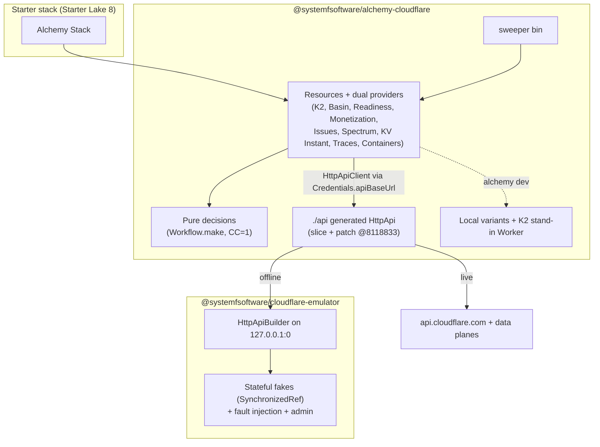
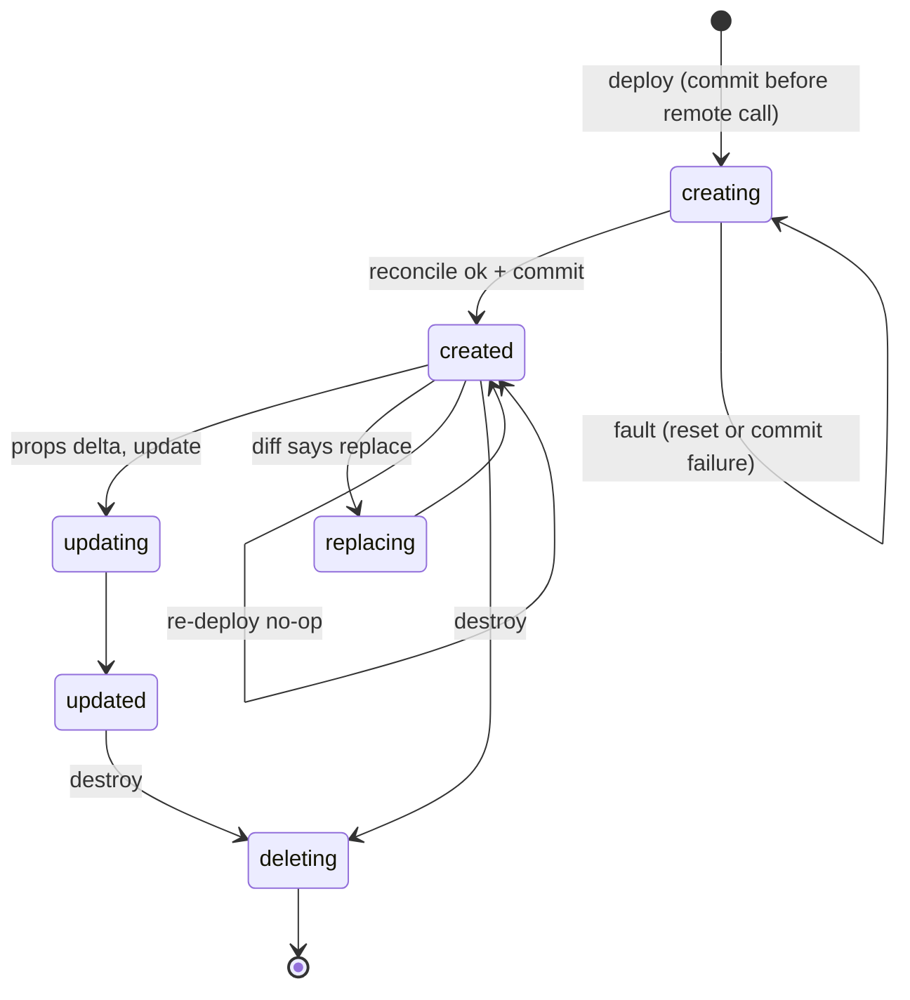
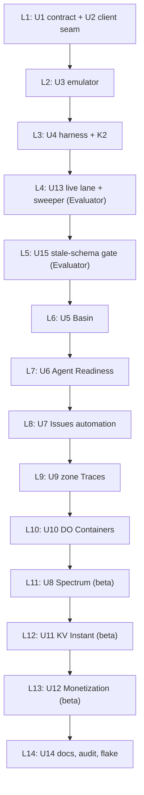

# Typed Cloudflare Resources for Alchemy 2 - Plan

## Goal Capsule

- **Objective:** Every Cloudflare product the starter deploys can be declared in code and applied without a dashboard step, and each declaration is shown to create, converge, survive drift and interruption, and tear down. That proof runs offline on every pull request and against the real account.
- **Means:** typed Alchemy 2 resources in two `@systemfsoftware/*` packages, a Cloudflare emulator generated from Cloudflare's published OpenAPI, and one lifecycle matrix run against both targets (KTD1, KTD2, KTD5).
- **Authority:** Ryan Lee owns scope. Kiro (conductor) approves this plan and rules review findings. `CONSTITUTION.md` and `repos/constitution/` are the law. The origin is `docs/brainstorms/inputs/requirements-final.md`. The Nix ruling `docs/brainstorms/inputs/ruling-nix-distribution-sandbox.md` is binding.
- **Execution profile:** one `gh stack` on trunk `main`, layers L1-L13 (see Sequencing), executed with `ce-work`. Subagent writers each own one file in isolated worktrees. Mutation testing runs only in CI.
- **Stop conditions:** the same error three times means stop, write down what failed, and change approach or escalate to Kiro with the evidence. A wall goes to Kiro with the exact error. Stop as well when evidence shows a settled decision below cannot work.
- **Who finishes:** the `sfs-alchemy` session ships the stack. An independent verifier session reviews it, Kiro rules the findings, and fix-now findings land on the layer they name.

---

## Product Contract

### Summary

Ship typed Alchemy 2 resources and bindings for the nine Cloudflare products the starter needs that Alchemy 2.0.0-beta.80 lacks or only partly covers. They live in `packages/cloudflare/alchemy-cloudflare`, and a loopback emulator lives in `packages/cloudflare/cloudflare-emulator`. One lifecycle matrix runs against the emulator in `pnpm test` and against the real account in a dedicated CI lane. That lane names resources `kiro-ci-<run>-*`, always tears them down, and has an hourly-age sweeper.

### Problem Frame

The starter deploys K2, Basin, Agent Readiness, Monetization Gateway, Issues, and Spectrum inbound TCP (see origin: Key Decisions, "Exactly where Alchemy beta.80 has no resource"). The gap audit found three more products the starter uses that Alchemy cannot express: KV Instant, zone-level Traces, and Durable Object-managed Containers. Without typed resources, each of these becomes a dashboard step. That breaks R64's "one command deploys every resource" and the starter's claim to beat rat-stack in checkable ways.

### Requirements

**Resources (each a typed Alchemy resource or binding, in Alchemy's own Effect resource style)**

- R110. Carried from origin: the sfs vertical ships a typed Alchemy resource or binding for each Cloudflare product the stack uses that Alchemy beta.80 lacks.
- R110a. K2: a stream resource and a `k2` Worker binding. The binding works deployed and under `alchemy dev` without credentials (origin R90, R63).
- R110b. Basin: a Basin Catalog resource on the `basin-catalog` API, Basin Pipelines sinks of type `basin_catalog`, and a typed Basin SQL query client (origin R57, R58).
- R110c. Agent Readiness: a scan resource that exposes the per-category readiness result R51's CI check reads (origin R51, R117).
- R110d. Monetization Gateway: account and zone eligibility, plus payment rules owned per resource (origin R103).
- R110e. Issues delivery: Workers Issues events reach a webhook from code, through an issues automation whose trigger routes through a notification policy (origin R60). Keeping Issues enabled on a Worker is Alchemy's `Cloudflare.Worker` `observability.issues` (alchemy-run/alchemy#1992, commit 1431ef2e), which the starter backports, so no resource here enables it.
- R110f. Spectrum: an application whose origin is a Worker (`traffic_type: "worker"`) (origin R96).
- R110g. KV Instant: a namespace created in `instant` mode, plus its Worker binding (origin R84).
- R110h. Traces domain configuration, so a zone's tracing needs no dashboard step (origin R60): baseline sampling, persistence, OTLP export destinations, incoming trace-context policy, forwarding to origin, and Trace Rules that override sampling per expression. The starter's defaults are incoming context `reject` (Cloudflare documents incoming context as unverified) and correlation by Ray ID.
- R110i. Containers: a Durable Object-managed container application (`scheduling_policy: "durable_object"`) with named images referenced by digest (origin R82, R83).
- R110j. Audit: the package README maps every Cloudflare product the starter uses either to an Alchemy beta.80 resource (file path) or to an R110a-R110i resource.

**Proof**

- R110k. Offline: an emulator generated from Cloudflare's published OpenAPI schema with `@effect/openapi-generator` (`httpapi` format) serves every endpoint the resources call, backed by stateful fakes. Every resource passes create, read, update, delete, idempotent re-apply, drift detection, and interrupted-apply resume with no network.
- R110l. Live: the same matrix runs against the real account. Resources are named per KTD10, teardown is guaranteed, and a sweeper deletes CI leftovers older than one hour. Credentials come only from the CI secret, and this host's token never enters the container.
- R110m. Beta-gated products are proven on the emulator now. Their live matrix runs, with no code change, as soon as the account holds the entitlement. Until then the lane reports the exact entitlement error (KTD11).

**Distribution**

- R110n. Both packages are `@systemfsoftware/*` public workspace packages delivered as Nix flake outputs. Nothing is published as a patch to Alchemy or as an upstream pull request.

### Key Decisions

- **Where Alchemy beta.80 has no resource, sfs adds a typed resource or binding, and nothing is a dashboard step.** Carried from origin. Governs R110, R110a-R110j.
- **Private-beta products stay in scope with no off flag and no fallback design, sequenced last in the lake.** (session-settled: user-directed — chosen over cutting or flag-gating beta products: Ryan's "nothing deferred" bar.) Governs R110d, R110f, R110g, R110m.
- **Resources ship as sfs workspace packages, never as patches to Alchemy or upstream PRs.** (session-settled: user-directed — chosen over patching Alchemy or upstreaming: the vertical owns its resources outright.) Governs R110n.
- **Distribution is Nix flakes, not npm. Consumers run dependency code inside the sandbox.** (session-settled: user-directed — chosen over the npm registry: "npm is nothing more than a bankrupt registry".) Governs R110n.
- **Monetization Gateway is a second adapter of the starter's payment port once access exists. x402 is native and settles on testnet by default.** Carried from origin. Governs R110d.

### Success Criteria

- Starter Lake 8 declares all nine products from R110a-R110i by importing these packages, with zero dashboard steps.
- On every pull request, `pnpm test` runs the lifecycle matrix green for all nine resources against the emulator, with no network access.
- The live lane is green for every entitled product. For the rest it shows the verbatim Cloudflare entitlement error.

### Scope Boundaries

Not gaps. Alchemy beta.80 already expresses each of these (evidence in `docs/plans` Sources):

- Worker Previews with per-preview D1, KV, R2, and Hyperdrive. `Worker.preview.of` deploys the preview's own bindings (`alchemy/src/Cloudflare/Workers/Worker.ts`, `WorkerPreviewOptions`), and per-stage resources supply them.
- Markdown for Agents (`content_converter`), Redirects for AI Training, and WebMCP (`webmcp_enabled`, `webmcp_packs`). All three are covered by Alchemy's `Zone.Setting`, whose `SettingId` is an open union.
- Auto Router, Clef, and the Web Search API are runtime calls on Alchemy's `ai` binding (`AIClient.run`, `AIClient.raw`). They are not control-plane resources.

Outside this lake:

- User Insights (analytics, not a resource). Account Abuse Protection (Enterprise-only, cut by origin R108). Registrar registration (the zone is already owned). Agent Memory (not adopted, origin).
- Starter-side composition of these resources: Starter Lake 8.

Considered and not built:

- A per-run Cloudflare API request budget counter. On 429 the client retries using Retry-After (U2). This would change if live runs exhaust the account limit.
- A `renamedFrom` migration case in the matrix. New resources carry no legacy type names.
- Per-zone concurrency groups. A single account-wide group is enough until it is observed as the bottleneck.

### Dependencies and Access State (as of 2026-10-05)

| Product                         | Access                                                         | Live lane today                                 | Source                                                                                     |
| ------------------------------- | -------------------------------------------------------------- | ----------------------------------------------- | ------------------------------------------------------------------------------------------ |
| K2 streams                      | Public beta, Workers Paid (`x-cfPlanAvailability.free: false`) | Runs                                            | api-schemas @8118833 `/accounts/{a}/k2/streams`; blog.cloudflare.com/cloudflare-k2-streams |
| Basin (Catalog, Pipelines, SQL) | GA                                                             | Runs                                            | developers.cloudflare.com/changelog/post/2026-10-01-basin-ga                               |
| URL Scanner `agentReadiness`    | GA, all plans                                                  | Runs                                            | api-schemas `/urlscanner/v2/scan`                                                          |
| Issues automations              | Open beta, all Workers accounts                                | Runs                                            | developers.cloudflare.com/workers/observability/issues                                     |
| Zone Traces                     | Open beta                                                      | Runs                                            | api-schemas `/zones/{z}/observability/tracing/*`                                           |
| DO-managed Containers           | Public beta                                                    | Runs                                            | blog.cloudflare.com/faster-agent-sandboxes                                                 |
| Spectrum Worker origin          | Private beta, plus Spectrum TCP entitlement on the zone        | Entitlement probe reports pending until granted | blog.cloudflare.com/grpc-workers; origin Dependencies ("Spectrum entitlement: Kiro")       |
| KV Instant                      | Private beta (invite)                                          | Entitlement probe reports pending until granted | blog.cloudflare.com/workers-kv-instant                                                     |
| Monetization Gateway            | Closed beta, U.S.-only, zone proxied over 30 days              | Entitlement probe reports pending until granted | blog.cloudflare.com/monetization-gateway-beta; api-schemas `/zones/{z}/monetization*`      |

Cross-lake dependencies:

- release-tooling's PR B (`lib.mkPnpmWorkspacePackages` and the sandbox launcher) and PR C (systemfsoftware adopts them). These are not on `systemfsoftware/pnpm-release-management` `main` as of this plan. Only U14's flake-output verification and U13's sandboxed live run wait on them.
- Kiro sets the `CLOUDFLARE_API_TOKEN` and `CLOUDFLARE_ACCOUNT_ID` CI secrets (origin Dependencies). As of this plan, no `CLOUDFLARE_*` secret exists in `.github/workflows/`.

### Resolved Questions (Kiro, 2026-10-05)

- Q1. The live lane mutates `systemfsoftware.com`, with owned-rule merging (KTD9) so production rules are never rewritten.
- Q2. CI payment rules carry a dedicated Base Sepolia testnet address generated for CI. Kiro holds its private key in an Actions secret; no password exists anywhere. The lifecycle matrix makes no payment, so it reads only the public address, from the Actions variable `CLOUDFLARE_CI_PAYTO_ADDRESS`, and never the key.
- Q3. The live Spectrum lifecycle uses entitled port 22 (`tcp/22`), so R110f's resource is proven now. The starter's production gRPC port and its entitlement belong to Starter Lake 8.
- Q4. The local-dev journey (K2 stand-in plus KV Instant under `alchemy dev`) lives in the starter (Starter Lake 8). This lake proves the resources, local variants included, against the emulator.
- The stale-schema gate is in scope as U15, with Kiro's GATE1 sign-off.

---

## Planning Contract

### Key Technical Decisions

- KTD1. **Two packages in a new `packages/cloudflare/` family.** `@systemfsoftware/alchemy-cloudflare` holds the resources, bindings, local variants, provider collection, generated API contract (subpath `./api`), and the sweeper bin, with one subpath per product. `@systemfsoftware/cloudflare-emulator` holds the loopback server and fakes. It is split out because it quarantines `@effect/platform-node`, which consumers of the resources must not install. Splitting further earns nothing under the wiki ruling "A Package Is Earned by a Binder or Contamination, Not Size". REPO-S5 holds: two packages share the Cloudflare control-plane concept, and the family name matches no segment in `RAW_VITEST_PACKAGES` (`packages/oxlint-plugin/oxlint-plugin-test-discipline/src/rules/path.config.ts`).
- KTD2. **One generated Effect `HttpApi` is both the resources' client and the emulator's server contract.** `@effect/openapi-generator` 4.0.1 `--format httpapi` generates it from a committed slice of `cloudflare/api-schemas` at commit `8118833144f66b6e6da3e82956144a1d524e1972`, plus a committed RFC 6902 patch file. Alchemy's own client, `@distilled.cloud/cloudflare` 1.0.0-rc.13, lacks the K2, `basin-catalog`, monetization, and issues-automations operations, Spectrum's `worker` origin, and KV's `mode` (grep of its `src/services/*`), so it cannot be the client. The probe (`/tmp/openapi-gen-probe`) generated 69 operations and 315 schemas. `HttpApiBuilder.group` over all six K2 endpoints typechecked, and a missing handler is a type error, so the emulator cannot silently omit an endpoint a resource calls. Conflict call-out on the directive "official generator": the raw slice fails. Three patch classes are needed and recorded in `openapi/patches.json`: remove unsupported `not` constraints (K2 create and update), rewrite one allOf-of-oneOf intersection (`cloudflare-pipelines_SourceField`), and drop example and default literals that fail strict typecheck. An added fourth class extends the alert-type enum with `workers_observability_alert`, which the API accepts but the schema omits (terraform-provider-cloudflare #7259). Each `not` constraint removed from the wire schema is re-expressed as a type in the resource's props.
- KTD3. **One credential seam redirects every client.** The generated client reads distilled's `Credentials` service on each request, the same seam distilled's `protocol.encode` uses (`lib/protocol.js`), and takes its base URL from `apiBaseUrl`. Providing a `Credentials` layer with the emulator's URL therefore routes Alchemy's own resources (NotificationPolicy, NotificationWebhook, R2 Bucket) and ours to the emulator together. Alchemy's `Credentials.fromAuthProvider` never sets `apiBaseUrl` (`src/Cloudflare/Credentials.ts:63-75`), so the test harness supplies its own layer. Data-plane hosts (`{stream}.k2.cloudflarestorage.com`, `api.sql.cloudflarestorage.com`) resolve through a `CloudflareDataPlane` endpoint service that the emulator overrides.
- KTD4. **Alchemy's resource style, with a pure core.** Each resource is `Resource<TypeId>(type)` plus a provider built from `ProviderLayer.dual` (live and local), with `stables`, `diff`, `read`, `reconcile`, `delete`, and `list`, as in `Pipelines/Stream.ts` and `Spectrum/Application.ts`. `read` observes by owned id first, then by identity, and brands a foreign match `Unowned`; the engine then raises `OwnedBySomeoneElse` unless the deploy adopts (`src/AdoptPolicy.ts`). `reconcile` observes, ensures, and syncs only the delta. Create conflicts re-look-up, and deletes swallow not-found. Replace-or-update decisions, delta computation, rule merges, and name derivation are `Workflow.make` decisions from `@systemfsoftware/effect-cell-types` at cyclomatic complexity 1 (CONST-P1, CONST-P2). Ids are branded: account, zone, stream, script tag, app, rule (CONST-D3). Props and attributes are exported Schemas, so `effect-schema-vite` runs their laws.
- KTD5. **The lifecycle matrix runs through Alchemy's engine, never by calling provider methods directly.** Each case deploys a scratch stack with Alchemy's `Test.make` and `test.provider` (`src/Test/Core.ts`, `src/Test/Alchemy.ts`), then asserts the persisted state row status and Drift's action. The target is chosen at layer construction: the emulator by default, or live when the CI secret is present. The suite lives in `tests/*.integration.test.ts`, one history set for both targets. (pack: boundary-testing, fake-and-real-store-laws.md)
- KTD6. **Two fault seams make interruption reproducible.** The emulator's commit-then-reset fault commits a create and then resets the connection. A state-store wrapper fails the `created` commit after a successful remote call. Both leave a `creating` row that the next deploy must converge from without a duplicate remote object (`src/Plan.ts` resume of `creating`). Only the state-store seam runs live.
- KTD7. **Drift is caused out of band, then repaired through `drift()`.** Offline, the emulator's admin surface mutates or deletes the object. Live, the generated client does it directly. `src/Drift.ts` must then report `drifted` and `repaired`, or `missing` and `recreated`.
- KTD8. **`alchemy dev` stays credential-free (origin R63).** Alchemy's local runtime rejects unknown binding types (`src/Cloudflare/Workers/RuntimeBindings.ts:270`, `default: return yield* unsupported()`). In local mode, the K2 binding therefore binds a `service` binding to a K2 stand-in Worker shipped in the package. The stand-in implements the same produce and consume contract and stores records in Durable Object SQLite. The KV Instant local variant yields a local id, so Alchemy's local KV gateway serves it. Control-plane-only resources get a local variant that only records state, so a stack that imports them runs under `alchemy dev`. Deployed, the K2 binding emits wire-format `{ type: "k2", name, stream }`. The probe showed distilled's binding encoder passes an unknown `type` through unchanged.
- KTD9. **Shared zone rulesets use owned-rule merging.** Payment rules (`PUT /zones/{z}/monetization/rules` replaces the whole set) and tracing rules carry an ownership tag. Reconcile reads the full set, replaces only rules carrying this resource's tag, and writes the merge. A pure merge decision owns this, with a property law: foreign rules stay byte-identical, in their original order, for every generated ruleset. Zone tracing settings follow Alchemy's `Zone.Setting` precedent and restore the initial value on delete (`src/Cloudflare/Zone/Setting.ts:367-369`).
- KTD10. **The live lane is its own Evaluator-surface layer.** `.github/workflows/cloudflare-live.yml` runs on same-repo pull requests that touch `packages/cloudflare/**`, on pushes to `main`, and every six hours. It triggers on `pull_request`, never `pull_request_target`, and the fork guard is a job condition that the head repository equals this repository, so fork PRs never start the job. The workflow declares `permissions: contents: read`, and only the live step's environment receives `CLOUDFLARE_API_TOKEN` and `CLOUDFLARE_ACCOUNT_ID`. Kiro mints the token with only the permission groups the sliced endpoints need, and U13's PR lists those groups. A single `concurrency: cloudflare-account` group applies, and the job times out at 45 minutes. State lives in Alchemy's durable Cloudflare state store, so a killed job's rows are destroyed by the next run. `.github/workflows/cloudflare-sweep.yml` runs every 30 minutes and deletes CI resources older than one hour through each provider's `list` and `delete`. The one-hour age is safely beyond the 45-minute job cap. Names are `kiro-ci-<run>-<suffix>`, except where the product forbids hyphens (K2 `^[a-zA-Z0-9_]+$`, Pipelines and Basin sinks), which use `kiro_ci_<run>_<suffix>`. The operator bar authorizes this lane, so it is not a self-built gate. It lands in its own layer and records failing-before and passing-after evidence (AGENTS.md Surface Classes, CONST-E9).
- KTD11. **Entitlement is derived from Cloudflare, not configured.** Each live product suite first runs a pure classifier over Cloudflare's response to the product's first call. The result is `Entitled` or `AccessPending { code, message }`. `AccessPending` produces a neutral check annotation that quotes the error and records no matrix pass. Once access lands, the same job runs the matrix with no code or config change. No flag exists to turn a product on or off (origin Key Decision on private betas).
- KTD12. **Fidelity has two owners.** Generation is deterministic: the contract is generated at build time from the committed slice and patch, so it cannot drift from them. Behavioral fidelity, meaning conflicts, eventual consistency, validation, and refusals, is graded in the live lane. There, the identical matrix runs, and `tests/emulator.differential.test.ts` replays raw API histories against both implementations (pack: boundary-testing, fake-and-real-store-laws.md). The differential has no offline counterpart, so it sits in its own `live` Vitest project that only the live workflow invokes; the package's default project, which `pnpm test` runs, excludes it. Re-pinning the schema commit is a script run in a reviewed PR.
- KTD13. **Verified pins.** `alchemy` 2.0.0-beta.80: the starter's pin. beta.81 is now `latest`, but its `src/Cloudflare/index.ts` adds no gap resource, so it is not adopted. `effect` 4.0.1: generator 4.0.1 peers `effect@^4.0.1`, and the lockfile resolves 4.0.0, so it moves within the existing `^4` catalog range. `@effect/openapi-generator` 4.0.1 and `@effect/platform-node` 4.0.1. `@distilled.cloud/cloudflare` 1.0.0-rc.13, used for the `Credentials` type only. `cloudflare/api-schemas` @8118833 (2026-10-05T21:28Z). `cloudflare/workers-sdk` @14f03399 is the reference for the DO-managed container deploy sequence. Each was checked with `npm view` or `git log` on 2026-10-05.
- KTD14. **The Agent Readiness scan is immutable, and the matrix encodes that honestly.** Create starts a URL Scanner v2 scan with `agentReadiness: true` and polls to completion. A prop change replaces the scan. Delete forgets it, because the API has no delete. Drift is a missing result, which leads to a recreate. To resume, the scanned URL carries a deterministic `sfs-scan=<hash(fqn, props)>` query marker. Reconcile then adopts the scan from an interrupted attempt through `/urlscanner/v2/search?q=` instead of starting a second one.
- KTD15. **The Issues chain composes Alchemy resources with one of ours.** Alchemy's `Alerting.NotificationWebhook` and `NotificationPolicy` (`alertType: "workers_observability_alert"`, an open string in Alchemy) are the destination. They cannot deliver Issues events alone: the trigger (`afterOccurrences` or `afterInactivitySeconds`, scoped to a `service`) exists only on the issues automation, which takes the policy as `policyId` (`POST /accounts/{a}/workers/observability/issues/automations`; Cloudflare's automations docs: an automation sends issues "to a configured destination when matching issues meet a trigger condition"). So `IssuesAutomation` is the only resource built, with `policyId` as an `Output` reference. Enabling Issues on the Worker is Alchemy's (R110e).

### High-Level Technical Design

Components and data flow:



Engine states the lifecycle matrix pins (from `src/State/ResourceState.ts`, `src/Drift.ts`):



Matrix cells. Each applicable cell is one engine-driven test per resource, on both targets, except `lagging-read` and `rate-limited`: Cloudflare cannot be made to lag or throttle on demand, so those two run on the emulator only, and the live `resume` cell uses KTD6's state-store seam. A resource marks a cell not applicable only when it cites an API reason, recorded in the next table:

| Case          | Action                                          | Must observe                                                                                        |
| ------------- | ----------------------------------------------- | --------------------------------------------------------------------------------------------------- |
| create        | deploy                                          | row `created`; exactly one remote object; attributes decode                                         |
| read          | `read` after deploy                             | attributes equal the remote object                                                                  |
| update        | deploy with a mutable prop changed              | row `updated`; remote object changed in place (same id)                                             |
| replace       | deploy with an immutable prop changed           | row `created` with a new id; old remote object gone                                                 |
| re-apply      | deploy unchanged twice                          | no remote write on the second deploy (emulator write count unchanged; live `modified_on` unchanged) |
| drift         | out-of-band mutate, then `drift()`              | `drifted` then `repaired`; remote equals the last deploy                                            |
| drift-missing | out-of-band delete, then `drift()`              | `missing` then `recreated` with the same deterministic name                                         |
| resume        | fault per KTD6, then deploy                     | row converges to `created`; exactly one remote object                                               |
| lagging-read  | create visible only after a window, then resume | converges without a duplicate create                                                                |
| rate-limited  | two 429s with `Retry-After`, then success       | deploy converges; three or more consecutive 429s fail with the rate-limited variant                 |
| delete        | destroy                                         | no row; remote object gone; a second destroy is a no-op                                             |
| refusal       | deploy a foreign object without adopt           | `OwnedBySomeoneElse`; foreign object untouched                                                      |
| entitlement   | deploy against an unentitled account or zone    | `AccessPending` with the verbatim Cloudflare message; no `created` row                              |

Per-resource lifecycle deltas (KTD14 governs the scan; KTD9 governs the rulesets):

| Resource                         | Identity                             | Update in place                                       | Replace on                       | Cells not applicable (API reason)                                                                                                       |
| -------------------------------- | ------------------------------------ | ----------------------------------------------------- | -------------------------------- | --------------------------------------------------------------------------------------------------------------------------------------- |
| K2 Stream                        | name, then id                        | `http`, `retention_seconds`, `worker_binding` (PATCH) | name                             | none                                                                                                                                    |
| Basin Catalog                    | bucket name                          | maintenance configs                                   | bucket                           | entitlement (GA)                                                                                                                        |
| Basin Sink                       | name (`_`)                           | none                                                  | any prop                         | update (no PATCH endpoint); entitlement (GA)                                                                                            |
| Agent Readiness Scan             | marker in scanned URL                | none                                                  | url, options                     | update (scans are immutable); delete observes "row gone" only (no delete endpoint); drift (results cannot be mutated); entitlement (GA) |
| Monetization Account Eligibility | account                              | none                                                  | none                             | update, replace, drift (a terms acceptance has no inverse or mutable field); delete observes "row gone" only                            |
| Monetization Zone Eligibility    | zone                                 | none                                                  | zone                             | update, drift (check endpoint only); delete observes "row gone" only                                                                    |
| Monetization Payment Rule        | ownership tag in ruleset             | rule fields (merge PUT)                               | zone                             | none                                                                                                                                    |
| Issues Automation                | name, then id                        | all fields (PUT)                                      | none                             | replace (every field is mutable); entitlement (open beta)                                                                               |
| Spectrum Worker App              | `dns.name` + `protocol`, then app id | all fields (PUT)                                      | zone                             | none                                                                                                                                    |
| KV Instant Namespace             | title, then id                       | title                                                 | mode, jurisdiction (create-only) | none                                                                                                                                    |
| Zone Tracing Settings            | zone                                 | settings (PATCH)                                      | zone                             | refusal (zone singleton); delete restores the initial value instead of removing                                                         |
| Zone Tracing Rule                | ownership tag in rules               | rule fields (merge PUT)                               | zone                             | none                                                                                                                                    |
| DO Container App                 | name, then app id                    | ssh, authorized keys, images                          | DO namespace                     | none                                                                                                                                    |

### Assumptions

- The live lane mutates `systemfsoftware.com` and uses owned-rule merging, so production rules survive (Q1).
- Kiro confirms the account is on Workers Paid and sets the CI secrets before the live-lane layer lands (origin Dependencies).
- The CI lane runs on GitHub-hosted `ubuntu-latest`, as every workflow in `.github/workflows/` does today.
- release-tooling's sandbox launcher lands before U13 needs it. If it has not, U13 waits and is escalated to Kiro rather than run unsandboxed (ruling: "There is no unsandboxed mode").
- K2's Worker binding wire shape `{ type: "k2", name, stream }` (schema `workers_binding_kind_k2`) is accepted by the real upload API. U13's live probe Worker confirms it.
- The DO-managed container deploy sequence follows wrangler's `packages/containers-shared/src/deploy.ts` at workers-sdk @14f03399. U10 opens with that trace.

### Sequencing



Every layer passes `pnpm check:local` on its own and leaves `main` releasable. New subpaths are inert until a consumer imports them. Beta products come last (origin Key Decision on private betas).

---

## Output Structure

```text
packages/cloudflare/
  alchemy-cloudflare/
    openapi/                 slice.json (pinned subset), patches.json, PIN (commit + sha256)
    scripts/                 generate-api.ts, repin-api.ts
    src/
      api/                   generated HttpApi module + client layer
      client/                credentials seam, error envelope, entitlement, data-plane endpoints
      naming.workflow.ts     physical and CI name derivation
      k2/  basin/  agent-readiness/  monetization/  issues/
      spectrum/  kv-instant/  tracing/  containers/
      local/                 K2 stand-in Worker, local variants
      providers.ts           ProviderCollection layer for stacks
      sweep/                 sweeper bin
    test-types/              *.tst.ts (illegal props fail to compile)
    tests/                   *.integration.test.ts (matrix), __fixtures__/ (targets, faults)
  cloudflare-emulator/
    src/
      server.ts              HttpApiBuilder layer on 127.0.0.1:0
      state/                 per-product fake state + transitions (Workflow.make)
      handlers/              per generated group
      faults.ts  admin.ts
    tests/                   emulator.differential.test.ts (live lane)
.github/workflows/cloudflare-live.yml
.github/workflows/cloudflare-sweep.yml
```

---

## Implementation Units

| U-ID | Title                                      | Key files                                                       | Depends on |
| ---- | ------------------------------------------ | --------------------------------------------------------------- | ---------- |
| U1   | Generated Cloudflare API contract          | `packages/cloudflare/alchemy-cloudflare/openapi/*`, `src/api/*` | none       |
| U2   | Client seam and error model                | `src/client/*`                                                  | U1         |
| U3   | Cloudflare emulator                        | `packages/cloudflare/cloudflare-emulator/src/*`                 | U1         |
| U4   | Matrix harness, K2 stream and binding      | `tests/__fixtures__/*`, `src/k2/*`, `src/local/*`               | U2, U3     |
| U5   | Basin catalog, sink, SQL client            | `src/basin/*`                                                   | U4         |
| U6   | Agent Readiness scan                       | `src/agent-readiness/*`                                         | U4         |
| U7   | Issues automation                          | `src/issues/*`                                                  | U4         |
| U8   | Spectrum Worker application                | `src/spectrum/*`                                                | U4         |
| U9   | Zone tracing settings and rules            | `src/tracing/*`                                                 | U4         |
| U10  | DO-managed container application           | `src/containers/*`                                              | U4         |
| U11  | KV Instant namespace and binding           | `src/kv-instant/*`                                              | U4         |
| U12  | Monetization eligibility and payment rules | `src/monetization/*`                                            | U4, U9     |
| U13  | Live lane and sweeper                      | `.github/workflows/cloudflare-*.yml`, `src/sweep/*`             | U4         |
| U14  | Audit, docs, changesets, flake outputs     | `README.md`, `.changeset/*`                                     | all        |
| U15  | Stale-schema gate                          | `.github/workflows/cloudflare-schema-repin.yml`                 | U1, U3, U4 |

Paths below are relative to `packages/cloudflare/alchemy-cloudflare/` unless they start with `packages/` or `.github/`.

### U1. Generated Cloudflare API contract

**Goal:** a deterministic Effect `HttpApi` for every Cloudflare endpoint the resources call, generated at build time from the committed slice and patch (KTD2, KTD12).

**Requirements:** R110k, R110n; KTD2, KTD12, KTD13.

**Dependencies:** none.

**Files:**

- `packages/cloudflare/alchemy-cloudflare/package.json`, `tsdown.config.ts`, `oxlint.config.ts`, `stryker.config.ts`, `vitest.config.ts`, `tsconfig.*.json`, `api-extractor.json`, `.attw.json`
- `openapi/slice.json`, `openapi/patches.json`, `openapi/PIN`
- `scripts/generate-api.ts`, `scripts/repin-api.ts`
- `src/api/cloudflare-api.ts` (generated by the package's `generate` step and gitignored), `src/api/index.ts`
- `pnpm-workspace.yaml`, `pnpm-lock.yaml` (effect 4.0.1; add `@effect/openapi-generator` 4.0.1)

**Approach:**

1. Package anatomy follows the repo's current package shape (`packages/effect-readiness` files). Exports are declared in `tsdown.config.ts`, never hand-edited (REPO-S4).
2. `repin-api.ts` fetches `openapi.json` at a given api-schemas commit, verifies its sha256, and writes the slice. The slice holds the listed paths plus their transitive `#/components` closure, with `example` and `examples` stripped. It also writes `PIN`.
3. `generate-api.ts` runs `openapigen --format httpapi --patch openapi/patches.json` over the committed slice, offline. The package's `build`, `typecheck`, and `test` scripts run it first, and turbo task inputs include `openapi/**`, so the generated file never goes stale.
4. `patches.json` carries the four patch classes from KTD2. Each op names the schema and the reason.
5. The slice covers K2 streams, `basin-catalog`, pipelines v1 sinks, urlscanner v2 scan, result, and search, monetization (account, zone, rules, rule), issues automations, alerting webhooks and policies, spectrum apps, KV namespaces, zone tracing settings and rules, workers observability destinations and the telemetry query (Traces export and Ray ID lookup), containers applications and image preparations, and R2 buckets (Basin Catalog's prerequisite).

**Patterns to follow:** probe evidence (69 operations, exit 0) in the Sources section.

**Test expectation:** none. The generated module is a build artifact, and an operation a resource calls but the slice lacks is a compile error at the call site. Its use is proven by U3's handlers and U4's matrix. The PR records a sabotage check: removing the K2 `not` patch op fails generation with `Cannot import JSON Schema keyword "not"`.

**Verification:** the generated module typechecks under the repo's TypeScript 7.0.2, and `pnpm --filter @systemfsoftware/alchemy-cloudflare test` passes.

### U2. Client seam and error model

**Goal:** resources call Cloudflare through one client whose base URL, credentials, retry, and error variants are uniform (KTD3, KTD11).

**Requirements:** R110k, R110l, R110m; KTD3, KTD11.

**Dependencies:** U1.

**Files:**

- `src/client/cloudflare-client.ts`
- `src/client/errors.ts`
- `src/client/entitlement.workflow.ts`
- `src/client/data-plane.ts`
- No dedicated test file. Every behavior below is a matrix cell in `tests/k2.integration.test.ts` (U4).

**Approach:**

1. The `HttpApiClient` is built over the generated API. Base URL and auth headers come from distilled's `Credentials` per request.
2. The `{ success, errors[], result, result_info }` envelope decodes into success or a tagged error per Cloudflare error code the resources branch on: not found, already exists, entitlement, validation, rate limited (CONST-D2).
3. On 429, retry honoring Retry-After with a bounded schedule. Other errors are not retried.
4. The pure entitlement classifier maps an error to `Entitled` or `AccessPending`.
5. `CloudflareDataPlane` resolves K2 and Basin SQL hosts per account, overridable by layer.

**Test scenarios** (all run as U4 matrix cells against the emulator):

- Offline runs make no network call: with `Credentials.apiBaseUrl` set to the emulator, the K2 create cell succeeds inside the network-less sandbox.
- refusal: a create conflict decodes to the already-exists variant. A Cloudflare error code the resources do not branch on decodes to the generic Cloudflare error variant carrying code and message.
- rate-limited: two 429s with `Retry-After: 1`, then success, converges. Three or more consecutive 429s fail with the rate-limited variant.
- entitlement (U11, U12, U8 seeds): an unentitled response classifies as `AccessPending` with the verbatim message. A not-found response never classifies as `AccessPending`.

**Verification:** the cells above are green in U4's suite (pack: boundary-testing, real-system-oracles.md).

### U3. Cloudflare emulator

**Goal:** a loopback server for the generated `HttpApi`, with stateful fakes that obey the same laws as Cloudflare for every sliced endpoint (R110k).

**Requirements:** R110k; KTD2, KTD6, KTD7, KTD12.

**Dependencies:** U1.

**Files:**

- `packages/cloudflare/cloudflare-emulator/package.json` and package anatomy files
- `src/server.ts`, `src/handlers/<group>.ts` (one per generated group)
- `src/state/<product>.workflow.ts` (pure transitions)
- `src/faults.ts`, `src/admin.ts`
- `tests/emulator.differential.test.ts` (runs in the live lane: the same raw API histories against the emulator and Cloudflare)

**Approach:**

1. `HttpApiBuilder.layer` over the generated API, served by `@effect/platform-node` on `127.0.0.1:0`. Each test gets a fresh instance, so no reset endpoint exists.
2. State is a `SynchronizedRef` of immutable per-product state. Handlers are shell code that call pure transitions returning a new state plus a response or a Cloudflare error. No mutable variables appear inside `Effect.gen`.
3. Fakes reproduce the documented semantics. K2 and pipelines names are unique (create conflict, code 1003 for pipelines). KV `mode` is create-only. A Spectrum `worker` origin excludes `origin_direct`, `origin_dns`, `origin_port`, `proxy_protocol`, and `argo`, and limits `tls` to `off` or `flexible`. The monetization PUT replaces the whole set with at most 40 distinct addresses. Basin catalog enable requires an existing R2 bucket. Scans are immutable.
4. Faults are per-operation and armed through the admin surface: commit-then-reset, injected status (429 or 5xx), and a read-after-write visibility window. The admin surface also mutates, deletes, or seeds objects (Worker scripts, entitlements) and counts writes.
5. Entitlement per product is seeded. An unentitled call returns Cloudflare's entitlement error shape.

**Test scenarios:**

- Offline, the emulator is exercised through every resource's matrix (U4-U12). No example tests restate a fake's internals.
- Differential, run in the live lane: the same raw API histories go to the emulator and to Cloudflare through the generated client, and outcome class (success or error variant), identity fields, and post-state must agree. The histories:
  - a duplicate K2 stream name
  - a K2 `retention_seconds` PATCH that keeps the stream id
  - a Spectrum `worker` app that also sets `origin_direct`
  - a monetization PUT with 41 distinct addresses
  - a KV `mode: "instant"` create on an unentitled account
  - a read inside the create-visibility window
- In the U4 harness, closing a test's emulator scope releases its port, and a follow-up connection is refused (pack: boundary-testing, real-system-oracles.md).

**Verification:** every generated group has a handler layer, and a missing handler fails typecheck. The differential is green in the live lane for every entitled product.

### U4. Matrix harness, K2 stream and binding

**Goal:** the reusable engine-driven lifecycle matrix (KTD5) and the first resource through it: a K2 stream and its binding (R110a).

**Requirements:** R110a, R110k, R110l; KTD4, KTD5, KTD6, KTD7, KTD8.

**Dependencies:** U2, U3.

**Files:**

- `tests/__fixtures__/target.ts` (emulator or live layer: Credentials, CloudflareEnvironment, state store)
- `tests/__fixtures__/matrix.ts` (case definitions from the HTD table, parameterized per resource)
- `tests/__fixtures__/faults.ts` (state-store commit-failure wrapper)
- `src/naming.workflow.ts`
- `src/k2/stream.ts`, `src/k2/stream.workflow.ts`, `src/k2/binding.ts`, `src/k2/index.ts`
- `src/local/k2-stand-in.ts` (Worker plus Durable Object), `src/local/k2-local.ts`
- `src/providers.ts`
- `tests/k2.integration.test.ts`
- `test-types/k2-props.tst.ts`
- `src/naming.workflow.property.test.ts`

**Approach:**

1. The target fixture builds the emulator or live layers. The live target reads only `CLOUDFLARE_API_TOKEN` and `CLOUDFLARE_ACCOUNT_ID` from the environment.
2. Matrix cases are data. Each resource suite supplies props for create, update, and replace, an out-of-band mutation, and its identity, then runs every HTD cell through `test.provider`.
3. Naming applies KTD10's charset table: `kiro-ci-<run>-<suffix>` or `kiro_ci_<run>_<suffix>`.
4. The K2 binding follows the `Pipelines/WriteStreamBinding.ts` pattern. Live mode emits `{ type: "k2", name, stream: streamId }`. Local mode binds the stand-in service (KTD8). The Effect client exposes `send(records)` in both modes.
5. `providers.ts` exports one `ProviderCollection` layer that a stack merges beside `Cloudflare.providers()`.

**Execution note:** Write `tests/k2.integration.test.ts` first and watch each matrix cell fail before writing the provider.

**Patterns to follow:** `src/Cloudflare/Pipelines/Stream.ts` and `src/Cloudflare/Pipelines/WriteStreamBinding.ts` in alchemy 2.0.0-beta.80.

**Test scenarios:**

- Every HTD matrix cell for K2 Stream against the emulator.
- Update `retention_seconds` from 604800 to 3600: row `updated`, same stream id.
- Rename the stream: row `created` with a new id, and the old stream is deleted.
- `test-types/k2-props.tst.ts`: props with both `http.enabled` and `worker_binding.enabled` false fail to typecheck. This is the `not` constraint from KTD2, re-expressed as a type.
- Resume via commit-then-reset on create: one stream, row `created`.
- Resume via state-commit failure: one stream, row `created`.
- Property in `src/naming.workflow.property.test.ts`: for every generated run id and suffix, the K2, Pipelines, and Basin sink names match `^[a-zA-Z0-9_]+$` and start with `kiro_ci_<run>_`. Every other product's name starts with `kiro-ci-<run>-`.
- The `alchemy dev` journey through the stand-in belongs to the starter (Q4). Here, the stand-in's produce and consume contract is proven by its own code path against the emulator-backed matrix.

**Verification:** the K2 matrix is green on the emulator. A sabotage check passes: deleting the `AlreadyExists` re-lookup in `reconcile` turns the resume cell red.

### U5. Basin catalog, sink, SQL client

**Goal:** Basin-named resources for catalog enablement and maintenance, sinks of type `basin_catalog`, and a typed Basin SQL query client (R110b).

**Requirements:** R110b, R110k, R110l; KTD3, KTD4.

**Dependencies:** U4.

**Files:**

- `src/basin/catalog.ts`, `src/basin/sink.ts`, `src/basin/sql.ts`, `src/basin/*.workflow.ts`, `src/basin/index.ts`
- `tests/basin.integration.test.ts`

**Approach:**

1. The catalog targets `/basin-catalog/{bucket}`: enable, disable, and maintenance configs, with Alchemy's `R2.Bucket` as its input.
2. The sink is a new resource (create and delete only, per the API). The stream and pipeline reuse Alchemy's `Pipelines.Stream` and `Pipelines.Pipeline`, whose v1 paths are unchanged.
3. The SQL client posts `{ query }` to `api.sql.cloudflarestorage.com/api/v1/accounts/{a}/basin-sql/query/{bucket}` through `CloudflareDataPlane`, and decodes rows against a caller-supplied Schema.

**Test scenarios:**

- Every matrix cell for Catalog and Sink.
- Enabling the catalog on a bucket that does not exist fails with the not-found variant and leaves no state row.
- A maintenance config change (compaction target 128 MB to 256 MB) updates in place.
- Any sink prop change replaces the sink.
- A SQL query against the emulator's seeded table returns rows decoded by the Schema. A row that fails the Schema yields a decode error, not a partial result.

**Verification:** Basin matrix green. Live lane green.

### U6. Agent Readiness scan

**Goal:** a scan resource whose attributes carry the per-category readiness result (R110c).

**Requirements:** R110c, R110k, R110l; KTD14.

**Dependencies:** U4.

**Files:**

- `src/agent-readiness/scan.ts`, `src/agent-readiness/scan.workflow.ts`, `src/agent-readiness/index.ts`
- `tests/agent-readiness.integration.test.ts`

**Approach:** follows KTD14. Completion polling is bounded by an Effect schedule. The attributes expose each category's result and the overall score as decoded Schemas from the generated `agentReadiness` result type.

**Test scenarios:**

- Every matrix cell with KTD14's deltas: update means replace, and delete issues no remote call.
- An interrupted create resumes by finding the scan through its `sfs-scan` marker. The emulator holds one scan.
- A scan result whose processor reports failure surfaces as a failed-scan error, not a zero score.

**Verification:** matrix green. Live lane scans a CI probe Worker URL.

### U7. Issues automation

**Goal:** Workers Issues events reach a webhook from code, so the starter's Issues-to-GitHub delivery needs no dashboard step (R110e).

**Requirements:** R110e, R110k, R110l; KTD15.

**Dependencies:** U4.

**Files:**

- `src/issues/automation.ts`, `src/issues/*.workflow.ts`, `src/issues/index.ts`
- `tests/issues.integration.test.ts`

**Approach:** follows KTD15. The automation's props mirror the API (`name`, `policyId`, `service`, `enabled`, `afterOccurrences`, `afterInactivitySeconds`), with the schema bounds as branded types.

**Test scenarios:**

- The delivery chain the starter uses (Alchemy's NotificationWebhook and NotificationPolicy plus `IssuesAutomation`) passes create, update, delete, re-apply, and drift against the emulator through KTD3's seam, plus every other applicable matrix cell for `IssuesAutomation`.
- `afterInactivitySeconds: 1800` (below 3600) is refused by the branded schema in an in-source `import.meta.vitest` refusal block beside it. Generated schema laws cover only what the type accepts (CONST-T10).
- Destroying the policy-backed stack in dependency order leaves no automation pointing at a deleted policy.

**Verification:** matrix green. In the live lane, a probe Worker that throws on a request produces an issue, and the CI webhook receiver records the delivery. The test stack sets the NotificationWebhook `secret` to a per-run value, and the receiver rejects any delivery whose `cf-webhook-auth` header does not match it.

### U8. Spectrum Worker application

**Goal:** inbound TCP to a Worker through a Spectrum application declared in code (R110f).

**Requirements:** R110f, R110k, R110l, R110m; KTD4, KTD11.

**Dependencies:** U4.

**Files:**

- `src/spectrum/worker-application.ts`, `src/spectrum/*.workflow.ts`, `src/spectrum/index.ts`
- `tests/spectrum.integration.test.ts`

**Approach:**

1. Props take the Worker resource and derive `origin_worker_id` from its `workerId` attribute.
2. `protocol` is a TCP port or range, and `tls` is `off` or `flexible`. The fields the API excludes are absent from the type.
3. Identity is `dns.name` plus `protocol`, as in Alchemy's `Spectrum/Application.ts`.

**Test scenarios:**

- Every matrix cell against the emulator.
- Changing the edge port updates the app in place with the same app id.
- In the live lane, the entitlement probe reports `AccessPending` with Cloudflare's message until access is granted. Once granted, a TCP client connected to the edge port gets the probe Worker's `connect` echo.

**Verification:** matrix green on the emulator. Access state is recorded in the PR body.

### U9. Zone tracing settings and rules

**Goal:** zone-level Traces declared in code (R110h).

**Requirements:** R110h, R110k, R110l; KTD9.

**Dependencies:** U4.

**Files:**

- `src/tracing/zone-settings.ts`, `src/tracing/zone-rule.ts`, `src/tracing/rules-merge.workflow.ts`, `src/tracing/index.ts`
- `tests/tracing.integration.test.ts`, `test-types/tracing-props.tst.ts`
- `src/tracing/rules-merge.workflow.property.test.ts`

**Approach:**

1. `ZoneTracingSettings` owns every field of `PATCH /zones/{z}/observability/tracing/settings`: `enabled`, `sampling_ratio` (a branded ratio from 0 to 1), `persist`, `destinations`, `propagation_policy`, and `forward_context`. `propagation_policy` defaults to `reject`. The type admits `reject` and `accept` only: Cloudflare's schema states `authenticated` "is not supported yet", so the type rejects what the API cannot honor, and a schema re-pin adds it once Cloudflare ships it. Delete restores the values read at create (KTD9).
2. `destinations` takes `Output` references to Alchemy's `Workers.ObservabilityDestination` (account-level OTLP export with the `opentelemetry-traces` dataset), so the export target and the zone that sends to it are one declared graph. The emulator serves `/workers/observability/destinations` because KTD3's seam routes Alchemy's resource there too.
3. `ZoneTracingRule` is one Trace Rule: `expression` (Rules language, 1 to 4096 characters), `sampling_ratio`, `enabled`, and `description`, under action `set_trace_settings`. Rules merge per KTD9, and the owned rules keep their declared order relative to each other, because Cloudflare applies the first match.
4. Ray ID correlation needs no field. The API has none (schema @8118833), and Cloudflare's Traces docs state that a request's trace is found by filtering on its Ray ID. The resource's contribution is that `reject` keeps the trace rooted at Cloudflare, so the Ray ID names the whole trace rather than a caller's.
5. The merge decision is generic over a rule shape and an ownership tag, so U12 reuses it.

**Test scenarios:**

- Every matrix cell for both resources.
- Deleting the settings resource restores the values seen at create.
- A settings resource declared without `propagation_policy` sends `reject`. `authenticated` fails to typecheck in `test-types/tracing-props.tst.ts`.
- A settings resource whose `destinations` references an `ObservabilityDestination` deploys after it and destroys before it.
- Two owned rules declared in order A, B are written in that order, after the foreign rules they found, and a reorder in code is an update, not a replace.
- Integration: a ruleset holding two foreign rules and one owned rule. Updating the owned rule through the resource leaves the foreign rules unchanged and in their original order.
- Property: for every generated ruleset and owned set, the merge preserves every foreign rule byte-identically and contains exactly the desired owned rules. No public-surface example can reach this universal (CONST-T14).

**Verification:** matrix green on the emulator for settings, rules, and the destination they reference. In the live lane, with an owned rule sampling a probe path at 1.0, a request to it yields a `cf-ray` header, and the Workers Observability telemetry query (`/workers/observability/telemetry/query`) filtered on that Ray ID returns its trace. If that query cannot reach zone traces, the lane reports the exact response as a wall rather than passing. The property passes.

### U10. DO-managed container application

**Goal:** native Durable Object-managed containers with named images by digest, declared in code (R110i).

**Requirements:** R110i, R110k, R110l; KTD4, KTD13.

**Dependencies:** U4.

**Files:**

- `src/containers/do-application.ts`, `src/containers/*.workflow.ts`, `src/containers/index.ts`
- `tests/containers.integration.test.ts`

**Approach:**

1. First trace wrangler's DO-managed deploy at workers-sdk @14f03399 (`packages/containers-shared/src/deploy.ts`, `build-output.ts`): which calls create the application, which register named images, and what the Worker upload must carry.
2. Record the traced sequence in the unit's PR.
3. Props: the Durable Object namespace (Alchemy `DurableObject` output), `images` as name to registry reference by digest (origin R83: CI builds once), `ssh`, and `authorizedKeys`.
4. Image building stays out of scope here (digests in, origin R83).

**Execution note:** Start with the wrangler trace. If the sequence needs Worker-upload metadata that Alchemy's `Worker` resource cannot carry, stop and escalate to Kiro with the exact field. Patching Alchemy is out (R110n).

**Test scenarios:**

- Every matrix cell against the emulator.
- Adding an image name updates the application in place.
- Changing the DO namespace replaces the application.
- An image reference without a digest is refused by the branded schema's in-source refusal block.

**Verification:** matrix green. In the live lane, `ctx.container.start({ image: images.app })` in a probe DO returns a running container.

### U11. KV Instant namespace and binding

**Goal:** KV Instant namespaces declared and bound from code (R110g).

**Requirements:** R110g, R110k, R110l, R110m; KTD8, KTD11.

**Dependencies:** U4.

**Files:**

- `src/kv-instant/namespace.ts`, `src/kv-instant/binding.ts`, `src/kv-instant/index.ts`
- `tests/kv-instant.integration.test.ts`

**Approach:** create with `mode: "instant"`. Mode and jurisdiction are create-only, so a change replaces the namespace. The binding emits `kv_namespace` with the namespace id. The local variant yields a local id that Alchemy's local KV gateway serves (KTD8).

**Test scenarios:**

- Every matrix cell against an entitled emulator seed.
- Against an unentitled seed, deploy fails with `AccessPending` and leaves no `created` row.
- The `alchemy dev` journey belongs to the starter (Q4).

**Verification:** matrix green on the emulator. The live lane reports the access state.

### U12. Monetization eligibility and payment rules

**Goal:** Monetization Gateway eligibility and payment rules declared in code, as the second payment-port adapter the starter swaps in (R110d).

**Requirements:** R110d, R110k, R110l, R110m; KTD9, KTD11.

**Dependencies:** U4, U9 (rule merge decision).

**Files:**

- `src/monetization/account-eligibility.ts`, `src/monetization/zone-eligibility.ts`, `src/monetization/payment-rule.ts`, `src/monetization/eip55.ts`, `src/monetization/index.ts`
- `tests/monetization.integration.test.ts`

**Approach:**

1. Account eligibility posts `acceptedTermsOfService: true`. It is a typed literal, so declaring the resource means accepting the terms.
2. Zone eligibility runs the check that enables the zone entitlement.
3. Payment rules are a discriminated union on `scheme` (`exact`, `upto`, `origin_controlled`) with branded EIP-55 addresses and decimal-string prices. They merge through U9's decision (KTD9).

**Test scenarios:**

- Every applicable matrix cell for each of the three resources against an entitled emulator zone, with the not-applicable cells from the HTD table.
- U12 registers the payment-rule provider with U13's sweeper. Against the emulator, the sweeper deletes a stale owned payment rule and leaves a foreign rule intact.
- Two payment-rule resources on one zone each update only their own rule.
- An address that fails EIP-55 checksum is refused by `eip55.ts`'s in-source refusal block. A payment-rule deploy carrying it fails before any API call.
- An unentitled zone yields `AccessPending` with the verbatim message.

**Verification:** matrix green on the emulator. The live lane reports the access state (Q1, Q2).

### U13. Live lane and sweeper

**Goal:** the identical matrix runs against the real account with guaranteed teardown, and leftovers older than one hour are swept (R110l, R110m).

**Requirements:** R110l, R110m; KTD10, KTD11.

**Dependencies:** U4.

**Files:**

- `.github/workflows/cloudflare-live.yml`
- `.github/workflows/cloudflare-sweep.yml`
- `src/sweep/sweep.ts`, `src/sweep/sweep.workflow.ts`, `src/sweep/sweep.workflow.property.test.ts`, `src/sweep/bin.ts`
- `tests/sweep.integration.test.ts`
- `tests/__fixtures__/probe-worker.ts` (throws on demand, exposes `connect`, binds K2)

**Approach:**

1. The live workflow applies KTD10's triggers, fork guard, concurrency, timeout, and durable state store. It runs the package's integration suite with the live target.
2. It runs through the sandbox launcher with declared egress: `api.cloudflare.com`, `*.k2.cloudflarestorage.com`, `api.sql.cloudflarestorage.com`, `*.workers.dev`, and the zone.
3. Its last step always destroys the run's stack.
4. The sweeper decision is pure: given listed objects and now, it selects those whose name carries the CI prefix and whose creation time is more than one hour old. Ruleset entries carry the run's start epoch in their tag.
5. The sweeper deletes through the providers' `delete`.

**Execution note:** this is an Evaluator surface. Land it in its own layer. Record the workflow failing on a deliberately broken K2 provider, then passing after the fix.

**Test scenarios:**

- Property in `src/sweep/sweep.workflow.property.test.ts`: for every generated set of listed objects and every `now`, the sweeper selects exactly the objects whose name carries the CI prefix and whose age exceeds one hour. It never selects a name without the prefix, whatever its age.
- Against the emulator, the sweeper deletes a seeded stale K2 stream. Each later product unit registers its provider's `list` and `delete` with the sweeper and adds its own stale-object case, so L4 depends on no product that lands after it.

**Verification:** a manual `workflow_dispatch` run is green for K2. A cancelled run's resources are gone after the next run or the next sweep.

### U14. Audit, docs, changesets, flake outputs

**Goal:** consumers can find, trust, and fetch the packages (R110j, R110n).

**Requirements:** R110j, R110n.

**Dependencies:** U1-U13.

**Files:**

- `packages/cloudflare/alchemy-cloudflare/README.md`, `packages/cloudflare/cloudflare-emulator/README.md`
- `.changeset/*.md` (new packages; REPO-R2)

**Approach:**

1. The README carries the R110j audit table (product, Alchemy beta.80 file or sfs subpath, access state) and a stack-composition example.
2. Changeset bodies state consumer-observable facts only.
3. Verify each package as a flake output once release-tooling's PR C lands.

**Test expectation:** none. This unit is documentation and packaging. Flake output is verified by `nix build`.

**Verification:** `nix build .#<attr>` yields each package's tarball, using attribute names from `lib.mkPnpmWorkspacePackages`.

### U15. Stale-schema gate

**Goal:** Cloudflare schema changes reach this repo as a reviewed PR, not by surprise (R110k; KTD12).

**Requirements:** R110k; KTD2, KTD12. Gate signed off by Kiro (GATE1, 2026-10-05).

**Dependencies:** U1, U3, U4.

**Files:**

- `.github/workflows/cloudflare-schema-repin.yml`

**Approach:**

1. A daily schedule plus `workflow_dispatch` runs U1's `repin-api.ts` at `cloudflare/api-schemas` HEAD, regenerates the contract, and runs both packages' tests (the emulator matrix) with no Cloudflare credential.
2. When the pinned commit or the generated contract changed, it opens or updates one PR in this repo only, on a fixed branch, carrying the old and new commit, the slice diff summary, and the matrix result. A failing regeneration or matrix still opens the PR, marked failing, with the exact output, because the failure is the signal.
3. Permissions are `contents: write` and `pull-requests: write` on this repository only. A PR opened with `GITHUB_TOKEN` does not trigger other workflows, so the PR's own checks need a token Kiro provides (a GitHub App installation token secret). Until it exists, the job's own matrix result in the PR body is the evidence, and the gap is reported to Kiro.

**Execution note:** an Evaluator surface in its own layer. Record a dispatch run against a deliberately older pin that opens the PR, then a run at HEAD that opens none.

**Test expectation:** none in-package; the workflow's recorded runs are the proof.

**Verification:** the two recorded runs above.

---

## Verification Contract

| Gate                                                                   | Command                                                                                                             | Applies to                      |
| ---------------------------------------------------------------------- | ------------------------------------------------------------------------------------------------------------------- | ------------------------------- |
| Package tests (matrix vs emulator, generation determinism, properties) | `pnpm --filter @systemfsoftware/alchemy-cloudflare test`; `pnpm --filter @systemfsoftware/cloudflare-emulator test` | every layer from L1             |
| Typecheck and API report                                               | `pnpm --filter <pkg> typecheck`; `pnpm --filter <pkg> api:check`                                                    | every layer                     |
| Full local gate, once before each PR                                   | `pnpm check:local`                                                                                                  | every layer                     |
| Live matrix                                                            | `cloudflare-live.yml` via `workflow_dispatch` on the layer's branch                                                 | L4 onward                       |
| Mutation                                                               | CI Mutation workflow only (REPO-D3)                                                                                 | resource decisions              |
| Flake outputs                                                          | `nix build .#<attr>`                                                                                                | L13, after release-tooling PR C |

Each PR body carries the commands run with their outputs, at least one sabotage check (break the code, show the test go red, revert), and the access state for beta products.

---

## Definition of Done

- All nine resources pass every applicable matrix cell against the emulator with no network.
- Every entitled product passes the live matrix. Unentitled products show `AccessPending` with Cloudflare's verbatim error.
- The sweeper has removed a deliberately orphaned CI resource in a recorded run.
- The R110j audit table names no product as a dashboard step.
- `pnpm check:local` exits 0 on the top layer, and every layer's PR is open with evidence.
- Each PR appends a note to `docs/brainstorms/REFLECTION.md` covering what surprised the author, plus one proposed AGENTS.md line.
- No abandoned-attempt code, probe scripts, or scratch files remain in the diff.

---

## Sources and Research

- Alchemy 2.0.0-beta.80 published source (npm tarball): `src/Resource.ts`, `src/Provider.ts:766-824` (open provider-collection discovery), `src/Apply.ts:821-1030` (commit before reconcile), `src/Plan.ts:1634-1910` (resume), `src/Drift.ts`, `src/Test/Core.ts`, `src/Test/Alchemy.ts`, `src/Cloudflare/Pipelines/Stream.ts`, `src/Cloudflare/Spectrum/Application.ts`, `src/Cloudflare/Credentials.ts:45-103`, `src/Cloudflare/Workers/RuntimeBindings.ts:270`, `src/Cloudflare/Zone/Setting.ts`, `src/Cloudflare/Workers/Worker.ts:473-514`.
- `@distilled.cloud/cloudflare` 1.0.0-rc.13: `lib/credentials.js` (`apiBaseUrl`, `CLOUDFLARE_API_BASE_URL`), `lib/protocol.js` (per-request base URL), `src/services/workers.ts:10984-11084` (binding union). Probe: an unknown `k2` binding encodes unchanged.
- `cloudflare/api-schemas` @8118833 (BSD-3-Clause): K2, `basin-catalog`, monetization, issues automations, Spectrum `traffic_type: "worker"` and `origin_worker_id`, KV `mode: "instant"`, zone tracing, containers DO applications, `workers_binding_kind_k2`.
- `@effect/openapi-generator` 4.0.1 source in `repos/effect/packages/tools/openapi-generator/src/` (`main.ts` flags, `OpenApiGenerator.ts` warnings). Probe: a 69-operation slice failed on `not`, then on allOf-of-oneOf. After patches it generated 748,654 bytes and passed tsc strict. A server group with all K2 handlers typechecks.
- terraform-provider-cloudflare #7259: `workers_observability_alert` is accepted but missing from the enum.
- `cloudflare/workers-sdk` @14f03399: `packages/containers-shared` DO-managed images and deploy.
- Wiki: "A Package Is Earned by a Binder or Contamination, Not Size" (KTD1).
- Packs: boundary-testing `fake-and-real-store-laws.md` (KTD5, KTD12), `real-system-oracles.md` (U2, U3).
