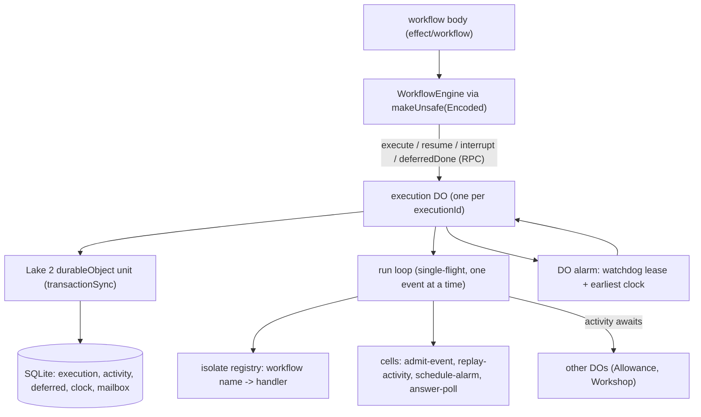
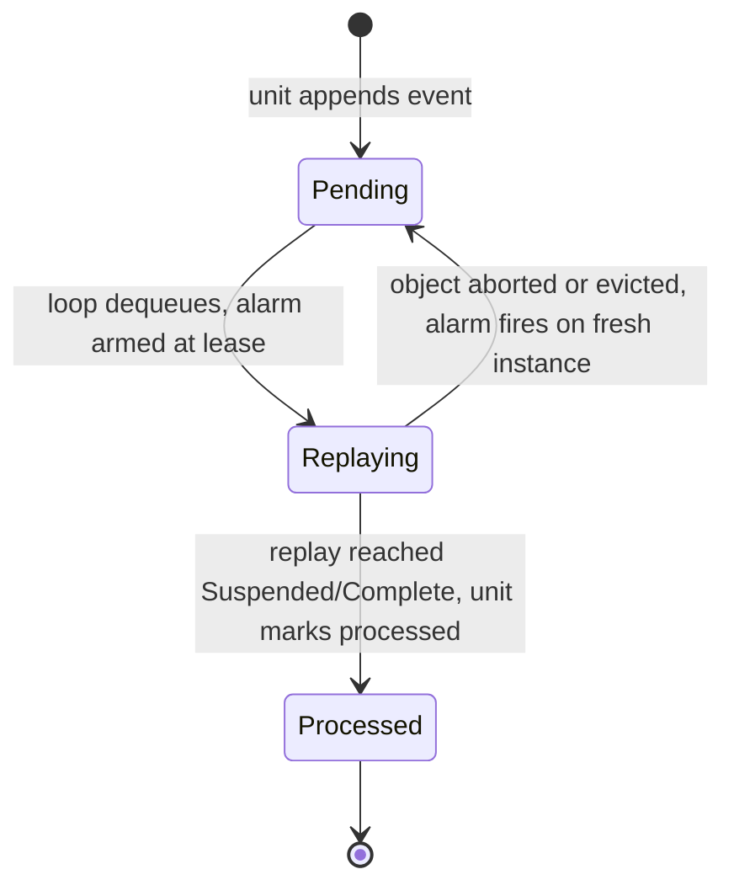
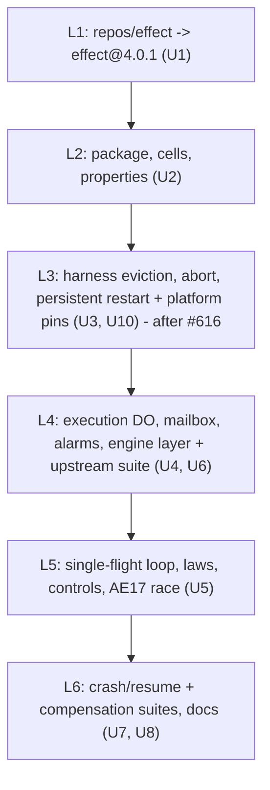

# sfs Durable Object WorkflowEngine - Plan

## Goal Capsule

- **Objective:** A starter workflow written against Effect core's `effect/workflow` runs durably on Cloudflare: it survives a crashed or evicted isolate at any await point, resumes to the result an uninterrupted run would give, observes exactly one result per activity while handing each activity a stable idempotency key for its side effects, and handles the events of one execution one at a time even while it waits on another Durable Object.
- **Means:** `@systemfsoftware/effect-workflow-durable-object`, an owned `WorkflowEngine` built on `WorkflowEngine.makeUnsafe` with one SQLite Durable Object per execution, a durable mailbox drained by one run loop, journal writes as Lake 2 `transactionSync` units, and DO alarms for clocks and crash recovery (KTD1-KTD8).
- **Authority:** origin R12, R13, R73, R119 and AE17 with the origin Key Decision on the owned DO engine; then Kiro's Lake 5 bar (2026-10-06, carried as R73a-R73e); then this plan's KTDs; then the cited pack rules.
- **Stop conditions:** each goes to Kiro with evidence before the next layer. U9's probes ran first (results in U9); stop conditions 1 and 2 did not fire.
  - A handler closure registered by the test isolate cannot run inside the execution DO's request context in workerd (KTD6). Observed to hold; U10 pins it.
  - A `transactionSync` unit cannot run between awaits of a draining run loop (KTD3). Observed to hold; U10 pins it.
  - An upstream suite case cannot pass on any durable engine. One is already suspected (Open Question 1). Any other such case stops the suite layer as `settled-decision-invalidated` against R73.
- **Execution profile:** one `gh stack` on trunk `main`, layers L1-L6 (Sequencing), each green on its own and squash-merged. L3 onward waits for #616 (`@systemfsoftware/effect-workerd-harness`) to merge. At most 2 subagents, 1 while a heavy suite runs. vitest always with `--maxWorkers=4` passed explicitly, `TURBO_CONCURRENCY=4`, one heavy suite at a time under `nice -n 10 ionice -c3` with MemAvailable >= 24 GB; every subagent task carries this rule. WIP pushed every 30 minutes. No local stryker (REPO-D3). Kiro runs `ce-code-review`; there is no self-review. Each PR opens as soon as its local gate is green.

---

## Product Contract

Product Contract preservation: R12, R13, R73, R119 and AE17 are carried unchanged from the origin. R73a-R73e restate Kiro's binding Lake 5 bar (2026-10-06) as requirements. R12a and R119a are this lake's derived constraints. None of them changes product scope.

### Summary

A new package, `@systemfsoftware/effect-workflow-durable-object`, gives Effect's `effect/workflow` a durable engine on Cloudflare Workers. Each execution is one SQLite Durable Object holding its journal (activity exits, deferred exits, clocks) and a mailbox of pending events. One run loop per object replays the workflow body one event at a time. Journal writes run as Lake 2 units inside `transactionSync`. Clocks and crash recovery ride the object's alarm. Effect's own `WorkflowEngine` suite runs against the engine inside workerd, and crash/resume, compensation and AE17 race suites prove the durable claims.

### Problem Frame

`effect/workflow` ships two engines and neither fits Workers. `layerMemory` keeps state in process memory, and `ClusterWorkflowEngine` needs `Sharding` and `MessageStorage` runners (`docs/brainstorms/inputs/starter-scratch/pov-workflow-engine.md`). No systemfsoftware code imports `effect/workflow` today, and nothing in the repo types or exercises a DO alarm. An execution DO waits on other DOs (the Allowance DO in R11), so its input gate opens mid-run and a second event can enter. `layerMemory` replays the body on every wake. Two concurrent wakes would replay it twice at once, and an activity not yet journaled would run twice. That is the AE17 failure.

### Key Decisions

- **Durable orchestration uses Effect core `effect/workflow` on an owned DO-backed `WorkflowEngine`, re-confirmed against Workflows V2.** (session-settled: user-approved, carried from origin.) Governs R73, R119, R12, R13.
- **The DO unit runs as `transactionSync(() => Effect.runSync(...))`.** Carried from origin with its probe evidence. Governs R119a.

### Requirements

**Carried from origin**

- R12. Workflows survive a workerd crash mid-workflow: resumed activities are not duplicated past their idempotency key.
- R13. Timers are DO alarms; alarms fire under `alchemy dev` and after a killed runtime.
- R73. The DO `WorkflowEngine` passes Effect's own `WorkflowEngine` suite (`repos/effect/packages/effect/test/workflow/WorkflowEngine.test.ts`) ported to run in workerd, plus crash/resume and compensation suites.
- R119. The owned `WorkflowEngine` serializes events per execution: a single run loop guarded in the execution DO's storage, so a cross-object await cannot interleave two events of one execution. A workerd test injects concurrent resume and deferred-done events during a cross-object activity and proves one-at-a-time processing, no activity result observed twice, and side effects deduped by the stable idempotency key. (Bar reworded by Kiro 2026-10-06 after U9: an aborted step may run again, so "no activity run twice" became "no activity result observed twice".)

**Kiro's Lake 5 bar (binding)**

- R73a. The upstream suite runs in workerd unchanged except for the runtime harness. An import manifest in the sfs-xstate shape records the port, and a drift check holds it against upstream.
- R73b. Crash/resume suite: the execution DO is aborted at every await point of a workflow with activities, deferreds and clock sleeps. Each run resumes to the uninterrupted run's result with no activity re-executed past its idempotency key.
- R73c. Compensation suite: a failure at each step runs the registered compensations exactly once, in reverse order.
- R73d. Every DO claim is proven in real workerd. There are no Node stand-ins and no deferrals.
- R73e. Pure decisions carry property tests where their input space is open. Engine laws follow Lake 2's shape: verdicts as values, one suite over subjects, broken controls.

**Derived**

- R12a. Step delivery is at-least-once under abort; result observation is exactly-once. The workflow observes exactly one result per activity. Every activity receives a stable idempotency key (execution id, activity name and attempt), identical on every run of that step, so its side effects can dedupe. An activity whose exit is journaled never runs again.
- R119a. Every journal and mailbox write is one Lake 2 `durableObject` unit. No write runs outside `transactionSync`.

### Acceptance Examples

- AE17. **Covers R119.** Given a register workflow waiting on the Allowance DO, when a resume and a deferred-done event arrive concurrently, then the execution processes them one at a time and the seat activity runs once. (Origin.)
- AE3 (shape only). **Covers R12.** Given workerd is killed after the provider accepts a confirmation but before the journal records it, when the workflow resumes, then the mail sink holds one message for that hold. (Origin. The starter owns the mail flow; R73b's crash suite proves the same shape on fixture activities.)
- AE22. **Covers R13.** Given a workflow asleep on a 2-second durable clock, when the runtime is disposed and restarted on the same persisted storage, then the alarm fires and the workflow completes.
- AE23. **Covers R73c.** Given steps A, B and C each with a compensation and a failure injected at C, then the compensation log reads `[B, A]` once. When the DO is aborted during B's compensation, the log after resume still reads `[B, A]` once.

### Scope Boundaries

- The starter's register and promote workflows (R10, R11), its race demo (R24) and the alarm path in command-sequence model tests (R25) belong to the starter lakes. Lake 5 ships register-shaped fixtures only.
- `@systemfsoftware/effect-sim-kernel` interleaving of workflows (R25) is starter work.
- Considered and not built: running workflows on Cloudflare Workflows V2. The origin settled it (Key Decisions). Evidence that would reopen it: a per-workflow create limit at or above the registration burst rate, plus `waitForEvent`/terminate semantics matching Effect's deferred and interrupt.
- Considered and not built: `@cloudflare/vitest-plugin` as the in-workerd test runner. 1.3.6 (2026-10-02) peers `vitest ^4.1.0`; the workspace runs vitest 5.
- Considered and not built: a lease or owner column guarding the run loop across instances. Workerd guarantees one live instance per object id, so an in-memory single-flight loop plus the durable mailbox covers R119. Evidence that would change it: a workerd test that observes two live instances of one id.
- Considered and not built: porting `ClusterWorkflowEngine.test.ts`. Its cases need `Sharding`. Its durable race shapes (a completion landing while a suspension commits, parked child wakeups coalescing) inform the U5 race and U7 crash fixtures instead.

#### Deferred to Follow-Up Work

- The drift-check guard over the manifest is an Evaluator surface owned by sfs-xstate (Open Question 2, ruled). L4 does not merge until the generalized guard is on `main` and grades this lake's manifest.

### Dependencies / Assumptions

- Lake 2 (`@systemfsoftware/effect-unit-of-work`, #603/#604/#608/#609) is on `main`. Its `./durable-object` adapter is the journal's write path.
- #616 (`@systemfsoftware/effect-workerd-harness`, Lake 3, another session) merges before L3. Lake 5 extends that package rather than adding a third Miniflare fixture (REPO-O1 owns it outright).
- Distribution follows Lake 2: a flake output of this repo pinned by `flake.lock`, with change intents driving the version. The manifest starts at `0.1.0`.
- `effect` resolves to 4.0.1 workspace-wide (#612), and the vendored `repos/effect` is at 4.0.0. 4.0.1 changes the seam: `WorkflowInstance` gains `completedDeferreds`. The suite file is byte-identical across the two tags, checked by a line diff of both raw files.

### Outstanding Questions

1. **Ruled (Kiro, 2026-10-06): the shutdown-compensation upstream case.** U6 runs "layerMemory runs compensations when the engine is shut down" first. If it fails because a durable engine must not compensate on shutdown, the manifest retires it with that reason and two named replacements in U7. (a) Engine shutdown or DO eviction runs no compensation, and the execution resumes to its uninterrupted result. (b) An explicit interrupt of the execution runs every registered compensation exactly once, in reverse order. The retirement is declared under CONST-W3 in L4's PR. Its sibling, "layerMemory propagates interruption when the engine is shut down", stays verbatim.
2. **Ruled (Kiro, 2026-10-06): the drift-check guard.** sfs-xstate owns `scripts/guards/check-upstream-test-manifest.ts` and generalizes it to several package families in its own Evaluator PR on `main` (CONST-E9). Lake 5 ships only the manifest data (U6). L4 does not merge until that guard is on `main` and grades the manifest.

---

## Planning Contract

### Key Technical Decisions

- KTD1. **One package, `@systemfsoftware/effect-workflow-durable-object` at `packages/effect-workflow-durable-object`, with entries `.` and `./laws`.** The name is R72's. It is a binder: it implements Effect's engine port for one runtime and carries no product (`docs/solutions/architecture-patterns/engine-package-not-host-package.md`). `.` is one namespace barrel holding the engine layer, the execution DO class factory and the typed errors. `./laws` holds the engine laws and broken controls, following Lake 2's KTD5/KTD6 (pack: package-topology, `enumerated-entry-modules.md`, `one-access-path.md`, `import-time-inertness.md`). DO storage is typed structurally, Lake 2's `DurableObjectStorage` plus `setAlarm`/`getAlarm`/`deleteAlarm`. No `@cloudflare/workers-types`.
- KTD2. **One SQLite DO per execution, addressed by `idFromName(executionId)`.** It holds five tables: `execution` (workflow name, encoded payload, parent, status, encoded result), `activity` (`name/attempt` key, encoded exit), `deferred` (name, encoded exit, first writer wins), `clock` (name, wake time, fired) and `mailbox` (sequence, event, processed). A schema-version row records the store's version. The DO constructor runs pending migrations under `blockConcurrencyWhile`, before any request is served, from `src/execution/migrations.ts`. This is stored data and expensive to change later, so the mechanism lands with the first layer that stores anything (U4).
- KTD3. **Events serialize through a durable mailbox drained by one in-memory run loop per object (R119).** Every inbound event is one `durableObject` unit (R119a): execute, resume, deferred-done, clock-fired, interrupt, and the alarm's wake. That unit applies the event's pure decision to the journal, appends to the mailbox, and arms the alarm in the same storage transaction. The RPC answers once its event is recorded. The loop keeps draining after the answer; nothing holds the request open and `ctx.waitUntil` is not relied on. The loop is single-flight. It takes the oldest unprocessed event, replays the body to `Suspended` or `Complete`, and marks the event processed in a unit before it takes the next. The unit that drains the queue clears the alarm, or re-arms it at the earliest unfired clock (KTD4). An alarm is armed whenever an unprocessed event exists: the live loop is the fast path, and the alarm is the only durability mechanism. An object evicted or aborted mid-drain finishes on its alarm. An event that arrives while the body awaits another DO can only append. Wakes for a completed execution are no-ops, so a burst of wakes costs one replay. Honors 4.0.1's `completedDeferreds`: a deferred the running replay completed itself appends no wake. U4 lands the mailbox with each event replayed as it arrives. U5 adds the single-flight loop and keeps U4's shape in `./laws` as the interleaving control, so AE17 is observed red on L4's engine and green on L5's. (pack: cell-architecture, `store-serializable-unit-of-work.md`; `store-unit-of-work-handle.md`.)
- KTD4. **The alarm is the one durability mechanism: it recovers unprocessed events and times clocks (R12, R13).** Every unit that leaves an unprocessed event arms the alarm in its own transaction (KTD3). The unit that marks an event processed sets the alarm at the pure `schedule-alarm` decision: while the mailbox is non-empty, the earlier of the lease end and the earliest unfired clock (a clock due inside the lease still wakes on time); otherwise the earliest unfired clock; otherwise none. After an abort or eviction the alarm fires on a fresh instance, appends a wake and drains, so the replay resumes from the journal. `ctx.abort()` retries an in-progress alarm by default (Cloudflare changelog 2026-08-25). The handler is idempotent by rule: `admit-event` makes a wake a no-op when an unprocessed wake is already queued, so a retried alarm adds no second replay. **Delivery of a step is at-least-once under abort:** a write the output gate has not yet confirmed can be discarded when `ctx.abort()` follows it, so the alarm may re-run a step whose processed mark was just written (U9 probe 5, aborted drain). The engine's guarantee is exactly-once observation instead (R12a): the journaled exit is the only result the workflow reads, and the activity sees the same idempotency key on every run. Two rules bind the alarm's shell, each proven by a real-workerd engine test that fails if the rule is removed (U4): **every alarm drains every queued mailbox event, whatever `admit-event` decided about the `AlarmWake`** — an `AlarmWake` never suppresses a drain; and **every `Scheduled` clock already due fires through `admit-event` before the next alarm is armed** — the arm never waits on a clock that has already passed.
- KTD5. **Clocks follow Effect's `Clock` and the alarm is their backstop.** `scheduleClock` writes the clock row and re-arms the alarm. It also forks a sleep on the calling fiber's `Clock` in the execution scope, which appends the same clock-fired event. Either path marks the clock fired once, because the first writer wins: a second clock-fired event for a fired clock writes nothing and asks for no wake. A live object wakes on time, and an evicted one wakes on the alarm. workerd forbids resuming a fiber across request contexts (U9 probe 6): `TestClock.adjust` in the test request cannot wake a sleep that began in the DO's request, whether the replay carries the whole register-time context or only `Clock`. So the four upstream cases that advance `TestClock` run unchanged **except the declared clock lines**: each `TestClock.adjust(...)` becomes a ported region calling a harness helper that advances time the way production does, moving the execution DO's clock and firing its alarm in workerd (KTD8). The replay stays in the DO (KTD3). Rejected (Kiro): retiring the four cases, which loses upstream coverage; and driving the replay from the test request, which tests a topology that does not ship.
- KTD6. **Workflow handlers live in an isolate-scoped registry that the execution DO resolves by workflow name.** In production the Worker's composition root builds the workflow layer once per isolate, and `register` fills the registry before the DO serves a request. The DO class comes from a factory over that layer. The upstream suite uses the same path. Each case registers handlers from its own layer in the test isolate, and the execution DO runs those closures in its own request context. An unregistered workflow leaves its event pending and re-arms the alarm. U9 probes this before any layer lands: a handler closure holding a `Latch` from the test request, run from the execution DO's request, must open and observe that latch in workerd. If it cannot, stop condition 1 fires.
- KTD7. **The pure decisions are CC=1 cells with properties. The DO, RPC, alarm and loop are shell.** Cells (`*.workflow.ts`, named for the decision they make): `admit-event` (journal state plus event gives `Ignored`, `Recorded` with the writes, or `Enqueued` with the writes; it holds the deferred and clock first-writer rules), `replay-activity` (a completed exit replays, anything else runs; a suspended exit is never journaled, as in `layerMemory`), `schedule-alarm`, and `answer-poll` (the poll answer). Deferred completion is a branch of `admit-event`, not its own cell: admission needs the first-writer verdict, and a cell may not call another cell (architect-workflow G3). Each property names the universal the public surface cannot reach (CONST-T14). The shell does read, decode, decide, shape and write in order (CONST-B3). (pack: cell-architecture, `service-and-layer-boundaries.md`.)
- KTD8. **The upstream suite runs inside workerd through an owned case runner, not the Vitest Workers plugin.** esbuild bundles the ported `WorkflowEngine.test.ts` into a test Worker. It resolves `@effect/vitest` to a harness shim: `describe`, `it.effect`, `it.live` and `assert`, with `it.effect` providing Effect's test services and a scope the way `@effect/vitest` does. The shim registers cases inside the isolate. A Node test file on the repo's vitest fork lists the cases from the Worker and runs each in a fresh workerd runtime, a fresh engine as `layerMemory` is per case. The ported regions are the `effect/workflow` engine import, each `WorkflowEngine.layerMemory` expression (swapped for the DO engine layer), and each `TestClock.adjust(...)` line in the four clock cases (swapped for the harness's clock helper, KTD5). Everything else, every assertion included, stays byte-identical. The manifest records every region and pins upstream blobs from `repos/effect` at 4.0.1. The clock regions are declared under CONST-W3 in L4's PR, with the reason and the U9 probe 6 evidence for both variants.

### High-Level Technical Design

Component topology, directional:



One event through the execution DO, directional:

```mermaid
sequenceDiagram
  participant C as caller / other DO
  participant D as execution DO
  participant U as unit (transactionSync)
  participant L as run loop
  C->>D: resume / deferredDone / execute
  D->>U: admit-event, journal writes, append mailbox
  D->>L: kick (no-op when running)
  D-->>C: ack
  L->>U: dequeue oldest, arm watchdog alarm
  L->>L: replay body (activities memoized)
  Note over L: awaits another DO; input gate opens; new events only append
  L->>U: journal activity exit
  L->>U: mark processed, re-arm alarm (schedule-alarm)
  L->>L: next event or idle
```

Mailbox event lifecycle, directional:



### Alternatives Considered

| Where the upstream suite's bodies run                           | Verdict                                                                                                                                                                         |
| --------------------------------------------------------------- | ------------------------------------------------------------------------------------------------------------------------------------------------------------------------------- |
| Inside workerd via an owned case runner (chosen)                | Cases share closure state (latches, counters, `Ref`s) with the handlers, which run in the execution DO, so test and handlers must share an isolate. One fresh runtime per case. |
| `@cloudflare/vitest-plugin`                                     | Rejected: peers `vitest ^4.1.0`, workspace on vitest 5.                                                                                                                         |
| Bodies in Node, engine reached over HTTP                        | Rejected: handler closures cannot cross the process boundary, so most cases would need rewriting.                                                                               |
| Alias `WorkflowEngine.layerMemory` to the DO engine at bundling | Rejected: keeps the file byte-identical, but the test text would then claim to run `layerMemory`. Ported regions make the swap visible to the manifest and the drift check.     |

| Serializing events per execution                | Verdict                                                                                                                                                     |
| ----------------------------------------------- | ----------------------------------------------------------------------------------------------------------------------------------------------------------- |
| Durable mailbox and one in-memory loop (chosen) | Events survive a crash, and order is FIFO by sequence. The loop never spans an await inside `transactionSync`.                                              |
| `blockConcurrencyWhile` around each replay      | Rejected: holds the input gate for the whole cross-DO await. Every RPC, including the deferred-done that would unblock it, stalls.                          |
| In-process lock only (`Semaphore`)              | Rejected: lost on eviction, so a pending wake vanishes with the instance (pack: cell-architecture, `store-serializable-unit-of-work.md` mechanism ranking). |

### Assumptions

- In local workerd, every DO instance of one Worker shares the entry module's isolate. U9's probe settles this before any layer lands.
- `ctx.abort()` called inside an activity body resets the object between the activity's side effect and its journal write, and Miniflare's `unsafeEvictDurableObject` evicts a suspended object. U3 pins both in the harness's own tests.
- Miniflare's `durableObjectsPersist` keeps SQLite storage and the pending alarm across `dispose()` and a new runtime, matching the alchemy-dev probe (`probe-results.md` section 3).
- An `Activity` inside a `withCompensation` finalizer runs in the instance context and is memoized on replay. U7 confirms this before AE23's crash half relies on it. If it fails, the fixture journals compensations through an activity the step itself registers.

### Sequencing



L2 lands inert: cells with no engine wired. L3 extends the harness package and opens the engine package's workerd suite with the platform pins. L4 ships the engine together with its behavioural oracle, the upstream suite. Each layer leaves `main` releasable.

### Test Admission

Every proposed test passed the `test-layer-selection` admission gate, which refuses by default. Decision cells get colocated property tests only. Every workerd suite is a seam-only observation: input gates, eviction, `ctx.abort()`, alarms and persisted restart exist only in a real runtime. The gate's in-process rule fails these suites because Miniflare spawns workerd. R73d (Kiro's binding bar) and Lake 2's KTD7 precedent require real workerd anyway, and the conflict is declared in L3's PR under CONST-W3. Everything below the seam is delegated down to U2's properties.

| Proposed test                                                                                  | Verdict                                                                                                                   |
| ---------------------------------------------------------------------------------------------- | ------------------------------------------------------------------------------------------------------------------------- |
| U2 cell properties                                                                             | Admitted: decision cells, open input space (R73e)                                                                         |
| U3 evict / abort / persisted-restart pins                                                      | Admitted: Miniflare semantics nothing else pins (pin-dependency-semantics)                                                |
| U3 typed error for evicting an unknown name                                                    | Refused: tests the harness's own error translation                                                                        |
| U4 execute, deferred, discard id, clock, child, interrupt                                      | Refused: the upstream suite (U6, same layer) observes each                                                                |
| U4 unregistered workflow stays pending and the alarm re-arms                                   | Admitted: alarm-driven, seam-only                                                                                         |
| U4 every alarm drains every queued event, whatever `admit-event` decided about the `AlarmWake` | Admitted: KTD4's engine rule; the drain is shell-only, observable only in workerd                                         |
| U4 a `Scheduled` clock already due fires before the next alarm is armed                        | Admitted: KTD4's engine rule; the pre-arm sweep is shell-only, observable only in workerd                                 |
| U5 AE17 race and the two broken controls                                                       | Admitted: R119's proof and its negative controls (CONST-T10)                                                              |
| U5 50 concurrent `deferredDone`                                                                | Refused: first-writer-wins is a U2 property; unit atomicity is Lake 2's proof                                             |
| U5 the excused law on `layerMemory` is refused                                                 | Refused: tests the law kit's wiring                                                                                       |
| U6 upstream cases                                                                              | Admitted: R73                                                                                                             |
| U6 sabotage and region-shift                                                                   | Refused as permanent tests: sabotage is a scratch-copy check (DoD), and region shift is the guard's job (Open Question 2) |
| U7 crash at each await point, AE22, compensation table, AE23                                   | Admitted: R73b, R73c, R13                                                                                                 |
| U7 abort on the deferred, abort on the clock as separate tests                                 | Refused: the per-await-point run already covers both                                                                      |
| U7 replacements (a) and (b) for the retired shutdown case                                      | Admitted if U6 retires the case (Open Question 1 ruling)                                                                  |
| U2 queued-wake no-op and clock first-writer properties                                         | Admitted: decision cells, open input space (R73e)                                                                         |
| U4 a v(N-1) store migrates under version N                                                     | Admitted: stored-data format crosses the runtime seam; only a real SQLite DO can observe the constructor migration        |
| U10 platform pins (U9 probes 2-5)                                                              | Admitted: workerd semantics the design rests on; a workerd bump that breaks one must go red (pin-dependency-semantics)    |
| U7 abort right after the processed mark                                                        | Admitted: R12a's exactly-once observation and stable key, observable only under a real `ctx.abort()`                      |

---

## Output Structure

```text
packages/effect-workflow-durable-object/
  package.json  tsdown.config.ts  vitest.config.ts  stryker.config.ts  oxlint.config.ts
  turbo.json  tstyche.json  .attw.json  tsconfig*.json
  api-extractor.json  api-extractor.laws.json  etc/*.api.md
  upstream-tests.json                  # manifest (U6)
  README.md
  src/
    mod.ts                             # export * as DurableWorkflowEngine
    engine/                            # makeUnsafe(Encoded) layer, registry, typed errors
    execution/                         # execution DO factory, run loop, alarm, journal driver
    decisions/                         # *.workflow.ts cells
    laws/                              # laws, verdict folds, broken controls
  test/workflow/WorkflowEngine.test.ts # ported upstream file (regions marked)
  tests/
    engine.integration.test.ts         # unregistered workflow stays pending (alarm re-arm)
    event-serialization.integration.test.ts   # AE17 + laws over subjects
    upstream-suite.integration.test.ts        # case runner
    crash-resume.integration.test.ts
    compensation.integration.test.ts
    __fixtures__/                      # workers, effect-vitest shim, gate/ledger DOs
```

Per-unit `Files` lists are authoritative.

---

## Implementation Units

### U9. Probes before any layer (done 2026-10-06)

- **Goal:** The load-bearing assumptions behind KTD3, KTD5 and KTD6, plus the abort point U7 relies on, are observed in real workerd before any layer lands.
- **Requirements:** R73d; KTD3, KTD5, KTD6.
- **Dependencies:** none.
- **Files:** a gitignored, dot-prefixed scratch directory only (OP12). Nothing lands.
- **Approach:**
  1. Start a scratch Worker on Lake 2's Miniflare fixture pattern.
  2. Registry probe: a closure registered from one request, holding a `Latch` made in that request, runs from a DO's request and opens the latch, which the first request observes.
  3. Unit probe: a `durableObject` unit committed between two awaits of an in-memory loop, while another request is in flight, commits and is visible to that request.
  4. Abort probe: `ctx.abort()` called after a cross-DO side effect and before returning leaves the side effect, loses the in-memory state, and keeps the pending alarm.
  5. Drain probe: the loop keeps draining after the RPC's response has returned. An object aborted with `ctx.abort()` mid-drain finishes its queue on its alarm.
  6. Clock probe: a handler registered under a layer provided with `TestClock` and run from the DO's request sleeps on that `TestClock`. Adjusting it from the registering request wakes the sleep.
- **Test expectation:** none -- throwaway evidence; probes 2-5 become U10's permanent pins.
- **Verification:** each probe's observed output is recorded below. A failure of probes 2 or 3 fires stop conditions 1 and 2. A failure of probe 5 or 6 is a plan change that goes to Kiro before L4.
- **Result (Miniflare `5.20261001.0-alpha`, real workerd):**
  - Probe 2 passed. A `Latch` made in the test request was opened by a closure the DO ran, and the test request observed it open.
  - Probe 3 passed. A `durableObject` unit committed between two cross-DO awaits of a loop whose request had returned, and another request read the row.
  - Probe 4 passed. After `ctx.abort()` the caller got the abort error; the next request saw fresh memory, the side effect recorded once, and the alarm kept.
  - Probe 5 passed. Live: the response returned with 3 pending and the loop drained all 3 and cleared the alarm. Aborted mid-drain: the alarm fired with 3 pending and drained all 3; the live loop's just-written processed mark for event 1 was discarded, so event 1 ran twice (KTD4).
  - Probe 6 failed in both variants (full register-time context, and `Clock` only): "Cannot call this AsyncLocalStorage bound function outside of the request in which it was created", at the fiber resume. Ruled by Kiro: KTD5 and KTD8 amended.

### U10. Platform pins in the engine package's workerd suite

- **Goal:** The workerd behaviours U9 probes 2-5 observed are permanent tests, so a workerd or Miniflare bump that breaks a design assumption goes red.
- **Requirements:** R73d; KTD3, KTD4, KTD6.
- **Dependencies:** U2, U3 (same layer, L3); #616 merged.
- **Files:** `packages/effect-workflow-durable-object/tests/platform-pins.integration.test.ts`, `tests/__fixtures__/platform-pins.worker.ts`, `package.json` (devDependency on `@systemfsoftware/effect-workerd-harness`).
- **Approach:** port the probe Worker onto the harness from #616, typed (no `any`), with each probe as one Gherkin scenario. The throwaway `.u9-probes/` directory and its `.git/info/exclude` line are deleted when this lands.
- **Test scenarios:**
  - A closure registered by one request, holding an Effect `Latch` from that request, runs from a DO request and opens the latch, which the first request observes.
  - A `durableObject` unit committed between two awaits of a loop, after that loop's request returned, is visible to another request.
  - `ctx.abort()` after a cross-DO side effect leaves the side effect once, resets in-memory state, and keeps the pending alarm.
  - The loop drains after the response returns and clears the alarm. Aborted mid-drain, the alarm finishes the queue.
- **Verification:** the suite passes with `--maxWorkers=4` under a pinned-CPU hog. Sabotage on a scratch copy: removing the alarm arm from the event transaction turns the aborted-drain pin red.

### U1. Vendor Effect 4.0.1

- **Goal:** `repos/effect` matches the `effect` the workspace resolves, so the engine and the manifest read the seam they run against (REPO-W4).
- **Requirements:** R73a.
- **Dependencies:** none.
- **Files:** `repos/effect/**` (subtree update only), `subtrees.toml` if the tool records the tag.
- **Approach:** Use the repo's subtree update path, the same as `34c27c537f chore: update repos/effect/ to effect@4.0.0`. No hand edits under `repos/` (REPO-S3). Its own PR.
- **Test expectation:** none. Vendored reference tree only; no package hash changes.
- **Verification:** `repos/effect/packages/effect/src/workflow/WorkflowEngine.ts` contains `completedDeferreds`, and `git diff` touches only `repos/effect` and subtree metadata.

### U2. Package skeleton, decision cells and properties

- **Goal:** A publishable package whose `.` entry exposes the journal and event types and whose cells decide replay, completion, wake and alarm timing, proven by properties.
- **Requirements:** R73e, R119, R12a; KTD1, KTD2, KTD7.
- **Dependencies:** U1.
- **Files:** `packages/effect-workflow-durable-object/{package.json,tsdown.config.ts,vitest.config.ts,stryker.config.ts,oxlint.config.ts,.attw.json,tsconfig*.json,api-extractor.json,etc/effect-workflow-durable-object.api.md}`, `src/mod.ts`, `src/decisions/{admit-event,replay-activity,schedule-alarm,answer-poll}.workflow.ts`, `src/decisions/journal.schema.ts`, `src/decisions/__tests__/*.workflow.property.test.ts`, `.changeset/<slug>.md` (minor; manifest `0.1.0`).
- **Approach:**
  1. Scaffold from the repo's package conventions, with the `all` oxlint preset and `@systemfsoftware/effect-cell-types` for cell contracts.
  2. Model events and journal rows as tagged unions in `*.schema.ts` (CONST-D1, CONST-D4). The schemas are the generators.
  3. Write each cell as `Workflow.make({ command, decision, error, decide })` with an exhaustive `Match`.
- **Patterns to follow:** `packages/effect-unit-of-work/src/durable-object/classify-unit-exit.workflow.ts`; `packages/discern/src/__tests__/score-eval-record.workflow.property.test.ts` (mutant-named properties).
- **Test scenarios:**
  - ∀ journal with a completed exit for `name/attempt`, `replay-activity` answers ReplayExit with that exit. A journaled exit for the same name with another attempt, or the same attempt of another name, answers RunActivity.
  - ∀ deferred already completed with exit e1 and any e2, any execution state and any origin, `admit-event` writes nothing and wakes nothing.
  - ∀ live execution with a replay pending and any event, `admit-event` never enqueues. This is the one-replay-per-burst law: the run loop marks the mailbox pending whenever it enqueues, so no event sequence yields two replays without a processed mark between them.
  - ∀ execution state Complete and any event, `admit-event` writes nothing and wakes nothing.
  - `schedule-alarm`: ∀ non-empty mailbox with no unfired clock the answer is now plus the lease; with a clock due now it is that clock. ∀ empty mailbox the answer is the earliest unfired clock, or clear when every clock fired.
  - Edge: a deferred-done from the execution's own running replay (4.0.1 `completedDeferreds`) is recorded without a wake.
  - ∀ clock row already marked fired, a second clock-fired event for the same clock writes nothing and asks for no wake; a clock never scheduled is ignored.
  - Before the execution exists only Execute (enqueued with the creation write) and DeferredDone (recorded) are admitted; with no replay pending a resume or alarm wake enqueues, and an interrupt is recorded once.
  - `answer-poll`: an absent or running execution answers NoResult, a suspended one SuspendedResult, and a complete one CompleteResult with the journaled exit.
- **Verification:** package build, typecheck, lint, test, attw and api:check pass. Nothing imports the cells yet, so the layer is inert.

### U3. Harness: evict, abort and restart on persisted storage

- **Goal:** `@systemfsoftware/effect-workerd-harness` can evict a named DO, observe a DO abort, and dispose and restart workerd on the same persisted DO storage and alarms.
- **Requirements:** R73b, R73d, R13; KTD4.
- **Dependencies:** U2, U9; #616 merged.
- **Files:** `packages/effect-workerd-harness/src/harness.ts`, `src/harness.schema.ts`, `tests/harness.integration.test.ts`, `tests/__fixtures__/*`, `etc/effect-workerd-harness.api.md`, `README.md`, `.changeset/<slug>.md` (minor).
- **Approach:**
  1. Add `evict(className, name)` over Miniflare's `unsafeEvictDurableObject`.
  2. Add a persistence option (`durableObjectsPersist` directory owned by the scope) and `restart`: dispose, then start on the same directory.
  3. Report a failed call as a typed error, never a raw rejection.
- **Execution note:** U9 already saw `ctx.abort()` behave; these tests pin it, eviction and persisted restart in the harness, where an upgrade turns them red.
- **Test scenarios:**
  - A fixture DO keeps an in-memory counter and a SQLite row. After `evict`, the counter resets and the row survives.
  - A fixture DO whose request calls `ctx.abort()` returns an error to the caller, and the next request sees a fresh instance with storage intact.
  - An alarm armed for +2 s fires after `restart` on the persisted directory (AE22's mechanism).
- **Verification:** the harness package gates pass, and the existing harness tests stay green.

### U4. Execution DO, mailbox, alarms and engine layer

- **Goal:** A workflow executes, suspends, resumes and completes on the DO engine in real workerd, with every event recorded in the durable mailbox.
- **Requirements:** R119a, R12, R12a, R13; KTD2, KTD4-KTD6.
- **Dependencies:** U3, U10.
- **Files:** `src/engine/*` (`makeUnsafe` layer, registry, typed errors), `src/execution/*` (DO factory, event handling, alarm handler, journal driver over Lake 2 `durableObject`), `src/execution/migrations.ts` (schema-version row, migrations run in the constructor under `blockConcurrencyWhile`), `src/mod.ts`, `tests/engine.integration.test.ts`, `tests/__fixtures__/engine.worker.ts`, `etc/*.api.md`, `.changeset/<slug>.md`.
- **Approach:**
  1. Implement `Encoded`. `register` fills the registry. `execute`, `poll`, `interrupt`, `interruptUnsafe`, `resume` and `deferredDone` are RPCs to the target DO, and `deferredDone` and child completion address the parent's DO. `activityExecute`, `deferredResult` and `scheduleClock` run inside the replay.
  2. Every event is appended in a unit, then replayed as it arrives (KTD3; serialization lands in U5). The alarm handler follows KTD4, with every choice delegated to the U2 cells.
  3. Land U6's suite in the same layer. It is this engine's behavioural oracle.
- **Patterns to follow:** `packages/effect-unit-of-work/tests/__fixtures__/claims.worker.ts` (DO routing, exhaustive `Match`); `repos/effect/packages/effect/src/workflow/WorkflowEngine.ts` `layerMemory` as reference semantics.
- **Test scenarios:**
  - Error path: an unregistered workflow name leaves its event pending. Registering it before the next alarm completes the execution.
  - Alarm drain: an alarm fires with queued events and, whatever `admit-event` decided about its `AlarmWake`, the loop drains every queued event before the alarm is re-armed or cleared. Removing the drain turns this red.
  - Due clock before arm: a `Scheduled` clock already due fires through `admit-event` (a `ClockFired` write) before the next alarm is armed, so no arm waits on a clock that has passed. Removing the pre-arm sweep turns this red.
  - Migration: a store written at schema version N-1 opens under version N, migrates in the constructor before the first request is served, and its executions still complete.
  - Everything else this unit builds is observed by U6's upstream cases (Test Admission).
- **Verification:** package gates pass, and U6's runner and this file pass under a pinned-CPU `yes` hog without a raised timeout.

### U5. Engine laws, broken controls and the AE17 race

- **Goal:** `./laws` returns verdicts for the engine laws, one suite runs them over the memory and DO subjects, and the AE17 race holds in real workerd while its broken control fails.
- **Requirements:** R119, AE17, R12a, R73e; KTD3.
- **Dependencies:** U4, U6.
- **Files:** `src/laws/*`, `api-extractor.laws.json`, `etc/laws.api.md`, `tests/event-serialization.integration.test.ts`, `tests/__fixtures__/{register.worker.ts,allowance-gate.fixture.ts,engine-subjects.fixture.ts}`, `.changeset/<slug>.md`.
- **Approach:**
  1. Add the single-flight drain loop (KTD3).
  2. Write the laws as Effect programs returning `Held | Broken { law, witness }`, as Lake 2's KTD5 does. Events serialized: body replays of one execution never overlap. Activity once past its key: a journaled activity runs once. Deferred first wins. Clock fires once. Resume equivalent: a resumed run reaches the uninterrupted run's exit.
  3. Express the controls as values: the interleaving engine (L4's replay-on-arrival shape) and a forgetful journal that never memoizes activities.
  4. Run one suite over subjects. `layerMemory` excuses the crash law with its reason (`cannotRun`), as in Lake 2's store-law suite.
- **Execution note:** run AE17 against L4's engine first and record it red, then add the loop.
- **Patterns to follow:** `packages/effect-unit-of-work/src/laws/*`, `tests/store-laws.integration.test.ts`, `tests/__fixtures__/broken-law-subjects.fixture.ts`.
- **Test scenarios:**
  - AE17: the register fixture's `reserve` activity awaits an Allowance DO held on a gate. The test fires `resume` and `deferredDone` concurrently at the execution DO, then opens the gate. The body-run ledger shows non-overlapping replays, `seat` ran once, and the Allowance ledger holds one reservation for the key.
  - The same AE17 workload on the interleaving control answers `Broken` for events serialized, with overlapping replays as the witness.
  - The forgetful-journal control answers `Broken` for activity once past its key.
- **Verification:** package gates pass, the upstream suite stays green, and the AE17 output, red on L4 and green on L5, is quoted in L5's PR body. Sabotage on a scratch copy turns at least one test red: removing the mailbox append, or marking an event processed before its replay.

### U6. Upstream suite port and import manifest

- **Goal:** Effect's `WorkflowEngine.test.ts` runs case by case against the DO engine inside workerd, with every delta recorded in the manifest.
- **Requirements:** R73, R73a, R73d; KTD5, KTD6, KTD8.
- **Dependencies:** U4 (same layer, L4); Open Question 1 ruled before L4's PR opens.
- **Files:** `packages/effect-workflow-durable-object/test/workflow/WorkflowEngine.test.ts` (port), `upstream-tests.json`, `tests/upstream-suite.integration.test.ts`, `tests/__fixtures__/{effect-vitest.shim.ts,upstream-suite.worker.ts,do-engine-layer.fixture.ts}`, `dprint.json` (exclude the ported file), `.changeset/<slug>.md`.
- **Approach:**
  1. Copy the upstream file. Mark `// port:begin <case>` / `// port:end` only around the engine import, each `WorkflowEngine.layerMemory` expression, and each `TestClock.adjust(...)` line in the four clock cases.
  2. Record the manifest in the sfs-xstate schema: `ported[]` with the blob from `repos/effect` at 4.0.1, the reason and the regions. If the shutdown-compensation case fails as Open Question 1 expects, add it to `retired[]` with that reason and U7's two replacements.
  3. Write the shim to the `@effect/vitest` behaviour the file uses: `it.effect` gives a scope and the test services, `it.live` the live clock, and `assert` is chai's assert. Write the clock helper the clock regions call: it advances the execution DO's clock by the duration and fires its alarm in workerd, so due clocks complete the way they do in production (KTD5).
  4. The Node runner lists the cases and runs each in a fresh harness runtime, reporting the case's failure as the test's failure.
- **Execution note:** run every case as-is first and record which pass, then fix the engine. The ported file is never edited outside its declared regions to make a case pass; the clock regions change only the `TestClock.adjust(...)` lines.
- **Test scenarios:**
  - Each of the 18 upstream cases (two `deferred self-completion` rows and 16 `WorkflowEngine` cases) is one runner test. Each passes or is retired in the manifest by ruling.
- **Verification:** the runner lists exactly the manifest's cases, and every non-retired case passes in workerd. Sabotage on a scratch copy: making `replay-activity` answer RunActivity for a completed exit turns the fan-out replay cases red.

### U7. Crash/resume and compensation suites

- **Goal:** Aborting the execution DO at every await point resumes to the uninterrupted result with no finished activity re-run, and compensations run exactly once in reverse order, including across an abort.
- **Requirements:** R12, R12a, R13, R73b, R73c, AE22, AE23; KTD4, KTD5.
- **Dependencies:** U5.
- **Files:** `tests/crash-resume.integration.test.ts`, `tests/compensation.integration.test.ts`, `tests/__fixtures__/{crash.worker.ts,effect-ledger.fixture.ts}`, `.changeset/<slug>.md` (none if no package hash changes).
- **Approach:**
  1. The crash fixture workflow runs three activities against a ledger DO that records each effect by idempotency key. It awaits a deferred and sleeps on a durable clock.
  2. A clean run records the ordered await points from the fixture's own ledger, never from engine internals.
  3. For each point, a fresh runtime aborts at that point. Activity points call `ctx.abort()` after the side effect and before returning. Suspended points use the harness's `evict`. Each run continues until Complete.
  4. Add one run that disposes and restarts the runtime while the workflow sleeps (AE22).
  5. The compensation fixture has steps A, B and C with compensations written as activities. It fails at each step in turn, plus once with an abort inside B's compensation (AE23).
- **Test scenarios:**
  - For each await point k: the final exit equals the clean run's, every activity journaled before k shows one invocation, and the in-flight activity at k shows one ledger effect for its key.
  - AE22: dispose and restart during the sleep; the alarm fires on the new runtime and the workflow completes.
  - Failure at A: no compensation runs. Failure at B: `[A]`. Failure at C: `[B, A]`. Each runs once.
  - AE23: abort during B's compensation; after resume the log is `[B, A]` once.
  - Abort right after the processed mark: `ctx.abort()` immediately after the unit that marks an activity's event processed. The alarm re-runs the step. The activity sees the same idempotency key both times, the workflow observes one result, and a side effect keyed on that key is recorded once.
  - Replacement (a), if U6 retires the shutdown-compensation case: engine shutdown, or eviction of the DO, runs no compensation, and the execution resumes to its uninterrupted result.
  - Replacement (b), same condition: an explicit interrupt of the execution runs every registered compensation exactly once, in reverse order.
- **Execution note:** the await-point list comes from a run, so a new await point in the fixture is covered without editing the test.
- **Verification:** both suites pass, and so does a full run under a pinned-CPU hog. Sabotage: dropping the watchdog alarm arm (KTD4) turns the activity-point crash cases red.

### U8. Documentation

- **Goal:** README and doctrine describe the engine, its durability contract and its limits.
- **Requirements:** R73, R119; KTD3-KTD6.
- **Dependencies:** U7.
- **Files:** `packages/effect-workflow-durable-object/README.md`, `CONCEPTS.md` (a Durable workflow engine entry pointing at the package and its gates).
- **Approach:** README per the `effect-readiness` shape: install, the composition root building the workflow layer and DO class, activities taking the idempotency key, the at-least-once rule for in-flight activities (R12a), the alarm lease, the shutdown difference from `layerMemory`, and the suites that prove each claim.
- **Test expectation:** none -- prose only.
- **Verification:** `./bin/dprint check` passes.

---

## Verification Contract

| Check         | Command                                                                                                                     | When                        |
| ------------- | --------------------------------------------------------------------------------------------------------------------------- | --------------------------- |
| Package gates | `pnpm --filter @systemfsoftware/effect-workflow-durable-object <build\|typecheck\|test\|test:types\|lint\|attw\|api:check>` | while iterating each layer  |
| Harness gates | `pnpm --filter @systemfsoftware/effect-workerd-harness <build\|typecheck\|test\|lint\|api:check>`                           | L3                          |
| Under load    | the workerd suites under `taskset -c 0 yes` hogs, `nice -n 10 ionice -c3`, no raised timeouts                               | L4-L6                       |
| Format        | `./bin/dprint check`                                                                                                        | every layer                 |
| Local gate    | `pnpm check:local`                                                                                                          | once before opening each PR |
| CI            | `xd://github run_watch` on each PR                                                                                          | after each push             |
| Mutation      | CI on `main` only; the set is the U2 cells                                                                                  | never local (REPO-D3)       |

---

## Definition of Done

- U9's probe evidence is quoted in L2's PR body. U10's pins land in L3. L1-L6 open as one `gh stack` on trunk `main`, each green on its own, each with a changeset where a package hash changed.
- AE17, AE22 and AE23 observed in test output and quoted in their PR bodies, along with the per-await-point crash table.
- Every non-retired upstream case passes in workerd, and the manifest lists every case as ported or retired with its reason.
- Sabotage per CONST-T10 on a scratch copy: removing the mailbox append, the watchdog alarm or the activity memo each turns at least one test red.
- Open Question 1's outcome (retired or verbatim) and its CONST-W3 declaration are in L4's PR body. L4 merges only after sfs-xstate's generalized drift-check guard is on `main` and grades the manifest.
- The four clock regions are declared under CONST-W3 in L4's PR and recorded in the manifest.
- No dead code from abandoned attempts. `.u9-probes/` and its `.git/info/exclude` line are gone once U10 lands.

---

## Review Record

`ce-doc-review` ran on 2026-10-06 against commit `499af20111` with four reviewers: coherence, feasibility, scope-guardian and adversarial. Kiro ruled every finding the same day.

- **Accepted and applied:** `TestClock` reaches the replay through the register-time services (KTD5, U9 probe 6). The loop drains after the RPC answers, and the alarm armed in the event's transaction is the only durability mechanism (KTD3, KTD4, U9 probe 5). A queued wake makes further wakes no-ops (KTD4, U2). Clock rows are first-writer-wins (KTD5, U2). Migrations use a schema-version row in the constructor (KTD2, U4). U3 depends on U9. Four `TestClock` cases, not five.
- **Rejected:** `completedDeferreds` is unverified (verified by diffing both tags). The test shim duplicates `@systemfsoftware/vitest` (the fork imports vitest, which cannot run in workerd). Reword the lease-column rejection, and add a timer-driven loop alternative (the existing reasoning holds). `transactionSync` may yield (settled by Lake 2's probe and AE5). The upstream file uses `layerMemory` implicitly (it appears only in explicit `Layer.provideMerge` expressions).
- **Review-tool defect:** the `adversarial-document-reviewer` returned malformed JSON (unquoted `why_it_matters` values). Its findings were read as text for synthesis, and its output was not repaired into this record.

---

## Sources / Research

- Effect 4 workflow seam and reference engine: `repos/effect/packages/effect/src/workflow/WorkflowEngine.ts` (`Encoded`, `makeUnsafe`, `layerMemory`); `src/workflow/{Activity,DurableClock,DurableDeferred,Workflow}.ts`; `test/workflow/WorkflowEngine.test.ts`; durable reference `src/cluster/ClusterWorkflowEngine.ts` and `test/cluster/ClusterWorkflowEngine.test.ts`. The 4.0.0 to 4.0.1 delta (`completedDeferreds`) comes from comparing raw files at both tags.
- Lake 2: `docs/plans/2026-10-06-0419-feat-unit-of-work-kit-plan.md` (KTD2, KTD3, KTD5-KTD7); `packages/effect-unit-of-work/src/durable-object/*`, `src/laws/*`, `tests/*`.
- Lake 3 harness: #616, `packages/effect-workerd-harness/` on `sfs/contracts-foundation`.
- sfs-xstate manifest and guard: `packages/xstate/*/upstream-tests.json` and `scripts/guards/check-upstream-test-manifest.ts` on `sfs/xstate-fork`.
- Origin evidence: `docs/brainstorms/inputs/starter-scratch/{pov-workflow-engine.md,probe-results.md}` sections 2, 3 and 5.
- Learnings: `docs/solutions/test-failures/withspan-annotates-every-cause-it-wraps.md` (the engine opens no `withSpan` around causes the upstream suite compares); `docs/solutions/logic-errors/settle-poll-must-judge-quiet-only-on-a-read.md`; `docs/solutions/architecture-patterns/repetition-cannot-observe-constant-io.md` (replay laws carry invocation counters); `docs/solutions/logic-errors/duplicate-order-ids-masquerade-as-version-conflicts.md`.
- Activity delivery is at-least-once in durable-execution engines, and side effects take an idempotency key (R12a): https://docs.temporal.io/activity-execution , https://temporal.io/blog/idempotency-and-durable-execution .
- Cloudflare: `ctx.abort()` and alarm retry, https://developers.cloudflare.com/changelog/post/2026-08-25-durable-object-alarm-abort-no-retry/ ; DO state API, https://developers.cloudflare.com/durable-objects/api/state/ ; Vitest plugin rename and peers, https://developers.cloudflare.com/changelog/post/2026-08-19-vitest-plugin/ and the npm registry manifest for `@cloudflare/vitest-plugin@1.3.6` (read 2026-10-06).
- Miniflare `5.20261001.0-alpha` `index.d.ts`: `unsafeEvictDurableObject`, `listDurableObjectIds`, `unsafeGetDurableObjectStorage`.
