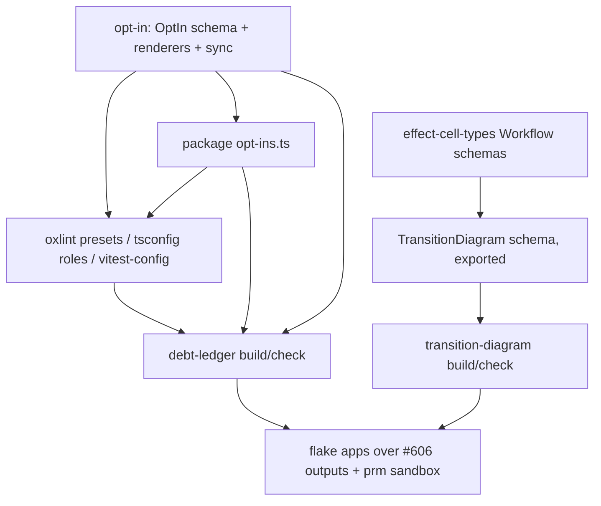

# sfs Lake 6 Generators and Presets Without Off Flags - Plan

## Goal Capsule

- **Objective:** Any systemfsoftware repo (the starter first) lints, typechecks and tests on sfs presets with zero repo overrides, ships a debt ledger generated from its own source that CI holds at zero undeclared entries, and ships cell-workflow diagrams generated from code that CI fails when stale.
- **Means:** One opt-in contract shared by presets and the ledger (KTD1, KTD2). The ledger is the single gate for `off` flags and debt (KTD4). The diagram generator renders from a typed diagram schema it owns and exports (KTD7). Each generator is a workspace package; its flake apps run release-tooling's per-package outputs in prm's sandbox (KTD11).
- **Authority:** Ryan owns scope; Kiro rules. `CONSTITUTION.md` binds. Origin R-IDs: `docs/brainstorms/inputs/requirements-final.md`. The Kiro rulings of 2026-10-05 and 2026-10-06, including the 2026-10-06 ruling that XState leaves this repo, are recorded in Key Decisions and Scope Boundaries.
- **Execution profile:** one `gh stack` on trunk `main`, one layer per unit group (see Sequencing). Writers run in isolated worktrees with one owner per file. Mutation is never run locally.
- **Stop conditions:** The same error recurs 3 times. #606's package set lacks a dependency the generator apps need (named to Kiro, who routes it to release-tooling). In each case send Kiro the exact error. There is no home-grown fallback.
- **Finishes:** sfs-generators runs ce-work. An independent verifier session reviews. Kiro rules the findings.

---

## Product Contract

### Summary

Rewrite the four oxlint presets, the tsconfig Effect presets and the test presets so every exception is a declared, named, reasoned opt-in and no rule is ever `off` or `warn`. Add `@systemfsoftware/opt-in`, `@systemfsoftware/debt-ledger` and `@systemfsoftware/transition-diagram`, and adopt all three in sfs at zero undeclared entries. Deliver the generators as Nix flake outputs.

### Problem Frame

The starter cannot delete its two `off` overrides (R67), because sfs presets meet those needs only with `off` flags of their own (`oxlint-config-dmmf/src/index.ts:25`) and nothing fails a config that turns a rule off. The tsconfig Effect preset claims to list every diagnostic, but it omits 33 of @effect/tsgo 0.48.1's 118, and each omission silently keeps an upstream `warning`, `suggestion` or `off` default. rat-stack's ledger (217 directives) records reasons only: it has no owner, no JSON and no gate. Its diagrams are drawn by hand. No sfs tool generates either artifact (see origin: Superiority Map rows for `/debt.md`, fence, generated diagrams).

### Key Decisions

- **Exceptions are declared opt-ins, never `off`/`warn`.** Kiro bar. Governs R1-R4.
- **tsconfig role presets list every diagnostic at `error`. Library role grants exactly `effect/http` and `effect/observability`. Test role adds `effect/testing`. Each grant carries its reason in the preset.** (session-settled: user-directed — chosen over exactly two grants in every role: Effect 4.0.1 tags `effect/testing` unstable, and tests in 9 sfs packages and the starter use TestClock.) Governs R2, R3.
- **XState is not in this repo.** systemfsoftware has no dependency on `xstate`, `@xstate/*` or `@systemfsoftware/xstate*`, from npm or anywhere else. `transition-diagram` renders cell workflows only, from a typed diagram schema it owns and exports. sfs-xstate builds `@systemfsoftware/xstate-diagram` in systemfsoftware/xstate on top of that schema, together with machine rendering, the `@xstate/effect` consumer check and shortest-path model tests. (session-settled: user-directed — Ryan ruling via Kiro 2026-10-06, superseding the 2026-10-05 ruling that put XState v6 machines in this plan.) Governs R9-R12, R15.
- **No AST parsing for diagram edges.** The ~75 `Workflow.make` sites render as outcome diagrams from their runtime schemas. (session-settled: user-directed.) Governs R11.
- **One builder, one call.** The generator apps and their checks consume release-tooling's per-package outputs (#606, `lib.mkPnpmWorkspacePackages`) only. U13 calls no pnpm fetcher and computes no dependency hash of its own; a dependency missing from that set is a gap in #606, routed to release-tooling. Until #606 merges, U13 is based on #606's head and changes `flake.nix` by one import line. (session-settled: user-directed — Kiro ruling 2026-10-06, superseding the ruling that pinned prm PR B directly.) Governs R14.
- **Every exception is visible in the one gate.** Preset scope narrowings (a rule skipped for some files, an option that exempts names, a rule enabled only under a narrower glob) are ledger entries declared as `PresetNarrowing` grants. Local third-party patches are ledger entries declared as `ThirdPartyPatch` grants with a re-check trigger. A test that must spawn a native tool is a `TestProcessSpawn` grant scoped to that file. (session-settled: user-directed — Kiro rulings 2026-10-06.) Governs R5-R8.
- **Distribution is Nix flakes, with no npm, and consumers run dependency code in the bubblewrap sandbox.** (session-settled: user-directed — Ryan ruling, `docs/brainstorms/inputs/ruling-nix-distribution-sandbox.md`.) Governs R14.
- **Unstable Effect modules beyond the role grants are declared by the package that imports them, never added to a role.** U2's measurement on @effect/tsgo 0.48.1 found 1,046 `unstableApiUsage` sites in 11 sfs packages (effect-atom: rpc, http-api, reactivity, persistence; discern: ai; effect-daemon-process: process; effect-daemon-socket and effect-readiness: socket, net; effect-daemon-cluster: cluster; effect-microsandbox, vitest and conformance-spec: `effect/Arbitrary`; trace-spec: net and `@effect/opentelemetry`). Each package gets an `UnstableApi` opt-in with its reason, and `opt-in sync` writes the grant into its tsconfig. Challenge (inversion lens): widening the roles to cover every sfs import would end the 1,046 errors in one edit. It would also hand those grants to every consumer, so the starter would inherit `effect/ai` and `effect/rpc` silently and R3's "consumers need none" would become false. Rejected. Governs R2, R3.

### Requirements

**Presets (R74)**

- R1. No published oxlint, tsconfig or test preset and no sfs package config sets a rule `off`, `allow`, `0`, `warn`, or a category `off`. Every exception is a narrowed configuration at `error`, declared as a named opt-in with a reason and an owner.
- R2. `@systemfsoftware/tsconfig` moves to `@effect/tsgo` 0.48.1. Each role lists all 118 diagnostics. Each is at `error` unless a declared opt-in excludes it from that role.
- R3. The library role grants `effect/http` and `effect/observability`. The test role also grants `effect/testing`. The reasons ship in the preset. The starter extends the role presets and needs no list of its own.
- R4. A consumer with Gherkin step bodies, build-config files (`vitest.config.ts`, `tsdown.config.ts`) and `effect/http` + `effect/observability` imports passes lint and typecheck with zero overrides.

**Debt ledger (R46)**

- R5. One command builds the ledger from tracked source as `debt.md` (humans) and `debt.json` (agents) from one model. The ledger covers inline suppressions (lint, Effect diagnostics, TypeScript, Stryker, coverage, formatter), Rust `allow`/`expect`/`ignore` attributes, skipped/focused tests, TODO-family markers, config severities, and grants.
- R6. Every entry is Declared (name, reason, owner) or Undeclared. Inline suppressions and skipped tests are never declarable. A TODO is declared only as `TODO(@owner): reason`.
- R7. `check` fails on any of these: an Undeclared entry, a declaration that matches no grant, a committed artifact that differs byte-for-byte from regeneration, or an empty or unscanned input root. Its success line reports the files and channels it scanned.
- R8. sfs ships at zero Undeclared entries.

**Diagrams (R14)**

- R9. One command renders every discovered cell workflow, through the exported diagram schema, as `.mmd`, `.svg` and Unicode text, plus a Markdown index. `check` fails on stale, missing or orphan files.
- R10. Removed by the 2026-10-06 XState ruling: machine rendering belongs to `@systemfsoftware/xstate-diagram` in systemfsoftware/xstate.
- R11. Workflows render as outcome flowcharts from `command`/`decision`/`error` schemas.
- R12. Discovery is closed: a configured module exporting no workflow fails, and every `Workflow.make` site lives in a discovered file.
- R13. Removed by the 2026-10-06 XState ruling: model-based path tests belong to systemfsoftware/xstate.
- R15. `transition-diagram` exports its diagram schema (states with kinds, transitions with event, guard and edge kind), a decode that refuses a dangling transition, a duplicate state and a missing initial state with typed errors, and the renderers. A second adapter can build on that surface alone, shown by a non-XState fixture adapter in the package tests that imports only the package entry.

**Delivery**

- R14. Each generator is a workspace package with property tests. Its flake app (`apps.<system>.<name>`) runs the package from release-tooling's per-package outputs in the prm sandbox, configured by a repo-root config file. A `checks.<system>` entry runs each app in the sandbox on a fixture and asserts its exit code and output.

### Success Criteria

- The starter deletes `tsconfig.base.json`'s own unstable list and both oxlint overrides, and lint and typecheck stay green (real-CLI QA in the U3/U4 PR bodies).
- Each gate has been seen red on a sabotage and green after the revert, with the evidence in its PR body.
- rat-stack comparison, each line checkable:

| Artifact           | rat-stack ships                                                                           | Ours, and the check                                                                                                                                                                                               |
| ------------------ | ----------------------------------------------------------------------------------------- | ----------------------------------------------------------------------------------------------------------------------------------------------------------------------------------------------------------------- |
| Debt ledger        | `/debt.md`, 217 directives across 3 comment families, reason only, Markdown only, no gate | Every family plus config severities, grants, skips, TODOs and Rust. Owner and reason on every declared entry. JSON + Markdown. `debt-ledger check` fails CI at 1 Undeclared entry and at any byte drift. sfs at 0 |
| Fence              | oxlint with `off` rules                                                                   | Zero `off`/`warn` across presets and consumers, judged on effective configs; the ledger fails on any                                                                                                              |
| Effect diagnostics | 75 `@effect-diagnostics` suppressions                                                     | 118/118 diagnostics accounted for per role; omissions are declared exclusions; 0 inline suppressions                                                                                                              |
| Diagrams           | hand-drawn Unicode text blocks                                                            | Mermaid + SVG + Unicode generated from each workflow through the exported diagram schema, byte-compared in CI                                                                                                     |

### Scope Boundaries

- XState machines, their diagrams and their path tests are out of this repo (see Key Decisions). Converting sfs Workflows to machines is out of scope.
- The persisted XState actor on Durable Object SQLite is not in this plan. sfs-xstate owns it as `@systemfsoftware/xstate-durable-object`, built on its Effect runtime and the unit-of-work kit (Kiro ruling 2026-10-06, which supersedes the 2026-10-05 ruling that placed it here).
- Package-script flags beyond `--passWithNoTests` (for example `--no-verify`) are not scanned. The ledger reports its channel list, so the gap is visible.
- Per-package tarball outputs for all sfs packages come from release-tooling's #606. U13 adds only the two generator apps and their checks.

---

## Planning Contract

### Key Technical Decisions

- KTD1. **`@systemfsoftware/opt-in` holds the opt-in contract.** It provides an Effect Schema `OptIn` (branded name, reason, owner handle) carrying a tagged `Grant` union. The variants are oxlint narrowed rule, Effect diagnostic exclusion, unstable/experimental API, duplicate package, vitest guard exemption, lint/format ignore, tsdown warning, type-refusal fixture scope, and `passWithNoTests`. The package also has pure renderers and a `sync` bin. Presets and the ledger both depend on it, which keeps the ledger CLI's heavy dependencies out of presets. It is separate from debt-ledger by capability (CONST-N1).
- KTD2. **Each package declares its own opt-ins in a package-root `opt-ins.ts`.** Its oxlint config builds overrides from them. `opt-in sync` writes its tsconfig plugin blocks as the role preset plus its grants, because `compilerOptions.plugins` replaces across `extends` (`docs/solutions/tooling-decisions/tsgo-lsp-linter-in-lint-pipeline.md`). vitest-config's central `guardExemptions` table (`packages/toolchain/vitest-config/lib/base.js:73-98`) is deleted. The exempt packages declare instead.
- KTD3. **The tsconfig JSON presets are rendered from a typed source in the package.** A package test byte-compares the source against the checked-in JSON. The reasons ship as JSONC comments above each grant plus a published `opt-ins.json`, because the plugin options schema has `additionalProperties: false`.
- KTD4. **The `off` ban is a ledger entry kind, not a separate checker.** The ledger imports oxlint configs (Vite 8 `runnerImport`), evaluates the `extends` graph, and resolves tsconfig chains. The oxlint-guard regex cannot see variables or spreads (`agent-plugins/oxlint-guard/README.md:113`). The tsgo channel takes effective severity as the listed value, else the installed schema default, so an omission cannot hide an `off`.
- KTD5. **Every verdict comes from recomputation.** `check` regenerates in memory and byte-compares. It asserts a non-empty input set and reports unscanned channels (`docs/solutions/architecture-patterns/provenance-ritual-gates.md`). Gates run outside turbo, so cache cannot blind them (`docs/solutions/build-errors/turbo-verdicts-under-stale-cache-and-strict-env.md`).
- KTD6. **Scanners are AST/lexer based, never regex on raw text.** TS/JS use oxc-parser comments and call expressions. Rust uses a lexer that skips strings and comments. A directive spelled inside a string literal is not an entry.
- KTD7. **The diagram input is a typed schema the package owns and exports.** `TransitionDiagram` holds branded state ids, state kinds (initial, decision, outcome, error, final) and transitions (event, optional guard, normal or error edge). `decodeTransitionDiagram` returns `Result<TransitionDiagram, DiagramDefect[]>` and never casts. `diagramToMermaid` and `renderDiagram` render it. Cell workflows reach it through an internal `workflowToDiagram` adapter, so the published surface is the schema, not any one source format.
- KTD8. Removed by the 2026-10-06 XState ruling (path generation moves with XState).
- KTD9. **Diagram discovery imports configured modules through Vite `runnerImport` and reflects them.** Workflows are found by `Symbol.for('@systemfsoftware/effect-cell-types/WorkflowSchemas')` (`packages/effect-cell-types/src/Workflow.ts:7,225-227`). The existing dmmf `make-file-location` rule closes the Workflow population, and a configured module that exports no workflow fails (R12).
- KTD10. **Rendering uses beautiful-mermaid 1.1.3** (synchronous, pure JS, elkjs layout, flowchart, SVG and Unicode outputs). Byte-stable SVG needs no headless browser. nixpkgs mermaid-cli 11.17.0 requires Chromium plus fonts. One shared tail produces all three outputs (`docs/solutions/logic-errors/duplicated-packer-tails-diverge-on-determinism.md`).
- KTD11. **Flake apps run release-tooling's per-package outputs (#606) inside prm's `packages.<system>.sandbox`.** The app launcher installs the package tarball offline into a scratch prefix inside the sandbox, using the workspace lockfile and #606's `pnpm-store`, and runs its bin. sfs `checks` run each app on a fixture. An eval-only gate would ship a compile failure green (`flake.nix` checks comment).
- KTD12. **Pins.** `@effect/tsgo` 0.48.1, which patches oxlint 1.82.0-1.86.0 and tsgolint 7.0.2001/7.0.2003. `oxlint` stays ~1.82.0. `effect` lock moves 4.0.0 → 4.0.1 to match the starter. `oxc-parser` 0.150.0 and `vite` 8 come from the catalog. Every version was checked against the registry or nixpkgs `4975466d` on 2026-10-05.
- KTD13. **Gates enroll in their own layer over a clean tree** and are seen red on a sabotage before green. Kiro's brief of 2026-10-05 commissioned them (GATE1). The verifier session, not this one, reviews them (CONST-E9, AGENTS.md Surface Classes).

### High-Level Technical Design



Ledger classification, as directional pseudo-grammar:

```text
Entry   = InlineDirective | SkippedTest | Marker | ConfigSeverity | Grant
Status  = Declared{name, reason, owner} | Undeclared{why}
check fails <=> any Undeclared  OR  any StaleDeclaration  OR  bytes(committed) != bytes(regen)  OR  scanned = 0
```

### Sequencing

Stack layers bottom-up (each green alone, inert until wired): U1 → U2 → U3, U4 → U5 → U6 → U9 → U10 → U7 (gate enrollment) → U13. The presets and the off ban (U1-U4) come first because starter R67 waits on them. U2 carries the per-package grants in its own layer, because the tsgo bump alone turns 1,046 sites red and a layer must be green by itself.

### Risks

| Risk                                                                         | Mitigation                                                                                                                                                                                                  |
| ---------------------------------------------------------------------------- | ----------------------------------------------------------------------------------------------------------------------------------------------------------------------------------------------------------- |
| Listing 33 more diagnostics at `error` exposes violations across sfs         | U3 measures each and fixes the code. A role exclusion is allowed only where a probe shows compliance is impossible (`docs/solutions/architecture-patterns/an-escape-hatch-is-an-unfalsified-hypothesis.md`) |
| oxlint rejects a symbol-keyed or extra override key used for opt-in metadata | Metadata lives in `opt-ins.ts`, not in the oxlint object. The ledger joins declarations to overrides by `files` + rule                                                                                      |
| #606 moves or lacks a dependency the apps need                               | Rebase U13 on its new head. Name a missing dependency to Kiro, who routes it to release-tooling                                                                                                             |
| U13 and #606 both edit `flake.nix`                                           | U13 is based on #606's head and changes `flake.nix` by one import line; it rebases when #606 lands                                                                                                          |

---

## Implementation Units

### U1. opt-in package

- **Goal:** Contract, constructors, renderers and `opt-in sync` (KTD1, KTD2).
- **Requirements:** R1-R3.
- **Dependencies:** none.
- **Files:** `packages/opt-in/{package.json,tsdown.config.ts,vitest.config.ts,oxlint.config.ts,tsconfig*.json,turbo.json,README.md}`, `packages/opt-in/src/{mod.ts,OptIn.schema.ts,Grant.schema.ts,render-oxlint.ts,render-effect-plugin.ts,sync.ts,cli.ts}`, `packages/opt-in/tests/*.test.ts`, `.changeset/*.md`.
- **Approach:** Pure core plus a thin `cli.ts` shell. The package is inert at import (pack: package-topology, import-time-inertness.md). It has entries `.` and a `bin`.
- **Test scenarios:**
  - A malformed owner handle or an empty reason is refused, and decode fails with a typed error.
  - Rendering an oxlint grant never produces a severity other than `error` (property over generated grants).
  - A rendered Effect plugin block from role + grants equals role ∪ grants, with no duplicates, and its order is stable under permuted input.
  - `sync --check` on a tsconfig whose block differs exits non-zero and names the file.
- **Verification:** Package tests are green. The api report is committed.

### U2. tsconfig role presets on @effect/tsgo 0.48.1

- **Goal:** Library and test roles list all 118 diagnostics and carry the reasoned grants. Every sfs package whose imports go beyond its role's grants declares them, and is synced.
- **Requirements:** R2, R3; Key Decisions (role presets, per-package grants).
- **Dependencies:** U1.
- **Files:** `pnpm-workspace.yaml`, `pnpm-lock.yaml`, `packages/toolchain/tsconfig/{effect.json,effect-entrypoint.json,opt-ins.json,README.md,package.json}`, `packages/toolchain/tsconfig/src/{effect-roles.ts,effect-preset-opt-ins.schema.ts}`, `packages/toolchain/tsconfig/scripts/render.ts`. Then `opt-ins.ts` plus synced `tsconfig.app.json`/`tsconfig.test.json` in effect-atom, discern, effect-daemon-process, effect-daemon-socket, effect-daemon-cluster, effect-microsandbox, runner/vitest, conformance-spec, trace-spec and effect-readiness, and the code fixes for 8 `preferSchemaTypeProperty` sites in effect-atom and 1 `flatMapIgnoredParamToAndThen` site.
- **Approach:**
  1. Bump `@effect/tsgo` to 0.48.1 and lock `effect` at 4.0.1.
  2. Render the roles from `effect-roles.ts` (KTD3).
  3. Each package declares the unstable modules it imports, with reasons, as measured at execution. Non-stability diagnostics are fixed in code.
- **Test layers:** The tsconfig package admits no vitest file. The repo gates refuse a `tests/*.test.ts` outside `src` and a `tests/` import of `../src`, in-source blocks allow only `it.prop` without `node:` imports, and `node:fs` is banned in `src`. Its `test` script is therefore `render --check`, a source recomputation gate.
- **Test scenarios:**
  - `render --check` fails when a checked-in role file differs byte-for-byte from a fresh render.
  - `render --check` fails when a key of the installed `@effect/tsgo` schema is neither at `error` in a role nor under a declared exclusion. The oracle is the installed schema, not the source.
  - A scratch file importing `effect/http-api` under the library role fails `lint:tsgo` and oxlint with `unstableApiUsage`, and `effect/http` passes. This sabotage probe is recorded in the PR, not committed.
- **Verification:** `opt-in sync --check` exits 0 in every declaring package, and `pnpm check:local` is green on the bumped lock.

### U3. oxlint and build presets without off

- **Goal:** Remove every `off`, either by fixing code or by narrowed opt-ins.
- **Requirements:** R1, R4.
- **Dependencies:** U1.
- **Files:** `packages/oxlint-presets/oxlint-config-{dmmf,recommended,rule-authoring}/src/index.ts`, `packages/oxlint-plugin/oxlint-plugin-effect-platform/src/index.ts`, `packages/oxlint-plugin/oxlint.config.ts`, `packages/toolchain/vitest-config/lib/base.js`, `packages/toolchain/tsdown-config/src/quiet-build.ts`, the exempt packages' `opt-ins.ts`, and the test files under `packages/oxlint-plugin/**/__tests__/` whose casts get fixed.
- **Approach:**
  1. `vitest/no-standalone-expect` becomes `['error', { additionalTestBlockFunctions: [...] }]`, with the Gherkin and fork registrar names measured from `effect-gherkin-spec` and `@systemfsoftware/vitest`.
  2. `no-restricted-imports` and `effecttsgo/node-builtin-import` get narrowed scopes for build-config and entry files.
  3. Test `complexity` and `consistent-type-assertions` offs are deleted. The code is fixed, or narrowed options are declared.
- **Execution note:** Diff the full-repo lint diagnostics before and after. The only allowed differences are the intended ones.
- **Test layers:** oxlint runs built-in rules only in its binary (its npm `exports` are config types and the JS-plugin RuleTester), and spawning a process in a test fails the admission gate. The preset behaviour is therefore proved by real-CLI evidence in the PR body and by U4 on the starter, and U5's ledger recomputes the effective configs for the committed `off` check.
- **Evidence scenarios (PR body):**
  - A fixture consumer with a Gherkin step body calling `expect` lints clean under `recommended` with no overrides.
  - A fixture `vitest.config.ts` importing `node:path` lints clean, and the same import in `src/` still errors.
  - The full-repo diagnostic set is unchanged except for the listed deltas.
- **Verification:** Grepping the effective configs finds no `off`, `allow`, `0` or `warn` (proved again by U5 in U7). Starter QA is in the PR body.

### U4. Starter-shaped consumer acceptance

- **Goal:** Prove R4 end to end against the real starter branch.
- **Requirements:** R3, R4.
- **Dependencies:** U2, U3.
- **Files:** none committed (QA evidence only).
- **Approach:** Clone the starter `lake1/shared-configs` into `/tmp/repos`, point it at `pnpm pack` tarballs of the changed presets, delete `tsconfig.base.json`'s list and the overrides, then run lint and typecheck.
- **Test expectation:** none. This is real-CLI QA, recorded in the U3 PR body.
- **Verification:** Both runs exit 0. Adding `effect/http-api` exits non-zero.

### U5. debt-ledger package

- **Goal:** Scanners, model, renderers and the `debt-ledger build|check` CLI (KTD4-KTD6).
- **Requirements:** R5-R7.
- **Dependencies:** U1.
- **Files:** `packages/debt-ledger/{package.json,tsdown.config.ts,vitest.config.ts,oxlint.config.ts,tsconfig*.json,README.md}`, `packages/debt-ledger/src/{mod.ts,Entry.schema.ts,Ledger.schema.ts,classify.ts,scan-ts.ts,scan-rust.ts,scan-oxlint.ts,scan-tsconfig.ts,scan-vitest.ts,scan-stryker.ts,render-md.ts,render-json.ts,config.ts,cli.ts}`, `packages/debt-ledger/tests/**`.
- **Test scenarios:**
  - `// oxlint-disable` inside a string literal is not an entry (refusal).
  - `oxlint-disable`, `@effect-diagnostics`, `Stryker disable` and `@ts-ignore` are always Undeclared.
  - `TODO(@ryanleecode): reason` is Declared, and bare `TODO` is Undeclared.
  - Severity normalization maps `'off'`, `'allow'`, `0`, `['off', {...}]`, `'warn'`, `1` and a `categories` off to Undeclared ConfigSeverity, with an independent hand table as the oracle.
  - An `off` reached only through a spread or an `extends` chain is found.
  - An omitted tsgo diagnostic whose schema default is `warning` is Undeclared unless an exclusion is declared.
  - A grant with no declaration is Undeclared, and a declaration with no grant is Stale.
  - The JSON count equals the Markdown rows equals the per-kind totals (law across two views).
  - Permuting the input file order gives identical bytes.
  - An empty input root fails with a typed error, and the success line names the scanned channels.
  - A Rust `#[allow(x)]` inside a raw string is not an entry, and `#[allow(clippy::x)]` is.
- **Test layers:** Scanners, classification and renderers are pure. They get properties with hand-written refusal fixtures beside them. `build`/`check` are proved in-process through the package's exported run function over fixture trees. No test spawns the CLI.
- **Verification:** Package tests are green. Sabotage: drop one scanner kind and the tests go red.

### U6. sfs adopts the ledger at zero

- **Goal:** `debt-ledger.config.ts`, repo-level opt-ins, fixes, committed `docs/debt.md` + `docs/debt.json`, and the `pnpm-patch` and `preset-narrowing` channels (Key Decisions: every exception is visible).
- **Requirements:** R8.
- **Dependencies:** U2, U3, U5.
- **Files:** `debt-ledger.config.ts`, `opt-ins.ts` (repo root: the `repos/` vendored exclusion, type-refusal fixture scopes), `crates/gritlint_core/src/domain.rs` (replace the `#[allow(clippy::too_many_arguments)]` with a parameter struct), `docs/debt.md`, `docs/debt.json`, root `package.json` scripts `debt:build`/`debt:check`.
- **Test expectation:** none. This is adoption config. Its proof is `debt:check` exiting 0 with Undeclared = 0, plus the sabotage below.
- **Verification:** Adding `'off'` to any preset turns `debt:check` red, and reverting turns it green. The same holds for adding `it.skip`, an undeclared preset narrowing, and an undeclared pnpm patch.

### U9. transition-diagram package

- **Goal:** The exported diagram schema with decode and render (KTD7), workflow discovery and the workflow-to-schema adapter (KTD9), and `transition-diagram build|check` (KTD10). Cell workflows only.
- **Requirements:** R9, R11, R12, R15.
- **Dependencies:** U1.
- **Files:** `packages/transition-diagram/{package.json,tsdown.config.ts,vitest.config.ts,oxlint.config.ts,tsconfig*.json,README.md}`, `packages/transition-diagram/src/**`, `packages/transition-diagram/tests/**` (fixture workflows and a non-XState fixture adapter).
- **Test scenarios:**
  - A valid diagram decodes and renders to Mermaid, SVG and Unicode text through the package entry.
  - Decode refuses a dangling transition target, a duplicate state id and a missing initial state, each named by its typed error (hand-written refusals, CONST-T10).
  - A fixture adapter that is not XState maps its own table format to `TransitionDiagram` using only the package's public exports, and its rendered edges match a hand-written edge list.
  - A workflow's decision variants get solid edges and its error variants dashed ones.
  - Shuffling discovery order gives identical `.mmd`, `.svg` and text bytes.
  - A configured module exporting nothing fails. An orphan checked-in diagram fails `check`, and so does a stale one.
- **Test layers:** The schema gets its codec laws; the decode refusals and the fixture adapter run through the published surface in-process; discovery and `check` run in-process through the exported run function.
- **Verification:** Package tests are green, and `git grep -i xstate` over the package, the catalog and the lockfile is empty. Sabotage: drop guard labels from the renderer and a named scenario goes red.

### U10. sfs adopts diagrams

- **Goal:** `transition-diagram.config.ts` and committed `docs/diagrams/**` for every `*.workflow.ts`.
- **Requirements:** R9, R11, R12.
- **Dependencies:** U9.
- **Files:** `transition-diagram.config.ts`, `docs/diagrams/**`, root `package.json` scripts `diagrams:build`/`diagrams:check`.
- **Test expectation:** none. This is generated output, proved by `diagrams:check`.
- **Verification:** The count of rendered workflows equals the count of tracked `*.workflow.ts` files that `make-file-location` admits, and the success line reports it.

### U7. Gate enrollment

- **Goal:** Wire `debt:check` and `diagrams:check` into `check:static` and `check:local` (KTD13).
- **Requirements:** R7, R9.
- **Dependencies:** U6, U10.
- **Files:** root `package.json`.
- **Test expectation:** none. This is an evaluator change, proved red-then-green in the PR body.
- **Verification:** Two sabotage commits (an `off` in a preset, a stale diagram) each fail `pnpm check:local`, and the reverts pass. The `static` CI job runs `check:static`, so no workflow edit is needed.

### U13. Flake apps and checks

- **Goal:** `apps.<system>.debt-ledger` and `apps.<system>.transition-diagram` that run those packages' bins from #606's per-package outputs inside prm's sandbox, plus `checks.<system>` entries that run each app on a fixture (KTD11). No builder and no dependency hash of its own.
- **Requirements:** R14.
- **Dependencies:** U7, #606.
- **Files:** `nix/generators.nix`, `nix/fixtures/**`, and one import line in `flake.nix`.
- **Test expectation:** the `checks.<system>` entries, run by `nix flake check`, assert each app's exit code and output on a fixture.
- **Verification:**
  - `nix flake check` passes, and one sabotage of a fixture or an expected line turns it red.
  - `nix run .#debt-ledger -- check --dir <relative path>` and `#transition-diagram -- check --dir <path>` run inside the sandbox.
  - The host's `~/.ssh` is unreadable from inside the app run.

---

## Verification Contract

| Scope                       | Command / evidence                                                            |
| --------------------------- | ----------------------------------------------------------------------------- |
| Per package while iterating | `pnpm --filter @systemfsoftware/<pkg> test`, `typecheck`, `lint`, `lint:tsgo` |
| Ledger                      | `pnpm debt:check` (0 Undeclared, byte-fresh)                                  |
| Diagrams                    | `pnpm diagrams:check`                                                         |
| Before each PR              | `pnpm check:local` once, exit 0                                               |
| Nix                         | `nix flake check`, `nix run` smoke from a scratch repo                        |
| Never                       | local mutation runs (REPO-D3)                                                 |

Each PR body carries the commands run, their outputs, one sabotage (break, red, revert), and real-CLI QA for user-facing changes (U4, U13). Each publishable package change gets a `pnpm change` changeset (REPO-R2). Each PR appends to `docs/brainstorms/REFLECTION.md`.

---

## Definition of Done

- R1-R9, R11, R12, R14 and R15 hold, each shown by its unit's Verification.
- sfs `docs/debt.json` reports 0 Undeclared entries, and `check:local` includes both gates.
- The starter QA (U4) shows zero overrides.
- No scratch probes, abandoned approaches or `.scratch/` files remain in the diff.

---

## Appendix

Sources: `docs/brainstorms/inputs/requirements-final.md` (R14, R46, R67, R74), `docs/brainstorms/inputs/ruling-nix-distribution-sandbox.md`, @effect/tsgo 0.48.1 `schema.json` and README (`allowedUnstableApis`, per-file overrides replace), effect 4.0.1 tarball (`@stability unstable` subtrees), starter `lake1/site` `tsconfig.base.json` (SHA 19ec81cd), rat-stack 54d3560 (`scripts/oxlint-plugin-debt-ledger.ts`, `ratstack.sh/debt.md`), prm `prm/toolchain` (SHA 118d82f7, no `lib` output), npm registry for `beautiful-mermaid` 1.1.3 (2026-10-05), release-tooling #606.
