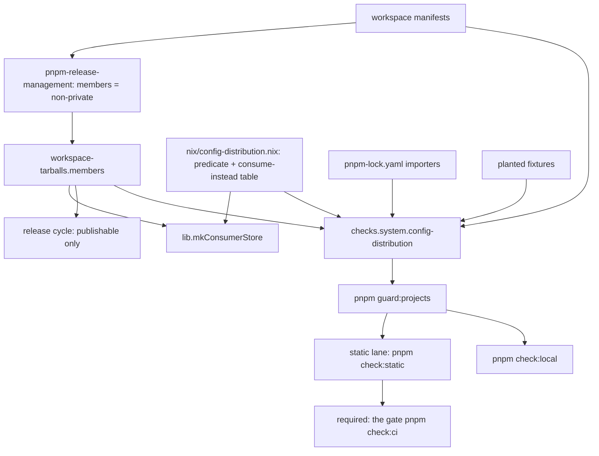

# Internal Tool Configs - Plan

## Goal Capsule

- **Objective:** No other repository can take a systemfsoftware tool configuration as a dependency from this monorepo, every plugin stays obtainable exactly as today, and a pull request that would start distributing a configuration fails the required check.
- **Means:** make the public configs private, refuse them in `lib.mkConsumerStore`, and add a flake check run by the required gate (KTD1, KTD3, KTD5).
- **Authority:** the conductor-owned config-ownership contract (Ryan, 2026-10-08) wins, then this plan's Product Contract, then its Planning Contract, then `CONSTITUTION.md` and `AGENTS.md`. Consumer repositories are not active scope.
- **Stop conditions:** stop and report if making a config private breaks a distributed package's install or build; if the required gate cannot evaluate the flake; if any unit would need a lint rule, test, or threshold weakened to go green.
- **Execution profile:** `ce-work`, delivered as a two-layer `gh stack` on trunk `main` (KTD7); no local mutation runs; no force-push.
- **Who finishes:** this session implements and runs `ce-code-review`; findings go to the conductor unapplied; the conductor rules and merges.

---

## Product Contract

### Summary

The five tool-configuration packages that are still public become private, so they drop out of the Nix workspace tarballs and the release cycle. A consumer store asked for any configuration refuses and either names what to consume instead or states that none ships. A check in the required PR job fails whenever a package named like a configuration is public, a private package is distributed, or a distributed package depends on a configuration.

### Problem Frame

The monorepo's internal tool configurations were packaged as Nix workspace tarballs (`workspace-tarballs`, selectable through `lib.mkConsumerStore`) and spread across the org. Each consuming repo then inherited lint, type, test, build and mutation policy it does not own, and every change here re-graded work elsewhere. Of the eight configuration packages, `vitest-config`, `tsdown-config` and `stryker-config` are already private, but `oxlint-config-recommended`, `oxlint-config-cell-architecture`, `oxlint-config-dmmf`, `oxlint-config-rule-authoring` and `tsconfig` are public: all five sit in `workspace-tarballs.members` today (42 members). Nothing stops the next configuration package from being published the same way.

### Requirements

**Distribution**

- R1. Every CONFIG package carries `"private": true`.
- R2. No CONFIG package is a member of `workspace-tarballs.members`; every other member present today stays a member, and the PR lists the member set before and after.
- R3. `lib.mkConsumerStore` called with a CONFIG attribute name fails as soon as the store is evaluated, with a message stating that configs are internal and naming the package(s) to consume instead, or stating that none ships.

**Release**

- R4. No CONFIG package is versioned for release, tagged, or given a GitHub Release from this change on.
- R5. A changeset records the internalization of the five formerly public CONFIG packages without releasing them.

**Recurrence guard**

- R6. A workspace package is CONFIG-shaped when its unscoped npm name contains `config` or `preset`; the rule is documented where agents and contributors read repository law.
- R7. A deterministic check fails when a CONFIG-shaped workspace package is not private, when any private package is in the distributed member set, or when a distributed member declares a runtime dependency on a CONFIG-shaped package.
- R8. The check runs inside the required job `build · lint · typecheck · test / the gate (pnpm check:ci)` on every PR, and in `pnpm check:local`.
- R9. The check is shown to fail: each R7 violation kind is planted and caught in the same run, and a sabotage commit on a throwaway branch that flips one configuration to public turns the required job red, with its run id recorded in the PR.

**Guidance**

- R10. Root `AGENTS.md` gains one rule line: configs are internal; only plugins are distributed; it names the R7 gate.
- R11. Root `README.md` stops listing the oxlint presets as distributed packages.

**Monorepo continuity**

- R12. Inside the monorepo every package keeps consuming the configs through the workspace; lint, typecheck, test and build are green on the PR head with evidence the suites ran.

### Key Decisions

- **CONFIG shape is a naming rule, not a manifest marker.** A name is already reviewed under `REPO-S5`, it follows the ecosystem's own convention for shareable configs (ESLint required the `eslint-config-` prefix through v8: https://eslint.org/docs/v8.x/extend/shareable-configs), and a mis-shaped name fails loudly. An opt-in manifest field is silently absent on exactly the next package nobody marked. Governs R6.
- **Five packages, not four.** `@systemfsoftware/tsconfig` is public (version 2.0.1, a `workspace-tarballs` member) and matches the contract's CONFIG definition, so it is internalized and recorded with the four oxlint presets. Governs R1, R5.
- **The changeset is a `none` intent, not a final release.** A bump would cut one more release artifact for a configuration, which R4 forbids. Governs R4, R5.
- **A configuration with no plugin says so.** `tsconfig`, `tsdown-config` and `oxlint-config-rule-authoring` turn on no plugin from this repo, so their refusal tells the consumer to own the configuration rather than inventing a substitute. Governs R3.
- **A distributed package may not depend on a configuration at runtime.** The contract counts "reachable by another repo as a dependency" as distribution, and such a dependency ships a tarball whose install fails in the consumer's repo. Governs R7.

### Acceptance Examples

- AE1. **Covers R3.** **Given** a consumer evaluates `lib.mkConsumerStore` with `packages = [ "oxlint-config-dmmf" ]`, **then** evaluation fails, says configs are internal, and names `oxlint-plugin-dmmf-workflow` and `oxlint-plugin-effect-schema`.
- AE2. **Covers R3.** **Given** `packages = [ "tsconfig" ]`, **then** evaluation fails, says configs are internal, and says no plugin ships for it.
- AE3. **Covers R2, R3.** **Given** the flake after U1, **then** the evaluated `workspace-tarballs.members` attribute list equals the list before U1 minus exactly the five formerly public configs (42 → 37), and `lib.mkConsumerStore` with `packages = [ "upstream-manifest" ]` still builds as it does today.
- AE4. **Covers R6, R7.** **Given** a PR adds a public `@systemfsoftware/eslint-config-strict`, **then** the required job fails naming that package.
- AE5. **Covers R6, R7.** **Given** a PR adds a public `@systemfsoftware/oxlint-plugin-foo`, **then** the check passes and the package is a distributed member.
- AE6. **Covers R7.** **Given** a distributed plugin adds `@systemfsoftware/oxlint-config-dmmf` to its `dependencies`, **then** the required job fails naming both packages.

### Scope Boundaries

- Consumer repositories and their migration to owned configs.
- Deleting existing tags, GitHub Releases or tarball artifacts already published for the five packages.
- Changes to `systemfsoftware/pnpm-release-management`, which owns `mkPnpmWorkspacePackages` and the release cycle.
- Renaming, moving or splitting the configuration packages, and editing their `publishConfig` (the contract bars package-visibility changes beyond `private`).
- Source reachability: this repository is public, so its files stay readable; "distributed" here means obtainable as a built dependency.
- Considered and not built: a guard against non-`none` changesets on CONFIG packages. The pinned release cycle only tags and releases publishable (non-private) members (`packages/github-release-engine/src/cycle.ts` in `pnpm-release-management` at `5eb4c5d`), so R1 already makes such an intent release nothing. Evidence that a private member was tagged would change this call.
- Considered and not built: a mandatory per-package distribution field on every workspace manifest. It closes the naming rule's false-negative gap but edits about fifty manifests and invents a taxonomy; the residual gap is recorded under Risks.

### Sources

- `flake.nix` (`lib.mkConsumerStore`, `workspaceOf`, `checks`, `sabotage`), `nix/consumer-store-check.nix`.
- `pnpm-release-management` at `5eb4c5d`: `nix/lib/pnpm-workspace-packages.nix` (members are the non-private workspace packages), `packages/github-release-engine/src/cycle.ts` (only publishable members are released).
- Required status check on `main` (ruleset): `build · lint · typecheck · test / the gate (pnpm check:ci)`, fed by the `static` lane running `pnpm check:static` → `pnpm gate:tasks` → `pnpm guard:projects` (`.github/workflows/ci.yml`, `.github/workflows/reusable-checks.yml`, `.github/actions/checks-lane/action.yml`).
- `.changeset/README.md` (`none` intents; a `@systemfsoftware/tsconfig` change re-hashes every dependent build).

---

## Planning Contract

### Key Technical Decisions

- KTD1. **One Nix module owns the CONFIG predicate and the refusal.** `nix/config-distribution.nix` holds the naming predicate over an unscoped attribute name, the per-config consume-instead table, and the refusal message; `flake.nix` imports it for `lib.mkConsumerStore` and, in layer 2, for the check. One predicate, one language, beside the distribution it governs. Governs R3, R6.
- KTD2. **The refusal is forced when the store value is evaluated.** Today an unknown name only throws once the tarball link farm is forced; the requested names are checked against the predicate before the store is constructed, so a consumer's evaluation fails at the call. The table maps each CONFIG attribute to the packages that replace it:

  | CONFIG attr                       | Consume instead                                                                                                                                                   |
  | --------------------------------- | ----------------------------------------------------------------------------------------------------------------------------------------------------------------- |
  | `oxlint-config-recommended`       | `oxlint-plugin-cell-architecture`, `oxlint-plugin-dmmf-workflow`, `oxlint-plugin-effect-platform`, `oxlint-plugin-effect-schema`, `oxlint-plugin-test-discipline` |
  | `oxlint-config-cell-architecture` | `oxlint-plugin-cell-architecture`                                                                                                                                 |
  | `oxlint-config-dmmf`              | `oxlint-plugin-dmmf-workflow`, `oxlint-plugin-effect-schema`                                                                                                      |
  | `oxlint-config-rule-authoring`    | none (oxlint built-in plugins only)                                                                                                                               |
  | `vitest-config`                   | `@systemfsoftware/vitest` (guard exports)                                                                                                                         |
  | `stryker-config`                  | `@systemfsoftware/stryker-js` (engine; published outside this workspace)                                                                                          |
  | `tsconfig`                        | none                                                                                                                                                              |
  | `tsdown-config`                   | none                                                                                                                                                              |

  Each oxlint row lists the oxlint plugins reachable through that preset's `dependencies`, following its config dependencies transitively, because those configs become private under U1 and KTD3 admits only distributed members or packages outside the workspace in a row; the vitest and stryker rows come from the contract. A name the predicate matches but the table lacks still refuses, with the no-plugin wording. Governs R3.
- KTD3. **The guard is a flake check, `checks.<system>.config-distribution`, judged from two independent sources.** Workspace packages are enumerated from the `importers` keys of `pnpm-lock.yaml`, which is pnpm's own answer and is held fresh by `pnpm install --frozen-lockfile`; the distributed set is the real `workspace-tarballs.members` output of `pnpm-release-management`. The lockfile is a two-document YAML stream whose first document is pnpm's env lockfile with a lone `.` importer, so the read takes the `importers` block of the second document, accepts both the nested-mapping key form and the inline `<dir>: {}` form (`omp/plugins/omp-typescript-discipline` uses it), and drops the root `.` key. The read is a pure-Nix line scan, never an import-from-derivation, because `nix.yml` evaluates the flake for two systems; precedents are the pinned `nix/lib/pnpm-lock.nix` and `mainLockfileDocument` in `scripts/guards/check-changeset.ts`. Enumerating from the distributor's own member list would let the subject grade itself on (a), and re-implementing its glob expansion would be a second copy of the same logic rather than an independent view. The check fails closed: an empty importer list, or a distributed member absent from the importers, is a violation. It also requires every CONFIG-shaped package to have a KTD2 table row and every row to name only distributed members or packages outside the workspace. Rejected: a new Deno guard under `scripts/guards/`, which would need the predicate in a second language and is the new one-off script the contract rules out. Governs R6, R7.
- KTD4. **The check proves it can fail in the same evaluation.** One planted fixture per R7 violation kind (a public CONFIG-shaped manifest, a private manifest in the member set, a member with a runtime dependency on a config) is passed through the same violations function, and the check fails if any fixture yields no violation. This is the guards' `--selftest` shape and satisfies `CHK1`. Governs R9.
- KTD5. **`pnpm guard:projects` builds the check.** That script already runs first in `pnpm gate:tasks`, so it executes in the `static` lane of the required gate and in `pnpm check:local`; both environments already require Nix (the lane installs it, and `bin/dprint` exits without it). It is a root script, not a turbo task, so no cached green can stand in for a run. Governs R8.
- KTD6. **Two `none` intents.** One names the five formerly public configs and states, for a consumer, that they are no longer distributed and what to consume instead (KTD2). The other names every publishable package the changeset guard reports as re-hashed, which the `tsconfig` manifest edit is expected to cause through every dependent's `build` task (`.changeset/README.md`; precedent `docs/plans/2026-09-23-1830-fix-drop-strict-effect-provide-plan.md`). Governs R4, R5.
- KTD7. **Two stacked layers, the evaluator in its own.** Layer 1 (this branch, `chore/own-configs`) carries U1–U4 and this plan. Layer 2 carries U5 in its own commit, then U6. The check is observed red at layer 1's parent, where five configs are public, and green at layer 2's head; the sabotage run (U5) shows the required job red. The same session builds the gate that grades layer 1, which `CONST-E9` forbids. Both PR bodies declare that breach under `CONST-W3`: the operator commissioned the change on 2026-10-08, and the conductor verifies the gate independently through the sabotage run and an independent review. Governs R8, R9.

### High-Level Technical Design

`CS` refuses a CONFIG-shaped name before touching `T` (KTD2). `C` reads `LF` and `M` for violation (a), `T` and `M` for (b) and (c), and `FX` for its own failure proof (KTD3, KTD4).

### Assumptions

- The pinned `pnpm-release-management` keeps excluding private packages from both `workspace-tarballs` and the release cycle; the check's (b) branch and the fixtures catch a change to the first.
- No distributed package declares a runtime dependency on a config today; the only config-to-config edges are `oxlint-config-recommended` → `oxlint-config-cell-architecture` and `oxlint-config-dmmf`, both of which become private together.

### Risks

| Risk                                                                                                                                    | Mitigation                                                                                                                             |
| --------------------------------------------------------------------------------------------------------------------------------------- | -------------------------------------------------------------------------------------------------------------------------------------- |
| A future config named without `config` or `preset` passes the check                                                                     | `REPO-S6` (U6) makes the naming rule repository law checked in review; the mandatory-field alternative is recorded in Scope Boundaries |
| A library whose name contains `config` (for example an Effect `Config` provider) is forced private                                      | The check fails loudly naming it; the only remedy is renaming the package. There is no exemption list in the Nix module                |
| The importer read takes the wrong lockfile document or misses an entry form, or a pnpm lockfile format change breaks it                 | KTD3 names the document and both key forms, and fails closed on an empty list or a missing member                                      |
| The `tsconfig` manifest edit re-hashes most of the workspace                                                                            | KTD6's second intent; the changeset guard names the set                                                                                |
| A `workflow_dispatch` run on the throwaway branch does not produce the required job, since the conflict check reads pull-request fields | Fall back to a draft PR from the throwaway branch, closed after the run id is recorded                                                 |
| Consumer repos pinned to an older flake revision fail at evaluation once they update                                                    | Intended by the contract; other sessions migrate consumers                                                                             |

### Sequencing

U1 → U2 → U3 → U4 form layer 1 and must be green on their own. U5 → U6 form layer 2 on top. Layer 2 lands nothing that weakens layer 1. Layer 1 merges only after layer 2 is green and verified; the conductor merges both in the same window, layer 1 first.

---

## Implementation Units

### U1. Make the public configs private

- **Goal:** the five public CONFIG packages leave the distributed set.
- **Requirements:** R1, R2.
- **Dependencies:** none.
- **Files:** `packages/oxlint-presets/oxlint-config-recommended/package.json`, `packages/oxlint-presets/oxlint-config-cell-architecture/package.json`, `packages/oxlint-presets/oxlint-config-dmmf/package.json`, `packages/oxlint-presets/oxlint-config-rule-authoring/package.json`, `packages/toolchain/tsconfig/package.json`.
- **Approach:** add `"private": true` beside `name` as the three already-private configs carry it; touch nothing else in the manifests (Scope Boundaries).
- **Test expectation:** none -- manifest flag; U5's check and the member-set diff are the proof.
- **Verification:** the evaluated `workspace-tarballs.members` drops from 42 to 37 attributes, and the difference is exactly the five configs.

### U2. Refuse configs in the consumer store

- **Goal:** a consumer asking for a config fails at evaluation and learns what to consume instead.
- **Requirements:** R3; AE1, AE2, AE3.
- **Dependencies:** U1.
- **Files:** `nix/config-distribution.nix` (new), `flake.nix`.
- **Approach:**
  1. Author the predicate, the KTD2 table and the refusal message in `nix/config-distribution.nix` (KTD1).
  2. In `lib.mkConsumerStore`, check every requested name against the predicate before the store is built (KTD2); the existing "no public workspace package" throw stays for names that are neither configs nor members.
- **Patterns to follow:** the `callPackage`-imported modules under `nix/`; the existing throw wording in `lib.mkConsumerStore`.
- **Test expectation:** none -- the refusal message is a string the plan authors, and pinning it would be a self-asserted fixture (`CHK1`); U5's check covers the predicate and the table.
- **Verification:** evaluating `lib.mkConsumerStore` for each of the eight CONFIG attributes fails with the configs-are-internal message and the KTD2 row; `nix build` of `checks.<system>.consumer-store` (`upstream-manifest`) still succeeds; `sabotage.<system>.consumer-store-wrong-integrity` still fails.

### U3. Record the change in changesets

- **Goal:** the internalization is recorded and nothing is released for it.
- **Requirements:** R4, R5.
- **Dependencies:** U1.
- **Files:** two new `.changeset/*.md` intents.
- **Approach:** author both KTD6 intents; derive the second intent's package list from the changeset guard's report against the base commit, not by hand.
- **Patterns to follow:** `.changeset/clean-tools-sip.md` (`none` frontmatter and consumer-facing body); `skill://author-changesets` for the first body.
- **Test expectation:** none -- release metadata; the changeset guard is the proof.
- **Verification:** the PR's `changeset · shared tooling` check (`.github/workflows/changeset-check.yml`, which runs the pinned `pnpm-release-management` changeset gate) passes; `scripts/guards/check-changeset.ts` is wired to no workflow or root script and decides nothing.

### U4. Stop advertising the presets

- **Goal:** the root README lists only distributed packages.
- **Requirements:** R11.
- **Dependencies:** U1.
- **Files:** `README.md`.
- **Approach:** drop the four preset rows from "Oxlint Static Plugins & Presets", retitle the section for plugins, and add one sentence that the presets and toolchain configs are internal to this monorepo. `packages/toolchain/tsconfig/README.md` already scopes itself to the monorepo and stays unchanged.
- **Test expectation:** none -- documentation.
- **Verification:** `./bin/dprint check` passes and no README row names a CONFIG package.

### U5. Add the config-distribution check

- **Goal:** distributing a config fails the required PR job.
- **Requirements:** R6, R7, R8, R9; AE4, AE5, AE6.
- **Dependencies:** U1, U2 (layer 2, own commit per KTD7).
- **Files:** `nix/config-distribution.nix`, `flake.nix`, `package.json` (`guard:projects`).
- **Approach:**
  1. Add a pure violations function over plain data (packages with name, private flag and runtime dependencies; distributed attributes) covering R7's three kinds plus KTD3's fail-closed and table-completeness conditions.
  2. Expose `checks.<system>.config-distribution`, feeding it the lockfile importers, their manifests and the real `workspace-tarballs.members` (KTD3) and the planted fixtures (KTD4); the derivation is trivial, and evaluation throws listing every violation.
  3. Append the check's build to `guard:projects` (KTD5).
  4. Observe it red at layer 1's parent and green at layer 2's head; then push a throwaway branch that flips `packages/toolchain/vitest-config/package.json` to `"private": false`, run CI on it, and record the run id and the guard's failure line for the PR body.
- **Execution note:** run the check against layer 1's parent before writing the planted fixtures, so its first red comes from real data: in a throwaway `git worktree` at layer 1's parent, check out `nix/config-distribution.nix`, `flake.nix` and `package.json` from the U5 commit, build `checks.<system>.config-distribution`, record its failure line, and remove the worktree.
- **Patterns to follow:** the `checks` and `sabotage` attrsets in `flake.nix`; the `--selftest`-then-run loop in `guard:projects`.
- **Test scenarios:**
  - Covers AE4. A planted public manifest named `@fixture/eslint-config-x` yields a violation naming it.
  - A planted public manifest named `@fixture/tsconfig` yields a violation, so a name carrying `config` with no hyphenated prefix is caught.
  - Covers AE5. A planted public manifest named `@fixture/oxlint-plugin-x` yields no violation.
  - A planted private manifest whose attribute is in the distributed set yields a violation naming it.
  - Covers AE6. A planted distributed manifest with `dependencies` on `@fixture/oxlint-config-x` yields a violation naming both; the same edge under `devDependencies` yields none.
  - An empty importer list yields the fail-closed violation.
  - A CONFIG-shaped package with no consume-instead row yields a violation naming it.
- **Verification:** at layer 1's parent the check fails naming exactly the five public configs; at layer 2's head it passes; the sabotage run's required job is red with the guard's message for `vitest-config`.

### U6. State the rule in agent guidance

- **Goal:** agents and contributors read that configs are internal and only plugins are distributed.
- **Requirements:** R10, R6.
- **Dependencies:** U5 (layer 2, commit after U5).
- **Files:** `AGENTS.md`.
- **Approach:** add one `REPO-S6` row to "Rules — Must Hold At Done": a package whose unscoped name contains `config` or `preset` is a tool config, stays `private`, and is never distributed; only plugins (rules, guards, engines) leave the repository. Its gate column names `pnpm guard:projects` (`checks.<system>.config-distribution`). `AGENTS.md` is doctrine and is not an input to the check.
- **Test expectation:** none -- doctrine.
- **Verification:** `./bin/dprint check` passes.

---

## Verification Contract

| Gate                                                                                                                                                                                                                              | Proves                                            | When                              |
| --------------------------------------------------------------------------------------------------------------------------------------------------------------------------------------------------------------------------------- | ------------------------------------------------- | --------------------------------- |
| `pnpm check:local` exits 0                                                                                                                                                                                                        | R12 locally, and R8 once U5 lands                 | after the last edit of each layer |
| `nix eval` of `packages.x86_64-linux.workspace-tarballs.members` mapped to `attr`, before and after                                                                                                                               | R2, AE3; the before/after lists go in the PR body | U1                                |
| `jq .private` on the eight CONFIG manifests reads `true` for each, and the config-distribution check finds no public CONFIG-shaped package                                                                                        | R1                                                | U1, U5                            |
| Evaluating `lib.mkConsumerStore` for the eight CONFIG attributes and for `upstream-manifest`                                                                                                                                      | R3, AE1–AE3 (throwaway command, not committed)    | U2                                |
| `nix build .#checks.<system>.consumer-store`, and the existing sabotage still failing                                                                                                                                             | AE3; the integrity proof still holds              | U2                                |
| The PR's `changeset · shared tooling` check passes with only `none` intents naming the configs; the pinned release cycle tags and releases only non-private members                                                               | R4, R5                                            | U3                                |
| `nix build .#checks.<system>.config-distribution`: red at layer 1's parent, green at layer 2's head; its planted `@fixture/eslint-config-x`, `@fixture/tsconfig` and `@fixture/oxlint-plugin-x` fixtures exercise the naming rule | R6, R7, R9                                        | U5                                |
| `./bin/dprint check`, and the diff of `AGENTS.md` adds the `REPO-S6` row                                                                                                                                                          | R10                                               | U6                                |
| `./bin/dprint check`, and no root `README.md` row names a CONFIG package                                                                                                                                                          | R11                                               | U4                                |
| Required gate green on each layer's head SHA; the static lane log shows the check ran, and turbo's task summaries show lint, typecheck, test and build tasks executed, with the test jobs' vitest counts                          | R8, R12                                           | each push                         |
| Sabotage run on the throwaway branch: required job red with the guard's message                                                                                                                                                   | R9                                                | U5                                |

Test admission (`skill://test-layer-selection`, default refuse): admitted are the U5 planted fixtures only, a pure decision's refusal boundaries checked in the gate itself. Refused: a test pinning the refusal message (self-asserted string, `CHK1`), a test listing the member set (manifest listing, `OP12`), and unit tests for `lib.mkConsumerStore` wiring. No mutation run is started locally (`REPO-D3`).

---

## Definition of Done

- R1–R12 hold on layer 2's head, each shown by its Verification Contract row.
- Both layers are green on the required gate, and each head SHA is reported to the conductor.
- The PR bodies list the distributed member set before (42) and after (37), the sabotage run id, the `CONST-W3` declaration of KTD7, and the U5 red-then-green evidence. Nothing names a private repository or its identifiers (paths, PRs, run ids); this repository's own sabotage run id must appear.
- `ce-code-review` has run and its findings are reported to the conductor unapplied.
- No throwaway command, sabotage commit or experimental code remains on either layer; the throwaway branch's remote is deleted once its run id is recorded.
