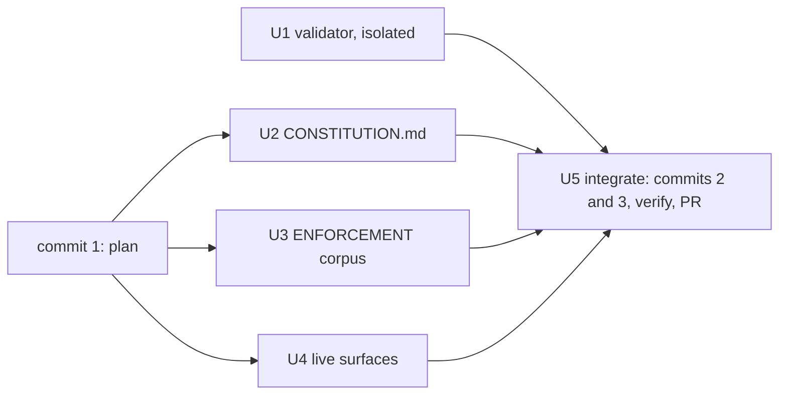

# Constitution Rewrite - Inner-Loop Laws, Outer-Loop Enforcement - Plan

## Goal Capsule

- **Objective:** A coding agent that vendors the constitution carries only what it can act on while it works: 17 laws, at most 1,800 words, each one a sentence, its harm, and a wrong/right pair from a real public incident. Whoever grades its work finds every check, mechanism, severity, waiver and judging rule in `ENFORCEMENT.md`, keyed to those laws. Every id a reader has ever cited resolves to its new home, by machine in the corpus and by table in this plan.
- **Means:** Rewrite `CONSTITUTION.md` to Appendix A (KTD7). Give `ENFORCEMENT.md` a per-law corpus with lineage (KTD1-KTD4). Have a separate instrument owner extend the validator (KTD5). Migrate the live surfaces in this repo (KTD9).
- **Authority:** Conductor brief c05, rulings c06, steer c07 (the overfit gate) and rulings c08 and c09 (strict failure incidents, the termination rule) settle every product question. `CONSTITUTION.md` governs what a law means; `ENFORCEMENT.md` governs how an instrument is changed; `AGENTS.md` governs commit, verification and surface-class discipline. `AGENTS.md`, `CONSTITUTION.md` and `README.md` are human-controlled: the conductor takes their full text to the owner, and nothing merges without that approval.
- **Execution profile:** One branch, `refactor/constitution-rewrite`, cut from `origin/main` and published as a single-layer `gh stack`, opened as one PR with three commits in order: the plan, the validator, then the corpus and its surfaces (KTD5, KTD10).
- **Stop conditions:**
  - Stop if `wc -w CONSTITUTION.md` exceeds 1,800.
  - Stop if any law's example cannot be traced to its Appendix E source.
  - Stop if any law has fewer than two independent incidents in Appendix E (R21).
  - Stop before committing any `CONSTITUTION.md` text if gate 1, 2 or 3 (R21-R23) has not run on that exact law text, or if the conductor has not ruled on every gate 3 flag.
  - Stop if the new validator passes on the `origin/main` tree.
  - Stop if any scratch violation in the Verification Contract exits 0.
  - Stop if `--against origin/main` reports an unaccounted id.
  - Stop if the validator owner's run had the law text in its context.
  - If commit signing fails, report the exact error and leave the git config alone.
  - Never use `--no-verify`, never force-push, never run mutation or Stryker locally.
- **Who finishes:** The maker (`ce-work`) does U2-U5. The instrument owner, a fresh-context subagent, does U1. The parent agent integrates and verifies (U5) and opens the PR. The conductor takes the text to the owner and merges.

---

## Product Contract

Product Contract preservation: changed R1, R5, R6, R7, R8, R9, R10, R12, R13, R15, R17, R18 and R20; added R19-R25. Each change applies a c06 ruling, the c07 overfit gate, or the c08 and c09 rulings; no requirement was dropped.

### Summary

Rewrite `CONSTITUTION.md` as 17 inner-loop laws in four sections (Model the domain, Shape the code, Prove it, Finish) under a one-line preamble. Each law has exactly four fields: `id`, `law`, `why`, and `example: {wrong, right}`. `ENFORCEMENT.md` keeps its doctrine and gains a versioned corpus:

- a law-keyed entry per law: a stable obligation handle, an `absorbs:` list, check questions with criteria, mechanism rungs, severity and waiver;
- three judging rules, G3, G4 and G5, which keep their ids.

A fresh-context instrument owner extends the validator to the new shape and to lineage-by-handle. The human-readable id mapping stays in this plan (Appendix B).

### Problem Frame

The maker reads `CONSTITUTION.md` in its context window on every turn (`AGENTS.md:5` `@`-imports it). At 693a6d7 the file is 4,054 words (`wc -w`). All 36 rules carry `gate:` and `check:`, and only 8 carry an `example:` (D4, P2, B2, B3, B6, B5, P3, S4). The maker cannot run a `check:`. Each one is an instruction to lint, review or mutation, read by an agent that executes none of them. That text is also where the contradictions live: CR-1 (T12's check against N2's check) set one check against another, not one law against another, and it took PR #27 to patch.

Ids churn. T4 and T11 were vacated (#26, #25). The consumer cites 11 ids that no longer exist on `main` (Appendix B2), and 31 of those citing lines are `CONST-E4` alone.

`ENFORCEMENT.md` already declares itself the outer-loop home ("Never `@`-import this file into a maker's context", `ENFORCEMENT.md:3`), so the split has somewhere to go.

### Key Decisions

- **Two audiences, nothing duplicated.** `CONSTITUTION.md` is the inner loop. Constraints, sampling, audit and verdict live in `ENFORCEMENT.md`. (session-settled: user-directed, brief c05 - chosen over keeping `gate`/`check` inline, which is context noise to an agent that cannot run it and is where CR-1 lived.)
- **Four fields per law: `id`, `law`, `why`, `example: {wrong, right}`.** No `gate`, `check`, severity, waiver or tool name. (session-settled: user-directed, c05 and c06 OQ7 - chosen over flat `wrong`/`right` keys, because "exactly four keys" is then literally checkable.)
- **The merge map is the brief's, with c06's folds.** Merged into one law each:
  - B1+B2+B3+B6+P1+P2, D1+B5, N1+N2, T8+T15+T9+T14, T3+T13, E7+E9 (c08 removes W3 and W2 from E7 and S2);
  - D3, W2 and W3 are retired: under c08's strict gate 1 none has two failure incidents behind its clause. P3, retired under c08, is absorbed by T12 under c09: T12's new wording ("never from its name or location") carries P3's "never by folder", and its second incident is P3's purity rule keyed on a filename;
  - under c09, T14 is retired as a law by ruling, and P1, B5 and T9 are cut by the termination rule (gate 3 still flagged them). Each one's guidance becomes a technique in its host's ENFORCEMENT entry, and its id is absorbed there (Appendix E).

  Kept: B4, D2, D4, N3, T10, T12, S1, S3, S4, W1. G3, G4 and G5 become ENFORCEMENT judging rules. (session-settled: user-directed, c05 and c06 OQ4.)
- **17 laws.** The binding limit is the word budget, not the count; c09's termination rule prefers fewer, well-evidenced laws. (session-settled: user-directed, c06 OQ5 and c09.)
- **A law whose obligation survives keeps its id, even when merged.** It takes the lowest surviving id. (session-settled: user-directed, c05 - chosen over today's rule that a changed obligation vacates the number, `CONCEPTS.md:11`, which would vacate every merged id.)
- **Lineage is machine-checked in ENFORCEMENT; the prose table lives in this plan.** Each law-keyed entry carries a stable obligation `handle` and an `absorbs:` list, and `--against` checks lineage through them. (session-settled: user-directed, c06 OQ2.)
- **Two kinds of ENFORCEMENT entry.** A law-keyed entry must name a live law. Judging rules G3, G4 and G5 keep their ids and are exempt from that check. (session-settled: user-directed, c06 OQ3.)
- **T12 keeps its id; its handle is TEST-OBLIGATION.** (session-settled: user-directed, c06 OQ6.)
- **The validator change is written by a fresh-context subagent that never saw the law drafts.** It lands as its own commit in this PR, shown failing on the old corpus and passing on the new, with both owners named in the PR body. CONST-E9 holds; there is no declared breach. (session-settled: user-directed, c06 OQ1.)
- **Every example comes from public history: this repo or public systemfsoftware repos.** A law with no public incident does not stand alone. (session-settled: user-directed, c06 OQ8.)
- **A law stands only on two independent failure incidents.** A failure is code or a PR that broke the law, a revert, a failing command, or a review that rejected the violation; plan or review prose counts only where it names a concrete code location at a SHA. Independent means a different PR or commit. No single document or PR supplies incidents for more than two laws. A fixed incident is anchored at the fix's parent, with the fix hunk. (session-settled: user-directed, c07, c08 and c09.) c09 is the last redraft round: a law still flagged by gate 3 under (a), (c) or (d), or left with fewer than two qualifying failures, is cut from `CONSTITUTION.md`; its guidance becomes an ENFORCEMENT technique and its id is absorbed. Appendix E records each law's pair and each cut.
- **The rewrite claims structure, not better agents.** Nothing here measures behaviour. A held-out evaluation (old against new constitution on unseen tasks) does not exist yet; it belongs to the replay evaluator, which can ablate one law at a time using each entry's `incidents:` (R25). (session-settled: user-directed, c07.)
- **Live surfaces migrate; dated `docs/plans` keep old ids as records.** (session-settled: user-directed, c06 OQ9.)
- **`AGENTS.md` "Writing a Rule" and "Changing a Rule" change in this PR.** The family registry keeps G, now for the judging rules. (session-settled: user-directed, c06 OQ10.)
- **The consumer migration is a later PR in the consumer repo.** This PR only produces the mapping. (session-settled: user-directed, c05.)

### Requirements

**The resident law**

- R1. `CONSTITUTION.md` is the Appendix A text: 17 laws in four sections ordered by when the agent needs them (Model the domain, Shape the code, Prove it, Finish).
- R2. Every law has exactly `id`, `law` (one sentence addressed to "you"), `why` (the harm), and `example` with exactly `wrong` and `right`, all strings.
- R3. A one-line preamble says to read every law by its purpose.
- R4. No `gate`, `check`, severity, waiver or tool name appears in the file.
- R5. The whole file is at most 1,800 words by `wc -w`, and the PR body reports the number. Appendix A measures 1,273.
- R6. No private repository is named anywhere in the change. Every example comes from this repo's or a public systemfsoftware repo's history, with its source cited in Appendix E.
- R20. A law carries only clauses with two failure incidents behind them (R21). Under c08 that removes D3's branding duty from CONST-D1, P3's "never by folder", T8's forwarding-helper clause, W2's challenge duty from CONST-S2 and W3's declaration duty from CONST-E7. Under c09, CONST-D1 drops "free of casts" (casts were B5's), CONST-T8 drops "test a pure decision directly" and its mock clause (one qualifying failure), and CONST-B1 is only "effects at the edges, as values". T12's c09 sentence carries P3's "never by folder" again, now with two failures.

**The overfit gate (c07)** - gates 1-3 run, and are recorded, on the exact law text before any `CONSTITUTION.md` text is committed. Any later change to a `law` or `why` sentence re-runs them.

- R21. Gate 1 (c08, strict): every law, and every clause of it, has at least two independent FAILURE incidents: code or a PR that broke it, a revert, or a review that rejected the violation. A later doc, plan or amendment that applies the law is not an incident; it may only point to one. Two incidents of one law come from different PRs or commits, not two symptoms of one change. Each ref is a commit SHA plus `path:line` at that commit, where `git show <sha>:<path>` prints the violating code or the review text. Appendix E lists them. A law left with fewer than two is merged into a neighbour or cut; a clause left with fewer than two is removed.
- R22. Gate 2: no `law` or `why` sentence names a package, file, path, tool, CLI, suffix, framework or date. The example may. The two greps in the Verification Contract (Gate 2 rows) run over the extracted sentences and their output is recorded.
- R23. Gate 3: a fresh-context reviewer from a different model family sees only the law sentences, their `why` lines and the Appendix E refs. Per law, evidence first, it judges (a) wording broader than its incidents, (b) redundancy, (c) truth and use on an unrelated Effect-TS codebase, (d) tool or mechanism dressed as law. Every flag goes to the conductor unresolved; the conductor's ruling precedes the corpus commit. The model that actually ran is recorded.
- R24. The PR body makes no claim that the rewrite improves agent behaviour. It may claim no internal contradictions (the validator), no inner-loop noise (no `gate`/`check` fields), the word budget, and full id lineage. It states that a behavioural held-out evaluation does not exist yet and is the replay evaluator's job.
- R25. Each law-keyed ENFORCEMENT entry carries `incidents:`, the Appendix E refs that justify the law, so a replay evaluator can remove one law, re-score, and cut laws that move nothing.

**The outer loop**

- R7. `ENFORCEMENT.md` keeps its current doctrine text and gains a versioned corpus. Each law has exactly one law-keyed entry carrying:
  - its handle and `absorbs:` list (Appendix C);
  - check questions with explicit criteria;
  - its mechanism rungs (type, command, refusal, review);
  - its severity and waiver rule;
  - its `incidents:` (R25).

  The corpus also carries one `retired:` list: each id whose obligation was removed, with its reason (D3, W2, W3 under c08).
- R8. G3 (P0-VERDICT), G4 (PURPOSE-READING) and G5 (SUPREMACY) are judging rules in the corpus. They keep their ids and carry their current obligations. Where G3 says "declared under CONST-W3" today, it says "declared in the change itself, naming the law and the case": the waiver stays a reviewer-side rule, while the maker-side declaration duty is retired with W3 (R20).
- R9. Every clause of an absorbed or kept rule's `do`, `dont`, `check` and `scope` that is not in the new law text lands in that law's entry criteria:
  - P1's one path by exhaustive match, and P2's complexity-1 measure, go to B1 as a technique (c09);
  - B5's decode, never cast goes to D1 as a technique (c09);
  - T9's pin-before-delete, T14's property scope and generators, and the mock guidance go to T8 as techniques (c09);
  - T15's investment order goes to T8;
  - T3's mutation gate and T13's test-set verdict go to T3;
  - N2's allowed-suffix convention goes to N1;
  - B6's ordering-by-types goes to B1 as a technique, applied where one description carries the interaction;
  - S4's merge-base delta and T12's behavioural-requirement scope come from PR #27 (KTD11).

  Clauses of D3, W2 and W3 are not carried: those ids are retired (R20, Appendix B). P3's clauses go to T12's entry (c09).

**Ids and mapping**

- R10. Every current id and every id the consumer cites maps to a law, a judging rule, an ENFORCEMENT doctrine section, or "retired: obligation removed" with a reason (Appendix B).
- R11. The mapping lists every consumer citation outside `repos/` at consumer `origin/main` 3ab8edca, with its new target (Appendices B and D).

**The validator**

- R12. `deno task test` fails when any of these holds:
  - a law lacks exactly the four fields, or `example` lacks exactly `wrong` and `right`;
  - `CONSTITUTION.md` exceeds 1,800 words;
  - a law has zero or more than one law-keyed entry;
  - a law-keyed entry names no live law;
  - handles are not unique across the corpus;
  - an id appears more than once across live laws, `absorbs:` lists and the `retired:` list, or a `retired:` item lacks a reason;
  - a citation in either file resolves to neither a law, a judging rule, nor an absorbed id (a retired id is not a valid citation);
  - a law-keyed entry carries fewer than two `incidents:` (c08, OQ11).
  
  It keeps the coverage-before-schema check and the unmeasurable exit (3).
- R13. `deno task test --against <rev>` accounts for every id present at `<rev>` as live, absorbed, judging or retired. Where `<rev>` carries handles, it fails on an id whose handle changed and on an absorbed or retired id that returns as live. Where `<rev>` has no handles (`origin/main` today), its success line says the comparison was accounting-only.
- R14. The extended validator passes on the PR head. It fails on each scratch violation V1-V12 (Verification Contract) and on the `origin/main` tree. Every run is executed locally by the parent and recorded.
- R15. U1's owner writes the validator change without the law text in its context and lands it as its own commit. The PR body names both owners.

**Repo surfaces**

- R16. `README.md` matches the new shape: the badge count, the "all 36 rules" sentence, the Articles table (it becomes the four sections), and the Machine Validation excerpt and description.
- R17. Live in-repo text follows the mapping and the new schema:
  - `ENFORCEMENT.md:25` (CONST-E9 becomes CONST-E7);
  - `docs/solutions/architecture-patterns/a-test-never-takes-its-expected-value-from-the-code-under-test.md:27-29,40` (T10's quoted `dont` line, and E9);
  - `CONCEPTS.md:8,11,21` (Constitution corpus, Rule, Corpus gate);
  - `AGENTS.md:28,34` and its "Changing a Rule", "Minting an ID" G row, and `deno task test` comment lines.
- R18. The PR body's first line states that `AGENTS.md`, `CONSTITUTION.md` and `README.md` are human-controlled and need the owner's approval of the final text before merge. The body notes that PR #27's commits bypassed the hooks (no `core.hooksPath` in that worktree). Its claims obey R24.
- R19. Dated `docs/plans` files are not edited.

### Acceptance Examples

- AE1. An agent that `@`-imports `CONSTITUTION.md` reads 17 laws and no `gate`, `check` or severity text (R1-R4).
- AE2. A reviewer grading a change against CONST-T12 finds its criteria in the CONST-T12 entry of `ENFORCEMENT.md`, under handle TEST-OBLIGATION (R7).
- AE3. A consumer plan citing CONST-E4 resolves through Appendix B2 to CONST-E7, and a consumer file citing CONST-P2 resolves to CONST-B1 through Appendix B1 and through CONST-B1's `absorbs:`; a file citing CONST-D3 finds it retired, with the reason, in Appendix B1 and in the corpus's retired list (R10, R13).
- AE4. A later amendment that renames CONST-T12's handle fails `deno task test --against <that rev>` (R13).
- AE5. Deleting CONST-B4's ENFORCEMENT entry fails `deno task test` (R12).

### Scope Boundaries

- No consumer edits; the consumer migration is a later PR there.
- The PR #27 branch (`fix/t12-n2-suffix-conflict`) is untouched. #27 closes unmerged once this PR opens; its useful content lives on here, in the CONST-T12 and CONST-S4 ENFORCEMENT criteria (KTD11).
- No new families; G stays registered for the judging rules.
- None of these count as done: renaming fields while the checks stay inline; dropping a law with no mapping; invented examples; a plan in place of the rewrite; a gate wired but turned off.

### Outstanding Questions

None. c06 resolved OQ1-OQ10, and c08 resolved OQ11: the validator checks that every law-keyed entry has at least two `incidents:` (R12), written by U1's owner in its own commit; the owner's sign-off on the governed files covers the new check.

### Sources

- `CONSTITUTION.md` at 693a6d7: 36 rules; 36 `gate:` and 36 `check:` fields; 8 `example:` fields; 4,054 words.
- `ENFORCEMENT.md:3,7-12,17,19,23-25`; `AGENTS.md:5,28,34`; `CONCEPTS.md:8,11,21`; `README.md:5,39,43-54,58-82`.
- `scripts/validate-constitution.ts:1,39-44,60-67,247-253`; `deno.json:5`; `.husky/pre-commit:1` (`deno task test` on the working tree).
- `docs/plans/2026-09-07-1721-the-maker-never-holds-the-instrument-plan.md:29-31,111-114` (the 26a527c same-commit gate flip, and its repair).
- Consumer `systemfsoftware/systemfsoftware` (public) at `origin/main` 3ab8edca: `git grep -nE 'CONST-[A-Z][0-9]+' origin/main -- . ':!repos/'` finds 208 citing lines across 45 ids; summed per id (Appendix B), 274, because a line that cites two ids counts once for each. The public repos `stryker-js-effect`, `are-the-types-wrong-effect` and `effect-endgame-starter-kit` were searched for N3 incidents and hold none outside vendored copies.

---

## Planning Contract

### Key Technical Decisions

- **KTD1. The ENFORCEMENT corpus is one fenced YAML block under a new final `## Corpus` heading.** The block is a map:
  ```yaml
  version: 1
  laws:
    - law: CONST-T12
      handle: TEST-OBLIGATION
      absorbs: []
      checks:
        - question: ...
          criteria: ...
      mechanism: [command]
      severity: P0
      waiver: ...
      incidents:
        - consumer docs/solutions/...:27 (2d4c724f #519)
        - this repo f843304
  judging:
    - id: CONST-G3
      handle: P0-VERDICT
      rule: ...
  ```
  - `mechanism` values come from the ENFORCEMENT ladder: `type`, `command`, `refusal`, `review`. Old `lint` and `mutation` gates become `command`, and old `type-checker` becomes `type`. Appendix C gives each law's rungs.
  - The doctrine sections above the corpus stay byte-identical except line 25.

  `incidents:` lists the Appendix E refs as plain strings, source first. Governs R7, R8, R25.
- **KTD2. Severity is P0 for every law, and the waiver is a declaration in the change.** G3 grades every undeclared violation P0, so each entry states `severity: P0`. Each `waiver` names CONST-E7's declaration: the breach and the case, stated in the change itself. A per-law severity scale would contradict G3. Governs R7, R8.
- **KTD3. Handles are UPPER-KEBAB, unique across laws and judging rules, and frozen once landed (Appendix C).** A handle names the obligation, not the wording, so a reworded law keeps its handle. A changed obligation needs a new id. Governs R7, R13.
- **KTD4. Lineage semantics for `--against <rev>`.**
  1. Collect the ids at `<rev>`: rule or law blocks in `CONSTITUTION.md`, plus law-keyed and judging entries in `ENFORCEMENT.md` when present.
  2. Each one must be live (a law or a judging rule) or appear in exactly one `absorbs:` list. Otherwise: `FAIL unaccounted id`.
  3. When `<rev>` has a corpus, a live id whose handle differs fails as `reassigned`, and an id absorbed at `<rev>` that is live now fails as `resurrected`.
  4. When `<rev>` has no corpus, the success line appends `; lineage by accounting only, no handles at <rev>`. This follows the vacuous-pass doctrine (`ENFORCEMENT.md:19`): a reduced comparison is named, not hidden.
  5. Ids vacated without absorption are still listed as vacated.

  Governs R13.
- **KTD5. Validator ownership and commit order.**
  - U1's owner is a fresh-context subagent. It works in an isolated scratch copy of the `origin/main` tree and receives only the validator contract (U1 Approach), never Appendix A. It returns a patch plus its own scratch-fixture evidence.
  - Before commit 1, wire the hooks in the executing worktree: run `deno task prepare` (it sets `core.hooksPath .husky`, where `.husky/pre-commit` and `.husky/commit-msg` live) and confirm `git hook run pre-commit` runs `deno task test`. The shared repo config points at `.husky/_`, which does not exist in a worktree, so without this step no hook runs; PR #27's commits bypassed hooks that way.
  - Commit 1 is this plan, made before any corpus edit so the hook runs the old validator on the old corpus.
  - The maker then writes U2-U4 in the working tree, and the parent applies U1's patch.
  - Commit 2 carries only the U1 files. Its own tree (new validator, old corpus) is red by design; the PR body states this and shows it. The pre-commit hook runs `deno task test` on the working tree (`.husky/pre-commit:1`), which already holds the new corpus, so the hook passes without `--no-verify`.
  - Commit 3 carries the corpus and surfaces.
  - The red run and the green run are executed by the parent in `git worktree` checkouts of the validator commit and the final commit (the Red before and Schema rows; AGENTS.md rule VER1, the verifier is never the maker).

  Governs R14, R15.
- **KTD6. The word budget is whitespace-separated tokens over the whole `CONSTITUTION.md`, the same count as `wc -w`.** Headings, fences and keys count. Governs R5, R12.
- **KTD7. Law blocks are top-level YAML sequences, one fenced block per section, with no `rules:` wrapper.** Appendix A is the normative text, copied byte for byte. The owner's approval may change wording; any change must keep R2-R5. Governs R1-R5.
- **KTD8. A clause trace proves nothing was silently dropped.** The PR body carries a table with one row per `do`/`dont`/`check`/`scope` clause of the 36 rules at 693a6d7, naming where the clause now lives: a law sentence, an entry's criteria, or a judging rule. Clauses that only restate another clause say so. Governs R9.
- **KTD9. Live-surface edits are the R16 and R17 list and nothing else.** `docs/solutions/architecture-patterns/the-vacuous-pass-gate-input-sets.md` quotes dated validator output (`:149-150`) and stays as a record. Governs R16, R17, R19.
- **KTD10. Commit types.** The plan commit is `docs(plans): ...`. The validator commit is `feat(gate)!: ...`, because the corpus shape it accepts breaks. The corpus commit is `refactor(constitution)!: ...`, following 26a527c's restructure precedent, with a `BREAKING CHANGE:` footer naming the removed fields and the merged ids.
- **KTD11. PR #27's two improvements carry into the corpus.** CONST-T12's entry is scoped to behavioural requirements: no rule, runner, project split or tool chooses the requirement, harness or suite that governs a test from its folder or from any part of its name beyond the generic test-file ending the runner uses to discover tests; a lint that governs only a file's name or placement states no testing requirement and is allowed (CONST-N1's naming criteria). CONST-S4's entry has review compute the net line delta from the diff against the merge base of the change and its target branch at the time of review, recomputed whenever the target moves, never from a figure the author supplied. Source: `fix/t12-n2-suffix-conflict` at c3bd625; KTD8's clause trace lists both clauses. Governs R9.

### Sequencing

Gates 1-3 (R21-R23) run on the Appendix A law text before U2 starts, and again on the owner's final wording if it changes a `law` or `why` sentence. U1 runs in parallel with U2-U4; U5 depends on all four.



### Risks

- The red intermediate commit (commit 2) breaks `git bisect` on that one commit. That is accepted and declared (c06).
- The owner's wording changes could push the file past 1,800 words. The validator catches this at commit time.
- Two incidents per law guards against fitting one event; it does not show the laws change behaviour. That needs the held-out evaluation R24 names, which does not exist yet.
- Some incidents support two laws (Appendix E lists the shared PRs and fixes); no document or PR backs more than two (c09). Gate 3's redundancy question is where that overlap gets judged.

---

## Implementation Units

### U1. Extend the corpus validator (instrument owner)

- **Goal:** `scripts/validate-constitution.ts` enforces R12 and R13 on the two-file corpus.
- **Requirements:** R12, R13, R14, R15.
- **Files:** `scripts/validate-constitution.ts` (including the shebang `--allow-read`), `deno.json` (the `test` task's `--allow-read` adds `ENFORCEMENT.md`).
- **Approach:** Dispatch a fresh-context subagent (`single-unit-coder`) into a scratch copy of the `origin/main` tree. Its whole input is this contract: KTD1's corpus shape with placeholder entries, KTD3, KTD4, KTD6, KTD7's block shape, R12, R13, and the doctrine in `ENFORCEMENT.md`. It is told not to read `docs/plans/` or any rewritten corpus. It builds its own synthetic fixtures in a dot-prefixed scratch directory and deletes them before returning. It returns the patch and its fixture run log. The subagent's id is recorded for the PR body.
- **Test scenarios:** V1-V12 (Verification Contract), run first by the owner on synthetic fixtures, then by the parent on scratch copies of the real corpus. No test file is committed: the repo has no suite, and the validator itself is the gate.
- **Verification:** the parent runs V1-V12 and the red run (KTD5).

### U2. Rewrite `CONSTITUTION.md`

- **Goal:** the file is Appendix A.
- **Requirements:** R1-R6, R20.
- **Files:** `CONSTITUTION.md`.
- **Approach:** replace the whole file with the Appendix A block content.
- **Verification:** `wc -w CONSTITUTION.md` is at most 1,800, and `diff` against Appendix A shows nothing.

### U3. Add the ENFORCEMENT corpus

- **Goal:** each law and judging rule has its entry per KTD1-KTD3.
- **Requirements:** R7, R8, R9.
- **Files:** `ENFORCEMENT.md`.
- **Approach:**
  - Append `## Corpus`.
  - Write each law-keyed entry from Appendix C (handle, absorbs, rungs), with `incidents:` from Appendix E. Derive its checks and criteria from the `gate`, `check`, `do`, `dont` and `scope` text of every id it keeps or absorbs at 693a6d7, with no new obligation.
  - Write CONST-T12's and CONST-S4's criteria per KTD11.
  - Write G3, G4 and G5 from their current text, with G3's CONST-W3 reference rewritten per R8.
  - Change line 25's CONST-E9 to CONST-E7.
  - Build the KTD8 clause trace for the PR body while writing.
- **Verification:** `git diff origin/main -- ENFORCEMENT.md` shows changes only at line 25 and in the new final section, and the clause trace has no unmapped row.

### U4. Migrate the live surfaces

- **Goal:** no live text in this repo describes the old schema or cites an absorbed id.
- **Requirements:** R16, R17, R19.
- **Files:** `AGENTS.md`, `CONCEPTS.md`, `README.md`, `docs/solutions/architecture-patterns/a-test-never-takes-its-expected-value-from-the-code-under-test.md`.
- **Approach:**
  - `AGENTS.md:28`: the corpus bullet names the four sections.
  - `AGENTS.md:34` "Writing a Rule": the four law fields, plus the ENFORCEMENT entry fields.
  - `AGENTS.md` "Changing a Rule": the c05 id policy, and handles frozen per KTD3.
  - `AGENTS.md` "Minting an ID": the G row's purpose becomes the ENFORCEMENT judging rules.
  - `AGENTS.md`: the `deno task test` comment names two files.
  - `CONCEPTS.md` Rule (`:11`) and Corpus gate (`:21`): restated to the two-file corpus and the new id policy. The Constitution corpus entry (`:8`) is unchanged unless its wording names one file.
  - `README.md`: the R16 list.
  - The solutions doc: its T10 quote becomes T10's `law` sentence, and E9 becomes E7.
- **Verification:** the DEL1 command in the Verification Contract.

### U5. Integrate, verify and open the PR

- **Goal:** three signed commits on `refactor/constitution-rewrite` and one open PR.
- **Requirements:** R14, R15, R18.
- **Approach:**
  - Follow KTD5's commit order and run every Verification Contract row.
  - Adopt the branch with `gh stack init` and check the `gh stack view` trunk.
  - Push with a plain `git push -u`.
  - Run `gh stack submit --auto --open`.
  - Write a PR body with: the R18 first line; both owners; the red/green evidence; the `wc -w` number; V1-V12 results; the KTD8 clause trace; and a link to Appendix B.

---

## Verification Contract

Every row is run by the parent on the PR head unless it says otherwise. A scratch row runs on a temporary copy of the PR-head tree with one edit and is never committed. Inside table cells, `\|` is the markdown escape for a pipe: type a plain `|` when running a command.

| Row | Command | Expected |
|---|---|---|
| Schema | `deno task test` | exit 0; the success line counts 17 laws and 3 judging rules |
| Lineage | `deno task test --against origin/main` | exit 0; the success line names the accounting-only comparison |
| Words | `wc -w CONSTITUTION.md` | at most 1800 |
| Red before | new validator in a worktree of commit 2 (old corpus) | exit 1 with FAIL lines naming the old fields |
| V1 | add a `gate:` key to one law | exit 1, unknown field |
| V2 | delete one law's `why` | exit 1, missing field |
| V3 | delete one `example.right` | exit 1, example shape |
| V4 | append 120 words to one `law` | exit 1, word budget |
| V5 | delete CONST-B4's law-keyed entry | exit 1, law without entry |
| V6 | point one entry at `CONST-B9` | exit 1, entry names no live law |
| V7 | give two entries the same handle | exit 1, duplicate handle |
| V8 | add `CONST-B4` to an `absorbs:` list | exit 1, absorbed id is live |
| V9 | remove `CONST-N2` from every `absorbs:` list, then `--against origin/main` | exit 1, unaccounted id |
| V10 | scratch repo: commit the PR-head corpus, change CONST-T12's handle, commit, `--against HEAD~1` | exit 1, reassigned |
| V11 | cite `CONST-E9` in `ENFORCEMENT.md` doctrine text, with it absorbed | exit 0 (an absorbed id resolves); cite `CONST-Q1`: exit 1, dangling |
| V12 | remove a closing fence | exit 1, coverage |
| DEL1 | `git grep -nE 'CONST-(D3\|P1\|P2\|P3\|B2\|B3\|B5\|B6\|N2\|T9\|T14\|T15\|T13\|E9\|W2\|W3)\b' -- . ':!docs/plans'` | matches only `absorbs:` and `retired:` lines in `ENFORCEMENT.md` |
| Gate 1 | Appendix E: `git show <sha>:<path>` prints each ref's cited line, each fix commit exists, each law has two refs from different PRs or commits, and no PR or document backs more than two laws | 17 of 17 |
| Gate 2 code tokens | extract every `law` and `why` line to a scratch file, then ``grep -nP '`\|\*\.\|\.(ts\|js\|md\|json\|ya?ml)\b\|/\|\b\d{4}-\d{2}-\d{2}\b\|\b\d{4}\b\|\b[a-z]+[A-Z]\w*\|\w+\(\)\|@\w\|#\d'`` | exit 1, no output |
| Gate 2 tool names | `grep -nPi` over the same file for the tool, runner and framework list in Appendix E | output recorded; any hit is reported, with the reading of the word |
| Gate 3 | blind reviewer per R23 on the law text being committed | every flag listed for the conductor, model recorded |
| Private names | for each name from `gh repo list systemfsoftware --visibility private`, search `git diff origin/main...HEAD` for `systemfsoftware/<name>` and `github.com/systemfsoftware/<name>` | no match. A bare name is not searched: one private repo's name equals a file this diff edits, so a bare-name hit proves nothing |
| Commits | `git config core.hooksPath` and `git hook run pre-commit` before commit 1; `git log --format='%h %G? %s' origin/main..HEAD` | `.husky`; the hook runs `deno task test`; `G` on every commit; conventional subjects |
| Stack | the OP13b `gh stack view --json \| jq -e` check | exit 0 |

---

## Definition of Done

- U1-U5 are done, and every Verification Contract row has passed in the run that ships them.
- The three commits are signed and in KTD5's order. The PR is open, not a draft, and its body carries every U5 element.
- No scratch fixture, `git worktree` or abandoned edit remains, and `git status` is clean.

---

## Appendix A - Normative law text

Measured with `wc -w` on the block content: 1,273 words. Each example's source is the first incident for that law in Appendix E.

````markdown
# Constitution

Read every law by its purpose: where its words and its harm part ways, the harm decides.

## Model the domain

```yaml
- id: CONST-S3
  law: Define the outside contract first, and model only what a known requirement needs.
  why: Structure built for a consumer nobody has never pays off, and it constrains what follows.
  example:
    wrong: The CliRequest schema was exported though nothing decoded it; every use was a type position, and its obligation scan timed out at 15 seconds.
    right: Export a schema only when a consumer decodes with it; derive the types from unexported bases.
- id: CONST-D1
  law: Close your types so an illegal value cannot be constructed.
  why: A value the type could have refused reaches runtime, and every check downstream trusts it.
  example:
    wrong: A lock helper took a lock spec and a nullable adapter, so a spec that required the lock, paired with no adapter, ran its body unlocked.
    right: One union of the valid spec-and-adapter pairs made the unlocked case impossible to construct.
- id: CONST-D2
  law: Give every distinct failure its own tagged variant.
  why: Callers cannot branch on the real failure, and distinct errors collapse into one case.
  example:
    wrong: Generator exhaustion and a real counterexample both became one "refuted" error built from a placeholder, so a property that never ran read as refuted.
    right: Exhaustion is its own tagged error, and a refutation cannot be built without a real counterexample.
- id: CONST-D4
  law: Model mutually exclusive states as a tagged union, one variant per state carrying only its own fields; keep a plain nullable for a value absent the same way in every state.
  why: A state machine hides in a record, and the compiler cannot reject an invalid mix of fields.
  example:
    wrong: "CheckerDecision { results, needsRetest }: the state is read off a field."
    right: CheckFinished | RetestRequired, the second variant produced by the decider's retest branch.
```

## Shape the code

```yaml
- id: CONST-B1
  law: Keep effects at the edges, as values.
  why: An effect inside a decision cannot be tested without the world it touches, and a defect hides at the seam.
  example:
    wrong: The config resolver read a file, decided, resolved the next specifier and recursed inside one async function.
    right: A pure step returns the next read as data, and a thin shell performs it.
- id: CONST-B4
  law: Let the shell import the core, and wire every implementation at one composition root; the core never imports the shell, a database, or a framework.
  why: A decision chained to infrastructure cannot be tested or replaced.
  example:
    wrong: A CLI adapter imported the Node standard-IO layer and provided it to itself, below the composition root.
    right: The adapter declares that it needs standard IO, and the composition root provides it.
- id: CONST-N1
  law: Organise code by what it does, and name every file and folder for its job; a name must answer "of what?".
  why: One change scatters across the tree, and a bucket named for a layer says nothing a reader can check.
  example:
    wrong: Packages were nested into role tiers (core, testing, lint) that grouped packages sharing nothing a reader could check.
    right: The tiers were reverted; folders name product families.
- id: CONST-N3
  law: Give each module one responsibility, and split it when its tests need elaborate setup.
  why: Nobody can reason about the whole module, and its tests grow brittle.
  example:
    wrong: One module held a config type, its text parser, a process-wide cache with a test-only reset, and the file read, so its tests needed a fake file system.
    right: It split into a schema, a translator and an executor that does the read, and each is tested on its own.
- id: CONST-S1
  law: Fix the root cause; when the design is wrong, restructure it.
  why: A patched symptom comes back.
  example:
    wrong: Every transaction rollback was mapped to a version conflict, so any bug in the transaction looked like a race and retries walked an order into a rollback the customer never earned.
    right: The duplicate check moved inside the serializable transaction, and only a real serialization failure retries.
- id: CONST-S2
  law: Justify every choice by these laws, never by the file next to it or a prior plan's wording.
  why: An unexamined default hardens into a rule, and each copy seeds the next.
  example:
    wrong: A planning session wrote an adapter's package name into law, and every later import and plan inherited the misnaming.
    right: Authority traces to the architecture; the package was renamed for what it does and the old name deleted in the same change.
- id: CONST-S4
  law: Treat every line as a liability; delete, unify, or make the bad state unconstructable before you add.
  why: The codebase only grows, and rot survives every patch.
  example:
    wrong: A thirteen-role taxonomy grew to 100 rules; one role shipped 5 rules against 0 files.
    right: Thirty rules were deleted at no cost; the compiler already refused each violation.
```

## Prove it

```yaml
- id: CONST-T8
  law: Test the published surface with real inputs and outputs.
  why: A test that stops short of what ships stays green while the shipped artifact is broken.
  example:
    wrong: Tests imported the package's source, so it published with no built output and no consumer could import it.
    right: The package ships its build, and the pack check reads what each tarball contains.
- id: CONST-T10
  law: Take every expected value from an oracle the code under test did not produce - a spec literal, an independent fixture, a law between two views, or a second implementation.
  why: A test that compares the code with itself cannot fail when the code is wrong.
  example:
    wrong: A snapshot of 500 observed depths moved whenever the generator, the schema, or the seed moved.
    right: The snapshot kind was deleted rather than re-recorded.
- id: CONST-T3
  law: Make every test able to fail when the behaviour it names breaks.
  why: A suite that notices nothing certifies nothing, and a toothless test hides among the ones that work.
  example:
    wrong: Round-trip laws drew their inputs from the schema's own generator, so every widened pattern survived.
    right: Rejection properties whose inputs come from the domain contract killed the survivors.
- id: CONST-T12
  law: Decide what applies to code (which checks, tests and requirements) from what it is and does, never from its name or location.
  why: A rename or a move silently drops a requirement, or applies one where it does not belong, while everything stays green.
  example:
    wrong: Mutation targets were chosen by a path label; when fixtures moved, five were enrolled, one built to fail.
    right: A target is selected by what it is, a workspace package the lockfile declares.
```

## Finish

```yaml
- id: CONST-W1
  law: Deliver the whole accepted task; shrink it only with the requester's agreement.
  why: Half-finished work, and effort spent second-guessing intent.
  example:
    wrong: The offered shortcut was to drop packages that could not comply from the enrolled set.
    right: Every deciding package was enrolled; the one exception was named in the change for the author to rule on.
- id: CONST-E7
  law: Show evidence (a command that passed or a test that ran) before you call work done, and never edit, add, or weaken anything that grades your work.
  why: Work called done on no evidence ships broken, and whoever edits the grader reports the score they chose.
  example:
    wrong: One commit changed the law and flipped the gate that grades it.
    right: The next amendment shipped with the gate's behaviour untouched.
```
````

---

## Appendix B - Id mapping

Consumer citations count the lines that cite the id in the consumer at `origin/main` 3ab8edca, outside `repos/`. "plans" is `docs/plans`, "solutions" is `docs/solutions`, and "other" is any other path (Appendix D).

### B1 - Every id on this repo's `main` (36)

| Old id | Title on `main` | New target | Consumer citations | Note |
|---|---|---|---|---|
| CONST-G4 | By Purpose, Not Quotation | CONST-G4 (judging rule, PURPOSE-READING) | 2 (2 plans) | Keeps its id in ENFORCEMENT; the maker-facing half is the preamble line. |
| CONST-E9 | Never Edit What Grades Your Work | CONST-E7 | 13 (2 other, 10 plans, 1 solutions) | Merged. |
| CONST-E7 | Evidence Before Done | CONST-E7 | 1 (1 plans) | Lowest surviving id of E7+E9. |
| CONST-G5 | Supreme | CONST-G5 (judging rule, SUPREMACY) | 2 (2 plans) | Keeps its id in ENFORCEMENT. |
| CONST-P1 | Purity | CONST-B1 | 11 (1 other, 9 plans, 1 solutions) | Absorbed (c09 termination rule): gate 3 flagged its pure-function clause as unsupported by its incidents and redundant with B1. One path by exhaustive match is a technique in B1's ENFORCEMENT entry. |
| CONST-D1 | Types Before Logic | CONST-D1 | 1 (1 plans) | Kept as "close your types"; D3 is retired. |
| CONST-D2 | Each Error Its Own Variant | CONST-D2 | 10 (1 other, 7 plans, 2 solutions) | Kept. |
| CONST-D3 | No Primitive Obsession | retired: obligation removed | 10 (9 other, 1 plans) | No failure where a bare primitive stood in for a domain value was found (c08 gate 1). |
| CONST-D4 | Null Is Not a State | CONST-D4 | 10 (4 other, 4 plans, 2 solutions) | Kept. |
| CONST-P2 | The Pure Core Has One Path | CONST-B1 | 9 (7 plans, 2 solutions) | Absorbed with P1; the complexity-1 measure moves to B1's ENFORCEMENT entry. |
| CONST-B1 | Functional Core, Imperative Shell | CONST-B1 | 8 (1 other, 6 plans, 1 solutions) | Survives as "effects at the edges, as values"; absorbs B2, B3, B6, P1 and P2. |
| CONST-B2 | Effects Are Values | CONST-B1 | 3 (3 plans) | Merged. |
| CONST-B3 | The I/O Sandwich | CONST-B1 | 15 (1 other, 13 plans, 1 solutions) | Merged; the fixed five-phase sequence is dropped (c08: withdrawn where a case writes before it classifies). |
| CONST-B6 | The Sandwich Order Is Carried by Types | CONST-B1 | 3 (3 plans) | Merged; ordering-by-types is a technique in B1's ENFORCEMENT entry, applied where one description carries the interaction; a generator body does not preserve order in its type (c08). |
| CONST-B4 | Dependencies Point Inward | CONST-B4 | 9 (9 plans) | Kept. |
| CONST-B5 | Decode, Never Cast | CONST-D1 | 7 (7 plans) | Absorbed (c09 termination rule): gate 3 flagged its typed-result clause as broader than its incidents. Decode, never cast is a technique in D1's ENFORCEMENT entry. |
| CONST-P3 | Purity Is Per Function, Not Per Folder | CONST-T12 | 10 (7 plans, 3 solutions) | Absorbed (c09): T12 now decides what applies from what code is, never its name or location; P3's filename-keyed purity rule is T12's second incident. Judging purity by return type is a technique in T12's entry. |
| CONST-T15 | The Testing Trophy | CONST-T8 | 1 (1 plans) | Absorbed; investment order moves to T8's ENFORCEMENT entry. |
| CONST-T8 | Test Public Functions Directly | CONST-T8 | 2 (2 plans) | Survives as "test the published surface"; absorbs T15, T9 and T14. |
| CONST-T14 | Properties Where the Surface Cannot Reach | CONST-T8 | 2 (2 plans) | Absorbed (c09 ruling): a testing technique, not a law. Property scope and generators are a technique in T8's ENFORCEMENT entry. |
| CONST-T3 | Mutation Is the Measure | CONST-T3 | 10 (2 other, 7 plans, 1 solutions) | Lowest of T3+T13; the mutation gate moves to T3's ENFORCEMENT entry. |
| CONST-T13 | Mutation Also Grades the Tests | CONST-T3 | 0 | Merged; the test-set verdict moves to T3's ENFORCEMENT entry. |
| CONST-T9 | Pin the Published Contract Before You Delete a Path | CONST-T8 | 1 (1 plans) | Absorbed (c09 termination rule): gate 3 flagged its trigger as broader than its incidents and redundant with T8. Pin before delete is a technique in T8's ENFORCEMENT entry. |
| CONST-T10 | The Oracle Is Not the System Under Test | CONST-T10 | 5 (1 other, 4 plans) | Kept. |
| CONST-T12 | What a Test Does Comes from What It Calls | CONST-T12 | 1 (1 plans) | Kept (OQ6); restated as TEST-OBLIGATION. |
| CONST-N1 | Organized by What It Does | CONST-N1 | 5 (5 plans) | Lowest of N1+N2. |
| CONST-N2 | Names Scream the Domain | CONST-N1 | 12 (12 plans) | Merged; the allowed-suffix convention moves to N1's ENFORCEMENT entry and tooling. |
| CONST-N3 | Fits in the Head | CONST-N3 | 2 (2 plans) | Kept. |
| CONST-G3 | Constitutional Violations Are Automatic P0 Failures | CONST-G3 (judging rule, P0-VERDICT) | 0 | Keeps its id in ENFORCEMENT; its W3 reference becomes a declaration in the change itself (R8). |
| CONST-S1 | Depth Over Expedience | CONST-S1 | 2 (2 plans) | Kept. |
| CONST-W1 | Scope Discipline | CONST-W1 | 1 (1 plans) | Kept. |
| CONST-S2 | First Principles Over Precedent | CONST-S2 | 1 (1 plans) | Kept. |
| CONST-S3 | API-First Discovery | CONST-S3 | 7 (7 plans) | Kept. |
| CONST-W2 | Challenge Before You Commit | retired: obligation removed | 2 (2 plans) | No failure where a large or irreversible choice went unchallenged was found (c08 gate 1). |
| CONST-W3 | No Silent Bypass | retired: obligation removed | 6 (1 other, 5 plans) | One failure only (consumer gh-285 review, #288). G3's reviewer-side waiver for a declared breach stays (R8). |
| CONST-S4 | Subtract Before You Add | CONST-S4 | 22 (22 plans) | Kept. |

### B2 - Ids the consumer cites that are not on `main`

| Old id | Last title | Last on `main` | New target | Consumer citations | Note |
|---|---|---|---|---|---|
| CONST-E1 | Prefer the Gate | 4b790f3 (2026-08-20) | ENFORCEMENT Mechanism (the ladder) | 5 (5 plans) |  |
| CONST-E2 | Evidence Before Done | 4b790f3 (2026-08-20) | CONST-E7 | 1 (1 plans) | Same obligation as today's E7. |
| CONST-E3 | A Gate Earns Its Place | 4b790f3 (2026-08-20) | ENFORCEMENT Gate economy | 5 (5 plans) |  |
| CONST-E4 | The Evaluator Is Not the Agent's to Edit | 4b790f3 (2026-08-20) | CONST-E7 | 31 (31 plans) | Same obligation as today's E9. |
| CONST-E8 | The Evaluator Is Not the Agent's to Edit | 26a527c (2026-09-01) | CONST-E7 | 2 (2 plans) | Same obligation as today's E9. |
| CONST-G1 | By Purpose, Not Quotation | 4b790f3 (2026-08-20) | CONST-G4 (judging rule) | 1 (1 plans) | Same text as today's G4. |
| CONST-G2 | Supreme | 4b790f3 (2026-08-20) | CONST-G5 (judging rule) | 1 (1 plans) | Same text as today's G5. |
| CONST-T1 | The Testing Trophy | dd5722a (2026-08-27) | CONST-T8 | 1 (1 plans) | Today's T15 obligation. |
| CONST-T2 | Properties Over Examples | dd5722a (2026-08-27) | CONST-T8 | 1 (1 plans) | Today's T14 obligation. |
| CONST-T4 | Behavior Lives Where the Mutator Sees It | 37c076f (2026-09-23) | retired: obligation removed | 18 (18 plans) | Vacated in #26; its purpose is carried by T3 and T8. |
| CONST-T5 | Pin Behavior Before You Rebuild | dd5722a (2026-08-27) | CONST-T8 | 2 (2 plans) | Today's T9 obligation. |
| CONST-T11 | Snapshots and Differentials Are Development-Time Evidence, Never Committed Artifacts | 63e9813 (2026-09-12) | CONST-T10 | 0 | Vacated in #25; its no-self-oracle rule is stated in T10. Not cited by the consumer. |

## Appendix C - Lineage payload for the ENFORCEMENT corpus

All 36 ids at 693a6d7 are accounted for: 17 are live laws, 13 are absorbed, 3 are judging rules, and 3 are retired (D3, W2, W3).

| Law | Handle | Absorbs | Mechanism rungs (from the old `gate:` values) |
|---|---|---|---|
| CONST-S3 | CONTRACT-FIRST | - | review |
| CONST-D1 | CLOSED-TYPES | CONST-B5 | type; command: lint (B5 technique) |
| CONST-D2 | ERROR-VARIANTS | - | command: lint |
| CONST-D4 | STATES-AS-UNIONS | - | command: lint |
| CONST-B1 | EFFECTS-AT-EDGES | CONST-B2, CONST-B3, CONST-B6, CONST-P1, CONST-P2 | type (B6 technique, where it applies); command: lint (B2; P1 and P2 technique); review (B1, B3) |
| CONST-B4 | DEPENDENCIES-INWARD | - | command: lint |
| CONST-N1 | ORGANISED-BY-PURPOSE | CONST-N2 | command: lint (N2); review (N1) |
| CONST-N3 | FITS-IN-THE-HEAD | - | review |
| CONST-S1 | ROOT-CAUSE | - | review |
| CONST-S2 | FIRST-PRINCIPLES | - | review |
| CONST-S4 | SUBTRACT-FIRST | - | review |
| CONST-T8 | PUBLIC-SURFACE | CONST-T15, CONST-T9, CONST-T14 | review |
| CONST-T10 | INDEPENDENT-ORACLE | - | review |
| CONST-T3 | TESTS-CAN-FAIL | CONST-T13 | command: mutation |
| CONST-T12 | TEST-OBLIGATION | CONST-P3 | command: lint (T12, P3) |
| CONST-W1 | FULL-SCOPE | - | review |
| CONST-E7 | EVIDENCE-NOT-SELF-GRADING | CONST-E9 | review |
| | | | |
| CONST-G3 (judging rule) | P0-VERDICT | - | review |
| CONST-G4 (judging rule) | PURPOSE-READING | - | review |
| CONST-G5 (judging rule) | SUPREMACY | - | review |

## Appendix D - Consumer citations outside `docs/plans`

| Consumer file | Ids cited | Targets |
|---|---|---|
| `.omp/rules-corpus/solution-problem-type-enum.json` | CONST-B1, CONST-B3, CONST-D2, CONST-D4, CONST-E9, CONST-P1, CONST-T3 | CONST-B1, CONST-D2, CONST-D4, CONST-E7, CONST-T3 |
| `AGENTS.md` | CONST-E9 | CONST-E7 |
| `compound-packs/schema-laws/README.md` | CONST-D4 | CONST-D4 |
| `compound-packs/schema-laws/tagged-unions-over-state-by-presence.md` | CONST-D4 | CONST-D4 |
| `docs/residual-review-findings/gh-285.md` | CONST-W3 | retired |
| `docs/solutions/architecture-patterns/constructor-rule-boundary.md` | CONST-B1, CONST-B3 | CONST-B1 |
| `docs/solutions/architecture-patterns/label-routed-rules-are-unfalsifiable.md` | CONST-P3 | CONST-T12 |
| `docs/solutions/architecture-patterns/workflow-error-channel-gates.md` | CONST-D2, CONST-P1, CONST-T3 | CONST-D2, CONST-B1, CONST-T3 |
| `docs/solutions/architecture-patterns/workflow-success-channel-tagged-union.md` | CONST-D4 | CONST-D4 |
| `docs/solutions/conventions/unsanctioned-property-lane-rehomed-as-deterministic-universals.md` | CONST-E9 | CONST-E7 |
| `docs/solutions/runtime-errors/match-dispatch-buries-the-registration-call-site.md` | CONST-P2 | CONST-B1 |
| `packages/daemon/effect-daemon-cluster/AGENTS.md` | CONST-T3 | CONST-T3 |
| `packages/runner/vitest/src/internal/property/error.schema.ts` | CONST-D3 | retired |
| `packages/runner/vitest/src/internal/provided.ts` | CONST-D3 | retired |
| `packages/runner/vitest/src/replay.schema.ts` | CONST-D3 | retired |
| `packages/runner/vitest/tests/property-replay.test.ts` | CONST-T10 | CONST-T10 |

---

## Appendix E - Incident evidence (gates 1-3)

Gate 1 last ran 2026-10-09 under c09 (R21). "consumer" is the public `systemfsoftware/systemfsoftware`; "this repo" is `systemfsoftware/constitution`. Each ref is `sha:path:line`, and `git show <sha>:<path>` printed the quoted line. A fixed incident is anchored at the fix's parent and carries the fix hunk (`git show -U0 <fix> -- <path>`); where the fix only adds lines, the hunk shown is the addition. A ref with no fix is a review that rejected the violation, or a violation that still stands. The first incident of each law is its example's source.

Result: 17 of 17 laws have two failure incidents from different PRs or commits; every cited line printed and every fix commit exists. No PR, fix commit or document backs more than two laws. Shared between two laws: #375 and `f08fddc94` (S3; P1 before its cut), #166 (D1; P1 before its cut), #342 and `3838c7309` (B4, S2), `7b4e08e24` (S1, T12), `166e6bb65` (S4, T12), #229 (S4, T10), #21 (W1, E7). A replay evaluator ablating one law should know those laws share evidence.

#### CONST-S3

- consumer violating-code: `41c844fdb:packages/testing/mutation/stryker-js/cli/src/cli-request.schema.ts:26` (2026-08-26, #254, fix `7bd4fa7ec`). A CliRequest schema was exported with no consumer decoding it; every use was a type position, and its obligation scan drove the CLI suite to a 15-second timeout.
  - printed: `export const CliRequest = S.Union([RunRequestSchema, LlmsRequestSchema])`
  - fix hunk:
    ```diff
    @@ -1,33 +0,0 @@
    (…)
    -const RunRequestSchema = S.TaggedStruct('run', { options: S.Any, survivors: S.Boolean })
    -const LlmsRequestSchema = S.TaggedStruct('llms', { document: S.Any })
    -
    -export const CliRequest = S.Union([RunRequestSchema, LlmsRequestSchema])
    -export type RunRequest = Omit<typeof RunRequestSchema['Type'], 'options'> & {
    -  readonly options: PartialStrykerOptions
    -}
    (…)
    ```
- consumer violating-code: `7f11497e8:packages/stryker-js/stryker-js-cli/src/Cli.ts:1000` (2026-09-10, #375, fix `f08fddc94`). The root command kept declaring FileSystem|Path after the manifest emitter that needed them was deleted, so the import survived only to appear in one type parameter.
  - printed: `FileSystem.FileSystem | Path.Path`
  - fix hunk:
    ```diff
    @@ -1000 +566 @@ function makeStrykerCommand(requestRef: Ref.Ref<Option.Option<CliRequest>>) {
    -    FileSystem.FileSystem | Path.Path
    +    never
    ```

#### CONST-D1

- consumer violating-code: `151b9f4de:packages/effect-daemon-spec/src/internal/with-lock-by-mode.executor.ts:24` (2026-08-15, #166, fix `2d367db70`). withLockByMode took a spec and a nullable adapter, so a spec that required the lock, paired with no adapter, ran its body unlocked.
  - printed: `if (lock === null || isModeNone(lockSpec)) {`
  - fix hunk:
    ```diff
    @@ -24 +43 @@ export const withLockByMode = <A, E, R>(
    -  if (lock === null || isModeNone(lockSpec)) {
    +  if (binding.kind === 'unlocked') {
    ```
- consumer violating-code: `de5414e3a:packages/discern/src/decision.blueprint.ts:461` (2026-09-24, #519, fix `2d4c724ff`). classify accepted any `Label extends string` options, so once a string-typed criteria got through, every downstream label check accepted any string.
  - printed: `options: ClassifyOptions<Label>,`
  - fix hunk:
    ```diff
    @@ -461 +468 @@ export const classify = <Label extends string, Input = unknown>(
    -  options: ClassifyOptions<Label>,
    +  options: Finite<Label, ClassifyOptions<Label>>,
    ```

#### CONST-D2

- consumer violating-code: `2e8809b55:packages/runner/vitest/src/internal/property/engine.ts:593` (2026-10-06, #650, fix `1f8d87077`). An exhausted generator and a real falsification both became one PropertyRefuted built from a fabricated sentinel, so 'never evaluated' read as 'refuted'.
  - printed: `): PropertyRefuted => new PropertyRefuted({ property, ...falsificationOf(falsifiedOf(checked.result)), replay })`
  - fix hunk:
    ```diff
    @@ -593 +590,7 @@ const refutedOf = <G extends Gens>(
    -): PropertyRefuted => new PropertyRefuted({ property, ...falsificationOf(falsifiedOf(checked.result)), replay })
    +): PropertyRefuted =>
    +  new PropertyRefuted({
    +    property,
    +    counterexample: witnessOf(falsified.shrunkInput),
    +    shrinks: shrinkCounted(falsified.shrinks),
    +    replay,
    +  })
    ```
- consumer violating-code: `0c45ffa8c:scripts/tools/publish-and-setup-npm-trust.ts:181` (2026-09-22, #463, fix `d8131fa1a`). An unreadable registry and a registry with zero trust configs both returned the same empty array, so the bootstrap registered a duplicate publisher the registry rejected with 409.
  - printed: `return []`
  - fix hunk:
    ```diff
    @@ -178,4 +140,3 @@ async function getTrustConfigs(pkgName: string, cwd: string): Promise<TrustConfi
    -  if (out.success) {
    -    return parseTrustJson(new TextDecoder().decode(out.stdout))
    -  }
    -  return []
    +
    +  if (!out.success) return { kind: 'unreadable' }
    +  return { kind: 'configs', configs: parseTrustJson(new TextDecoder().decode(out.stdout)) }
    ```

#### CONST-D4

- consumer violating-code: `49b3f7275:packages/testing/mutation/stryker-js/typescript-checker/src/Checker.workflow.ts:64` (2026-09-04, #346, fix `90baa86ab`). CheckMutantsDecision encoded 'finished' vs 'retest required' by whether needsRetest was empty, and the shell branched on that field.
  - printed: `readonly needsRetest: readonly MutantDecoded[]`
  - fix hunk:
    ```diff
    @@ -62,3 +54,13 @@ type MutantCheckStatus = { readonly status: 'passed' } | { readonly status: 'com
    -export interface CheckMutantsDecision {
    -  readonly results: Readonly<Record<string, MutantCheckStatus>>
    -  readonly needsRetest: readonly MutantDecoded[]
    +
    +const CheckMutantsTypeId: unique symbol = Symbol.for('@systemfsoftware/stryker-js-typescript-checker/CheckMutants')
    +type CheckMutantsTypeId = typeof CheckMutantsTypeId
    +
    +const MutantCheckStatusSchema = S.Union([
    ```
- consumer violating-code: `eafd889c5:packages/discern/src/Budget.schema.ts:4` (2026-09-25, #547, fix `4a755267a`). An absent optional `decisions`/`calls` meant 'no limit', and CaseTrace's optional `reason` was keyed on its status.
  - printed: `decisions: Schema.optional(Schema.Finite),`
  - fix hunk:
    ```diff
    @@ -4,2 +18,2 @@ export const BudgetLimits = Schema.Struct({
    -  decisions: Schema.optional(Schema.Finite),
    -  calls: Schema.optional(Schema.Finite),
    +  decisions: BudgetLimit,
    +  calls: BudgetLimit,
    ```

#### CONST-B1

- consumer violating-code: `911506389:packages/stryker-js/mutation-run/src/config/resolve-extends.ts:156` (2026-08-17, #195, fix `811f859da`). resolveExtendsChain read a file, decided, resolved a specifier and recursed inside one async function, so the effects sat in the middle of the decision.
  - printed: `export async function resolveExtendsChain(`
  - fix hunk:
    ```diff
    @@ -156 +96 @@ export function resolveExtendsTarget(
    -export async function resolveExtendsChain(
    +export async function resolveExtends(
    ```
- consumer violating-code: `bda12ddc5:packages/stryker-js/core/src/stryker.ts:47` (2026-08-08, fix `2df51b21e`). Core's runMutationTest probed the terminal and wrote phase lines to fd 1 from the middle of the run instead of receiving its sink from the edge.
  - printed: `const resolvedMode = detectMode()`
  - fix hunk:
    ```diff
    @@ -41,8 +65,6 @@ export class Stryker {
    -      // U13 — the log sink follows the resolved mode (R5, KTD13). Machine
    -      // mode keeps stdout exclusively for the NDJSON stream, so the logging
    -      // backend is pointed at stderr; human mode keeps the stdout sink. The
    -      // fix is the descriptor, never the log level — a level change would
    -      // hide the diagnostics the human path wants and would leave the
    -      // descriptor wrong for the next caller.
    -      const resolvedMode = detectMode()
    -      const logSink = resolvedMode.mode === 'machine' ? process.stderr : process.stdout
    ```

#### CONST-B4

- consumer violating-code: `87ce6a050:packages/stryker-js/cli/src/run-event-stream.adapter.ts:1` (2026-08-16, #173, fix `22fd736ce`). The run-event-stream adapter imported NodeStdio and provided it inside itself, below the composition root.
  - printed: `import * as NodeStdio from '@effect/platform-node/NodeStdio'`
  - fix hunk:
    ```diff
    @@ -1 +0,0 @@
    -import * as NodeStdio from '@effect/platform-node/NodeStdio'
    ```
- consumer violating-code: `3d5587876:packages/testing/mutation/stryker-js/platform-node/src/Plugins.ts:14` (2026-09-01, #342, fix `3838c7309`). The mutation engine's own modules imported and composed the Node platform layers inline instead of declaring ports bound at the CLI root.
  - printed: `import { NodeFileSystem, NodePath } from '@effect/platform-node'`
  - fix hunk:
    ```diff
    @@ -1,417 +0,0 @@
    (…)
    -import * as Predicate from 'effect/Predicate'
    -import * as Result from 'effect/Result'
    -
    -import { NodeFileSystem, NodePath } from '@effect/platform-node'
    -import { Cell } from '@systemfsoftware/effect-cell-types'
    -import { PluginKind } from '@systemfsoftware/stryker-js/Plugin'
    -import type { AnyPluginContribution, ContributionOf, PluginContribution } from '@systemfsoftware/stryker-js/Plugin'
    (…)
    ```

#### CONST-N1

- consumer violating-code: `e686ab9b1:pnpm-workspace.yaml:100` (2026-09-05, #357, fix `02c393fcf`). Packages were nested into role tiers (core, testing, lint) whose folder names say a layer, not a job.
  - printed: `- packages/core/effect/*`
  - fix hunk:
    ```diff
    @@ -99,19 +99,54 @@ packages:
    -  - packages/*
    -  - packages/core/effect/*
    -  - packages/core/effect/atom/*
    -  - packages/core/effect/cell/*
    -  - packages/core/effect/schema/*
    -  - packages/core/effect/filesystem/*
    -  - packages/core/effect/rx/*
    -  - packages/core/hex/*
    ```
- consumer violating-code: `01696895c:packages/testing/type-testing/arethetypeswrong/core/package.json:2` (2026-08-23, #241, fix `3d6aa9f9e`). The package was named `arethetypeswrong-core`, a layer token, not a capability.
  - printed: `"name": "@systemfsoftware/arethetypeswrong-core",`
  - fix hunk:
    ```diff
    @@ -1,78 +0,0 @@
    -{
    -  "name": "@systemfsoftware/arethetypeswrong-core",
    -  "version": "4.0.0",
    -  "description": "The API behind arethetypeswrong.github.io — owned and maintained by systemfsoftware",
    -  "author": "Ryan Lee <drdgvhbh@gmail.com>",
    -  "license": "Apache-2.0",
    -  "repository": {
    -    "type": "git",
    ```

#### CONST-N3

- consumer violating-code: `91cefa52c:omp/packages/omp-utils/src/toml-loader.kernel.ts:12` (2026-07-24, fix `a7dd87325`). One module fused the config declaration, TOML translation, a process-wide cache with a test-only reset, and the file read, so its tests needed a fake file system.
  - printed: `const cache = Effect.runSync(Ref.make(MutableHashMap.empty<string, TomlConfig>()))`
  - fix hunk:
    ```diff
    @@ -1,68 +0,0 @@
    (…)
    -
    -const CONFIG_FILE = 'systemfsoftware.toml'
    -
    -const cache = Effect.runSync(Ref.make(MutableHashMap.empty<string, TomlConfig>()))
    -const warnedFiles = Effect.runSync(Ref.make(MutableHashSet.empty<string>()))
    -
    -export const resetTomlCache: Effect.Effect<void> = Effect.gen(function*() {
    (…)
    ```
- consumer violating-code: `90baa86ab:packages/lint/oxlint/plugins/meta/core/src/index.ts:86` (2026-09-04, #351, fix `ef89c23e7`). One plugin package registered 20 rules across five unrelated domains in one module and one mutation cell of about 2,075 mutants that no budget could finish.
  - printed: `'no-native-map-in-effect': noNativeMapInEffect,`
  - fix hunk:
    ```diff
    @@ -70,20 +56,3 @@ export default {
    (…)
    -    'no-direct-tag-access': noDirectTagAccess,
    -    'no-either-tag-assertions': noEitherTagAssertions,
    -    'no-domain-branching-density': noDomainBranchingDensity,
    -    'no-native-map-in-effect': noNativeMapInEffect,
    -    'no-native-set-in-effect': noNativeSetInEffect,
    -    'no-native-setinterval-in-effect': noNativeSetIntervalInEffect,
    -    'no-native-settimeout-in-effect': noNativeSetTimeoutInEffect,
    (…)
    ```

#### CONST-S1

- consumer violating-code: `7a0e98e73:examples/inventory-fulfillment/src/store/ReservationLogDrizzle.ts:88` (2026-09-24, #448, fix `b20a70d1d`). Every transaction rollback was relabelled a version conflict, so a duplicate-key collision looked like a stock race and retries walked the order into a rollback.
  - printed: `.pipe(Effect.catchTag('EffectTransactionRollbackError', () => Effect.succeed('VersionConflict' as const)))`
  - fix hunk:
    ```diff
    @@ -19,72 +11,0 @@ type ReservationRow = typeof reservations.$inferSelect
    (…)
    -        return 'Committed' as const
    -      })
    -    )
    -    .pipe(Effect.catchTag('EffectTransactionRollbackError', () => Effect.succeed('VersionConflict' as const)))
    -}
    -
    ```
- consumer violating-code: `fe16c51ae:.github/workflows/mutation.yml:69` (2026-08-17, fix `7b4e08e24`). A fixture that broke the mutation matrix was patched out with a path label instead of selecting by what a target is; when the fixtures moved, five were enrolled, one built to fail.
  - printed: `PACKAGES=$(find . -name "stryker.config.json" -not -path "./node_modules/*" -not -path "*/node_modules/*" -not -path "./repos/*" -not -path "*/__tests__/*" -exec dirname {} \; | sed 's|^\./||' | jq -R -s -c 'split("\n") | map(select(length > 0))')`
  - fix hunk:
    ```diff
    @@ -65,10 +65 @@ jobs:
    -        run: |
    -          # A mutation target is a workspace package. A stryker.config.json under
    -          # __tests__ belongs to a CLI fixture the contract lane drives on purpose
    -          # (broken-config-project is meant to fail), and repos/ is a vendored tree.
    -          PACKAGES=$(find . -name "stryker.config.json" -not -path "./node_modules/*" -not -path "*/node_modules/*" -not -path "./repos/*" -not -path "*/__tests__/*" -exec dirname {} \; | sed 's|^\./||' | jq -R -s -c 'split("\n") | map(select(length > 0))')
    -          if [ -z "$PACKAGES" ] || [ "$PACKAGES" = "[]" ]; then
    -            PACKAGES="[]"
    -          fi
    ```

#### CONST-S2

- consumer violating-code: `3d5587876:packages/testing/mutation/stryker-js/platform-node/package.json:2` (2026-09-01, #342, fix `3838c7309`). The package carrying the whole mutation engine was named after the runtime, a name a prior plan had written down and later work inherited.
  - printed: `"name": "@systemfsoftware/stryker-js-platform-node",`
  - fix hunk:
    ```diff
    @@ -1,87 +0,0 @@
    -{
    -  "name": "@systemfsoftware/stryker-js-platform-node",
    -  "version": "0.2.0",
    -  "repository": {
    -    "type": "git",
    -    "url": "git+https://github.com/systemfsoftware/systemfsoftware.git",
    -    "directory": "packages/testing/mutation/stryker-js/platform-node"
    -  },
    ```
- consumer violating-code: `3488c2eb2:packages/core/effect/daemon-spec/AGENTS.md:49` (2026-09-03, #348, fix `b89b52d46`). A leaf carried a gate command copied by paraphrase from another file rather than re-derived, and the copy named the wrong task.
  - printed: `- Tests: `pnpm --filter @systemfsoftware/effect-daemon-spec test:run``
  - fix hunk:
    ```diff
    @@ -48,4 +17,5 @@
    -- Types: `pnpm --filter @systemfsoftware/effect-daemon-spec typecheck`
    -- Tests: `pnpm --filter @systemfsoftware/effect-daemon-spec test:run`
    -- API surface: `pnpm --filter @systemfsoftware/effect-daemon-spec api:check`
    -- Update report: `pnpm --filter @systemfsoftware/effect-daemon-spec api:update`
    +```bash
    +pnpm --filter @systemfsoftware/effect-daemon-spec typecheck
    +pnpm --filter @systemfsoftware/effect-daemon-spec test
    +pnpm --filter @systemfsoftware/effect-daemon-spec api:check
    ```

#### CONST-S4

- consumer violating-code: `824aa02e8:packages/oxlint-plugins/effect-store/src/rules/cell.ts:6` (2026-08-16, fix `166e6bb65`). A suffix-keyed copy-paste rule fleet grew to 100 rules across 21 plugins; effect-store shipped five rules against zero files.
  - printed: `export const isStoreFile = (filename: string): boolean => filename.endsWith(STORE_SUFFIX)`
  - fix hunk:
    ```diff
    @@ -1,48 +0,0 @@
    -import type { ESTree } from '@oxlint/plugins'
    -import { Array as A, Schema as S } from 'effect'
    -
    -export const STORE_SUFFIX = '.store.ts'
    -
    -export const isStoreFile = (filename: string): boolean => filename.endsWith(STORE_SUFFIX)
    -
    -const PathSegments = S.NonEmptyArray(S.String)
    ```
- consumer review-rejection: `b2ecd0e58:docs/residual-review-findings/attw-dsl-snapshots.md:8` (2026-08-22, #229). Review rejected committed per-recipe snapshot artifacts and a dead parity gate; the merge deleted 119 committed fixture and snapshot files.
  - printed: `- AE7 parity gate dead / per-recipe snapshots self-satisfying — replaced `snapshots.integration.test.ts` with a schema-driven kind-coverage assertion (`ProblemKindSchema.literals`) plus a per-recipe assertion that each kind-named recipe reports its own kind.`

#### CONST-T8

- consumer violating-code: `d8f0d6e75:packages/differential-spec/package.json:14` (2026-09-23, #498, fix `3dde409e9`). Tests imported the package's source through a resolve condition, so the published tarball shipped with no dist/ and consumers could not import it.
  - printed: `"default": "./dist/index.mjs"`
  - fix hunk (packages/differential-spec/package.json):
    ```diff
    @@ -9,0 +10,3 @@
    +  "files": [
    +    "dist"
    +  ],
    
    ```
- consumer violating-code: `b83e6425c:packages/arethetypeswrong/cli/src/attw.executor.ts:159` (2026-08-10, fix `7ee1dd2b7`). Tests stopped at the handler, so the real binary silently dropped every entrypoints flag and reported no entrypoints with exit 0.
  - printed: `return yield* checkPackage.execute(request.fileOrDirectory)`
  - fix hunk:
    ```diff
    @@ -159 +159,6 @@ export const runAttw = (
    -      return yield* checkPackage.execute(request.fileOrDirectory)
    +      return yield* checkPackage.execute(request.fileOrDirectory, {
    +        entrypoints: request.entrypoints?.length ? [...request.entrypoints] : undefined,
    +        includeEntrypoints: request.includeEntrypoints?.length ? [...request.includeEntrypoints] : undefined,
    +        excludeEntrypoints: request.excludeEntrypoints?.length ? [...request.excludeEntrypoints] : undefined,
    +        entrypointsLegacy: request.entrypointsLegacy,
    +      })
    
    ```

#### CONST-T10

- consumer violating-code: `12b663a48:packages/effect-schema-law/__tests__/bounded-union.snapshot.test.ts:141` (2026-08-05, fix `1c9e79034`). A snapshot recorded 500 nesting depths sampled from the code's own generator under a fixed seed.
  - printed: `expect({ maxObserved, distribution: observedDepths }).toMatchSnapshot()`
  - fix hunk:
    ```diff
    @@ -1,143 +0,0 @@
    (…)
    -    const samples = sampleExpr(MAX_DEPTH_OBSERVED_RUNS)
    -    const observedDepths = samples.map(nestingDepth)
    -    const maxObserved = observedDepths.reduce((acc, depth) => Math.max(acc, depth), 0)
    -    expect({ maxObserved, distribution: observedDepths }).toMatchSnapshot()
    -  })
    -})
    
    ```
- consumer violating-code: `68d123e53:packages/testing/type-testing/arethetypeswrong/core/tests/snapshots.integration.test.ts:54` (2026-08-22, #229). Each per-recipe snapshot stored the analysis output of the code under test; review at b2ecd0e5:docs/residual-review-findings/attw-dsl-snapshots.md:8 rejected the snapshots as self-satisfying.
  - printed: `expect(JSON.stringify(analysis, null, 2) + '\n').toMatchFileSnapshot(`

#### CONST-T3

- consumer violating-code: `cca5f66e8:packages/hex-schema/src/hex-string.schema.ts:12` (2026-07-31, fix `b5cf2e1d2`). The round-trip laws drew inputs from a generator mirroring the pattern under test, so every widening of the pattern survived.
  - printed: `arbitrary: () => (fc) => fc.stringMatching(/^(0x)?[0-9a-fA-F]*$/),`
  - fix hunk (packages/hex-schema/src/hex-string.schema.ts):
    ```diff
    @@ -54,0 +55,19 @@ if (import.meta.vitest !== void 0) {
    +
    +  /**
    +   * Rejection is unreachable from the generated laws: they draw from
    +   * `HexString`'s own arbitrary, so every input already satisfies the pattern
    +   * under test. Widening the character class therefore survives.
    +   *
    +   * The generator is derived from the contract ("hex digits, optionally 0x
    +   * prefixed"), never from the pattern literal: it splices one character from
    ```
- consumer violating-code: `0b48aea4e:packages/effect-daemon-spec/stryker.config.json:28` (2026-08-05, fix `beb24866d`). effect-daemon-spec's tests killed no mutant attributed to any test, under a break of 0, so the run scored 33.33 and exited 0; review at a914e31e:docs/residual-review-findings/test-contribution-gate.md:146 recorded it.
  - printed: `"break": 0`
  - fix hunk:
    ```diff
    @@ -28 +20 @@
    -    "break": 0
    +    "break": 100
    
    ```

#### CONST-T12

- consumer violating-code: `fe16c51ae:.github/workflows/mutation.yml:69` (2026-08-17, fix `7b4e08e24`). Mutation targets were chosen by a path label; when fixtures moved, the label stopped matching and five fixture configs were enrolled, one built to fail.
  - printed: `PACKAGES=$(find . -name "stryker.config.json" -not -path "./node_modules/*" -not -path "*/node_modules/*" -not -path "./repos/*" -not -path "*/__tests__/*" -exec dirname {} \; | sed 's|^\./||' | jq -R -s -c 'split("\n") | map(select(length > 0))')`
  - fix hunk:
    ```diff
    @@ -65,10 +65 @@ jobs:
    -        run: |
    -          # A mutation target is a workspace package. A stryker.config.json under
    -          # __tests__ belongs to a CLI fixture the contract lane drives on purpose
    -          # (broken-config-project is meant to fail), and repos/ is a vendored tree.
    -          PACKAGES=$(find . -name "stryker.config.json" -not -path "./node_modules/*" -not -path "*/node_modules/*" -not -path "./repos/*" -not -path "*/__tests__/*" -exec dirname {} \; | sed 's|^\./||' | jq -R -s -c 'split("\n") | map(select(length > 0))')
    -          if [ -z "$PACKAGES" ] || [ "$PACKAGES" = "[]" ]; then
    -            PACKAGES="[]"
    -          fi
    ```
- consumer violating-code: `824aa02e8:packages/oxlint-plugins/effect-kernel/src/rules/kernel-no-effect-runtime.ts:8` (2026-08-16, fix `166e6bb65`). A purity rule applied only to files named *.kernel.ts, so a byte-identical file with another name escaped it.
  - printed: `const isKernelFile = (filename: string): boolean => filename.endsWith('.kernel.ts')`
  - fix hunk:
    ```diff
    @@ -1,54 +0,0 @@
    -import { defineRule } from '@oxlint/plugins'
    -import type { Context, ESTree } from '@oxlint/plugins'
    -import { Option } from 'effect'
    -import { BANNED_RUN_CALLS, meta, RUN_CALL_EXPECTED, RUN_CALL_FIX } from './kernel-no-effect-runtime.config.js'
    -
    -export type MessageIds = 'effectRunCall'
    -
    -const isKernelFile = (filename: string): boolean => filename.endsWith('.kernel.ts')
    ```

#### CONST-W1

- consumer review-rejection: `6851d0d4d:docs/plans/2026-09-26-2001-refactor-workflow-only-mutation-plan.md:20` (2026-09-26, #559). Offered to shrink the accepted enrollment by unenrolling ten packages (named at :37-38 of the same file: effect-atom, four effect-daemon media, five oxlint-plugin rule packages); the requester refused.
  - printed: `- "Do not UNENROLL." Rejected alternative: unenrol the ten packages whose mutated files are not workflows (offered as fork B; refused).`
- this repo review-rejection: `26a527c07:docs/plans/2026-09-01-0533-retire-the-ttsr-plugin-entirely-plan.md:16` (2026-09-01, #21). The restore kept the plugin alive in reduced form (three rule files and constitution-conduct-review.md); the requester rejected the reduced delivery and required the full removal.
  - printed: `interrupt. The user rejected that on first principles: **the constitution is`

#### CONST-E7

- this repo violating-code: `26a527c07:scripts/validate-constitution.ts:38` (2026-09-01, #21). The commit that merged the corpus also flipped the gate that grades it; d311127:docs/plans/2026-09-07-1721-the-maker-never-holds-the-instrument-plan.md:29 recorded it as the violation.
  - printed: `const PATHS = ["CONSTITUTION.md"] as const;`
- consumer review-rejection: `a914e31e7:docs/residual-review-findings/test-contribution-gate.md:31` (2026-08-04). The gate replacement moved the grading script from top-level scripts/ into packages/stryker-plugins/src/test-contribution/, a neutrally named folder of an editable package; review flagged it as lock relocation.
  - printed: `**Partially applied.** _P2 — adversarial — lock relocation._ The gate moved`
- consumer review-rejection: `ee74d0b96:docs/residual-review-findings/fix-referenced-project-typecheck.md:45` (2026-08-04). Root guards were relied on to protect main, but five of six never ran in CI because .github/workflows/reusable-checks.yml invoked none of them.
  - printed: `## 2. Five of six root guards never ran in CI (Medium — RESOLVED)`
- consumer violating-code: `aa1bb6286:packages/core/effect/schema/law/AGENTS.md:15` (2026-08-24, #246, fix `9372ca05a`). The package doctrine cited a test command's exit 0 as evidence while the package held zero tests; the empty suite passed.
  - printed: `check: "`pnpm --filter @systemfsoftware/effect-schema-law test` exits 0 — the`
  - fix hunk (packages/core/effect/schema/law/src/RuleOfSchemas.ts):
    ```diff
    @@ -44,0 +83,10 @@ export const ruleOfSchemas = <A, I>(
    +
    +  test('Should_RejectBothLaws_When_TheCodecDiscardsItsInput', () => {
    +    expect(roundTrips(Collapsed)('kept')).toBe(false)
    +    expect(encodeStable(Collapsed)('kept')).toBe(false)
    +  })
    +
    +  test('Should_HoldBothLaws_When_TheValueIsTheCodecsFixedPoint', () => {
    +    expect(roundTrips(Collapsed)('collapsed')).toBe(true)
    ```

### Cut and retired under c09

The termination rule (c09) cut three laws that gate 3 still flagged after this round. Each one's guidance becomes a technique in its host's ENFORCEMENT entry, and its id is absorbed there.

- CONST-P1 (host CONST-B1): flags (a) and (b). Both incidents show a non-exhaustive dispatch or extra paths; neither shows an effect inside a decision, so "pure function" had no incident, and that duty is B1's.
- CONST-B5 (host CONST-D1): flag (a). The cast fix decodes and throws rather than returning a typed result, and the suppression incident is not outside data.
- CONST-T9 (host CONST-T8): flags (a) and (b). Neither incident is a deliberate delete or replace, and its second incident is T8's first.

Their incidents, kept for the ENFORCEMENT techniques:

#### CONST-P1

- consumer violating-code: `7f11497e8:packages/stryker-js/stryker-js-cli/src/Cli.ts:1208` (2026-09-10, #375, fix `f08fddc94`). A trailing Match.orElse fallback left the dispatch over CliRequest non-exhaustive, so a new variant would compile and fall through.
  - printed: `Match.orElse(() => Effect.die('unreachable cli request variant')),`
  - fix hunk:
    ```diff
    @@ -1196,13 +752 @@ export const runStrykerCli = (
    (…llms branch removed…)
    -        Match.orElse(() => Effect.die('unreachable cli request variant')),
    +        Match.exhaustive,
    ```
- consumer violating-code: `da147d5b0:packages/stryker-js/cli/src/survivors.workflow.ts:182` (2026-08-15, #166, fix `a5cf06f58`). The survivors admission decision carried an Either guard chain and a ternary inside the decision body, so it had several paths.
  - printed: `survivors.length === 0`
  - fix hunk:
    ```diff
    @@ -166,26 +49,5 @@ export const admitSurvivorsRun = Workflow.make(
    -  (input: AdmitSurvivorsRunInput): Either.Either<SurvivorsAdmission, SurvivorsRejection> =>
    -    pipe(
    -      Option.fromNullable(input.priorReport),
    -      Either.fromOption(() => reject('no-report', NO_REPORT_DETAIL)),
    -      Either.flatMap((priorReport) =>
    -        Either.map(
    -          Either.filterOrLeft(
    -            Either.right(priorReport),
    ```

#### CONST-B5

- consumer violating-code: `2f97ac1af:packages/stryker-js/typescript-checker/src/tsconfig-helpers.ts:40` (2026-08-17, fix `eb53662ff`). getTSVersion cast parsed package JSON to the shape it expected; nothing checked the shape.
  - printed: `) as { version: string }`
  - fix hunk:
    ```diff
    @@ -38,3 +40,5 @@ export function getTSVersion(): string {
    -    const pkg = JSON.parse(
    -      readFileSync(require.resolve('typescript/package.json'), 'utf-8'),
    -    ) as { version: string }
    +    const pkg = S.decodeUnknownSync(S.Struct({ version: S.String }))(
    +      JSON.parse(
    +        readFileSync(require.resolve('typescript/package.json'), 'utf-8'),
    +      ),
    +    )
    ```
- consumer violating-code: `b0034b1ed:packages/stryker-js/core/src/test-runner/child-process-test-runner-worker.ts:51` (2026-07-15, fix `74f92ea3d`). A suppression comment stood in for typing a global the worker read.
  - printed: `// @ts-expect-error global __mutantCoverage__ isn't statically typed`
  - fix hunk:
    ```diff
    @@ -51 +50,0 @@ export class ChildProcessTestRunnerWorker implements TestRunner {
    -      // @ts-expect-error global __mutantCoverage__ isn't statically typed
    
    ```

#### CONST-T9

- consumer review-rejection: `481fb81b3:docs/residual-review-findings/effect-atom-cycle.md:5` (2026-08-16, #178, fix `c50540f7a`). Breaking the Result import cycle in packages/effect-atom/atom/src/Result.ts used an export-from clause the declaration bundler dropped, removing six public names from the shipped types while every check stayed green.
  - printed: `All actionable findings (standards P0 — six dropped public names in shipped dts; adversarial P1 — dual Result namespace divergence) were applied in the working tree and landed in commit `830671e3c37`:`
  - fix hunk (packages/effect-atom/atom/src/Result.ts):
    ```diff
    @@ -27,69 +24,31 @@ import type * as Types from 'effect/Types'
    - */
    -export const isResult = (u: unknown): u is Result<unknown, unknown> => hasProperty(u, TypeId)
    -// alias: upstream names this guard `isAsyncResult`
    -export { isResult as isAsyncResult }
    -
    -/**
    - * Namespace containing type-level helpers and the shared prototype shape for `Result` values.
    - *
    ```
- consumer violating-code: `d8f0d6e75:packages/differential-spec/package.json:14` (2026-09-23, #498, fix `3dde409e9`). The published 0.2.0 tarball shipped without dist/ while its exports pointed there, so the package's whole published surface was gone.
  - printed: `"default": "./dist/index.mjs"`
  - fix hunk (packages/differential-spec/package.json):
    ```diff
    @@ -9,0 +10,3 @@
    +  "files": [
    +    "dist"
    +  ],
    
    ```

- CONST-T14: retired as a law by c09 ruling (gate 3 flagged (d) in two rounds). Property scope and generators become a technique in T8's entry (absorbs T14 and T2).
- CONST-T8's mock clause: one qualifying failure, `systemfsoftware/xstate` `54475c688:packages/xstate/test/errors.test.ts:1178` (#71, fix `c7f2ace03`), where a `vi.mock` of the project's own error reporter hid a leaked report. The second candidate, consumer `e0699e978:packages/stryker-js/cli/src/stryker-cli.handler.ts:522` (fix `9c3342853`), is a test stub wired into the shipped CLI, not a test mock. The clause moves to T8's ENFORCEMENT entry.
- Replaced under c09's quality rules: D2's `1e3cb868` (a missing classifier branch, not a missing variant) by #650 and #463; the #254 review document, which had backed five laws, by code anchors (B1 `bda12ddc5`, B5 `b0034b1ed`, E7 #246, T3 `0b48aea4e`); T12's #357 (its fix still keys on a folder) by `824aa02e8`; B4's and N3's shared port-and-implementation module by #173, #342, `a7dd87325` and #351.

Clauses removed under c08 because fewer than two failures stand behind them, with what was searched:

- CONST-D1 "give every value with domain meaning its own branded type" (D3): 0 failures. Searched consumer docs and commit messages for transposed, swapped, wrong unit, stringly typed, bare string or number, and every brand-related change (#547, the inventory example's Money/SkuId/LotId/Version brands, #495 OrderId keys); each is a preventive refinement, not a defect a bare primitive caused.
- CONST-P1 "judge purity by return type, never by folder" (P3): one failure family only, the suffix-keyed purity rule fleet (consumer `824aa02e`, deleted with the whole fleet in `166e6bb6`). Under c09 the duty returns as T12's broader sentence, backed by two failures.
- CONST-T8 "never test a helper that only forwards": 0 failures. Searched forward(s), forwarding helper, pass-through, thin wrapper, wiring test, intermediate or private helper, the spec histories of log-sink, progress-stream and reporter-wiring, and the deleted-spec sets of `4454590d` and #231.
- CONST-E7 "declare in the change any law you break" (W3): 1 failure, consumer `b14c5d66:docs/residual-review-findings/gh-285.md:15` (#288), the only review that cites an undeclared bypass.
- CONST-S2 "put a large or irreversible choice through a deliberate challenge" (W2): 0 failures found for an unchallenged irreversible choice.

Gate 2 ran under c09 over the 10 `law` and `why` lines of the five laws whose sentences changed (D1, P1, B1, T8, T12): code tokens exit 1, no output; tool names exit 1, no output. The patterns are the Verification Contract's.

Gate 2 ran over the 42 `law` and `why` lines extracted from Appendix A.

- Code tokens (backticks, globs, file extensions, slashes, dates, years, camelCase, calls, `@` scopes, PR numbers): exit 1, no output.
- Tool names (`grep -nPi`, word-bounded): `stryker vitest deno oxlint eslint biome tsdown turbo pnpm npm node bun git github ci lint linter mutation mutant typescript effect-ts schema vite jest gherkin yaml json cli workflow kernel adapter executor handler sandwich fast-check drizzle postgres sql react zod option either layer`. One hit:
  ```
  18:CONST-N1 why: One change scatters across the tree, and a bucket named for a layer says nothing a reader can check.
  ```
  Here "layer" is the architecture noun (a tier such as core or shell), not the Effect `Layer` type. The sentence names no tool.

Gate 2 re-ran under c08 over the 24 `law` and `why` lines of the 12 changed laws (D1, D2, P1, B1, B5, S2, T8, T14, T12, T9, W1, E7): code tokens exit 1, no output; tool names exit 1, no output. The earlier N1 `layer` hit is on an unchanged line.

Gate 3 ran under c09 on the 13 laws whose sentences, examples or incidents changed (D1, D2, P1, B1, B4, B5, N3, T8, T3, T12, T9, W1, E7), blind as before: its only input was the law, why and incident refs with fix hunks. Model that ran: `openrouter/deepseek/deepseek-v4.1-flash` (`bug-sleuth`). Flags:

- CONST-D1: no flags.
- CONST-D2: no flags.
- CONST-P1: a, b.
- CONST-B1: no flags.
- CONST-B4: no flags.
- CONST-B5: a.
- CONST-N3: no flags.
- CONST-T8: no flags.
- CONST-T3: no flags.
- CONST-T12: no flags.
- CONST-T9: a, b.
- CONST-W1: no flags.
- CONST-E7: no flags.

Under the termination rule, P1, B5 and T9 are cut (above). No (b)-only flag remains. Cross-cutting notes the reviewer raised without flagging: B4's "a database" and T12's "requirements" have no incident of their own; B1 and B4, and D1 and B5, have near-duplicate `why` lines; six refs are review or plan documents, each naming code that was verified.
