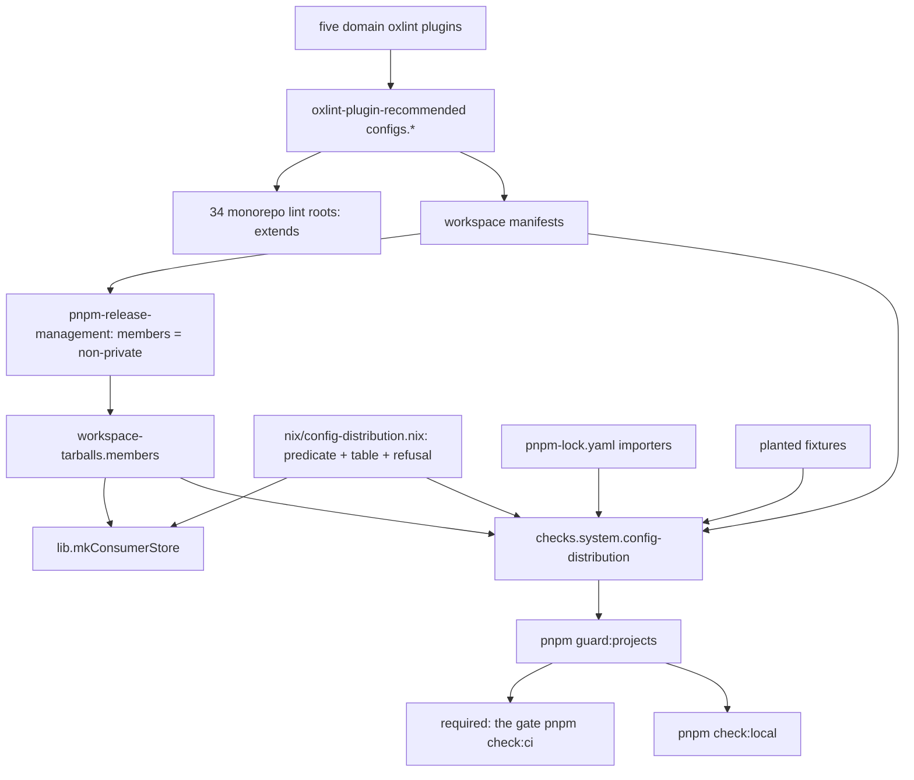

# Plugin Presets, Internal Configs - Plan

## Goal Capsule

- **Objective:** Every shared oxlint preset ships inside a distributed plugin as `configs.<name>`. Nothing this repository controls (its Nix workspace tarballs, `lib.mkConsumerStore`, its release cycle) hands another repository a systemfsoftware tool configuration. A pull request that would start distributing a configuration fails the required check. Versions already published to npm are outside this repository's control; the operator owns their deprecation.
- **Means:** revive `@systemfsoftware/oxlint-plugin-recommended` as the home of the four presets (KTD1), move every lint root onto them with identical effective config (KTD3), delete the emptied `oxlint-config-*` packages and keep the remaining configs private (KTD4), refuse configs in `lib.mkConsumerStore` (KTD5), and add a flake check run by the required gate (KTD6–KTD8).
- **Authority:** the conductor-owned config-ownership contract (Ryan, 2026-10-08) as corrected by conductor ruling 07 (2026-10-09) and ruling 15 (2026-10-09: `tsconfig` stays shared) wins, then this plan's Product Contract, then its Planning Contract, then `CONSTITUTION.md` and `AGENTS.md`. Consumer repositories are not active scope.
- **Stop conditions:** stop and report if a lint root's effective config or lint result changes on the move (R3); if oxlint drops through `extends` anything a preset needs beyond what KTD2 records; if making a config private breaks a distributed package's install or build; if the required gate cannot evaluate the flake; if any unit would need a lint rule, test or threshold weakened to go green.
- **Execution profile:** `ce-work`, delivered as a two-layer `gh stack` on trunk `main` (KTD10); no local mutation runs; no force-push.
- **Who finishes:** this session implements and runs `ce-code-review`; findings go to the conductor unapplied; the conductor rules and merges.

---

## Product Contract

### Summary

The four shared oxlint presets move into a revived plugin package as `configs.recommended`, `configs['cell-architecture']`, `configs.dmmf` and `configs['rule-authoring']`. Each is a complete config a consumer takes through `extends` alone. Every lint root in this monorepo moves onto them with an identical effective config. The emptied `oxlint-config-*` packages are deleted, and the remaining tool configurations stay private. A consumer store asked for any configuration refuses it and names the preset or plugin to use instead. A check in the required PR job fails whenever a package named like a configuration is public, a private package is distributed, or a distributed package depends on a configuration.

### Problem Frame

Ryan's rule has two halves: configurations are internal to each repository, and shared presets ship as plugins. #445 replaced `@systemfsoftware/oxlint-plugin-recommended` with shareable config packages (`oxlint-config-recommended`, `-cell-architecture`, `-dmmf`, `-rule-authoring`). Those packages, and `tsconfig`, were then distributed as Nix workspace tarballs (`workspace-tarballs`, selectable through `lib.mkConsumerStore`). Consumers inherited lint, type, test and build policy they do not own, and every change here re-graded their work. The ESLint flat-config convention ships a preset on the plugin itself (`plugin.configs.recommended`, `tseslint.configs.recommended`). A repository's own `oxlint.config.ts`, with its file wiring, project paths and overrides, is a configuration and stays home. Of the eight configuration packages, `vitest-config`, `tsdown-config` and `stryker-config` were already private; the other five were public (42 distributed members). Nothing stopped the next configuration package from being published the same way.

**Conductor ruling 15 (2026-10-09).** `@systemfsoftware/tsconfig` is a shared TypeScript base, following the `@tsconfig/*` convention. It stays public, stays a `workspace-tarballs` member and stays selectable through `lib.mkConsumerStore`. U1's privatization of it is reverted in a new commit. The naming rule (R9) becomes hyphen-delimited, so `tsconfig` is not CONFIG-shaped without a hand exemption. `vitest-config`, `tsdown-config` and `stryker-config` stay private. The member delta is the four `oxlint-config-*` packages leaving and `oxlint-plugin-recommended` joining (42 → 39).

### Requirements

**Presets ship in plugins**

- R1. Each preset a public `oxlint-config-*` package exposed (recommended, cell-architecture, dmmf, rule-authoring) ships as `configs.<name>` on the default export of a distributed `oxlint-plugin-*` package. Each is a complete oxlint config: it registers the JS plugins it turns on through `import.meta.resolve`, and carries its native plugins, options, categories, rules and overrides.
- R2. A consumer gets the whole preset through `extends: [plugin.configs.<name>]` alone. A planted violation of a custom-plugin rule fails a real lint run through `extends` with no `jsPlugins` of the consumer's own. Whatever oxlint does not carry through `extends` is stated with evidence and is not part of a preset.
- R3. Every surviving lint root in the monorepo moves from `extends: [oxlint-config-*]` to the plugin presets. Each root's effective config (the `--print-config` rule map, overrides, categories, plugins and options) and its real lint-run result (diagnostics by rule and file) are identical before and after.

**Distribution**

- R4. Every CONFIG package left in the workspace carries `"private": true`. The four `oxlint-config-*` packages, emptied by R1 and R3, are deleted rather than kept as re-exports.
- R5. No CONFIG package is a member of `workspace-tarballs.members`. Every plugin and library member present today stays a member, the revived plugin joins, and the PR lists the member set before and after.
- R6. `lib.mkConsumerStore` called with a CONFIG attribute name, including the four deleted `oxlint-config-*` names, fails as soon as the store is evaluated. The message says configs are internal and names the exact replacement: `@systemfsoftware/oxlint-plugin-recommended`'s `configs.<name>` for an oxlint preset, the package for `vitest-config` and `stryker-config`, or that none ships.

**Release**

- R7. No CONFIG package is versioned for release, tagged, or given a GitHub Release from this change on.
- R8. Changesets record the change for consumers: the revived plugin's intent tells a user of each former preset package which `configs.<name>` replaces it, and nothing pending names a deleted package. `tsconfig` stays distributed and gets no intent from this change (ruling 15).

**Recurrence guard**

- R9. A workspace package is CONFIG-shaped when its unscoped npm name matches `(^|-)config(-|$)` or `(^|-)presets?(-|$)`: `config` or `preset(s)` as a whole hyphen-delimited word. `vitest-config`, `tsdown-config`, `stryker-config` and `oxlint-config-*` match; `tsconfig` does not, because TypeScript bases are shared by convention (ruling 15). The rule is documented where agents and contributors read repository law.
- R10. A deterministic check fails when a CONFIG-shaped workspace package is not private, when any private package is in the distributed member set, or when a distributed member declares a runtime dependency on a CONFIG-shaped package.
- R11. The check runs inside the required job `build · lint · typecheck · test / the gate (pnpm check:ci)` on every PR, and in `pnpm check:local`.
- R12. The check is shown to fail: each R10 violation kind is planted and caught in the same run, and a sabotage commit on a throwaway branch that flips one configuration to public turns the required job red, with its run id recorded in the PR.

**Guidance**

- R13. Root `AGENTS.md` gains one rule line: shared presets ship in plugins as `configs.<name>`; configs are internal and never distributed; it names the R10 gate.
- R14. Root `README.md` lists the revived plugin with its presets and lists no CONFIG package.

**Monorepo continuity**

- R15. Lint, typecheck, test and build are green on the PR head with evidence the suites ran.

### Key Decisions

- **A preset is not a configuration.** A preset is a named rule set a plugin publishes for others to extend; a configuration is one repository's wiring of tools to its own files. Presets ship; configurations stay home (conductor ruling 07). Governs R1, R4.
- **One home for all four presets: `@systemfsoftware/oxlint-plugin-recommended`, revived.** Each of the four mixes house-style choices (the native plugin set, `typeAware`, categories, stock-rule severities) with domain rules, and two compose several plugins. KTD1 records the rejected homes. Governs R1.
- **The emptied config packages are deleted, not kept private.** After R1 and R3 nothing imports them; a private package that re-exports a plugin preset is a compatibility shim (`DEL1`). This departs from the contract's literal "has `private: true`" for these four. Its purpose (no config leaves the repository) holds, and the four names still refuse in `lib.mkConsumerStore`. Governs R4, R6.
- **The preset shape is `extends`, and presets carry no `ignorePatterns`.** oxlint carries `jsPlugins`, `plugins`, `rules`, `overrides`, `categories` and `options` through `extends`, and drops `ignorePatterns`, `env` and `settings` (KTD2). Ignore paths are file wiring, which is the consumer's configuration. Governs R1, R2, R3.
- **CONFIG shape is a naming rule, not a manifest marker.** A name is already reviewed under `REPO-S5`, it follows the ecosystem's convention for shareable configs (ESLint required the `eslint-config-` prefix through v8: https://eslint.org/docs/v8.x/extend/shareable-configs), and a mis-shaped name fails loudly. An opt-in manifest field is silently absent on exactly the next package nobody marked. The word is hyphen-delimited, so a TypeScript base (`tsconfig`, as in `@tsconfig/*`) is not a configuration and needs no exemption (ruling 15). Governs R9.
- **vitest, tsdown and stryker get nothing new here.** Their config packages stay private; a follow-up ruling settles whether any carries a preset that should become plugin behaviour (ruling 07, item 6). `tsconfig` stays a shared, distributed base (ruling 15). Governs R4, R6.
- **A distributed package may not depend on a configuration at runtime.** The contract counts "reachable by another repo as a dependency" as distribution. Governs R10.

### Acceptance Examples

- AE1. **Covers R1, R2.** **Given** a scratch consumer whose `oxlint.config.ts` is only `extends: [plugin.configs['cell-architecture']]` and a planted `export class Planted {}`, **then** a real `oxlint` run exits non-zero and reports `ban-classes`, which oxlint 1.82.0 prints as `@systemfsoftware/cell-architecture(ban-classes)` (it drops the `oxlint-plugin-` infix of the plugin's `meta.name`). The same holds for `configs.dmmf` with a `dmmf-workflow` rule and `configs.recommended` with a `test-discipline` rule, matched on the rule name in the printed form.
- AE2. **Covers R3.** **Given** `packages/atom/effect-atom-react` before and after its move to `configs.recommended`, **then** `oxlint --print-config` output and the lint run's diagnostics are byte-identical.
- AE3. **Covers R6.** **Given** `packages = [ "oxlint-config-dmmf" ]`, **then** evaluation fails, says configs are internal, and names `@systemfsoftware/oxlint-plugin-recommended` `configs.dmmf`.
- AE4. **Covers R6.** **Given** `packages = [ "tsdown-config" ]`, **then** evaluation fails, says configs are internal, and says no plugin ships for it. **Given** `packages = [ "tsconfig" ]`, **then** the store builds (ruling 15).
- AE5. **Covers R5.** **Given** the flake at layer 1's head, **then** `workspace-tarballs.members` equals the list on `main` minus the four `oxlint-config-*` packages plus `oxlint-plugin-recommended` (42 → 39), and `lib.mkConsumerStore` with `packages = [ "upstream-manifest" ]` still builds.
- AE6. **Covers R9, R10.** **Given** a PR adds a public `@systemfsoftware/eslint-config-strict`, **then** the required job fails naming that package.
- AE7. **Covers R9, R10.** **Given** a PR adds a public `@systemfsoftware/oxlint-plugin-foo`, **then** the check passes and the package is a distributed member.
- AE8. **Covers R10.** **Given** a distributed plugin adds `@systemfsoftware/vitest-config` to its `dependencies`, **then** the required job fails naming both packages.

### Scope Boundaries

- Consumer repositories and their migration to owned configs.
- Presets for vitest, tsdown and stryker (follow-up ruling).
- Changing any domain plugin's existing `configs.recommended`. Domain plugins keep their rules-level preset; consumers who want only one plugin keep using it.
- `ignorePatterns`, `env` and `settings` inside a preset (KTD2).
- Deleting existing tags, GitHub Releases or tarball artifacts already published for any package; rewriting `.changeset/ledger.yaml` or dated `docs/plans/` files, which are history.
- Changes to `systemfsoftware/pnpm-release-management`, which owns `mkPnpmWorkspacePackages` and the release cycle.
- Source reachability: this repository is public, so its files stay readable; "distributed" means obtainable as a built dependency.
- Considered and not built: a guard against non-`none` changesets on CONFIG packages. The pinned release cycle only tags and releases publishable members (`packages/github-release-engine/src/cycle.ts` in `pnpm-release-management` at `5eb4c5d`), so a private package's intent releases nothing.
- Considered and not built: a mandatory per-package distribution field on every manifest; the residual false-negative gap is under Risks.

### Sources

- `flake.nix` (`lib.mkConsumerStore`, `workspaceOf`, `checks`, `sabotage`), `nix/consumer-store-check.nix`, `nix/config-distribution.nix`.
- `packages/oxlint-presets/*/src/index.ts` (the four presets as they stand); `3775163ed2^:packages/oxlint-plugin/oxlint-plugin-recommended/` (the package #445 removed; a bare `OxlintConfig` default export at 1.3.3, per `.changeset/ledger.yaml`).
- oxlint 1.82.0 (`catalog:oxlint`); config docs https://oxc.rs/docs/guide/usage/linter/config (only `rules`, `plugins` and `overrides` named as merged); https://github.com/oxc-project/oxc/issues/23143 (`ignorePatterns` not extended, tracked by oxc#10223).
- `pnpm-release-management` at `5eb4c5d`: `nix/lib/pnpm-workspace-packages.nix` (members are the non-private workspace packages), `packages/github-release-engine/src/cycle.ts`.
- Required status check on `main`: `build · lint · typecheck · test / the gate (pnpm check:ci)`, fed by the `static` lane running `pnpm check:static` → `pnpm gate:tasks` → `pnpm guard:projects`.

---

## Planning Contract

### Key Technical Decisions

- KTD1. **`packages/oxlint-plugin/oxlint-plugin-recommended` holds the four presets.** Its default export is a plugin object, `{ meta: { name: '@systemfsoftware/oxlint-plugin-recommended' }, rules: {}, configs: { recommended, 'cell-architecture': …, dmmf, 'rule-authoring': … } }`. Each preset is ported from the matching `packages/oxlint-presets/*/src/index.ts` with its rules, overrides, native plugins, options and categories unchanged, minus `ignorePatterns` (KTD2). `recommended` keeps its nested `extends: [dmmf, cellArchitecture]`, now pointing at its sibling presets. `jsPlugins` entries are `import.meta.resolve` calls inside this package, so they resolve to the consumer's installed domain plugins. Runtime `dependencies`: the five domain plugins and `@effect/tsgo`; `peerDependencies` as today's `oxlint-config-recommended` (`effect`, `oxlint`, `oxlint-tsgolint`, `typescript`). It registers no rules, so no preset lists it in `jsPlugins`. The package follows its siblings' build shape (tsdown with generated exports, api-extractor, attw). Its manifest version continues from the ledger's last release, 1.3.3, and its intent is `major` (KTD9), because the default export changes from a bare config to a plugin object. Rejected: each preset on its dominant domain plugin. That puts house-style choices on domain plugins, gives `dmmf-workflow` a runtime dependency on `effect-schema`, and still leaves `recommended` without a home. Rejected: completing each domain plugin's `configs.recommended`, which changes five published plugins for no requirement. Rejected: a new package name, which drops the identity consumers knew before #445. Governs R1.
- KTD2. **`extends` carries what a preset needs; `ignorePatterns` stay out.** A probe on 2026-10-09 against oxlint 1.82.0 (throwaway, outside the tree) gave these results. A consumer config of `extends: [shipped]`, where `shipped` held only `jsPlugins` (an absolute plugin URL), `rules`, `overrides` and `ignorePatterns`, reported the custom rule `ban-classes` on a planted class and honoured an override that switched it off for one directory. It also reported a planted file under the shipped `ignorePatterns`. The same object spread into the root honoured all three. `--print-config` further shows that `categories` and `options` carry through `extends`, and that `env` and `settings` do not. The presets use only `ignorePatterns` from the dropped set, so it is inert in every root today, and leaving it out of the plugin presets changes no root's behaviour. Gitignored build output is skipped by oxlint's own `.gitignore` handling. Rejected: a spread shape. It would switch on today's inert `ignorePatterns` (for example `**/lib/**`, `**/*.mjs`), change what each root lints (violating R3), and make a consumer re-merge `overrides` by hand. Governs R1, R2, R3.
- KTD3. **Equivalence is diffed per root from the real tools, in a throwaway outside the tree.** Before the move, at the layer 1 commit preceding U7, record for each of the 34 surviving roots (28 `recommended`, 5 `dmmf`, the `packages/oxlint-plugin` family root): `oxlint --config oxlint.config.ts --print-config`, and `oxlint . --config oxlint.config.ts --format=json` reduced to (rule, file) diagnostic pairs plus the files-linted count. Each lint run happens in a throwaway copy of the root that carries one planted violation per domain plugin the root's preset turns on, so the diagnostic record is non-empty and a custom rule that stops loading shows up as a missing pair. The four deleted preset packages' own roots go with their packages. After the move, record the same, with the same plants, and require an empty diff. Rule ids are keyed by each plugin's `meta.name`, so the changed `jsPlugins` resolution path is invisible to both views. `--print-config` omits `jsPlugins`, so the planted-violation diff is the part that proves the custom rules still load. The new package inherits the `packages/oxlint-plugin` family root like its siblings, and that root moves to `configs['rule-authoring']`. Governs R3.
- KTD4. **Delete the four config packages totally.** The deletion covers their directories, the now-empty workspace glob `packages/oxlint-presets/*` (`pnpm-workspace.yaml`), the root `devDependencies` entry for `oxlint-config-rule-authoring` (now `oxlint-plugin-recommended`), and every live reference in READMEs, `AGENTS.md` files, `docs/solutions/` and package manifests. `git grep -nI -e 'oxlint-config-' -- . ':!*.lock' ':!.changeset/ledger.yaml' ':!docs/plans/'` then returns only these rows. The `nix/config-distribution.nix` refusal rows and the R8 changeset bodies name the old packages on purpose. Two known leftovers are left unedited because each is a surface that grades work (`CONST-E9`): `.claude/settings.json`, whose hit is the hook label `oxlint-config-off-guard`, not a package reference; and `.omp/rules-corpus/`, the corpus behind an omp rule, whose payloads quote solution docs as they stood when measured. `pnpm-lock.yaml` is regenerated by `pnpm install`. Governs R4.
- KTD5. **One Nix module owns the CONFIG predicate, the consume-instead table and the refusal.** `nix/config-distribution.nix` (from U2) keeps the naming predicate and the refusal. Its table maps each oxlint config attribute to `@systemfsoftware/oxlint-plugin-recommended` with the preset name and the wiring line `extends: [plugin.configs.<name>]` in the consumer's own `oxlint.config.ts`. The refusal adds that ignore patterns are repository configuration and stay in the consumer's own config, since oxlint does not carry them through `extends`. `vitest-config` and `stryker-config` keep their package rows; `tsconfig` and `tsdown-config` say no plugin ships. The refusal is keyed on the requested name before any member lookup, so the four deleted names still refuse. The naming rule is cited as `REPO-S7`; `REPO-S6` is a retired identifier still cited with another meaning by `.claude/hooks/*`. Governs R6, R9.
- KTD6. **The guard is a flake check, `checks.<system>.config-distribution`, judged from two independent sources.** Workspace packages are enumerated from the `importers` keys of the second YAML document in `pnpm-lock.yaml`, the workspace lockfile that follows pnpm's env lockfile (whose `importers` hold only `.`). It is pnpm's own answer, held fresh by `pnpm install --frozen-lockfile`. The read accepts the nested-mapping and inline `<dir>: {}` key forms, drops the root `.` key, and is a pure-Nix line scan, never an import-from-derivation, because `nix.yml` evaluates two systems. The distributed set is the real `workspace-tarballs.members`. The check fails closed: an empty importer list, or a distributed member absent from the importers, is a violation. Rejected: a new Deno guard under `scripts/guards/`, which would need the predicate in a second language and is the one-off script the contract rules out. Governs R9, R10.
- KTD7. **The check proves it can fail in the same evaluation.** One planted fixture per R10 violation kind, plus the fail-closed conditions, passes through the same violations function; the check fails if any fixture's violation kinds differ from what it expects (`CHK1`). Governs R12.
- KTD8. **`pnpm guard:projects` builds the check.** It already runs first in `pnpm gate:tasks`, so it executes in the `static` lane of the required gate and in `pnpm check:local`. It is a root script, not a turbo task, so no cached green can stand in for a run. Governs R11.
- KTD9. **Changesets.** `oxlint-plugin-recommended`: `major`, body naming the replacement for each former preset package and the `extends` wiring. `tsconfig`: `none`, no longer distributed. One `none` intent names every other publishable package the changeset gate reports as re-hashed. A pending intent naming a deleted package loses its frontmatter line, and any body sentence that names the package is removed with it. The bodies follow `skill://author-changesets`. The lists and the R7/R8 evidence come from `scripts/guards/check-changeset.ts` run against the base commit. The PR's `changeset · shared tooling` check cannot run, because its reusable workflow pins a `pnpm-release-management` ref (`prm/toolchain`) that no longer exists; that workflow is an Evaluator surface and is left untouched, and the conductor reports the ref to its owner. Governs R7, R8.
- KTD10. **Two stacked layers, the evaluator in its own.** Layer 1 (`chore/own-configs`) carries U1–U8 and this plan: the replacement presets, the move, the deletion, privatization and the refusal. Layer 2 carries U9 in its own commit, then U10. U1's privatization commit precedes the presets in layer 1's history, but the layer merges as one PR, so `main` never holds a private config without its replacement. The check is observed red at layer 1's parent and green at layer 2's head, and the sabotage run shows the required job red. The same session builds the gate that grades layer 1, which `CONST-E9` forbids. Both PR bodies declare that breach under `CONST-W3`: the operator commissioned the change on 2026-10-08, and the conductor verifies the gate independently through the sabotage run and an independent review. Governs R11, R12.

### High-Level Technical Design

### Assumptions

- oxlint stays at `~1.82.0` for this change. A release that merges `ignorePatterns` through `extends` (oxc#10223) changes nothing here, because no preset carries them.
- The pinned `pnpm-release-management` keeps excluding private packages from `workspace-tarballs` and from the release cycle; the check's private-distributed branch catches a change to the first.
- Reviving a package name whose last release is 1.3.3 is accepted by the release cycle as a `major` to 2.0.0; `scripts/guards/check-changeset.ts` decides at PR time.

### Risks

| Risk                                                                                                              | Mitigation                                                                                                                                    |
| ----------------------------------------------------------------------------------------------------------------- | --------------------------------------------------------------------------------------------------------------------------------------------- |
| A root's effective config or lint result shifts in the move                                                       | KTD3 diffs every surviving root; any difference is a stop condition                                                                           |
| A consumer extends a preset and expects the old presets' `ignorePatterns`                                         | The plugin's README and changeset say ignores belong in the consumer's own config; they were already inert through `extends`                  |
| A future config named without a hyphen-delimited `config` or `preset` word passes the check                       | `REPO-S7` (U10) makes the naming rule repository law checked in review                                                                        |
| A library whose name carries `config` or `preset` as a hyphen-delimited word is forced private                    | The check fails loudly naming it; the only remedy is renaming the package, with no exemption list                                             |
| The importer read takes the wrong lockfile document or misses an entry form                                       | KTD6 names the document and both key forms, and fails closed                                                                                  |
| Deleting the presets leaves a pending intent naming a dead package                                                | KTD9 reconciles pending intents from the gate's report                                                                                        |
| A stale consume-instead row names the wrong replacement for a consumer asking for a config                        | The refusal is read at the point of refusal, and U8 rewrites the rows alongside the plugin presets; the guard does not check the table        |
| A vendored package under `repos/` whose name contains `config` (for example `@typia/config`) enters the workspace | The workspace globs do not include `repos/`; widening them turns the check red, and the remedy is keeping vendored trees out of the workspace |
| A `workflow_dispatch` run on the throwaway branch does not produce the required job                               | Fall back to a draft PR from the throwaway branch, closed after the run id is recorded                                                        |
| Consumer repos pinned to an older flake revision fail at evaluation once they update                              | Intended by the contract; other sessions migrate consumers                                                                                    |

### Sequencing

U5 → U6 → U7 → U8 complete layer 1 on top of the landed U1–U4 and must be green on their own. U9 → U10 form layer 2. Layer 1 merges only after layer 2 is green and verified; the conductor merges both in the same window, layer 1 first.

---

## Implementation Units

### U1. Make the public configs private (landed: 55abe2e624)

- **Goal:** the five public CONFIG packages leave the distributed set.
- **Requirements:** R4, R5.
- **Files:** the four `packages/oxlint-presets/*/package.json`, `packages/toolchain/tsconfig/package.json`.
- **Test expectation:** none -- manifest flag.
- **Verification:** members dropped 42 → 37 on this commit, the difference exactly the five configs. Ruling 15 reverts the `tsconfig` flag in a later commit; the layer's final delta is 42 → 39.

### U2. Refuse configs in the consumer store (landed: 0abbe916b1, 78cbf34e3c)

- **Goal:** a consumer asking for a config fails at evaluation.
- **Requirements:** R6.
- **Files:** `nix/config-distribution.nix`, `flake.nix`.
- **Test expectation:** none -- the refusal message is authored text (`CHK1`); U9's check covers the predicate and the table.
- **Verification:** the eight attributes refuse; `checks.<system>.consumer-store` builds; the wrong-integrity sabotage still fails.

### U3. First changesets (landed: 1a1295ad0d, c14edc5954; revised in U8)

- **Goal:** record internalization without a release. U8 reconciles them with the deletion.
- **Requirements:** R7, R8.

### U4. README (landed: a543faf0ec; revised in U8)

- **Goal:** the README stops listing presets as packages.
- **Requirements:** R14.

### U5. Revive `oxlint-plugin-recommended` with the four presets

- **Goal:** the presets exist as `configs.<name>` on a distributed plugin.
- **Requirements:** R1.
- **Dependencies:** none (layer 1).
- **Files:** `packages/oxlint-plugin/oxlint-plugin-recommended/` (new: `package.json`, `src/index.ts`, `tsdown.config.ts`, api-extractor and tsconfig files, `README.md`, `LICENSE`), `pnpm-lock.yaml`.
- **Approach:** port each preset per KTD1; build the plugin object; generate exports through tsdown (`REPO-S4`); the package inherits the `packages/oxlint-plugin` family lint root like its siblings; the README documents `extends: [plugin.configs.<name>]` and that ignore patterns are repository configuration owned by each lint root, since oxlint does not carry them through `extends` (oxc#23143).
- **Patterns to follow:** `packages/oxlint-plugin/oxlint-plugin-effect-schema/` (build shape); the four `packages/oxlint-presets/*/src/index.ts` (preset content).
- **Test expectation:** none -- U6 proves the published behaviour on real lint runs, U7 proves equivalence, and the 34 roots exercise every preset on every `pnpm lint`. A test pinning preset contents would restate the source (`CHK1`).
- **Verification:** `pnpm --filter @systemfsoftware/oxlint-plugin-recommended build lint typecheck attw api:check` pass.

### U6. Prove the presets work through `extends` alone

- **Goal:** R2's evidence on the built package.
- **Requirements:** R2; AE1.
- **Dependencies:** U5.
- **Approach:** in a throwaway scratch consumer outside the tree whose `node_modules` resolves the built package, write `oxlint.config.ts` as only `extends: [plugin.configs.<name>]` for each of `cell-architecture`, `dmmf` and `recommended`. Plant one violation of a custom-plugin rule each preset turns on, run `oxlint`, and require a non-zero exit that reports that rule in oxlint's printed form (AE1). Nothing is committed.
- **Test expectation:** none -- throwaway evidence for the PR body.
- **Verification:** three red runs reporting the planted rules.

### U7. Move every lint root onto the plugin presets and delete the config packages

- **Goal:** the monorepo lints exactly as before, with no `oxlint-config-*` package left.
- **Requirements:** R3, R4; AE2.
- **Dependencies:** U5.
- **Files:** 34 `oxlint.config.ts` roots and their `package.json` `devDependencies`, the root `package.json`, `pnpm-workspace.yaml`, `pnpm-lock.yaml`, `packages/oxlint-presets/` (deleted), and live references per KTD4.
- **Approach:**
  1. Record the KTD3 before-snapshot.
  2. Rewrite each root's import to `@systemfsoftware/oxlint-plugin-recommended` and `extends: [plugin.configs.<name>]`, keeping its own overrides; switch each `devDependencies` entry.
  3. Delete the four packages and apply KTD4; run `pnpm install`.
  4. Record the after-snapshot and require an empty diff.
- **Execution note:** snapshot before any edit; a non-empty diff stops the unit.
- **Test expectation:** none -- the KTD3 diff is the proof.
- **Verification:** an empty KTD3 diff over 34 roots; the KTD4 `git grep` returns only the expected rows; `pnpm lint` passes.

### U8. Point the refusal, changesets and README at the plugin presets

- **Goal:** consumers are told exactly which preset replaces each config.
- **Requirements:** R6, R8, R14; AE3, AE4, AE5.
- **Dependencies:** U5, U7.
- **Files:** `nix/config-distribution.nix`, `.changeset/*.md`, `README.md`.
- **Approach:** rewrite the oxlint rows per KTD5; author and reconcile intents per KTD9 from the changeset gate's report; list `oxlint-plugin-recommended` and its four presets in the README plugin table and say configs are internal.
- **Test expectation:** none -- authored text and release metadata; the changeset gate is the proof.
- **Verification:** each of the eight CONFIG attributes refuses with its KTD5 row; `checks.<system>.consumer-store` builds; members on `main` minus the five configs plus `oxlint-plugin-recommended` (42 → 38); `scripts/guards/check-changeset.ts` against `origin/main` passes (KTD9); `./bin/dprint check` passes.

### U9. Add the config-distribution check

- **Goal:** distributing a config fails the required PR job.
- **Requirements:** R9, R10, R11, R12; AE6, AE7, AE8.
- **Dependencies:** layer 1 (layer 2, own commit per KTD10).
- **Files:** `nix/config-distribution.nix`, `flake.nix`, `package.json` (`guard:projects`).
- **Approach:**
  1. Add a pure violations function over plain data covering R10's three kinds and KTD6's fail-closed and table-completeness conditions.
  2. Expose `checks.<system>.config-distribution` over the lockfile importers, their manifests and the real `workspace-tarballs.members` (KTD6), plus the planted fixtures (KTD7); evaluation throws listing every violation.
  3. Append its build to `guard:projects` (KTD8).
  4. Push a throwaway branch that flips `packages/toolchain/vitest-config/package.json` to `"private": false`, and record the required job's run id and the guard's failure line.
- **Execution note:** first build the check against layer 1's parent in a throwaway `git worktree`, with the U9 files checked out, so its first red comes from real data; record the failure line and remove the worktree.
- **Test scenarios:**
  - Covers AE6. A planted public `@fixture/eslint-config-x` yields a violation naming it.
  - A planted public `@fixture/tsconfig` yields no violation, and a planted public `@fixture/vitest-config` yields one: the word is hyphen-delimited, so a TypeScript base passes (ruling 15).
  - Covers AE7. A planted public `@fixture/oxlint-plugin-x` yields no violation.
  - A planted private manifest in the distributed set yields a violation naming it.
  - Covers AE8. A planted distributed manifest with `dependencies` on `@fixture/vitest-config` yields a violation naming both; the same edge under `devDependencies` yields none.
  - An empty importer list yields the fail-closed violation; a distributed member absent from the importers yields one.
- **Verification:** red at layer 1's parent naming the five public configs and their config dependencies; green at layer 2's head; the sabotage run's required job red with the guard's message for `vitest-config`.

### U10. State the rule in agent guidance

- **Goal:** agents and contributors read that presets ship in plugins and configs stay internal.
- **Requirements:** R13, R9.
- **Dependencies:** U9.
- **Files:** `AGENTS.md`.
- **Approach:** add one `REPO-S7` row to "Rules — Must Hold At Done", and point the landed `nix/config-distribution.nix` comment at it. A shared rule set ships inside a plugin as `configs.<name>`. A package whose unscoped name carries `config` or `preset(s)` as a hyphen-delimited word is a tool configuration, stays `private`, and is never distributed; `tsconfig` does not match, because TypeScript bases are shared by convention. Gate: `pnpm guard:projects` (`checks.<system>.config-distribution`).
- **Test expectation:** none -- doctrine.
- **Verification:** `./bin/dprint check` passes.

---

## Verification Contract

| Gate                                                                                                                                                                | Proves                                          | When                              |
| ------------------------------------------------------------------------------------------------------------------------------------------------------------------- | ----------------------------------------------- | --------------------------------- |
| U6 scratch-consumer runs: three red lint runs through `extends` alone                                                                                               | R1, R2, AE1                                     | U6                                |
| KTD3 per-root diff of `--print-config` and lint-run diagnostics, empty over 34 roots                                                                                | R3, AE2                                         | U7                                |
| KTD4 `git grep`, and `jq .private` reading `true` on the four remaining CONFIG manifests                                                                            | R4                                              | U7                                |
| `nix eval` of `workspace-tarballs.members` mapped to `attr` on `main` and at layer 1's head (42 → 38)                                                               | R5, AE5; both lists go in the PR body           | U8                                |
| Evaluating `lib.mkConsumerStore` for the eight CONFIG attributes and `upstream-manifest`; `checks.<system>.consumer-store` and its sabotage                         | R6, AE3–AE5 (throwaway commands, not committed) | U8                                |
| `scripts/guards/check-changeset.ts <base-sha>` passes with every re-hashed package named (KTD9)                                                                     | R7, R8                                          | U8                                |
| `nix build .#checks.<system>.config-distribution`: red at layer 1's parent, green at layer 2's head, planted fixtures inside                                        | R9, R10, R12                                    | U9                                |
| Sabotage run on the throwaway branch: required job red with the guard's message                                                                                     | R12                                             | U9                                |
| `./bin/dprint check`; the `AGENTS.md` diff adds `REPO-S7`; no README row names a CONFIG package                                                                     | R13, R14                                        | U8, U10                           |
| `pnpm check:local` exits 0                                                                                                                                          | R15 locally, and R11 once U9 lands              | after the last edit of each layer |
| Required gate green on each layer's head SHA; the static lane log shows the check ran; turbo summaries show lint, typecheck, test and build ran, with vitest counts | R11, R15                                        | each push                         |

Test admission (`skill://test-layer-selection`, default refuse): admitted are the U9 planted fixtures only, a pure decision's refusal boundaries checked in the gate itself. Refused: a test pinning preset contents or the refusal message (self-asserted, `CHK1`), a test listing the member set (`OP12`), and unit tests for `lib.mkConsumerStore` wiring. U6 and U7 evidence comes from real `oxlint` runs and is not committed. No mutation run is started locally (`REPO-D3`).

---

## Definition of Done

- R1–R15 hold on layer 2's head, each shown by its Verification Contract row.
- Both layers are green on the required gate, and each head SHA is reported to the conductor.
- The PR bodies list the distributed member set before (42) and after (38), the U6 and U7 evidence summaries, the sabotage run id, the `CONST-W3` declaration of KTD10, and the U9 red-then-green evidence. Nothing names a private repository or its identifiers; this repository's own sabotage run id must appear.
- `ce-code-review` has run and its findings are reported to the conductor unapplied.
- No throwaway command, scratch consumer, sabotage commit or experimental code remains on either layer; the throwaway branch's remote is deleted once its run id is recorded.
