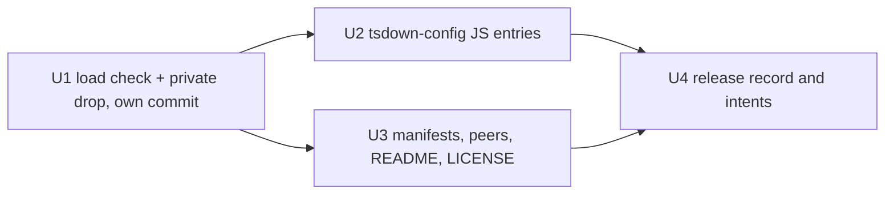

# Publish the toolchain config packages - Plan

## Goal Capsule

- **Objective:** A repository outside systemfsoftware (first: api-extractor-effect) installs `@systemfsoftware/tsdown-config`, `@systemfsoftware/vitest-config` and `@systemfsoftware/stryker-config` from this flake and loads them, and a flake check proves it.
- **Means:** Drop `private`, make every entry point loadable from `node_modules`, fix the manifests, and add a consumer-install check over `lib.mkConsumerStore`.
- **Product authority:** PR 1 of the org shared tooling series, on branch `chore/org-shared-tooling` off `main` at `df908ddfe4`. It ships first and alone. The later PRs (reusable workflows, flake template, SHA pins) are not active scope.
- **Open blockers:** none.

---

## Product Contract

### Summary

The three packages under `packages/toolchain/` become publishable flake tarballs that work for an outside consumer. tsdown-config ships JavaScript entry points in place of raw TypeScript. Each manifest declares what it needs from the consumer. A flake check installs all three into a consumer and loads every entry point and bin under Node.

### Problem Frame

api-extractor-effect needs the org's shared build, test and mutation config, and the only distribution channel is this flake's workspace tarballs (`.changeset/README.md:94-98`). All three packages were `"private": true`, so `pnpm-release-management` left them out of `workspace-tarballs.members` (`pnpm-workspace-packages.nix:53` in the pinned input) and `lib.mkConsumerStore` threw for them (`flake.nix:64`). Dropping `private` alone is not enough. Packed and installed outside the repo, tsdown-config's `quiet-build` entry and its `api-extractor-quiet` bin both fail to load (see Sources). Inside the monorepo the failure stays hidden, because pnpm links workspace packages by symlink and the resolved path is not under `node_modules`. The existing `consumer-store` check only proves a tarball gets indexed. It skips the tarball's dependencies on purpose (`nix/consumer-store-check.nix:21-22`), so it could not catch a load failure.

### Key Decisions

- **tsdown-config ships hand-written JavaScript with declaration files, not a build step.** `eager-entry-budget.mjs` already loaded from `node_modules` (probe D), and vitest-config and stryker-config already ship tracked `lib/*.js` with no build. Following that pattern adds no `dist/`, no turbo `build` task and no build-hash churn. Governs R4, R5.
- **Peers follow what the code imports or resolves from the consumer. A tool a package configures but never imports is an optional peer.** For stryker-config that means the fork this repo actually runs (`packages/runner/vitest/stryker.config.ts:2`), not `@stryker-mutator/core`. Governs R7.
- **The proof runs under Node, not Bun.** The failure is Node's refusal to strip types under `node_modules`. A Bun-run check would pass while consumers break. Governs R11.
- **R11 is the only permanent check this work adds beyond the three per-package `attw --pack .` lanes R5 requires.** It covers the packed-install closure, which only an end-to-end seam can observe. After the work-gate ruling it also carries AE1 (tsdown's own config loader on a consumer `tsdown.config.ts`) and AE3 (the fork-less refusal text), and its consumer is a pnpm workspace root. Governs R10, R11.

### Requirements

**Releasability**

- R1. All three packages are publishable workspace members, so `workspace-tarballs.members` lists `tsdown-config`, `vitest-config` and `stryker-config` and `lib.mkConsumerStore { packages = [ ... ]; }` serves each. Each packed tarball carries a README and LICENSE (`scripts/tools/pack-all.mjs`).
- R2. Each package gets its own `.changeset/` intent, authored with `pnpm change`, and its body states only facts a consumer can observe (REPO-R2).
- R3. Each package's first release completes on `main` with no manual recovery: a `<pkg>@v<version>` tag and a GitHub Release whose body describes the publication. The release tool's dry run must show this before merge.

**Outside-consumer contract**

- R4. Every exported subpath and every bin loads under plain Node 24 from a consumer's `node_modules`, and a consumer's `tsdown.config.ts` that imports `quiet-build` builds with tsdown's default config loader and no extra consumer setup.
- R5. Each entry point, including `eager-entry-budget`, comes with type declarations that keep the types consumers rely on, and the JavaScript is typechecked against them. `quietBuild` keeps its literal types so that `defineConfig({ ...quietBuild })` still typechecks. Each package's packed tarball is checked by the `attw --pack .` lane that the other published packages already run.
- R6. Subpath and bin names stay as they are (`./quiet-build`, `./eager-entry-budget`, `api-extractor-quiet`, and the `.` exports), so in-tree importers need no edits.
- R7. Each manifest declares the peers its code needs. vitest-config requires `vite` and `vitest`; `@systemfsoftware/vitest` is a devDependency the consumer adds, named by the README and the R10 refusal, not a peer (KTD2). tsdown-config takes `tsdown` and `@microsoft/api-extractor` as optional peers. stryker-config takes `@systemfsoftware/stryker-js` as an optional peer.
- R8. No packed manifest has a runtime dependency or peer on a private workspace package, and none keeps a `workspace:` or `catalog:` specifier.
- R9. Each package's `repository.directory` and `homepage` point at its own directory.
- R10. When vitest-config refuses a consumer that has not installed `@systemfsoftware/vitest`, the error names a fix that works outside the monorepo. It said only `"workspace:^"` (`packages/toolchain/vitest-config/lib/base.js:98` at `df908ddfe4`).

**Proof**

- R11. A flake check builds a consumer that depends on all three tarballs through `lib.mkConsumerStore` and installs offline in the Nix sandbox. Under Node it imports every subpath and runs every bin that each packed manifest declares in `exports` and `bin`. The check reads those entries from the installed manifests instead of listing them by hand. It also runs vitest-config's `defineConfig` with `@systemfsoftware/vitest` installed. Any load failure fails the build.
- R12. The check lands in its own commit (Evaluator surface), together with the `private` drops it needs to evaluate. It is seen failing at that commit on the `.ts` `quiet-build` entry, and passing after the fix.
- R13. `nix flake check` runs the new check, and the existing `consumer-store` check and the `consumer-store-wrong-integrity` sabotage stay in place.

### Acceptance Examples

- AE1. **Covers R4.** **Given** a consumer with the tsdown-config tarball and `tsdown@^0.23` installed, and a `tsdown.config.ts` that spreads `quietBuild`, **when** it runs `tsdown -l warn`, **then** the build succeeds. On the old packaging it fails with `ERR_UNSUPPORTED_NODE_MODULES_TYPE_STRIPPING`.
- AE2. **Covers R4, R7.** **Given** a consumer that installed vitest-config together with `vite`, `vitest` and `@systemfsoftware/vitest`, **when** it awaits `defineConfig({ test: {} })`, **then** the promise resolves with the guard setup file added.
- AE3. **Covers R10.** **Given** a consumer without `@systemfsoftware/vitest`, **when** it awaits `defineConfig`, **then** the promise rejects, and the message tells the consumer to add `@systemfsoftware/vitest` as a devDependency in a form valid outside the monorepo. U1's check asserts the message text.

<!-- ce-section: work-relationships -->

### How This Work Fits Together

This plan covers PR 1 of the org shared tooling series: the three config packages become installable and proven loadable. The rest of the breakdown is current understanding, not a committed roadmap.

- api-extractor-effect: **Depends on** this PR to consume the configs from the flake.
- Reusable workflows: a later layer. **Can proceed independently of** this PR's manifest changes.
- Flake template and SHA pins: later layers. **Still to decide** how they reference these packages.

### Scope Boundaries

- Reusable workflows, the flake template and SHA pins belong to later PRs.
- In-tree gritlint is untouched.
- No local mutation runs (REPO-D3).
- npm registry publishing is out. Distribution stays flake-only.
- vitest-config's guard exemption table keeps its in-repo package names. They never match an outside package, so they do no harm there.
- `@systemfsoftware/tsconfig` is already public and does not change.

### Dependencies / Assumptions

- `@systemfsoftware/vitest` is public: it is in `workspace-tarballs.members` (attr `vitest`, `vitest-2.0.0.tgz`), so the devDependency R7 and R10 name points at a released package.
- The tarball builder runs `pnpm --recursive --if-present --filter <pkg>... run build` and then `pnpm pack` per member (`pnpm-workspace-packages.nix:104-114` in the pinned input). None of the three packages has a `build` script, so each tarball holds exactly the tracked files that `files` names, plus README, LICENSE and the member changelog.
- Consumers run Node 24. The devShell pins `nodejs_24` (`flake.nix:153`), and the probes ran on Node v24.21.0.

### Outstanding Questions

None blocking.

### Sources / Research

Probe: each package was packed with `pnpm --filter <pkg> pack`, then installed with `pnpm install --ignore-workspace` into a scratch consumer outside the repo with `tsdown 0.23.0`, `vitest 5.0.3` and `vite 8.3.4`, and run under Node v24.21.0.

| Probe                                                                | Result                                                                                                                                     |
| -------------------------------------------------------------------- | ------------------------------------------------------------------------------------------------------------------------------------------ |
| A. `tsdown -l warn` with a config importing `quiet-build`            | exit 1: "Failed to load the config file due to a known Node.js bug… Stripping types is currently unsupported for files under node_modules" |
| A'. same, `--config-loader unrun`                                    | exit 1: "Failed to import module \"unrun\"" (the consumer would need an extra dependency)                                                  |
| B. `import('@systemfsoftware/tsdown-config/quiet-build')`            | `ERR_UNSUPPORTED_NODE_MODULES_TYPE_STRIPPING`                                                                                              |
| C. `api-extractor-quiet --help` (bin)                                | `ERR_UNSUPPORTED_NODE_MODULES_TYPE_STRIPPING`                                                                                              |
| D. `import('@systemfsoftware/tsdown-config/eager-entry-budget')`     | ok                                                                                                                                         |
| E. `import('@systemfsoftware/stryker-config')`, `shardMutate([...])` | ok                                                                                                                                         |
| F. `import('@systemfsoftware/vitest-config')`                        | ok, because `vite` and `vitest` were installed by hand: neither was declared                                                               |
| G. vitest-config `defineConfig({ test: {} })` without the fork       | rejects: "…has no \"@systemfsoftware/vitest\" linked in its own node_modules… Declare \"@systemfsoftware/vitest\": \"workspace:^\"…"       |

- Runtime imports: `packages/toolchain/vitest-config/lib/base.js:3-4` (`vite`, `vitest/config`), `:93-113` (fork resolved from `<cwd>/node_modules/@systemfsoftware/vitest`). `packages/toolchain/stryker-config/lib/base.js:1` uses only `node:fs`. `api-extractor-quiet` uses only node builtins plus the consumer's own `node_modules/.bin/api-extractor`.
- Monorepo-relative paths: the only relative import is `./files.js`. `workspaceRoot` falls back to `cwd` when no `pnpm-workspace.yaml` exists (`packages/toolchain/vitest-config/lib/base.js:137-145`). No entry reads a repository-root file.
- Node upstream: type stripping under `node_modules` stays refused. The PR to lift it, nodejs/node#63853, is still open (last updated 2026-09-01), and maintainers there object to publishing raw TypeScript.
- pnpm task graph: any peer on `@systemfsoftware/vitest` from vitest-config, required or optional, fails `pnpm -r --filter "@systemfsoftware/vitest-config..." run <script>` with `ERR_PNPM_TASK_CYCLE` (`packages/runner/vitest#build → packages/toolchain/vitest-config#build`), the command the flake's tarball builder runs. Turbo tolerates the same edge.
- dprint excludes a file named `pnpm-lock.yaml` at any depth (`dprint.json` `excludes`) and reformats any other YAML, which breaks the layout `pnpm-lock.nix` parses.

---

## Planning Contract

### Key Technical Decisions

- KTD1. **tsdown-config entries become plain ES modules beside hand-written declarations, and checkJs binds each to its declaration.** `quiet-build.ts` becomes `quiet-build.js` + `quiet-build.d.ts`, `api-extractor-quiet.ts` becomes `api-extractor-quiet.js` (JSDoc-typed, no declaration: it is a bin), and `eager-entry-budget.mjs` gains `eager-entry-budget.d.mts`. `tsconfig.app.json` sets `allowJs`/`checkJs` and lists the `.mjs` in `files`. A declaration beside a `.js` shadows it, so each implementation takes its type from its own declaration: `quietBuild` is annotated `@type {typeof import('./quiet-build.js').quietBuild}` and `eagerEntryBudget` returns the declared `EagerEntryBudgetPlugin` and narrows chunks to the declared `BudgetedChunk`. A drifted value or field then fails `tsc -b`. The declarations import nothing from `tsdown` or `rolldown`, so the optional peers stay optional (pack: package-topology, public-signature-types.md). Governs R4, R5, R6.
- KTD2. **Peers are written as `catalog:`, except stryker-js, and vitest-config declares no peer on the fork.** `catalog:stryker` resolves to `latest`, which would pack as a dist-tag peer, so stryker-config names `^17.0.0` directly (lockfile resolves `17.0.2`). A peer on `@systemfsoftware/vitest` closes a cycle with the fork's devDependency on vitest-config that pnpm refuses (Sources), so the fork stays a consumer devDependency, enforced at config load by the R10 refusal and named in the README. Governs R7, R8.
- KTD3. **The first release rides the owed-version path with authored `0.1.0` changelogs and `none` intents.** In the pinned tool an owed version beats pending intents (`plan-release.workflow.ts:55-58`), the owed cycle is every publishable member whose version has no remote tag (`cycle.ts:20-30`), and storage is `registry` because `versioning.changelog.storage` is unset (`WorkspaceStoreLive.ts:109-115`). The release body is therefore the whole file `.changeset/changelogs/@systemfsoftware!<name>@0.1.0.md` (`MemberChangelog.ts:10-11,52`). A missing file yields an empty-bodied GitHub Release, not a failure, because `release.yml` runs without `--assert` (`github-release.ts:120-129`). Each package's intent is `none`: a `patch` would ship an identical `0.1.1` right after. The same file is what `pnpm pack` writes into the tarball as `CHANGELOG.md`, so replacing the stale vitest-config text fixes both. Governs R2, R3.
- KTD4. **The load check is its own directory beside `consumer-store-check.nix`: `nix/consumer-load-check/{default.nix,pnpm-lock.yaml,check.mjs}`.** `consumer-store-check.nix` stays untouched; it asserts store indexing, and a load proof would bury that. The lockfile template is named `pnpm-lock.yaml` so dprint leaves pnpm's layout alone (Sources). The consumer manifest is built in Nix, as the existing check does, so no stray `package.json` joins the tree. The install mirrors the pinned sandbox's offline settings: a private copy of the store's `index.db` beside links to its content, `offline`, `frozen-lockfile`, `trust-lockfile` and `ignore-scripts`. Governs R11, R13.
- KTD5. **The fixture lockfile is a pnpm-generated template keyed on workspace tarballs.** Each workspace tarball's file name, version and integrity appear as placeholders (`@<attr>.tgz@`, `@<attr>.version@`, `@<attr>.integrity@`) that Nix fills from `workspace-tarballs.members` and the built tarball, as `consumer-store-check.nix:49-54` does for one. Registry entries stay literal, so `mkConsumerStore` fetches them by the lockfile's integrity. The consumer's direct dependencies are the three config tarballs, the `@systemfsoftware/vitest` tarball, and `vite 8.2.1`, `vitest 5.0.1`, `effect 4.0.2` and `@microsoft/api-extractor 7.59.1`; `pnpm install --lockfile-only` resolves the rest of the graph, including the fork's `@effect/platform-node`. tsdown is left out: no entry imports it. Regeneration steps live in the header of `default.nix`. Governs R11.
- KTD6. **The harness reads every entry from the installed manifests.** For each config package it imports every `exports` subpath (JSON subpaths with an import attribute) and runs every `bin` through its `node_modules/.bin` shim with `--help`, requiring exit 0. It then awaits vitest-config's `defineConfig({ test: {} })` and requires the fork's guard file in `test.setupFiles`. `@microsoft/api-extractor` is in the fixture so the bin runs end to end rather than stopping at its own "no api-extractor" refusal. Governs R11, AE2.
- KTD7. **attw runs per package through a package-local `turbo.json` override.** The root `attw` task hashes `dist/**` (`turbo.json`), which these packages do not have, so each overrides `attw.inputs` to its shipped directory plus `package.json` and `.attw.json`. Each gets the repo's `.attw.json` (`ignoreRules: ["no-resolution", "cjs-resolves-to-esm"]`), because all three are ESM-only, and devDepends on `@systemfsoftware/arethetypeswrong-cli`. Governs R5.

### Assumptions

- The changeset gate names every publishable package whose turbo `build` hash moves. Dependents of the three configs are already named by pending intents on `main`; the gate's own output decides whether a fan-out intent is needed.
- The release dry run runs locally against `origin`'s real tags, with the release tools built from the pinned input. It only plans, previews and captures. Nothing is pushed.

### Risks

- The fixture lockfile records each tarball's dependency and peer sets and pins registry versions. When a packed manifest's dependencies or peers differ from what the template records, frozen install fails and the check goes red. That failure is the signal to regenerate the template. It never passes silently.
- vite 8 loads native rolldown bindings. The lockfile carries every platform's binding, so the fixed-output fetch covers both Linux systems in CI. Install scripts are ignored, as in the pinned sandbox; the binding packages need none.
- The U1 commit is red by design (R12). Its CI is not observed on its own, because the stack pushes U1 through U4 together.

## Implementation Units

U2 and U3 are written first in the working tree, because the fixture lockfile is generated from their packed tarballs. U1 is committed first, with the three `private` drops, so the check evaluates at its own commit and fails on the `.ts` `quiet-build` entry (R12). U2 and U3 share one commit: the root `pnpm-lock.yaml` covers both, and a split would leave one commit whose frozen install fails. U4's changelogs are recomputed from the packed surface U2 and U3 produce.

### U1. Consumer-load flake check

- **Goal:** a flake check that installs the toolchain tarballs offline and loads every entry under Node.
- **Requirements:** R11, R12, R13. KTD4, KTD5, KTD6.
- **Files:** `nix/consumer-load-check/{default.nix,pnpm-lock.yaml,check.mjs}`, `flake.nix` (`checks.consumer-load`), `.github/workflows/nix.yml` (one step after the sabotage step), and the three `package.json` files (`private` removed, nothing else).
- **Approach:** build the store with `mkConsumerStore { packages = [ "tsdown-config" "vitest-config" "stryker-config" "vitest" ]; lockFile = <template>; }`, the same template-then-substitute split `consumer-store-check.nix` uses. The check derivation copies the consumer and its tarballs to a writable dir, lays out the store view (KTD4), runs `pnpm install` and then `node check.mjs` from the consumer dir so bare specifiers resolve from its `node_modules`. Committed alone (Evaluator surface).
- **Execution note:** red first, at U1's own commit, then green after U2 and U3.
- **Test scenarios:**
  - U1 commit → build fails, and the log names `quiet-build.ts` and `ERR_UNSUPPORTED_NODE_MODULES_TYPE_STRIPPING`.
  - Fixed packaging → build succeeds and the harness prints one line per subpath and bin it loaded, plus the guard path.
  - A bin exiting non-zero, or `defineConfig` without the guard in `setupFiles` → the harness throws and exits non-zero. Seen once by smoke, not kept as a test.
- **Verification:** `nix build .#checks.x86_64-linux.consumer-load` red at the U1 commit, green at the fix commit, both logs recorded.

### U2. tsdown-config ships JavaScript entries

- **Goal:** every tsdown-config subpath and bin loads from `node_modules`, with declarations its code is checked against.
- **Requirements:** R4, R5, R6. KTD1.
- **Files:** `packages/toolchain/tsdown-config/src/{quiet-build.js,quiet-build.d.ts,api-extractor-quiet.js,eager-entry-budget.mjs,eager-entry-budget.d.mts}`, `src/quiet-build.ts` and `src/api-extractor-quiet.ts` removed, `package.json` (`exports`, `bin`), `tsconfig.app.json` (`allowJs`, `checkJs`, `files`).
- **Approach:** the conversion changes the file format, not what the code does. The bin's header comment drops the "Node 24 strips the types" claim and says why it is plain JS. `tests/dts-export-marker.test.ts` keeps importing `../src/quiet-build.js`, which now resolves to the real file.
- **Test scenarios:**
  - AE1: U1's check runs `tsdown -l warn` in the consumer with a `tsdown.config.ts` spreading `quietBuild` and imports the built entry.
  - A drifted `quietBuild.logLevel` or a chunk field the declaration lacks → `tsc -b` fails. Seen once by smoke.
  - The existing tsdown-config test suite passes unchanged, and the typechecks of its dependents pass.
- **Verification:** `pnpm turbo run typecheck test --filter=./packages/toolchain/*`, then `pnpm turbo run typecheck --filter=...^@systemfsoftware/tsdown-config`.

### U3. Manifests, peers and the outside-consumer message

- **Goal:** each manifest is publishable and declares what an outside consumer needs.
- **Requirements:** R1, R7, R8, R9, R10. KTD2, KTD7.
- **Files:** `packages/toolchain/{tsdown-config,vitest-config,stryker-config}/{package.json,README.md,.attw.json,turbo.json}`, `packages/toolchain/tsdown-config/LICENSE`, `packages/toolchain/vitest-config/lib/base.js` (refusal text), `pnpm-lock.yaml`.
- **Approach:** `private` is already gone (U1). Add `publishConfig` (`access: public`, `provenance`), `peerDependencies` and `peerDependenciesMeta`, `repository.directory` and `homepage` for each package's own dir, and an `attw` script. Add a consumer-facing README to each and the Apache-2.0 LICENSE tsdown-config lacked. The R10 text tells the consumer to add `"@systemfsoftware/vitest"` to devDependencies, as `workspace:^` inside the monorepo and otherwise the flake tarball or a version range, and keeps the exemption-table alternative.
- **Test scenarios:**
  - `pnpm pack:all` exits 0 with all three packages among those packed; the packed manifests carry exactly the R7 peers.
  - AE2 is covered by U1's harness.
  - AE3: U1's check calls `defineConfig` from a package without the fork and asserts the refusal names a devDependency form valid outside the monorepo.
  - `nix eval .#packages.x86_64-linux.workspace-tarballs.members` lists all three packages.
- **Verification:** `pnpm --filter <pkg> attw` for each package; `pnpm pack:all`.

### U4. First-release record and intents

- **Goal:** merging releases `0.1.0` of each package with a correct GitHub Release body, and the changeset gate passes.
- **Requirements:** R2, R3. KTD3.
- **Files:** `.changeset/changelogs/@systemfsoftware!{tsdown-config,vitest-config,stryker-config}@0.1.0.md` (one replaced, two new), three `none` intents from `pnpm change`.
- **Approach:** match the existing first-release shape (`@systemfsoftware!effect-readiness@0.1.0.md`): `## 0.1.0`, `### Minor Changes`, then one bullet of consumer-observable facts recomputed from the packed `exports`, `bin` and peers (`docs/solutions/conventions/a-release-note-claims-the-published-surface.md`).
- **Test scenarios:**
  - Release `plan` over the local tarballs → owed phase, with all three packages in the cycle at `0.1.0`.
  - `tag --dry-run` previews `@systemfsoftware/<name>@v0.1.0` for each and pushes nothing.
  - `release --dry-run` previews a body equal to each authored changelog.
  - `changeset-management check origin/main` exits 0 and names the three packages.
- **Verification:** the release-tool commands and the gate command, with their output pasted into the return.

## Verification Contract

| Gate                  | Command                                                                                | Expectation                                                        |
| --------------------- | -------------------------------------------------------------------------------------- | ------------------------------------------------------------------ |
| Load check            | `nix build .#checks.x86_64-linux.consumer-load` at the U1 commit and at the fix commit | red on the `.ts` entry, then green                                 |
| Existing store checks | `nix build .#checks.x86_64-linux.consumer-store`; sabotage build                       | green; sabotage still fails with `ERR_PNPM_TARBALL_INTEGRITY`      |
| attw                  | `pnpm --filter @systemfsoftware/<pkg> attw` ×3                                         | exit 0                                                             |
| Turbo lanes           | `pnpm turbo run typecheck test lint lint:tsgo attw --filter=./packages/toolchain/*`    | exit 0 (the three packages define no `lint` or `lint:tsgo` script) |
| Dependents            | `pnpm turbo run typecheck --filter=...^@systemfsoftware/tsdown-config`                 | exit 0                                                             |
| Publication shape     | `pnpm pack:all`                                                                        | exit 0                                                             |
| Changeset gate        | the pinned release tools' `changeset-management check origin/main`                     | exit 0                                                             |
| Release dry run       | `github-release-management plan`, `tag --dry-run`, `release --dry-run`                 | three owed `0.1.0` entries with the authored bodies                |
| Repo gate             | `pnpm check:local`                                                                     | exit 0                                                             |

No mutation runs (REPO-D3). aarch64 runs only in CI.

Test admission: U1's check is the only permanent test this plan adds beyond the three attw lanes. It covers the contract an outside consumer observes on the packed artifact, which no in-tree layer can see, because workspace symlinks hide the `node_modules` refusal. AE1 and AE3 run inside it; every other scenario is a smoke run that is deleted afterwards.

## Document Review Dispositions

Report-only `ce-doc-review` over the superseded plan (coherence, feasibility, scope-guardian). Each finding and its disposition:

| #  | Reviewer               | Sev | Finding                                                                                                                                                          | Disposition                                                                                                                                                                                                                                              |
| -- | ---------------------- | --- | ---------------------------------------------------------------------------------------------------------------------------------------------------------------- | -------------------------------------------------------------------------------------------------------------------------------------------------------------------------------------------------------------------------------------------------------- |
| 1  | scope, coherence       | P1  | U1's commit cannot evaluate: `private` is dropped only in U3, so `mkConsumerStore` throws and R12's red log cannot come from the committed tree                  | Applied: the `private` drops move into U1 (R12, U1 Files, unit graph)                                                                                                                                                                                    |
| 2  | feasibility            | P1  | checkJs never compares the hand-written declarations to the JavaScript, so a drifted declaration ships green                                                     | Applied, narrower than suggested: each implementation takes its type from its own declaration (KTD1), and a drift probe fails `tsc -b` with TS2322 / TS2339. The suggested emit-diff turbo task is not added: a new gate needs operator approval (GATE1) |
| 3  | scope                  | P2  | Dropping `private` enrolls the packages in `pack-all.mjs`, which requires README and LICENSE in each tarball; none had a README and tsdown-config had no LICENSE | Applied: README per package, LICENSE for tsdown-config (R1, U3)                                                                                                                                                                                          |
| 4  | scope                  | P2  | U4 hangs off U1 instead of the surface U2 and U3 produce                                                                                                         | Applied: U4 depends on U2 and U3                                                                                                                                                                                                                         |
| 5  | feasibility            | P2  | KTD5's registry set omits the fork's `@effect/platform-node`, and the Risks trigger only covers a gained dependency                                              | Applied: the template is pnpm-generated over the full graph (KTD5), and the Risks trigger covers any dependency or peer change                                                                                                                           |
| 6  | coherence              | P3  | "Only permanent check" contradicts the three permanent attw lanes                                                                                                | Applied: both sentences exclude the attw lanes                                                                                                                                                                                                           |
| 7  | scope                  | P3  | U3's hand-rolled packed-manifest assertions duplicate `pack-all.mjs`                                                                                             | Applied: U3 runs `pnpm pack:all` and asserts only the R7 peers by hand                                                                                                                                                                                   |
| 8  | scope (residual)       | —   | A red `consumer-load` cannot tell a stale fixture from a packaging regression                                                                                    | Accepted: pnpm's frozen-install error names the mismatched package; the header of `default.nix` holds the regeneration steps                                                                                                                             |
| 9  | scope (residual)       | —   | `pack:all` runs in no CI workflow                                                                                                                                | Out of scope: adding it to CI is a new gate (GATE1)                                                                                                                                                                                                      |
| 10 | coherence (residual)   | —   | R5's attw lane is split between U2 and U3                                                                                                                        | Applied: attw wiring sits in U3 only                                                                                                                                                                                                                     |
| 11 | coherence (deferred)   | —   | If branch protection requires green per pushed commit, a red U1 commit cannot be pushed alone                                                                    | Accepted: the stack pushes U1 through U4 together (Risks)                                                                                                                                                                                                |
| 12 | feasibility (residual) | —   | The U1 commit's CI and `nix flake check` are red until U2 and U3 land                                                                                            | Accepted, as row 11                                                                                                                                                                                                                                      |
| 13 | feasibility (residual) | —   | The offline install reruns dependency lifecycle scripts                                                                                                          | Applied: install scripts are ignored, as in the pinned sandbox (KTD4)                                                                                                                                                                                    |
| 14 | feasibility (deferred) | —   | Generating tsdown-config's declarations from the checked JavaScript would change KTD1's "not a build step" decision                                              | Not taken: KTD1 stands; row 2's binding closes the drift without a build step                                                                                                                                                                            |

## Definition of Done

- R1-R13 hold and each verification row above has its output recorded.
- U1, with the `private` drops, sits in its own commit before U2 and U3, and the red log its check produced at that commit is recorded.
- Scratch consumers and probe directories are deleted. No abandoned-attempt code remains in the diff.
- Commits sit on `chore/org-shared-tooling` with hooks on. Nothing is pushed.
