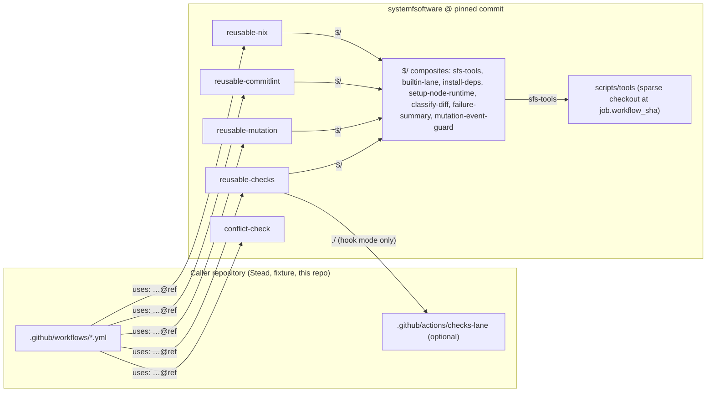
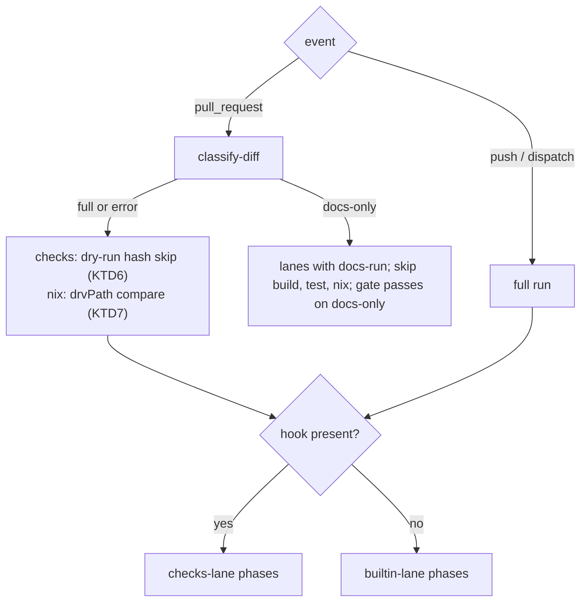

# Drop-in reusable workflows - Plan

## Goal Capsule

- **Objective:** A systemfsoftware repository gets this monorepo's checks, mutation, commitlint and nix CI by calling four reusable workflows with a few optional inputs, and writes no CI glue of its own.
- **Means:** Make `checks`, `mutation`, `commitlint` and `nix` reusable workflows in `.github/workflows/` that carry their own setup, tools and defaults, keep a caller-supplied lane hook optional, and turn this repository's own workflows into callers of them (KTD1, KTD2, KTD3).
- **Product authority:** Ruling OST-PR2-BRAINSTORM. This is PR 2 of the org shared tooling series, cut from `origin/main` at `732f66a0c8`; PR 3 to PR 5 are not active scope.
- **Stop conditions:** Stop and report if a fixture run shows `$/` does not resolve inside a called workflow or a composite (KTD1), or if R4's input diff shows a removed or renamed input.
- **Execution profile:** Evaluator surface only (`.github/`, `scripts/tools/`). One branch, one PR against `main`, every unit its own commits, no local mutation run of any kind.
- **Who finishes:** The implementing agent opens the PR and watches it to green; the operator merges.

---

## Product Contract

### Summary

Four reusable workflows become callable from any pnpm workspace in the org, each resolving its own actions and tools at the commit the caller pins. The checks workflow runs built-in lanes when the caller has no hook, and runs the caller's hook when it has one. Pull requests run only what the diff can affect, and mutation never runs on a pull request.

### Problem Frame

`reusable-checks.yml` is shared in name only. Every job calls `./.github/actions/checks-lane` (`.github/workflows/reusable-checks.yml:155`, `:226`, `:252`, `:304`, `:324`, `:392`), and per the GitHub docs a `./` path in a called workflow resolves against the caller's checked-out workspace, not the repository that holds the workflow. So a caller must write a composite action implementing every phase before the workflow runs at all. Stead did this, with a 200-line composite. api-extractor-effect, the first consumer of the PR 1 tarballs, has a single hand-written `ci.yml` and calls no reusable.

Mutation, commitlint and nix have no reusable form. `mutation.yml` runs `scripts/tools/mutation-job.ts` and `scripts/tools/test-timings.ts` from the caller's checkout (`.github/workflows/mutation.yml:14-15`). `commitlint.yml` and `nix.yml` are local jobs. stryker-js-effect repeats commitlint and nix by hand, and api-extractor-effect has neither, so each new repository either copies YAML or goes without.

The brief said stryker-js-effect and api-extractor-effect call `reusable-checks` today. They don't. Neither calls any workflow from this repository. Across the 32 org repositories that have workflows, the one cross-repo caller of `reusable-checks.yml` is Stead, pinned at `ea2037df`.

### Key Decisions

- **Reusables reach their own actions through the self-repository reference `$/`, and their own tools through `job.workflow_repository` and `job.workflow_sha`.** A fully qualified `systemfsoftware/systemfsoftware/.github/actions/x@<ref>` would need a second pin that drifts from the caller's pin, and inlining would copy Node setup into every job. With `$/`, a caller pinning commit X runs X's actions, so PR 4 only pins the callers' `uses:` lines. Governs R2.
- **Tools come from a sparse checkout of `scripts/` at `job.workflow_sha` and run under Deno, not from `nix build github:systemfsoftware/systemfsoftware/<sha>#test-timings`.** Fetching the flake source pulls the whole tree, including the 176 MB `repos/` subtree, and it would make every consumer install Nix for a planner. The tools still run at the workflow's own revision, the principle pnpm-release-management's `changeset-check.yml` already follows. Governs R2.
- **The checks workflow detects the hook by the file being present, not by an input.** Callers with a hook keep working after a pin bump without editing anything. An opt-in input that defaults to off would silently skip Stead's steps the day it bumps. Governs R3, R4.
- **This repository's mutation caller stays `workflow_dispatch`-only.** #700 dropped the push trigger because main's mutation run is red (the last five runs failed or were cancelled). Turning push back on is a separate decision. The reusable itself refuses every pull request event. Governs R5, R13.
- **The proof is a consumer fixture inside this repository, not a new consumer repository.** A workflow in another repository has to pin a static ref, so it can't follow a pull request's head. The fixture can, and it is reviewed in the same diff. Governs R12.
- **Commitlint config stays with the caller.** The reusable owns the job, and the caller keeps its own `commitlint.config.*` and dependencies, as stryker-js-effect already does. A shared config package is deferred. Governs R1.
- **A docs-only pull request still runs the repository's document gates.** Skipping every lint lane would let a docs pull request break dprint formatting or the single-plan rule (REPO-D2) unseen, so a lane may name a cheap docs command that runs instead. Governs R15.

### Requirements

**Consumer surface**

- R1. A consumer repository calls each of `checks`, `mutation`, `commitlint` and `nix` with only documented `with:` inputs. Every input is optional, and the consumer adds no composite action.
- R2. A reusable reaches its composites and tools at the commit the caller pinned, never through the caller's checkout.
- R3. The checks workflow runs the caller's `.github/actions/checks-lane` phases when the caller has that action and its built-in pnpm lanes (install, build, planned tests, timings, gate) when it does not, and its step summary names which one ran.
- R4. Every input and secret a pinned caller passes today keeps its meaning, so Stead's `ci.yml` and this repository's callers pass unchanged after their pin moves to the PR 2 merge commit.

**Event policy**

- R5. The mutation workflow runs on a push to the default branch or a manual dispatch, and refuses `pull_request`, `pull_request_target` and `merge_group` events with a named reason before it installs anything.
- R6. On a pull request, the checks and nix workflows run only the packages and flake outputs the diff can affect; on the default branch they run everything.
- R7. A pull request whose every changed path is in the docs set finishes every required job within 3 minutes, and a diff the classifier cannot place runs everything. The default docs set is `docs/**`, root `*.md`, `**/AGENTS.md` and `**/CLAUDE.md`; an input replaces it.
- R15. On a docs-only pull request, a lane that declares a docs command runs that command in place of its full command; a lane without one is skipped.

**Wall clock**

- R8. Every new or changed job finishes within 10 minutes on a pull request on GitHub-hosted `ubuntu-latest`.

**Failure output**

- R9. A failing job writes a step summary with a reason code from a fixed set, the local command that reproduces the failure, and the next action. An `::error` annotation names the artifact that holds the full log.

**Ownership**

- R10. Checks, mutation, commitlint, nix and the conflict check live in this repository, and changeset-check and release stay in pnpm-release-management. This repository's `ci.yml`, `mutation.yml`, `commitlint.yml` and `nix.yml` become callers of the reusables, and steps that are specific to this repository stay in its hook or in local jobs beside the call.
- R11. `reusable-smoke.yml`, which only `ci.yml` calls, is folded into `ci.yml`, so every `workflow_call` file left is one a consumer can call.

**Proof**

- R12. This repository's CI calls each reusable on a consumer fixture: its own pnpm workspace and lockfile, no hook, no composite actions, documented inputs only. The fixture runs on every pull request that changes a reusable. Mutation's working path runs on a push to main, and a pull request run proves the R5 refusal.
- R13. After merge, this repository's CI, Commitlint, Nix, Changeset Check and Release workflows stay green on main.
- R14. `.github/AGENTS.md` states the consumer contract (inputs, hook, where tools come from, event policy, consumer prerequisites) and no longer says that mutation triggers on push (line 21).

### Acceptance Examples

- AE1. **Covers R3.** **Given** Stead, which has `.github/actions/checks-lane`, **when** checks runs, **then** every phase calls that hook and the summary reads "lane hook". **Given** the fixture, which has no hook, **when** checks runs, **then** the built-in install, build and test steps run and the summary reads "built-in lanes".
- AE2. **Covers R5.** **Given** a `pull_request` event, **when** a caller invokes mutation, **then** the job fails within one minute with reason `mutation-on-pull-request` and no install step runs. **Given** a push to main, **then** it plans and runs.
- AE3. **Covers R7, R15.** **Given** a diff that changes only `docs/plans/x.md`, **then** build, test and nix jobs are skipped, a lane with a docs command runs only that command, the gate passes and the summary records "docs-only". **Given** a diff that also changes `packages/foo/README.md`, **then** everything runs, because the README ships in the tarball.
- AE4. **Covers R6.** **Given** a pull request that changes one package, **then** the plan runs that package and its dependents and skips any package whose test hash last passed. **Given** a push to main, **then** every package runs.
- AE5. **Covers R9.** **Given** a failing test, **then** the summary shows a test-failure reason code, `pnpm --filter <pkg> test`, and an annotation that names the job's log artifact.
- AE6. **Covers R4.** **Given** Stead changes nothing except its pin, moved to the PR 2 merge commit, **then** its run takes the same lanes and passes.

### Success Criteria

| Lane on a pull request                               | Today, measured                  | Estimate after PR 2                                                                    | Ceiling           |
| ---------------------------------------------------- | -------------------------------- | -------------------------------------------------------------------------------------- | ----------------- |
| checks, per job (plan, static, rust, gritlint, test) | 0.6 to 6.6 min                   | same, plus 5 to 15 s per job for the `$/` action download                              | 10 min (R8)       |
| commitlint                                           | 0.4 to 0.9 min                   | same                                                                                   | 10 min (R8)       |
| nix, per system                                      | 6.0 to 7.8 min                   | 6.5 to 8.5 min when every output changed; less when gritlint's derivation is unchanged | 10 min (R8)       |
| fixture checks, commitlint, nix (new)                | not measured                     | 1 to 3 min each                                                                        | 10 min (R8)       |
| any docs-only pull request, whole run                | 7.6 to 8.6 min (nothing skipped) | 1.5 to 3 min                                                                           | 3 min (R7)        |
| mutation                                             | never on a pull request          | guard step under 1 min                                                                 | refusal only (R5) |

The measurements come from this repository's runs on 2026-10-10: runs 38034152870, 38034029400 and 38033799482 (CI) and runs 38034152732 and 38033799256 (Nix). The estimates are not measured; U2 to U7 record the first real numbers in the PR body.

### Scope Boundaries

**Deferred for later**

- Pinning every reusable and action by SHA, with update automation (PR 4).
- The `nix flake init` template (PR 3).
- The shared step that installs the flake tarballs into a consumer (PR 5).
- A shared commitlint config package.
- Adoption pull requests in api-extractor-effect and stryker-js-effect, and Stead's pin bump that proves AE6. Those are separate pull requests in those repositories.
- Turning the push trigger back on for this repository's mutation run, which waits on main's mutation going green (#700).
- Narrowing the workspace tarball derivations' source. Today every tarball's derivation changes on any tracked-file change (Planning Contract, Research), which limits what KTD7 can skip in this repository.

**Outside this work**

- Changes to gritlint in this tree, and any local mutation run.
- Changes to pnpm-release-management. The inventory found no duplicate to remove: this repository only calls its `changeset-check.yml` and `release.yml`.

<!-- ce-section: work-relationships -->

### How This Work Fits Together

This plan covers PR 2. The breakdown below is the current understanding of the series, not a committed roadmap.

- PR 1 (#707, merged): tsdown-config, vitest-config and stryker-config ship as flake tarballs.
  - PR 2 (this plan): drop-in reusable workflows. Depends on PR 1 only for ordering.
    - PR 3: a `templates.default` that instantiates a consumer calling these reusables. Depends on PR 2's input surface.
    - PR 4: SHA pins for every `uses:`, plus update automation. Depends on PR 2 having no stray `./` references inside the reusables.
    - PR 5: one shared step that installs the flake tarballs into a consumer repository. Shares the consumer contract with PR 2. Still to decide whether it lands as a composite reached through `$/`.

### Dependencies / Assumptions

- `$/` resolves to the called workflow's repository at its running commit, and works inside composite actions. The GitHub workflow-syntax and metadata-syntax docs say so. No run has confirmed it yet; U2's first fixture run does.
- `job.workflow_repository` and `job.workflow_sha` are populated in a called workflow. pnpm-release-management's `changeset-check.yml` builds from them, and it passed on #707.
- A skipped job reports Success to required checks (GitHub docs, "Control jobs with conditions"). R7 therefore relies on the classifier failing closed.
- A step that `uses:` a local action and is skipped by its `if:` does not need the action to exist. [INFERENCE] The first U2 fixture run proves it.
- Stead is the only cross-repo caller of `reusable-checks.yml`. Basis: a REST scan of every unarchived org repository's `.github/workflows` on 2026-10-10.
- The pnpm-release-management pin in `.github/workflows/changeset-check.yml:14` and `release.yml:18` (`8cd6e83009531de040cd9c03e1370b4966fd2a12`) resolves. An inventory scout reported it as unresolvable, but the SHA it checked was a 39-character mistranscription.

### Outstanding Questions

**Needs operator sign-off (GATE1), not blocking**

- A static check that fails when a reusable workflow or a composite under `.github/` contains `uses: ./`, except the hook step of KTD3. Without it, R2 is enforced by the fixture (KTD5) and by review.

### Sources / Research

- GitHub docs, workflow syntax: [`$/` self-repository reference and `./` resolution](https://docs.github.com/en/actions/reference/workflows-and-actions/workflow-syntax#example-using-an-action-in-the-same-repository-as-the-workflow-at-the-running-commit-recommended); [metadata syntax, `runs.steps[*].uses`](https://docs.github.com/en/actions/reference/workflows-and-actions/metadata-syntax); [`job.workflow_*` context](https://docs.github.com/en/actions/reference/workflows-and-actions/contexts#job-context); [skipped jobs report Success](https://docs.github.com/en/actions/how-tos/write-workflows/choose-when-workflows-run/control-jobs-with-conditions).
- `.github/workflows/reusable-checks.yml` (inputs `:9-126`), `.github/actions/checks-lane/action.yml`, `.github/workflows/mutation.yml`, `.github/workflows/nix.yml`, `.github/workflows/commitlint.yml`, `.github/AGENTS.md:19-21`.
- Stead `.github/workflows/ci.yml` (the pinned caller R4 protects): it passes `record`, `runs-on`, `test-runs-on`, `target`, `max-jobs`, `max-seconds`, `timeout-minutes`, `plan-timeout-minutes`, `gate-name`, `gate-lane`, `gate-timeout-minutes`, `test-flags`, `shard-flags`, `pnpm`, `persist-credentials`, `fetch-tags`, `turbo-team`, `dry-run`, `lanes` and two secrets, and leaves `timings` at its default.
- pnpm-release-management @ `b9b4a1d4`: `changeset-check.yml` builds its tools from `job.workflow_repository`/`job.workflow_sha`, and the repository has no composite actions.
- api-extractor-effect PR #1 (`feat/foundation` @ `9c9fb009`) `ci.yml`, and stryker-js-effect @ `cfdf3cdc` `commitlint.yml`, `nix.yml` and `.github/actions/released-tarballs`.

---

## Planning Contract

### Key Technical Decisions

- KTD1. **Every `uses:` inside a reusable or a shared composite that targets this repository's actions is `$/.github/actions/<name>`.** That includes `install-deps`'s own call to `setup-node-runtime` (`.github/actions/install-deps/action.yml:13`), because a `./` inside a composite also resolves against the workspace. Implements R2.
- KTD2. **One composite, `$/.github/actions/sfs-tools`, sparse-checks out `scripts/` from `job.workflow_repository` at `job.workflow_sha` into `.sfs-tools/`, sets up Deno, and exports `TIMINGS`, `MUTATION_JOB` and `CLASSIFY` as `deno run --config=… --lock=… --frozen` commands.** The `scripts/` tree is 60 KB compressed against 67 MB for the whole tree (`git archive` on 2026-10-10). Implements R2.
- KTD3. **Hook mode and built-in mode are two steps per phase, gated by `hashFiles('.github/actions/checks-lane/action.yml')`.** The hook step stays `uses: ./.github/actions/checks-lane` with the inputs it gets today (`lane`, `job`, `profile`); the built-in step is `uses: $/.github/actions/builtin-lane` with the same inputs. The `timings` input keeps its default `test-timings` in hook mode, which is what Stead relies on; in built-in mode an unset `timings` resolves to `TIMINGS` from KTD2. A `lane-source` workflow output carries `hook` or `built-in`. Implements R3, R4.
- KTD4. **Built-in lanes require the consumer workspace to have `turbo` and a `test` script per tested package, and nothing else.** `plan` provisions KTD2's tools, `static` installs dependencies and runs the lane's `run` command, `test` installs, builds through `turbo run build` and runs `turbo run test` as today (`.github/workflows/reusable-checks.yml:257-263`), and `timings` and `gate` need no setup. Implements R3, R14.
- KTD5. **A new optional input `working-directory` (default `.`) roots every reusable at a subdirectory, and a non-root value checks out only that subdirectory (non-cone sparse checkout).** The fixture uses it, so this repository's `.github/actions/` is absent from the fixture's workspace and any stray `./` fails instead of resolving against this repository. The hook is still looked up at the repository root. Implements R12, R2.
- KTD6. **R6's checks half reuses the planner's existing dry-run hash skip, not turbo's `--affected`.** `test-timings.ts` already skips a package whose turbo hash is a remote cache hit or last passed (`scripts/tools/test-timings.ts:276-306`), and an unreadable dry run plans every package, which is the fail-closed direction. Built-in mode defaults `dry-run` to `pnpm exec turbo run test --dry=json` on pull requests and leaves it empty on the default branch. `--affected` would need a full-history fetch and was not measured. Implements R6.
- KTD7. **R6's nix half compares each declared output's `drvPath` at the pull request head against the base commit and builds only those that differ.** An unchanged derivation cannot have been changed by the diff, and an evaluation failure at either commit builds the output. Warm evaluation of every package and check took 2.9 to 3.2 s per commit here. On this repository the saving is limited: between `df908ddfe4` and `ba6664c185` (a `packs/`-only diff) every workspace tarball's `drvPath` changed and only 8 of 54 outputs stayed equal. Implements R6.
- KTD8. **The docs-only classifier is a Deno tool, `scripts/tools/classify-diff.ts`, behind a `$/.github/actions/classify-diff` composite.** It reads the changed paths from a `--filter=blob:none` depth-1 fetch of the event's base and head commits and outputs `docs-only` or `full`. Any event other than `pull_request`, a fetch or diff error, an empty path list or one path outside the set gives `full`. A two-dot diff against the base branch tip can only add paths, which is the safe direction. Implements R7, R15.
- KTD9. **Lane entries in the `lanes` input gain an optional `docs-run` command.** On a docs-only diff a lane with `docs-run` runs it and a lane without is skipped; build, test and nix jobs are skipped by their `if:`. The gate counts a skipped job as passed only when the classifier said `docs-only`. Implements R15.
- KTD10. **The reason codes are a closed set owned by `$/.github/actions/failure-summary`:** `merge-conflict`, `install-failed`, `plan-failed`, `hook-failed`, `lane-failed`, `build-failed`, `test-failed`, `timings-failed`, `gate-failed`, `commit-message-invalid`, `nix-eval-failed`, `nix-build-failed`, `outputs-differ-across-systems`, `mutation-on-pull-request`, `mutation-failed`, `mutation-merge-failed`, plus `unclassified` for a failure no table entry names. Each failing step tees its output to `$RUNNER_TEMP/sfs-logs/`, and an `if: failure()` step picks the first failed step's code from a per-job table, writes the summary, uploads `failure-log-<job>-<attempt>` and annotates with that name. Implements R9.
- KTD11. **The mutation refusal is a composite, `$/.github/actions/mutation-event-guard`, that is the first step of every mutation job.** A permanent proof can then call the guard on a real `pull_request` event with `continue-on-error` and assert its outcome. A job that calls a reusable workflow can't set `continue-on-error`, so calling the whole reusable on a pull request would leave a red check on every such PR. Implements R5, R12.
- KTD12. **The nix reusable takes a `builds` input: a JSON list of `{name, installable, run}`, where `{system}` in either string is replaced per matrix system.** Without `installable` the entry always runs; without `run` it runs `nix build -L <installable>`. The default is every attribute of `packages.{system}` and `checks.{system}`. An optional `compare-across-systems` installable reproduces today's `tarballs-match` job. Runners default to `x86_64-linux` on `ubuntu-latest` and `aarch64-linux` on `ubuntu-24.04-arm`, as today. Implements R1, R10.
- KTD13. **New reusables keep the `reusable-` file prefix: `reusable-mutation.yml`, `reusable-commitlint.yml`, `reusable-nix.yml`.** Renaming `reusable-checks.yml` would make Stead edit more than its pin. Implements R4.

### High-Level Technical Design

_Directional; the units own the detail._

Components and references after PR 2:

Decisions inside one checks or nix run:

Mode combinations the fixture and this repository cover:

| Caller                     | Hook | Event              | Expected                                                  |
| -------------------------- | ---- | ------------------ | --------------------------------------------------------- |
| this repo `ci.yml`         | yes  | pull_request, push | hook lanes, summary "lane hook"                           |
| fixture                    | no   | pull_request       | built-in lanes, classifier active, mutation guard refuses |
| fixture                    | no   | push to main       | built-in lanes, full run, mutation runs                   |
| Stead (after its pin bump) | yes  | its own events     | unchanged lanes (AE6)                                     |

### Implementation Constraints

- Root `AGENTS.md` classes `.github/` as Evaluator: every gate lands in its own commit, observed red before the work it judges and green after. Each unit therefore adds its fixture job first (red), then the work (green).
- No local mutation run of any kind (REPO-D3). The fixture's mutation runs in CI only.
- `scripts/tools/*.ts` follow the existing Deno conventions: imports through `scripts/deno.jsonc`, lockfile `scripts/deno.lock`, run with `--frozen`.
- A fixture is a real system oracle: it exercises both poles, accept and refuse (pack: boundary-testing, real-system-oracles.md). The unverified GitHub behaviours in Dependencies / Assumptions are pinned by fixture runs rather than prose (pack: boundary-testing, pin-dependency-semantics.md).

### Risks

- **`$/` on self-hosted runners.** Stead runs on self-hosted runners; an older runner may not resolve `$/`. AE6 is proven only by Stead's pin bump, outside this PR.
- **`$/` download cost.** [INFERENCE] If the runner fetches the whole repository tarball for a `$/` action as it does for `owner/repo@ref`, each job pays for 67 MB, 63 MB of it `repos/`. U2 records the "Set up job" time; if it exceeds 30 s, that is a finding for the operator, not a silent regression.
- **Turbo cache keys.** The fixture and this repository share one Actions cache namespace. Cache keys gain a hash of `working-directory` so the two never restore each other's entries.
- **KTD7 against a red base.** An output whose `drvPath` equals a red base is skipped on the pull request. The default branch still builds everything on push, so the red stays visible there.

### Research

- `nix eval` of `drvPath` for every package and check: 2.9 to 3.2 s per commit, warm. Across `ba6664c185..732f66a0c8` (#707) 10 of 58 outputs were unchanged; across `df908ddfe4..ba6664c185` (#704, `packs/` only) 8 of 54. Cold evaluation in CI is not measured.
- `git archive HEAD | gzip`: 66.8 MB for the tree, 63.1 MB for `repos/`, 0.06 MB for `scripts/` and `.github/`.
- The fixture's mutation dependencies resolve from the npm registry: `@systemfsoftware/stryker-js@17.0.2` and `@systemfsoftware/stryker-js-vitest-runner@8.1.1` carry only an `integrity` in `pnpm-lock.yaml`, no tarball URL.

---

## Implementation Units

### U1. Consumer fixture and its caller workflow

- **Goal:** A pnpm workspace with no hook and no composite, plus a workflow that calls `reusable-checks.yml` on it, observed red against today's reusable.
- **Requirements:** R12, R1.
- **Dependencies:** none.
- **Files:** `.github/consumer-fixture/` (`package.json`, `pnpm-workspace.yaml`, `pnpm-lock.yaml`, `turbo.json`, `commitlint.config.mjs`, `flake.nix`, `flake.lock`, `packages/answer/` with one source file, one vitest test, a stryker config and a `mutation` script); `.github/workflows/consumer-fixture.yml`.
- **Approach:** The workflow triggers on `pull_request` with `paths:` covering `.github/workflows/reusable-*.yml`, `.github/workflows/conflict-check.yml`, `.github/actions/**`, `scripts/tools/**`, `scripts/deno.*`, `.github/consumer-fixture/**` and itself, plus `push` to main and `workflow_dispatch`. Its first job calls `./.github/workflows/reusable-checks.yml` with `working-directory: .github/consumer-fixture` and `record: fixture-test-timings`. All dependencies come from the npm registry; the flake has one trivial check. The `working-directory` input does not exist yet, so the run fails at validation: that is the recorded red.
- **Execution note:** Land as its own commit and push; record the failing run in the PR body.
- **Test scenarios:**
  - The fixture installs with `pnpm install --frozen-lockfile` and `pnpm exec turbo run test` passes inside `.github/consumer-fixture/`.
  - The fixture CI run fails against the unchanged `reusable-checks.yml`.
- **Verification:** The fixture's local install and test pass; the CI run is red with an input-validation or missing-action error.

### U2. Self-contained checks workflow

- **Goal:** `reusable-checks.yml` runs on the fixture with built-in lanes and on this repository with its hook.
- **Requirements:** R2, R3, R4, R6 (checks half), R12.
- **Dependencies:** U1.
- **Files:** `.github/workflows/reusable-checks.yml`, `.github/actions/install-deps/action.yml`, new `.github/actions/sfs-tools/action.yml`, new `.github/actions/builtin-lane/action.yml`, `.github/workflows/consumer-fixture.yml`.
- **Approach:** Apply KTD1 to `install-deps`. Add `sfs-tools` (KTD2), `builtin-lane` (KTD4), the two-step phases and `lane-source` output (KTD3), `working-directory` and its sparse checkout (KTD5), the built-in `dry-run` default (KTD6), and the working-directory hash in turbo cache keys (Risks). No existing input is removed, renamed or re-defaulted for hook mode. The fixture workflow gains an assertion job that requires `lane-source == built-in`.
- **Test scenarios:**
  - Fixture on a pull request: plan, test, timings and gate pass and the summary reads "built-in lanes" (AE1).
  - This repository's `ci.yml` on the same PR: every lane takes the hook path and the summary reads "lane hook" (AE1).
  - One-off, reverted in the next commit: a planted `uses: ./.github/actions/install-deps` in `builtin-lane` makes the fixture fail (proves KTD5).
  - A throwaway script compares `on.workflow_call.inputs` and `secrets` of `reusable-checks.yml` at `origin/main` and at HEAD: no key removed or renamed, every existing default unchanged (R4).
- **Verification:** Fixture checks green; `ci.yml` green; the R4 comparison prints no differences except added keys.

### U3. Docs-only classifier

- **Goal:** A docs-only pull request finishes in under 3 minutes and still runs its document gates.
- **Requirements:** R7, R15.
- **Dependencies:** U2.
- **Files:** new `scripts/tools/classify-diff.ts`, new `scripts/tools/classify-diff.test.ts`, new `.github/actions/classify-diff/action.yml`, `.github/workflows/reusable-checks.yml`, `.github/actions/checks-lane/action.yml` (adds the new test to the plan lane's `deno test` line), `.github/workflows/ci.yml` (`docs-run` on the static lane).
- **Approach:** KTD8 for the classifier, KTD9 for lanes and the gate. A `docs-globs` input replaces the default set. This repository's static lane declares a `docs-run` that runs the single-plan check and dprint over the changed files.
- **Test scenarios:**
  - `classify` on `docs/plans/x.md` alone gives `docs-only`.
  - `docs/plans/x.md` plus `packages/foo/README.md` gives `full` (AE3).
  - An empty path list gives `full`.
  - `packages/x/AGENTS.md` and root `README.md` give `docs-only`; `docs-globs` replacing the set with `notes/**` makes `docs/x.md` give `full`.
  - One-off: a draft scratch PR into this branch that changes one file under `docs/` shows build, test and nix skipped, the static lane's `docs-run` ran, the gate green, and a whole-run time under 3 minutes. The PR is closed afterwards.
- **Verification:** The Deno tests pass in the plan lane; the scratch PR's timings are recorded in the PR body.

### U4. Failure summary

- **Goal:** Every failing reusable job names a reason code, a local reproduce command, the next action, and its log artifact.
- **Requirements:** R9.
- **Dependencies:** U2.
- **Files:** new `.github/actions/failure-summary/action.yml`, `.github/workflows/reusable-checks.yml`, `.github/workflows/conflict-check.yml`, `.github/actions/builtin-lane/action.yml`.
- **Approach:** KTD10. Each job passes a table mapping its step IDs to a code, a reproduce command and a next action. U5 to U7 wire the same composite into their workflows.
- **Test scenarios:**
  - One-off, reverted: a failing assertion planted in the fixture's test gives reason `test-failed`, `pnpm --filter answer test`, and an annotation naming `failure-log-test-…` (AE5); the artifact exists on the run.
  - A failure in a step the table does not name gives `unclassified` and still uploads the log.
- **Verification:** Both one-off runs observed and linked in the PR body.

### U5. Mutation workflow

- **Goal:** Mutation is callable by any repository, runs on push and dispatch, and refuses pull requests.
- **Requirements:** R5, R10, R12.
- **Dependencies:** U2, U4.
- **Files:** new `.github/workflows/reusable-mutation.yml`, new `.github/actions/mutation-event-guard/action.yml`, `.github/workflows/mutation.yml` (becomes a caller, still `workflow_dispatch` only), `.github/workflows/consumer-fixture.yml`.
- **Approach:** Move the plan, mutation, timings and merge jobs from `mutation.yml` into the reusable, reading tools from KTD2 and guarded by KTD11. Inputs carry today's constants (`TARGET_SECONDS`, `--max-jobs 20`, `--max-seconds 4500`, the 75-minute job timeout) as defaults. The fixture runs the reusable on push to main and dispatch, and on pull requests runs the guard alone with `continue-on-error`, then asserts its outcome.
- **Test scenarios:**
  - Fixture on a pull request: the guard step fails with `mutation-on-pull-request` within one minute and no install step ran; the assertion job is green (AE2).
  - Fixture on `workflow_dispatch` from this branch: plan, mutation and merge run, and the merged report artifact exists (AE2 working path; push to main repeats it after merge).
  - This repository's `mutation.yml` still offers only `workflow_dispatch`.
- **Verification:** Both fixture runs green; the dispatch run's report artifact is linked in the PR body.

### U6. Commitlint workflow

- **Goal:** Commitlint is callable by any repository that keeps its own config.
- **Requirements:** R1, R10.
- **Dependencies:** U4.
- **Files:** new `.github/workflows/reusable-commitlint.yml`, `.github/workflows/commitlint.yml` (becomes a caller), `.github/workflows/consumer-fixture.yml`.
- **Approach:** The reusable checks out with full history, installs dependencies through `$/.github/actions/install-deps`, and runs `pnpm exec commitlint --from <base> --to <head>` from `working-directory`. It skips Dependabot as today. The conflict check stays a separate call in the caller.
- **Test scenarios:**
  - Fixture on this PR: passes on the branch's conventional commits.
  - This repository's `commitlint.yml`: same verdict as before on this PR.
  - One-off, reverted: a commit subject with a trailing period on a scratch commit gives `commit-message-invalid`.
- **Verification:** Both callers green; the one-off red linked in the PR body.

### U7. Nix workflow

- **Goal:** Nix CI is callable by any flake repository, and a pull request builds only the outputs whose derivation changed.
- **Requirements:** R1, R6 (nix half), R10.
- **Dependencies:** U3, U4.
- **Files:** new `.github/workflows/reusable-nix.yml`, `.github/workflows/nix.yml` (becomes a caller), `.github/workflows/consumer-fixture.yml`.
- **Approach:** KTD7 and KTD12. This repository's `nix.yml` passes its current steps as `builds` entries (the `x86_64-windows` refusal without an installable, `gritlint`, the `test-timings` HOME check, the bit-for-bit tarball rebuild, `consumer-store`, the wrong-integrity sabotage, `consumer-load`) and `compare-across-systems: .#packages.{system}.workspace-tarballs`. The docs-only classifier skips the job.
- **Test scenarios:**
  - Fixture on a pull request that leaves the fixture flake untouched: its check is listed as unchanged and not built; the job is green.
  - Fixture on push to main: the check is built.
  - This repository on this PR: outputs whose `drvPath` changed are built, the rest are listed as unchanged, and `tarballs-match` runs when the tarball derivation changed.
  - An entry whose `installable` fails to evaluate at the base commit is built, not skipped.
- **Verification:** Both callers green on both systems; per-system wall clock recorded in the PR body.

### U8. Fold the smoke workflow into ci.yml

- **Goal:** Every `workflow_call` file left is one a consumer can call.
- **Requirements:** R11.
- **Dependencies:** none.
- **Files:** `.github/workflows/ci.yml`, delete `.github/workflows/reusable-smoke.yml`.
- **Approach:** Move the `smoke` job body into `ci.yml` as a local job with the same name, needs and timeout.
- **Test scenarios:** Test expectation: none -- pure relocation; the smoke job's own run on this PR is the check.
- **Verification:** The smoke job passes on this PR; `git grep -n reusable-smoke` returns nothing (DEL1).

### U9. Consumer contract documentation

- **Goal:** A repository author can adopt the reusables from `.github/AGENTS.md` alone.
- **Requirements:** R14.
- **Dependencies:** U2 to U7.
- **Files:** `.github/AGENTS.md`.
- **Approach:** One section per reusable listing its inputs and defaults, the hook contract (KTD3), where tools come from (KTD2), the event policy (R5, R7), the reason codes (KTD10), consumer prerequisites (KTD4) and required caller permissions. Replace the line-21 claim that mutation triggers on push.
- **Test scenarios:** Test expectation: none -- documentation.
- **Verification:** Every input in the four reusables' `on.workflow_call.inputs` appears in the section (checked by a throwaway script, not committed).

---

## Verification Contract

- `pnpm check:local` after the last edit. The only accepted red is `@systemfsoftware/effect-daemon-microvm#test`, which needs `/dev/kvm` and runs in CI only (OP27).
- `deno test --config=scripts/deno.jsonc --lock=scripts/deno.lock --frozen --allow-read --allow-write --allow-env --allow-run scripts/tools/` passes, including the new classifier tests.
- `pnpm install --frozen-lockfile && pnpm exec turbo run test` passes inside `.github/consumer-fixture/`.
- On the PR head, read through `xd://github` `run_watch`: CI, Consumer fixture, Commitlint, Nix and Changeset Check all succeed, and every new or changed job's duration is at most 10 minutes (R8).
- The one-off runs named in U2 to U7 are linked in the PR body with their observed reason codes and timings, and their planted changes are reverted on the branch.
- No mutation run starts outside CI (REPO-D3); the fixture's mutation runs are CI runs.

## Definition of Done

- U1 to U9 landed as separate commits in the evaluator order of Implementation Constraints, each with its verification observed.
- Every `uses:` inside the four reusables and the shared composites is `$/…`, a third-party action, or the KTD3 hook step.
- The R4 input comparison shows only added inputs.
- The PR is open against `main`, green on its head, and its body carries the measured lane times, the one-off evidence, and the known follow-ups: Stead's pin bump (AE6), consumer adoption PRs, the GATE1 question, and narrowing the tarball derivations' source.
- No planted change, scratch branch or throwaway script remains in the diff; the scratch PR is closed.
- After merge, R13's workflows are green on main.
