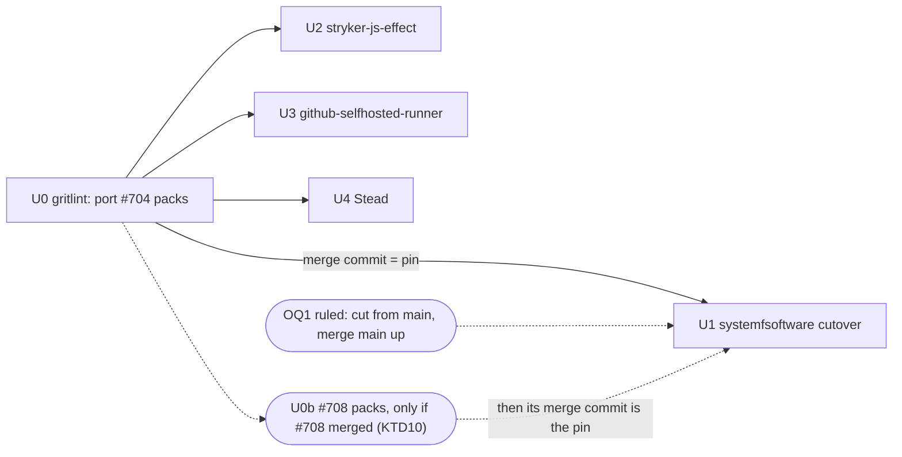

# Consume gritlint from its own repository - Plan

## Goal Capsule

- **Objective:** every repository that runs gritlint (systemfsoftware, stryker-js-effect, github-selfhosted-runner, Stead) runs the binary built by `systemfsoftware/gritlint` at a pinned commit that carries every rule change made so far, and a systemfsoftware pull request no longer pays to compile or gate Rust.
- **Means:** port the #704 pack delta into the gritlint repository, swap systemfsoftware's in-tree build for a pinned `gritlint` flake input and delete the Rust workspace, then switch each consumer to its own pinned `gritlint` input (KTD1, KTD2, KTD5).
- **Product authority:** the caller's unit contract (Done 1–5 and its "does not count" list), then the supervisor rulings recorded as `session-settled` entries below, then this plan, then planner judgment.
- **Stop conditions:** stop and report before pinning a gritlint commit that is not a descendant of U0's merge; before pushing U1 while the overlap check fails (OQ1); before copying anything from the gritlint repository into systemfsoftware; before editing any consumer's `.github/` tree; before any force-push, merge, local mutation run or `--no-verify`.
- **Execution profile:** five pull requests in five repositories (gritlint, systemfsoftware, stryker-js-effect, github-selfhosted-runner, Stead), each cut from that repository's `main`, each one `gh stack` layer on trunk `main`. U0 must merge before U1's final lock; U2–U4 pin the same commit as U1 and can merge in any order after U0. The agent opens and watches PRs to green and reports head SHAs; the root merges.

---

## Product Contract

### Summary

systemfsoftware takes `gritlint` from a `gritlint` flake input locked to a `systemfsoftware/gritlint` commit at or after the merge of a pack-port PR, the way it takes `comment-checker`, and deletes its Rust workspace, rule packs, release surface and Rust CI lane. stryker-js-effect, github-selfhosted-runner and Stead each take gritlint straight from that repository at the same pinned commit.

### Problem Frame

gritlint has two homes. `systemfsoftware/gritlint` was imported byte-for-byte from this repository at `df908dd` and builds, gates and serves the same `gritlint` and `gritlint-unwrapped` flake packages. This repository still compiles its own copy, so every pull request pays for a `rust` lane and two per-system gritlint builds in the Nix workflow that the other repository already performs.

The copies have drifted. #704 (`ba6664c`) changed `packs/cell-architecture` here after the import, so gritlint `main` (`0c90938`) lacks that rule change. Two open PRs here (#705, #708) widen the gap further (OQ2, ruled: KTD10).

Consumers are split three ways. stryker-js-effect reads `gritlint-unwrapped` and github-selfhosted-runner reads `gritlint` from this repository's flake, so their gritlint version moves only when they bump an input that also carries unrelated tools. Stead installs `@systemfsoftware/gritlint@0.1.0` from npm, published 2026-09-26 before registry publishing was dropped (#655); that release can never be updated.

### Key Decisions

- **Consumers pin `systemfsoftware/gritlint` directly.** A re-export ties a consumer's gritlint version to this repository's lock cadence and to unrelated tools on the same input. Governs R12, R13, R14.
- **The rule packs have one home, the gritlint repository, and #704 lands there first.** (session-settled: user-directed — chosen over pinning `0c90938` and recording the gap: a pin without #704 ships a rule this repository already superseded.) The binary embeds `packs/` at compile time (gritlint `apps/gritlint/src/main.rs:11`), so a copy here does nothing once the binary comes from the input. Porting into gritlint is the allowed direction; nothing is copied back. Governs R1, R3, R15.
- **Both `packages.<system>.gritlint` and `gritlint-unwrapped` stay exported here as plain aliases of the input.** (session-settled: user-directed — chosen over exporting `gritlint` alone: the contract names both, the alias costs nothing, and it protects any consumer not yet found.) Governs R7.
- **The sandboxed journey stays in CI; `checks.gritlint` and the Nix workflow's per-system build go.** (session-settled: user-directed — chosen over keeping both: rebuilding another repository's artifact is that repository's CI job; the `gritlint` lane that runs `./bin/gritlint check` plus the planted violation is this repository's proof.) Governs R10, R11.
- **Stead takes gritlint as a flake package.** (session-settled: user-directed — chosen over a tarball built here or waiting for gritlint's PR6 tarball: no tarball exists, and a Nix-linked binary does not run outside Nix.) Research found Stead's lint lane enters no dev shell (`.github/actions/checks-lane/action.yml:157-165` in Stead runs plain `bash`), so CI reaches the package through a `bin/gritlint` wrapper, the pattern Stead's own `bin/dprint` documents for every tool. Governs R14.
- **Historical plans in `docs/plans/` are records and stay unedited.** Live doctrine (`AGENTS.md`, `docs/solutions/`, `compound-packs/`, `.changeset/README.md`) is updated. Governs R6.
- **Build gritlint from the input's source for now.** A fixed-output fetch of a release binary would cost consumers no compile, but gritlint publishes no release binaries until its own PR6 ships. Governs R1.

### Requirements

**gritlint repository (U0)**

- R15. gritlint `main` carries #704's pack delta: `packs/cell-architecture/rules/service-exports-no-layer.md`, `packs/cell-architecture/README.md`, and the 12 fixture cases under `packs/cell-architecture/fixtures/service-exports-no-layer/`, byte-identical to systemfsoftware `732f66a`, and its `gritlint-packs` check passes. The PR changes pack files only; no engine, flake, CI or doc file.

**gritlint source in systemfsoftware (U1)**

- R1. The flake gets `gritlint` from a `gritlint` input that does not follow this repository's `nixpkgs`, locked in `flake.lock` to a gritlint `main` commit that is U0's merge commit or a descendant of it.
- R2. The repository holds no gritlint source and no Rust workspace: `apps/`, `crates/` (including `crates/AGENTS.md`), `Cargo.toml`, `Cargo.lock`, `rust-toolchain.toml`, `clippy.toml`, `deny.toml`, `nix/gritlint.nix`, `nix/gritlint-sandbox.nix`, the `rust-overlay` input, the Rust toolchain helper and the version read from `Cargo.toml` are gone.
- R3. `packs/` is gone. Every pack this repository and its consumers enable is the one embedded in the pinned binary.
- R4. The gritlint release surface is gone: `npm/gritlint`, the `cargo` surface and `distribution` block in `release.jsonc`, `scripts/tools/gritlint/` with its `gate:repo` selftest, and `scripts/tools/gate-rust.sh` with `gate:rust`. No pending `.changeset/` intent names `@systemfsoftware/gritlint`; `.changeset/ledger.yaml` is left as pnpm wrote it (KTD7).
- R5. `gritlint.json` enables the same packs with the same parameters; its `$schema` is the raw GitHub URL of `npm/gritlint/configuration_schema.json` at the locked commit; its ignore entries for deleted fixture paths are gone.
- R6. No live doctrine or config names a deleted path: the `AGENTS.md` directory-map rows for `apps/`, `crates/`, `packs/`, `npm/` and REPO-S5's `npm/` clause; `.changeset/README.md`'s launcher paragraph; `docs/solutions/tooling-decisions/gritlint-conventions-platform.md` (gritlint carries it); the Windows MAX_PATH solution `docs/solutions/build-errors/cargo-git-dependency-submodules-exceed-windows-max-path.md` (deleted, KTD9); `compound-packs/package-topology` citations of `packs/source-resolution`; the `npm/*` glob in `pnpm-workspace.yaml`; the `dprint.json` exclude for a deleted fixture; the `rust` lane id in the checks-lane `lane` input description; the `/target/` line and its "Cargo" comment in `.gitignore`.

**Flake surface owned here**

- R7. `packages.<system>.gritlint` and `packages.<system>.gritlint-unwrapped` evaluate to the input's own store paths.
- R8. The dev shell keeps every tool it has today except the Rust toolchain and `cargo-deny`.
- R9. `lib.mkConsumerStore`, `workspace-tarballs`, and the `consumer-store`, `consumer-load` and sabotage checks behave as before.

**CI**

- R10. The `rust` lane, its checks-lane steps (Rust lane environment, cargo cache restore and save, Rust gate), `gate:rust` in `check:ci` and `check:local`, `checks.gritlint` and the Nix workflow's per-system `gritlint` build are gone; no lane is skipped or disabled in their place. The Nix workflow's `x86_64-windows` refusal evaluates an attribute this flake defines itself.
- R11. The `gritlint` lane runs the input's sandboxed binary through the planted-violation journey and `./bin/gritlint check` against this repository, and is green on the PR head.

**Consumers (one PR each, cut from that repository's `main`)**

- R12. stryker-js-effect takes `gritlint` from a `gritlint` input pinned in its `flake.lock` to R1's commit. It keeps the unsandboxed binary its read-only workflows need, and its `systemfsoftware` input stays for `repo-checks`.
- R13. github-selfhosted-runner takes `gritlint` from a `gritlint` input pinned to R1's commit. Its `systemfsoftware` input stays for `comment-checker` and the `agent-guards` source.
- R14. Stead stops installing `@systemfsoftware/gritlint` from the registry and gets gritlint from a `gritlint` flake input pinned to R1's commit. The PR touches only that dependency: its flake and lock, a `bin/gritlint` wrapper, `lint:conventions`, the catalog entry and its stale comment, `gritlint.json`'s `$schema`, and `pnpm-lock.yaml` regenerated by pnpm.

### Acceptance Examples

- AE1. **Covers R1, R7, R11.** **Given** the U1 head, **when** `.#packages.x86_64-linux.gritlint` and `gritlint-unwrapped` are evaluated, **then** their out paths equal the gritlint flake's own attributes at the locked rev, and the `gritlint` lane's planted violation exits 1 and `./bin/gritlint check` exits 0.
- AE2. **Covers R3, R5.** **Given** this repository's `gritlint.json`, **when** the input's binary runs `check`, **then** it exits 0 with output identical to the in-repo build at `732f66a`. Observed during the brainstorm at `0c90938`: both exit 0, byte-identical.
- AE3. **Covers R15.** **Given** U0 with only the 12 fixtures ported, **when** `gritlint-packs` runs, **then** it fails (the old rule leaves the new `bad/` cases clean); **given** the rule body and README also ported, **then** it passes.
- AE4. **Covers R12, R13, R14.** **Given** a consumer PR, **when** its CI runs the conventions gate, **then** its `flake.lock` names `systemfsoftware/gritlint` at R1's rev and the gate passes.

### Success Criteria

- CI job-minutes on a systemfsoftware PR fall. Measure the sum of `completed_at - started_at` over every non-skipped job, from the jobs API, for the CI and Nix workflows.
- **Baseline (recorded 2026-10-10):** median over the last 10 successful `pull_request` runs, attempt 1. CI: **27.4 job-min** (runs 38034352047, 38034152870, 38034029400, 38027567835, 38026987284, 38026369775, 38025502727, 38023303600, 38015422071, 38015035970). Nix: **13.8 job-min** (runs 38035171443, 38034351935, 38034152732, 38034029090, 38027567651, 38026987077, 38026369535, 38025502570, 38024103512, 38023303513). Removed by U1: the `rust` lane (2.2–3.0 job-min per CI run) and the Nix `gritlint` step (median 2.5 min in each of two system jobs). The `gritlint` lane costs 0.6–0.8 job-min on a closure-cache hit and 3.3 on a miss.
- **After:** U1's head run, attempt 1 (cold) and a rerun (warm), both reported in the PR. The cold attempt misses the closure cache, whose key is the sandboxed store path, so it compiles gritlint from the input once. [INFERENCE] The warm total should fall by about 7.5 job-min (CI ≈ 24.9, Nix ≈ 8.8).

### Scope Boundaries

- In the gritlint repository, only U0 (the #704 pack files) and, if KTD10 triggers, U0b (#708's pack files). Engine changes, the tarball (its PR6), releases and binary caches belong to that repository's own stack.
- Nothing is copied from the gritlint repository into systemfsoftware or any consumer.
- No pack, rule or engine behaviour changes beyond porting #704 verbatim (and #708 verbatim, if KTD10 triggers).
- `comment-checker`, `dprint`, `repo-checks`, `test-timings` and the workspace tarballs are unchanged.
- No consumer `.github/` file is edited.
- Floating refs, skipped lanes and hand-edited lockfiles are outside the definition of done.

**Considered and not built:**

- A gate that keeps `$schema` URLs in step with the locked rev. `$schema` has no reader (gritlint declares it as an ignored editor hint, `crates/gritlint_core/src/decode.rs:23-43`); drift only degrades editor completion. Evidence that would change this: a tool that resolves `$schema`.
- A `checks.gritlint` alias here. `nix flake check` is not run by any workflow here, and gritlint's CI builds the same derivation on both systems.

### Dependencies / Assumptions

- gritlint `main` is `0c90938` (checked with `git ls-remote` on 2026-10-10). Open gritlint PR #4 (single-pass engine) touches no `packs/` file and not `nix/gritlint-checks.nix`, so U0 does not overlap it.
- gritlint's `nixpkgs` lock (`aa48d347`) equals this repository's today. That is a fact about two locks, not a dependency (session-settled: user-directed — chosen over `inputs.nixpkgs.follows`: gritlint's own lock is what its CI proved).
- None of the four repositories enables `cell-architecture` in its `gritlint.json`, so the #704 port changes no current verdict.
- [INFERENCE] Stead's lint lane runs on `[self-hosted, systemfsoftware-runner, medium]`, the NixOS image from github-selfhosted-runner (`nix/runner/runner.nix:195` installs bubblewrap, and NixOS has no AppArmor userns restriction by default), so the sandboxed binary should run there. U4's CI is the check.

### Outstanding Questions

**Ruled by the supervisor (2026-10-10)**

- OQ1. **The OP13b overlap check fails for U1 as written** (open PRs #705, #708, #561, #310, #703, #550 and #325 share files with U1). Ruling: each branch is cut from `main` and merges `main` up as those PRs land; no stacking on them.
- OQ2. **#705 and #708 change gritlint here.** Ruling: unmerged work is not ported (KTD10). U0 ports #704 only; #705 does not hold U1.
- OQ3. **Stead lists `aarch64-darwin` in its flake systems** (`flake.nix:24`); gritlint builds only Linux. Ruling: Stead stays Linux-only; U4 exposes the package on `x86_64-linux` and `aarch64-linux`, and `bin/gritlint` errors elsewhere.

**Deferred to Implementation**

- Whether the sandboxed `gritlint` runs on Stead's runners. If U4's lint lane fails inside bubblewrap, Stead's package switches to `gritlint-unwrapped`, with stryker-js-effect's comment as the record (KTD6).
- Whether `pnpm version -r --dry-run` accepts a ledger entry for a package that left the workspace (KTD7).

### Sources / Research

- Pack embedding: gritlint `apps/gritlint/src/main.rs:11` (`include_dir!("$CARGO_MANIFEST_DIR/../../packs")`); gritlint `nix/gritlint.nix:57-65`.
- Pack parity: `diff -rq` of `git archive` output at gritlint `0c90938` and here at `732f66a`; only `packs/cell-architecture` differs (README, one rule, 12 fixture directories), all from `ba6664c` (#704).
- Engine parity: `apps/` and `crates/` identical except a behaviour-neutral let-chain refactor in `crates/gritlint_core/src/decode.rs`.
- gritlint flake at `0c90938` (`nix eval`): packages `gritlint`, `gritlint-unwrapped`; eleven checks including `gritlint-packs`; a Rust-only dev shell; no `lib`, default package or tarball.
- Org sweep: 81 repositories under `systemfsoftware` and `ryanleecode` shallow-cloned and scanned. Consumers: stryker-js-effect, github-selfhosted-runner, Stead. Incidental mentions only: pnpm-release-management (test fixtures named `@e2e/gritlint`), systemf-review-agent (a replay transcript), workstation (a solutions corpus). 74 repositories have no match.
- npm: `@systemfsoftware/gritlint` lists `0.1.0`, published 2026-09-26.

---

## Planning Contract

### Key Technical Decisions

- **KTD1. Pin by exact rev with a ref-less URL.** The input URL is `github:systemfsoftware/gritlint`, as comment-checker's is; the rev lives only in `flake.lock`. Locking with `--override-input gritlint github:systemfsoftware/gritlint/<sha>` records `locked.rev = <sha>` while `original` stays ref-less (probed against `0c90938` on 2026-10-10). In stryker-js-effect and github-selfhosted-runner, Dependabot's `nix` ecosystem bumps it later. Stead has no Dependabot (removed in #344), so its gritlint pin is bumped with `nix flake lock --update-input gritlint` in a normal PR. All four repositories lock the same rev.
- **KTD2. Aliases, not callPackage.** `packages.<system>.gritlint` and `gritlint-unwrapped` are the input's attributes. No overrides, so the out paths equal the gritlint flake's own (AE1) and its CI-proven build is the one consumers run. Mind the name clash in Nix: the input and the package are both called `gritlint`; reach the input through the function argument or an `inputs@` binding, never from inside a recursive set or a `let` that also defines `gritlint`.
- **KTD3. The `x86_64-windows` refusal evaluates `packages.x86_64-windows.dprint`.** The refusal is thrown by `forEachSystem` (`flake.nix:27-31`) before any attribute is touched, so any attribute this flake defines yields the same message. `dprint` is the flake's default package and is built here.
- **KTD4. Evaluator files change in their own commit.** `.github/workflows/ci.yml`, `.github/workflows/nix.yml` and `.github/actions/checks-lane/action.yml` change in one commit that holds nothing else (root `AGENTS.md`, Surface Classes). Removing the Rust lane does not weaken a grader of remaining work: the Rust code leaves with it, and gritlint's own CI runs fmt, clippy, nextest, MSRV, schema, packs and the sandbox checks.
- **KTD5. One PR per repository, each cut from its own `main`, each a `gh stack` layer on trunk `main`.** U2–U4 depend on U0 only for the rev they pin.
- **KTD6. Each consumer keeps the variant it uses today.** stryker-js-effect binds `gritlint-unwrapped` (its read-only workflows cannot add the AppArmor step, `flake.nix:84-86`); github-selfhosted-runner binds the sandboxed `gritlint` (its CI lifts the AppArmor restriction, `.github/workflows/ci.yml:62-67`); Stead binds the sandboxed `gritlint` (its runners are NixOS).
- **KTD7. `.changeset/ledger.yaml` stays untouched.** pnpm writes it (`pnpm version -r`, `docs/solutions/tooling-decisions/pnpm-owns-the-changeset-ledger.md:36`); no tool path removes an entry, and consumed entries are history (`docs/plans/2026-09-11-1155-feat-schema-recursion-budget-plan.md:148`). The gritlint entry (`ledger.yaml:1346-1349`) is a consumed `0.1.0` record. Pending intents are authored files and are edited: `gritlint-cell-architecture-pack.md` and `gritlint-layer-reexport.md` are deleted (their only subject leaves); the `"@systemfsoftware/gritlint": none` lines in `effect-4-0-1-rebuild.md:3` and `thick-snails-do.md:24` are dropped. A pending intent naming a non-member fails both the Changeset Check (`GateUnknownPackage`) and `pnpm version -r` (`docs/solutions/runtime-errors/pnpm-versioning-unknown-package-deleted-intent.md`). A deleted package needs no intent of its own.
- **KTD8. `gritlint.json`'s `$schema` is a raw URL at the locked commit,** `https://raw.githubusercontent.com/systemfsoftware/gritlint/<sha>/npm/gritlint/configuration_schema.json`, here and in Stead (session-settled: user-directed — chosen over a relative path into a deleted tree or `@main`). stryker-js-effect and github-selfhosted-runner have no `$schema` today and get none: adding one would be scope beyond R12 and R13.
- **KTD9. Both gritlint solution docs are deleted here; neither moves.** (session-settled: user-directed - chosen over moving the Windows MAX_PATH doc into gritlint, whose own standalone plan left it out on purpose: gritlint:`docs/plans/2026-10-10-0452-feat-gritlint-standalone-plan.md:43`.) gritlint already carries `gritlint-conventions-platform.md`; the two copies differ only in `module`, one `related_components` entry and the Related link. `cargo-git-dependency-submodules-exceed-windows-max-path.md` documents only code that leaves (the gritql git dependency's Windows path, a `win32-x64` publish target); git history is its record.
- **KTD10. #708 joins only if it merges first.** (session-settled: user-directed - chosen over porting unmerged work or holding U1 for it.) Before U1's PR merges, the supervisor checks #708. If it has merged, a U0b PR in gritlint ports #708's pack delta byte-for-byte from its merge commit, the same way as U0, and U1 (and U2-U4) lock U0b's merge commit. If it has not, U1 proceeds on U0's merge commit without it. #705 does not hold U1.

### Sequencing

U1 may be developed against `0c90938` while U0 is open; its final lock must be at or after U0's merge commit (U0b's, if KTD10 triggers). Consumer PRs carry their current `systemfsoftware` lock, so their merge order relative to U1 does not matter. U0 and every consumer branch (U2-U4) is pushed to its origin with a plain `git push -u` as soon as its commits exist; review reads the pushed branch, and the PR opens only after review.

### Assumptions research broke

- "Stead's CI enters a dev shell": its lint lane runs plain `bash` with only `nix build` PATH injections, hence KTD6's wrapper route in U4.
- "gritlint `main` is at pack parity": #704 is missing, and open PRs #705 and #708 change gritlint here (KTD10).
- "The ledger has a tool path to drop an entry": pnpm only appends; consumed entries are history (KTD7).
- "A flake.lock edit in a consumer is free": in github-selfhosted-runner it triggers two AMI builds (U3).

### Test admission

No permanent test is added in any repository. U0's 12 fixture cases are pack data that `gritlint test packs` runs as the ported rule's observable contract, admitted as a regression of #704's behaviour (OP12). Everything else in the units is verification run once and reported (evaluation, CI, differential output, planted violations already in CI).

### Applicable compound packs (`.compound-engineering/config.yaml`)

- `package-topology`: `surface-changes-are-versioned` governs the intent handling in KTD7 (the private `@systemfsoftware/gritlint` leaves the workspace without a release record here); its `README.md:15` and `condition-branch-agreement.md:14` cite `packs/source-resolution` and are repointed (R6).
- `cell-architecture`: `service-and-layer-boundaries.md` is the law the ported `service-exports-no-layer` rule enforces (R15).
- `boundary-testing`: verification runs the real binary against a real tree (the planted-violation journey, AE2's differential check), never a mock of the CLI.
- `schema-laws`: not applicable; no Schema changes.

---

## Implementation Units

### U0. Port the #704 pack delta into the gritlint repository

**Target repo:** `systemfsoftware/gritlint`; worktree under `/home/ryan/Projects/systemfsoftware/gritlint.worktrees/`, cut from gritlint `main`.

**Goal:** gritlint `main` carries the `service-exports-no-layer` rule as systemfsoftware has it at `732f66a`.

**Requirements:** R15; AE3.

**Dependencies:** none. #708's delta, if it merges first, is a separate U0b (KTD10).

**Files:**

- `packs/cell-architecture/rules/service-exports-no-layer.md`
- `packs/cell-architecture/README.md`
- `packs/cell-architecture/fixtures/service-exports-no-layer/bad/{annotated-export-binding,asserted-export-binding,default-export-layer,export-bound-to-driver-member,export-bound-to-imported-layer,reexported-driver-layer,reexported-live,satisfies-export-binding}/…` (new)
- `packs/cell-architecture/fixtures/service-exports-no-layer/good/{annotated-value-export,layer-prefixed-field,reexported-driver-value,type-reexport}/…` (new)

**Approach:**

1. Take each file's bytes from systemfsoftware `732f66a`; this is the reverse of the forbidden direction.
2. Land the fixtures first and watch `gritlint-packs` go red, then land the rule body and README and watch it go green (AE3). Two commits make the red-before visible in history.
3. No `.changeset/` file: the gritlint repository has no changeset machinery yet. The PR body quotes the consumer-facing text of systemfsoftware's `.changeset/gritlint-layer-reexport.md`, so the release note is not lost.

**Patterns to follow:** gritlint's import commit `1682ab5` (byte-identical copy, adaptation in later commits).

**Test scenarios:**

- Fixtures only, old rule: `checks.x86_64-linux.gritlint-packs` fails and names at least one new `bad/` case as clean.
- Fixtures plus new rule and README: `gritlint-packs` passes on both systems in gritlint CI.
- `diff -r` of `packs/` between the PR head and systemfsoftware `732f66a` is empty.
- `./bin/gritlint check` (gritlint CI's own conventions step) still exits 0.

**Verification:** gritlint CI green on the PR head; the root merges; the merge commit SHA is recorded for U1–U4.

### U1. systemfsoftware: take gritlint from the input and delete the Rust workspace

**Target repo:** `systemfsoftware/systemfsoftware`, branch `chore/consume-gritlint-flake` (this worktree), cut from `732f66a`.

**Goal:** this repository builds no Rust, holds no gritlint source or packs, and its `gritlint` lane runs the input's binary.

**Requirements:** R1–R11; AE1, AE2; Success Criteria.

**Dependencies:** U0 merged for the final lock, or U0b if KTD10 triggers; branch cut from `main` with `main` merged up (OQ1 ruling).

**Files:**

- Evaluator commit (KTD4): `.github/workflows/ci.yml`, `.github/workflows/nix.yml`, `.github/actions/checks-lane/action.yml`
- Flake: `flake.nix`, `flake.lock`
- Deleted: `apps/`, `crates/`, `packs/`, `npm/gritlint/`, `nix/gritlint.nix`, `nix/gritlint-sandbox.nix`, `Cargo.toml`, `Cargo.lock`, `rust-toolchain.toml`, `clippy.toml`, `deny.toml`, `scripts/tools/gate-rust.sh`, `scripts/tools/gritlint/`, `.changeset/gritlint-cell-architecture-pack.md`, `.changeset/gritlint-layer-reexport.md`, `docs/solutions/tooling-decisions/gritlint-conventions-platform.md`, `docs/solutions/build-errors/cargo-git-dependency-submodules-exceed-windows-max-path.md`
- Modified: `package.json`, `pnpm-workspace.yaml`, `pnpm-lock.yaml` (regenerated), `release.jsonc`, `gritlint.json`, `dprint.json`, `.gitignore`, `.changeset/effect-4-0-1-rebuild.md`, `.changeset/thick-snails-do.md`, `.changeset/README.md`, `AGENTS.md`, `compound-packs/package-topology/README.md`, `compound-packs/package-topology/condition-branch-agreement.md`
- Kept as is: `bin/gritlint` (resolves `.#gritlint`, unchanged attribute), `.changeset/ledger.yaml` (KTD7), `CONCEPTS.md` (line 174 names a pack rule, still valid)

**Approach:**

1. Evaluator commit: drop the `rust` entry from `ci.yml`'s lanes JSON (`:72`). In `checks-lane/action.yml`, drop `rust` from the `lane` input description (`:5`), drop the Rust lane environment, cargo cache restore, Rust gate and cargo cache save steps (`:117-148`), and narrow the `install-nix-action` condition to the `gritlint` lane. In `nix.yml`, drop the `gritlint` step (`:38-39`) and repoint the refusal at `.#packages.x86_64-windows.dprint` (KTD3).
2. Flake commit: add the `gritlint` input without `follows` (KTD1); drop `rust-overlay` and its overlay (`:13-16`, `:30`), the `rust` helper (`:33-35`), `gritlintVersion` (`:37-44`) and the in-tree `gritlint-unwrapped`/`gritlint` builds (`:82-85`, `:89`, `:113`); alias both packages to the input (KTD2); drop `checks.gritlint` and its comment (`:121-124`); drop the Rust toolchain and `cargo-deny` from the dev shell (`:155-156`). Lock with `--override-input` at U0's merge commit.
3. Deletion commit: remove the Rust workspace, `packs/`, `npm/gritlint/`, `nix/gritlint*.nix`, the gate scripts and the `gate:rust` script. Edit `package.json`: drop the `sync-version.ts --selftest` clause from `gate:repo` (`:21`) and `pnpm gate:rust` from `check:ci` (`:25`) and `check:local` (`:27`). Drop the `npm/*` workspace glob (`pnpm-workspace.yaml:105`), which matches nothing once `npm/gritlint/` goes. Drop the `cargo` surface, its comment and the `distribution` block from `release.jsonc` (both optional in pnpm-release-management's `Config.schema.ts`); keep the root-`version` comment. Edit `gritlint.json` (KTD8; drop the two fixture ignores), `dprint.json` (`:24`), `.gitignore` (drop `/target/` and reword its comment to name only nix outputs). Regenerate `pnpm-lock.yaml` with pnpm so the `npm/gritlint` importer (`:375`) goes.
4. Changeset commit: apply KTD7 and rewrite `.changeset/README.md:36-38` so it names no deleted path.
5. Doctrine commit: remove the `apps/`, `crates/`, `packs/`, `npm/` directory-map rows and REPO-S5's `npm/<name>` clause from `AGENTS.md`; repoint the `compound-packs/package-topology` citations to "the gritlint pack `source-resolution` (systemfsoftware/gritlint)"; delete the two solution docs (KTD9).
6. Commit types: `ci` for step 1, `build` for 2, `chore` for 3–5 (REPO-C2: config-only changes are never `feat` or `fix`).

**Execution note:** develop against `0c90938` while U0 is open; re-lock at U0's merge commit before the last push.

**Patterns to follow:** comment-checker's input shape (`flake.nix:9-12`); `docs/solutions/tooling-decisions/dprint-from-the-repo-flake.md`; the deletion sweep in `docs/solutions/runtime-errors/pnpm-versioning-unknown-package-deleted-intent.md`.

**Test scenarios:**

- `nix eval` of `.#packages.x86_64-linux.gritlint.outPath` equals the same attribute of `github:systemfsoftware/gritlint/<sha>`; same for `gritlint-unwrapped` and for `aarch64-linux` (AE1).
- `nix eval --raw .#packages.x86_64-windows.dprint` fails with "systemfsoftware's flake builds on x86_64-linux, aarch64-linux; x86_64-windows is not one of them".
- `nix eval .#checks.x86_64-linux --apply builtins.attrNames` lists no `gritlint`; `consumer-store`, `consumer-load`, `test-timings`, `repo-checks` remain and build.
- `jq .nodes.gritlint.locked.rev flake.lock` is U0's merge commit or a descendant (`git merge-base --is-ancestor` in a gritlint clone exits 0); `.nodes.gritlint.original` has no `ref` or `rev`.
- `./bin/gritlint check` on the tree exits 0, and its output equals that of `nix run github:systemfsoftware/systemfsoftware/732f66a0c8#gritlint -- check` run on the same tree (AE2; the old build is still fetchable by rev).
- Planted violation: the `gritlint` lane's existing journey (a solution-style tsconfig typechecked without `-b`) exits 1, then 0 once fixed.
- `pnpm version -r --dry-run` exits 0 and names no `@systemfsoftware/gritlint`.
- DEL1: `git grep -nIE "apps/gritlint|crates/gritlint_core|crates/AGENTS|gate:rust|gate-rust|npm/gritlint|npm/\*|nix/gritlint|rust-overlay|rust-toolchain|sync-version|(^|[^-a-z])packs/(source-resolution|cell-architecture|npm-provenance|typecheck-build-mode)|Cargo\.(toml|lock)|cargo[- ]deny|\"cargo\"|CARGO_|/target/|lane == 'rust'|Cargo workspace" -- . ':!docs/plans' ':!repos' ':!.changeset/ledger.yaml' ':!.changeset/changelogs' ':!*.lock' ':!pnpm-lock.yaml'` returns no match. Red before: on `732f66a` the same command matches every file U1 edits or deletes and nothing else (checked during planning; bare `cargo` is excluded because it matches "cargo-cult" and "cargo-built" in unrelated docs).
- `nix develop --command true` succeeds and the shell has `dprint`, `comment-checker`, `deno`, `node`, `pnpm` and no `cargo`.

**Verification:** `pnpm check:local` exits 0; every CI and Nix job is green on the PR head, including the `gritlint` lane; cold and warm job-minutes are posted in the PR body against the baseline.

### U2. stryker-js-effect: take gritlint from its own input

**Target repo:** `systemfsoftware/stryker-js-effect`, cut from its `main`.

**Goal:** stryker-js-effect's conventions gate runs `gritlint-unwrapped` from `systemfsoftware/gritlint` at R1's rev.

**Requirements:** R12; AE4.

**Dependencies:** U0 merged.

**Files:** `flake.nix`, `flake.lock`

**Approach:**

1. Add a `gritlint` input without `follows`, locked to R1's rev (KTD1); add it to the `outputs` arguments (`:40`).
2. Bind `packages.<system>.gritlint` to the input's `gritlint-unwrapped` (`:87`, KTD6); keep the AppArmor comment (`:84-86`).
3. Rewrite the `systemfsoftware` input comment (`:20-24`) so it names only `repo-checks`; the input stays (`:90`).
4. No `gritlint.json`, `bin/gritlint`, `package.json`, workflow or changeset change (root tooling is outside the verdict, `.changeset/README.md:11-12`). One plan file at most (REPO-D2); this PR needs none.

**Test scenarios:**

- `nix eval .#packages.x86_64-linux.gritlint.outPath` equals `github:systemfsoftware/gritlint/<sha>#packages.x86_64-linux.gritlint-unwrapped.outPath`.
- `flake.lock` holds a `gritlint` node at R1's rev with a ref-less `original`; the `systemfsoftware` node is unchanged.
- `pnpm lint:conventions` (via `./bin/gritlint check`) exits 0 on the tree.

**Verification:** stryker-js-effect CI green on the PR head (`pnpm check:ci` runs `lint:conventions`); `pnpm gate:repo` passes.

### U3. github-selfhosted-runner: take gritlint from its own input

**Target repo:** `systemfsoftware/github-selfhosted-runner`, cut from its `main`.

**Goal:** the runner repository's conventions leg runs the sandboxed `gritlint` from `systemfsoftware/gritlint` at R1's rev.

**Requirements:** R13; AE4.

**Dependencies:** U0 merged.

**Files:** `flake.nix`, `flake.lock`

**Approach:**

1. Add a `gritlint` input without `follows`, locked to R1's rev; add it to the `outputs` arguments (`:42-51`).
2. Replace `inherit (suite) comment-checker gritlint;` (`:69`) with `comment-checker` from `suite` and `gritlint` from the input's sandboxed package (KTD6). `checks.gritlint` (`:110-113`) and the dev shell (`:134`) keep reading `self.packages.<system>.gritlint`.
3. Rewrite the `systemfsoftware` input comment (`:32-33`): it now supplies `comment-checker` and the `agent-guards` source, not gritlint or its packs.
4. No workflow edit (`.github/workflows/` is human-controlled in this repository); `ci.yml:52-56` keeps building `.#gritlint`.

**Execution note:** a `flake.lock` change triggers the two runner AMI build jobs (`deploy-runners.yml:85-90`) on the PR. They build without registering anything; their green run is evidence that the image is unaffected.

**Test scenarios:**

- `nix eval .#packages.x86_64-linux.gritlint.outPath` equals the gritlint flake's `packages.x86_64-linux.gritlint.outPath` at R1's rev.
- The conventions leg runs `pnpm lint:conventions` with the input's binary on PATH and passes.
- The AMI build jobs triggered by the lock change pass.

**Verification:** github-selfhosted-runner CI green on the PR head, including `conventions` and the AMI builds.

### U4. Stead: replace the registry gritlint with the flake package

**Target repo:** `systemfsoftware/Stead`, cut from its `main`.

**Goal:** Stead's `lint:conventions` runs gritlint from `systemfsoftware/gritlint` at R1's rev, and no `@systemfsoftware/gritlint` remains in its manifests or lockfile.

**Requirements:** R14; AE4.

**Dependencies:** U0 merged; Stead stays Linux-only (OQ3 ruling).

**Files:**

- `flake.nix`, `flake.lock`
- `bin/gritlint` (new)
- `package.json`, `pnpm-workspace.yaml`, `pnpm-lock.yaml` (regenerated)
- `gritlint.json`

**Approach:**

1. Add a `gritlint` input without `follows`, locked to R1's rev. Export `packages.<system>.gritlint` from the input's sandboxed package on the systems the input builds (`x86_64-linux`, `aarch64-linux`), and add it to the dev shell's `base` on those systems only (OQ3 default). Correct the `systemfsoftware` input comment (`:12`), which names gritlint as one of its tools.
2. Add `bin/gritlint`: Stead's `bin/dprint` with `TOOL="gritlint"`, as its header instructs ("Copy to bin/<tool> and set TOOL below"). On the CI lint lane, which enters no dev shell, the wrapper falls through to `nix run --no-write-lock-file .#gritlint`; the runners have nix (`checks-lane/action.yml` "Stead's CI environment" runs `nix --version`).
3. `package.json`: `lint:conventions` becomes `./bin/gritlint check` (`:14`); drop the `@systemfsoftware/gritlint` devDependency (`:26`).
4. `pnpm-workspace.yaml`: drop the catalog entry (`:188`) and correct the Lake 1 comment (`:196`), whose "gritlint … stay[s] on the registry" is no longer true.
5. Regenerate `pnpm-lock.yaml` with `pnpm install` inside `nix develop`, as Stead's toolchain section requires. The registry entries (importers `:355-358`, `:657-660`; packages `:8950-8990`; snapshots `:18638-18655`) disappear.
6. `gritlint.json`: `$schema` becomes the raw URL at R1's rev (KTD8). `gritlint.json` is an Evaluator file in Stead (`AGENTS.md:9`); flag the change and the supervisor's ruling in the PR body, as Stead's slice rules require.
7. No `.github/` edit, no changeset (Stead has none), commit types per Stead's `commitlint.config.ts` (`deps` for the lockfile-only shape, `chore` otherwise).

**Test scenarios:**

- `nix eval .#packages.x86_64-linux.gritlint.outPath` equals the gritlint flake's sandboxed `gritlint` at R1's rev.
- `nix eval .#devShells.aarch64-darwin.default.drvPath` still evaluates (no missing attribute on macOS).
- From a bare shell with no gritlint on PATH, `./bin/gritlint check` builds through `nix run` and exits 0 on the tree.
- A planted violation (a workspace package without `private`, the `npm-provenance` case from Stead's adoption record) makes `pnpm lint:conventions` exit 1; removing it returns 0.
- `pnpm install --frozen-lockfile` passes, and `pnpm-lock.yaml` contains no `@systemfsoftware/gritlint`.

**Verification:** Stead CI green on the PR head; the `lint-typecheck` lane log shows `gritlint check` running from a `/nix/store` path. If bubblewrap is refused there, switch to `gritlint-unwrapped` (Deferred to Implementation) and re-run.

---

## Verification Contract

- **systemfsoftware (U1):** `pnpm check:local` after the last edit (REPO-D1); `pnpm gate:repo`; `pnpm version -r --dry-run`; the DEL1 `git grep` in U1; `nix eval` out-path equality for both aliases on both systems; the Windows refusal eval; `nix build .#checks.x86_64-linux.consumer-store .#checks.x86_64-linux.consumer-load`. CI: every job green on the PR head, watched with `xd://github` `run_watch` (OP13), including the `gritlint` lane.
- **CI minutes (Done 5):** for the PR head's CI and Nix runs, sum non-skipped job durations from `repos/systemfsoftware/systemfsoftware/actions/runs/<id>/attempts/<n>/jobs`; report attempt 1 (cold) and a rerun (warm) against the baseline medians (27.4 CI, 13.8 Nix).
- **gritlint (U0):** gritlint CI green; the red-then-green `gritlint-packs` pair in the PR's history.
- **Consumers (U2–U4):** each repository's CI green on the PR head; `flake.lock`'s `gritlint` node at R1's rev with a ref-less `original`.
- **Never:** local mutation runs (REPO-D3), `--no-verify`, force-push, hand-edited lockfiles, `lfg`, `apply:local`.

## Definition of Done

- U0 merged in gritlint; its merge SHA recorded. If KTD10 triggers, U0b merged and its merge SHA is the pin instead.
- U1: Done 1–3 and 5 hold; R1–R11 hold; CI green on the PR head; cold and warm job-minutes posted; head SHA reported to the root for merging.
- U2, U3, U4: each PR open from its own `main`, pinned to R1's rev, CI green, head SHA reported.
- Every Outstanding Question is answered by the supervisor or recorded as accepted default in the PR that it affects.
- No dead code, abandoned attempts or scratch files remain in any diff.
