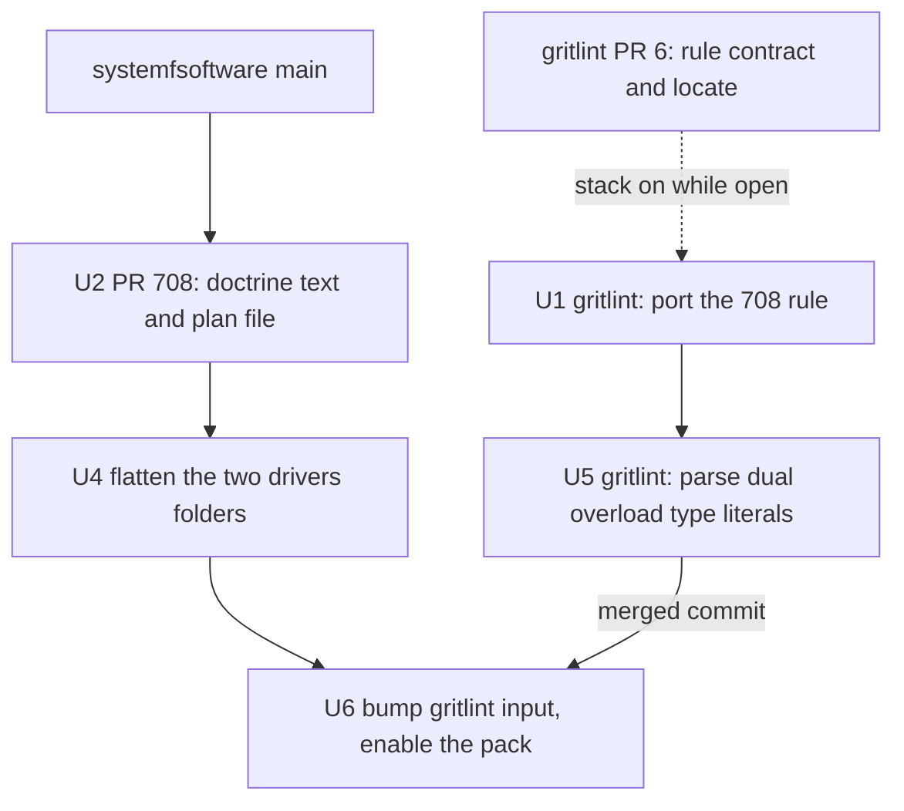

# Cell Service and Layer Structure - Plan

A service's pure layer is `static readonly layer = Layer.effect(this, this.make)` on its `Context.Service` class in `<capability>.service.ts`, a driver-backed implementation is a separate module that sits flat beside that service file (no `drivers/`-style folder, no prescribed name) and is imported only by composition roots and tests, and a test double is built by the test with `Layer.succeed` or `Layer.mock`, published on the class as `layerTest` or `layerNoop` when consumers need it, or, for a store, shipped beside the service as `<capability>.memory.ts`.

## Goal Capsule

- **Objective:** an author adding a capability to a cell-architecture package knows where the contract, each implementation, and each test double go, and importing a contract never makes the importer depend on a driver (a vendor SDK, a host runtime, or a native binary).
- **Product authority:** the root reviewed this recommendation on 2026-10-10 and returned it with five corrections, now applied; R1-R5 were independently verified and hold. The supervisor ruled on the plan's document review the same day; those rulings are applied here.
- **Open blockers:** none for U6: Q1 (enabling the pack as a gate here) was ruled YES by the root (2026-10-10). Q4 is with the root, and no unit waits on it. The gate is the rule systemfsoftware#708 amends; no second rule change.
- **Means:** port #708's rule into `systemfsoftware/gritlint`, finish #708 as the doctrine PR, migrate `GitLive` and the two `drivers/` folders, fix gritlint's TypeScript grammar for `dual` overload type literals, then enable the pack here (KTD1-KTD9).
- **Target repos:** `systemfsoftware/systemfsoftware` (this plan's home; bare paths) and `systemfsoftware/gritlint` (paths prefixed `gritlint:`).
- **Stop conditions:** U6 does not start while Q1 is open (ruled YES by the root (2026-10-10)). Stop on any evidence that a static `layer` fails to typecheck or that the ported rule disagrees with a fixture verdict #708 recorded. If the grammar fix proves infeasible after a real attempt, stop and report with the evidence; never rewrite the product modules instead (KTD9).
- **Execution profile:** one stacked PR per unit (OP13b), plain pushes, no force-push, no local mutation, targeted local checks, CI watched to green; the root merges.

---

## Product Contract

### Summary

A service is a `Context.Service` class in `<capability>.service.ts`. An implementation that needs only Effect and abstract platform tags is a `static readonly layer` on that class. An implementation that imports a driver is a separate module that sits flat beside the service, imported only by composition roots and tests; its filename is not prescribed. Test-only doubles are built by the test; a double consumers need is published on the class as `layerTest` or `layerNoop`. Layers are named `layer`, `layerConfig`, `layerTest`, `layerNoop`, never `Live` or `Default`. The gate is the content-keyed rule in systemfsoftware#708; the package graph is the control for reach through another module.

The work ports #708's rule into the gritlint repository, finishes #708 as the doctrine-only PR, moves the existing code onto the rule (`GitLive`, the two `drivers/` folders), and last turns the pack on in this repository.

### Problem Frame

The answer on `origin/main` contradicts itself in four places, so an author or reviewer gets a different verdict depending on which file they read.

- `compound-packs/cell-architecture/ports-separate-from-layers.md` forbids a Layer in the port's module and puts ports in `ports/` and adapters in `store/`. `compound-packs/cell-architecture/service-and-layer-boundaries.md:36` allows a `static readonly layer` on the service class (tier 2), and `:27`, `:37` put driver-backed implementations in `src/drivers/` or `src/store/`.
- The gritlint rule `cell-architecture/service-exports-no-layer` (in this repository until `8d532795`, now in `systemfsoftware/gritlint`) refuses every Layer in a `*.service.ts`, including the tier 2 form the doc allows. `gritlint.json` does not enable the pack, so nothing runs it here.
- `service-and-layer-boundaries.md:48` prescribes `static readonly Default`, Effect v3 vocabulary that Effect 4 replaced with `layer`.
- The code follows none of these consistently: 0 of 11 `*.service.ts` files under `packages/*/src` carry a static layer, `src/drivers/` exists in 2 packages, the one published `*Live` (`packages/upstream-manifest/src/git.ts:58`) needs only an abstract platform tag, and its double is `git.memory.ts`.

### Key Decisions

- **A pure static layer stays on the service class.** Effect 4 defines the service and its primary layer together; the harm the separate-module rule guards against (importing the contract pulls in a driver) exists only when the layer's module imports a driver. Governs R2, R3.
- **A driver-backed implementation is a flat sibling module beside the service, with no folder named for a technical kind; its filename is not prescribed.** A folder named for a technical kind is the layer bucket the wiki rules against. No current primary source names the file: the packs on `origin/main` say `src/drivers/<tech>.ts`, the two real driver modules are named for the technology alone, and Effect names its own for the technology (`NodeFileSystem.ts`, `PgClient.ts`). The gate keys on imports, so a name would add nothing it checks. Governs R5, R6.
- **Test doubles live with the test unless they are a product.** A store's in-memory fake and a double published for consumers' own tests are products; every other double is test code. Governs R9, R10, R11.
- **The gate decides on what a service module imports and exports.** It reads the modules the `*.service.ts` suffix selects and decides from their import specifiers and Layer shapes, never from a filename beyond that selection (CONST-T12). Governs R12, R13, R14.

### Requirements

A driver, in these requirements, is a package that performs I/O, binds a host runtime (`node:*`, `@effect/platform-*`), or ships a native or platform-specific binary (`oxc-parser`). Pure computation libraries (`@noble/hashes`) and the abstract tags `effect` exports (`FileSystem`, `Path`, `ChildProcessSpawner`, `HttpClient`, `SqlClient`) are not drivers.

**The service module**

- R1. A capability's contract is a `Context.Service` class in `<capability>.service.ts` with a namespaced key and a shape whose operations require nothing (`R = never`).
- R2. The service module imports no driver, statically or through `import()`.

**Pure implementations**

- R3. An implementation that needs only Effect and abstract tags is `static readonly layer = Layer.effect(this, this.make)` on the class, and leaves those tags in the layer's requirements for the composition root to supply.
- R4. Layer members are named `layer` (primary), `layerConfig` (reads `Config`), `layerTest`, `layerNoop`, or another `layer<Variant>`; `Live` and `Default` are not used; the constructor effect is `make`.

**Driver-backed implementations**

- R5. An implementation that imports a driver (R2) lives in its own module that imports the service module, exports module-level `make` and `layer` (and `layerConfig` when it reads `Config`), and is imported only by composition roots and tests.
- R6. That module sits flat beside the service module, in the same directory, with no `drivers/`, `adapters/`, or `store/` folder. Its filename is not prescribed (Evidence #3, #24, #37); a module that is already a cell kind (`*.handle.ts`, `*.blueprint.ts`) keeps its kind suffix.
- R7. The implementation moves to its own package, named `<package>-<technology>`, when the package has consumers outside the repository and the driver is heavy or platform-restricted for them.
- R8. Only a composition root supplies concrete runtime layers; a library publishes lazy `layer` values and performs no effect at import.

**Test doubles**

- R9. A test-only double is built by the test with `Layer.succeed(Tag, Tag.of(...))` or `Layer.mock(Tag)(...)`. It is test code, never in `src/`, unless R10 or R11 applies; its location inside the test tree is not prescribed.
- R10. **DROPPED: package deleted.** A store ships its in-memory fake beside the service as `<capability>.memory.ts`, and one contract suite that the fake and the real adapter both pass.
- R11. A double that consumers need for their own tests is published as `layerTest` or `layerNoop` on the service class.

**Gates**

- R12. The gate is `cell-architecture/service-exports-no-layer` as systemfsoftware#708 amends it. It refuses a `*.service.ts` module that imports a specifier from the rule's reviewed driver preset anywhere in the module (statically, as a re-export, through `import()`, or through `import x = require(...)`), or that has a `Layer.*` call, a `*Live` export, or a Layer alias inside an exported statement outside a pure member of its Service class. It reads exported statements only: a non-exported helper that builds a Layer, called by an exported factory, passes. That escape admits only a Layer whose module imports no driver, because the driver clause still refuses a driver import anywhere in the file. A bare `require('node:fs')` (or `createRequire`) is not matched. Both gaps are follow-up work in gritlint (KTD7). It is a multifile rule, so it reports once per directory, and the finding sits at the range the rule's `locate` pattern reports (gritlint PR #6): the driver import or the Layer binding that violates the rule, in the first offending service module of that directory.
- R13. Reach through another module is checked by the package graph, not by R12: in the separate-package form the contract package's manifest declares no driver dependency.
- R14. The same rule refuses, in a `*.service.ts`, an exported `*Live` binding and a class field named `*Layer` or `*Live`. `Default` and a `*Live` elsewhere in library source are review-gated (`service-and-layer-boundaries.md`, gate item 3).

### Acceptance Examples

- AE1. **DROPPED: package deleted.** Pure service with a platform tag. **Covers R2, R3.**
  - **Given:** `git.service.ts` declares `Git`, and its `make` yields `ChildProcessSpawner`.
  - **When:** the class carries `static readonly layer = Layer.effect(this, this.make)`.
  - **Then:** R12 reports nothing (`@noble/hashes` is pure computation, not a driver); the root provides `NodeServices.layer`; today's `GitLive` becomes `Git.layer`.
- AE2. Node runtime driver. **Covers R2, R5, R6, R12.**
  - **Given:** `workspace.service.ts` declares the tag.
  - **When:** a sibling module in the same directory imports `@effect/platform-node/NodeFileSystem` and exports `layer`.
  - **Then:** no finding. If `workspace.service.ts` imports `@effect/platform-node/NodeFileSystem`, R12 reports the directory once: at line 1 of its first `*.service.ts` under #708's rule, and at the import once U1 lands.
- AE3. Database store. **Covers R5, R6, R10.**
  - **Given:** `ledger.service.ts` declares a store.
  - **When:** a sibling module holds the Drizzle adapter and `ledger.memory.ts` the fake.
  - **Then:** one contract suite runs against both and both pass.
- AE4. Promise-based SDK. **Covers R1, R5.**
  - **Given:** a client library whose calls return promises.
  - **When:** its adapter module wraps each call in `Effect.tryPromise` with the fiber's `AbortSignal`.
  - **Then:** the service shape exposes Effect operations, and the service module never imports the SDK.
- AE5. Published library. **Covers R7, R13.**
  - **Given:** external consumers import the contract package.
  - **When:** the Postgres implementation is needed.
  - **Then:** it ships as `<package>-pg`, and the contract package's manifest lists no Postgres client.

### Rejected Options

- **Port and Layer always in separate modules** (`ports-separate-from-layers.md`; the gritlint rule on `origin/main`). It costs a second module per service for layers that carry no driver, contradicts Effect 4's own definition form, and its example puts ports and adapters in `ports/` and `store/` folders.
- **Driver modules under `src/drivers/<technology>.ts`** (`service-and-layer-boundaries.md:27`, `:37`; the gritlint finding text). A folder that gathers several capabilities' drivers is a technical-kind segment above the capabilities. Inside a one-capability package the wiki's position predicate does not forbid it, so moving the two existing `drivers/` folders is cleanup, not a fix.
- **New role suffixes `*.adapter.ts` / `*.store.ts`.** The import list already says a module binds a vendor; a suffix restating it lets a rename drop the check (CONST-T12), and it cannot bind a consumer of the published package.
- **Effect's application example: bind the driver on the class** (`static readonly layer = this.layerNoDeps.pipe(Layer.provide(PgClient.layerConfig(...)))`, Effect 4.0.1 `ai-docs/src/01_effect/03_services/20_layer-composition.ts:8`, `:55-60`). The service module then imports `@effect/sql-pg`, and every cell importing the tag depends on Postgres (CONST-B4). The `layerNoDeps` half of that example is R3.
- **`testLayer` on every service class in `src/`** (the rat-stack convention, `packages/core/src/abuse-score.ts:41`). It ships doubles in production code and on the published surface; Effect names the variant `layerTest`.
- **Published `*Live` singletons.** The wiki allows a lazy published binding, and that is kept as R8; the name is dropped because Effect 4 replaced `Live` and `Default` with `layer`.
- **A single-file rule that reports the import's own file and line.** A single-file gritlint rule parses every module of the language, and one unparseable module stops the scan: on `732f66a0`, `packages/discern/src/decision.blueprint.ts` fails at 1000:35. The multifile rule parses only `*.service.ts` modules.
- **A prescribed `<capability>-<technology>.ts` filename.** No current primary source names it (Evidence #3, #37), and the gate does not read it.

### Evidence

Dates are the last commit touching the file (systemfsoftware `origin/main` at `732f66a0`, 2026-10-10), the tree date for external repositories, or the wiki page's `updated` field. None of the cited wiki pages carries a "Last verified" or "Superseded" section.

| #  | Claim                                                                                                                                                                                                                                                                                                                                                                                | Source                                                                                                                                                                                                                                                                           | Date                                | Status                                                                |
| -- | ------------------------------------------------------------------------------------------------------------------------------------------------------------------------------------------------------------------------------------------------------------------------------------------------------------------------------------------------------------------------------------ | -------------------------------------------------------------------------------------------------------------------------------------------------------------------------------------------------------------------------------------------------------------------------------- | ----------------------------------- | --------------------------------------------------------------------- |
| 1  | A port and its Layer must live in separate modules; ports in `ports/`, adapters in `store/`                                                                                                                                                                                                                                                                                          | `compound-packs/cell-architecture/ports-separate-from-layers.md`                                                                                                                                                                                                                 | 2026-09-22                          | current on main; contradicted by #2, superseded by this plan if ruled |
| 2  | Tier 2: `static readonly layer = (opts) => ...` on the service class is allowed                                                                                                                                                                                                                                                                                                      | `compound-packs/cell-architecture/service-and-layer-boundaries.md:36`                                                                                                                                                                                                            | 2026-09-26                          | current; adopted as R3                                                |
| 3  | Driver implementations live in `src/drivers/<tech>.ts` or `src/store/<tech>.ts`                                                                                                                                                                                                                                                                                                      | `service-and-layer-boundaries.md:27`, `:37`                                                                                                                                                                                                                                      | 2026-09-26                          | current on main; rejected (placement decision)                        |
| 4  | Zero-config pure layer is `static readonly Default`                                                                                                                                                                                                                                                                                                                                  | `service-and-layer-boundaries.md:48`                                                                                                                                                                                                                                             | 2026-09-26                          | superseded by #11                                                     |
| 5  | `*Live` banned in reusable libraries                                                                                                                                                                                                                                                                                                                                                 | `service-and-layer-boundaries.md:35`, `:82`                                                                                                                                                                                                                                      | 2026-09-26                          | current; kept as R14                                                  |
| 6  | Separate driver package when external consumers must not inherit the driver                                                                                                                                                                                                                                                                                                          | `service-and-layer-boundaries.md:67`                                                                                                                                                                                                                                             | 2026-09-26                          | current; adopted as R7                                                |
| 7  | `service-exports-no-layer` refuses every Layer in `*.service.ts`; its next action names `src/drivers/<what-it-binds>.ts`                                                                                                                                                                                                                                                             | `packs/cell-architecture/rules/service-exports-no-layer.md` (now `systemfsoftware/gritlint@1d60be38`, ported in `686665e`)                                                                                                                                                       | 2026-10-09                          | current on main; contradicts #2; replaced by #38                      |
| 8  | The cell-architecture gritlint pack is not enabled                                                                                                                                                                                                                                                                                                                                   | `gritlint.json` (`packs`: `npm-provenance`, `source-resolution`, `typecheck-build-mode`)                                                                                                                                                                                         | 2026-09-25                          | current                                                               |
| 9  | "An implementation is a `Layer` and belongs where only a composition root reaches it"                                                                                                                                                                                                                                                                                                | `docs/solutions/architecture-patterns/one-cell-cannot-hold-a-port-and-its-implementation.md:67-70`                                                                                                                                                                               | 2026-09-25                          | current; holds for driver-backed layers (R5), narrowed by R3          |
| 10 | A suffix rule may decide only edge and depth-0 properties, and cannot bind a consumer                                                                                                                                                                                                                                                                                                | `docs/solutions/architecture-patterns/what-a-filename-suffix-can-enforce.md:28-45`                                                                                                                                                                                               | 2026-08-13                          | current; grounds the gate decision                                    |
| 11 | "v4 adopts the convention of naming layers with `layer` ... instead of v3's `Default` or `Live`. Use `layer` for the primary layer and descriptive suffixes for variants (e.g. `layerTest`, `layerConfig`)"                                                                                                                                                                          | Effect 4.0.1 `migration/services.md:186-199` (vendored `repos/effect`), byte-identical to `Effect-TS/effect@84f48df5` main                                                                                                                                                       | 2026-10-06; main checked 2026-10-10 | current; grounds R3, R4                                               |
| 12 | The canonical service carries `static readonly layer` on the class                                                                                                                                                                                                                                                                                                                   | Effect 4.0.1 `LLMS.md:148`; `ai-docs/src/01_effect/03_services/01_service.ts:22`                                                                                                                                                                                                 | 2026-10-06                          | current                                                               |
| 13 | Platform, provider and technology implementations ship as separate packages                                                                                                                                                                                                                                                                                                          | Effect 4.0.1 `MIGRATION.md:28-31`                                                                                                                                                                                                                                                | 2026-10-06                          | current; grounds R7                                                   |
| 14 | A runtime implementation exports module-level `make` / `layer` / `layerConfig`                                                                                                                                                                                                                                                                                                       | Effect 4.0.1 `packages/platform/node-shared/src/NodeFileSystem.ts:710`; `packages/sql/pg/src/PgClient.ts:169`, `:377`, `:391`                                                                                                                                                    | 2026-10-06                          | current; grounds R5                                                   |
| 15 | Published doubles: `Stdio.layerTest`, `FileSystem.layerNoop`; ad hoc doubles via `Layer.mock`                                                                                                                                                                                                                                                                                        | Effect 4.0.1 `Stdio.ts:152`, `FileSystem.ts:765`, `Layer.ts:2306`                                                                                                                                                                                                                | 2026-10-06                          | current; grounds R9 (constructors), R11                               |
| 16 | `static readonly layerTest` on the class in a test example                                                                                                                                                                                                                                                                                                                           | Effect 4.0.1 `ai-docs/src/09_testing/20_layer-tests.ts:24`, `:84`                                                                                                                                                                                                                | 2026-10-06                          | current                                                               |
| 17 | `Effect.tryPromise` passes an `AbortSignal` to the promise                                                                                                                                                                                                                                                                                                                           | Effect 4.0.1 `packages/effect/src/Effect.ts:966-969`                                                                                                                                                                                                                             | 2026-10-06                          | current; AE4                                                          |
| 18 | The Effect V4 development repository is archived; same migration text                                                                                                                                                                                                                                                                                                                | `Effect-TS/effect-smol@3a1128c` `README.md`, `migration/services.md:196-199`                                                                                                                                                                                                     | 2026-07-14                          | history                                                               |
| 19 | No upstream lint rule checks service or layer placement                                                                                                                                                                                                                                                                                                                              | Effect 4.0.1 / effect-smol `packages/tools/oxc/src/oxlint/rules/` (scout census)                                                                                                                                                                                                 | 2026-07-14 / 2026-10-06             | current; scout-reported                                               |
| 20 | Reference service: `static readonly layer = Layer.effect(this, this.make)` beside the tag                                                                                                                                                                                                                                                                                            | `joelhooks/rat-stack@c893d6c` `packages/core/src/file-inspector.ts:34`, `AGENTS.md:177`                                                                                                                                                                                          | 2026-10-10                          | current in rat-stack                                                  |
| 21 | Core cannot import HTTP clients or adapters (lint)                                                                                                                                                                                                                                                                                                                                   | rat-stack `scripts/oxlint-plugin-boundaries.ts:945`                                                                                                                                                                                                                              | 2026-10-10                          | current in rat-stack; the shape R12 takes                             |
| 22 | Doubles as `static readonly testLayer` in `src/`                                                                                                                                                                                                                                                                                                                                     | rat-stack `packages/core/src/abuse-score.ts:41`                                                                                                                                                                                                                                  | 2026-10-10                          | current in rat-stack; rejected                                        |
| 23 | 11 `*.service.ts` under `packages/*/src`; 0 with a static layer                                                                                                                                                                                                                                                                                                                      | `git ls-files`, `git grep` on `732f66a0`                                                                                                                                                                                                                                         | 2026-10-10                          | observed                                                              |
| 24 | `src/drivers/` exists in 2 packages, 5 files                                                                                                                                                                                                                                                                                                                                         | `packages/effect-readiness/src/drivers/`, `packages/trace/trace-spec/src/drivers/`                                                                                                                                                                                               | 2026-10-01                          | observed                                                              |
| 25 | One exported `*Live`: `GitLive`, which needs only `ChildProcessSpawner`                                                                                                                                                                                                                                                                                                              | `packages/upstream-manifest/src/git.ts:58`                                                                                                                                                                                                                                       | 2026-10-06                          | observed; AE1                                                         |
| 26 | In-memory double plus a test running fake and real side by side                                                                                                                                                                                                                                                                                                                      | `packages/upstream-manifest/src/git.memory.ts`; `packages/upstream-manifest/tests/git-contract.integration.test.ts:22-36`                                                                                                                                                        | 2026-10-06                          | observed; grounds R10's filename                                      |
| 27 | A store ships a law suite its fake and its real adapter both pass                                                                                                                                                                                                                                                                                                                    | `CONCEPTS.md:74`; `compound-packs/boundary-testing/fake-and-real-store-laws.md`                                                                                                                                                                                                  | 2026-10-09 / 2026-09-24             | current                                                               |
| 28 | `node:` imports are banned in `src/` by lint                                                                                                                                                                                                                                                                                                                                         | `packages/oxlint-plugin/oxlint-plugin-effect-platform/src/index.ts:44`                                                                                                                                                                                                           | 2026-09-24                          | current; partial R12 coverage                                         |
| 29 | CONST-B4: wire every implementation at one composition root; the core never imports a database or framework                                                                                                                                                                                                                                                                          | `repos/constitution/CONSTITUTION.md:37-38`                                                                                                                                                                                                                                       | 2026-07-15                          | current                                                               |
| 30 | CONST-T12: decide what applies from what code is and does, never from its name or location                                                                                                                                                                                                                                                                                           | `repos/constitution/CONSTITUTION.md:96-97`                                                                                                                                                                                                                                       | 2026-07-15                          | current; grounds the gate decision                                    |
| 31 | Package by feature, not layer; a kind-named segment above a capability is the loser                                                                                                                                                                                                                                                                                                  | `kb://software/package-by-feature-not-layer`; `kb://software/naming-segment-gate`                                                                                                                                                                                                | 2026-09-16                          | current; grounds the placement decision                               |
| 32 | Flat suffixed files colocated by capability; the job-suffix clause is the wiki's own posit (A10)                                                                                                                                                                                                                                                                                     | `kb://software/flat-suffixed-colocated`                                                                                                                                                                                                                                          | 2026-09-16                          | current; suffix clause yields to #30                                  |
| 33 | One composition root per process; a published lazy Layer is not a root                                                                                                                                                                                                                                                                                                               | `kb://software/one-composition-root`; `kb://software/inert-composition-value`                                                                                                                                                                                                    | 2026-09-16                          | current; grounds R8                                                   |
| 34 | Service operations keep `R = never`; layers manage dependencies at construction                                                                                                                                                                                                                                                                                                      | `kb://software/dependency-approach-placement` (A4)                                                                                                                                                                                                                               | 2026-09-16                          | current; grounds R1                                                   |
| 35 | Middle cells get no colocated unit tests; technology cells get fake-vs-real contracts                                                                                                                                                                                                                                                                                                | `kb://software/test-placement`                                                                                                                                                                                                                                                   | 2026-09-16                          | current; grounds R10                                                  |
| 36 | Importing a published entry performs none of the package's effects                                                                                                                                                                                                                                                                                                                   | `compound-packs/package-topology/import-time-inertness.md`                                                                                                                                                                                                                       | 2026-10-01                          | current; R8                                                           |
| 37 | The two driver modules are named for the technology alone                                                                                                                                                                                                                                                                                                                            | `packages/effect-readiness/src/drivers/NodeHostProber.ts`; `packages/trace/trace-spec/src/drivers/tempo-trace-store.ts`                                                                                                                                                          | 2026-10-01                          | observed; no filename convention to adopt                             |
| 38 | The amended rule refuses driver imports anywhere in a service module (static, re-export, `import()`) and `Layer.*` calls inside exported statements, allows a pure static `layer`/`layerTest`/`layerConfig`, and reports once per directory at the range `locate` reports (the driver import or the Layer binding); a Layer built in a non-exported helper one call away is not seen | systemfsoftware#708 head `795c1179`, `packs/cell-architecture/rules/service-exports-no-layer.md:3-13`, `:18-49`; `packs/cell-architecture/README.md:50-57`; U6 review of `d43a7f16` (pinned gritlint `019540a8`: private-helper Layer exits 0, the same helper exported exits 1) | 2026-10-10                          | root-verified (0 mismatches over 11 fixtures); the gate               |
| 39 | `tests/__fixtures__` appears once as a wrong example (a `*.schema.ts` there) and once as a working one (a `*.model.ts` harness); neither places test doubles                                                                                                                                                                                                                         | `compound-packs/schema-laws/tests-own-no-schemas.md:21`, `:28`                                                                                                                                                                                                                   | 2026-09-24                          | current; R9 prescribes no location                                    |
| 40 | gritlint, its engine and its packs moved to `systemfsoftware/gritlint`; this repository takes it from that flake                                                                                                                                                                                                                                                                     | systemfsoftware `8d532795` (#711)                                                                                                                                                                                                                                                | 2026-10-10                          | current; the gate's rule now lands there                              |
| 41 | A multifile finding moves to the range a rule's `locate` pattern reports; rule frontmatter gains `reasonCode`, `nextAction`                                                                                                                                                                                                                                                          | `systemfsoftware/gritlint` PR #6 (open, head `69f7b67a`)                                                                                                                                                                                                                         | 2026-10-10                          | open; U1 adopts it (R12)                                              |

### Scope Boundaries

- No code, pack, or gritlint change happens in this Product Contract; implementation units carry them.
- Renaming existing modules beyond moving them out of the two `drivers/` folders (`NodeHostProber.ts`, `tempo-trace-store.ts` keep their names) is out of scope.
- The shape a promise-SDK service exposes beyond Effect operations (for example whether a raw client may appear on the shape) is not decided here; Effect's own `OpenAiClient` exposes an Effect `HttpClient` on its shape (`packages/ai/openai/src/OpenAiClient.ts:56-60`).
- Considered and not built: a tool that follows imports to catch a driver reached through a sibling module (R13, in-package form). The rule refuses direct imports, and a package that publishes contracts gets the package-graph control by R7; evidence that would change this is a driver reaching a published contract through a sibling.
- Considered and not built: a mechanical refusal of `static readonly Default`. Review gates it (R14); its one occurrence is pack prose, which U2 rewrites.

#### Deferred to Follow-Up Work

- Growing the rule's driver preset to native-binary and SDK packages it does not name (`oxc-parser` and others): a reviewed preset change in `systemfsoftware/gritlint`.
- Other repositories that pin gritlint take the new rule when they bump their gritlint input; their `drivers/` folders move under their own plans.
- The `NodeHostProber` re-export on `@systemfsoftware/effect-readiness`'s entry (KTD3's known deviation from R5); the root decides it as Q4.

### Outstanding Questions

**Resolve Before Planning**

- None. The root ruled on 2026-10-10: R1-R5 hold, the five corrections are applied, and systemfsoftware#708 is the gate.

**Deferred to Planning** (answered in the Planning Contract)

- Where #708's rule change lands: KTD1.
- Which tool checks R13 for the in-package form: none is added; KTD6.
- Whether the driver preset grows: not in this plan; KTD7.

---

## Planning Contract

Product Contract preservation: R12 and AE2 now state the gate's location before and after U1 (supervisor ruling 2026-10-10, a factual update); otherwise unchanged by planning. Its three Deferred-to-Planning questions are answered by KTD1, KTD6 and KTD7.

### Key Technical Decisions

- KTD1. **The rule change lands in `systemfsoftware/gritlint`, ported from #708 head `795c1179` with the same fixture verdicts.** The rule, README and fixtures left this repository in `8d532795` (#711); `gritlint@1d60be38` still carries the pre-#708 rule (`686665e`). gritlint PR #6 (open, head `69f7b67a`) changes the same rule file and README, so the port stacks on #6 while it is open (OP13b overlap) and adopts its rule contract (`reasonCode`, `nextAction`, `locate`). `locate` gains #708's new clauses so every finding has a range; the finding stays one per directory and moves from line 1 to that range (R12). #6's `nextAction` still names `src/drivers/<what-it-binds>.ts` and is rewritten from R6.
- KTD2. **#708 stays the systemfsoftware PR and carries the doctrine half only.** Merging `origin/main` deletes `packs/` and `crates/` under it, and its `@systemfsoftware/gritlint` changeset is dropped, because the package is no longer a workspace member (`8d532795`). Every "placement: pending ruling" becomes R6's text, and this plan file joins #708 so the PR carries one plan (`repo-checks single-plan`).
- KTD3. **`GitLive` and the two `drivers/` folders migrate in this plan, as stacked layers on #708; one deviation stays, named.** `GitLive` (AE1) and the folders (R6) are the code on `origin/main` that contradicts the ruling and that this plan moves (Evidence #23-#25). Moved files keep their names, because R6 prescribes none. Known deviation from R5: the published entry of `@systemfsoftware/effect-readiness` re-exports `NodeHostProber`, whose module imports `@effect/platform-node`, so the entry is not a composition root or a test yet reaches a driver. `effect-microsandbox`, `effect-daemon-socket` and `effect-daemon-microvm` import `Readiness.NodeHostProber`, so removing it is a breaking change; U4 keeps the re-export and the root decides it as Q4.
- KTD4. **DROPPED: package deleted.** **`packages/upstream-manifest/src/git.ts` becomes `git.service.ts` with `static readonly layer`, and `GitLive` is deleted.** R1 puts the contract in `<capability>.service.ts`; the module imports nothing in the rule's driver preset (`@noble/hashes`, `effect/process`). The package is `private: true`, so no consumer outside the repository sees the removal (pack: package-topology, surface-changes-are-versioned.md).
- KTD5. **The pack is enabled here last, after the pinned gritlint carries KTD1's rule.** The rule at `gritlint@1d60be38` refuses every Layer in a service module, so it would refuse U3's `Git.layer`. Enabling also needs every `*.service.ts` to parse (KTD9) and the effect-atom directory to pass (KTD8).
- KTD6. **No new tool for in-package reach (R13).** See Scope Boundaries; the gate stays the direct-import tripwire the pack README calls it.
- KTD7. **The driver preset does not grow in this plan, and the rule's reach is not widened here.** The root ruled no second rule change; these are gritlint follow-ups: (a) preset growth; (b) flow-aware Layer detection, so a Layer built in a non-exported helper and returned by an exported factory is seen; (c) the bare `require('node:fs')` / `createRequire` form, which the driver clause does not match.
- KTD8. **The two effect-atom service factories keep their exported names and paths; their Layer wiring is factory-internal.** `AtomHttpApi.Service` (`atom-http-api.service.ts`) and `AtomRpc.Service` (`atom-rpc.service.ts`) called `Layer.effect`, `Layer.provide` and `Layer.orDie` inside the exported factory, which the rule reports. U6 moves that wiring into a non-exported helper in the same service file (`clientLayer`, `protocolLayer`). The helper imports only `effect` modules and only builds the factory's own atom runtime from the client or protocol layer the consumer passes in. That is factory-internal wiring, not a third placement for an implementation: no driver enters the module and no Layer leaves it. A flat sibling module is not used, because R5 lets only composition roots and tests import one. No exported name or path changes, so the changeset intent is `none`. Acceptance is a clean scan with no `ignore` entry.
- KTD9. **gritlint's TypeScript grammar is fixed; product code is not bent around it.** `packages/discern/src/procedure-depth.service.ts` (15:65) and `packages/effect-spec-runtime/src/TaskRef.service.ts` (48:65) fail to parse: a type-literal member ends in a generic type and the next line opens a generic call signature with `<`. The grammar gritlint links is the `tree-sitter-typescript` crate inside `biomejs/gritql` at the pinned rev, and its scanner refuses an automatic semicolon before a `<` on the next line. U5 fixes that grammar and carries the fix in `systemfsoftware/gritlint`. A module gritlint still cannot parse stays a gate failure that carries a reason code and `file:line`, never a skip. If the fix proves infeasible after a real attempt, U5 stops and reports with the evidence instead of rewriting the modules.
- KTD10. **Change intents follow each repository's tooling.** systemfsoftware units carry a `.changeset/` intent and the `Changeset Check`: U4 `none`, and U6 `@systemfsoftware/effect-atom` per KTD8 (U3 is dropped). `systemfsoftware/gritlint` has no changeset tooling (no `.changeset/`; its consumers pin a flake rev), so U1 and U5 carry none.

### High-Level Technical Design

Two stacks, one per repository; U6 joins them through the gritlint flake input. Directional only.

### Assumptions

Bets no gate run has confirmed yet.

- A `none` changeset intent satisfies the Changeset Check for U4: the moved files change built chunks but not the exports map, the namespace names or behavior (`.changeset/README.md:21-24`).
- gritlint PR #6 keeps `locate` required for multifile rules in the form its PR body describes.
- `./bin/gritlint check`, which the gritlint CI lane runs, is what makes the enabled pack a gate here.

### Open Questions

- Q1. Enabling `cell-architecture` in `gritlint.json` makes the rule a gate in this repository (GATE1 needs operator approval). Ruled YES by the root (2026-10-10).
- Q4. KTD3's known deviation: move `NodeHostProber` to `@systemfsoftware/effect-readiness-node` per R7, or drop the re-export from the entry with a `major` changeset. With the root; no unit waits on it.

---

## Implementation Units

### U1. Port the amended rule into systemfsoftware/gritlint

- **Goal:** gritlint's main branch refuses what #708's rule refuses and allows what it allows, each finding located.
- **Requirements:** R2, R3, R12, R14; AE2.
- **Dependencies:** none; stacks on gritlint PR #6 while it is open (KTD1).
- **Files:**
  - `gritlint:packs/cell-architecture/rules/service-exports-no-layer.md`
  - `gritlint:packs/cell-architecture/README.md`
  - `gritlint:packs/cell-architecture/fixtures/service-exports-no-layer/**`
- **Approach:**
  1. Copy the grit body, the `driver_specifier` preset, and the "Why" and "A tripwire, not the control" prose from #708 head `795c1179`, replacing the trailing "(placement: pending ruling)" with R6's placement.
  2. Write `nextAction` and the README placement sentence from R6, replacing #6's `src/drivers/<what-it-binds>.ts`: move the driver import and its Layer into a sibling module beside the service, imported only by composition roots and tests; no folder, no filename. The README states R12's location: one finding per directory, at the range `locate` reports.
  3. Extend `locate` with the driver-import clauses (static, re-export, `import()`) and the field-value alias clause; add `expected-locations.txt` to each bad case #708 added or flipped.
  4. No changeset (KTD10).
- **Patterns to follow:** gritlint `686665e` (the #704 port); #6's frontmatter on the same rule.
- **Test scenarios:**
  - Covers AE2. `bad/static-layer-imports-driver` (a service module importing `@effect/platform-node/NodeFileSystem` beside a static layer) yields one finding, located at the import.
  - `bad/service-imports-driver-no-layer` and `bad/static-layer-dynamic-imports-driver` (`import('node:fs/promises')`) each yield one finding.
  - `bad/static-layer-aliases-driver-layer` (`static readonly layer = consoleLayer`) yields one finding.
  - `good/static-layer-member`, `good/static-layer-two-arg`, `good/static-layer-curried`, `good/static-layer-requires-filesystem` (`FileSystem` left in `R`) and `good/layer-in-adapter-module` yield none.
  - Deleting each driver clause makes the bad fixture that needs it fail; restoring it passes.
- **Verification:** the gritlint repository's pack fixture run and flake checks pass in CI; every fixture verdict equals #708's; no file under `gritlint:packs/` says "pending ruling" (matched across a line break), `src/drivers/` or `<what-it-binds>`.

### U2. Finish #708 as the doctrine PR

- **Goal:** the cell-architecture pack states the ruled placement, and no text in the repository contradicts it.
- **Requirements:** R1-R11, R14.
- **Dependencies:** none.
- **Files:**
  - `compound-packs/cell-architecture/service-and-layer-boundaries.md`
  - `compound-packs/cell-architecture/handle-state-privacy.md`
  - `compound-packs/cell-architecture/README.md`
  - `packages/atom/AGENTS.md`
  - `.changeset/gritlint-pure-static-layer.md` (delete)
  - `docs/plans/2026-10-10-0806-refactor-cell-service-layer-structure-plan.md`
- **Approach:**
  1. Merge `origin/main` into `feat/cell-architecture-pure-static-layer`; resolve each modify/delete under `packs/` and `crates/` as a delete (KTD2).
  2. Replace every "(placement: pending ruling)" with R6's placement, and the example placeholders with a relative import of a sibling module whose name the prose marks as free. Where the pack states the gate's location, use R12's wording.
  3. State R9-R11 for test doubles beside the tier table; rewrite `static readonly Default` in `handle-state-privacy.md` as `layer` (R4).
  4. Drop the gritlint changeset; merge this plan's branch so the plan file rides in #708.
  5. Rewrite the PR body: what changes for an author, and where the rule now lives (U1).
- **Patterns to follow:** #708's existing edits; the pack's prose voice.
- **Test expectation:** none -- pack prose only; nothing executable changes.
- **Verification:** no tracked file under `compound-packs/cell-architecture/` or `packages/*/AGENTS.md` says "pending ruling" (matched across a line break), `src/drivers/`, `ports-separate-from-layers` or `static readonly Default` (DEL1 grep exits 1); dprint and `pnpm gate:repo` pass; CI green.

### U3. Replace GitLive with Git.layer (DROPPED: package deleted)

- **Goal:** `upstream-manifest`'s `Git` service follows R1 and R3: its layer is a static member, and nothing exports `GitLive`.
- **Requirements:** R1, R3, R4, R14; AE1.
- **Dependencies:** U2 (stack layer).
- **Files:**
  - `packages/upstream-manifest/src/git.ts` renamed to `packages/upstream-manifest/src/git.service.ts`
  - `packages/upstream-manifest/src/cli.ts`, `src/check.ts`, `src/fixture.ts`, `src/git.memory.ts`, `src/selftest.ts`, `src/mod.ts`
  - `packages/upstream-manifest/tests/git-contract.integration.test.ts`
  - `packages/upstream-manifest/etc/upstream-manifest.api.md`
  - `.changeset/<name>.md` (`patch`, KTD10)
- **Approach:** move the module, add `static readonly make` and `static readonly layer = Layer.effect(this, this.make)` to `Git`, delete `GitLive`, and point every importer at `./git.service.js` and `Git.layer` (KTD4).
- **Patterns to follow:** the tier 2 example in `compound-packs/cell-architecture/service-and-layer-boundaries.md` (pack: cell-architecture, service-and-layer-boundaries.md).
- **Test scenarios:**
  - Covers AE1. The contract suite runs every request against `Git.layer` (with `NodeServices.layer` provided) and `GitMemory` and gets equal normalized outputs, as it does today against `GitLive` (pack: boundary-testing, fake-and-real-store-laws.md).
  - `Git.layer`'s requirement channel is `ChildProcessSpawner` and nothing else; the typecheck proves it.
- **Verification:** `upstream-manifest` typecheck, tests and `api:check` pass; `git grep GitLive -- packages/` finds nothing.

### U4. Move the two drivers/ folders beside their services

- **Goal:** no `drivers/` folder remains in `packages/*/src`; each driver module sits beside the service it implements (R6).
- **Requirements:** R5, R6.
- **Dependencies:** U2 (stack layer; U3 is dropped).
- **Files:**
  - `packages/effect-readiness/src/drivers/NodeHostProber.ts` and `src/drivers/http-status-line.schema.ts`, moved to `src/`
  - `packages/effect-readiness/src/Readiness/mod.ts`; `src/DialEvidence.schema.ts` (doc comment)
  - `packages/trace/trace-spec/src/drivers/tempo-trace-store.ts`, `tempo-trace.schema.ts` and `judge-tempo-answer.workflow.ts`, moved to `src/`
  - `packages/trace/trace-spec/src/mod.ts`
  - `compound-packs/schema-laws/rich-type-over-foreign-encoded.md` (its working example points at the moved `http-status-line.schema.ts`)
  - `.changeset/<name>.md`
- **Approach:** move the files with their names unchanged, update relative imports, and record a `none` intent for both packages; the exports maps and the `NodeHostProber` and `TempoTraceStore` namespace names do not change (pack: package-topology, surface-changes-are-versioned.md). Both packages' mutate globs are `src/**/*.workflow.ts` and `src/**/*.schema.ts`, so the moved workflow and schemas stay selected. `src/Readiness/mod.ts` keeps re-exporting `NodeHostProber` from its new path (KTD3's known deviation).
- **Test scenarios:**
  - Both packages' existing suites pass unchanged.
  - `effect-readiness`'s `api:check` reports no surface difference (`trace-spec` has no api report).
- **Verification:** `git ls-files 'packages/**/src/drivers/**'` is empty; no tracked file under `compound-packs/` names `src/drivers/`; both packages' typecheck and tests pass, and `effect-readiness`'s `api:check`.

### U5. Parse dual overload type literals in gritlint

- **Goal:** gritlint parses every `*.service.ts` in systemfsoftware, so enabling the pack cannot stop the scan, and a module it still cannot parse fails the gate with a reason code and `file:line` (KTD9).
- **Requirements:** R12.
- **Dependencies:** U1 (stack layer: both change `gritlint:packs/cell-architecture/README.md`, whose "Unparseable modules stop the scan" note this unit rewrites).
- **Files:**
  - the patched TypeScript grammar and the Cargo patch that makes gritlint link it (location settled in implementation)
  - `gritlint:crates/gritlint_core/src/error.rs` and the report encoding, for the parse refusal's reason code
  - `gritlint:crates/gritlint_core/tests/` (one fixture per construct that fails today, and the refusal contract)
  - `gritlint:packs/cell-architecture/README.md`
- **Approach:** reproduce each failing construct against the pinned engine, fix the grammar where the scanner refuses the automatic semicolon before a `<` that opens a generic call signature on the next line, link the fixed grammar through a Cargo patch of gritql's `tree-sitter-typescript` crate, and give the `TargetParse` refusal a stable reason code alongside its file and position. No product module in systemfsoftware changes.
- **Test scenarios:**
  - A type literal whose member ends in a generic type and whose next line opens a generic call signature (`procedure-depth.service.ts`'s `withMaxDepth` shape) parses, and a multifile rule over it reports as it would on any parsed module.
  - The same shape in an interface parses.
  - `TaskRef.service.ts`'s `provideTaskRef` shape (type parameter `Ctx`) parses.
  - An expression whose next line starts with `<` keeps its current parse (no new automatic semicolon in expression position).
  - A module that still fails to parse makes the check fail with the reason code, the file and its `line:column`; it is never skipped.
- **Verification:** the gritlint repository's tests and flake checks pass; the built binary scans systemfsoftware's tree with the pack enabled and reports no parse refusal.

### U6. Turn the pack on in this repository

- **Goal:** `./bin/gritlint check` refuses, in any `*.service.ts` here, a driver import anywhere in the module or a `Layer.*` call inside an exported statement (R12). A Layer built in a non-exported helper passes; with no driver import in the file that Layer is effect-only, which the pack allows (KTD7 carries flow-aware detection as gritlint follow-up).
- **Requirements:** R12, R14.
- **Dependencies:** U1 and U5 merged; U4; Q1 (ruled YES by the root (2026-10-10)).
- **Files:**
  - `flake.lock` (the gritlint input moves to the gritlint commit that carries U1's rule and U5's parse fix; until U5 merges that is U5's PR head, then gritlint main)
  - `gritlint.json` (`packs` gains `cell-architecture`)
  - `packages/atom/effect-atom/src/atom-http-api.service.ts`, `src/atom-rpc.service.ts` (per KTD8)
  - `packages/atom/effect-atom/etc/effect-atom.api.md`
  - `.changeset/<name>.md` (KTD8, KTD10)
  - `.github/actions/checks-lane/action.yml` (the gritlint lane's planted-violation step gains a cell-architecture case, and the repository's own check is shown to refuse a planted module)
- **Approach:** bump the input, restructure the two effect-atom factories per KTD8, enable the pack (KTD5), and make CI observe the pack refuse.
- **Test scenarios:**
  - The tree scans clean.
  - A throwaway service module importing `node:fs` fails the check with the rule's finding, and the check passes once it is removed (smoke run, not committed).
  - effect-atom's suites pass after KTD8's change, and its api report shows no renamed or moved export unless the changeset is `major`.
  - CI's planted-violation step plants a service module importing `node:fs/promises` with `cell-architecture` enabled, asserts exit 1 and the rule id `cell-architecture/service-exports-no-layer`, then removes it and asserts exit 0.
  - CI plants the same module under a real `packages/*/src` directory of the checkout (never committed) and asserts that the repository's own `./bin/gritlint check` exits 1 with that rule id, then removes it and asserts exit 0. Deleting `cell-architecture` from `gritlint.json` turns that step red.
- **Verification:** CI's gritlint lane passes on the PR head, and its log shows the planted cell-architecture case refused then clean.

---

## Verification Contract

Targeted local checks only, one build at a time, no local mutation runs. CI, watched with `run_watch`, is the gate.

| Unit | Local checks                                                                             | CI                                                                     |
| ---- | ---------------------------------------------------------------------------------------- | ---------------------------------------------------------------------- |
| U1   | the gritlint repository's pack fixture run                                               | gritlint flake checks                                                  |
| U2   | `./bin/dprint check`; `pnpm gate:repo`; DEL1 `git grep`                                  | `CI`, `Changeset Check`, `Commitlint`                                  |
| U3   | DROPPED: package deleted                                                                 |                                                                        |
| U4   | `effect-readiness` typecheck, test, `api:check`; `trace-spec` typecheck, test            | `CI`, `Changeset Check`                                                |
| U5   | gritlint `cargo test`, pack fixture run; scan of systemfsoftware with the pack enabled   | gritlint flake checks                                                  |
| U6   | `./bin/gritlint check`; planted-import smoke; `effect-atom` typecheck, test, `api:check` | `CI` gritlint lane (planted cell-architecture case), `Changeset Check` |

---

## Definition of Done

- Every unit's verification holds on its PR head, and each PR's CI is green on that exact head.
- No file under `compound-packs/` or `packages/*/AGENTS.md` in systemfsoftware, and no file under `packs/` in gritlint, prescribes `src/drivers/`, a `<capability>-<technology>.ts` filename, or "pending ruling" (DEL1); this plan quotes them and is outside that scope.
- No throwaway probe, planted import or scratch file remains in any diff.
- Q1 is ruled before U6 starts (ruled YES by the root (2026-10-10)).
