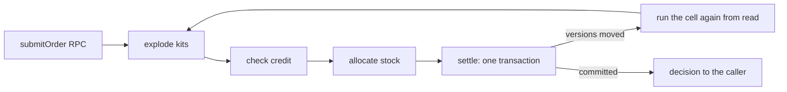

# Inventory fulfillment example

This is a working order-fulfillment service written to the [cell-architecture](../../compound-packs/cell-architecture/) and [boundary-testing](../../compound-packs/boundary-testing/) compound packs. Each rule in those packs has real code here, and the tests for that code pass. Read it to see a rule applied end to end, or run it and send it orders.

A customer submits an order. The service expands any kits into parts, checks the customer's credit, reserves stock lot by lot, and charges the account. Each step is a pure decision between one read and one write. The last step commits the credit charge, the stock decrements, the reservations, and the audit row in a single Postgres transaction.



## What it prevents

Two orders from one customer, for different products, can push the customer past their credit limit. The two orders touch different stock lots, so a version check on stock never fires. The charge used to run after the stock was reserved, with no check at all. In a race against real Postgres with two app instances, the original code charged 120 against a limit of 100 in every run.

Now the store's reads hand back proofs of the credit version and every lot version they saw. `settle` refuses to compile without those proofs. At commit it re-checks every version, and any change sends the order back through the cell with fresh data. `tests/inventory-fulfillment.integration.test.ts` replays the losing interleaving: two 40-unit orders against 60 of headroom. One order commits. The other re-reads, then gets a credit hold.

## Run it

You need Node 24, pnpm, and a Postgres 17 database. The service applies its own migrations when it starts.

```bash
docker run -d --name fulfillment-db -e POSTGRES_PASSWORD=pg -e POSTGRES_DB=fulfillment -p 5432:5432 postgres:17-alpine

pnpm install
pnpm exec turbo run build --filter=@systemfsoftware/example-inventory-fulfillment...

DATABASE_URL=postgres://postgres:pg@127.0.0.1:5432/fulfillment \
BETTER_AUTH_SECRET=change-me-to-a-long-random-string \
node examples/inventory-fulfillment/dist/main.mjs
```

It listens on port 3000; set `PORT` to change that.

> [!NOTE]
> The example is not published to npm. Run every command here from the repository root.

## Send it an order

Sign up. The session cookie goes into `jar.txt`:

```bash
curl -c jar.txt -H 'content-type: application/json' -H 'origin: http://localhost:3000' \
  -d '{"email":"ada@example.com","password":"correct-horse-battery","name":"Ada"}' \
  http://localhost:3000/api/auth/sign-up/email
```

The service has no admin API. Stock and credit limits come from the database:

```bash
docker exec fulfillment-db psql -U postgres -d fulfillment -c "
  INSERT INTO warehouses (id, region) VALUES ('w1', 'east');
  INSERT INTO stock_lots (id, sku, warehouse_id, quantity_on_hand, version) VALUES ('lot-1', 'MUG', 'w1', 10, 1);
  UPDATE \"user\" SET credit_limit = 100 WHERE email = 'ada@example.com';"
```

Submit an order for 6 mugs over the RPC endpoint:

```bash
curl -b jar.txt -H 'content-type: application/json' -H 'origin: http://localhost:3000' \
  -d '{"_tag":"Request","id":"1","tag":"submitOrder","headers":[],
       "payload":{"orderId":"order-1","lines":[{"sku":"MUG","quantity":6}],"kits":[],"fraudRisk":10}}' \
  http://localhost:3000/rpc
```

```json
[{
  "_tag": "Exit",
  "requestId": "1",
  "exit": {
    "_tag": "Success",
    "value": {
      "_tag": "AllocatedSplit",
      "orderId": "order-1",
      "allocations": [{ "warehouseId": "w1", "lotId": "lot-1", "sku": "MUG", "quantity": 6 }]
    }
  }
}]
```

Send the same order again as `order-2` and it comes back `Backordered`: 4 mugs reserved and 2 owed. `listStock` and `getReservation` use the same envelope. For typed calls, `Rpc.Client.make` in `src/rpc/client.ts` builds an Effect RPC client.

## Where each rule lives

| Pack rule                                                                                                                                                                                                  | Where to read it                                                                                                                                                                  |
| :--------------------------------------------------------------------------------------------------------------------------------------------------------------------------------------------------------- | :-------------------------------------------------------------------------------------------------------------------------------------------------------------------------------- |
| [sandwich-phase-order](../../compound-packs/cell-architecture/sandwich-phase-order.md), [pipeline-composition](../../compound-packs/cell-architecture/pipeline-composition.md)                             | `src/fulfillment/fulfillment.cell.ts`: four `Sandwich.named` cells joined with `Cell.andThen`                                                                                     |
| [pure-decision-workflows](../../compound-packs/cell-architecture/pure-decision-workflows.md)                                                                                                               | `src/fulfillment/*.workflow.ts` and `src/inventory/allocate-stock.workflow.ts`, with property tests in `__tests__/`                                                               |
| [four-channel-contracts](../../compound-packs/cell-architecture/four-channel-contracts.md)                                                                                                                 | Refusals are decisions on the success channel. Store and auth outages fail as `StoreUnavailable` and `AuthServiceUnavailable` in `src/fulfillment/decision.schema.ts`             |
| [decode-never-cast](../../compound-packs/cell-architecture/decode-never-cast.md)                                                                                                                           | Database rows are decoded in `src/store/decode.ts`. Request fields, including the paging cursor, are decoded in `src/rpc/inventory-fulfillment.schema.ts`                         |
| [ports-separate-from-layers](../../compound-packs/cell-architecture/ports-separate-from-layers.md), [service-and-layer-boundaries](../../compound-packs/cell-architecture/service-and-layer-boundaries.md) | Contracts live in `*.service.ts` and adapters in `src/store/`. Everything is wired only in `src/store/PgRuntime.ts`, `src/http/server.ts`, and `src/main.ts`                      |
| [store-issued-proofs](../../compound-packs/cell-architecture/store-issued-proofs.md)                                                                                                                       | `src/store/SettlementProof.ts`, pinned by `test-types/settlement-proof.tst.ts`                                                                                                    |
| [store-recheck-at-one-commit](../../compound-packs/cell-architecture/store-recheck-at-one-commit.md)                                                                                                       | `settle` in `src/store/SettlementStoreDrizzle.ts`, plus the retry loop in `src/rpc/inventory-fulfillment.rpc.ts`                                                                  |
| [single-namespace-barrel](../../compound-packs/cell-architecture/single-namespace-barrel.md)                                                                                                               | `src/mod.ts`: `Fulfillment`, `Inventory`, `Settlement`, `Reservation`, `Auth`, `Rpc`, `Http`, `Persistence`                                                                       |
| [fake-and-real-store-laws](../../compound-packs/boundary-testing/fake-and-real-store-laws.md)                                                                                                              | `tests/settlement-store`, `tests/inventory-store`, and `tests/reservation-log` integration tests. Each runs the memory adapter and the Drizzle adapter through the same histories |
| [refusals-beside-generated-laws](../../compound-packs/boundary-testing/refusals-beside-generated-laws.md)                                                                                                  | In-source `it.prop` blocks in `src/inventory/inventory.schema.ts` and `src/fulfillment/credit.schema.ts`                                                                          |
| [pin-dependency-semantics](../../compound-packs/boundary-testing/pin-dependency-semantics.md)                                                                                                              | `tests/drizzle-rollback.integration.test.ts`                                                                                                                                      |
| [real-system-oracles](../../compound-packs/boundary-testing/real-system-oracles.md), [no-mocks-on-internal-glue](../../compound-packs/boundary-testing/no-mocks-on-internal-glue.md)                       | `tests/inventory-fulfillment.integration.test.ts` drives the real server on a loopback port, backed by embedded Postgres (PGlite)                                                 |

The builder and handle rules (`staged-lawful-builders`, `resource-vs-handle-duality`) have no counterpart here, because the service builds no resources of its own.

## Upgrading an existing database

The `drizzle/20260923215213_add_credit_version` migration adds `user.credit_version integer not null default 1`. Existing rows start at version 1, so no backfill is needed. After you deploy, both of these queries must return zero rows:

```sql
SELECT 1 FROM information_schema.columns
WHERE table_name = 'user' AND column_name = 'credit_version' AND is_nullable = 'YES';

SELECT id FROM "user" WHERE outstanding_balance > credit_limit + overdraft_privilege;
```

To roll back, redeploy the previous app version first; it ignores the new column. Only then run `ALTER TABLE "user" DROP COLUMN credit_version`. Dropping the column while this version is running breaks every `settle`.

## Stack

| Concern            | Library                                                                             | Version              |
| :----------------- | :---------------------------------------------------------------------------------- | :------------------- |
| Effects, RPC, HTTP | `effect`                                                                            | `4.0.0-rc.116`       |
| Persistence        | `drizzle-orm` over `@effect/sql-pg` in production and `@effect/sql-pglite` in tests | `1.0.0-rc.5-5935859` |
| Sessions           | `better-auth`                                                                       | `1.7.5`              |
