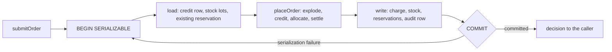

# Inventory fulfillment example

An order-fulfillment service that takes orders from many app instances at once and never grants more credit, or sells more stock, than exists. It is the reference implementation of the [cell-architecture](../../compound-packs/cell-architecture/) and [boundary-testing](../../compound-packs/boundary-testing/) compound packs: every rule in them points at real code here, and the tests for that code pass.

Eight app instances racing 40 orders against one customer with a credit limit of 100:

```text
40 orders x 20 units from 8 instances, credit limit 100
outcomes: CreditHold 35, AllocatedSplit 5
transactions: 186 for 40 orders (146 re-runs)
ok   every order decided: decided 40 of 40
ok   credit filled exactly: granted 5, grantable 5
ok   credit limit held: outstanding 100 of 100
ok   every grant charged once: charged 100, grants x quantity 100
ok   no stock lost or double-sold: on hand 100 + reserved 100 of 200
ok   reserved units equal charged credit: reserved 100, charged 100
ok   one audit row per committed order: audit rows 40, committed 40
```

Exactly five 20-unit orders fit under the limit, so exactly five are granted. Run at Postgres's default isolation level (READ COMMITTED), the same load-decide-write charged 200 against that limit of 100. [Race it](#race-it) yourself.

## How an order is placed

The service reads an order, expands kits into parts, checks the customer's credit, reserves stock lot by lot, and charges the account. Those four steps are one pure function, `placeOrder`, with no I/O, so property tests exercise it directly. Around it sits one read and one write:



All three run in one Postgres transaction at SERIALIZABLE isolation. Postgres commits it only when some serial order of the concurrent orders would give the same result. So it checks every value the decision read, including a credit balance another instance charged a moment earlier. When it cannot commit, it aborts with SQLSTATE `40001` and the service runs the whole order again from the read. Nothing else guards the data: no locks, no version columns. A `CHECK (quantity_on_hand >= 0)` constraint backs the stock side.

The compiler keeps the read and the write inside that transaction. The only way to reach the settlement tables is a unit of work, a value the settlement store hands to a callback while the transaction is open. `load` and `settle` take that unit, and the order cell is built over it, so the cell reads and settles in the same transaction. A unit kept past the end of its transaction refuses every read and write.

## Run it

### Start the service

You need Node 24, pnpm, and Postgres 17. The service applies its own migrations when it starts.

```bash
docker run -d --name fulfillment-db -e POSTGRES_PASSWORD=pg -e POSTGRES_DB=fulfillment -p 5432:5432 postgres:17-alpine

pnpm install
pnpm exec turbo run build --filter=@systemfsoftware/example-inventory-fulfillment...

DATABASE_URL=postgres://postgres:pg@127.0.0.1:5432/fulfillment \
BETTER_AUTH_SECRET=change-me-to-a-long-random-string \
node examples/inventory-fulfillment/dist/main.mjs
```

It listens on port 3000.

> [!NOTE]
> The example is not published to npm. Run every command here from the repository root.

### Send it an order

Sign up. The session cookie goes into `jar.txt`:

```bash
curl -c jar.txt -H 'content-type: application/json' -H 'origin: http://localhost:3000' \
  -d '{"email":"ada@example.com","password":"correct-horse-battery","name":"Ada"}' \
  http://localhost:3000/api/auth/sign-up/email
```

The service has no admin API, so stock and credit limits go straight into the database:

```bash
docker exec fulfillment-db psql -U postgres -d fulfillment -c "
  INSERT INTO warehouses (id, region) VALUES ('w1', 'east');
  INSERT INTO stock_lots (id, sku, warehouse_id, quantity_on_hand, version) VALUES ('lot-1', 'MUG', 'w1', 10, 1);
  UPDATE \"user\" SET credit_limit = 100 WHERE email = 'ada@example.com';"
```

Order 6 mugs:

```bash
curl -b jar.txt -H 'content-type: application/json' -H 'origin: http://localhost:3000' \
  -d '{"_tag":"Request","id":"1","tag":"submitOrder","headers":[],
       "payload":{"orderId":"order-1","lines":[{"sku":"MUG","quantity":6}],"kits":[],"fraudRisk":10}}' \
  http://localhost:3000/rpc
```

```json
[{
  "_tag": "Exit",
  "requestId": "1",
  "exit": {
    "_tag": "Success",
    "value": {
      "_tag": "AllocatedSplit",
      "orderId": "order-1",
      "allocations": [{ "warehouseId": "w1", "lotId": "lot-1", "sku": "MUG", "quantity": 6 }]
    }
  }
}]
```

Send the same order again as `order-2` and it comes back `Backordered`: 4 mugs reserved and 2 owed. Send `order-1` again and it fails with `DuplicateOrder`. The other two RPCs, `listStock` and `getReservation`, use the same envelope. For typed calls, `Rpc.Client.make` in [`src/rpc/client.ts`](src/rpc/client.ts) builds an Effect RPC client.

### Race it

[`scripts/race.ts`](scripts/race.ts) starts several app instances, each with its own connection pool, and submits 20-unit orders from all of them at once. It seeds one customer with a credit limit of 100 and two products with 100 units each, then checks seven invariants. It truncates the order tables first, so give it a scratch database. After [building](#start-the-service):

```bash
docker exec fulfillment-db createdb -U postgres race

DATABASE_URL=postgres://postgres:pg@127.0.0.1:5432/race INSTANCES=4 ORDERS=20 \
pnpm --filter @systemfsoftware/example-inventory-fulfillment race
```

```text
20 orders x 20 units from 4 instances, credit limit 100
outcomes: CreditHold 15, AllocatedSplit 5
transactions: 92 for 20 orders (72 re-runs)
ok   every order decided: decided 20 of 20
ok   credit filled exactly: granted 5, grantable 5
ok   credit limit held: outstanding 100 of 100
ok   every grant charged once: charged 100, grants x quantity 100
ok   no stock lost or double-sold: on hand 100 + reserved 100 of 200
ok   reserved units equal charged credit: reserved 100, charged 100
ok   one audit row per committed order: audit rows 20, committed 20
```

Five orders are granted at any instance count; only the re-run count changes. Any line reading `FAIL` makes the script exit non-zero. The test suite cannot do this: it runs on embedded Postgres (PGlite), which has one connection and so never races.

### Configuration

| Variable                            | Default    | What it sets                                                             |
| :---------------------------------- | :--------- | :----------------------------------------------------------------------- |
| `DATABASE_URL`                      | (required) | Postgres connection string                                               |
| `BETTER_AUTH_SECRET`                | (required) | Session signing secret                                                   |
| `PORT`                              | `3000`     | HTTP port                                                                |
| `SETTLEMENT_RETRY_ATTEMPTS`         | `30`       | Transactions one order may start before it fails with `StoreUnavailable` |
| `SETTLEMENT_RETRY_BASE_INTERVAL_MS` | `2`        | First backoff between re-runs, doubled with jitter each time             |
| `SETTLEMENT_RETRY_MAX_INTERVAL_MS`  | `100`      | Longest backoff between re-runs                                          |
| `INSTANCES`, `ORDERS`               | `2`, `10`  | Race script only: app instances and total orders                         |

A spent retry budget writes nothing: the order fails with `StoreUnavailable`, carrying the last serialization failure as its cause.

## Where each pack rule lives

| Pack rule                                                                                                    | Code                                                                                                                                                      |
| :----------------------------------------------------------------------------------------------------------- | :-------------------------------------------------------------------------------------------------------------------------------------------------------- |
| [sandwich-phase-order](../../compound-packs/cell-architecture/sandwich-phase-order.md)                       | [`src/fulfillment/place-order.cell.ts`](src/fulfillment/place-order.cell.ts): load, decide, settle                                                        |
| [pure-decision-workflows](../../compound-packs/cell-architecture/pure-decision-workflows.md)                 | [`src/fulfillment/place-order.workflow.ts`](src/fulfillment/place-order.workflow.ts), properties in `src/fulfillment/__tests__/`                          |
| [store-serializable-unit-of-work](../../compound-packs/cell-architecture/store-serializable-unit-of-work.md) | `unitOfWork` in [`src/store/SettlementStoreDrizzle.ts`](src/store/SettlementStoreDrizzle.ts)                                                              |
| [store-unit-of-work-handle](../../compound-packs/cell-architecture/store-unit-of-work-handle.md)             | [`src/ports/settlement-unit.handle.ts`](src/ports/settlement-unit.handle.ts), pinned by `test-types/unit-of-work.tst.ts`                                  |
| [resource-vs-handle-duality](../../compound-packs/cell-architecture/resource-vs-handle-duality.md)           | The open unit of work is a `Handle`, not a service: [`src/ports/settlement-unit.handle.ts`](src/ports/settlement-unit.handle.ts)                          |
| [handle-state-privacy](../../compound-packs/cell-architecture/handle-state-privacy.md)                       | The unit's transaction-bound reads and writes live in its kind slot                                                                                       |
| [four-channel-contracts](../../compound-packs/cell-architecture/four-channel-contracts.md)                   | [`src/fulfillment/decision.schema.ts`](src/fulfillment/decision.schema.ts): refusals are decisions, outages are errors                                    |
| [decode-never-cast](../../compound-packs/cell-architecture/decode-never-cast.md)                             | [`src/store/decode.ts`](src/store/decode.ts) for rows, [`src/rpc/inventory-fulfillment.schema.ts`](src/rpc/inventory-fulfillment.schema.ts) for requests  |
| [ports-separate-from-layers](../../compound-packs/cell-architecture/ports-separate-from-layers.md)           | Ports in `src/ports/`, adapters in `src/store/`, wired only in [`src/store/PgRuntime.ts`](src/store/PgRuntime.ts)                                         |
| [single-namespace-barrel](../../compound-packs/cell-architecture/single-namespace-barrel.md)                 | [`src/mod.ts`](src/mod.ts)                                                                                                                                |
| [fake-and-real-store-laws](../../compound-packs/boundary-testing/fake-and-real-store-laws.md)                | [`tests/settlement-store.integration.test.ts`](tests/settlement-store.integration.test.ts) runs the memory and Postgres stores through the same histories |
| [pin-dependency-semantics](../../compound-packs/boundary-testing/pin-dependency-semantics.md)                | The same suite's retry scenarios: Postgres itself raises the `40001`                                                                                      |
| [real-system-oracles](../../compound-packs/boundary-testing/real-system-oracles.md)                          | [`tests/inventory-fulfillment.integration.test.ts`](tests/inventory-fulfillment.integration.test.ts) drives the real server over loopback                 |
| [refusals-beside-generated-laws](../../compound-packs/boundary-testing/refusals-beside-generated-laws.md)    | In-source `it.prop` blocks in [`src/fulfillment/credit.schema.ts`](src/fulfillment/credit.schema.ts)                                                      |

The blueprint rules have no counterpart here: the service describes no external target of its own and reaches Postgres through `@effect/sql-pg`.

## Upgrading from an earlier version

This version adds `CHECK (quantity_on_hand >= 0)` to `stock_lots`, and the migration fails if any row already holds a negative quantity. Before you upgrade, this query must return no rows:

```sql
SELECT id, quantity_on_hand FROM stock_lots WHERE quantity_on_hand < 0;
```

Any other program that writes `user`, `stock_lots`, `reservations`, or `audit_events` must also use SERIALIZABLE. Postgres checks a serializable transaction only against other serializable transactions.

## Stack

| Concern            | Library                                                                             | Version              |
| :----------------- | :---------------------------------------------------------------------------------- | :------------------- |
| Effects, RPC, HTTP | `effect`                                                                            | `4.0.0-rc.117`       |
| Persistence        | `drizzle-orm` over `@effect/sql-pg` in production and `@effect/sql-pglite` in tests | `1.0.0-rc.5-5935859` |
| Sessions           | `better-auth`                                                                       | `1.7.5`              |
